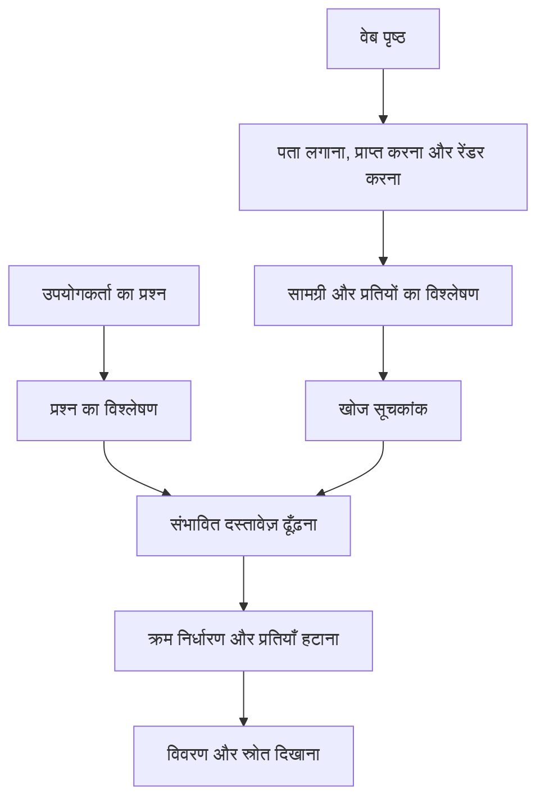
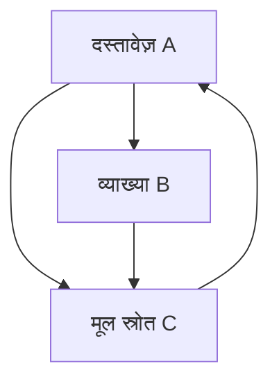
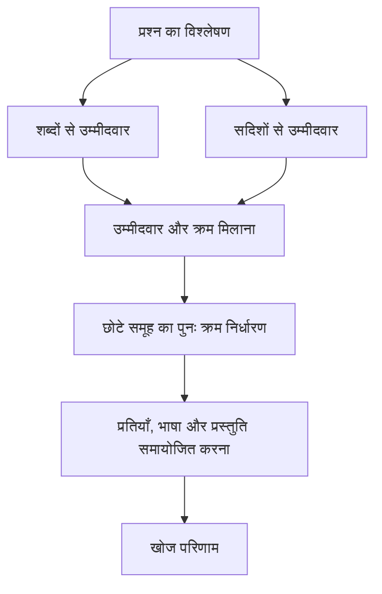

## 1. क्या हर खोज के समय पूरा वेब पढ़ा जाता है?

खोज बॉक्स में कुछ शब्द लिखते ही परिणाम सामने आ जाते हैं। इसका अर्थ यह नहीं कि खोज इंजन उसी क्षण इंटरनेट के सभी पृष्ठ पढ़ना शुरू करता है। वह पहले से जानकारी जुटाकर उसे खोजने योग्य रूप में व्यवस्थित कर चुका होता है। हमारा प्रश्न इस तैयारी का उपयोग करता है।

पुस्तकालय की कल्पना करें। खगोल विज्ञान की शुरुआती पुस्तक माँगने पर पुस्तकालयाध्यक्ष प्रत्येक पुस्तक शुरू से नहीं पढ़ता। शीर्षक, लेखक, विषय और स्थान की सूची संभावित पुस्तकों तक पहुँचाती है। खोज इंजन में ऐसी तैयारी का मुख्य साधन सूचकांक, यानी इंडेक्स, है।

लेकिन वेब पुस्तकालय की तुलना में अधिक अस्थिर है। नए पृष्ठ बनते हैं, पुराने बदलते या मिटते हैं और एक ही सामग्री कई पतों पर मिल सकती है। किसी लेखक का अपने पृष्ठ के बारे में दावा भी हमेशा सही नहीं होता। इसलिए केवल सूची बनाना पर्याप्त नहीं: बदलाव पहचानना, प्रतियाँ सँभालना और प्रश्न के अनुकूल सामग्री चुनना भी आवश्यक है।

इस प्रक्रिया के तीन बड़े चरण हैं: **जानकारी जुटाना, सूचकांक बनाना और प्रश्न के लिए परिणाम चुनना**। Google की सार्वजनिक व्याख्या भी इन चरणों में अंतर करती है। यहाँ दिए गए गणित और संरचनाएँ सूचना पुनर्प्राप्ति के सामान्य सिद्धांत समझाते हैं; वे किसी कंपनी का निजी रैंकिंग सूत्र नहीं हैं। [Google: खोज की प्रक्रिया][google-overview]

## 2. खोज तकनीक की आवश्यकता कैसे पैदा हुई?

सूचना खोजने की समस्या वेब से पुरानी है। पुस्तकालयों और दस्तावेज़ संग्रहों को भी उपयुक्त सामग्री तक पहुँचने के तरीके चाहिए थे। छोटा संग्रह मनुष्य द्वारा बनाई गई विषय-सूची से सँभल सकता है, लेकिन सामग्री बढ़ने पर वर्गीकरण बनाए रखना और सही श्रेणी चुनना कठिन होता जाता है।

1990 में आया Archie, FTP संग्रहों में फ़ाइलों के नाम खोजता था। वह आधुनिक अर्थ में वेब पृष्ठों का पूरा पाठ खोजने वाला इंजन नहीं था। McGill विश्वविद्यालय में उसका विकास इस आवश्यकता से जुड़ा था कि नेटवर्क पर उपलब्ध संसाधनों को एक जगह से ढूँढ़ा जा सके। [McGill: Archie का इतिहास][archie]

Tim Berners-Lee ने 1989 में CERN में वेब का प्रस्ताव रखा। 1993 में CERN ने मूल वेब सॉफ़्टवेयर को सार्वजनिक डोमेन में उपलब्ध कराया। आपस में जुड़े दस्तावेज़ बढ़े तो नाम खोजना पर्याप्त नहीं रहा; सामग्री और दस्तावेज़ों के बीच संबंध भी महत्वपूर्ण हो गए। [CERN: वेब का जन्म][web-history]

1998 का Google शोधपत्र पृष्ठ की सामग्री के साथ लिंक संरचना और लिंक के पाठ का उपयोग बताता है। सफल खोज केवल एक प्रभावशाली अंक से नहीं बनी। क्रॉलिंग, भंडारण, संपीड़न, सूचकांक और क्रम निर्धारण को बढ़ते पैमाने पर साथ काम करना पड़ा। [Brin और Page का शोधपत्र][google-paper]

इस इतिहास को केवल «पहले शब्द, अब AI» कहना भ्रामक होगा। सटीक शब्द, सांख्यिकी, दस्तावेज़ संबंध और भाषा मॉडल अलग-अलग कमियाँ दूर करते हैं। नए मॉडल आने पर भी किसी उत्पाद का ठीक मॉडल नंबर खोजना और जानकारी ताज़ा रखना आवश्यक रहता है।

## 3. क्रॉलर किन पतों पर जाता है?

क्रॉलर वेब पृष्ठ प्राप्त करता है, पर सभी URL की कोई पूर्ण केंद्रीय सूची उपलब्ध नहीं होती। वह परिचित पृष्ठों के लिंक और वेबसाइटों के साइटमैप से नए पते खोजता है।

पता मिलते ही पृष्ठ प्राप्त करना आवश्यक नहीं। एक कतार तय करती है कि किस पृष्ठ को कब दोबारा देखना है, एक सर्वर पर अनुरोधों के बीच कितना अंतर रखना है और विफलता का क्या करना है। समाचार मुखपृष्ठ को फिर पढ़ने का लाभ दस वर्ष पुराने स्थिर दस्तावेज़ से अलग है। सीमित नेटवर्क और गणना संसाधनों का समझदारी से बँटवारा करना पड़ता है।

स्रोत सर्वर को अत्यधिक अनुरोधों से बाधित करना भी उचित नहीं। यदि तेज़ संग्रह के कारण वेबसाइट ही जवाब देना बंद कर दे, तो उद्देश्य विफल हो जाएगा। धीमी प्रतिक्रियाओं और लगातार त्रुटियों के अनुसार क्रॉलर को अपनी गति बदलनी चाहिए।

कैलेंडर और फ़िल्टरों के संयोजन लगभग अनंत URL बना सकते हैं। हर लिंक के पीछे बिना सोचे चलने पर काम कभी समाप्त नहीं होगा। URL के पैटर्न, दोहराव और सामग्री में वास्तविक परिवर्तन पहचानना बेकार चक्रों से बचाता है।

साइटमैप खोज में सहायता देता है; वह इंडेक्स में प्रवेश या ऊँची रैंक की गारंटी नहीं है। किसी URL को जानना, उसे प्राप्त करना और उसकी सामग्री सूचकांक में रखना अलग अवस्थाएँ हैं। [Google: साइटमैप][sitemaps]

## 4. robots.txt, noindex और प्रमाणीकरण अलग काम करते हैं

`robots.txt` सहयोग करने वाले क्रॉलरों को बताता है कि किन रास्तों से सामग्री प्राप्त नहीं करनी चाहिए। RFC 9309 इन नियमों को पहुँच की अनुमति से स्पष्ट रूप से अलग करता है। यह निजी जानकारी पर लगा ताला नहीं है। [RFC 9309][robots]

`noindex` इसे मानने वाले खोज इंजन को पृष्ठ सूचकांक में न रखने का निर्देश देता है। पृष्ठ के भीतर यह निर्देश पढ़ने के लिए Google को पृष्ठ तक पहुँच चाहिए। प्राप्त करना रोककर यह उम्मीद करना कि इंजन उसी पृष्ठ का `noindex` पढ़ लेगा, विरोधाभासी है। अवरुद्ध URL का पता बाहरी लिंक से भी चल सकता है। [Google: noindex का उपयोग][noindex]

प्रमाणीकरण और पहुँच नियंत्रण यह तय करते हैं कि सामग्री कौन प्राप्त कर सकता है। तीनों व्यवस्थाएँ संबंधित लग सकती हैं, लेकिन उनकी सीमाएँ अलग हैं।

| व्यवस्था | मुख्य नियंत्रण | अपने आप क्या सुनिश्चित नहीं करती |
|---|---|---|
| robots.txt | सहयोगी क्रॉलर द्वारा सामग्री प्राप्त करना | गोपनीयता या URL का पूरी तरह गायब होना |
| noindex | समर्थक खोज सूचकांक में शामिल होना | सामग्री पढ़े जाने की रोकथाम |
| प्रमाणीकरण और पहुँच नियंत्रण | सामग्री प्राप्त करने की अनुमति | प्रकाशन के बाद बनी हर प्रति का मिटना |

खोज में दिखाई न देना और पढ़ा न जा सकना समान नहीं हैं। कंपनी के आंतरिक दस्तावेज़ों की खोज बनाते समय भी यह अंतर महत्वपूर्ण है।

## 5. डाउनलोड किया गया HTML और दिखाई देने वाला पृष्ठ अलग हो सकते हैं

कुछ सर्वर लेख सहित HTML लौटाते हैं। दूसरे केवल ढाँचा देते हैं, जिसमें JavaScript बाद में पाठ भरता है। दूसरे मामले में HTML प्राप्त कर लेना आवश्यक नहीं कि पाठक को दिखने वाली सामग्री बता दे। ब्राउज़र जैसी रेंडरिंग की आवश्यकता हो सकती है।

Google क्रॉलिंग, रेंडरिंग और इंडेक्सिंग का उल्लेख करता है। रेंडरिंग समर्थित होने का अर्थ यह नहीं कि हर पृष्ठ हमेशा एक जैसा काम करेगा। अवरुद्ध संसाधन, विफल स्क्रिप्ट और केवल क्लिक के बाद दिखने वाला पाठ समझी जाने वाली सामग्री को प्रभावित कर सकते हैं। [Google: JavaScript और खोज][javascript]

इसके बाद दस्तावेज़ का विश्लेषण करना होता है। मुख्य लेख, नेविगेशन, विज्ञापन, टैग, भाषा और अक्षर एन्कोडिंग की भूमिकाएँ अलग हैं। पूरे पृष्ठ को बिना भेदभाव एक लंबी स्ट्रिंग मानने पर बार-बार आने वाला मेनू वास्तविक विषय से अधिक प्रभाव डाल सकता है। शीर्षक और मुख्य पाठ अलग संकेत देते हैं।

छपाई के लिए बने URL या ट्रैकिंग पैरामीटर वाले पतों पर एक ही सामग्री हो सकती है। प्रतियों को समूहित करके प्रतिनिधि URL चुनना परिणामों को एक ही लेख से भरने से बचाता है। `rel="canonical"` पसंदीदा पता सुझाता है। Google के लिए यह चयन में सहायक संकेत है, बिना शर्त लागू होने वाला आदेश नहीं। [Google: कैनॉनिकल URL][canonical]

## 6. भाषा को खोजने योग्य इकाइयों में बदलना

कंप्यूटर को नियम चाहिए कि वाक्य के कौन-से हिस्से खोज के पद माने जाएँ। पाठ को इकाइयों में बाँटना टोकनाइज़ेशन कहलाता है। फिर सामान्यीकरण द्वारा बड़े-छोटे अक्षरों, अक्षर रूपों या शब्दों के व्याकरणिक बदलावों को उपयुक्त सीमा तक मिलाया जा सकता है।

जापानी में सामान्यतः शब्दों के बीच रिक्त स्थान नहीं होते। इसलिए साइकिल मरम्मत की दुकान वाला वाक्य केवल रिक्त स्थानों पर काटना पर्याप्त नहीं होगा। रूपात्मक विश्लेषण शब्द पहचान सकता है; अक्षरों के छोटे समूह, यानी एन-ग्राम, दूसरा तरीका हैं। दस्तावेज़ और प्रश्न पर संगत प्रक्रिया आवश्यक है, वरना समान अभिव्यक्तियाँ भी नहीं मिलेंगी। Kuromoji जापानी के लिए विशेष विश्लेषण का उदाहरण है। [टोकनाइज़ेशन][tokenization], [Elastic: जापानी विश्लेषण][kuromoji]

हर अंतर मिटाना सही नहीं। C और C++ से विरामचिह्न हटा देना, उत्पाद संख्या बदलना या रासायनिक पहचानकर्ता को सरल करना जरूरी अंतर नष्ट कर सकता है। संक्षिप्त नाम का विस्तार अधिक परिणाम ला सकता है, लेकिन दूसरा अर्थ भी जोड़ सकता है।

मूल पाठ को उसके खोज-योग्य रूप से अलग रखना उपयोगी है। मशीन की सुविधा के लिए पाठक को दिखने वाला लेख बदलना जरूरी नहीं। भाषा प्रसंस्करण वास्तव में यह तय करता है कि प्रणाली किन रूपों को समान मानेगी।

## 7. उल्टा सूचकांक दस्तावेज़ और शब्द का संबंध उलट देता है

दस्तावेज़ पढ़कर पता चलता है कि उसमें कौन-से शब्द हैं। खोज को उलटा प्रश्न चाहिए: किसी शब्द वाले दस्तावेज़ कौन-से हैं? उल्टा सूचकांक यही संबंध रखता है।

उदाहरण के लिए पहले से अलग किए गए पदों का छोटा संग्रह लें।

| दस्तावेज़ पहचान | प्रमुख पद |
|---|---|
| D1 | साइकिल, मरम्मत, औज़ार |
| D2 | साइकिल, आवागमन, सुरक्षा |
| D3 | घड़ी, मरम्मत, औज़ार |
| D4 | साइकिल, मरम्मत, कीमत |

साइकिल की सूची D1, D2, D4 है और मरम्मत की D1, D3, D4। दोनों का साझा भाग D1 और D4 है। दो सूचियाँ मिलाकर उम्मीदवार मिल गए; सभी दस्तावेज़ दोबारा नहीं पढ़ने पड़े। [उल्टा सूचकांक][inverted]

व्यावहारिक प्रविष्टियों में दस्तावेज़ पहचान के साथ शब्द की आवृत्ति और स्थान भी हो सकते हैं। क्रमबद्ध पहचान संख्याओं के अंतर संपीड़ित करके रखने से पढ़े जाने वाले डेटा की मात्रा घटती है। गति केवल अधिक प्रोसेसर जोड़ने से नहीं, अनावश्यक काम बचाने से भी आती है।

हर प्रश्न में सभी पदों का होना अनिवार्य नहीं किया जाता। वैकल्पिक अभिव्यक्तियाँ भी उम्मीदवार दे सकती हैं। फिर भी शब्द से दस्तावेज़ों तक जल्दी पहुँचना पूर्ण-पाठ खोज की बुनियाद है।

## 8. शब्दों का स्थान क्यों मायने रखता है?

«दिल्ली से मुंबई» और «मुंबई से दिल्ली» में शहर वही हैं, यात्रा उलटी है। इसी तरह साथ आने वाला «मशीन लर्निंग» किसी लंबे दस्तावेज़ में बहुत दूर-दूर आए मशीन और लर्निंग से अलग संकेत देता है।

स्थान-सहित सूचकांक बताता है कि शब्द कहाँ आया। एक शब्द के तुरंत बाद दूसरा होने की जाँच वाक्यांश खोज में काम आती है। पास-पास आने वाले पद प्रासंगिकता का अधिक मजबूत संकेत भी दे सकते हैं। [स्थान-सहित सूचकांक][positions]

लेकिन स्थान पूरी समझ नहीं देता। नकार, शर्त, सर्वनाम और उद्धरण समझने के लिए निकटता से अधिक चाहिए। सूचकांक कुशलता से उम्मीदवार ढूँढ़ता है; वह कथन की सत्यता सिद्ध नहीं करता।

इसीलिए खोज के शब्द रखने वाला पृष्ठ भी उपयोगकर्ता की जरूरत पूरी करने में विफल हो सकता है। शब्दों का मेल आवश्यकता के बारे में प्रमाण है, स्वयं आवश्यकता नहीं।

## 9. सामान्य और दुर्लभ शब्द अलग सूचना देते हैं

हज़ार दस्तावेज़ों को समान मानकर लौटा देना बहुत उपयोगी नहीं। कुछ ही दस्तावेज़ों में मिलने वाला पद अक्सर विषय पहचानने में लगभग हर जगह मौजूद शब्द से अधिक मदद करता है।

व्युत्क्रम दस्तावेज़ आवृत्ति, IDF, इस विचार को संख्या में बदलती है। $N$ दस्तावेज़ों की संख्या और $df(t)$ पद $t$ वाले दस्तावेज़ों की संख्या हो। यहाँ सकारात्मक रहने वाला यह रूप लेते हैं:

$$
\operatorname{IDF}(t)=\ln\left(1+\frac{N-df(t)+0.5}{df(t)+0.5}\right)
$$

1,000 दस्तावेज़ों में 10 में आने वाले पद का IDF लगभग 4.56 है; 500 में आने वाले का लगभग 0.693। दुर्लभ पद का मेल अधिक विशिष्ट सूचना देता है। यह रूप Lucene के BM25 कार्यान्वयन में दर्ज है। [Apache Lucene: BM25Similarity][lucene]

दुर्लभता सत्य या गुणवत्ता का प्रमाण नहीं है। वर्तनी की गलती भी दुर्लभ हो सकती है और अप्रासंगिक पृष्ठ असामान्य शब्द भर सकता है। IDF संग्रह का सांख्यिकीय गुण मापता है, विश्वसनीयता नहीं।

## 10. BM25 में दोहराव का लाभ धीरे-धीरे घटता है

दस्तावेज़ के भीतर पद की आवृत्ति भी संकेत है। लेकिन सौ बार लिखा शब्द एक बार से सौ गुना अच्छा माना जाए तो अनावश्यक शब्द भरने को प्रोत्साहन मिलेगा। लंबे दस्तावेज़ में अधिक शब्द होते हैं, जिससे छोटा और सटीक उत्तर पिछड़ सकता है।

BM25 बार-बार आने से मिलने वाला अतिरिक्त लाभ घटाता है और दस्तावेज़ की लंबाई समायोजित करता है। छोटे प्रश्न के लिए इसका एक रूप है:

$$
S(d,q)=\sum_{t\in q}\operatorname{IDF}(t)
\frac{f(t,d)(k_1+1)}{f(t,d)+k_1\left(1-b+b\frac{|d|}{\overline L}\right)}
$$

$f(t,d)$ पद की आवृत्ति, $|d|$ दस्तावेज़ की लंबाई और $\overline L$ औसत लंबाई है। $k_1$ आवृत्ति से मिलने वाले लाभ की संतृप्ति और $b$ लंबाई सामान्यीकरण नियंत्रित करता है। कार्यान्वयनों में IDF और स्थिर गुणकों के रूप अलग हो सकते हैं। [BM25 की व्याख्या][bm25]

औसत लंबाई वाले दस्तावेज़ और $k_1=1.2$ के लिए, IDF को छोड़कर आवृत्ति वाला गुणक इस प्रकार है:

| पद की आवृत्ति | आवृत्ति गुणक |
|---|---:|
| 1 | 1.000 |
| 2 | 1.375 |
| 5 | 1.774 |
| 10 | 1.964 |
| बहुत अधिक | 2.2 के निकट |

एक से दो बार होने का लाभ नौ से दस बार होने से अधिक है। दोहराव संकेत बना रहता है, लेकिन यह गुणक असीमित नहीं बढ़ता। इस सूत्र में $b=0$ लंबाई सामान्यीकरण हटाता है; बड़ा $b$ उसका प्रभाव बढ़ाता है।

BM25 अंक सामान्यतः पृष्ठ के सही होने की प्रायिकता नहीं है। यह किसी विशेष सूचकांक में किसी प्रश्न के उम्मीदवारों की तुलना करता है। अलग प्रश्नों या संग्रहों के अंकों को गुणवत्ता का निरपेक्ष पैमाना मानना उचित नहीं।

## 11. PageRank केवल लोकप्रियता की गिनती नहीं है

एक विषय पर अनेक पृष्ठ हों तो पाठ अकेला पर्याप्त अंतर नहीं बता सकता। लिंक दूसरा संकेत देते हैं: किसी ने उस पृष्ठ को संदर्भ के योग्य माना है।

हर लिंक को समान मत मानें तो कोई भी नए पृष्ठ बनाकर मत तैयार कर सकता है। PageRank स्रोत पृष्ठ के महत्व को देखता है और उसका भार बाहर जाने वाले लिंक में बाँटता है। महत्वपूर्ण पृष्ठों से जुड़ा पृष्ठ स्वयं महत्वपूर्ण हो सकता है। इस प्रकार गणना परस्पर निर्भर है।

नीचे सामान्यीकृत शिक्षण उदाहरण है। $N$ पृष्ठों की संख्या, $L(u)$ पृष्ठ $u$ से निकलने वाले लिंक की संख्या और $\alpha$ लिंक पर चलने की प्रायिकता है। सरलता के लिए हर पृष्ठ में कम-से-कम एक बाहरी लिंक मानते हैं।

$$
PR(v)=\frac{1-\alpha}{N}
+\alpha\sum_{u\to v}\frac{PR(u)}{L(u)}
$$

एक काल्पनिक पाठक $\alpha$ प्रायिकता से लिंक चुनता है और अन्यथा किसी भी पृष्ठ पर यादृच्छिक रूप से पहुँचता है। गणना दोहराने पर दीर्घकाल में प्रत्येक पृष्ठ पर रहने का वितरण मिलता है। बिना बाहरी लिंक वाले पृष्ठों के लिए अतिरिक्त नियम चाहिए, जैसे उनका भार सभी पृष्ठों में बाँटना।

$\alpha=0.85$ पर इस तीन-पृष्ठ उदाहरण के स्थिर मान लगभग A = 0.388, B = 0.215 और C = 0.397 हैं। C को A और B दोनों से संदर्भ मिलता है, जबकि B को A का कुछ भार मिलता है। केवल लिंक की संख्या नहीं, उनका स्रोत और भार का बँटवारा भी मायने रखता है।

यह PageRank समझाने का मॉडल है, आधुनिक खोज सेवा की पूरी रैंकिंग प्रणाली नहीं। लिंक का माप प्रश्न का अर्थ या तथ्य की सत्यता सीधे तय नहीं करता। प्रसिद्ध पुराना पृष्ठ आज की ट्रेन समय-सारणी का सही स्रोत जरूरी नहीं। [मूल शोधपत्र][google-paper], [Google: रैंकिंग प्रणालियाँ][ranking]

## 12. शब्द मिलाने से आगे, आशय समझना

गर्म हो रहे लैपटॉप की खोज करने वाले को शायद ठंडा करने या खराबी पहचानने की सलाह चाहिए, ऊष्मागतिकी की परिभाषा नहीं। «हार» आभूषण भी हो सकता है और पराजय भी। शब्द के आसपास का संदर्भ महत्वपूर्ण है।

वर्तनी सुधार, पर्याय और नाम या उत्पाद पहचानने से उपयोगी उम्मीदवार बढ़ सकते हैं। लेकिन बिना जरूरत सुधार किसी विशिष्ट मॉडल नंबर या असामान्य नाम की खोज बाधित कर सकता है। मूल प्रश्न सुरक्षित रखना, बदलाव बताना और सटीक मिलान का विकल्प देना उपयोगकर्ता के आशय की रक्षा करता है। [वर्तनी सुधार][spelling]

अर्थ-आधारित खोज प्रश्न और दस्तावेज़ को संख्याओं के समूह, अर्थात सदिश, में दर्शा सकती है। «बैटरी जल्दी खत्म होती है» और «बैटरी का चलने का समय बढ़ाना» समान शब्द न होने पर भी जुड़े होने चाहिए।

कोसाइन समानता सदिशों $\mathbf q$ और $\mathbf d$ की दिशाओं की निकटता मापती है:

$$
\operatorname{sim}(\mathbf q,\mathbf d)=
\frac{\mathbf q\cdot\mathbf d}{\|\mathbf q\|\|\mathbf d\|}
$$

यह निकटता मॉडल द्वारा सीखे गए निरूपण की है। «बैटरी बदली जा सकती है» और «बैटरी नहीं बदली जा सकती» में अधिकांश शब्द समान हैं, निष्कर्ष विपरीत है। पास के सदिश सही उत्तर की गारंटी नहीं। मॉडल, पाठ को टुकड़ों में बाँटने का आकार और मूल्यांकन के प्रश्न गुणवत्ता प्रभावित करते हैं। [Elastic: सदिश खोज][vector]

## 13. सबसे महँगा मॉडल हर पृष्ठ पर क्यों न लगाएँ?

गहराई से अर्थ जाँचने वाले मॉडल मदद कर सकते हैं, लेकिन हर प्रश्न पर हर दस्तावेज़ का विस्तृत मूल्यांकन महँगा होगा। उपयोगी संरचना पहले तेज़ी से विस्तृत उम्मीदवार समूह लाती है, फिर छोटे समूह को अधिक सावधानी से क्रम देती है।

शब्द-आधारित खोज या अनुमानित निकटतम पड़ोसी खोज पहले उम्मीदवार चुन सकती है। उसके बाद अधिक महँगा मॉडल उनका पुनः क्रम निर्धारण करता है। अनुमानित खोज गति और स्मृति बचाती है, लेकिन कुछ वास्तविक निकटतम दस्तावेज़ छूट सकते हैं। जो उम्मीदवार पहले चरण में आया ही नहीं, उसे बाद का मॉडल वापस नहीं ला सकता।

नाम और पहचानकर्ताओं के लिए सटीक शब्द उपयोगी हैं; अलग शब्दों में व्यक्त समान विचार के लिए अर्थ-आधारित खोज। मिश्रित खोज दोनों जोड़ती है। उनके अंकों के पैमाने अलग होने से सीधे योग करने पर एक तरीका हावी हो सकता है।

पारस्परिक रैंक संलयन, RRF, इसका एक विकल्प है। सूची $i$ में दस्तावेज़ $d$ की रैंक $r_i(d)$ हो, तो केवल उन सूचियों पर योग लेते हैं जिनमें वह मौजूद है:

$$
\operatorname{RRF}(d)=\sum_i\frac{1}{k+r_i(d)}
$$

सकारात्मक स्थिरांक $k$ तय करता है कि ऊपरी स्थानों को कितना अतिरिक्त प्रभाव मिले। यह सूचियाँ जोड़ने का नियम है, प्रायिकता नहीं। जिस सूची में दस्तावेज़ नहीं है, उसका योगदान शून्य है। Elasticsearch में शब्द और सदिश परिणामों को RRF से मिलाने का कार्यान्वयन दर्ज है। [Elastic: RRF][rrf]

यह समझाने के लिए संरचना है, सभी व्यावसायिक इंजनों के समान चरण होने का दावा नहीं। मुख्य बात व्यापक चयन और बारीक क्रम निर्धारण को अलग जिम्मेदारियाँ देना है।

## 14. अंक के अनुसार क्रम देना अंतिम काम नहीं है

यदि एक वेबसाइट के लगभग समान पृष्ठ सभी शुरुआती स्थान भर दें, तो पाठक के पास तुलना के लिए बहुत कम विकल्प होंगे। इसलिए अलग-अलग अंकों के अलावा प्रतियाँ घटाना, विविध दृष्टिकोण देना और भाषा तथा स्थान देखना भी उपयोगी हो सकता है।

नज़दीकी साइकिल मरम्मत में स्थान महत्वपूर्ण है; साइकिल के इतिहास में इसकी भूमिका अलग है। ताज़गी भी प्रश्न पर निर्भर है। आपदा के समय परिवहन सूचना वर्तमान होनी चाहिए, जबकि गणितीय प्रमाण केवल नई प्रकाशन तिथि से बेहतर नहीं हो जाता।

शीर्षक और छोटा अंश परिणाम खोलने का निर्णय लेने में मदद करते हैं। लेकिन प्रश्न के अनुसार चुना गया अंश दूसरी जगह लिखी शर्त छोड़ सकता है। उसे पूरे स्रोत का अंतिम निष्कर्ष नहीं मानना चाहिए।

विज्ञापन और सामान्य खोज परिणाम भी अलग हैं। भुगतान वाला स्थान और स्वाभाविक रैंक अलग व्यवस्थाओं से आते हैं। Google बताता है कि भुगतान से स्वाभाविक परिणामों में ऊँचा स्थान या अधिक बार क्रॉलिंग नहीं खरीदी जा सकती। [Google: खोज की प्रक्रिया][google-overview]

## 15. बहुत बड़े सूचकांक में तेज़ खोज

एक मशीन की भंडारण क्षमता, अनुरोध सँभालने की गति और विफलता सहने की सीमा है। वितरित प्रणाली सूचकांक को हिस्सों में बाँटती है, अलग मशीनों पर खोजती है और परिणाम मिलाती है। इन हिस्सों को अक्सर शार्ड कहा जाता है।

दस्तावेज़-आधारित विभाजन में प्रश्न प्रत्येक शार्ड को भेजा जाता है। हर शार्ड अच्छे उम्मीदवार लौटाता है और समन्वयक समग्र क्रम बनाता है। लेकिन स्थानीय दस्तावेज़ आवृत्तियाँ अलग हो सकती हैं। इसलिए अंकों की तुलना कैसे होगी, यह भी डिजाइन का प्रश्न है। स्थानीय और वैश्विक आँकड़े गति के साथ गुणवत्ता को प्रभावित करते हैं। [वितरित सूचकांक][distributed]

विभाजन और प्रतिकृति अलग हैं। विभाजन डेटा या काम बाँटता है; प्रतिकृति कई प्रतियाँ रखती है। प्रतियाँ विफलता और भार सँभालने में मदद करती हैं, पर अद्यतन सभी प्रतियों तक पहुँचाने की समस्या भी लाती हैं।

कई मशीनों के साथ सबसे धीमी प्रतिक्रिया कुल समय बढ़ा सकती है। औसत पर्याप्त नहीं: बहुत देर से उत्तर पाने वाले उपयोगकर्ताओं का अनुभव भी देखना चाहिए। सभी परिणामों की प्रतीक्षा, समय-सीमा और दूसरी प्रति से प्रयास के बीच पूर्णता तथा गति का संतुलन है।

लोकप्रिय परिणाम या मध्यवर्ती गणना कैश में रखना काम बचाता है। लेकिन कल का उत्तर बार-बार देने पर आज का बदलाव या हटाया गया दस्तावेज़ छिप सकता है। गति के उपायों के साथ ताज़गी की व्यवस्था भी चाहिए।

## 16. जोड़ना, बदलना और हटाना सूचकांक तक पहुँचना चाहिए

वेब पृष्ठ बदलने पर बाहरी खोज सूचकांक तुरंत बदलना जरूरी नहीं। प्राप्त करना, विश्लेषण, अद्यतन और परिणाम सेवा में समय लगता है। खोज परिणाम देखी और संसाधित की गई जानकारी दिखाते हैं, हर क्षण का संपूर्ण वेब नहीं।

अपनी खोज प्रणाली बनाते समय अद्यतन और विलोपन के रास्ते शुरू से बनाने चाहिए। हर आयात पर नया दस्तावेज़ बने तो प्रतियाँ बढ़ेंगी। स्थिर पहचानकर्ता सही प्रविष्टि बदलने देते हैं। हटाने का संदेश प्रश्नों के लिए उपयोग होने वाली प्रतियों तक भी पहुँचना चाहिए।

आंतरिक खोज में अनुमति बदलना भी अद्यतन है। आज गोपनीय किए गए दस्तावेज़ का शीर्षक या अंश कल के कैश से नहीं रिसना चाहिए। परिणाम बनाने से पहले पहुँच जाँचनी चाहिए और कैश को उपयोगकर्ता की अनुमति का सम्मान करना चाहिए।

पूरा सूचकांक फिर बनाते समय नया संस्करण पूरा और सत्यापित होने तक पुराना संस्करण सेवा दे सकता है। इसके बाद नियंत्रित बदलाव किया जाता है। उपयोगकर्ताओं को आधे बने सूचकांक में खोजने की जरूरत नहीं होनी चाहिए। ऐसी संचालन संबंधी सावधानियाँ विश्वसनीयता की बुनियाद हैं।

## 17. स्पैम से बचाव खोज का ही हिस्सा है

क्रम से ट्रैफ़िक और आय प्रभावित होते हैं, इसलिए उसे प्रभावित करने का प्रलोभन रहता है। अत्यधिक शब्द दोहराव, कृत्रिम लिंक और बड़ी मात्रा में कम-मूल्य वाले पृष्ठ उदाहरण हैं। इंजन यह मानकर नहीं चल सकता कि हर दस्तावेज़ सद्भावना से बनाया गया है।

Google की स्पैम नीतियाँ शब्द भरने और लिंक स्पैम जैसी गतिविधियाँ बताती हैं। प्रासंगिकता केवल मिलते शब्द ढूँढ़ना नहीं; मापों के दुरुपयोग के बीच उपयोगी सूचना बचाए रखना भी है। [Google: स्पैम नीतियाँ][spam]

बहुत लिंक सत्य साबित नहीं करते, लंबाई गहराई नहीं और नई तारीख विश्वसनीयता नहीं। कोई अप्रत्यक्ष संकेत लक्ष्य बन जाए तो लोग वास्तविक उपयोगिता सुधारे बिना उस संकेत को बढ़ा सकते हैं। अनेक संकेत, निरंतर मूल्यांकन और गलत आरोपित मामलों की जाँच आवश्यक हैं।

अनजान छोटी वेबसाइटों को स्वतः खारिज करना दूसरी समस्या पैदा करेगा। नया विशेषज्ञ स्रोत कम लिंक वाला हो सकता है। स्थापित प्रमाण का उपयोग करते हुए नई उपयोगी सामग्री खोजने की गुंजाइश रखना जरूरी है।

## 18. अच्छी खोज को कैसे मापें?

मूल्यांकन के लिए वास्तविक जरूरतों का प्रतिनिधित्व करने वाले प्रश्न और यह निर्णय चाहिए कि कौन-से दस्तावेज़ उपयोगी हैं। केवल आकर्षक उदाहरण पर्याप्त नहीं। यदि $A$ लौटे दस्तावेज़ों का समूह और $R$ प्रासंगिक दस्तावेज़ों का समूह है, तो परिशुद्धता बताती है कि लौटे परिणामों में कितना हिस्सा उपयोगी था:

$$
\operatorname{Precision}=\frac{|A\cap R|}{|A|}
$$

रिकॉल बताता है कि सभी उपयोगी दस्तावेज़ों में से कितने मिले:

$$
\operatorname{Recall}=\frac{|A\cap R|}{|R|}
$$

मान लें आठ दस्तावेज़ उपयोगी हैं। प्रणाली पाँच लौटाती है, जिनमें चार उपयोगी हैं। परिशुद्धता 4/5 = 80% और रिकॉल 4/8 = 50% है। लौटे परिणाम अच्छे होने पर भी आधी उपयोगी सामग्री छूट गई। [बिना क्रम वाले परिणामों का मूल्यांकन][evaluation]

कठोर शर्तें गलत परिणाम घटा सकती हैं, लेकिन उपयोगी परिणाम भी हटा सकती हैं। विस्तार से रिकॉल बढ़ सकता है और शोर भी। यह हमेशा निश्चित अनुपात में होने वाला समझौता नहीं; बेहतर विश्लेषण दोनों सुधार सकता है।

| जाँचने योग्य बात | उपयोगी माप |
|---|---|
| लौटे परिणाम कितने उपयोगी हैं | परिशुद्धता |
| उपयोगी सामग्री कितनी छूटी | रिकॉल |
| शुरुआती परिणाम उपयोगी हैं या नहीं | पहले कुछ परिणामों की परिशुद्धता और क्रम-संवेदी माप |
| उत्तर जल्दी मिलता है या नहीं | मध्यिका और धीमी प्रतिक्रियाओं का समय |
| बदलाव और अनुमतियाँ लागू हैं या नहीं | अद्यतन विलंब, विलोपन और पहुँच जाँच |

क्रम भी महत्वपूर्ण है। सही दस्तावेज़ पहले या सौवें स्थान पर होना समान अनुभव नहीं। NDCG जैसे माप उपयोगिता की विभिन्न श्रेणियों और ऊपरी स्थानों को ध्यान में लेते हैं। [क्रमबद्ध परिणामों का मूल्यांकन][ranked-evaluation]

औसत अच्छी होने पर भी किसी भाषा, लंबे प्रश्न या दुर्लभ जरूरत पर विफलता छिप सकती है। इन समूहों को अलग देखना चाहिए। क्लिक भी अंतिम सत्य नहीं: ऊपर दिखने से क्लिक बढ़ सकता है, आकर्षक शीर्षक निराश कर सकता है और उपयोगी अंश बिना क्लिक के जरूरत पूरी कर सकता है।

## 19. उत्तर-निर्माण जोड़ने पर क्या बदलता है?

पुनर्प्राप्ति-संवर्धित उत्तर-निर्माण, RAG, में खोजे गए दस्तावेज़ भाषा मॉडल को दिए जाते हैं ताकि वह उत्तर बनाने में उनका उपयोग करे। Lewis और सहलेखकों का 2020 का शोध इस दृष्टिकोण का प्रसिद्ध उदाहरण है। [RAG शोधपत्र][rag]

खोज और उत्तर बनाना अलग चरण हैं। सही स्रोत न मिलने पर उत्तर का आधार गलत होगा। सही स्रोत मिलने पर भी मॉडल कोई शर्त छोड़ सकता है या अलग संदर्भों के कथनों को मिला सकता है। इसलिए अच्छे खोज परिणाम अपने आप सही उत्तर सुनिश्चित नहीं करते।

संदर्भ लिंक दिखना भी पर्याप्त प्रमाण नहीं। जाँचना चाहिए कि स्रोत वास्तव में कथन का समर्थन करता है या नहीं, उसकी तारीख और लागू क्षेत्र क्या है, और दूसरे स्रोत विरोध तो नहीं करते। खोज की चूक, पुरानी जानकारी और स्रोत के प्रति उत्तर की निष्ठा अलग-अलग परखी जानी चाहिए।

बाहरी दस्तावेज़ में लिखे निर्देशों को प्रणाली का प्रशासनिक आदेश नहीं मानना चाहिए। वह सामग्री प्रमाण हो सकती है, अधिकार का स्रोत नहीं। AI जोड़ने से सूचकांक और सत्यापन की जरूरत समाप्त नहीं होती; उत्तर तैयार करने की एक अतिरिक्त जिम्मेदारी जुड़ती है।

## 20. एक खोज को शुरू से अंत तक देखें

«साइकिल का पंक्चर ठीक करने के औज़ार» खोजने की कल्पना करें। प्रश्न आने से पहले इंजन पृष्ठ प्राप्त और विश्लेषित कर चुका है, शब्दों और शायद सदिशों का सूचकांक बना चुका है।

प्रश्न आने पर भाषा के अनुरूप पद निकाले जाते हैं। शब्द और अर्थ-आधारित खोज उम्मीदवार लाते हैं। क्रम निर्धारण उपयोगिता का आकलन करता है; प्रतियाँ घटती हैं, भाषा पर ध्यान दिया जाता है और शीर्षक तथा अंश बनते हैं। बड़े पैमाने पर कई मशीनें यह काम बाँटती हैं। पीछे से नए पृष्ठ, बदलाव और विलोपन आते रहते हैं।

वेबसाइट बनाने वाले के लिए व्यावहारिक निष्कर्ष स्पष्ट हैं: सामग्री प्राप्त करने योग्य हो, शीर्षक और लिंक सार्थक हों, प्रतियाँ तथा भाषा संस्करण व्यवस्थित हों और पाठक की जरूरत पूरी हो। यह खोज को समझने में मदद करता है; कोई गुप्त चाल या ऊँची रैंक की गारंटी नहीं है।

पाठक के लिए ऊँचा स्थान सत्य का प्रमाण नहीं। सटीक प्रश्न, स्रोत की तारीख, मूल दस्तावेज़ और वैकल्पिक जानकारी उपयोगी हैं। खोज इंजन सीमित समय में पहले देखी गई जानकारी व्यवस्थित करके संभावित उपयोगी सामग्री तक पहुँचाता है। इस ताकत और सीमा को साथ समझना ही उसका अच्छा उपयोग है।

### स्रोत और चित्रों के बारे में

सूत्र शिक्षण के मॉडल हैं, किसी व्यावसायिक सेवा के निजी अंक नहीं। आरेख समझाने के लिए सरल किए गए हैं। AI से बनाया गया आवरण संग्रह, सूचकांक और खोज का वैचारिक चित्र है, वास्तविक सेवा का स्क्रीनशॉट नहीं। ऊपर दिए गए संदर्भ मूल शोध, मानक और आधिकारिक दस्तावेज़ों तक ले जाते हैं।

[google-overview]: https://developers.google.com/search/docs/fundamentals/how-search-works
[archie]: https://200.mcgill.ca/history/creation-of-the-first-internet-search-engine/
[web-history]: https://home.cern/science/computing/the-birth-of-the-web/where-web-was-born/
[google-paper]: https://infolab.stanford.edu/~backrub/google.html
[sitemaps]: https://developers.google.com/search/docs/crawling-indexing/sitemaps/overview
[robots]: https://www.rfc-editor.org/rfc/rfc9309.html
[noindex]: https://developers.google.com/search/docs/crawling-indexing/block-indexing
[javascript]: https://developers.google.com/search/docs/crawling-indexing/javascript/javascript-seo-basics
[canonical]: https://developers.google.com/search/docs/crawling-indexing/consolidate-duplicate-urls
[tokenization]: https://nlp.stanford.edu/IR-book/html/htmledition/tokenization-1.html
[kuromoji]: https://www.elastic.co/docs/reference/elasticsearch/plugins/analysis-kuromoji
[inverted]: https://nlp.stanford.edu/IR-book/html/htmledition/an-example-information-retrieval-problem-1.html
[positions]: https://nlp.stanford.edu/IR-book/html/htmledition/positional-indexes-1.html
[lucene]: https://lucene.apache.org/core/9_9_1/core/org/apache/lucene/search/similarities/BM25Similarity.html
[bm25]: https://nlp.stanford.edu/IR-book/html/htmledition/okapi-bm25-a-non-binary-model-1.html
[ranking]: https://developers.google.com/search/docs/appearance/ranking-systems-guide
[spelling]: https://nlp.stanford.edu/IR-book/html/htmledition/implementing-spelling-correction-1.html
[vector]: https://www.elastic.co/docs/solutions/search/vector
[rrf]: https://www.elastic.co/docs/reference/elasticsearch/rest-apis/reciprocal-rank-fusion
[distributed]: https://nlp.stanford.edu/IR-book/html/htmledition/distributing-indexes-1.html
[spam]: https://developers.google.com/search/docs/essentials/spam-policies
[evaluation]: https://nlp.stanford.edu/IR-book/html/htmledition/evaluation-of-unranked-retrieval-sets-1.html
[ranked-evaluation]: https://nlp.stanford.edu/IR-book/html/htmledition/evaluation-of-ranked-retrieval-results-1.html
[rag]: https://arxiv.org/abs/2005.11401
