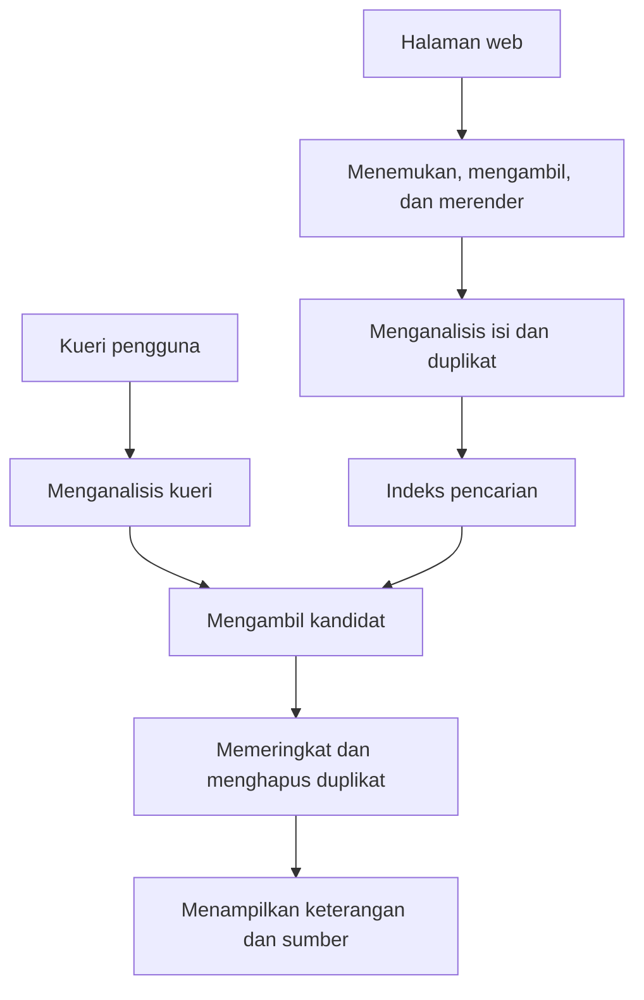
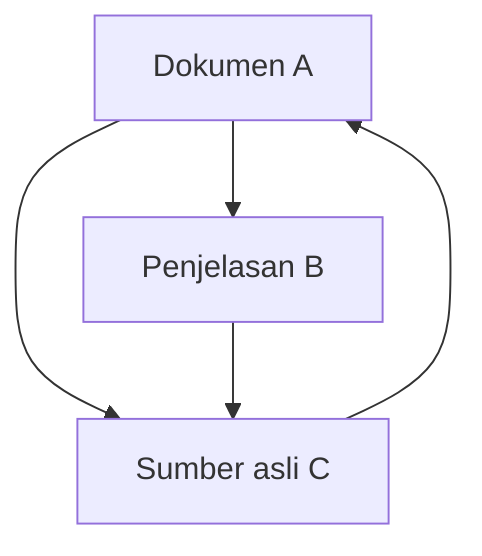
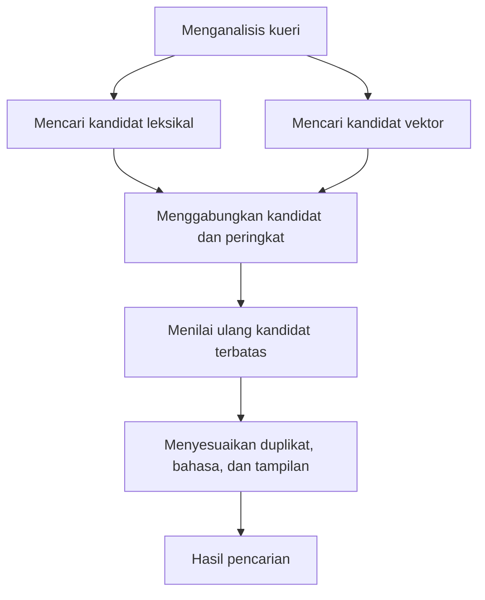

## 1. Apakah setiap pencarian membaca ulang seluruh web?

Ketik beberapa kata, lalu hasil segera muncul. Mesin pencari tidak baru mulai membaca semua situs saat itu. Informasi sudah dikumpulkan dan disusun terlebih dahulu untuk melayani pertanyaan.

Di perpustakaan, meminta buku pengantar astronomi tidak membuat pustakawan membaca seluruh koleksi. Katalog judul, penulis, topik, dan lokasi mempersempit pilihan. Kecepatan mesin pencari juga bergantung pada indeks yang disiapkan sebelumnya.

Namun, web lebih berubah-ubah. Halaman muncul, berubah, hilang, dan dapat memiliki beberapa alamat untuk isi yang sama. Deskripsi penulis belum tentu akurat. Sistem perlu mengikuti pembaruan, menangani duplikat, dan memilih sesuai pertanyaan.

Tahapan besarnya adalah **mengumpulkan informasi, membangun indeks, dan memilih hasil untuk kueri**. Google juga menjelaskan pembagian ini. Rumus dan arsitektur berikut membahas prinsip umum temu kembali informasi, bukan membongkar rumus peringkat rahasia layanan tertentu. [Google: cara kerja Penelusuran][google-overview]

## 2. Mengapa teknologi pencarian diperlukan?

Mencari informasi sudah menjadi masalah sebelum web. Katalog perpustakaan dan basis data dokumen membutuhkan metode pencarian. Direktori buatan manusia berguna untuk koleksi kecil, tetapi pemeliharaan dan pemilihan kategori menjadi sulit ketika koleksi tumbuh.

Archie, diperkenalkan pada 1990, mencari nama berkas pada arsip FTP. Itu bukan pencarian modern terhadap seluruh teks halaman. Pengembangannya di McGill University menunjukkan kebutuhan menemukan sumber daya tersebar melalui satu layanan. [McGill: sejarah Archie][archie]

Tim Berners-Lee mengusulkan web di CERN pada 1989. Pada 1993, CERN menempatkan perangkat lunak web dasarnya di domain publik. Ketika dokumen bertaut berkembang, nama saja tidak cukup: isi dan hubungan antardokumen perlu dianalisis. [CERN: kelahiran web][web-history]

Makalah Google tahun 1998 menjelaskan pencarian besar yang menggunakan struktur tautan dan teks jangkar selain isi halaman. Satu skor cerdas tidak cukup. Pengumpulan, penyimpanan, kompresi, pengindeksan, dan pemeringkatan harus tumbuh bersama. [Brin dan Page: anatomi mesin pencari][google-paper]

Sejarahnya bukan sekadar dahulu kata, sekarang AI. Kata tepat, hubungan dokumen, statistik, dan model bahasa mengatasi kelemahan berbeda. Metode baru tidak menghapus kebutuhan mencari nomor model dengan tepat atau memperbarui indeks.

## 3. Alamat mana yang dikunjungi perayap?

Perayap mengambil halaman, tetapi tidak ada daftar pusat yang memuat semua URL. Kandidat ditemukan dari tautan halaman yang dikenal dan peta situs yang disediakan pengelola.

Menemukan alamat tidak berarti langsung mengambilnya. Antrean mengelola prioritas kunjungan ulang, jarak antarpemintaan ke host yang sama, kegagalan, dan kemungkinan perubahan. Beranda berita dan dokumen tetap berumur sepuluh tahun memerlukan frekuensi berbeda. Lebar pita dan komputasi terbatas harus dialokasikan.

Server sumber juga tidak boleh dibebani berlebihan. Mempercepat pengambilan sampai sumbernya mati justru menggagalkan tujuan. Respons lambat dan kesalahan berulang perlu memengaruhi laju kunjungan.

Kalender serta kombinasi filter dapat menghasilkan alamat hampir tanpa batas. Mengikuti semua tautan secara membuta mungkin tidak selesai. Pola URL, duplikat, dan perubahan isi membantu menghindari putaran bernilai rendah.

Peta situs membantu penemuan, bukan menjamin pengindeksan atau posisi tinggi. Mengetahui URL, berhasil mengambilnya, dan memutuskan memasukkannya ke indeks adalah keadaan berbeda. [Google: peta situs][sitemaps]

## 4. robots.txt, noindex, dan autentikasi berbeda fungsi

`robots.txt` memberi tahu perayap yang mematuhi aturan tentang jalur yang sebaiknya tidak diambil. RFC 9309 menegaskan bahwa aturan ini bukan otorisasi akses dan bukan kunci untuk melindungi rahasia. [RFC 9309: protokol pengecualian robot][robots]

`noindex` meminta mesin yang mendukungnya agar tidak mengindeks halaman. Agar Google membaca instruksi di dalamnya, halaman harus dapat diakses. Melarang pengambilan sambil berharap `noindex` terbaca bertentangan. URL terlarang masih dapat diketahui melalui tautan luar. [Google: pengendalian indeks dengan noindex][noindex]

Autentikasi dan kontrol akses menentukan siapa yang dapat memperoleh isi. Batas yang dikendalikan berbeda.

| Mekanisme | Kendali utama | Tidak menjamin sendiri |
|---|---|---|
| robots.txt | Pengambilan oleh perayap kooperatif | Kerahasiaan atau hilangnya URL sepenuhnya |
| noindex | Penyertaan dalam indeks yang mendukung | Larangan membaca isi |
| Autentikasi dan izin | Siapa yang memperoleh isi | Penghapusan semua salinan setelah publikasi |

Tidak muncul di pencarian bukan berarti tidak bisa dibaca. Perbedaan ini juga penting untuk dokumen internal perusahaan.

## 5. HTML yang diambil belum tentu halaman yang terlihat

Sebagian server mengirim isi dalam HTML, sementara yang lain menyerahkannya kepada JavaScript. Pada jenis kedua, mengambil berkas awal belum tentu memberi isi yang dilihat pengguna. Rendering seperti peramban mungkin diperlukan.

Google menjelaskan perayapan, rendering, dan pengindeksan. Dukungan JavaScript tidak menjamin semua halaman diproses dengan benar. Sumber daya terblokir, skrip gagal, atau isi yang baru muncul setelah interaksi dapat menghalangi pemahaman. [Google: dasar JavaScript dan pencarian][javascript]

Selanjutnya, sistem membedakan markup, navigasi, iklan, dan isi utama serta menangani pengodean dan bahasa. Menghitung seluruh halaman sebagai teks seragam dapat membuat menu berulang menutupi topik. Judul, subjudul, dan isi menyediakan bukti berbeda.

Isi sama dapat memiliki versi cetak atau URL berparameter pelacakan. Mesin mengelompokkan duplikat dan memilih wakil. `rel="canonical"` menyarankan alamat utama; bagi Google ini sinyal, bukan perintah tanpa syarat. [Google: URL kanonis][canonical]

## 6. Mengubah bahasa menjadi unit pencarian

Komputer membutuhkan aturan untuk menentukan potongan yang menjadi istilah. Pemisahan ini disebut tokenisasi. Normalisasi kemudian dapat menyamakan kapitalisasi, variasi karakter, atau bentuk kata.

Bahasa Jepang umumnya tidak memisahkan kata dengan spasi. Kalimat tentang bengkel sepeda memerlukan analisis bahasa atau pendekatan seperti n-gram karakter. Dokumen dan kueri harus diproses secara kompatibel. Kuromoji merupakan contoh analisis khusus bahasa Jepang. [Buku rujukan: tokenisasi][tokenization], [Elastic: analisis Jepang][kuromoji]

Tidak semua perbedaan boleh dihapus. Tanda baca pada C dan C++, nomor produk, atau identitas kimia bisa penting. Memperluas singkatan menambah kandidat tetapi dapat memasukkan makna lain.

Memisahkan teks asli dari representasi pencarian berguna. Teks tampilan tidak harus ditulis ulang untuk mesin. Pemrosesan bahasa menentukan variasi yang dianggap setara, bukan sekadar membersihkan tampilan.

## 7. Indeks terbalik membalik arah pertanyaan

Membaca dokumen menunjukkan kata yang dikandungnya. Pencarian memerlukan arah sebaliknya: dokumen mana mengandung kata ini? Indeks terbalik menyimpan pemetaan tersebut.

Perhatikan koleksi kecil yang sudah ditokenisasi berikut.

| Dokumen | Istilah perwakilan |
|---|---|
| D1 | sepeda, perbaikan, alat |
| D2 | sepeda, perjalanan, keselamatan |
| D3 | jam, perbaikan, alat |
| D4 | sepeda, perbaikan, harga |

Daftar sepeda memuat D1, D2, D4; perbaikan memuat D1, D3, D4. Irisannya adalah D1 dan D4. Membandingkan daftar menghindari pembacaan ulang semua teks. [Buku rujukan: indeks terbalik][inverted]

Catatan praktis juga dapat berisi frekuensi dan posisi. Identitas dokumen yang diurutkan dapat dikompresi sebagai selisih, mengurangi data yang dibaca. Kecepatan berasal pula dari pekerjaan yang dihindari, bukan hanya tambahan prosesor.

Tidak semua kueri memakai AND ketat; ungkapan alternatif dapat ikut dicari. Meski begitu, perpindahan cepat dari istilah ke kandidat tetap mendasari pencarian teks lengkap.

## 8. Mengapa posisi kata penting?

Dari Jakarta ke Bandung dan dari Bandung ke Jakarta mengandung kota yang sama, tetapi arah berbeda. Pembelajaran mesin sebagai frasa juga berbeda dari dua katanya yang berjauhan dalam tulisan panjang.

Indeks posisi mencatat letak istilah. Membandingkan posisi berurutan mendukung pencarian frasa; kedekatan juga menjadi bukti relevansi. [Buku rujukan: indeks posisi][positions]

Posisi tidak menghasilkan pemahaman lengkap. Negasi, syarat, kata ganti, dan kutipan memerlukan lebih dari kedekatan. Indeks menyelesaikan pengambilan kandidat secara efisien, bukan menguji kebenaran.

Karena itu, halaman bisa memuat kata pencarian tetapi tidak memenuhi kebutuhan. Kecocokan kata adalah petunjuk, bukan tujuan itu sendiri.

## 9. Kata umum dan langka memberi bukti berbeda

Seribu kandidat yang dianggap setara tidak banyak membantu. Kata yang hanya muncul pada sedikit dokumen sering lebih membedakan topik daripada kata yang hampir selalu ada.

Frekuensi dokumen invers, IDF, mengukur gagasan ini. Dengan $N$ dokumen dan $df(t)$ dokumen yang memuat $t$, kita gunakan varian positif:

$$
\operatorname{IDF}(t)=\ln\left(1+\frac{N-df(t)+0.5}{df(t)+0.5}\right)
$$

Dalam 1.000 dokumen, istilah yang muncul pada 10 mendapat sekitar 4,56; pada 500, sekitar 0,693. Satu kecocokan istilah langka lebih membedakan kandidat. Lucene mendokumentasikan bentuk ini dalam BM25. [Apache Lucene: BM25Similarity][lucene]

Kelangkaan tidak membuktikan kebenaran atau kualitas. Salah ketik bisa langka, dan halaman tak relevan bisa menumpuk jargon. IDF adalah sifat statistik, bukan kredibilitas.

## 10. BM25 membuat manfaat pengulangan jenuh

Frekuensi istilah dalam dokumen juga berguna. Namun, jika seratus pengulangan bernilai seratus kali satu, penjejalan kata akan diuntungkan. Dokumen panjang juga memiliki lebih banyak kata dan dapat mengalahkan penjelasan singkat yang tepat.

BM25 mengurangi manfaat tambahan pengulangan serta memperhitungkan panjang. Untuk kueri pendek, pertimbangkan:

$$
S(d,q)=\sum_{t\in q}\operatorname{IDF}(t)
\frac{f(t,d)(k_1+1)}{f(t,d)+k_1\left(1-b+b\frac{|d|}{\overline L}\right)}
$$

$f(t,d)$ adalah frekuensi, $|d|$ panjang dokumen, dan $\overline L$ rata-ratanya. $k_1$ mengendalikan kejenuhan dan $b$ normalisasi panjang. Varian IDF serta konstanta berbeda antarimplementasi. [Buku rujukan: BM25][bm25]

Pada panjang rata-rata dan $k_1=1.2$, faktor frekuensi tanpa IDF menjadi:

| Kemunculan | Faktor frekuensi |
|---|---:|
| 1 | 1,000 |
| 2 | 1,375 |
| 5 | 1,774 |
| 10 | 1,964 |
| Sangat banyak | Mendekati 2,2 |

Perubahan satu ke dua lebih berpengaruh daripada sembilan ke sepuluh. Pengulangan masih berguna, tetapi tidak tanpa batas. Dalam rumus ini, $b=0$ menghapus normalisasi panjang; nilai lebih besar memperkuatnya.

Skor BM25 biasanya bukan peluang halaman benar. Ia membandingkan kandidat untuk satu kueri dalam indeks tertentu, bukan nilai kualitas mutlak lintas kueri atau koleksi.

## 11. PageRank bukan sekadar pemungutan suara

Tautan memberi bukti ketika isi mirip: seseorang memilih halaman sebagai rujukan. Tetapi jika setiap tautan adalah suara setara, suara bisa dibuat dengan menciptakan banyak halaman.

PageRank mempertimbangkan bobot sumber dan membaginya ke tautan keluar. Halaman yang dirujuk halaman penting dapat menjadi penting. Perhitungannya saling bergantung.

Berikut bentuk ternormalisasi untuk pembelajaran. $N$ adalah jumlah halaman, $L(u)$ jumlah tautan keluar dari $u$, dan $\alpha$ peluang mengikuti tautan. Mula-mula anggap setiap halaman memiliki tautan keluar.

$$
PR(v)=\frac{1-\alpha}{N}
+\alpha\sum_{u\to v}\frac{PR(u)}{L(u)}
$$

Bayangkan pengunjung acak mengikuti tautan dengan peluang $\alpha$, atau melompat ke halaman acak. Pembaruan berulang menghasilkan distribusi lokasi jangka panjang. Halaman tanpa keluaran memerlukan aturan tambahan, misalnya membagikan bobotnya ke semua halaman.

Dengan $\alpha=0.85$, nilai stasionernya sekitar A = 0,388, B = 0,215, C = 0,397. C menerima rujukan A dan B, sedangkan B menerima sebagian bobot A. Asal dan pembagian penting, bukan hanya jumlah tautan masuk.

Model ini menjelaskan PageRank, bukan seluruh pemeringkatan modern. Tautan tidak langsung menentukan maksud atau kebenaran. Halaman lama terkenal belum tentu tepat untuk jadwal kereta hari ini. [Makalah Brin dan Page][google-paper], [Google: sistem pemeringkatan][ranking]

## 12. Dari kecocokan kata ke maksud pengguna

Pencarian laptop panas mungkin meminta pendinginan atau pemecahan masalah, bukan definisi termodinamika. Dalam bahasa Inggris, bank dapat berarti lembaga keuangan atau tepi sungai. Konteks penting.

Koreksi ejaan, sinonim, serta pengenalan tempat atau produk memperluas kandidat. Tetapi koreksi yang dipaksakan dapat mengganggu pencarian model tepat atau nama langka. Mempertahankan kueri asli, menjelaskan perubahan, dan menyediakan pencarian ketat membantu. [Buku rujukan: koreksi ejaan][spelling]

Pencarian semantik dapat mengubah kueri dan dokumen menjadi vektor angka lalu membandingkan kedekatan. Baterai cepat habis dan memperpanjang daya tahan baterai bisa terkait meski kata berbeda.

Kemiripan kosinus antara $\mathbf q$ dan $\mathbf d$ adalah:

$$
\operatorname{sim}(\mathbf q,\mathbf d)=
\frac{\mathbf q\cdot\mathbf d}{\|\mathbf q\|\|\mathbf d\|}
$$

Kedekatan itu berada dalam representasi yang dipelajari model. Baterai dapat diganti dan baterai tidak dapat diganti berbagi banyak kata tetapi berbeda penting. Vektor dekat tidak menjamin jawaban benar. Model, ukuran potongan teks, dan kueri evaluasi perlu diperiksa bersama. [Elastic: pencarian vektor][vector]

## 13. Tidak semua halaman perlu model termahal

Model analisis makna terperinci membantu, tetapi memeriksa seluruh koleksi untuk setiap kueri mahal. Arsitektur yang berguna memisahkan pengambilan luas dan cepat dari pemeringkatan ulang kandidat terbatas.

Pencarian leksikal atau tetangga terdekat secara aproksimatif menghasilkan kandidat awal, lalu model lebih berat menilai ulang. Aproksimasi menukar kecepatan dan memori dengan risiko melewatkan tetangga sebenarnya. Dokumen yang tidak masuk tahap awal tidak bisa diselamatkan tahap berikutnya.

Pencarian kata tepat membantu nama dan kode; pencarian semantik membantu parafrasa. Pencarian hibrida menggabungkannya. Skala skor berbeda membuat penjumlahan langsung berisiko didominasi salah satu metode.

Reciprocal rank fusion, RRF, adalah alternatif. Untuk dokumen $d$ pada peringkat $r_i(d)$ di daftar $i$, jumlahkan daftar tempat dokumen muncul:

$$
\operatorname{RRF}(d)=\sum_i\frac{1}{k+r_i(d)}
$$

Konstanta positif $k$ mengatur dominasi posisi teratas. Ini aturan penggabungan, bukan probabilitas. Daftar tanpa dokumen itu tidak menyumbang skor. Elasticsearch mendokumentasikan penggabungan leksikal dan vektor dengan RRF. [Elastic: RRF][rrf]

Ini contoh rancangan, bukan klaim bahwa semua layanan memakai tahap sama. Intinya membedakan upaya mengurangi dokumen terlewat dari pengurutan terperinci.

## 14. Pemeringkatan belum menyelesaikan pekerjaan

Jika halaman nyaris sama dari satu situs memenuhi posisi teratas, pengguna sulit membandingkan. Sistem dapat mengurangi duplikat, mempertimbangkan perspektif berbeda, serta menyesuaikan bahasa dan wilayah.

Lokasi penting untuk bengkel terdekat, tetapi tidak dengan cara sama untuk sejarah sepeda. Kebaruan juga bergantung pada pertanyaan: transportasi saat bencana membutuhkan keadaan terkini, sedangkan bukti matematika tidak lebih baik hanya karena tanggal lebih baru.

Judul dan cuplikan membantu memilih. Namun, kutipan yang disesuaikan dengan kueri dapat menghilangkan syarat dari bagian lain. Teks singkat bukan otomatis kesimpulan lengkap sumber.

Iklan berbeda dari hasil biasa. Penempatan berbayar dan peringkat organik menggunakan mekanisme berbeda. Google menyatakan pembayaran tidak membeli posisi organik lebih tinggi atau perayapan lebih sering. [Google: cara kerja pencarian][google-overview]

## 15. Menelusuri indeks besar dengan cepat

Satu mesin membatasi kapasitas, kinerja, dan ketahanan gangguan. [Sistem terdistribusi](/id/p/cap-theorem-distributed-systems-tradeoff/) membagi indeks, mencari bagian-bagiannya di mesin berbeda, lalu menggabungkan hasil. Bagian tersebut sering disebut shard.

Pada pembagian menurut dokumen, kueri dikirim ke setiap shard yang mengembalikan kandidat unggulan. Koordinator membandingkannya. Statistik frekuensi lokal dapat berbeda, sehingga kesetaraan skor perlu diperhatikan. Pilihan statistik lokal atau global juga memengaruhi kualitas. [Buku rujukan: indeks terdistribusi][distributed]

Partisi berbeda dari replikasi. Partisi membagi data atau pekerjaan; replikasi menyimpan beberapa salinan. Salinan membantu menghadapi kegagalan dan beban, tetapi menambah masalah penyebaran pembaruan.

Banyak mesin dapat membuat respons paling lambat menentukan waktu total. Bukan hanya rata-rata, pengalaman pengguna pada sisi lambat juga penting. Menunggu semua, menetapkan tenggat, atau mencoba replika lain menyeimbangkan kelengkapan dan kecepatan.

Cache hasil umum atau perhitungan antara menghemat pekerjaan. Tetapi memakai jawaban kemarin terus-menerus dapat menyembunyikan pembaruan dan penghapusan. Kecepatan harus disertai mekanisme kesegaran data.

## 16. Penambahan, perubahan, dan penghapusan harus sampai ke indeks

Mengubah halaman tidak otomatis mengubah indeks luar seketika. Pengambilan ulang, analisis, pembaruan, dan penyajian membutuhkan waktu. Hasil merupakan informasi yang diamati dan diproses, bukan seluruh web pada setiap saat.

Sistem sendiri perlu jalur pembaruan dan penghapusan sejak awal. Jika setiap impor membuat dokumen baru, duplikat bertambah. Identitas tetap memungkinkan penggantian catatan yang benar; penghapusan juga harus mencapai replika pencarian.

Dalam perusahaan, perubahan izin adalah pembaruan. Dokumen yang hari ini rahasia tidak boleh bocor melalui judul atau cuplikan lama. Izin diperiksa sebelum hasil dibuat, dan cache harus menghormatinya.

Saat membangun ulang indeks, versi lama dapat tetap melayani sampai versi baru lengkap dan tervalidasi, lalu dialihkan. Pengguna tidak seharusnya mencari dalam indeks setengah jadi. Operasi yang tidak terlihat ini mendukung keandalan.

## 17. Melawan spam adalah bagian dari pencarian

Peringkat memengaruhi kunjungan dan pendapatan, sehingga mendorong manipulasi. Pengulangan kata berlebihan, tautan buatan, dan banyak halaman bermutu rendah adalah contohnya. Sistem tidak dapat menganggap semua penulis beritikad baik.

Kebijakan Google menangani penjejalan kata dan spam tautan. Artinya, kualitas juga mencakup ketahanan terhadap eksploitasi ukuran, bukan hanya menemukan istilah terkait. [Google: kebijakan spam][spam]

Banyak tautan tidak membuktikan kebenaran; panjang tidak membuktikan kedalaman; tanggal baru tidak membuktikan keandalan. Jika ukuran pengganti menjadi sasaran, orang dapat meningkatkannya tanpa menambah manfaat. Diperlukan berbagai sinyal, evaluasi berkelanjutan, dan pemeriksaan salah deteksi.

Mengabaikan semua situs kecil yang belum dikenal juga keliru. Sumber ahli baru mungkin masih sedikit ditautkan. Pencarian harus memakai bukti mapan sambil menemukan informasi baru yang berguna.

## 18. Bagaimana mengukur pencarian yang baik?

Cepat saja tidak cukup jika dokumen yang dibutuhkan hilang. Evaluasi menggunakan kueri representatif dan penilaian relevansi dokumen.

Dua ukuran dasar ialah presisi dan recall. Misalkan $A$ adalah kumpulan hasil dan $R$ kumpulan relevan:

$$
\operatorname{Precision}=\frac{|A\cap R|}{|A|}
$$

$$
\operatorname{Recall}=\frac{|A\cap R|}{|R|}
$$

Jika ada delapan dokumen relevan dan empat dari lima hasil relevan, presisi adalah 4/5 atau 80%, recall 4/8 atau 50%. Membatasi hasil pada kecocokan kuat cenderung membantu presisi; memperluas cakupan cenderung membantu recall. Perbaikan tidak selalu berarti pertukaran satu lawan satu. [Buku rujukan: evaluasi himpunan][evaluation]

| Pertanyaan | Ukuran atau pemeriksaan |
|---|---|
| Apakah hasil sebagian besar berguna? | Presisi |
| Apakah dokumen penting terlewat? | Recall |
| Apakah hasil pertama berguna? | Presisi sampai batas tertentu dan ukuran berbasis peringkat |
| Apakah respons cukup cepat? | Median dan sisi lambat distribusi |
| Apakah pembaruan dan izin dihormati? | Keterlambatan, penghapusan, kontrol akses |

Dokumen relevan pada posisi pertama berbeda dari posisi keseratus. NDCG dan ukuran lain mempertimbangkan tingkat relevansi serta posisi. Evaluasi menurut bahasa, jenis, atau panjang kueri dapat menemukan masalah yang tersembunyi dalam rata-rata. [Buku rujukan: evaluasi hasil berperingkat][ranked-evaluation]

Klik bukan kebenaran mutlak. Orang dapat mengeklik karena posisi atas atau judul sensasional lalu kecewa. Sebaliknya, cuplikan berguna dapat menyelesaikan kebutuhan tanpa klik. Perilaku harus ditafsirkan.

## 19. Jawaban AI tetap memerlukan pencarian

Retrieval-augmented generation, RAG, memberikan dokumen hasil pencarian kepada model bahasa untuk menyusun jawaban. Makalah 2020 menyajikan cara menggabungkan model pralatih dan informasi eksternal yang diambil. [Lewis dan rekan: RAG][rag]

Pengambilan dan pembuatan jawaban tetap tugas berbeda. Sumber yang terlewat membuat jawaban kekurangan dasar. Sumber benar pun dapat disalahgunakan saat syarat dihilangkan atau keterangan dicampur. Menambah pencarian tidak menghapus semua kesalahan.

Tautan kutipan juga tidak membuktikan setiap kalimat. Sumber harus benar-benar memuat klaim, tanggal dan konteksnya cocok, serta pertentangan antarsumber perlu ditangani.

Untuk sistem sendiri, pisahkan evaluasi dokumen terlewat, kebaruan sumber, dan kesesuaian jawaban dengan bukti. Instruksi di dalam dokumen luar tidak boleh berubah menjadi perintah sistem: dokumen adalah informasi, bukan administrator pemberi izin.

AI menambah pemrosesan dan verifikasi di atas indeks serta sumber. Semakin mudah jawaban dibaca, semakin penting kemampuan menelusuri asalnya.

## 20. Di balik kotak pencarian ada persiapan dan penilaian

Bayangkan mencari alat untuk memperbaiki ban sepeda bocor. Sebelum kueri datang, halaman sudah dikumpulkan dan disusun menurut istilah, posisi, serta hubungan. Kueri dinormalisasi, kandidat diambil, lalu diurutkan sesuai tugas.

Duplikat, bahasa, keterangan, dan tampilan disesuaikan. Mesin bekerja sama sambil menyebarkan perubahan, penghapusan, dan izin. Respons cepat bertumpu pada persiapan panjang serta pemeliharaan terus-menerus.

Bagi penerbit, dasarnya adalah isi yang dapat diakses, judul dan tautan jelas, hubungan duplikat serta bahasa yang tertata, dan penjelasan berguna. Trik tersembunyi tidak menggantikan dasar itu, dan pelaksanaannya pun tidak menjamin posisi tertentu.

Bagi pencari, peringkat tinggi bukan bukti kebenaran mutlak. Memperjelas pertanyaan, memeriksa tanggal serta sumber, dan mencoba ungkapan lain menambah bahan penilaian.

Mesin pencari bukan cermin dunia yang sempurna. **Ia mengatur informasi yang dapat diamati dan, dalam waktu terbatas, menyusun urutan untuk membantu sebuah pertanyaan.** Memahami batas itu menjelaskan kecepatan, kelalaian, dan cara membaca hasilnya.

## Sumber dan batas ilustrasi

Artikel menggabungkan prinsip umum dengan dokumentasi publik. BM25, PageRank, dan RRF adalah model pembelajaran, bukan skor internal layanan komersial. Diagram menyederhanakan proses. Sampul buatan AI bersifat konseptual, bukan perangkat atau antarmuka nyata.

- [Google: gambaran umum][google-overview], [peta situs][sitemaps], [JavaScript][javascript], [noindex][noindex], [URL kanonis][canonical]
- [Google: pemeringkatan][ranking], [kebijakan spam][spam]
- [CERN: sejarah web][web-history], [McGill: Archie][archie], [Brin dan Page][google-paper]
- [Buku rujukan: tokenisasi][tokenization], [indeks terbalik][inverted], [posisi][positions], [BM25][bm25], [indeks terdistribusi][distributed], [ejaan][spelling]
- [Buku rujukan: presisi dan recall][evaluation], [evaluasi peringkat][ranked-evaluation], [Lucene: BM25][lucene]
- [Elastic: analisis Jepang][kuromoji], [pencarian vektor][vector], [RRF][rrf], [makalah asli RAG][rag]
- [RFC 9309: aturan perayap][robots]

[google-overview]: https://developers.google.com/search/docs/fundamentals/how-search-works
[archie]: https://200.mcgill.ca/history/creation-of-the-first-internet-search-engine/
[web-history]: https://home.cern/science/computing/the-birth-of-the-web/where-web-was-born/
[google-paper]: https://infolab.stanford.edu/~backrub/google.html
[sitemaps]: https://developers.google.com/search/docs/crawling-indexing/sitemaps/overview
[robots]: https://www.rfc-editor.org/rfc/rfc9309.html
[noindex]: https://developers.google.com/search/docs/crawling-indexing/block-indexing
[javascript]: https://developers.google.com/search/docs/crawling-indexing/javascript/javascript-seo-basics
[canonical]: https://developers.google.com/search/docs/crawling-indexing/consolidate-duplicate-urls
[tokenization]: https://nlp.stanford.edu/IR-book/html/htmledition/tokenization-1.html
[kuromoji]: https://www.elastic.co/docs/reference/elasticsearch/plugins/analysis-kuromoji
[inverted]: https://nlp.stanford.edu/IR-book/html/htmledition/an-example-information-retrieval-problem-1.html
[positions]: https://nlp.stanford.edu/IR-book/html/htmledition/positional-indexes-1.html
[lucene]: https://lucene.apache.org/core/9_9_1/core/org/apache/lucene/search/similarities/BM25Similarity.html
[bm25]: https://nlp.stanford.edu/IR-book/html/htmledition/okapi-bm25-a-non-binary-model-1.html
[ranking]: https://developers.google.com/search/docs/appearance/ranking-systems-guide
[spelling]: https://nlp.stanford.edu/IR-book/html/htmledition/implementing-spelling-correction-1.html
[vector]: https://www.elastic.co/docs/solutions/search/vector
[rrf]: https://www.elastic.co/docs/reference/elasticsearch/rest-apis/reciprocal-rank-fusion
[distributed]: https://nlp.stanford.edu/IR-book/html/htmledition/distributing-indexes-1.html
[spam]: https://developers.google.com/search/docs/essentials/spam-policies
[evaluation]: https://nlp.stanford.edu/IR-book/html/htmledition/evaluation-of-unranked-retrieval-sets-1.html
[ranked-evaluation]: https://nlp.stanford.edu/IR-book/html/htmledition/evaluation-of-ranked-retrieval-results-1.html
[rag]: https://arxiv.org/abs/2005.11401
