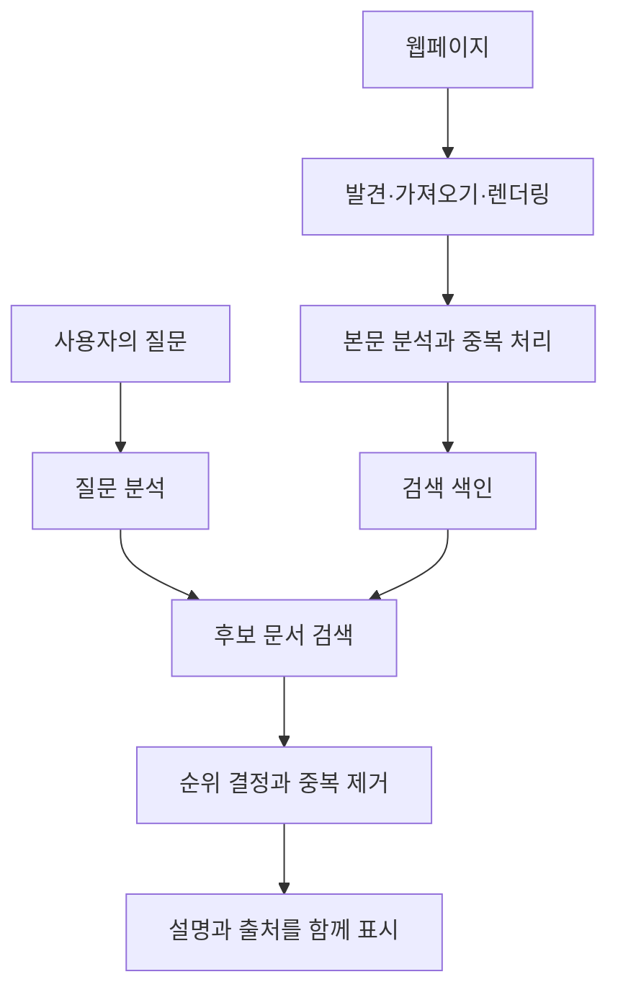
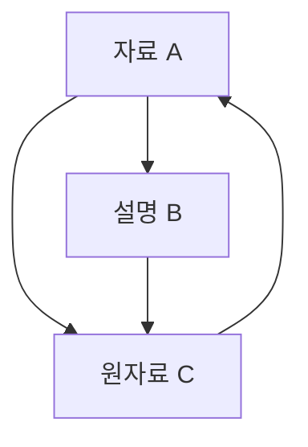
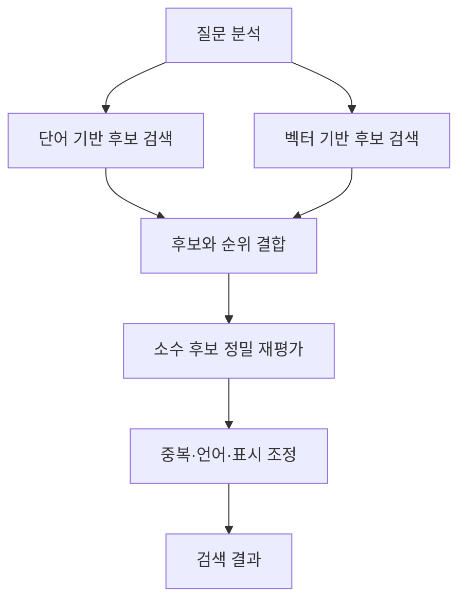

## 1. 검색할 때마다 웹 전체를 다시 읽을까?

검색창에 몇 단어를 넣으면 잠시 후 결과가 나타납니다. 검색 엔진이 그 순간부터 모든 웹사이트를 읽기 시작하는 것은 아닙니다. 평소에 정보를 모으고 검색하기 좋은 형태로 정리해 두었다가 질문이 오면 활용합니다.

도서관을 생각하면 쉽습니다. 천문학 입문서를 찾는다고 사서가 모든 책을 처음부터 다시 읽지는 않습니다. 제목·저자·주제·위치를 정리한 목록으로 후보를 좁힙니다. 검색 엔진의 속도도 미리 만든 색인에 크게 의존합니다.

웹은 도서관보다 불안정합니다. 페이지가 생기고 바뀌고 사라지며, 같은 내용이 여러 주소에 존재합니다. 저자가 붙인 설명도 항상 정확하지는 않습니다. 그래서 갱신을 추적하고 중복을 정리하며 질문에 맞는 후보를 선택해야 합니다.

크게 **정보 수집, 색인 작성, 질문에 따른 결과 선택**으로 나눌 수 있습니다. Google도 이런 구분을 설명합니다. 아래의 수식과 구조는 일반적인 정보 검색 원리이며 특정 서비스의 비공개 순위 공식을 재현한 것이 아닙니다. [Google: 검색의 작동 방식][google-overview]

## 2. 검색 기술은 왜 필요해졌을까?

정보를 찾는 문제는 웹보다 오래되었습니다. 도서관 목록과 문헌 데이터베이스도 검색 방법이 필요했습니다. 자료가 적을 때는 사람이 분류한 목록으로 충분하지만, 규모가 커지면 분류를 유지하고 어디서 찾을지 판단하기 어려워집니다.

1990년 등장한 Archie는 FTP 서버의 파일 이름을 찾았습니다. 오늘날처럼 웹페이지 본문 전체를 검색한 것은 아닙니다. 맥길대학교의 개발은 흩어진 네트워크 자원을 한곳에서 찾으려는 수요를 보여 줍니다. [맥길대학교: Archie의 역사][archie]

팀 버너스리는 1989년 CERN에서 웹을 제안했고, CERN은 1993년 기초 웹 소프트웨어를 퍼블릭 도메인으로 공개했습니다. 링크로 연결된 문서가 늘자 이름뿐 아니라 내용과 문서 관계를 다뤄야 했습니다. [CERN: 웹의 탄생][web-history]

1998년 Google 논문은 본문 외에 링크 구조와 링크 설명을 활용한 대규모 검색을 제시했습니다. 뛰어난 점수 하나만으로 완성된 것이 아닙니다. 수집·저장·압축·색인·순위 계산이 함께 성장해야 했습니다. [Brin과 Page: 검색 엔진의 구조][google-paper]

역사를 과거에는 단어, 지금은 AI라고만 나누기도 어렵습니다. 정확한 단어, 문서 관계, 통계, 언어 모델은 서로 다른 약점을 보완합니다. 새 방법도 정확한 제품 번호 검색이나 색인 갱신을 대신하지 않습니다.

## 3. 크롤러는 어떤 주소를 방문할까?

크롤러는 페이지를 가져오는 프로그램입니다. 하지만 모든 URL을 담은 완전한 중앙 명부는 없습니다. 이미 아는 페이지의 링크와 사이트맵에서 새 후보를 발견합니다.

발견했다고 바로 모두 가져오는 것도 아닙니다. 대기열에서 재방문 우선순위, 같은 호스트의 요청 간격, 실패, 변경 가능성을 관리합니다. 뉴스 첫 화면과 십 년 된 고정 자료는 재방문 가치가 다릅니다. 제한된 통신량과 계산 자원을 배분하는 문제입니다.

상대 서버를 과부하로 만들지 않아야 합니다. 빨리 수집하려다 출처를 멈추게 하면 목적에 어긋납니다. 느린 응답이나 반복 오류에 따라 빈도를 조절해야 합니다.

달력의 다음 달 링크나 검색 필터 조합은 사실상 무한한 주소를 만들 수 있습니다. 모든 링크를 무조건 따라가면 끝나지 않을 수 있어 주소 패턴, 중복, 내용 변화를 살펴야 합니다.

사이트맵은 발견을 돕는 안내이지 등록이나 상위 순위를 보장하는 신청서가 아닙니다. 주소를 안다는 것, 가져올 수 있다는 것, 색인에 채택한다는 것은 다릅니다. [Google: 사이트맵 개요][sitemaps]

## 4. robots.txt, noindex, 인증의 역할은 다르다

`robots.txt`는 규칙을 따르는 크롤러에게 가져오지 말아야 할 경로를 알립니다. RFC 9309는 이를 접근 권한 부여와 구분합니다. 비밀을 지키는 자물쇠가 아닙니다. [RFC 9309: 로봇 배제 프로토콜][robots]

`noindex`는 지원하는 검색 엔진에 페이지를 색인하지 말라고 요청합니다. Google이 페이지 안의 지시를 읽으려면 접근할 수 있어야 합니다. 가져오기를 막으면서 내부 `noindex`를 읽기를 기대할 수는 없습니다. 차단된 URL도 외부 링크로 알려질 수 있습니다. [Google: noindex로 색인 제어][noindex]

인증과 접근 제어는 누가 내용을 가져갈 수 있는지 결정합니다. 서로 다른 경계를 제어합니다.

| 방식 | 주된 제어 대상 | 이것만으로 보장하지 않는 것 |
|---|---|---|
| robots.txt | 협조적인 크롤러의 가져오기 | 비밀 유지, URL의 완전한 비노출 |
| noindex | 지원하는 검색 색인의 등록 | 내용 접근 금지 |
| 인증·접근 제어 | 내용을 받을 수 있는 사람 | 공개 후 만들어진 모든 사본 삭제 |

검색되지 않는 것과 아무도 읽을 수 없는 것은 다릅니다. 사내 문서 검색에서도 중요한 구분입니다.

## 5. 받은 HTML과 보이는 페이지가 다를 수 있다

서버가 HTML에 본문을 담아 보내기도 하고, JavaScript가 나중에 내용을 만들기도 합니다. 후자는 초기 파일만 가져오면 사용자가 보는 내용이 없을 수 있어 브라우저 같은 렌더링이 필요합니다.

Google은 크롤링·렌더링·색인을 설명합니다. JavaScript를 실행할 수 있다고 모든 페이지가 반드시 정상 처리되는 것은 아닙니다. 자원 차단, 스크립트 실패, 상호작용 뒤에만 나오는 내용이 영향을 줍니다. [Google: JavaScript 검색의 기초][javascript]

그다음 태그·내비게이션·광고·본문을 구분하고 문자 인코딩과 언어를 처리합니다. 페이지 전체를 같은 문자열로 세면 반복 메뉴가 주제를 덮을 수 있습니다. 제목과 소제목, 본문은 다른 증거입니다.

같은 내용이 인쇄용 주소나 추적 매개변수 주소에 나타나기도 합니다. 검색 엔진은 중복 묶음과 대표 주소를 정합니다. `rel="canonical"`은 선호 주소를 알리는 신호이며 Google에 무조건 강제하는 명령은 아닙니다. [Google: 표준 URL][canonical]

## 6. 문장을 검색 가능한 단위로 나누기

컴퓨터는 어느 부분을 검색어로 취급할지 규칙이 필요합니다. 이를 토큰화라고 합니다. 정규화는 대소문자, 문자 폭, 활용형 등의 차이를 맞춥니다.

일본어는 보통 단어 사이를 띄지 않으므로 언어별 처리가 필요합니다. 형태소 분석으로 단어를 찾거나 연속된 글자를 묶는 n-gram을 사용할 수 있습니다. 문서와 질문을 호환되게 처리하지 않으면 같은 뜻도 일치하지 않습니다. Kuromoji는 일본어 분석의 구체적 구현입니다. [정보 검색 교재: 토큰화][tokenization], [Elastic: 일본어 분석][kuromoji]

모든 차이를 없애면 안 됩니다. C와 C++의 기호, 제품 번호의 구분자, 화학 물질 이름의 숫자는 중요할 수 있습니다. 약어를 풀면 후보가 늘지만 다른 뜻이 섞일 수도 있습니다.

그래서 원문과 검색용 표현을 분리해 보관하면 유용합니다. 독자에게 보이는 글까지 기계용으로 바꿀 필요는 없습니다. 언어 처리는 어떤 변형을 같게 볼지 정하는 일입니다.

## 7. 역색인은 문서와 단어의 관계를 뒤집는다

문서를 읽으면 어떤 단어가 있는지 압니다. 검색은 반대로 어떤 문서에 이 단어가 있는지 묻습니다. 역색인은 그 대응을 저장합니다.

다음은 이미 단어로 나눈 작은 문서 집합입니다.

| 문서 ID | 대표 단어 |
|---|---|
| D1 | 자전거, 수리, 공구 |
| D2 | 자전거, 통근, 안전 |
| D3 | 시계, 수리, 공구 |
| D4 | 자전거, 수리, 요금 |

자전거 목록은 D1·D2·D4, 수리는 D1·D3·D4이므로 교집합은 D1·D4입니다. 모든 본문을 다시 읽지 않고 두 목록만 비교해 후보를 얻습니다. [정보 검색 교재: 역색인][inverted]

실제 항목에는 횟수와 위치도 넣을 수 있습니다. 문서 ID를 정렬해 차이를 압축하면 읽을 데이터가 줄어듭니다. 속도는 처리기 증가뿐 아니라 불필요한 일을 피하는 데서도 나옵니다.

모든 검색이 엄격한 AND 조건은 아닙니다. 다른 표현을 가진 문서도 포함할 수 있지만, 단어에서 문서로 빠르게 이동하는 원리는 전문 검색의 기반입니다.

## 8. 단어 위치가 필요한 이유

서울에서 부산과 부산에서 서울은 같은 지명을 포함하지만 방향이 반대입니다. 기계 학습이라는 표현도 긴 글에서 멀리 떨어진 기계와 학습과는 다릅니다.

위치 색인은 각 단어가 어디 나오는지 기록합니다. 연속한 위치를 비교하면 구문 검색이 가능하며, 가까운 단어를 관련성의 증거로 활용할 수도 있습니다. [정보 검색 교재: 위치 색인][positions]

위치를 안다고 의미를 모두 이해하지는 않습니다. 부정·조건·대명사·인용은 거리만으로 처리하기 어렵습니다. 색인은 후보를 빠르게 찾는 문제를 풀지, 주장의 진위를 판정하지는 않습니다.

따라서 검색어가 있어도 필요 없는 페이지일 수 있습니다. 단어 일치는 증거이지 사용자의 목적 자체가 아닙니다.

## 9. 흔한 단어와 드문 단어는 다른 증거다

천 개 후보를 동등하게 보여 주면 도움이 적습니다. 소수 문서에만 나오는 단어가 거의 모든 문서에 있는 단어보다 주제를 구별하기 쉬운 경우가 많습니다.

역문서 빈도 IDF가 이를 수치화합니다. 전체 문서 수 $N$, 단어 $t$를 포함한 문서 수 $df(t)$에 대해 양수가 되는 다음 형태를 사용합니다.

$$
\operatorname{IDF}(t)=\ln\left(1+\frac{N-df(t)+0.5}{df(t)+0.5}\right)
$$

1,000개 중 10개 문서에 나오는 단어는 약 4.56, 500개에 나오는 단어는 약 0.693입니다. 같은 한 번의 일치라도 드문 단어가 더 구별력을 가집니다. Lucene의 BM25 문서에도 이 형태가 제시됩니다. [Apache Lucene: BM25Similarity][lucene]

희소성이 진실이나 품질을 보장하지는 않습니다. 오타도 드물 수 있고 무관한 전문용어를 나열할 수도 있습니다. IDF는 통계적 성질이지 신뢰도가 아닙니다.

## 10. BM25는 반복의 효과를 포화시킨다

문서 안의 출현 횟수도 힌트입니다. 하지만 100번 쓰면 한 번의 100배 좋다고 하면 키워드 채우기가 유리합니다. 긴 글은 단어가 많으므로 짧고 정확한 설명을 밀어낼 수도 있습니다.

BM25는 반복의 추가 효과를 줄이고 문서 길이를 보정합니다. 짧은 질문을 가정하면 다음 형태로 이해할 수 있습니다.

$$
S(d,q)=\sum_{t\in q}\operatorname{IDF}(t)
\frac{f(t,d)(k_1+1)}{f(t,d)+k_1\left(1-b+b\frac{|d|}{\overline L}\right)}
$$

$f(t,d)$는 출현 횟수, $|d|$는 길이, $\overline L$은 평균 길이입니다. $k_1$은 포화 정도, $b$는 길이 보정의 강도를 조절합니다. IDF와 상수 처리에는 구현 차이가 있습니다. [정보 검색 교재: BM25][bm25]

평균 길이의 문서에서 $k_1=1.2$이면 IDF를 제외한 횟수 부분은 다음과 같습니다.

| 출현 횟수 | 횟수 계수 |
|---|---:|
| 1 | 1.000 |
| 2 | 1.375 |
| 5 | 1.774 |
| 10 | 1.964 |
| 매우 많음 | 2.2에 접근 |

1회에서 2회로 늘 때가 9회에서 10회보다 효과가 큽니다. 반복은 의미가 있지만 무한히 점수를 올리지는 못합니다. 이 식에서 $b=0$은 길이 보정을 없애며 값이 커지면 보정이 강해집니다.

BM25 점수는 일반적으로 페이지가 맞을 확률이 아닙니다. 특정 색인과 질문에서 후보를 비교하는 값이며 다른 질문이나 문서 집합의 절대 품질 점수로 쓰면 안 됩니다.

## 11. PageRank는 단순한 인기투표가 아니다

본문이 비슷할 때 링크는 다른 증거가 됩니다. 누군가 그 페이지를 참고 대상으로 골랐다는 흔적입니다. 하지만 링크 하나를 모두 같은 한 표로 세면 페이지를 대량 생성해 표를 늘릴 수 있습니다.

PageRank는 링크를 보내는 쪽의 중요도를 고려하고 그 무게를 나가는 링크에 나눕니다. 중요한 페이지가 참조한 페이지도 중요해질 수 있다는 상호 의존적 계산입니다.

정규화한 교육용 식은 다음과 같습니다. $N$은 페이지 수, $L(u)$는 $u$의 외부 링크 수, $\alpha$는 링크를 따라갈 확률입니다. 우선 모든 페이지에 나가는 링크가 있다고 가정합니다.

$$
PR(v)=\frac{1-\alpha}{N}
+\alpha\sum_{u\to v}\frac{PR(u)}{L(u)}
$$

무작위 방문자가 확률 $\alpha$로 링크를 따라가고, 나머지 경우에는 임의의 페이지로 이동한다고 생각할 수 있습니다. 반복 갱신하면 장기적으로 머무는 위치의 분포를 얻습니다. 나가는 링크가 없는 페이지는 가중치를 전체에 재분배하는 등의 별도 처리가 필요합니다.

$\alpha=0.85$이면 정상값은 대략 A 0.388, B 0.215, C 0.397입니다. C는 A와 B에서 참조되지만 B는 A 가중치의 일부만 받습니다. 들어오는 링크 수뿐 아니라 출처와 배분 방식이 작용합니다.

이는 PageRank를 설명하는 작은 모형이지 현대 검색 순위 전체가 아닙니다. 링크 지표가 질문의 뜻이나 사실 여부를 직접 판정하지는 않습니다. 유명한 옛 페이지가 오늘 열차 시각표에 적합하지 않을 수 있습니다. [Brin과 Page 원논문][google-paper], [Google: 순위 시스템][ranking]

## 12. 단어 일치에서 의도 이해로

노트북이 뜨겁다고 검색한 사람은 열역학 정의보다 냉각이나 고장 해결을 원할 수 있습니다. 영어 bank는 은행이나 강둑을 뜻할 수 있습니다. 표기 외에 문맥이 중요합니다.

맞춤법 교정, 동의어, 지명·제품명 인식은 후보를 늘립니다. 반면 정확한 모델 번호나 드문 이름을 찾을 때 자동 교정이 방해할 수 있습니다. 원질문을 보존하고 변경을 설명하며 엄격한 검색으로 돌아갈 수 있게 하는 것이 좋습니다. [정보 검색 교재: 철자 교정][spelling]

의미 검색은 질문과 문서를 수치 벡터로 바꾸어 가까움을 비교할 수 있습니다. 배터리가 빨리 닳는다는 말과 배터리 지속 시간을 늘린다는 말은 단어가 완전히 같지 않아도 연결할 필요가 있습니다.

벡터 $\mathbf q$, $\mathbf d$의 방향 유사도를 나타내는 코사인 유사도는 다음과 같습니다.

$$
\operatorname{sim}(\mathbf q,\mathbf d)=
\frac{\mathbf q\cdot\mathbf d}{\|\mathbf q\|\|\mathbf d\|}
$$

가까움은 모델이 학습한 표현 안에서의 가까움입니다. 배터리를 교체할 수 있다와 교체할 수 없다는 많은 단어를 공유하지만 핵심이 다릅니다. 벡터가 가깝다고 정답이 보장되지 않습니다. 모델·문서 분할 길이·평가 질문을 함께 확인해야 합니다. [Elastic: 벡터 검색][vector]

## 13. 모든 페이지를 비싼 모델로 검사하지 않는다

뜻을 정밀하게 읽는 모델은 유용하지만 모든 문서를 질문마다 검사하면 비용과 시간이 큽니다. 그래서 넓고 빠른 후보 검색과 소수 후보의 자세한 재평가를 나눌 수 있습니다.

먼저 단어 검색이나 근사 최근접 이웃 탐색으로 후보를 얻고, 이후 계산량이 큰 모델로 재정렬합니다. 근사는 속도와 메모리를 절약하는 대신 진짜 이웃을 놓칠 수 있습니다. 처음 후보에 못 들어간 문서는 후단에서 구할 수 없습니다.

단어 검색은 이름·식별자에, 의미 검색은 바꿔 말한 표현에 도움이 됩니다. 하이브리드 검색은 둘을 결합합니다. 점수 척도가 달라 그대로 더하면 한쪽이 지배할 수 있습니다.

순위 역수를 합치는 RRF가 한 방법입니다. 문서 $d$가 목록 $i$에서 $r_i(d)$위라면, 나타난 목록에 대해서만 더합니다.

$$
\operatorname{RRF}(d)=\sum_i\frac{1}{k+r_i(d)}
$$

양수 $k$는 상위 순위의 영향이 지나치게 커지지 않도록 조절합니다. 확률이 아니라 순위 결합 규칙입니다. 문서가 없는 목록은 점수를 주지 않습니다. Elasticsearch는 단어와 벡터 결과를 RRF로 합치는 구현을 공개합니다. [Elastic: RRF][rrf]

일반적인 설계 예시이며 모든 상용 서비스가 같은 단계를 쓴다는 뜻은 아닙니다. 누락을 줄이는 일과 세부 순서를 정하는 일을 분담하는 것이 핵심입니다.

## 14. 순위표를 만들면 끝일까?

같은 사이트의 거의 같은 페이지가 상위를 채우면 비교할 정보가 적습니다. 중복을 줄이고 다른 관점을 포함하며 언어와 지역을 고려할 필요가 있습니다.

가까운 자전거 수리점에는 위치가 중요하지만 자전거의 역사에는 같은 방식으로 적용할 이유가 없습니다. 최신성도 질문에 따릅니다. 재난 교통 정보에는 중요하지만 수학 증명이 날짜만 새롭다고 나아지지는 않습니다.

제목과 요약은 열어 볼 결과를 고르는 단서입니다. 질문에 맞춘 발췌는 다른 부분의 조건을 빠뜨릴 수 있으므로 짧은 문구를 원문 전체의 결론으로 받아들이면 안 됩니다.

광고와 일반 결과도 구분합니다. 유료 게재와 자연 검색 순위는 다른 체계입니다. Google은 돈으로 자연 검색 순위나 크롤링 빈도를 살 수 없다고 설명합니다. [Google: 검색 원리][google-overview]

## 15. 큰 색인을 빠르게 검색하는 방법

한 대의 컴퓨터에는 용량·속도·장애 대응 한계가 있습니다. [분산 시스템](/ko/p/cap-theorem-distributed-systems-tradeoff/)은 색인을 여러 부분으로 나누어 각기 검색하고 결과를 합칩니다. 나눈 부분을 샤드라고 부르기도 합니다.

문서 기준 분할에서는 각 샤드가 질문을 받아 유망한 후보를 반환하고 조정 노드가 비교합니다. 다만 문서 빈도 같은 지역 통계가 다르면 점수 비교에 주의해야 합니다. 지역 통계와 전체 통계의 선택도 품질에 영향을 줍니다. [정보 검색 교재: 색인의 분산][distributed]

분할과 복제는 다릅니다. 분할은 데이터나 일을 나누고, 복제는 같은 데이터를 여러 곳에 둡니다. 복제는 장애와 부하에 도움이 되지만 변경 전파 문제가 추가됩니다.

많은 기계에 질문하면 가장 느린 응답이 전체 대기를 늘릴 수 있습니다. 평균뿐 아니라 느린 쪽 사용자의 경험도 봐야 합니다. 모두 기다릴지, 기한을 둘지, 다른 복제본에 물을지에 따라 완전성과 속도를 절충합니다.

흔한 결과나 중간 계산을 캐시하면 일을 줄일 수 있지만 어제 답을 계속 쓰면 수정과 삭제를 놓칩니다. 빠르게 만드는 기술에는 최신성을 유지하는 기술도 필요합니다.

## 16. 추가·수정·삭제를 색인에 전달하기

웹페이지를 바꿔도 외부 색인이 즉시 바뀌지는 않습니다. 재수집·분석·갱신·배포에 시간이 걸립니다. 결과는 관측하고 처리한 정보의 표현이지 매 순간의 웹 자체가 아닙니다.

직접 검색을 만든다면 수정과 삭제 경로도 처음부터 설계해야 합니다. 가져올 때마다 새 문서로 추가하면 중복이 쌓입니다. 안정적인 식별자로 올바른 항목을 교체하고 삭제를 검색용 복제본에 전파해야 합니다.

사내 검색에서는 권한 변경도 갱신입니다. 오늘부터 기밀인 문서가 어제의 제목이나 요약으로 새어 나가면 안 됩니다. 결과를 만들기 전에 권한을 검사하고 캐시에도 반영해야 합니다.

색인을 새로 만들 때는 기존 색인으로 계속 서비스하다 새 색인이 완성·검증되면 전환할 수 있습니다. 사용자가 반쯤 만든 색인을 검색하게 하지 않는 운영이 신뢰성을 지탱합니다.

## 17. 스팸 대응은 검색 자체의 일부다

순위는 방문자와 수익에 영향을 주므로 조작 동기가 생깁니다. 과도한 단어 반복, 인위적인 링크, 저가치 페이지의 대량 생성이 예입니다. 모든 문서를 선의로 작성했다고 가정할 수 없습니다.

Google의 스팸 정책은 키워드 남용과 링크 스팸 등을 다룹니다. 품질에는 관련 단어를 찾는 것뿐 아니라 점수 체계를 노린 조작에 견디는 능력도 포함됩니다. [Google: 스팸 정책][spam]

링크가 많다고 진실이고 길다고 깊이 있으며 새롭다고 믿을 수 있는 것은 아닙니다. 대리 지표가 목표가 되면 실제 효용 없이 지표만 높일 수 있습니다. 여러 증거, 지속 평가, 오탐 분석이 필요합니다.

반대로 낯선 작은 사이트를 모두 저품질로 취급해도 문제입니다. 전문가의 새 자료에는 아직 링크가 적을 수 있습니다. 기존 평판을 활용하면서 새 유용한 정보도 찾아야 합니다.

## 18. 좋은 검색은 어떻게 측정할까?

빨라도 필요한 문서가 없으면 좋은 검색이 아닙니다. 평가에는 실제 목적을 대표하는 질문 집합과 관련 문서 판단이 필요합니다.

기본 지표는 정밀도와 재현율입니다. 반환 집합을 $A$, 관련 집합을 $R$로 둡니다.

$$
\operatorname{Precision}=\frac{|A\cap R|}{|A|}
$$

$$
\operatorname{Recall}=\frac{|A\cap R|}{|R|}
$$

관련 문서가 8개이고 반환한 5개 중 4개가 관련되면 정밀도는 4/5로 80%, 재현율은 4/8로 50%입니다. 확실한 결과로 좁히면 정밀도에, 넓게 찾으면 재현율에 유리한 경우가 많지만 항상 단순한 맞교환은 아닙니다. [정보 검색 교재: 집합 평가][evaluation]

| 질문 | 지표나 점검 사항 |
|---|---|
| 반환 결과에 불필요한 항목이 적은가? | 정밀도 |
| 필요한 문서를 놓치지 않았는가? | 재현율 |
| 앞쪽 결과가 유용한가? | 상위 개수 기준 정밀도, 순위 지표 |
| 충분히 빠른가? | 응답 시간 중앙값과 느린 구간 |
| 변경과 권한을 지키는가? | 갱신 지연, 삭제, 접근 제어 검증 |

관련 문서가 1위인지 100위인지도 다릅니다. NDCG처럼 관련 정도와 위치를 고려하는 지표를 씁니다. 언어·질문 유형·길이별로 나누면 전체 평균이 숨긴 문제를 발견할 수 있습니다. [정보 검색 교재: 순위 평가][ranked-evaluation]

클릭도 절대적 정답이 아닙니다. 위에 있어서 또는 자극적인 제목 때문에 클릭하고 곧 실망할 수 있습니다. 반대로 요약으로 답을 얻어 클릭하지 않을 수도 있습니다. 관측 행동을 해석해야 합니다.

## 19. AI가 답해도 검색은 필요하다

찾은 문서를 언어 모델에 전달해 답을 만드는 구성을 RAG, 검색 증강 생성이라고 합니다. 2020년 연구는 사전학습 모델과 외부 검색 정보를 결합하는 방법을 제시했습니다. [Lewis 외: RAG][rag]

검색과 생성은 별개입니다. 필요한 출처를 못 찾으면 근거가 부족하고, 올바른 자료를 찾아도 생성 중 조건을 빠뜨리거나 여러 설명을 잘못 합칠 수 있습니다. 검색을 붙인다고 오류가 모두 사라지지 않습니다.

인용 링크가 있어도 모든 문장이 뒷받침되는 것은 아닙니다. 출처에 해당 주장이 있는지, 날짜와 적용 범위가 맞는지, 자료 사이 모순이 있는지 확인해야 합니다.

시스템을 만든다면 검색 누락·자료 최신성·답과 근거의 대응을 따로 평가하면 원인을 찾기 쉽습니다. 외부 문서의 명령을 시스템 명령으로 받아들여서도 안 됩니다. 문서는 정보원이지 접근이나 작업 권한을 주는 관리자가 아닙니다.

AI는 색인과 출처를 없애지 않고 그 위에 처리와 검증 단계를 더합니다. 답이 읽기 쉬울수록 생성 근거를 추적할 수 있는 것이 중요합니다.

## 20. 검색창 뒤에는 준비와 판단이 이어진다

자전거 펑크 수리에 필요한 공구를 찾는다고 합시다. 질문 전부터 페이지를 수집해 단어·위치·관계를 정리합니다. 질문이 오면 표현을 맞추고 후보를 찾고 목적에 따라 순서를 정합니다.

이후 중복·언어·요약·표시를 조정합니다. 여러 컴퓨터가 협력하며 수정·삭제·권한도 반영합니다. 빠른 응답 하나는 오랜 준비와 계속되는 유지보수의 결과입니다.

사이트 운영자에게는 접근 가능한 본문, 명확한 제목과 링크, 정리된 중복·언어 관계, 독자에게 유용한 설명이 기초입니다. 숨은 요령이 이를 대신하지 않으며 기초를 지켜도 특정 순위를 보장하지는 않습니다.

이용자에게는 상위 순위를 절대적 정확성으로 보지 않는 태도가 도움이 됩니다. 질문을 구체화하고 날짜·출처를 확인하며 다른 표현도 시도하면 판단 자료가 늘어납니다.

검색 엔진은 세상의 완벽한 거울이 아닙니다. **관측한 정보를 정리하고 제한된 시간 안에서 질문에 도움이 될 순서를 만드는 시스템**입니다. 그 제약을 알면 빠른 이유, 못 찾는 이유, 결과를 읽는 방법이 더 선명해집니다.

## 출처와 그림의 범위

일반 정보 검색 원리와 공개 자료를 바탕으로 작성했습니다. BM25·PageRank·RRF 예제는 교육용이며 상용 서비스의 내부 점수가 아닙니다. 그림은 과정을 단순화했으며 AI 생성 표지는 실제 장치나 화면이 아닌 개념 이미지입니다.

- [Google: 개요][google-overview], [사이트맵][sitemaps], [JavaScript][javascript], [noindex][noindex], [표준 URL][canonical]
- [Google: 순위 시스템][ranking], [스팸 정책][spam]
- [CERN: 웹 역사][web-history], [맥길: Archie][archie], [Brin과 Page 논문][google-paper]
- [정보 검색 교재: 토큰화][tokenization], [역색인][inverted], [위치][positions], [BM25][bm25], [분산 색인][distributed], [철자 교정][spelling]
- [정보 검색 교재: 정밀도·재현율][evaluation], [순위 평가][ranked-evaluation], [Lucene: BM25][lucene]
- [Elastic: 일본어 분석][kuromoji], [벡터 검색][vector], [RRF][rrf], [RAG 원논문][rag]
- [RFC 9309: 크롤러 규칙][robots]

[google-overview]: https://developers.google.com/search/docs/fundamentals/how-search-works
[archie]: https://200.mcgill.ca/history/creation-of-the-first-internet-search-engine/
[web-history]: https://home.cern/science/computing/the-birth-of-the-web/where-web-was-born/
[google-paper]: https://infolab.stanford.edu/~backrub/google.html
[sitemaps]: https://developers.google.com/search/docs/crawling-indexing/sitemaps/overview
[robots]: https://www.rfc-editor.org/rfc/rfc9309.html
[noindex]: https://developers.google.com/search/docs/crawling-indexing/block-indexing
[javascript]: https://developers.google.com/search/docs/crawling-indexing/javascript/javascript-seo-basics
[canonical]: https://developers.google.com/search/docs/crawling-indexing/consolidate-duplicate-urls
[tokenization]: https://nlp.stanford.edu/IR-book/html/htmledition/tokenization-1.html
[kuromoji]: https://www.elastic.co/docs/reference/elasticsearch/plugins/analysis-kuromoji
[inverted]: https://nlp.stanford.edu/IR-book/html/htmledition/an-example-information-retrieval-problem-1.html
[positions]: https://nlp.stanford.edu/IR-book/html/htmledition/positional-indexes-1.html
[lucene]: https://lucene.apache.org/core/9_9_1/core/org/apache/lucene/search/similarities/BM25Similarity.html
[bm25]: https://nlp.stanford.edu/IR-book/html/htmledition/okapi-bm25-a-non-binary-model-1.html
[ranking]: https://developers.google.com/search/docs/appearance/ranking-systems-guide
[spelling]: https://nlp.stanford.edu/IR-book/html/htmledition/implementing-spelling-correction-1.html
[vector]: https://www.elastic.co/docs/solutions/search/vector
[rrf]: https://www.elastic.co/docs/reference/elasticsearch/rest-apis/reciprocal-rank-fusion
[distributed]: https://nlp.stanford.edu/IR-book/html/htmledition/distributing-indexes-1.html
[spam]: https://developers.google.com/search/docs/essentials/spam-policies
[evaluation]: https://nlp.stanford.edu/IR-book/html/htmledition/evaluation-of-unranked-retrieval-sets-1.html
[ranked-evaluation]: https://nlp.stanford.edu/IR-book/html/htmledition/evaluation-of-ranked-retrieval-results-1.html
[rag]: https://arxiv.org/abs/2005.11401
