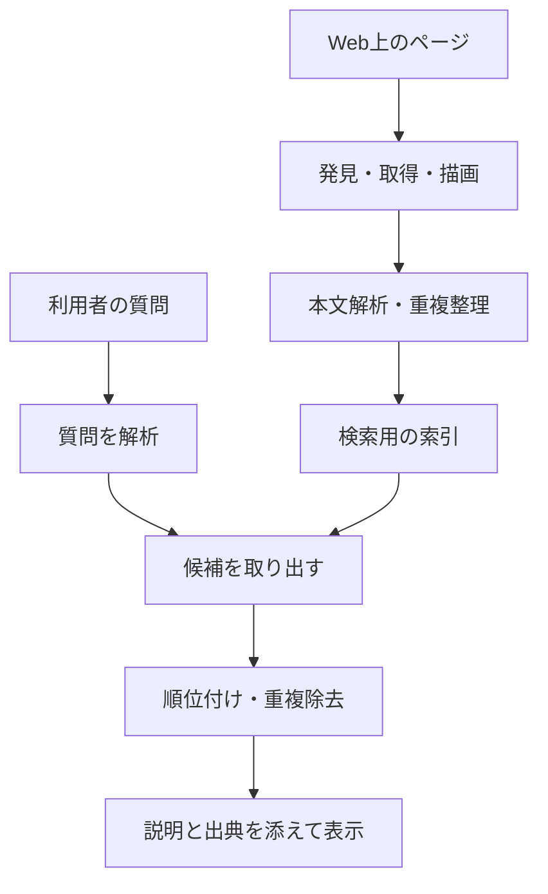
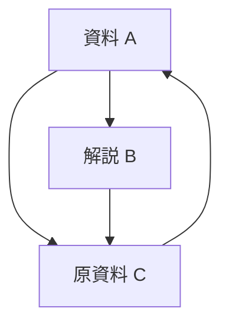
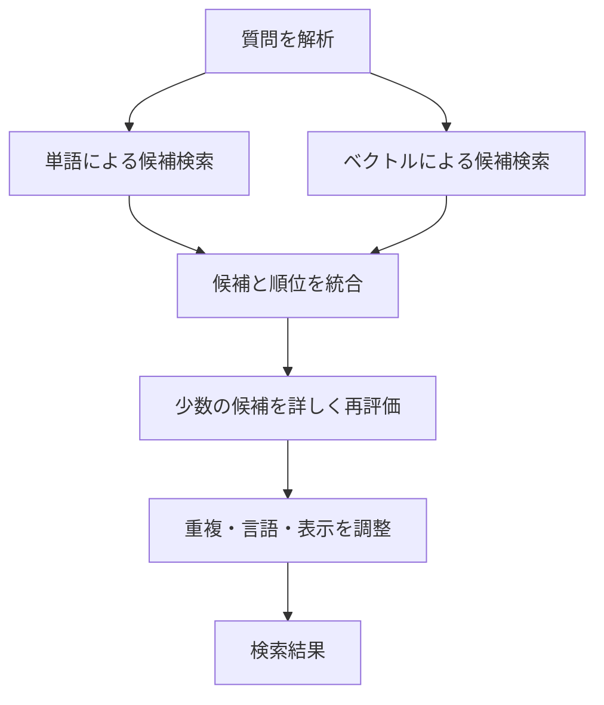

## 1. 検索するたびに、世界中のページを読んでいるのか

検索窓に言葉を入れると、わずかな待ち時間で候補が並びます。しかし、その瞬間から世界中のWebサイトを一つずつ読み始めているわけではありません。検索エンジンは普段から情報を集め、検索に向いた形に整理し、質問が来たときにはその準備済みの情報を使います。

図書館で考えると理解しやすくなります。来館者が「天文学の入門書はありますか」と尋ねるたびに、司書が全蔵書を最初から読むことはありません。書名、著者、主題、所在などをまとめた目録を使い、候補を絞ってから内容を確かめます。検索エンジンの速さも、前もって作る索引に大きく支えられています。

ただしWebは図書館より不安定です。ページは増え、書き換わり、消えます。同じ内容が別のURLにも現れます。著者が付けた説明が正しいとも限りません。必要なのは目録だけでなく、更新を追い、重複を整理し、質問に合う候補を選ぶ仕組みです。

全体を大きく分けると、**収集する、索引を作る、質問に応じて選ぶ**という三つの段階があります。Googleの公開説明もこの区別を採用しています。ただし、以下で扱う数式や構成は情報検索の一般的な考え方であり、特定の検索サービスの非公開の順位式を再現するものではありません。[Google：検索の仕組み][google-overview]

## 2. なぜ検索という技術が必要になったのか

情報を探す問題はWebより古く、図書館の目録や文献データベースでも研究されてきました。文書が少ない間は人が分類した一覧でも役立ちます。しかし、件数が増えると分類を維持する作業も、どの分類から探すかを判断する作業も大きくなります。

1990年に登場したArchieは、FTPサーバーにあるファイル名を探す仕組みでした。現在のようにWebページ本文全体を検索するものではありません。マギル大学での開発は、ネットワーク上の資源を一か所から探したいという需要を示しました。[マギル大学：Archieの歴史][archie]

Webはティム・バーナーズ＝リーがCERNで1989年に提案し、1993年にはCERNが基礎ソフトウェアをパブリックドメインとして公開しました。リンクで文書をつなげる仕組みが広がると、ファイルの名前だけでなく、文書の中身と文書同士の関係を調べる必要が生まれました。[CERN：Webの誕生][web-history]

1998年のGoogleの論文は、本文だけでなくリンク構造やリンクの説明文を活用する大規模検索の設計を示しています。ここで重要なのは、一つの天才的な点数だけで検索が完成したわけではないことです。収集、保存、圧縮、索引、順位付けを、増え続ける情報に対して動かす総合的な技術でした。[Brin・Page：大規模Web検索エンジンの構造][google-paper]

歴史を「昔は単語、今はAI」と二分するのも単純すぎます。単語の一致、文書の関係、統計、言語モデルは、それぞれ異なる弱点を補います。新しい手法が加わっても、既知の固有名詞を正確に探す能力や、索引を更新する基盤は必要です。

## 3. クローラーは、どのURLを訪れるのか

クローラーはページを取得するプログラムです。ただし、インターネット上の全URLが載った完全な台帳はありません。既知のページからリンクをたどったり、サイトが公開するサイトマップを参考にしたりして候補を発見します。

発見したURLは、すぐにすべて取得するとは限りません。再訪の優先順位、同じホストへのアクセス間隔、取得の失敗、更新の見込みなどを管理する待ち行列が必要です。ニュースのトップページと十年前の固定資料では、再取得の価値が異なります。限られた通信量と計算資源をどこへ配るかという問題です。

相手のサーバーに負荷をかけすぎない配慮も欠かせません。自分の収集を速くするために相手を停止させては、情報を得る目的に反します。応答が遅い、エラーが続くなどの観測に応じて頻度を調節する設計が必要になります。

さらに、カレンダーの次月リンクや検索条件の組み合わせは、実質的に無限のURLを作ることがあります。「リンクがあるから全部たどる」だけでは終わりません。URLの規則、重複、内容の変化を見て、価値の低い巡回を減らします。

サイトマップは発見を助ける案内であって、登録や上位表示を保証する申請書ではありません。ここでも、URLを知っていること、取得できること、索引に採用することは別の状態です。[Google：サイトマップの概要][sitemaps]

## 4. robots.txt、noindex、認証は役割が違う

`robots.txt` は、協力するクローラーにアクセスしてほしくない範囲を伝える仕組みです。RFC 9309では、これはアクセス認可の仕組みではないと明確に区別されています。秘密の情報を守る鍵の代わりにはなりません。[RFC 9309：Robots Exclusion Protocol][robots]

`noindex` は、検索結果にそのページを登録しないよう伝える指示です。Googleがページ内の指示を読むには、そのページへアクセスできなければなりません。したがって、取得を禁止したうえでページ中の `noindex` を読んでもらう、という期待は成立しません。取得を拒否したURLでも、外部のリンクなどからURL自体を知られる場合があります。[Google：noindexによる登録制御][noindex]

一方、認証や適切なアクセス制御は、許可された人だけが内容を取得できるようにする仕組みです。三者は似た目的に見えても、働く場所が違います。

| 仕組み | 主に制御するもの | それだけでは保証しないもの |
|---|---|---|
| robots.txt | 協力的なクローラーの取得 | 秘密保持、URLの完全な非表示 |
| noindex | 対応する検索エンジンでの登録 | 内容へのアクセス禁止 |
| 認証・アクセス制御 | 内容を取得できる相手 | 公開後に作られた全コピーの消去 |

検索に出ないことと、誰にも読めないことを混同しないのがポイントです。この区別は公開Webだけでなく、社内文書の検索を設計するときにも重要になります。

## 5. 取得したHTMLと、見えているページは同じとは限らない

サーバーから返るHTMLに本文が含まれるサイトもあれば、JavaScriptが後から本文を作るサイトもあります。後者ではファイルをダウンロードしただけでは、利用者が見る内容を十分に取得できません。ブラウザのようにスクリプトを実行する描画処理が必要になる場合があります。

Googleはクロール、レンダリング、インデックスという処理を説明しています。描画できるからといって、あらゆるページが必ず同じように処理されるわけではありません。必要な資源を取得できない、スクリプトが失敗する、操作後にしか本文が出ない、といった条件は内容の把握に影響します。[Google：JavaScript検索の基礎][javascript]

取得後には、HTMLタグ、ナビゲーション、広告、本文などを区別し、文字コードや言語を扱います。ページの全文をそのまま一つの文字列として数えると、どのページにもあるメニューが主題を覆ってしまいます。見出しやタイトル、本文の位置には異なる役割があります。

同じ内容が印刷用URLや追跡パラメーター付きURLで現れることもあります。検索結果がそれらで埋まらないよう、重複のまとまりと代表URLを扱います。`rel="canonical"` は代表URLを知らせる手段ですが、Googleにとっては選択を助けるシグナルであり、あらゆる状況で強制する命令ではありません。[Google：正規URLの指定][canonical]

## 6. 文章を検索できる単位に分ける

人には自然に読める文章でも、コンピューターにはどこからどこまでを検索語として扱うか決める必要があります。この分割をトークン化と呼びます。さらに、大文字と小文字、文字幅、活用形などをそろえる正規化を組み合わせます。

日本語の「東京都で自転車を修理する店」には単語間の空白がありません。形態素解析で語を分ける方法もあれば、連続する数文字を単位とするn-gramもあります。検索文書と質問で整合した処理をしないと、同じ内容を尋ねても一致しません。日本語向けのKuromojiは、言語ごとの解析が実装として必要になる例です。[情報検索教科書：トークン化][tokenization]、[Elastic：日本語解析][kuromoji]

正規化は何でも同一視すればよいわけではありません。「C」と「C++」、型番のハイフン、薬品名の数字などを消すと、利用者にとって重要な違いが失われます。略語を展開すると拾える候補が増える一方、別の意味の文書も入りやすくなります。

そこで原文は残し、検索用の表現を別に持つ設計が役立ちます。表示する文章まで機械向けに書き換える必要はありません。言語処理は装飾ではなく、「同じものとして探す範囲」を定義する作業です。

## 7. 転置索引：文書から単語へ、を逆向きにする

普通に文書を読むと、「この文書にどの単語があるか」が分かります。検索では逆に「この単語がどの文書にあるか」をすぐ知りたい。その逆向きの対応表が転置索引です。

次の小さな文書集を考えます。説明用に単語はすでに分割したものとします。

| 文書ID | 内容を表す語 |
|---|---|
| D1 | 自転車、修理、工具 |
| D2 | 自転車、通勤、安全 |
| D3 | 時計、修理、工具 |
| D4 | 自転車、修理、料金 |

「自転車」のリストはD1・D2・D4、「修理」のリストはD1・D3・D4です。両方を含む文書は共通部分のD1・D4。全本文を読み直さなくても、二つの短いリストを照合すれば候補が分かります。[情報検索教科書：転置索引][inverted]

実用のリストには文書IDだけでなく、出現回数や位置などを持たせます。文書IDを並べ、差分を圧縮して保存すれば、読み出すデータ量も減らせます。高速化はCPUを増やすだけでなく、そもそも読まなくてよい情報を増やす工夫でもあります。

もちろん、すべての質問が厳密なAND検索になるわけではありません。少し違う言葉を含む候補も拾う設計があります。それでも、単語から候補文書へ素早く移る考え方は、多くの全文検索の基盤です。

## 8. 単語の位置が必要になる理由

「東京から大阪」と「大阪から東京」には同じ地名が入っています。語の集合だけなら同じでも、移動の向きは反対です。「機械学習」というまとまりと、長い文書の離れた場所にある「機械」「学習」も、同じ証拠とは限りません。

位置付き索引では、各語が何番目に現れたかを記録します。ある語の位置のすぐ次に別の語があるかを調べれば、句の一致を判定できます。近接する語を高く評価する処理にも利用できます。[情報検索教科書：位置付き索引][positions]

ただし、位置を残せば人間の意味を完全に理解できるわけではありません。否定、条件、代名詞、引用などは、近くにある単語だけでは扱いきれません。索引が解くのは高速に候補を見つける問題であり、文章の真偽を判定する問題とは別です。

この区別を押さえると、「検索語が入っているのに欲しい結果ではない」という現象が自然に理解できます。単語の一致は証拠の一つであって、利用者の目的そのものではありません。

## 9. よく出る語と、珍しい語をどう評価するか

候補が千件あったら、そのまま全部を同列に見せても役立ちません。どの語の一致が強い手がかりかを考えます。多くの文書に出る一般的な語より、少数の文書にしか出ない専門語のほうが、対象を絞る助けになりやすいでしょう。

この考えを数値化する一つが逆文書頻度、IDFです。全文書数を $N$、語 $t$ を含む文書数を $df(t)$ とし、ここでは正の値になる次の形を使います。

$$
\operatorname{IDF}(t)=\ln\left(1+\frac{N-df(t)+0.5}{df(t)+0.5}\right)
$$

1,000文書中10文書に出る語なら約4.56、500文書に出る語なら約0.693です。同じ一回の一致でも、前者は候補の区別に強く効きます。この形はLuceneのBM25実装の文書にも示されています。[Apache Lucene：BM25Similarity][lucene]

注意したいのは、珍しい語が真実や良質さを保証するわけではない点です。誤字も珍しいですし、専門用語を無関係に並べることもできます。IDFは情報の希少性を使う統計的な手がかりで、信頼性そのものではありません。

## 10. BM25：繰り返しの効果を飽和させる

文書中に検索語が何回出るかも手がかりです。しかし100回出れば1回の100倍よいとすると、単語の水増しが有利になります。また、長い文書は多くの語を含むので、そのままでは短い的確な説明が不利です。

BM25は、出現回数の効果を次第に小さくし、文書の長さも補正する代表的な方法です。ここでは短い質問を想定して、次の教育用の形で考えます。

$$
S(d,q)=\sum_{t\in q}\operatorname{IDF}(t)
\frac{f(t,d)(k_1+1)}{f(t,d)+k_1\left(1-b+b\frac{|d|}{\overline L}\right)}
$$

$f(t,d)$ は文書 $d$ での出現回数、$|d|$ は文書の長さ、$\overline L$ は平均長です。$k_1$ は回数の飽和具合、$b$ は長さ補正の強さを調整します。採用するIDFや定数の扱いには実装差があります。[情報検索教科書：BM25][bm25]

平均と同じ長さの文書で $k_1=1.2$ とすると、IDFを除いた回数部分は次のようになります。

| 出現回数 | 回数部分の値 |
|---|---:|
| 1 | 1.000 |
| 2 | 1.375 |
| 5 | 1.774 |
| 10 | 1.964 |
| 非常に多い | 2.2に近づく |

1回から2回への増加と、9回から10回への増加では効果が違います。繰り返しは無意味ではないが、際限なく得点を増やせるわけでもない、という設計です。$b=0$ ならこの式では長さ補正を行わず、$b$ を大きくすると長さの影響が強まります。

BM25の点数は、一般に「このページが正しい確率」ではありません。ある索引と質問の中で候補を比較するための点数です。別の索引や別の質問で出た点数をそのまま絶対評価として比べるのは適切ではありません。

## 11. PageRank：リンクを単純な人気投票にしない

文章に書かれた語だけでは、同じ話題の多数のページを区別しにくいことがあります。そこで利用できるのが、Webページ同士を結ぶリンクです。あるページへリンクするという行為は、作成者がそのページを参照先として選んだ痕跡になります。

ただしリンクを一本一票と数えるだけなら、大量のページを作って票を増やせます。PageRankの基本的な発想は、リンク元の重要度も考え、その重要度をリンク先へ分配することです。重要なページから参照されたページが重要になるという、相互依存の計算です。

正規化した説明用の式は次のように書けます。$N$ はページ数、$L(u)$ はページ $u$ の外向きリンク数、$\alpha$ はリンクをたどる割合です。ここではリンク先を持たないページがない場合を示します。

$$
PR(v)=\frac{1-\alpha}{N}
+\alpha\sum_{u\to v}\frac{PR(u)}{L(u)}
$$

ランダムな閲覧者が、確率 $\alpha$ でリンクをたどり、残りで任意のページに移ると考えられます。値を繰り返し更新すると、この閲覧者が長期的にどこにいるかという分布につながります。外向きリンクのないページは、例えばその重みを全体へ再配分する処理が別に必要です。

この3ページで $\alpha=0.85$ とすると、定常値はおよそAが0.388、Bが0.215、Cが0.397です。CはAとBの両方から参照され、BはAの重みの一部だけを受け取ります。単純な被リンク数だけでなく、リンク元と分配先が効いていることが分かります。

これはPageRankを理解するための小さな模型です。今日の検索順位がこの式だけで決まるわけではありません。リンク由来の指標は質問の意味も、書かれた主張の真偽も直接判定しません。古い有名ページが、今日の時刻表に最適とは限らないのです。[Brin・Pageの原論文][google-paper]、[Google：ランキングシステムの説明][ranking]

## 12. 質問を理解する：単語の一致から意図へ

「パソコン 熱い」と入力した人は、熱力学の定義より冷却や故障の対処を探しているかもしれません。「銀行」という語は金融機関を指しますが、英語のbankには川岸という意味もあります。表記だけでなく文脈を扱う必要があります。

検索語の誤字を補正する、同義語を考慮する、地名や製品名をまとまりとして扱う、といった処理は候補を増やします。ただし勝手な補正は、利用者が正確な型番や珍しい人名を指定している場合に邪魔になります。元の質問を保持し、補正を説明したり、厳密な検索へ戻れるようにしたりする設計が大切です。[情報検索教科書：綴り訂正][spelling]

意味検索では、質問や文書を多数の数値からなるベクトルへ変換し、近さを利用する方法があります。たとえば「電池がすぐ切れる」と「バッテリーの持続時間を改善する」は、語が完全一致しなくても関連づけたい表現です。

ベクトル $\mathbf q$ と $\mathbf d$ の向きの近さを表すコサイン類似度は、次の式です。

$$
\operatorname{sim}(\mathbf q,\mathbf d)=
\frac{\mathbf q\cdot\mathbf d}{\|\mathbf q\|\|\mathbf d\|}
$$

ただし近さは、モデルが学習した表現の中での近さです。「電池を交換できる」と「電池を交換できない」は多くの語を共有し、意味の重要な違いを取り違える場合があります。数値が近いから正しい答えである、という保証はありません。モデル、分割する文章の長さ、評価用の質問を含めて品質を確かめます。[Elastic：ベクトル検索][vector]

## 13. 全ページを高価なモデルで採点しない

意味を詳しく読むモデルは便利ですが、膨大な文書すべてを質問ごとに精査すると時間と費用がかかります。そのため候補を広く素早く拾う段階と、絞った候補を詳しく並べ直す段階を分ける構成が有効です。

最初に単語検索や近似最近傍探索で候補を取り出し、次により計算量の大きい再ランキングを行います。ベクトル探索を近似する場合は、速度やメモリ使用量を抑える代わりに、真の近傍を取り逃す可能性とのバランスを取ります。最初の候補に入らなかった文書は、後段で高く評価することもできません。

単語検索は固有名詞や型番の一致に強く、意味検索は言い換えを拾う助けになります。そこで両方を組み合わせるハイブリッド検索が使われます。点数の尺度が異なるため、単純に足すと一方だけが支配する場合があります。

一つの方法が順位の逆数を足すRRFです。文書 $d$ がリスト $i$ で何位かを $r_i(d)$ とし、現れたリストだけについて加算します。

$$
\operatorname{RRF}(d)=\sum_i\frac{1}{k+r_i(d)}
$$

$k$ は上位一件の影響が極端にならないよう調整する正の定数です。これは確率ではなく、順位表をまとめる規則です。ある検索結果に文書がなければ、その結果からの加点はしません。実装例としてElasticsearchは語彙検索とベクトル検索の結果をRRFで統合する仕組みを公開しています。[Elastic：RRF][rrf]

この図は一般的な設計例です。各商用サービスが同一の段階数や方式を採るという主張ではありません。大切なのは、取り逃しを抑える処理と、細かな順序を決める処理に異なる役割を持たせる考え方です。

## 14. 検索結果は、順位表を出して終わりではない

同じサイトのほぼ同じページが上位を占めると、利用者が比較できる情報は少なくなります。文書の点数だけでなく、重複を減らす、異なる観点を含める、言語や地域に合う結果を出すといった調整が必要になります。

「近くの自転車修理店」なら位置が重要ですが、「自転車の発明史」では同じ重みで近さを使う理由はありません。質問の種類によって有用な情報が違います。新しさも同様で、災害時の交通情報では重要でも、数学の定理の証明で最新日付だけを優先するのは不自然です。

タイトルや抜粋は、候補を開く前に内容を判断する手がかりです。本文の一部を質問に応じて見せる場合、その抜粋だけでは前後の条件が欠けることもあります。検索結果の短文を、原文全体の結論と同一視しない注意が必要です。

広告と通常の検索結果も区別します。広告の掲載枠と自然検索の順位は別の仕組みです。Googleは、支払いによって自然検索の順位を上げたり巡回頻度を買ったりすることはできないと説明しています。[Google：検索の仕組み][google-overview]

## 15. 大量の索引を、短時間でどう検索するか

巨大な索引を一台に載せると、容量、速度、障害のどれもが制約になります。索引を複数の部分に分け、それぞれを別の計算機で検索し、結果をまとめる分散処理が使われます。分割した部分をシャードと呼ぶことがあります。

文書単位で分割する構成では、一つの質問を各シャードに送り、それぞれから有力候補を受け取ります。まとめ役はそれらを比較し、全体の上位を選びます。ただし、文書頻度などの統計がシャードごとに違えば、点数の比較に注意が必要です。局所統計と全体統計の扱いも検索品質に関わります。[情報検索教科書：索引の分散][distributed]

分割と複製も別物です。分割は仕事やデータを分けること、複製は同じデータを複数持つことです。複製は故障への備えや負荷分散に役立ちますが、更新をどう伝えるかという問題が増えます。

多数の機械に問い合わせると、最も遅い応答が全体の待ち時間を引き延ばすことがあります。平均応答時間だけでなく、遅い側の利用者がどのくらい待つかも重要です。すべてを待つ、時間を区切る、別の複製へ問い合わせるなど、品質と応答時間の折り合いをつけます。

よくある質問の結果や中間計算をキャッシュする方法もあります。ただし昨日の結果を再利用し続けると、更新や削除が反映されません。速さを出す技術は、情報を新しく保つ技術と組み合わせなければなりません。

## 16. 追加・変更・削除は、索引にも伝える必要がある

Webページを書き換えても、検索エンジンの索引が同じ瞬間に変わるとは限りません。再取得、解析、索引更新、配信という段階があるためです。検索結果はWebそのものではなく、観測し処理した情報の表現です。

自前の検索を設計するなら、追加だけでなく更新と削除の経路を最初から用意します。同じ文書を再登録するたびに別文書として増やすと重複が生じます。安定した識別子で更新し、削除情報も検索に使う複製へ伝える必要があります。

社内検索では権限変更も更新の一種です。昨日は読めた資料が今日から機密になったとき、検索の見出しや抜粋だけが漏れることも防がなければなりません。検索結果を作る前にアクセス権を確認し、キャッシュにも利用者の権限を反映する設計が必要です。

索引を新しく作り直す場合には、完成するまで古い索引で検索を続け、検証後に切り替える方法があります。途中の不完全な索引をそのまま利用者へ見せないためです。こうした運用は目立ちませんが、検索の信頼性を支えています。

## 17. スパム対策は検索の外側ではない

順位が閲覧数や収益につながると、順位を操作しようとする動機が生まれます。単語の過剰な反復、不自然なリンク、検索向けに作った大量の低価値ページなどは、その例です。検索は善意で書かれた文書だけを前提にはできません。

Googleのスパムポリシーは、キーワードの乱用やリンクスパムなどを扱っています。ここから分かるのは、検索品質が単に関連語を見つける能力だけではないことです。得点の仕組みを狙った操作に対して、役立つ情報を残す必要があります。[Google：スパムポリシー][spam]

リンクが多いから正しい、文章が長いから詳しい、新しいから信頼できる、といった単一の代理指標には限界があります。指標が目的になると、その指標だけを増やす行動が起こります。複数の情報を使うこと、評価を続けること、誤検知を調べることが必要です。

一方、見慣れない小規模サイトをすべて低品質と扱うのも問題です。専門家の新しい資料は、まだ被リンクが少ないかもしれません。既存の知名度を利用しつつ、新しい有用な情報を発見できるようにするという難しさがあります。

## 18. 「良い検索」をどう測るか

速度が速くても、欲しい文書が出なければよい検索ではありません。評価には質問の集合と、各質問にどの文書が関連するかという判定を用意します。実際の利用目的に近い質問を選ぶことが重要です。

基本となる二つの指標が適合率と再現率です。検索された集合を $A$、関連する文書の集合を $R$ とします。

$$
\operatorname{Precision}=\frac{|A\cap R|}{|A|}
$$

$$
\operatorname{Recall}=\frac{|A\cap R|}{|R|}
$$

本当に関連する文書が8件あり、返した5件のうち4件が関連していれば、適合率は4/5で80%、再現率は4/8で50%です。少数の確かな結果に絞ると適合率は上がりやすく、広く拾うと再現率は上がりやすくなります。ただし、いつも単純な一対一の交換になるとは限りません。[情報検索教科書：集合の評価][evaluation]

| 評価したいこと | 見る指標や観点 |
|---|---|
| 返した結果に外れが少ないか | 適合率 |
| 必要な文書を取り逃していないか | 再現率 |
| 最初の数件が役立つか | 上位件数での適合率、順位を考慮した指標 |
| 使いやすい速さか | 応答時間の中央値や遅い側の分布 |
| 更新や権限を守れるか | 反映遅延、削除・アクセス制御の検証 |

順位付きの結果では、関連文書が1位か100位かも違います。そのためNDCGなど、関連度と位置を考慮する指標も使われます。単一の平均だけでなく、言語、質問の種類、短い質問と長い質問などに分けて確認すると、特定の利用者だけが困っている状況を見つけやすくなります。[情報検索教科書：順位付き評価][ranked-evaluation]

クリック数だけを正解にすることもできません。上に表示されたから押された、見出しが刺激的だったから押された、開いてすぐ失望した、といった場合があります。逆に、検索結果の説明で用が済めばクリックしないかもしれません。観測した行動が何を意味するのかを考える必要があります。

## 19. AIが答える検索でも、検索の仕事は残る

検索した文書を言語モデルに渡し、回答を作らせる構成はRAG、検索拡張生成と呼ばれます。2020年の研究は、学習済みモデルと外部から取得する文書を組み合わせる方式を示しました。[Lewisほか：検索拡張生成][rag]

この構成では、検索と回答生成が別の仕事です。正しい資料を取れなければ回答の根拠が不足します。正しい資料を取っても、生成時に条件を落としたり、複数資料を誤って混ぜたりする可能性があります。検索を付ければ誤りがなくなるわけではありません。

また、引用リンクがあるだけで、すべての文がその資料に裏づけられたとは言えません。引用先に該当する記述があるか、日付や地域の条件が一致するか、資料同士が矛盾していないかを確かめる必要があります。

自分でシステムを作るなら、検索の取り逃し、資料の鮮度、回答と根拠の対応を別々に評価すると原因を切り分けられます。外部文書の中に書かれた命令を、そのままシステムへの命令として扱わないことも重要です。文書は情報源であって、アクセス権や操作権限を与える管理者ではありません。

つまりAIは索引や出典の必要性をなくすのではなく、その上に新しい処理と検証の段階を追加します。回答が読みやすくなるほど、どの情報から作られたかを追えることが大切になります。

## 20. 検索窓の裏にあるのは、準備と判断の連鎖

ここまでを、一つの質問の流れとしてまとめてみましょう。「自転車のパンク修理に必要な工具」を探すとします。検索前にはページを集めて解析し、語や位置、文書の関係を索引にしておきます。質問が来たら表記を整え、関連しそうな候補を取り出し、目的に合う順に選びます。

その後、重複を減らし、読める言語や説明文を整え、利用者へ返します。背後では複数の計算機が動き、古いページを更新し、削除や権限を反映します。速い一回の応答は、長い準備と継続的な保守の結果です。

サイトを運営する側にとっては、検索エンジンをだます隠し技よりも、本文が取得できること、分かりやすい見出しとリンクがあること、重複や言語の対応が整理されていること、読者に必要な説明があることが土台になります。ただし、それらを満たしても特定の順位が保証されるわけではありません。

利用者にとっては、上位にあることを絶対的な正しさと同一視しない姿勢が役立ちます。検索語を具体化する、日付と出典を見る、必要なら違う表現で探す、といった工夫は、検索エンジンが判断できる材料を増やします。

検索エンジンは世界をそのまま映す鏡ではありません。**観測できた情報を整理し、限られた時間の中で、質問に役立つ順序を作るシステム**です。その制約を知ると、速さの理由も、見つからない理由も、上位の結果をどう読むべきかも理解しやすくなります。

## 参考資料と図の位置づけ

本文は情報検索の一般原理と公開された公式資料をもとにしています。BM25、PageRank、RRFの数値例は説明用であり、Googleなどの実際の非公開スコアではありません。図は処理を理解するために単純化したものです。アイキャッチはAI生成の概念イラストで、実際の設備や画面を示しません。

- [Google：検索の仕組み][google-overview]、[サイトマップ][sitemaps]、[JavaScript][javascript]、[noindex][noindex]、[正規URL][canonical]
- [Google：ランキングシステム][ranking]、[スパムポリシー][spam]
- [CERN：Webの歴史][web-history]、[マギル大学：Archie][archie]、[Brin・Pageの原論文][google-paper]
- [情報検索教科書：トークン化][tokenization]、[転置索引][inverted]、[位置][positions]、[BM25][bm25]、[分散索引][distributed]、[綴り訂正][spelling]
- [情報検索教科書：適合率と再現率][evaluation]、[順位付き評価][ranked-evaluation]、[Lucene：BM25][lucene]
- [Elastic：日本語解析][kuromoji]、[ベクトル検索][vector]、[RRF][rrf]、[RAGの原論文][rag]
- [RFC 9309：クローラーへの規則][robots]

[google-overview]: https://developers.google.com/search/docs/fundamentals/how-search-works
[archie]: https://200.mcgill.ca/history/creation-of-the-first-internet-search-engine/
[web-history]: https://home.cern/science/computing/the-birth-of-the-web/where-web-was-born/
[google-paper]: https://infolab.stanford.edu/~backrub/google.html
[sitemaps]: https://developers.google.com/search/docs/crawling-indexing/sitemaps/overview
[robots]: https://www.rfc-editor.org/rfc/rfc9309.html
[noindex]: https://developers.google.com/search/docs/crawling-indexing/block-indexing
[javascript]: https://developers.google.com/search/docs/crawling-indexing/javascript/javascript-seo-basics
[canonical]: https://developers.google.com/search/docs/crawling-indexing/consolidate-duplicate-urls
[tokenization]: https://nlp.stanford.edu/IR-book/html/htmledition/tokenization-1.html
[kuromoji]: https://www.elastic.co/docs/reference/elasticsearch/plugins/analysis-kuromoji
[inverted]: https://nlp.stanford.edu/IR-book/html/htmledition/an-example-information-retrieval-problem-1.html
[positions]: https://nlp.stanford.edu/IR-book/html/htmledition/positional-indexes-1.html
[lucene]: https://lucene.apache.org/core/9_9_1/core/org/apache/lucene/search/similarities/BM25Similarity.html
[bm25]: https://nlp.stanford.edu/IR-book/html/htmledition/okapi-bm25-a-non-binary-model-1.html
[ranking]: https://developers.google.com/search/docs/appearance/ranking-systems-guide
[spelling]: https://nlp.stanford.edu/IR-book/html/htmledition/implementing-spelling-correction-1.html
[vector]: https://www.elastic.co/docs/solutions/search/vector
[rrf]: https://www.elastic.co/docs/reference/elasticsearch/rest-apis/reciprocal-rank-fusion
[distributed]: https://nlp.stanford.edu/IR-book/html/htmledition/distributing-indexes-1.html
[spam]: https://developers.google.com/search/docs/essentials/spam-policies
[evaluation]: https://nlp.stanford.edu/IR-book/html/htmledition/evaluation-of-unranked-retrieval-sets-1.html
[ranked-evaluation]: https://nlp.stanford.edu/IR-book/html/htmledition/evaluation-of-ranked-retrieval-results-1.html
[rag]: https://arxiv.org/abs/2005.11401
