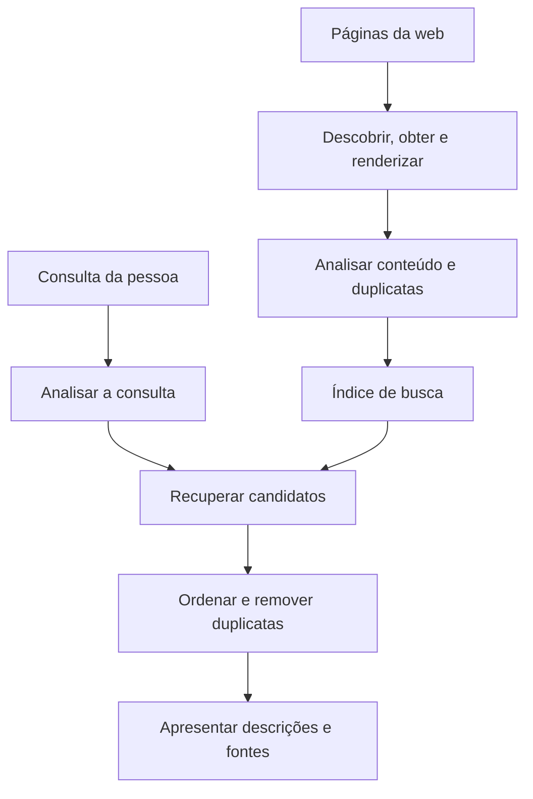
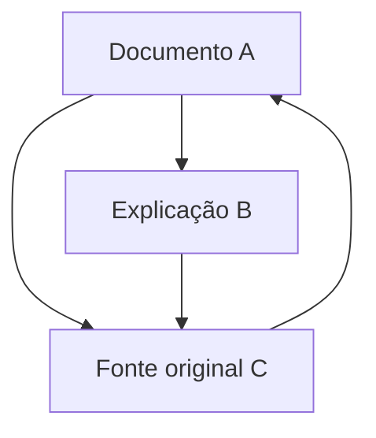
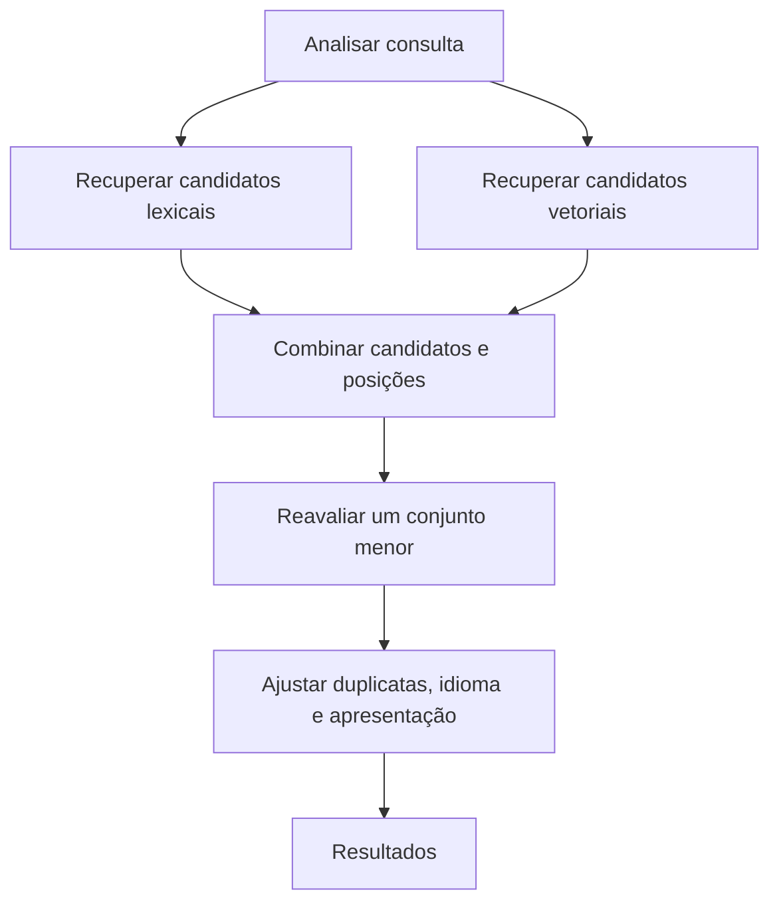

## 1. Cada busca lê a web inteira novamente?

Digitamos algumas palavras e logo aparecem resultados. O mecanismo não começa naquele momento a ler todos os sites: ele coleta informações continuamente e as organiza antes das consultas.

Numa biblioteca, pedir uma introdução à astronomia não exige reler todos os livros. Um catálogo de títulos, autores, assuntos e localizações reduz as opções. A velocidade da busca também depende de um índice preparado antecipadamente.

A web, porém, é menos estável. Páginas surgem, mudam e desaparecem; o mesmo conteúdo pode ter vários endereços. As descrições dos autores nem sempre são exatas. É necessário acompanhar atualizações, tratar duplicatas e selecionar conforme a pergunta.

As grandes etapas são **coleta, construção do índice e seleção de resultados para a consulta**. O Google também apresenta essa distinção. As fórmulas e arquiteturas abaixo explicam princípios gerais de recuperação de informação, não reproduzem classificações privadas de serviços comerciais. [Google: funcionamento da Pesquisa][google-overview]

## 2. Por que essa tecnologia se tornou necessária

Encontrar informação é um problema anterior à web. Catálogos bibliotecários e bases de documentos já precisavam de métodos de recuperação. Diretórios humanos funcionam em pequenas coleções, mas sua manutenção e a escolha da categoria certa ficam difíceis com o crescimento.

O Archie, lançado em 1990, pesquisava nomes de arquivos em servidores FTP. Não era uma busca moderna no texto completo de páginas. Seu desenvolvimento na Universidade McGill refletia a necessidade de localizar recursos dispersos por um serviço comum. [McGill: história do Archie][archie]

Tim Berners-Lee propôs a web no CERN em 1989; em 1993, o CERN colocou seus softwares básicos no domínio público. Com a expansão de documentos conectados, nomes deixaram de bastar: conteúdo e relações também precisavam ser examinados. [CERN: nascimento da web][web-history]

O artigo do Google de 1998 descreveu busca em grande escala usando estrutura de links e textos de âncora, além do conteúdo. Um único número inteligente não bastava. Coleta, armazenamento, compressão, indexação e classificação precisavam acompanhar o crescimento juntos. [Brin e Page: anatomia de um mecanismo de busca][google-paper]

A história também não se resume a palavras no passado e IA no presente. Termos exatos, relações, estatística e modelos linguísticos compensam limitações diferentes. Novos métodos não dispensam encontrar uma referência precisa ou atualizar o índice.

## 3. Quais endereços o rastreador visita?

Um rastreador obtém páginas, mas não existe um cadastro central completo de todas as URLs. Ele descobre endereços seguindo links conhecidos e consultando mapas do site.

Descoberta não implica coleta imediata. Uma fila administra prioridades de revisita, intervalos entre pedidos ao mesmo servidor, falhas e mudanças prováveis. Uma página de notícias e um documento estático antigo merecem frequências diferentes. Banda e processamento são recursos limitados.

O servidor de origem também não pode ser sobrecarregado. Acelerar até derrubá-lo contraria o objetivo da coleta. Respostas lentas e erros persistentes devem afetar a frequência.

Calendários e combinações de filtros podem criar praticamente infinitos endereços. Seguir cada link cegamente pode nunca terminar. Padrões de URL, duplicatas e mudanças de conteúdo ajudam a evitar ciclos pouco úteis.

Um mapa do site facilita a descoberta, mas não garante indexação ou boa posição. Conhecer a URL, conseguir obtê-la e decidir indexá-la são estados diferentes. [Google: mapas do site][sitemaps]

## 4. robots.txt, noindex e autenticação têm papéis diferentes

`robots.txt` informa aos rastreadores cooperativos quais caminhos não devem obter. A RFC 9309 distingue essas regras de autorização de acesso: não são uma fechadura para segredos. [RFC 9309: protocolo de exclusão de robôs][robots]

`noindex` solicita que mecanismos compatíveis não indexem uma página. Para ler a instrução nela, o Google precisa acessá-la. Bloquear a coleta enquanto se espera a leitura de `noindex` é contraditório. Uma URL bloqueada ainda pode ser conhecida por links externos. [Google: controle com noindex][noindex]

Autenticação e controle de acesso determinam quem pode obter o conteúdo. São fronteiras diferentes.

| Mecanismo | Principal controle | Não garante sozinho |
|---|---|---|
| robots.txt | Coleta por rastreadores cooperativos | Confidencialidade ou desaparecimento completo da URL |
| noindex | Inclusão em índices compatíveis | Impedimento de acesso ao conteúdo |
| Autenticação e permissões | Quem pode obter o conteúdo | Apagar todas as cópias já publicadas |

Não aparecer numa busca não significa ser ilegível. A distinção vale também para documentos internos de empresas.

## 5. O HTML obtido pode não ser a página visível

Alguns servidores devolvem o texto no HTML; outros deixam o JavaScript criá-lo depois. Nesse caso, baixar o arquivo inicial pode não revelar o que a pessoa vê. Pode ser necessário renderizar como um navegador.

O Google descreve rastreamento, renderização e indexação. Suportar JavaScript não garante processar qualquer página corretamente. Recursos bloqueados, scripts com erro e conteúdo exibido apenas após interação podem atrapalhar. [Google: fundamentos de JavaScript e busca][javascript]

Depois é preciso distinguir marcação, navegação, anúncios e conteúdo principal, além de tratar codificação e idioma. Contar a página inteira como uma sequência uniforme pode deixar menus repetidos encobrirem o assunto. Título, subtítulos e corpo fornecem evidências diferentes.

Conteúdo idêntico pode aparecer em versões de impressão ou URLs com parâmetros de rastreamento. Os mecanismos agrupam duplicatas e escolhem representantes. `rel="canonical"` sugere um endereço preferido; para o Google é um sinal, não uma ordem incondicional. [Google: URLs canônicas][canonical]

## 6. Transformar linguagem em unidades pesquisáveis

O computador precisa decidir quais trechos são termos de busca. Essa divisão é a tokenização. A normalização pode aproximar maiúsculas, variantes de caracteres e formas flexionadas.

O japonês normalmente não separa palavras com espaços. Uma frase sobre oficina de bicicletas requer análise linguística ou métodos como n-gramas de caracteres. Documentos e consultas precisam de processamento compatível. Kuromoji é um exemplo concreto de análise específica para japonês. [Livro de referência: tokenização][tokenization], [Elastic: análise japonesa][kuromoji]

Não convém eliminar toda diferença. Pontuação em C e C++, códigos de produtos ou identificadores químicos pode ser essencial. Expandir abreviações recupera mais candidatos, mas também pode introduzir outro significado.

É útil manter o original separado da representação de busca. O texto exibido não precisa ser reescrito para a máquina. A análise define quais variantes contam como equivalentes; não é simples limpeza visual.

## 7. O índice invertido muda a direção da pergunta

Ler um documento mostra suas palavras. A busca precisa do contrário: quais documentos contêm determinada palavra? O índice invertido armazena essa relação.

Considere uma coleção pequena, já dividida em termos.

| Documento | Termos representativos |
|---|---|
| D1 | bicicleta, reparo, ferramentas |
| D2 | bicicleta, deslocamento, segurança |
| D3 | relógio, reparo, ferramentas |
| D4 | bicicleta, reparo, preços |

A lista de bicicleta contém D1, D2 e D4; reparo contém D1, D3 e D4. A interseção dá D1 e D4. Comparar listas evita reler todos os textos. [Livro de referência: índices invertidos][inverted]

Registros também podem guardar frequências e posições. Identificadores ordenados podem ser comprimidos pelas diferenças entre eles, reduzindo a leitura de dados. Velocidade vem também do trabalho evitado, não apenas de mais processadores.

Nem toda consulta aplica um AND estrito; expressões alternativas podem entrar. Ainda assim, ir rapidamente de termos a documentos é fundamental na busca textual.

## 8. Por que as posições importam?

De Lisboa ao Porto e do Porto a Lisboa contêm os mesmos lugares, mas indicam viagens opostas. Aprendizado de máquina como expressão também difere de palavras muito afastadas num texto longo.

Um índice posicional registra onde aparecem os termos. Comparar posições consecutivas permite localizar expressões; proximidade pode ser evidência adicional de relevância. [Livro de referência: índices posicionais][positions]

Isso não produz compreensão completa. Negação, condições, pronomes e citações vão além de proximidade. O índice resolve recuperação eficiente de candidatos, não a verdade das afirmações.

Assim, uma página pode conter as palavras e não atender à necessidade. Correspondência é uma pista, não o objetivo em si.

## 9. Palavras raras e comuns têm pesos diferentes

Mil candidatos apresentados como iguais ajudam pouco. Um termo presente em poucos documentos costuma distinguir melhor o assunto do que uma palavra quase universal.

A frequência inversa de documentos, IDF, quantifica a ideia. Seja $N$ o total e $df(t)$ a quantidade de documentos com o termo $t$. Usamos uma variante positiva:

$$
\operatorname{IDF}(t)=\ln\left(1+\frac{N-df(t)+0.5}{df(t)+0.5}\right)
$$

Em 1.000 documentos, um termo presente em 10 recebe aproximadamente 4,56; presente em 500, cerca de 0,693. Uma ocorrência do termo raro distingue mais. Lucene documenta essa forma em sua implementação de BM25. [Apache Lucene: BM25Similarity][lucene]

Raridade não comprova verdade ou qualidade. Um erro de digitação pode ser raro, e uma página irrelevante pode listar jargão. IDF mede uma propriedade estatística, não credibilidade.

## 10. BM25 faz o benefício da repetição saturar

A frequência no documento é outra pista. Porém, se cem repetições valessem cem vezes uma, o excesso de palavras-chave seria premiado. Textos longos também contêm mais palavras e poderiam prejudicar respostas curtas e precisas.

BM25 reduz o benefício marginal das repetições e ajusta a extensão. Para consultas curtas, considere:

$$
S(d,q)=\sum_{t\in q}\operatorname{IDF}(t)
\frac{f(t,d)(k_1+1)}{f(t,d)+k_1\left(1-b+b\frac{|d|}{\overline L}\right)}
$$

$f(t,d)$ é a frequência, $|d|$ o comprimento e $\overline L$ o comprimento médio. $k_1$ controla saturação; $b$, normalização de tamanho. Variantes de IDF e constantes diferem entre implementações. [Livro de referência: BM25][bm25]

Com comprimento médio e $k_1=1.2$, o fator de frequência sem IDF é:

| Ocorrências | Fator de frequência |
|---|---:|
| 1 | 1,000 |
| 2 | 1,375 |
| 5 | 1,774 |
| 10 | 1,964 |
| Muito numerosas | Aproxima-se de 2,2 |

Passar de uma para duas ocorrências importa mais que de nove para dez. Repetir ainda ajuda, mas não ilimitadamente. Aqui $b=0$ elimina a normalização de tamanho, enquanto valores maiores a reforçam.

A pontuação BM25 não é normalmente a probabilidade de uma página estar correta. Compara candidatos para uma consulta num índice, não fornece notas absolutas entre consultas e coleções diferentes.

## 11. PageRank vai além de contar votos

Quando textos se parecem, links fornecem outra evidência: alguém escolheu a página como referência. Mas contar cada link como voto igual permitiria fabricar votos criando páginas.

PageRank considera a importância da origem e distribui seu peso entre os links de saída. Uma página citada por páginas importantes pode ganhar importância: o cálculo é recursivo.

Esta forma normalizada é didática. $N$ é o número de páginas, $L(u)$ a quantidade de saídas de $u$ e $\alpha$ a probabilidade de seguir um link. Suponha inicialmente que todas tenham alguma saída.

$$
PR(v)=\frac{1-\alpha}{N}
+\alpha\sum_{u\to v}\frac{PR(u)}{L(u)}
$$

Imagine um visitante aleatório que segue links com probabilidade $\alpha$ e, caso contrário, salta para uma página aleatória. Atualizações sucessivas levam à distribuição de sua localização no longo prazo. Páginas sem saídas precisam de uma regra adicional, como redistribuir seu peso a todas.

Com $\alpha=0.85$, os valores estacionários aproximados são A = 0,388, B = 0,215 e C = 0,397. C recebe referências de A e B, enquanto B recebe apenas parte do peso de A. Origem e divisão importam, não só a quantidade de links recebidos.

Esse modelo explica PageRank, não toda classificação atual. Links não determinam diretamente intenção ou verdade. Uma página antiga famosa pode não servir ao horário ferroviário de hoje. [Artigo original de Brin e Page][google-paper], [Google: sistemas de classificação][ranking]

## 12. Das palavras à intenção

Quem pesquisa um notebook esquentando pode querer refrigeração ou diagnóstico, não uma definição de termodinâmica. Banco pode ser instituição financeira ou assento. O contexto importa.

Correção ortográfica, sinônimos e reconhecimento de lugares ou produtos ampliam candidatos. Correções impostas, porém, atrapalham referências exatas e nomes raros. Preservar a consulta, explicar mudanças e permitir correspondência estrita ajuda. [Livro de referência: correção ortográfica][spelling]

A busca semântica representa perguntas e documentos por vetores numéricos e compara sua proximidade. A bateria acaba rápido e melhorar a autonomia podem estar relacionados sem palavras idênticas.

A similaridade de cosseno mede a proximidade direcional entre $\mathbf q$ e $\mathbf d$:

$$
\operatorname{sim}(\mathbf q,\mathbf d)=
\frac{\mathbf q\cdot\mathbf d}{\|\mathbf q\|\|\mathbf d\|}
$$

Essa proximidade pertence à representação aprendida. A bateria pode ser trocada e a bateria não pode ser trocada compartilham quase tudo, mas diferem essencialmente. Vetores próximos não garantem resposta correta. Modelo, tamanho dos trechos e consultas de avaliação devem ser verificados juntos. [Elastic: busca vetorial][vector]

## 13. Não aplicar o modelo mais caro a todas as páginas

Modelos de análise detalhada ajudam, mas examinar toda a coleção a cada pergunta custa tempo e dinheiro. Uma arquitetura útil separa recuperação ampla e rápida de reordenação detalhada de poucos candidatos.

Busca lexical ou aproximada de vizinhos próximos fornece a primeira seleção. Um modelo mais caro reavalia depois. A aproximação troca velocidade e memória pelo risco de perder vizinhos verdadeiros. Um documento excluído inicialmente não pode ser recuperado pela reordenação.

A busca lexical ajuda com nomes e identificadores; a semântica, com reformulações. Busca híbrida combina ambas, mas somar pontuações de escalas diferentes pode fazer uma dominar.

A fusão por posições recíprocas, RRF, é uma alternativa. Para documento $d$ na posição $r_i(d)$ da lista $i$, somam-se as listas em que ele aparece:

$$
\operatorname{RRF}(d)=\sum_i\frac{1}{k+r_i(d)}
$$

A constante positiva $k$ controla a influência das primeiras posições. É uma regra de combinação, não probabilidade. Uma lista que não contém o documento não contribui. Elasticsearch documenta a união de resultados lexicais e vetoriais com RRF. [Elastic: RRF][rrf]

É um exemplo de arquitetura, não uma afirmação de que todo serviço segue etapas iguais. O essencial é separar redução de omissões e ordenação fina.

## 14. Ordenar não encerra o trabalho

Se páginas quase iguais do mesmo site ocupam todas as primeiras posições, resta pouco para comparar. Sistemas podem reduzir duplicatas, considerar perspectivas distintas e ajustar idioma ou região.

Localização importa para uma oficina próxima, mas de outra forma para a história da bicicleta. Atualidade também depende da pergunta: transporte numa emergência requer informação recente; uma demonstração matemática não melhora apenas por ter data nova.

Títulos e trechos ajudam a decidir. Entretanto, um extrato escolhido para a consulta pode omitir condições do restante. Não equivale automaticamente à conclusão completa da fonte.

Anúncios e resultados naturais também diferem. Publicidade e classificação orgânica usam mecanismos distintos. O Google afirma que pagamento não compra posições orgânicas superiores nem rastreamento mais frequente. [Google: funcionamento][google-overview]

## 15. Pesquisar rapidamente num índice enorme

Uma máquina limita capacidade, desempenho e tolerância a falhas. Sistemas distribuídos dividem o índice, pesquisam suas partes em máquinas diferentes e combinam respostas. Essas partições costumam ser chamadas de shards.

Na divisão por documentos, cada fragmento recebe a consulta e devolve candidatos promissores. Um coordenador compara o conjunto. Estatísticas locais de frequência podem diferir, afetando a comparabilidade das notas. Estatísticas locais e globais influenciam a qualidade, além da velocidade. [Livro de referência: distribuição de índices][distributed]

Particionar não é replicar. O primeiro divide dados e trabalho; o segundo mantém cópias. Réplicas ajudam com falhas e carga, mas criam problemas de propagação de mudanças.

Quando muitas máquinas participam, a resposta mais lenta pode alongar o total. Importa observar a parte lenta da experiência, não apenas a média. Esperar tudo, impor prazos ou tentar outra réplica envolve equilíbrio entre completude e rapidez.

Caches de resultados frequentes ou cálculos intermediários poupam trabalho. Reusar sempre a resposta de ontem pode esconder atualizações e exclusões. Velocidade precisa de políticas de atualização.

## 16. Inclusões, mudanças e exclusões precisam chegar ao índice

Modificar uma página não altera imediatamente o índice externo. Coleta, análise, atualização e apresentação levam tempo. Resultados representam informação observada e processada, não toda a web a cada instante.

Uma busca própria precisa de caminhos de atualização e exclusão desde o início. Se cada importação cria um documento novo, duplicatas se acumulam. Identificadores estáveis permitem substituir o registro certo; exclusões também devem alcançar réplicas consultadas.

Na empresa, alterar permissões é uma atualização. Um documento hoje confidencial não deve vazar por um título ou trecho antigo. Direitos são verificados antes de gerar resultados e precisam ser respeitados pelos caches.

Numa reconstrução, o índice antigo pode continuar atendendo até o novo estar completo e validado, seguido da troca. Usuários não deveriam pesquisar um índice pela metade. Práticas operacionais discretas sustentam a confiabilidade.

## 17. Resistência a spam faz parte da busca

Classificação afeta tráfego e receita, incentivando manipulação. Repetição excessiva, links artificiais e muitas páginas pobres são exemplos. Não se pode presumir boa-fé em todos os documentos.

As políticas do Google tratam de excesso de palavras-chave e spam de links. Qualidade inclui resistir à exploração das métricas, além de encontrar termos relacionados. [Google: políticas de spam][spam]

Muitos links não provam verdade; extensão não prova profundidade; novidade não prova confiabilidade. Quando uma medida indireta vira objetivo, pode ser otimizada sem melhorar a utilidade. São necessários vários sinais, avaliação contínua e investigação de falsos positivos.

Descartar sites pequenos desconhecidos também seria errado. Uma fonte especializada nova talvez tenha poucos links. A busca precisa aproveitar evidências consolidadas e ainda descobrir informação nova de valor.

## 18. Como medir uma boa busca?

Rapidez não basta se falta o documento necessário. A avaliação usa consultas representativas e julgamentos de relevância.

Duas medidas básicas são precisão e revocação, também chamada de recall. Sejam $A$ o conjunto retornado e $R$ o relevante:

$$
\operatorname{Precision}=\frac{|A\cap R|}{|A|}
$$

$$
\operatorname{Recall}=\frac{|A\cap R|}{|R|}
$$

Se existem oito documentos relevantes e quatro dos cinco retornados são relevantes, a precisão é 4/5, ou 80%, e a revocação 4/8, ou 50%. Restringir a resultados seguros costuma ajudar a precisão; ampliar a recuperação costuma ajudar a revocação. Melhorias nem sempre exigem piorar a outra medida. [Livro de referência: avaliação de conjuntos][evaluation]

| Pergunta | Medida ou verificação |
|---|---|
| Os resultados são principalmente úteis? | Precisão |
| Documentos necessários estão faltando? | Revocação |
| As primeiras posições ajudam? | Precisão até um corte e métricas de ordenação |
| A resposta chega rápido? | Mediana e parte lenta da distribuição |
| Mudanças e direitos são respeitados? | Atraso de atualização, exclusões e acesso |

Um documento relevante em primeiro lugar difere do mesmo na centésima posição. NDCG e outras métricas consideram grau de relevância e posição. Separar avaliação por idioma, tipo ou tamanho da consulta revela dificuldades escondidas na média geral. [Livro de referência: resultados ordenados][ranked-evaluation]

Cliques não são verdade absoluta. A pessoa pode clicar porque algo aparece primeiro ou tem título chamativo e sair decepcionada. Um trecho útil também pode resolver sem clique. O comportamento observado precisa de interpretação.

## 19. Respostas de IA ainda dependem de recuperação

A geração aumentada por recuperação, RAG, fornece documentos encontrados a um modelo que redige uma resposta. Um trabalho de 2020 apresentou uma forma de combinar modelo pré-treinado e informação externa recuperada. [Lewis e colaboradores: RAG][rag]

Recuperação e geração continuam tarefas distintas. Perder a fonte correta deixa a resposta sem base. Mesmo com a fonte certa, a geração pode omitir condições ou misturar afirmações. Adicionar busca não elimina todo erro.

Uma citação também não comprova cada frase. A fonte precisa conter a afirmação; data e contexto devem corresponder; contradições precisam ser examinadas.

Avaliar separadamente omissões, atualidade e correspondência entre resposta e evidência ajuda a localizar falhas. Instruções dentro de documentos externos não devem virar comandos do sistema. Documentos informam; não são administradores que concedem permissões.

A IA acrescenta processamento e verificação sobre índices e fontes. Quanto mais fácil de ler uma resposta, mais importante poder rastrear sua construção.

## 20. Atrás da caixa de busca há preparação e decisões

Imagine procurar ferramentas para reparar um pneu de bicicleta. Antes da consulta, páginas já foram coletadas e organizadas por termos, posições e relações. Depois, normaliza-se a pergunta, recuperam-se candidatos e ordenam-se conforme a tarefa.

Ajustam-se duplicatas, idioma, descrições e apresentação. Máquinas cooperam enquanto propagam mudanças, exclusões e direitos. Uma resposta rápida depende de preparação extensa e manutenção permanente.

Para quem publica, a base é conteúdo acessível, títulos e links claros, relações coerentes entre duplicatas e idiomas e explicações úteis. Truques escondidos não substituem essa base, que também não garante posição específica.

Para quem pesquisa, aparecer no topo não prova correção absoluta. Tornar a pergunta mais precisa, verificar datas e fontes e tentar outras expressões fornece mais elementos para decidir.

Um buscador não é um espelho perfeito do mundo. **Ele organiza o que consegue observar e, sob limites de tempo, constrói uma ordem para ajudar numa pergunta.** Entender as restrições explica sua rapidez, suas omissões e como interpretar os resultados.

## Fontes e alcance das ilustrações

O artigo reúne princípios gerais e documentação pública. BM25, PageRank e RRF são modelos didáticos, não notas privadas de serviços comerciais. Os diagramas simplificam processos. A capa gerada por IA é conceitual, não representa instalação ou interface real.

- [Google: visão geral][google-overview], [mapas do site][sitemaps], [JavaScript][javascript], [noindex][noindex], [URLs canônicas][canonical]
- [Google: classificação][ranking], [políticas de spam][spam]
- [CERN: história da web][web-history], [McGill: Archie][archie], [Brin e Page][google-paper]
- [Livro de referência: tokenização][tokenization], [índices invertidos][inverted], [posições][positions], [BM25][bm25], [índices distribuídos][distributed], [ortografia][spelling]
- [Livro de referência: precisão e revocação][evaluation], [avaliação de posições][ranked-evaluation], [Lucene: BM25][lucene]
- [Elastic: análise japonesa][kuromoji], [busca vetorial][vector], [RRF][rrf], [artigo original RAG][rag]
- [RFC 9309: regras para rastreadores][robots]

[google-overview]: https://developers.google.com/search/docs/fundamentals/how-search-works
[archie]: https://200.mcgill.ca/history/creation-of-the-first-internet-search-engine/
[web-history]: https://home.cern/science/computing/the-birth-of-the-web/where-web-was-born/
[google-paper]: https://infolab.stanford.edu/~backrub/google.html
[sitemaps]: https://developers.google.com/search/docs/crawling-indexing/sitemaps/overview
[robots]: https://www.rfc-editor.org/rfc/rfc9309.html
[noindex]: https://developers.google.com/search/docs/crawling-indexing/block-indexing
[javascript]: https://developers.google.com/search/docs/crawling-indexing/javascript/javascript-seo-basics
[canonical]: https://developers.google.com/search/docs/crawling-indexing/consolidate-duplicate-urls
[tokenization]: https://nlp.stanford.edu/IR-book/html/htmledition/tokenization-1.html
[kuromoji]: https://www.elastic.co/docs/reference/elasticsearch/plugins/analysis-kuromoji
[inverted]: https://nlp.stanford.edu/IR-book/html/htmledition/an-example-information-retrieval-problem-1.html
[positions]: https://nlp.stanford.edu/IR-book/html/htmledition/positional-indexes-1.html
[lucene]: https://lucene.apache.org/core/9_9_1/core/org/apache/lucene/search/similarities/BM25Similarity.html
[bm25]: https://nlp.stanford.edu/IR-book/html/htmledition/okapi-bm25-a-non-binary-model-1.html
[ranking]: https://developers.google.com/search/docs/appearance/ranking-systems-guide
[spelling]: https://nlp.stanford.edu/IR-book/html/htmledition/implementing-spelling-correction-1.html
[vector]: https://www.elastic.co/docs/solutions/search/vector
[rrf]: https://www.elastic.co/docs/reference/elasticsearch/rest-apis/reciprocal-rank-fusion
[distributed]: https://nlp.stanford.edu/IR-book/html/htmledition/distributing-indexes-1.html
[spam]: https://developers.google.com/search/docs/essentials/spam-policies
[evaluation]: https://nlp.stanford.edu/IR-book/html/htmledition/evaluation-of-unranked-retrieval-sets-1.html
[ranked-evaluation]: https://nlp.stanford.edu/IR-book/html/htmledition/evaluation-of-ranked-retrieval-results-1.html
[rag]: https://arxiv.org/abs/2005.11401
