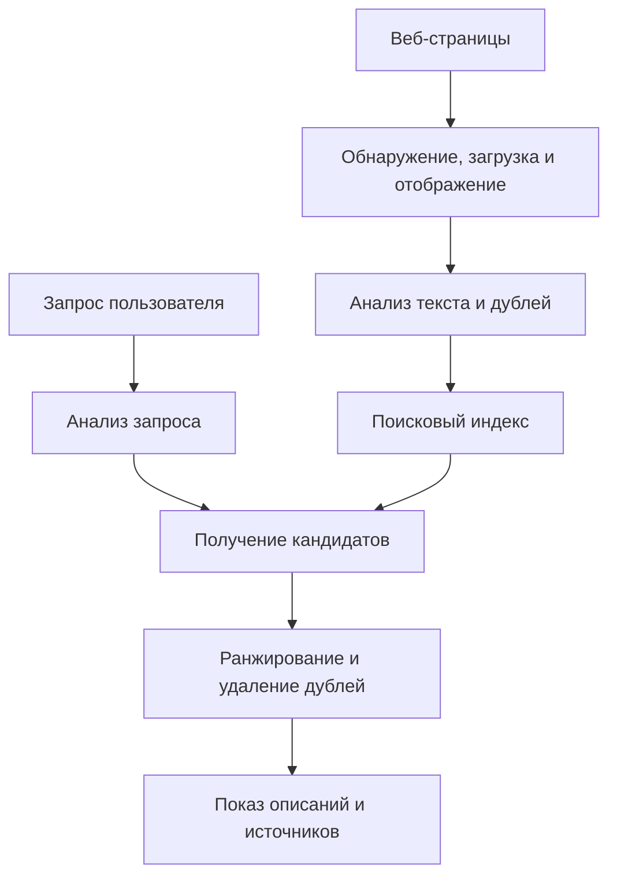
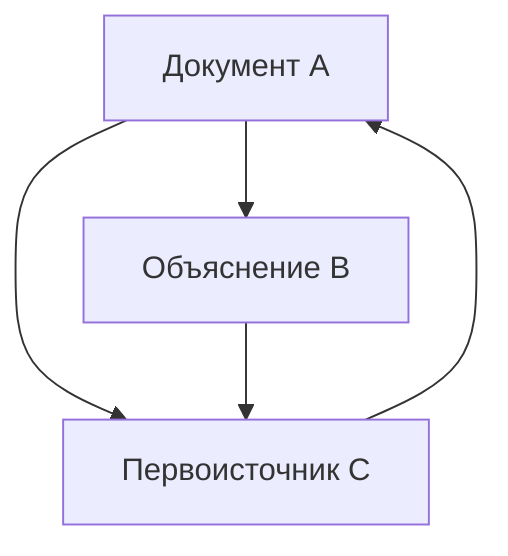
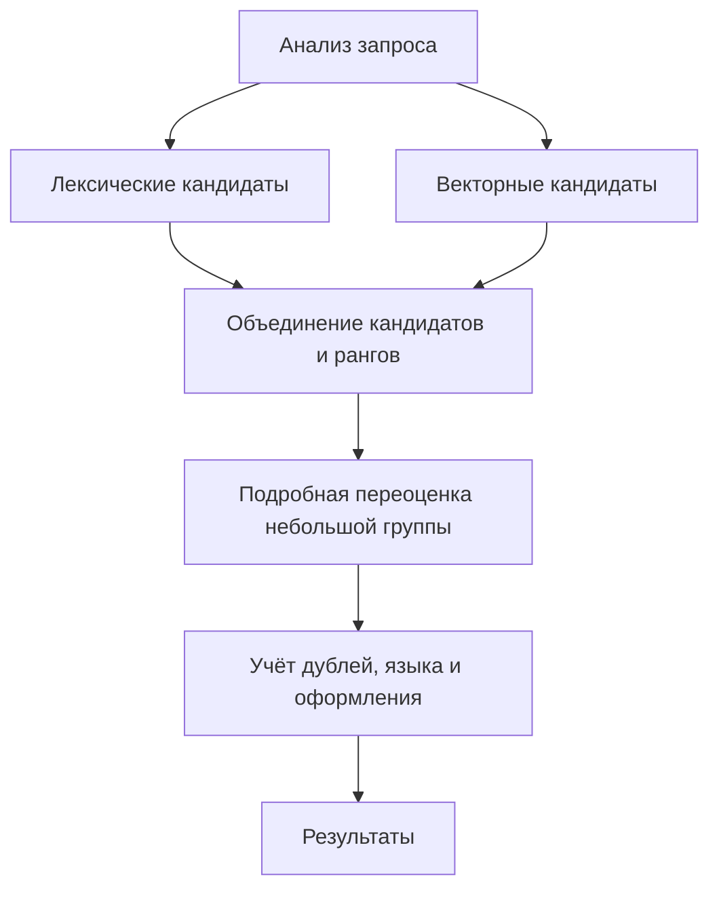

## 1. Читает ли каждый поиск весь интернет заново?

После нескольких слов в строке поиска быстро появляются результаты. Но система не начинает в этот момент читать все сайты: она заранее собирает и организует информацию.

В библиотеке просьба найти введение в астрономию не заставляет перечитать все книги. Каталог названий, авторов, тем и мест хранения сужает выбор. Скорость поиска тоже опирается на предварительно построенный индекс.

Веб менее устойчив: страницы появляются, меняются и исчезают, одинаковое содержание бывает по разным адресам. Описания авторов не всегда точны. Нужны обновление, обработка дублей и выбор под конкретный вопрос.

Основные этапы — **сбор информации, построение индекса и подбор результатов по запросу**. Google также использует это разделение. Ниже рассматриваются общие принципы информационного поиска, а не восстановление закрытой формулы какого-либо сервиса. [Google: устройство поиска][google-overview]

## 2. Зачем понадобилась технология поиска?

Задача старше веба: библиотечные каталоги и документальные базы уже требовали методов поиска. Ручные рубрикаторы удобны для небольших коллекций, но при росте сложнее и поддерживать категории, и выбирать нужную.

Archie, появившаяся в 1990 году, искала имена файлов в FTP-архивах. Это не был современный полнотекстовый поиск веб-страниц. Разработка в Университете Макгилла отвечала потребности находить распределённые ресурсы через общий сервис. [Макгилл: история Archie][archie]

Тим Бернерс-Ли предложил веб в CERN в 1989 году, а в 1993-м CERN передал базовое веб-программное обеспечение в общественное достояние. С ростом связанных документов имён стало недостаточно: понадобились содержание и отношения. [CERN: рождение веба][web-history]

Статья Google 1998 года описывала крупномасштабный поиск по тексту, ссылкам и их подписям. Одной удачной оценки было недостаточно: обход, хранение, сжатие, индексирование и ранжирование должны были развиваться вместе. [Брин и Пейдж: устройство поисковой системы][google-paper]

История не сводится к переходу от слов к ИИ. Точные термины, отношения, статистика и языковые модели компенсируют разные недостатки. Новые методы не отменяют точного поиска номера модели или обновления индекса.

## 3. Какие адреса посещает робот?

Робот загружает страницы, но полного центрального реестра всех URL нет. Он обнаруживает адреса через ссылки известных страниц и карты сайтов.

Обнаружить не значит немедленно загрузить. Очередь управляет приоритетом повторных посещений, интервалами запросов к одному серверу, ошибками и ожидаемыми изменениями. Новостная главная страница и неизменный старый документ требуют разной частоты. Пропускная способность и вычисления ограничены.

Нельзя перегружать источник. Ускорять сбор до отказа чужого сервера противоречит цели. Медленные ответы и повторяющиеся ошибки должны менять частоту обхода.

Календари и комбинации фильтров способны порождать практически бесконечные адреса. Слепое следование каждой ссылке может не закончиться. Шаблоны URL, дубли и изменения содержания помогают избегать малополезных циклов.

Карта сайта помогает обнаружению, но не гарантирует индексирование или высокую позицию. Знать URL, суметь загрузить страницу и включить её в индекс — разные состояния. [Google: карты сайтов][sitemaps]

## 4. robots.txt, noindex и авторизация решают разные задачи

`robots.txt` сообщает сотрудничающим роботам, какие пути не следует загружать. RFC 9309 прямо отделяет эти правила от разрешения доступа. Это не замок для секретной информации. [RFC 9309: протокол исключения роботов][robots]

`noindex` просит поддерживающий механизм не индексировать страницу. Чтобы прочитать указание внутри страницы, Google должен получить к ней доступ. Запретить загрузку и одновременно ожидать чтения `noindex` невозможно. Заблокированный URL может оставаться известным по внешним ссылкам. [Google: управление индексированием][noindex]

Аутентификация и контроль доступа определяют, кто вообще может получить содержание. Это другая граница.

| Механизм | Что контролирует | Чего сам по себе не гарантирует |
|---|---|---|
| robots.txt | Загрузку сотрудничающими роботами | Секретность или полное исчезновение URL |
| noindex | Включение в поддерживающие индексы | Запрет чтения содержания |
| Аутентификация и права | Кому доступно содержание | Удаление всех уже опубликованных копий |

Отсутствие в поиске не означает недоступности для чтения. Различие важно и для внутренних корпоративных документов.

## 5. Загруженный HTML не всегда совпадает с видимой страницей

Некоторые серверы сразу возвращают текст в HTML, другие поручают создание содержания JavaScript. Во втором случае первоначального файла может быть недостаточно: требуется обработка, похожая на работу браузера.

Google описывает обход, отрисовку и индексирование. Поддержка JavaScript не гарантирует правильную обработку любой страницы. Заблокированные ресурсы, ошибки скриптов и содержание после взаимодействия могут помешать. [Google: основы JavaScript и поиска][javascript]

Далее различают разметку, меню, рекламу и основной текст, учитывают кодировку и язык. Если считать страницу одной недифференцированной строкой, повторяющаяся навигация может заслонить тему. Заголовки и основной текст дают разные сигналы.

Одинаковое содержание бывает у печатной версии и URL с параметрами отслеживания. Системы группируют дубли и выбирают представителей. `rel="canonical"` предлагает предпочтительный адрес; для Google это сигнал, а не безусловная команда. [Google: канонические URL][canonical]

## 6. Превращение языка в поисковые единицы

Компьютеру нужны правила выделения терминов. Разбиение называется токенизацией. Нормализация затем может согласовать регистр, варианты символов или словоформы.

В японском слова обычно не разделены пробелами. Фразе о велосипедной мастерской нужен языковой анализ или, например, символьные n-граммы. Документы и запросы должны обрабатываться совместимо. Kuromoji — пример специального анализа японского текста. [Учебник: токенизация][tokenization], [Elastic: японский анализ][kuromoji]

Нельзя стирать все различия. Пунктуация в C и C++, кодах изделий или химических обозначениях бывает существенной. Раскрытие сокращений добавляет кандидатов, но может привнести другой смысл.

Полезно хранить оригинал отдельно от поискового представления. Видимый текст не требуется переписывать для машины. Языковая обработка определяет эквивалентность вариантов, а не просто очищает оформление.

## 7. Обратный индекс меняет направление вопроса

Читая документ, мы узнаём его слова. Поиск спрашивает наоборот: в каких документах есть это слово? Обратный индекс хранит такую связь.

Рассмотрим небольшую уже разбитую на термины коллекцию.

| Документ | Характерные термины |
|---|---|
| D1 | велосипед, ремонт, инструменты |
| D2 | велосипед, поездки, безопасность |
| D3 | часы, ремонт, инструменты |
| D4 | велосипед, ремонт, цены |

Список для велосипеда содержит D1, D2, D4; для ремонта — D1, D3, D4. Пересечение даёт D1 и D4. Сравнение списков заменяет повторное чтение всех текстов. [Учебник: обратные индексы][inverted]

Записи могут содержать частоты и позиции. Отсортированные идентификаторы удобно хранить как сжатые разности, сокращая чтение данных. Ускорение достигается и устранением ненужной работы, не только добавлением процессоров.

Не каждый запрос использует строгое И: можно учитывать альтернативные формулировки. Но быстрый переход от термина к документам остаётся основой полнотекстового поиска.

## 8. Зачем нужны позиции слов?

Из Москвы в Казань и из Казани в Москву называют одинаковые города, но противоположные маршруты. Машинное обучение как выражение также отличается от двух далёких слов в длинном тексте.

Позиционный индекс хранит места появления терминов. Проверка соседних позиций позволяет искать фразы; близость может быть дополнительным свидетельством релевантности. [Учебник: позиционные индексы][positions]

Это не полное понимание. Отрицания, условия, местоимения и цитаты требуют большего, чем соседство. Индекс обеспечивает быстрый подбор кандидатов, а не проверку истины.

Поэтому страница может содержать слова запроса и не удовлетворять потребность. Совпадение — подсказка, а не сама цель.

## 9. Редкие и частые слова имеют разную различающую силу

Тысяча равноправных кандидатов мало помогает. Термин, встречающийся лишь в немногих документах, часто точнее выделяет тему, чем почти универсальное слово.

Обратная документная частота, IDF, выражает эту идею численно. Пусть $N$ — число документов, а $df(t)$ — число содержащих термин $t$. Возьмём положительный вариант:

$$
\operatorname{IDF}(t)=\ln\left(1+\frac{N-df(t)+0.5}{df(t)+0.5}\right)
$$

В 1 000 документах термин, присутствующий в 10, получает около 4,56; присутствующий в 500 — около 0,693. Одно совпадение редкого термина сильнее различает кандидатов. Такой вариант описан в реализации BM25 Lucene. [Apache Lucene: BM25Similarity][lucene]

Редкость не доказывает правдивость или качество. Опечатки тоже редки, а нерелевантная страница может перечислять жаргон. IDF — статистическая характеристика, не достоверность.

## 10. BM25 ограничивает пользу повторений

Частота слова внутри документа тоже полезна. Но если сто повторов в сто раз лучше одного, выигрывает набивка ключевыми словами. Длинные тексты содержат больше слов и могут вытеснять краткие точные объяснения.

BM25 уменьшает добавочную пользу повторов и учитывает длину. Для короткого запроса рассмотрим:

$$
S(d,q)=\sum_{t\in q}\operatorname{IDF}(t)
\frac{f(t,d)(k_1+1)}{f(t,d)+k_1\left(1-b+b\frac{|d|}{\overline L}\right)}
$$

$f(t,d)$ — частота, $|d|$ — длина, $\overline L$ — средняя длина. $k_1$ управляет насыщением, $b$ — нормализацией длины. Варианты IDF и константы различаются между реализациями. [Учебник: BM25][bm25]

При средней длине и $k_1=1.2$ частотный множитель без IDF равен:

| Число вхождений | Частотный множитель |
|---|---:|
| 1 | 1,000 |
| 2 | 1,375 |
| 5 | 1,774 |
| 10 | 1,964 |
| Очень много | Стремится к 2,2 |

Переход от одного к двум важнее перехода от девяти к десяти. Повторы помогают, но не бесконечно. Здесь $b=0$ убирает нормализацию длины, а большие значения усиливают её.

Оценка BM25 обычно не является вероятностью правильности страницы. Она сравнивает кандидатов для конкретного запроса и индекса, а не задаёт абсолютную оценку между разными коллекциями.

## 11. PageRank — не простое голосование

Когда тексты похожи, ссылки дают другой сигнал: кто-то выбрал страницу как источник. Но равный голос каждого адреса позволял бы создавать голоса массовым выпуском страниц.

PageRank учитывает важность источника и делит его вес между исходящими ссылками. Страница, на которую ссылаются важные страницы, сама может стать важной. Расчёт рекурсивен.

Ниже нормализованная учебная форма. $N$ — число страниц, $L(u)$ — число исходящих ссылок страницы $u$, $\alpha$ — вероятность перехода по ссылке. Сначала предполагаем, что выход есть у каждой страницы.

$$
PR(v)=\frac{1-\alpha}{N}
+\alpha\sum_{u\to v}\frac{PR(u)}{L(u)}
$$

Случайный посетитель с вероятностью $\alpha$ идёт по ссылке, иначе прыгает на случайную страницу. Повторные обновления приводят к распределению долгосрочного местонахождения. Страницам без выходов нужна дополнительная обработка, например распределение их веса по всем страницам.

При $\alpha=0.85$ стационарные значения примерно равны A = 0,388, B = 0,215, C = 0,397. C получает ссылки от A и B, а B — лишь часть веса A. Важны источники и распределение, не только количество входящих ссылок.

Модель объясняет PageRank, а не всё современное ранжирование. Ссылки напрямую не устанавливают намерение или истину. Известная старая страница не обязательно подходит для сегодняшнего расписания. [Оригинальная работа Брина и Пейджа][google-paper], [Google: системы ранжирования][ranking]

## 12. От совпадения слов к намерению

Запрос о горячем ноутбуке может означать поиск охлаждения или устранения неисправности, а не определения термодинамики. Английское bank может означать банк или берег. Контекст необходим.

Исправление опечаток, синонимы и распознавание названий расширяют выбор. Но навязанная коррекция мешает точным кодам и редким именам. Полезно сохранять исходный запрос, объяснять изменения и позволять строгий поиск. [Учебник: исправление написания][spelling]

Семантический поиск может представлять запросы и документы числовыми векторами и сравнивать близость. Батарея быстро садится и увеличение времени автономной работы могут быть связаны без одинаковых слов.

Косинусная близость векторов $\mathbf q$ и $\mathbf d$ равна:

$$
\operatorname{sim}(\mathbf q,\mathbf d)=
\frac{\mathbf q\cdot\mathbf d}{\|\mathbf q\|\|\mathbf d\|}
$$

Близость относится к выученному представлению. Батарею можно заменить и батарею нельзя заменить разделяют почти все слова, но существенно различаются. Близкие векторы не гарантируют правильного ответа. Модель, размер фрагментов и тестовые вопросы оценивают вместе. [Elastic: векторный поиск][vector]

## 13. Не применять самую дорогую модель ко всем страницам

Подробный анализ смысла полезен, но проверять всю коллекцию для каждого запроса слишком затратно. Поэтому широкое быстрое извлечение отделяют от точной переоценки небольшой группы.

Лексический поиск или приближённый поиск ближайших соседей даёт начальных кандидатов. Затем работает более дорогая модель. Приближение экономит время и память ценой возможного пропуска настоящих соседей. Документ, не попавший в первую выборку, последующий этап уже не спасёт.

Лексика полезна для имён и идентификаторов, семантика — для перефразирования. Гибридный поиск соединяет их. Но разные шкалы оценок делают прямое сложение рискованным: один метод может подавить другой.

Reciprocal Rank Fusion, RRF, предлагает альтернативу. Если документ $d$ занимает место $r_i(d)$ в списке $i$, суммируем по спискам, где он присутствует:

$$
\operatorname{RRF}(d)=\sum_i\frac{1}{k+r_i(d)}
$$

Положительная константа $k$ регулирует влияние верхних мест. Это правило объединения, не вероятность. Отсутствие документа в списке означает нулевой вклад этого списка. Elasticsearch описывает объединение лексических и векторных результатов через RRF. [Elastic: RRF][rrf]

Это пример архитектуры, не утверждение об одинаковых этапах всех сервисов. Суть — разделить уменьшение пропусков и точное упорядочивание.

## 14. Ранжирование — ещё не конец

Если первые места заняты почти одинаковыми страницами одного сайта, пользователю нечего сравнивать. Система может уменьшать дубли, учитывать разные взгляды, язык и регион.

Местоположение важно для ближайшей велосипедной мастерской, но иначе для истории велосипеда. Свежесть тоже зависит от вопроса: транспорт в чрезвычайной ситуации требует актуальности, а математическое доказательство не становится лучше от новой даты.

Заголовки и фрагменты помогают выбрать результат. Однако отрывок, подобранный по запросу, может опустить условия. Он не равен полной мысли источника.

Реклама также отличается от обычной выдачи. Оплаченные места и органическое ранжирование устроены по-разному. Google указывает, что оплатой нельзя купить высокий органический ранг или более частый обход. [Google: устройство поиска][google-overview]

## 15. Быстро искать в огромном индексе

Один компьютер ограничивает объём, скорость и отказоустойчивость. Распределённые системы делят индекс, ищут в частях на разных машинах и объединяют ответы. Такие части часто называют шардами.

При разделении по документам каждый шард получает запрос и возвращает перспективных кандидатов. Координатор сравнивает их. Но локальные частоты документов могут различаться, влияя на сопоставимость оценок. Локальная и глобальная статистика затрагивает качество. [Учебник: распределение индексов][distributed]

Разделение отличается от репликации. Первое распределяет данные или работу, второе хранит несколько копий. Копии помогают при сбоях и нагрузке, но усложняют доставку обновлений.

При множестве участников самый медленный ответ способен увеличить общее ожидание. Важны не только средние задержки, но и опыт медленных запросов. Ждать всех, ставить срок или обращаться к другой копии — компромиссы между полнотой и скоростью.

Кэширование частых результатов и промежуточных расчётов экономит работу. Но постоянное повторение вчерашнего ответа скрывает изменения и удаления. Ускорение требует контроля свежести.

## 16. Добавления, изменения и удаления должны попасть в индекс

Изменённая страница не обязательно немедленно меняется во внешнем индексе. Загрузка, анализ, обновление и выдача занимают время. Результаты представляют наблюдавшуюся и обработанную информацию, а не весь веб каждую секунду.

Собственная система должна заранее предусмотреть обновления и удаления. Если каждый импорт создаёт новый документ, накапливаются дубли. Постоянные идентификаторы позволяют заменить нужную запись; удаление должно дойти до поисковых реплик.

В компании смена прав — тоже обновление. Сегодня секретный документ не должен раскрыться через вчерашний заголовок или фрагмент. Права проверяют до формирования выдачи и учитывают в кэше.

При перестроении старый индекс может обслуживать запросы, пока новый не завершён и не проверен. Затем выполняют переключение. Пользователь не должен искать по полуготовой базе. Такие эксплуатационные детали обеспечивают надёжность.

## 17. Борьба со спамом — часть поиска

Ранг влияет на посещаемость и доход и создаёт стимул к манипуляции. Повторы ключевых слов, искусственные ссылки и множество малополезных страниц — примеры. Нельзя предполагать добросовестность всех документов.

Правила Google рассматривают ключевой и ссылочный спам. Качество поэтому включает сопротивление эксплуатации метрик, а не только совпадение терминов. [Google: правила против спама][spam]

Много ссылок не доказывает истину, длина не доказывает глубину, новизна — надёжность. Когда косвенная мера становится целью, её оптимизируют без улучшения пользы. Нужны разные сигналы, постоянная оценка и разбор ложных срабатываний.

Но отвергать неизвестные небольшие сайты тоже неправильно. Новый экспертный материал может иметь мало ссылок. Система должна использовать накопленные свидетельства и обнаруживать новое полезное содержание.

## 18. Как измерить хороший поиск?

Скорость бесполезна, если нужный документ отсутствует. Оценка использует представительные запросы и суждения о релевантности.

Два базовых показателя — точность и полнота. Пусть $A$ — найденное множество, $R$ — релевантное:

$$
\operatorname{Precision}=\frac{|A\cap R|}{|A|}
$$

$$
\operatorname{Recall}=\frac{|A\cap R|}{|R|}
$$

Если релевантных документов восемь, а среди пяти найденных релевантны четыре, точность равна 4/5, или 80%, полнота — 4/8, или 50%. Сужение к уверенным совпадениям часто повышает точность, расширение — полноту. Но улучшение одного не всегда требует ухудшения другого. [Учебник: оценка множеств][evaluation]

| Вопрос | Показатель или проверка |
|---|---|
| Большинство результатов полезны? | Точность |
| Нужные документы пропущены? | Полнота |
| Полезны первые позиции? | Точность до заданного ранга и ранговые меры |
| Ответ достаточно быстр? | Медиана и медленная часть распределения |
| Учтены изменения и права? | Задержка обновления, удаления, контроль доступа |

Релевантный документ на первом месте отличается от сотого. NDCG и другие меры учитывают степень релевантности и позицию. Разделение оценки по языкам, типам и длине запросов раскрывает проблемы, скрытые средним. [Учебник: ранжированная выдача][ranked-evaluation]

Клики не являются абсолютной истиной. Пользователь может нажать из-за верхней позиции или громкого заголовка и сразу разочароваться. Полезный фрагмент, наоборот, отвечает без клика. Поведение требует интерпретации.

## 19. Ответам ИИ всё ещё нужен поиск

Retrieval-Augmented Generation, RAG, передаёт найденные документы языковой модели для формирования ответа. Работа 2020 года представила сочетание предобученной модели с внешней извлечённой информацией. [Льюис и соавторы: RAG][rag]

Извлечение и генерация остаются разными задачами. Пропуск правильного источника оставляет ответ без опоры. Даже правильная информация может быть неверно соединена или лишена условий. Добавление поиска не устраняет все ошибки.

Ссылка также не доказывает каждое предложение. Источник должен действительно содержать утверждение, дата и область применения должны подходить, противоречия требуют внимания.

Отдельная оценка пропусков, свежести и соответствия ответа доказательствам помогает найти сбой. Инструкции внутри внешнего документа не должны становиться командами системы: документ сообщает сведения, а не выдаёт административные права.

ИИ добавляет обработку и проверку поверх индексов и источников. Чем легче читать ответ, тем важнее проследить его происхождение.

## 20. За строкой поиска — подготовка и решения

Представим поиск инструментов для велосипедного прокола. Ещё до запроса страницы собраны, а термины, позиции и отношения организованы. Затем запрос нормализуют, получают кандидатов и упорядочивают под задачу.

После этого корректируют дубли, язык, описания и представление. Машины взаимодействуют и распространяют изменения, удаления и права. Быстрый ответ опирается на длительную подготовку и постоянное обслуживание.

Для владельца сайта основа — доступный текст, понятные заголовки и ссылки, согласованные дубли и языковые версии, полезные объяснения. Скрытые трюки не заменяют основу, которая тоже не гарантирует конкретного места.

Для пользователя высокий ранг не доказывает абсолютную правильность. Уточнение вопроса, проверка дат и источников, другие формулировки дают дополнительные основания для решения.

Поисковик — не идеальное зеркало мира. **Он организует наблюдаемую информацию и за ограниченное время строит порядок, призванный помочь с вопросом.** Понимание ограничений объясняет скорость, пропуски и чтение результатов.

## Источники и границы иллюстраций

Статья соединяет общие принципы с открытой документацией. BM25, PageRank и RRF — учебные модели, не внутренние оценки коммерческих сервисов. Схемы упрощены. Обложка создана ИИ как концепция, не изображает реальную установку или интерфейс.

- [Google: обзор][google-overview], [карты сайтов][sitemaps], [JavaScript][javascript], [noindex][noindex], [канонические URL][canonical]
- [Google: ранжирование][ranking], [спам][spam]
- [CERN: история веба][web-history], [Макгилл: Archie][archie], [Брин и Пейдж][google-paper]
- [Учебник: токенизация][tokenization], [обратные индексы][inverted], [позиции][positions], [BM25][bm25], [распределённые индексы][distributed], [исправление написания][spelling]
- [Учебник: точность и полнота][evaluation], [оценка рангов][ranked-evaluation], [Lucene: BM25][lucene]
- [Elastic: японский анализ][kuromoji], [векторный поиск][vector], [RRF][rrf], [оригинальная статья RAG][rag]
- [RFC 9309: правила роботов][robots]

[google-overview]: https://developers.google.com/search/docs/fundamentals/how-search-works
[archie]: https://200.mcgill.ca/history/creation-of-the-first-internet-search-engine/
[web-history]: https://home.cern/science/computing/the-birth-of-the-web/where-web-was-born/
[google-paper]: https://infolab.stanford.edu/~backrub/google.html
[sitemaps]: https://developers.google.com/search/docs/crawling-indexing/sitemaps/overview
[robots]: https://www.rfc-editor.org/rfc/rfc9309.html
[noindex]: https://developers.google.com/search/docs/crawling-indexing/block-indexing
[javascript]: https://developers.google.com/search/docs/crawling-indexing/javascript/javascript-seo-basics
[canonical]: https://developers.google.com/search/docs/crawling-indexing/consolidate-duplicate-urls
[tokenization]: https://nlp.stanford.edu/IR-book/html/htmledition/tokenization-1.html
[kuromoji]: https://www.elastic.co/docs/reference/elasticsearch/plugins/analysis-kuromoji
[inverted]: https://nlp.stanford.edu/IR-book/html/htmledition/an-example-information-retrieval-problem-1.html
[positions]: https://nlp.stanford.edu/IR-book/html/htmledition/positional-indexes-1.html
[lucene]: https://lucene.apache.org/core/9_9_1/core/org/apache/lucene/search/similarities/BM25Similarity.html
[bm25]: https://nlp.stanford.edu/IR-book/html/htmledition/okapi-bm25-a-non-binary-model-1.html
[ranking]: https://developers.google.com/search/docs/appearance/ranking-systems-guide
[spelling]: https://nlp.stanford.edu/IR-book/html/htmledition/implementing-spelling-correction-1.html
[vector]: https://www.elastic.co/docs/solutions/search/vector
[rrf]: https://www.elastic.co/docs/reference/elasticsearch/rest-apis/reciprocal-rank-fusion
[distributed]: https://nlp.stanford.edu/IR-book/html/htmledition/distributing-indexes-1.html
[spam]: https://developers.google.com/search/docs/essentials/spam-policies
[evaluation]: https://nlp.stanford.edu/IR-book/html/htmledition/evaluation-of-unranked-retrieval-sets-1.html
[ranked-evaluation]: https://nlp.stanford.edu/IR-book/html/htmledition/evaluation-of-ranked-retrieval-results-1.html
[rag]: https://arxiv.org/abs/2005.11401
