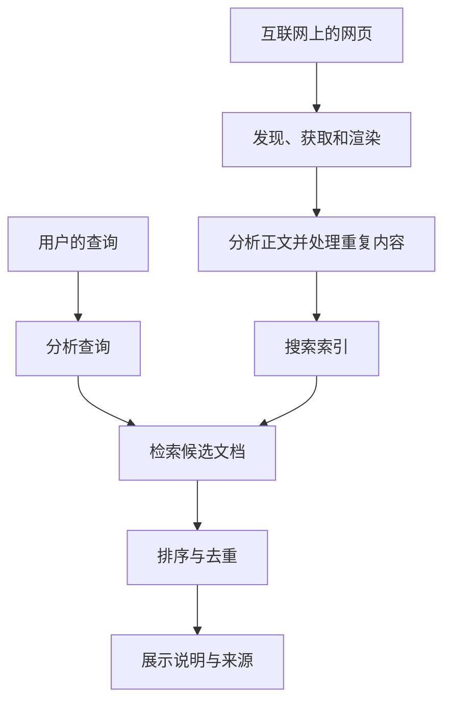
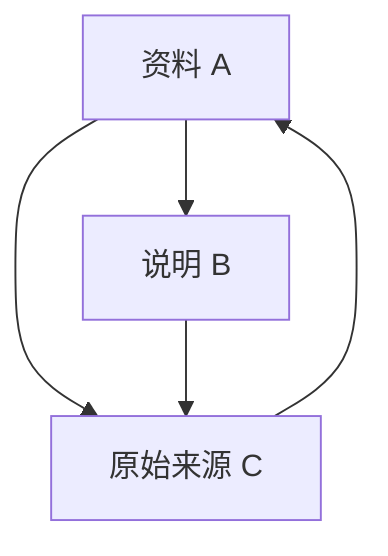
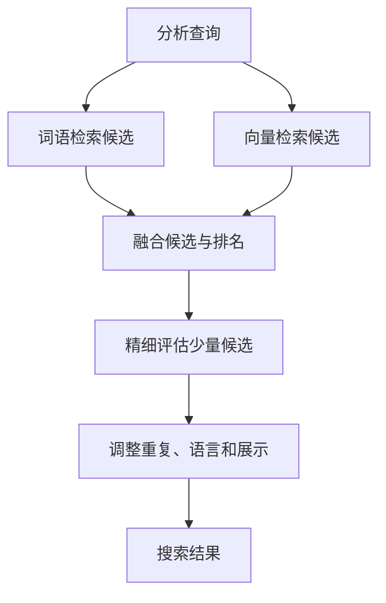

## 1. 每次搜索都要重新阅读整个互联网吗？

在搜索框输入几个词，结果很快就出现了。但搜索引擎并不是从那一刻起逐个读取全球网站。它平时就在收集信息，将其整理成便于检索的形式，再利用这些准备好的数据回答查询。

可以把它想象成图书馆。读者询问天文学入门书时，馆员不会重新读完所有藏书，而是根据书名、作者、主题和位置目录缩小范围。搜索速度同样依赖事先建立的索引。

不过，网页比图书馆藏书更不稳定：它们不断增加、修改和消失，相同内容也可能有多个网址。作者的自我介绍未必准确。因此系统不仅要有目录，还要追踪变化、整理重复内容，并按问题选择候选结果。

整个过程可以分成**收集信息、建立索引、根据查询选择结果**。Google的公开说明也采用这一划分。下面的公式和架构用于解释通用信息检索原理，并非复原任何商业服务未公开的排名算法。[Google：搜索的工作原理][google-overview]

## 2. 为什么需要搜索技术？

寻找信息的问题早于万维网。图书馆目录和文献数据库早已需要检索方法。文档少时，人工分类的目录很有用；规模扩大后，维护分类以及判断该从哪个分类查找，都变得困难。

1990年出现的Archie用于查找FTP服务器中的文件名，并不是现代意义上的网页全文搜索。麦吉尔大学的这项开发体现了一个需求：从统一入口寻找分散在网络上的资源。[麦吉尔大学：Archie的历史][archie]

蒂姆·伯纳斯-李于1989年在CERN提出万维网，CERN又在1993年将基础Web软件置于公有领域。随着链接文档普及，只搜索文件名已经不够，还需要处理内容及文档之间的关系。[CERN：万维网的诞生][web-history]

1998年的Google论文描述了同时利用正文、链接结构和链接文字的大规模搜索设计。搜索并不是靠一个巧妙分数就能完成的：抓取、存储、压缩、索引和排序必须共同适应不断增长的信息。[Brin与Page：搜索引擎的结构][google-paper]

把历史简单分成“过去靠词语，现在靠AI”也不准确。精确词匹配、文档关系、统计和语言模型各有作用。新技术并不会消除准确查询型号或及时更新索引的必要性。

## 3. 爬虫决定访问哪些网址？

爬虫是获取网页的程序，但并不存在一份完整列出所有网址的中央登记簿。它可以从已知页面跟踪链接，也可以参考网站发布的站点地图来发现候选地址。

发现地址并不等于立即抓取。系统要用队列管理重访优先级、同一主机的请求间隔、失败和更新可能性。新闻首页与十年前的固定资料，重新访问的价值不同。这是在有限带宽与计算资源之间分配工作。

同时不能让对方服务器过载。为了提高自身采集速度而使来源停止服务，反而违背目的。响应变慢或持续报错时，需要调整访问频率。

日历的下一月链接、筛选条件组合还可能产生近乎无限的网址。机械地跟踪每个链接可能永远无法结束。网址模式、重复检测和内容变化有助于减少低价值循环。

站点地图只是发现线索，不是保证收录或高排名的申请书。知道网址、成功获取，以及决定纳入索引，是三个不同状态。[Google：站点地图概述][sitemaps]

## 4. robots.txt、noindex与身份验证作用不同

`robots.txt` 告诉遵守规则的爬虫哪些路径不应获取。RFC 9309明确指出，它不是访问授权机制，也不能代替保护机密的锁。[RFC 9309：机器人排除协议][robots]

`noindex` 要求支持它的搜索引擎不要索引页面。Google要读取页面中的这一指令，必须能访问页面。因此，一边禁止抓取，一边期待爬虫读到页面里的 `noindex`，并不成立。即使抓取被禁止，网址也可能通过外部链接被发现。[Google：用noindex控制索引][noindex]

身份验证和访问控制则决定谁能取得内容。这些机制看起来相关，但控制的是不同边界。

| 机制 | 主要控制什么 | 单独不能保证什么 |
|---|---|---|
| robots.txt | 合作爬虫的获取行为 | 保密、网址完全不出现 |
| noindex | 支持该指令的搜索索引收录 | 禁止访问内容 |
| 身份验证与访问控制 | 谁能获取内容 | 删除公开后产生的所有副本 |

搜索不到不等于任何人都读不到。构建企业内部文档搜索时，这一区别同样重要。

## 5. 下载的HTML不一定就是用户看到的页面

有些网站直接在HTML中返回正文，有些则让JavaScript稍后生成内容。对于后者，仅下载初始文件不一定能得到用户看到的信息，可能需要像浏览器一样执行渲染。

Google公开说明了抓取、渲染和索引过程。但支持渲染不代表任何页面都必然正常处理。资源无法访问、脚本失败，或正文仅在交互后出现，都会影响系统理解内容。[Google：JavaScript搜索基础][javascript]

获取之后还要区分标签、导航、广告和正文，处理编码与语言。如果把整页当成无差别字符串统计，重复菜单可能掩盖主题。标题、各级标题和正文承担不同角色。

同一内容也可能出现在打印版或带跟踪参数的网址。为避免结果被副本填满，系统会识别重复组并选择代表网址。`rel="canonical"` 可以表达首选地址，但对Google而言它是辅助选择的信号，而不是无条件强制命令。[Google：规范网址][canonical]

## 6. 把文章拆成可检索的单位

计算机需要规则来决定哪些片段算作搜索词，这一过程称为分词或词元化。随后还可进行规范化，以处理大小写、字符宽度、词形等差异。

日语通常不用空格分隔词语，中文也面临类似问题。关于寻找自行车维修店的句子，可以用语言分析识别词语，也可以使用连续若干字符组成的n-gram。文档和查询必须采用相容的处理，否则表达同一意思也可能匹配不上。Kuromoji就是针对日语分析的具体实现。[信息检索教材：词元化][tokenization]、[Elastic：日语分析][kuromoji]

规范化不是把所有差异都抹掉。删除C与C++的标点，或删去型号、化学名称中的符号和数字，可能破坏用户关心的区别。展开缩写能增加候选，也可能混入另一种含义。

因此可以保留原文，另外建立检索表示。显示给读者的文章不必改成机器友好的形式。语言处理是在定义“哪些变化视为相同”，而不只是修饰文本。

## 7. 倒排索引：把文档到词语的关系反过来

阅读文档能知道它包含哪些词。搜索需要反向关系：某个词出现在哪些文档？倒排索引保存的就是这种映射。

考虑下面的微型文档集，假设词语已经分好。

| 文档ID | 代表性词语 |
|---|---|
| D1 | 自行车、维修、工具 |
| D2 | 自行车、通勤、安全 |
| D3 | 手表、维修、工具 |
| D4 | 自行车、维修、价格 |

“自行车”的列表是D1、D2、D4，“维修”是D1、D3、D4，两者交集为D1、D4。比较两个列表即可获得候选，不必重新阅读每篇正文。[信息检索教材：倒排索引][inverted]

实际的倒排记录还可包含出现次数与位置。按文档ID排序后存储差值并压缩，可减少读入数据。加速不仅是增加处理器，也包括避免不必要的读取。

并非所有查询都采用严格的AND条件，系统也可能检索改写后的词语。但从词语迅速跳到候选文档，仍是全文检索的重要基础。

## 8. 为什么需要记录词的位置？

“从北京到上海”和“从上海到北京”包含相同地名，但方向相反。“机器学习”这一短语，与长文中相距很远的“机器”“学习”，也不是相同的证据。

位置索引记录各词出现在哪个位置。检查一个词后面是否紧跟另一个词，就能支持短语匹配。词语距离较近，也可成为相关性的线索。[信息检索教材：位置索引][positions]

不过，位置并不等于完整理解。否定、条件、代词和引用等不能只靠相邻关系解决。索引处理的是高效寻找候选，而不是判断陈述真伪。

所以，页面包含查询词却不满足需求，并不奇怪。词语匹配只是证据，不是用户目的本身。

## 9. 常见词和稀有词提供不同信息

找到一千个候选后，如果全部同等展示，仍不方便使用。某词只出现在少量文档中，往往比到处都有的词更能区分主题。

逆文档频率IDF是这一思想的量化。设文档总数为 $N$，包含词 $t$ 的文档数为 $df(t)$，这里采用始终为正的一种形式：

$$
\operatorname{IDF}(t)=\ln\left(1+\frac{N-df(t)+0.5}{df(t)+0.5}\right)
$$

在1,000篇文档中，某词出现在10篇时，IDF约为4.56；出现在500篇时约为0.693。同样一次匹配，前者更能区分候选。Lucene的BM25实现文档也给出了这一形式。[Apache Lucene：BM25Similarity][lucene]

但稀有不代表真实或优质。错别字也可能稀有，无关文章也能堆砌专业术语。IDF反映集合中的统计特征，不是可信度。

## 10. BM25：让重复出现的收益逐渐饱和

词在一篇文档里出现多少次也有参考价值。但如果100次就比1次好100倍，堆砌关键词便有利可图。长文包含更多词，也可能让简短准确的说明吃亏。

BM25通过让重复的边际收益递减，并考虑文档长度来处理这些问题。对短查询，可用以下形式理解：

$$
S(d,q)=\sum_{t\in q}\operatorname{IDF}(t)
\frac{f(t,d)(k_1+1)}{f(t,d)+k_1\left(1-b+b\frac{|d|}{\overline L}\right)}
$$

$f(t,d)$ 是词频，$|d|$ 是文档长度，$\overline L$ 是平均长度。$k_1$ 调整饱和程度，$b$ 调整长度归一化。不同实现可能采用不同IDF和常数处理。[信息检索教材：BM25][bm25]

当文档长度等于平均值，且 $k_1=1.2$ 时，去掉IDF后的词频部分如下。

| 出现次数 | 词频部分 |
|---|---:|
| 1 | 1.000 |
| 2 | 1.375 |
| 5 | 1.774 |
| 10 | 1.964 |
| 非常多 | 趋近2.2 |

从1次增加到2次比从9次增加到10次影响更大。重复不是毫无价值，但无法无限提高这一项。式中 $b=0$ 表示不做长度归一化，$b$ 越大，长度影响越强。

BM25得分一般不是“页面正确的概率”。它用于某个索引、某次查询内部的比较，不适合直接当作跨查询、跨集合的绝对质量分数。

## 11. PageRank不只是简单投票

正文相似时，链接提供另一类线索：有人选择该页面作为参考。如果每条链接都算等额一票，就能通过大量造页来增加票数。PageRank的思想是考虑链接来源的重要程度，并将其权重分给各个链接目标。

下面是归一化的教学形式。$N$ 为页面数，$L(u)$ 为页面 $u$ 的出链数，$\alpha$ 为沿链接浏览的概率。暂时假定所有页面都有出链。

$$
PR(v)=\frac{1-\alpha}{N}
+\alpha\sum_{u\to v}\frac{PR(u)}{L(u)}
$$

可想象随机浏览者以概率 $\alpha$ 跟随链接，否则随机跳到一个页面。反复更新后，得到长期停留位置的分布。没有出链的页面需要另行处理，例如把它的权重重新分配给所有页面。

取 $\alpha=0.85$，这张三页图的稳定值约为A 0.388、B 0.215、C 0.397。C得到A和B的引用，B只得到A的一部分权重。来源和分配方式都重要，不只是入链数量。

这只是解释PageRank的小模型，不是现代搜索排名的全部。链接指标不会直接判断查询意图或事实真假。著名旧页面未必适合查询今天的列车时刻。[Brin与Page原论文][google-paper]、[Google：排名系统][ranking]

## 12. 从词语一致走向意图理解

搜索“电脑很烫”的人可能需要散热或故障处理，而不是热力学定义。英语bank可能指银行，也可能指河岸。搜索必须考虑上下文。

纠错、同义词、地名和产品名识别可以扩大候选。但擅自纠正可能妨碍查询精确型号或罕见人名。保留原查询、解释修改，并提供更严格匹配的选择，有助于尊重用户意图。[信息检索教材：拼写纠正][spelling]

语义搜索可把查询和文档编码成数值向量，再比较接近程度。“电池很快没电”与“延长电池续航”即使措辞不同，也可能相关。

向量 $\mathbf q$ 与 $\mathbf d$ 的余弦相似度为：

$$
\operatorname{sim}(\mathbf q,\mathbf d)=
\frac{\mathbf q\cdot\mathbf d}{\|\mathbf q\|\|\mathbf d\|}
$$

这种接近属于模型学到的表示。“电池可以更换”与“电池不能更换”共享许多词，却有关键差别。向量接近不保证答案正确。模型、文本分块长度和评估查询都需要验证。[Elastic：向量搜索][vector]

## 13. 不必用最昂贵的模型检查每一页

深入理解语义的模型很有用，但每次都精查全部文档会耗费大量时间和成本。因此可以先快速广泛地取候选，再对少量候选精细重排。

第一阶段可采用词语检索或近似最近邻搜索。近似方法用速度、内存优势交换漏掉真正近邻的风险。没有进入初始候选集的文档，后续重排也无法挽救。

词语检索擅长名称和型号，语义搜索有助于捕捉改写。混合搜索结合两者。由于得分尺度不同，直接相加可能让一方主导。

倒数排名融合RRF是一种替代办法。文档 $d$ 在列表 $i$ 中的名次为 $r_i(d)$，只对出现该文档的列表求和：

$$
\operatorname{RRF}(d)=\sum_i\frac{1}{k+r_i(d)}
$$

正数 $k$ 控制前几名的影响程度。这是合并排名的规则，不是概率。某列表未出现该文档，就不贡献分数。Elasticsearch公开了利用RRF融合词语和向量结果的实现。[Elastic：RRF][rrf]

这是一般设计示例，不表示每家商业搜索都使用完全相同的阶段。关键在于把减少漏检和确定精细次序分成不同任务。

## 14. 排好顺序还没有结束

如果同一网站的近似页面占满前列，用户能比较的信息就很有限。因此还需要减少重复、考虑不同角度，并匹配语言和地区。

“附近的自行车维修店”需要位置，而“自行车发明史”不应同等强调距离。新鲜度也取决于问题：灾害交通消息需要最新状态，数学证明却不会仅因发布日期更新而更正确。

标题与摘要帮助用户决定是否打开页面。但根据查询提取的片段可能漏掉前后条件，不能自动当作原文的完整结论。

广告与自然搜索结果也不同。付费展示和自然排名采用不同机制。Google说明，付款不能购买更高的自然排名或更频繁的抓取。[Google：搜索原理][google-overview]

## 15. 巨大索引如何快速搜索？

一台机器会限制容量、速度和容错能力。[分布式系统](/zh-cn/p/cap-theorem-distributed-systems-tradeoff/)把索引分成多个部分，在不同机器上检索，再合并结果。这些分区常称为分片。

按文档分片时，查询发送到各分片，各自返回有希望的候选，协调节点再比较全局次序。但各分片的词频统计可能不同，分数可比性需要处理。局部与全局统计不仅影响性能，也影响质量。[信息检索教材：分布式索引][distributed]

分片与复制不是同一概念：前者划分数据和工作，后者保存多份相同数据。副本有助于容错和分担负载，但增加了传播更新的问题。

同时请求许多机器时，最慢的响应可能拉长总等待时间。因此不能只看平均延迟，还要看慢端用户的体验。等待全部结果、设置期限、尝试其他副本，都涉及完整性与速度的权衡。

缓存常见结果或中间计算也能节省工作，但一直复用昨天的答案会遗漏更新和删除。加速手段必须配合新鲜度管理。

## 16. 增加、修改和删除都要传到索引

网页修改后，外部搜索索引未必立即改变。重新获取、分析、更新和提供结果都有延迟。搜索结果是观察和处理后的表示，不是每一瞬间的互联网本身。

自建搜索要从一开始设计更新和删除路径。若每次重新导入都生成新文档，重复会不断累积。稳定的标识符帮助替换正确记录，删除也必须传到服务查询的副本。

企业内部搜索还要处理权限变化。昨天可读、今天保密的文件，不应通过旧标题或摘要泄露。产生结果前要检查权限，缓存也必须考虑用户的访问范围。

重建索引时，可以先由旧版本服务，待新版本完成并验证后再切换，避免用户查询半成品。看似不起眼的运维，是可靠性的基础。

## 17. 反垃圾不是搜索之外的附属工作

排名影响访问量和收入，因此有人会试图操纵它。关键词过量重复、人工链接和大量低价值页面都是例子。系统不能假定文档全由善意作者产生。

Google的垃圾内容政策处理关键词堆砌、链接垃圾等行为。这说明质量不仅是找到相关词，还包括抵抗针对评分机制的操纵。[Google：垃圾内容政策][spam]

链接多不等于真实，文章长不等于深入，新日期不等于可靠。当替代指标成为目标，人们可能只优化指标。需要组合多类证据、持续评估，并调查误判。

但把陌生小网站一律判为低质也不合理。专家的新资料可能尚无多少链接。搜索既要利用已有声誉，也要发现新出现的有用信息。

## 18. 怎样衡量搜索好不好？

速度快但找不到需要的文档，仍不是好搜索。评估需要代表真实需求的查询集，以及文档相关性判断。

基本指标是精确率与召回率。设返回集合为 $A$，相关集合为 $R$：

$$
\operatorname{Precision}=\frac{|A\cap R|}{|A|}
$$

$$
\operatorname{Recall}=\frac{|A\cap R|}{|R|}
$$

若真正相关的文档有8篇，返回5篇中4篇相关，则精确率为4/5，即80%；召回率为4/8，即50%。缩小到高把握结果通常有利于精确率，扩大检索通常有利于召回率，但并非永远只能一增一减。[信息检索教材：集合评估][evaluation]

| 问题 | 指标或检查点 |
|---|---|
| 返回结果是否少有无关项？ | 精确率 |
| 是否遗漏必要文档？ | 召回率 |
| 最前面的结果是否有用？ | 前若干项精确率、考虑排名的指标 |
| 响应是否足够快？ | 中位延迟与慢端分布 |
| 更新和权限是否正确？ | 更新延迟、删除及访问控制验证 |

相关文档排第1与第100有明显区别，所以也使用NDCG等考虑相关程度与位置的指标。按语言、查询类型、长短分组评估，可以发现总平均掩盖的问题。[信息检索教材：排名评估][ranked-evaluation]

点击也不是绝对真值。用户可能因为位置靠前或标题刺激而点击，随后失望离开；也可能从摘要得到答案而不点击。必须解释行为背后的含义。

## 19. AI回答仍然需要检索

把检索文档交给语言模型生成答案的架构，称为检索增强生成RAG。2020年的论文提出了结合预训练模型与外部检索信息的方式。[Lewis等：检索增强生成][rag]

检索和生成仍是两件事。没有找到正确来源，答案就缺乏依据；找到了正确资料，生成时也可能遗漏条件或错误拼接。增加检索不等于消除错误。

存在引用链接，也不证明每句话都受支持。需要确认来源确有对应论述、日期和适用范围相符，并处理不同资料之间的矛盾。

自建系统应分别评估漏检、来源新鲜度和回答与证据的对应关系，以定位问题。外部文档中的命令也不能直接成为系统指令：文档是信息来源，不是授予访问或操作权限的管理员。

AI不是让索引与出处消失，而是在其上增加处理和验证阶段。答案越易读，追踪它如何产生就越重要。

## 20. 搜索框背后是准备与判断的连续过程

以寻找修补自行车轮胎所需工具为例。查询到来前，系统已经收集并分析页面，把词、位置和关系整理好。查询到来后，规范表达、取得候选，再按任务排序。

随后去重并调整语言、摘要和展示。背后多台机器协作，同时维护更新、删除和权限。一次迅速响应，建立在大量准备及持续维护之上。

对网站作者而言，基础是可获取的正文、清楚的标题与链接、合理的重复及多语言关系，以及真正满足读者需要的解释。隐藏技巧不能替代这些基础，而做好基础也不保证某个固定名次。

对使用者而言，高排名不是绝对正确的证明。细化问题、查看日期和来源、尝试另一种措辞，都能增加可判断的信息。

搜索引擎不是世界的完美镜子。<strong>它整理能观察到的信息，在有限时间内构造有助于回答问题的顺序。</strong>了解这些约束，就更容易理解它为何快、为何遗漏，以及该怎样阅读结果。

## 参考资料与图示范围

本文结合通用信息检索原理和公开资料。BM25、PageRank及RRF是教学示例，不是Google等服务的内部评分。图示为简化流程；AI生成封面是概念插画，不代表真实设备或界面。

- [Google：搜索概述][google-overview]、[站点地图][sitemaps]、[JavaScript][javascript]、[noindex][noindex]、[规范网址][canonical]
- [Google：排名系统][ranking]、[垃圾内容政策][spam]
- [CERN：Web历史][web-history]、[麦吉尔：Archie][archie]、[Brin与Page论文][google-paper]
- [信息检索教材：词元化][tokenization]、[倒排索引][inverted]、[位置][positions]、[BM25][bm25]、[分布式索引][distributed]、[拼写纠正][spelling]
- [信息检索教材：精确率与召回率][evaluation]、[排名评估][ranked-evaluation]、[Lucene：BM25][lucene]
- [Elastic：日语分析][kuromoji]、[向量搜索][vector]、[RRF][rrf]、[RAG原论文][rag]
- [RFC 9309：爬虫规则][robots]

[google-overview]: https://developers.google.com/search/docs/fundamentals/how-search-works
[archie]: https://200.mcgill.ca/history/creation-of-the-first-internet-search-engine/
[web-history]: https://home.cern/science/computing/the-birth-of-the-web/where-web-was-born/
[google-paper]: https://infolab.stanford.edu/~backrub/google.html
[sitemaps]: https://developers.google.com/search/docs/crawling-indexing/sitemaps/overview
[robots]: https://www.rfc-editor.org/rfc/rfc9309.html
[noindex]: https://developers.google.com/search/docs/crawling-indexing/block-indexing
[javascript]: https://developers.google.com/search/docs/crawling-indexing/javascript/javascript-seo-basics
[canonical]: https://developers.google.com/search/docs/crawling-indexing/consolidate-duplicate-urls
[tokenization]: https://nlp.stanford.edu/IR-book/html/htmledition/tokenization-1.html
[kuromoji]: https://www.elastic.co/docs/reference/elasticsearch/plugins/analysis-kuromoji
[inverted]: https://nlp.stanford.edu/IR-book/html/htmledition/an-example-information-retrieval-problem-1.html
[positions]: https://nlp.stanford.edu/IR-book/html/htmledition/positional-indexes-1.html
[lucene]: https://lucene.apache.org/core/9_9_1/core/org/apache/lucene/search/similarities/BM25Similarity.html
[bm25]: https://nlp.stanford.edu/IR-book/html/htmledition/okapi-bm25-a-non-binary-model-1.html
[ranking]: https://developers.google.com/search/docs/appearance/ranking-systems-guide
[spelling]: https://nlp.stanford.edu/IR-book/html/htmledition/implementing-spelling-correction-1.html
[vector]: https://www.elastic.co/docs/solutions/search/vector
[rrf]: https://www.elastic.co/docs/reference/elasticsearch/rest-apis/reciprocal-rank-fusion
[distributed]: https://nlp.stanford.edu/IR-book/html/htmledition/distributing-indexes-1.html
[spam]: https://developers.google.com/search/docs/essentials/spam-policies
[evaluation]: https://nlp.stanford.edu/IR-book/html/htmledition/evaluation-of-unranked-retrieval-sets-1.html
[ranked-evaluation]: https://nlp.stanford.edu/IR-book/html/htmledition/evaluation-of-ranked-retrieval-results-1.html
[rag]: https://arxiv.org/abs/2005.11401
