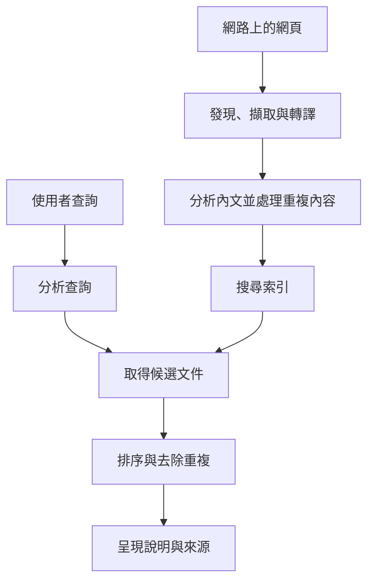
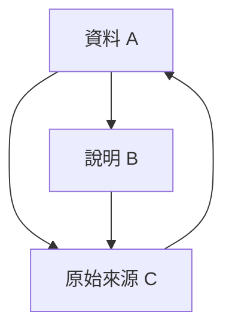
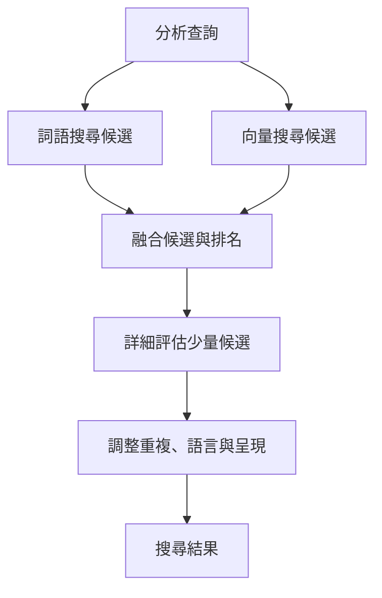

## 1. 每次搜尋都要重新讀遍整個網路嗎？

在搜尋框輸入幾個詞，結果很快就出現。但搜尋引擎不是從那一刻才開始逐一閱讀全球網站。它平時就在收集資訊，整理成方便檢索的形式，收到問題時再利用這些準備好的資料。

可以想成圖書館。讀者詢問天文學入門書時，館員不會重新讀完所有藏書，而是利用書名、作者、主題和位置目錄縮小範圍。搜尋的速度同樣依靠預先建立的索引。

然而網頁比圖書館藏書更不穩定：它們持續增加、修改和消失，相同內容也可能有多個網址。作者的說明未必準確。因此除了目錄，還需要追蹤更新、整理重複內容，並根據問題選擇候選結果。

整體可以分成**收集資訊、建立索引、依查詢選擇結果**。Google的公開說明也採取這種區分。以下公式與架構用來解釋一般資訊檢索原理，並不是重現任何商業服務未公開的排名公式。[Google：搜尋運作方式][google-overview]

## 2. 為什麼需要搜尋技術？

尋找資訊的問題比全球資訊網更早。圖書館目錄與文獻資料庫早就需要檢索方法。文件少時，人工分類很有效；規模增加後，維護分類及判斷應從哪一類尋找，都變得困難。

1990年出現的Archie用來找FTP伺服器中的檔案名稱，並不是今日的網頁全文搜尋。麥吉爾大學的這項開發顯示了需求：透過統一入口尋找分散於網路的資源。[麥吉爾大學：Archie的歷史][archie]

提姆·柏內茲-李於1989年在CERN提出Web，CERN又在1993年將基礎Web軟體置於公有領域。隨著連結文件普及，只搜尋名稱不夠，還要處理內文及文件之間的關係。[CERN：Web的誕生][web-history]

1998年的Google論文描述了同時利用內文、連結結構與連結文字的大規模搜尋設計。搜尋不是靠一個巧妙分數就完成：爬取、儲存、壓縮、索引與排序，都必須適應持續增加的資訊。[Brin與Page：搜尋引擎的結構][google-paper]

把歷史簡化成「過去靠詞語，現在靠AI」也不準確。精確詞語、文件關係、統計與語言模型各自補足不同弱點。新方法不會消除精確查找型號或持續更新索引的需要。

## 3. 爬蟲決定造訪哪些網址？

爬蟲是擷取網頁的程式，但不存在完整列出所有網址的中央清冊。它從已知頁面追蹤連結，也參考網站發布的網站地圖來發現候選地址。

發現網址不等於立即擷取。系統要用佇列管理重訪優先順序、同一主機的存取間隔、失敗及更新可能性。新聞首頁與十年前的固定資料，重訪價值不同。這是在有限頻寬和運算資源之間分配工作。

也不能讓對方伺服器過載。為了自己抓得快而讓來源停機，反而違背目的。回應變慢或持續出錯時，需要調整存取頻率。

月曆的下個月連結、搜尋篩選條件組合，可能產生近乎無限的網址。機械式追蹤每個連結可能永遠不會結束。網址規則、重複偵測和內容變化有助於減少低價值循環。

網站地圖只是發現線索，不是保證收錄或高排名的申請書。知道網址、成功擷取，以及選擇納入索引，是不同狀態。[Google：網站地圖概述][sitemaps]

## 4. robots.txt、noindex與驗證的角色不同

`robots.txt` 告訴遵守規則的爬蟲哪些路徑不應擷取。RFC 9309明確區分它與存取授權：它不是保護機密的鎖。[RFC 9309：機器人排除協定][robots]

`noindex` 要求支援該指令的搜尋引擎不要將頁面納入索引。Google必須能存取頁面才能讀到其中的指令。因此一邊禁止擷取，一邊期待它讀到頁內的 `noindex`，並不合理。被禁止擷取的網址，仍可能透過外部連結被知道。[Google：以noindex控制索引][noindex]

驗證與存取控制則決定誰能取得內容。三者看似相關，實際控制不同邊界。

| 機制 | 主要控制什麼 | 單獨不能保證什麼 |
|---|---|---|
| robots.txt | 合作爬蟲的擷取行為 | 保密、網址完全不出現 |
| noindex | 支援指令的搜尋索引收錄 | 禁止取得內容 |
| 驗證與存取控制 | 誰能讀取內容 | 刪除公開後產生的全部副本 |

搜尋不到不等於任何人都讀不到。建置企業內部文件搜尋時，這項區別也很重要。

## 5. 下載的HTML不一定等於看見的頁面

有些網站直接在HTML傳回內文，有些則由JavaScript稍後產生內容。後者只下載初始檔案，不一定能取得使用者看到的資訊，可能需要像瀏覽器一樣進行轉譯。

Google公開說明了爬取、轉譯與索引過程。但支援轉譯不代表任何頁面都一定正常處理。必要資源無法存取、指令碼失敗，或內容只在互動後出現，都會影響理解。[Google：JavaScript搜尋基礎][javascript]

擷取之後，還要區分標籤、導覽、廣告和內文，處理編碼與語言。如果把整頁當成毫無區別的字串統計，重複選單可能蓋過主題。標題、小標和內文提供不同證據。

相同內容也可能出現在列印版或帶有追蹤參數的網址。系統會辨識重複群組並選擇代表網址，避免結果被副本填滿。`rel="canonical"` 可表達偏好的網址；對Google而言，它是協助選擇的訊號，而非無條件強制命令。[Google：標準網址][canonical]

## 6. 把文章拆成可搜尋的單位

電腦需要規則來決定哪些片段算作搜尋詞，這稱為詞元化或斷詞。接著還可正規化大小寫、字元寬度、詞形等差異。

日文通常不以空格分隔詞語，中文也有類似問題。尋找自行車維修店的句子，可以用語言分析識別詞，也能使用連續若干字元構成的n-gram。文件與查詢必須採用相容的處理，否則相同意思也可能配對不到。Kuromoji就是日文專用分析的實作例子。[資訊檢索教材：詞元化][tokenization]、[Elastic：日文分析][kuromoji]

正規化不是抹掉所有差異。刪除C與C++的標點，或型號、化學名稱中的符號數字，可能破壞使用者在意的區別。展開縮寫能增加候選，也可能混入另一個意思。

因此可保留原文，另外建立搜尋表示。呈現給讀者的文章不必改成機器用的形式。語言處理是在定義哪些變化視為相同，而不只是整理外觀。

## 7. 倒排索引：反轉文件與詞語的關係

閱讀文件會知道其中有哪些詞。搜尋需要相反方向：某個詞出現在哪些文件？倒排索引儲存這種對應。

以下是小型文件集，假設已完成斷詞。

| 文件ID | 代表性詞語 |
|---|---|
| D1 | 自行車、維修、工具 |
| D2 | 自行車、通勤、安全 |
| D3 | 手錶、維修、工具 |
| D4 | 自行車、維修、價格 |

「自行車」清單是D1、D2、D4，「維修」是D1、D3、D4，交集為D1、D4。比較兩個清單就能找到候選，不必重讀每篇內文。[資訊檢索教材：倒排索引][inverted]

實際記錄還可包含次數與位置。將文件ID排序後儲存差值並壓縮，可降低讀取量。加速不只是增加處理器，也包括避免不必要的工作。

不是所有查詢都採嚴格AND條件，系統也可能納入不同說法。然而，從詞語迅速找到文件仍是全文檢索的重要基礎。

## 8. 為什麼要記錄詞的位置？

「從臺北到高雄」和「從高雄到臺北」包含相同地名，但方向相反。「機器學習」這個詞組，與長文中相距甚遠的「機器」「學習」，也不是相同證據。

位置索引記錄詞出現在哪個位置。檢查某詞之後是否緊接另一個詞，可以支援詞組搜尋；距離接近也能成為相關性線索。[資訊檢索教材：位置索引][positions]

但位置不等於完整理解。否定、條件、代名詞、引用等不只靠接近程度。索引處理的是有效率地取得候選，不是判斷敘述真偽。

所以包含查詢詞卻不滿足需求，並不奇怪。詞語符合只是證據，不是使用者目的本身。

## 9. 常見詞與罕見詞的資訊量不同

找到一千個候選後，若全部同等展示，依然不好用。只出現在少量文件的詞，通常比到處都有的詞更能區分主題。

逆文件頻率IDF量化了這個想法。設文件總數為 $N$，包含詞 $t$ 的文件數為 $df(t)$，此處採始終為正的一種形式：

$$
\operatorname{IDF}(t)=\ln\left(1+\frac{N-df(t)+0.5}{df(t)+0.5}\right)
$$

在1,000篇文件中，出現於10篇的詞，IDF約為4.56；出現於500篇時約0.693。同樣一次符合，前者更能區分候選。Lucene的BM25實作文件也列出此式。[Apache Lucene：BM25Similarity][lucene]

但罕見不等於真實或優質。錯字也可能罕見，不相關文章也能堆疊術語。IDF反映集合的統計特性，不是可信度。

## 10. BM25：讓重複的效益逐漸飽和

詞在一篇文件出現多少次也有參考價值。但若100次就比1次好100倍，堆砌關鍵字便有利。長文自然包含更多詞，也可能讓簡短精準的說明吃虧。

BM25讓重複出現的邊際效益降低，並考慮文件長度。對短查詢可用下式理解：

$$
S(d,q)=\sum_{t\in q}\operatorname{IDF}(t)
\frac{f(t,d)(k_1+1)}{f(t,d)+k_1\left(1-b+b\frac{|d|}{\overline L}\right)}
$$

$f(t,d)$ 為詞頻，$|d|$ 為文件長度，$\overline L$ 為平均長度。$k_1$ 調整飽和程度，$b$ 調整長度正規化。不同實作的IDF與常數處理可能不同。[資訊檢索教材：BM25][bm25]

文件長度等於平均、$k_1=1.2$ 時，扣除IDF後的詞頻部分如下。

| 出現次數 | 詞頻部分 |
|---|---:|
| 1 | 1.000 |
| 2 | 1.375 |
| 5 | 1.774 |
| 10 | 1.964 |
| 非常多 | 趨近2.2 |

由1次增至2次，比9次增至10次影響更大。重複有意義，但不能無限加分。式中 $b=0$ 表示不進行長度正規化，$b$ 越大，長度影響越強。

BM25分數通常不是頁面正確的機率。它用於某個索引與查詢內比較候選，不適合當作跨查詢、跨集合的絕對品質分數。

## 11. PageRank不只是簡單投票

文章內容相似時，連結提供另一種證據：有人選擇該頁作為參考。若每條連結都算等額一票，就能大量製造頁面增加票數。PageRank考慮來源的重要程度，再把權重分配給各個連結目標。

以下是正規化的教學形式。$N$ 是頁數，$L(u)$ 是頁面 $u$ 的外連數，$\alpha$ 是沿連結移動的機率。先假設每頁都有外連。

$$
PR(v)=\frac{1-\alpha}{N}
+\alpha\sum_{u\to v}\frac{PR(u)}{L(u)}
$$

想像隨機瀏覽者以機率 $\alpha$ 跟隨連結，否則隨機跳至一頁。反覆更新後得到長期停留位置的分布。沒有外連的頁面需要另外處理，例如把權重重新分配給所有頁面。

取 $\alpha=0.85$，這張三頁圖的穩定值約為A 0.388、B 0.215、C 0.397。C收到A和B的引用，B只得到A的部分權重。來源與分配方式都重要，而不只是連入數量。

這只是理解PageRank的小模型，不是現代排名的全部。連結指標不會直接判斷查詢意圖或事實真偽。知名舊頁面未必適合查今天的列車時刻。[Brin與Page原論文][google-paper]、[Google：排名系統][ranking]

## 12. 從詞語符合到理解意圖

搜尋「電腦很燙」的人可能需要散熱或故障處理，而非熱力學定義。英文bank可能是銀行，也可能是河岸。搜尋需要上下文。

拼字修正、同義詞、地名與產品名稱辨識可以擴大候選。但擅自修正也會妨礙精確型號或罕見人名查詢。保留原問題、解釋修改，以及提供嚴格符合的選擇，有助於維持使用者意圖。[資訊檢索教材：拼字修正][spelling]

語意搜尋可將查詢和文件編碼成數值向量，再比較距離。「電池很快沒電」與「延長電池續航」即使詞語不同，仍可能相關。

向量 $\mathbf q$ 與 $\mathbf d$ 的餘弦相似度為：

$$
\operatorname{sim}(\mathbf q,\mathbf d)=
\frac{\mathbf q\cdot\mathbf d}{\|\mathbf q\|\|\mathbf d\|}
$$

接近程度屬於模型學到的表示。「電池可以更換」與「電池不能更換」共享許多詞，卻有關鍵差異。向量接近不保證答案正確。模型、文字分塊長度和評估問題都需要驗證。[Elastic：向量搜尋][vector]

## 13. 不必用最昂貴的模型檢查每一頁

深入理解語意的模型很有用，但每次精查全部文件會花費大量時間與成本。因此可先快速廣泛取得候選，再對少量候選詳細重排。

第一階段可採詞語檢索或近似最近鄰搜尋。近似方法在速度、記憶體與漏掉真正近鄰的風險間取捨。沒有進入初始候選的文件，後段也救不回來。

詞語搜尋擅長名稱和型號，語意搜尋幫助取得不同說法。混合搜尋結合兩者，但分數尺度不同，直接相加可能讓一方主導。

倒數排名融合RRF是一種方法。文件 $d$ 在列表 $i$ 的名次是 $r_i(d)$，只對含有該文件的列表加總：

$$
\operatorname{RRF}(d)=\sum_i\frac{1}{k+r_i(d)}
$$

正數 $k$ 控制最前面名次的影響。這是融合排序的規則，不是機率。列表未包含文件，就不提供分數。Elasticsearch公開了用RRF結合詞語與向量結果的實作。[Elastic：RRF][rrf]

這是一般設計例，不表示每家商業搜尋都用相同階段。核心是把減少遺漏和決定細部次序分成不同工作。

## 14. 排好順序還沒有結束

若同一網站的近似頁面占滿前幾名，使用者能比較的資訊就很有限。除了單篇分數，還要減少重複、考慮不同觀點，並配合語言和地區。

「附近的自行車維修店」需要位置資訊，但「自行車發明史」不該同樣強調距離。新鮮度也依問題而定：災害交通消息需要最新狀態，數學證明卻不會只因日期更新而更好。

標題和摘要協助使用者決定是否打開頁面。但依查詢擷取的片段可能漏掉前後條件，不能直接當成原文完整結論。

廣告與自然搜尋結果也應分開。付費版位和自然排名採用不同機制。Google說明，付費不能購買更高自然排名或更頻繁的爬取。[Google：搜尋原理][google-overview]

## 15. 巨大索引如何快速搜尋？

單一機器會限制容量、速度和容錯能力。[分散式系統](/zh-tw/p/cap-theorem-distributed-systems-tradeoff/)將索引分成多個部分，在不同機器搜尋後合併。這些分區常稱為分片。

按文件分片時，查詢送到各分片，各自回傳有希望的候選，再由協調節點比較全局排名。但各分片的文件頻率統計可能不同，分數能否直接比較需要處理。局部與整體統計同時影響品質和速度。[資訊檢索教材：分散式索引][distributed]

分片與複製不同：前者分配資料和工作，後者保存多份相同資料。副本幫助容錯和負載分散，但增加傳播更新的問題。

同時詢問多台機器時，最慢的回應可能拉長總等待時間。因此不能只看平均延遲，也要觀察慢端使用者的體驗。等待全部、設定期限、改問其他副本，涉及完整性與速度的折衷。

快取常見結果或中間計算可以節省工作，但一直重用昨天答案會漏掉更新和刪除。加速必須搭配新鮮度管理。

## 16. 新增、修改和刪除都要傳到索引

網頁修改後，外部搜尋索引未必立即改變。重新擷取、分析、更新和提供結果都需要時間。搜尋結果是觀察處理後的表示，不是每一瞬間的網路本身。

自建搜尋應一開始就規劃更新和刪除。若每次匯入都新增文件，重複會不斷累積。穩定識別碼協助取代正確記錄，刪除也必須傳到提供查詢的副本。

企業搜尋還要處理權限變更。昨天可讀、今天保密的資料，不能透過舊標題或摘要外洩。產生結果前要檢查權限，快取也必須考慮使用者可讀範圍。

重建索引時，可以由舊版持續服務，新版完成並驗證後再切換，避免讓使用者查詢半成品。這些不起眼的維運，支撐搜尋可靠性。

## 17. 反垃圾不是搜尋之外的附屬工作

排名影響流量和收入，因而帶來操縱誘因。關鍵字過量重複、人造連結、大量低價值頁面都是例子。系統不能假設所有文件都出於善意。

Google的垃圾內容政策處理關鍵字堆砌、連結垃圾等行為。搜尋品質因此不只在於找到相關詞，也包括抵抗針對評分方式的操作。[Google：垃圾內容政策][spam]

連結多不代表真實，篇幅長不代表深入，日期新不代表可靠。當代理指標成為目標，人們可能只優化指標。需要多種證據、持續評估，以及檢查誤判。

但把陌生小網站全部當成低品質也不合理。專家的新資料可能尚無大量連結。搜尋要利用既有聲譽，同時發現新的有用資訊。

## 18. 如何衡量搜尋品質？

再快也沒找到需要的文件，就不是好搜尋。評估需要代表真實需求的查詢集合，以及各文件是否相關的判斷。

兩個基本指標是精確率和召回率。設回傳集合為 $A$，相關集合為 $R$：

$$
\operatorname{Precision}=\frac{|A\cap R|}{|A|}
$$

$$
\operatorname{Recall}=\frac{|A\cap R|}{|R|}
$$

若真正相關的文件有8篇，回傳5篇中4篇相關，精確率為4/5，即80%；召回率為4/8，即50%。縮小到高把握結果通常有利精確率，擴大範圍通常有利召回率，但並非總是一增一減。[資訊檢索教材：集合評估][evaluation]

| 問題 | 指標或檢查重點 |
|---|---|
| 回傳結果是否少有無關項？ | 精確率 |
| 是否漏掉必要文件？ | 召回率 |
| 前幾項是否有用？ | 前若干項精確率、考慮排名的指標 |
| 回應是否夠快？ | 延遲中位數與慢端分布 |
| 更新和權限是否正確？ | 更新延遲、刪除與存取控制驗證 |

相關文件排第1與第100不同，因此也使用NDCG等考慮相關程度及位置的指標。按語言、查詢類型和長短分組，可發現整體平均掩蓋的問題。[資訊檢索教材：排名評估][ranked-evaluation]

點擊也不是絕對真值。使用者可能因位置靠前或標題刺激而點擊，隨後失望離開；也可能在摘要找到答案而不點擊。行為需要解釋。

## 19. AI回答仍然需要檢索

將檢索文件交給語言模型產生回答，稱為檢索增強生成RAG。2020年的論文提出結合預訓練模型和外部檢索資訊的方法。[Lewis等：檢索增強生成][rag]

檢索與生成仍是不同任務。沒找到正確來源，回答就缺乏根據；找到正確資料後，生成仍可能漏掉條件或錯誤拼接。增加檢索不代表錯誤消失。

有引用連結也不證明每句話都有支持。需要確認來源有對應敘述、日期與適用情境吻合，並處理資料矛盾。

自建系統可分別評估漏檢、來源新鮮度、回答與證據的對應，以便定位問題。外部文件中的命令也不能直接成為系統指令。文件是資訊來源，不是授予存取或操作權限的管理者。

AI不是使索引和出處消失，而是在上面增加處理與驗證階段。回答越容易閱讀，追蹤它如何形成就越重要。

## 20. 搜尋框背後是準備與判斷的連續過程

以尋找修補自行車輪胎需要的工具為例。查詢之前，系統已收集分析網頁，整理詞語、位置及關係。收到查詢後，統一表達方式、取得候選，再依任務排序。

隨後去除重複，調整語言、摘要與呈現。背後多台機器協作，也持續維護更新、刪除和權限。一次快速回應，建立在大量準備和持續維運上。

對網站經營者，基礎是可取得的內文、清楚的標題和連結、合理的重複及多語言關係，以及真正服務讀者的說明。隱藏技巧不能取代這些，而且做好基礎也不保證固定排名。

對使用者，高排名不是絕對正確的證明。細化問題、看日期和來源、嘗試其他措辭，都能增加判斷材料。

搜尋引擎不是世界的完美鏡子。**它整理能觀察的資訊，在有限時間內，建立有助於問題的順序。**理解限制，就更容易知道它為何快、為何漏掉資料，以及如何閱讀結果。

## 參考資料與圖示範圍

本文結合通用資訊檢索原理和公開資料。BM25、PageRank與RRF為教學示例，不是Google等服務的內部分數。圖示簡化流程；AI生成封面是概念插畫，不代表真實設備或介面。

- [Google：搜尋概述][google-overview]、[網站地圖][sitemaps]、[JavaScript][javascript]、[noindex][noindex]、[標準網址][canonical]
- [Google：排名系統][ranking]、[垃圾內容政策][spam]
- [CERN：Web歷史][web-history]、[麥吉爾：Archie][archie]、[Brin與Page論文][google-paper]
- [資訊檢索教材：詞元化][tokenization]、[倒排索引][inverted]、[位置][positions]、[BM25][bm25]、[分散式索引][distributed]、[拼字修正][spelling]
- [資訊檢索教材：精確率與召回率][evaluation]、[排名評估][ranked-evaluation]、[Lucene：BM25][lucene]
- [Elastic：日文分析][kuromoji]、[向量搜尋][vector]、[RRF][rrf]、[RAG原論文][rag]
- [RFC 9309：爬蟲規則][robots]

[google-overview]: https://developers.google.com/search/docs/fundamentals/how-search-works
[archie]: https://200.mcgill.ca/history/creation-of-the-first-internet-search-engine/
[web-history]: https://home.cern/science/computing/the-birth-of-the-web/where-web-was-born/
[google-paper]: https://infolab.stanford.edu/~backrub/google.html
[sitemaps]: https://developers.google.com/search/docs/crawling-indexing/sitemaps/overview
[robots]: https://www.rfc-editor.org/rfc/rfc9309.html
[noindex]: https://developers.google.com/search/docs/crawling-indexing/block-indexing
[javascript]: https://developers.google.com/search/docs/crawling-indexing/javascript/javascript-seo-basics
[canonical]: https://developers.google.com/search/docs/crawling-indexing/consolidate-duplicate-urls
[tokenization]: https://nlp.stanford.edu/IR-book/html/htmledition/tokenization-1.html
[kuromoji]: https://www.elastic.co/docs/reference/elasticsearch/plugins/analysis-kuromoji
[inverted]: https://nlp.stanford.edu/IR-book/html/htmledition/an-example-information-retrieval-problem-1.html
[positions]: https://nlp.stanford.edu/IR-book/html/htmledition/positional-indexes-1.html
[lucene]: https://lucene.apache.org/core/9_9_1/core/org/apache/lucene/search/similarities/BM25Similarity.html
[bm25]: https://nlp.stanford.edu/IR-book/html/htmledition/okapi-bm25-a-non-binary-model-1.html
[ranking]: https://developers.google.com/search/docs/appearance/ranking-systems-guide
[spelling]: https://nlp.stanford.edu/IR-book/html/htmledition/implementing-spelling-correction-1.html
[vector]: https://www.elastic.co/docs/solutions/search/vector
[rrf]: https://www.elastic.co/docs/reference/elasticsearch/rest-apis/reciprocal-rank-fusion
[distributed]: https://nlp.stanford.edu/IR-book/html/htmledition/distributing-indexes-1.html
[spam]: https://developers.google.com/search/docs/essentials/spam-policies
[evaluation]: https://nlp.stanford.edu/IR-book/html/htmledition/evaluation-of-unranked-retrieval-sets-1.html
[ranked-evaluation]: https://nlp.stanford.edu/IR-book/html/htmledition/evaluation-of-ranked-retrieval-results-1.html
[rag]: https://arxiv.org/abs/2005.11401
