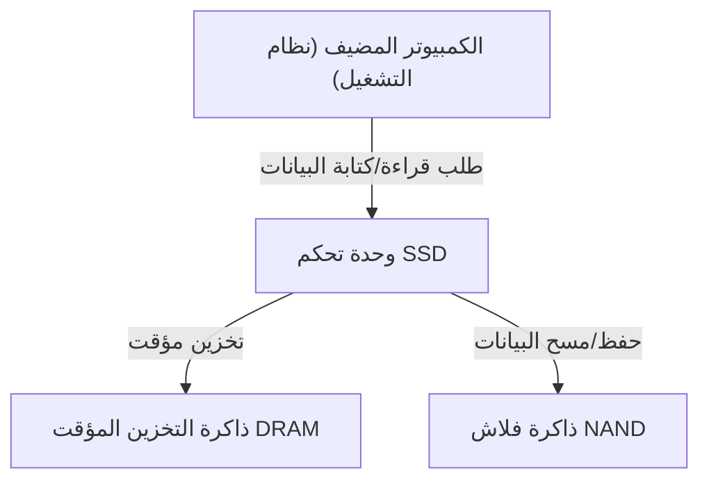

## 1. مقدمة

في أجهزة الكمبيوتر الحديثة، انتقل دور التخزين الرئيسي بالكامل من محركات الأقراص الصلبة (HDD) إلى محركات الأقراص ذات الحالة الصلبة (SSD). على عكس محركات HDD، لا تحتوي محركات SSD على أقراص تدور فعليًا أو رؤوس مغناطيسية تبحث عن البيانات، بل تعتمد على دوائر إلكترونية بالكامل لقراءة وكتابة البيانات، مما يمنحها سرعة فائقة ومقاومة عالية للصدمات.

ومع ذلك، تمتلك محركات SSD قيدًا فريدًا يُعرف بـ "عمر الكتابة الافتراضي". فكلما قمت بكتابة البيانات وإعادة كتابتها، تتدهور المكونات الداخلية تدريجيًا. في هذا المقال، سنستكشف آلية عمل "ذاكرة فلاش NAND" التي تشكل جوهر محركات SSD، ونشرح من منظور هندسي سبب انخفاض عمرها، والتقنيات المستخدمة لإطالة هذا العمر.

## 2. البنية الأساسية لمحركات SSD وذاكرة فلاش NAND

عند تفكيك محرك SSD، نجد أنه يتكون بشكل أساسي من المكونات الثلاثة الرئيسية التالية:

1. **ذاكرة فلاش NAND**: الرقائق التي تقوم بتخزين البيانات فعليًا. هي ذاكرة غير متطايرة تحتفظ بالبيانات حتى عند انقطاع التيار الكهربائي.
2. **وحدة التحكم (Controller)**: "دماغ" محرك SSD. تقوم بالتحكم في قراءة وكتابة البيانات، وتصحيح الأخطاء، وإجراء عمليات معقدة مثل "تسوية التآكل" (Wear Leveling) التي سنناقشها لاحقًا.
3. **ذاكرة التخزين المؤقت DRAM**: منطقة تخزين مؤقتة لتسريع قراءة وكتابة البيانات (غير متوفرة في بعض الطرازات الاقتصادية).

من بين هذه المكونات، ذاكرة فلاش NAND هي المسؤولة عن التخزين طويل الأمد للبيانات.

## 3. آلية تسجيل البيانات في ذاكرة فلاش NAND

تتكون ذاكرة فلاش NAND من الداخل من عدد لا يحصى من "الخلايا" (Cells)، وهي أصغر وحدة لتخزين البيانات.

### 3.1. بنية الخلية والتقاط الإلكترونات

الخلية عبارة عن نوع من الترانزستورات مبني على شريحة سيليكون. ما يميزها عن الترانزستورات العادية هو احتوائها على منطقة معزولة تُسمى "البوابة العائمة" (Floating Gate) أو "مصيدة الشحنات" (Charge Trap) لاحتجاز الإلكترونات.

عند كتابة البيانات، يتم تطبيق جهد كهربائي عالٍ (جهد البرمجة) على بوابة التحكم. يؤدي ذلك إلى ظاهرة في ميكانيكا الكم تُعرف بـ "تأثير النفق" (Tunnel Effect)، حيث تعبر الإلكترونات طبقة العزل (طبقة الأكسيد النفقية) وتُحقن في البوابة العائمة. من خلال قراءة حالة "وجود" أو "عدم وجود" هذه الإلكترونات، يتم تمثيل البيانات الرقمية 0 و 1.

عند مسح البيانات، يتم تطبيق جهد عالٍ في الاتجاه المعاكس على جهة الشريحة الأساسية، مما يسحب الإلكترونات من البوابة العائمة.

### 3.2. الفرق بين SLC و MLC و TLC و QLC

في الأيام الأولى لمحركات SSD، كانت خلايا **SLC (Single-Level Cell)** التي تخزن بت واحد (0 أو 1) من البيانات في خلية واحدة هي السائدة. ولكن مع تزايد الطلب على سعات أكبر وأسعار أقل، تطورت تقنية تسجيل عدة بتات في خلية واحدة.

*   **SLC (Single-Level Cell)**: بت واحد لكل خلية. سريعة جدًا وذات عمر طويل للغاية، لكن تكلفة السعة عالية.
*   **MLC (Multi-Level Cell)**: 2 بت لكل خلية (4 مستويات من الجهد).
*   **TLC (Triple-Level Cell)**: 3 بت لكل خلية (8 مستويات من الجهد). هي السائدة حاليًا.
*   **QLC (Quad-Level Cell)**: 4 بت لكل خلية (16 مستوى من الجهد). سعة كبيرة وسعر منخفض، لكنها أقل من حيث العمر والسرعة.

نظرًا للحاجة إلى تسجيل وقراءة مستويات جهد متعددة بدقة في خلية واحدة، يصبح التحكم أكثر تعقيدًا في خلايا TLC و QLC، مما يؤدي إلى انخفاض سرعة الكتابة، وزيادة معدل الخطأ، وانخفاض العمر الافتراضي.

## 4. لماذا تمتلك محركات SSD "عمرًا افتراضيًا"؟

في حين أن محركات HDD لا تمتلك قيودًا أساسية على عدد مرات إعادة الكتابة (باستثناء الأعطال الميكانيكية)، إلا أن ذاكرة فلاش NAND تمتلك قيودًا واضحة. يرجع ذلك إلى الآلية الفعلية لكتابة البيانات ومسحها.

### 4.1. تدهور طبقة الأكسيد النفقية (حدود دورات P/E)

كما ذكرنا سابقًا، عند كتابة أو مسح البيانات، يتم إجبار الإلكترونات على المرور عبر عازل رقيق يُسمى "طبقة الأكسيد النفقية" باستخدام جهد عالٍ. يؤدي تكرار هذه العملية (دورة البرمجة/المسح، أو P/E Cycle) إلى إجهاد طبقة الأكسيد النفقية فيزيائيًا بسبب الجهد العالي.

عندما تتدهور طبقة الأكسيد، قد لا تتمكن الإلكترونات من البقاء في البوابة العائمة وتتسرب منها، أو على العكس، قد تعلق ولا يمكن إزالتها. ونتيجة لذلك، يصبح من المستحيل الاحتفاظ بمستوى الجهد المقصود أو قراءته بدقة، مما يؤدي إلى تلف البيانات. هذا هو "العمر الافتراضي" لمحرك SSD.

كان يُقال إن دورات P/E لخلايا SLC تبلغ حوالي 100,000 مرة، ولكنها انخفضت إلى حوالي 3,000 إلى 10,000 مرة في MLC، وحوالي 1,000 إلى 3,000 مرة في TLC، ومئات إلى 1,000 مرة تقريبًا في QLC.

### 4.2. قيود "الصفحات" و "الكتل"

ما يزيد من تعقيد مشكلة عمر ذاكرة فلاش NAND هو وحدات القراءة والكتابة الفريدة الخاصة بها.

*   **الصفحة (Page)**: أصغر وحدة "لقراءة" و "كتابة" البيانات (عادةً من 4 كيلوبايت إلى 16 كيلوبايت).
*   **الكتلة (Block)**: وحدة تتكون من عدة صفحات مجمعة (عادةً من 256 صفحة إلى عدة آلاف من الصفحات). هي أصغر وحدة "لمسح" البيانات.

نقطة الضعف الأكبر في ذاكرة فلاش NAND هي أنه **"لا يمكن الكتابة فوق البيانات مباشرة في صفحة تحتوي بالفعل على بيانات"**. لإعادة كتابة البيانات، يجب أولاً "مسح" الكتلة بأكملها التي تحتوي على تلك الصفحة وإعادتها إلى حالة الفراغ.

ومع ذلك، لا يمكن ببساطة مسح الكتلة، لأنها غالبًا ما تحتوي على بيانات أخرى صالحة لا ترغب في تغييرها.

## 5. تقنيات متقدمة لإطالة عمر SSD

لجعل ذاكرة فلاش NAND، التي قد تصل إلى نهاية عمرها بسرعة، قابلة للاستخدام كوسيط تخزين عملي لفترة طويلة، تقوم وحدة تحكم SSD بعمليات إدارة معقدة للغاية في الخلفية.

### 5.1. تسوية التآكل (Wear Leveling)

لمنع إعادة الكتابة المتكررة على كتل معينة فقط مما يؤدي إلى انتهاء عمرها مبكرًا، تقوم وحدة تحكم SSD بتوزيع عمليات الكتابة بالتساوي عبر جميع الكتل. يُعرف هذا باسم "تسوية التآكل" (Wear Leveling).

على سبيل المثال، حتى لو بدا أن نظام التشغيل يقوم بتحديث نفس الملف (نفس العنوان المنطقي) بشكل متكرر، فإن وحدة التحكم داخل محرك SSD تقوم بكتابة البيانات إلى كتلة فيزيائية مختلفة في كل مرة، وتضع علامة "غير صالحة" على البيانات القديمة. يضمن هذا أن تتدهور الخلايا في محرك الأقراص بأكمله بشكل متساوٍ.

### 5.2. تجميع القمامة (Garbage Collection)

مع تكرار إعادة كتابة البيانات، تزداد الكتل في محرك SSD التي تحتوي على مزيج من "البيانات الصالحة" و "البيانات القديمة غير الصالحة (القمامة)". إذا استمر هذا الوضع، فستنفد الكتل الفارغة اللازمة لكتابة بيانات جديدة.

لذلك، عندما تنخفض المساحة الحرة أو خلال فترات الخمول، تقوم وحدة تحكم SSD بجمع "البيانات الصالحة" فقط من عدة كتل ونقلها إلى كتلة جديدة أخرى، ثم تقوم بمسح الكتل الأصلية بالكامل لجعلها قابلة لإعادة الاستخدام. هذا هو "تجميع القمامة" (Garbage Collection).

### 5.3. أمر TRIM

أمر TRIM هو آلية مهمة لجعل عملية تجميع القمامة أكثر كفاءة.

عندما يقوم المستخدم بـ "حذف" ملف على نظام التشغيل، فإن نظام التشغيل يزيل هذا الإدخال من فهرس نظام الملفات فقط، ولا يتم إبلاغ محرك SSD بأن "هذه البيانات لم تعد مطلوبة". نظرًا لأن محرك SSD لا يعرف أي البيانات صالحة وأيها غير مطلوبة، فإنه سيستمر في نقل البيانات غير المطلوبة أثناء عملية تجميع القمامة، مما يتسبب في عمليات كتابة غير ضرورية (Write Amplification) ويقلل من العمر الافتراضي.

أمر TRIM هو آلية تتيح لنظام التشغيل إبلاغ وحدة تحكم SSD مباشرة بأن "البيانات الموجودة في هذه المنطقة لم تعد مطلوبة" في الوقت الذي يتم فيه حذف الملف. يتيح ذلك لمحرك SSD تجنب العمل غير الضروري المتمثل في نقل البيانات غير المطلوبة، مما يحافظ على الأداء ويطيل العمر الافتراضي.

## 6. الخلاصة

بسبب الخصائص الفيزيائية لذاكرة فلاش NAND، تمتلك محركات SSD حدًا أقصى لعدد مرات إعادة الكتابة. في كل مرة يتم فيها حقن أو سحب إلكترونات من الخلية، تتدهور طبقة الأكسيد العازلة، وفي النهاية لن تتمكن من الاحتفاظ بالبيانات.

ومع ذلك، فإن محركات SSD الحديثة تخفي بمهارة نقطة الضعف هذه من خلال تقنيات متقدمة تديرها وحدة التحكم مثل تسوية التآكل، وتجميع القمامة، وأمر TRIM من نظام التشغيل. في الاستخدام العادي للكمبيوتر، من المرجح جدًا أن يحين وقت استبدال الكمبيوتر نفسه، أو أن تتعطل مكونات أخرى، قبل أن يصل محرك SSD إلى نهاية عمره الافتراضي بسبب الكتابة.

في حين أن النسخ الاحتياطي للبيانات ضروري مع أي وسيط تخزين، فإن الحل الأمثل للهندسة الحديثة هو الاستفادة الكاملة من السرعة العالية لمحركات SSD دون الخوف المفرط من "قصر عمرها الافتراضي".
