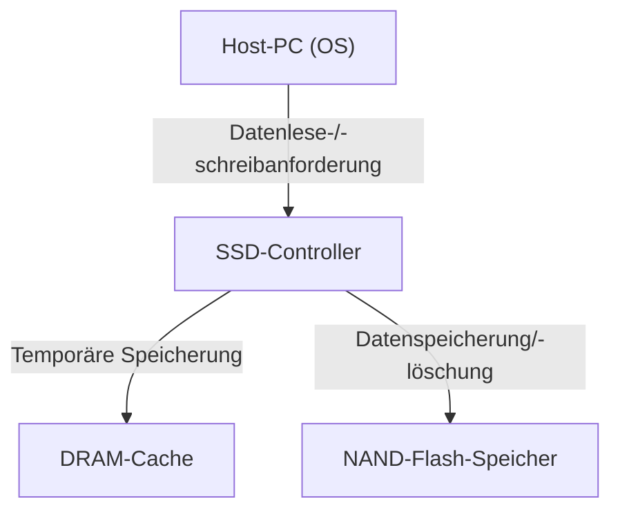
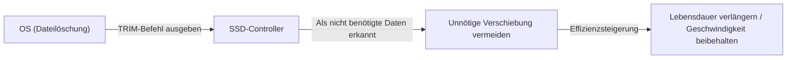

## 1. Einführung

In modernen Computern hat sich der primäre Speicher vollständig von HDDs (Hard Disk Drives) zu SSDs (Solid State Drives) verlagert. Da SSDs im Gegensatz zu HDDs keine physisch rotierenden Festplatten oder suchenden Magnetköpfe haben und Daten vollständig über elektronische Schaltungen lesen und schreiben, bieten sie eine überwältigende Geschwindigkeit und Stoßfestigkeit.

SSDs haben jedoch eine besondere Einschränkung, die als "Schreiblebensdauer" bekannt ist. Je öfter Daten überschrieben werden, desto mehr verschlechtern sich die internen Komponenten nach und nach. In diesem Artikel erklären wir aus der Perspektive des Engineerings detailliert, warum die Lebensdauer abnimmt und welche Technologien verwendet werden, um diese Lebensdauer zu verlängern, während wir die Funktionsweise des "NAND-Flash-Speichers", dem Herzstück einer SSD, entwirren.

## 2. Grundstruktur von SSDs und NAND-Flash-Speicher

Wenn man eine SSD zerlegt, sieht man, dass sie hauptsächlich aus den folgenden drei Hauptkomponenten besteht:

1. **NAND-Flash-Speicher**: Die Chips, die die Daten tatsächlich speichern. Es ist ein nichtflüchtiger Speicher, bei dem die Daten auch nach dem Ausschalten nicht verloren gehen.
2. **Controller**: Das "Gehirn" der SSD. Er führt fortschrittliche Prozesse wie die Steuerung des Lesens und Schreibens von Daten, Fehlerkorrektur und das später beschriebene Wear-Leveling durch.
3. **DRAM-Cache**: Ein temporärer Speicherbereich zur Beschleunigung des Lesens und Schreibens von Daten (bei einigen günstigen Modellen nicht vorhanden).

Von diesen ist der NAND-Flash-Speicher für die langfristige Speicherung von Daten verantwortlich.

## 3. Wie die Datenaufzeichnung im NAND-Flash-Speicher funktioniert

Das Innere eines NAND-Flash-Speichers besteht aus einer unzähligen Ansammlung von "Zellen", der kleinsten Einheit zur Datenspeicherung.

### 3.1. Zellstruktur und das Einfangen von Elektronen

Eine Zelle ist eine Art Transistor, der auf einem Siliziumsubstrat aufgebaut ist. Was sie von gewöhnlichen Transistoren unterscheidet, ist, dass sie einen isolierten Bereich besitzt, der "Floating-Gate" oder "Charge-Trap" genannt wird, um Elektronen einzufangen.

Wenn Daten geschrieben werden, wird eine hohe Spannung (Programmierspannung) an das Steuer-Gate angelegt. Dann injiziert ein quantenmechanisches Phänomen namens "Tunneleffekt" Elektronen durch einen isolierenden Film (Tunneloxidschicht) in das Floating-Gate. Durch das Ablesen der Zustände "vorhanden" und "nicht vorhanden" dieser Elektronen werden digitale 0- und 1-Daten dargestellt.

Beim Löschen von Daten wird umgekehrt eine hohe Spannung an die Substratseite angelegt, um Elektronen aus dem Floating-Gate zu ziehen.

### 3.2. Die Unterschiede zwischen SLC, MLC, TLC und QLC

Bei frühen SSDs war **SLC (Single-Level Cell)** der Mainstream, bei dem 1 Bit (0 oder 1) Daten in einer Zelle gespeichert wurde. Aufgrund der Nachfrage nach größeren Kapazitäten und niedrigeren Preisen hat sich jedoch die Technologie entwickelt, mehrere Bits in einer einzigen Zelle aufzuzeichnen.

*   **SLC (Single-Level Cell)**: 1 Bit pro Zelle. Hohe Geschwindigkeit und sehr lange Lebensdauer, aber hohe Kosten pro Kapazität.
*   **MLC (Multi-Level Cell)**: 2 Bits pro Zelle (4 Spannungsstufen).
*   **TLC (Triple-Level Cell)**: 3 Bits pro Zelle (8 Spannungsstufen). Derzeitiger Mainstream.
*   **QLC (Quad-Level Cell)**: 4 Bits pro Zelle (16 Spannungsstufen). Große Kapazität und günstig, aber geringere Lebensdauer und Geschwindigkeit.

Da es erforderlich ist, mehrstufige Spannungen in einer einzigen Zelle genau aufzuzeichnen und zu lesen, wird die Steuerung bei TLC und QLC komplexer, was zu geringeren Schreibgeschwindigkeiten, höheren Fehlerraten und einer verkürzten Lebensdauer führt.

## 4. Warum haben SSDs eine "Lebensdauer"?

Obwohl es bei HDDs im Prinzip keine Begrenzung der Anzahl der Überschreibvorgänge gibt (außer bei physischen Defekten), gibt es bei NAND-Flash-Speicher eine klare Begrenzung. Dies ist auf den Mechanismus des Datenschreibens und -löschens selbst zurückzuführen.

### 4.1. Degradation der Tunneloxidschicht (Grenze der P/E-Zyklen)

Wie zuvor erwähnt, werden Elektronen beim Schreiben und Löschen von Daten durch hohe Spannungen gewaltsam durch einen dünnen Isolator namens "Tunneloxidschicht" getrieben. Wenn dieser Vorgang (Program/Erase-Zyklus oder P/E-Zyklus) wiederholt wird, wird die Tunneloxidschicht durch die Belastung durch hohe Spannungen physisch abgebaut.

Wenn sich die Oxidschicht verschlechtert, können Elektronen nicht mehr im Floating-Gate bleiben und entweichen, oder umgekehrt können sie nicht mehr herausgezogen werden. Infolgedessen kann die beabsichtigte Spannungsstufe nicht mehr genau gehalten und abgelesen werden, was zu einer Datenbeschädigung führt. Dies ist die "Lebensdauer" einer SSD.

Es hieß, dass P/E-Zyklen für SLC bei etwa 100.000 Mal lagen, aber sie sind bei MLC auf etwa 3.000 bis 10.000 Mal, bei TLC auf etwa 1.000 bis 3.000 Mal und bei QLC auf mehrere Hundert bis 1.000 Mal gesunken.

### 4.2. "Seiten"- und "Block"-Einschränkungen

Ein weiteres Problem, das die Lebensdauer von NAND-Flash-Speicher noch komplexer macht, ist seine einzigartige Lese- und Schreibeinheit.

*   **Seite (Page)**: Die kleinste Einheit für das "Lesen" und "Schreiben" von Daten (normalerweise 4KB bis 16KB).
*   **Block**: Eine Einheit, die aus mehreren Seiten besteht (normalerweise 256 Seiten bis mehrere Tausend Seiten). Die kleinste Einheit für das "Löschen" von Daten.

Die größte Schwäche von NAND-Flash ist, dass **"Daten nicht direkt auf Seiten überschrieben werden können, auf denen bereits Daten geschrieben wurden"**. Um Daten zu überschreiben, muss zunächst der gesamte Block, der diese Seite enthält, "gelöscht" und in einen leeren Zustand zurückversetzt werden.

Da ein Block jedoch oft andere gültige Daten enthält, die man nicht ändern möchte, kann er nicht einfach gelöscht werden.

## 5. Fortschrittliche Technologien zur Verlängerung der SSD-Lebensdauer

Damit NAND-Flash, das ansonsten schnell das Ende seiner Lebensdauer erreichen würde, als praktischer Speicher für einen langen Zeitraum genutzt werden kann, führen SSD-Controller im Hintergrund eine äußerst komplexe Verwaltung durch.

### 5.1. Wear-Leveling

Um zu verhindern, dass bestimmte Blöcke häufig überschrieben werden und vorzeitig das Ende ihrer Lebensdauer erreichen, verteilen SSD-Controller die Schreibvorgänge gleichmäßig auf alle Blöcke. Dies wird "Wear-Leveling" (Verschleißausgleich) genannt.

Zum Beispiel scheint das Betriebssystem dieselbe Datei (dieselbe logische Adresse) wiederholt zu aktualisieren, aber intern in der SSD werden Daten jedes Mal in einen anderen physischen Block geschrieben und die alten Daten als "ungültig" markiert. Dadurch wird sichergestellt, dass die Zellen des gesamten Laufwerks gleichmäßig verschleißen.

### 5.2. Garbage Collection (Müllabfuhr)

Wenn das Überschreiben von Daten wiederholt wird, nimmt die Anzahl der Blöcke in der SSD zu, in denen "gültige Daten" und "ungültige, veraltete Daten (Müll)" vermischt sind. Wenn dieser Zustand anhält, gehen die leeren Blöcke aus, in die neue Daten geschrieben werden können.

Wenn der freie Speicherplatz knapp wird oder im Leerlauf, sammelt der SSD-Controller nur die "gültigen Daten" aus mehreren Blöcken und verschiebt sie in einen neuen Block, woraufhin die ursprünglichen Blöcke vollständig gelöscht werden, um sie wiederverwendbar zu machen. Dies ist Garbage Collection.

### 5.3. Der TRIM-Befehl

Ein wichtiger Mechanismus zur effizienten Durchführung der Garbage Collection ist der TRIM-Befehl.

Wenn ein Benutzer eine Datei auf dem Betriebssystem "löscht", entfernt das Betriebssystem diesen Eintrag nur aus dem Inhaltsverzeichnis des Dateisystems und teilt der SSD nicht mit, dass "diese Daten nicht mehr benötigt werden". Da die SSD nicht weiß, welche Daten gültig sind und welche nicht, verschiebt sie pflichtbewusst selbst nicht mehr benötigte Daten durch die Garbage Collection. Dies führt zu unnötigen Schreibvorgängen (Write Amplification) und verkürzt die Lebensdauer.

Der TRIM-Befehl ist ein Mechanismus, bei dem das Betriebssystem dem SSD-Controller direkt mitteilt, dass "die Daten in diesem Bereich nicht mehr benötigt werden", sobald eine Datei gelöscht wird. Dadurch spart sich die SSD die unnötige Arbeit des Verschiebens nicht mehr benötigter Daten, erhält die Leistung aufrecht und verlängert die Lebensdauer.

## 6. Fazit

Aufgrund der physikalischen Eigenschaften des NAND-Flash-Speichers sind SSDs dazu bestimmt, eine Obergrenze für die Anzahl der Überschreibvorgänge zu haben. Jedes Mal, wenn Elektronen in eine Zelle eingebracht oder aus ihr entfernt werden, verschlechtert sich die Isolierschicht, und schließlich können keine Daten mehr gehalten werden.

Moderne SSDs verbergen diese Schwäche jedoch geschickt durch die Kristallisation von Technologien wie Wear-Leveling durch fortschrittliche Controller, Garbage Collection und den TRIM-Befehl vom Betriebssystem. Für den allgemeinen PC-Gebrauch ist die Wahrscheinlichkeit, dass die Zeit für den Kauf eines neuen PCs gekommen ist oder andere Komponenten ausfallen, weitaus höher, als dass die SSD ihre Schreiblebensdauer erreicht.

Daten-Backups sind für jeden Speicher unerlässlich, aber die optimale Lösung im modernen Engineering besteht darin, die hohe Geschwindigkeit von SSDs voll auszuschöpfen, ohne sich übermäßig vor ihrer "kurzen Lebensdauer" zu fürchten.
