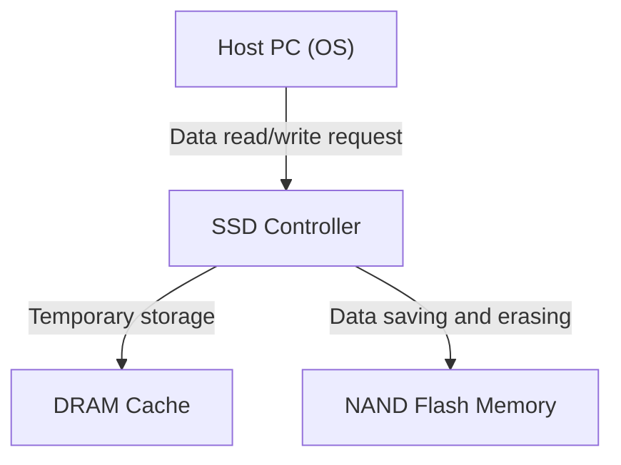
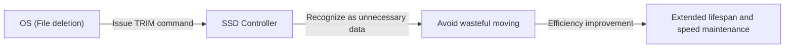

## 1. Introduction

In modern computers, the leading role in storage has completely transitioned from HDDs (Hard Disk Drives) to SSDs (Solid State Drives). Unlike HDDs, SSDs do not have physically rotating disks or seeking magnetic heads; they read and write data entirely through electronic circuits, boasting overwhelming high speed and shock resistance.

However, SSDs have a unique limitation known as "rewrite lifespan". The more data is rewritten, the more the internal components gradually deteriorate. In this article, we will unravel the mechanism of "NAND flash memory", which forms the core of an SSD, and explain in detail from an engineering perspective why its lifespan decreases and what technologies are used to extend that lifespan.

## 2. Basic Structure of SSD and NAND Flash Memory

When you disassemble an SSD, you will find that it is mainly composed of the following three major components:

1. **NAND Flash Memory**: The chips that actually store data. It is non-volatile memory that does not lose data even when the power is turned off.
2. **Controller**: The "brain" of the SSD. It performs advanced processing such as data read/write control, error correction, and wear leveling, which will be described later.
3. **DRAM Cache**: A temporary storage area for speeding up data reading and writing (not included in some inexpensive models).

Among these, the NAND flash memory is responsible for long-term data storage.

## 3. Data Recording Mechanism of NAND Flash Memory

The inside of NAND flash memory consists of an innumerable number of "cells", which are the smallest units for recording data.

### 3.1. Cell Structure and Electron Capture

A cell is a type of transistor made on a silicon substrate. What makes it different from a normal transistor is that it has an insulated region called a "floating gate" or "charge trap" for confining electrons.

When writing data, a high voltage (program voltage) is applied to the control gate. Then, due to a quantum mechanical phenomenon called the "tunnel effect", electrons pass through the insulating film (tunnel oxide film) and are injected into the floating gate. Digital data of 0 and 1 is expressed by reading the state of "presence" and "absence" of these electrons.

Conversely, when erasing data, a high voltage is applied to the substrate side to extract electrons from the floating gate.

### 3.2. Differences Between SLC, MLC, TLC, and QLC

In early SSDs, **SLC (Single-Level Cell)**, which stores 1 bit of data (0 or 1) in one cell, was the mainstream. However, due to demands for larger capacity and lower prices, the technology for recording multiple bits in a single cell has evolved.

*   **SLC (Single-Level Cell)**: 1 bit per cell. Very fast and has a very long lifespan, but the unit price per capacity is high.
*   **MLC (Multi-Level Cell)**: 2 bits per cell (4 voltage levels).
*   **TLC (Triple-Level Cell)**: 3 bits per cell (8 voltage levels). The current mainstream.
*   **QLC (Quad-Level Cell)**: 4 bits per cell (16 voltage levels). High capacity and inexpensive, but inferior in lifespan and speed.

Since it is necessary to accurately record and read multi-stage voltages in a single cell, control becomes more complex as we move to TLC and QLC, leading to decreased write speeds, increased error rates, and reduced lifespan.

## 4. Why Do SSDs Have a "Lifespan"?

While HDDs have no fundamental limit on the number of rewrites (excluding physical failures), NAND flash memory has a clear limitation. This is due to the very mechanism of data writing and erasing.

### 4.1. Degradation of Tunnel Oxide Film (Limits of P/E Cycles)

As mentioned earlier, when writing or erasing data, electrons are forcibly passed through a thin insulator called the "tunnel oxide film" by high voltage. When this operation (Program/Erase cycle, or P/E cycle) is repeated, the tunnel oxide film physically degrades due to the stress from high voltage.

When the oxide film degrades, electrons can no longer stay in the floating gate and leak out, or conversely, they become unable to be extracted. As a result, the intended voltage level cannot be accurately held or read, causing data corruption. This is the "lifespan" of an SSD.

The P/E cycle of SLC was said to be about 100,000 times, but it has decreased to about 3,000 to 10,000 times for MLC, about 1,000 to 3,000 times for TLC, and a few hundred to 1,000 times for QLC.

### 4.2. Constraints of "Pages" and "Blocks"

What further complicates the lifespan issue of NAND flash memory is its unique unit of reading and writing.

*   **Page**: The smallest unit of "reading" and "writing" data (usually 4KB to 16KB).
*   **Block**: A unit consisting of multiple pages (usually 256 pages to several thousand pages). The smallest unit of data "erasing".

The biggest weakness of NAND flash is that **"data cannot be directly overwritten onto a page where data is already written."** To rewrite data, the entire block containing that page must first be "erased" to return it to an empty state.

However, since a block often contains other valid data that should not be changed, it cannot simply be erased.

## 5. Advanced Technologies for Extending SSD Lifespan

To make NAND flash, which would otherwise quickly reach the end of its lifespan, usable as practical storage for a long period of time, the SSD controller performs highly complex management behind the scenes.

### 5.1. Wear Leveling

To prevent specific blocks from being rewritten frequently and reaching the end of their lifespan early, the SSD controller distributes writing evenly across all blocks. This is called "wear leveling".

For example, even if the OS appears to be updating the same file (the same logical address) over and over again, the SSD internally writes the data to a different physical block each time and marks the old data as "invalid". This controls the cells across the entire drive so that they degrade uniformly.

### 5.2. Garbage Collection

As data rewriting is repeated, the number of blocks in the SSD containing a mix of "valid data" and "invalid old data (garbage)" increases. If this state continues, free blocks for writing new data will run out.

Therefore, when free space is low or during idle times, the SSD controller collects only "valid data" from multiple blocks, moves them to another new block, and completely erases the original blocks to make them reusable. This is garbage collection.

### 5.3. TRIM Command

The TRIM command is an important mechanism for performing garbage collection efficiently.

When a user "deletes" a file on the OS, the OS only removes the entry from the index on the file system, and does not communicate to the SSD that "this data is no longer needed". Since the SSD doesn't know which data is valid and which is unnecessary, it dutifully moves even the unnecessary data during garbage collection, causing wasteful writing (Write Amplification) and shortening the lifespan.

The TRIM command is a mechanism by which the OS directly notifies the SSD controller that "the data in this area is no longer needed" at the timing when the file is deleted. This allows the SSD to skip the wasteful task of moving unnecessary data, achieving sustained performance and extended lifespan.

## 6. Conclusion

Due to the physical characteristics of NAND flash memory, SSDs are burdened with the fate of having an upper limit on the number of rewrites. Every time electrons are moved in and out of a cell, the insulating film degrades, and eventually it becomes unable to retain data.

However, modern SSDs cleverly conceal this weakness through the crystallization of technologies such as wear leveling, garbage collection, and TRIM commands from the OS by highly advanced controllers. In general PC usage, the reality is that the probability of the PC itself reaching replacement time or other parts failing is much higher than the SSD reaching the end of its rewrite lifespan.

While data backup is essential for any storage, taking full advantage of the high speed of SSDs without excessively fearing their "short lifespan" is the optimal solution in modern engineering.
