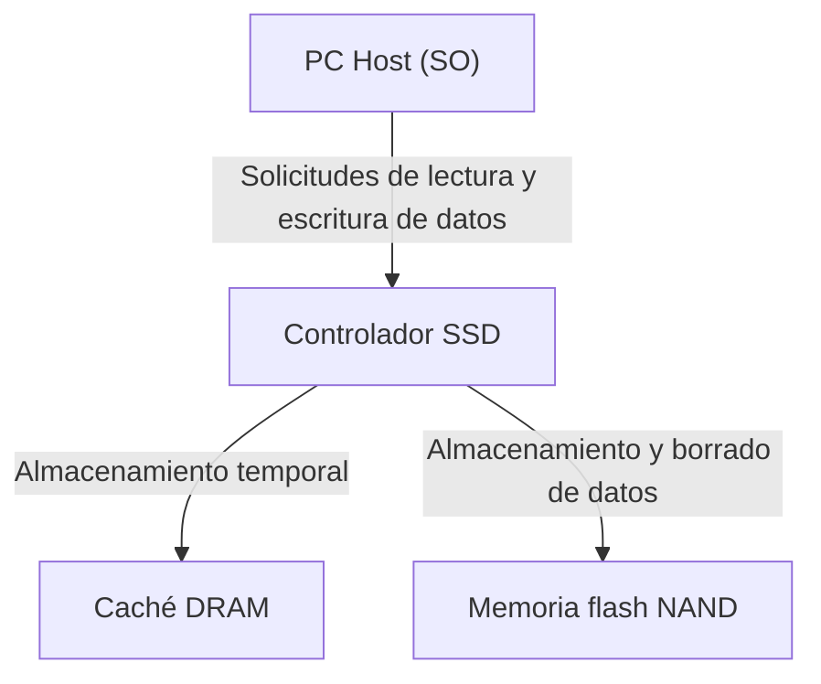

## 1. Introducción

En los ordenadores modernos, el almacenamiento principal ha pasado completamente de los HDD (unidades de disco duro) a los SSD (unidades de estado sólido). A diferencia de los HDD, los SSD no tienen discos que giren físicamente ni cabezales magnéticos que se desplacen; en su lugar, leen y escriben datos de forma completamente electrónica, lo que les otorga una velocidad y una resistencia a los golpes abrumadoras.

Sin embargo, los SSD tienen una limitación específica llamada "vida útil de reescritura" (o ciclos de escritura). Cuanto más se reescriben los datos, más se degradan poco a poco los componentes internos. En este artículo, desentrañaremos el funcionamiento de la "memoria flash NAND", que constituye el núcleo del SSD, y explicaremos detalladamente desde una perspectiva de ingeniería por qué disminuye su vida útil y qué tecnologías se utilizan para prolongarla.

## 2. Estructura básica del SSD y la memoria flash NAND

Si desmontamos un SSD, descubriremos que está compuesto principalmente por los siguientes tres componentes principales:

1. **Memoria flash NAND**: El chip que realmente almacena los datos. Es una memoria no volátil que no pierde sus datos ni siquiera cuando se apaga la energía.
2. **Controlador**: El "cerebro" del SSD. Realiza un procesamiento avanzado, como el control de lectura y escritura de datos, la corrección de errores y el nivelado de desgaste (wear leveling), que se describe más adelante.
3. **Caché DRAM**: Un área de almacenamiento temporal para acelerar la lectura y escritura de datos (algunos modelos económicos no cuentan con ella).

Entre ellos, la memoria flash NAND es la encargada de almacenar los datos a largo plazo.

## 3. Mecanismo de grabación de datos de la memoria flash NAND

El interior de la memoria flash NAND está formado por una infinidad de "celdas" (Cells), que son la unidad mínima para registrar datos.

### 3.1. Estructura de las celdas y captura de electrones

Una celda es un tipo de transistor construido sobre un sustrato de silicio. A diferencia de un transistor normal, tiene una región aislada llamada "puerta flotante" (floating gate) o "trampa de carga" (charge trap) diseñada para atrapar electrones.

Al escribir datos, se aplica un voltaje alto (voltaje de programación) a la puerta de control. Esto hace que, debido a un fenómeno de la mecánica cuántica llamado "efecto túnel", los electrones atraviesen la capa aislante (óxido del túnel) y se inyecten en la puerta flotante. Al leer el estado de "presencia" o "ausencia" de estos electrones, se representan los datos digitales de 0 y 1.

Por el contrario, al borrar datos, se aplica un voltaje alto hacia el lado del sustrato para extraer los electrones de la puerta flotante.

### 3.2. Diferencias entre SLC, MLC, TLC y QLC

En los primeros SSD, predominaba la tecnología **SLC (Single-Level Cell)**, que almacena 1 bit (0 o 1) de datos en una sola celda. Sin embargo, debido a la demanda de mayores capacidades y menores precios, la tecnología evolucionó para registrar múltiples bits en una sola celda.

*   **SLC (Single-Level Cell)**: 1 bit por celda. Es rápida y tiene una vida útil muy larga, pero el precio por capacidad es elevado.
*   **MLC (Multi-Level Cell)**: 2 bits por celda (4 niveles de voltaje).
*   **TLC (Triple-Level Cell)**: 3 bits por celda (8 niveles de voltaje). Es la tecnología predominante en la actualidad.
*   **QLC (Quad-Level Cell)**: 4 bits por celda (16 niveles de voltaje). Ofrece gran capacidad y es económica, pero su vida útil y velocidad son inferiores.

Dado que es necesario registrar y leer múltiples niveles de voltaje con precisión en una sola celda, el control se vuelve más complejo a medida que se avanza hacia TLC o QLC, lo que provoca una disminución en la velocidad de escritura, un aumento en la tasa de errores y, en consecuencia, una reducción de la vida útil.

## 4. ¿Por qué los SSD tienen una "vida útil"?

Mientras que los HDD no tienen un límite teórico de ciclos de reescritura (excluyendo los fallos físicos), las memorias flash NAND sí tienen una restricción clara. Esto se debe al propio mecanismo de escritura y borrado de datos.

### 4.1. Degradación del óxido del túnel (Límite de los ciclos P/E)

Como se mencionó anteriormente, al escribir o borrar datos, los electrones son forzados a través de un delgado aislante llamado "óxido del túnel" mediante un alto voltaje. Al repetir esta operación (ciclo de Programación/Borrado, o ciclo P/E), el óxido del túnel se degrada físicamente debido al estrés provocado por el alto voltaje.

Cuando la capa de óxido se degrada, los electrones ya no pueden permanecer retenidos en la puerta flotante y se filtran, o a la inversa, se quedan atascados y no pueden ser extraídos. Como resultado, ya no es posible mantener o leer con precisión el nivel de voltaje previsto y los datos se corrompen. Esta es la "vida útil" del SSD.

Se dice que el ciclo P/E del SLC es de unas 100,000 veces, pero ha disminuido a unas 3,000 a 10,000 veces para el MLC, unas 1,000 a 3,000 veces para el TLC, y apenas unos cientos a 1,000 veces para el QLC.

### 4.2. Restricciones de "Página" y "Bloque"

Lo que hace aún más complejo el problema de la vida útil de la memoria flash NAND son sus peculiares unidades de lectura y escritura.

*   **Página (Page)**: La unidad mínima para "leer" y "escribir" datos (generalmente entre 4 KB y 16 KB).
*   **Bloque (Block)**: La unidad formada por un conjunto de varias páginas (generalmente de 256 páginas a varios miles de páginas). Es la unidad mínima para "borrar" datos.

La mayor debilidad de la memoria flash NAND es que **"los datos no se pueden sobrescribir directamente en una página en la que ya se han escrito datos"**. Para reescribir datos, primero es necesario "borrar" todo el bloque que contiene esa página y devolverlo a un estado vacío.

Sin embargo, dado que el bloque a menudo también contiene otros datos válidos que no se desean modificar, no es posible simplemente borrarlo de forma directa.

## 5. Tecnologías avanzadas para prolongar la vida útil del SSD

Para permitir que la memoria flash NAND, que de otro modo alcanzaría rápidamente el final de su vida útil, pueda utilizarse durante mucho tiempo como un almacenamiento práctico, el controlador del SSD realiza una gestión en segundo plano extremadamente compleja.

### 5.1. Nivelado de desgaste (Wear Leveling)

Para evitar que ciertos bloques específicos se reescriban con demasiada frecuencia y mueran de manera prematura, el controlador del SSD distribuye uniformemente las escrituras a través de todos los bloques. A esto se le llama "nivelado de desgaste" o wear leveling.

Por ejemplo, aunque para el SO parezca que se está actualizando el mismo archivo (la misma dirección lógica) repetidamente, internamente en el SSD los datos se escriben en bloques físicos diferentes cada vez, y los datos antiguos se marcan como "inválidos". De este modo, se controla que las celdas de toda la unidad se desgasten por igual.

### 5.2. Recolección de basura (Garbage Collection)

A medida que se repiten las reescrituras de datos, en el interior del SSD van aumentando los bloques donde se mezclan "datos válidos" y "datos antiguos que se han vuelto inválidos (basura)". Si esta situación persiste, los bloques vacíos para escribir nuevos datos acabarán por agotarse.

Por ello, cuando queda poco espacio libre o durante el tiempo de inactividad, el controlador del SSD recoge solo los "datos válidos" de varios bloques y los traslada a otro bloque nuevo. Luego, borra por completo los bloques originales para que puedan ser reutilizados. A esto se le denomina recolección de basura o garbage collection.

### 5.3. Comando TRIM

Un mecanismo crucial para realizar de forma eficiente la recolección de basura es el comando TRIM.

Incluso si un usuario "elimina" un archivo en el SO, el SO simplemente borra esa entrada del índice del sistema de archivos y no comunica al SSD la información de que "estos datos ya no son necesarios". Dado que el SSD no sabe qué datos son válidos y cuáles no, durante la recolección de basura acabaría trasladando meticulosamente incluso los datos innecesarios, lo que provoca escrituras inútiles (Write Amplification) y acorta la vida útil.

El comando TRIM es un mecanismo mediante el cual el SO notifica directamente al controlador del SSD que "los datos de esta área ya no son necesarios" en el mismo instante en que se elimina un archivo. Gracias a esto, el SSD se ahorra el trabajo inútil de trasladar datos innecesarios, logrando mantener el rendimiento y prolongar la vida útil.

## 6. Conclusión

Debido a las propiedades físicas de la memoria flash NAND, los SSD tienen el destino inevitable de contar con un límite máximo de ciclos de reescritura. Cada vez que se introducen o extraen electrones de las celdas, la capa aislante se degrada y, con el tiempo, dejará de poder retener los datos.

Sin embargo, los SSD modernos ocultan hábilmente esta debilidad a través de la cristalización de tecnologías como el nivelado de desgaste por parte de controladores avanzados, la recolección de basura y el comando TRIM proveniente del SO. En la realidad de un uso general de PC, es mucho más probable que llegue el momento de reemplazar la PC completa o que se estropeen otros componentes antes de que el SSD alcance su límite de ciclos de reescritura.

Aunque hacer copias de seguridad de los datos es esencial para cualquier tipo de almacenamiento, no hay que temer en exceso a la "corta vida útil". Aprovechar al máximo la alta velocidad de los SSD es, sin duda, la solución óptima de la ingeniería moderna.
