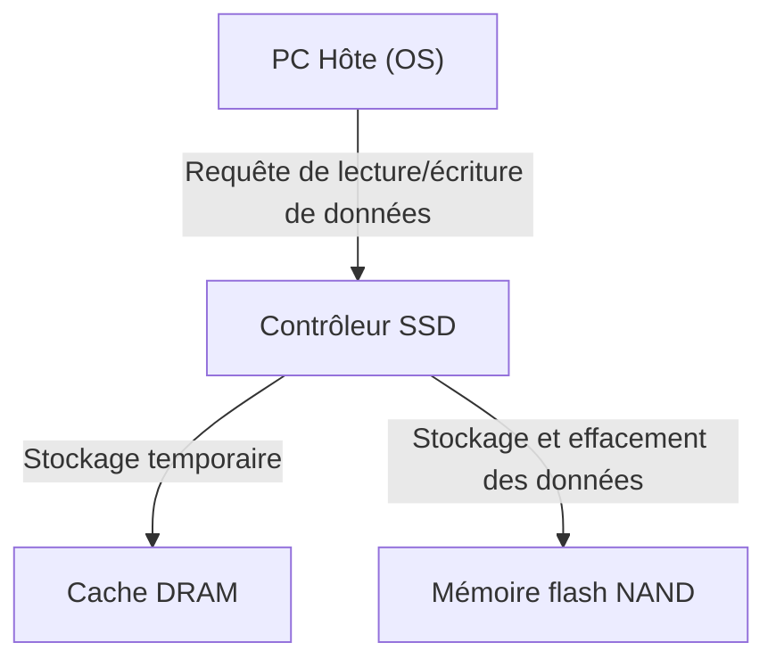
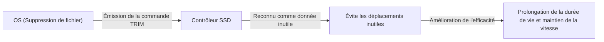

## 1. Introduction

Dans les ordinateurs modernes, le rôle principal du stockage est complètement passé des HDD (disques durs) aux SSD (Solid State Drives). Contrairement aux HDD, les SSD n'ont pas de disques qui tournent physiquement ni de têtes magnétiques qui se déplacent ; ils lisent et écrivent toutes les données via des circuits purement électroniques, offrant ainsi une vitesse et une résistance aux chocs exceptionnelles.

Cependant, les SSD ont une limitation spécifique appelée « durée de vie de réécriture ». Plus vous réécrivez de données, plus les composants internes se dégradent progressivement. Dans cet article, nous décortiquerons le fonctionnement de la « mémoire flash NAND » qui est au cœur des SSD, nous expliquerons pourquoi sa durée de vie diminue, et quelles technologies sont utilisées pour prolonger cette durée de vie, du point de vue de l'ingénierie.

## 2. Structure de base d'un SSD et mémoire flash NAND

Lorsque vous démontez un SSD, vous constatez qu'il est principalement composé des trois composants majeurs suivants :

1. **Mémoire flash NAND** : La puce qui stocke réellement les données. C'est une mémoire non volatile dont les données ne s'effacent pas même lorsque l'alimentation est coupée.
2. **Contrôleur** : Le « cerveau » du SSD. Il gère le contrôle de lecture/écriture des données, la correction d'erreurs et des traitements avancés comme le Wear Leveling (répartition de l'usure) mentionné plus loin.
3. **Cache DRAM** : Une zone de stockage temporaire pour accélérer la lecture et l'écriture des données (non incluse dans certains modèles économiques).

Parmi ces composants, c'est la mémoire flash NAND qui est responsable du stockage à long terme des données.

## 3. Le mécanisme d'enregistrement des données de la mémoire flash NAND

L'intérieur de la mémoire flash NAND est constitué d'une multitude innombrable de « cellules (Cells) », qui sont les plus petites unités d'enregistrement de données.

### 3.1. Structure de la cellule et capture des électrons

Une cellule est un type de transistor fabriqué sur un substrat de silicium. Ce qui le différencie d'un transistor normal, c'est qu'il possède une zone isolée appelée « grille flottante (Floating Gate) » ou « piège à charge (Charge Trap) » pour emprisonner les électrons.

Lors de l'écriture des données, une tension élevée (tension de programmation) est appliquée à la grille de contrôle. Alors, par un phénomène de la mécanique quantique appelé « effet tunnel », les électrons traversent la couche isolante (oxyde à effet tunnel) et sont injectés dans la grille flottante. La lecture de l'état de « présence » ou d'« absence » de ces électrons permet de représenter les données numériques 0 et 1.

Lors de l'effacement des données, on applique inversement une tension élevée du côté du substrat pour extraire les électrons de la grille flottante.

### 3.2. Différences entre SLC, MLC, TLC et QLC

Dans les premiers SSD, la technologie **SLC (Single-Level Cell)**, qui stocke 1 bit de données (0 ou 1) dans une seule cellule, était la norme. Cependant, avec la demande croissante de plus grandes capacités et de prix plus bas, la technologie permettant d'enregistrer plusieurs bits dans une seule cellule a évolué.

*   **SLC (Single-Level Cell)** : 1 bit par cellule. Haute vitesse et durée de vie très longue, mais le coût par capacité est élevé.
*   **MLC (Multi-Level Cell)** : 2 bits par cellule (4 niveaux de tension).
*   **TLC (Triple-Level Cell)** : 3 bits par cellule (8 niveaux de tension). Actuellement dominant.
*   **QLC (Quad-Level Cell)** : 4 bits par cellule (16 niveaux de tension). Grande capacité et économique, mais la durée de vie et la vitesse sont inférieures.

Puisqu'il est nécessaire d'enregistrer et de lire précisément de multiples niveaux de tension dans une seule cellule, le contrôle devient plus complexe en passant au TLC ou au QLC, ce qui entraîne une baisse de la vitesse d'écriture, une augmentation du taux d'erreur, et une diminution de la durée de vie.

## 4. Pourquoi les SSD ont-ils une « durée de vie » ?

Alors que les disques durs (HDD) n'ont pas de limite théorique au nombre de réécritures (à l'exception des pannes physiques), la mémoire flash NAND a une limitation claire. Cela est dû au mécanisme même d'écriture et d'effacement des données.

### 4.1. Dégradation de l'oxyde à effet tunnel (Limite des cycles P/E)

Comme mentionné précédemment, lors de l'écriture ou de l'effacement des données, les électrons sont forcés de traverser un fin isolant appelé « oxyde à effet tunnel » sous l'effet d'une haute tension. En répétant cette opération (cycle de Program/Erase, ou cycle P/E), l'oxyde à effet tunnel se dégrade physiquement à cause du stress causé par la haute tension.

Lorsque la couche d'oxyde se dégrade, les électrons ne peuvent plus rester dans la grille flottante et fuient, ou à l'inverse, deviennent impossibles à extraire. En conséquence, il devient impossible de maintenir et de lire précisément le niveau de tension prévu, et les données sont corrompues. C'est ce qu'on appelle la « durée de vie » du SSD.

On disait que les cycles P/E des SLC étaient d'environ 100 000 fois, mais ils sont tombés à environ 3 000 à 10 000 fois pour les MLC, à environ 1 000 à 3 000 fois pour les TLC, et seulement de quelques centaines à 1 000 fois pour les QLC.

### 4.2. Les contraintes de « Page » et de « Bloc »

Ce qui complique encore le problème de la durée de vie de la mémoire flash NAND, c'est son unité de lecture/écriture si particulière.

*   **Page (Page)** : La plus petite unité de « lecture » et d'« écriture » de données (généralement de 4 Ko à 16 Ko).
*   **Bloc (Block)** : Une unité regroupant plusieurs pages (généralement de 256 pages à plusieurs milliers de pages). C'est la plus petite unité d'« effacement » de données.

Le plus grand point faible de la mémoire flash NAND est qu'**« on ne peut pas écraser directement les données sur une page où des données sont déjà écrites »**. Pour réécrire des données, il faut d'abord « effacer » l'intégralité du bloc contenant cette page pour la ramener à un état vide.

Cependant, comme le bloc contient souvent d'autres données valides que l'on ne souhaite pas modifier, il ne peut pas être simplement effacé.

## 5. Technologies avancées pour prolonger la durée de vie des SSD

Afin de permettre à la mémoire flash NAND, qui atteindrait sinon rapidement sa fin de vie, d'être utilisée à long terme comme stockage pratique, le contrôleur du SSD effectue en arrière-plan une gestion extrêmement complexe.

### 5.1. Répartition de l'usure (Wear Leveling)

Pour éviter que des blocs spécifiques ne soient réécrits trop fréquemment et n'atteignent prématurément leur fin de vie, le contrôleur du SSD distribue uniformément les écritures sur tous les blocs. C'est ce qu'on appelle la « répartition de l'usure » (Wear Leveling).

Par exemple, même si l'OS semble mettre à jour le même fichier (même adresse logique) à plusieurs reprises, le SSD écrit en interne les données dans un bloc physique différent à chaque fois et marque les anciennes données comme « invalides ». Ainsi, il contrôle la dégradation pour que les cellules de l'ensemble du disque s'usent uniformément.

### 5.2. Ramasse-miettes (Garbage Collection)

À force de réécrire des données, les blocs contenant un mélange de « données valides » et de « vieilles données devenues invalides (déchets) » se multiplient à l'intérieur du SSD. Si cette situation perdure, les blocs vides pour écrire de nouvelles données finiront par s'épuiser.

Ainsi, lorsque l'espace libre devient faible ou pendant les périodes d'inactivité, le contrôleur SSD rassemble uniquement les « données valides » de plusieurs blocs pour les déplacer vers un nouveau bloc vierge, et efface complètement les blocs d'origine pour les rendre réutilisables. C'est la collecte des déchets (Garbage Collection).

### 5.3. Commande TRIM

La commande TRIM est un mécanisme important pour effectuer efficacement la collecte des déchets.

Même si l'utilisateur « supprime » un fichier sur le système d'exploitation (OS), l'OS efface simplement cette entrée du répertoire du système de fichiers, mais l'information selon laquelle « ces données ne sont plus nécessaires » n'est pas transmise au SSD. Comme le SSD ne sait pas quelles données sont valides et lesquelles ne le sont pas, il déplace scrupuleusement même les données inutiles lors du Garbage Collection, provoquant ainsi des écritures inutiles (Write Amplification) qui réduisent la durée de vie.

La commande TRIM est un mécanisme par lequel l'OS notifie directement au contrôleur du SSD que « les données de cette zone ne sont plus nécessaires » au moment de la suppression du fichier. Grâce à cela, le SSD évite le travail inutile de déplacer des données inutiles, maintenant ainsi les performances et prolongeant la durée de vie.

## 6. Conclusion

En raison des caractéristiques physiques de la mémoire flash NAND, le SSD est voué à avoir une limite au nombre de réécritures. Chaque fois que des électrons entrent et sortent d'une cellule, la couche isolante se dégrade, et un jour, elle ne pourra plus retenir les données.

Cependant, les SSD modernes dissimulent habilement cette faiblesse grâce à des technologies avancées de contrôleur telles que le Wear Leveling, le Garbage Collection, et la commande TRIM issue de l'OS. Dans la réalité, pour une utilisation standard sur PC, il est beaucoup plus probable que le moment de remplacer le PC lui-même arrive, ou que d'autres composants tombent en panne, bien avant que le SSD n'atteigne sa limite de durée de vie en réécritures.

Bien que la sauvegarde des données soit indispensable quel que soit le type de stockage, la meilleure solution en ingénierie moderne est de profiter pleinement de la grande vitesse des SSD sans craindre excessivement que leur « durée de vie soit courte ».
