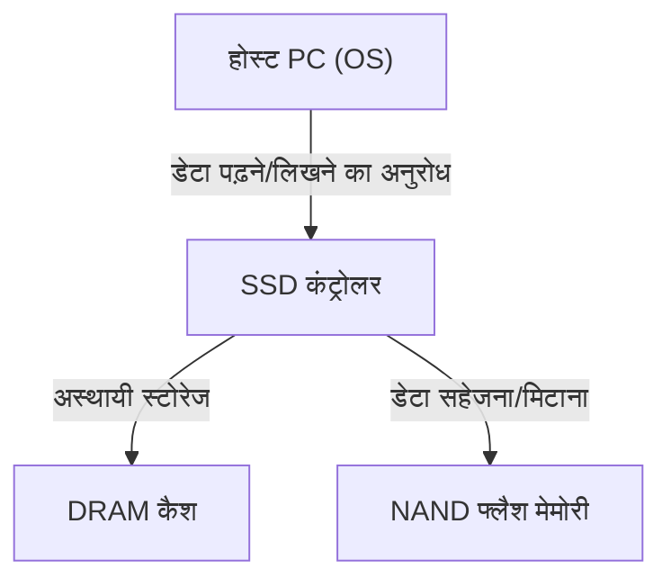
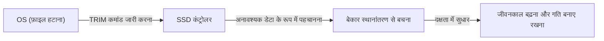

## 1. प्रस्तावना

आधुनिक कंप्यूटरों में, स्टोरेज की मुख्य भूमिका पूरी तरह से HDD (हार्ड डिस्क ड्राइव) से SSD (सॉलिड स्टेट ड्राइव) में बदल गई है। SSD में HDD की तरह भौतिक रूप से घूमने वाली डिस्क या सीक करने वाले मैग्नेटिक हेड नहीं होते हैं, बल्कि यह इलेक्ट्रॉनिक सर्किट के माध्यम से सारा डेटा पढ़ता और लिखता है, जिससे यह अविश्वसनीय गति और आघात प्रतिरोध (shock resistance) का दावा करता है।

हालाँकि, SSD में एक विशिष्ट सीमा होती है जिसे 'लिखने का जीवनकाल' (write endurance) कहा जाता है। जितना अधिक आप डेटा को फिर से लिखते हैं, आंतरिक घटक धीरे-धीरे उतने ही खराब होते जाते हैं। इस लेख में, हम SSD के मूल में मौजूद 'NAND फ्लैश मेमोरी' के तंत्र को समझेंगे और इंजीनियरिंग के दृष्टिकोण से विस्तार से बताएंगे कि इसका जीवनकाल क्यों कम हो जाता है, और इसे बढ़ाने के लिए किन तकनीकों का उपयोग किया जाता है।

## 2. SSD की मूल संरचना और NAND फ्लैश मेमोरी

यदि आप SSD को खोलकर देखते हैं, तो आप पाएंगे कि यह मुख्य रूप से निम्नलिखित तीन प्रमुख घटकों से बना है:

1. **NAND फ्लैश मेमोरी**: वह चिप जो वास्तव में डेटा स्टोर करती है। यह एक नॉन-वोलेटाइल मेमोरी है, जिसका मतलब है कि बिजली बंद होने पर भी डेटा नष्ट नहीं होता है।
2. **कंट्रोलर**: SSD का 'दिमाग'। यह डेटा पढ़ने और लिखने को नियंत्रित करता है, त्रुटि सुधार (error correction) करता है, और वियर लेवलिंग जैसी उन्नत प्रक्रियाओं को संभालता है, जिसके बारे में हम बाद में चर्चा करेंगे।
3. **DRAM कैश**: डेटा पढ़ने और लिखने में तेजी लाने के लिए एक अस्थायी स्टोरेज क्षेत्र (कुछ सस्ते मॉडलों में शामिल नहीं होता)।

इनमें से, NAND फ्लैश मेमोरी दीर्घकालिक डेटा स्टोरेज के लिए जिम्मेदार है।

## 3. NAND फ्लैश मेमोरी का डेटा रिकॉर्डिंग तंत्र

NAND फ्लैश मेमोरी के अंदर 'सेल (Cell)' की एक अनगिनत संख्या होती है, जो डेटा रिकॉर्ड करने की सबसे छोटी इकाई है।

### 3.1. सेल की संरचना और इलेक्ट्रॉनों को फंसाना

एक सेल अनिवार्य रूप से सिलिकॉन सब्सट्रेट पर बनाया गया एक ट्रांजिस्टर होता है। सामान्य ट्रांजिस्टर से जो बात इसे अलग बनाती है, वह यह है कि इसमें इलेक्ट्रॉनों को फंसाने के लिए एक इंसुलेटेड (विद्युत रोधी) क्षेत्र होता है जिसे 'फ्लोटिंग गेट' या 'चार्ज ट्रैप' कहा जाता है।

डेटा लिखते समय, कंट्रोल गेट पर एक उच्च वोल्टेज (प्रोग्राम वोल्टेज) लगाया जाता है। फिर, 'टनल प्रभाव' (Tunnel Effect) नामक एक क्वांटम यांत्रिक घटना के कारण, इलेक्ट्रॉन इन्सुलेटिंग फिल्म (टनल ऑक्साइड फिल्म) से होकर गुजरते हैं और फ्लोटिंग गेट में इंजेक्ट हो जाते हैं। इलेक्ट्रॉन की उपस्थिति ('हाँ') और अनुपस्थिति ('नहीं') की स्थिति को पढ़कर 0 और 1 के डिजिटल डेटा को दर्शाया जाता है।

डेटा मिटाते समय, सब्सट्रेट साइड पर इसके विपरीत उच्च वोल्टेज लगाया जाता है, जिससे फ्लोटिंग गेट से इलेक्ट्रॉनों को बाहर निकाला जाता है।

### 3.2. SLC, MLC, TLC, और QLC के बीच अंतर

शुरुआती SSDs में, **SLC (सिंगल-लेवल सेल)** मुख्य धारा थे, जो एक सेल में 1 बिट (0 या 1) डेटा स्टोर करते थे। हालांकि, बड़ी क्षमता और कम कीमत की मांग के कारण, एक ही सेल में कई बिट्स रिकॉर्ड करने की तकनीक विकसित हुई।

*   **SLC (Single-Level Cell)**: प्रति सेल 1 बिट। बहुत तेज़ और इसका जीवनकाल बहुत लंबा होता है, लेकिन प्रति क्षमता कीमत अधिक होती है।
*   **MLC (Multi-Level Cell)**: प्रति सेल 2 बिट्स (4 वोल्टेज स्तर)।
*   **TLC (Triple-Level Cell)**: प्रति सेल 3 बिट्स (8 वोल्टेज स्तर)। वर्तमान में मुख्य धारा है।
*   **QLC (Quad-Level Cell)**: प्रति सेल 4 बिट्स (16 वोल्टेज स्तर)। बड़ी क्षमता और सस्ता, लेकिन जीवनकाल और गति कमतर होती है।

चूंकि एक ही सेल में वोल्टेज के कई स्तरों को सटीक रूप से रिकॉर्ड करना और पढ़ना आवश्यक है, TLC या QLC की ओर बढ़ने से नियंत्रण अधिक जटिल हो जाता है, जिससे लिखने की गति कम हो जाती है, त्रुटि दर (error rate) बढ़ जाती है, और अंततः जीवनकाल कम हो जाता है।

## 4. SSD का 'जीवनकाल' क्यों होता है?

हालाँकि HDD में सिद्धांत रूप में ओवरराइट करने की कोई सीमा नहीं होती है (भौतिक विफलताओं को छोड़कर), NAND फ्लैश मेमोरी में एक स्पष्ट सीमा होती है। यह डेटा लिखने और मिटाने के तंत्र के कारण ही है।

### 4.1. टनल ऑक्साइड फिल्म का क्षरण (P/E साइकिल की सीमा)

जैसा कि पहले उल्लेख किया गया है, डेटा लिखते या मिटाते समय, इलेक्ट्रॉन उच्च वोल्टेज के कारण 'टनल ऑक्साइड फिल्म' नामक एक पतले इंसुलेटर से जबरदस्ती गुजरते हैं। जब इस क्रिया (Program/Erase cycle, या P/E cycle) को दोहराया जाता है, तो उच्च वोल्टेज के तनाव के कारण टनल ऑक्साइड फिल्म भौतिक रूप से खराब होने लगती है।

जैसे-जैसे ऑक्साइड फिल्म खराब होती है, इलेक्ट्रॉन फ्लोटिंग गेट में रहने में विफल हो सकते हैं और लीक हो सकते हैं, या इसके विपरीत, वे बाहर निकलने में विफल हो सकते हैं। परिणामस्वरूप, इच्छित वोल्टेज स्तर को सटीक रूप से बनाए रखना या पढ़ना असंभव हो जाता है, और डेटा दूषित हो जाता है। यही SSD का 'जीवनकाल' है।

SLC का P/E साइकिल लगभग 100,000 बार माना जाता था, लेकिन MLC में यह घटकर 3,000-10,000 बार, TLC में लगभग 1,000-3,000 बार और QLC में केवल कुछ सौ से 1,000 बार रह गया है।

### 4.2. 'पेज' और 'ब्लॉक' की सीमाएँ

जो बात NAND फ्लैश मेमोरी की जीवनकाल की समस्या को और जटिल बनाती है, वह है इसकी पढ़ने और लिखने की विशिष्ट इकाइयाँ।

*   **पेज (Page)**: डेटा 'पढ़ने' और 'लिखने' की सबसे छोटी इकाई (आमतौर पर 4KB से 16KB)।
*   **ब्लॉक (Block)**: कई पेजों से बनी एक इकाई (आमतौर पर 256 पेज से लेकर हजारों पेज तक)। डेटा 'मिटाने' की सबसे छोटी इकाई।

NAND फ्लैश की सबसे बड़ी कमजोरी यह है कि **"आप उस पेज पर सीधे डेटा को ओवरराइट नहीं कर सकते जिसमें पहले से डेटा लिखा हुआ है।"** डेटा को फिर से लिखने के लिए, आपको पहले उस पूरे ब्लॉक को 'मिटाना' होगा जिसमें वह पेज शामिल है और उसे खाली स्थिति में वापस लाना होगा।

हालाँकि, चूंकि ब्लॉक में अक्सर अन्य मान्य डेटा होते हैं जिन्हें आप बदलना नहीं चाहते हैं, इसलिए इसे बस मिटाया नहीं जा सकता है।

## 5. SSD का जीवनकाल बढ़ाने के लिए उन्नत तकनीकें

NAND फ्लैश को एक व्यावहारिक स्टोरेज के रूप में लंबी अवधि तक प्रयोग करने योग्य बनाने के लिए जो अन्यथा जल्दी समाप्त हो जाएगी, SSD कंट्रोलर पृष्ठभूमि में बहुत जटिल प्रबंधन करता है।

### 5.1. वियर लेवलिंग (Wear Leveling)

यह रोकने के लिए कि विशिष्ट ब्लॉक बहुत बार ओवरराइट किए जाएं और उनका जीवनकाल समय से पहले समाप्त हो जाए, SSD कंट्रोलर सभी ब्लॉकों में समान रूप से लिखने को वितरित करता है। इसे "वियर लेवलिंग" (टूट-फूट को समान करना) कहा जाता है।

उदाहरण के लिए, भले ही OS एक ही फ़ाइल (एक ही लॉजिकल एड्रेस) को बार-बार अपडेट करता हुआ प्रतीत हो, SSD आंतरिक रूप से हर बार अलग-अलग भौतिक ब्लॉकों में डेटा लिखता है और पुराने डेटा को 'अमान्य' के रूप में चिह्नित करता है। इसके द्वारा, पूरी ड्राइव के सेलों को समान रूप से खराब होने के लिए नियंत्रित किया जाता है।

### 5.2. गार्बेज कलेक्शन (Garbage Collection)

जैसे-जैसे डेटा बार-बार ओवरराइट होता है, SSD के भीतर 'मान्य डेटा' और 'अमान्य पुराने डेटा (कचरा)' के मिश्रित ब्लॉक बढ़ जाते हैं। यदि यह स्थिति जारी रहती है, तो नया डेटा लिखने के लिए खाली ब्लॉक खत्म हो जाएंगे।

इसलिए, जब खाली स्थान कम हो जाता है centralized या जब ड्राइव निष्क्रिय (idle) होती है, तो SSD कंट्रोलर कई ब्लॉकों से केवल 'मान्य डेटा' एकत्र करता है, इसे एक नए ब्लॉक में ले जाता है, और फिर पुन: उपयोग के लिए मूल ब्लॉकों को पूरी तरह से मिटा देता है। इसे गार्बेज कलेक्शन कहा जाता है।

### 5.3. TRIM कमांड

गार्बेज कलेक्शन को कुशलतापूर्वक करने के लिए TRIM कमांड एक महत्वपूर्ण तंत्र है।

यहां तक कि जब कोई उपयोगकर्ता OS पर किसी फ़ाइल को "हटा" देता है, तो OS केवल फ़ाइल सिस्टम की अनुक्रमणिका से उस प्रविष्टि को हटा देता है, और SSD को यह जानकारी नहीं दी जाती है कि "इस डेटा की अब आवश्यकता नहीं है।" क्योंकि SSD यह नहीं जानता कि कौन सा डेटा मान्य है और कौन सा अनावश्यक, यह गार्बेज कलेक्शन के दौरान अनावश्यक डेटा को भी ईमानदारी से स्थानांतरित करता है, जिससे बेकार राइट्स (Write Amplification) होते हैं और जीवनकाल कम हो जाता है।

TRIM कमांड एक ऐसा तंत्र है जो OS द्वारा किसी फ़ाइल को हटाए जाने पर SSD कंट्रोलर को सीधे सूचित करता है कि "इस क्षेत्र के डेटा की अब आवश्यकता नहीं है।" इसके द्वारा, SSD अनावश्यक डेटा को स्थानांतरित करने के बेकार काम को छोड़ देता है, प्रदर्शन को बनाए रखता है और जीवनकाल को बढ़ाता है।

## 6. निष्कर्ष

NAND फ्लैश मेमोरी की भौतिक विशेषताओं के कारण, SSD के साथ यह भाग्य जुड़ा हुआ है कि इसके ओवरराइट किए जाने की संख्या की एक ऊपरी सीमा होती है। हर बार जब सेल के अंदर और बाहर इलेक्ट्रॉन जाते हैं, तो इंसुलेटिंग फिल्म खराब हो जाती है, और अंततः यह डेटा को बनाए रखने में असमर्थ हो जाती है।

हालाँकि, आधुनिक SSD उन्नत कंट्रोलरों द्वारा वियर लेवलिंग, गार्बेज कलेक्शन और OS से TRIM कमांड जैसी तकनीकों के माध्यम से अपनी कमजोरियों को चतुराई से छिपाते हैं। सामान्य PC उपयोग के लिए, वास्तविकता यह है कि SSD के अपने ओवरराइट जीवनकाल तक पहुंचने से पहले PC को बदलने का समय आने या अन्य घटकों के विफल होने की संभावना बहुत अधिक है।

हालांकि किसी भी स्टोरेज के लिए डेटा का बैकअप लेना आवश्यक है, लेकिन "कम जीवनकाल" से अत्यधिक डरे बिना SSD की उच्च गति का पूरी तरह से उपयोग करना आधुनिक इंजीनियरिंग का इष्टतम समाधान कहा जा सकता है।
