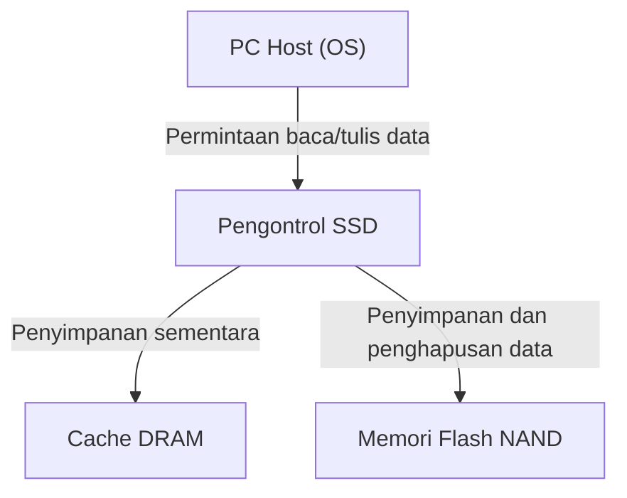
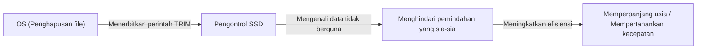

## 1. Pendahuluan

Pada komputer modern, peran utama penyimpanan telah sepenuhnya beralih dari HDD (Hard Disk Drive) ke SSD (Solid State Drive). Berbeda dengan HDD, SSD tidak memiliki disk yang berputar secara fisik atau kepala magnetik yang mencari (seek), melainkan membaca dan menulis data sepenuhnya menggunakan sirkuit elektronik, sehingga menawarkan kecepatan tinggi dan ketahanan benturan yang luar biasa.

Namun, SSD memiliki batasan khusus yang disebut "usia pakai penulisan ulang" (write endurance). Semakin sering data ditulis ulang, komponen internalnya secara bertahap akan semakin memburuk. Pada artikel ini, kita akan menguraikan cara kerja "Memori Flash NAND" yang merupakan inti dari SSD, alasan mengapa usianya berkurang, dan teknologi apa saja yang digunakan untuk memperpanjang usia pakai tersebut dari sudut pandang rekayasa (engineering).

## 2. Struktur Dasar SSD dan Memori Flash NAND

Bila kita membongkar sebuah SSD, kita dapat melihat bahwa SSD terutama terdiri dari 3 komponen utama berikut.

1. **Memori Flash NAND**: Chip yang benar-benar menyimpan data. Ini adalah memori non-volatil yang datanya tidak akan hilang meskipun daya dimatikan.
2. **Pengontrol (Controller)**: "Otak" dari SSD. Mengontrol proses baca/tulis data, koreksi kesalahan (error correction), dan pemrosesan tingkat lanjut seperti wear leveling yang akan dijelaskan nanti.
3. **Cache DRAM**: Area penyimpanan sementara untuk mempercepat proses baca/tulis data (beberapa model murah tidak memilikinya).

Di antaranya, yang bertanggung jawab atas penyimpanan data jangka panjang adalah memori flash NAND.

## 3. Cara Kerja Perekaman Data Memori Flash NAND

Bagian dalam memori flash NAND tersusun atas sekumpulan "Sel (Cell)" tak terhitung jumlahnya yang merupakan unit terkecil untuk merekam data.

### 3.1. Struktur Sel dan Penangkapan Elektron

Sel adalah semacam transistor yang dibuat di atas substrat silikon. Yang membedakannya dari transistor biasa adalah ia memiliki area terisolasi yang disebut "Floating Gate" (gerbang mengambang) atau "Charge Trap" untuk mengurung elektron.

Saat menulis data, tegangan tinggi (tegangan program) diterapkan ke gerbang kontrol (control gate). Kemudian, melalui fenomena mekanika kuantum yang disebut "Efek Terowongan" (Tunnel Effect), elektron menembus lapisan isolator (lapisan oksida terowongan) dan disuntikkan ke floating gate. Data digital 0 dan 1 direpresentasikan dengan membaca keadaan di mana elektron ini "ada" atau "tidak ada".

Sebaliknya, saat menghapus data, tegangan tinggi diterapkan ke sisi substrat untuk menarik elektron keluar dari floating gate.

### 3.2. Perbedaan SLC, MLC, TLC, QLC

Pada SSD awal, **SLC (Single-Level Cell)** yang menyimpan data 1 bit (0 atau 1) dalam satu sel merupakan yang paling umum digunakan. Namun, karena tuntutan kapasitas besar dan harga murah, teknologi untuk merekam beberapa bit dalam satu sel terus berkembang.

*   **SLC (Single-Level Cell)**: 1 bit per sel. Berkecepatan tinggi dan memiliki usia pakai yang sangat panjang, tetapi harga per kapasitasnya mahal.
*   **MLC (Multi-Level Cell)**: 2 bit per sel (4 tingkat level tegangan).
*   **TLC (Triple-Level Cell)**: 3 bit per sel (8 tingkat level tegangan). Arus utama saat ini.
*   **QLC (Quad-Level Cell)**: 4 bit per sel (16 tingkat level tegangan). Kapasitas besar dan murah, tetapi lebih inferior dalam hal usia dan kecepatan.

Karena perlu untuk merekam dan membaca beberapa tingkat tegangan secara akurat pada satu sel, pengontrolannya menjadi lebih kompleks pada TLC dan QLC, yang mengakibatkan penurunan kecepatan penulisan, peningkatan tingkat kesalahan, serta penurunan usia pakai.

## 4. Mengapa SSD Memiliki "Usia Pakai"?

HDD secara prinsip tidak memiliki batasan jumlah penulisan ulang (kecuali kerusakan fisik), tetapi memori flash NAND memiliki batasan yang jelas. Hal ini disebabkan oleh mekanisme penulisan dan penghapusan data itu sendiri.

### 4.1. Degradasi Lapisan Oksida Terowongan (Batas Siklus P/E)

Seperti yang telah disebutkan, saat menulis atau menghapus data, elektron secara paksa menembus isolator tipis yang disebut "lapisan oksida terowongan" menggunakan tegangan tinggi. Bila operasi ini (siklus Program/Erase, atau siklus P/E) diulang terus-menerus, lapisan oksida terowongan secara fisik akan mengalami degradasi akibat tekanan (stres) dari tegangan tinggi.

Saat lapisan oksida terdegradasi, elektron tidak dapat tertahan dan bocor keluar dari floating gate, atau sebaliknya, tidak bisa ditarik keluar. Akibatnya, memori tidak dapat menahan dan membaca tingkat tegangan yang diinginkan dengan akurat, dan data pun rusak. Inilah yang dimaksud dengan "usia pakai" (lifespan) dari sebuah SSD.

Siklus P/E dari SLC konon sekitar 100.000 kali, namun telah menurun menjadi sekitar 3.000-10.000 kali pada MLC, 1.000-3.000 kali pada TLC, dan sekitar ratusan hingga 1.000 kali pada QLC.

### 4.2. Kendala "Halaman (Page)" dan "Blok (Block)"

Masalah usia pakai memori flash NAND semakin diperumit oleh unit baca dan tulisnya yang unik.

*   **Halaman (Page)**: Unit minimum dari "pembacaan" dan "penulisan" data (biasanya 4KB hingga 16KB).
*   **Blok (Block)**: Kesatuan yang terdiri dari kumpulan beberapa halaman (biasanya 256 halaman hingga beberapa ribu halaman). Unit minimum dari "penghapusan" data.

Kelemahan terbesar dari flash NAND adalah **"tidak bisa menimpa (overwrite) data secara langsung ke halaman yang sudah ditulisi data"**. Untuk menulis ulang data, seluruh blok yang berisi halaman tersebut harus "dihapus" terlebih dahulu untuk mengembalikannya ke keadaan kosong.

Namun, karena di dalam blok tersebut seringkali terdapat data valid lainnya yang tidak ingin diubah, blok tidak dapat dihapus begitu saja.

## 5. Teknologi Tingkat Lanjut untuk Memperpanjang Usia SSD

Agar flash NAND yang jika dibiarkan akan cepat habis usianya bisa digunakan sebagai penyimpanan praktis dalam jangka waktu lama, pengontrol SSD menjalankan manajemen yang sangat kompleks di latar belakang.

### 5.1. Wear Leveling (Pemerataan Keausan)

Untuk mencegah blok tertentu ditulis ulang terlalu sering sehingga mencapai akhir usia pakainya lebih awal, pengontrol SSD mendistribusikan proses penulisan secara merata ke semua blok. Ini disebut "Wear Leveling" (pemerataan keausan).

Misalnya, meskipun OS terlihat memperbarui file yang sama (alamat logis yang sama) berkali-kali, secara internal SSD menulis data ke blok fisik yang berbeda setiap kalinya, serta memproses penandaan data lama sebagai data yang "tidak valid". Hal ini mengatur agar seluruh sel pada drive terdegradasi secara merata.

### 5.2. Garbage Collection (Pengumpulan Sampah)

Ketika proses penulisan ulang data diulangi, blok yang berisi campuran "data valid" dan "data lama yang menjadi tidak valid (sampah)" akan bertambah di dalam SSD. Jika kondisi ini terus berlanjut, blok kosong untuk menulis data baru akan habis.

Oleh karena itu, ketika kapasitas kosong menjadi sedikit atau saat sedang tidak aktif (idle), pengontrol SSD akan mengumpulkan hanya "data valid" dari beberapa blok dan memindahkannya (relokasi) ke blok baru yang lain, lalu menghapus blok asli secara keseluruhan agar dapat digunakan kembali. Inilah yang dinamakan Garbage Collection.

### 5.3. Perintah TRIM

Mekanisme penting untuk melakukan garbage collection secara efisien adalah perintah TRIM.

Meskipun pengguna "menghapus" sebuah file pada OS, OS hanya menghapus entrinya dari indeks sistem file, dan informasi bahwa "data ini tidak diperlukan lagi" tidak tersampaikan ke SSD. Karena SSD tidak tahu mana data yang valid dan mana yang tidak diperlukan, ia akan ikut memindahkan data yang tidak diperlukan selama garbage collection dengan setia, menyebabkan penulisan yang sia-sia (Write Amplification) dan memperpendek usianya.

Perintah TRIM adalah mekanisme di mana OS secara langsung memberi tahu pengontrol SSD informasi bahwa "data di area ini tidak lagi diperlukan" pada saat OS menghapus sebuah file. Dengan ini, SSD dapat menghilangkan pekerjaan sia-sia untuk memindahkan data yang tidak diperlukan, sehingga mempertahankan kinerja dan mewujudkan perpanjangan usia pakai.

## 6. Kesimpulan

Karena sifat fisik dari memori flash NAND, SSD menanggung takdir berupa adanya batas atas jumlah penulisan ulang. Setiap kali elektron dimasukkan dan dikeluarkan dari sel, lapisan isolator akan terdegradasi, dan pada akhirnya tidak akan dapat menyimpan data lagi.

Namun, SSD modern dengan cerdik menyembunyikan kelemahan tersebut melalui kristalisasi teknologi dari pengontrol tingkat lanjut seperti wear leveling, garbage collection, dan perintah TRIM dari OS. Untuk penggunaan PC secara umum, kenyataannya adalah jauh lebih mungkin masa penggantian PC akan tiba atau komponen lain akan rusak terlebih dahulu sebelum SSD mencapai usia pakai penulisan ulangnya.

Meskipun pencadangan data (backup) sangat wajib untuk penyimpanan apapun, memanfaatkan kecepatan tinggi SSD sepenuhnya tanpa rasa takut yang berlebihan akan "usianya yang pendek" bisa dikatakan sebagai solusi rekayasa modern yang paling optimal.
