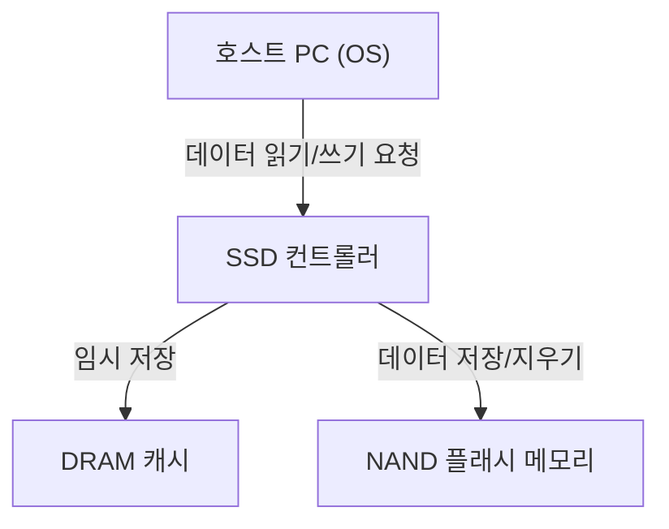
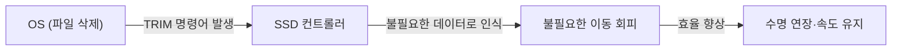

## 1. 서론

현대 컴퓨터에서 스토리지의 주역은 HDD(하드 디스크 드라이브)에서 SSD(솔리드 스테이트 드라이브)로 완전히 넘어갔습니다. SSD는 HDD처럼 물리적으로 회전하는 디스크나 탐색을 위한 자기 헤드가 없으며, 모든 데이터를 전자 회로로 읽고 쓰기 때문에 압도적인 고속성과 내충격성을 자랑합니다.

하지만 SSD에는 '쓰기 수명'이라는 특유의 제한이 존재합니다. 데이터를 썼다 지웠다를 반복할수록 내부 부품이 조금씩 열화되기 때문입니다. 본 기사에서는 SSD의 핵심인 'NAND 플래시 메모리'의 원리를 파헤쳐 보면서, 왜 수명이 줄어드는지, 그리고 그 수명을 연장하기 위해 어떤 기술이 사용되고 있는지 엔지니어링 관점에서 자세히 설명합니다.

## 2. SSD의 기본 구조와 NAND 플래시 메모리

SSD를 분해해보면, 주로 다음 3가지 핵심 컴포넌트로 구성되어 있음을 알 수 있습니다.

1. **NAND 플래시 메모리**: 데이터를 실제로 저장하는 칩. 전원을 꺼도 데이터가 지워지지 않는 비휘발성 메모리입니다.
2. **컨트롤러**: SSD의 '두뇌'. 데이터 읽기/쓰기 제어, 에러 정정, 후술할 웨어 레벨링 등 고도의 처리를 수행합니다.
3. **DRAM 캐시**: 데이터 읽기/쓰기를 고속화하기 위한 임시 저장 영역(일부 저가형 모델에는 미탑재).

이 중에서 데이터의 장기 보존을 담당하는 것이 NAND 플래시 메모리입니다.

## 3. NAND 플래시 메모리의 데이터 기록 원리

NAND 플래시 메모리의 내부는 데이터를 기록하는 최소 단위인 '셀(Cell)'이 무수히 모여 구성되어 있습니다.

### 3.1. 셀의 구조와 전자의 포획

셀은 실리콘 기판 위에 만들어진 일종의 트랜지스터입니다. 일반 트랜지스터와 다른 점은 전자를 가두기 위한 '플로팅 게이트(부유 게이트)' 또는 '차지 트랩'이라 불리는 절연된 영역을 가지고 있다는 점입니다.

데이터를 쓸 때는 제어 게이트에 높은 전압(프로그램 전압)을 가합니다. 그러면 '터널 효과'라고 불리는 양자역학적 현상에 의해 전자가 절연막(터널 산화막)을 통과하여 플로팅 게이트에 주입됩니다. 이 전자가 '있는' 상태와 '없는' 상태를 읽어냄으로써 0과 1의 디지털 데이터를 표현합니다.

데이터를 지울 때는 반대로 기판 쪽에 높은 전압을 가하여 플로팅 게이트에서 전자를 빼냅니다.

### 3.2. SLC, MLC, TLC, QLC의 차이

초기 SSD에서는 1개의 셀에 1비트(0 또는 1)의 데이터를 저장하는 <strong>SLC(Single-Level Cell)</strong>가 주류였습니다. 하지만 대용량화와 저가격화 요구에 따라 1개의 셀에 여러 비트를 기록하는 기술이 발전했습니다.

*   **SLC (Single-Level Cell)**: 1셀당 1비트. 빠르고 수명이 매우 길지만, 용량 대비 단가가 높음.
*   **MLC (Multi-Level Cell)**: 1셀당 2비트(4단계의 전압 레벨).
*   **TLC (Triple-Level Cell)**: 1셀당 3비트(8단계의 전압 레벨). 현재 주류.
*   **QLC (Quad-Level Cell)**: 1셀당 4비트(16단계의 전압 레벨). 대용량이고 저렴하지만 수명이나 속도는 떨어짐.

1개의 셀에 다단계 전압을 정확하게 기록하고 읽어내야 하므로, TLC나 QLC로 갈수록 제어가 복잡해져 쓰기 속도 저하와 에러율 상승, 그리고 수명 단축을 초래합니다.

## 4. 왜 SSD에는 '수명'이 있는가?

HDD에는 원리적으로 다시 쓰기 횟수의 제한이 없지만(물리적 고장 제외), NAND 플래시 메모리에는 명확한 제한이 있습니다. 이는 데이터 쓰기와 지우기의 메커니즘 자체에 기인합니다.

### 4.1. 터널 산화막의 열화 (P/E 사이클의 한계)

앞서 언급했듯이, 데이터를 쓰거나 지울 때 전자는 높은 전압에 의해 '터널 산화막'이라는 얇은 절연체를 강제로 통과합니다. 이 조작(Program/Erase 사이클, 또는 P/E 사이클)을 반복하면 고전압으로 인한 스트레스로 터널 산화막이 물리적으로 열화됩니다.

산화막이 열화되면 전자가 플로팅 게이트에 머물지 못하고 새어 나가거나, 반대로 빠져나가지 못하게 됩니다. 그 결과, 의도한 전압 레벨을 정확하게 유지하거나 읽을 수 없게 되어 데이터가 손상됩니다. 이것이 바로 SSD의 '수명'입니다.

SLC의 P/E 사이클은 약 10만 회라고 알려져 있었지만, MLC에서는 약 3,000~10,000회, TLC에서는 약 1,000~3,000회, QLC에서는 수백~1,000회 정도로 감소했습니다.

### 4.2. '페이지'와 '블록'의 제약

NAND 플래시 메모리의 수명 문제를 더욱 복잡하게 만드는 것은 그 특이한 읽기/쓰기 단위입니다.

*   **페이지 (Page)**: 데이터의 '읽기'와 '쓰기'의 최소 단위(보통 4KB ~ 16KB).
*   **블록 (Block)**: 여러 페이지가 모인 단위(보통 256페이지 ~ 수천 페이지). 데이터의 '지우기'의 최소 단위.

NAND 플래시의 가장 큰 약점은 **'이미 데이터가 쓰여 있는 페이지에 데이터를 직접 덮어쓸 수 없다'**는 점입니다. 데이터를 다시 쓰기 위해서는 먼저 해당 페이지가 포함된 블록 전체를 '지우기'하여 빈 상태로 되돌려야 합니다.

하지만 블록 내에는 변경하고 싶지 않은 다른 유효한 데이터도 포함되어 있는 경우가 많기 때문에, 단순하게 지워버릴 수는 없습니다.

## 5. SSD의 수명을 연장하기 위한 고도 기술

그대로 두면 금방 수명을 다해버리는 NAND 플래시를 실용적인 스토리지로서 장기간 사용할 수 있게 하기 위해, SSD 컨트롤러는 백그라운드에서 매우 복잡한 관리를 수행하고 있습니다.

### 5.1. 웨어 레벨링 (Wear Leveling)

특정 블록만 빈번하게 다시 쓰여서 조기에 수명을 다하는 것을 막기 위해, SSD 컨트롤러는 쓰기 작업을 모든 블록에 균등하게 분산시킵니다. 이를 '웨어 레벨링(마모 평준화)'이라고 부릅니다.

예를 들어, OS가 같은 파일(같은 논리 주소)을 계속해서 업데이트하는 것처럼 보여도, SSD 내부에서는 매번 다른 물리 블록에 데이터를 쓰고 이전 데이터를 '무효'로 표시하는 처리를 수행합니다. 이를 통해 드라이브 전체의 셀이 균등하게 열화되도록 제어됩니다.

### 5.2. 가비지 컬렉션 (Garbage Collection)

데이터 쓰기를 반복하면 SSD 내부에는 '유효한 데이터'와 '무효가 된 이전 데이터(쓰레기)'가 혼재된 블록이 늘어나게 됩니다. 이 상태가 지속되면 새로운 데이터를 쓰기 위한 빈 블록이 고갈되어 버립니다.

그래서 여유 용량이 부족해지거나 유휴 상태일 때, SSD 컨트롤러는 여러 블록에서 '유효한 데이터'만을 모아 다른 새로운 블록으로 이주시키고, 원래의 블록을 통째로 지워서 재사용 가능하게 만듭니다. 이것이 가비지 컬렉션입니다.

### 5.3. TRIM 명령어

가비지 컬렉션을 효율적으로 수행하기 위한 중요한 메커니즘이 TRIM 명령어입니다.

OS 상에서 사용자가 파일을 '삭제'해도, OS는 파일 시스템의 목차에서 해당 항목을 지울 뿐, SSD에는 '이 데이터는 더 이상 필요하지 않다'는 정보가 전달되지 않습니다. SSD는 어떤 데이터가 유효하고 어떤 것이 불필요한지 모르기 때문에, 불필요한 데이터까지 곧이곧대로 가비지 컬렉션으로 이주시켜 버려 무의미한 쓰기(Write Amplification)를 발생시키고 수명을 단축시킵니다.

TRIM 명령어는 OS가 파일을 삭제하는 시점에 '이 영역의 데이터는 더 이상 필요 없다'는 정보를 SSD 컨트롤러에 직접 알리는 메커니즘입니다. 이를 통해 SSD는 불필요한 데이터를 이주시키는 헛된 작업을 줄이고, 성능 유지와 수명 연장을 실현합니다.

## 6. 결론

SSD는 NAND 플래시 메모리의 물리적 특성상 다시 쓰기 횟수에 상한이 있다는 숙명을 안고 있습니다. 셀에 전자를 넣고 뺄 때마다 절연막이 열화되어, 언젠가는 데이터를 유지할 수 없게 됩니다.

하지만 현대의 SSD는 고성능 컨트롤러에 의한 웨어 레벨링, 가비지 컬렉션, 그리고 OS의 TRIM 명령어와 같은 기술의 결정체로 그 약점을 교묘하게 숨기고 있습니다. 일반적인 PC 용도라면, SSD가 다시 쓰기 수명에 도달하기 전에 PC 본체의 교체 시기가 오거나 다른 부품이 고장 날 가능성이 훨씬 높은 것이 현실입니다.

데이터 백업은 어떤 스토리지에서든 필수적이지만, '수명이 짧다'고 지나치게 두려워하지 않고 SSD의 고속성을 마음껏 활용하는 것이 현대 엔지니어링의 최적의 해답이라고 할 수 있을 것입니다.
