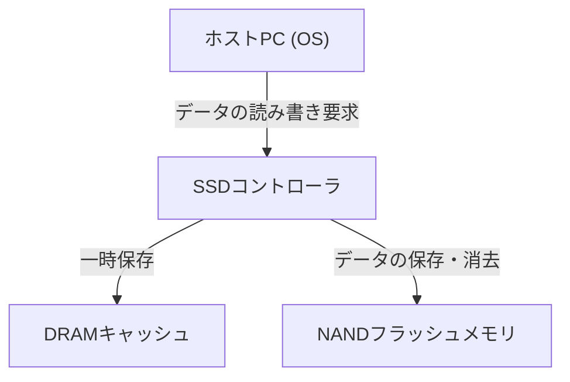
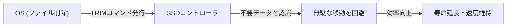

## 1. はじめに

現代のコンピュータにおいて、ストレージの主役はHDD（ハードディスクドライブ）からSSD（ソリッドステートドライブ）へと完全に移行しました。SSDはHDDのように物理的に回転するディスクやシークする磁気ヘッドを持たず、すべて電子的な回路でデータを読み書きするため、圧倒的な高速性と耐衝撃性を誇ります。

しかし、SSDには「書き換え寿命」という特有の制限が存在します。データを書き換えれば書き換えるほど、内部の部品が少しずつ劣化していくのです。本記事では、SSDの中核をなす「NANDフラッシュメモリ」の仕組みを紐解きながら、なぜ寿命が減るのか、そしてその寿命を延ばすためにどのような技術が使われているのかをエンジニアリングの視点から詳しく解説します。

## 2. SSDの基本構造とNANDフラッシュメモリ

SSDを分解すると、主に以下の3つの主要コンポーネントで構成されていることがわかります。

1. **NANDフラッシュメモリ**: データを実際に保存するチップ。電源を切ってもデータが消えない不揮発性メモリです。
2. **コントローラ**: SSDの「頭脳」。データの読み書きの制御、エラー訂正、後述するウェアレベリングなどの高度な処理を行います。
3. **DRAMキャッシュ**: データの読み書きを高速化するための一時保存領域（一部の安価なモデルには非搭載）。

この中でデータの長期保存を担うのがNANDフラッシュメモリです。

## 3. NANDフラッシュメモリのデータ記録の仕組み

NANDフラッシュメモリの内部は、データを記録する最小単位である「セル（Cell）」が無数に集まって構成されています。

### 3.1. セルの構造と電子の捕獲

セルは、シリコン基板上に作られた一種のトランジスタです。通常のトランジスタと異なるのは、電子を閉じ込めるための「フローティングゲート（浮遊ゲート）」または「チャージトラップ」と呼ばれる絶縁された領域を持っている点です。

データを書き込む際は、制御ゲートに高い電圧（プログラム電圧）をかけます。すると「トンネル効果」と呼ばれる量子力学的な現象により、電子が絶縁膜（トンネル酸化膜）を通り抜けてフローティングゲートに注入されます。この電子が「ある」状態と「ない」状態を読み取ることで、0と1のデジタルデータを表現します。

データを消去する際は、逆に基板側に高い電圧をかけ、フローティングゲートから電子を引き抜きます。

### 3.2. SLC, MLC, TLC, QLCの違い

初期のSSDでは、1つのセルに1ビット（0か1）のデータを保存する<strong>SLC（Single-Level Cell）</strong>が主流でした。しかし、大容量化と低価格化の要求から、1つのセルに複数のビットを記録する技術が進化しました。

*   **SLC (Single-Level Cell)**: 1セルあたり1ビット。高速で寿命が非常に長いが、容量あたりの単価が高い。
*   **MLC (Multi-Level Cell)**: 1セルあたり2ビット（4段階の電圧レベル）。
*   **TLC (Triple-Level Cell)**: 1セルあたり3ビット（8段階の電圧レベル）。現在の主流。
*   **QLC (Quad-Level Cell)**: 1セルあたり4ビット（16段階の電圧レベル）。大容量で安価だが、寿命や速度は劣る。

1つのセルに多段階の電圧を正確に記録・読み取りする必要があるため、TLCやQLCになるほど制御が複雑になり、書き込み速度の低下やエラー率の上昇、そして寿命の低下を招きます。

## 4. なぜSSDには「寿命」があるのか？

HDDには原理的な書き換え回数の制限はありませんが（物理的な故障を除く）、NANDフラッシュメモリには明確な制限があります。これは、データの書き込みと消去のメカニズムそのものに起因します。

### 4.1. トンネル酸化膜の劣化 (P/Eサイクルの限界)

前述の通り、データを書き込んだり消去したりする際、電子は高い電圧によって「トンネル酸化膜」という薄い絶縁体を無理やり通り抜けます。この操作（Program/Erase サイクル、または P/Eサイクル）を繰り返すと、高電圧によるストレスでトンネル酸化膜が物理的に劣化していきます。

酸化膜が劣化すると、電子がフローティングゲートに留まれずに漏れ出したり、逆に抜けなくなったりします。その結果、意図した電圧レベルを正確に保持・読み取ることができなくなり、データが破損します。これがSSDの「寿命」です。

SLCのP/Eサイクルは約10万回と言われていましたが、MLCでは約3000〜1万回、TLCでは約1000〜3000回、QLCでは数百〜1000回程度にまで減少しています。

### 4.2. 「ページ」と「ブロック」の制約

NANDフラッシュメモリの寿命問題をさらに複雑にしているのが、その特異な読み書きの単位です。

*   **ページ (Page)**: データの「読み込み」と「書き込み」の最小単位（通常 4KB 〜 16KB）。
*   **ブロック (Block)**: 複数のページが集まった単位（通常 256ページ 〜 数千ページ）。データの「消去」の最小単位。

NANDフラッシュの最大の弱点は、<strong>「すでにデータが書かれているページに、直接データを上書きできない」</strong>という点です。データを書き換えるためには、まずそのページが含まれるブロック全体を「消去」し、空の状態に戻す必要があります。

しかし、ブロック内には変更したくない他の有効なデータも含まれていることが多いため、単純に消去することはできません。

## 5. SSDの寿命を延ばすための高度な技術

そのままではすぐに寿命を迎えてしまうNANDフラッシュを、実用的なストレージとして長期間使えるようにするため、SSDのコントローラは裏で非常に複雑な管理を行っています。

### 5.1. ウェアレベリング (Wear Leveling)

特定のブロックばかりが頻繁に書き換えられて早期に寿命を迎えるのを防ぐため、SSDコントローラは書き込みをすべてのブロックに均等に分散させます。これを「ウェアレベリング（摩耗平準化）」と呼びます。

例えば、OSが同じファイル（同じ論理アドレス）を何度も更新しているように見えても、SSD内部では毎回異なる物理ブロックにデータを書き込み、古いデータを「無効」としてマークする処理を行っています。これにより、ドライブ全体のセルが均等に劣化していくように制御されます。

### 5.2. ガベージコレクション (Garbage Collection)

データの書き換えを繰り返すと、SSD内には「有効なデータ」と「無効になった古いデータ（ゴミ）」が混在したブロックが増えていきます。この状態が続くと、新しいデータを書き込むための空きブロックが枯渇してしまいます。

そこで、空き容量が少なくなった時やアイドル時に、SSDコントローラは複数のブロックから「有効なデータ」だけを集めて別の新しいブロックに引っ越しさせ、元のブロックを丸ごと消去して再利用可能にします。これがガベージコレクションです。

### 5.3. TRIMコマンド

ガベージコレクションを効率的に行うための重要な仕組みがTRIMコマンドです。

OS上でユーザーがファイルを「削除」しても、OSはファイルシステム上の目次からそのエントリを消すだけで、SSDには「このデータはもう不要になった」という情報は伝わりません。SSDはどのデータが有効でどれが不要か分からないため、不要なデータまで律儀にガベージコレクションで引っ越しさせてしまい、無駄な書き込み（Write Amplification）を発生させて寿命を縮めます。

TRIMコマンドは、OSがファイルを削除したタイミングで「この領域のデータはもう不要である」という情報をSSDコントローラに直接通知する仕組みです。これにより、SSDは不要なデータを引っ越しさせる無駄な作業を省き、パフォーマンスの維持と寿命の延長を実現します。

## 6. まとめ

SSDは、NANDフラッシュメモリの物理的な特性上、書き換え回数に上限があるという宿命を背負っています。セルに電子を出し入れするたびに絶縁膜が劣化し、いつかはデータを保持できなくなります。

しかし、現代のSSDは高度なコントローラによるウェアレベリング、ガベージコレクション、そしてOSからのTRIMコマンドといった技術の結晶により、その弱点を巧みに隠蔽しています。一般的なPC用途であれば、SSDが書き換え寿命に到達するよりも前に、PC本体の買い替え時期が来たり、他の部品が故障したりする可能性の方がはるかに高いのが現実です。

データのバックアップはどんなストレージでも必須ですが、「寿命が短い」と過度に恐れることなく、SSDの高速性を存分に活用していくのが現代のエンジニアリングの最適解と言えるでしょう。
