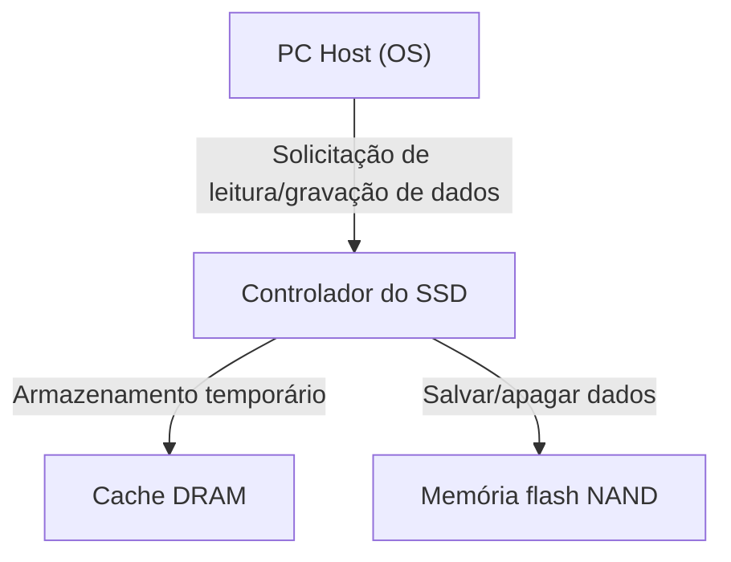

## 1. Introdução

Nos computadores modernos, o protagonista do armazenamento transitou completamente dos HDDs (Hard Disk Drives) para os SSDs (Solid State Drives). Ao contrário dos HDDs, os SSDs não possuem discos que giram fisicamente ou cabeçotes magnéticos de busca. Como eles leem e escrevem dados inteiramente por meio de circuitos eletrônicos, possuem velocidade e resistência a choques esmagadoramente superiores.

No entanto, os SSDs possuem uma limitação específica conhecida como "vida útil de reescrita". Quanto mais os dados são reescritos, mais os componentes internos se degradam gradualmente. Neste artigo, desvendaremos o mecanismo da "memória flash NAND", que forma o núcleo do SSD, e explicaremos detalhadamente sob uma perspectiva de engenharia por que a vida útil diminui e quais tecnologias são utilizadas para estendê-la.

## 2. Estrutura Básica do SSD e Memória Flash NAND

Ao desmontarmos um SSD, podemos observar que ele é composto principalmente por três componentes principais:

1. **Memória flash NAND**: O chip que realmente armazena os dados. É uma memória não volátil, ou seja, os dados não são apagados mesmo quando a energia é desligada.
2. **Controlador**: O "cérebro" do SSD. Executa processos avançados, como o controle de leitura e gravação de dados, correção de erros e o "wear leveling" (nivelamento de desgaste) que será abordado mais adiante.
3. **Cache DRAM**: Uma área de armazenamento temporário para acelerar a leitura e a gravação de dados (não incluído em alguns modelos mais baratos).

Dentre esses, a memória flash NAND é a responsável pelo armazenamento de dados a longo prazo.

## 3. O Mecanismo de Gravação de Dados na Memória Flash NAND

O interior da memória flash NAND é constituído por um número inumerável de "células" (Cells), que são a menor unidade de gravação de dados.

### 3.1. Estrutura da Célula e Captura de Elétrons

Uma célula é um tipo de transistor fabricado sobre um substrato de silício. O que a diferencia de um transistor comum é que ela possui uma região isolada chamada "porta flutuante" (floating gate) ou "armadilha de carga" (charge trap) para confinar elétrons.

Ao gravar dados, uma alta tensão (tensão de programa) é aplicada à porta de controle. Então, devido a um fenômeno da mecânica quântica chamado "efeito túnel", os elétrons atravessam a película isolante (óxido de túnel) e são injetados na porta flutuante. Ao ler o estado "com" e "sem" esses elétrons, os dados digitais de 0 e 1 são representados.

Ao apagar dados, inversamente, uma alta tensão é aplicada no lado do substrato, e os elétrons são puxados para fora da porta flutuante.

### 3.2. Diferenças entre SLC, MLC, TLC e QLC

Nos primeiros SSDs, o **SLC (Single-Level Cell)**, que armazena 1 bit de dados (0 ou 1) em uma única célula, era predominante. No entanto, devido à demanda por maior capacidade e menor preço, a tecnologia evoluiu para registrar múltiplos bits em uma única célula.

*   **SLC (Single-Level Cell)**: 1 bit por célula. É rápido e tem uma vida útil extremamente longa, mas o custo por capacidade é alto.
*   **MLC (Multi-Level Cell)**: 2 bits por célula (4 níveis de tensão).
*   **TLC (Triple-Level Cell)**: 3 bits por célula (8 níveis de tensão). O padrão atual.
*   **QLC (Quad-Level Cell)**: 4 bits por célula (16 níveis de tensão). Tem grande capacidade e é barato, mas a vida útil e a velocidade são inferiores.

Como é necessário gravar e ler de forma precisa múltiplos níveis de tensão em uma única célula, quanto mais se avança para TLC e QLC, mais complexo se torna o controle, resultando em velocidades de gravação mais baixas, taxas de erro mais altas e menor vida útil.

## 4. Por Que os SSDs Têm uma "Vida Útil"?

Embora os HDDs não possuam em princípio um limite no número de reescritas (excluindo falhas físicas), a memória flash NAND tem uma limitação clara. Isso se deve à própria mecânica de gravação e apagamento de dados.

### 4.1. Degradação do Óxido de Túnel (O Limite dos Ciclos P/E)

Como mencionado anteriormente, ao gravar e apagar dados, os elétrons são forçados a atravessar um fino isolante chamado "óxido de túnel" por meio de alta tensão. Quando essa operação (ciclo de Program/Erase, ou ciclo P/E) é repetida, o óxido de túnel se degrada fisicamente devido ao estresse causado pela alta tensão.

Quando a película de óxido se degrada, os elétrons não conseguem mais permanecer na porta flutuante e acabam vazando, ou, inversamente, não conseguem mais sair. Como resultado, não é mais possível reter e ler com precisão o nível de tensão pretendido, e os dados são corrompidos. Essa é a "vida útil" do SSD.

Dizia-se que os ciclos P/E do SLC eram de cerca de 100 mil vezes, mas no MLC diminuíram para cerca de 3.000 a 10.000 vezes, no TLC para cerca de 1.000 a 3.000 vezes, e no QLC para apenas centenas a 1.000 vezes.

### 4.2. Restrições de "Página" e "Bloco"

O que complica ainda mais o problema da vida útil da memória flash NAND é a sua peculiar unidade de leitura e gravação.

*   **Página (Page)**: A menor unidade de "leitura" e "gravação" de dados (geralmente 4KB a 16KB).
*   **Bloco (Block)**: Uma unidade composta por várias páginas agrupadas (geralmente 256 páginas a milhares de páginas). É a menor unidade de "apagamento" de dados.

A maior fraqueza da flash NAND é que **"os dados não podem ser sobrescritos diretamente em uma página que já possui dados gravados"**. Para reescrever os dados, todo o bloco que contém essa página deve primeiro ser "apagado" e retornado a um estado vazio.

No entanto, como um bloco frequentemente contém outros dados válidos que não desejamos alterar, não podemos simplesmente apagá-lo.

## 5. Tecnologias Avançadas para Estender a Vida Útil do SSD

Para permitir que a memória flash NAND, que de outra forma chegaria rapidamente ao fim de sua vida útil, possa ser usada por um longo período como armazenamento prático, o controlador do SSD realiza gerenciamentos extremamente complexos nos bastidores.

### 5.1. Nivelamento de Desgaste (Wear Leveling)

Para evitar que blocos específicos sejam reescritos com muita frequência e atinjam prematuramente o fim da vida útil, o controlador do SSD distribui as gravações uniformemente por todos os blocos. Isso é chamado de "nivelamento de desgaste" (Wear Leveling).

Por exemplo, mesmo que o SO pareça estar atualizando repetidamente o mesmo arquivo (o mesmo endereço lógico), internamente o SSD grava os dados em um bloco físico diferente a cada vez, executando um processo para marcar os dados antigos como "inválidos". Assim, o controle é feito para que as células de toda a unidade se degradem de maneira uniforme.

### 5.2. Coleta de Lixo (Garbage Collection)

À medida que a reescrita de dados se repete, aumenta dentro do SSD o número de blocos onde "dados válidos" e "dados antigos inválidos (lixo)" estão misturados. Se essa condição persistir, os blocos vazios para gravar novos dados se esgotarão.

Portanto, quando o espaço livre se torna escasso ou durante os períodos de inatividade (idle), o controlador do SSD coleta apenas os "dados válidos" de vários blocos, move-os para um novo bloco e apaga inteiramente os blocos originais, tornando-os reutilizáveis. Isso é a coleta de lixo.

### 5.3. Comando TRIM

Um mecanismo importante para realizar a coleta de lixo de maneira eficiente é o comando TRIM.

Mesmo quando o usuário "exclui" um arquivo no SO, o SO apenas remove a entrada do índice do sistema de arquivos, e a informação de que "estes dados não são mais necessários" não é transmitida ao SSD. Como o SSD não sabe quais dados são válidos e quais não são, ele moverá obedientemente até mesmo os dados desnecessários durante a coleta de lixo, causando gravações inúteis (Write Amplification) e encurtando a vida útil.

O comando TRIM é um mecanismo em que o SO notifica diretamente o controlador do SSD de que "os dados nesta área não são mais necessários" no momento em que um arquivo é excluído. Isso evita que o SSD faça o trabalho inútil de mover dados desnecessários, mantendo o desempenho e estendendo a vida útil.

## 6. Conclusão

Devido às características físicas da memória flash NAND, os SSDs carregam o fardo de terem um limite no número de reescritas. Cada vez que os elétrons são colocados e retirados de uma célula, a película isolante se degrada, e chegará o dia em que não poderá mais reter dados.

No entanto, os SSDs modernos ocultam habilmente essa fraqueza através da cristalização de tecnologias avançadas implementadas por controladores sofisticados, como nivelamento de desgaste, coleta de lixo e os comandos TRIM do SO. Na realidade, para o uso normal do PC, é muito mais provável que seja a hora de comprar um PC novo ou que outras peças falhem antes que o SSD atinja sua vida útil de reescrita.

O backup de dados é indispensável em qualquer armazenamento, mas fazer o uso pleno da alta velocidade do SSD sem ter um medo excessivo da "vida útil curta" pode ser considerado a solução ideal na engenharia moderna.
