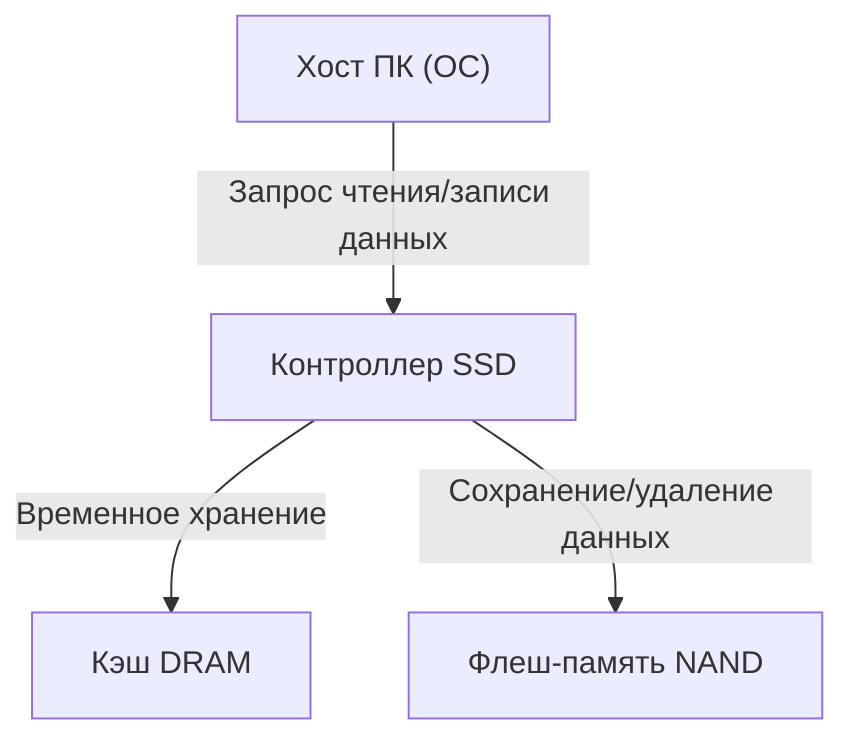
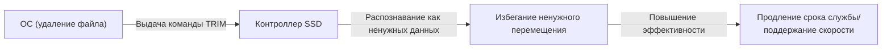

## 1. Введение

В современных компьютерах произошел полный переход основного хранилища от HDD (жестких дисков) к SSD (твердотельным накопителям). В отличие от HDD, SSD не имеют физически вращающихся дисков или движущихся магнитных головок. Все данные считываются и записываются с помощью электронных схем, что обеспечивает им подавляющее преимущество в скорости и ударопрочности.

Однако у SSD есть специфическое ограничение, известное как "срок службы перезаписи". Чем больше вы перезаписываете данные, тем больше постепенно изнашиваются внутренние компоненты. В этой статье мы подробно рассмотрим принцип работы "флеш-памяти NAND", которая составляет основу SSD, объясним с инженерной точки зрения, почему сокращается срок службы, и какие технологии используются для его продления.

## 2. Базовая структура SSD и флеш-память NAND

Разобрав SSD, вы обнаружите, что в основном он состоит из трех главных компонентов:

1. **Флеш-память NAND**: Чипы, которые фактически хранят данные. Это энергонезависимая память, которая не теряет данные даже при отключении питания.
2. **Контроллер**: "Мозг" SSD. Он управляет чтением и записью данных, коррекцией ошибок и выполняет сложные процессы, такие как Wear Leveling (выравнивание износа), о котором будет рассказано позже.
3. **Кэш DRAM**: Область временного хранения для ускорения чтения и записи данных (отсутствует в некоторых дешевых моделях).

Среди них именно флеш-память NAND отвечает за долгосрочное хранение данных.

## 3. Как флеш-память NAND записывает данные

Внутри флеш-память NAND состоит из бесчисленного множества "ячеек" (Cells), которые являются минимальными единицами для записи данных.

### 3.1. Структура ячейки и захват электронов

Ячейка — это разновидность транзистора, созданного на кремниевой подложке. Ее отличие от обычного транзистора заключается в наличии изолированной области, называемой "плавающим затвором" (Floating Gate) или "ловушкой заряда" (Charge Trap), для удержания электронов.

При записи данных на управляющий затвор подается высокое напряжение (напряжение программирования). В результате квантово-механического явления, называемого "туннельным эффектом", электроны проходят через изолирующую пленку (туннельный оксидный слой) и инжектируются в плавающий затвор. Считывая состояние "есть" или "нет" этих электронов, выражаются цифровые данные 0 и 1.

При стирании данных, наоборот, высокое напряжение подается на сторону подложки, вытягивая электроны из плавающего затвора.

### 3.2. Различия между SLC, MLC, TLC, QLC

В ранних SSD преобладал тип **SLC (Single-Level Cell)**, который хранит 1 бит (0 или 1) данных в одной ячейке. Однако из-за требований к увеличению емкости и снижению стоимости развились технологии записи нескольких битов в одну ячейку.

*   **SLC (Single-Level Cell)**: 1 бит на ячейку. Быстрый и с очень долгим сроком службы, но стоимость за единицу емкости высока.
*   **MLC (Multi-Level Cell)**: 2 бита на ячейку (4 уровня напряжения).
*   **TLC (Triple-Level Cell)**: 3 бита на ячейку (8 уровней напряжения). В настоящее время является основным.
*   **QLC (Quad-Level Cell)**: 4 бита на ячейку (16 уровней напряжения). Большая емкость и дешевизна, но уступает по скорости и сроку службы.

Поскольку возникает необходимость точно записывать и считывать несколько уровней напряжения в одной ячейке, по мере перехода к TLC и QLC управление становится сложнее, что приводит к снижению скорости записи, увеличению частоты ошибок и сокращению срока службы.

## 4. Почему у SSD есть "срок службы"?

Хотя жесткие диски не имеют фундаментальных ограничений на количество перезаписей (за исключением физических поломок), у флеш-памяти NAND есть четкое ограничение. Это связано с самим механизмом записи и стирания данных.

### 4.1. Деградация туннельного оксидного слоя (Предел циклов P/E)

Как упоминалось ранее, при записи или стирании данных электроны принудительно проходят через тонкий изолятор, называемый "туннельным оксидным слоем", под воздействием высокого напряжения. Если повторять эту операцию (цикл Program/Erase, или цикл P/E), туннельный оксидный слой физически деградирует из-за стресса от высокого напряжения.

По мере деградации оксидного слоя электроны больше не могут удерживаться в плавающем затворе и утекают, или наоборот, не могут быть извлечены. В результате становится невозможным точно удерживать и считывать заданный уровень напряжения, и данные повреждаются. Это и есть "срок службы" SSD.

Считается, что цикл P/E для SLC составляет около 100 000 раз, но для MLC он снизился примерно до 3000-10000 раз, для TLC — до 1000-3000 раз, а для QLC — до сотен-1000 раз.

### 4.2. Ограничения "страниц" и "блоков"

Что еще больше усложняет проблему срока службы флеш-памяти NAND, так это ее своеобразные единицы чтения и записи.

*   **Страница (Page)**: Минимальная единица "чтения" и "записи" данных (обычно от 4 КБ до 16 КБ).
*   **Блок (Block)**: Единица, состоящая из нескольких страниц (обычно от 256 страниц до нескольких тысяч). Минимальная единица "стирания" данных.

Самая большая слабость NAND-флеш заключается в том, что **"нельзя напрямую перезаписывать данные на страницу, где уже записаны данные"**. Для того чтобы перезаписать данные, необходимо сначала "стереть" весь блок, содержащий эту страницу, и вернуть его в пустое состояние.

Однако блок часто содержит другие действительные данные, которые не нужно изменять, поэтому его нельзя просто стереть.

## 5. Передовые технологии для продления срока службы SSD

Чтобы флеш-память NAND, которая иначе быстро бы исчерпала свой срок службы, могла использоваться в течение длительного времени в качестве практичного накопителя, контроллер SSD скрыто выполняет очень сложное управление.

### 5.1. Wear Leveling (Выравнивание износа)

Чтобы предотвратить частую перезапись одних и тех же блоков и их преждевременный выход из строя, контроллер SSD равномерно распределяет запись по всем блокам. Это называется "Wear Leveling" (выравниванием износа).

Например, даже если кажется, что ОС многократно обновляет один и тот же файл (тот же логический адрес), внутри SSD данные каждый раз записываются в другой физический блок, а старые данные помечаются как "недействительные". Благодаря этому деградация ячеек равномерно распределяется по всему накопителю.

### 5.2. Garbage Collection (Сборка мусора)

При многократной перезаписи данных в SSD увеличивается количество блоков, содержащих смесь "действительных данных" и "недействительных старых данных (мусора)". Если это состояние сохранится, свободные блоки для записи новых данных будут исчерпаны.

Поэтому, когда свободного места становится мало или во время простоя, контроллер SSD собирает только "действительные данные" из нескольких блоков, перемещает их в другой новый блок, а исходные блоки целиком стирает, делая их пригодными для повторного использования. Это и есть сборка мусора (Garbage Collection).

### 5.3. Команда TRIM

Команда TRIM является важным механизмом для эффективного выполнения сборки мусора.

Даже когда пользователь "удаляет" файл в ОС, ОС просто удаляет его запись из каталога файловой системы, и информация о том, что "эти данные больше не нужны", не передается в SSD. Поскольку SSD не знает, какие данные действительны, а какие нет, он добросовестно перемещает даже ненужные данные во время сборки мусора, вызывая ненужную запись (Write Amplification) и сокращая срок службы.

Команда TRIM — это механизм, с помощью которого ОС напрямую уведомляет контроллер SSD о том, что "данные в этой области больше не нужны", в момент удаления файла. Это позволяет SSD пропускать бесполезную работу по перемещению ненужных данных, тем самым поддерживая производительность и продлевая срок службы.

## 6. Заключение

Из-за физических характеристик флеш-памяти NAND SSD обречены на наличие верхнего предела количества перезаписей. Каждый раз, когда электроны вводятся или выводятся из ячейки, изолирующая пленка деградирует, и рано или поздно она теряет способность удерживать данные.

Однако современные SSD умело скрывают эту слабость благодаря таким технологиям, как Wear Leveling с помощью продвинутых контроллеров, сборка мусора и команды TRIM от ОС. В реальности при обычном использовании ПК вероятность того, что придет время менять сам ПК или выйдут из строя другие компоненты, гораздо выше, чем то, что SSD достигнет предела срока службы перезаписи.

Хотя резервное копирование данных необходимо для любого типа хранилища, оптимальным решением в современной инженерии является полное использование высокой скорости SSD без чрезмерного страха перед их "коротким сроком службы".
