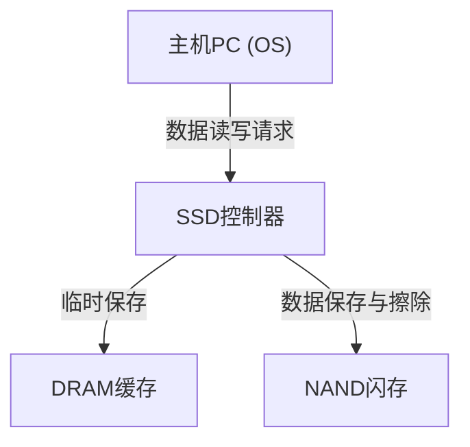

## 1. 引言

在现代计算机中，存储的主角已经从HDD（机械硬盘）完全过渡到了SSD（固态硬盘）。与HDD不同，SSD没有物理旋转的磁盘或寻道的磁头，所有的数据读写都通过电子电路完成，因此拥有压倒性的高速度和抗震性。

然而，SSD存在一个特有的限制，那就是“重写寿命”。数据每重写一次，内部的元件就会发生轻微的退化。本文将剖析SSD的核心部件“NAND闪存”的工作原理，从工程学的角度详细解释其寿命缩短的原因，以及业界采用了哪些技术来延长其寿命。

## 2. SSD的基本结构与NAND闪存

如果将SSD拆解，你会发现它主要由以下三个核心组件构成：

1. **NAND闪存**: 实际存储数据的芯片。它是一种非易失性内存，即在断电后数据也不会丢失。
2. **控制器**: SSD的“大脑”。负责控制数据的读写、错误纠正以及执行后文提到的磨损均衡等高级处理。
3. **DRAM缓存**: 用于加速数据读写的临时存储区域（部分廉价型号可能不配备）。

其中，承担长期数据保存任务的就是NAND闪存。

## 3. NAND闪存的数据记录原理

NAND闪存的内部由无数个“单元（Cell）”构成，这些单元是记录数据的最小单位。

### 3.1. 单元的结构与电子捕获

单元是构建在硅基板上的一种晶体管。与普通晶体管不同的是，它具有一个被称为“浮栅（Floating Gate）”或“电荷陷阱（Charge Trap）”的绝缘区域，用于捕获和锁住电子。

在写入数据时，会向控制栅极施加高电压（编程电压）。随之发生一种被称为“隧道效应”的量子力学现象，电子穿过绝缘膜（隧道氧化膜）被注入到浮栅中。通过读取电子“存在”或“不存在”的状态，来表示0和1的数字数据。

在擦除数据时，操作则相反：向基板一侧施加高电压，将电子从浮栅中抽出。

### 3.2. SLC、MLC、TLC、QLC的区别

在早期的SSD中，主流技术是每个单元保存1位（0或1）数据的**SLC（Single-Level Cell，单层单元）**。然而，随着对大容量和低成本的需求不断增加，在单一单元内记录多位数据的技术应运而生并不断发展。

*   **SLC (Single-Level Cell)**: 每单元1位。速度快、寿命极长，但单位容量成本高。
*   **MLC (Multi-Level Cell)**: 每单元2位（4个电压级别）。
*   **TLC (Triple-Level Cell)**: 每单元3位（8个电压级别）。当前的主流。
*   **QLC (Quad-Level Cell)**: 每单元4位（16个电压级别）。容量大且价格低廉，但寿命和速度较差。

由于需要在一个单元内精确记录和读取多级电压，随着技术向TLC和QLC演进，控制变得越来越复杂，这导致了写入速度下降、错误率上升，并且寿命缩短。

## 4. 为什么SSD有“寿命”限制？

HDD在原理上没有重写次数的限制（排除物理故障），但NAND闪存有明确的次数限制。这归因于数据写入和擦除机制本身。

### 4.1. 隧道氧化膜的退化 (P/E循环的极限)

如前所述，在写入或擦除数据时，高电压会强行让电子穿过被称为“隧道氧化膜”的薄绝缘体。如果反复进行这种操作（编程/擦除循环，即P/E循环），高压带来的应力会导致隧道氧化膜发生物理性退化。

当氧化膜退化时，电子就无法稳定停留在浮栅内，可能会泄漏出去，或者相反，被困在里面无法抽出。结果导致无法准确保持和读取预期的电压级别，数据因此损坏。这就是SSD的“寿命”。

过去SLC的P/E循环次数据说约为10万次，但在MLC中降至约3000至1万次，TLC中降至约1000至3000次，而在QLC中，这一数字进一步减少到了几百至1000次左右。

### 4.2. “页”与“块”的限制

让NAND闪存寿命问题变得更加复杂的是它特殊的读写单位。

*   **页 (Page)**: 数据“读取”和“写入”的最小单位（通常为 4KB 到 16KB）。
*   **块 (Block)**: 由多个页组成的单位（通常为 256页 到 几千页）。数据“擦除”的最小单位。

NAND闪存最大的弱点在于：**“无法在已经写入数据的页上直接覆盖新数据”**。要重写数据，必须先“擦除”包含该页的整个块，使其恢复到空白状态。

但是，一个块内通常还包含着其他不需要修改的有效数据，因此不能简单地直接擦除整个块。

## 5. 延长SSD寿命的高级技术

如果任由其自然发展，NAND闪存很快就会达到寿命极限。为了让它能作为实用的存储设备长期使用，SSD控制器在后台执行着非常复杂的管理任务。

### 5.1. 磨损均衡 (Wear Leveling)

为了防止某些特定的块被频繁重写而过早达到寿命极限，SSD控制器会将写入操作均匀地分散到所有的块中。这被称为“磨损均衡”。

例如，即使操作系统看起来在反复更新同一个文件（相同的逻辑地址），在SSD内部，每次都会将数据写入不同的物理块中，并将旧数据标记为“无效”。通过这种方式，可以控制整个硬盘的单元均匀地发生老化。

### 5.2. 垃圾回收 (Garbage Collection)

随着数据的反复重写，SSD内部会产生越来越多混合了“有效数据”和“已失效的旧数据（垃圾）”的块。如果这种状态持续下去，用于写入新数据的空闲块将会耗尽。

因此，当剩余空间减少或驱动器处于空闲状态时，SSD控制器会将多个块中的“有效数据”集中起来，搬运到一个新的块中，然后将原来的那些块整体擦除，使其能够再次被使用。这就是垃圾回收。

### 5.3. TRIM命令

为了高效进行垃圾回收，TRIM命令是一项至关重要的机制。

在操作系统层面上，即使用户“删除”了文件，操作系统也只是从文件系统的目录中抹去了该条目，SSD并不会收到“这些数据已经不再需要了”的信息。因为SSD不知道哪些数据是有效的、哪些是无效的，所以它会严格地在垃圾回收时搬运那些其实已经不需要的数据，从而产生不必要的写入（写入放大，Write Amplification），缩短寿命。

TRIM命令是一种机制，当操作系统删除文件时，它会直接向SSD控制器发送通知：“这部分区域的数据已经不再需要了”。这样一来，SSD就能省去搬运无效数据的无用功，从而维持性能并延长寿命。

## 6. 总结

受限于NAND闪存的物理特性，SSD注定拥有重写次数的上限。每次电子进出单元时都会导致绝缘膜退化，总有一天将无法再保存数据。

然而，现代SSD通过高度智能的控制器，结合了磨损均衡、垃圾回收以及来自操作系统的TRIM命令等技术结晶，巧妙地隐藏了这一弱点。在一般的个人电脑用途下，现实情况往往是：在SSD达到重写寿命之前，电脑本身就已经到了该换代的时候，或者其他零部件已经先发生故障了。

无论使用哪种存储设备，数据备份都是必不可少的，但大可不必过度担忧“寿命短”的问题。尽情发挥SSD的高速优势，才是现代工程学的最佳解答。
