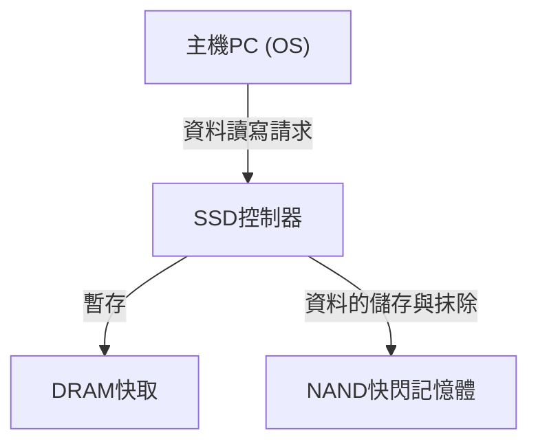
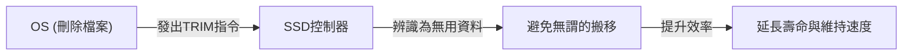

## 1. 前言

在現代電腦中，儲存裝置的主角已從HDD（傳統硬碟）完全過渡到SSD（固態硬碟）。SSD不像HDD那樣擁有物理旋轉的磁碟和尋軌的磁頭，而是完全依靠電子電路來讀寫資料，因此擁有壓倒性的高速性能與抗震能力。

然而，SSD存在著一種名為「寫入壽命」的特有限制。資料寫入的次數越多，內部的零件就會逐漸老化。本文將解開作為SSD核心的「NAND快閃記憶體」的運作原理，並從工程學的角度詳細解說為何壽命會減少，以及為了延長壽命而使用了哪些技術。

## 2. SSD的基本結構與NAND快閃記憶體

如果將SSD拆解，可以發現它主要由以下三個核心組件構成。

1. **NAND快閃記憶體**: 實際儲存資料的晶片。它是即使切斷電源資料也不會消失的非揮發性記憶體。
2. **控制器**: SSD的「大腦」。負責控制資料的讀寫、錯誤更正，以及執行後文會提到的耗損平均技術等高階處理。
3. **DRAM快取**: 為了加速資料讀寫而設置的暫存區域（部分廉價型號未搭載）。

其中，負責長期保存資料的便是NAND快閃記憶體。

## 3. NAND快閃記憶體的資料記錄原理

NAND快閃記憶體的內部是由無數個名為「單元 (Cell)」的最小資料記錄單位集合而成的。

### 3.1. 單元的結構與電子的捕捉

單元是建立在矽基板上的一種電晶體。它與一般電晶體不同之處在於，它擁有一個被絕緣的區域，稱為「浮閘 (Floating Gate)」或「電荷捕捉層 (Charge Trap)」，用來將電子困在其中。

寫入資料時，會在控制閘極施加高電壓（程式化電壓）。接著，透過一種稱為「穿隧效應」的量子力學現象，電子會穿過絕緣膜（穿隧氧化層）被注入到浮閘中。藉由讀取這些電子「存在」與「不存在」的狀態，來表示0與1的數位資料。

抹除資料時，則是反過來對基板側施加高電壓，將電子從浮閘中抽出。

### 3.2. SLC, MLC, TLC, QLC的差異

在早期的SSD中，每個單元儲存1位元（0或1）資料的**SLC（Single-Level Cell）**為主流。然而，由於大容量化與低價格化的需求，在單一單元內記錄多個位元的技術不斷演進。

*   **SLC (Single-Level Cell)**: 每個單元1位元。速度快且壽命非常長，但單位容量的成本很高。
*   **MLC (Multi-Level Cell)**: 每個單元2位元（4個電壓等級）。
*   **TLC (Triple-Level Cell)**: 每個單元3位元（8個電壓等級）。目前的主流。
*   **QLC (Quad-Level Cell)**: 每個單元4位元（16個電壓等級）。容量大且便宜，但壽命與速度較差。

由於必須在單一單元內精確地記錄與讀取多個電壓等級，因此越是發展到TLC或QLC，控制就越複雜，這會導致寫入速度下降、錯誤率上升，並且造成壽命縮短。

## 4. 為何SSD會有「壽命」？

HDD在原理上並沒有寫入次數的限制（除非發生物理性故障），但NAND快閃記憶體卻有明確的限制。這起因於資料寫入與抹除的機制本身。

### 4.1. 穿隧氧化層的劣化 (P/E循環的極限)

如前所述，在寫入或抹除資料時，電子會藉由高電壓強行穿過被稱為「穿隧氧化層」的薄絕緣體。如果反覆執行這個操作（程式化/抹除循環，即 P/E Cycle），高電壓所產生的壓力會導致穿隧氧化層發生物理性劣化。

當氧化層劣化後，電子就無法安穩地留在浮閘中而會漏出，或是相反地變得無法抽出。其結果就是無法精確地保持與讀取預期的電壓等級，導致資料損毀。這就是SSD的「壽命」。

據說SLC的P/E循環約為10萬次，而MLC降至約3000至1萬次，TLC約為1000至3000次，到了QLC則減少到數百至1000次左右。

### 4.2. 「頁面」與「區塊」的限制

讓NAND快閃記憶體的壽命問題變得更加複雜的，是它特殊的讀寫單位。

*   **頁面 (Page)**: 資料「讀取」與「寫入」的最小單位（通常為 4KB ～ 16KB）。
*   **區塊 (Block)**: 多個頁面集合而成的單位（通常為 256頁 ～ 數千頁）。資料「抹除」的最小單位。

NAND快閃記憶體最大的弱點在於，**「無法直接將資料覆寫在已經寫有資料的頁面上」**。為了修改資料，必須先將包含該頁面的整個區塊予以「抹除」，使其恢復為空白狀態。

然而，區塊內通常還包含著其他不想變動的有效資料，因此無法簡單地直接抹除。

## 5. 延長SSD壽命的高階技術

如果置之不理，NAND快閃記憶體很快就會壽終正寢；為了能將其作為實用的儲存裝置長期使用，SSD的控制器在背後執行著非常複雜的管理工作。

### 5.1. 耗損平均技術 (Wear Leveling)

為了防止特定的區塊頻繁被寫入而提早達到壽命極限，SSD控制器會將寫入操作平均分散到所有的區塊中。這被稱為「耗損平均技術」。

例如，即使作業系統 (OS) 看起來像是不斷地在更新同一個檔案（同一個邏輯位址），但在SSD內部，每次都會將資料寫入不同的實體區塊，並將舊的資料標記為「無效」。透過這種方式，可以控制整台硬碟的單元均勻地劣化。

### 5.2. 垃圾收集 (Garbage Collection)

隨著反覆進行資料寫入，SSD內部會逐漸增加許多混雜著「有效資料」與「已失效的舊資料（垃圾）」的區塊。如果這種狀態持續下去，可以用來寫入新資料的空白區塊就會枯竭。

因此，當可用空間變少或是處於閒置狀態時，SSD控制器會從多個區塊中僅挑選出「有效資料」，將它們搬移到另一個新的區塊，然後將原本的區塊整個抹除以供再次使用。這就是垃圾收集。

### 5.3. TRIM指令

為了有效率地執行垃圾收集，一個重要的機制就是TRIM指令。

當使用者在作業系統上「刪除」檔案時，作業系統只是從檔案系統的目錄中刪除了該項記錄，並沒有將「這筆資料已經不再需要了」的訊息傳達給SSD。由於SSD不知道哪些資料是有效的、哪些是不需要的，因此會老實地把不需要的資料也一併透過垃圾收集進行搬移，從而產生無謂的寫入（寫入放大，Write Amplification），縮短了壽命。

TRIM指令是一種機制，當作業系統刪除檔案時，會直接通知SSD控制器「這個區域的資料已經不需要了」。藉此，SSD就能省去搬移無用資料的多餘工作，從而維持效能並延長壽命。

## 6. 總結

由於NAND快閃記憶體的物理特性，SSD注定背負著寫入次數有上限的宿命。每次電子進出單元都會使絕緣膜劣化，總有一天將無法保存資料。

然而，現代的SSD透過高階控制器執行的耗損平均技術、垃圾收集，以及來自作業系統的TRIM指令等技術結晶，巧妙地隱藏了這個弱點。在一般的PC用途下，比起SSD達到寫入壽命極限，更可能會先遇到PC主機該汰換的時期，或者是其他零件先發生故障，這才是現實情況。

雖然無論使用哪種儲存裝置，備份資料都是必要的，但不需要過度恐懼「壽命很短」，而是應該盡情發揮SSD的高速性能，這可以說是現代工程學上的最佳解。
