# الفصل الأول: فجر الإنترنت وفلسفته —— سلالة التكنولوجيا من ARPANET إلى WWW

الإنترنت —— هذه الشبكة العملاقة المستقلة واللامركزية التي تُعد اليوم الأساس لجميع الأنشطة الاقتصادية والثقافية والتواصلية للبشرية، لم تُصمم قط بين عشية وضحاها بواسطة عبقري واحد. إنها بلورة لفلسفة سامية شاركها عدد لا يحصى من الباحثين حول "كيفية نقل المعلومات بشكل متين وحر، متجاوزين أي قيود فيزيائية"، انطلاقاً من الخلفية التاريخية والجيوسياسية الفريدة للحرب الباردة، ومروراً بالتحول النموذجي (Paradigm Shift) في هندسة الاتصالات وعلوم الحاسوب.

في هذا الفصل، سنغوص بعمق إلى أقصى حد لنشرح كيف وُلد نظام الإنترنت المعجزة هذا، ليس من خلال سرد تاريخي مجرد، بل من منظور احترافي يركز على الآليات التقنية من الطبقة الفيزيائية (Physical Layer) إلى طبقة التطبيقات (Application Layer)، وفلسفة تصميمه (Architecture).

## 1.1 تحول نموذج الشبكات: حدود تبديل الدارات وولادة تبديل الحزم

لفهم الجوهر التاريخي والتقني للإنترنت، نقطة الانطلاق الأساسية هي اختراع مفهوم "تبديل الحزم" (Packet Switching). في أوائل الستينيات، كان جوهر البنية التحتية للاتصالات هو طريقة "تبديل الدارات" (Circuit Switching) المتمثلة في شبكة الهاتف.

### الآلية الفيزيائية لتبديل الدارات ونقاط ضعفها
نظام تبديل الدارات هو طريقة يتم فيها ربط النقطتين المتصلتين فيزيائياً بواسطة مبدلات متقاطعة (Crossbar Switches) أو مبدلات إلكترونية، أو منطقياً باستخدام تقنيات مثل الإرسال المتعدد بتقسيم التردد (FDM)، بحيث يتم تأمين واحتكار "مسار اتصال مخصص (دارة)" من بداية الاتصال حتى نهايته. نظراً لأن هذه الطريقة تضمن عرض النطاق الترددي (Bandwidth) ووقت الاستجابة (Delay) طالما كانت الدارة مؤمنة، فقد كانت مناسبة جداً للاتصالات الصوتية (الهاتف) التي تتطلب التفاعل في الوقت الفعلي.

لكن هذه البنية (Architecture) كانت تحتوي على عيب قاتل. وهو وجود "نقطة الفشل المفردة" (Single Point of Failure) والهشاشة الشديدة تجاه التدمير الفيزيائي. خلال الحرب الباردة، كانت وزارة الدفاع الأمريكية تشعر بقلق بالغ إزاء أي هجوم نووي من الاتحاد السوفيتي (خاصة الهجوم بالنبض الكهرومغناطيسي: EMP الناتج عن انفجار نووي على ارتفاعات عالية). إذا تم تدمير مركز اتصال مركزي (مقسم رئيسي) فيزيائياً، أو تم قطع جزء من مسار الاتصال، فإن نظام تبديل الدارات لا يستطيع إعادة بناء مسار بديل على الفور، مما يؤدي إلى شلل كامل في نظام القيادة والسيطرة (C2: Command and Control) للدولة.

### اختراق تبديل الحزم (Packet Switching)
هناك ثلاثة رواد قاموا، بشكل مستقل تماماً ولكن في نفس الوقت تقريباً، ببناء الأساس النظري لكسر هذه القيود الفيزيائية اليائسة. وهم بول باران (Paul Baran) من مؤسسة راند، ودونالد ديفيز (Donald Davies) من المختبر الفيزيائي الوطني البريطاني (NPL)، وليونارد كلاينروك (Leonard Kleinrock) من معهد ماساتشوستس للتكنولوجيا (MIT).

بناءً على نظرية المعلومات لـ كلود شانون (Claude Shannon)، اقترح هؤلاء نهجاً ثورياً: بدلاً من التعامل مع الاتصالات كـ "موجات" تناظرية مستمرة أو "تدفق" بيانات (Stream) غير منقطع، يتم تقسيم البيانات إلى كتل بيانات رقمية صغيرة ذات طول ثابت (أو متغير) —— أي "حزم" (Packets)، أو بتعبير باران "كتل رسائل موحدة" (Standardized Message Blocks).

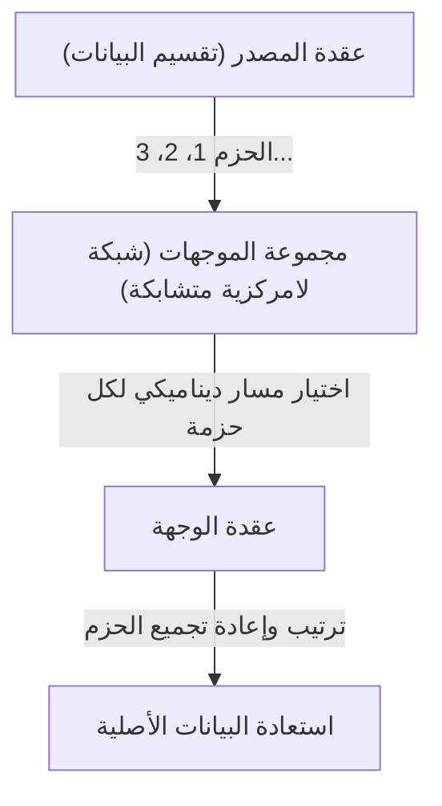

يمكن تلخيص الابتكار التقني لنظام تبديل الحزم في النقطتين الرئيسيتين التاليتين:

1. **تحقيق الإرسال المتعدد الإحصائي (Statistical Multiplexing):**
   بدلاً من احتكار خط فيزيائي لاتصال معين كما في تبديل الدارات، تتشارك حزم اتصالات متعددة غير مترابطة نفس الخط الفيزيائي عن طريق التقسيم الزمني. نظراً لأن اتصالات البيانات بين أجهزة الكمبيوتر تتميز بـ "الانفجارية" (Burstiness: خاصية تدفق كميات كبيرة من البيانات مؤقتاً يليها صمت)، فإن مشاركة النطاق الترددي عبر تبديل الحزم رفع كفاءة استخدام موارد الاتصال إلى حدودها الرياضية.
2. **التخزين والتوجيه (Store and Forward) واختيار المسار الديناميكي:**
   تقوم كل عقدة نقل (موجه/Router) في الشبكة بتخزين الحزم المستلمة مؤقتاً في طابور انتظار (Queue) في الذاكرة، ثم تطابق عنوان الوجهة المكتوب في رأس الحزمة (Header) مع جدول التوجيه (Routing Table) الخاص بالعقدة. وتقوم بحساب حالة الازدحام (Congestion) في الشبكة وحالة انقطاع الخطوط الفيزيائية في تلك اللحظة، وتوجه كل حزمة إلى العقدة المجاورة المثلى.

استخدم كلاينروك نظرية الطوابير (Queuing Theory) لتأسيس نموذج رياضي لتأخير الحزم وحجم المخزن المؤقت (Buffer) في طريقة التخزين والتوجيه هذه. حتى لو تبخر جزء من الشبكة بسبب هجوم نووي، فإن العقد المتبقية ستقيم الوضع بشكل مستقل، وستعثر الحزم على مسارات بديلة (مسارات أخرى على الشبكة المتشابكة / Mesh Network) للوصول إلى وجهتها. إن هذه البنية "المستقلة واللامركزية وذاتية الإصلاح" هي أصل مرونة وقوة (Resilience) الإنترنت.

## 1.2 بناء شبكة ARPANET: الفصل بين الأجهزة والبروتوكولات بواسطة IMP

تم تنفيذ شبكة تبديل الحزم، التي كانت مجرد كيان نظري، في العالم المادي في عام 1969 من خلال مشروع "ARPANET" الذي تم تمويله من قبل وكالة مشاريع الأبحاث المتقدمة التابعة لوزارة الدفاع الأمريكية (ARPA).

كانت بيئة الحوسبة في ذلك الوقت فوضوية إلى حد لا يمكن مقارنته باليوم. فالأجهزة المركزية (Mainframes) التي طورتها شركات مثل IBM و DEC و SDS بشكل مستقل كانت تحتوي على شفرات رموز مختلفة (ASCII مقابل EBCDIC)، وأطوال كلمات مختلفة (16 بت، 32 بت، 36 بت، إلخ)، وأنظمة تشغيل مختلفة تماماً، وكان من الصعب جداً تقنياً جعلها تتواصل مع بعضها البعض مباشرة.

لذلك، اتخذ مصممو ARPANET (لاري روبرتس وآخرون) قراراً مهماً جداً في تصميم بنية الشبكة. كان ذلك يتمثل في تقديم كمبيوتر صغير مخصص للنقل يسمى "IMP (Interface Message Processor)".

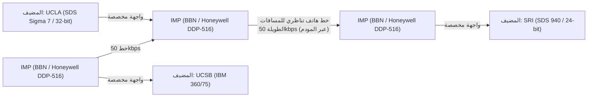

فازت شركة الاستشارات BBN (Bolt Beranek and Newman) ومقرها بوسطن بمناقصة تطوير IMP. قاموا بتعديل الكمبيوتر الصغير القوي "DDP-516" من شركة Honeywell، وألقوا بجميع مهام الشبكة المعقدة مثل بروتوكولات التوجيه (Routing Protocols)، وتقسيم وتجميع الحزم، واكتشاف الأخطاء (CRC: Cyclic Redundancy Check) على عاتق الـ IMP.

ونتيجة لذلك، لم تعد الأجهزة المركزية الضخمة في كل مؤسسة بحثية بحاجة إلى الاهتمام بتوجيه الحزم المعقد أو الخصائص الفيزيائية للخطوط، وكان عليها فقط تبادل البيانات باستخدام IMP الموجود أمامها وواجهة قياسية (بروتوكول BBN 1822). كان هذا أول نجاح كبير في تطبيق مبدأ "فصل الاهتمامات" (Separation of Concerns) في مجال الشبكات، وأصبح IMP السلف المباشر للموجه (Router) الحالي.

في 29 أكتوبر 1969، تم إرسال الرسالة الأولى "LO" (حيث تعطل النظام أثناء محاولة كتابة "LOGIN") من مختبر كلاينروك في جامعة كاليفورنيا بلوس أنجلوس (UCLA) إلى معهد أبحاث ستانفورد (SRI). كانت هذه اللحظة التاريخية لولادة ARPANET. بعد ذلك، تم تنفيذ خوارزميات التوجيه المبكرة (توجيه متجه المسافة / Distance Vector Routing بناءً على خوارزمية بلمان-فورد)، ونمت ARPANET بسرعة كبنية تحتية تربط المؤسسات البحثية في جميع أنحاء الولايات المتحدة.

## 1.3 فلسفة تصميم TCP/IP: مبدأ من النهاية إلى النهاية (End-to-End) وعمق التغليف (Encapsulation)

حققت ARPANET نجاحاً كبيراً كشبكة فردية، ولكنها سرعان ما واجهت عقبات جديدة. تم تصميم بروتوكول الاتصال NCP (Network Control Program) المستخدم داخل ARPANET بافتراض أنه سيعمل على "شبكة واحدة متجانسة وموثوقة للغاية" وهي ARPANET.

ولكن في السبعينيات، بدأت تظهر مجموعة متنوعة من الشبكات المختلفة تماماً من حيث الوسائط الفيزيائية، والحد الأقصى لحجم الحزمة (MTU: Maximum Transmission Unit)، وسرعة النقل، ومعدل الخطأ، مثل شبكات اتصال الحزم عبر الأقمار الصناعية (SATNET)، وشبكات حزم الراديو اللاسلكية التي طورتها جامعة هاواي (PRNET المشتقة من ALOHANET). وعندما تم محاولة ربط هذه الشبكات لبناء "شبكة شبكات" (Internetwork) عالمية، أصبح من الواضح أن تصميم NCP سيفشل.

تم حل هذه المشكلة الهائلة المتمثلة في ربط شبكات غير متجانسة من خلال الورقة البحثية الرائدة "A Protocol for Packet Network Intercommunication" التي نشرها فينتون سيرف (Vinton Cerf) وروبرت كان (Bob Kahn) في عام 1974. البروتوكول الذي صمموه هو "TCP/IP (Transmission Control Protocol / Internet Protocol)"، وهو أساس الإنترنت الحديث.

### روح البنية: مبدأ من النهاية إلى النهاية (End-to-End Principle / Argument)
ينبع تصميم TCP/IP من أهم فلسفة في هندسة الشبكات: "مبدأ من النهاية إلى النهاية". هذا المبدأ، الذي دونه كل من J. H. Saltzer و D. P. Reed و D. D. Clark في الثمانينيات، ينص على ما يلي:

"الوظائف المتقدمة والخاصة بالتطبيقات مثل ضمان موثوقية نقل البيانات، والتحكم في التسلسل، والتشفير، يجب تنفيذها في الأجهزة الطرفية (End-to-End) لكلا طرفي الاتصال، ولا ينبغي تنفيذها في قلب الشبكة (البنية التحتية الوسيطة أو الموجهات)."

ماذا سيحدث إذا تم وضع "حالة" (State) معقدة مثل تأكيد استلام الحزمة (ACK) أو التحكم في إعادة الإرسال في قلب الشبكة (IMP أو الموجهات)؟ بمجرد تعطل الموجه الوسيط، ستضيع تلك الحالة وينقطع الاتصال. بالإضافة إلى ذلك، في كل مرة يظهر فيها تطبيق بمتطلبات جديدة، سيتعين إعادة كتابة برامج جميع الموجهات الوسيطة في العالم.

لقد جسد TCP/IP هذا المبدأ بوفاء تام. فموجه الـ IP (Internet Protocol) المسؤول عن التمرير يتخصص في وظيفة بسيطة للغاية (نقل مخططات البيانات / Datagrams بدون حفظ الحالة / Stateless): "نقل الحزم المستلمة نحو الوجهة بأفضل جهد ممكن (Best Effort)". لا يكترث IP مطلقاً بفقدان الحزم أو اختلاط ترتيبها. لقد أصبح مجرد "شبكة غبية" (Dumb Network).

في المقابل، أُلقيت مسؤولية ضمان موثوقية الاتصال بالكامل على بروتوكول TCP (Transmission Control Protocol) الذي يعمل في أجهزة الكمبيوتر المضيفة في كلا الطرفين. يقوم TCP بجمع الحزم التي جلبها IP بترتيب عشوائي ويعيد بناء البيانات الأصلية من خلال النظر إلى أرقام التسلسل (Sequence Numbers) المرفقة بها، ويطلب إعادة الإرسال بشكل مستقل إذا كان هناك نقص، ويضبط سرعة الإرسال إذا كانت الشبكة مزدحمة (التحكم في النافذة / Window Control وخوارزمية البداية البطيئة / Slow Start).

فلسفة التصميم هذه، التي تتمثل في "الحفاظ على بساطة المركز إلى أقصى حد وإعطاء الذكاء للأطراف (الحواف / Edge)"، هي السبب الرئيسي الذي جعل الإنترنت يتجاوز شبكة الهاتف، ولاحقاً يبتلع ابتكارات هائلة لم يتوقعها حتى المصممون مثل الويب (Web)، وتدفق الفيديو (Streaming)، واتصالات P2P، والهواتف الذكية، وذلك دون الحاجة إلى تعديل البنية التحتية.

### التغليف (Encapsulation) والنموذج الطبقي
لتحقيق هذا التقسيم المنطقي للأدوار، استخدم TCP/IP تقنية تسمى "التغليف" (Encapsulation). وهي آلية تقوم فيها كل طبقة بتغليف البيانات المراد إرسالها بمعلومات التحكم الخاصة بها (الرأس / Header) مثل دمية الماتريوشكا.

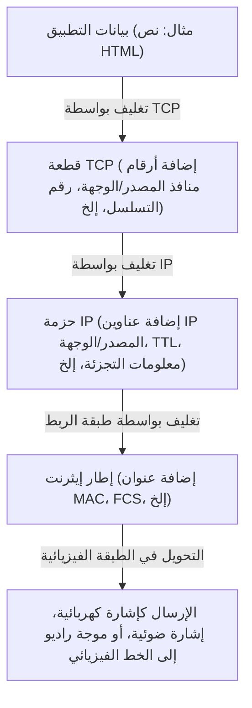

ينظر الموجه فقط إلى رأس حزمة IP (عنوان IP) لتحديد وجهة إعادة التوجيه، ولا يتدخل في محتوياتها (رأس TCP أو البيانات) على الإطلاق. بفضل ذلك، نجح بروتوكول IP في إخفاء واستيعاب اختلافات الخصائص الفيزيائية للطبقة الفيزيائية السفلية (الألياف الضوئية، الأسلاك النحاسية، Wi-Fi، 5G) تماماً، وتقديم "شبكة افتراضية عالمية واحدة" للطبقات العليا.

في 1 يناير 1983، تم تنفيذ "يوم العَلَم" (Flag Day) حيث تحولت جميع الأجهزة المضيفة على ARPANET فجأة من NCP إلى TCP/IP، وهنا ولد "الإنترنت" (The Internet) بمعناه الحقيقي.

## 1.4 صعود NSFNET وتطور التوجيه اللامركزي المستقل

بعد الانتقال إلى TCP/IP، تجاوز الإنترنت نطاق الدفاع العسكري وتحول إلى بنية تحتية هائلة للبحث الأكاديمي. وكانت القوة الدافعة الحاسمة لذلك هي "NSFNET" التي بنتها مؤسسة العلوم الوطنية الأمريكية (NSF) في أواخر الثمانينيات.

تم بناء NSFNET كشبكة أساسية (Backbone) تربط خمسة مراكز كمبيوتر عملاقة في الولايات المتحدة، وتم ترقية الطبقة الفيزيائية فيها بشكل كبير من 56kbps في البداية، إلى خط T1 (1.544Mbps)، ثم خط T3 (45Mbps). تم توصيل شبكات الجامعات والمناطق الإقليمية (Regional Networks) بشكل هرمي بالعمود الفقري لـ NSFNET.

مع التوسع الهائل للشبكة (Scaling)، ظهر تحدٍ تقني جديد. وهو "حدود التوجيه" (Routing). إن مشاركة معلومات المسار لعشرات الآلاف من العقد بين جميع الموجهات الوسيطة يتجاوز الحدود الفيزيائية لسعة الذاكرة وقوة المعالجة.

لحل هذه المشكلة، أدخل الإنترنت مفهوم "النظام المستقل" (AS: Autonomous System). حيث أُعيد تعريف الإنترنت ليصبح ليس شبكة واحدة عملاقة، بل مجموعة من الشبكات (AS) التي لها سياسات إدارية مستقلة.

داخل AS (البروتوكول الداخلي: IGP - Interior Gateway Protocol)، تُستخدم بروتوكولات توجيه حالة الارتباط (Link-State) مثل OSPF (Open Shortest Path First)، لإنشاء خريطة طبولوجيا (Topology) كاملة للشبكة بناءً على خوارزمية ديكسترا (Dijkstra's algorithm)، وذلك لحساب أقصر مسار بسرعة.

من ناحية أخرى، بين AS و AS (البروتوكول الخارجي: EGP - Exterior Gateway Protocol)، لم يكن الأمر يتعلق فقط بأقصر مسار، بل كان من الضروري أن يعكس سياسات العمل والمؤسسة مثل "الشبكات التي يُسمح بمرور الاتصالات عبرها". ولتحقيق ذلك، تم تطوير بروتوكول "BGP (Border Gateway Protocol)" الذي لا يزال يدعم أساس الإنترنت حتى يومنا هذا. يتبنى BGP خوارزمية متجه المسار (Path Vector)، مما يمنع حلقات التوجيه (Routing Loops) تماماً، مع تمكين تبادل معلومات المسار بين مزودي خدمات الإنترنت (ISP) حول العالم.

بناءً على إنشاء NSFNET وتأسيس BGP، اكتمل النظام البيئي للإنترنت التجاري الحديث، حيث لم تعد هناك حاجة لمدير مركزي، وبدلاً من ذلك تعمل الشبكة ككل كنظام مستقل وظيفياً من خلال الربط البيني (التناظر / Peering والعبور / Transit) المتكرر بين المؤسسات. في عام 1995، أنهت NSFNET دورها، وانتقلت إدارة العمود الفقري للشبكة بالكامل إلى مجموعة من مزودي خدمات الإنترنت (ISP) التجاريين.

## 1.5 ولادة WWW: تحرير المعرفة وتحويلها للملكية العامة عبر النص التشعبي

بحلول أواخر الثمانينيات، عندما تم إعداد البنية التحتية العالمية من الطبقة الفيزيائية إلى طبقات الشبكة والنقل، زادت كمية المعلومات المخزنة على الإنترنت بشكل كبير. ومع ذلك، كان الإنترنت في ذلك الوقت مليئاً بالتطبيقات الفردية مثل FTP (نقل الملفات) و Telnet (تسجيل الدخول عن بعد) و USENET (لوحة النشرات الإلكترونية)، وكانت المعلومات معزولة (في صوامع / Siloed) في أعماق أدلة الخوادم الفردية. للعثور على البيانات المطلوبة، كانت معرفة عناوين IP الخاصة بالخوادم المستهدفة وأوامر UNIX المعقدة ضرورية، وكان هذا وضعاً غير ديمقراطي على الإطلاق.

الذي قلب هذا الوضع رأساً على عقب وأحدث تحولاً جذرياً في مشاركة المعلومات هو تيم بيرنرز لي (Tim Berners-Lee)، عالم الكمبيوتر في المنظمة الأوروبية للأبحاث النووية (CERN) في جنيف، سويسرا. ففي عام 1989، اقترح نظاماً مبتكراً يُسمى "الشبكة العنكبوتية العالمية" (World Wide Web - WWW).

كان جوهر فكرته هو دمج مفهوم "النص التشعبي" (Hypertext: ربط كلمة في مستند بمستند آخر) الذي كان موجوداً منذ الستينيات مع "الإنترنت (TCP/IP)". لقد وسّع روابط النص التشعبي، التي كانت مقتصرة على الكمبيوتر المحلي، لتصل إلى مستندات على خوادم تقع في الجانب الآخر من العالم.

لبناء هذه المساحة المعلوماتية الضخمة، قام بيرنرز لي بمفرده بتصميم وتنفيذ ثلاثة مواصفات تقنية دقيقة للغاية.

1. **URI (Uniform Resource Identifier):**
   نظام عنونة عالمي لتحديد موقع أي مورد موجود على الشبكة بشكل فريد (نص، صورة، فيديو، إلخ).
2. **HTTP (Hypertext Transfer Protocol):**
   بروتوكول طبقة التطبيقات لطلب ونقل الموارد المحددة بواسطة URI بين العميل (متصفح الويب) والخادم. أفضل ميزة في HTTP هي تصميمه "العديم الحالة" (Stateless)، والذي لا يحتفظ بـ "حالة" (State) الاتصال. وقد مكّن ذلك الخوادم من التعامل مع طلبات ملايين العملاء بكفاءة.
3. **HTML (Hypertext Markup Language):**
   لغة ترميز لوصف البنية المنطقية للمستندات، وتضمين روابط تشعبية (علامة الارتساء `<a>`) إلى موارد أخرى.

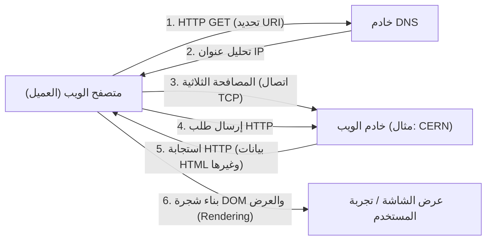

في أواخر عام 1990، بدأ أول خادم ويب (info.cern.ch) ومتصفح في العالم بالعمل على كمبيوتر NeXT. كان الويب في بدايته يعتمد على النصوص، لكن تجربة استكشاف المعلومات البسيطة عبر الروابط سرعان ما انتشرت بين الباحثين.
---
title: "كيف تعمل الإنترنت: من الكابلات البحرية إلى Web3، الصورة الكاملة للشبكة العملاقة التي تربط العالم"
description: "كيف تعمل أكبر بنية تحتية في تاريخ البشرية؟ تحليل شامل للتاريخ، البروتوكولات، الطبقة الفيزيائية، وحتى اتصالات المستقبل."
categories: ["technology", "network"]
tags: ["tech", "internet", "network", "infrastructure"]
slug: "how-the-internet-works-comprehensive-guide"
date: "2026-10-02T11:46:18+09:00"
image: "eyecatch.jpg"
---

# الفصل الأول: فجر الإنترنت وفلسفته —— سلالة التقنية من ARPANET إلى WWW

الإنترنت —— هذه الشبكة العملاقة المستقلة واللامركزية التي تعد اليوم الأساس لجميع الأنشطة الاقتصادية والثقافية والتواصل البشري، لم تُصمم قط بين عشية وضحاها بواسطة عبقري واحد. بل انطلقت من خلفية تاريخية وجيوسياسية فريدة خلال الحرب الباردة، ومرت بتحولات جذرية (Paradigm shift) في هندسة الاتصالات وعلوم الحاسوب، لتكون ثمرة لفلسفة سامية شاركها عدد لا يحصى من الباحثين: "كيف يمكننا نقل المعلومات بشكل موثوق وحر، متجاوزين أي قيود فيزيائية؟".

في هذا الفصل، سنتعمق إلى أقصى حد في كيفية ولادة هذا النظام المعجزة الذي يُعرف بالإنترنت، ليس من خلال سرد تاريخي بسيط، بل من منظور احترافي يركز على الآليات التقنية من الطبقة الفيزيائية (Physical Layer) إلى طبقة التطبيقات (Application Layer)، وفلسفتها التصميمية (Architecture).

## 1.1 تحول نموذج الشبكات: حدود تبديل الدارات (Circuit Switching) وولادة تبديل الحزم (Packet Switching)

لفهم الجوهر التاريخي والتقني للإنترنت، نقطة البداية لكل شيء هي اختراع مفهوم "تبديل الحزم (Packet Switching)". في أوائل الستينيات، كانت البنية التحتية للاتصالات تعتمد بشكل أساسي على طريقة "تبديل الدارات (Circuit Switching)"، والتي تتمثل في شبكة الهاتف.

### الآلية الفيزيائية لتبديل الدارات ونقاط ضعفها
طريقة تبديل الدارات تقوم بربط نقطتين للاتصال مادياً عبر محولات Crossbar أو مقسمات إلكترونية، أو منطقياً باستخدام تقنيات مثل تعدد الإرسال بتقسيم التردد (FDM)، لضمان واحتكار "مسار اتصال مخصص (دارة)" من بداية الاتصال وحتى نهايته. نظراً لأن هذه الطريقة تضمن عرض النطاق الترددي (Bandwidth) ووقت الاستجابة (Delay) طالما أن الدارة محجوزة، فقد كانت مناسبة جداً للاتصالات الصوتية (الهاتف) التي تتطلب وقتاً فعلياً (Real-time).

ومع ذلك، كان لهذه البنية المعمارية عيب قاتل. وهو وجود "نقطة فشل وحيدة (Single Point of Failure)" والهشاشة الشديدة تجاه التدمير المادي. خلال الحرب الباردة، كانت وزارة الدفاع الأمريكية تشعر بقلق بالغ إزاء الهجمات النووية من الاتحاد السوفيتي (خاصة النبض الكهرومغناطيسي: EMP الناتج عن الانفجارات النووية على ارتفاعات عالية). في حال تم تدمير مركز اتصال مركزي (مقسم رئيسي) مادياً، أو إذا تم قطع جزء من مسار الاتصال، لم تكن طريقة تبديل الدارات قادرة على إعادة بناء مسار بديل على الفور، مما يؤدي إلى شلل تام في نظام القيادة والسيطرة (C2: Command and Control) للدولة.

### اختراق تبديل الحزم (Packet Switching)
للتغلب على هذا القيد الفيزيائي اليائس، كان هناك ثلاثة رواد بنوا الأساس النظري بشكل مستقل تماماً ولكن في نفس الوقت تقريباً: بول باران (Paul Baran) من مؤسسة راند، ودونالد ديفيز (Donald Davies) من المختبر الفيزيائي الوطني البريطاني (NPL)، وليونارد كلينروك (Leonard Kleinrock) من معهد ماساتشوستس للتكنولوجيا (MIT).

بناءً على نظرية المعلومات لـ كلود شانون (Claude Shannon)، اقترح هؤلاء نهجاً ثورياً: بدلاً من التعامل مع الاتصالات كـ "موجة" تناظرية مستمرة أو "دفق (Stream)" بيانات متصل، يتم تقسيم البيانات إلى كتل صغيرة من البيانات الرقمية ذات طول ثابت (أو متغير) —— أي "حزم (Packets)" أو بكلمات باران "كتل رسائل موحدة (Standardized message blocks)".

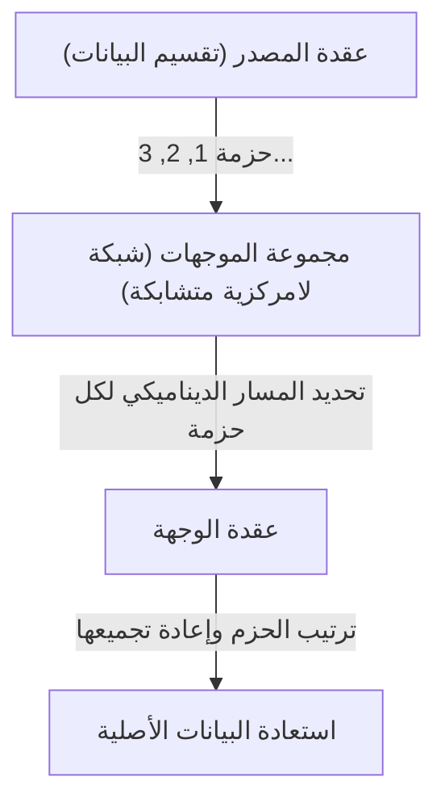

يمكن تلخيص الابتكار التقني لطريقة تبديل الحزم في النقطتين التاليتين:

1. **تحقيق تعدد الإرسال الإحصائي (Statistical Multiplexing):**
   بدلاً من احتكار خط فيزيائي لاتصال معين كما في تبديل الدارات، تتشارك حزم من اتصالات متعددة غير مرتبطة نفس الخط الفيزيائي بتقسيم الزمن (Time-division). نظراً لأن نقل البيانات بين أجهزة الكمبيوتر يتميز بـ "الاندفاعية (Burstiness: تدفق كمية كبيرة من البيانات مؤقتاً يليها صمت)"، فإن مشاركة النطاق الترددي عبر تبديل الحزم رفعت كفاءة استخدام موارد الاتصال إلى حدودها الرياضية.
2. **التخزين والتوجيه (Store and Forward) واختيار المسار الديناميكي:**
   كل عقدة توجيه (Router) في الشبكة تقوم بتخزين الحزم المستقبلة مؤقتاً في طابور (Queue) على الذاكرة، وتقارن عنوان الوجهة المكتوب في رأس (Header) الحزمة مع جدول التوجيه (Routing table) الخاص بالعقدة. ثم تقوم بحساب حالة الازدحام (Congestion) في الشبكة أو حالة انقطاع الخطوط الفيزيائية في تلك اللحظة، وتوجه كل حزمة إلى العقدة المجاورة المثلى.

استخدم كلينروك نظرية الطوابير (Queuing Theory) لتأسيس نموذج رياضي لتأخير الحزم وحجم المخزن المؤقت (Buffer) في طريقة التخزين والتوجيه هذه. حتى لو تبخر جزء من الشبكة بسبب هجوم نووي، فإن العقد المتبقية ستقيم الوضع بشكل مستقل وتجد مسارات بديلة (عبر شبكة متشابكة - Mesh network) للوصول إلى الوجهة. هذه البنية "اللامركزية المستقلة وذاتية الإصلاح" هي جوهر مرونة (Resilience) الإنترنت.

## 1.2 بناء شبكة ARPANET: فصل الأجهزة والبروتوكولات بواسطة IMP

تم تنفيذ شبكة تبديل الحزم، التي كانت مجرد مفهوم نظري، في العالم المادي من خلال مشروع "ARPANET" الذي بدأ بتمويل من وكالة مشاريع الأبحاث المتقدمة بوزارة الدفاع الأمريكية (ARPA) في عام 1969.

كانت بيئة الحوسبة في ذلك الوقت فوضوية بشكل لا يقارن باليوم. كانت أجهزة الكمبيوتر المركزية (Mainframes) التي طورتها شركات مثل IBM و DEC و SDS تمتلك ترميزات أحرف (ASCII مقابل EBCDIC)، وأطوال كلمات (16 بت، 32 بت، 36 بت، إلخ)، وأنظمة تشغيل مختلفة تماماً، مما جعل من الصعب جداً تقنياً جعلها تتواصل مباشرة مع بعضها البعض.

لذلك، اتخذ مصممو ARPANET (لاري روبرتس وآخرون) قراراً معمارياً مهماً جداً. وهو إدخال كمبيوتر صغير مخصص للتوجيه يُسمى "IMP (Interface Message Processor)".

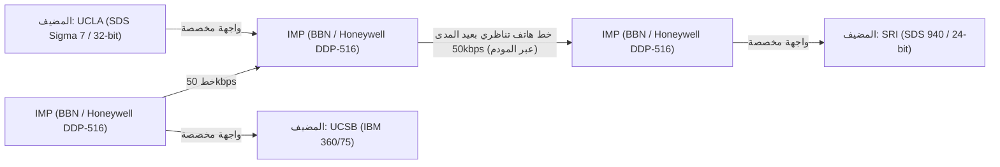

فازت شركة الاستشارات BBN (Bolt Beranek and Newman) ومقرها بوسطن بعطاء تطوير IMP. قاموا بتعديل الكمبيوتر الصغير القوي "DDP-516" من شركة Honeywell، وحملوا IMP جميع مهام الشبكة المعقدة مثل بروتوكولات التوجيه (Routing protocols)، تقسيم الحزم وتجميعها، واكتشاف الأخطاء (CRC: فحص التكرار الدوري).

بفضل هذا، لم تعد أجهزة الكمبيوتر المضيفة الضخمة في مؤسسات البحث بحاجة إلى القلق بشأن توجيه الحزم المعقد أو الخصائص الفيزيائية للخطوط، واكتفت بتبادل البيانات مع الـ IMP الموجود أمامها باستخدام واجهة قياسية (بروتوكول BBN 1822). كان هذا أول نجاح عظيم لتطبيق مبدأ "فصل الاهتمامات (Separation of Concerns)" في مجال الشبكات، وأصبح IMP السلف المباشر لأجهزة التوجيه (Routers) اليوم.

في 29 أكتوبر 1969، تم إرسال أول رسالة "LO" من مختبر كلينروك في UCLA إلى معهد ستانفورد للأبحاث (SRI) (كان الهدف كتابة "LOGIN" لكن النظام تعطل). كانت هذه اللحظة التاريخية التي ولدت فيها ARPANET. بعد ذلك، تم تطبيق خوارزميات التوجيه المبكرة (توجيه متجه المسافة - Distance-vector routing - بناءً على خوارزمية بيلمان-فورد)، ونمت ARPANET بسرعة كبنية تحتية تربط المؤسسات البحثية في جميع أنحاء الولايات المتحدة.

## 1.3 فلسفة تصميم TCP/IP: مبدأ من النهاية إلى النهاية (End-to-End) وعمق التغليف (Encapsulation)

حققت ARPANET نجاحاً كبيراً كشبكة مفردة، لكنها سرعان ما واجهت عقبة جديدة. بروتوكول الاتصال المستخدم داخل ARPANET المسمى NCP (Network Control Program) تم تصميمه على افتراض أنه سيعمل على "شبكة مفردة متجانسة وعالية الموثوقية" وهي ARPANET.

ولكن في السبعينيات، بدأت تظهر شبكات متنوعة بخصائص مختلفة تماماً في الوسائط الفيزيائية، الحد الأقصى لحجم الحزمة (MTU: Maximum Transmission Unit)، سرعة النقل، ومعدلات الخطأ، مثل شبكة تبديل الحزم عبر الأقمار الصناعية (SATNET)، وشبكة الحزم اللاسلكية التي طورتها جامعة هاواي (PRNET المشتقة من ALOHANET). عندما جرت محاولة ربط هذه الشبكات لبناء "شبكة الشبكات (Internetwork)" على مستوى عالمي، أصبح من الواضح أن تصميم NCP سيفشل.

تم حل هذه المشكلة الهائلة المتمثلة في ربط شبكات غير متجانسة من خلال الورقة البحثية الرائدة "A Protocol for Packet Network Intercommunication" التي نشرها فينتون سيرف (Vinton Cerf) وروبرت كان (Bob Kahn) في عام 1974. البروتوكول الذي صمموه هو بالضبط الأساس للإنترنت الحديث: "TCP/IP (Transmission Control Protocol / Internet Protocol)".

### روح البنية المعمارية: مبدأ من النهاية إلى النهاية (End-to-End Argument)
في قلب تصميم TCP/IP، تسري أهم فلسفة في هندسة الشبكات: "مبدأ من النهاية إلى النهاية (End-to-End Principle / Argument)". ينص هذا المبدأ الذي تمت صياغته بوضوح في الثمانينيات بواسطة J. H. Saltzer و D. P. Reed و D. D. Clark على ما يلي:

"يجب تنفيذ الوظائف المتقدمة والخاصة بالتطبيقات مثل ضمان موثوقية نقل البيانات، التحكم في الترتيب، والتشفير في الأجهزة المضيفة الطرفية (End-to-End) التي تجري الاتصال، ولا ينبغي تنفيذها في جوهر الشبكة (البنية التحتية الوسيطة والموجهات)."

ماذا لو تم إعطاء جانب جوهر الشبكة (IMP والموجهات) "حالة (State)" معقدة مثل تأكيد استلام الحزم (ACK) أو التحكم في إعادة الإرسال؟ في اللحظة التي يتعطل فيها الموجه الوسيط، ستُفقد هذه الحالة وينقطع الاتصال. بالإضافة إلى ذلك، في كل مرة يظهر فيها تطبيق بمتطلبات جديدة، سيتعين إعادة كتابة برمجيات جميع الموجهات الوسيطة حول العالم.

جسّد TCP/IP هذا المبدأ بإخلاص مطلق. بروتوكول الإنترنت (IP - Internet Protocol) المسؤول عن التوجيه، متخصص في وظيفة بسيطة جداً (إرسال بيانات بدون حالة - Stateless Datagram): "القيام بأفضل جهد (Best effort) لتوجيه الحزم المستلمة إلى وجهتها". لا يهتم الـ IP بفقدان الحزم أو اختلال ترتيبها على الإطلاق. لقد اقتصر دوره على أن يكون مجرد "شبكة غبية (Dumb Network)".

في المقابل، تم تسليم المسؤولية الثقيلة المتمثلة في ضمان موثوقية الاتصال بالكامل إلى بروتوكول TCP (Transmission Control Protocol) الذي يعمل على أجهزة الكمبيوتر المضيفة في كلا الطرفين. يقوم TCP بجمع الحزم غير المرتبة التي جلبها IP بناءً على أرقام التسلسل (Sequence numbers) المرفقة بها، وإذا كان هناك أي نقص، فإنه يطلب إعادة الإرسال بشكل مستقل، وإذا كانت الشبكة مزدحمة، فإنه يعدل سرعة الإرسال (التحكم في النافذة - Window control وخوارزمية البدء البطيء - Slow-start).

هذه الفلسفة التصميمية المتمثلة في "الحفاظ على الجوهر بسيطاً إلى أقصى حد، وإعطاء الذكاء للأطراف (الحواف)" هي السبب الأكبر وراء تفوق الإنترنت على شبكة الهاتف، وقدرتها لاحقاً على استيعاب ابتكارات هائلة لم يتوقعها حتى مصمموها، مثل الويب (Web)، وتدفق الفيديو (Streaming)، واتصالات P2P، والهواتف الذكية، وذلك دون الحاجة إلى تعديل البنية التحتية.

### التغليف (Encapsulation) والنموذج الطبقي
لتحقيق هذا التقسيم المنطقي للأدوار، استخدم TCP/IP تقنية تُعرف باسم "التغليف (Encapsulation)". إنها آلية حيث تضيف كل طبقة معلومات التحكم الخاصة بها (الرأس - Header) إلى البيانات المرسلة، تماماً مثل دمى الماتريوشكا.

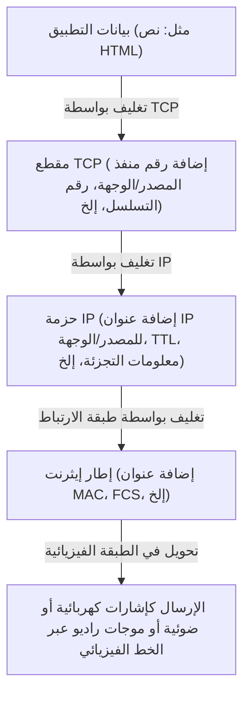

ينظر الموجه فقط إلى رأس حزمة IP (عنوان IP) لتحديد وجهة التوجيه، ولا يتدخل في محتوياتها (رأس TCP أو البيانات) على الإطلاق. بفضل هذا، نجح الـ IP في إخفاء واستيعاب الفروق في الخصائص الفيزيائية للطبقة الفيزيائية السفلية (الألياف الضوئية، الأسلاك النحاسية، Wi-Fi، 5G) بشكل كامل، وتوفير "شبكة افتراضية عالمية واحدة" للطبقات العليا.

في 1 يناير 1983، تم تنفيذ "يوم العلم (Flag Day)" حيث تحولت جميع الأجهزة المضيفة على ARPANET من NCP إلى TCP/IP في نفس الوقت، وهنا ولدت "الإنترنت" بمعناها الحقيقي.

## 1.4 صعود NSFNET وتطور التوجيه اللامركزي المستقل

بعد الانتقال إلى TCP/IP، تجاوزت الإنترنت حدود الاستخدامات العسكرية والدفاعية لتتحول إلى بنية تحتية ضخمة للبحث الأكاديمي. كانت القوة الدافعة الحاسمة لذلك هي "NSFNET" التي بنتها مؤسسة العلوم الوطنية الأمريكية (NSF) في أواخر الثمانينيات.

تم بناء NSFNET كشبكة رئيسية (Backbone) تربط بين خمسة مراكز للكمبيوتر الفائق في الولايات المتحدة. بدأت بسرعة 56kbps، ثم تم ترقية الطبقة الفيزيائية بشكل جذري إلى خطوط T1 (1.544Mbps)، ولاحقاً إلى خطوط T3 (45Mbps). أصبحت الشبكات الإقليمية وشبكات الجامعات متصلة بشكل هرمي بهذه الشبكة الرئيسية لـ NSFNET.

مع التوسع الهائل (Scaling) في حجم الشبكة، ظهر تحدٍ تقني جديد: "حدود التوجيه (Routing)". إن مشاركة معلومات التوجيه لعشرات الآلاف من العقد (Nodes) بين جميع الموجهات الوسيطة يتجاوز الحدود الفيزيائية لسعة الذاكرة وقوة المعالجة.

لحل هذه المشكلة، أدخلت الإنترنت مفهوم "النظام المستقل (AS: Autonomous System)". تمت إعادة تعريف الإنترنت ليس كشبكة عملاقة واحدة، بل كمجموعة من الشبكات (AS) ذات سياسات إدارة مستقلة.

داخل الـ AS (المعروف بـ IGP: Interior Gateway Protocol)، يتم استخدام بروتوكولات توجيه حالة الارتباط (Link-state) مثل OSPF (Open Shortest Path First)، حيث يتم بناء خريطة طوبولوجية كاملة للشبكة باستخدام خوارزمية ديكسترا (Dijkstra's algorithm) لحساب أقصر مسار بسرعة عالية.

من ناحية أخرى، بين AS و AS آخر (المعروف بـ EGP: Exterior Gateway Protocol)، لم يكن كافياً مجرد إيجاد أقصر مسار، بل كان من الضروري عكس السياسات التجارية والتنظيمية مثل "أي الشبكات يُسمح بالمرور عبرها للاتصال". لتحقيق ذلك، تم تطوير بروتوكول "BGP (Border Gateway Protocol)" الذي لا يزال يدعم أساس الإنترنت حتى اليوم. يعتمد BGP على خوارزمية متجه المسار (Path Vector)، مما يمنع تماماً حلقات التوجيه (Routing loops) ويسمح بتبادل معلومات المسارات بين مزودي خدمة الإنترنت (ISPs) حول العالم.

مع بناء NSFNET وترسيخ BGP، حتى بدون وجود مدير مركزي، تقوم كل مؤسسة بتكرار الاتصال البيني (Peering و Transit) بحيث تعمل الشبكة بأكملها بشكل مستقل ومترابط. هكذا اكتمل النظام البيئي للإنترنت التجاري الحديث. في عام 1995، أنهت NSFNET دورها، وتم نقل إدارة الشبكة الرئيسية (Backbone) بالكامل إلى مجموعة من مزودي خدمة الإنترنت (ISPs) التجاريين.
## 1.5 نشأة شبكة الويب العالمية (WWW): تحرير المعرفة والملكية العامة عبر النص التشعبي (Hypertext)

في أواخر الثمانينيات، عندما تم إنشاء البنية التحتية من الطبقة المادية إلى طبقة الشبكة وطبقة النقل على نطاق عالمي، كانت كمية المعلومات المتراكمة على الإنترنت تتزايد بشكل كبير. ومع ذلك، كان الإنترنت في ذلك الوقت يعج بتطبيقات فردية مثل بروتوكول نقل الملفات (FTP)، وتسجيل الدخول عن بُعد (Telnet)، ولوحات النشرات الإلكترونية (USENET)، وكانت المعلومات معزولة (في صوامع) في أعماق أدلة كل خادم. للعثور على البيانات المطلوبة، كانت معرفة عنوان IP الخاص بالخادم المستهدف وأوامر UNIX المعقدة ضرورية، مما جعل الوضع غير ديمقراطي إلى حد كبير.

الذي قلب هذا الوضع رأساً على عقب وأحدث تحولاً جذرياً في مشاركة المعلومات هو تيم بيرنرز لي (Tim Berners-Lee)، عالم الكمبيوتر في المنظمة الأوروبية للأبحاث النووية (CERN) في جنيف، سويسرا. في عام 1989، اقترح نظامًا مبتكرًا يُدعى "شبكة الويب العالمية (World Wide Web - WWW)".

كان جوهر فكرته هو الجمع بين "النص التشعبي (Hypertext: مفهوم ربط كلمة في مستند بمستند آخر)" الذي كان موجودًا منذ الستينيات، و "الإنترنت (TCP/IP)". لقد وسع وجهة روابط النص التشعبي، التي كانت مغلقة داخل أجهزة الكمبيوتر المحلية، لتصل إلى المستندات الموجودة على الخوادم في الجانب الآخر من العالم.

لبناء مساحة المعلومات الضخمة هذه، قام بيرنرز لي بتصميم وتنفيذ ثلاث مواصفات فنية متطورة للغاية بمفرده.

1. **معرف الموارد الموحد (URI - Uniform Resource Identifier):**
   نظام عنونة عالمي لتحديد موقع أي مورد موجود على الشبكة (نصوص، صور، مقاطع فيديو، وما إلى ذلك) بشكل فريد.
2. **بروتوكول نقل النص التشعبي (HTTP - Hypertext Transfer Protocol):**
   بروتوكول طبقة التطبيق لطلب ونقل الموارد المحددة بواسطة URI بين العميل (متصفح الويب Web Browser) والخادم (Server). وأفضل ميزة في بروتوكول HTTP هي اعتماده على تصميم "عديم الحالة (Stateless)" الذي لا يحتفظ بـ "حالة (State)" الاتصال. هذا أتاح للخادم معالجة الطلبات الواردة من ملايين العملاء بكفاءة.
3. **لغة ترميز النص التشعبي (HTML - Hypertext Markup Language):**
   لغة ترميز تُستخدم لوصف البنية المنطقية للمستندات وتضمين الارتباطات التشعبية (Hyperlinks) إلى موارد أخرى (باستخدام وسم الارتساء `<a>`).

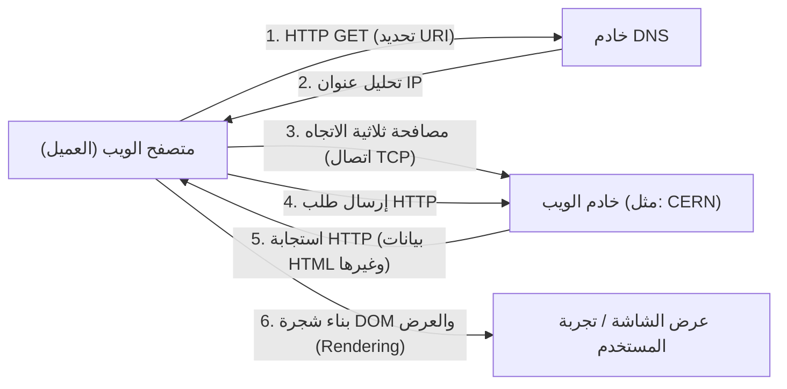

في أواخر عام 1990، بدأ تشغيل أول خادم ويب في العالم (info.cern.ch) وأول متصفح على جهاز كمبيوتر NeXT. ورغم أن شبكة الويب الأولية كانت تعتمد على النصوص، إلا أن تجربة البحث عن المعلومات من خلال الروابط البديهية انتشرت بسرعة بين الباحثين.

### قرار تاريخي للإنسانية: الملكية العامة (Public Domain)
ومع ذلك، فإن السبب الأكبر الذي جعل شبكة WWW تغير العالم بالمعنى الحقيقي وتترسخ كبنية تحتية للمجتمع الحديث ليس فقط بنيتها التقنية الممتازة. الحدث الحاسم الذي غيّر مجرى التاريخ وقع في 30 أبريل 1993.

فقد قبلت منظمة CERN الطلب المُلح من تيم بيرنرز لي، واتخذت قرارًا مذهلًا بفتح جميع التقنيات الأساسية لشبكة WWW (برامج الخادم، العميل، ومكتبات التعليمات البرمجية) مجانًا كـ "ملكية عامة (Public Domain - التنازل عن حقوق الملكية الفكرية)". تضمنت وثيقة الإعلان توقيع مدير CERN بعدم ممارسة أي حقوق براءة اختراع وعدم المطالبة بأي رسوم استخدام.

ماذا لو كانت CERN قد سجلت براءة اختراع لتقنية WWW في ذلك الوقت وحاولت تحقيق الدخل منها من خلال تراخيص البرامج؟ بلا شك، لم يكن الانفجار المعلوماتي الذي نشهده اليوم ليحدث. لظلت شبكة WWW نظامًا مغلقًا يقتصر على بعض الشركات والجامعات ذات الموارد المالية، ولتم تقسيم الإنترنت في حروب المعايير مع البروتوكولات المنافسة مثل Gopher التي ظهرت لاحقًا.

بفضل هذا التحول إلى الملكية العامة، اختفت الحواجز التقنية والقانونية تمامًا، مما سمح للمخترقين والشركات في جميع أنحاء العالم بالانضمام إلى نظام WWW البيئي. قام مارك أندريسن (Marc Andreessen) وآخرون في المركز الوطني لتطبيقات الحوسبة الفائقة (NCSA) بتطوير ونشر "NCSA Mosaic" مجانًا، وهو متصفح رسومي رائد قادر على عرض الصور بشكل مضمن (Inline)، والذي كان بمثابة شرارة انطلاق Netscape Navigator لاحقًا، وبالتالي فقاعة تكنولوجيا المعلومات (IT Bubble). تم تحقيق "دمقرطة المعلومات (Democratization of Information)" حيث يمكن للأفراد إعداد خوادم ويب بحرية ونشر المعلومات للعالم أجمع.

## 1.6 خاتمة: الفلسفة تتجاوز التنفيذ (Philosophy overrides Implementation)

إن تاريخ الإنترنت الذي استعرضناه في الفصل الأول ليس مجرد تاريخ لتحسين سرعات الاتصال. بل هو تاريخ لاختراع تبديل الحزم (Packet Switching) بناءً على الواقع المادي بأن "التحكم المركزي هش"، ومبدأ من الطرف إلى الطرف (End-to-End Principle) الذي ينص على أن "الأطراف النهائية يجب أن تتحمل التعقيد"، ونشر شبكة WWW للعامة بناءً على فكرة أن "المعلومات يجب أن تكون مفتوحة لجميع البشر مجانًا".

ما جعل الإنترنت على ما هو عليه اليوم ليس الأجهزة أو الأكواد البرمجية المتفوقة، بل "فلسفة التصميم (Design Philosophy)" القوية والمتسقة هذه. التغلب على قيود الطبقة المادية من خلال التغليف المنطقي (Logical Encapsulation)، واحتضان التنوع من خلال المعايير المفتوحة (RFC: Request for Comments). فقط بسبب هذه البنية التي تحترم اللامركزية والحرية، تمكن الإنترنت من تحقيق توسع (Scaling) غير مسبوق.

ومع ذلك، لا تزال هناك فجوة عميقة بين "الأسماء" التي يمكن للبشر فهمها و"الأرقام (عناوين IP)" التي تعالجها الشبكة. في الفصل التالي، سنقوم بكشف الآليات التقنية لـ "أعماق مساحة عناوين IP ونظام أسماء النطاقات (DNS - Domain Name System)"، وهو نظام قواعد البيانات الموزع الضخم الذي جلب النظام إلى مساحة العناوين الخاصة بهذه الشبكة اللامركزية المستقلة الشاسعة ودعم الانتشار الهائل لشبكة WWW من وراء الكواليس.

# الفصل الثاني: الطبقة المادية وطبقة ارتباط البيانات - الكيان المادي للبيانات الرقمية والاتصال بين العقد المجاورة

في أساس الشبكة الضخمة التي نطلق عليها الإنترنت، توجد سلسلة هائلة من الظواهر الفيزيائية التي تحول البيانات الرقمية المنطقية من "0" و "1" إلى إشارات كهربائية، ومضات ضوئية، أو تموجات كهرومغناطيسية، وتوصيلها إلى الوجهة عبر الفضاء والوسائط. عندما نفتح بشكل عابر موقع ويب على هواتفنا الذكية، تنطلق الفوتونات عبر الألياف الزجاجية الزاحفة في قاع المحيط العميق، وتطير الموجات الراديوية غير المرئية في الفضاء مصحوبة بحسابات معقدة في الخلفية.

في هذا الفصل، سنركز على الطبقة الأولى (الطبقة المادية - Physical Layer) والطبقة الثانية (طبقة ارتباط البيانات - Data Link Layer) في نموذج OSI المرجعي، وسنتعمق إلى أقصى حد من منظور احترافي في الأجزاء "الأكثر مادية وعملية" من الشبكات التي تدعم حياتنا، والآليات المنطقية الدقيقة التي تتحكم فيها.

---

## 2.1 الطبقة المادية (Physical Layer): التجسيد المادي للمعلومات وقوانين الكون

المهمة الأكبر للطبقة المادية هي تحويل (تعديل - Modulation) سلاسل البتات المنفصلة (0 و 1) التي تتعامل معها أجهزة الكمبيوتر إلى إشارات فيزيائية تناظرية تتناسب مع الخصائص الفيزيائية لوسيط الإرسال (الأسلاك النحاسية، الألياف الضوئية، أو الفراغ والهواء) وإرسالها عبر مسار النقل. هنا، تحدد قوانين الهندسة الكهربائية، وميكانيكا الكم، والبصريات حدود الاتصال.

### مبرهنة شانون-هارتلي (Shannon-Hartley Theorem) وحدود المعلومات
لا يمكننا الحديث عن الطبقة المادية دون التطرق إلى نظرية المعلومات التي نشرها كلود شانون (Claude Shannon) في عام 1948. فقد أثبتت "مبرهنة شانون-هارتلي" رياضيًا الحد الأقصى لمعدل نقل البيانات (سعة قناة الاتصال - Channel Capacity) الذي يمكن نقله بدون أخطاء في قناة اتصال يتواجد فيها ضوضاء.

$$ C = B \log_2\left(1 + \frac{S}{N}\right) $$

حيث $C$ هي سعة القناة (بوحدة bps)، $B$ هو عرض النطاق الترددي (بوحدة Hz)، و $S/N$ هي نسبة الإشارة إلى الضوضاء (SNR). تظهر هذه المعادلة الجميلة أنه بغض النظر عن مدى تقدم التكنولوجيا، هناك حد مادي (حد شانون - Shannon Limit) لكمية المعلومات التي يمكن إرسالها ضمن عرض نطاق ترددي وبيئة ضوضاء معينة. يواصل مهندسو الألياف الضوئية وشبكات Wi-Fi الحديثون معركة لا نهاية لها لرفع سرعات الاتصال لتصل بالكاد إلى هذا الحد.

### فيزياء الألياف الضوئية: "حبس" الضوء ونقله
العمود الفقري للإنترنت الحديث هو بلا شك الألياف الضوئية (Optical Fiber). ففي حين أن الاتصالات الكهربائية باستخدام الأسلاك النحاسية تجعل الاتصالات عالية السرعة لمسافات طويلة صعبة بسبب تأثير القشرة (Skin Effect) والتداخل الكهرومغناطيسي (EMI)، فقد تغلبت الألياف الضوئية على هذه التحديات.

تتكون الألياف الضوئية من طبقتين من زجاج الكوارتز النقي للغاية: "القلب (Core)" المركزي و "الغلاف (Cladding)" المحيط به. من خلال جعل معامل الانكسار للقلب أعلى قليلاً (أقل من بضعة بالمائة) من الغلاف، واعتمادًا على قانون سنيل (Snell's Law)، فإن الضوء الداخل بزاوية أضيق من زاوية حرجة معينة يختبر انعكاسًا داخليًا كليًا (Total Internal Reflection) متكررًا عند الحد الفاصل بين القلب والغلاف. بفضل ذلك، يتقدم الضوء داخل الليف دون أن يتسرب إلى الخارج.

#### المعركة ضد التشتت والتوهين: الزجاج الذي جلب جائزة نوبل
كان الزجاج في الماضي يحتوي على العديد من الشوائب، وكان الضوء يتضاءل (يتوهن - Attenuate) بعد بضعة أمتار. في عام 1966، اكتشف الدكتور تشارلز كاو (Charles K. Kao)، الحائز على جائزة نوبل في الفيزياء لعام 2009، أن سبب التوهين في الألياف الضوئية ليس الخاصية الجوهرية للزجاج بل الشوائب (خاصة مجموعات الهيدروكسيل والمعادن الانتقالية)، وتنبأ بأنه إذا زادت النقاوة، فستكون الاتصالات بعيدة المدى ممكنة. حقق زجاج الكوارتز منخفض الفقد (Low-loss) الذي طورته شركة كورنينج (Corning) في السبعينيات فقدانًا منخفضًا بشكل مذهل بلغ 0.2 ديسيبل/كم في نطاق الطول الموجي 1550 نانومتر (النطاق C). هذا يعني أنه حتى بعد التقدم لمسافة 15 كم، يفقد الضوء نصف شدته فقط.

ومع ذلك، عندما يسافر الضوء لمسافات طويلة، يحدث "تشتت لوني (Chromatic Dispersion)" و "تشتت نمطي (Modal Dispersion)"، مما يؤدي إلى تشوه شكل موجة النبضة. يحدث التشتت اللوني لأن سرعة انتشار الضوء في الزجاج تختلف حسب طوله الموجي (لونه). أما التشتت النمطي فهو ظاهرة تحدث فيها فجوات في أوقات الوصول بسبب وجود مسارات متعددة (أنماط - Modes) يمر عبرها الضوء داخل القلب.
للتغلب على ذلك، تم تطوير "الألياف أحادية النمط (SMF - Single-Mode Fiber)"، حيث يتم تصغير قطر القلب إلى بضعة ميكرومترات ليقارب الطول الموجي للضوء، مما يسمح بمرور مسار واحد فقط. وأصبحت هذه الألياف هي السائدة في النقل لمسافات طويلة، مثل الاتصالات العابرة للقارات.

#### مضخم الألياف المُطعّم بالإربِيُوم (EDFA) والمضاعفة بتقسيم الطول الموجي (WDM): عصر نهضة الاتصالات الضوئية
في التسعينيات، حدثت ثورتان في الاتصالات الضوئية. الأولى كانت مضخم الألياف المُطعّم بالإربِيُوم (EDFA: Erbium-Doped Fiber Amplifier). حتى ذلك الحين، كانت هناك حاجة إلى مكررات التجديد البطيئة والمكلفة التي تقوم بتحويل الإشارة الضوئية المتوهنة إلى إشارة كهربائية، وتضخيمها، ثم إعادتها إلى ضوء مرة أخرى. من خلال تطعيم قلب الليف بعنصر الإربيوم الأرضي النادر وتطبيق ضوء ضخ خارجي، أتاح EDFA إحداث انبعاث محفز (Stimulated Emission) عند مرور ضوء الإشارة، مما جعل من الممكن تضخيم الضوء مباشرة كضوء.

الثانية هي المضاعفة بتقسيم الطول الموجي (WDM: Wavelength Division Multiplexing). إنها تقنية تستغل مبدأ التراكب (Superposition)، حيث أنه حتى إذا تم إرسال أطوال موجية (ألوان) مختلفة من الضوء في نفس الوقت وفي نفس المساحة، فإنها تتقدم بشكل مستقل دون أن تختلط، مما يسمح بجمع وإرسال إشارات ذات أطوال موجية متعددة في وقت واحد على ليف واحد. بفضل تقنية المضاعفة الكثيفة بتقسيم الطول الموجي (DWDM)، يتم اليوم وضع أكثر من 100 إشارة موجية متباعدة ببضعة نانومترات على ليف ضوئي واحد، مما يوفر عرض نطاق ترددي هائل يتراوح من عشرات التيرابت في الثانية (Tbps) إلى بضعة بيتابت في الثانية (Pbps) عبر ليف واحد.

### الكابلات البحرية: الشبكة العصبية للأرض
أكثر من 99% من اتصالات البيانات بين القارات لا يتم نقلها بواسطة الأقمار الصناعية، بل بواسطة الكابلات البحرية (Submarine Cables). سواء كانت بيانات سحابية أو صورًا على مواقع أجنبية، فإنها جميعًا تمر فعليًا عبر قاع البحر.

#### تاريخ من الإخفاقات والتحديات
تاريخ الكابلات البحرية أقدم بكثير من تاريخ الإنترنت. كان أول تحد كبير هو كابل التلغراف عبر المحيط الأطلسي في عام 1858. وعلى الرغم من نجاح عملية وضع السلك النحاسي المعزول بمادة "جوتا بيرتشا (Gutta-percha)"، وهي نوع من المطاط الطبيعي، إلا أن التشغيل بجهد عالي متجاهلاً تحذير اللورد كلفن (ويليام طومسون) أدى إلى انهيار العزل وتوقفه عن العمل خلال أسابيع قليلة فقط. بعد ذلك، تم تحسين النظريات والمواد على مدار فترة طويلة، وفي عام 1988 تم تشغيل أول كابل ضوئي بحري عبر المحيط الهادئ "TAT-8"، إيذانًا ببدء عصر الضوء.

#### هيكل الكابل وآلية تمديده
تم تصميم الكابلات البحرية الحديثة، التي تمتد في أعماق البحار على عمق آلاف الأمتار، لتتحمل الظروف القاسية. لحماية حزمة الألياف الضوئية القليلة الموجودة في المركز، يتم حمايتها بطبقات متعددة تشمل أسلاك فولاذية عالية الشد، وأنابيب نحاسية أو ألومنيوم لمقاومة ضغط الماء، وعوازل من البولي إيثيلين. في المياه العميقة، يبلغ قطرها بضعة سنتيمترات فقط لتقليل الوزن مع تحمل عضات أسماك القرش وضغط الماء الهائل. أما في المياه الضحلة، فيتم تزويدها بتدريع سميك (Armoring) لحمايتها من شباك الجر التابعة لسفن الصيد، ومراسي السفن، والزلازل تحت البحر، مما يجعل قطرها يتجاوز 10 سنتيمترات.

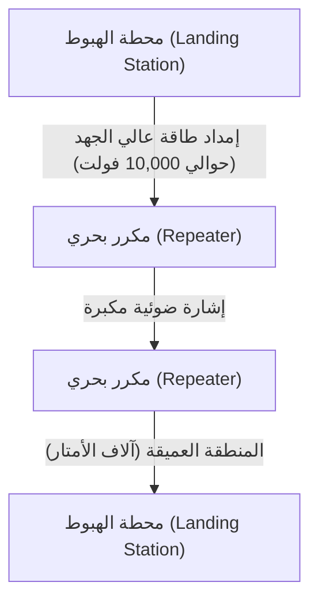

نظرًا لأن الإشارة الضوئية تتوهن كل بضع عشرات من الكيلومترات حتى مع استخدام ألياف منخفضة الفقد للغاية، يتم إدراج "مكررات بحرية (Repeaters)" على فترات متساوية على طول الكابل. لتشغيل هذه المكررات (التي تحتوي على EDFA المذكور سابقًا) في أعماق البحار، يتم إمدادها بالطاقة بشكل مستمر كتيار مباشر (DC) عالي الجهد يتراوح من بضعة آلاف إلى أكثر من 10,000 فولت كحد أقصى، وذلك من المحطات الأرضية على كلا الطرفين عبر الأنابيب النحاسية داخل الكابل.
يتم استخدام "سفن تمديد الكابلات" المتخصصة لوضعها، وفي المياه الضحلة، تقوم الروبوتات تحت الماء (ROV) بحفر خنادق في قاع البحر ودفن الكابل. وفي حال انقطاع الكابل، تهرع سفينة إصلاح إلى الموقع، وتستخدم خطاف (Grapple) لسحب طرف الكابل من قاع المحيط العميق ورفعه على متن السفينة، حيث يقوم فنيون مهرة بدمج ووصل (Splicing) الألياف الضوئية بدقة تصل إلى بضعة ميكرونات، في عملية عملية تقليدية شاقة للغاية.

### فيزياء اتصالات الموجات الراديوية (أساس Wi-Fi)
مع انتشار الأجهزة المحمولة وإنترنت الأشياء (IoT)، أصبحت الاتصالات باستخدام الموجات الكهرومغناطيسية (الموجات الراديوية) التي تطير في الفضاء بمثابة ساحة المعركة الرئيسية للطبقة المادية. تستخدم شبكات Wi-Fi (مجموعة معايير IEEE 802.11) بشكل أساسي نطاقات 2.4 جيجاهرتز و 5 جيجاهرتز، ومؤخرًا النطاق 6 جيجاهرتز من نطاقات ISM (النطاقات الصناعية والعلمية والطبية، والتي يمكن استخدامها بدون ترخيص).

#### ضغط المعلومات الأقصى باستخدام تعديل السعة المتعامدة (QAM)
في "التعديل (Modulation)"، حيث يتم وضع البيانات الرقمية على موجات تناظرية، تستخدم شبكات Wi-Fi تقنية متقدمة للغاية. وهي تقنية QAM (تعديل السعة المتعامدة - Quadrature Amplitude Modulation).
تحتوي الموجات الراديوية على كميتين فيزيائيتين هما "السعة (Amplitude - ارتفاع الموجة)" و "الطور (Phase - توقيت أو زاوية الموجة)". تقوم تقنية QAM بدمج موجتين حاملتين تختلفان في الطور بمقدار 90 درجة (إشارة I وإشارة Q)، وتغيير سعة كل منهما لتعيين سلاسل من البتات إلى "نقطة" معينة على خريطة الكوكبة (Constellation Map).

على سبيل المثال، باستخدام 16-QAM، يمكن لتغيير موجي واحد (رمز - Symbol) أن يمثل 16 نقطة (4 بتات). في أحدث إصدار من Wi-Fi 7 (802.11be)، تم اعتماد تعديل عالي الكثافة يمكن وصفه بالجنون وهو 4096-QAM. هذا يمثل 4096 نقطة (12 بتًا) بتعديل واحد. في خريطة كوكبة مزدحمة بـ 4096 نقطة، يجب على جهاز الاستقبال تحديد "النقطة" التي تم إرسالها بدقة دون أن تضيع وسط ضوضاء دقيقة. لتحقيق ذلك، يتم استخدام رموز متقدمة لتصحيح الأخطاء (Error Correction Codes) ومعالجات قوية لمعالجة الإشارات.

#### مضاعفة تقسيم التردد المتعامد (OFDM) وتقنية MIMO: المعركة ضد المسارات المتعددة واستغلال الفضاء
لا تسير الموجات الراديوية في خط مستقيم فحسب، بل تنعكس أيضًا عن الجدران والأثاث، وتتشتت، وتنعطف. لذلك، فإن الموجات الراديوية المنبعثة من جهاز الإرسال تسلك مسارات مختلفة (متعددة المسارات - Multipath) وتصل إلى جهاز الاستقبال بتوقيتات منحرفة قليلًا، مما يتسبب في تداخل (تلاشي - Fading) ويدمر شكل الموجة.
التقنيات المستخدمة لاستغلال ذلك أو التغلب عليه هي OFDM و MIMO.

**مضاعفة تقسيم التردد المتعامد (OFDM - Orthogonal Frequency Division Multiplexing)** هي تقنية تقوم بتقسيم النطاق بدقة إلى العديد من الترددات الضيقة جدًا (الناقلات الفرعية - Subcarriers) بدلاً من إشارة واحدة واسعة النطاق وعالية الارتداد، وتُرسل البيانات بالتوازي بسرعة بطيئة على كل منها. وبما أن الناقلات الفرعية يتم ترتيبها بحيث تكون "متعامدة (لا تتداخل مع بعضها البعض رياضيًا)"، فإن كفاءة استخدام التردد عالية جدًا، وهي شديدة المقاومة لانحرافات التأخير الناتجة عن المسارات المتعددة.

**MIMO (متعدد المدخلات والمخرجات - Multiple-Input and Multiple-Output)** هي تقنية "تعدد إرسال مكاني (Spatial Multiplexing)" تستخدم عدة هوائيات لإرسال بيانات مختلفة في وقت واحد وعلى نفس التردد. وهي تستفيد من خاصية اختلاط الموجات بشكل مختلف في مواقع مختلفة في الفضاء بسبب الانعكاس متعدد المسارات، وتقوم بفصل الإشارات المعقدة المستقبلة بواسطة هوائيات الاستقبال المتعددة كما لو كانت تحل معادلات متزامنة، مما يضاعف سعة الاتصال بمقدار عدد الهوائيات. علاوة على ذلك، أصبح **تكوين الشعاع (Beamforming)**، الذي يضبط طور موجات الراديو لكل هوائي لتركيز حزمة الموجات الراديوية في اتجاه معين، تقنية لا غنى عنها في شبكات Wi-Fi الحديثة.

---
## 2.2 データリンク層（Data Link Layer）：直接つながった機器間の対話と秩序
## 2.2 طبقة ربط البيانات (Data Link Layer): التفاعل والنظام بين الأجهزة المتصلة مباشرة

物理層が単なる「信号の運び屋」であるならば、データリンク層はその生のビット列を意味のある「フレーム」という塊にまとめ、同一ネットワーク（リンク）内の正しい宛先へ確実に届けるためのルールと交通整理を担う層である。
إذا كانت الطبقة الفيزيائية مجرد "ناقل للإشارات"، فإن طبقة ربط البيانات (Data Link Layer) هي الطبقة المسؤولة عن تجميع سلسلة البتات الخام تلك في كتل ذات معنى تُسمى "إطارات" (Frames)، ووضع قواعد وتنظيم حركة المرور لضمان وصولها بشكل موثوق إلى الوجهة الصحيحة داخل نفس الشبكة (الرابط/Link).

### イーサネット（Ethernet）の歴史：ALOHAからの着想
### تاريخ الإيثرنت (Ethernet): الإلهام من ALOHA

現在、有線LANの世界的なデファクトスタンダードとなっているのがイーサネット（IEEE 802.3）である。
حالياً، الإيثرنت (Ethernet أو IEEE 802.3) هو المعيار العالمي الفعلي (De facto standard) للشبكات المحلية السلكية (Wired LAN).

そのルーツは、ハワイ大学で作られた無線通信ネットワーク「ALOHAnet」に遡る。ALOHAnetは「送りたいデータがあればとにかく送る。衝突して壊れたらランダムな時間待ってから再送する」という極めて無秩序で野心的なプロトコルを採用していた。
تعود جذورها إلى شبكة الاتصالات اللاسلكية "ALOHAnet" التي تم إنشاؤها في جامعة هاواي. تبنت ALOHAnet بروتوكولاً طموحاً وفوضوياً للغاية ينص على: "إذا كانت لديك بيانات تريد إرسالها، أرسلها بأي حال. وإذا اصطدمت وتلفت، انتظر وقتاً عشوائياً ثم أعد الإرسال".

1973年、ゼロックスのパロアルト研究所（PARC）にいたボブ・メトカーフは、ALOHAnetのアイデアを同軸ケーブル上の通信に応用し、イーサネットを発明した。初期のイーサネットは「バス型」トポロジーであり、太い1本の同軸ケーブル（イエローケーブル）に多数のコンピュータがヴァンパイアタップと呼ばれる針を突き刺して共有していた。
في عام 1973، قام بوب ميتكالف (Bob Metcalfe) في مركز أبحاث بالو ألتو التابع لشركة زيروكس (Xerox PARC) بتطبيق فكرة ALOHAnet على الاتصالات عبر الكابلات المحورية (Coaxial cables) واخترع الإيثرنت. كان الإيثرنت الأولي يعتمد على طوبولوجيا "الناقل" (Bus topology)، حيث تتشارك العديد من أجهزة الكمبيوتر كابلاً محورياً واحداً سميكاً (الكابل الأصفر) عن طريق غرس إبر تسمى صنابير مصاص الدماء (Vampire taps).

#### CSMA/CD：秩序ある無政府状態
#### CSMA/CD: فوضى منظمة

メディア（ケーブル）を全員で共有するため、複数の機器が同時に電気信号を流すと波形が重なり合ってデータが破壊される「衝突（コリジョン）」が発生する。これを回避し、解決するための自律分散型アルゴリズムが「CSMA/CD（Carrier Sense Multiple Access with Collision Detection）」である。
نظراً لأن الجميع يتشاركون الوسط (الكابل/Media)، إذا أرسلت عدة أجهزة إشارات كهربائية في نفس الوقت، تتداخل الأشكال الموجية وتتدمر البيانات، وهو ما يُعرف بـ "الاصطدام" (Collision). الخوارزمية اللامركزية المستقلة لتجنب ذلك وحله هي "CSMA/CD (Carrier Sense Multiple Access with Collision Detection)".

1. **Carrier Sense（キャリア検知）**: 送信前にケーブル上の電圧を測定し、誰かが通信していないか耳を澄ます。
1. **استشعار الناقل (Carrier Sense)**: قياس الجهد على الكابل قبل الإرسال والاستماع للتأكد من عدم وجود اتصال من قبل شخص آخر.
2. **Multiple Access（多重アクセス）**: 誰も通信していなければ、中央の許可を待たずに誰でも勝手に送信してよい。
2. **الوصول المتعدد (Multiple Access)**: إذا لم يكن أحد يتصل، فيمكن لأي شخص إرسال البيانات من تلقاء نفسه دون انتظار إذن مركزي.
3. **Collision Detection（衝突検出）**: 送信中もケーブルの電圧を監視し、自らの送信信号と異なる異常な電圧上昇を検知した場合は「衝突」と判断。直ちにジャム信号を出して他の全員に衝突を知らせ、送信を中止する。
3. **اكتشاف الاصطدام (Collision Detection)**: مراقبة جهد الكابل حتى أثناء الإرسال، وإذا تم اكتشاف ارتفاع غير طبيعي في الجهد يختلف عن إشارة الإرسال الخاصة به، يُعتبر ذلك "اصطداماً" (Collision). يتم إرسال إشارة تشويش (Jam signal) على الفور لإبلاغ الجميع بالاصطدام وإيقاف الإرسال.
4. **Backoff（バックオフ）**: 衝突後は、各ノードがランダムな時間（指数バックオフアルゴリズムによって計算された時間）だけ待機してから再送信を試みる。
4. **التراجع (Backoff)**: بعد الاصطدام، تنتظر كل عقدة (Node) وقتاً عشوائياً (محسوباً بواسطة خوارزمية التراجع الأسي أو Exponential Backoff Algorithm) قبل محاولة إعادة الإرسال.

この「ルール違反（衝突）が起きることを前提とし、起きたらランダムに待つ」というシンプルで中央管理者を必要としない仕組みこそが、IBMのトークンリングやATMといった複雑で高価なプロトコルを打ち破り、イーサネットが覇権を握った最大の理由である。
هذه الآلية البسيطة التي لا تتطلب مديراً مركزياً، والتي تفترض أن "الانتهاكات للقواعد (الاصطدامات) ستحدث، وإذا حدثت، انتظر بشكل عشوائي"، هي السبب الأكبر وراء تغلب الإيثرنت على البروتوكولات المعقدة والمكلفة مثل IBM Token Ring و ATM، وسيطرته على المجال.

### MACアドレス：ハードウェアの絶対的な身分証明
### عنوان الماك (MAC Address): الهوية المطلقة للأجهزة

データリンク層での宛先指定には、MACアドレス（Media Access Control address）が使用される。IPアドレスが「一時的な住所」だとすれば、MACアドレスは「生まれ持ったマイナンバー」である。
يتم استخدام عنوان الماك (MAC address أو Media Access Control address) لتحديد الوجهة في طبقة ربط البيانات. إذا كان عنوان الـ IP هو "عنوان مؤقت"، فإن عنوان الـ MAC هو "رقم الهوية الفطري" الذي يُولد به الجهاز.

MACアドレスは48ビット（6バイト）の長さを持ち、「00:1A:2B:3C:4D:5E」のように2桁の16進数をコロンで区切って表記される。
يبلغ طول عنوان الـ MAC 48 بتاً (6 بايت)، ويُكتب في شكل أرقام سداسية عشرية (Hexadecimal) من خانتين مفصولة بنقطتين رأسيتين، مثل "00:1A:2B:3C:4D:5E".

- **前半24ビット (OUI: Organizationally Unique Identifier)**: IEEEが管理・割り当てを行う、ネットワーク機器のベンダー（Apple、Cisco、Intelなど）を一意に識別する企業コード。
- **أول 24 بتاً (OUI: Organizationally Unique Identifier)**: رمز الشركة الذي يحدد بشكل فريد الشركة المصنعة لمعدات الشبكة (مثل Apple، Cisco، Intel وغيرها)، ويتم إدارته وتخصيصه بواسطة IEEE.
- **後半24ビット (UAA: Universally Administered Address)**: ベンダーが自社の製品に対して連番で割り当てるシリアル番号。
- **آخر 24 بتاً (UAA: Universally Administered Address)**: رقم تسلسلي تقوم الشركة المصنعة بتخصيصه لمنتجاتها بشكل متسلسل.

原則として、世界中のすべてのネットワーク機器のネットワークインターフェースカード（NIC）は、ROMに焼付けられた世界に一つだけのMACアドレスを持っている。
كقاعدة عامة، كل بطاقة واجهة شبكة (NIC - Network Interface Card) في جميع معدات الشبكات حول العالم تمتلك عنوان MAC فريداً على مستوى العالم محروقاً في ذاكرة القراءة فقط (ROM).

### フレーム構造：通信のパッキング技術
### بنية الإطار (Frame Structure): تكنولوجيا تعبئة الاتصالات

データリンク層では、ネットワーク層から降りてきたデータ（IPパケットなど）の前後にヘッダとトレーラを付加し、「フレーム」という単位でカプセル化する。イーサネット（Ethernet II）フレームの構造は芸術的なまでに洗練されている。
في طبقة ربط البيانات، تتم إضافة ترويسة (Header) وذيل (Trailer) قبل وبعد البيانات (مثل حزم IP أو IP Packets) القادمة من طبقة الشبكة، ويتم تغليفها (Encapsulation) في وحدة تسمى "الإطار" (Frame). بنية إطار الإيثرنت (Ethernet II) متطورة بشكل فني.

1. **プリアンブル (Preamble)**: 7バイトの「10101010」の連続。受信側のNICのクロック同期（タイミング合わせ）を行うための準備運動。
1. **الديباجة (Preamble)**: 7 بايت من التسلسل "10101010". هي عملية إحماء لمزامنة الساعة (ضبط التوقيت) لبطاقة الشبكة (NIC) المستقبلة.
2. **SFD (Start Frame Delimiter)**: 1バイトの「10101011」。プリアンブルの最後が「11」になることで、「ここからが本番のデータだ」と受信側に告げる。
2. **محدد بداية الإطار (SFD: Start Frame Delimiter)**: 1 بايت بقيمة "10101011". من خلال انتهاء الديباجة بـ "11"، فإنها تخبر الطرف المستقبل أن "هذه هي البداية الفعلية للبيانات".
3. **宛先MACアドレス (Destination MAC) / 送信元MACアドレス (Source MAC)**: 各6バイト。誰から誰への通信か。宛先が「FF:FF:FF:FF:FF:FF」の場合は、全員に届くブロードキャストフレームとなる。
3. **عنوان MAC الوجهة (Destination MAC) / عنوان MAC المصدر (Source MAC)**: 6 بايت لكل منهما. يحدد من يرسل لمن. إذا كانت الوجهة "FF:FF:FF:FF:FF:FF"، فإنه يصبح إطار بث (Broadcast frame) يصل إلى الجميع.
4. **タイプ (EtherType)**: 2バイト。ペイロードに入っているデータが何か（IPv4なら0x0800、IPv6なら0x86DD、ARPなら0x0806）を示す。
4. **النوع (EtherType)**: 2 بايت. يوضح نوع البيانات الموجودة في الحمولة (Payload) (مثلاً، 0x0800 لـ IPv4، و 0x86DD لـ IPv6، و 0x0806 لـ ARP).
5. **ペイロード (Data/Payload)**: 上位層から預かった実際のデータ。サイズは46バイトから最大1500バイト（MTU：Maximum Transmission Unit）。
5. **الحمولة (Data/Payload)**: البيانات الفعلية المستلمة من الطبقات العليا. يتراوح حجمها من 46 بايت كحد أدنى إلى 1500 بايت كحد أقصى (MTU: Maximum Transmission Unit).
6. **FCS (Frame Check Sequence)**: 4バイトのトレーラ。フレーム全体（宛先MACからペイロードまで）からCRC-32（巡回冗長検査）という多項式を用いて計算されたハッシュ値。
6. **تسلسل فحص الإطار (FCS: Frame Check Sequence)**: ذيل (Trailer) بحجم 4 بايت. هو قيمة هاش (Hash value) تُحسب من الإطار بأكمله (من MAC الوجهة إلى الحمولة) باستخدام متعددة حدود تُسمى CRC-32 (اختبار الفائض الدوري أو Cyclic Redundancy Check).

受信側のNICは、フレームを受信しながらハードウェアレベルで高速にCRCを計算する。もし末尾に付いているFCSと自身の計算結果が1ビットでも異なっていれば、通信途中のノイズや衝突でデータが破損したとみなし、そのフレームを**何の通知もせずに容赦なく破棄**する。データリンク層は「エラーを検知して捨てる」ことまでは確実に行うが、「壊れていたから再送してくれ」と要求する機能は持たない。再送制御という重い責任は、より上位のTCPプロトコルなどに委ねるという役割分担が、インターネットのスケーラビリティを支えている。
تقوم بطاقة الشبكة (NIC) المستقبلة بحساب الـ CRC بسرعة على مستوى الأجهزة (Hardware) أثناء استقبال الإطار. إذا اختلف الـ FCS المرفق في النهاية عن نتيجة الحساب الخاصة بها ولو ببت واحد، فإنها تعتبر أن البيانات قد تعرضت للتلف بسبب الضوضاء أو الاصطدام أثناء الاتصال، و**تقوم بالتخلص من هذا الإطار بلا رحمة دون أي إشعار**. تقوم طبقة ربط البيانات بالتأكيد بـ "اكتشاف الأخطاء وتجاهلها"، لكنها لا تملك وظيفة لطلب "إعادة الإرسال بسبب تلف البيانات". إن تقسيم الأدوار هذا، حيث يتم تفويض المسؤولية الثقيلة للتحكم في إعادة الإرسال إلى بروتوكولات أعلى مثل بروتوكول TCP، هو ما يدعم قابلية التوسع (Scalability) للإنترنت.

### スイッチングハブの誕生と全二重通信への進化
### ولادة موزع التحويل (Switching Hub) والتطور إلى الاتصال المزدوج الكامل (Full-Duplex)

CSMA/CDによる共有バス型イーサネットは素晴らしい仕組みだったが、ネットワークに接続される機器（ホスト）が増えるにつれて衝突が頻発し、実効スループットが激減するという致命的な弱点があった。
كان الإيثرنت من نوع الناقل المشترك (Shared bus Ethernet) المعتمد على CSMA/CD آلية رائعة، لكن كان لديه نقطة ضعف قاتلة: مع زيادة عدد الأجهزة (Hosts) المتصلة بالشبكة، أصبحت الاصطدامات تحدث بشكل متكرر، مما أدى إلى انخفاض حاد في الإنتاجية الفعلية (Effective throughput).

これを根本から解決したのが、1990年代に普及した「レイヤ2スイッチ（スイッチングハブ）」である。
ما حل هذا من الجذور هو "مفتاح الطبقة 2 (Layer 2 Switch أو Switching Hub)" الذي انتشر في التسعينيات.

ハブ（リピータハブ）が受信した電気信号をすべてのポートに無条件にばらまく物理層の機器であるのに対し、スイッチはデータリンク層を理解する賢い頭脳を持っている。
في حين أن الموزع (Repeater Hub) هو جهاز في الطبقة الفيزيائية يقوم ببث الإشارات الكهربائية المستلمة دون قيد أو شرط لجميع المنافذ (Ports)، فإن المحول (Switch) يمتلك عقلاً ذكياً يفهم طبقة ربط البيانات.

スイッチは、内部にメモリ（CAMテーブル）を用いた「MACアドレステーブル」を持っている。各ポートに接続されている機器の送信元MACアドレスを学習し、自動的にポートとMACアドレスの対応表を作り上げる。
يحتوي المحول على "جدول عناوين MAC" (MAC Address Table) يستخدم ذاكرة داخلية (جدول CAM أو CAM Table). يقوم بتعلم عناوين MAC المصدر للأجهزة المتصلة بكل منفذ، ويبني تلقائياً جدول توافق بين المنافذ وعناوين MAC.

そして、フレームが入ってくると、スイッチは宛先MACアドレスをテーブルと照らし合わせ、該当する機器がつながっているポートに「だけ」フレームを流す（フォワーディング）。
وعندما يدخل إطار، يتحقق المحول من عنوان MAC الوجهة مقابل الجدول، ويمرر الإطار (Forwarding) "فقط" إلى المنفذ المتصل به الجهاز المعني.

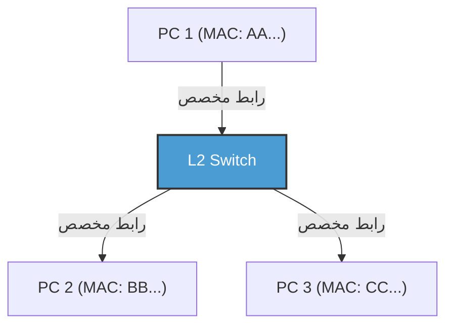

スイッチの導入により、各ノードとスイッチ間の配線は論理的にも物理的にも独立した（スター型トポロジー）。これにより、通信経路が分離されたため衝突（コリジョン）が原理的に発生しなくなった。結果として、送信用の線と受信用の線を同時に使う「全二重通信（Full-Duplex）」が可能となったのである。
مع إدخال المحولات (Switches)، أصبحت الأسلاك بين كل عقدة والمحول مستقلة منطقياً وفيزيائياً (طوبولوجيا النجمة أو Star topology). ونتيجة لذلك، تم فصل مسارات الاتصال، مما جعل الاصطدامات (Collisions) مستحيلة الحدوث من حيث المبدأ. ونتيجة لذلك، أصبح من الممكن استخدام خط للإرسال وخط للاستقبال في نفس الوقت، وهو ما يُعرف بـ "الاتصال المزدوج الكامل (Full-Duplex)".

現代のイーサネットにおいて、CSMA/CDアルゴリズムはもはや使われておらず、純粋なポイントツーポイントの全二重通信へと進化を遂げた。さらに、IEEE 802.1QによるVLAN（Virtual LAN）技術により、物理的な配線に縛られずに論理的なネットワークを柔軟に分割・統合できるようになり、エンタープライズや巨大データセンターのインフラを支える絶対的な基盤技術として君臨し続けている。
في الإيثرنت الحديث، لم تعد خوارزمية CSMA/CD مستخدمة، وتطورت إلى اتصالات مزدوجة كاملة نقية من نقطة إلى نقطة (Point-to-Point Full-Duplex). علاوة على ذلك، بفضل تقنية الشبكة المحلية الافتراضية (VLAN) المستندة إلى معيار IEEE 802.1Q، أصبح من الممكن تقسيم ودمج الشبكات المنطقية بمرونة دون التقيد بالأسلاك المادية، ولا يزال يتربع كتقنية أساسية مطلقة تدعم البنية التحتية للشركات ومراكز البيانات الضخمة.

### Wi-Fiのデータリンク層：見えない電波空間の交通整理
### طبقة ربط البيانات في Wi-Fi: تنظيم حركة المرور في فضاء موجات الراديو غير المرئي

有線のイーサネットが衝突のない全二重通信へと進化した一方で、無線のWi-Fiは、かつての共有バス型イーサネットと同じ「全員が同じ空間（空気）という単一のメディアを共有する」という困難な課題に直面している。
بينما تطور الإيثرنت السلكي إلى اتصالات مزدوجة كاملة خالية من الاصطدامات، يواجه Wi-Fi اللاسلكي التحدي الصعب نفسه الذي واجهه الإيثرنت من نوع الناقل المشترك في الماضي: "الجميع يتشاركون في وسط واحد هو نفس الفضاء (الهواء)".

無線通信では、送信中の自分の電波が強すぎるため、他人の微弱な電波を同時に受信して衝突を「検出（CD）」することが物理的に不可能である。また、「隠れ端末問題（Hidden Node Problem）」——例えば、アクセスポイントを挟んで両側にいる端末AとCは、互いの電波は届かないが、同時に送信するとアクセスポイント上で電波が衝突してしまう——という無線特有のリスクがある。
في الاتصالات اللاسلكية، نظراً لأن موجات الراديو الخاصة بك أثناء الإرسال قوية جداً، فمن المستحيل فيزيائياً استقبال موجات الراديو الضعيفة لشخص آخر في نفس الوقت من أجل "اكتشاف (CD)" الاصطدامات. وهناك أيضاً خطر فريد في اللاسلكي يُسمى "مشكلة العقدة المخفية (Hidden Node Problem)" ── على سبيل المثال، المحطتان A و C الموجودتان على جانبي نقطة الوصول (Access Point) لا تصل موجاتهما لبعضهما البعض، ولكن إذا قامتا بالإرسال في نفس الوقت، فستصطدم موجاتهما عند نقطة الوصول.

そこでWi-Fiのデータリンク層プロトコル（MAC層）では、「CSMA/CA（Carrier Sense Multiple Access with Collision Avoidance：衝突回避）」が採用されている。
لذلك، في بروتوكول طبقة ربط البيانات (طبقة MAC) الخاص بـ Wi-Fi، يتم تبني خوارزمية "CSMA/CA (Carrier Sense Multiple Access with Collision Avoidance: تجنب الاصطدام)".

CSMA/CAでは、送信前に一定時間（DIFS）空間の電波状況を傍受し、さらにランダムなバックオフ時間を待ってから送信を開始する。最も重要な違いは、有線にはなかった**ACK（Acknowledge：確認応答）**の仕組みである。Wi-Fiでは、データを受信した側は、正常に受け取れたことを示すACKフレームを即座（SIFSという極めて短い待ち時間の後）に送り返す。送信側は、このACKを受け取って初めて通信が成功したと判断する。もしACKが返ってこなければ、衝突や干渉でデータが壊れたと判断し、バックオフ時間を倍に増やして再送を試みる。
في CSMA/CA، قبل الإرسال، يتم اعتراض حالة موجات الراديو في الفضاء لفترة زمنية معينة (DIFS)، وينتظر وقتاً عشوائياً (Backoff time) قبل بدء الإرسال. الاختلاف الأكثر أهمية هو آلية **الـ ACK (Acknowledge: إقرار الاستلام)** التي لم تكن موجودة في الشبكات السلكية. في الـ Wi-Fi، يرسل الطرف المستلم البيانات على الفور (بعد وقت انتظار قصير جداً يُسمى SIFS) إطار ACK للرد للإشارة إلى الاستلام الناجح. يقرر المرسل أن الاتصال كان ناجحاً فقط بعد تلقي هذا الـ ACK. إذا لم يتم إرجاع ACK، فإنه يعتبر أن البيانات قد تلفت بسبب الاصطدام أو التداخل، ويضاعف وقت الانتظار العشوائي ويحاول إعادة الإرسال.

さらに隠れ端末問題を解決するため、「RTS/CTSハンドシェイク」という仕組みも存在する。大きなデータを送る前に、送信側がRTS（Request to Send：送信リクエスト）という短い制御フレームを送り、受信側（アクセスポイントなど）がCTS（Clear to Send：送信クリア）を返す。このCTSには「これから○○マイクロ秒間通信するから、周囲の端末は黙っていてくれ」という予約時間（NAV：Network Allocation Vector）の情報が含まれており、これを受け取った周囲の端末は通信を自粛する。このように、Wi-Fiのデータリンク層は、見えない電波空間における見事な交通整理を行っているのである。
علاوة على ذلك، لحل مشكلة العقدة المخفية، هناك أيضاً آلية تُسمى "مصافحة RTS/CTS (RTS/CTS Handshake)". قبل إرسال بيانات كبيرة، يرسل المرسل إطار تحكم قصير يُسمى RTS (Request to Send: طلب الإرسال)، ويرد المستلم (مثل نقطة الوصول) بـ CTS (Clear to Send: السماح بالإرسال). يتضمن هذا الـ CTS معلومات عن وقت الحجز (NAV: Network Allocation Vector) والذي يعني "سنتصل لمدة كذا ميكرو ثانية، لذا يرجى من الأجهزة المحيطة البقاء صامتة"، وتقوم الأجهزة المحيطة التي تتلقى هذا بتعليق اتصالها. بهذه الطريقة، تقوم طبقة ربط البيانات لـ Wi-Fi بتنظيم حركة المرور ببراعة في الفضاء الراديوي غير المرئي.

---

## 結び
## خاتمة

光子としてガラスの中を駆け抜け、深海の水圧に耐え、位相と振幅を変化させながら空間を飛び交う物理現象の世界。そして、そのノイジーで不確実な物理現象の上に、プリアンブルによる同期、MACアドレスによる個体識別、CRCによる厳密なエラー検出、そしてスイッチングやCSMA/CAによる洗練されたトラフィック制御を敷き詰めることで、初めて「隣の機器へ意味のあるデータの塊（フレーム）をエラーなく届ける」ことが可能になる。これが第1層と第2層が成し遂げている奇跡である。
عالم من الظواهر الفيزيائية حيث تندفع الفوتونات عبر الزجاج، وتتحمل ضغط المياه في أعماق البحار، وتطير عبر الفضاء وتغير من طورها (Phase) وسعتها (Amplitude). وفوق هذه الظواهر الفيزيائية الصاخبة وغير المؤكدة، ومن خلال وضع المزامنة عبر الديباجة (Preamble)، وتحديد الهوية عبر عنوان الـ MAC، والاكتشاف الصارم للأخطاء بواسطة CRC، والتحكم المتطور في حركة المرور من خلال التبديل (Switching) و CSMA/CA، يصبح من الممكن لأول مرة "توصيل كتلة ذات معنى من البيانات (إطار) إلى الجهاز المجاور دون أخطاء". هذه هي المعجزة التي تحققها الطبقة الأولى والثانية.

しかし、これだけでは世界中をつなぐインターネットにはなり得ない。MACアドレスによる通信は、あくまで同じスイッチやアクセスポイントに繋がった、あるいはルーターに遮られるまでの「同じネットワーク（ブロードキャストドメイン）」という狭い村の中でしか通用しないからだ。
ومع ذلك، لا يمكن أن يصبح هذا الإنترنت الذي يربط العالم بأكمله بحد ذاته. وذلك لأن الاتصال بواسطة عناوين الـ MAC صالح فقط داخل القرية الضيقة المتمثلة في "الشبكة نفسها (مجال البث أو Broadcast domain)" المتصلة بنفس المحول (Switch) أو نقطة الوصول (Access Point)، أو حتى يتم حظرها بواسطة جهاز توجيه (Router).

次章「第3章：ネットワーク層とIP」では、この無数のローカルな村同士を繋ぎ合わせ、地球の裏側にある未知のネットワークへパケットをバケツリレーのように届けるための壮大な経路探索の仕組み、すなわちIP（Internet Protocol）とルーティングの真髄に迫る。
في الفصل التالي، "الفصل الثالث: طبقة الشبكة وبروتوكول IP"، سنقترب من جوهر بروتوكول الإنترنت (IP) والتوجيه (Routing)، وهي الآلية الملحمية لاكتشاف المسارات والتي تربط هذه القرى المحلية التي لا حصر لها ببعضها البعض وتقدم الحزم (Packets) مثل سلسلة الدلاء إلى شبكات غير معروفة على الجانب الآخر من الأرض.

# 第3章：ネットワーク層とルーティングの仕組み —— 大海原を渡るパケットの航海図
# الفصل الثالث: طبقة الشبكة وآلية التوجيه (Routing) —— خريطة بحرية لحزم تعبر المحيطات

私たちが日常的に利用しているインターネットの根幹を成すのが、OSI参照モデルにおける第3層、すなわち「ネットワーク層」です。物理的なケーブルや電波による直接的な通信（データリンク層）を超え、数千キロ離れたサーバーと地球規模で通信できる背景には、無数に張り巡らされたルーターと、それらが自律的に情報を交換し合う壮大な経路制御（ルーティング）のメカニズムが存在します。
يشكل المستوى الثالث في نموذج OSI المرجعي، أي "طبقة الشبكة (Network Layer)"، الأساس للإنترنت الذي نستخدمه في حياتنا اليومية. وراء القدرة على الاتصال عالمياً بخوادم تبعد آلاف الكيلومترات، متجاوزين الاتصالات المباشرة عبر الكابلات المادية أو موجات الراديو (طبقة ربط البيانات)، توجد آلية توجيه (Routing) ملحمية حيث تتبادل أعداد لا تحصى من أجهزة التوجيه (Routers) المنتشرة المعلومات فيما بينها بشكل مستقل.

本章では、IP（Internet Protocol）の構造から、IPv4の限界とIPv6のアーキテクチャ、そして世界中の自律システム（AS）を結びつけるBGP（Border Gateway Protocol）の深淵まで、パケットが宛先へと到達するための「航海術」について、技術的・歴史的・物理的な視点から極限まで詳述します。
في هذا الفصل، سنفصل إلى أقصى حد ممكن من وجهات نظر تقنية وتاريخية ومادية حول "فن الملاحة" لوصول الحزم (Packets) إلى وجهتها، بدءاً من بنية بروتوكول الإنترنت (IP)، ومروراً بحدود IPv4 وبنية IPv6، وصولاً إلى أعماق بروتوكول BGP (Border Gateway Protocol) الذي يربط الأنظمة المستقلة (AS) في جميع أنحاء العالم.

## 3.1 ネットワーク層のパラダイム：エンド・ツー・エンドの原則
## 3.1 نموذج طبقة الشبكة: مبدأ من النهاية إلى النهاية (End-to-End Principle)

インターネットの設計思想における最大のブレイクスルーは、「ネットワークの中間ノード（ルーター）は単純なパケット転送のみに専念し、複雑な処理（エラー訂正や順序保証）は終端（エンドホスト）で行う」という**エンド・ツー・エンド（End-to-End）の原則**にあります。
يتمثل الاختراق الأكبر في فلسفة تصميم الإنترنت في **مبدأ من النهاية إلى النهاية (End-to-End Principle)**، والذي ينص على أن "العقد الوسيطة (أجهزة التوجيه) في الشبكة تُخصص فقط لإعادة توجيه الحزم البسيطة، بينما تتم المعالجة المعقدة (مثل تصحيح الأخطاء وضمان الترتيب) في الأطراف (End hosts)".

従来の電話網（回線交換方式）では、通信の開始から終了まで物理的な回線を占有し、ネットワーク全体で状態（ステート）を管理していました。これに対し、インターネット（パケット交換方式）のネットワーク層は「コネクションレス」であり、状態を持ちません。各パケットは独立した「手紙」として扱われ、ルーターはそれを受け取り、宛先を見て最適な次の中継地点（ネクストホップ）へ送り出す（フォワーディング）という単純作業を繰り返します。この「ダム・ネットワーク（Dumb Network）」と「スマート・ターミナル（Smart Terminal）」の組み合わせこそが、インターネットが爆発的にスケールし、多様なアプリケーションを受容できた最大の理由です。
في شبكات الهاتف التقليدية (طريقة تحويل الدارات أو Circuit switching)، كان يتم شغل خط مادي من بداية الاتصال إلى نهايته، وكانت حالة (State) الشبكة بأكملها تدار مركزياً. وعلى النقيض من ذلك، فإن طبقة الشبكة للإنترنت (طريقة تحويل الحزم أو Packet switching) هي "عديمة الاتصال (Connectionless)" ولا تحتفظ بحالة. تُعامل كل حزمة (Packet) كـ "رسالة" مستقلة، وتتكرر مهمة الموجه البسيطة وهي استلامها، والنظر إلى الوجهة، وإرسالها (إعادة توجيه أو Forwarding) إلى نقطة الترحيل التالية المثلى (القفزة التالية أو Next hop). هذا المزيج من "الشبكة الغبية (Dumb Network)" و "المحطة الذكية (Smart Terminal)" هو السبب الأكبر وراء التوسع الهائل للإنترنت وقدرته على استيعاب مجموعة متنوعة من التطبيقات.

## 3.2 インターネットの住所：IPアドレスの進化と枯渇の歴史
## 3.2 عناوين الإنترنت: تاريخ تطور ونفاذ عناوين الـ IP

ネットワーク上のすべての機器には、一意の識別子であるIPアドレスが付与されます。現在、インターネットは移行期にあり、二つの世代のIPプロトコルが混在しています。
يتم إعطاء جميع الأجهزة على الشبكة معرّفاً فريداً يُسمى عنوان الـ IP (IP Address). حالياً، يمر الإنترنت بفترة انتقالية، ويتواجد جيلان من بروتوكول IP معاً.

### IPv4：32ビットの空間と枯渇への抗い
### IPv4: مساحة 32 بت والمقاومة ضد النفاذ

1981年にRFC 791で定義されたIPv4は、32ビット（約43億個）の空間を持ちます。設計当初、43億という数字は途方もなく大きく感じられましたが、インターネットの爆発的な普及により、1990年代には早くも枯渇の危機が叫ばれ始めました。
يحتوي IPv4، الذي تم تعريفه في RFC 791 عام 1981، على مساحة 32 بت (حوالي 4.3 مليار عنوان). في بداية التصميم، بدا رقم 4.3 مليار هائلاً بشكل لا يصدق، ولكن مع الانتشار الهائل للإنترنت، بدأت أزمة النفاذ (Exhaustion) تلوح في الأفق في وقت مبكر من التسعينيات.

この危機を乗り越えるために生み出されたのが、**CIDR（Classless Inter-Domain Routing）**と**NAT（Network Address Translation）**です。
للتغلب على هذه الأزمة، تم ابتكار **CIDR (التوجيه غير الفئوي بين النطاقات)** و **NAT (ترجمة عنوان الشبكة)**.

初期のIPアドレス割り当ては、クラスA（/8）、クラスB（/16）、クラスC（/24）という大雑把な「クラスフル」方式で行われており、深刻なアドレスの浪費を招いていました。CIDRはこれを可変長サブネットマスク（VLSM）に置き換え、必要な分だけアドレスを割り当てる「クラスレス」なルーティングを実現しました。
كان تخصيص عناوين IP في البداية يتم باستخدام نظام تقريبي يُسمى "قائم على الفئة (Classful)"، حيث وُجدت فئات كـ A (/8) و B (/16) و C (/24)، مما أدى إلى إهدار خطير للعناوين. استبدل CIDR هذا بـ أقنعة الشبكة الفرعية متغيرة الطول (VLSM)، مما حقق توجيهاً "بدون فئات (Classless)" يخصص العناوين فقط بقدر الحاجة.

さらに、NATの登場により、プライベートIPv4アドレス空間と単一のグローバルIPv4アドレスを紐づけることで、一つのアドレスを数千台のデバイスで共有することが可能になりました。しかし、NATはエンド・ツー・エンドの原則を破壊し、P2P通信やリアルタイム通信において複雑なNAT越え（STUN/TURN/ICEなど）の技術を要求する結果となりました。
علاوة على ذلك، مع ظهور NAT، من خلال ربط مساحة عنوان IPv4 الخاص (Private) بعنوان IPv4 عام (Global) واحد، أصبح من الممكن مشاركة عنوان واحد بين آلاف الأجهزة. ومع ذلك، دمر NAT مبدأ من النهاية إلى النهاية (End-to-End)، مما أدى إلى الحاجة إلى تقنيات معقدة لاجتياز NAT (مثل STUN/TURN/ICE) في اتصالات الند للند (P2P) والاتصالات في الوقت الفعلي.

### IPv6：128ビットの無限空間と次世代のヘッダ構造
### IPv6: مساحة لا نهائية 128 بت وبنية ترويسة من الجيل التالي

アドレス枯渇の根本的解決策として1998年にRFC 2460で策定されたのが**IPv6**です。IPv6は128ビットのアドレス空間を持ち、$2^{128}$（約340澗）個という、地球上のすべての砂粒にアドレスを割り当てても余るほどの広大な空間を提供します。
كحل جذري لنفاذ العناوين، تم صياغة **IPv6** في RFC 2460 في عام 1998. يمتلك IPv6 مساحة عنوان 128 بت، ويوفر مساحة شاسعة تبلغ $2^{128}$ (حوالي 340 أندسليون) عنوان، وهو ما يكفي لتخصيص عنوان لكل حبة رمل على وجه الأرض مع بقاء فائض.

IPv6の革新性はアドレスの長さだけではありません。ヘッダ構造の劇的な簡素化が行われました。IPv4ヘッダにあった可変長オプションやヘッダチェックサムは廃止され、基本ヘッダは40バイトに固定されました。これにより、ハードウェア（ASICやTCAM）でのパケット処理（ルーティング）が高速化されています。また、フラグメンテーション（パケットの分割）は中間ルーターでは行われず、送信元ホストのみが行う仕様に変更され、ルーターの負荷が大きく軽減されました。
لا تقتصر الابتكارات في IPv6 على طول العنوان فقط. فقد تم تبسيط بنية الترويسة بشكل جذري. تم إلغاء الخيارات متغيرة الطول ومجموع التحقق للترويسة (Header Checksum) التي كانت موجودة في ترويسة IPv4، وتم تثبيت الترويسة الأساسية عند 40 بايت. أدى ذلك إلى تسريع معالجة الحزم (التوجيه) على الأجهزة (ASIC و TCAM). كما تم تغيير المواصفات بحيث لم يعد يتم إجراء التجزئة (Fragmentation، تجزئة الحزم) في أجهزة التوجيه الوسيطة، بل يقوم بها المضيف المصدر (Source host) فقط، مما قلل العبء على أجهزة التوجيه بشكل كبير.

## 3.3 ルーティングの二面性：コントロールプレーンとデータプレーン
## 3.3 طبيعة التوجيه المزدوجة: مستوى التحكم (Control Plane) ومستوى البيانات (Data Plane)

ルーターの内部は、大きく二つの「プレーン（平面）」に分かれています。
ينقسم الجزء الداخلي لجهاز التوجيه بشكل عام إلى "مستويين (Planes)":

1. **コントロールプレーン（制御平面）**
   ルーター同士がルーティングプロトコル（OSPFやBGPなど）を用いて通信し合い、ネットワークのトポロジー（接続形態）を学習し、最適な経路を計算する頭脳部分です。計算結果はRIB（Routing Information Base）というデータベースに格納されます。
1. **مستوى التحكم (Control Plane)**
   هذا هو جزء الدماغ حيث تتواصل أجهزة التوجيه مع بعضها البعض باستخدام بروتوكولات التوجيه (مثل OSPF و BGP)، وتتعلم طوبولوجيا الشبكة (بنية الاتصال)، وتحسب المسارات المثلى. يتم تخزين نتائج الحساب في قاعدة بيانات تُسمى RIB (Routing Information Base أو قاعدة معلومات التوجيه).
2. **データプレーン（転送平面）**
   実際にパケットを受信し、宛先IPアドレスを元に次にパケットを送り出すインターフェースを決定し、転送する筋肉部分です。RIBから生成されたFIB（Forwarding Information Base）と呼ばれる転送に特化したテーブルを用い、TCAM（Ternary Content-Addressable Memory）などの特殊なメモリを使用して、ナノ秒単位のハードウェア・ワイヤースピードでパケットを転送します。
2. **مستوى البيانات (Data Plane)**
   هذا هو جزء العضلات الذي يستقبل الحزم فعلياً، وبناءً على عنوان الـ IP الوجهة، يحدد الواجهة (Interface) التي سيرسل الحزمة إليها بعد ذلك وينفذ إعادة التوجيه. يستخدم جدولاً مخصصاً لإعادة التوجيه يُسمى FIB (Forwarding Information Base أو قاعدة معلومات إعادة التوجيه) يتم إنشاؤه من الـ RIB، ويستخدم ذاكرة خاصة مثل TCAM (Ternary Content-Addressable Memory) لإعادة توجيه الحزم بسرعة الأسلاك للأجهزة (Hardware Wire-Speed) بوحدة النانو ثانية.

## 3.4 ネットワークの内部統治：IGPと自律システム（AS）
## 3.4 الإدارة الداخلية للشبكة: IGP والأنظمة المستقلة (AS)

インターネットは単一の巨大なネットワークではなく、ISP（インターネットサービスプロバイダ）、企業、大学などがそれぞれ管理する独立したネットワークの集合体です。この独立した管理領域を**AS（Autonomous System：自律システム）**と呼びます。現在、世界中には約10万以上のASが存在します。
الإنترنت ليس شبكة عملاقة واحدة، بل هو مجموعة من الشبكات المستقلة التي تديرها جهات مثل مزودي خدمة الإنترنت (ISP)، والشركات، والجامعات، كل على حدة. يُسمى هذا النطاق الإداري المستقل بـ **AS (Autonomous System: نظام مستقل)**. حالياً، يوجد أكثر من 100,000 نظام مستقل في جميع أنحاء العالم.

ASの内部（企業内やISPのバックボーン内）のルーティングには、**IGP（Interior Gateway Protocol）**が使用されます。代表的なIGPには以下の二つがあります。
يتم استخدام **IGP (Interior Gateway Protocol أو بروتوكول البوابة الداخلية)** للتوجيه داخل الـ AS (مثل شبكة داخلية لشركة أو العمود الفقري لـ ISP). فيما يلي اثنان من بروتوكولات IGP التمثيلية:

- **OSPF（Open Shortest Path First） / IS-IS**
  これらは「リンクステート型」のルーティングプロトコルです。ルーターは自身の周囲の接続状態（リンクの帯域幅や状態）をネットワーク全体にフラッディングし、各ルーターがネットワーク全体の完全な地図（トポロジーデータベース）を構築します。その地図上で、ダイクストラ法（最短経路アルゴリズム）を実行し、目的地までの「コスト」が最小となる経路を計算します。これは、カーナビが渋滞情報を加味して最短ルートを計算するのと物理的・数学的に同じアプローチです。
- **OSPF (Open Shortest Path First) / IS-IS**
  هذه بروتوكولات توجيه "تعتمد على حالة الرابط (Link-State)". تقوم أجهزة التوجيه ببث (Flooding) حالة الاتصال المحيطة بها (مثل عرض النطاق الترددي للرابط وحالته) إلى الشبكة بأكملها، وتقوم كل أجهزة التوجيه ببناء خريطة كاملة (قاعدة بيانات الطوبولوجيا) للشبكة بأكملها. على تلك الخريطة، تقوم بتشغيل خوارزمية ديكسترا (Dijkstra's Algorithm - خوارزمية المسار الأقصر) لحساب المسار ذي "التكلفة (Cost)" الأقل إلى الوجهة. وهذا النهج هو نفس النهج الفيزيائي والرياضي الذي تستخدمه أنظمة الملاحة في السيارات لحساب أقصر طريق مع الأخذ في الاعتبار معلومات الازدحام المروري.
## 3.5 BGP: بروتوكول "الدبلوماسية" الذي ينسج الإنترنت

بينما تُحكم الأنظمة المستقلة (AS) من الداخل بواسطة OSPF وما شابهه، فإن ما يربط بين أنظمة AS وبعضها لتشكيل الإنترنت العالمي هو المعيار الواقعي الوحيد لـ **EGP (بروتوكول البوابة الخارجية - Exterior Gateway Protocol)**، ألا وهو **BGP (بروتوكول بوابة الحدود - Border Gateway Protocol)**. يعتبر BGP بروتوكولاً فريداً للغاية، حيث لا يحدد المسار بناءً على المسافة التقنية الأقصر فحسب، بل يعكس أيضاً "العلاقات التجارية" و"السياسات بين الدول".

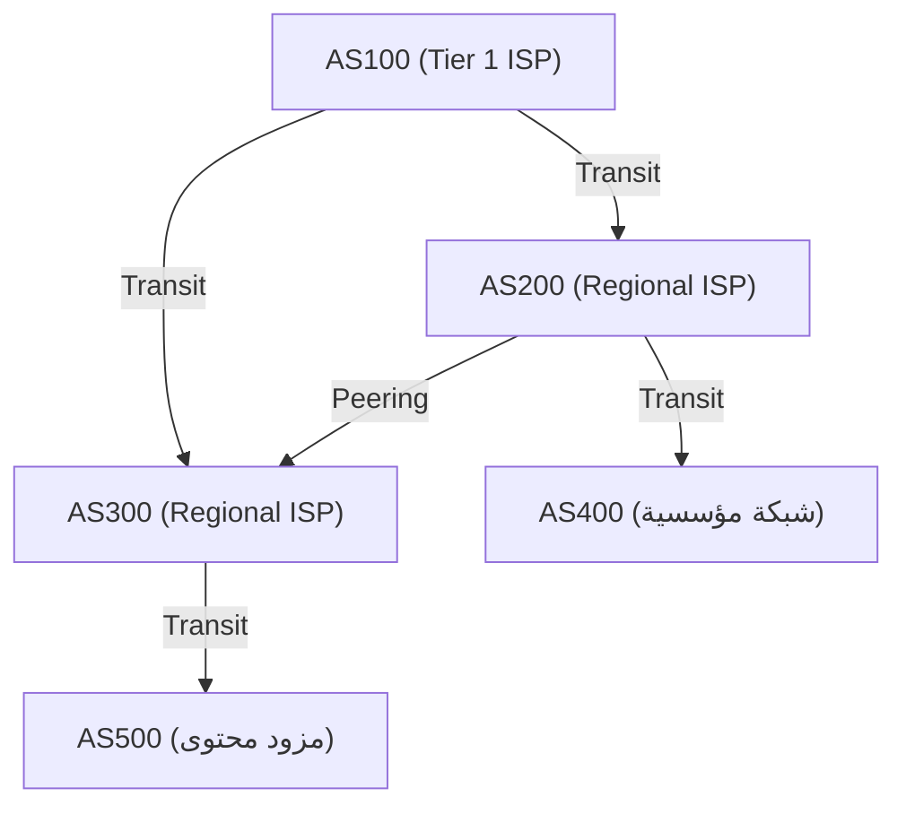

### التناظر (Peering) والعبور (Transit): اقتصاديات الإنترنت

توجد نماذج أعمال رئيسية اثنان للاتصال بين أنظمة AS باستخدام BGP:

1. **العبور (Transit)**
   هي علاقة تقوم فيها شركات مزودي خدمة الإنترنت (ISP) الصغيرة أو المؤسسات بدفع رسوم اتصالات لشركات ISP العملاقة، مقابل تزويدها بإمكانية الوصول (مسار كامل - Full Route) إلى جميع المواقع على الإنترنت. وتعد هذه العلاقة علاقة تبعية بين "عميل" و"مزود".
2. **التناظر (Peering)**
   هي علاقة يتم فيها الاتصال المباشر بين شبكات مزودي خدمة الإنترنت (ISP) ببعضها البعض، أو بين ISP ومزودي المحتوى (مثل Google وNetflix)، وذلك عبر نقاط تبادل الإنترنت (IX - Internet Exchange) أو ما شابه. تتم هذه العملية عادةً مجاناً (بدون تسويات مالية - Settlement-free)، وتهدف إلى اختصار مسار حركة المرور وتقليل التكاليف.

### متجه المسار (Path Vector) وخوارزمية اختيار المسار في BGP

يعتبر BGP بروتوكولاً من نوع "متجه المسار" (Path Vector). وهو يحتفظ بمعلومات حول أنظمة AS التي مر بها (AS_PATH) كسمة للوصول إلى شبكة IP معينة. على سبيل المثال، إذا كانت معلومات المسار تحتوي على `AS_PATH: [200, 100, 500]`، فإن الحزم ستمر عبر أنظمة AS بهذا الترتيب. من خلال ذلك، يتم منع حلقات التوجيه (Routing Loops) بشكل موثوق.

عندما تتلقى أجهزة توجيه BGP مسارات متعددة لنفس الوجهة، فإنها تختار مساراً واحداً فقط كأفضل مسار بناءً على تسلسل هرمي معقد للأولويات (مثل Local Preference، طول AS_PATH، MED، التمييز بين eBGP/iBGP، وما إلى ذلك). وتعتبر سمة **الأفضلية المحلية (Local Preference)** قوية بشكل خاص، حيث يمكنها إجبار جهاز التوجيه على اتباع سياسات تجارية مثل: "حتى لو كان المسار تقنياً أطول، فسنعطيه الأولوية لأن المرور عبر خط التناظر (Peering) يوفر تكاليف العبور (Transit)".

### اختطاف BGP (BGP Hijacking) ونقاط الضعف في التوجيه

صُمم بروتوكول BGP في الأصل بناءً على "افتراض حسن النية". وبما أنه يثق بأن "معلومات التوجيه التي يعلنها الآخرون صحيحة"، فإذا قام نظام AS ذو نوايا خبيثة أو بسبب خطأ في الإعداد بإرسال تحديث BGP خاطئ يقول فيه: "لدي أفضل مسار لشبكة Google (8.8.8.8/32)"، فسيحدث ما يُعرف بـ **اختطاف BGP (BGP Hijacking)**، حيث يتم سحب حركة المرور من جميع أنحاء العالم نحو ذلك النظام.
على مر التاريخ، لا حصر للحوادث الكبرى التي استغلت نقاط الضعف في BGP، مثل الحادث الذي تسبب فيه حظر الحكومة الباكستانية لموقع YouTube في تعطل YouTube في جميع أنحاء العالم (عام 2008). في الوقت الحاضر، يتم العمل على إدخال آليات للتحقق من معلومات التوجيه باستخدام تقنيات التشفير، مثل البنية التحتية للمفاتيح العامة للموارد (RPKI - Resource Public Key Infrastructure).

## 3.6 المعركة بين القيود الفيزيائية وأجهزة التوجيه: زمن الوصول (Latency) وتضخم المخزن المؤقت (Bufferbloat)

دائماً ما يكون التوجيه في طبقة الشبكة صراعاً مع قيود الفيزياء.
تبلغ سرعة انتقال الضوء داخل الألياف الضوئية حوالي 67% من سرعة الضوء في الفراغ (حوالي 200 ألف كم/ثانية)، مما يعني أن هناك تأخيراً فيزيائياً حتمياً (تأخير الانتشار - Propagation Delay) يتراوح بين 100 إلى 120 مللي ثانية للرحلة ذهاباً وإياباً (RTT) من اليابان إلى الساحل الغربي للولايات المتحدة.

بالإضافة إلى ذلك، هناك تأخير في المعالجة في كل جهاز توجيه، وكذلك **تأخير الاصطفاف (Queueing Delay)**. أثناء ازدحام الشبكة، تقوم أجهزة التوجيه بتخزين الحزم مؤقتاً في الذاكرة (المخزن المؤقت - Buffer). ونظراً لأن أجهزة التوجيه الحديثة مجهزة بذاكرة كبيرة السعة، فقد تحدث ظاهرة حيث تستمر في امتصاص الازدحام المطول دون إسقاط الحزم. هذا ما يُعرف بـ **تضخم المخزن المؤقت (Bufferbloat)**. يؤدي تراكم عدد كبير من الحزم في المخزن المؤقت لفترات طويلة إلى عدم عمل آليات التحكم في الازدحام للطبقات العليا مثل TCP بشكل صحيح، مما يؤدي في النهاية إلى تأخيرات هائلة (تصل إلى آلاف المللي ثانية). لحل هذه المشكلة، يتم تنفيذ خوارزميات إدارة طوابير متقدمة مثل AQM (الإدارة النشطة للطوابير - Active Queue Management) و FQ-CoDel في أجهزة التوجيه وأنظمة التشغيل الحديثة.

## الخلاصة

الطبقة الثالثة - طبقة الشبكة، ليست مجرد ناقل للبيانات. بل هي متشابكة ومعقدة، حيث تشمل التحول التاريخي من IPv4 إلى IPv6، والمعالجة العتادية بسرعة النانو ثانية باستخدام TCAM، والبحث الرياضي عن أقصر مسار بواسطة OSPF، والتحكم الموزع والمستقل في التوجيه عبر BGP الذي يحمل أبعاداً اقتصادية وسياسية.
حتى تصل حزمة IP واحدة من هاتفك الذكي إلى خادم في الجانب الآخر من الكرة الأرضية، هناك عمل لأكبر وأعقد نظام بناه البشر، حيث يقوم عدد لا يحصى من أجهزة التوجيه بالرجوع فوراً إلى خرائطها الخاصة (جداول التوجيه - Routing Tables) وتمرير الحزمة كعصا التتابع (Relay Baton).

في الفصل التالي، سنشرح آليات "طبقة النقل (Transport Layer - TCP/UDP)" التي يتم بناؤها فوق طبقة الشبكة هذه، وتتولى مسؤولية ضمان وصول الحزم والتحكم في الازدحام.

# الفصل الرابع: الموثوقية والسرعة في طبقة النقل —— المعضلة المطلقة التي تدعم نقل المعلومات

## 1. مقدمة: مبدأ من الطرف إلى الطرف (End-to-End Principle) ومهمة طبقة النقل

كانت المهمة الرئيسية لطبقة الشبكة (IP) التي تناولناها في الفصول السابقة هي إيصال الحزم فعلياً ومنطقياً إلى "الكمبيوتر الوجهة (واجهة الشبكة للمضيف)" عبر بحر الشبكات الواسع المعروف بالإنترنت. ولكن، وصول الحزم إلى المضيف الوجهة لا ينهي عملية الاتصال. فالأنظمة الحاسوبية الحديثة تقوم بتشغيل العديد من عمليات التطبيقات بشكل متزامن كمهام متعددة (Multitasking) على نظام التشغيل (مثل متصفحات الويب، عملاء البريد الإلكتروني، تطبيقات بث الفيديو، عمليات المزامنة في الخلفية، خدمات API، إلخ).

من بين كومة الحزم التي تصعد تباعاً وبشكل غير منظم من طبقة IP، فإن تحديد أي حزمة تنتمي إلى أي تطبيق، وإعادة بناءها كتدفق بيانات (Data Stream) ذي معنى، أو تعويض أي نقص فيها، هو السلطة الكاملة لإدارة البيانات النهائية عند نقطة النهاية (Endpoint)، والتي تتولاها "طبقة النقل (Transport Layer)".

في صميم فلسفة تصميم الإنترنت، يكمن قرار معماري جميل وقوي للغاية وهو "مبدأ من الطرف إلى الطرف (End-to-End Principle)". هذا المفهوم اقترحه جيروم سالتزر وآخرون في عام 1981، وينص على أن "العقد الوسيطة في الشبكة (أجهزة التوجيه والمحولات) يجب أن تتخصص قدر الإمكان في إعادة توجيه الحزم بشكل بسيط (الشبكة الغبية - Dumb Network)، في حين يجب تفويض العمليات المعقدة مثل استعادة الأخطاء، والتحكم في التسلسل، والتشفير إلى المضيفين في نهايات الاتصال (النقاط النهائية الذكية - Smart Endpoints)". لو تم تزويد الأجهزة الوسيطة في الشبكة بوظائف معقدة لإدارة الحالة أو تصحيح الأخطاء، لما تمكن الإنترنت أبداً من تحقيق قابلية التوسع الهائلة على المستوى العالمي التي يتمتع بها اليوم.

تواجه طبقة النقل دائماً معضلة أساسية بين القيود الفيزيائية ونظرية المعلومات، ألا وهي المقايضة بين "الموثوقية (Reliability)" و"السرعة / زمن الوصول المنخفض (Speed / Low Latency)". لتسليم المعلومات دون فقدان أي منها، يلزم وجود عبء إضافي (Overhead) للتأكيد وإعادة الإرسال، وهو ما يؤدي إلى تأخير يقترن بالحد الفيزيائي لسرعة الضوء. من ناحية أخرى، إذا أردنا تقليل التأخير إلى الحد الأدنى، فسيتعين علينا التضحية بجزء من سلامة المعلومات. بناءً على كيفية حل هذه المعضلة المتجذرة في قوانين الفيزياء، ونوع التجريد (Abstraction) المقدم للتطبيقات، تم تصميم وتطوير بروتوكولات مختلفة مثل TCP، و UDP، وبروتوكول QUIC الحديث.

## 2. بروتوكول التحكم بالإرسال (TCP - Transmission Control Protocol): آلية قوية لضمان الموثوقية

تم إرساء أسس بروتوكول TCP في السبعينيات، قبل تحول الإنترنت للاستخدام التجاري عندما كان لا يزال يُعرف باسم ARPANET، وذلك بواسطة فينتون سيرف (Vinton Cerf) وروبرت كان (Robert Kahn). فلسفته التصميمية واضحة للغاية: "ضمان وصول البيانات إلى تطبيق الطرف الآخر دون أي نقص، وبالترتيب الصحيح، وبدون تكرار، حتى في أسوأ بيئات الشبكات أو الخطوط غير المستقرة التي تتكرر فيها حالات فقدان الحزم (Packet Loss)". يوفر TCP لمطوري التطبيقات تجريداً قوياً يتيح لهم، طالما أنهم يستخدمونه، قراءة وكتابة البيانات ببساطة كـ "تدفق مستمر من البايتات (Byte Stream)"، دون الحاجة إلى القلق مطلقاً بشأن تعقيد الشبكة الكامنة وراءه أو فقدان الحزم.

### الإرسال المتعدد (Multiplexing) عبر أرقام المنافذ (Port Numbers)

إذا كان عنوان IP يمثل عنواناً يشير إلى "أي مبنى على وجه الأرض"، فإن "رقم المنفذ (Port Number)" في طبقة النقل يعادل النافذة المنطقية التي تشير إلى "أي غرفة (أي عملية) داخل ذلك المبنى". يتم تمثيل رقم المنفذ كعدد صحيح غير بإشارة بحجم 16 بت، وتتراوح قيمه بين 0 و 65535.
يتيح ذلك إجراء الآلاف أو حتى عشرات الآلاف من الاتصالات المختلفة في وقت واحد وبشكل متعدد (Multiplex) عبر عنوان IP واحد وواجهة شبكة فعلية واحدة. على سبيل المثال، تم تعيين أرقام مسبقة للخدمات الرئيسية تُعرف بـ "المنافذ المعروفة (Well-Known Ports)"، مثل المنفذ 80 لـ HTTP، و 443 لـ HTTPS، و 22 لـ SSH.

### المصافحة الثلاثية (3-Way Handshake): تأسيس الثقة والتأخير الفيزيائي

قبل بدء الاتصال، يقوم TCP دائماً بإجراء طقوس لإنشاء "اتصال (Connection)" منطقي بين المرسل والمستقبل. وهذا ما يُعرف بـ "المصافحة الثلاثية (3-Way Handshake)". لا يقتصر هذا الإجراء على تأكيد نية الاتصال فحسب، بل له معنى بالغ الأهمية يتمثل في مزامنة (Synchronization) فضاء الحالة (State Space) استعداداً للتبادل الهائل للبيانات الذي سيبدأ.

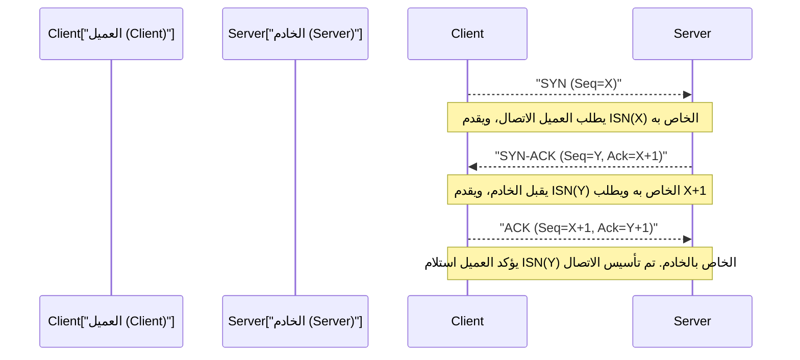

1. **SYN (مزامنة - Synchronize):** يقوم العميل بإرسال حزمة طلب مزامنة (مقطع TCP مع تعيين علامة SYN) إلى الخادم. في هذه الأثناء، يقدم "رقم تسلسل أولي (ISN: Initial Sequence Number، ولنفترض هنا أنه X)" مكوناً من 32 بتاً ويتم إنشاؤه عشوائياً. هناك سبب لعدم بدء ISN من الصفر أو بقيمة ثابتة؛ وذلك لمنع الخلط بين "الحزم القديمة التي تاهت في الشبكة ووصلت متأخرة (Ghost Packets)" من اتصالات سابقة تم إنشاؤها وقطعها بين نفس عنوان IP والمنفذ، وبين حزم الاتصال الجديد، بالإضافة إلى دلالات تشفيرية لمنع هجمات توقع تسلسل TCP (انتحال IP - IP Spoofing) التي قد يقوم فيها المهاجمون بتخمين رقم التسلسل وإدخال بيانات مزيفة.
2. **SYN-ACK:** عندما يقبل الخادم طلب الاتصال، فإنه يعيد القيمة المكونة من إضافة 1 إلى ISN الخاص بالعميل (X+1) كـ "رقم تأكيد الاستجابة (Acknowledgment Number)"، ويقوم في الوقت نفسه بإرجاع حزمة SYN-ACK مرفقة برقم التسلسل الأولي العشوائي الخاص به (Y).
3. **ACK (تأكيد - Acknowledgment):** يقوم العميل بإرسال حزمة ACK برقم تأكيد استجابة يساوي Y+1، كدليل على أنه تلقى ISN الخاص بالخادم بشكل صحيح.

بمجرد اكتمال تبادل الحزم الثلاث هذه، يتم حجز حالة الاتصال ثنائي الاتجاه في الذاكرة، ويصبح جاهزاً لنقل البيانات. ومع ذلك، فإن هذه العملية الصارمة تخضع للقيود الفيزيائية الثقيلة للبنية التحتية للاتصالات، وهي "سرعة الضوء".
تبلغ سرعة الضوء في الفراغ حوالي 300 ألف كم/ثانية، ولكن بسبب معامل الانكسار لنواة الألياف الضوئية (زجاج الكوارتز) التي تشكل العمود الفقري الرئيسي للإنترنت، تنخفض سرعة انتشار الإشارة الضوئية إلى حوالي الثلثين (حوالي 200 ألف كم/ثانية). وعلاوة على ذلك، يُضاف تأخير الاصطفاف (Queueing) الناتج عن عمليات التوجيه والتبديل في أجهزة التوجيه الوسيطة. ونتيجة لذلك، على سبيل المثال، يتطلب الوقت لرحلة واحدة ذهاباً وإياباً (1 RTT: Round Trip Time) بين طوكيو ونيويورك (مسافة خط مستقيم تبلغ حوالي 11,000 كم، بينما طول الكابل الفعلي أكبر من ذلك) حوالي 150 إلى 200 مللي ثانية فيزيائياً بلا مفر. تستهلك المصافحة الثلاثية لـ TCP ما لا يقل عن 1 RTT، ولذلك، بغض النظر عن مدى توسيع النطاق الترددي (Bandwidth)، فإن زمن الوصول (Latency) عند تأسيس الاتصال يظل مقيداً بالقانون المطلق للكون وهو سرعة الضوء.

### النافذة المنزلقة (Sliding Window)، التحكم في التسلسل، والمجموع الاختباري (Checksum)

عند الدخول في مرحلة نقل البيانات، يقوم TCP بتقسيم تدفق البايتات الذي تلقاه من التطبيق إلى مقاطع (Segments) بحجم مناسب (MSS: الحد الأقصى لحجم المقطع - Maximum Segment Size، وعادة ما يكون حوالي 1460 بايت وهو ناتج طرح حجم الرأس من MTU لـ IP) وإرسالها. يُخصص لكل مقطع رقم تسلسل يتوافق مع عدد بايتات البيانات، وبناءً عليه، حتى إذا وصلت الحزم بترتيب مختلف (Out of Order)، يمكن للمستقبل إعادة ترتيب البيانات الأصلية بالتسلسل الصحيح.
بالإضافة إلى ذلك، يتضمن رأس TCP "مجموعاً اختبارياً (Checksum)" بحجم 16 بتاً، ويُستخدم للتحقق بدقة باستخدام عملية جمع المكمل للأول (1's complement sum) مما إذا كانت البيانات قد تعرضت لعكس في البتات (تلف) بسبب الضوضاء الكهربائية في مسار النقل أو أخطاء الذاكرة في أجهزة التوجيه وغيرها.

إذا فُقدت الحزم في الطريق (Packet Loss) أو تم التخلص منها بسبب تلفها، فإن المستقبل إما يستمر في إرجاع ACK برقم التسلسل المتوقع (Duplicate ACK - ACK متكرر) أو لا يعيد شيئاً. وإذا لم يتلق المرسل ACK بعد فترة زمنية معينة (RTO: مهلة إعادة الإرسال - Retransmission Timeout) أو اكتشف ACK متكرراً، فإنه يقوم بـ "إعادة إرسال (Retransmit)" تلك الحزمة.

المفهوم الذي يرفع سرعة الاتصال بشكل كبير في هذه الآلية هو "النافذة المنزلقة (Sliding Window)". في طريقة "إرسال حزمة واحدة والانتظار حتى استلام ACK الخاص بها قبل إرسال الحزمة التالية (Stop-and-Wait)"، ستنخفض الإنتاجية (Throughput) بشكل بائس في البيئات ذات زمن الوصول العالي (RTT كبير) المذكورة سابقاً.
في طريقة النافذة المنزلقة، يتفق المرسل والمستقبل ديناميكياً على "حجم النافذة (أقصى عدد من البايتات للبيانات غير المؤكدة التي يمكن إرسالها دفعة واحدة)" مع الأخذ في الاعتبار سعة المخزن المؤقت لكل منهما. يمكن للمرسل إرسال الحزم تباعاً وبشكل مستمر إلى الشبكة ضمن حدود حجم هذه النافذة دون انتظار ACK من المستقبل. ومع استلام كل ACK، تنزلق نافذة الإرسال المسموح بها للأمام. وبذلك يتم تحقيق آلية الاستفادة القصوى من النطاق الترددي المتمثلة في "إبقاء الأنبوب مليئاً بالبيانات" في الشبكات ذات الخطوط العريضة والتأخير العالي (BDP: منتج النطاق الترددي والتأخير - Bandwidth-Delay Product الكبير).

### التحكم في الازدحام (Congestion Control): التناغم الرياضي لمنع انهيار الشبكة

يعتبر "التحكم في الازدحام (Congestion Control)" هو التحفة الفنية الحقيقية لبروتوكول TCP، ويمكن القول إنه أحد أهم الاختراقات التقنية في تاريخ الإنترنت.

في عام 1986، واجه الإنترنت في بداياته (NSFNET) عطلاً مميتاً في النظام سُمي بـ "انهيار الازدحام (Congestion Collapse)" بسبب زيادة حجم الاتصالات. ونتيجة لتدفق بيانات تتجاوز قدرة معالجة الشبكة، فاضت طوابير (ذاكرة التخزين المؤقت) أجهزة التوجيه، وتم التخلص من كميات هائلة من الحزم. وعند اكتشاف فقدان الحزم، اعتبرت نقاط نهاية TCP أن البيانات لم تصل وقامت جميعها بـ "إعادة الإرسال" في نفس الوقت. أدى هذا إلى تدفق المزيد من البيانات إلى الشبكة، مما زاد من إرهاق أجهزة التوجيه، ووقع النظام في حلقة مفرغة كارثية هبطت فيها الإنتاجية الفعلية إلى جزء من بضعة آلاف مما كانت عليه.

لمنع موت الشبكة هذا، قام فان جاكوبسون (Van Jacobson) وآخرون في عام 1988 بإدخال خوارزمية تحكم ديناميكية متقدمة في TCP. ويشكل التحكم في نافذة الازدحام (cwnd: Congestion Window) بناءً على مبدأ "AIMD (الزيادة المضافة والنقصان المضاعف - Additive Increase Multiplicative Decrease)" جوهر هذه الخوارزمية.

1. **البداية البطيئة (Slow Start):** مباشرة بعد بدء الاتصال، تكون السعة المتاحة للشبكة غير معروفة تماماً. لذلك، يتم البدء بحجم نافذة إرسال صغير جداً (تاريخياً 1 MSS، وفي الوقت الحاضر حوالي 10 MSS)، وتتم زيادة حجم النافذة بمقدار 1 MSS لكل ACK يتم استلامه. يؤدي هذا إلى زيادة أسية (Exponential Increase) حيث "يتضاعف حجم النافذة كل 1 RTT". وعلى النقيض من اسمها "البطيء"، فهذه المرحلة تستكشف الحد الأقصى للنطاق الترددي بشكل هجومي للغاية وفي فترة زمنية قصيرة.
2. **تجنب الازدحام (Congestion Avoidance):** عندما يصل حجم النافذة إلى عتبة محددة مسبقاً (ssthresh: عتبة البداية البطيئة - Slow Start Threshold)، تتوقف الزيادة الأسية، ويتم التحول إلى زيادة خطية (إضافة 1 MSS لكل 1 RTT). وهذه هي المرحلة التي يتم فيها استكشاف سعة الشبكة القصوى (سمك الأنبوب) بحذر أكبر.
3. **اكتشاف فقدان الحزم والنقصان المضاعف:** يفسر TCP فقدان الحزم (حدوث مهلة، أو استلام ACK متكرر 3 مرات متتالية من المستقبل) ليس كمجرد خطأ في النقل، بل كـ "علامة على حدوث ازدحام في مسار الشبكة وفيضان الحزم من المخزن المؤقت لجهاز التوجيه". في هذه اللحظة، يُفعّل TCP التحكم الذاتي على الفور، ويقلل حجم نافذة الإرسال بشكل حاد إلى النصف (أو إلى القيمة الأولية للبداية البطيئة) دفعة واحدة.

من خلال خوارزمية التوزيع الرياضية والإيثارية هذه المتمثلة في "مشاركة النطاق الترددي تدريجياً (الزيادة المضافة) والتنازل عنه دفعة واحدة عند حدوث مشكلة (النقصان المضاعف)"، تحافظ مئات الملايين أو المليارات من اتصالات TCP المستقلة على الإنترنت على انسجام إعجازي (Homeostasis) يتمثل في "التقسيم العادل للنطاق الترددي" و"التشغيل المستقر للشبكة ككل"، بالرغم من عدم وجود مدير مركزي لحركة المرور.

في السنوات الأخيرة، أدى تزايد سعة الذاكرة المؤقتة لأجهزة التوجيه إلى نتيجة عكسية، حيث أصبحت مشكلة جديدة لظاهرة فيزيائية تُعرف بـ "تضخم المخزن المؤقت (Bufferbloat)" تبرز، وفيها تستمر الحزم في التراكم داخل طوابير طويلة حتى تحدث عملية التخلص من الحزم بسبب الازدحام، مما يؤدي إلى قفزة في زمن الوصول (قيمة Ping) تصل إلى مئات المللي ثانية أو بضع ثوانٍ. ولمعالجة ذلك، تم تطوير خوارزميات حديثة للتحكم في الازدحام بواسطة Google وآخرين، مثل BBR (Bottleneck Bandwidth and Round-trip propagation time)، التي تكتشف "زيادة RTT (وقت التأخير)" بدلاً من فقدان الحزم كعلامة على الازدحام، وتبطئ بنشاط سرعة الإرسال قبل أن يفيض المخزن المؤقت، وتصبح هذه الخوارزميات هي المعيار الحديث لـ TCP.

## 3. بروتوكول بيانات المستخدم (UDP - User Datagram Protocol): التجريد من أجل السرعة

إذا كان TCP هو "المدير المفرط في الحماية" الذي يضمن موثوقية البيانات التامة من خلال انتقالات حالة معقدة وخوارزميات متقدمة، فإن UDP، الذي ينتمي إلى نفس طبقة النقل، هو "الناقل البسيط (Minimalist)" الذي تم تجريد دوره كبروتوكول إلى أقصى حد. صُمم UDP بواسطة جون بوستيل (Jon Postel) في عام 1980، وهو لا يمتلك سوى الحد الأدنى من الوظائف كطبقة نقل.

يبلغ حجم رأس UDP 8 بايتات فقط (عادة ما يكون رأس TCP 20 بايت، وقد يصل إلى 60 بايت بما في ذلك الخيارات). لا يحتوي هذا الرأس إلا على "رقم منفذ المصدر"، "رقم منفذ الوجهة"، "طول البيانات"، و"مجموع اختباري" بسيط لاكتشاف تلف البيانات.

لا يتضمن UDP على الإطلاق تأسيساً مسبقاً للاتصال من خلال المصافحة الثلاثية، ولا ضماناً للتسلسل عبر أرقام التسلسل، ولا تحكماً في التدفق باستخدام النافذة المنزلقة، ولا عمليات إعادة الإرسال، ولا تحكماً في الازدحام لحماية الشبكة. هو ببساطة يغلف البيانات التي يتلقاها من التطبيق كما هي في مخطط بيانات IP (IP Datagram)، ويلقي بها إلى طبقة الشبكة، ويرسلها بنظام "أطلق وانسَ (Fire and Forget)". ولا يهتم حتى بما إذا كانت قد وصلت إلى الطرف الآخر أم لا.

ومع ذلك، فإن هذه البساطة الهيكلية التي قد تبدو غير مسؤولة هي أعظم سلاح لـ UDP، وهي السبب في تفوقه على TCP في حالات استخدام معينة.

### القيمة الحقيقية لـ UDP: الأولوية لزمن الوصول والاتصالات في الوقت الفعلي (Real-time)

في الاتصالات في الوقت الفعلي التي تتطلب تقليل زمن الوصول الفيزيائي إلى أقصى حد، فإن "التحكم في إعادة الإرسال لضمان الموثوقية" في TCP يتسبب في الواقع في مشاكل مميتة.

تخيل على سبيل المثال الألعاب عبر الإنترنت مثل ألعاب التصويب من منظور الشخص الأول (FPS)، أو المكالمات الصوتية (VoIP)، أو أنظمة مؤتمرات الفيديو (مثل Zoom و WebRTC). في هذه التطبيقات، يتم إرسال حزم معلومات الموقع الأحدث أو عينات الصوت بتردد يتراوح بين عشرات إلى مئات المرات في الثانية.

إذا كنت تستخدم TCP وفُقدت حزمة صوتية تم إرسالها قبل 100 مللي ثانية في جهاز توجيه وسيط. سيكتشف TCP هذا الفقدان ويعيد إرسال الحزمة، وسيحاول تشغيلها بالترتيب الصحيح عند المستقبل. ومع ذلك، في بيئة تسير فيها المحادثة أو اللعبة في الوقت الفعلي، فإن "البيانات السابقة التي وصلت متأخرة بمئات المللي ثانية" لم يعد لها أي قيمة.
بل أكثر من ذلك، يقوم TCP بإيقاف معالجة (تسليم إلى التطبيق) الحزم الجديدة اللاحقة التي وصلت بالفعل، ويخزنها مؤقتاً حتى تتم إعادة إرسال الحزمة المفقودة واكتمال الترتيب. هذا ما يُعرف بـ "حظر رأس السطر (Head-of-Line - HoL Blocking)". العديد من ظواهر تقطع الصوت أو تجمد شاشة اللعبة لبضع ثوانٍ ثم تسريعها فجأة، ناتجة عن حظر HoL بسبب انتظار TCP لإعادة الإرسال.

في مثل هذه الحالات، يتيح UDP التخلي بسلاسة عن الحزم السابقة المفقودة، ويسمح للتطبيق بمعالجة أحدث الحزم التي تصل الآن على الفور. في الاتصالات في الوقت الفعلي، يعد "الاستمرار في تصوير أحدث حالة بأقل تأخير ممكن، حتى مع وجود بعض الضوضاء أو سقوط الإطارات (Frame Drops)"، تجربة مستخدم أكثر طبيعية وراحة لحواس الإنسان بكثير من "الحصول على جميع البيانات مكتملة".

بالإضافة إلى ذلك، يُعتبر UDP مثالياً للاتصالات المعاملاتية البسيطة التي تكتمل فيها دورة بـ "حزمة طلب صغيرة واحدة" مقابل "حزمة استجابة واحدة"، مثل تحليل أسماء DNS (نظام أسماء النطاقات) ومزامنة الوقت عبر NTP (بروتوكول وقت الشبكة)، حيث لا يوجد فيه أي عبء للمصافحة (Handshake Overhead).
## 4. QUIC: نقلة نوعية في اتصالات الإنترنت وبروتوكول الجيل القادم

لعقود من الزمان منذ فجر الإنترنت، كانت بنية شبكتنا محاصرة في ثنائية ثابتة: "إذا كنت تريد نقل تدفق موثوق، استخدم TCP، وإذا كنت تريد السرعة والوقت الفعلي، استخدم UDP". ومع ذلك، في التطور الدراماتيكي للويب الحديث (خاصة مع انتشار الاتصالات المحمولة وعصر HTTP/2 الذي يقوم بتحميل كميات هائلة من الموارد بالتوازي)، بدأت القيود الأساسية لتصميم TCP نفسه تظهر كعقبة.

التحدي الأكبر هو ما تم ذكره في قسم UDP وهو "حظر رأس الخط" (Head-of-Line (HoL) Blocking) الخاص بـ TCP، بالإضافة إلى "زمن الوصول المفرط" (Excessive Latency) المرتبط بإنشاء الاتصال.
يدير TCP جميع الاتصالات كـ "تدفق بايتات تسلسلي واحد". لنفترض أنك تطلب ملفات متعددة مثل HTML و CSS و JavaScript وعشرات الصور في نفس الوقت (عبر تعدد الإرسال Multiplexing) على HTTP/2 لعرض موقع ويب حديث. ولكن نظراً لأنه تدفق واحد على مستوى TCP الأساسي، فإذا فُقدت حزمة واحدة فقط من "الصورة أ"، فإن طبقة TCP ستقوم بحظر تسليم حزم "البرنامج النصي ب" أو "الصورة ج"، والتي لا ينبغي أن تكون ذات صلة، على مستوى نواة نظام التشغيل (OS Kernel) حتى تكتمل إعادة إرسال تلك الحزمة المفقودة.
علاوة على ذلك، التشفير (TLS/HTTPS) إلزامي للويب الحديث، ولكن في مكدس البروتوكولات التقليدي، بعد إكمال "المصافحة الثلاثية لـ TCP (1 RTT)"، يتم إجراء "مصافحة تبادل مفاتيح التشفير لـ TLS (1 إلى 2 RTT)" مرة أخرى، مما يعني استهلاك 2 إلى 3 RTT من التأخير المادي الكبير قبل البدء الفعلي في إرسال البيانات بشكل آمن.

لحل هذه المشاكل الجذرية وإحداث نقلة نوعية في البنية التحتية الحديثة للإنترنت، تم تطوير بروتوكول النقل من الجيل القادم بقيادة Google وتوحيده بواسطة IETF (قوة مهمات هندسة الإنترنت)، وهو "QUIC (Quick UDP Internet Connections)". ومعيار الويب الذي أعيد تعريفه استناداً إلى QUIC كبروتوكول أساسي هو "HTTP/3".

### تصلب الصناديق الوسيطة (Middleboxes) والهروب إلى مساحة المستخدم (User Space)
النهج الأكثر ثورية لـ QUIC يكمن في تصميم بنيته الجريء: **"إعادة بناء طبقة نقل جديدة تماماً في مساحة المستخدم تدمج التشفير وتعدد الإرسال (Multiplexing) فوق حزم UDP الحالية"**.

لماذا تم بناؤه فوق UDP بدلاً من تحسين TCP؟ إن عدداً لا يحصى من "الصناديق الوسيطة" على الإنترنت، مثل أجهزة التوجيه (Routers) وجدران الحماية (Firewalls) و NAT (ترجمة عناوين الشبكة)، قد أصبحت متصلبة (Ossification) من خلال سنوات من التشغيل، بحيث تتخلص دون قيد أو شرط من أي بروتوكول جديد (رقم بروتوكول جديد) غير TCP و UDP باعتباره "تهديداً غير معروف". بالإضافة إلى ذلك، نظراً لأن تنفيذ TCP مشفر بشكل وثيق (Hard-coded) في عمق نواة أنظمة التشغيل مثل Windows و Linux، فقد يستغرق الأمر سنوات عديدة لتحديث أنظمة التشغيل في جميع أنحاء العالم ونشر خوارزميات جديدة.
لذلك، اتخذ QUIC استراتيجية المرور عبر الصناديق الوسيطة كـ "حزم UDP تقليدية"، مع تنفيذ الأجزاء المتفوقة من TCP (التحكم في الازدحام والتحكم في إعادة الإرسال) بشكل مستقل وبحالة أكثر تقدماً وتطوراً داخل المتصفحات والتطبيقات (مساحة المستخدم).

### آلية QUIC المبتكرة وتجاوز القيود المادية

1. **القضاء التام على حظر HoL من خلال استقلالية التدفق:**
   لا يستخدم QUIC تدفقاً واحداً للحزم، بل يمتلك وظيفة إدارة "تدفقات مستقلة" منطقية متعددة على مستوى البروتوكول. في المثال السابق، حتى لو فُقدت حزمة الصورة أ في الطريق، سيقوم QUIC بإيقاف تدفق الصورة أ فقط مؤقتاً في انتظار إعادة الإرسال، وسيستمر في معالجة تدفق البرنامج النصي ب والصورة ج بالتوازي دون أن تتأثر على الإطلاق. وهذا يحسن بشكل كبير من سرعة عرض صفحات الويب، خاصة في اتصالات الهاتف المحمول حيث يتكرر فقدان الحزم.
2. **إنشاء اتصال 0-RTT (صفر RTT) ودمج التشفير:**
   تم دمج التشفير المعادل لـ TLS 1.3 بعمق في بروتوكول QUIC منذ البداية. لا يرتكب حماقة فصل "اتصال النقل" عن "اتصال التشفير" كما يفعل TCP. حتى مع الخوادم التي يتم الاتصال بها لأول مرة، يكمل الاتصال وتبادل مفاتيح التشفير في 1 RTT فقط. والأكثر ثورية من ذلك، أنه إذا كان الخادم هو خادم تم الاتصال به في الماضي (خادم يمتلك تذكرة جلسة مخبأة)، فإنه يتيح "**0-RTT**"، أي **القدرة على بدء طلبات HTTP في نفس وقت إرسال حزمة البيانات الأولى دون انتظار المصافحة (Handshake)**. هذا رد رائع جداً من منظور تصميم البروتوكول على القيد المادي المتمثل في "التأخير بسبب سرعة الضوء".
3. **ترحيل الاتصال (Connection Migration) (الاستقلال عن عنوان IP):**
   كان اتصال TCP التقليدي مقيداً بشدة بالعناصر الأربعة (4-tuple): "عنوان IP المصدر، منفذ المصدر، عنوان IP الوجهة، منفذ الوجهة". لذلك، في اللحظة التي يخرج فيها المستخدم بهاتفه الذكي من بيئة Wi-Fi ويتحول إلى شبكة خلوية 4G/5G ويتغير عنوان IP، يتم قطع اتصال TCP ويجب البدء من جديد بمصافحة تستغرق وقتاً طويلاً.
   من ناحية أخرى، لا يدير QUIC كل اتصال من خلال عنوان IP، بل من خلال "معرف اتصال (Connection ID)" فريد يتم إنشاؤه في بداية الاتصال. لذلك، حتى لو تغير عنوان IP الفعلي أو واجهة الشبكة ديناميكياً، طالما ظل معرف الاتصال كما هو، يمكن الاستمرار في بث الفيديو أو تنزيل الملفات الكبيرة بسلاسة دون أي انقطاع. يمكن القول أن هذه ميزة قوية للغاية وضرورية في العصر الحديث حيث أصبحت الاتصالات المتنقلة هي السائدة.

## 5. الخاتمة: تطور البروتوكولات التي تحكم الفوضى وبناء النظام

قامت طبقة النقل (Transport Layer) ببناء "نظام منطقي قوي" يمكن للتطبيقات استخدامه براحة بال، وذلك فوق الفوضى (Chaos) التي تتسم بها طبقة الشبكة (IP) في الإنترنت، حيث تتقلب الظروف باستمرار، وتتغير المسارات، ويكون فقدان الحزم وعكس ترتيبها أمراً شائعاً يومياً.

إن النموذج الرياضي القوي والتحكم في الازدحام لبروتوكول TCP، والذي صممه وصقله فينت سيرف (Vint Cerf) وفان جاكوبسون (Van Jacobson) وآخرون، لا يزال يحمي العمود الفقري للإنترنت من الانهيار ويدعم عمليات نقل البيانات في جميع أنحاء العالم. وهناك بساطة UDP التي تلبي متطلبات الاتصالات في الوقت الفعلي والتي تسعى إلى الوصول لأدنى حد ممكن من زمن الوصول المادي (Latency). بالإضافة إلى البنية المتطورة لبروتوكول QUIC، الذي وُلد للتغلب على قيود كلا البروتوكولين من خلال دمج التشفير وتعدد الإرسال، وتم تحسينه ليناسب بيئة الهاتف المحمول الحديثة.

هذه كلها بلورات للمساعي التقنية المستمرة للبشرية لحل سؤال: "كيف يمكننا توصيل المعلومات بدقة وبسرعة بين أجهزة الكمبيوتر البعيدة جداً، في ظل القيود المادية لعرض النطاق الترددي المحدود وجدار سرعة الضوء؟"

عندما يُعاد ترتيب الحزم بالتسلسل الصحيح ويتم تسليمها أخيراً إلى التطبيق ككتلة بيانات ذات معنى، فإن سلسلة الإشارات الكهربائية المجردة تبدأ أخيراً في امتلاك قيمة كـ "معلومات". في الفصل التالي، سوف نتعمق في آليات "طبقة التطبيق (Application Layer) (HTTP ، DNS ، إلخ)"، التي تم بناؤها على الأساس المتين الذي توفره طبقة النقل هذه، وتشكل بشكل مباشر عالم الويب الذي نتعامل معه بشكل يومي.

# الفصل 5: طبقة التطبيق وما وراء الويب —— أعماق تحليل الأسماء إلى الاتصالات المشفرة

في الفصول السابقة، بدأنا بسلوك الطبقة المادية مثل الفوتونات التي تتقدم من خلال الانعكاس الكلي داخل الألياف الضوئية والموجات الكهرومغناطيسية التي تنتشر داخل الأسلاك النحاسية، واستكشفنا بعمق توجيه الحزم (Routing) بواسطة IP، ثم موثوقية نقل البيانات في طبقة النقل باستخدام TCP/UDP. في هذا الفصل، نخطو أخيراً إلى المجال الذي نتعامل معه نحن البشر بشكل مباشر، وهو "طبقة التطبيق".

غالباً ما يتم دمج الطبقة 7 (طبقة التطبيق)، والطبقة 6 (طبقة العرض - Presentation Layer)، والطبقة 5 (طبقة الجلسة - Session Layer) في نموذج OSI المرجعي والتحدث عنها كـ "طبقة تطبيق" واحدة في النموذج الهرمي الحديث TCP/IP. تقع طبقة التطبيق في أعلى مستويات التجريد وهي نظام بيئي (Ecosystem) معقد ينسجه تنوع من البروتوكولات. هنا، سنقوم بتشريح الآليات النابضة بالحياة خلف الكواليس منذ كتابة URL في شريط عنوان المتصفح حتى يتم عرض صفحة الويب؛ بدءاً من تحليل الأسماء بواسطة DNS، ونقل الموارد بواسطة HTTP، وآلية التشفير بواسطة SSL/TLS التي لا غنى عنها للإنترنت الحديث. سنقوم بذلك إلى أقصى حد من خلال السياق التاريخي، وهندسة الشبكات، والمنظور الرياضي المتقدم.

## 5.1 DNS (نظام أسماء النطاقات): عجائب وتسلسل قاعدة البيانات الهرمية الموزعة

تعتبر عناوين IP (رقمية بـ 32 بتاً في IPv4، و 128 بتاً في IPv6) مثالية لأجهزة الشبكة مثل أجهزة التوجيه والمحولات (Switches) لبناء جداول التوجيه لإعادة توجيه الحزم، لكنها غير مناسبة تماماً للبشر لحفظها وتخصيص معنى لها واستخدامها بشكل بديهي.

في فجر ARPANET، أصل الإنترنت، كان يتم إدارة تعيين أسماء المضيفين لعناوين الشبكة بأسلوب بدائي للغاية. كان مركز معلومات الشبكة (NIC) التابع لمعهد أبحاث ستانفورد (SRI) يدير ملفاً نصياً واحداً `HOSTS.TXT` بشكل مركزي، وكانت كل عقدة تقوم بتنزيل هذا الملف عبر FTP أثناء الليل لتحديث نظامها المحلي. ومع ذلك، مع دخول الثمانينيات وبدء الانفجار الهائل (الأسّي) في عدد المضيفين المتصلين بالشبكة، كشف هذا النموذج المركزي عن قيوده القاتلة المتمثلة في اختناقات حركة المرور، والتأخير في التحديث، وتضارب الأسماء (استنفاد مساحة الأسماء).

لكسر أزمة قابلية التوسع هذه، تم تصميم واقتراح DNS (نظام أسماء النطاقات) بواسطة بول موكابتريس (Paul Mockapetris) في عام 1983، وتم تعريفه لاحقاً كـ RFC 882 و RFC 883. جوهر بنية DNS هو مخزن قيم ومفاتيح (Key-Value Store) هرمي وموزع على مستوى العالم. يعتمد هذا النظام نموذج توزيع ثورياً يسمى التفويض (Delegation)، حيث يقسم مساحة النطاق إلى بنية شجرة ويفوض سلطة الإدارة لكل جزء للقضاء على نقطة الفشل المفردة ومنحه قابلية توسع شبه لا نهائية.

### رحلة تحليل الأسماء التي لا تنتهي: من المحلل البدائي (Stub Resolver) إلى الخوادم الموثوقة

في اللحظة التي يكتب فيها المستخدم `https://www.example.com` في مربع عنوان المتصفح، يبدأ المحلل البدائي (Stub Resolver) داخل نظام التشغيل (OS) بالعمل، وتبدأ في الخلفية "رحلة تحليل أسماء" ملحمية. هذه العملية هي أيضاً سلسلة من استراتيجيات التخزين المؤقت (Caching) لتجنب قيود قوانين الفيزياء المتمثلة في تأخير الشبكة.

1. **الاستعلام في المخابئ (Caches) المتعددة المستويات**: أولاً، يتم فحص ذاكرة التخزين المؤقت للمتصفح المحلي التي تتمتع بأقل زمن وصول. ثم يتم الاستعلام عن ذاكرة التخزين المؤقت لـ DNS لنظام التشغيل، تليها ذاكرة التخزين المؤقت لـ DNS للموجه (Router) على الشبكة المحلية. إن الوسيلة الأكثر فاعلية للتغلب على القيد المادي المتمثل في سرعة الضوء (حوالي 300,000 كم في الثانية في الفراغ، وحوالي ثلثي ذلك في الألياف الضوئية) هي عدم توليد اتصال شبكي في المقام الأول.
2. **الاستعلام إلى المحلل العودي (Recursive Resolver)**: إذا لم يكن هناك ذاكرة تخزين مؤقت محلياً، يتم إرسال الاستعلام إلى المحلل العودي (المعروف أيضاً بالـ Full Resolver) الذي يديره مزود خدمة الإنترنت (ISP) أو موفر DNS عام (مثل `8.8.8.8` الخاص بـ Google أو `1.1.1.1` الخاص بـ Cloudflare). يتولى هذا المحلل عملية تحليل الأسماء بأكملها نيابة عن العميل.
3. **الاستفسار التكراري لخوادم الجذر (Root Servers)**: إذا لم يكن هناك سجل مطابق في ذاكرة التخزين المؤقت للمحلل الكامل، فإنه يستفسر من "خادم الجذر" الذي يمثل القمة المطلقة للتسلسل الهرمي للنطاق. يوجد حالياً 13 مجموعة (Clusters) من خوادم الجذر في العالم من A إلى M. لا يعرف خادم الجذر عنوان IP لـ `www.example.com` مباشرةً، ولكنه يرسل استجابة (Referral: استجابة تفويض) تحتوي على قائمة بخوادم الأسماء التي تدير TLD (نطاق المستوى الأعلى) مثل `.com`. جدير بالذكر أن خوادم الجذر المنتشرة حول العالم تتشارك عناوين IP عبر تقنية التوجيه "Anycast"، وتقوم خوارزمية BGP (بروتوكول البوابة الحدودية) بتوجيه حركة المرور تلقائياً إلى أقرب خادم مادياً ومن حيث طبولوجيا الشبكة من العميل.
4. **الاستفسار التكراري لخوادم TLD**: بعد ذلك، يرسل المحلل الكامل استعلاماً إلى أحد خوادم TLD لـ `.com` التي تمت إحالته إليها. يُرجع خادم TLD عنوان IP (سجل NS) لخادم DNS الموثوق (Authoritative Name Server) المفوض بإدارة `example.com`.
5. **الاستفسار إلى خادم DNS الموثوق واسترجاع السجل**: أخيراً، يصل المحلل الكامل مباشرةً إلى خادم DNS الموثوق لـ `example.com`. يحتوي ملف المنطقة (Zone File) الخاص بالخادم الموثوق على الإجابة النهائية وهي سجل A (عنوان IPv4) أو سجل AAAA (عنوان IPv6) أو سجل CNAME (اسم مستعار) الخاص بـ `www`، ويتم إرجاعها إلى المحلل البدائي للعميل عبر المحلل الكامل.

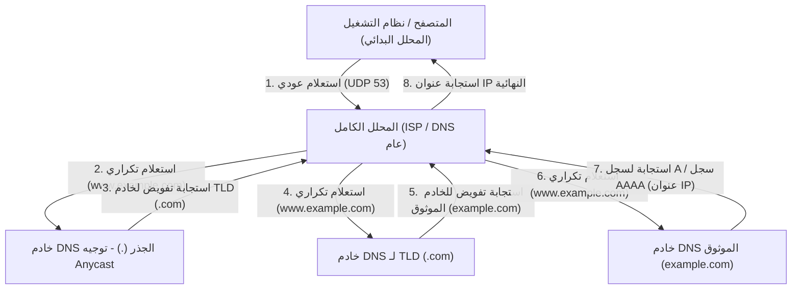

تكتمل رحلة الاتصال الهرمية المعقدة هذه عادةً في لحظة عابرة تتراوح من بضعة أجزاء من الألف من الثانية إلى عشرات الأجزاء من الألف من الثانية. يستخدم DNS بشكل أساسي منفذ UDP رقم 53 كبروتوكول لطبقة النقل. من خلال القضاء التام على أعباء ذهاب وإياب المصافحة الثلاثية لـ TCP (SYN ، SYN-ACK ، ACK) ، فإنه يحقق أقصى حد من تقليل زمن الوصول. ومع ذلك، عندما تتجاوز حمولة استجابة DNS قيد الـ 512 بايت التاريخي لـ UDP (والذي أصبح أكبر الآن بفضل امتداد EDNS0)، أو عند التحقق من مفاتيح DNSSEC (ملحقات أمان DNS)، وهو امتداد توقيع إلكتروني مشفر لمنع هجمات تسميم ذاكرة التخزين المؤقت لـ DNS (DNS Cache Poisoning)، أو عند إجراء نقل المنطقة (AXFR)، فإنه منصوص على الرجوع (Fallback) إلى منفذ TCP رقم 53 الأكثر موثوقية.

## 5.2 معمارية HTTP ونظرية تطور البروتوكول

المتصفح، الذي حصل على عنوان IP للخادم الهدف بواسطة DNS، يقوم بعد ذلك بإنشاء اتصال TCP مع الخادم الهدف (منفذ 80 أو 443) ويبدأ الحوار عبر HTTP (بروتوكول نقل النص التشعبي)، وهو اللغة الرئيسية لطبقة التطبيق.

تم ابتكار HTTP في عام 1989 من قبل تيم بيرنرز لي في المنظمة الأوروبية للأبحاث النووية (CERN)، وكان في الأصل بروتوكولاً بسيطاً للغاية مصمماً لتمكين الفيزيائيين في جميع أنحاء العالم من مشاركة المستندات البحثية (النص التشعبي) بكفاءة عبر الشبكة وربطها معاً من خلال الروابط. هيكلها الواضح القائم على النص - سطر الطلب (Method, URI, Protocol Version)، وحقول الرأس (Header Fields)، وسطر فارغ (CRLF)، وجسم الرسالة (Message Body) - عزز بقوة تصحيح أخطاء النظام وانتشاره.

الفلسفة التصميمية الأساسية والميزة الأكبر لـ HTTP هي أنه "عديم الحالة (Stateless)". لا يحتفظ الخادم بأي سياق أو حالة للطلبات السابقة للعميل في الذاكرة. يكتمل كل طلب كمعاملة (Transaction) مستقلة تماماً. هذه الطبيعة عديمة الحالة، التي ترتبط أيضاً بمعمارية REST (نقل الحالة التمثيلية)، بسطت بشكل كبير تنفيذ الخوادم وجعلت من السهل التوسع الأفقي (Scale-out) عن طريق زيادة عدد الخوادم للتعامل مع حركة المرور الهائلة. يمكن لموازن الحمل (Load Balancer) ضمان نفس النتيجة بغض النظر عن الخادم الخلفي (Backend) الذي يوجه الطلب إليه. ومع ذلك، في تطبيقات الويب التفاعلية الحديثة حيث لا مفر من إدارة الحالة (State)، مثل ميزة عربة التسوق في مواقع التجارة الإلكترونية أو الحفاظ على حالة تسجيل دخول المستخدم، يشكل هذا القيد الصارم على عدم وجود حالة عقبة رئيسية. للتغلب على ذلك خارج البروتوكول نفسه، تم ابتكار آليات لإدارة الحالة الزائفة (Pseudo-state management) باستخدام ملفات تعريف الارتباط (Cookies) لحفظ الحالة على جانب العميل من خلال رؤوس HTTP، ورموز الجلسة (Session Tokens).

### صراع مع القيود المادية: نقلة نوعية من HTTP/1.1 إلى HTTP/3

مع الانتشار المتفجر للويب والتضخم الهائل للموارد المضمنة في صفحة واحدة (الصور، ملفات CSS، ملفات JavaScript، إلخ)، واجه HTTP قوانين الفيزياء الخاصة بالشبكة (القيود المفروضة على التأخير بسبب سرعة الضوء وفقدان الحزم)، وشهد تطوراً معمارياً جذرياً على مستوى البروتوكول.

- **HTTP/1.1 (1997 - )**: في HTTP/1.0 الأولي، كان يتم تكرار إنشاء وقطع اتصال TCP (المصافحة الثلاثية والمصافحة الرباعية) في كل مرة يتم فيها طلب مورد واحد، مما يجعله في غاية عدم الكفاءة من منظور زمن الوصول. في HTTP/1.1، تم توحيد الاتصال المستمر (Persistent Connection / Keep-Alive)، مما قلل بشكل كبير من تكاليف الاتصال من خلال السماح بإعادة استخدام اتصال TCP واحد. ومع ذلك، لم تنتشر تقنية الأنابيب (Pipelining) الخاصة بـ HTTP/1.1 بسبب صعوبات في التنفيذ ومشكلات التوافق مع الوكلاء (Proxies) الوسيطة، وكانت تعاني من عيب هيكلي قاتل يسمى "حظر رأس الخط (HoL Blocking)". هذه هي الظاهرة التي يحدث فيها اختناق للطلبات اللاحقة في قائمة الانتظار بينما يقوم الخادم بمعالجة مورد ضخم واحد أو طلب ثقيل المعالجة على اتصال TCP واحد، مما يؤدي إلى تدهور زمن الوصول الإجمالي. لتجنب ذلك، اضطرت المتصفحات إلى الاعتماد على حيل قوة غاشمة مثل إنشاء اتصالات TCP متعددة (عادةً حوالي 6 اتصالات) في نفس الوقت لنفس النطاق (مثل Domain Sharding).
- **HTTP/2 (2015 - )**: بناءً على بروتوكول SPDY الذي طورته Google، جدد HTTP/2 المعمارية من الأساس، وانتقل من بروتوكول قائم على النص إلى بروتوكول "قائم على تأطير ثنائي (Binary Framing)". أهم ابتكار فيه هو "تعدد الإرسال للتدفقات (Multiplexing)". في HTTP/2، يتم إنشاء "تدفقات" افتراضية متعددة داخل اتصال TCP واحد، ويتم تقسيم بيانات الطلب والاستجابة إلى إطارات ثنائية صغيرة، ويمكن إرسالها بشكل متداخل (Interleaved) بغض النظر عن الترتيب. وبفضل ذلك، تم القضاء تماماً على حظر HoL في طبقة التطبيق. علاوة على ذلك، من خلال آلية ضغط الرأس (Header Compression) باستخدام خوارزمية HPACK (مزيج من تشفير هوفمان الثابت والجداول الديناميكية)، تم تقليل حجم نقل البيانات الزائدة مثل Cookies و User-Agent التي يتم إرسالها بشكل متكرر في كل طلب بشكل كبير، مما أدى إلى زيادة كفاءة استخدام النطاق الترددي للشبكة إلى أقصى حد.
- **HTTP/3 (2022 - )**: بينما حل HTTP/2 بشكل رائع مشكلة حظر HoL في طبقة التطبيق، ظل الجدار المادي المتمثل في "حظر HoL عند فقدان الحزم" في طبقة النقل الأساسية (TCP) باقياً. لضمان الموثوقية، إذا فُقدت حزمة واحدة في طريقها، يوقف TCP تسليم جميع حزم بيانات التدفقات على اتصال TCP هذا إلى طبقة التطبيق حتى تكتمل إعادة الإرسال (هذا أحد الآثار السلبية لآلية ضمان الترتيب لـ TCP). لكسر هذه المشكلة، قام HTTP/3 بنقلة نوعية دراماتيكية بالتخلي عن TCP، الذي كان أساس الإنترنت لعقود، واعتماد بروتوكول النقل الجديد "QUIC" المبني على UDP. يتجنب QUIC تأخير التطور الناجم عن تنفيذ TCP في مساحة النواة لنظام التشغيل، ويدمج تحكماً خاصاً في إعادة الإرسال والتحكم في الازدحام، والتحكم في التدفق المستقل لكل تدفق أعلى UDP الذي يمكن تنفيذه في مساحة المستخدم. حتى إذا فُقدت حزمة، فإن التدفق المعين فقط هو الذي يتأثر، ويمكن للتدفقات الأخرى متابعة المعالجة دون حظر. بالإضافة إلى ذلك، يدمج QUIC مصافحة إنشاء الاتصال ومصافحة التشفير (TLS 1.3)، مما يجعل من الممكن بدء إرسال البيانات المشفرة بـ "0-RTT" مع الخوادم التي تم الاتصال بها مسبقاً. إنها ثمرة السعي للوصول إلى الأداء المطلق عن طريق تقليل عدد رحلات الاتصال ذهاباً وإياباً (RTT) بشكل جذري في طبقة البروتوكول للتعامل مع الحد المادي لسرعة الضوء (حيث سيظل هناك تأخير بمقدار مئات الأجزاء من الألف من الثانية حتماً عند الاتصال بالجانب الآخر من الكرة الأرضية).

## 5.3 التشفير وآلية الثقة: الأعماق الرياضية لـ SSL/TLS ومنطق الإثبات

الإنترنت هو بطبيعته شبكة اتصالات حزمية مفتوحة، حيث يتم نقل البيانات مثل سلسلة من دلاء المياه عبر عدد لا يحصى من أجهزة التوجيه وكابلات الألياف الضوئية البحرية وصولاً إلى وجهتها. من الممكن مادياً لأي عقدة على ذلك المسار (جهاز توجيه وسيط أو مزود خدمة إنترنت خبيث أو متلصص على نفس شبكة Wi-Fi) اعتراض محتويات الاتصال من خلال التقاط الحزم (Packet Capture)، بل وحتى التلاعب بها. بروتوكول SSL (Secure Sockets Layer) وخليفته TLS (Transport Layer Security) هو الذي يحد من الضعف المطلق للشبكة باستخدام قوة الرياضيات المتقدمة وإنشاء قناة اتصال آمنة.

ما يضمنه TLS في اتصالات الويب الحديثة هي "أعمدة الأمان الثلاثة" التالية:
1. **السرية (Confidentiality)**: لا يمكن لطرف ثالث فك تشفير محتويات الاتصال حتى لو تم التنصت عليها.
2. **النزاهة أو السلامة (Integrity)**: لم يتم التلاعب ولو ببت واحد من البيانات في مسار الاتصال. يتم ضمان ذلك بواسطة MAC (رمز مصادقة الرسالة) أو AEAD (التشفير المصادق عليه مع البيانات المرتبطة).
3. **المصادقة (Authentication)**: إثبات أن الطرف الآخر في الاتصال هو المالك الشرعي للنطاق (الخادم الحقيقي).

التقنيات التي تحقق ذلك هي ثمرة نظرية التشفير، التي بناها البشر على مدى قرون، وتطورت بشكل هائل خاصة مع تطور علوم الكمبيوتر ونظرية الأعداد بعد الحرب العالمية الثانية.

### تبادل المفاتيح وتشفير المفتاح العام: جدار مشكلة اللوغاريتم المنفصل والتحليل إلى العوامل الأولية

طريقة التشفير الأبسط والأسرع من حيث المعالجة هي "التشفير بالمفتاح المتماثل (Symmetric Cryptography)" (المعيار الحالي هو AES: معيار التشفير المتقدم). هذه طريقة يستخدم فيها المرسل والمتلقي نفس "المفتاح المشترك" للتشفير وفك التشفير. نظراً لأن المعالجة الرياضية خفيفة (مزيج من عمليات XOR للبتات والاستبدال / التبديل)، فهي مناسبة لتشفير اتصالات من فئة الجيجابت في الوقت الفعلي. ومع ذلك، كان لدى التشفير بالمفتاح المتماثل مفارقة أساسية (مشكلة توزيع المفاتيح): "كيف يمكنك تسليم المفتاح المشترك السري نفسه بأمان إلى الطرف الآخر قبل بدء الاتصال؟" في اتصالات مع أطراف لا توجد معهم علاقة ثقة مسبقة مثل الإنترنت، إذا تم إرسال المفتاح المشترك كما هو، فسيتم اعتراض المفتاح في الطريق وسيفقد التشفير معناه.

كان أكبر اختراق في تاريخ التشفير البشري هو خوارزمية تبادل المفاتيح التي أعلن عنها ويتفيلد ديفي ومارتن هيلمان في عام 1976، و "تشفير المفتاح العام (Asymmetric Cryptography)" الذي ابتكره RSA (ريفست، شامير، وأدلمان) في عام 1977.

تكمن جذور تشفير المفتاح العام في المفهوم الرياضي لـ "الدالة ذات الاتجاه الواحد (One-way function)" أو "الدالة ذات الاتجاه الواحد ذات الباب الخلفي (Trapdoor one-way function)". يستفيد هذا من عدم التماثل حيث أن "العمليات الحسابية في اتجاه واحد (التشفير) تنتهي فوراً بواسطة الكمبيوتر، ولكن العمليات الحسابية في الاتجاه المعاكس (فك التشفير أو تخمين المفتاح) لن تنتهي أبداً حتى لو قمنا بتوصيل جميع أجهزة الكمبيوتر العملاقة في العالم واستمرت في الحساب طوال عمر الكون".

- **تشفير RSA**: من السهل ضرب عددين أوليين كبيرين جداً ($p$ و $q$) لإنشاء رقم مركب ضخم ($N = p \times q$) (يمكن حسابه في زمن متعدد الحدود Polynomial Time)، لكن بناءً على خاصية أنه من الصعب للغاية (من المعروف فقط وجود خوارزميات زمنية شبه أسية) استنتاج العوامل الأولية الأصلية $p$ و $q$ (مشكلة التحليل إلى العوامل الأولية) إذا تم إعطاؤك فقط هذا الرقم المركب الضخم $N$. باستخدام خصائص عميقة لنظرية الأعداد مثل دالة مؤشر أويلر (Euler's totient function) ونظرية فيرما الصغرى (Fermat's little theorem)، فإنه يبني باباً رياضياً خلفياً (Trapdoor) لا يمكن من خلاله فك تشفير البيانات المشفرة بالمفتاح العام إلا من قبل شخص يمتلك المفتاح الخاص المقابل.
- **تشفير المنحنى الإهليلجي (ECC: Elliptic Curve Cryptography)**: الـ ECC، الذي يمثل الاتجاه السائد في TLS الحالي، يطبق صعوبة "مشكلة اللوغاريتم المنفصل" المعرفة على منحنى إهليلجي فوق حقل منتهٍ (Finite Field) (على سبيل المثال، مجموعة من النقاط تلبي معادلة مثل $y^2 = x^3 + ax + b$). يتم تعريف العمليات الهندسية مثل "الجمع" و "الضرب القياسي" على النقاط الموجودة على المنحنى الإهليلجي. من السهل العثور على نقطة $P = kG$ التي تم الحصول عليها عن طريق إضافة نقطة البداية $G$ لعدد سري $k$ من المرات، ولكن من الأصعب بكثير من التحليل الأولي لـ RSA إجراء عملية حسابية عكسية لمعرفة المعامل السري $k$ (اللوغاريتم المنفصل)، وهو عدد مرات الإضافة، من النقاط العامة $G$ و $P$. ونتيجة لذلك، يفتخر ECC بقوة تشفير مساوية أو أكبر بطول مفتاح أقصر بكثير (على سبيل المثال، تحقيق نفس أمان RSA 2048bit باستخدام ECC 256bit)، مما يوفر بشكل كبير عبء وحدة المعالجة المركزية (CPU) وعرض النطاق الترددي للشبكة.

### مصافحة TLS (TLS Handshake): الطقوس التشفيرية لبناء الثقة

عند بدء اتصال آمن عبر HTTPS، يقوم العميل والخادم بإنشاء "مفتاح جلسة (Session Key)" آمن للتشفير بالمفتاح المتماثل، وتنفيذ بروتوكول تفاوض متقدم لمصادقة هوية الطرف الآخر. هذا هو ما يسمى مصافحة TLS. فيما يلي تشريح لمصافحة 1-RTT في "TLS 1.3"، وهو أحدث معيار تم فيه التخلص من الهدر إلى أقصى حد.

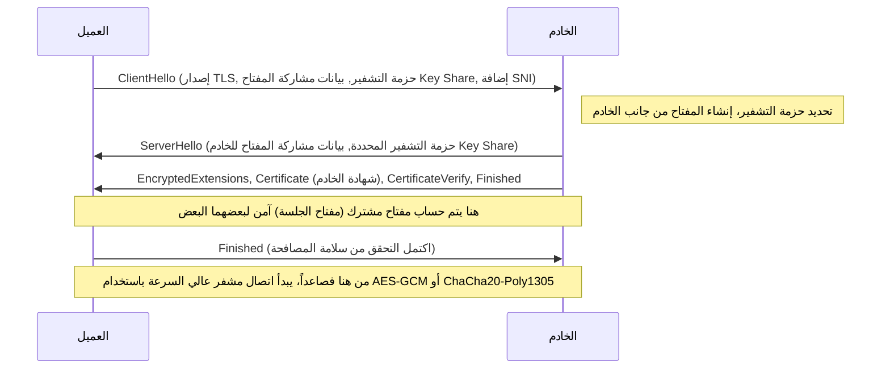

1. **ClientHello**: لبدء الاتصال، يرسل العميل إلى الخادم إصدار TLS الذي يدعمه، وقائمة بخوارزميات التشفير (Cipher Suites)، والمعلمات الرياضية الأولية لإنشاء مفتاح تشفير (Key Share). كما أنه يستخدم امتداد SNI (إشارة اسم الخادم) لإرسال اسم مضيف الوجهة (مثل `www.example.com`) في نص عادي (Plaintext). هذه معلومة أساسية للخادم (المضيف الظاهري - Virtual Host) الذي يقوم بتشغيل مجالات HTTPS متعددة على عنوان IP واحد لتحديد الشهادة الصحيحة وإرجاعها.
2. **ServerHello**: يحدد الخادم خوارزمية التشفير الأقوى والأمثل (على سبيل المثال، `TLS_AES_256_GCM_SHA384`) من قائمة العميل ويستجيب مع بيانات مشاركة المفتاح (Key Share) الخاصة به.
3. **إرسال الشهادة والتوقيع (Authentication)**: يرسل الخادم "شهادته الرقمية (X.509)". علاوة على ذلك، يستخدم الخادم "المفتاح الخاص" المرتبط بتلك الشهادة لإنشاء وإرسال توقيع رقمي (CertificateVerify) لقيمة التجزئة (Hash) لرسائل المصافحة السابقة بأكملها. هذا يثبت رياضياً أن الخادم هو المالك الشرعي لتلك الشهادة (مالك المفتاح الخاص).
4. **تبادل المفاتيح (تبادل مفاتيح ديفي-هيلمان لمنحنى إهليلجي سريع الزوال: ECDHE)**: يضرب العميل والخادم رياضياً مشاركة المفاتيح (Key Share) الخاصة بكل منهما (النقاط العامة على المنحنى الإهليلجي) بالمعلمات السرية الموجودة لديهم فقط. بشكل مذهل، بفضل الخصائص الرياضية لتبادل مفاتيح ديفي-هيلمان ($ (g^a)^b = (g^b)^a = g^{ab} $)، يتم تجميع "سر رئيسي قوي (Master Secret / مفتاح مشترك)" متطابق تماماً كالسحر على جانب العميل وجانب الخادم دون إرسال أي معلومات سرية عبر الشبكة.
5. **السرية التامة المسبقة (Perfect Forward Secrecy: PFS)**: ميزة مهمة للغاية في TLS 1.3 هي أن المعلمات المستخدمة لتبادل المفاتيح هذا (Key Share) يتم إنشاؤها حديثاً كمعلمات يمكن التخلص منها (سريعة الزوال - Ephemeral) في كل مرة يتم فيها إنشاء جلسة. نتيجة لذلك، حتى في الحالة المستبعدة التي يتم فيها تسريب المفتاح الخاص بالخادم لتحديد الهوية على المدى الطويل (مفتاح RSA أو ECDSA) للمهاجمين بعد بضع سنوات، فإنه من المستحيل تماماً رياضياً الرجوع إلى الوراء وفك تشفير حزم الاتصالات المشفرة التي تم تسجيلها وحفظها في الماضي. وهذا يضمن سرية الاتصالات السابقة في المستقبل.

### البنية التحتية للمفاتيح العامة (PKI) وسلسلة الثقة (Chain of Trust): جواز السفر في العالم الرقمي

في آلية التشفير حتى هذه النقطة، هناك فجوة منطقية قاتلة واحدة متبقية. المشكلة هي: "كيف يتأكد العميل من أن الشهادة والمفتاح العام المرسل من الخادم هي بالفعل من النطاق المستهدف الحقيقي (مثل موقع بنك على سبيل المثال)؟"
إذا قام شخص خبيث يتحكم في مسار الشبكة بهجوم "الرجل في المنتصف (Man-in-the-Middle Attack)" وتظاهر بأنه الخادم وأرسل شهادته المزيفة ومفتاحه العام إلى العميل، فسوف ينجح تبادل المفاتيح والتشفير نفسه رياضياً وبشكل مثالي. ومع ذلك، سيكون الطرف الآخر في الاتصال المشفر هو المهاجم بدلاً من البنك المقصود.
إن الإطار الاجتماعي-التقني الذي يحل هذا التحدي الجذري للمصادقة هو البنية التحتية للمفاتيح العامة (PKI) ووجود "سلطة الشهادات" (CA: Certificate Authority) التي تعمل كمرساة للثقة.

يقوم مالك الخادم بإنشاء طلب توقيع شهادة (CSR) يحتوي على مفتاحه العام، ويقدمه إلى جهة خارجية موثوقة (CA) مثل DigiCert أو GlobalSign أو Let's Encrypt. تقوم سلطة الشهادات (CA) بالتحقق من أن ملكية النطاق تعود بالفعل لمقدم الطلب (التحقق من النطاق، والتحقق من وجود الشركة، وما إلى ذلك)، ثم تستخدم "المفتاح الخاص" القوي الخاص بها لتطبيق "توقيع رقمي" على معلومات المفتاح العام للخادم، وإصدارها كشهادة خادم.

من ناحية أخرى، في أنظمة التشغيل مثل Windows و macOS، وكذلك المتصفحات مثل Chrome و Firefox، يتم مسبقًا تضمين (Hardcoded) مجموعة من "شهادات الجذر (المفتاح العام)" لسلطات الشهادات الجذرية التي خضعت لتدقيق صارم عالميًا، لتكون بمثابة نقطة ارتكاز للثقة (Trust Anchor).

عندما يتلقى العميل الشهادة من الخادم، فإنه يستخدم المفتاح العام لسلطة الشهادات الجذرية المدمج في نظام التشغيل لإجراء تحقق تشفيري للتوقيع الرقمي لسلطة الشهادات المرفق بالشهادة. إذا نجح التحقق من التوقيع، فهذا يثبت أن محتويات الشهادة (اسم النطاق والمفتاح العام) مضمونة من قبل سلطة الشهادات (CA) ولم يتم التلاعب بها.

1. يثق العميل بسلطة الشهادات الجذرية (Root CA) دون قيد أو شرط (تثبيت مسبق في مخزن الثقة).
2. تثق سلطة الشهادات الجذرية بسلطة الشهادات الوسيطة (Intermediate CA) وتوقع لها.
3. تثق سلطة الشهادات الوسيطة بالكيان النهائي (خادم الويب) وتوقع له.

من خلال هذه العلاقة المتعدية المعروفة باسم "سلسلة الثقة (Chain of Trust)"، نحن قادرون على بناء علاقة ثقة قوية بشكل ديناميكي وفوري مع خوادم غير معروفة وبعيدة فعليًا، وإنشاء قناة اتصال مشفرة آمنة.

## الخاتمة: اندماج الطبقات والتوجه نحو آفاق جديدة

في الفصل الخامس، قمنا بتشريح مفصل لما يدور في أعماق طبقة التطبيق، بما في ذلك حل الأسماء، وبروتوكولات طلب البيانات والاستجابة لها، والغطاء الرياضي للتشفير الذي يغلفها جميعًا.
يعمل DNS كدليل عناوين لامركزي ضخم للإنترنت، ويؤسس HTTP بنية كنواقل للموارد، بينما يحمي TLS ذلك بقوة بدرع من نظريات التشفير المتطورة. تاريخيًا، تم تصميم هذه كطبقات بروتوكول مستقلة، ولكن في الويب الحديث، وكما نرى في QUIC الخاص بـ HTTP/3، أصبحت الحدود بين طبقة النقل، وطبقة التطبيق، وطبقة التشفير مدمجة بشكل وثيق، مما يحطم حدود زمن الوصول المادي (Latency)، ويستمر في التطور إلى أشكال متطورة تسعى لتحقيق أقصى درجات الأداء والأمان في نفس الوقت.

في الفصل التالي، سنتعمق أكثر في الهاوية التقنية حول "الهيكل الداخلي للأنظمة الخلفية (Backend) والحوسبة الموزعة"، لنتعرف على كيفية قيام الطلبات التي تعبر هذا الاتصال المشفر القوي وتصل إلى جانب الخادم بتوليد محتوى ديناميكي والتفاعل مع أنظمة قواعد البيانات الموجودة خلفه.

# الفصل السادس: البنية التحتية المادية التي تدعم الإنترنت —— آلية عملاقة منسوجة من الضوء والحرارة والمحيط

غالبًا ما يُشار إلى الإنترنت كمفهوم تجريدي غير ملموس يُسمى "السحابة (Cloud)". قد نشعر بوهم أن البيانات المرسلة من هواتفنا الذكية وأجهزة الكمبيوتر الخاصة بنا تُمتص عبر موجات راديو وكابلات غير مرئية إلى مساحة تخزين تقع "في مكان ما في السماء". ومع ذلك، فإن حقيقة الإنترنت ليست خفيفة كالسحابة. إنها بنية تحتية مادية هائلة وثقيلة للغاية، ومقيدة بشدة بقوانين الديناميكا الحرارية، والبصريات، والفيزياء الجيولوجية، وهي أكبر بنية تحتية مادية في تاريخ البشرية.

في هذا الفصل، سنقوم بتشريح شامل لثلاثة أعمدة رئيسية تجسد هذه "الشبكة غير المرئية" في العالم المادي — وهي "الكابلات البحرية" التي تشكل شبكة عصبية على نطاق كوكبي، و "مراكز البيانات فائقة الحجم (Hyperscale Data Centers)" وهي منشآت معالجة ديناميكية حرارية تتولى تخزين وحساب البيانات، و "شبكة توصيل المحتوى (CDN)" التي تحطم حاجز سرعة الضوء وتضغط الزمكان — وذلك من منظور آلياتها الفيزيائية، وخلفياتها التاريخية، والمنظور التقني الاحترافي الذي يسعى إلى أقصى درجات الكفاءة.

---

## 1. شبكة الضوء العصبية التي تغلف الأرض: نظام الكابلات البحرية

حاليًا، يمر حوالي 99% من اتصالات الإنترنت الدولية العابرة للحدود عبر "كابلات الاتصالات البحرية (Submarine Communications Cable)" التي يبلغ قطرها بضعة سنتيمترات فقط والممتدة في قاع المحيط، وليس عبر الأقمار الصناعية التي تحلق في الفضاء الخارجي. عندما نتصفح مواقع ويب أجنبية، فإن تلك البيانات تندفع بسرعة الضوء في ظلام دامس على عمق آلاف الأمتار في أعماق البحر.

### 1.1 التطور من التلغراف إلى الألياف الضوئية وتحدي حد شانون

يعود تاريخ الكابلات البحرية إلى ما قبل ولادة الإنترنت بكثير، وتحديدًا إلى عام 1850 عند تمديد كابل تلغراف عبر القناة الإنجليزية. في عام 1858، تم تمديد أول كابل تلغراف عبر المحيط الأطلسي، ولكن الاتصال في ذلك الوقت كان يتم بواسطة شفرة مورس، واستغرق إرسال رسالة من الملكة فيكتوريا إلى الرئيس الأمريكي بوكانان أكثر من عشر ساعات. بعد ذلك، وبعد المرور بعصر خطوط الهاتف التناظرية باستخدام الكابلات المحورية، بدأ استخدام كابلات الألياف الضوئية في أواخر الثمانينيات. كانت سعة أول كابل اتصالات ضوئية عبر المحيط الأطلسي "TAT-8" الذي تم تمديده في عام 1988 تبلغ 280 ميجابت في الثانية (أي ما يعادل حوالي 40 ألف خط هاتفي)، وهو ما كان يعتبر عرض نطاق ترددي ثوري في ذلك الوقت.

تتباهى الكابلات البحرية الحديثة بسعة اتصال تفوق الخيال تصل إلى مئات التيرابت في الثانية (Tbps) للكابل الواحد. ما مكّن هذا التطور الهائل هو اختراعين رائدين في الفيزياء والهندسة على مستوى جائزة نوبل: "تعدد الإرسال بتقسيم الطول الموجي (WDM: Wavelength Division Multiplexing)" و "مضخم الألياف الضوئية المشوب بالإربيم (EDFA: Erbium-Doped Fiber Amplifier)".

تقنية WDM هي تقنية تدمج أطوال موجية (ألوان) مختلفة من الضوء في ليف ضوئي واحد لإرسالها في وقت واحد. وبفضل ذلك، تزداد سعة الإرسال لكل ليف ضوئي بشكل مضاعف بعدد الأطوال الموجية. ومع ذلك، مهما بلغت درجة نقاء زجاج الكوارتز المصنوع منه الألياف الضوئية إلى الحد الأقصى، فإن الإشارة الضوئية تتضاءل نتيجة لتشتت رايلي والامتصاص بالأشعة تحت الحمراء بعد عبورها مئات الكيلومترات. ولهذا السبب، تبرز الحاجة إلى "مكررات الإشارة (Repeaters)" التي يتم تركيبها كل عدة عشرات إلى مائة كيلومتر.

في الماضي، كانت مكررات الإشارة تقوم بعملية معقدة ومقيدة للغاية تُعرف باسم (تحويل O-E-O)، حيث تحول الإشارة الضوئية المتضائلة إلى إشارة كهربائية أولاً، ثم تضخمها، قبل تحويلها مرة أخرى إلى إشارة ضوئية. ومع ذلك، أتاح EDFA الذي تم تطبيقه عمليًا في التسعينيات تضخيم الإشارة الضوئية بشكل مباشر "كضوء" من خلال تطعيم قلب الألياف الضوئية بعنصر أرضي نادر هو الإربيم، وتسليط ضوء ليزر قوي عليه يُسمى ضوء الضخ (Pump light). وبفضل ذلك، أصبح من الممكن تضخيم إشارات ضوئية متعددة بأطوال موجية مختلفة دفعة واحدة، ومع اقترانها بتقنية WDM، زادت سعة الاتصال بشكل متفجر.

حاليًا، وفي مجال هندسة الاتصالات، نقترب من الحد النظري لسعة قناة الاتصال الذي اقترحه كلود شانون، والمعروف بـ "حد شانون (Shannon Limit)". ولتجاوز هذا الحد، بدأ بحث وتطبيق تقنيات الجيل التالي للطبقة المادية مثل "الألياف متعددة النوى (Multi-core Fiber)" التي تحتوي على عدة نوى داخل ليف واحد، و "تعدد الإرسال بالتقسيم المكاني (SDM: Space Division Multiplexing)" الذي يدمج الأوضاع المكانية للضوء.

### 1.2 البيئة المادية في أعماق البحار وهندسة تمديد الكابلات

يُعد تمديد الكابلات البحرية من أكثر المشاريع الهندسية قسوة في العصر الحديث. يتم إغراق الكابلات التي تمتد لآلاف الكيلومترات إلى قاع المحيط باستخدام "سفن تمديد الكابلات (Cable layer)" المخصصة لذلك.

قبل التمديد، يتم إنشاء خريطة طبوغرافية دقيقة لقاع المحيط باستخدام أجهزة سبر الصدى الصوتي (Echo Sounders)، ويتم تحديد المسار الأمثل لتجنب المناطق البحرية التي تحتوي على سلاسل جبال تحت البحر، والخنادق، والرواسب المائية الحرارية، وخطر الانهيارات الأرضية. يختلف هيكل الكابل بشكل كبير اعتمادًا على عمق المياه الذي سيتم التمديد فيه.

في المناطق البحرية الضحلة مثل الجرف القاري (حيث يقل عمق المياه عن 1000 إلى 1500 متر تقريبًا)، تكون مخاطر القطع المادي عالية جدًا بسبب شباك الجر التابعة لقوارب الصيد، أو مراسي السفن، أو العض من قبل الكائنات البحرية كالقروش. ولهذا السبب، يتم تزويدها بـ "دروع (Armor)" تتكون من طبقات متعددة من أسلاك الفولاذ عالية الشد (Steel wires) تُلف حول راتنج البولي كربونات والأنابيب النحاسية التي تحمي الألياف الضوئية، مما يجعلها أكبر قُطرًا وأثقل وزنًا. بالإضافة إلى ذلك، يتم استخدام مركبات تحت الماء يتم تشغيلها عن بُعد (ROV) أو محاريث بحرية لدفن الكابل على عمق عدة أمتار في الوحل والرمال بقاع البحر.

من ناحية أخرى، في مناطق أعماق البحار التي يبلغ عمقها آلاف الأمتار، لا يوجد تهديد من شباك الصيد أو المراسي. لذا، للحفاظ على المتانة اللازمة لتحمل ضغط الماء مع منع انقطاع الكابل بسبب وزنه الذاتي أثناء التمديد، يتم استخدام "كابلات خفيفة الوزن (Lightweight Cable)" بدون الدروع الفولاذية الخارجية. يبلغ قطرها حوالي 17 إلى 20 ملم فقط، أي بحجم خرطوم الحديقة.

جانب مادي آخر مهم للكابلات البحرية هو "إمدادات الطاقة". لتشغيل مكررات الإشارة المركبة كل بضع عشرات من الكيلومترات، يتم توفير تيار مباشر عالي الجهد (DC) من "محطة الإنزال (Cable Landing Station)" على اليابسة عبر أنابيب نحاسية (موصلات طاقة) داخل الكابل. في الكابلات التي تعبر المحيطات، قد يتجاوز جهد الإمداد 10,000 فولت (10 كيلو فولت)، ويُعتمد عادةً على "نظام العودة الأرضية أحادي السلك" الذي يستخدم مياه البحر والأرض كدائرة عودة.

### 1.3 الجغرافيا السياسية وصعود شركات التكنولوجيا العملاقة

في الماضي، نظرًا لأن تمديد الكابلات البحرية كان يتطلب استثمارات هائلة، كان النظام السائد يتمثل في تجمع كبرى شركات الاتصالات من مختلف البلدان لتشكيل اتحادات (Consortia) لتوزيع التكاليف والنطاق الترددي. ومع ذلك، شهد هذا النظام البيئي في السنوات الأخيرة تحولًا جذريًا.

بدأت شركات التكنولوجيا العملاقة التي تُعرف باسم "Hyperscalers" مثل Google، و Meta (Facebook)، و Microsoft، و Amazon بالاستثمار المباشر وتمديد كابلات بحرية إما بشكل مستقل أو بالاشتراك لربط مراكز البيانات الخاصة بها بسرعات فائقة. لقد تحولوا من مجرد مستخدمين للإنترنت إلى أكبر مالكين للبنية التحتية المادية. نتيجة لذلك، يتم الآن تحسين مسارات الكابلات من "الربط بين المدن الكبرى" التقليدي إلى "الربط الأقصر والأسرع بين مراكز البيانات الخاصة بهم".

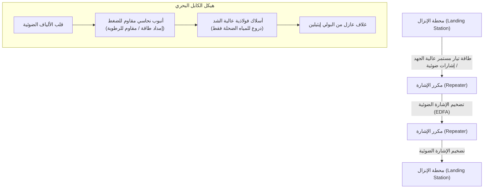

---

## 2. منشآت المعالجة الديناميكية الحرارية للبيانات: مراكز البيانات فائقة الحجم (Hyperscale Data Centers)

تُنقل البيانات التي تصل إلى اليابسة عبر الكابلات البحرية في النهاية إلى "مراكز البيانات". مركز البيانات هو مبنى ضخم يستوعب عشرات الآلاف إلى مئات الآلاف من الخوادم، ويستمر في إجراء العمليات الحسابية والتخزين على مدار الساعة طوال أيام الأسبوع دون توقف.

### 2.1 حقيقة السحابة ومعركة "PUE"

من منظور فيزيائي، فإن جوهر مركز البيانات هو "محرك حراري عملاق يتلقى كميات هائلة من الطاقة الكهربائية كمدخلات، وينتج عنها انخفاض في الإنتروبيا يُعرف بمعالجة المعلومات (نتائج العمليات الحسابية)، وما يصاحب ذلك من "حرارة" حتمية". تُولد أشباه الموصلات مثل وحدة المعالجة المركزية (CPU) ووحدة المعالجة الرسومية (GPU) حرارة بسبب المقاومة عند تشغيل وإيقاف التيار الكهربائي. إذا لم يتم طرد هذه الحرارة بفعالية إلى الخارج، فسوف تتعرض أشباه الموصلات فورًا للهروب الحراري (Thermal Runaway) وتحترق ماديًا.

لذلك، فإن التركيز الأكبر في تصميم وتشغيل مراكز البيانات ينصب على "التبريد" و "كفاءة الطاقة". المؤشر الأكثر شيوعًا الذي يوضح هذه الكفاءة هو "PUE (Power Usage Effectiveness)".

**PUE = إجمالي استهلاك الطاقة لمركز البيانات / استهلاك الطاقة لمعدات تقنية المعلومات (الخوادم، إلخ)**

الحد الأدنى النظري لـ PUE هو 1.0 (وهي الحالة التي تُستخدم فيها جميع الطاقة خالصاً للعمليات الحسابية فقط). في الماضي، لم يكن من النادر أن تتجاوز مراكز البيانات قيمة PUE تبلغ 2.0 (مما يعني استهلاك نفس مقدار الطاقة التي تستخدمها الخوادم في تشغيل معدات التبريد مثل مكيفات الهواء). ومع ذلك، في مراكز البيانات فائقة الحجم (Hyperscale) الحديثة، يتم إجراء تحسينات ديناميكية حرارية قصوى لخفض هذا الرقم إلى نطاق 1.1 إلى 1.2.

### 2.2 تطور هندسة التبريد

بناءً على مبادئ الديناميكا الحرارية، تطورت أنظمة التبريد في مراكز البيانات على النحو التالي:

1. **فصل الممر الساخن والممر البارد (Hot Aisle / Cold Aisle)**:
   في مراكز البيانات القديمة، كان يتم تبريد الغرفة بأكملها باستخدام مكيفات الهواء (CRAC: Computer Room Air Conditioning)، ولكن الهواء البارد كان يختلط بالهواء الساخن المنبعث من الخوادم، مما يجعله غير فعال للغاية. في الوقت الحاضر، أصبح المعيار هو ترتيب واجهات سحب الهواء لرفوف الخوادم لتواجه بعضها البعض، وكذلك واجهات طرد الهواء، من أجل عزل المسارات التي يمر فيها الهواء البارد (الممر البارد) عن المسارات التي يمر فيها الهواء الساخن (الممر الساخن) ماديًا عبر ما يُعرف بـ "احتواء الممر (Aisle Containment)".

2. **التبريد الحر (Free Cooling / تبريد الهواء الخارجي)**:
   يتطلب تشغيل ضواغط المُبرِّد (Chiller / جهاز تدوير مياه التبريد) كميات هائلة من الطاقة الكهربائية. لذلك، أصبح من الشائع بناء مراكز البيانات في المناطق التي يكون فيها الهواء الخارجي باردًا بدرجة كافية (مثل شمال أوروبا وهوكايدو)، واستخدام الهواء الخارجي إما بشكل مباشر، أو غير مباشر عبر مبادل حراري لأغراض التبريد، وهو ما يُعرف بـ "التبريد الحر (Free Cooling)".

3. **التبريد بالغمر (Immersion Cooling) والتبريد المائي المباشر (Direct-to-Chip)**:
   في السنوات الأخيرة، بدأت كثافة الحرارة المنبعثة من وحدات معالجة الرسومات (GPU) المتطورة المستخدمة في تدريب واستدلال الذكاء الاصطناعي في تجاوز الحدود المادية للتبريد بالهواء التقليدي (بسبب انخفاض السعة الحرارية والتوصيل الحراري للهواء). لذلك، بدأ اعتماد "التبريد بالغمر (Immersion Cooling)" حيث يتم غمر اللوحة الأم للخادم بالكامل في سوائل خاملة غير موصلة للكهرباء تعتمد على الفلور أو في زيوت معدنية، و"التبريد المباشر للرقاقة (Direct-to-Chip)" حيث يتم توصيل رأس تبريد مائي مباشرة بموزع الحرارة (Heat Spreader) الخاص بوحدات CPU/GPU لامتصاص الحرارة مباشرة باستخدام سائل له سعة حرارية أعلى بكثير من الهواء. في التبريد بالغمر ثنائي الطور الذي يستفيد من تغير الطور (الحرارة الكامنة لتبخر السائل المغلي)، يمكن التعامل مع تدفقات حرارية عالية جدًا.

### 2.3 التكرارية (Redundancy) والأمن المادي

نظرًا لأن مراكز البيانات تمثل قلب البنية التحتية المجتمعية، فإنها تتطلب أقصى درجات التكرارية (Redundancy). في اللحظة التي ينقطع فيها مصدر الطاقة التجاري، تتولى أنظمة إمداد الطاقة غير المنقطعة (UPS) التي تستخدم الحذافات (Flywheels)، أو بطاريات الرصاص الحمضية، أو بطاريات أيونات الليثيوم، توفير الطاقة في أجزاء من الثانية. في الوقت نفسه، يتم تشغيل مولدات الديزل الضخمة أو توربينات الغاز المثبتة خارج المبنى، والتي تمتلك القدرة على تشغيل المنشأة بالكامل لعدة أيام باستخدام الوقود المخزن.

بالنسبة لاتصالات الشبكة أيضًا، يتم جلب خطوط من عدة شركات اتصالات مختلفة، ويتم فصل المسارات المادية بالكامل (مثل السحب من اتجاهات مختلفة كالشمال والجنوب والشرق والغرب للمبنى) للتحضير لحوادث مثل قطع الكابلات بسبب أعمال الحفر.

