# Kapitel 1: Die Anfänge und Philosophie des Internets —— Die technologische Genealogie von ARPANET bis WWW

Das Internet – dieses riesige, autonom dezentralisierte Netzwerk, das heute die Grundlage für alle wirtschaftlichen Aktivitäten, die Kultur und die Kommunikation der Menschheit bildet – wurde keineswegs von einem einzigen Genie über Nacht entworfen. Es hat seinen Ursprung in dem spezifischen historischen und geopolitischen Kontext des Kalten Krieges und ist, nach einem Paradigmenwechsel in der Nachrichtentechnik und Informatik, die Kristallisation einer erhabenen Philosophie, die von unzähligen Forschern geteilt wurde: "Wie können Informationen robust, frei und über alle physischen Einschränkungen hinweg übertragen werden?"

In diesem Kapitel wird extrem tiefgreifend und aus einer professionellen Perspektive heraus erläutert, wie das Wundersystem Internet entstanden ist, und zwar nicht durch eine bloße Aufzählung historischer Fakten, sondern anhand der technologischen Mechanismen von der physischen Schicht bis zur Anwendungsschicht sowie seiner Designphilosophie (Architektur).

## 1.1 Der Paradigmenwechsel im Netzwerk: Die Grenzen der Leitungsvermittlung und die Geburt der Paketvermittlung

Der Ausgangspunkt für das Verständnis des historischen und technologischen Wesens des Internets ist die Erfindung des Konzepts der "Paketvermittlung" (Packet Switching). In den frühen 1960er Jahren stand das "Leitungsvermittlungs"-System (Circuit Switching), das typischerweise in Telefonnetzen verwendet wurde, im Zentrum der damaligen Kommunikationsinfrastruktur.

### Physischer Mechanismus und Schwachstellen der Leitungsvermittlung
Die Leitungsvermittlung ist ein Verfahren, bei dem zwischen zwei kommunizierenden Punkten Crossbar-Schalter oder elektronische Vermittlungsstellen physisch oder logisch mithilfe von Technologien wie dem Frequenzmultiplexverfahren (FDM) verbunden werden, um vom Beginn bis zum Ende der Kommunikation einen "dedizierten Kommunikationsweg (Leitung)" zu reservieren und zu belegen. Dieses Verfahren war für die Sprachkommunikation (Telefonie), bei der Echtzeitanforderungen bestehen, äußerst geeignet, da Bandbreite und Verzögerung garantiert sind, solange die Leitung reserviert ist.

Diese Architektur wies jedoch einen fatalen Fehler auf: das Vorhandensein eines "Single Point of Failure" (einzelner Ausfallpunkt) und eine extreme Anfälligkeit gegenüber physischer Zerstörung. Während des Kalten Krieges war das US-Verteidigungsministerium zutiefst besorgt über einen nuklearen Angriff der Sowjetunion (insbesondere EMP-Angriffe durch elektromagnetische Impulse infolge hochgelegener Nuklearexplosionen). Wenn zentrale Kommunikationsknotenpunkte (riesige Vermittlungsstellen) physisch zerstört oder Teile des Kommunikationswegs unterbrochen würden, könnte bei der Leitungsvermittlung nicht sofort eine alternative Route aufgebaut werden, was das staatliche Führungs- und Kontrollsystem (C2: Command and Control) vollständig lahmlegen würde.

### Der Durchbruch der Paketvermittlung
Es gibt drei Pioniere, die die theoretischen Grundlagen zur Überwindung dieser hoffnungslosen physischen Einschränkungen völlig unabhängig voneinander, aber fast zeitgleich schufen: Paul Baran von der RAND Corporation, Donald Davies vom National Physical Laboratory (NPL) in Großbritannien und Leonard Kleinrock vom Massachusetts Institute of Technology (MIT).

Vor dem Hintergrund von Claude Shannons Informationstheorie schlugen sie einen revolutionären Ansatz vor: Sie behandelten die Kommunikation nicht als kontinuierliche analoge "Wellen" oder einen ununterbrochenen Daten-"Stream", sondern teilten die Daten in kleine Blöcke fester (oder variabler) digitaler Daten auf – "Pakete" (Packets) oder, in Barans Worten, "standardisierte Nachrichtenblöcke".

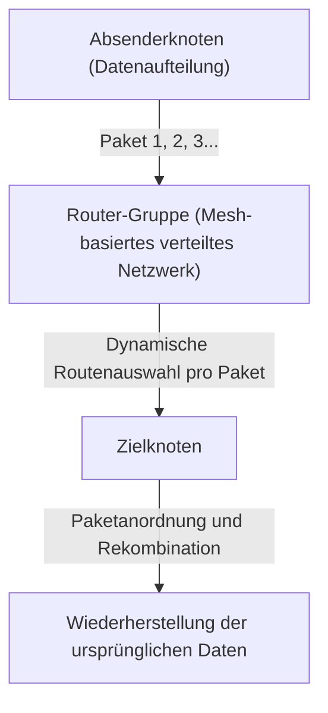

Die technologische Innovationskraft des Paketvermittlungsverfahrens lässt sich im Wesentlichen in den folgenden zwei Punkten zusammenfassen:

1. **Realisierung des statistischen Multiplexings (Statistical Multiplexing):**
   Anstatt eine physische Leitung wie bei der Leitungsvermittlung für eine bestimmte Kommunikation zu belegen, teilen sich Pakete aus mehreren unabhängigen Kommunikationen dieselbe physische Leitung im Zeitmultiplexverfahren. Da die Datenkommunikation zwischen Computern eine hohe "Burstiness" (die Eigenschaft, dass zeitweise große Datenmengen fließen, gefolgt von einer Stille) aufweist, hat die Bandbreitenteilung durch Paketvermittlung die Nutzungseffizienz der Kommunikationsressourcen an ihr mathematisches Limit getrieben.
2. **Store-and-Forward und dynamische Routenauswahl:**
   Jeder Relais-Knoten (Router), aus dem das Netzwerk besteht, speichert empfangene Pakete vorübergehend in einer Warteschlange (Queue) im Speicher ab und gleicht die im Header des Pakets angegebene Zieladresse mit der eigenen Routingtabelle ab. Dann wird, basierend auf der Berechnung des aktuellen Überlastungszustands (Congestion) des Netzwerks oder von physischen Verbindungsabbrüchen, jedes Paket an den optimalen benachbarten Knoten weitergeleitet.

Kleinrock nutzte die Warteschlangentheorie (Queuing Theory), um ein mathematisches Modell für Paketverzögerungen und Puffergrößen in diesem Store-and-Forward-Verfahren zu etablieren. Selbst wenn ein Teil des Netzwerks durch einen nuklearen Angriff verdampfen würde, könnten die überlebenden Knoten die Situation autonom beurteilen und die Pakete würden einen Umweg (eine alternative Route auf dem Mesh-Netzwerk) finden, um ihr Ziel zu erreichen. Genau diese "autonom dezentralisierte, selbstheilende" Architektur ist die Quelle der Widerstandsfähigkeit (Resilience) des Internets.

## 1.2 Der Aufbau des ARPANET: Trennung von Hardware und Protokollen durch den IMP

Was das bis dahin nur theoretisch existierende Paketvermittlungsnetzwerk in die physische Welt umsetzte, war das Projekt "ARPANET", das 1969 mit finanzieller Unterstützung der Advanced Research Projects Agency (ARPA) des US-Verteidigungsministeriums gestartet wurde.

Die damalige Computerumgebung war unvergleichlich chaotischer als heute. Die von Unternehmen wie IBM, DEC und SDS unabhängig voneinander entwickelten Mainframes (Großrechner) wiesen völlig unterschiedliche Zeichencodierungen (ASCII vs. EBCDIC), Wortlängen (16-Bit, 32-Bit, 36-Bit usw.) und Betriebssysteme auf, was eine direkte Kommunikation zwischen ihnen technisch extrem schwierig machte.

Daher trafen die Architekten des ARPANET (Larry Roberts und andere) eine in der Netzwerkarchitektur äußerst wichtige Designentscheidung. Sie bestand in der Einführung eines dedizierten kleinen Relais-Computers namens "IMP" (Interface Message Processor).

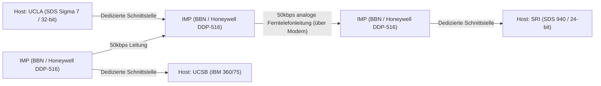

Der Zuschlag für die Entwicklung des IMP ging an BBN (Bolt Beranek and Newman), ein Beratungsunternehmen mit Sitz in Boston. Sie modifizierten den robusten Minicomputer "DDP-516" von Honeywell und übertrugen dem IMP die gesamte Last der komplexen Netzwerkverarbeitung, wie etwa Routing-Protokolle, das Aufteilen und Zusammensetzen von Paketen sowie die Fehlererkennung (CRC: Cyclic Redundancy Check).

Dadurch mussten sich die riesigen Host-Computer der jeweiligen Forschungseinrichtungen nicht mehr um das komplexe Paket-Routing oder die physischen Eigenschaften der Leitungen kümmern; es reichte völlig aus, Daten über eine standardisierte Schnittstelle (das BBN 1822-Protokoll) an den direkt vor ihnen stehenden IMP zu übergeben. Dies war das erste große Erfolgsbeispiel für die Anwendung der "Trennung der Belange" (Separation of Concerns) im Netzwerkbereich, und der IMP wurde zum direkten Vorfahren der heutigen Router.

Am 29. Oktober 1969 wurde vom Kleinrock-Labor an der UCLA aus die erste Nachricht "LO" an das SRI (Stanford Research Institute) gesendet (da das System abstürzte, als man versuchte, "LOGIN" einzugeben). Dies war der historische Moment, in dem das ARPANET das Licht der Welt erblickte. Danach wurden frühe Routing-Algorithmen (Distanzvektor-Routing basierend auf dem Bellman-Ford-Algorithmus) implementiert, und das ARPANET wuchs rasant zu einer Infrastruktur heran, die Forschungseinrichtungen in den gesamten USA verband.

## 1.3 Die Designphilosophie von TCP/IP: Das End-to-End-Prinzip und die Tiefen der Kapselung

Während das ARPANET als einzelnes Netzwerk ein großer Erfolg war, stieß es bald auf eine neue Hürde. Das im ARPANET verwendete Kommunikationsprotokoll namens NCP (Network Control Program) wurde unter der Prämisse entworfen, dass es auf dem ARPANET als "homogenes und hochzuverlässiges Einzelnetzwerk" läuft.

In den 1970er Jahren begannen jedoch verschiedene Netzwerke aufzutauchen, deren physische Medien, maximale Paketgrößen (MTU: Maximum Transmission Unit), Übertragungsgeschwindigkeiten und Fehlerraten völlig unterschiedlich waren, wie zum Beispiel paketvermittelte Satellitennetzwerke (SATNET) oder das von der University of Hawaii entwickelte drahtlose Paketnetzwerk (das von ALOHAnet abgeleitete PRNET). Als man versuchte, diese miteinander zu verbinden, um ein globales "Netzwerk von Netzwerken (Internetwork)" aufzubauen, wurde offensichtlich, dass das Design von NCP scheitern würde.

Die enorme Herausforderung der heterogenen Netzwerkverbindung wurde durch die bahnbrechende Arbeit "A Protocol for Packet Network Intercommunication", die 1974 von Vinton Cerf und Bob Kahn veröffentlicht wurde, gelöst. Das von ihnen entworfene Protokoll war nichts anderes als "TCP/IP" (Transmission Control Protocol / Internet Protocol), das Fundament des modernen Internets.

### Die Seele der Architektur: Das End-to-End-Prinzip (End-to-End Argument)
Dem Design von TCP/IP liegt die wichtigste Philosophie der Netzwerktechnik zugrunde: das "End-to-End-Prinzip" (End-to-End Principle / Argument). Dieses Prinzip, das in den 1980er Jahren von J. H. Saltzer, D. P. Reed, D. D. Clark und anderen formuliert wurde, besagt Folgendes:

"Fortgeschrittene, anwendungsspezifische Funktionen wie die Sicherstellung der Zuverlässigkeit von Datenübertragungen, Sequenzkontrolle und Verschlüsselung sollten in den Endhosts (End-to-End) an beiden Enden der Kommunikation implementiert werden, und nicht im Kern des Netzwerks (Relais-Infrastruktur oder Router)."

Was würde passieren, wenn man der Kernseite des Netzwerks (IMP oder Router) komplexe "Zustände" (State) wie Paket-Empfangsbestätigungen (ACK) oder Neuübertragungssteuerungen zuweisen würde? In dem Moment, in dem ein Relais-Router ausfällt, geht dieser Zustand verloren, und die Verbindung wird getrennt. Darüber hinaus müsste die Software von Relais-Routern auf der ganzen Welt jedes Mal neu geschrieben werden, wenn eine Anwendung mit neuen Anforderungen auftaucht.

TCP/IP hat dieses Prinzip bis zum Äußersten getreu umgesetzt. IP-Router (Internet Protocol), die für die Weiterleitung zuständig sind, haben sich auf eine äußerst einfache Funktion spezialisiert (zustandslose Datagramm-Weiterleitung): "empfangene Pakete im Best-Effort-Verfahren (bestmögliche Anstrengung) an ihr Ziel weiterzuleiten". IP kümmert sich überhaupt nicht um Paketverluste oder Änderungen in der Reihenfolge. Es fungiert einfach als reines "Dumb Network" (dummes Netzwerk).

Stattdessen wurde die schwere Verantwortung für die Gewährleistung der Kommunikationszuverlässigkeit vollständig dem TCP (Transmission Control Protocol) übertragen, das auf den Host-Computern an beiden Enden ausgeführt wird. TCP betrachtet die Sequenznummern, die den von IP ungeordnet transportierten Paketen hinzugefügt wurden, um die ursprünglichen Daten wieder zusammenzusetzen; bei fehlenden Daten fordert es autonom eine erneute Übertragung an; und wenn das Netzwerk überlastet ist, passt es die Übertragungsrate an (Window Control und Slow-Start-Algorithmus).

Diese Designphilosophie, den "Kern extrem einfach zu halten und dem Rand (Edge) die Intelligenz zu verleihen", ist der Hauptgrund, warum das Internet Telefonnetzwerke übertraf und in der Lage war, spätere explosive Innovationen, die selbst die Schöpfer nicht vorhergesehen hatten – wie das Web, Videostreaming, P2P-Kommunikation und Smartphones – ohne jegliche Infrastrukturumbauten in sich aufzunehmen.

### Kapselung (Encapsulation) und das Schichtenmodell
Um diese logische Rollenverteilung zu realisieren, verwendete TCP/IP eine Methode namens "Kapselung" (Encapsulation). Es handelt sich dabei um einen Mechanismus, bei dem jede Schicht ihre eigenen Steuerinformationen (Header) wie bei Matroschka-Puppen um die zu sendenden Daten hüllt.

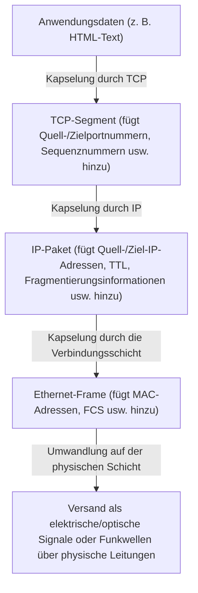

Router betrachten nur den Header (IP-Adresse) des IP-Pakets, um das Weiterleitungsziel zu bestimmen, und greifen überhaupt nicht in dessen Inhalt (TCP-Header oder Daten) ein. Dadurch ist es IP gelungen, die Unterschiede in den physischen Eigenschaften der darunterliegenden physischen Schicht (Glasfaser, Kupferdraht, Wi-Fi, 5G) vollständig zu verbergen und zu absorbieren, um der oberen Schicht ein "einziges virtuelles Netzwerk von globalem Maßstab" zur Verfügung zu stellen.

Am 1. Januar 1983 fand der "Flag Day" statt, an dem alle Hosts im ARPANET gleichzeitig von NCP zu TCP/IP wechselten, und hier wurde "das Internet" im wahrsten Sinne des Wortes geboren.

## 1.4 Der Aufstieg von NSFNET und die Entwicklung des autonom verteilten Routings

Nach dem Übergang zu TCP/IP entwickelte sich das Internet über den militärischen und Verteidigungsrahmen hinaus zu einer riesigen Infrastruktur für die akademische Forschung. Die entscheidende Triebkraft dafür war das "NSFNET", das in den späten 1980er Jahren von der National Science Foundation (NSF) in den USA aufgebaut wurde.

NSFNET wurde als Backbone-Netzwerk konzipiert, das fünf Supercomputing-Zentren in den Vereinigten Staaten miteinander verband. Die physische Schicht durchlief drastische Upgrades, anfangs 56 kbps, später T1-Leitungen (1,544 Mbps) und schließlich T3-Leitungen (45 Mbps). Die Universitäts- und regionalen Netzwerke (Regional Networks) wurden hierarchisch an dieses NSFNET-Backbone angebunden.

Da der Umfang des Netzwerks explosionsartig wuchs (skalierte), tauchte ein neues technologisches Problem auf: das "Limit des Routings". Die gemeinsame Nutzung der Routeninformationen von Zehntausenden von Knoten durch alle Relais-Router überstieg die physischen Grenzen der Speicherkapazität und Rechenleistung.

Um dieses Problem zu lösen, führte das Internet das Konzept der "Autonomen Systeme" (AS: Autonomous System) ein. Es definierte das Internet nicht mehr als ein einzelnes riesiges Netzwerk, sondern als eine Ansammlung von Netzwerken (AS) mit jeweils unabhängigen Verwaltungsrichtlinien neu.

Innerhalb eines AS (IGP: Interior Gateway Protocol) werden Link-State-Routing-Protokolle wie OSPF (Open Shortest Path First) verwendet, um mithilfe des Dijkstra-Algorithmus (Dijkstra's algorithm) eine vollständige Topologiekarte des Netzwerks zu erstellen und rasch den kürzesten Weg zu berechnen.

Andererseits war zwischen verschiedenen AS (EGP: Exterior Gateway Protocol) nicht einfach der kürzeste Weg gefragt, sondern es mussten geschäftliche und organisatorische Richtlinien widergespiegelt werden, "über welche Netzwerke die Kommunikation erlaubt ist". Um dies zu erreichen, wurde das "BGP (Border Gateway Protocol)" entwickelt, das bis heute das Fundament des Internets stützt. BGP verwendet einen Pfadvektor-Algorithmus (Path Vector), der Routing-Schleifen vollständig verhindert und den Austausch von Routing-Informationen zwischen ISPs (Internet-Service-Providern) auf der ganzen Welt ermöglicht.

Durch den Aufbau des NSFNET und die Etablierung von BGP wurde das Ökosystem des modernen kommerziellen Internets vollendet, in dem kein zentraler Administrator existiert, sondern einzelne Organisationen durch wiederkehrende gegenseitige Verbindungen (Peering und Transit) autonom als ein Gesamtnetzwerk funktionieren. 1995 hatte das NSFNET seine Aufgabe erfüllt, und der Betrieb des Backbones wurde vollständig an eine Reihe kommerzieller ISPs übergeben.

## 1.5 Die Geburt des WWW: Die Befreiung des Wissens durch Hypertext und die Überführung in die Public Domain

Gegen Ende der 1980er Jahre, als die Infrastruktur von der physischen Schicht über die Netzwerkschicht bis hin zur Transportschicht in globalem Maßstab etabliert war, nahm die im Internet gespeicherte Informationsmenge dramatisch zu. Im damaligen Internet wimmelte es jedoch von separaten Anwendungen wie FTP (Dateiübertragung), Telnet (Remote-Login) und USENET (elektronische Foren), wodurch Informationen tief in den Verzeichnissen einzelner Server isoliert (Silo-artig) waren. Um an gewünschte Daten zu gelangen, waren Kenntnisse der IP-Adresse des Zielservers oder komplexer UNIX-Befehle unerlässlich, was einen extrem undemokratischen Zustand darstellte.

Es war der Informatiker Tim Berners-Lee am Europäischen Kernforschungszentrum (CERN) in Genf (Schweiz), der diese Situation von Grund auf umkehrte und einen Paradigmenwechsel im Informationsaustausch herbeiführte. 1989 schlug er ein innovatives System namens "World Wide Web (WWW)" vor.

Der Kern seiner Idee bestand darin, "Hypertext" (Hypertext: das Konzept, Wörter innerhalb eines Dokuments mit einem anderen Dokument zu verlinken), das bereits seit den 1960er Jahren existierte, mit dem "Internet (TCP/IP)" zu verknüpfen. Er erweiterte das zuvor auf lokale Computer beschränkte Verweisziel von Hypertext auf Dokumente auf Servern am anderen Ende der Welt.

Um diesen gigantischen Informationsraum aufzubauen, entwarf und implementierte Berners-Lee im Alleingang drei überaus elegante technische Spezifikationen:

1. **URI (Uniform Resource Identifier):**
   Ein universelles Adressierungsschema, um den Speicherort jeder im Netzwerk vorhandenen Ressource (Text, Bild, Video usw.) eindeutig zu spezifizieren.
2. **HTTP (Hypertext Transfer Protocol):**
   Ein Protokoll der Anwendungsschicht zum Anfordern und Übertragen der durch eine URI spezifizierten Ressourcen zwischen dem Client (Webbrowser) und dem Server. Das Genialste an HTTP ist sein "zustandsloses" (Stateless) Design, bei dem kein "Zustand" der Kommunikation gespeichert wird. Dies ermöglichte es den Servern, Millionen von Client-Anfragen effizient zu bearbeiten.
3. **HTML (Hypertext Markup Language):**
   Eine Auszeichnungssprache, um die logische Struktur eines Dokuments zu beschreiben und Hyperlinks (Anker-Tags `<a>`) zu anderen Ressourcen einzubetten.

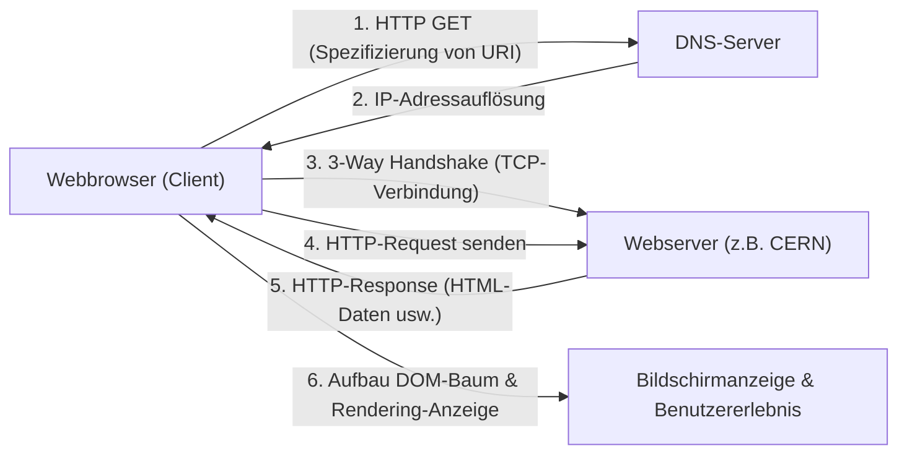

Ende 1990 wurden der weltweit erste Webserver (info.cern.ch) und der erste Browser auf einem NeXT-Computer in Betrieb genommen. Das frühe Web war textbasiert, aber dieses durch intuitive Links ermöglichte Informations-Erkundungserlebnis verbreitete sich im Nu unter den Forschern.

### Die historische Entscheidung für die Public Domain
Dass das WWW jedoch im wahrsten Sinne die Welt veränderte und sich als Infrastruktur der modernen Gesellschaft etablierte, liegt nicht nur an seiner exzellenten technischen Architektur. Das entscheidende Ereignis, das die Geschichte prägte, fand am 30. April 1993 statt.

Das CERN gab dem nachdrücklichen Wunsch von Tim Berners-Lee nach und traf die erstaunliche Entscheidung, die gesamten grundlegenden WWW-Technologien (Server-Software, Clients, Code-Bibliotheken) als "Public Domain (Verzicht auf geistiges Eigentum)" kostenlos freizugeben. Ein von den Direktoren des CERN unterzeichnetes Dokument erklärte den Verzicht auf jegliche Patentansprüche und Nutzungsgebühren.

Was wäre passiert, wenn das CERN damals die WWW-Technologie patentiert und versucht hätte, sie durch Softwarelizenzen zu monetarisieren? Ohne Zweifel hätte die heutige Informationsexplosion nicht stattgefunden. Das WWW wäre ein geschlossenes System geblieben, das nur wenigen finanzstarken Unternehmen oder Universitäten zugänglich gewesen wäre, und das Internet wäre im Standardisierungskrieg mit konkurrierenden Protokollen wie Gopher, die später aufkamen, zersplittert worden.

Durch diese Überführung in die Public Domain verschwanden die technischen und rechtlichen Barrieren vollständig, wodurch Hacker und Unternehmen auf der ganzen Welt dem WWW-Ökosystem beitraten. Marc Andreessen und andere am National Center for Supercomputing Applications (NCSA) der USA entwickelten "NCSA Mosaic", einen revolutionären grafischen Browser, der Bilder inline anzeigen konnte, und veröffentlichten ihn kostenlos, was später die Initialzündung für den Netscape Navigator und letztendlich für die Dotcom-Blase bildete. Die "Demokratisierung von Informationen", in der Einzelpersonen frei eigene Webserver betreiben und Informationen in die Welt senden können, war erreicht.

## 1.6 Fazit: Philosophie übertrifft Implementierung

Die Geschichte des Internets, die wir im ersten Kapitel betrachtet haben, ist nicht nur eine Geschichte der Steigerung von Übertragungsgeschwindigkeiten. Die Erfindung der Paketvermittlung, basierend auf der physischen Realität, dass "zentralisierte Kontrolle anfällig ist", das End-to-End-Prinzip, wonach "Komplexität von den Endpunkten übernommen werden sollte", und die Public-Domain-Freigabe des WWW unter dem Gedanken, dass "Informationen allen Menschen kostenlos zugänglich sein sollten".

Was das Internet zu dem macht, was es heute ist, sind weder herausragende Hardware noch Code, sondern diese starken und konsistenten "Designphilosophien". Das Überwinden der Einschränkungen der physischen Schicht durch logische Kapselung, das Akzeptieren von Diversität durch offene Standards (RFC: Request for Comments). Gerade wegen dieser Architektur, die Dezentralisierung und Freiheit schätzt, konnte das Internet eine beispiellose Skalierung erreichen.

Zwischen den für Menschen verständlichen "Namen" und den vom Netzwerk verarbeiteten "Zahlen (IP-Adressen)" klaffte jedoch nach wie vor eine tiefe Kluft. Im nächsten Kapitel werden wir den technologischen Mechanismus von "IP-Adressraum und der DNS (Domain Name System)-Tiefen" entwirren – jenem riesigen verteilten Datenbanksystem, das Ordnung in den Adressraum dieses weitläufigen, autonom dezentralisierten Netzwerks brachte und die explosive Verbreitung des WWW hinter den Kulissen unterstützte.

# Kapitel 2: Die physische Schicht und die Verbindungsschicht ~Die physische Entität digitaler Daten und Kommunikation zwischen Nachbarn~

Der Grundlage des riesigen Netzwerks namens Internet liegt eine enorme Kette physischer Phänomene zugrunde, die logische digitale Daten aus "0" und "1" in physische Phänomene wie elektrische Signale, Lichtblitze oder elektromagnetische Wellen umwandeln, um sie über Raum oder Medien hinweg zum Empfänger zu transportieren. Wenn wir beiläufig eine Website auf unseren Smartphones öffnen, rasen im Hintergrund Photonen durch die am Grund der Tiefsee liegenden Glasfasern, und unsichtbare Funkwellen mit komplexen Berechnungen fliegen durch den Raum.

In diesem Kapitel richten wir den Fokus auf die Schicht 1 (physische Schicht) und Schicht 2 (Verbindungsschicht) des OSI-Referenzmodells und gehen aus einer professionellen Perspektive so tief wie möglich in den "physischsten und erdigsten" Teil des Netzwerks, der unser Leben stützt, sowie in die präzisen logischen Mechanismen, die diese steuern.

## 2.1 Die physische Schicht (Physical Layer): Physische Manifestierung von Informationen und Gesetze des Universums

Die größte Mission der physischen Schicht ist es, die diskreten Bitketten (0 und 1), mit denen Computer arbeiten, in analoge physikalische Signale umzuwandeln (zu modulieren), die den physikalischen Eigenschaften der Übertragungsmedien (Kupferkabel, Glasfaser, Vakuum, Luft oder anderer Raum) entsprechen, und sie auf den Übertragungsweg zu setzen. Hier bestimmen die Gesetze der Elektrotechnik, der Quantenmechanik und der Optik die Grenzen der Kommunikation.

### Das Shannon-Hartley-Theorem und die Grenzen der Information
Ein unumgängliches Thema, wenn man von der physischen Schicht spricht, ist die von Claude Shannon im Jahr 1948 veröffentlichte Informationstheorie. Das "Shannon-Hartley-Theorem" liefert den mathematischen Beweis für die maximale Datenübertragungsrate (Kanalkapazität), die auf einem verrauschten Kanal fehlerfrei gesendet werden kann.

$$ C = B \log_2\left(1 + \frac{S}{N}\right) $$

Dabei ist $C$ die Kanalkapazität (bps), $B$ die Bandbreite (Hz) und $S/N$ der Signal-Rausch-Abstand (SNR). Diese wunderbare Gleichung zeigt, dass es – egal, wie sehr die Technik auch voranschreitet – eine physikalische Obergrenze (das Shannon-Limit) für die Menge an Informationen gibt, die bei einer bestimmten Bandbreite und Rauschumgebung gesendet werden kann. Ingenieure moderner Glasfaser- und Wi-Fi-Netzwerke führen einen endlosen Kampf darum, wie sie die Kommunikationsgeschwindigkeiten so nah wie möglich an dieses Limit pushen können.

### Die Physik von Glasfaser: Licht "einschließen" und transportieren
Das Rückgrat des modernen Internets ist zweifelsohne das Glasfaserkabel (Optical Fiber). Während Hochgeschwindigkeitsübertragungen über weite Strecken bei der elektrischen Kommunikation per Kupferdraht aufgrund von Skin-Effekt und elektromagnetischer Interferenz (EMI) schwierig sind, hat die Glasfaser diese Probleme überwunden.

Glasfaserkabel bestehen aus hochreinem Quarzglas, das in zwei Schichten aufgebaut ist: einem zentralen "Kern" (Core) und einem diesen umgebenden "Mantel" (Cladding). Indem der Brechungsindex des Kerns geringfügig (weniger als wenige Prozent) höher eingestellt wird als der des Mantels, wird nach dem snelliusschen Brechungsgesetz Licht, das in einem flacheren Winkel als ein bestimmter kritischer Winkel einfällt, an der Grenzfläche zwischen Kern und Mantel wiederholt totalreflektiert (Total Internal Reflection). Dadurch schreitet das Licht im Inneren der Faser fort, ohne nach außen zu entweichen.

#### Der Kampf gegen Dispersion und Dämpfung: Das Glas, das den Nobelpreis einbrachte
Früheres Glas hatte viele Verunreinigungen und das Licht schwächte sich nach einigen Metern ab. Im Jahr 1966 stellte Dr. Charles K. Kao (Nobelpreisträger für Physik 2009) fest, dass die Ursache für die Dämpfung von Glasfaserkabeln nicht in der eigentlichen Beschaffenheit des Glases lag, sondern an Verunreinigungen (insbesondere Hydroxylgruppen und Übergangsmetalle), und prognostizierte, dass die Fernkommunikation möglich würde, wenn man die Reinheit erhöhe. Das von Corning in den 1970er Jahren entwickelte extrem verlustarme Quarzglas erreichte eine erstaunlich geringe Dämpfung von 0,2 dB/km im Wellenlängenbereich von 1550 nm (C-Band). Dies bedeutete, dass selbst nach 15 km nur die Hälfte der Lichtintensität verloren ging.

Wenn sich Licht jedoch über lange Strecken bewegt, treten "chromatische Dispersion" (Chromatic Dispersion) und "modale Dispersion" (Modal Dispersion) auf, wodurch die Impulsform verzerrt wird. Chromatische Dispersion entsteht, weil die Ausbreitungsgeschwindigkeit im Glas je nach Lichtwellenlänge (Farbe) variiert. Modale Dispersion ist ein Phänomen, bei dem durch das Vorhandensein mehrerer Lichtpfade (Moden) innerhalb des Kerns Unterschiede in der Ankunftszeit entstehen.
Um dies zu überwinden, wurde die "Singlemode-Faser" (SMF) entwickelt, bei der der Kerndurchmesser auf wenige Mikrometer in die Nähe der Lichtwellenlänge verengt wurde, sodass nur ein einziger Lichtpfad hindurchgelassen wird; sie wurde zum Mainstream bei Langstreckenübertragungen wie der interkontinentalen Kommunikation.

#### EDFA und WDM: Die Renaissance der optischen Kommunikation
In den 1990er Jahren fanden in der optischen Kommunikation zwei Revolutionen statt. Die erste war der Erbium-dotierte Faserverstärker (EDFA: Erbium-Doped Fiber Amplifier). Bis dahin bedurfte es langsamer, kostspieliger regenerativer Repeater, die gedämpfte optische Signale zunächst in elektrische Signale umwandelten, verstärkten und wieder in Licht zurückwandelten. Der EDFA ermöglichte es, das Licht als Licht direkt zu verstärken, indem dem Faserkern das Seltenerdelement Erbium beigemischt wurde und durch Einstrahlen von Anregungslicht (Pump-Licht) von außen eine stimulierte Emission beim Durchqueren des Signallichts ausgelöst wurde.

Die zweite ist das Wellenlängenmultiplexverfahren (WDM: Wavelength Division Multiplexing). Das ist eine Technologie, die das Superpositionsprinzip nutzt – die Eigenschaft von Licht, dass unterschiedliche Wellenlängen (Farben), auch wenn sie gleichzeitig im gleichen Raum freigesetzt werden, nicht miteinander vermischt, sondern unabhängig fortbestehen –, um mehrere Signale verschiedener Wellenlängen gebündelt in einer Faser gleichzeitig zu übertragen. Dank Dense Wavelength Division Multiplexing (DWDM) können heute auf einer einzigen Glasfaser über 100 Signale mit Wellenlängenabständen im Millimeterbereich übermittelt werden, wodurch enorme Bandbreiten im Bereich von dutzenden Tbps bis zu mehreren Pbps mit einer einzigen Faser realisiert werden.

### Unterseekabel: Das Nervennetz der Erde
Mehr als 99 % der Datenkommunikation zwischen Kontinenten werden nicht per Satellit, sondern durch Unterseekabel übertragen. Auch Cloud-Daten und Bilder von Websites im Ausland reisen alle ganz physisch über den Meeresgrund.

#### Eine Geschichte von Scheitern und Herausforderungen
Die Geschichte der Unterseekabel ist weit älter als das Internet. Die erste große Herausforderung war 1858 das transatlantische Telegrafenkabel. Zwar konnte der mit Guttapercha – einer Form von Naturkautschuk – isolierte Kupferdraht erfolgreich verlegt werden, doch durch den Betrieb mit Hochspannung, unter Ignorierung der Warnungen von Lord Kelvin (William Thomson), kam es nach wenigen Wochen zum Durchschlagen der Isolierung und der Verstummung. In langer Zeit wurden daraufhin die Theorie und die Materialien verbessert, bis 1988 mit dem "TAT-8", dem ersten transpazifischen optischen Unterseekabel, der Betrieb aufgenommen und das Zeitalter des Lichts eingeläutet wurde.

#### Struktur von Kabeln und der Mechanismus der Verlegung
Moderne Unterseekabel, die auf einer Wassertiefe von tausenden Metern verlegt werden, sind für extreme Umgebungen ausgelegt. Um die aus wenigen Glasfasern bestehende Bündelung im Zentrum zu schützen, sind sie in mehrfacher Ausfertigung durch hochfeste Stahlseile, Kupfer- oder Aluminiumrohre zur Wasserbeständigkeit und Polyethylen-Isolatoren geschützt. Im tiefen Ozean haben sie trotz des Widerstands gegen Haibisse und extremen Wasserdruck zugunsten der Gewichtsreduktion nur wenige Zentimeter im Durchmesser, aber in flacheren Gewässern sind sie mit dicken Panzerschichten (Armoring) versehen, um sie vor Schleppnetzen von Fischereischiffen, Schiffsankern und Unterseebeben zu schützen, wodurch ihr Durchmesser über zehn Zentimeter erreicht.

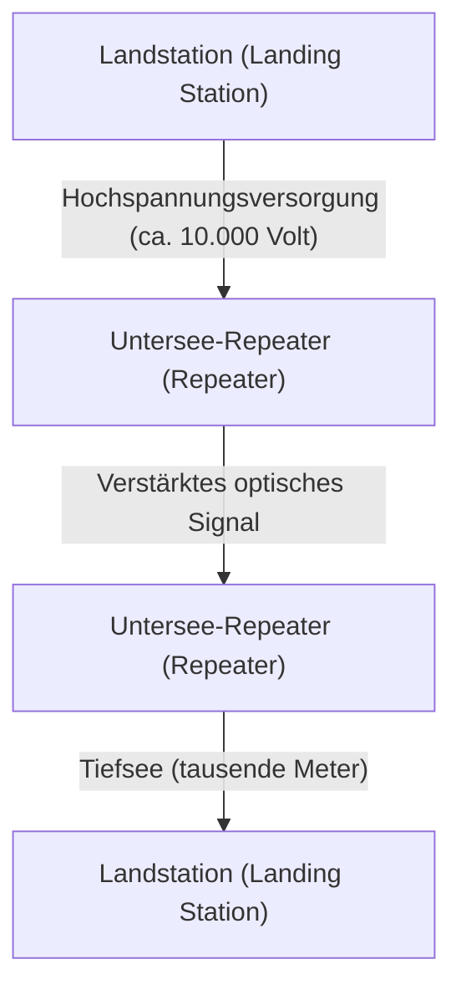

Selbst bei der Verwendung von extrem verlustarmen Fasern wird das optische Signal alle paar Dutzend Kilometer gedämpft; deshalb werden in regelmäßigen Abständen "Untersee-Verstärker" (Repeater) in das Kabel zwischengeschaltet. Die elektrische Leistung zum Betreiben dieser Repeater (die den oben erwähnten EDFA enthalten) in der Tiefsee wird kontinuierlich durch ein Kupferrohr innerhalb des Kabels von den Landstationen an beiden Enden mit einem hochvolumigen Gleichstrom zwischen Tausenden bis über 10.000 Volt übertragen.
Die Verlegung erfolgt über spezielle "Kabelverlegeschiffe", wobei in flacheren Zonen ein Tauchroboter (ROV) Rillen auf dem Meeresgrund aushebt, in die das Kabel eingelassen wird. Wird ein Kabel durchtrennt, eilen Reparaturschiffe zum Ort des Geschehens, ziehen die Kabelenden mit einem Greifer (klauenartiger Anker) aus der Tiefsee an Bord hoch, wo erfahrene Techniker die optische Faser mit einer Genauigkeit von wenigen Mikrometern zusammenspleißen – eine extrem analoge und schmutzige Handarbeit.

### Physik der Funkkommunikation (Die Grundlage von Wi-Fi)
Durch die Verbreitung von mobilen Geräten und IoT ist die Kommunikation per im Raum zirkulierender elektromagnetischer Wellen (Funkwellen) ebenfalls zum Hauptaktionsfeld der physikalischen Schicht geworden. Wi-Fi (die IEEE 802.11-Standardfamilie) nutzt hauptsächlich 2,4-GHz- und 5-GHz-Bänder sowie das in den letzten Jahren freigegebene 6-GHz-Band, die zu den ISM-Bändern gehören (Bänder für industrielle, wissenschaftliche und medizinische Zwecke, die lizenzfrei verwendet werden können).

#### Extreme Informationskomprimierung durch QAM (Quadraturamplitudenmodulation)
Bei der "Modulation", durch die digitale Daten auf analoge Wellen aufgespielt werden, greift Wi-Fi auf extrem fortschrittliche Technologien zurück: das QAM (Quadrature Amplitude Modulation: Quadraturamplitudenmodulation).
Wellen wie elektromagnetische Radiowellen haben zwei physikalische Größen: "Amplitude" (Wellenhöhe) und "Phase" (Timing/Winkel der Welle). QAM kombiniert zwei Trägerwellen (das I-Signal und das Q-Signal), die um 90 Grad phasenverschoben sind, und verändert deren jeweilige Amplituden, wodurch sie einer bestimmten Bitfolge an einem bestimmten "Punkt" auf der Konstellationskarte zugewiesen werden.

So kann beispielsweise 16-QAM mit einem einzigen Wellenwechsel (Symbol) 16 Punkte (4 Bit) ausdrücken. Bei dem neuesten Wi-Fi 7 (802.11be) kommt die geradezu wahnwitzige Hochdichtemodulation 4096-QAM zum Einsatz, welche in einem Modulationsschritt 4096 Punkte (12 Bit) repräsentiert. Auf einer Konstellationskarte, auf der sich 4096 Punkte drängen, muss der Empfänger genau bestimmen, welcher der übertragenen "Punkte" gemeint war, ohne sich von minimalem Rauschen beirren zu lassen. Dies wird durch hochentwickelte Fehlerkorrekturcodes und leistungsstarke Signalprozessoren möglich.

#### OFDM und MIMO: Der Kampf gegen Mehrwegempfang und die Nutzung des Raums
Funkwellen bewegen sich nicht nur geradlinig fort, sondern werden auch von Wänden und Möbeln reflektiert, gebeugt und gestreut. Infolgedessen erreichen vom Sender abgegebene Funkwellen den Empfänger über unterschiedliche Wege (Multipath) mit leicht verschobenem Timing, verursachen Interferenzen (Fading) und zerstören so die Wellenform.
Die Technologien, die dies zu ihrem Vorteil nutzen oder es überwinden, heißen OFDM und MIMO.

**OFDM (Orthogonal Frequency-Division Multiplexing)** ist eine Technologie, die, anstelle eines extrem reaktiven Breitband-Einzelsignals, das Frequenzband fein in zahlreiche sehr enge Frequenzen (Unterträger) aufteilt und über diese parallel in langsamerem Tempo Daten sendet. Da die Unterträger so platziert sind, dass sie "orthogonal" zueinander stehen (mathematisch gesehen interferieren sie nicht miteinander), ist die Nutzungseffizienz der Frequenzen extrem hoch und sie widerstehen Zeitverzögerungen durch Multipath-Ausbreitung (Mehrwegempfang).

**MIMO (Multiple-Input and Multiple-Output)** ist eine Technologie der "räumlichen Multiplexierung", die mehrere Antennen verwendet, um unterschiedliche Daten gleichzeitig auf derselben Frequenz zu übertragen. Sie nutzt die Eigenschaft, dass sich die Wellen an unterschiedlichen Orten im Raum durch Multipath-Reflexion unterschiedlich vermischen; die über mehrere Antennen auf der Empfängerseite aufgenommenen komplexen Signale werden dabei getrennt, ähnlich der Lösung eines simultanen Gleichungssystems, wodurch die Kommunikationskapazität proportional zur Anzahl der Antennen vervielfacht wird. Darüber hinaus ist das **Beamforming**, bei dem die Phasen der Funkwellen für jede Antenne feineingestellt werden, um einen gebündelten Funkwellenstrahl in eine spezifische Richtung zu konzentrieren, zu einer unverzichtbaren Technik des modernen Wi-Fi geworden.

## 2.2 Die Verbindungsschicht (Data Link Layer): Dialog und Ordnung zwischen direkt miteinander verbundenen Geräten

Während die physikalische Schicht als bloßer "Träger von Signalen" fungiert, bündelt die Verbindungsschicht deren unaufbereitete Bits in sinnhafte Einheiten, "Frames" genannt. Diese Ebene ist verantwortlich für die Regeln und die Verkehrsordnung, um die Frames innerhalb desselben Netzwerks (Links) zuverlässig an ihr korrektes Ziel zu bringen.

### Geschichte des Ethernets: Die Inspiration von ALOHA
Das Ethernet (IEEE 802.3) ist derzeit der weltweite De-facto-Standard für kabelgebundenes LAN.
Dessen Wurzeln gehen auf ein an der Universität von Hawaii aufgebautes Funkkommunikationsnetzwerk namens "ALOHAnet" zurück. ALOHAnet bediente sich eines äußerst chaotischen und zugleich ehrgeizigen Protokolls, bei dem galt: "Wenn Daten gesendet werden sollen, schick sie einfach los; kollidieren sie und gehen kaputt, warte eine zufällige Zeit lang und sende sie nochmals."

Im Jahr 1973 wandte Bob Metcalfe am Palo Alto Research Center (PARC) von Xerox die Idee von ALOHAnet auf die Kommunikation über Koaxialkabel an und erfand das Ethernet. Das frühe Ethernet hatte eine "Bus"-Topologie, bei der viele Computer sich ein einzelnes dickes Koaxialkabel (Yellow Cable) teilten, indem sie Nadeln, sogenannte Vampire Taps, hineinstachen.

#### CSMA/CD: Geordnete Anarchie
Da alle das Medium (Kabel) gemeinsam nutzen, kommt es zu einer "Kollision" (Collision), bei der sich die Wellenformen überlagern und Daten zerstört werden, wenn mehrere Geräte gleichzeitig elektrische Signale senden. Ein autonom verteilter Algorithmus zur Vermeidung und Lösung dieses Problems ist "CSMA/CD" (Carrier Sense Multiple Access with Collision Detection).

1. **Carrier Sense (Trägerprüfung)**: Vor dem Senden wird die Spannung auf dem Kabel gemessen und man "lauscht", ob jemand anderes kommuniziert.
2. **Multiple Access (Mehrfachzugriff)**: Wenn niemand kommuniziert, darf jeder nach Belieben ohne auf eine zentrale Erlaubnis zu warten senden.
3. **Collision Detection (Kollisionserkennung)**: Auch während des Sendens wird die Kabelspannung überwacht. Wird ein ungewöhnlicher Spannungsanstieg festgestellt, der sich vom eigenen Sendesignal unterscheidet, wird dies als "Kollision" gewertet. Man sendet sofort ein Jam-Signal aus, um allen anderen die Kollision mitzuteilen, und bricht das Senden ab.
4. **Backoff (Rückzug)**: Nach einer Kollision wartet jeder Knoten eine zufällige Zeit (berechnet durch den exponentiellen Backoff-Algorithmus), bevor er einen erneuten Sendeversuch unternimmt.

Genau dieser einfache, keinen zentralen Administrator erfordernde Mechanismus der Prämisse "Regelverstöße (Kollisionen) werden vorausgesetzt, und wenn sie passieren, wartet man zufällig" ist der Hauptgrund dafür, dass Ethernet komplexe und teure Protokolle wie Token Ring von IBM oder ATM besiegte und die Vorherrschaft erlangte.

### MAC-Adresse: Die absolute Identifikation der Hardware
Für die Zielbestimmung in der Verbindungsschicht wird die MAC-Adresse (Media Access Control address) verwendet. Wenn die IP-Adresse die "vorübergehende Adresse" ist, dann ist die MAC-Adresse die "angeborene Personalausweisnummer".

Eine MAC-Adresse ist 48 Bit (6 Byte) lang und wird als zweistellige Hexadezimalzahlen, getrennt durch Doppelpunkte, ausgedrückt (z. B. "00:1A:2B:3C:4D:5E").
- **Erste 24 Bit (OUI: Organizationally Unique Identifier)**: Ein von der IEEE verwalteter und zugewiesener Unternehmenscode, der Hersteller von Netzwerkgeräten (Apple, Cisco, Intel usw.) eindeutig identifiziert.
- **Letzte 24 Bit (UAA: Universally Administered Address)**: Eine Seriennummer, die der Hersteller seinen Produkten fortlaufend zuweist.

Im Prinzip besitzt die Netzwerkschnittstellenkarte (NIC) jedes Netzwerkgeräts auf der Welt eine weltweit einzigartige, fest in den ROM eingebrannte MAC-Adresse.

### Frame-Struktur: Die Verpackungstechnik der Kommunikation
In der Verbindungsschicht werden den aus der Netzwerkschicht kommenden Daten (z. B. IP-Paketen) Header und Trailer hinzugefügt und sie in einer Einheit namens "Frame" gekapselt. Die Struktur des Ethernet-Frames (Ethernet II) ist auf geradezu künstlerische Weise raffiniert.

1. **Präambel (Preamble)**: Eine 7 Byte lange Sequenz von "10101010". Eine Aufwärmübung zur Taktsynchronisation (Timing-Anpassung) der empfangenden NIC.
2. **SFD (Start Frame Delimiter)**: 1 Byte "10101011". Indem das Ende der Präambel zu "11" wird, wird dem Empfänger signalisiert: "Ab hier beginnen die eigentlichen Daten."
3. **Ziel-MAC-Adresse (Destination MAC) / Quell-MAC-Adresse (Source MAC)**: Jeweils 6 Byte. Von wem zu wem die Kommunikation stattfindet. Ist das Ziel "FF:FF:FF:FF:FF:FF", handelt es sich um einen Broadcast-Frame, der alle erreicht.
4. **Typ (EtherType)**: 2 Byte. Zeigt an, welche Daten in der Payload enthalten sind (0x0800 für IPv4, 0x86DD für IPv6, 0x0806 für ARP).
5. **Nutzlast (Data/Payload)**: Die eigentlichen, von den oberen Schichten entgegengenommenen Daten. Die Größe reicht von 46 Byte bis zu einem Maximum von 1500 Byte (MTU: Maximum Transmission Unit).
6. **FCS (Frame Check Sequence)**: Ein 4 Byte langer Trailer. Ein mittels CRC-32 (zyklische Redundanzprüfung) berechneter Hash-Wert aus dem gesamten Frame (von der Ziel-MAC bis zur Payload).

Die empfangende NIC berechnet während des Empfangs des Frames auf Hardwareebene rasant das CRC. Unterscheidet sich die angehängte FCS auch nur in einem Bit vom eigenen Berechnungsergebnis, geht sie davon aus, dass die Daten durch Rauschen oder Kollisionen während der Kommunikation beschädigt wurden, und **verwirft den Frame unbarmherzig und ohne jegliche Benachrichtigung**. Die Verbindungsschicht führt das "Erkennen von Fehlern und Wegwerfen" zwar zuverlässig aus, verfügt jedoch nicht über die Funktion, eine erneute Übertragung anzufordern, weil etwas beschädigt war. Diese Rollenverteilung, bei der die schwere Verantwortung der Übertragungswiederholung höheren Protokollen wie TCP überlassen wird, unterstützt die Skalierbarkeit des Internets.

### Die Geburt des Switching-Hubs und die Entwicklung zur Vollduplex-Kommunikation
Das geteilte Bus-Ethernet mit CSMA/CD war ein wunderbares System, hatte jedoch die fatale Schwäche, dass mit zunehmender Anzahl von Netzwerkgeräten (Hosts) Kollisionen häufiger auftraten und der effektive Durchsatz drastisch sank.
Dies wurde grundlegend durch den "Layer-2-Switch (Switching Hub)" gelöst, der in den 1990er Jahren weite Verbreitung fand.

Während ein Hub (Repeater Hub) ein Gerät der physischen Schicht ist, das empfangene elektrische Signale bedingungslos an alle Ports verteilt, besitzt ein Switch ein cleveres Gehirn, das die Verbindungsschicht versteht.
Der Switch verfügt intern über eine "MAC-Adresstabelle", die einen Speicher (CAM-Tabelle) nutzt. Er erlernt die Quell-MAC-Adressen der an jeden Port angeschlossenen Geräte und erstellt automatisch eine Zuordnungstabelle von Ports zu MAC-Adressen.
Wenn nun ein Frame eintrifft, gleicht der Switch die Ziel-MAC-Adresse mit der Tabelle ab und leitet den Frame "nur" an den Port weiter, an dem das betreffende Gerät angeschlossen ist (Forwarding).

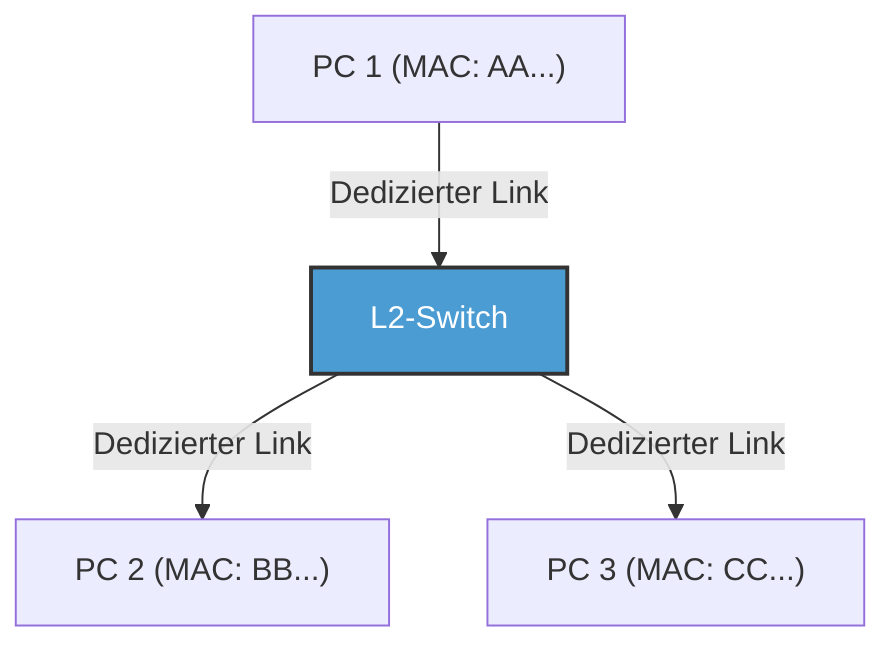

Durch die Einführung von Switches wurden die Leitungen zwischen jedem Knoten und dem Switch sowohl logisch als auch physisch unabhängig (Stern-Topologie). Dadurch wurden die Kommunikationswege getrennt, weshalb Kollisionen aus prinzipiellen Gründen nicht mehr auftraten. In der Folge wurde die "Vollduplex-Kommunikation" (Full-Duplex) möglich, bei der Leitungen zum Senden und Empfangen gleichzeitig genutzt werden.
Im modernen Ethernet wird der CSMA/CD-Algorithmus nicht mehr verwendet, da es sich zu einer reinen Punkt-zu-Punkt-Vollduplex-Kommunikation weiterentwickelt hat. Darüber hinaus ermöglicht die VLAN-Technologie (Virtual LAN) gemäß IEEE 802.1Q die flexible Unterteilung und Integration logischer Netzwerke ohne Bindung an physische Verkabelungen, womit es weiterhin unangefochten als absolute Grundlagentechnologie die Infrastruktur von Unternehmen und riesigen Rechenzentren stützt.

### Die Verbindungsschicht des Wi-Fi: Verkehrsregelung im unsichtbaren Funkwellenraum
Während das kabelgebundene Ethernet sich zur kollisionsfreien Vollduplex-Kommunikation weiterentwickelte, steht das drahtlose Wi-Fi vor derselben schwierigen Herausforderung wie das einstige Shared-Bus-Ethernet: "Alle teilen sich dasselbe Medium (den Raum/die Luft)."

Bei der Funkkommunikation ist es physikalisch unmöglich, Kollisionen zu "erkennen (CD)", da die eigenen Funkwellen während des Sendens zu stark sind, um gleichzeitig die schwachen Funkwellen anderer zu empfangen. Außerdem besteht das funkwellenspezifische Risiko des "Hidden-Node-Problems" (Problem der versteckten Stationen) – beispielsweise wenn Station A und C auf gegenüberliegenden Seiten eines Access Points die Funkwellen der jeweils anderen nicht empfangen können, ihre Funkwellen aber bei gleichzeitigem Senden am Access Point kollidieren.

Daher wird im Verbindungsschicht-Protokoll (MAC-Schicht) von Wi-Fi "CSMA/CA" (Carrier Sense Multiple Access with Collision Avoidance: Kollisionsvermeidung) angewendet.
Bei CSMA/CA wird der Raum vor dem Senden für eine bestimmte Zeit (DIFS) auf Funkwellen abgehört und zusätzlich eine zufällige Backoff-Zeit abgewartet, bevor die Übertragung beginnt. Der wichtigste Unterschied ist der **ACK (Acknowledge: Bestätigung)**-Mechanismus, den es beim Kabel nicht gab. Beim Wi-Fi sendet der Empfänger nach dem Empfang von Daten sofort (nach einer extrem kurzen Wartezeit, SIFS genannt) einen ACK-Frame zurück, der anzeigt, dass sie erfolgreich empfangen wurden. Der Sender wertet die Kommunikation erst dann als erfolgreich, wenn er diese ACK erhält. Bleibt das ACK aus, geht er davon aus, dass die Daten durch eine Kollision oder Interferenz zerstört wurden, verdoppelt die Backoff-Zeit und versucht eine Neuübertragung.

Zur Lösung des Hidden-Node-Problems gibt es außerdem den Mechanismus des "RTS/CTS-Handshakes". Vor dem Senden großer Datenmengen sendet der Sender einen kurzen Kontroll-Frame namens RTS (Request to Send), und der Empfänger (z. B. der Access Point) antwortet mit CTS (Clear to Send). Dieses CTS enthält Informationen über eine reservierte Zeit (NAV: Network Allocation Vector), was so viel bedeutet wie: "Von nun an wird für XX Mikrosekunden kommuniziert, also bleiben umliegende Endgeräte bitte still." Alle umliegenden Stationen, die dies empfangen, stellen ihre Kommunikation ein. Auf diese Weise betreibt die Verbindungsschicht von Wi-Fi eine meisterhafte Verkehrsregelung im unsichtbaren Funkwellenraum.

---

## Fazit

Eine Welt physikalischer Phänomene, in der Photonen durch Glas rasen, dem Wasserdruck der Tiefsee standhalten und bei sich verändernder Phase und Amplitude durch den Raum fliegen. Und indem über diese rauschbehafteten, unsicheren physikalischen Phänomene Mechanismen wie Synchronisation durch die Präambel, individuelle Identifikation durch MAC-Adressen, strenge Fehlererkennung durch CRC und raffinierte Verkehrssteuerung durch Switching oder CSMA/CA gelegt werden, wird es überhaupt erst möglich, "sinnvolle Datenblöcke (Frames) fehlerfrei an das Nachbargerät auszuliefern". Das ist das Wunder, das die erste und zweite Schicht vollbringen.

Damit allein kann jedoch kein weltumspannendes Internet entstehen. Denn die Kommunikation über MAC-Adressen funktioniert nur innerhalb eines engen "Dorfes" namens "gleiches Netzwerk (Broadcast-Domain)" – also nur zwischen Geräten, die an denselben Switch oder Access Point angeschlossen sind, oder bis sie durch einen Router blockiert wird.

Im nächsten Kapitel "Kapitel 3: Netzwerkschicht und IP" werden wir uns der Essenz von IP (Internet Protocol) und dem Routing nähern – jenem gigantischen Routenfindungsmechanismus, der diese unzähligen lokalen Dörfer miteinander verbindet und Pakete wie bei einer Eimerkette in ein unbekanntes Netzwerk auf der anderen Seite der Erde befördert.

# Kapitel 3: Die Netzwerkschicht und die Mechanismen des Routings —— Die Seekarte von Paketen auf dem großen Ozean

Das Fundament des Internets, das wir tagtäglich nutzen, ist die Schicht 3 im OSI-Referenzmodell, also die "Netzwerkschicht". Dass wir über die direkte Kommunikation via physischer Kabel und Funkwellen (Verbindungsschicht) hinaus weltweit mit Tausenden Kilometern entfernten Servern kommunizieren können, liegt an einem riesigen Mechanismus der Routensteuerung (Routing), in dem unzählige Router miteinander vernetzt sind und autonom Informationen austauschen.

In diesem Kapitel wird extrem detailliert und aus technologischer, historischer und physikalischer Sicht die "Navigationskunst", durch die Pakete ihr Ziel erreichen, erläutert – von der Struktur von IP (Internet Protocol) über die Grenzen von IPv4 und die Architektur von IPv6 bis in die Tiefen des BGP (Border Gateway Protocol), das Autonome Systeme (AS) auf der ganzen Welt verbindet.

## 3.1 Das Paradigma der Netzwerkschicht: Das End-to-End-Prinzip

Der größte Durchbruch in der Designphilosophie des Internets ist das **End-to-End-Prinzip**, nach dem "Zwischenknoten (Router) im Netzwerk sich ausschließlich auf einfache Paketweiterleitungen beschränken, während komplexe Verarbeitungen (Fehlerkorrektur und Sequenzgarantie) an den Endpunkten (Endhosts) stattfinden".

In herkömmlichen Telefonnetzwerken (Leitungsvermittlung) belegte man vom Beginn bis zum Ende der Kommunikation eine physische Leitung, und das Netzwerk als Ganzes verwaltete Zustände (States). Im Gegensatz dazu ist die Netzwerkschicht des Internets (Paketvermittlung) "verbindungslos" (connectionless) und zustandslos. Jedes Paket wird als unabhängiger "Brief" behandelt; Router führen wiederholt die einfache Aufgabe aus, ihn zu empfangen, das Ziel zu betrachten und ihn an den optimalen nächsten Zwischenstopp (Next Hop) weiterzuleiten (Forwarding). Diese Kombination aus "Dumb Network" und "Smart Terminal" ist der Hauptgrund, warum das Internet derart explosiv skalieren und unterschiedlichste Anwendungen aufnehmen konnte.

## 3.2 Die Adressen des Internets: Entwicklung der IP-Adressen und die Geschichte ihrer Erschöpfung

Jedem Gerät im Netzwerk wird eine IP-Adresse, eine eindeutige Kennung, zugewiesen. Derzeit befindet sich das Internet in einer Übergangsphase, in der zwei Generationen von IP-Protokollen nebeneinander existieren.

### IPv4: Ein 32-Bit-Raum und der Widerstand gegen die Erschöpfung

IPv4, definiert 1981 in RFC 791, verfügt über einen 32-Bit-Raum (ca. 4,3 Milliarden Adressen). Zu Beginn des Designs erschien die Zahl von 4,3 Milliarden noch unvorstellbar groß, doch durch die rasante Verbreitung des Internets wurde bereits in den 1990er Jahren Alarm geschlagen, dass die Adressen ausgehen könnten.

Um diese Krise zu überwinden, wurden **CIDR (Classless Inter-Domain Routing)** und **NAT (Network Address Translation)** geschaffen.
Frühe Zuweisungen von IP-Adressen erfolgten über ein grobes "klassenbasiertes" (Classful) System mit Klasse A (/8), Klasse B (/16) und Klasse C (/24), was zu gravierender Adressverschwendung führte. CIDR ersetzte dies durch eine Subnetzmaske mit variabler Länge (VLSM) und realisierte ein "klassenloses" (Classless) Routing, bei dem nur so viele Adressen zugewiesen werden wie nötig.
Zudem ermöglichte das Aufkommen von NAT die Verknüpfung von privaten IPv4-Adressräumen mit einer einzigen globalen IPv4-Adresse, wodurch sich Tausende von Geräten eine einzige Adresse teilen konnten. Allerdings brach NAT das End-to-End-Prinzip und führte dazu, dass bei P2P-Kommunikation und Echtzeitkommunikation komplexe NAT-Traversal-Techniken (wie STUN/TURN/ICE) erforderlich wurden.

### IPv6: Ein unendlicher 128-Bit-Raum und die Header-Struktur der nächsten Generation

Als grundlegende Lösung für den Adressmangel wurde 1998 im RFC 2460 **IPv6** konzipiert. IPv6 besitzt einen 128-Bit-Adressraum und bietet mit `$2^{128}$` (ca. 340 Sextillionen) Adressen einen derart weiten Raum, dass selbst dann noch Adressen übrig blieben, wenn man jedem Sandkorn auf der Erde eine eigene Adresse zuweisen würde.

Die Innovation von IPv6 besteht nicht nur in der Adresslänge. Die Header-Struktur wurde drastisch vereinfacht. Die Optionen variabler Länge und die Header-Prüfsumme, die im IPv4-Header vorhanden waren, wurden abgeschafft, und der Basis-Header auf 40 Byte fixiert. Dadurch wurde die Paketverarbeitung (Routing) in der Hardware (ASIC oder TCAM) beschleunigt. Ferner wurde die Spezifikation so geändert, dass die Fragmentierung (Aufteilung von Paketen) nicht mehr in Zwischenroutern, sondern nur noch im Quellhost erfolgt, was die Last auf den Routern erheblich reduzierte.

## 3.3 Die zwei Gesichter des Routings: Control Plane und Data Plane

Das Innere eines Routers gliedert sich im Wesentlichen in zwei "Planes" (Ebenen).

1. **Control Plane (Steuerebene)**
   Dies ist das Gehirn, in dem Router über Routingprotokolle (wie OSPF oder BGP) miteinander kommunizieren, die Topologie (Verbindungsstruktur) des Netzwerks erlernen und optimale Routen berechnen. Die Berechnungsergebnisse werden in einer Datenbank namens RIB (Routing Information Base) abgelegt.
2. **Data Plane (Daten-/Weiterleitungsebene)**
   Dies ist der muskuläre Teil, der physisch Pakete empfängt, anhand der Ziel-IP-Adresse die Schnittstelle bestimmt, über die das Paket als Nächstes ausgegeben wird, und es weiterleitet. Er verwendet eine aus der RIB generierte, auf Weiterleitung spezialisierte Tabelle namens FIB (Forwarding Information Base) und nutzt speziellen Speicher wie TCAM (Ternary Content-Addressable Memory), um Pakete mit Hardware-Wire-Speed im Nanosekundenbereich weiterzuleiten.

## 3.4 Die interne Verwaltung von Netzwerken: IGP und Autonome Systeme (AS)

Das Internet ist kein einzelnes, gigantisches Netzwerk, sondern eine Ansammlung unabhängiger Netzwerke, die von ISPs (Internet Service Providern), Unternehmen, Universitäten usw. verwaltet werden. Solch ein unabhängiger Verwaltungsbereich wird als **AS (Autonomous System: Autonomes System)** bezeichnet. Heute gibt es weltweit mehr als 100.000 solcher AS.

Für das Routing innerhalb eines AS (in Unternehmensnetzwerken oder ISP-Backbones) wird **IGP (Interior Gateway Protocol)** verwendet. Zu den typischen IGPs gehören die folgenden zwei:

- **OSPF (Open Shortest Path First) / IS-IS**
  Diese sind "Link-State"-Routingprotokolle. Ein Router überflutet (flooding) das gesamte Netzwerk mit dem Verbindungsstatus seiner Umgebung (Bandbreite und Status von Links), und jeder Router erstellt eine vollständige Karte (Topologiedatenbank) des gesamten Netzwerks. Auf dieser Karte führt er den Dijkstra-Algorithmus (Kürzeste-Wege-Algorithmus) aus, um den Weg zum Ziel mit den geringsten "Kosten" zu berechnen. Dies ist physisch und mathematisch derselbe Ansatz, den ein Autonavigationssystem nutzt, wenn es die kürzeste Route unter Einbeziehung von Verkehrsstauinformationen berechnet.

## 3.5 BGP: Das "Diplomatie"-Protokoll, das das Internet verwebt

Während das Innere eines AS durch Protokolle wie OSPF verwaltet wird, ist das **BGP (Border Gateway Protocol)** als einzigartiger De-facto-Standard der **EGP (Exterior Gateway Protocol)** dafür zuständig, verschiedene AS miteinander zu verbinden und das globale Internet zu formen. BGP ist ein höchst einzigartiges Protokoll, das Routen nicht nur auf der Grundlage der kürzesten technischen Distanz festlegt, sondern auch "geschäftliche Beziehungen" und "zwischenstaatliche Richtlinien" widerspiegelt.

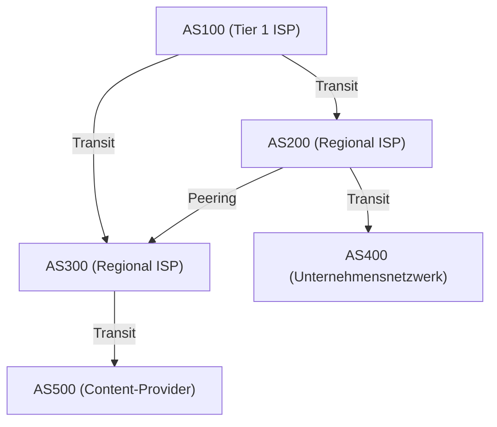

### Peering und Transit: Die Ökonomie des Internets

Bei der AS-übergreifenden Verbindung durch BGP gibt es im Wesentlichen zwei Geschäftsmodelle:

1. **Transit**
   Eine Beziehung, in der kleinere ISPs oder Unternehmen Kommunikationsgebühren an riesige ISPs zahlen, um Erreichbarkeit zu jedem Ort im Internet (Full Route) zu erhalten. Dies entspricht einer hierarchischen Beziehung zwischen "Kunde" und "Provider".
2. **Peering**
   Eine Beziehung, bei der ISPs untereinander oder ISPs und Content-Provider (wie Google oder Netflix) über IX (Internet Exchanges) o. Ä. ihre Netzwerke direkt miteinander verbinden. Dies geschieht in der Regel kostenlos (Settlement-Free) und dient dem Zweck, Traffic abzukürzen und Kosten zu senken.

### Path Vector und der Routenauswahl-Algorithmus von BGP

BGP ist ein "Path-Vector"-Protokoll. Es speichert als Attribut, über welche AS ein Paket gegangen ist (AS_PATH), um ein bestimmtes IP-Netzwerk zu erreichen. Wenn in den Routeninformationen beispielsweise `AS_PATH: [200, 100, 500]` steht, durchläuft das Paket die AS in dieser Reihenfolge. Dadurch werden Routing-Schleifen zuverlässig verhindert.

Wenn ein BGP-Router mehrere Routen zum gleichen Ziel empfängt, wählt er auf Basis einer komplexen Prioritätenreihenfolge (Local Preference, Länge des AS_PATH, MED, Unterscheidung eBGP/iBGP usw.) nur einen "Best Path" aus. Insbesondere das Attribut **Local Preference** ist sehr mächtig, da es dem Router ermöglichen kann, geschäftliche Richtlinien durchzusetzen, wie etwa: "Selbst wenn es technisch gesehen ein Umweg ist, priorisieren wir diese Route über eine Peering-Leitung, da keine Transitgebühren anfallen."

### BGP-Hijacking und Routen-Schwachstellen

BGP wurde ursprünglich auf Basis des "Glaubens an die gute Absicht" (Glaube an die Integrität anderer) entwickelt. Da es fest daran glaubt, dass "von anderen deklarierte Routeninformationen korrekt sind", kommt es zum **BGP-Hijacking**, wenn ein böswilliges oder fehlerhaft konfiguriertes AS ein falsches BGP-Update sendet – etwa: "Ich habe die optimale Route zu Googles Netzwerk (8.8.8.8/32)" –, wodurch weltweiter Datenverkehr in dieses AS gesaugt wird.
Historisch gesehen gibt es unzählige Fälle großer Ausfälle durch BGP-Schwachstellen, wie den Vorfall 2008, als YouTube weltweit ausfiel, infolge von Auswirkungen einer YouTube-Blockade durch die pakistanische Regierung. Heutzutage schreitet die Einführung von Überprüfungsmechanismen für Routeninformationen unter Verwendung kryptografischer Technologien, wie RPKI (Resource Public Key Infrastructure), weiter voran.

## 3.6 Physische Einschränkungen und der Kampf der Router: Latenz und Bufferbloat

Das Routing auf der Netzwerkschicht ist stets ein Kampf mit den Einschränkungen der Physik.
Die Lichtgeschwindigkeit innerhalb von Glasfaserkabeln beträgt etwa 67 % der Lichtgeschwindigkeit im Vakuum (ca. 200.000 km/s); eine physische Verzögerung (Ausbreitungsverzögerung) von etwa 100 bis 120 Millisekunden für den Hin- und Rückweg (RTT) zwischen Japan und der Westküste der USA ist unvermeidlich.

Zusätzlich gibt es Verarbeitungsverzögerungen in jedem Router sowie **Warteschlangenverzögerungen (Queuing Delays)**. Bei einer Netzwerküberlastung (Congestion) speichern Router Pakete temporär im Speicher (Buffer) ab. Da heutige Router über enorme Speicherkapazitäten verfügen, kommt es zu dem Phänomen, dass Pakete nicht verworfen werden und langwierige Überlastungen stattdessen weiterhin "aufgesogen" werden. Das ist der sogenannte **Bufferbloat**. Bleiben riesige Paketmengen lange im Buffer stecken, funktioniert die Überlastungssteuerung höherer Schichten wie TCP nicht mehr richtig, was extreme Latenzen (mehrere tausend Millisekunden) zur Folge hat. Zur Lösung dieses Problems sind in modernen Routern und Betriebssystemen hochentwickelte Queue-Management-Algorithmen wie AQM (Active Queue Management) oder FQ-CoDel implementiert.

## Fazit

Schicht 3 – die Netzwerkschicht – ist kein bloßer Datenträger. In ihr verflechten sich komplexe Vorgänge wie der historische Übergang von IPv4 zu IPv6, Nanosekunden-schnelle Hardwareverarbeitung mithilfe von TCAM, mathematische Kürzeste-Wege-Suchen durch OSPF sowie das ökonomisch und politisch geprägte, autonom verteilte Routing von BGP.
Damit ein einziges IP-Paket von Ihrem Smartphone zu einem Server auf der anderen Seite der Erde gelangt, konsultieren unzählige Router blitzschnell ihre eigenen Karten (Routing-Tabellen) und geben das Paket wie einen Staffelstab weiter – eine Anstrengung des gigantischsten und komplexesten Systems, das die Menschheit je geschaffen hat.

Im nächsten Kapitel werden wir die Funktionsweise der auf dieser Netzwerkschicht aufbauenden "Transportschicht (TCP/UDP)", die für Paketankunftsgarantien und Überlastungssteuerung zuständig ist, erläutern.

# Kapitel 4: Sicherheit und Geschwindigkeit der Transportschicht —— Das ultimative Dilemma, das die Informationsübertragung stützt

## 1. Einleitung: Das End-to-End-Prinzip und die Mission der Transportschicht

Die Hauptaufgabe der in den vorigen Kapiteln betrachteten Netzwerkschicht (IP) bestand darin, Pakete physisch wie auch logisch durch das weite Netzwerkmeer des Internets an den "Zielcomputer (die Netzwerkschnittstelle des Hosts)" zu befördern. Doch damit das Paket den Zielhost erreicht hat, ist die Kommunikation noch nicht beendet. Moderne Computersysteme führen auf dem Betriebssystem gleichzeitig zahlreiche Anwendungsprozesse (wie Webbrowser, E-Mail-Clients, Video-Streaming-Apps, Hintergrundsynchronisationsprozesse, API-Dienste etc.) im Multitasking-Modus parallel aus.

Aus dem Berg von Paketen, die unregelmäßig und nacheinander aus der IP-Schicht aufsteigen, muss identifiziert werden, welches Paket zu welcher Anwendung gehört; es muss zu einem sinnvollen Daten-Stream rekonstruiert und bei Ausfällen ergänzt werden. Die alleinige Befugnis für das abschließende Datenmanagement an diesen Endpunkten liegt bei der "Transportschicht" (Transport Layer).

An der Wurzel der Designphilosophie des Internets steht das "End-to-End-Prinzip" (End-to-End Principle), eine äußerst elegante und zugleich mächtige architektonische Entscheidung. Das von J. H. Saltzer und anderen 1981 eingeführte Konzept besagt, dass "Netzwerkzwischenknoten (Router und Switches) sich möglichst auf einfache Paketübertragungen (Dumb Network) konzentrieren sollen, während komplexe Verarbeitungen wie Fehlerbehebung, Sequenzsteuerung und Verschlüsselung den Endgeräten der Kommunikation (Smart Endpoints) übertragen werden sollten". Hätte man die Netzwerkzwischengeräte mit komplexem Zustandsmanagement und Fehlerkorrektur ausgestattet, hätte das Internet nie seine gegenwärtige weltweite, explosive Skalierbarkeit erreicht.

Die Transportschicht sieht sich zwischen physischen Einschränkungen und der Informationstheorie fortlaufend einem fundamentalen Dilemma gegenüber: Es ist der Zielkonflikt zwischen "Sicherheit (Reliability)" und "Geschwindigkeit (Speed / Low Latency)". Um sicherzustellen, dass keine Information verloren geht, entsteht ein Overhead aus Bestätigung und Wiederübertragung, was zu Verzögerungen (Latenzen) führt, die durch physikalische Grenzen wie die Lichtgeschwindigkeit diktiert sind. Wenn man jedoch die Latenz minimieren möchte, muss man notgedrungen einen Teil der Vollständigkeit der Information opfern. Je nachdem, wie man dieses in physikalischen Gesetzen wurzelnde Dilemma löst und welche Abstraktion den Anwendungen geboten wird, wurden unterschiedliche Protokolle wie TCP, UDP und heutzutage QUIC entworfen und weiterentwickelt.

## 2. TCP (Transmission Control Protocol): Der robuste Mechanismus, der Sicherheit gewährleistet

Der Grundstein für TCP wurde in den 1970er Jahren – noch vor der Kommerzialisierung, als das Internet als ARPANET bekannt war – von Vinton Cerf und Robert Kahn gelegt. Dessen Designphilosophie ist überaus eindeutig: "Garantieren zu können, dass Daten auch bei den schlechtesten Netzwerkbedingungen und selbst auf instabilen Leitungen mit häufigen Paketverlusten ohne Verluste, in der richtigen Reihenfolge und ohne Duplikate bei der Anwendung des Gegenübers ankommen." Solange Anwendungsentwickler TCP nutzen, brauchen sie sich überhaupt nicht um die Netzwerkkomplexität oder den Verlust von Paketen im Hintergrund zu sorgen; stattdessen erhalten sie die mächtige Abstraktion, Daten einfach als "kontinuierlichen Byte-Stream" lesen und schreiben zu können.

### Multiplexing (Bündelung) durch Portnummern
Wenn eine IP-Adresse einer Anschrift gleicht, die angibt "um welches Gebäude auf der Erde es sich handelt", dann entspricht die "Portnummer" der Transportschicht dem logischen Empfangsschalter, der signalisiert: "An welches Zimmer (an welchen Prozess) in diesem Gebäude richtet es sich?". Portnummern werden durch 16-Bit-Zahlen ohne Vorzeichen ausgedrückt und nehmen Werte von 0 bis 65535 an.
Damit ist es möglich, Tausende bis Zehntausende verschiedener Verbindungen zeitgleich auf einer einzigen IP-Adresse und einer einzigen physischen Netzwerkschnittstelle zu multiplexen (bündeln). Den wichtigsten Diensten wurden von vornherein Nummern als "Well-Known Ports" zugeteilt, z. B. Port 80 für HTTP, 443 für HTTPS und 22 für SSH.

### Der 3-Way Handshake: Aufbau von Vertrauen und physische Latenz
Bevor TCP eine Kommunikation beginnt, vollzieht es immer ein Ritual, um eine logische "Verbindung (Connection)" zwischen Sender und Empfänger aufzubauen. Das ist der "3-Way Handshake". Dabei geht es nicht bloß darum, die Bereitschaft zur Kommunikation abzuklären, sondern es trägt auch die überaus wichtige Bedeutung der Synchronisation des Zustandsraumes in Vorbereitung auf die bald beginnende enorme Datenübertragung.

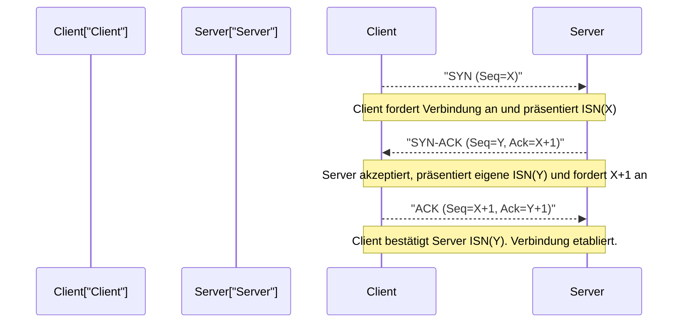

1. **SYN (Synchronize):** Der Client sendet ein Synchronisations-Anforderungspaket (TCP-Segment mit gesetztem SYN-Flag) an den Server. Dabei präsentiert er eine zufällig generierte 32-Bit "Initiale Sequenznummer (ISN: Initial Sequence Number, hier als X angenommen)". Es gibt Gründe dafür, die ISN nicht bei null oder einem festen Wert beginnen zu lassen. Einerseits soll verhindert werden, dass "alte Pakete (Ghost Packets), die sich auf dem Netzwerk verirrt haben und verspätet eintreffen" aus einer bereits abgebauten, früheren Kommunikation zwischen denselben IPs und Ports fälschlicherweise als Pakete der neuen Kommunikation angesehen werden. Andererseits hat es die kryptografische Bedeutung, Angriffen auf die TCP-Sequenzvorhersage (IP-Spoofing), bei denen Angreifer Sequenznummern erraten und falsche Daten injizieren, vorzubeugen.
2. **SYN-ACK:** Nimmt der Server die Verbindungsanforderung an, sendet er ein SYN-ACK-Paket zurück, das den Wert der Client-ISN plus 1 (X+1) als "Acknowledgment Number" (Bestätigungsnummer) enthält und zugleich mit der zufälligen anfänglichen Sequenznummer (Y) des Servers selbst versehen ist.
3. **ACK (Acknowledgment):** Als Beweis, dass der Client die ISN des Servers korrekt erhalten hat, sendet er ein ACK-Paket mit der Bestätigungsnummer Y+1.

Wenn dieser dreimalige Paketaustausch abgeschlossen ist, ist der bidirektionale Kommunikationsstatus im Speicher reserviert und die Vorbereitungen für den Datentransfer sind getroffen. Allerdings lasten physische Begrenzungen der Kommunikationsinfrastruktur schwer auf diesem strengen Prozess: die "Lichtgeschwindigkeit".
Die Lichtgeschwindigkeit im Vakuum liegt bei etwa 300.000 km/s, aber aufgrund des Brechungsindex des Glasfaserkerns (Quarzglas) – des Haupt-Backbones des Internets – sinkt die Ausbreitungsgeschwindigkeit optischer Signale auf etwa zwei Drittel dieses Wertes (ca. 200.000 km/s). Hinzu kommen noch Routing-Verarbeitungen an Zwischen-Routern sowie Queuing-Delays durch das Switching. Dies hat zur Folge, dass die Dauer für einen Hin- und Rückweg (1 RTT: Round Trip Time) beispielsweise zwischen Tokio und New York (etwa 11.000 km Luftlinie; reale Kabelwege sind noch länger) physisch zwangsläufig 150 bis 200 Millisekunden erfordert. Der 3-Way Handshake von TCP verbraucht mindestens diesen 1 RTT. Daher ist die Latenz (Verzögerung) beim Verbindungsaufbau ungeachtet jeder Bandbreitenvergrößerung stets an das absolute Gesetz des Universums, die Lichtgeschwindigkeit, gebunden.

### Das Sliding Window sowie Sequenzsteuerung und Checksumme
Tritt TCP in die Datentransferphase ein, unterteilt es den von der Anwendung empfangenen Byte-Stream in Segmente einer angemessenen Größe (MSS: Maximum Segment Size; üblicherweise etwa 1460 Byte, was dem IP-MTU abzüglich der Header-Größe entspricht) und sendet sie ab. Jedem Segment wird entsprechend seiner Daten-Byte-Menge eine Sequenznummer zugewiesen; basierend darauf ordnet der Empfänger die ursprünglichen Daten selbst dann wieder in der korrekten Reihenfolge, wenn die Pakete in einer veränderten Reihenfolge eintreffen (Out-of-Order).

Darüber hinaus beinhaltet der TCP-Header eine 16-Bit große "Prüfsumme" (Checksum). Mithilfe des Einserkomplements wird strikt überprüft, ob die Daten durch elektrisches Rauschen auf dem Übertragungsweg oder Speicherfehler im Router invertiert (korrumpiert) wurden.

Wenn unterwegs Pakete verloren gehen (Paketverlust) oder beschädigt und verworfen werden, gibt der Empfänger entweder dauerhaft ein ACK für die erwartete Sequenznummer zurück (Duplikat-ACK) oder er antwortet gar nicht. Sobald der Sender für eine bestimmte Zeit (RTO: Retransmission Timeout) kein ACK empfängt oder ein Duplikat-ACK erkennt, wird er dieses Paket "erneut übertragen" (Retransmit).

Das Konzept, das in diesem Mechanismus die Kommunikationsgeschwindigkeit dramatisch anhebt, ist das "Sliding Window" (Gleitfenster). Bei der Methode, "ein Paket zu senden und bis zum Erhalt des ACKs kein weiteres zu senden (Stop-and-Wait)", würde der Durchsatz in der bereits genannten hochlatenten Umgebung (mit großer RTT) unweigerlich fatal abnehmen.
Beim Sliding-Window-Verfahren vereinbaren Sender und Empfänger unter Berücksichtigung ihrer gegenseitigen Pufferkapazitäten dynamisch eine "Window Size" (die maximale Byte-Anzahl der noch unbestätigten, gleichzeitig sendbaren Daten). Innerhalb dieses Window-Size-Bereichs kann der Sender pausenlos Pakete in Serie an das Netzwerk übermitteln, ohne die ACKs des Empfängers abwarten zu müssen. Jedes Mal, wenn er ein ACK empfängt, gleitet dieses sendbare Fenster vorwärts. So wird in Netzwerken mit dicken Leitungen und hoher Latenz (mit großem Bandbreiten-Verzögerungs-Produkt, BDP: Bandwidth-Delay Product) der Mechanismus realisiert, die maximale Bandbreite zu nutzen, indem "die Röhre kontinuierlich mit Daten gefüllt bleibt".

### Überlastungskontrolle (Congestion Control): Mathematische Harmonie zur Abwehr des Netzwerkzusammenbruchs
Das eigentliche Meisterwerk von TCP, das als einer der bedeutendsten technologischen Durchbrüche in der Internetgeschichte bezeichnet werden kann, ist die "Überlastungskontrolle" (Congestion Control).

Im Jahr 1986 wurde das frühe Internet (NSFNET) durch wachsendes Kommunikationsvolumen mit einem verheerenden Systemausfall namens "Congestion Collapse" (Überlastungs-Kollaps) konfrontiert. Das Hineinströmen von Datenmengen, die die Verarbeitungskapazitäten des Netzwerks sprengten, führte dazu, dass Warteschlangen (Puffer-Speicher) in Routern überliefen und große Mengen an Paketen verworfen wurden. Als die TCP-Endpunkte diesen Paketverlust wahrnahmen, kamen sie zu dem Schluss, dass die Daten nicht angekommen waren, und lösten massenhaft die "Wiederübertragung" aus. Daraufhin wurden noch mehr Daten in das Netzwerk gegossen, wodurch die Router erst recht überliefen; ein ruinöser Teufelskreis entstand, in dem der effektive Durchsatz auf ein Tausendstel absackte.

Um diesen Netzwerktod zu verhindern, führten Van Jacobson und andere 1988 hochmoderne dynamische Kontrollalgorithmen in TCP ein. Der Kern davon besteht aus der Steuerung des "Congestion Window" (Überlastungsfenster, cwnd) basierend auf dem Prinzip des "AIMD" (Additive Increase Multiplicative Decrease).

1. **Slow Start:** Unmittelbar nach dem Beginn der Kommunikation ist die freie Kapazität des Netzwerks völlig unbekannt. Deswegen beginnt die Übertragungsfenstergröße mit einem sehr geringen Wert (historisch 1 MSS, heutzutage rund 10 MSS) und mit jedem empfangenen ACK wird die Fenstergröße um 1 MSS erhöht. Das Resultat ist eine exponentielle Zunahme, bei der sich "das Fenster pro 1 RTT verdoppelt". Anders als der Name "Slow" andeutet, handelt es sich um eine Phase, in der die Grenzbandbreite in extrem kurzer Zeit höchst aggressiv gesucht wird.
2. **Congestion Avoidance (Überlastungsvermeidung):** Wenn die Fenstergröße einen im Voraus definierten Schwellenwert (ssthresh: Slow Start Threshold) erreicht, wird der exponentielle Zuwachs beendet und ein linearer Zuwachs (Addition von 1 MSS pro RTT) beginnt. Eine Phase, um das Kapazitätslimit des Netzes (die Dicke der Leitung) bedächtiger auszuloten.
3. **Erkennung von Paketverlust und Multiplicative Decrease (multiplikative Abnahme):** TCP interpretiert einen Paketverlust (Auftreten von Timeouts oder den dreimaligen Erhalt doppelter ACKs in Folge vom Empfänger) nicht einfach als bloßen Übertragungsfehler, sondern als "Signal dafür, dass auf dem Netzwerkpfad ein Stau (Congestion) vorliegt und Pakete aus den Puffern der Router überlaufen". In diesem Moment übt TCP sofort Selbstkontrolle aus und lässt die Fenstergröße für das Übertragen abrupt auf die Hälfte (oder den Initialwert des Slow Starts) zusammenschrumpfen.

Durch diesen mathematischen und zugleich altruistischen Verteilungsalgorithmus, bei dem "man sich Bandbreite in kleinen Schritten teilt (Additive Increase), jedoch bei Problemen sofort drastisch nachgibt (Multiplicative Decrease)", halten die hunderte Millionen und gar Milliarden unabhängiger TCP-Verbindungen im Internet ganz ohne einen zentralen Traffic-Verwalter eine wunderbare Harmonie (Homöostase) in Form einer "gerechten Verteilung der Bandbreite" und "eines stabilen Betriebs des Gesamtnetzes" aufrecht.

Die Kapazitätssteigerung in Buffer-Speichern von Routern schlägt in den letzten Jahren negativ aus und brachte ein neues physikalisches Phänomen, den "Bufferbloat", ins Rampenlicht. Pakete stauen sich bis zum Verwurf wegen Überlastung immer weiter in gigantischen Warteschlangen an, wodurch die Verzögerung (Ping-Wert) auf Hunderte Millisekunden bis hin zu einigen Sekunden springt. Um dem entgegenzuwirken, wurden moderne Überlastungssteuerungs-Algorithmen wie BBR (Bottleneck Bandwidth and Round-trip propagation time) u. a. von Google entwickelt. BBR detektiert die "Erhöhung des RTT (Latenz)" anstelle von Paketverlusten als Überlastungszeichen und reduziert proaktiv die Senderate, bevor es zu einem Überlauf des Puffers kommt – und wird allmählich zum Standard in modernem TCP.

## 3. UDP (User Datagram Protocol): Reduktion der Geschwindigkeit zuliebe

Wenn TCP als "überfürsorglicher Verwalter" bezeichnet werden kann, der mit komplexen Zustandsübergängen und hochmodernen Algorithmen absolute Gewissheit für Daten sicherstellt, dann ist UDP, das derselben Transportschicht angehört, ein "minimalistischer Träger", der seine protokollarische Rolle auf ein Extremmaß zurückgeschnitten hat. Entworfen von Jon Postel im Jahr 1980, besitzt UDP nichts als das bloße Minimum an Funktionen für die Transportschicht.

Der UDP-Header besteht aus schlanken 8 Byte (wobei ein regulärer TCP-Header 20 Byte und inklusive Optionen bis zu 60 Byte aufweist). Enthalten sind lediglich "Quellportnummer", "Zielportnummer", "Datenlänge" sowie eine simple "Prüfsumme", um defekte Daten festzustellen.

In UDP sind keinerlei Dinge wie Vorab-Verbindungsaufbau mittels 3-Way Handshake, Ordnungssicherheit durch Sequenznummern, Flusssteuerung via Sliding Window, Funktionen für erneute Übertragungen oder Überlastungssteuerungen zum Schutz des Netzwerks implementiert. Von der Anwendung übergebene Daten werden direkt in IP-Datagramme gehüllt, auf die Netzwerkschicht geworfen und im Format "Fire and Forget" gesendet. Ob sie beim Adressaten ankommen, wird nicht einmal geprüft.

Jedoch ist genau diese beinahe als unverantwortlich zu bezeichnende strukturelle Einfachheit die größte Waffe von UDP und der Grund, warum es TCP in bestimmten Anwendungsfällen übertrifft.

### Der wahre Wert von UDP: Latenz-Fokus und Echtzeitkommunikation
In der Echtzeitkommunikation, bei der die physische Latenz (Verzögerung) bis ans absolute Limit reduziert werden muss, führt die "Übertragungswiederholung zur Sicherstellung der Zuverlässigkeit" von TCP stattdessen zu fatalen Problemen.

Stellen Sie sich beispielsweise ein Online-Spiel wie einen FPS (First-Person-Shooter), Sprachanrufe (VoIP) oder ein Videokonferenzsystem (wie Zoom oder WebRTC) vor. Bei diesen Anwendungen werden Pakete mit den neuesten Positionsdaten oder Sprachbeispielen in einer Frequenz von dutzenden bis hunderten Malen pro Sekunde gesendet.
Angenommen, Sie verwenden TCP und ein vor 100 Millisekunden gesendetes Sprachpaket geht auf einem Zwischenrouter verloren. TCP erkennt diesen Verlust, überträgt das Paket erneut und versucht, es auf der Empfängerseite in der richtigen Reihenfolge wiederzugeben. In einer Umgebung, in der Gespräche oder Spiele jedoch in Echtzeit ablaufen, haben "vergangene Daten, die mit einer Verzögerung von hunderten Millisekunden eintreffen", keinerlei Wert mehr.
Ganz im Gegenteil: TCP stoppt die Verarbeitung (die Übergabe an die Anwendung) nachfolgender, neuer Pakete, die bereits eingetroffen sind, und puffert sie, bis das verlorene Paket erneut übertragen wurde und die Reihenfolge wieder stimmt. Dies wird als "Head-of-Line (HoL) Blocking" bezeichnet. Wenn der Ton abbricht oder der Spielbildschirm für einige Sekunden einfriert und dann plötzlich im Schnellvorlauf weiterläuft, ist dies häufig auf das HoL-Blocking durch die Wartezeit auf die Neuübertragung von TCP zurückzuführen.

In solchen Fällen ermöglicht es UDP, das fehlende vergangene Paket anstandslos aufzugeben und das gerade eintreffende neueste Paket sofort von der Anwendung verarbeiten zu lassen. In der Echtzeitkommunikation bietet es den menschlichen Sinnesorganen ein weitaus natürlicheres und angenehmeres Benutzererlebnis, "den neuesten Zustand bei minimalster Latenz kontinuierlich darzustellen, selbst bei etwas Rauschen oder Frame-Drops", anstatt dass "alle Daten vollständig vorliegen".

Zudem ist UDP, das keinerlei Handshake-Overhead aufweist, optimal für einfache Transaktionskommunikationen, die sich in "einem Antwortpaket" auf "ein kleines Anfragepaket" abschließen, wie etwa die Namensauflösung im DNS (Domain Name System) oder die Zeitsynchronisation via NTP (Network Time Protocol).

## 4. QUIC: Ein Paradigmenwechsel in der Internetkommunikation und das Protokoll der nächsten Generation

Jahrzehntelang, von den Anfängen des Internets an, war unsere Netzwerkarchitektur in einem starren Dualismus gefangen: "Wenn man einen zuverlässigen Stream-Transfer will, wählt man TCP, und wenn man Geschwindigkeit und Echtzeitfähigkeit will, wählt man UDP." Mit der drastischen Entwicklung des modernen Web (insbesondere der Verbreitung der Mobilkommunikation und der Ära von HTTP/2, in der riesige Ressourcenmengen parallel geladen werden) traten jedoch die Grenzen des grundlegenden Designs von TCP als Hemmschuh offen zutage.

Das größte Problem dabei sind das bereits im UDP-Abschnitt erwähnte, für TCP typische "Head-of-Line (HoL) Blocking" und die "übermäßige Latenz" beim Verbindungsaufbau.
TCP verwaltet die gesamte Kommunikation als "einzelnen seriellen Byte-Stream". Angenommen, Sie fordern gleichzeitig (multiplexed) über HTTP/2 mehrere Dateien an – HTML, CSS, JavaScript und Dutzende Bilder –, um eine moderne Website anzuzeigen. Da es sich auf der zugrunde liegenden TCP-Ebene jedoch um einen einzigen Stream handelt, blockiert die TCP-Schicht auf der Kernel-Ebene des OS selbst die Weitergabe der eigentlich unbeteiligten Pakete von "Skript B" oder "Bild C", bis die Neuübertragung abgeschlossen ist, falls auch nur ein einziges Paket von "Bild A" verloren geht.
Ferner ist Verschlüsselung (TLS/HTTPS) im modernen Web unverzichtbar. In herkömmlichen Protokollstapeln wurde der "Handshake zum TLS-Schlüsselaustausch (1–2 RTT)" jedoch erst nach Abschluss des "TCP-3-Way-Handshakes (1 RTT)" durchgeführt, wodurch bis zum Beginn der eigentlichen sicheren Datenübertragung eine immense physische Verzögerung von 2–3 RTT verschwendet wurde.

Zur Lösung dieser grundlegenden Probleme und zur Herbeiführung eines Paradigmenwechsels in der modernen Internetinfrastruktur leitete Google die Entwicklung des Next-Generation-Transportprotokolls "QUIC (Quick UDP Internet Connections)", das von der IETF (Internet Engineering Task Force) standardisiert wurde. Der Web-Standard, der auf Basis von QUIC als grundlegendem Protokoll neu definiert wurde, ist "HTTP/3".

### Die Verknöcherung der Middleboxen und die Flucht in den User Space
Der revolutionärste Ansatz von QUIC liegt im kühnen Architekturdesign: **"Ein völlig neues Transport-Layer, das Verschlüsselung und Multiplexing integriert, wurde auf Basis vorhandener UDP-Pakete im User Space (Benutzerraum) neu aufgebaut."**

Warum wurde es auf UDP aufgebaut anstatt TCP zu verbessern? Die unzähligen Router, Firewalls und "Middleboxen" wie NAT (Network Address Translation) im Internet sind durch jahrelangen Betrieb so stark verknöchert, dass sie neue Protokolle (mit neuen Protokollnummern) abseits von TCP und UDP diskussionslos als "unbekannte Bedrohungen" verwerfen (dies wird als Internet-Ossification oder Verknöcherung bezeichnet). Überdies ist die TCP-Implementierung tief im Kern (Kernel) von Betriebssystemen wie Windows und Linux hartcodiert, weshalb die Aktualisierung der Betriebssysteme weltweit und die Verbreitung neuer Algorithmen eine schier endlose Zeit in Anspruch nehmen würde.
Daher wählte QUIC die Strategie, als schlichtes "konventionelles UDP-Paket" von den Middleboxen durchgelassen zu werden, während es im Inneren von Browsern und Anwendungen (dem User Space) eigenständig eine hochentwickelte Version der herausragenden Bestandteile von TCP (Überlastungs- und Übertragungswiederholungssteuerung) implementiert.

### Die innovativen Mechanismen von QUIC und die Überwindung physischer Begrenzungen

1. **Vollständige Beseitigung von HoL-Blocking durch Stream-Unabhängigkeit:**
   QUIC besitzt die Funktion, auf Protokollebene nicht nur einen einzelnen Paket-Stream, sondern mehrere logische, "unabhängige Streams" zu verwalten. Auf das vorherige Beispiel bezogen: Geht ein Paket von Bild A unterwegs verloren, pausiert QUIC lediglich den Stream von Bild A in Erwartung einer Neuübertragung, während die Verarbeitung der Streams für Skript B und Bild C völlig unberührt und parallel fortgesetzt wird. Dies verbessert die Anzeigegeschwindigkeit von Webseiten dramatisch, insbesondere bei mobilen Verbindungen mit häufigen Paketverlusten.
2. **0-RTT-Verbindungsaufbau und Integration von Verschlüsselung:**
   In QUIC ist von Beginn an eine Verschlüsselung tiefgreifend integriert, die TLS 1.3 entspricht. Es begeht nicht die Torheit wie TCP, eine "Transportverbindung" und eine "Verschlüsselungsverbindung" voneinander zu trennen. Selbst bei einem Server, mit dem zum ersten Mal kommuniziert wird, schließt es die Verbindung und den Austausch der Verschlüsselungsschlüssel in nur 1 RTT ab. Noch revolutionärer ist es, wenn es sich um einen Server handelt, mit dem in der Vergangenheit bereits kommuniziert wurde (ein Server, der über ein gecachtes Session Ticket verfügt). Dann ist "0-RTT" möglich – das bedeutet, **dass HTTP-Anfragen zeitgleich mit der Übertragung des ersten Datenpakets gestartet werden können, ohne einen Handshake abzuwarten**. Dies ist eine aus dem Protokolldesign hervorgehende, äußerst elegante Antwort auf die physische Einschränkung der "Verzögerung durch die Lichtgeschwindigkeit".
3. **Connection Migration (IP-Adressen-Unabhängigkeit):**
   Herkömmliche TCP-Verbindungen waren stark an die 4 Elemente (4-Tupel) gebunden: "Quell-IP, Quell-Port, Ziel-IP, Ziel-Port". Wenn ein Nutzer daher mit dem Smartphone herumlief, die Wi-Fi-Umgebung verließ und auf eine 4G/5G-Mobilfunkverbindung umschaltete, wobei sich die IP-Adresse änderte, brach die TCP-Verbindung in exakt diesem Moment ab, und der zeitraubende Handshake musste von Neuem begonnen werden.
   Demgegenüber verwaltet QUIC jede Verbindung nicht anhand der IP-Adresse, sondern über eine beim Kommunikationsstart generierte eindeutige "Connection ID". Verändern sich demnach physische IP-Adressen oder Netzwerkschnittstellen dynamisch, bleiben Videostreams oder der Download riesiger Dateien vollkommen abbruchsfrei und laufen nahtlos weiter, solange die Connection ID identisch bleibt. In der heutigen Zeit, in der die mobile Kommunikation die Hauptrolle spielt, ist dies ein ungemein starkes und absolut notwendiges Merkmal.

## 5. Fazit: Die Evolution des Protokolls, das das Chaos beherrscht, und der Aufbau von Ordnung

Die Transportschicht hat über dem Chaos der Netzwerkschicht (IP) des Internets – wo ständige Fluktuationen, wechselnde Routen, Paketverluste und Reihenfolgeumkehrungen an der Tagesordnung sind – eine "robuste logische Ordnung" errichtet, die Anwendungen unbesorgt nutzen können.

Das von Vinton Cerf und Van Jacobson (und anderen) entworfene und verfeinerte, robuste mathematische Modell und die Überlastungskontrolle von TCP bewahren das Internet-Backbone bis heute vor dem Zusammenbruch und stützen weltweit Datenübertragungen. Hinzu kommt die Einfachheit von UDP, das der Forderung nach Echtzeitkommunikation mit extrem geringer physischer Latenz gerecht wird. Darüber hinaus steht die raffinierte Architektur des QUIC-Protokolls, das zur Überwindung der Grenzen beider Verschlüsselung und Multiplexing vereint und für moderne mobile Umgebungen optimiert konzipiert wurde.

Sie alle sind das Resultat des unermüdlichen technologischen Strebens der Menschheit nach der Antwort auf die Frage: "Wie lassen sich Informationen zwischen weit entfernten Computern unter den physischen Zwängen begrenzter Bandbreite und der Grenze der Lichtgeschwindigkeit präzise und schnell übermitteln?"

Wenn Pakete in der richtigen Reihenfolge neu angeordnet werden und schließlich als sinnvoller Datenblock an die Anwendung übergeben werden, beginnt die bloße Aneinanderreihung elektrischer Signale endlich einen Wert als "Information" anzunehmen. Im nächsten Kapitel widmen wir uns den Abgründen der Mechanismen der "Anwendungsschicht (HTTP, DNS usw.)", die auf dem stabilen Fundament der Transportschicht aufbaut und die Web-Welt, mit der wir tagtäglich interagieren, direkt formt.

# Kapitel 5: Die Anwendungsschicht und die Hintergründe des Web —— Von der Namensauflösung bis in die Tiefen der verschlüsselten Kommunikation

In den vorangegangenen Kapiteln haben wir tiefgreifend das Verhalten der Bitübertragungsschicht untersucht – von Photonen, die unter Totalreflexion in Glasfaserkabeln fortschreiten, bis zu elektromagnetischen Wellen, die sich in Kupferdrähten ausbreiten –, sowie das Routing von Paketen per IP und die Zuverlässigkeit des Datentransfers in der Transportschicht per TCP/UDP. In diesem Kapitel betreten wir endlich die Ebene, mit der wir Menschen direkt interagieren: die "Anwendungsschicht".

Schicht 7 (Anwendungsschicht), Schicht 6 (Darstellungsschicht) und Schicht 5 (Sitzungsschicht) im OSI-Referenzmodell werden im modernen TCP/IP-Schichtenmodell häufig zu einer einzigen "Anwendungsschicht" zusammengefasst und als solche behandelt. Die Anwendungsschicht steht an der Spitze der Abstraktion und ist ein komplexes Ökosystem, das von vielfältigen Protokollen gewoben wird. An dieser Stelle werden wir die Mechanismen, die im Hintergrund agieren, vom Moment der Eingabe einer URL in die Adressleiste des Browsers bis zur Anzeige der Webseite – die Namensauflösung durch DNS, die Ressourcenübertragung durch HTTP und die für das heutige Internet essenzielle Verschlüsselung durch SSL/TLS – bis ins letzte Detail aus historischen Kontexten, der Netzwerktechnik und hochgradigen mathematischen Perspektiven heraus sezieren.

## 5.1 DNS (Domain Name System): Das Wunder und die Genealogie der verteilten hierarchischen Datenbank

IP-Adressen (32-Bit-Werte bei IPv4, 128-Bit-Werte bei IPv6) sind für den Aufbau von Routingtabellen, durch die Netzwerkgeräte wie Router und Switches Pakete weiterleiten, optimal; jedoch eignen sie sich keineswegs dafür, von Menschen intuitiv memoriert, mit Bedeutung versehen und gehandhabt zu werden.

In den Anfangstagen des ARPANETs, dem Ursprung des Internets, wurde das Mapping zwischen Hostnamen und Netzwerkadressen überaus primitiv verwaltet. Das Network Information Center (NIC) am Stanford Research Institute (SRI) verwaltete zentral eine einzige Textdatei namens `HOSTS.TXT`, und jeder Knoten lud diese Datei nachts über FTP herunter und aktualisierte sein eigenes lokales System. Als jedoch in den 1980er Jahren die Zahl der ans Netzwerk angeschlossenen Hosts exponentiell und rasant zu wachsen begann, offenbarte dieses zentralisierte Modell verheerende Grenzen: Traffic-Engpässe, Aktualisierungsverzögerungen und Namenskollisionen (Erschöpfung des Namensraums).

Um diese Skalierbarkeitskrise zu bewältigen, entwarf und konzipierte Paul Mockapetris 1983 das in RFC 882 und RFC 883 definierte DNS (Domain Name System). Die Essenz der DNS-Architektur ist ein global verteilter, hierarchischer Key-Value-Store. Das System wendet ein bahnbrechendes verteiltes Paradigma an: den Domain-Raum in eine Baumstruktur zu unterteilen und die jeweilige Verwaltungsautorität zu delegieren (Delegation), um einen Single Point of Failure auszuschließen und eine nahezu unendliche Skalierbarkeit zu gewährleisten.

### Die endlose Reise der Namensauflösung: Vom Stub Resolver zum autoritativen Server

In dem Moment, in dem der Nutzer `https://www.example.com` in die Omnibox des Browsers eingibt, startet der Stub Resolver im Betriebssystem, und im Hintergrund beginnt die gewaltige "Reise der Namensauflösung". Dieser Prozess ist auch eine Abfolge von Caching-Strategien zur Frage, wie sich die physikalischen Einschränkungen von Netzwerkverzögerungen umgehen lassen.

1. **Abfrage mehrstufiger Caches**: Zunächst wird der lokale Browser-Cache mit der geringsten Latenz überprüft. Als Nächstes wird der DNS-Cache des OS abgefragt, gefolgt vom DNS-Cache des Routers im lokalen Netzwerk. Das wirksamste Mittel, um die physischen Barrieren der Lichtgeschwindigkeit (ca. 300.000 Kilometer pro Sekunde im Vakuum, etwa zwei Drittel davon im Glasfaserkabel) zu überwinden, ist, von vornherein keine Netzwerkkommunikation auszulösen.
2. **Abfrage an rekursive Resolver (Full Resolver)**: Gibt es lokal keinen Cache, wird die Anfrage an einen rekursiven Resolver (Recursive Resolver / Full Resolver) geschickt, der von einem ISP oder einem öffentlichen DNS-Provider (wie Googles `8.8.8.8` oder Cloudflares `1.1.1.1`) betrieben wird. Dieser Resolver übernimmt stellvertretend für den Client den gesamten Prozess der Namensauflösung.
3. **Iterative Abfrage an Root-Server**: Befindet sich der betreffende Eintrag auch nicht im Cache des Full Resolvers, richtet dieser eine Anfrage an den "Root-Server", die absolute Spitze der Domain-Hierarchie. Weltweit gibt es derzeit 13 Cluster von Root-Servern (A bis M). Der Root-Server kennt die IP-Adresse von `www.example.com` nicht direkt, sondern antwortet mit einer Liste von Nameservern (Referral: Delegation Response), welche die TLD (Top Level Domain) `.com` verwalten. Anzumerken ist, dass die über die ganze Welt verteilten Root-Server IP-Adressen durch "Anycast"-Routing-Technologie teilen, und BGP (Border Gateway Protocol) durch Routenauswahl den Traffic autonom zum physisch und topologisch nächstgelegenen Server des Clients leitet.
4. **Iterative Abfrage an TLD-Server**: Als Nächstes sendet der Full Resolver eine Anfrage an einen der verwiesenen TLD-Server für `.com`. Der TLD-Server gibt die IP-Adresse (den NS-Eintrag) des autoritativen (Authoritative) DNS-Servers (Nameserver) zurück, dem die Verwaltungsautorität für `example.com` delegiert wurde.
5. **Abfrage an den autoritativen DNS-Server und Abruf des Eintrags**: Abschließend greift der Full Resolver direkt auf den autoritativen DNS-Server von `example.com` zu. Die Zonendatei des autoritativen Servers enthält die finale Antwort – den A-Eintrag (IPv4-Adresse) oder AAAA-Eintrag (IPv6-Adresse) oder einen CNAME-Eintrag (Alias) für `www` –, welche über den Full Resolver an den Stub Resolver des Clients zurückgegeben wird.

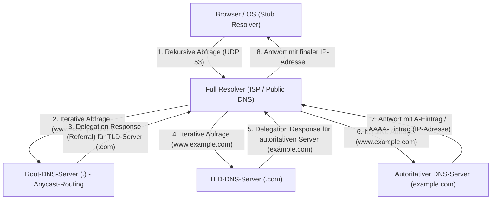

Diese komplexe hierarchische Zwei-Wege-Kommunikation wird in der Regel in der Winzigkeit von wenigen Millisekunden bis einigen Dutzend Millisekunden abgeschlossen. DNS nutzt in erster Linie den UDP-Port 53 als Transportschichtprotokoll. Durch den vollständigen Wegfall des Hin- und Rück-Overheads des TCP-3-Way-Handshakes (SYN, SYN-ACK, ACK) erzielt es eine extreme Latenzreduzierung. Dennoch ist ein Fallback auf den zuverlässigen TCP-Port 53 vorgesehen, wenn die Payload einer DNS-Antwort die historische UDP-Begrenzung von 512 Byte (durch EDNS0-Erweiterungen heute größer) überschreitet, bei der Schlüsselverifikation von DNSSEC (DNS Security Extensions) – einer kryptografischen Digitalsignatur-Erweiterung zur Verhinderung von DNS-Cache-Poisoning-Angriffen –, oder wenn ein Zonentransfer (AXFR) durchgeführt wird.

## 5.2 Die Evolution der HTTP-Architektur und -Protokolle

Nachdem der Browser per DNS die IP-Adresse des Zielservers erworben hat, stellt er eine TCP-Verbindung zu diesem auf (Port 80 oder 443) und beginnt die Kommunikation in der primären Sprache der Anwendungsschicht, HTTP (HyperText Transfer Protocol).

HTTP wurde 1989 von Tim Berners-Lee am Europäischen Kernforschungszentrum (CERN) entworfen und war ursprünglich ein extrem einfaches Protokoll, mit dem Physiker auf der ganzen Welt Forschungsdokumente (Hypertexte) effizient über Netzwerke teilen und durch Links verbinden konnten. Die klare textbasierte Struktur aus Request-Line (Methode, URI, Protokollversion), Header-Feldern, Leerzeile (CRLF) und Message-Body trieb das System-Debugging und die Verbreitung massiv voran.

Die fundamentale Designphilosophie und das Hauptmerkmal von HTTP ist die "Zustandslosigkeit (Statelessness)". Der Server behält keinerlei Vergangenheitszustände von Anfragen oder Kontext eines Clients im Speicher. Jede Anfrage ist als vollständig unabhängige Transaktion abgeschlossen. Diese Zustandslosigkeit, die auch mit der REST-Architektur (Representational State Transfer) einhergeht, vereinfachte die Implementierung von Servern drastisch und erleichterte das Scale-out (Load-Balancing), bei dem die Anzahl der Server horizontal aufgestockt wird, um massiven Traffic abzufertigen. Ein Load Balancer kann garantieren, dass unabhängig davon, an welchen Backend-Server die Anfrage gerichtet wird, stets dasselbe Ergebnis erzielt wird. Bei modernen, interaktiven Webanwendungen, in denen Statusverwaltungen (States) – wie der Warenkorb auf E-Commerce-Seiten oder der Login-Status von Benutzern – unumgänglich sind, wird diese strikte Zustandslosigkeit jedoch zu einem erheblichen Hindernis. Um dies außerhalb des Protokolls zu überwinden, wurden Cookies – bei denen der Status durch HTTP-Header clientseitig gespeichert wird – sowie pseudozustandsverwaltende Mechanismen über Session-Tokens ersonnen.

### Der Kampf mit physischen Barrieren: Der Paradigmenwechsel von HTTP/1.1 zu HTTP/3

Mit der rasanten Ausbreitung des Web und dem massiven Anstieg an Ressourcen (Bilder, CSS, JavaScript-Dateien etc.), die eine einzige Seite enthält, sah sich HTTP den physikalischen Gesetzen von Netzwerken (Latenzbegrenzungen durch die Lichtgeschwindigkeit und Paketverluste) ausgesetzt und durchlief drastische architektonische Entwicklungen auf Protokollebene.

- **HTTP/1.1 (1997 - )**: Im ursprünglichen HTTP/1.0 wurde für jede Ressourcen-Anfrage aufs Neue eine TCP-Verbindung aufgebaut und abgebaut (3-Way Handshake und 4-Way Handshake), was im Hinblick auf Latenz der Inbegriff von Ineffizienz war. Mit HTTP/1.1 wurden Persistent Connections (Keep-Alive) standardisiert; durch die Wiederverwendbarkeit einer einzigen TCP-Verbindung konnten die Verbindungskosten immens gesenkt werden. Die Pipelining-Technologie von HTTP/1.1 setzte sich wegen Implementierungsschwierigkeiten und Kompatibilitätsproblemen mit Zwischenproxys jedoch nicht durch und barg einen katastrophalen strukturellen Fehler: das "Head-of-Line (HoL) Blocking". Ein Phänomen, bei dem sich nachfolgende Anfragen auf einer einzelnen TCP-Verbindung in der Warteschlange stauen und sich die gesamte Latenz verschlechtert, während der Server eine einzige riesige Ressource oder eine rechenintensive Anfrage verarbeitet. Um dies zu umgehen, blieb Browsern nichts anderes übrig, als auf brachiale Hacks wie die gleichzeitige Eröffnung mehrerer TCP-Verbindungen (üblicherweise etwa 6 Verbindungen) zu ein und derselben Domain (Domain Sharding usw.) zurückzugreifen.
- **HTTP/2 (2015 - )**: Das auf Basis des von Google entwickelten SPDY-Protokolls standardisierte HTTP/2 runderneuerte die Architektur des Protokolls von Grund auf – von textbasiert zu "Binary Framing-basiert". Die maßgeblichste Innovation ist das "Stream-Multiplexing". In HTTP/2 lassen sich innerhalb einer einzigen TCP-Verbindung mehrere virtuelle "Streams" erstellen, und die Request- und Response-Daten werden in winzige binäre Frames zerlegt, um sequenzunabhängig, verschachtelt (Interleaved) übertragen werden zu können. Hierdurch wurde das HoL-Blocking in der Anwendungsschicht komplett eliminiert. Zudem reduzierte ein Header-Kompressionsmechanismus (eine Mischung aus statischer Huffman-Codierung und dynamischen Tabellen) unter Verwendung des HPACK-Algorithmus radikal das Datentransfervolumen redundanter, mit jedem Request immer wieder gesendeter Daten wie Cookies und User-Agents, und die Nutzungseffizienz der Netzwerkbandbreite wurde ans Limit getrieben.
- **HTTP/3 (2022 - )**: Obschon HTTP/2 das HoL-Blocking in der Anwendungsschicht exzellent bewältigte, blieb die physische Barriere des "HoL-Blockings bei Paketverlust" in der zugrunde liegenden Transportschicht (TCP) bestehen. Um die Zuverlässigkeit zu garantieren, TCP – falls auch nur ein einziges Paket unterwegs fehlt – die Übergabe der Datenpakete für sämtliche Streams auf der besagten TCP-Verbindung an die Anwendungsschicht, bis die Neuübertragung erfolgreich abgeschlossen ist (ein Nachteil des Sequenzgarantie-Mechanismus von TCP). Zur Lösung dieses Problems vollzog HTTP/3 einen dramatischen Paradigmenwechsel: Es verwarf TCP, das jahrzehntelang das Fundament des Internets gebildet hatte, und adaptierte "QUIC (Quick UDP Internet Connections)" als neues, UDP-basiertes Transportprotokoll. QUIC entgeht den durch die Implementierung im OS-Kernel bedingten Entwicklungsverzögerungen von TCP; es fügte der Ebene über dem im User Space implementierbaren UDP eine eigenständige Übertragungswiederholungssteuerung, Überlastungssteuerung sowie unabhängige Flusssteuerung für jeden Stream hinzu. Geht ein Paket verloren, ist davon nur dieser ganz spezielle Stream betroffen, während die übrigen Streams unblockiert weiterverarbeitet werden können. Des Weiteren integrierte QUIC den Handshake zum Verbindungsaufbau mit dem TLS-1.3-Verschlüsselungshandshake, was den Start verschlüsselter Datensendungen an Server mit bisheriger Kommunikationshistorie in "0-RTT (Zero Round Trip Time)" ermöglicht. Gegenüber der physischen Begrenzung der Lichtgeschwindigkeit (wobei bei einer Kommunikation zur anderen Erdseite unweigerlich Verzögerungen im Hundert-Millisekunden-Bereich entstehen), ist dies die Krönung ultimativer Leistungsmaximierung durch drastische Verringerung der Anzahl von Kommunikationsumläufen (RTT) auf Protokollebene.

## 5.3 Verschlüsselung und Vertrauensmechanismen: Die mathematischen Untiefen von SSL/TLS und die Logik der Zertifizierung

Das Internet ist im Kern ein offenes Paketkommunikationsnetzwerk; Daten werden im Eimerketten-Prinzip über endlose Router und unterseeische Glasfaserkabel zum Ziel transferiert. Es ist physikalisch machbar, dass jeder Knoten auf diesem Pfad (etwa ein Zwischenrouter, ein bösartiger ISP oder ein Lauscher im selben Wi-Fi-Netzwerk) die Kommunikationsinhalte via Paketsniffing abfängt und sogar manipuliert. SSL (Secure Sockets Layer) und sein Nachfolgeprotokoll TLS (Transport Layer Security) dämmen diese absolute Netzwerkschwachstelle mithilfe hochgradiger Mathematik ein und errichten sichere Kommunikationskanäle.

TLS garantiert in der modernen Web-Kommunikation die folgenden "drei Säulen der Sicherheit":
1. **Vertraulichkeit (Confidentiality)**: Dass Kommunikationsinhalte, selbst wenn sie von Dritten abgefangen werden, nicht entschlüsselt werden können.
2. **Integrität (Integrity)**: Dass auf dem Übertragungsweg nicht ein einziges Bit der Daten manipuliert wurde. Dies wird durch MAC (Message Authentication Code) und AEAD (Authenticated Encryption with Associated Data) gesichert.
3. **Authentifizierung (Authentication)**: Dass der Kommunikationspartner der rechtmäßige Besitzer der Domain (der echte Server) ist.

Die Technologien, die dies bewerkstelligen, sind die Quintessenz der Kryptographie, die von der Menschheit über Jahrhunderte hinweg aufgebaut wurde und vor allem seit dem Zweiten Weltkrieg durch die Fortschritte in der Informatik und Zahlentheorie rasante Sprünge machte.

### Schlüsselaustausch und Public-Key-Kryptographie: Das Problem des diskreten Logarithmus und die Barriere der Primfaktorzerlegung

Die denkbar einfachste und in der Verarbeitung schnellste Verschlüsselungsmethode ist die "Symmetrische Verschlüsselung (Symmetric Cryptography)" (aktueller Standard ist AES: Advanced Encryption Standard). Dies ist ein Verfahren, bei dem Sender und Empfänger zur Ver- und Entschlüsselung denselben "gemeinsamen Schlüssel" (Shared Key) verwenden. Da die mathematischen Verarbeitungsprozesse leichtgewichtig sind (Bitweise XOR-Operationen sowie Kombinationen aus Substitution und Permutation), eignet sie sich für die Echtzeit-Verschlüsselung von Gigabit-Kommunikation. Die symmetrische Kryptographie trug jedoch ein grundlegendes Paradoxon (das Schlüsselverteilungsproblem) in sich: "Wie übergibt man dem Empfänger vor Kommunikationsbeginn diesen geheimen, gemeinsamen Schlüssel selbst sicher?" Bei der Kommunikation im Internet ohne jegliches vorheriges Vertrauensverhältnis würde das ungeschützte Senden des gemeinsamen Schlüssels unweigerlich zu dessen Abfangen führen, was den Sinn der Verschlüsselung zunichte macht.

Der größte kryptografische Durchbruch der Menschheitsgeschichte war schließlich der von Whitfield Diffie und Martin Hellman 1976 veröffentlichte Schlüsselaustauschalgorithmus sowie die 1977 von RSA (Rivest, Shamir, Adleman) erdachte "Asymmetrische Verschlüsselung (Public-Key Cryptography / Asymmetric Cryptography)".

An der Basis asymmetrischer Verschlüsselung steht das Konzept der mathematischen "Einwegfunktion (One-way function)" oder der "Falltür-Einwegfunktion (Trapdoor one-way function)". Dies macht sich die Asymmetrie zunutze: "Die Berechnung in die eine Richtung (Verschlüsselung) schließt ein Computer im Nu ab; doch die umgekehrte Berechnung (Entschlüsselung oder Schlüsselraten) würde, selbst wenn man sämtliche Supercomputer der Welt bündelt, auch über die gesamte Lebensdauer des Universums hinweg niemals enden."

- **RSA-Verschlüsselung**: Basiert auf der Eigenschaft, dass es zwar einfach ist (in Polynomialzeit berechenbar), durch Multiplikation von zwei überaus großen Primzahlen ($p$ und $q$) eine gigantische zusammengesetzte Zahl ($N = p \times q$) zu erzeugen, es jedoch extrem schwierig ist (dafür sind nur Algorithmen mit subexponentieller Laufzeit bekannt), aus ebenjener riesigen zusammengesetzten Zahl $N$ die ursprünglichen Primfaktoren $p$ und $q$ abzuleiten (Primfaktorzerlegung). Unter Verwendung tiefgründiger zahlentheoretischer Eigenschaften, wie der Eulerschen Phi-Funktion oder des kleinen Fermatschen Satzes, baut sie eine mathematische Falltür auf, in der mit dem öffentlichen Schlüssel verschlüsselte Daten ausschließlich von demjenigen entschlüsselt werden können, der im Besitz des dazugehörigen privaten Schlüssels ist.
- **Elliptische-Kurven-Kryptographie (ECC: Elliptic Curve Cryptography)**: Der heutige Mainstream bei TLS, ECC, wendet die Schwierigkeit des "Problems des diskreten Logarithmus" an, das auf elliptischen Kurven über einem endlichen Körper definiert ist (z. B. einer Punktemenge, die die Gleichung $y^2 = x^3 + ax + b$ erfüllt). Für die Punkte auf der elliptischen Kurve sind geometrische Operationen wie "Addition" und "Skalarmultiplikation" definiert. Zwar lässt sich mühelos ein Punkt $P = kG$ bestimmen, der sich ergibt, wenn ein Startpunkt $G$ eine geheime Anzahl von $k$ Malen zu sich selbst addiert wird. Es ist jedoch aus den bekannten Punkten $G$ und $P$ noch weitaus schwerer als die RSA-Primfaktorzerlegung, den geheimen Koeffizienten $k$ (den diskreten Logarithmus) – also wie oft addiert wurde – rückwärts auszurechnen. Dadurch glänzt ECC mit einer identischen oder höheren kryptographischen Stärke bei einem Bruchteil der Schlüssellänge von RSA (so erreicht beispielsweise 256-Bit-ECC dieselbe Sicherheit wie 2048-Bit-RSA), was CPU-Ressourcen und Netzwerkbandbreite drastisch einspart.

### TLS-Handshake: Das kryptografische Ritual zum Aufbau von Vertrauen

Sobald der Start einer sicheren Kommunikation per HTTPS ansteht, generieren Client und Server einen sicheren "Sitzungsschlüssel" (Session Key) für die symmetrische Verschlüsselung und führen zudem ein komplexes Aushandlungsprotokoll aus, um die Identität des Gegenübers zu authentifizieren. Dies ist der TLS-Handshake. Die folgende Übersicht zeigt die Anatomie eines 1-RTT-Handshakes im neuesten Standard "TLS 1.3", der den Overhead auf das absolute Minimum beschränkt hat.

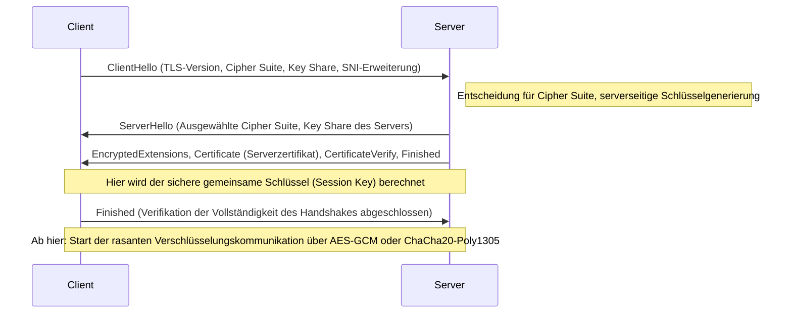

1. **ClientHello**: Zum Kommunikationsauftakt sendet der Client die von ihm unterstützte TLS-Version, eine Liste von Verschlüsselungsalgorithmen (Cipher Suites) und die initialen mathematischen Parameter zur Generierung kryptografischer Schlüssel (Key Share) an den Server. Ferner wird mittels der SNI-Erweiterung (Server Name Indication) der Hostname des Ziels (z. B. `www.example.com`) im Klartext übertragen. Dies ist eine unentbehrliche Information für Server (Virtual Hosts), die mehrere HTTPS-Domains über eine einzelne IP-Adresse betreiben, damit diese das korrekte Zertifikat auswählen und zurückgeben können.
2. **ServerHello**: Der Server wählt aus der Liste des Clients den stärksten und optimalen kryptografischen Algorithmus (z. B. `TLS_AES_256_GCM_SHA384`) und antwortet zusammen mit seinen eigenen Key-Share-Daten.
3. **Zertifikatsübermittlung und Signatur (Authentication)**: Der Server sendet sein "Digitales Zertifikat (X.509)". Des Weiteren generiert der Server mit seinem an das Zertifikat gekoppelten "Privaten Schlüssel" eine digitale Signatur (CertificateVerify) über den Hash-Wert der gesamten bisherigen Handshake-Nachrichten und versendet diese. Auf diese Weise wird mathematisch bewiesen, dass der Server der rechtmäßige Inhaber dieses Zertifikats (Besitzer des privaten Schlüssels) ist.
4. **Schlüsselaustausch (Ephemeral Elliptic Curve Diffie-Hellman: ECDHE)**: Client und Server multiplizieren die gegenseitig übermittelten Key Shares (bekannte Punkte auf der elliptischen Kurve) mathematisch mit ihren jeweiligen eigenen, ausschließlich lokal vorhandenen, geheimen Parametern. Es ist verblüffend: Dank der mathematischen Eigenschaften des Diffie-Hellman-Schlüsselaustauschs ($ (g^a)^b = (g^b)^a = g^{ab} $) wird – wie durch Magie – auf Client- und Serverseite ein und dasselbe, äußerst robuste "Master Secret (Shared Key)" synthetisiert, ohne auch nur ein einziges geheimes Datenstück ins Netzwerk einzuspeisen.
5. **Vorwärtsgeheimnis (Perfect Forward Secrecy: PFS)**: Ein überaus essenzielles Merkmal von TLS 1.3 ist, dass die für diesen Schlüsselaustausch verwendeten Parameter (Key Share) (ephemer) für jeden aufgebauten Sitzungsaufbau vollkommen neu als Einwegwerte generiert werden. Sollte ein Angreifer demzufolge den langfristig für die Identitätsbestätigung des Servers dienenden privaten Schlüssel (RSA- oder ECDSA-Schlüssel) Jahre später erbeuten, ist es mathematisch absolut ausgeschlossen, früher mitgeschnittene und gespeicherte Pakete der verschlüsselten Kommunikation im Nachhinein zu entschlüsseln. Die Vertraulichkeit vergangener Kommunikationen bleibt bis in die Zukunft gesichert.

### PKI und die Vertrauenskette (Chain of Trust): Der Pass der digitalen Welt

Innerhalb der bislang besprochenen Verschlüsselungsmechanismen verbleibt eine verhängnisvolle logische Lücke. Es ist das Problem: "Wie erlangt der Client die Gewissheit, dass das vom Server erhaltene Zertifikat sowie dessen öffentlicher Schlüssel auch tatsächlich authentisch und jener Zieldomain (wie z. B. der Website einer Bank) zuzuschreiben sind?"
Für den Fall, dass ein böswilliger Dritter, der eine Netzwerkroute beherrscht, sich als Server tarnt und dem Client sein gefälschtes Zertifikat sowie seinen öffentlichen Schlüssel im Rahmen eines "Man-in-the-Middle Attacks" unterjubelt, werden Schlüsselaustausch und Verschlüsselung aus mathematischer Sicht dennoch tadellos funktionieren. Dann ist jedoch nicht die anvisierte Bank der Kommunikationspartner der verschlüsselten Verbindung, sondern der Angreifer.

Der gesellschaftliche und technologische Rahmen zur Klärung dieses ursächlichen Authentifizierungsproblems ist die PKI (Public Key Infrastructure: Public-Key-Infrastruktur) mitsamt der Existenz von "Zertifizierungsstellen (CA: Certificate Authority)", die als Vertrauensanker fungieren.

Der Betreiber eines Servers generiert einen CSR (Certificate Signing Request), der seinen öffentlichen Schlüssel einschließt, und reicht diesen bei einer vertrauenswürdigen Drittorganisation, einer CA wie DigiCert, GlobalSign oder Let's Encrypt, ein. Nach Überprüfung (durch Domain-Validierung, Organisationsvalidierung usw.), dass dem Antragsteller die Domain zweifelsfrei gehört, nutzt die CA ihren eigenen hochsicheren "privaten Schlüssel", um die Informationen des öffentlichen Serverschlüssels mit einer "digitalen Signatur" zu versehen und diese als Serverzertifikat zu veröffentlichen.

Andererseits sind in Betriebssystemen wie Windows oder macOS sowie in Webbrowsern wie Chrome oder Firefox bereits "Stammzertifikate (öffentliche Schlüssel)" von weltweit strengstens auditierten Root-CAs als hardcodierte Vertrauensanker (Trust Anchors) verankert.

Sobald ein Client ein Zertifikat vom Server empfängt, validiert er die digitale Signatur der CA, die dem Zertifikat anhängt, kryptografisch unter Einsatz des im OS integrierten öffentlichen Schlüssels der Root-CA. Gelingt die Verifikation der Signatur, so ist erwiesen, dass die im Zertifikat festgehaltenen Inhalte (Domainname und öffentlicher Schlüssel) von der CA beglaubigt und keineswegs verfälscht wurden.

1. Der Client bringt der Root-CA bedingungsloses Vertrauen entgegen (durch die Vorabinstallation im Trust Store).
2. Die Root-CA vertraut einer Intermediate-CA und signiert sie.
3. Die Intermediate-CA vertraut der Endentität (dem Webserver) und signiert sie.

Durch das transitive Konstrukt dieser "Vertrauenskette (Chain of Trust)" sind wir imstande, eine unverbrüchliche Vertrauensbasis zu uns physisch fernen und gänzlich unbekannten Servern dynamisch und in Bruchteilen von Sekunden aufzubauen sowie einen sicheren Verschlüsselungskanal herzustellen.

## Fazit: Verschmelzung der Schichten und der Aufbruch in neue Sphären

In Kapitel 5 haben wir ausführlich seziert, was sich in den Abgründen der Anwendungsschicht abspielt: Die Namensauflösung, Datenanforderungs- und Antwortprotokolle, als auch der die Thematik vollumfänglich umschließende Schleier der mathematischen Verschlüsselung.
DNS agiert als das endlose dezentrale Adressbuch des Internets, HTTP etabliert die Architektur des Ressourcenboten und TLS verteidigt all dies unerschütterlich mit der Rüstung modernster Kryptografie. Historisch gesehen wurden diese als autarke Protokollschichten entwickelt. Doch im Web der Gegenwart – wie wir anhand von QUIC im HTTP/3-Kontext feststellen können – verwachsen die Grenzen der Transportschicht, der Anwendungsschicht und der Verschlüsselungsebene immens; sie reißen physikalische Latenzgrenzen ein und evolutionieren beständig hin zu raffinierten Systemen mit der Maxime des gleichzeitigen Strebens nach höchster Performance und Sicherheit.

Im nachfolgenden Kapitel werden wir untersuchen, wie diese durch gesicherte und verschlüsselte Kommunikationslinien am Zielserver angekommenen Anfragen dynamischen Content generieren und mit den hinterliegenden Datenbanksystemen interagieren. Bezüglich der "internen Struktur von Back-End-Systemen und des Distributed Computing" werden wir uns noch tiefer in den technischen Abgrund vorwagen.

# Kapitel 6: Die physische Infrastruktur, die das Internet trägt —— Die gigantische Maschinerie aus Licht, Hitze und dem Ozean

Das Internet wird häufig als "Cloud" (Wolke), ein immaterielles, abstraktes Konzept, dargestellt. Es erweckt die Illusion, als würden die Daten, die wir von unseren Smartphones oder Computern versenden, über unsichtbare Funkwellen und Kabel in Speichermedien gesogen, die "irgendwo dort oben im Himmel" weilen. Die Realität des Internets ist jedoch nicht so flüchtig wie eine Wolke. Es ist massiv, materiell und unverrückbar an die Gesetze der Thermodynamik, Optik und Geophysik gekettet – die zweifellos gigantischste physische Infrastruktur der Menschheitsgeschichte.

In diesem Kapitel sezieren wir umfassend die drei gewaltigen Säulen, welche das besagte "unsichtbare Netzwerk" in der physischen Welt manifestieren: Die "Unterseekabel", die als planetarische Nervenstränge fungieren, die thermodynamischen Verarbeitungsstätten alias "Hyperscale-Rechenzentren", welche für Datenaufbewahrung und Rechenoperationen zuständig sind, und "CDN (Content Delivery Networks)", die die Barrieren der Lichtgeschwindigkeit aufbrechen und Raum und Zeit komprimieren. Wir tun dies unter Erörterung ihrer physikalischen Mechanismen, historischen Hintergründe und aus der hochprofessionellen technologischen Perspektive im Streben nach dem absoluten Optimum.

---

## 1. Die Lichtnerven, die die Welt umspannen: Das Unterseekabelsystem

Nahezu 99% der internationalen und grenzüberschreitenden Internetkommunikationen laufen heutzutage nicht über Satelliten im Weltall, sondern über "Unterseekabel (Submarine Communications Cables)", die mit einem Querschnitt von wenigen Zentimetern am Meeresgrund verlegt sind. Rufen wir eine ausländische Website auf, rasen ihre Daten mit Lichtgeschwindigkeit durch die tiefste und düsterste Finsternis abertausender Meter unter dem Ozean.

### 1.1 Die Entwicklung vom Telegraphen zur Glasfaser und die Herausforderung des Shannon-Limits

Die Historie der Unterseekabel geht den Ursprüngen des Internets weit voraus; sie reicht bis zur Verlegung des Telegrafenkabels über den Ärmelkanal im Jahr 1850 zurück. 1858 wurde das erste transatlantische Telegrafenkabel gelegt, doch zu jener Zeit erfolgte die Kommunikation im Morsecode, und die Nachricht von Königin Victoria an US-Präsident Buchanan benötigte mehr als ein Dutzend Stunden für die Übermittlung. Nach einer Ära der analogen Telefonleitungen mit Koaxialkabeln begann ab Ende der 1980er Jahre der Einzug der Glasfaserkabel. Die Kapazität des 1988 verlegten ersten transatlantischen optischen Kommunikationskabels "TAT-8" umfasste 280 Mbps (etwa 40.000 Telefonleitungen), was für die damalige Zeit eine revolutionäre Bandbreite darstellte.

Gegenwärtige Unterseekabel trumpfen mit unvorstellbaren Übertragungskapazitäten von mehreren Hundert Tbps (Terabit pro Sekunde) in einer einzigen Leitung auf. Das, was diesen Entwicklungssprung ermöglichte, waren zwei nobelpreisverdächtige physikalische und ingenieursmäßige Meilensteine: "Wellenlängen-Multiplexing (WDM: Wavelength Division Multiplexing)" und "Erbiumdotierter Faserverstärker (EDFA: Erbium-Doped Fiber Amplifier)".

WDM ist ein Verfahren, bei dem unterschiedliche Lichtwellenlängen (Farben) innerhalb eines einzigen Glasfaserkabels gemultiplext und parallel transportiert werden. Dadurch wird die Übertragungskapazität pro Glasfaser um die Anzahl der Wellenlängen multiplikativ hochgeschraubt. Allerdings: Ganz gleich, wie rein das Quarzglas – das Material der Glasfaser – noch gemacht wird, nach einigen Hundert Kilometern dämpfen Rayleigh-Streuung oder Infrarotabsorption die optischen Signale. Abhilfe schaffen Zwischenverstärker (Repeater), die alle paar Dutzend bis Hundert Kilometer eingesetzt werden.

Ehemalige Repeater wandten den komplexen und extrem limitierenden Prozess (O-E-O-Wandlung) an, bei dem gedämpfte Lichtsignale einmalig in elektrische Impulse umgewandzt, dann verstärkt und zurück in ein optisches Signal umkodiert wurden. Die in den 1990ern etablierten EDFAs jedoch reichern den Glasfaserkern mit dem Seltenerdmetall Erbium an, und durch das Aufbringen starken Laserlichts – sogenannten Pumplichts – werden Lichtsignale unmittelbar und "als pures Licht" verstärkt. Es wurde so möglich, zahlreiche Signale diverser Wellenlängen gesammelt zu verstärken, und dank der Konvergenz mit der WDM-Technologie hoben die Kommunikationskapazitäten explosionsartig ab.

Derzeit nähert sich der Fachbereich der Telekommunikationstechnik dem von Claude Shannon postulierten theoretischen Grenzwert für die Kanalkapazität: Dem "Shannon-Limit". Um jene Schranke zu durchbrechen, rücken "Multicore-Fasern", bei denen ein einziges Faserkabel zahlreiche Kerne beinhaltet, und physikalische Konzepte für nächste Generationen, wie das Multiplexing räumlicher Lichtmodi namens "Space Division Multiplexing (SDM)", sukzessive in das Rampenlicht von Forschung und Applikation.

### 1.2 Das physische Milieu der Tiefsee und die Ingenieurskunst der Kabelverlegung

Die Verlegung von Unterseekabeln zählt zu den strapaziösesten Ingenieursleistungen der Moderne. Ein etliche Tausend Kilometer langes Kabel wird mithilfe spezialisierter "Kabelverlegeschiffe (Cable Layer)" auf den Meeresgrund hinabgelassen.

Im Vorfeld der Verlegung werden mithilfe von Echoloten präzise topografische Meeresbodenkarten erstellt, um eine optimale Route auszuwählen, die unterseeische Gebirgszüge, Tiefseegräben, hydrothermale Quellen und Zonen mit der Gefahr von Erdrutschen meidet. Die Struktur der Kabel unterscheidet sich je nach der Wassertiefe der Verlegung drastisch.

In seichten Gewässern, wie den Kontinentalschelfen (Wassertiefen geringer als 1000–1500 Meter), ist das physische Risiko einer Durchtrennung – bedingt durch Schleppnetze von Fischerbooten, Schiffsanker oder Bisse von Meereslebewesen wie Haien – extrem hoch. Folglich wird außen um das Polycarbonatharz und das Kupferrohr, die die Glasfaser abschirmen, zusätzlich eine "Armierung (Armor)" gelegt, für die nochmals mehrere Schichten hochfester Stahldrähte (Steel Wires) herumgewickelt werden. Hierdurch nehmen Durchmesser und Gewicht enorm zu. Obendrein erfolgen Arbeiten, bei denen das Kabel mittels unbemannter, ferngesteuerter Tauchroboter (ROV: Remotely Operated Vehicle) oder unterseeischer Kabelpflüge einige Meter tief in den Schlamm und Sand des Meeresbodens eingegraben wird.

Andererseits existiert in der Tiefsee in mehreren Tausend Metern Wassertiefe die Bedrohung durch Fischernetze oder Anker nicht; deshalb kommen "Leichtgewichts-Kabel (Lightweight Cables)" zum Einsatz. Um Drahtbrüche infolge des Eigengewichts während der Verlegung zu unterbinden, verzichtet man auf die Stahldrahtarmierung, bewahrt sich aber gleichzeitig die Robustheit, dem Wasserdruck standzuhalten. Der Durchmesser liegt lediglich bei 17 bis 20 Millimetern – nicht dicker als ein Gartenschlauch.

Ein weiterer elementarer physikalischer Aspekt von Unterseekabeln ist die "Stromversorgung". Zum Antrieb der alle paar Dutzend Kilometer installierten Zwischenverstärker wird von der an Land liegenden Kabelstation (Cable Landing Station) über ein kupfernes Rohr (Speiseleiter) innerhalb des Kabels Gleichstrom mit hoher Spannung eingespeist. Bei ozeanüberspannenden Kabeln überschreitet die Speisespannung nicht selten 10.000 Volt (10 kV). Zumeist wird hierbei die sogenannte "Single-Wire Earth Return"-Methode verwendet, die das Meerwasser und das Erdreich als Rückleiter nutzt.

### 1.3 Geopolitik und der Aufstieg von Big-Tech-Unternehmen

In der Vergangenheit war bei der Verlegung von Unterseekabeln aufgrund der immensen erforderlichen Investitionen eine Vorgehensweise der Mainstream, bei der sich die wichtigsten Telekommunikationsunternehmen der Länder zusammenschlossen, Konsortien (Joint Ventures) bildeten und Kosten sowie Bandbreiten proportional aufteilten. In den letzten Jahren durchläuft dieses Ökosystem allerdings einen radikalen Wandel.

Große Technologieunternehmen – gemeinhin als "Hyperscaler" bezeichnet, wie Google, Meta (Facebook), Microsoft oder Amazon – gingen dazu über, Unterseekabel entweder im Alleingang oder gemeinschaftlich direkt zu finanzieren und zu verlegen, um die eigenen Rechenzentren untereinander ultraschnell zu vernetzen. Sie vollzogen die Wandlung vom schlichten Internetnutzer zum größten Besitzer physischer Infrastrukturen. Infolgedessen wird das Routing von Kabeln zunehmend weg von der traditionellen "Verbindung von Metropolen" hin zur "kürzesten und rasantesten Verbindung zwischen konzerneigenen Rechenzentren" optimiert.

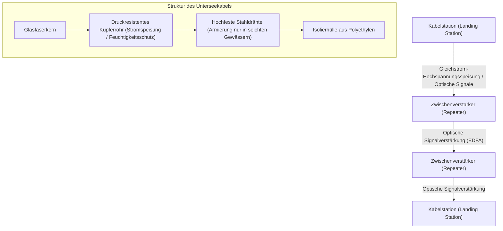

---

## 2. Thermodynamische Datenverarbeitungsstätten: Hyperscale-Rechenzentren

Daten, die über Unterseekabel an Land gelangen, werden letzten Endes in ein "Rechenzentrum" transportiert. Ein Rechenzentrum ist ein gigantisches Bauwerk, das Serverfarmen mit einer Größenordnung von Zehntausenden bis Hunderttausenden Maschinen beherbergt und diese 24 Stunden am Tag, 365 Tage im Jahr rastlos Rechenoperationen und Datenspeicherungen ausführen lässt.

### 2.1 Die Realität der Cloud und der Kampf um den "PUE"

Aus physikalischer Sicht ist das wahre Wesen eines Rechenzentrums eine "kolossale Wärmekraftmaschine, die enorme Mengen an elektrischer Energie als Input entgegennimmt und daraus Entropieverringerung in Form von Informationsverarbeitung (Berechnungsergebnissen) sowie zwangsläufig die damit einhergehende ‚Hitze‘ erzeugt". Halbleiter wie CPUs und GPUs generieren aufgrund des elektrischen Widerstands Wärme, wenn Strom ein- und ausgeschaltet wird. Wird diese Wärme nicht effizient nach außen abgeführt, geraten die Halbleiter unverzüglich ins thermische Durchgehen (Thermal Runaway) und verschmoren physisch.

Daher liegt das Hauptaugenmerk beim Design und Betrieb von Rechenzentren auf "Kühlung" und "Energieeffizienz". Die gebräuchlichste Metrik zur Angabe dieser Effizienz ist die "PUE (Power Usage Effectiveness)".

**PUE = Gesamtstromverbrauch des Rechenzentrums / Stromverbrauch der IT-Ausrüstung (Server etc.)**

Der theoretische Minimalwert des PUE liegt bei 1,0 (ein Zustand, in dem die gesamte Energie ausnahmslos der Berechnung zugutekommt). Bei Rechenzentren der Vergangenheit war es keine Seltenheit, dass der PUE 2,0 überstieg (d. h., dass für Kühlanlagen wie Klimatisierung dieselbe Strommenge aufgewendet wurde wie für den Betrieb der Server). In zeitgenössischen Hyperscale-Rechenzentren betreibt man jedoch eine bis ans absolute Limit getriebene thermodynamische Optimierung, die diesen Wert auf 1,1 bis 1,2 herabsetzt.

### 2.2 Die Evolution von Kühlungsarchitekturen

Basierend auf den Prinzipien der Thermodynamik haben sich die Kühlsysteme von Rechenzentren folgendermaßen entwickelt:

1. **Trennung von Hot Aisle und Cold Aisle**:
   In anfänglichen Rechenzentren wurde der gesamte Raum von Klimaanlagen (CRAC: Computer Room Air Conditioning) gekühlt; doch die kalte Luft vermischte sich mit der heißen Abluft der Server, was beispiellos ineffizient war. Standard ist heute das "Aisle Containment", bei dem die Lufteinlass- und Luftauslassseiten der Server-Racks jeweils einander gegenüberstehen, wodurch die Gänge, durch die die kalte Luft (Cold Aisle) und die heiße Luft (Hot Aisle) strömen, physisch voneinander getrennt (isoliert) sind.

2. **Free Cooling (Freikühlung)**:
   Der Betrieb der Kompressoren von Chillern (Kaltwassersätzen) erfordert kolossale Strommengen. Infolgedessen verbreitete sich das "Free Cooling", wofür man Rechenzentren in Regionen mit hinlänglich kühler Außenluft (wie Nordeuropa oder Hokkaido) errichtet und die Außenluft zur Kühlung heranzieht – entweder direkt oder indirekt mittels Wärmetauschern.

3. **Immersion Cooling (Tauchkühlung) und Direct-to-Chip-Kühlung (Direktwasserkühlung)**:
   In jüngster Zeit überschreitet die Abwärmedichte von High-End-GPUs, die für KI-Training und Inferenz genutzt werden, sukzessive die physischen Grenzen herkömmlicher Luftkühlung (denen die geringe Wärmekapazität und Wärmeleitfähigkeit der Luft geschuldet sind). Als Reaktion darauf beginnt man mit der Einführung von "Immersion Cooling", wobei das gesamte Mainboard der Server direkt in eine nichtleitende dielektrische Flüssigkeit auf Fluorbasis oder Mineralöl getaucht wird, sowie mit "Direct-to-Chip-Kühlung", bei der eine Wasserkühlplatte unmittelbar auf den Heatspreader von CPUs/GPUs angepresst und die Hitze über die im Vergleich zur Luft weitaus wärmekapazitivere Flüssigkeit direkt abtransportiert wird. Zweiphasen-Tauchkühlungen, die den Phasenübergang (Verdampfungswärme beim Sieden der Flüssigkeit) zunutze machen, können extrem hohe Wärmeströme handhaben.

### 2.3 Redundanz und physische Sicherheit

Weil Rechenzentren der Nervenknotenpunkt der gesellschaftlichen Infrastruktur sind, wird äußerste Redundanz verlangt. Bricht der gewerbliche Netzstrom weg, springt im Millisekundenbereich eine Unterbrechungsfreie Stromversorgung (USV/UPS), die auf Schwungräder, Bleiakkumulatoren oder Lithium-Ionen-Akkus setzt, zur Stromversorgung ein. Simultangestartet werden massive Diesel- oder Gasturbinengeneratoren im Außenbereich des Gebäudes; sie verfügen über die Leistungskraft, mithilfe gebunkerter Brennstoffe den Betrieb der Gesamtanlage für mehrere Tage aufrechtzuerhalten.

Genauso wird bei der Netzwerkanbindung verfahren: Indem Leitungen diverser Telekommunikationsanbieter einbezogen und physische Routen (Zuführungen aus verschiedenen Himmelsrichtungen des Gebäudes etc.) absolut separiert werden, ist man für Havarien wie einen durch Bauarbeiten verursachten Kabelabriss gerüstet.

---

## 3. Die Technologie, die Raum und Zeit komprimiert: CDN (Content Delivery Network)

Wenngleich Unterseekabel Kontinente koppeln und Rechenzentren Daten speichern – dadurch allein wird ein modernes Web-Erlebnis noch lange nicht realisiert. An dieser Stelle stellt sich die von Albert Einstein propagierte absolute Höchstgeschwindigkeit des Universums quer: "die Schranke der Lichtgeschwindigkeit".

### 3.1 Die Mauer der Lichtgeschwindigkeit und physische Grenzen der Latenz

Die Lichtgeschwindigkeit im Vakuum ($c$) beträgt rund 300.000 km/s. Der Brechungsindex des Quarzglases im Kern einer Glasfaser beläuft sich hingegen auf etwa 1,47, was zur Folge hat, dass die Geschwindigkeit des Lichts innerhalb der Faser auf ca. 200.000 km/s (etwa zwei Drittel der Vakuumgeschwindigkeit) abfällt.

Die physische Luftlinie von Tokio (Japan) zur Ostküste der USA, dem US-Bundesstaat Virginia (dem global größten Ballungsraum für Rechenzentren), beträgt beispielsweise circa 11.000 km; zieht man die Verläufe von Unterseekabeln in Betracht, sind es rund 14.000 km. Die rein physikalische Zeit, die ein Lichtsignal für eine einfache Strecke benötigt, liegt bei etwa 70 Millisekunden. Weil in der Internetkommunikation ein Hin- und Rücklauf von Paketen (RTT: Round Trip Time) gefordert ist, kommt es unumgänglich zu einer durch physikalische Gesetze diktierten Verzögerung (Latenz) von mindestens 140 Millisekunden. Obendrein addieren sich Verarbeitungsverzögerungen von Switches und Routern auf dem Weg hinzu.

Beim Öffnen moderner Websites ordert der Browser Hunderte von Dateien (HTML, CSS, JavaScript, Bilder usw.) und initiiert zahllose Pingpong-Kommunikationen im Rahmen des TCP-3-Way-Handshakes und von TLS- (SSL-) Verschlüsselungsverhandlungen. Wären ausnahmslos alle User dazu gezwungen, direkt auf einen "Origin-Server" auf der gegenüberliegenden Erdseite zuzugreifen, würden Verzögerungen von einigen bis hin zu über einem Dutzend Sekunden auftreten, bevor die Webseite überhaupt angezeigt wird. Hochauflösendes Videostreaming oder Online-Gaming in Echtzeit wären absolut undurchführbar.

### 3.2 Verteilung an die Edge: Die CDN-Architektur

Das System, das diese physische Limitierung ingenieurstechnisch bezwingt und Raum und Zeit komprimiert, ist das "CDN (Content Delivery Network)".

Das Grundkonzept des CDN ist ausgesprochen unkompliziert. Es basiert auf dem Ansatz: "Falls das Einholen der Daten von einem räumlich weit vom User entfernten Origin-Server zu viel Zeit in Anspruch nimmt, positioniert man am besten vorab Datenkopien (Caches) am physisch nächstgelegenen Ort des Users."

In Rechenzentren und den Anlagen von ISPs (Internet-Service-Providern) diverser Metropolen rund um den Globus platzieren CDN-Betreiber physisch abertausende Cache-Server, die man "Edge-Server" nennt. Greift ein Nutzer auf eine Webseite zu, verortet das CDN-Netzwerk im Bruchteil einer Sekunde die geografische wie netzwerktechnische Position des Users und routet die Kommunikation zum Edge-Server mit der allergeringsten Latenz (dem nächstgelegenen Server).

Die elementaren Technologien, die dieses Routing bewerkstelligen, sind "Anycast" und fortschrittliches "DNS-basiertes Routing". Beim Anycast-Routing wird zahlreichen Edge-Servern weltweit eine komplett identische IP-Adresse zugewiesen. Indem sich das BGP (Border Gateway Protocol) – das Rückgrat des Internets – mit seinem Routenauswahl-Algorithmus eingeschaltet, operieren die Router derart, dass sie Pakete automatisch an den netzwerktechnisch "nächsten" Server übermitteln. Infolgedessen wird ein Nutzer aus Tokio zu einem Tokioer Edge-Server gelenkt, während ein Londoner User ohne sein Zutun zu einem Londoner Edge-Server geführt wird.

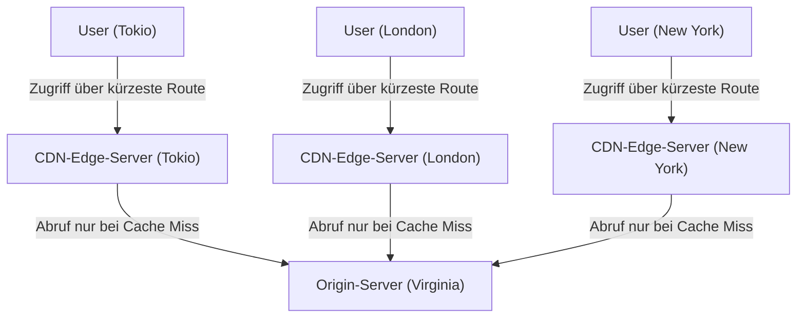

### 3.3 Dynamische Optimierung und die Ära des Edge Computing

CDN-Modelle der Frühphase waren nichts weiter als ein simples Konstrukt, das exklusiv für das Cachen und Ausliefern statischer Bilder, Videos und HTML-Dateien gedacht war. Ein CDN der Gegenwart hat sich hingegen in seinem Alleingang zu einer gewaltigen Plattform für verteiltes Computing gemausert.

Allen voran steht die Optimierung der Auslieferung dynamischer Inhalte (wobei jeder Nutzer differierende Suchergebnisse erhält, variable Warenkörbe existieren etc.). Solche Inhalte können zwar nicht gecacht werden; das CDN optimiert jedoch eigenmächtig den Kommunikationspfad zwischen Edge-Server und Origin-Server (mittels Tiered Cache oder dem Aufbau von speziell dedizierten Hochgeschwindigkeits-Routingnetzwerken). Somit wird eine zuverlässige, rasante und gegenüber dem gewöhnlichen Internetpfad (dem Best-Effort-Pfad des BGP) mit weit weniger Paketverlusten behaftete Kommunikationsstraße gewährleistet. Mehr noch: Indem am Edge-Server TCP-Verbindungen und TLS-Sitzungen terminiert werden (Termination), bricht die Anzahl an Handshake-Rundgängen zu weit entfernten Zielen drastisch ein.

Des Weiteren ist der Aufschwung des "Edge Computing" zu verzeichnen. Ursprünglich wurde die Verarbeitung hochkomplexer Applikationen (Authentifizierungen, A/B-Tests, dynamisches Resize von Bildern, Ausführung benutzerspezifischer Logiken etc.) durch die CPU der Origin-Server ausgeführt. In der heutigen Zeit jedoch ermächtigen Technologien wie AWS Lambda@Edge oder Cloudflare Workers die Entwickler, Code (JavaScript, Rust, WebAssembly etc.) unter Nutzung abgeschotteter Sandbox-Umgebungen wie der V8-Engine in Sekundenbruchteilen unmittelbar auf dem unmittelbar nächstgelegenen Edge-Server des Users laufen zu lassen. Dies mündet buchstäblich darin, dass die "Grenze (die Edge) des Internets" als kolossaler verteilter Computer zu operieren beginnt.

## 4. Fazit: Ein niemals endender Kampf gegen physikalische Grenzen

Die Chronik der Internet-Infrastruktur gleicht einem ununterbrochenen Ringen gegen die absoluten physikalischen Grundgesetze, die den Kosmos lenken – seien es die Lichtgeschwindigkeit, der zweite Hauptsatz der Thermodynamik oder das Gesetz der Energieerhaltung.

Die Ingenieure für Unterseekabel trotzen der immensen Kraft des Tiefseewasserdrucks und den optischen Limiten von Glas. Die Konstrukteure der Rechenzentren reizen das thermodynamische Limit für die Kühlung erhitzender Siliziumwafer gnadenlos aus. Die Architekten der CDNs schmieden beharrlich komplexere dezentralisierte Verarbeitungssysteme zur Umgehung der Mauer der Lichtgeschwindigkeit.

Wann immer wir unser Smartphone antippen und binnen Zehntelsekunden auf weltweite Datenbestände zugreifen, liegt all dem eine solch epochale, brutale und obendrein hochgradig filigran ausgeklügelte physikalische Infrastruktur zugrunde. Im 7. Kapitel werden wir genauer beleuchten, wie Software und Protokolle sich auf diesem zementierten Fundament verhalten, um ein grenzüberschreitendes, sich autonom organisierendes dezentrales Netzwerk am Leben zu halten – indem wir eine Exkursion in die Abgründe der "Welt des Routings und BGP" vornehmen.

# Kapitel 7: Der Kampf um Cybersicherheit und Privatsphäre

Die Chronik des Internets ist zugleich ein Epos des unentwegten Ringens zwischen dem Ideal einer völlig freien Informationsverbreitung und der Abschirmung von Systemen sowie Daten vor böswilligen Angriffen. Ursprünglich, in seiner Geburtsstunde als ARPANET, war das Internet so ausgelegt, dass die Prämisse auf der reinen Kommunikation eines elitären, sich vertrauenden Kreises von Forschern ruhte. Dementsprechend stand der Aspekt der "Sicherheit" beim fundamentalen Design des Protokolls weit hinten an; die Architektur beruhte auf dem Glauben an die Integrität (der "guten Absicht"). Als das Netz jedoch eine planetare Expansion erfuhr, kommerzialisiert wurde und sich als vollwertige Infrastruktur etablierte, erwies sich dieses frühe Designprinzip als verhängnisvoller Fehler.

Im Rahmen dieses Kapitels werden wir extrem präzise den Fokus auf die physikalischen wie netzwerktechnischen Mechanismen einer DDoS-Attacke legen – einer der gewaltigsten und das heutige Internet erschütterndsten Bedrohungen. Ferner widmen wir uns den Kryptografie- und VPN- (Virtual Private Network)-Technologien zur Garantie der Kommunikationsprivatsphäre und dem aus den Schranken der Perimeterverteidigung geborenen Sicherheitskonzept der Zukunft: Der "Zero-Trust-Architektur". All dies erfolgt mit einem tiefen Blick in die bodenlosen Abgründe der Technologie.

## 1. Die physikalischen Grenzen von Netzwerken und die Dynamik von DDoS-Angriffen

Einer der absolut primitivsten und zeitgleich am schwersten zu unterbindenden Eingriffe unter allen Cyberangriffen ist der **DDoS-Angriff (Distributed Denial of Service)**. Dabei handelt es sich um eine Attacke, die das anvisierte Server- oder Netzwerk-Equipment mit einem geballten Ansturm an Traffic malträtiert, der dessen Verarbeitungskapazität respektive die Leitungsbandbreite sprengt; in der Konsequenz wird der Dienst für legitime User torpediert und unzugänglich gemacht.

### Die physikalische Sättigung des Traffics: Die Limits der Leitungsbandbreite
Das Internet transportiert Daten vermöge physikalischer Medien wie Glasfasern, Kupferleitungen oder Funkwellen. Obzwar Übertragungsstrecken mittels Technologien wie WDM (Wavelength Division Multiplexing) Kommunikationskapazitäten im Terabit-Bereich bereitstellen, unterliegt die spezifische Bandbreite (etwa 1 Gbps oder 10 Gbps) der Anschlüsse individueller Server einem kompromisslosen physikalischen Deckel. DDoS-Angriffe haben exakt diese Limitierung der "Rohrbreite" im Visier. Sobald ein Angreifer eine Armee von Hunderttausenden weltweit zerstreuter und von Malware befallener Devices (ein Botnetz) manipuliert und sie zwingt, den Zielpunkt konzertiert mit Paketen zu bombardieren, überlaufen die Pufferspeicher der Router- oder Switch-Interfaces; infolgedessen werden Pakete verworfen. Dieses Konstrukt verhält sich vergleichbar mit einer Rohrverstopfung in der Strömungsmechanik: Der Zehntelsekunden-Augenblick, in dem die Informationsquantität (Paketmasse) die Verarbeitungskompetenz untergräbt, bricht dem Gesamtsystem das Genick und erzwingt einen Totalausfall.

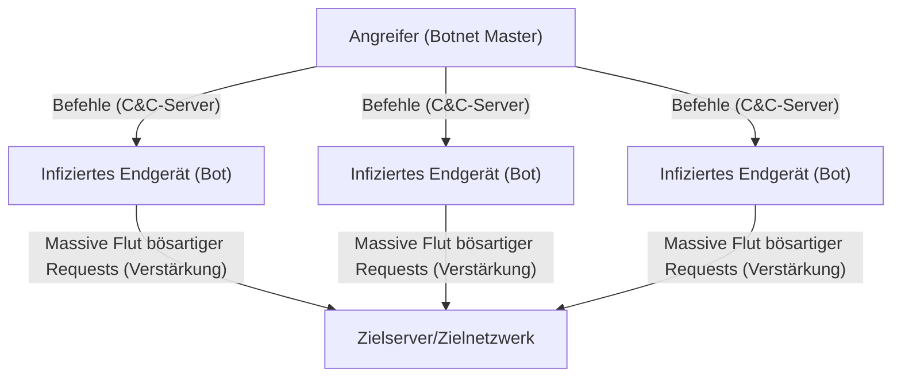

### Das Ausnutzen der TCP/IP-Vulnerabilitäten: Der SYN-Flood-Angriff
Neben Methoden, welche die Bandbreite vollständig belegen, gibt es Angriffsarten, deren Ziel es ist, die Server-Ressourcen (CPU oder Arbeitsspeicher) austrocknen zu lassen. Der wohl bekannteste Vertreter hierfür ist der **SYN-Flood-Angriff**. Das TCP-Protokoll erzwingt beim Aufbau einer Kommunikation den sogenannten "3-Way-Handshake"-Ablauf:
1. Der Client sendet ein "SYN"-Paket.
2. Der Server antwortet mit einem "SYN-ACK"-Paket und reserviert den Speicher für die Verbindung (TCB: Transmission Control Block).
3. Der Client überträgt ein "ACK"-Paket, womit die Verbindung final zustande kommt.

Der Attentäter flutet den Server mit einer endlosen Welle an SYN-Paketen, deren Quell-IP-Adresse verschleiert (gespooft) ist. Der Server reagiert pflichtbewusst mit SYN-ACK, der eigentliche Inhaber der gefälschten IP-Adresse entsendet indes kein ACK zurück (oder diese IP existiert de facto gar nicht). Die Resonanz: Der Server staut eine gewaltige Flut von Verbindungen im "halb offenen (Half-open)"-Status an, womit der für das Verbindungsmanagement allokierte Arbeitsspeicher erstickt und ihm keine Wahl bleibt, als neue Zugriffsgesuche legitimer Nutzer zu blockieren. Hierbei handelt es sich um einen fulminant meisterhaften Angriffsmechanismus, der die statusbasierte (Stateful)-Eigenschaft von TCP – nämlich die Bürgschaft für eine "gesicherte und verlässliche Kommunikation" – listig als Waffe gegen das Protokoll selbst verkehrt.

### Reflection-Angriffe (Amplification): Der Missbrauch der Asymmetrie
Ein mithilfe von UDP (User Datagram Protocol) inszenierter **Reflection-Angriff (Verstärkungsangriff)** agiert noch um ein Vielfaches perfider. UDP ist ein verbindungsloses Protokoll; der Sender bleibt unkontrolliert. Der Angreifer maskiert das Paket, indem er die IP-Adresse des Ziels als Quelladresse tarnt, und schickt Anfragen an öffentliche DNS- oder NTP-Server des Internets. Bei diesem Prozedere appliziert er spezielle Anfragen (etwa DNS-ANY-Queries oder NTP-Monlists), bei welchen ein marginales Request (von wenigen Dutzend Byte) eine Antwort provoziert, die das Hundert- bis Tausendfache der Ursprungsgröße (mehrere Kilobyte) aufweist.
Die monströs hochgeschaukelten Response-Pakete gehen wie eine Schlammlawine auf den gespooften Sender, mithin auf den infiltrierten Server, nieder. Obgleich der Eindringling auf seiner Seite nur einen kümmerlichen Bruchteil an Bandbreite aufwenden muss, befähigt ihn dies, Traffic-Stürme jenseits der Terabit-Sphäre über die Zielstruktur hereinbrechen zu lassen. Hierin manifestiert sich das physikalische "Hebelgesetz" oder ein asymmetrisches Phänomen analog der Resonanzverstärkung in der Akustik, nur eben adaptiert auf ein Netzwerk.

## 2. Die Verschleierung der Kommunikationswege: Verschlüsselung und die VPN-Mechanik

Pakete, die im öffentlichen Netzwerk, sprich dem Internet, navigieren, passieren zahllose Router und die Hardwarestrukturen diverser ISPs. Einer im Klartext (Cleartext) ausgetauschten, gänzlich unverschlüsselten Kommunikation können auf der Strecke spielend leicht Lauschangriffe (Sniffing) und Modifikationen zugefügt werden. Die wuchtigsten Schutzschilde zur Wahrung der Privatsphäre und der Vertraulichkeit sensibler Daten sind "kryptografische Verfahren" und "VPN (Virtual Private Network)".

### Die mathematischen Säulen moderner Kryptografie: Der Hybrid aus Public Key und Shared Key
Zur Sicherung der Kommunikation zieht man prioritär zwei unterschiedliche Verschlüsselungsmethoden heran:
- **Symmetrische Verschlüsselungsverfahren (wie AES)**: Zur Chiffrierung und Dechiffrierung der Datenströme wird identisches Schlüsselmaterial genutzt. Zwar besticht die Verarbeitung durch eine horrende Geschwindigkeit; die Schwachstelle manifestiert sich indes in dem Dilemma (dem Schlüsselverteilungsproblem), wie sich der Schlüssel ohne Gefahren in die Hände des Empfängers lotsen lässt.
- **Asymmetrische Verschlüsselungsverfahren / Public-Key-Kryptographie (wie RSA oder die Elliptische-Kurven-Kryptografie)**: Zum Einsatz gelangt ein Gespann aus einem "öffentlichen Schlüssel (Public Key)" für das Verschlüsseln und einem "privaten Schlüssel (Private Key)" zum Entschlüsseln. Dies rekurriert auf hochgradig vertrackte mathematische Eigenschaften (Asymmetrien) wie die enorme Schwierigkeit der Primfaktorzerlegung oder das Problem des diskreten Logarithmus. Der Preis hierfür sind allerdings beträchtliche Berechnungskosten.

Bei jedweder Form gesicherter Verbindungen im Netz (seien es TLS/SSL oder VPN-Verbindungen) bedient man sich eines Hybrid-Ansatzes, in welchem diese Paradigmen miteinander verzahnt werden. In der Initialphase, dem Handshake zum Start der Kommunikation, wird unter dem Deckmantel der asymmetrischen Verschlüsselung der "Session Key (der symmetrische Schlüssel)" ausgetauscht; der unmittelbar anschließende massive Datentransfer wird sodann verschlüsselt, unter Zuhilfenahme des rasanten Session Keys, abgewickelt. Auf diesem Fundament lässt sich die Symbiose aus sicherer Schlüsselzustellung und flinker, chiffrierter Kommunikation zementieren.

### VPN und das Grundprinzip des Tunneling
Bei einem **VPN (Virtual Private Network)** handelt es sich um eine Methodik, die mittels Verschlüsselungstechnologien auf dem offenen Internet-Teppich einen virtuellen "exklusiven Korridor (Tunnel)" etabliert. Die populärsten und repräsentativsten Vertreter der Protokollwelt sind hierbei IPsec, OpenVPN oder das neuerdings aufsteigende WireGuard.

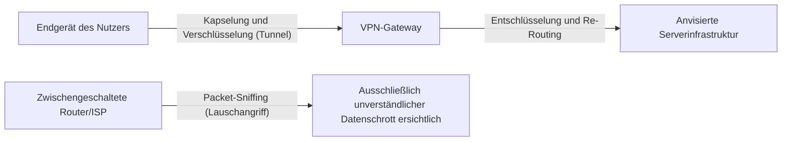

Der ultimative Kernmechanismus des Tunneling-Prozesses liegt verborgen in der "Kapselung (Encapsulation)". Das Ur-IP-Paket (die Payload) des Nutzers, welches dieser absenden will, wird ganzheitlich codiert und verschlüsselt. Im darauffolgenden Schritt wird dieses als reiner Datensatz eines neu geformten IP-Pakets eingebettet (gekapselt), und diesem wird für den äußeren Mantel ein völlig neuer IP-Header verpasst, der das VPN-Gateway als Adressaten ausweist.
Router, die diesen Internetpfad zieren, werfen lediglich einen isolierten Blick auf die Hülle – den äußeren IP-Header – und lenken das Paket unbeirrt zum VPN-Server. Da die inneren Eingeweide unter dem robusten Schild der Verschlüsselung ruhen, ist es selbst im Fall eines Sniffing-Angriffs schlechterdings ein Ding der Unmöglichkeit, Kommunikationsinhalte oder überhaupt den genuinen IP-Adressaten zu decodieren. Das den VPN-Server erreichende Paket wird entschlüsselt, aus der Ursprungs-Header-Ummantelung herausgeschält und der Zieldestination übergeben. Genau über diesen Hebel der logischen und mathematischen Isolation wird inmitten einer Infrastruktur, derer sich physisch jedermann bemächtigen kann, ein vollkommen unantastbarer und geschirmter privater Kosmos geboren.

## 3. Der Niedergang der Perimeter-Sicherung und der Triumph der Zero-Trust-Architektur

Ewig und drei Tage stand und fiel die Security-Strategie im Netzwerkumfeld von Großunternehmen und Organisationen mit einem Dogma, das sich "Perimeter-Verteidigung (Perimeter-Modell)" nannte. Dies war nicht minder als ein festungsartiges Verteidigungskonzept: Genau am Grat zwischen dem offenen Internet (dem feindlichen Draußen) und dem unternehmensinternen Netzwerk (dem sicheren Inneren) wurden Firewalls oder Intrusion-Prevention-Systeme (IPS) hochgezogen, nach der blinden Devise "Außen lauert das Verderben, innen herrscht unantastbarer Frieden".

### Der durch Cloud und Telearbeit herbeigeführte Verlust der Grenzen
In der heutigen Zeit ist dieses Modell jedoch vollends gescheitert. Durch den Siegeszug von SaaS (Software as a Service) werden hochsensible Daten außerhalb des Unternehmens in der Cloud gelagert; im Zuge der Normalisierung von Telearbeit greifen Mitarbeiter vermehrt über das Wi-Fi zu Hause oder im Café auf Netzwerke zu. Die Grenzlinie zwischen dem "schützenswerten Inneren" und dem "gefährlichen Äußeren" hat sich in Luft aufgelöst, und Traffic, der sich durch herkömmliche Firewalls nicht länger bändigen lässt, ist explosionsartig in die Höhe geschnellt. Ferner ist die Perimeter-Verteidigung einer Malware (wie Ransomware), die erst einmal in das interne Netzwerk eingedrungen ist, oder böswilligen Insidern völlig machtlos ausgeliefert. Die Prämisse "Was drinnen ist, ist vertrauenswürdig" avancierte zur ultimativen Verwundbarkeit.

### Zero Trust: Trust Nothing, Verify Everything (Vertraue nichts, überprüfe alles)
Zur Bewältigung dieses Paradigmenwechsels wurde die **"Zero-Trust-Architektur (Zero Trust Architecture: ZTA)"** postuliert. Die Grundphilosophie von Zero Trust ist es: "Unabhängig vom Standort im Netzwerk (ob intern oder extern) wird standardmäßig keiner einzigen Kommunikation vertraut (Never Trust, Always Verify)."

In einem Zero-Trust-Modell verlagert sich der Fokus der Sicherheit weg von der "Netzwerkgrenze" hin zur "Identität (Benutzer und Geräte)" sowie zu "Ressourcen (Daten und Applikationen)".

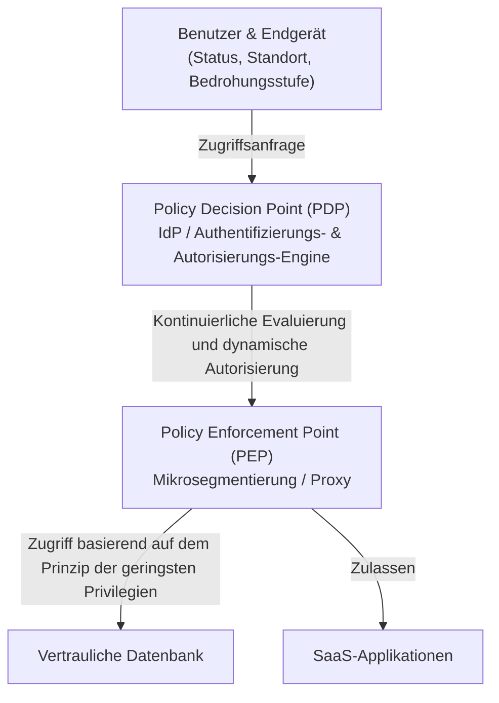

Die technologischen Kernkomponenten zur Realisierung von Zero Trust gestalten sich wie folgt:

1. **Identity- und Access-Management (IAM/IdP)**: Es wird nicht bloß auf simple Passwörter gesetzt, sondern in Kombination mit MFA (Multi-Faktor-Authentifizierung) und biometrischer Authentifizierung die Identität eines Nutzers rigoros verifiziert.
2. **Evaluierung der Device-Posture (Gesundheitszustand des Endgeräts)**: Der Patch-Status des OS, der Betriebszustand von Antivirenprogrammen sowie das bisherige Verhalten des zugriffsbegehrenden Endgeräts werden in Echtzeit bewertet. Zugriffe von unsicheren Geräten werden augenblicklich gekappt.
3. **Mikrosegmentierung**: Das Netzwerk wird granulär zersplittert und für jede Ressource werden winzigste Grenzen hochgezogen. Dieses Konstrukt soll die laterale Ausbreitung (Lateral Movement) des Schadens im Worst-Case-Szenario eines Eindringens abblocken.
4. **Kontinuierliche Authentifizierung und dynamische Policys**: Nur weil ein Login einmal geglückt ist, ist andauerndes Vertrauen noch lange nicht garantiert. Während einer laufenden Sitzung wird das Verhalten (IP-Wechsel der Zugriffsquelle, abnormale Daten-Downloadmengen etc.) fortlaufend überwacht; dynamische Kontrollmechanismen kappen die Session in dem Millisekunden-Bruchteil, in dem ein Risiko-Score den Schwellenwert durchbricht.

Zero Trust ist nicht einfach ein Produkt, sondern eine Architekturphilosophie nach dem Credo "Jeder Zugriff wird jedes Mal aufs Neue validiert, und es wird nur das absolute Minimum an notwendigen Berechtigungen (Least Privilege) gewährt" – und es ist die einzig realistische Lösung, um Daten in der dezentralisierten IT-Infrastruktur der Gegenwart zu schützen.

## 4. Die Sicherheit der Zukunft: Quantenkryptographie und Netzwerkabwehr der nächsten Generation

Die RSA- und Elliptische-Kurven-Kryptographie, auf die wir uns derzeit stützen, baut auf der Prämisse auf, "dass die Entschlüsselung mit den Berechnungskapazitäten der heutigen Computer eine astronomische Zeit in Anspruch nähme". Sollten jedoch "Quantencomputer", die die Gesetze der Quantenmechanik anwenden, in die Praxis Einzug halten, bestünde die akute Gefahr, dass derartige mathematische Fragestellungen dank des Shor-Algorithmus binnen Sekunden geknackt werden. Dies wird als **"Q-Day (Der Tag der Entschlüsselung durch Quantencomputer)"** bezeichnet.

Um dem entgegenzuwirken, werden aktuell zwei Ansätze erforscht:
Der eine ist die Standardisierung einer neuen Form kryptografischer Algorithmen, die selbst für Quantencomputer mathematisch schwer zu knacken sind: die **"Post-Quanten-Kryptographie (PQC: Post-Quantum Cryptography)"** (etwa die gitterbasierte Kryptographie).
Der zweite Ansatz beruht darauf, die Gesetze der Physik (Quantenmechanik) selbst zum Fundament der Sicherheit zu machen: die **"Quantenschlüsselverteilung (QKD: Quantum Key Distribution)"**. Dies ist eine Technologie, bei der Informationen auf den Quantenzustand (wie die Polarisation) von Photonen gepackt und Schlüssel versendet werden. In dem Zehntelsekunden-Bruchteil, in dem ein Lauscher versucht, das Photon zu observieren (zu kopieren), transformiert sich der Quantenzustand (Messproblem / Unschärferelation). Folglich ist dies die ultimative Form sicherer Kommunikation, bei der sich Abhöraktionen zu 100% physikalisch detektieren lassen.

## Schlusswort

Das 7. Kapitel des Internets – es ist das immerwährende Wippenspiel zwischen "Bequemlichkeit" und "Sicherheit". Angefangen bei der Sättigung physikalischer Ebenen infolge von DDoS-Attacken, über mathematische Bastionen mittels Kryptotechnik, bis hin zum architektonischen Paradigmenwechsel des Zero Trust: Die Cybersicherheit hat den limitierten Rahmen reiner IT-Technik gesprengt und sich zu einem hochgradig komplexen wissenschaftlichen Territorium emporgeschwungen, an dessen Knotenpunkt Physik, Mathematik und Verhaltenspsychologie ineinanderfließen.
Im Hintergrund der Kulisse, während wir sorglos den Browser aufrufen und in der Cloud mit Daten jonglieren, tobt ein furioser, in Millisekunden getakteter elektronischer Krieg zwischen Phantom-Angreifern und Verteidigungsbollwerken – 24 Stunden am Tag, 365 Tage im Jahr.

Im anstehenden finalen 8. Kapitel werden wir auf Erkundungstour in die Zukunft des Internets gehen – namentlich die Netzwerkparadigmen der kommenden Generationen wie Web3.0, das Metaverse und das Interplanetare Internet (Interplanetary Internet).

# Kapitel 8: Das Internet der Zukunft —— Das von Dezentralisierung, Weltraum und Quantenmechanik gewobene Netzwerk der nächsten Generation

Im Laufe der letzten Jahrzehnte hat sich das Internet kontinuierlich als die einflussreichste Informationsinfrastruktur der Menschheitsgeschichte fortentwickelt. Von der Fundierung der Paketvermittlungstechnologie im ARPANET der 1960er Jahre, über die Standardisierung der TCP/IP-Protokollfamilie und die Geburt des WWW (World Wide Web), bis hin zur Durchdringung des mobilen Breitbands – sein Siegeszug kennt keinen Stillstand. Allerdings wird das Internet, das wir heutzutage nutzen, sukzessive mit den elementaren Begrenzungen seiner Architektur und physischen Restriktionen konfrontiert: Seien es die Übel der Zentralisierung einhergehend mit der Gigantomie von Rechenzentren, die physischen Verzögerungen bei Glasfaserkabeln für den interkontinentalen Datenverkehr, oder das Erodieren der existierenden Kryptografie-Techniken, forciert durch den rasanten Schub an Rechenkapazitäten (nicht zuletzt durch den Vormarsch von Quantencomputern).

In diesem Kapitel mit dem Titel "Kapitel 8: Das Internet der Zukunft" sondieren wir die absolute Speerspitze der sich aktuell vollziehenden Paradigmenwechsel. Im Konkreten sezieren wir die drei Säulen – "Web3 und dezentrale Architekturen" als Vorstoß zur Abkehr von der Zentralisierung, "LEO-Satellitenkommunikationsnetzwerke (wie Starlink)", die die Grenzen der physischen Infrastruktur in den Weltraum verschieben, und das "Quanteninternet", das ultimative Gesetze der Physik auf die Kommunikation appliziert – mitsamt ihrer historischen Hintergründe, Physik und technischen Mechanik aus einem hochprofessionellen Blickwinkel bis ans letzte Limit.

---

## 8.1 Web3 und der wahre Wert dezentraler Architekturen: Der Aufbau eines Trustless Networks

Das zeitgenössische Internet (Web2.0) fußt auf dem zentralistischen Daten-Management durch kolossale Plattform-Giganten. Obzwar das Client-Server-Modell effizient ist, birgt es massive strukturelle Bürden: Die Existenz eines Single Point of Failure (SPOF), die Anfälligkeit für Zensur und eklatante Verletzungen der Privatsphäre von Benutzerdaten. Die auf architektonischer Ebene angesiedelte Antwort darauf manifestiert sich im "Web3" mitsamt der Technologien für dezentrale Netzwerke.

### 8.1.1 Content-Adressed Networks und IPFS
Das klassische Web (HTTP) ist "lokationsorientiert" (Location-Adressed). Man erhält Zugriff auf Informationen, indem man deklariert, "wo diese sich befinden (URL)". Durch diese Systematik kommt es jedoch bei Serverausfällen oder abgelaufenen Domains zum Phänomen des "Toten Links (404 Not Found)", bei dem der Content de facto im Nirwana verschwindet.

Demgegenüber ziehen dezentrale Speichersysteme wie IPFS (InterPlanetary File System) eine Architektur der "Content-Orientierung (Content-Addressed)" heran. Der Zugriff auf Daten erfolgt über eine eindeutige "Content-Kennung (CID)", die dadurch generiert wird, dass der Dateiinhalt durch eine kryptografische Hash-Funktion (wie SHA-256) gejagt wird.

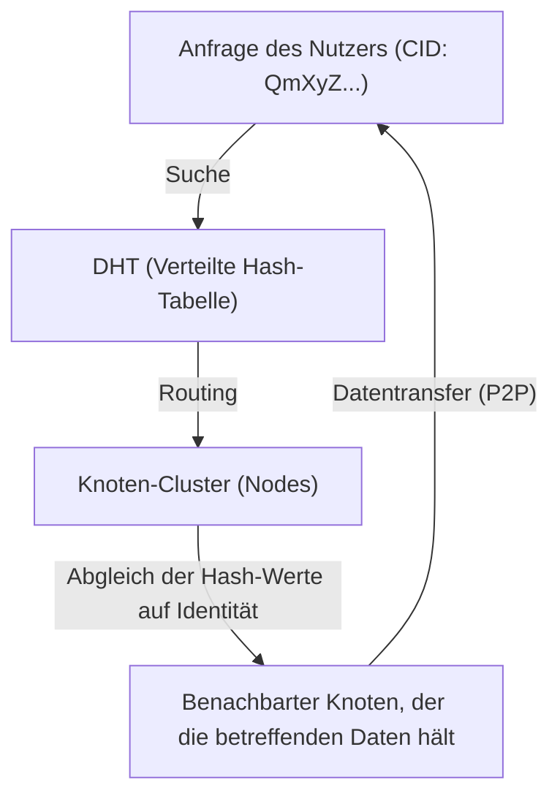

Der Dreh- und Angelpunkt dieses Mechanismus ist der Kademlia-Algorithmus, eine Form von DHT (Distributed Hash Table: Verteilte Hash-Tabelle). Kademlia definiert die "Distanz" zwischen einer Node-ID und einer Daten-ID vermöge einer XOR-Operation (exklusives ODER). Hierdurch gelingt ein hocheffizientes Mapping der gesamten Netzwerktopologie, und mit einem Berechnungsaufwand von $O(\log N)$ lässt sich punktgenau derjenige Knoten lokalisieren, der die Ziel-Daten bereithält. Da Daten auf Knotenpunkten rund um den Globus dezentralisiert und dupliziert werden, bleibt der Datenzugriff gewahrt, selbst wenn ein Bruchteil der Nodes offline geht, womit eine extrem hohe Widerstandsfähigkeit gegen Zensur einhergeht.

### 8.1.2 Dezentrale Konsensfindung und kryptografische Beweise
Ein weiteres Fundament des Web3 ist die Blockchain-Technologie. Diese speist sich aus "Konsens-Algorithmen", mittels derer sich in einem dezentralen Netzwerk, vollkommen ohne Einmischung eines zentralen Verwalters, darauf verständigt wird, "wer den wahren Zustand protokolliert".
Das in den Ursprüngen von Bitcoin implementierte PoW (Proof of Work) war ein Mechanismus, der sich die Kollisionsresistenz von Hash-Funktionen zunutze machte und Modifikationen durch die Investition von exorbitanten Mengen an Rechenenergie physisch zu einem Ding der Unmöglichkeit machte. Aus Gründen des Energieverbrauchs ist jedoch derzeit der Wandel hin zu PoS (Proof of Stake) in vollem Gange.

In PoS-Systemen (wie sie bei Ethereum 2.0 angewandt werden) bündeln Validatoren, die Kryptowerte gestakt (hinterlegt) haben, ihre Signaturen unter der Anwendung einer besonderen, auf Pairings basierenden Kryptografie-Technik namens BLS- (Boneh-Lynn-Shacham)-Signaturen. Hiermit lassen sich digitale Signaturen von Zehntausenden bis Hunderttausenden Nodes auf eine homöopathische Datengröße komprimieren, was – trotz eines dezentralen Netzwerks – die Gratwanderung zwischen exzellenter Security und einem gerüttelten Maß an Skalierbarkeit meistert. Im Internet der Zukunft ist davon auszugehen, dass diese Technologien als gänzlich neue Schicht (eine Ebene für Werttransfer und Konsensbildung) über TCP/IP in das OSI-Referenzmodell als Standard eingewoben werden.

---

## 8.2 Ein den Erdball umschließendes Satellitennetz: Starlink und darüber hinaus

Das terrestrisch verlegte Netz aus Glasfaserkabeln ist das Backbone des modernen Internets. Indes ist man den Verlegungskosten von Unterseekabeln, geologischen Hürden und nicht zuletzt der physischen Schranke namens "Lichtgeschwindigkeit im Medium" ausgesetzt. LEO-Satellitenkonstellationen (Low Earth Orbit) – par excellence vertreten durch SpaceX’ Starlink – haben es sich auf die Fahnen geschrieben, diese Bürden in der Weite der Frontier des Weltraums aufzulösen.

### 8.2.1 Orbitale Dynamik und die Vormachtstellung des LEO (Low Earth Orbit)
GEO-Satelliten (Geostationary Earth Orbit) kreisen in einer Höhe von rund 35.786 km; da sie synchron mit der Erdrotation rotieren, trumpfen sie mit dem Privileg auf, dass Antennenausrichtungen unbeweglich verbleiben können. Weil die Funkwellen für einen profanen Hin- und Rückweg allerdings mehr als 70.000 km zurücklegen müssen, ist eine durch physikalische Limitationen bedingte Verzögerung (etwa 120 Millisekunden bloß für einen Weg; die reelle Latenz übersteigt 500 Millisekunden) ein unvermeidliches Übel.

Im Kontrast dazu werden Starlink-Satelliten im Low Earth Orbit in etwa 550 km Höhe platziert. Laut der Bahnmechanik basierend auf dem Dritten Keplerschen Gesetz ist es in dieser Höhe unabdingbar, dass die Satelliten mit einer irrsinnigen Geschwindigkeit von ca. 7,6 km/s (rund 27.000 km/h) die Erde umkreisen, um die Erdanziehung und die Zentrifugalkraft in der Waage zu halten (eine Erdumrundung dauert ca. 90 Minuten).
Bedingt durch diese geringe Flughöhe wird die physische Signallaufzeit von Funkwellen auf annähernd ein Fünfundsechzigstel der von GEO-Satelliten drastisch eingedampft; die theoretische Kommunikationslatenz bewegt sich auf Augenhöhe mit oder gar unterhalb der von terrestrischer Glasfaser (20–40 Millisekunden).

### 8.2.2 Phased-Array-Antennen und die Kontrolle der Wellenfront von Funkwellen
In Anbetracht der enormen Geschwindigkeit der Satelliten sind die Endgeräte auf der Erde (Flachantennen ohne physischen Rotormotor wie bei einer Parabolantenne) gezwungen, die am Himmel vorbeiziehenden Satelliten auf elektronischem Wege ins Visier zu nehmen. Hierbei greift man auf die "Phased-Array-Antenne" zurück.
Tausende winziger Antennenelemente sind in einer Ebene aufgereiht; die "Phase (das Timing der Welle)" der von jedem Element ausgestrahlten Funkwellen wird im Mikrosekunden-Takt absichtlich verschoben. Durch das huygenssche Prinzip interferieren die sphärischen Wellen sämtlicher Elemente miteinander, sodass ein Strahl geformt wird, bei dem sich die Wellen exklusiv in eine dedizierte Richtung hochschaukeln (konstruktive Interferenz). So ist es möglich, vollkommen ohne physische Manöver der Antenne – alleinig durch das Dirigieren per Software – den Kommunikationsstrahl in Sekundenschnelle auf den Ziel-Satelliten zu fokussieren.

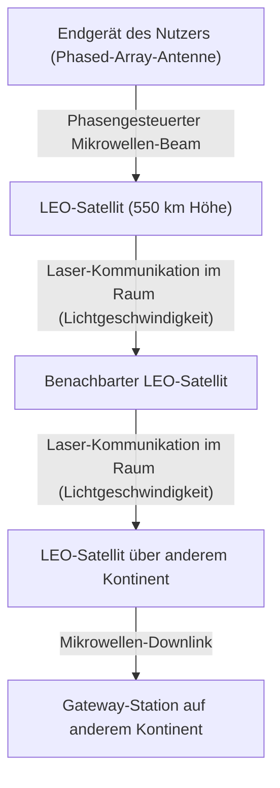

### 8.2.3 Optische Kommunikation im Raum (OISL) und die unangefochtene Vormacht der "Lichtgeschwindigkeit im Vakuum"
Der wahrhaftige Coup des Starlink-Netzwerks wurzelt in der Laserkommunikation zwischen den Satelliten (OISL: Optical Intersatellite Links).
Die gegenwärtige Langstreckenkommunikation hängt am Tropf der Glasfaserkabel; allerdings beträgt der Brechungsindex des Glasfaserkerns (aus Quarzglas) ca. 1,47. In der Physik wird die Geschwindigkeit des Lichts im Medium als $v = c / n$ ausgedrückt (wobei $c$ die Lichtgeschwindigkeit im Vakuum und $n$ der Brechungsindex ist). Ergo wird die Lichtgeschwindigkeit im Inneren der Glasfaser auf rund 200.000 km/s gedrosselt.

Im krassen Gegensatz dazu geht der Brechungsindex im Weltraum (Vakuum) gnadenlos gegen 1, weshalb die Laserkommunikation zwischen den Satelliten mit der absoluten Lichtgeschwindigkeit im Vakuum von $c \approx 300.000$ km/s betrieben wird.
Projiziert man dies auf den Datentransfer von London nach New York: Anstatt den Weg über transatlantische Unterseekabel zu wählen, lassen sich Daten ins Weltall katapultieren, als Laserstrahl durch das Vakuum des Kosmos peitschen und wieder zur Erde hinabschießen – eine Route, die das theoretische absolute Delay (die Latenz) weit gravierender dezimiert. Für den Hochfrequenzhandel (HFT) der Finanzmärkte oder weltumspannende Echtzeitsysteme löst dies einen epochalen Paradigmenwechsel aus. Das Zukunftsszenario zeichnet Zehntausende von Satelliten, die die Erdkugel einkreisen und ein gigantisches Geflecht (Mesh-Netzwerk) spannen, in dem dynamische, dreidimensionale interstellare Routing-Protokolle – als Nachfolger des BGP (Border Gateway Protocol) – ihr Werk vollbringen.

---

## 8.3 Das Quanteninternet: Die ultimative Kommunikation, getragen von Verschränkung

Wenn das Web3 die Architektur des "Vertrauens" neu modelliert und Satellitennetzwerke den Panzer von "Raum und Geschwindigkeit" durchschlagen, dann ist das "Quanteninternet" der schiere physikalische Zenit im Bereich der "Security und der Übertragungsmedien" für Informationen. Das Quanteninternet ist nicht dazu auserkoren, klassische TCP/IP-Netzwerke in Rente zu schicken; vielmehr ist es eine Infrastruktur der nächsten Generation, die erstere komplementiert und Informationsübertragungskanäle bereitstellt, die auf vollkommen neuartigen Gesetzen der Physik basieren.

### 8.3.1 Fundamente der Quantenmechanik: Superposition und Verschränkung
Die Architekturen der klassischen Computerei und des Internets dekodieren Spannungsspitzen als stumpfe "0" oder "1" Bits. Im Kosmos des Quanteninternets jedoch werden Informationen als Qubits (Quantenbits) verschickt. Indem man den Polarisationszustand (horizontale oder vertikale Schwingung etc.) von Photonen instrumentalisiert, wird das "Superpositionsprinzip (Überlagerung)" bedient, durch welches "0" und "1" zeitgleich und parallel existieren.

Noch weitaus monumentaler ist die "Quantenverschränkung (Quantum Entanglement)". Sind zwei Partikel ineinander verschränkt (im Entanglement-Zustand), so ist es völlig belanglos, wie absurd weit sie physisch voneinander getrennt sind (selbst wenn sie sich auf der Erde und auf dem Mars befinden): In dem Wimpernschlag, in dem der Zustand des einen Partikels durch Messung finalisiert wird, determiniert sich der Zustand des anderen – gänzlich ohne jeden Time Lag – im selben Sekundenbruchteil. Dieses nichtlokale physikalische Phänomen, das Einstein verächtlich als "spukhafte Fernwirkung" abtat, bildet das eiserne Rückgrat des Quanteninternets.

### 8.3.2 Quantenschlüsselverteilung (QKD) und physikalisch absolute Sicherheit
Aktuell wird die Internetkommunikation durch die RSA- und Elliptische-Kurven-Kryptographie geschützt, die am Tropf der mathematischen Unüberwindbarkeit hängt, "dass die Primfaktorzerlegung astronomisch gigantischer Ganzzahlen unendlich viel Berechnungszeit verschlingt". Tritt indes ein massiver Quantencomputer auf den Plan, der den Shor-Algorithmus schultern kann, werden ebendiese Verschlüsselungen im Handumdrehen pulverisiert.

Hier richtet sich die Hoffnung auf die Quantenschlüsselverteilung (QKD: Quantum Key Distribution). Im paradigmatischen BB84-Protokoll werden einzelne Photonen verschickt, um kryptografische Schlüssel zu übertragen. Kraft des Urprinzips der Quantenmechanik – "Heisenbergs Unschärferelation" – transformiert sich der Quantenzustand (Dekohärenz) im Millisekundenbruchteil, sobald ein Dritter (Lauscher) auch nur versucht, ein fliegendes Photon zu messen (abzuhören). Obendrein dekretiert das "No-Cloning-Theorem (Quanten-No-Cloning-Theorem)", dass das akkurate Klonen eines völlig unbekannten Quantenzustands ein physikalisches Ding der Unmöglichkeit ist.
Kurzum: Läuft auf der Kommunikationsbahn ein Sniffing-Angriff, so wird der Empfänger diesen – codiert als widernatürliches Ausbrechen der Fehlerrate – mit der absoluten Gewissheit physikalischer Gesetze unweigerlich registrieren. Durch die Teilung bombensicherer Zufallszahlen, deren Unversehrtheit durch absolute Lauscherfreiheit garantiert ist, und gepaart mit der One-Time-Pad-Verschlüsselung, wird ein Security-Niveau der Superlative manifestiert; ein Level, das von absolut keinem Rechner mit noch so absurder Rechenleistung (nicht einmal von einem Supercomputer kosmischen Ausmaßes) jemals entschlüsselt werden kann.

### 8.3.3 Die Mauer von Quantenteleportation und Quanten-Repeatern
Die finale Utopie des Quanteninternets ist die Vernetzung der "Quantenteleportation", bei der – auf dem Rücken des Entanglements – der Quantenzustand als solcher an eine völlig andere Lokalität transferiert wird. Auf diese Weise lassen sich dezentrale Quantencomputer untereinander zusammenschweißen, um sie als einen einzigen, titanischen Quantenrechner (eine "Quanten-Cloud") agieren zu lassen.

Nichtsdestotrotz türmen sich technologische Barrieren von brutalem Ausmaß auf. Photonen werden, während sie durch die Glasfaser rasen, entweder absorbiert oder zerstreut (Dämpfung) und verschwinden schlichtweg. In der Sphäre klassischer Telekommunikation pflanzt man mittendrin "Verstärker (Amplifier)" ein, um Signale aufzupumpen. Bei der Quantenkommunikation jedoch grätscht das erwähnte "No-Cloning-Theorem" dazwischen, wodurch das Kopieren und Verstärken von Photonen strikt untersagt ist.

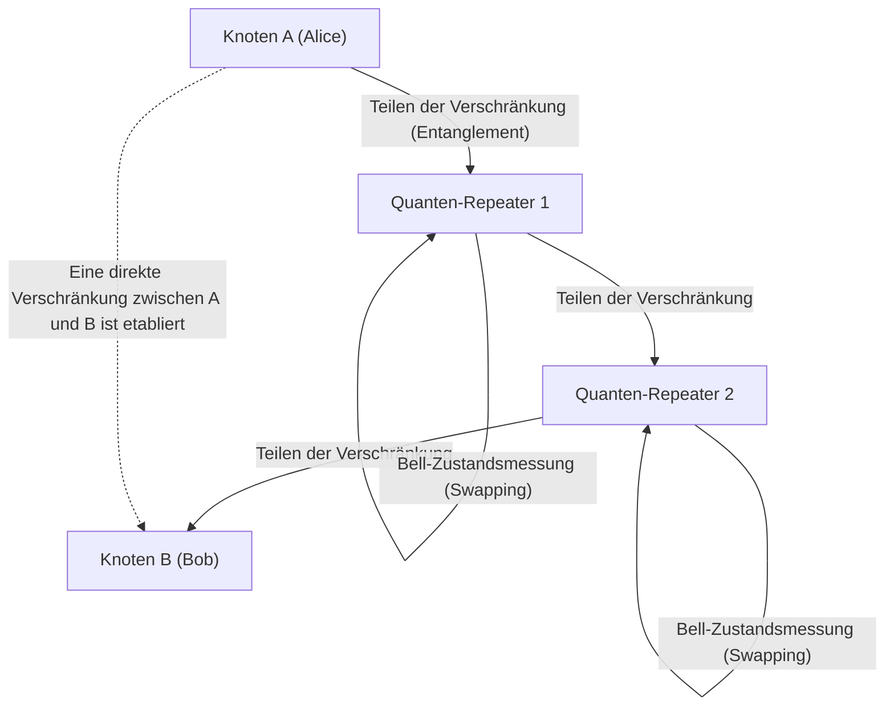

Die Brechstange, an der derzeit getüftelt wird, um diesen Flaschenhals zu zerschmettern, ist der "Quanten-Repeater (Quantum Repeater)". Der Quanten-Repeater fabriziert Verschränkung bloß über winzige Abschnitte hinweg; indem er fortlaufend hochkomplexe Quanten-Operationen namens "Entanglement-Swapping (Verschränkungstausch)" feuert, zementiert er ein Entanglement über kolossale Distanzen. Für die Ausführung dieses Manövers ist ein "Quantenspeicher (Quantum Memory)" – der den Quantenzustand unter kryogenen Tieftemperatur-Bedingungen auf Zeit einkerkert – unabdingbar. Labore auf dem gesamten Globus liefern sich in der Gegenwart ein Wettrennen um bahnbrechende physikalische Durchbrüche unter Einbezug von NV-Zentren (Stickstoff-Fehlstellen-Zentren) in Diamanten oder ultrakalten atomaren Gasen.

---

## 8.4 Schlusswort: Die Menschheit und die Zukunft der Netzwerke

Das Internet, dessen erster Schrei in den 1960ern ertönte, ist mittlerweile zu einem kolossalen Nervengewebe herangewachsen, das ausnahmslos alle Daten des Erdballs aneinanderkettet. Und nun blicken wir in den Abgrund von Kapitel 8: "Das Internet der Zukunft" ist nicht lediglich auf die Software-Schicht beschränkt, sondern eine Expansion in weitaus elementarere und hochgradig physikalische Dimensionen.

Die dezentralisierte Architektur des Web3 baut ein neuartiges Vertrauensfundament (Trust Layer) auf, in welchem gesellschaftliche Transaktionen – frei von der Hörigkeit und dem "blinden Vertrauen" gegenüber spezifischen, zentralen Instanzen – allein von Mathematik und Kryptografie gebürgt werden.
Satellitennetzwerke, allen voran Starlink, entfliehen dem Gravitationsschacht der Erde und ringen mit der ultimativen Maximalgeschwindigkeit der Physik – der Lichtgeschwindigkeit im Vakuum. Durch diesen Kraftakt malen sie die Konturen eines dreidimensionalen Backbones, das die Schranken von Distanzen ad absurdum führt.
Parallel dazu sublimiert das Quanteninternet das bodenlose Mysterium der Quantenmechanik – die Verschränkung – in pure Ingenieurskunst, im Bestreben, die gängigen Paradigmen von Informationsübertragung und Sicherheit bis auf die Grundfesten einzureißen.

Für den Moment drängt sich das Bild auf, diese Technologien würden autark vor sich hin evolvieren; im Langzeithorizont werden sie jedoch ineinander verschmelzen. Schießt man ein einzelnes Photon (Quant) huckepack auf Laserstrahlen durch das All, erwacht ein kosmisches, von dämpfungsarmen Sphären profitierendes Quanten-Kryptografie-Netzwerk zum Leben; darauf aufgesetzt wüten die dezentralisierten Protokolle des Web3. Eine solch abgedrehte Sci-Fi-Netzwerkinfrastruktur wird genau jetzt, in diesem Augenblick, von den Händen der Menschheit aus der Taufe gehoben.

Das Internet des morgigen Tages verliert den Status eines profanen "Rohres für den Datentransfer". Es wird sich zum ultimativen Konstrukt einer "intellektuellen Infrastruktur" erheben, die wirtschaftliche Aktionen der Spezies Mensch, gesellschaftliche Konsensfindungen und Rechenressourcen im planetaren bis hin zum kosmischen Maßstab synchronisiert. Versteckt hinter der Kulisse des Internets, durch das wir tagtäglich arglos navigieren, webt sich genau in dieser Sekunde ein episches Epos weiter, das die Limits von Physik und Computer Science unbarmherzig herausfordert.

