---
title: "互联网的运作机制：从海底电缆到Web3，连接世界的巨大网络全貌"
description: "人类史上最大的基础设施是如何运作的。从历史、协议、物理层到未来通信的彻底解剖。"
categories: ["technology", "network"]
tags: ["tech", "internet", "network", "infrastructure"]
slug: "how-the-internet-works-comprehensive-guide"
date: "2026-10-02T11:46:18+09:00"
image: "eyecatch.jpg"
---

# 第1章 互联网的黎明与哲学 —— 从ARPANET到WWW的技术系谱

互联网——今日已成为人类所有经济活动、文化以及交流基础的这一巨大的自治分布式网络，绝不是由单个天才在一夜之间设计出来的。它以冷战这一特异的历史与地缘政治背景为起点，经历了通信工程和计算机科学的范式转变，是无数研究人员共同秉持的“如何突破一切物理限制，坚固且自由地传递信息”这一崇高哲学的结晶。

本章将不仅是历史的罗列，而是从物理层到应用层的技术机制及其设计思想（架构）等专业视角，极度深入地剖析并解说互联网这一奇迹般的系统是如何诞生的。

## 1.1 网络范式的转变：电路交换的局限与分组交换的诞生

在理解互联网的历史和技术本质时，所有的出发点都在于“分组交换（Packet Switching）”这一概念的发明。20世纪60年代初，当时通信基础设施的核心是以电话网为代表的“电路交换（Circuit Switching）”方式。

### 电路交换的物理机制与脆弱性
电路交换方式是指在进行通信的两点之间，使用纵横制交换机或电子交换机进行物理连接，或者利用频分复用（FDM）等技术进行逻辑连接，从通信开始到结束确保并独占一条“专用通信路径（电路）”的方式。这种方式只要确保了电路，就能保证带宽和延迟，因此极度适合需要实时性的语音通信（电话）。

然而，这种架构存在致命的缺陷。那就是“单点故障（Single Point of Failure）”的存在，以及对物理破坏极度的脆弱性。在冷战背景下，美国国防部深切担忧来自苏联的核打击（特别是伴随高空核爆的电磁脉冲：EMP攻击）。如果中央集权型的通信节点（巨大的交换局）遭到物理破坏，或者通信路径的一部分被切断，电路交换方式无法立即重建迂回路径，国家的指挥控制系统（C2: Command and Control）将彻底瘫痪。

### 分组交换这一突破
为了打破这种令人绝望的物理限制，有三位先驱几乎在同一时期、完全独立地构建了理论基础。他们是兰德公司的保罗·巴兰（Paul Baran）、英国国家物理实验室（NPL）的唐纳德·戴维斯（Donald Davies），以及麻省理工学院（MIT）的伦纳德·克莱因罗克（Leonard Kleinrock）。

以克劳德·香农（Claude Shannon）的信息论为背景，他们提倡了一种革命性的方法：不把通信视为连续的模拟“波”或不间断的数据“流”，而是将数据分割成固定长度（或可变长度）的微小数字数据块——即“分组（Packet）”或者用巴兰的话说，叫“标准化的消息块”。

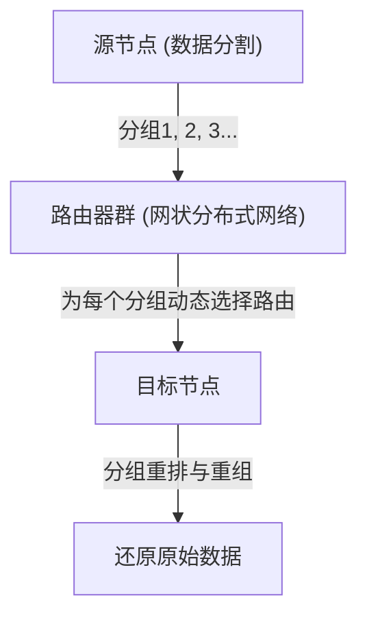

分组交换方式的技术创新性主要集中在以下两点：

1. **实现统计复用（Statistical Multiplexing）:**
   不再像电路交换那样让特定通信独占物理线路，而是让多个无关通信的分组通过时分方式共享同一条物理线路。由于计算机间的数据通信具有很高的“突发性（Burstiness：短暂产生大量数据流动，随后保持寂静的特性）”，因此通过分组交换来共享带宽，将通信资源的利用效率提升到了数学上的极限。
2. **存储转发（Store and Forward）与动态路由选择:**
   构成网络的各中继节点（路由器）会将接收到的分组暂时存储在内存的队列中，并将分组头部记载的目标地址与节点自身拥有的路由表（Routing Table）进行比对。然后，计算当时网络的拥塞状态或物理线路的切断情况，为每一个分组将其转发给最佳的相邻节点。

克莱因罗克运用排队论（Queuing Theory），确立了这一存储转发方式下分组延迟和缓冲区大小的数学模型。即使网络的一部分在核打击中蒸发，幸存的节点也能自主判断情况，分组能找出迂回路径（网状网络上的其他路径）并到达目标。这种“自治分布式、自我修复型”的架构，正是互联网韧性（Resilience）的根源。

## 1.2 ARPANET的构建：IMP实现的硬件与协议分离

将理论上存在的分组交换网络在物理世界中实现的，是1969年由美国国防部高级研究计划局（ARPA）提供资金启动的项目“ARPANET”。

当时的计算机环境比现代要混乱得多。IBM、DEC、SDS等各家公司自主开发的大型机（Mainframe），在字符编码（ASCII与EBCDIC）、字长（16位、32位、36位等）以及操作系统上完全不同，让它们直接进行通信在技术上极其困难。

因此，ARPANET的设计者们（拉里·罗伯茨等人）在网络架构上做出了一个极其重要的设计决策。那就是引入被称为“IMP（接口消息处理器，Interface Message Processor）”的专用中继小型计算机。

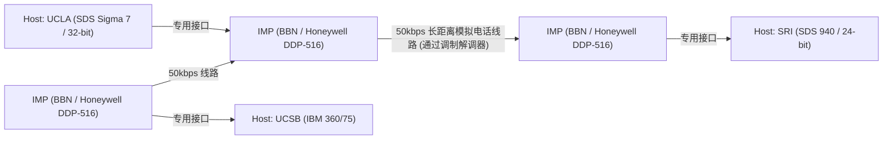

IMP的开发由总部位于波士顿的咨询公司BBN（Bolt Beranek and Newman）中标。他们改造了霍尼韦尔公司坚固的微型计算机“DDP-516”，让路由协议、分组的分割与组装、错误检测（CRC：循环冗余校验）等所有复杂的网络处理都由IMP来承担。

这样一来，各研究机构的巨型主机就无需关心复杂的分组路由或线路的物理特性，只需通过眼前标准化的接口（BBN 1822协议）与IMP进行数据交换即可。这是将系统的“关注点分离（Separation of Concerns）”应用于网络领域的首个伟大成功案例，而IMP也成为了今天路由器（Router）的直接始祖。

1969年10月29日，从UCLA克莱因罗克的实验室向SRI（斯坦福研究院）发送了第一条消息“LO”（因为原本想打出“LOGIN”，但系统崩溃了）。这就是ARPANET诞生的历史性瞬间。之后，早期的路由算法（基于贝尔曼-福特算法的距离矢量路由）得以实现，ARPANET作为连接全美研究机构的基础设施开始迅速发展。

## 1.3 TCP/IP的设计思想：端到端原则与封装的深渊

ARPANET作为单一网络取得了巨大成功，但不久后便面临新的壁垒。ARPANET内使用的名为NCP（Network Control Program）的通信协议，其设计前提是运行在ARPANET这个“均质且高可靠性的单一网络”之上。

然而进入20世纪70年代后，使用人造卫星的分组通信网（SATNET）、夏威夷大学开发的无线分组通信网（源自ALOHANET的PRNET）等，在物理介质、最大传输单元（MTU: Maximum Transmission Unit）、传输速度和错误率上完全不同的多种多样的网络开始出现。当试图将它们互联，构建一个全球规模的“网络之网络（Internetwork）”时，NCP的设计显然会走向崩溃。

解决这一异构网络互联巨大难题的，是温顿·瑟夫（Vinton Cerf）和罗伯特·卡恩（Bob Kahn）于1974年发表的划时代论文《A Protocol for Packet Network Intercommunication》。他们设计的协议，正是现代互联网的基础——“TCP/IP（传输控制协议 / 网际协议）”。

### 架构的灵魂：端到端原则 (End-to-End Argument)
在TCP/IP设计的底层，流淌着网络工程中最重要的哲学——“端到端原则（End-to-End Principle / Argument）”。这一原则在20世纪80年代由J. H. Saltzer、D. P. Reed、D. D. Clark等人明确成文，其主张如下：

“确保数据传输可靠性、顺序控制、加密等高级且特定于应用的功能，应当在进行通信的两端主机（End-to-End）上实现，而不应在网络的核心（中继基础设施或路由器）中实现。”

如果在网络的核心层（IMP或路由器）中维持分组的到达确认（ACK）或重传控制等复杂的“状态（State）”，将会怎样？一旦中继路由器发生故障，该状态就会丢失，通信将被切断。此外，每当出现具有新要求的应用程序时，就必须重写全世界中继路由器的软件。

TCP/IP极其忠实地将这一原则具体化。负责中继的IP（Internet Protocol）路由器专注于极其简单的功能（无状态的数据报转发），即“仅仅将收到的分组以尽力而为（Best Effort）的方式转发给目的地”。IP完全不关心分组的丢失或顺序错乱。它彻底充当了一个纯粹的“傻瓜网络（Dumb Network）”。

取而代之的是，担保通信可靠性的重任，全都被交给了在两端主机计算机上运行的TCP（传输控制协议）。TCP通过查看IP运来的顺序混乱的分组上附带的序列号，重新组装出原始数据，如果发现丢失便自主进行重传请求，如果网络拥塞则调整发送速度（窗口控制与慢启动算法）。

这种“将核心保持在极限简单，让边缘（末端）具备智能”的设计思想，正是互联网之所以能超越电话网，并在随后能够无需改造基础设施就直接消化Web、流媒体视频、P2P通信、智能手机等甚至连设计者都未曾预料到的爆发式创新的最大原因。

### 封装（Encapsulation）与分层模型
TCP/IP为了实现这种逻辑上的角色分担，使用了将数据进行“封装（Encapsulation）”的方法。这是一种机制：对于要发送的数据，各个层级像俄罗斯套娃一样，一层层地套上自身的控制信息（头部）。

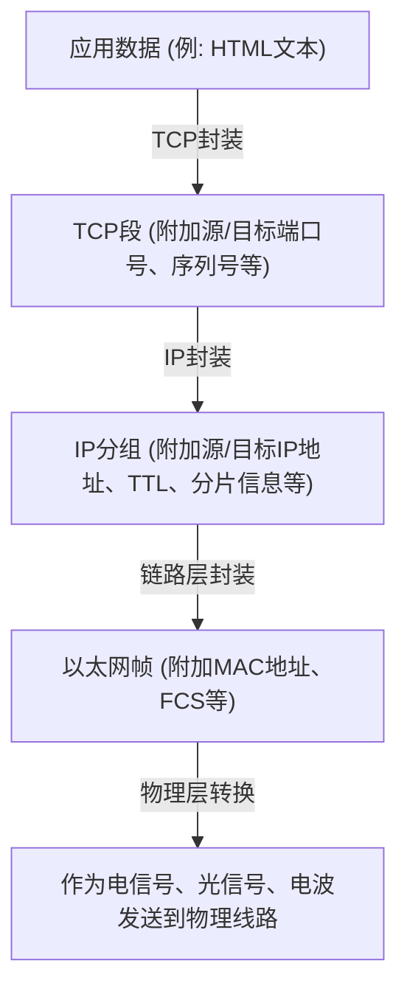

路由器只看IP分组的头部（IP地址）来决定转发目的地，对其中的内容（TCP头部或数据）完全不加干涉。由此，IP成功地完全隐藏并吸收了底层物理层（光纤、铜线、Wi-Fi、5G）物理特性的差异，向更高层提供了一个“全球规模的单一虚拟网络”。

1983年1月1日，ARPANET上的所有主机一齐从NCP切换到TCP/IP的“转换日（Flag Day）”被实施，在此，真正意义上的“The Internet（互联网）”诞生了。

## 1.4 NSFNET的崛起与自治分布式路由的演进

在过渡到TCP/IP后，互联网跨越了军事与国防的框架，转变成学术研究的巨大基础设施。其决定性的推动力是美国国家科学基金会（NSF）在20世纪80年代后期构建的“NSFNET”。

NSFNET最初是作为连接全美五个超级计算中心的骨干网而构建的，物理层经历了从初期的56kbps，到后来的T1线路（1.544Mbps），再到T3线路（45Mbps）的戏剧性反复升级。各大学及地区网络（Regional Network）开始层级化地连接到这个NSFNET骨干网上。

在网络规模爆炸性扩展（Scaling）的过程中，浮现出新的技术课题。那就是“路由的局限”。让所有中继路由器共享多达数万个节点的路由信息，会超出内存容量和计算能力的物理极限。

为了解决这个问题，互联网引入了“自治系统（AS: Autonomous System）”的概念。互联网不再被视为单一的巨大网络，而是被重新定义为具有独立管理策略的网络（AS）的集合体。

在AS内部（IGP: Interior Gateway Protocol），采用如OSPF（开放式最短路径优先）等链路状态型路由协议，通过迪杰斯特拉算法（Dijkstra's algorithm）构建出网络的完整拓扑图，并高速计算最短路径。

另一方面，在AS与AS之间（EGP: Exterior Gateway Protocol），不能仅仅是寻找最短路径，而是必须反映“允许经由哪个网络进行通信”的商业和组织策略。为了实现这一点而开发出来的，正是至今仍支撑着互联网根基的“BGP（边界网关协议）”。BGP采用路径矢量（Path Vector）型算法，在彻底防止路由环路的同时，实现了全球ISP（互联网服务提供商）之间的路由信息交换。

由于NSFNET的构建和BGP的确立，即使不存在中央管理者，各组织通过不断相互连接（对等互联和转接），也能作为一个整体网络自主地发挥作用，这标志着现代商业互联网生态系统的完成。1995年，NSFNET结束了其使命，骨干网的运营完全移交给了民间ISP群体。

## 1.5 WWW的诞生：超文本带来的知识解放与公有领域化

到了20世纪80年代末，从物理层到网络层、传输层的基础设施已在全球范围内部署完毕，互联网上积累的信息量急剧增加。然而，当时的互联网上充斥着FTP（文件传输）、Telnet（远程登录）、USENET（电子公告板）等各自独立的应用程序，信息被孤立地深埋在各台服务器的目录深处（形成信息孤岛）。要找出目标数据，不可或缺的是目标服务器的IP地址或复杂的UNIX命令知识，处于极不民主的状态。

从根本上颠覆这种状况，引发信息共享范式转变的，是位于瑞士日内瓦的欧洲核子研究中心（CERN）的计算机科学家蒂姆·伯纳斯-李（Tim Berners-Lee）。1989年，他提出了一项名为“万维网（World Wide Web，WWW）”的革新性系统。

他构想的核心，是将20世纪60年代起就存在的“超文本（Hypertext：在文档内的单词和另一文档之间建立链接的概念）”与“互联网（TCP/IP）”结合起来。他将原本封闭在本地计算机内的超文本链接目标，扩展到了地球另一端服务器上的文档。

为了构建这个巨大的信息空间，伯纳斯-李独自设计并实现了三项极其精炼的技术规范。

1. **URI (统一资源标识符):**
   用于唯一指定网络上存在的任何资源（文本、图像、视频等）所在位置的普遍地址体系。
2. **HTTP (超文本传输协议):**
   用于在客户端（Web浏览器）和服务器之间请求与传输URI指定资源的应用层协议。HTTP最出色的一点是，它采用了不保持通信“状态（State）”的“无状态（Stateless）”设计。借此，服务器能够高效处理来自数百万个客户端的请求。
3. **HTML (超文本标记语言):**
   用于描述文档逻辑结构，并嵌入指向其他资源超链接（锚标签 `<a>`）的标记语言。

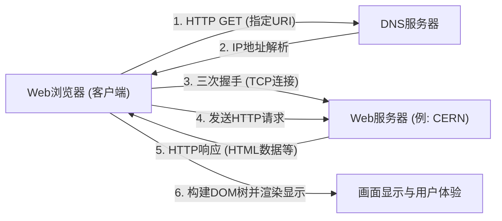

1990年底，世界上首台Web服务器（info.cern.ch）和浏览器在NeXT计算机上开始运行。早期的Web是基于文本的，但其通过直观链接进行信息检索的体验，在研究人员中瞬间普及开来。

### 公有领域这一人类历史性决断
然而，WWW真正改变世界并作为现代社会基础设施扎根下来的最大原因，并不只是其卓越的技术架构。划分历史的决定性事件发生于1993年4月30日。

CERN接受了蒂姆·伯纳斯-李的强烈要求，做出了一个惊人的决断：将WWW的全部基础技术（服务器软件、客户端、代码库）作为“公有领域（放弃知识产权）”免费开放。在一份不主张任何专利权、也不索取使用费的声明文件中，签有CERN主任的名字。

如果当时CERN将WWW的技术申请专利，并试图通过软件许可来获利，结果会怎样呢？毫无疑问，今天的信息大爆炸便不会发生。WWW将仅仅停留在少数拥有资金实力的企业和大学中，成为一个封闭系统，而且互联网也必定会在与后来出现的Gopher等竞争协议的规格争夺中被分裂。

由于走向公有领域，技术和法律障碍完全消失，全世界的黑客和企业纷纷加入了WWW生态系统。美国国家超级计算应用中心（NCSA）的马克·安德森（Marc Andreessen）等人开发并免费公开了能够内联显示图像的划时代图形浏览器“NCSA Mosaic”，这成为了后来Netscape Navigator甚至IT泡沫的导火索。个人得以自由搭建Web服务器并向世界发布信息，“信息的民主化”得以实现。

## 1.6 结语：思想超越实现

在第1章中所看到的互联网历史，绝非仅仅是一部通信速度的提升史。基于“中央集权式控制是脆弱的”这一物理现实而发明的分组交换，主张“复杂性应由末端来承担”的端到端原则，以及秉持“信息应对全人类免费开放”的WWW公有化。

让互联网呈现出今天这般面貌的，并非卓越的硬件或代码，而是这些强大且一贯的“设计思想（Philosophy）”。通过逻辑上的封装克服物理层的限制，通过开放的标准（RFC: Request for Comments）包容多样性。正是因为有了这种尊崇去中心化与自由的架构，互联网才能实现前所未有的扩展。

然而，在人类能够理解的“名称”与网络处理的“数字（IP地址）”之间，依然存在着巨大的鸿沟。在下一章，我们将剖析“IP地址空间与DNS（域名系统）的深渊”这一技术机制，探究它是如何为这片广阔的自治分布式网络的地址空间带来秩序，并在背后支撑起WWW爆发式普及的这个庞大分布式数据库系统的。

# Chapter 2: Physical Layer and Data Link Layer ~The Physical Reality of Digital Data and Adjacent Communication~

At the foundation of the massive network known as the Internet lies an extraordinary chain of physical phenomena that converts logical digital data of "0"s and "1"s into physical phenomena such as electrical signals, blinking lights, or ripples of electromagnetic waves, transmitting them across space and media to the recipient. When we casually open a website on our smartphones, behind the scenes, photons are racing through glass fibers crawling along the ocean floor, and invisible radio waves are flying through space accompanied by complex calculations.

In this chapter, we will focus on Layer 1 (Physical Layer) and Layer 2 (Data Link Layer) of the OSI reference model, diving to the absolute depths from a professional perspective into the "most physical and gritty" parts of the networks that support our lives, and the intricate logical mechanisms that control them.

---

## 2.1 Physical Layer: The Physical Materialization of Information and the Laws of the Universe

The greatest mission of the physical layer is to convert (modulate) the discrete bit streams (0s and 1s) handled by computers into analog physical signals tailored to the physical characteristics of the transmission medium (copper wire, optical fiber, space such as vacuum or air), and place them onto the transmission path. Here, the laws of electrical engineering, quantum mechanics, and optics determine the limits of communication.

### The Shannon-Hartley Theorem and the Limits of Information
When discussing the physical layer, one cannot avoid the information theory published by Claude Shannon in 1948. The "Shannon-Hartley theorem" mathematically proved the maximum data transfer rate (channel capacity) that can be transmitted without errors over a communication channel where noise exists.

$$ C = B \log_2\left(1 + \frac{S}{N}\right) $$

Here, $C$ is the channel capacity (bps), $B$ is the bandwidth (Hz), and $S/N$ is the signal-to-noise ratio (SNR). This beautiful equation demonstrates that no matter how much technology advances, there is a physical upper limit (the Shannon limit) to the amount of information that can be sent under a given bandwidth and noise environment. Modern optical fiber and Wi-Fi engineers continue an endless battle to raise communication speeds as close to this limit as possible.

### The Physics of Optical Fibers: Transporting by "Confining" Light
The backbone of the modern Internet is undoubtedly the optical fiber. While high-speed, long-distance communication is difficult with copper wire electrical communication due to the skin effect and electromagnetic interference (EMI), optical fibers have overcome these issues.

An optical fiber is composed of two layers of extremely high-purity silica glass: a central "core" and an encircling "cladding." By setting the refractive index of the core slightly higher (less than a few percent) than that of the cladding, light entering at an angle shallower than a certain critical angle repeatedly undergoes total internal reflection at the boundary between the core and the cladding, based on Snell's law. As a result, the light travels through the interior of the fiber without leaking outside.

#### The Battle Against Dispersion and Attenuation: The Glass That Brought a Nobel Prize
In the past, glass contained many impurities, causing light to attenuate within just a few meters. In 1966, Dr. Charles Kao (awarded the Nobel Prize in Physics in 2009) discovered that the cause of attenuation in optical fibers was not the inherent nature of the glass but impurities (especially hydroxyl groups and transition metals), and predicted that long-distance communication would become possible if the purity was increased. The ultra-low loss silica glass developed by Corning in the 1970s achieved an astonishingly low loss of 0.2 dB/km in the 1550 nm wavelength band (C-band). This means that even after traveling 15 km, only half of the light's intensity is lost.

However, when light travels long distances, "Chromatic Dispersion" and "Modal Dispersion" occur, causing the pulse waveform to collapse. Chromatic dispersion occurs because the propagation speed in the glass varies depending on the wavelength (color) of the light. Modal dispersion is a phenomenon where a shift in arrival time occurs because there are multiple paths (modes) for the light passing through the core.
To overcome this, the "Single Mode Fiber (SMF)" was developed, which narrows the core diameter to a few micrometers, close to the wavelength of the light, allowing only a single path to pass through. This became the mainstream for long-distance transmission such as intercontinental communication.

#### EDFA and WDM: The Renaissance of Optical Communication
In the 1990s, two revolutions occurred in optical communication. The first was the Erbium-Doped Fiber Amplifier (EDFA). Until then, slow and costly regenerative repeaters were required, which converted the attenuated optical signal into an electrical signal, amplified it, and then converted it back to light. EDFA enabled direct amplification of light as light by doping the fiber core with the rare-earth element erbium and illuminating it with excitation light from the outside, causing stimulated emission as the signal light passed through.

The second was Wavelength Division Multiplexing (WDM). It is a technology that utilizes the superposition principle—where light of different wavelengths (colors) travels independently without mixing even when emitted into the same space simultaneously—to bundle and send signals of multiple wavelengths simultaneously over a single fiber. Today, using Dense Wavelength Division Multiplexing (DWDM) technology, more than 100 signal waves with wavelengths at intervals of a few millimeters are carried on a single optical fiber, realizing extraordinary bandwidths of tens of Tbps to several Pbps on a single fiber.

### Submarine Cables: The Earth's Neural Network
More than 99% of intercontinental data communication is carried by submarine cables, not artificial satellites. Cloud data and images from overseas websites all physically pass along the bottom of the sea.

#### A History of Failures and Challenges
The history of submarine cables is much older than the Internet. The first major challenge was the transatlantic telegraph cable in 1858. Although the laying of the copper wire, insulated with gutta-percha (a type of natural rubber), was successful, the operation at high voltage, which ignored the warnings of Lord Kelvin (William Thomson), proved fatal, and it went silent after causing dielectric breakdown in just a few weeks. Afterward, theory and materials were improved over a long period of time, and in 1988, the first transpacific optical submarine cable, "TAT-8," went into operation, marking the dawn of the optical era.

#### Cable Structure and the Mechanics of Laying
Modern submarine cables laid in the deep sea at depths of several thousand meters are designed to withstand extreme environments. To protect the bundle of just a few optical fibers at the center, they are shielded by multiple layers, including high-tensile steel wires, copper or aluminum tubes for water pressure resistance, and polyethylene insulation. In the deep sea, they are only a few centimeters in diameter for weight reduction while withstanding shark bites and immense water pressure. However, in shallow waters, they are equipped with thick armor (armoring) to protect against bottom trawls from fishing boats, ship anchors, and submarine earthquakes, making them more than 10 centimeters in diameter.

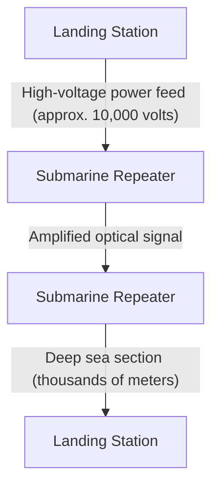

Even when using ultra-low loss fibers, optical signals attenuate every few dozen kilometers, so "submarine repeaters" are inserted at equal intervals along the cable. The power to drive these repeaters (which contain the aforementioned EDFA) in the deep sea is continuously supplied from the landing stations at both ends through the copper tubes within the cable as a high-voltage direct current ranging from several thousand volts to over 10,000 volts.
A specialized "cable-laying ship" is used for laying, and in shallow waters, an underwater robot (ROV) digs a trench in the seabed and buries the cable. If a cable is severed, a repair ship rushes to the site, hooks the end of the cable from the deep sea using a grapnel (an anchor-like claw), pulls it up onto the ship, and skilled technicians splice the optical fibers with an accuracy of a few microns—an extraordinarily analog and gritty operation.

### The Physics of Radio Wave Communication (The Foundation of Wi-Fi)
With the proliferation of mobile devices and IoT, communication via electromagnetic waves (radio waves) flying through space has also become a main battleground for the physical layer. Wi-Fi (the IEEE 802.11 standard family) primarily uses the 2.4 GHz and 5 GHz bands, as well as the recently opened 6 GHz ISM band (Industrial, Scientific, and Medical band, which can be used without a license).

#### Extreme Information Compression via QAM (Quadrature Amplitude Modulation)
In the "modulation" that places digital data onto analog waves, Wi-Fi utilizes extremely advanced technology. This is QAM (Quadrature Amplitude Modulation).
A radio wave has two physical quantities: "amplitude" (wave height) and "phase" (wave timing/angle). QAM synthesizes two carrier waves (the I signal and the Q signal) that differ in phase by 90 degrees and varies their respective amplitudes to assign a bit stream to a specific "point" on a constellation map.

For example, with 16-QAM, 16 points (4 bits) can be expressed with a single wave change (symbol). In the latest Wi-Fi 7 (802.11be), a high-density modulation that could be called sheer madness—4096-QAM—has been adopted. This expresses 4096 points (12 bits) in a single modulation. In a constellation map crowded with 4096 points, the receiving side must accurately determine which "point" was transmitted without it getting buried in minute noise. To achieve this, advanced error-correcting codes and powerful signal processing processors are used.

#### OFDM and MIMO: The Battle Against Multipath and the Utilization of Space
Radio waves do not merely travel in a straight line; they reflect off walls and furniture, diffract, and scatter. Because of this, radio waves emitted from a transmitter travel along different paths (multipath) and arrive at the receiver at slightly shifted timings, causing interference (fading) and destroying the waveform.
Technologies that turn this to an advantage or overcome it are OFDM and MIMO.

**OFDM (Orthogonal Frequency-Division Multiplexing)** is a technology that, instead of using a wideband, highly resilient single signal, finely divides the bandwidth into many very narrow frequencies (subcarriers) and transmits data in parallel at a slow speed over each. Because the subcarriers are arranged to be "orthogonal" (mathematically not interfering with each other), the frequency utilization efficiency is extremely high, and it is highly resistant to delay shifts caused by multipath.

**MIMO (Multiple-Input and Multiple-Output)** is a "spatial multiplexing" technology that uses multiple antennas to transmit different data simultaneously on the same frequency. By utilizing the property that waves mix differently at different locations in space due to multipath reflections, the complex signals received by multiple antennas on the receiving side are separated as if solving simultaneous equations, thereby multiplying the communication capacity by the number of antennas. Furthermore, **beamforming**, which fine-tunes the phase of the radio waves for each antenna to concentrate the beam of radio waves in a specific direction, has also become an indispensable technology for modern Wi-Fi.

---

## 2.2 Data Link Layer: Dialogue and Order Between Directly Connected Devices

If the physical layer is merely a "signal carrier," the data link layer is the layer that groups those raw bit streams into meaningful chunks called "frames," and is responsible for the rules and traffic control to ensure they are delivered securely to the correct destination within the same network (link).

### The History of Ethernet: Inspiration from ALOHA
Today, the global de facto standard for wired LAN is Ethernet (IEEE 802.3).
Its roots trace back to "ALOHAnet," a wireless communication network created at the University of Hawaii. ALOHAnet adopted a highly chaotic and ambitious protocol: "If you have data to send, just send it. If it collides and gets destroyed, wait a random amount of time and retransmit."

In 1973, Bob Metcalfe at Xerox's Palo Alto Research Center (PARC) applied the ideas of ALOHAnet to communication over coaxial cables and invented Ethernet. Early Ethernet used a "bus-type" topology, where numerous computers shared a single thick coaxial cable (yellow cable) by piercing it with needles called vampire taps.

#### CSMA/CD: An Orderly Anarchy
Because everyone shares the medium (cable), if multiple devices transmit electrical signals simultaneously, the waveforms overlap and a "collision" occurs, destroying the data. The autonomous decentralized algorithm designed to avoid and resolve this is "CSMA/CD (Carrier Sense Multiple Access with Collision Detection)."

1. **Carrier Sense**: Before transmitting, measure the voltage on the cable and listen carefully to check if anyone else is communicating.
2. **Multiple Access**: If no one is communicating, anyone may freely transmit without waiting for centralized permission.
3. **Collision Detection**: Monitor the cable voltage even while transmitting; if an abnormal voltage spike different from your own transmitted signal is detected, judge it as a "collision." Immediately send a jam signal to notify everyone else of the collision and stop transmitting.
4. **Backoff**: After a collision, each node waits for a random amount of time (a time calculated by an exponential backoff algorithm) before attempting to retransmit.

This simple mechanism, which does not require a central administrator and operates on the premise that "rule violations (collisions) will occur, and when they do, wait randomly," is the biggest reason Ethernet defeated complex and expensive protocols like IBM's Token Ring and ATM to seize hegemony.

### MAC Address: The Absolute Identification of Hardware
For destination addressing at the data link layer, a MAC address (Media Access Control address) is used. If an IP address is a "temporary residence," then a MAC address is an "innate identification number."

A MAC address has a length of 48 bits (6 bytes) and is written by separating two-digit hexadecimal numbers with colons, like "00:1A:2B:3C:4D:5E".
- **First 24 bits (OUI: Organizationally Unique Identifier)**: A company code managed and assigned by the IEEE that uniquely identifies the vendor of the network equipment (such as Apple, Cisco, Intel, etc.).
- **Last 24 bits (UAA: Universally Administered Address)**: A serial number assigned sequentially by the vendor to their own products.

In principle, the Network Interface Card (NIC) of every piece of network equipment around the world has a globally unique MAC address burned into its ROM.

### Frame Structure: The Packing Technology of Communication
At the data link layer, headers and trailers are appended to the front and back of the data (such as IP packets) passed down from the network layer, encapsulating it into a unit called a "frame." The structure of the Ethernet (Ethernet II) frame is refined to the point of being artistic.

1. **Preamble**: A 7-byte sequence of "10101010". A warm-up exercise for clock synchronization (timing alignment) of the receiving NIC.
2. **SFD (Start Frame Delimiter)**: 1 byte of "10101011". By ending the preamble with "11", it announces to the receiving side, "Here begins the actual data."
3. **Destination MAC Address / Source MAC Address**: 6 bytes each. Who the communication is from and to. If the destination is "FF:FF:FF:FF:FF:FF", it becomes a broadcast frame that reaches everyone.
4. **EtherType (Type)**: 2 bytes. Indicates what data is in the payload (0x0800 for IPv4, 0x86DD for IPv6, 0x0806 for ARP).
5. **Payload (Data/Payload)**: The actual data received from the upper layer. The size ranges from 46 bytes to a maximum of 1500 bytes (MTU: Maximum Transmission Unit).
6. **FCS (Frame Check Sequence)**: A 4-byte trailer. A hash value calculated from the entire frame (from Destination MAC to Payload) using a polynomial called CRC-32 (Cyclic Redundancy Check).

The receiving NIC calculates the CRC at high speed at the hardware level while receiving the frame. If the FCS attached to the end differs from its own calculation result by even a single bit, it assumes the data was corrupted by noise or a collision during transmission and **mercilessly discards the frame without any notification**. The data link layer unfailingly performs up to "detecting and discarding errors," but it does not have the function to request, "It was broken, so please resend it." This division of roles, entrusting the heavy responsibility of retransmission control to upper-layer protocols like TCP, supports the scalability of the Internet.

### The Birth of the Switching Hub and the Evolution to Full-Duplex Communication
While shared bus Ethernet using CSMA/CD was a fantastic mechanism, it had a fatal flaw: as the number of devices (hosts) connected to the network increased, collisions occurred frequently, causing effective throughput to plummet dramatically.
What fundamentally solved this was the "Layer 2 switch (switching hub)" that became widespread in the 1990s.

Whereas a hub (repeater hub) is a physical layer device that unconditionally broadcasts received electrical signals to all ports, a switch possesses a smart brain that understands the data link layer.
The switch has a "MAC address table" using internal memory (CAM table). It learns the source MAC addresses of the devices connected to each port and automatically builds a correlation table between ports and MAC addresses.
Then, when a frame arrives, the switch cross-references the destination MAC address with the table and forwards the frame "only" to the port where the applicable device is connected.

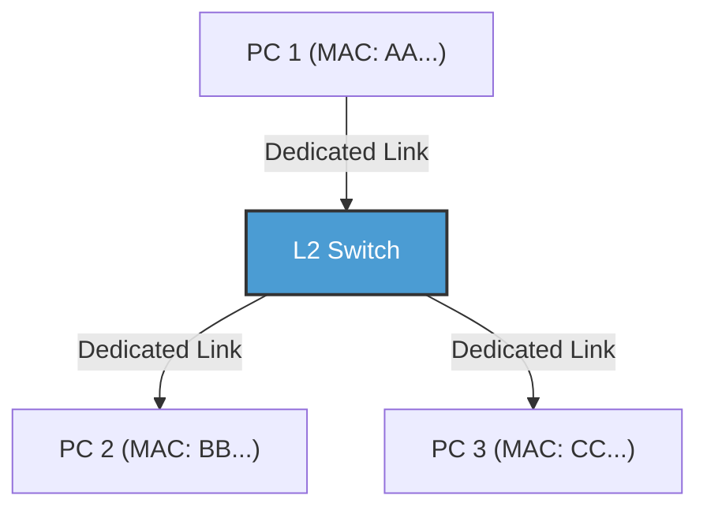

With the introduction of switches, the wiring between each node and the switch became logically and physically independent (star topology). As a result, because the communication paths were separated, collisions no longer occurred in principle. Consequently, it became possible to use "Full-Duplex" communication, using transmitting and receiving lines simultaneously.
In modern Ethernet, the CSMA/CD algorithm is no longer used, having evolved into pure point-to-point full-duplex communication. Furthermore, VLAN (Virtual LAN) technology based on IEEE 802.1Q has enabled the flexible division and integration of logical networks without being bound by physical wiring, continuing to reign as the absolute foundational technology supporting the infrastructure of enterprises and massive data centers.

### The Data Link Layer of Wi-Fi: Traffic Control in the Invisible Radio Wave Space
While wired Ethernet evolved into collision-free full-duplex communication, wireless Wi-Fi faces the difficult challenge of "everyone sharing a single medium in the same space (air)," just like the shared bus Ethernet of the past.

In wireless communication, because one's own transmitted radio waves are too strong, it is physically impossible to simultaneously receive another's weak radio waves and "detect" a collision (CD). Furthermore, there is a risk unique to wireless called the "Hidden Node Problem"—for example, terminals A and C on opposite sides of an access point cannot reach each other's radio waves, but if they transmit simultaneously, their radio waves will collide at the access point.

Therefore, the data link layer protocol (MAC layer) of Wi-Fi adopts "CSMA/CA (Carrier Sense Multiple Access with Collision Avoidance)."
In CSMA/CA, before transmitting, it eavesdrops on the radio wave conditions in the space for a fixed time (DIFS) and then waits for a random backoff time before initiating transmission. The most important difference is the mechanism of **ACK (Acknowledge)**, which did not exist in wired networks. In Wi-Fi, the receiving side immediately sends back an ACK frame (after an extremely short waiting time called SIFS) to indicate that it has successfully received the data. The transmitting side judges that the communication was successful only after receiving this ACK. If the ACK is not returned, it assumes the data was corrupted by a collision or interference, doubles the backoff time, and attempts to retransmit.

Furthermore, to solve the hidden node problem, there is also a mechanism called the "RTS/CTS handshake." Before sending large data, the transmitting side sends a short control frame called RTS (Request to Send), and the receiving side (such as an access point) returns a CTS (Clear to Send). This CTS includes reservation time (NAV: Network Allocation Vector) information saying, "I will be communicating for XX microseconds from now, so surrounding terminals please stay quiet," and surrounding terminals that receive this refrain from communicating. In this way, the Wi-Fi data link layer performs masterful traffic control in the invisible radio wave space.

---

## Conclusion

A world of physical phenomena where photons race through glass, withstand the water pressure of the deep sea, and fly through space while changing phase and amplitude. And, by laying down synchronization via preambles, individual identification via MAC addresses, strict error detection via CRC, and refined traffic control via switching and CSMA/CA on top of those noisy and uncertain physical phenomena, it finally becomes possible to "deliver a meaningful chunk of data (frame) without errors to an adjacent device." This is the miracle achieved by Layer 1 and Layer 2.

However, this alone cannot form the Internet that connects the world. This is because communication by MAC addresses is only valid within the narrow village of the "same network (broadcast domain)" connected to the same switch or access point, or until it is blocked by a router.

In the next chapter, "Chapter 3: The Network Layer and IP," we will approach the essence of IP (Internet Protocol) and routing—the grand mechanism of path discovery designed to connect these countless local villages together and deliver packets like a bucket brigade to unknown networks on the opposite side of the Earth.

# 第4章：传输层的确定性与速度 —— 支撑信息传递的终极困境

## 1. 导论：端到端原则与传输层的使命

我们在前面的章节中看到的网络层（IP）的主要任务，是跨越广阔的互联网这一网络海洋，将数据包物理且逻辑地送达到“目标计算机（主机的网络接口）”。但是，数据包仅仅到达目标主机，通信并没有结束。现代计算机系统在OS（操作系统）上通过多任务同时并行执行着大量的应用程序进程（Web浏览器、邮件客户端、视频流应用、后台同步进程、API服务等）。

从IP层无序且不断涌现的数据包山中，识别出哪个数据包属于哪个应用程序，将其重构为有意义的数据流，并在有缺失时进行填补。在端点全权负责这种最终数据管理的，正是“传输层（Transport Layer）”。

互联网设计思想的根基中，存在着一个非常优美且强大的架构决策，即“端到端原则（End-to-End Principle）”。这是由Jerome Saltzer等人在1981年提出的概念，其主张“网络的中间节点（路由器或交换机）应尽可能专注于简单的包转发（哑网络），而错误恢复、顺序控制、加密等复杂处理，应交由通信末端的主机（智能端点）来完成”。如果让网络的中间设备具备复杂的状态管理和错误纠正功能，互联网绝对无法获得如今这种全球规模的爆炸性扩展能力。

传输层始终在物理学限制和信息理论的夹缝中面临着一个根本性的困境。那就是“确定性（Reliability）”与“速度（Speed / Low Latency）”之间的权衡。为了不丢失任何信息地进行传递，需要确认和重传的开销，这会引发伴随光速这一物理极限的延迟。另一方面，如果试图将延迟降至最低，就不得不牺牲一部分信息的完整性。根据如何解决这一植根于物理定律的困境，以及为应用程序提供何种抽象，设计并演化出了TCP、UDP以及现代的QUIC等不同的协议。

## 2. TCP（Transmission Control Protocol）：担保确定性的坚固机制

TCP的基础是在互联网还被称为ARPANET的商业化之前的20世纪70年代，由Vinton Cerf和Robert Kahn奠定的。其设计哲学极其明确。即“无论在多么恶劣的网络环境下，即使是在频繁发生丢包的不稳定线路上，也要保证数据毫无缺失、以正确的顺序、且不重复地送达到对方的应用程序中”。只要应用程序开发者使用TCP，就完全无需在意背后的网络复杂性或包的丢失，只需将其作为“连续的字节流（Byte Stream）”来读写数据即可，这提供了一种强大的抽象。

### 通过端口号实现多路复用（Multiplexing）
如果说IP地址是表示“地球上的哪栋建筑”的地址，那么传输层的“端口号”就相当于表示“寄往那栋建筑里的哪个房间（哪个进程）”的逻辑窗口。端口号用16位无符号整数表示，取值范围从0到65535。
借此，在单一的IP地址和单一的物理网络接口上，数千至数万个不同的通信就可以同时被多路复用（Multiplex）。例如，HTTP是80号，HTTPS是443号，SSH是22号，主要服务都被预先分配了作为“知名端口（Well-Known Ports）”的编号。

### 三次握手：信任的建立与物理延迟
在开始通信之前，TCP必然会在发送端和接收端之间进行确立逻辑“连接（Connection）”的仪式。这就是“三次握手（3-Way Handshake）”。这不仅是进行通信意愿的确认，对于即将开始的庞大数据的交互而言，还具有状态空间的同步（Synchronization）这一极为重要的意义。

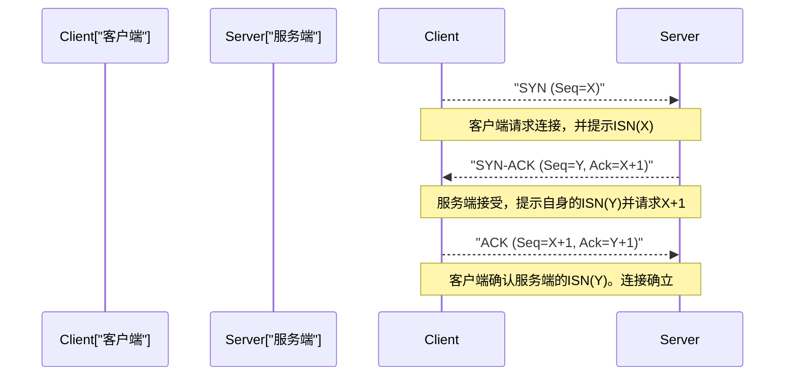

1. **SYN (Synchronize):** 客户端向服务端发送同步请求包（设置了SYN标志的TCP段）。此时，会提示随机生成的32位“初始序列号（ISN: Initial Sequence Number，此处设为X）”。ISN不从零或固定值开始是有原因的。一是为了防止将过去已确立并已断开的、相同IP和端口间通信中“在网络上迷路而延迟到达的旧数据包（幽灵包）”误认为新通信的包，二是具有防止攻击者猜测序列号并插入伪造数据的TCP序列预测攻击（IP欺骗）的密码学意义。
2. **SYN-ACK:** 服务端接受连接请求后，将客户端的ISN加1的值（X+1）作为“确认应答号（Acknowledgment Number）”返回，同时返回附加了服务端自身随机初始序列号（Y）的SYN-ACK包。
3. **ACK (Acknowledgment):** 客户端为了证明已正确接收到服务端的ISN，发送以Y+1作为确认应答号的ACK包。

在这3次包交互完成的瞬间，双向的通信状态就在内存中被确保，数据传输的准备就绪。但是，这个严密的过程承受着通信基础设施物理极限的重压。那就是“光速”。
真空中的光速约为每秒30万公里，但受限于互联网主要骨干网——光纤纤芯（石英玻璃）的折射率，光信号的传播速度会降至其三分之二左右（约每秒20万公里）。此外，还要加上途中路由器中的路由处理和交换带来的排队延迟。结果，例如在东京和纽约之间（直线距离约11,000公里，实际电缆长度更长），往返一次的时间（1 RTT: Round Trip Time）在物理上无论如何都需要150到200毫秒。由于TCP的三次握手至少会消耗这1 RTT，因此无论将带宽增加到多宽，建立连接时的延迟（Latency）都受到光速这一宇宙绝对法则的制约。

### 滑动窗口与顺序控制、校验和
进入数据传输阶段后，TCP会将从应用程序接收到的字节流分割成适当大小（MSS: Maximum Segment Size，通常是IP的MTU减去头部大小后的1460字节左右）的段进行发送。每个段都会被分配与数据字节数相对应的序列号，接收端即使遇到数据包顺序颠倒到达（乱序）的情况，也会基于此将原始数据重新排列成正确的顺序。

此外，TCP头部中包含16位的“校验和（Checksum）”，使用反码求和运算严格验证数据在传输路径上是否因电噪声或路由器的内存错误等发生了位翻转（损坏）。

如果在途中数据包缺失（丢包）或因损坏而被丢弃，接收端将持续返回期望的序列号的ACK（重复ACK），或者什么都不返回。发送端在一定时间（RTO: Retransmission Timeout）内未收到ACK返回，或者检测到重复ACK时，就会对该数据包进行“重传（Retransmit）”。

在这个机制中使通信速度大幅提升的是“滑动窗口（Sliding Window）”概念。在“发送1个包，直到收到其ACK才发送下一个包（停等协议，Stop-and-Wait）”的方式下，在前述的高延迟环境（RTT较大的环境）中吞吐量会绝望地下降。
在滑动窗口方式下，发送端和接收端会考虑彼此的缓冲区容量，动态协商“窗口大小（一次可发送的未确认数据的最大字节数）”。发送端无需等待来自接收端的ACK，就可以在这个窗口大小的范围内不断将数据包连续发送到网络中。然后每收到一个ACK，这个可发送配额（窗口）就会向前滑动。通过这种方式，在宽带且高延迟网络（BDP: Bandwidth-Delay Product，带宽延迟积大的环境）中实现了“让管道始终充满数据”的带宽最大化利用机制。

### 拥塞控制（Congestion Control）：防止网络崩溃的数学调和
可以说是TCP真正的杰作，也是互联网历史上最重要的技术突破之一的，就是“拥塞控制（Congestion Control）”。

1986年，早期的互联网（NSFNET）因通信量的增加而面临了被称为“拥塞崩溃（Congestion Collapse）”的致命系统故障。超出网络处理能力的数据涌入的结果是，路由器的队列（缓冲内存）溢出，大量数据包被丢弃。检测到丢包的TCP端点判断数据未送达，从而一齐进行数据包的“重传”。这导致更多的数据被注入网络，路由器更加不堪重负，有效吞吐量骤降至原先的数千分之一，陷入了毁灭性的恶性循环。

为了防止这种网络的死亡，1988年Van Jacobson等人为TCP引入了高度的动态控制算法。其核心是基于“AIMD（Additive Increase Multiplicative Decrease：和式增加，乘式减少）”原则对拥塞窗口（cwnd: Congestion Window）的控制。

1. **慢启动 (Slow Start):** 通信刚开始时，网络的空闲容量完全未知。因此，从极小的值（历史上是1 MSS，现代是10 MSS左右）开始发送窗口大小，每收到1个ACK就将窗口大小增加1 MSS。其结果带来了“每1 RTT窗口大小翻倍”的指数级增长。与“慢”这个名字相反，这是一个极具攻击性且在短时间内探索极限带宽的阶段。
2. **拥塞避免 (Congestion Avoidance):** 当窗口大小达到预先设定的阈值（ssthresh: Slow Start Threshold）时，停止指数级增长，切换为线性增长（每1 RTT增加1 MSS）。这是一个更加谨慎地探索网络极限容量（管道粗细）的阶段。
3. **丢包检测与乘式减少:** TCP将丢包（发生超时，或连续3次收到来自接收端的重复ACK）不仅仅解释为传输错误，而是视为“在网络路径上发生拥堵（拥塞），数据包从路由器缓冲区溢出掉落的信号”。在这一瞬间，TCP立即发挥自我控制，将发送窗口大小一下子激减至一半（或慢启动的初始值）。

通过这种“一点点地分享带宽（和式增加），一旦发生问题就大幅让步（乘式减少）”的数学化且利他主义的分布式算法，使得互联网上数以亿计、十亿计的独立TCP连接，在不存在中央集权的流量管理者的情况下，依然保持着“带宽的公平分配”与“整个网络稳定运行”的奇迹般的调和（稳态）。

近年来，由于路由器缓冲内存的大容量化适得其反，在因拥塞导致数据包丢弃发生之前，数据包持续滞留在变长的队列中，导致延迟（Ping值）飙升至数百毫秒到数秒的“缓冲膨胀（Bufferbloat）”作为新的物理现象成为了一个问题。为了应对这个问题，Google等人开发了不是将丢包而是将“RTT（延迟时间）的增加”检测为拥塞信号，在缓冲区溢出前主动限制发送速度的BBR（Bottleneck Bandwidth and Round-trip propagation time）等最新拥塞控制算法，这正在成为现代TCP的标准。

## 3. UDP（User Datagram Protocol）：为了速度而削减

如果说TCP是通过复杂的状态转移和高级的算法来保证数据完全确定性的“过度保护的管理者”，那么属于同一传输层的UDP，则是将作为协议的作用削减到极限的“极简主义的搬运工”。由Jon Postel于1980年设计的UDP，只具备作为传输层的最低限度的功能。

UDP的头部只有区区8字节（TCP头部通常为20字节，包含选项的话最大可达60字节）。其中包含的，仅仅是“源端口号”、“目标端口号”、“数据长度”以及用于检测数据损坏的简易“校验和”。

通过三次握手建立事前连接、通过序列号保证顺序、通过滑动窗口进行流量控制、重传处理、为了保护网络而进行的拥塞控制，在UDP中一概没有实现。它只是将从应用程序传递来的数据原封不动地包裹在IP数据报中，投入网络层，并以“发射后不管（Fire and Forget）”的方式发送而已。它甚至不关心是否送达到了对方。

但是，这种甚至可以说是不负责任的结构上的简单性，正是UDP最大的武器，也是它在特定用例中凌驾于TCP之上的原因。

### UDP的真谛：延迟至上主义与实时通信
在需要将物理延迟（Latency）削减到极限的实时通信中，TCP“为了保证确定性而进行的重传控制”反而会引发致命的问题。

例如，请想象一下FPS（第一人称射击）等在线游戏、语音通话（VoIP）、或者视频会议系统（Zoom、WebRTC等）。在这些应用程序中，会以每秒数十次到数百次的频率发送最新的位置信息或音频样本的数据包。
如果使用TCP，假设100毫秒前发送的音频数据包在途中的路由器中丢失。TCP会检测到该丢失并重传数据包，尝试在接收端以正确的顺序播放。但是，在对话或游戏实时进行的环境中，“延迟数百毫秒送达的过去的数据”已经不再有任何价值。
不仅如此，TCP在丢失的数据包被重传且顺序对齐之前，会停止处理（传递给应用程序）已经到达的后续新数据包并进行缓冲。这被称为“队头阻塞（Head-of-Line (HoL) Blocking）”。声音断断续续，或者游戏画面卡顿数秒后一下子快进的现象，很多都是由这种TCP等待重传导致的队头阻塞引起的。

在这种情况下，UDP可以果断放弃丢失的过去的数据包，让此时到达的最新的数据包立即在应用程序中被处理。在实时通信中，比起“凑齐所有数据”，“即使有少许噪音或掉帧，也要始终以最短延迟持续描绘最新状态”对人类的感官来说是更加自然舒适的用户体验。

此外，像DNS（Domain Name System）的名字解析或通过NTP（Network Time Protocol）进行的时间同步这样，对“一个小的请求包”通过“一个响应包”即可完成的简单的事务通信，完全没有握手开销的UDP也是最合适的。

## 4. QUIC：互联网通信的范式转换与下一代协议

从互联网的黎明期开始的几十年间，我们的网络架构一直受困于“如果想要可靠的流传输就用TCP，如果想要速度和实时性就用UDP”这一固化的二元论。然而，在现代Web的剧烈演进（特别是移动通信的普及，以及并行加载大量资源的HTTP/2时代）中，TCP根本上的设计本身成为桎梏的局限性开始暴露出来。

其最大的课题，就是我们在UDP一节中也提到过的TCP特有的“队头阻塞（HoL Blocking）”，以及伴随连接确立而产生的“过度的延迟”。
TCP将所有通信作为“单一的串行字节流”来管理。为了显示最新的Web网站，假设在HTTP/2上同时（多路复用地）请求了HTML、CSS、JavaScript、几十张图片等多个文件。但是，在底层的TCP层面上这是一条流，如果假设只有“图片A”的包丢失了1个，TCP层在完成该包的重传之前，甚至会在OS内核层面上阻塞本应毫无关系的“脚本B”或“图片C”的包的传递。
此外，现代Web必须使用加密（TLS/HTTPS），但在传统的协议栈中，在完成“TCP的三次握手（1 RTT）”之后，又要重新进行“TLS加密密钥交换的握手（1到2 RTT）”，因此在实际开始安全的数据发送之前，会消耗2到3 RTT的巨大物理延迟。

为了解决这些根本问题，并为现代互联网基础设施带来范式转换，由Google主导开发，并由IETF（Internet Engineering Task Force）标准化的下一代传输层协议就是“QUIC（Quick UDP Internet Connections）”。而且，以这个QUIC作为基础协议被重新定义的Web标准，就是“HTTP/3”。

### 中间盒子的僵化与逃向用户空间
QUIC最具突破性的方案在于，**“在现有的UDP数据包之上，在用户空间内重建了一个融入了加密和多路复用的全新传输层”**这一大胆的架构设计。

为什么不改良TCP，而是建立在UDP之上呢？互联网上无数的路由器、防火墙、NAT（网络地址转换，Network Address Translation）等“中间盒子（Middlebox）”，经过长年的运行，已经僵化到将除TCP和UDP以外的新协议（新协议号）视为“未知的威胁”而不问青红皂白地丢弃（这被称为互联网的Ossification：骨化现象）。另外，TCP的实现被硬编码在Windows或Linux等OS内核（中枢）的深处，因此为了普及新算法而更新全世界的OS将花费漫长的岁月。
因此QUIC采取了一种策略：在对中间盒子表现为单纯的“传统的UDP数据包”并使其通过的同时，在浏览器或应用程序（用户空间）的内部，独自实现了一种将TCP的优秀部分（拥塞控制和重传控制）进行了更高度演进的状态。

### QUIC的革新机制与超越物理限制

1. **通过流的独立性彻底消除HoL阻塞：**
   QUIC不是数据包的单一流，而是具备在协议层面上管理多个逻辑上“独立的流”的功能。就前面的例子来说，即使图片A的包在途中丢失，QUIC也只会将图片A的流作为等待重传而暂停，脚本B或图片C的流则完全不受影响地并行继续处理。由此，在丢包频发的移动网络等环境中，Web页面的显示速度将大幅提升。
2. **0-RTT（零RTT）连接确立与加密的融合：**
   QUIC从一开始就在协议中深度整合了相当于TLS 1.3的加密。它不会犯像TCP那样将“传输层连接”和“加密连接”分开的愚蠢错误。即使是第一次通信的服务器对象，也只需1 RTT就能完成连接和加密密钥的交换。更具突破性的是，如果是过去曾通信过的服务器对象（持有缓存的会话票据的服务器），就能实现“0-RTT”，即**无需等待握手，在发送第一个数据包的同时就可以开始HTTP请求**。这是从协议设计的角度对“光速导致的延迟”这一物理限制做出的极为精彩的回答。
3. **连接迁移（Connection Migration，不依赖于IP地址）：**
   传统的TCP连接受到“源IP、源端口、目标IP、目标端口”4个要素（四元组）的强烈绑定。因此，当用户带着智能手机外出，离开Wi-Fi环境切换到4G/5G的蜂窝网络，IP地址发生变化的瞬间，TCP连接就会断开，必须从耗时的握手重新开始。
   另一方面，QUIC并不通过IP地址，而是通过通信开始时生成的固有的“连接ID（Connection ID）”来管理每个连接。因此，即使物理IP地址或网络接口发生动态变化，只要连接ID相同，就可以毫不中断地无缝继续视频流的播放或大容量文件的下载。在移动通信成为主角的现代，这可以说是一个极其强大且必然的特性。

## 5. 结语：统御混沌的协议演进与秩序的构建

传输层在总是变动、路径切换、丢包和乱序如家常便饭的互联网网络层（IP）的混沌（Chaos）之上，建立起了应用程序可以安心使用的“坚固的逻辑秩序”。

由Vinton Cerf和Van Jacobson等人设计并打磨的TCP坚固的数学模型和拥塞控制，至今仍在保护互联网的骨干网免于崩溃，并持续支撑着全世界的数据传输。然后是为了响应追求物理延迟极限的实时通信的需求而出现的UDP的简单性。进而，为了克服这两者的局限性，融合了加密和多路复用，优化于现代移动环境而诞生的QUIC协议的精巧架构。

这一切，都是“在相隔遥远的计算机之间，在有限的带宽和光速之壁的物理限制下，如何准确且快速地送达信息”这一人类不断的科技探索的结晶。

当数据包以正确的顺序被重新排列，终于作为有意义的数据块被交付给应用程序时，单纯的电信号罗列终于开始拥有作为“信息”的价值。在下一章，我们将逼近建立在这个传输层提供的坚固基础之上、直接塑造我们日常接触的Web世界的“应用层（HTTP、DNS等）”机制的深渊。

# 第5章：应用层与Web的幕后 —— 从域名解析到加密通信的深渊

在之前的章节中，我们从光纤内全反射前进的光子以及铜线内传播的电磁波等物理层的行为开始，深入探讨了基于IP的数据包路由，以及基于TCP/UDP在传输层中数据传输的可靠性。在本章中，我们将终于踏入人类直接接触的领域，即“应用层”。

OSI参考模型中的第7层（应用层）、第6层（表示层）、第5层（会话层），在现代TCP/IP分层模型中，通常被统称为单一的“应用层”。应用层位于抽象化的最顶端，是由多种协议交织而成的复杂生态系统。在这里，我们将从历史背景、网络工程以及高级数学的视角，对在浏览器地址栏输入URL直到网页显示这一过程背后活跃的机制进行极其深入的剖析：包括DNS域名解析、HTTP资源传输，以及现代互联网不可或缺的SSL/TLS加密机制。

## 5.1 DNS（Domain Name System）：分布式分层数据库的奇迹与系谱

IP地址（IPv4中的32位数字，IPv6中的128位数字）对于路由器和交换机等网络设备构建用于数据包转发的路由表来说是最理想的，但却完全不适合人类直观地记忆、赋予意义并进行处理。

在互联网起源ARPANET的黎明期，主机名与网络地址的映射关系是通过一种极其原始的方法进行管理的。斯坦福研究院（SRI）的网络信息中心（NIC）以集中式的方式管理着一个名为 `HOSTS.TXT` 的单一文本文件，各个节点在夜间通过FTP下载该文件以更新自身的本地系统。然而，进入20世纪80年代后，随着连接到网络的主机数量开始呈指数级爆炸性增长，这种集中式模型暴露出了致命的局限性：流量瓶颈、更新延迟，以及命名冲突（命名空间枯竭）。

为了打破这一可扩展性危机，保罗·莫卡佩特里斯（Paul Mockapetris）于1983年设计并提出了DNS（Domain Name System），并被定义在RFC 882和RFC 883中。DNS架构的本质，是一个全球规模的分布式分层键值存储（Key-Value Store）。该系统为了消除单点故障并实现近乎无限的可扩展性，采用了一种具有划时代意义的分布式范式：将域名空间划分为树状结构，并将各自的管理权限进行委派（Delegation）。

### 域名解析的无尽旅程：从存根解析器到权威服务器

当用户在浏览器的地址栏中输入 `https://www.example.com` 的瞬间，OS内部的存根解析器（Stub Resolver）便会启动，在后台拉开了一场宏大的“域名解析之旅”的帷幕。这一过程也是如何规避网络延迟这一物理定律限制的连续缓存策略的体现。

1. **多级缓存查询**: 首先，会检查延迟最低的本地浏览器缓存。接着查询OS的DNS缓存，进一步还会查询本地网络上路由器的DNS缓存。克服光速（在真空中约为每秒30万公里，在光纤中约为其三分之二）这一物理限制的最有效手段，就是从根本上不产生网络通信。
2. **向递归解析器（完整解析器）发送查询**: 如果本地不存在缓存，查询将被发送至ISP或公共DNS提供商（如Google的 `8.8.8.8` 或Cloudflare的 `1.1.1.1` 等）运营的递归解析器（Recursive Resolver / Full Resolver）。该解析器将代替客户端承担域名解析的整个过程。
3. **向根服务器（Root Server）进行迭代查询**: 如果完整解析器的缓存中也没有相应的记录，完整解析器将向处于域名分层绝对顶点的“根服务器”发起查询。目前世界上存在从A到M的13个根服务器集群。根服务器并不直接知道 `www.example.com` 的IP地址，而是返回一个管理 `.com` 这一顶级域名（TLD, Top Level Domain）的名称服务器列表（Referral：委派响应）。此外，散布在世界各地的根服务器通过“任播（Anycast）”路由技术共享IP地址，并通过BGP（Border Gateway Protocol）的路径选择，将流量自主引导至在物理和网络拓扑上距离客户端最近的服务器。
4. **向TLD服务器进行迭代查询**: 接下来，完整解析器会向被引荐的 `.com` TLD服务器群中的一个发送查询。TLD服务器会返回被委派了 `example.com` 管理权限的权威（Authoritative）DNS服务器（名称服务器）的IP地址（NS记录）。
5. **向权威DNS服务器查询并获取记录**: 最后，完整解析器将直接访问 `example.com` 的权威DNS服务器。权威服务器的区域文件（Zone File）中记录了作为最终答案的 `www` 的A记录（IPv4地址）或AAAA记录（IPv6地址），抑或是CNAME记录（别名），这些记录将通过完整解析器返回给客户端的存根解析器。

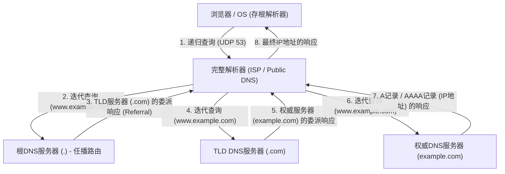

这种复杂的分层往返通信，通常在仅仅几毫秒到几十毫秒的转瞬之间就能完成。DNS作为传输层协议，主要使用UDP的53号端口。通过完全消除TCP三次握手（SYN, SYN-ACK, ACK）的往返开销，实现了极致的延迟降低。然而，当DNS的响应有效载荷超过历史性的UDP限制即512字节（得益于EDNS0扩展，现在支持更大的容量）时，或者在进行旨在防止DNS缓存投毒攻击的密码学数字签名扩展即DNSSEC（DNS Security Extensions）的密钥验证时，亦或是进行区域传送（AXFR）时，都规定了向更可靠的TCP 53号端口的回退机制。

## 5.2 HTTP架构与协议的进化论

通过DNS获取到目标服务器IP地址的浏览器，接下来会与目标服务器（80号或443号端口）建立TCP连接，并开始使用应用层的主要语言——HTTP（HyperText Transfer Protocol）进行对话。

1989年，由欧洲核子研究组织（CERN）的蒂姆·伯纳斯-李（Tim Berners-Lee）构想的HTTP，原本是为了让全世界的物理学家们能够跨越网络高效地共享研究文档（超文本），并通过链接将其串联起来而设计的一种极其简化的协议。由请求行（方法、URI、协议版本）、首部字段、空行（CRLF）以及消息体构成的基于文本的明晰结构，强有力地推动了系统的调试与普及。

HTTP根本的设计思想以及最大的特征在于它的“无状态（Stateless）”。服务器完全不会在内存中保留客户端过去请求的状态或上下文。每个请求都作为完全独立的事务来完成。这种与REST（Representational State Transfer）架构相通的无状态性，极大地简化了服务器的实现，也使得为了处理庞大流量而在水平方向上增加服务器数量的横向扩展（负载均衡）变得容易。无论负载均衡器将请求分配给哪个后端服务器，都能保证得到相同的结果。然而，在诸如电商网站的购物车功能或用户登录状态的维持等不可避免地需要管理状态（State）的现代交互式Web应用中，这种严格的无状态性成为了一大限制。为了在协议之外克服这一问题，人们发明了通过HTTP首部让客户端保存状态的Cookie，以及基于会话令牌的拟态状态管理机制。

### 与物理限制的抗争：从HTTP/1.1到HTTP/3的范式转变

随着Web的爆炸性普及，以及单一页面中所包含资源（图像、CSS、JavaScript文件等）的不断庞大化，HTTP直面了网络物理定律（光速带来的延迟限制与数据包丢失），并在协议层面经历了架构的剧烈进化。

- **HTTP/1.1 (1997年 - )**: 在最初的HTTP/1.0中，每请求一个资源就要重复建立和断开一次TCP连接（三次握手和四次挥手），从延迟的角度来看效率极低。HTTP/1.1则标准化了持久连接（Persistent Connection, Keep-Alive），使得单一的TCP连接能够被复用，从而大幅削减了连接成本。然而，HTTP/1.1的管线化（Pipelining）技术由于实现的困难以及中间代理的兼容性问题并未普及，并且存在名为“队头阻塞（Head-of-Line, HoL Blocking）”的致命结构缺陷。这是指在单一TCP连接上，当服务器正在处理一个庞大资源或计算繁重的请求时，后续的请求会堵塞在队列中，导致整体延迟恶化的现象。为了避免这种情况，浏览器不得不依赖于对同一域名同时建立多个TCP连接（通常为6个左右）这种强硬的解决手段（如域名分片等）。
- **HTTP/2 (2015年 - )**: 基于Google开发的SPDY协议而标准化的HTTP/2，将协议从基于文本转变为“基于二进制分帧（Binary Framing）”，从根本上刷新了架构。最重要的创新是“多路复用（Multiplexing）”。在HTTP/2中，可以在单一的TCP连接内部创建多个虚拟的“流（Stream）”，将请求和响应的数据分割成微小的二进制帧，并能不计顺序地进行交织（Interleave）发送。由此，应用层面的HoL阻塞被彻底消除。此外，通过使用HPACK算法的首部压缩机制（静态哈夫曼编码与动态表相结合），大幅削减了在每个请求中重复发送的冗余Cookie或User-Agent等数据的传输量，将网络带宽的利用效率提升到了极致。
- **HTTP/3 (2022年 - )**: HTTP/2出色地解决了应用层的HoL阻塞，但其底层的传输层（TCP）中“数据包丢失时的HoL阻塞”这一物理壁垒依然存在。TCP为了保证可靠性，一旦中途丢失哪怕一个数据包，就会在重传完成之前，停止将该TCP连接上所有流的数据包交付给应用层（这是TCP顺序保证机制带来的弊端）。为了打破这一问题，HTTP/3抛弃了作为数十年互联网基础的TCP，采用了基于UDP的全新传输协议“QUIC（Quick UDP Internet Connections）”，实现了剧烈的范式转变。QUIC避开了TCP由于在OS内核空间实现而导致的演进迟缓问题，在可在用户空间实现的UDP上层，融入了独有的重传控制、拥塞控制，以及针对每个流独立的流量控制。即使发生数据包丢失，受到影响的也仅是该特定的流，其他流能够不受阻塞地继续处理。此外，QUIC将建立连接的握手与加密（TLS 1.3）的握手相整合，使得对于过去有过通信记录的服务器，能够以“0-RTT（Zero Round Trip Time）”直接开始发送加密数据。这是面对物理上的光速极限（与地球另一端的通信无论如何都会产生数百毫秒的延迟），通过在协议层彻底削减通信往返次数（RTT）以追求极致性能的结果结晶。

## 5.3 加密与信任机制：SSL/TLS的数学深渊与证明逻辑

互联网本质上是一个开放的分组通信网络，数据要经过无数的路由器和海底的光纤电缆，以接力传递的方式被转发至目的地。在这一路径上的任何一个节点（中间路由器、恶意的ISP，或者同一Wi-Fi网络上的窃听者），在物理上都有可能通过抓包来拦截甚至篡改通信内容。利用高等数学的力量来封锁这种网络绝对的脆弱性，并建立安全的通信通道，正是SSL（Secure Sockets Layer）及其后继者TLS（Transport Layer Security）协议的使命。

TLS在现代Web通信中所保证的，是以下“安全的三大支柱”。
1. **机密性（Confidentiality）**: 即使通信内容被第三方窃听也无法被解密。
2. **完整性（Integrity）**: 数据在通信路径上哪怕只有1个比特都没有被篡改。这由MAC（Message Authentication Code）或AEAD（Authenticated Encryption with Associated Data）来担保。
3. **身份验证（Authentication）**: 通信对方是合法域名的所有者（真实的服务器）。

实现这些目标的技术，是人类几个世纪以来不断积累，尤其是二战后随着计算机科学和数论的发展而实现飞跃的密码学理论的结晶。

### 密钥交换与公开密钥加密：离散对数问题与素数分解的壁垒

最简单且处理速度最快的加密方式是“对称密钥加密（Symmetric Cryptography）”（目前的标准是AES：Advanced Encryption Standard）。这是一种发送者和接收者使用相同的“对称密钥”进行加密和解密的方法。由于数学处理很轻量（比特的XOR运算以及替换、置换的组合），因此非常适合对千兆级通信进行实时加密。然而，对称密钥加密存在着一个根本性的悖论（密钥分发问题），即“在开始通信之前，如何将这个秘密的对称密钥本身安全地交给对方”。在像互联网这样毫无预先信任关系的对方进行通信时，如果直接发送对称密钥，密钥就会在中途被窃听，使得加密毫无意义。

成为人类历史上密码学最大突破的，是1976年惠特菲尔德·迪菲（Whitfield Diffie）与马丁·赫尔曼（Martin Hellman）发表的密钥交换算法，以及1977年由RSA（李维斯特、萨莫尔、阿德曼）等人发明的“公开密钥加密（非对称加密，Asymmetric Cryptography）”。

公开密钥加密的底层，存在着数学上的“单向函数（One-way function）”或“陷门单向函数（Trapdoor one-way function）”的概念。这利用了这样一种不对称性：“某一方向（加密）的计算计算机能够瞬间完成，但逆向（解密或推测密钥）的计算，哪怕把全世界的超级计算机连接起来，计算宇宙的寿命那么长的时间也无法完成”。

- **RSA加密**: 基于这样一个性质：将两个非常大的素数（$p$和$q$）相乘得到一个巨大的合数（$N = p \times q$）很容易（可以在多项式时间内计算出），但如果仅仅给出那个巨大的合数 $N$，要推导出原本的素因子 $p$ 和 $q$（整数分解问题）却极其困难（目前只知道亚指数时间算法）。它利用欧拉函数和费马小定理等数论的深邃性质，构建了一个数学陷门，使得用公钥加密的数据，只能由拥有相对应私钥的人才能解密。
- **椭圆曲线密码学（ECC: Elliptic Curve Cryptography）**: 作为目前TLS中主流的ECC，应用了定义在有限域上椭圆曲线（例如，满足 $y^2 = x^3 + ax + b$ 这样方程式的点集）中的“离散对数问题”的困难性。对椭圆曲线上的点定义了“加法”或“标量乘法”这样的几何操作。将某个起点 $G$ 相加秘密次数 $k$ 次得到点 $P = kG$ 是很容易的，但从公开的点 $G$ 和 $P$ 反向推算出到底相加了多少次的秘密系数 $k$（离散对数），则比RSA的素数分解还要困难。正因如此，ECC以RSA几分之一的极短密钥长度（例如用ECC 256bit就能实现与RSA 2048bit同等的安全性）实现了同等甚至更高的加密强度，大幅节省了CPU负载和网络带宽。

### TLS握手：为了构建信任的密码学仪式

在开始基于HTTPS的安全通信时，客户端与服务器会生成用于对称加密的安全“会话密钥”，并且执行用于验证对方身份的高级协商协议。这就是TLS握手。以下是针对最新标准中摒弃了所有冗余部分的“TLS 1.3”中1-RTT握手的剖析。

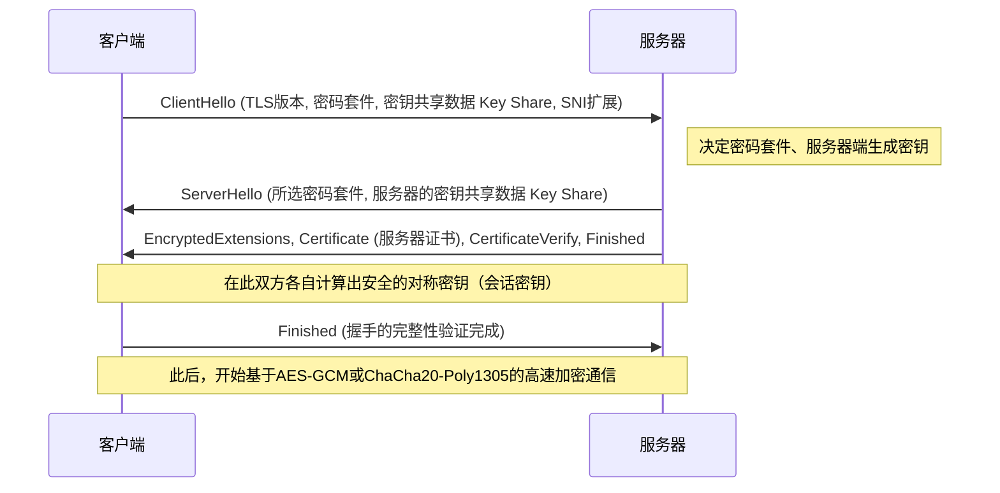

1. **ClientHello**: 客户端在开始连接时，向服务器发送自己支持的TLS版本、加密算法列表（Cipher Suites）以及用于生成密钥的初始数学参数（Key Share）。此外，还会使用SNI（Server Name Indication）扩展，以明文形式发送想要连接的主机名（例：`www.example.com`）。对于在单一IP地址上运行多个HTTPS域名的服务器（虚拟主机）而言，这是选择并返回正确证书所不可或缺的信息。
2. **ServerHello**: 服务器从客户端的列表中选择最强大且最合适的加密算法（例：`TLS_AES_256_GCM_SHA384`），并随同自身的Key Share数据一起进行响应。
3. **发送证书与签名（Authentication）**: 服务器发送自身的“数字证书（X.509）”。更进一步，服务器利用与该证书关联的“私钥”，针对至今为止所有握手消息的哈希值创建数字签名（CertificateVerify）并发送。由此，在数学上证明了服务器就是该证书的合法所有者（私钥的持有者）。
4. **密钥交换（Ephemeral Elliptic Curve Diffie-Hellman: ECDHE）**: 客户端与服务器，将在发送与接收中得到的相互的Key Share（公开的椭圆曲线上的点），与各自手头独有的秘密参数在数学上进行相乘。令人惊叹的是，凭借Diffie-Hellman密钥交换的数学性质（$ (g^a)^b = (g^b)^a = g^{ab} $），在网络上完全不传输任何秘密信息的情况下，客户端和服务器端宛如魔法般地合成出完全相同的、坚固的“主密钥（对称密钥）”。
5. **前向保密性（Perfect Forward Secrecy: PFS）**: TLS 1.3一个极其重要的特征是，用于这次密钥交换的参数（Key Share）在每次建立会话时都是一次性新生成的（Ephemeral）。正因如此，万一服务器用于长期身份证明的私钥（RSA或ECDSA密钥）在数年后被攻击者泄露，想要追溯并解密过去被记录、保存下来的加密通信数据包，在数学上也是完全不可能的。这就确保了过去通信的机密性在未来能够得到保障。

### PKI与信任链（Chain of Trust）：数字世界的护照

在到此为止的加密机制中，还遗留了一个致命的逻辑漏洞。那就是：“客户端如何确信，服务器发送过来的证书和公钥，真的属于目标域名（比如银行的网站）并且是真实的？”这个问题。

如果控制着网络路径的恶意中间人，伪装成服务器并将自己伪造的证书和公钥发送给客户端，实施“中间人攻击（Man-in-the-Middle Attack）”的话，密钥交换和加密本身在数学上能够完美成功。然而，被加密的通信对象将不再是目标银行，而是攻击者。

解决这一根源性认证问题的社会与技术框架，就是PKI（Public Key Infrastructure：公开密钥基础设施），以及作为信任锚的“证书颁发机构（CA：Certificate Authority）”的存在。

服务器所有者会创建包含自己公钥的CSR（证书签名请求），并提交给如DigiCert、GlobalSign或Let's Encrypt等值得信赖的第三方机构，也就是CA。CA在验证申请者确实拥有该域名的所有权（如域名验证、企业实体验证等）之后，利用CA自身强大的“私钥”，对服务器的公钥信息实施“数字签名”，并作为服务器证书予以颁发。

另一方面，在诸如Windows或macOS等操作系统，以及Chrome或Firefox等浏览器中，已经预先硬编码并内置了在世界范围内通过严格审计的根CA的“根证书（公钥）”集群，作为信任的基点（Trust Anchor）。

当客户端从服务器收到证书时，会使用OS内置的根CA的公钥，对证书上附加的CA数字签名进行密码学验证。如果签名验证成功，就能证明该证书的记载内容（域名和公钥）得到了CA的保证，并且没有被篡改。

1. 客户端无条件信任根CA（预先安装到信任存储中）。
2. 根CA信任中间CA，并为其签名。
3. 中间CA信任终端实体（Web服务器），并为其签名。

通过这种名为“信任链（Chain of Trust）”的传递关系，我们在与物理上遥远的未知服务器之间，动态且瞬间地构建了坚固的信任关系，从而建立起了安全的加密通信通道。

## 结论：协议层的融合与迈向下一境界

在第5章中，我们在应用层的深渊展开，对域名解析、数据请求与响应的协议，以及将这一切包裹其中的加密数学面纱进行了详细的剖析。

DNS作为互联网广阔的分布式地址簿发挥作用，HTTP确立了其作为资源搬运工的架构，而TLS则用最前沿的密码学理论铠甲为其提供坚固的守护。这些在历史上被设计为相互独立的协议层，但在现代Web中，正如在HTTP/3的QUIC中所看到的那样，传输层与应用层以及加密层之间的边界正在紧密融合，它们打破了物理延迟的极限，正持续向同时追求极致性能与安全性的精简形态演进。

在下一章中，我们将进一步探讨：穿过这层坚固的加密通信到达服务器端的请求，是如何生成动态内容，并与背后的数据库系统进行交互的。我们将围绕“后端系统的内部结构与分布式计算”，继续潜入更深一层的技术深渊。

# 第6章：支撑互联网的物理基础设施——光、热与海洋交织的巨大机制

互联网常常被谈论为一个虚无缥缈的抽象概念——“云（Cloud）”。我们通过智能手机或电脑发送的数据，仿佛通过看不见的电波或线缆，被吸入了“某处天空上”的存储空间，让人产生这样的错觉。然而，互联网的实体并非如云朵般轻盈。它极其厚重、充满物质性，且深受热力学、光学和地球物理学定律的束缚，无外乎是人类历史上最庞大的物理基础设施。

本章中，我们将深入剖析将这个“不可见网络”在物理世界中具象化的三大支柱——作为全球神经网络的“海底光缆”、承担数据存储与计算的热力学处理设施“超大规模数据中心”，以及打破光速壁垒、压缩时空的“CDN（内容分发网络）”。我们将从其物理机制、历史背景以及追求极限的专业技术视角进行彻底解剖。

---

## 1. 环绕地球的光之神经网络：海底光缆系统

目前，超过99%的跨国国际互联网通信，并非通过在太空中飞行的卫星，而是通过铺设在海底、直径仅有几厘米的“海底光缆（Submarine Communications Cable）”来传输的。当我们浏览国外的网站时，那些数据正以光速在水深数千米的漆黑深海中穿梭。

### 1.1 从电报到光纤的演进与对香农极限的挑战

海底线缆的历史远比互联网的诞生要古老，可以追溯到1850年铺设的跨越英吉利海峡的电报线缆。1858年，第一条横跨大西洋的电报线缆铺设完成，但当时使用的是摩尔斯电码通信，维多利亚女王向美国总统布坎南发送一条信息就花费了十几个小时。此后，经历了使用同轴电缆的模拟电话线路时代，自20世纪80年代后期开始引入了光纤线缆。1988年铺设的第一条跨大西洋光通信线缆“TAT-8”的容量为 280 Mbps（相当于约4万条电话线路），这在当时已经是革命性的带宽了。

现代的海底光缆，单根线缆就拥有数百 Tbps（太比特每秒）这种令人难以想象的通信容量。使这种飞跃性进化成为可能的，是“波分复用（WDM: Wavelength Division Multiplexing）”和“掺铒光纤放大器（EDFA: Erbium-Doped Fiber Amplifier）”这两项诺贝尔奖级别的物理学与工程学突破。

WDM 是一种在单根光纤中将不同波长（颜色）的光进行复用并同时发送的技术。借此，每根光纤的传输容量将以波长的数量呈乘数级增长。然而，无论作为光纤材料的石英玻璃纯度被提高到何种极限，在行进数百公里后，由于瑞利散射和红外吸收，光信号仍会衰减。因此，就需要每隔几十公里到一百公里设置一个中继器（Repeater）。

过去的中继器会进行一种复杂且受限的物理过程（O-E-O转换），即将衰减的光信号先转换为电信号，放大后再转换回光信号。然而，20世纪90年代实现商用的 EDFA，通过在光纤的纤芯中掺入稀土元素铒，并向其照射被称为泵浦光的强激光，使得光信号能够直接“以光的形式”被放大。这使得一次性放大多个不同波长的光信号成为可能，与 WDM 技术相结合后，通信容量迎来了爆炸性的增长。

当前，在通信工程领域，我们正在逼近克劳德·香农提出的信道容量理论极限，即“香农极限（Shannon Limit）”。为了突破这一限制，让单根光纤内拥有多个纤芯的“多芯光纤（Multicore Fiber）”以及复用光空间模式的“空分复用（SDM: Space Division Multiplexing）”等下一代物理层技术已经开始被研究和部署。

### 1.2 深海的物理环境与光缆铺设工程学

海底光缆的铺设是现代最严酷的工程之一。长达数千公里的线缆需要使用专门的“铺缆船（Cable layer）”沉入海底。

在铺设之前，会使用回声测深仪精确绘制海底地形图，并避开有海底山脉、海沟、热液矿床或滑坡危险的海域，从而选定最佳路线。线缆的结构会因铺设水深的不同而发生巨大变化。

在大陆架等水深较浅的海域（水深约 1000～1500 米以内），渔船的底拖网、船舶的锚，甚至鲨鱼等海洋生物的咬噬，带来物理切断的风险极高。因此，在保护光纤的聚碳酸酯树脂和铜管外侧，还会缠绕多层高张力钢丝（Steel Wire）进行“铠装（Armor）”，直径变得更粗，重量也更重。此外，还会使用水下遥控潜水器（ROV: Remotely Operated Vehicle）和海底犁，将线缆埋入海底泥沙中数米深。

另一方面，在水深数千米的深海区域，由于不存在渔网和船锚的威胁，为了在保持能够承受水压的坚固性的同时，防止铺设时因自重而断线，会采用省去钢丝铠装的“轻型光缆（Lightweight Cable）”。其直径仅在 17～20 毫米左右，与一根花园软管差不多粗细。

海底光缆的另一个重要物理层面是“电力供应”。为了驱动每隔几十公里设置的中继器，陆地上的登陆站（Cable Landing Station）会通过线缆内的铜制管（供电导体）输送高压直流电。在跨越大洋的光缆中，供电电压有时会超过 1 万伏特（10 kV），通常采用以海水和大地作为回路的“单线大地回路方式”。

### 1.3 地缘政治与科技巨头的崛起

曾经，由于铺设海底光缆需要巨额投资，主流方式是各国主要通信运营商联合成立财团（联盟），按比例分担成本和带宽。但近年来，这个生态系统发生了剧烈的转变。

Google、Meta（Facebook）、Microsoft、Amazon 等被称为“超大规模云厂商（Hyperscalers）”的科技巨头们，为了以超高速连接自家的庞大数据中心，开始单独或联合直接投资并铺设海底光缆。他们从单纯的互联网用户，摇身一变成了物理基础设施最大的所有者。由此，光缆的路由也正从传统的“主要城市间的连接”转变为对“自家数据中心间的最短、最快连接”进行优化。

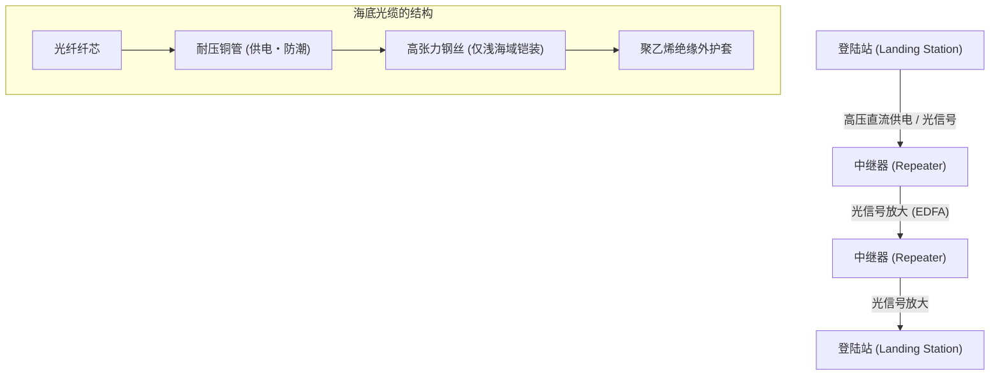

---

## 2. 数据的热力学处理设施：超大规模数据中心

穿过海底光缆到达陆地的数据，最终会被运送至“数据中心”。数据中心是容纳数万至数十万台规模服务器群，并24小时365天不间断地进行计算和存储的巨大建筑。

### 2.1 云的实质与“PUE”之战

从物理学角度来看，数据中心的本质是“将庞大的电能作为输入接收，并产出信息处理这一熵减过程（计算结果）以及伴随其产生不可避免的『热量』的巨大热机”。CPU 和 GPU 等半导体在切换电流开关时，会因电阻而产生热量。如果不将这些热量有效地排到外部，半导体会瞬间发生热失控，从而在物理上被烧毁。

因此，数据中心设计和运营的最大焦点在于“冷却”和“电力效率”。表示这一效率最通用的指标就是“PUE（Power Usage Effectiveness，电源使用效率）”。

**PUE = 数据中心总耗电量 / IT 设备（服务器等）耗电量**

PUE 的理论最小值是 1.0（即所有电力纯粹只用于计算的状态）。过去的数据中心 PUE 超过 2.0（也就是说，消耗在空调等冷却设备上的电力与服务器消耗的一样多）也并不罕见。但是，在现代的超大规模数据中心中，通过极其极限的热力学优化，已经将该数值降至 1.1～1.2 左右。

### 2.2 冷却架构的进化

基于热力学原则，数据中心的冷却系统经历了以下演变：

1. **冷热通道隔离 (Hot/Cold Aisle Containment)**:
   早期的数据中心是使用空调设备（CRAC: Computer Room Air Conditioning）冷却整个房间，但冷空气和服务器排出的热空气会混合在一起，效率极低。现在，标准的做法是将服务器机架的进风面相对、出风面相对布置，并在物理上隔离通过冷空气的通道（冷通道）和通过热空气的通道（热通道），这被称为“通道封闭”。

2. **自然冷却 (Free Cooling)**:
   运行冷水机组（冷却水循环装置）的压缩机需要消耗巨大电力。因此，在室外空气足够寒冷的地区（如北欧或北海道等）建设数据中心，直接或通过热交换器间接利用外部冷空气进行冷却的“自然冷却”技术得到了普及。

3. **浸没式液冷 (Immersion Cooling) 与直接水冷 (Direct-to-Chip)**:
   近年来，用于 AI 训练和推理的高端 GPU 的发热密度，正在超越传统风冷的物理极限（空气的热容量和导热率较低）。为此，开始引入将服务器主板整体直接浸入非导电性的氟系惰性液体或矿物油中的“浸没式液冷”，以及将水冷头直接贴合在 CPU/GPU 均热板上，使用热容量远大于空气的液体直接带走热量的“直接水冷（Direct-to-Chip冷却）”。而在利用相变（液体沸腾产生的汽化热）的两相浸没式液冷中，甚至可以处理极高的热流密度。

### 2.3 冗余性与物理安全

由于数据中心是社会基础设施的中枢，因此被要求具备极限的冗余性（Redundancy）。在商业电源切断的瞬间，使用飞轮、铅酸蓄电池或锂离子电池的不间断电源（UPS）会在毫秒级别接管电力供应。与此同时，安装在建筑物外部的巨型柴油发电机或燃气轮机发电机将启动，利用储备的燃料维持整个设施连续运转数天之久。

在网络连接方面，也会接入多家不同通信运营商的线路，并在物理路径上（例如从建筑物东南西北等不同方向接入）进行完全分离，以防备因挖掘施工导致线缆切断等事故。

---

## 3. 压缩时空的技术：CDN（内容分发网络）

即便海底光缆连接了各大洲，数据中心积累了信息，但这还不足以支撑起现代的网页体验。在这里阻挡去路的，是阿尔伯特·爱因斯坦提出的宇宙绝对限速——“光速壁垒”。

### 3.1 光速壁垒与延迟的物理极限

真空中光速（$c$）约为 30万 km/s。但是，作为光纤纤芯的石英玻璃，其折射率约为 1.47，因此光在光纤中的速度会降至约 20万 km/s（约为真空中光速的三分之二）。

例如，从日本东京到美国东海岸弗吉尼亚州（世界最大的数据中心聚集地）的物理直线距离约为 11,000 公里，考虑海底光缆的路径后约为 14,000 公里。光信号单程传输所需的纯物理时间约为 70 毫秒。由于互联网通信需要数据包往返（RTT: Round Trip Time），因此作为物理法则，绝对会产生至少 140 毫秒的延迟（Latency）。此外，还会加上途中的路由器和交换机的处理延迟。

在打开最新的网站时，浏览器需要请求 HTML、CSS、JavaScript、图像等数百个文件，并在 TCP 的 3 次握手以及 TLS (SSL) 加密协商中让通信往返多次。如果所有用户都必须直接访问位于地球另一端的“源服务器（Origin Server）”，那么直到网页显示出来将会产生数秒到十几秒的延迟，使得实时的在线游戏或高画质视频流传输根本无法实现。

### 3.2 向边缘分散：CDN 的架构

能够从工程学上克服这一物理极限、压缩时空的系统正是“CDN（Content Delivery Network，内容分发网络）”。

CDN 的核心理念非常简单：“既然去距离用户遥远的源服务器获取数据太慢，那么提前在物理上离用户最近的地方放置一份数据副本（缓存）不就好了”。

CDN 运营商在世界各地主要城市的数据中心或 ISP（互联网服务提供商）的设施内，在物理上部署了成千上万被称为“边缘服务器（Edge Server）”的缓存服务器。当用户访问网站时，CDN 网络会瞬间判断用户的地理和网络位置，并将通信路由到延迟最低（最近）的边缘服务器。

实现这种路由的核心技术是“任播（Anycast）”和高级的“基于 DNS 的路由”。在任播路由中，世界各地的多个边缘服务器会被分配完全相同的 IP 地址。利用构成互联网骨干的 BGP（Border Gateway Protocol，边界网关协议）的路径选择算法，路由器会自动发挥作用，将数据包传送到网络上“最短”的服务器。借此，东京的用户会被引导到东京的边缘服务器，伦敦的用户则会被引导到伦敦的边缘服务器，而用户完全感觉不到这一过程。

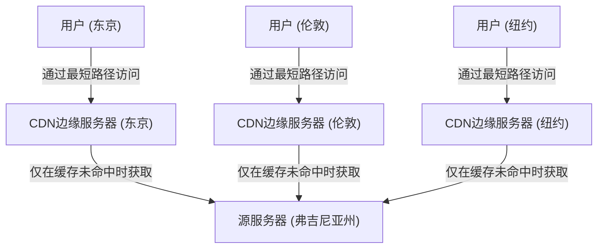

### 3.3 动态优化与边缘计算的到来

早期的 CDN 只是一套单纯缓存并分发图像、视频或静态 HTML 文件的简单机制。然而，现代的 CDN 已经演变成了一个极其庞大的分布式计算平台。

首先，是对动态内容（如每个用户不同的搜索结果或购物车内容等）的分发优化。尽管这些内容无法被缓存，但 CDN 会独自对边缘服务器与源服务器之间的通信路径进行优化（如分层缓存 Tiered Cache 或构建专用的高速路由网络），提供比标准互联网路径（BGP 尽力而为路径）丢包率更低、更稳定且高速的通信通道。此外，通过在边缘服务器端终止（Terminate）TCP 连接和 TLS 会话，大幅减少了与远程进行握手的往返次数。

其次，是“边缘计算（Edge Computing）”的崛起。过去，复杂的应用程序处理（认证、A/B 测试、图像动态调整大小、执行自定义逻辑等）都是在源服务器的 CPU 上进行的。但现在，以 Cloudflare Workers 和 AWS Lambda@Edge 为代表的技术，让开发者可以利用 V8 引擎等隔离的沙盒环境，直接在最靠近用户的边缘服务器上以毫秒级运行代码（如 JavaScript、Rust、WebAssembly 等）。这意味着，名副其实的“互联网边界（Edge）”已经开始发挥出作为一个巨大分布式计算机的作用。

---

## 4. 结语：与物理极限的无尽斗争

互联网基础设施的历史，就是一部与光速、热力学第二定律、能量守恒定律等支配宇宙的绝对物理法则作斗争的历史。

海底光缆的工程师们挑战深海的巨大水压与玻璃的光学极限，数据中心的设计师们为了冷却发热的硅晶圆而追求热力学极限，CDN 的架构师们为了避开光速壁垒不断构建高度复杂的分布式处理系统。

当我们轻触智能手机，就能瞬间访问全世界信息，这背后正是这些厚重、严酷且极其精密的物理基础设施在支撑。在第7章中，我们将深入挖掘在这个坚固的物理基础设施之上，软件和协议是如何维持着全球规模的自治去中心化网络，也就是“路由与 BGP 的世界”。


---
title: "インターネットの仕組み：海底ケーブルからWeb3まで、世界を繋ぐ巨大ネットワークの全貌"
description: "人類史上最大のインフラはいかにして動いているのか。歴史、プロトコル、物理層から未来の通信までを徹底解剖。"
categories: ["technology", "network"]
tags: ["tech", "internet", "network", "infrastructure"]
slug: "how-the-internet-works-comprehensive-guide"
date: "2026-10-02T11:46:18+09:00"
image: "eyecatch.jpg"
---

# 第1章 インターネットの黎明と哲学 —— ARPANETからWWWに至る技術の系譜

インターネット——今日、人類のあらゆる経済活動、文化、そしてコミュニケーションの基盤となっているこの巨大な自律分散型ネットワークは、決して単一の天才によって一夜にして設計されたものではない。それは冷戦という特異な歴史的・地政学的背景を起点とし、通信工学と計算機科学におけるパラダイムシフトを経て、無数の研究者たちが共有した「情報をいかにして堅牢かつ自由に、いかなる物理的制約をも超えて伝達するか」という崇高な哲学の結晶である。

本章では、インターネットという奇跡のシステムがいかにして誕生したのかを、単なる歴史の羅列ではなく、物理層からアプリケーション層に至るまでの技術的メカニズムと、その設計思想（アーキテクチャ）というプロフェッショナルな視点から極限まで深く掘り下げて解説する。

## 1.1 ネットワークパラダイムの転換：回線交換の限界とパケット交換の誕生

インターネットの歴史的・技術的本質を理解する上で、すべての出発点となるのが「パケット交換（Packet Switching）」という概念の発明である。1960年代初頭、当時の通信インフラの中心は、電話網に代表される「回線交換（Circuit Switching）」方式であった。

### 回線交換の物理的メカニズムと脆弱性
回線交換方式とは、通信を行う2点間において、クロスバースイッチや電子交換機を物理的、あるいは周波数分割多重化（FDM）などの技術を用いて論理的に結合し、通信開始から終了まで「専用の通信路（回線）」を確保・占有する方式である。この方式は、回線が確保されている限り帯域幅と遅延が保証されるため、リアルタイム性が求められる音声通信（電話）には極めて適していた。

しかし、このアーキテクチャには致命的な欠陥が存在した。それは「単一障害点（Single Point of Failure）」の存在と、物理的破壊に対する極度の脆弱性である。冷戦下において、米国防総省はソビエト連邦からの核攻撃（特に高高度核爆発に伴う電磁パルス：EMP攻撃）を深く懸念していた。中央集権的な通信拠点（巨大な交換局）が物理的に破壊された場合、あるいは通信経路の一部が寸断された場合、回線交換方式では迂回経路を即座に再構築することができず、国家の指揮命令系統（C2: Command and Control）が完全に麻痺してしまう。

### パケット交換というブレイクスルー
この絶望的な物理的制約を打ち破るための理論的基盤を、全く独立に、しかしほぼ同時期に構築した3人の先駆者がいる。ランド研究所のポール・バラン（Paul Baran）、イギリス国立物理学研究所（NPL）のドナルド・デイビース（Donald Davies）、そしてマサチューセッツ工科大学（MIT）のレナード・クラインロック（Leonard Kleinrock）である。

彼らは、クロード・シャノン（Claude Shannon）の情報理論を背景としつつ、通信を連続的なアナログの「波」や切れ目のないデータの「ストリーム」として扱うのではなく、データを固定長（あるいは可変長）の小さなデジタルデータの塊——すなわち「パケット（Packet）」あるいはバランの言葉で言えば「標準化されたメッセージ・ブロック」——に分割するという革命的なアプローチを提唱した。

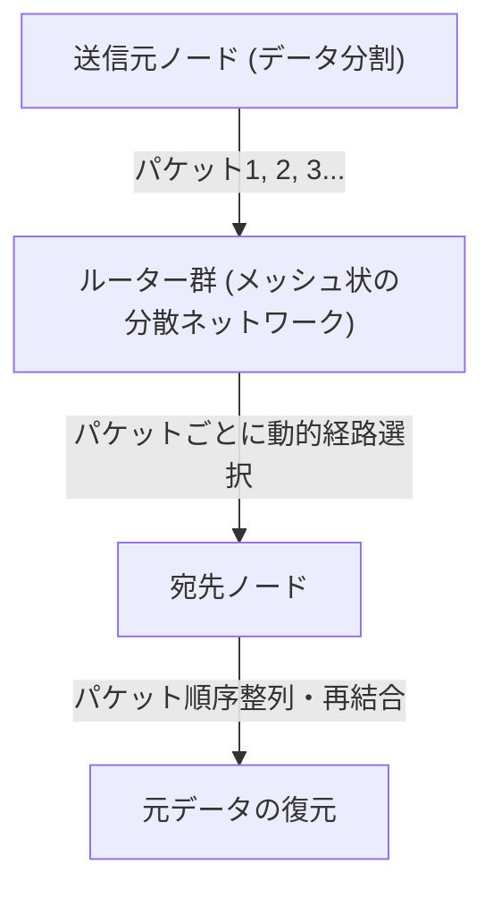

パケット交換方式の技術的革新性は、主に以下の2点に集約される。

1. **統計的多重化（Statistical Multiplexing）の実現:**
   回線交換のように特定の通信で物理回線を占有するのではなく、複数の無関係な通信のパケットが、同じ物理回線を時分割で共有する。計算機間のデータ通信は「バースト性（Burstiness：一時的に大量のデータが流れ、その後無音が続く特性）」が高いため、パケット交換による帯域の共有は、通信リソースの利用効率を数学的限界まで引き上げた。
2. **ストア・アンド・フォワード（Store and Forward）と動的経路選択:**
   ネットワークを構成する各中継ノード（ルーター）は、受信したパケットを一時的にメモリ上のキュー（待ち行列）に蓄積し、パケットのヘッダに記載された宛先アドレスと、ノード自身が持つ経路表（ルーティングテーブル）を照らし合わせる。そして、その時点でのネットワークの輻輳（ふくそう）状態や物理的回線の切断状況を計算し、パケットごとに最適な隣接ノードへ転送する。

クラインロックは待ち行列理論（Queuing Theory）を用いて、このストア・アンド・フォワード方式におけるパケットの遅延やバッファサイズの数学的モデルを確立した。ネットワークの一部が核攻撃で蒸発したとしても、生き残ったノードが自律的に状況を判断し、パケットは迂回路（メッシュネットワーク上の別の経路）を見つけ出して宛先に到達する。この「自律分散型・自己修復型」のアーキテクチャこそが、インターネットの強靭性（Resilience）の根源である。

## 1.2 ARPANETの構築：IMPによるハードウェアとプロトコルの分離

理論上の存在であったパケット交換ネットワークを物理世界に実装したのが、1969年に米国防総省高等研究計画局（ARPA）の資金提供により開始されたプロジェクト「ARPANET」である。

当時の計算機環境は、現代とは比較にならないほど混沌としていた。IBM、DEC、SDSなど、各社が独自に開発したメインフレーム（大型計算機）は、文字コード（ASCII対EBCDIC）、ワード長（16ビット、32ビット、36ビットなど）、オペレーティングシステムが完全に異なっており、これらを直接通信させることは技術的に極めて困難であった。

そこで、ARPANETの設計者たち（ラリー・ロバーツら）は、ネットワークアーキテクチャにおいて非常に重要な設計上の決断を下す。それは「IMP（Interface Message Processor）」と呼ばれる専用の中継用小型コンピューターを導入することであった。

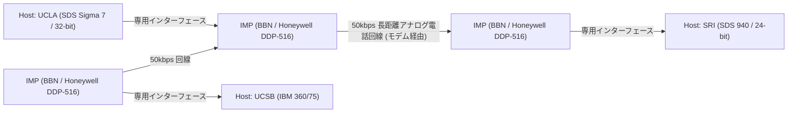

IMPの開発は、ボストンに拠点を置くコンサルティング会社BBN（Bolt Beranek and Newman）が落札した。彼らはHoneywell社の堅牢なミニコン「DDP-516」を改造し、ルーティングプロトコル、パケットの分割と組み立て、エラー検出（CRC: 巡回冗長検査）といった複雑なネットワーク処理のすべてをIMPに負担させた。

これにより、各研究機関の巨大なホストコンピューターは、複雑なパケットルーティングや回線の物理的特性を一切気にする必要がなくなり、ただ目の前にあるIMPと標準化されたインターフェース（BBN 1822プロトコル）でデータの受け渡しをするだけで済むようになった。これは、システムの「関心の分離（Separation of Concerns）」をネットワーク分野に適用した最初の偉大な成功例であり、IMPは今日のルーター（Router）の直接的な始祖となった。

1969年10月29日、UCLAのクラインロックの研究室からSRI（スタンフォード研究所）に向けて、最初のメッセージ「LO」が送信された（"LOGIN"と打とうとしてシステムがクラッシュしたため）。これが、ARPANETが産声を上げた歴史的瞬間である。その後、初期のルーティングアルゴリズム（ベルマン・フォード法に基づく距離ベクトル型ルーティング）が実装され、ARPANETは全米の研究機関を結ぶインフラとして急速に成長していく。

## 1.3 TCP/IPの設計思想：End-to-End原則とカプセル化の深淵

ARPANETは単一のネットワークとしては大成功を収めたが、やがて新たな壁に直面する。ARPANET内で使用されていたNCP（Network Control Program）という通信プロトコルは、ARPANETという「均質で信頼性の高い単一ネットワーク」の上で動くことを前提として設計されていた。

しかし1970年代に入ると、人工衛星を使ったパケット通信網（SATNET）や、ハワイ大学が開発した無線パケット通信網（ALOHANETから派生したPRNET）など、物理媒体、パケットの最大サイズ（MTU: Maximum Transmission Unit）、転送速度、エラー率が全く異なる多種多様なネットワークが登場し始めた。これらを相互接続して地球規模の「ネットワークのネットワーク（Internetwork）」を構築しようとしたとき、NCPの設計では破綻することが明白となった。

この異機種間ネットワーク接続の途方もない課題を解決したのが、1974年にヴィントン・サーフ（Vinton Cerf）とロバート・カーン（Bob Kahn）が発表した画期的な論文 "A Protocol for Packet Network Intercommunication" である。彼らが設計したプロトコルこそが、現代インターネットの基盤である「TCP/IP（Transmission Control Protocol / Internet Protocol）」である。

### アーキテクチャの魂：End-to-End原則 (End-to-End Argument)
TCP/IPの設計の根底には、ネットワーク工学における最も重要な哲学「End-to-End原則（End-to-End Principle / Argument）」が流れている。1980年代にJ. H. Saltzer、D. P. Reed、D. D. Clarkらによって明文化されたこの原則は、以下のように主張する。

「データ転送の信頼性確保や順序制御、暗号化といった高度でアプリケーション固有の機能は、通信を行う両端の末端ホスト（End-to-End）において実装されるべきであり、ネットワークのコア（中継インフラやルーター）には実装するべきではない」

もしネットワークのコア側（IMPやルーター）に、パケットの到達確認（ACK）や再送制御などの複雑な「状態（State）」を持たせてしまうと、どうなるか。中継ルーターが故障した瞬間にその状態は失われ、通信は切断される。また、新しい要件を持つアプリケーションが登場するたびに、世界中の中継ルーターのソフトウェアを書き換えなければならなくなる。

TCP/IPはこの原則を極限まで忠実に具現化した。中継を担うIP（Internet Protocol）ルーターは「受け取ったパケットを宛先に向けてベストエフォート（最善の努力）で転送するだけ」という極めて単純な機能（ステートレスなデータグラム転送）に特化した。IPはパケットの紛失や順序の入れ替わりを一切気にしない。単なる「ダム・ネットワーク（Dumb Network：馬鹿なネットワーク）」に徹したのである。

その代わり、通信の信頼性を担保する重責は、すべて両端のホストコンピューターで動くTCP（Transmission Control Protocol）に委ねられた。TCPは、IPが運んできた順序バラバラのパケットに付けられたシーケンス番号を見て元のデータを組み立て直し、欠損があれば自律的に再送要求を行い、ネットワークが輻輳していれば送信速度を調整する（ウィンドウ制御やスロースタート・アルゴリズム）。

この「コアを極限まで単純に保ち、エッジ（末端）に知性を持たせる」という設計思想こそが、インターネットが電話網を凌駕し、後にWeb、ストリーミング動画、P2P通信、スマートフォンといった、設計者すら予想しなかった爆発的なイノベーションを、インフラの改修なしにそのまま飲み込むことができた最大の理由である。

### カプセル化（Encapsulation）と階層モデル
TCP/IPはこの論理的な役割分担を実現するために、データを「カプセル化（Encapsulation）」するという手法を用いた。これは、送信するデータに対して、各階層が自身の制御情報（ヘッダ）をマトリョーシカ人形のように被せていくメカニズムである。

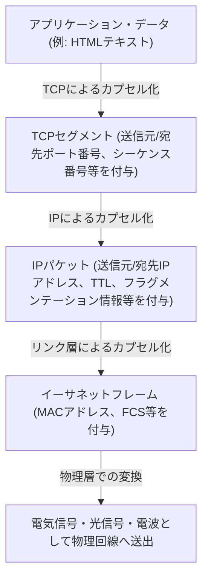

ルーターはIPパケットのヘッダ（IPアドレス）だけを見て転送先を決定し、その中身（TCPヘッダやデータ）には一切関与しない。これにより、IPは下位の物理層（光ファイバー、銅線、Wi-Fi、5G）の物理的特性の違いを完全に隠蔽・吸収し、上位層に対して「地球規模の単一の仮想ネットワーク」を提供することに成功した。

1983年1月1日、ARPANET上のすべてのホストがNCPからTCP/IPへと一斉に切り替わる「フラッグ・デー（Flag Day）」が実施され、ここに真の意味での「The Internet」が誕生したのである。

## 1.4 NSFNETの台頭と自律分散ルーティングの進化

TCP/IPへの移行後、インターネットは軍事・国防の枠を超え、学術研究の巨大なインフラへと変貌を遂げていく。その決定的な推進力となったのが、1980年代後半に米国国立科学財団（NSF）が構築した「NSFNET」である。

NSFNETは全米の5つのスーパーコンピューターセンターを結ぶバックボーンネットワークとして構築され、初期は56kbps、後にT1回線（1.544Mbps）、そしてT3回線（45Mbps）へと物理層の劇的なアップグレードを繰り返した。各大学や地域のネットワーク（リージョナル・ネットワーク）は、このNSFNETのバックボーンに階層的に接続されるようになった。

ネットワークの規模が爆発的に拡大（スケーリング）する中で、新たな技術的課題が浮上した。それが「ルーティングの限界」である。数万に及ぶノードの経路情報をすべての中継ルーターが共有することは、メモリ容量と計算能力の物理的限界を超えてしまう。

この問題を解決するため、インターネットは「自律システム（AS: Autonomous System）」という概念を導入した。インターネットを単一の巨大なネットワークではなく、独立した管理ポリシーを持つネットワーク（AS）の集合体として再定義したのである。

ASの内部（IGP: Interior Gateway Protocol）では、OSPF（Open Shortest Path First）のようなリンクステート型ルーティングプロトコルを用い、ダイクストラ法（Dijkstra's algorithm）によってネットワークの完全なトポロジマップを構築して最短経路を高速に計算する。

一方、ASとASの間（EGP: Exterior Gateway Protocol）では、単なる最短経路ではなく、「どのネットワークを経由して通信を許可するか」というビジネス上・組織上のポリシーを反映させる必要があった。これを実現するために開発されたのが、今日に至るまでインターネットの根幹を支えている「BGP（Border Gateway Protocol）」である。BGPはパスベクトル（Path Vector）型のアルゴリズムを採用し、ルーティングループを完全に防ぎつつ、世界中のISP（インターネットサービスプロバイダ）間で経路情報の交換を可能にした。

NSFNETの構築とBGPの確立により、中央の管理者が存在しなくても、各組織が相互接続（ピアリングやトランジット）を繰り返すことで全体として一つのネットワークが自律的に機能するという、現代の商用インターネットのエコシステムが完成したのである。1995年、NSFNETはその役割を終え、バックボーンの運営は完全に民間のISP群へと移譲された。


# Chapter 2: Physical Layer and Data Link Layer ~The Physical Reality of Digital Data and Adjacent Communication~

At the foundation of the massive network known as the Internet lies an extraordinary chain of physical phenomena that converts logical digital data of "0"s and "1"s into physical phenomena such as electrical signals, blinking lights, or ripples of electromagnetic waves, transmitting them across space and media to the recipient. When we casually open a website on our smartphones, behind the scenes, photons are racing through glass fibers crawling along the ocean floor, and invisible radio waves are flying through space accompanied by complex calculations.

In this chapter, we will focus on Layer 1 (Physical Layer) and Layer 2 (Data Link Layer) of the OSI reference model, diving to the absolute depths from a professional perspective into the "most physical and gritty" parts of the networks that support our lives, and the intricate logical mechanisms that control them.

---

## 2.1 Physical Layer: The Physical Materialization of Information and the Laws of the Universe

The greatest mission of the physical layer is to convert (modulate) the discrete bit streams (0s and 1s) handled by computers into analog physical signals tailored to the physical characteristics of the transmission medium (copper wire, optical fiber, space such as vacuum or air), and place them onto the transmission path. Here, the laws of electrical engineering, quantum mechanics, and optics determine the limits of communication.

### The Shannon-Hartley Theorem and the Limits of Information
When discussing the physical layer, one cannot avoid the information theory published by Claude Shannon in 1948. The "Shannon-Hartley theorem" mathematically proved the maximum data transfer rate (channel capacity) that can be transmitted without errors over a communication channel where noise exists.

$$ C = B \log_2\left(1 + \frac{S}{N}\right) $$

Here, $C$ is the channel capacity (bps), $B$ is the bandwidth (Hz), and $S/N$ is the signal-to-noise ratio (SNR). This beautiful equation demonstrates that no matter how much technology advances, there is a physical upper limit (the Shannon limit) to the amount of information that can be sent under a given bandwidth and noise environment. Modern optical fiber and Wi-Fi engineers continue an endless battle to raise communication speeds as close to this limit as possible.

### The Physics of Optical Fibers: Transporting by "Confining" Light
The backbone of the modern Internet is undoubtedly the optical fiber. While high-speed, long-distance communication is difficult with copper wire electrical communication due to the skin effect and electromagnetic interference (EMI), optical fibers have overcome these issues.

An optical fiber is composed of two layers of extremely high-purity silica glass: a central "core" and an encircling "cladding." By setting the refractive index of the core slightly higher (less than a few percent) than that of the cladding, light entering at an angle shallower than a certain critical angle repeatedly undergoes total internal reflection at the boundary between the core and the cladding, based on Snell's law. As a result, the light travels through the interior of the fiber without leaking outside.

#### The Battle Against Dispersion and Attenuation: The Glass That Brought a Nobel Prize
In the past, glass contained many impurities, causing light to attenuate within just a few meters. In 1966, Dr. Charles Kao (awarded the Nobel Prize in Physics in 2009) discovered that the cause of attenuation in optical fibers was not the inherent nature of the glass but impurities (especially hydroxyl groups and transition metals), and predicted that long-distance communication would become possible if the purity was increased. The ultra-low loss silica glass developed by Corning in the 1970s achieved an astonishingly low loss of 0.2 dB/km in the 1550 nm wavelength band (C-band). This means that even after traveling 15 km, only half of the light's intensity is lost.

However, when light travels long distances, "Chromatic Dispersion" and "Modal Dispersion" occur, causing the pulse waveform to collapse. Chromatic dispersion occurs because the propagation speed in the glass varies depending on the wavelength (color) of the light. Modal dispersion is a phenomenon where a shift in arrival time occurs because there are multiple paths (modes) for the light passing through the core.
To overcome this, the "Single Mode Fiber (SMF)" was developed, which narrows the core diameter to a few micrometers, close to the wavelength of the light, allowing only a single path to pass through. This became the mainstream for long-distance transmission such as intercontinental communication.

#### EDFA and WDM: The Renaissance of Optical Communication
In the 1990s, two revolutions occurred in optical communication. The first was the Erbium-Doped Fiber Amplifier (EDFA). Until then, slow and costly regenerative repeaters were required, which converted the attenuated optical signal into an electrical signal, amplified it, and then converted it back to light. EDFA enabled direct amplification of light as light by doping the fiber core with the rare-earth element erbium and illuminating it with excitation light from the outside, causing stimulated emission as the signal light passed through.

The second was Wavelength Division Multiplexing (WDM). It is a technology that utilizes the superposition principle—where light of different wavelengths (colors) travels independently without mixing even when emitted into the same space simultaneously—to bundle and send signals of multiple wavelengths simultaneously over a single fiber. Today, using Dense Wavelength Division Multiplexing (DWDM) technology, more than 100 signal waves with wavelengths at intervals of a few millimeters are carried on a single optical fiber, realizing extraordinary bandwidths of tens of Tbps to several Pbps on a single fiber.

### Submarine Cables: The Earth's Neural Network
More than 99% of intercontinental data communication is carried by submarine cables, not artificial satellites. Cloud data and images from overseas websites all physically pass along the bottom of the sea.

#### A History of Failures and Challenges
The history of submarine cables is much older than the Internet. The first major challenge was the transatlantic telegraph cable in 1858. Although the laying of the copper wire, insulated with gutta-percha (a type of natural rubber), was successful, the operation at high voltage, which ignored the warnings of Lord Kelvin (William Thomson), proved fatal, and it went silent after causing dielectric breakdown in just a few weeks. Afterward, theory and materials were improved over a long period of time, and in 1988, the first transpacific optical submarine cable, "TAT-8," went into operation, marking the dawn of the optical era.

#### Cable Structure and the Mechanics of Laying
Modern submarine cables laid in the deep sea at depths of several thousand meters are designed to withstand extreme environments. To protect the bundle of just a few optical fibers at the center, they are shielded by multiple layers, including high-tensile steel wires, copper or aluminum tubes for water pressure resistance, and polyethylene insulation. In the deep sea, they are only a few centimeters in diameter for weight reduction while withstanding shark bites and immense water pressure. However, in shallow waters, they are equipped with thick armor (armoring) to protect against bottom trawls from fishing boats, ship anchors, and submarine earthquakes, making them more than 10 centimeters in diameter.


Even when using ultra-low loss fibers, optical signals attenuate every few dozen kilometers, so "submarine repeaters" are inserted at equal intervals along the cable. The power to drive these repeaters (which contain the aforementioned EDFA) in the deep sea is continuously supplied from the landing stations at both ends through the copper tubes within the cable as a high-voltage direct current ranging from several thousand volts to over 10,000 volts.
A specialized "cable-laying ship" is used for laying, and in shallow waters, an underwater robot (ROV) digs a trench in the seabed and buries the cable. If a cable is severed, a repair ship rushes to the site, hooks the end of the cable from the deep sea using a grapnel (an anchor-like claw), pulls it up onto the ship, and skilled technicians splice the optical fibers with an accuracy of a few microns—an extraordinarily analog and gritty operation.

### The Physics of Radio Wave Communication (The Foundation of Wi-Fi)
With the proliferation of mobile devices and IoT, communication via electromagnetic waves (radio waves) flying through space has also become a main battleground for the physical layer. Wi-Fi (the IEEE 802.11 standard family) primarily uses the 2.4 GHz and 5 GHz bands, as well as the recently opened 6 GHz ISM band (Industrial, Scientific, and Medical band, which can be used without a license).

#### Extreme Information Compression via QAM (Quadrature Amplitude Modulation)
In the "modulation" that places digital data onto analog waves, Wi-Fi utilizes extremely advanced technology. This is QAM (Quadrature Amplitude Modulation).
A radio wave has two physical quantities: "amplitude" (wave height) and "phase" (wave timing/angle). QAM synthesizes two carrier waves (the I signal and the Q signal) that differ in phase by 90 degrees and varies their respective amplitudes to assign a bit stream to a specific "point" on a constellation map.

For example, with 16-QAM, 16 points (4 bits) can be expressed with a single wave change (symbol). In the latest Wi-Fi 7 (802.11be), a high-density modulation that could be called sheer madness—4096-QAM—has been adopted. This expresses 4096 points (12 bits) in a single modulation. In a constellation map crowded with 4096 points, the receiving side must accurately determine which "point" was transmitted without it getting buried in minute noise. To achieve this, advanced error-correcting codes and powerful signal processing processors are used.

#### OFDM and MIMO: The Battle Against Multipath and the Utilization of Space
Radio waves do not merely travel in a straight line; they reflect off walls and furniture, diffract, and scatter. Because of this, radio waves emitted from a transmitter travel along different paths (multipath) and arrive at the receiver at slightly shifted timings, causing interference (fading) and destroying the waveform.
Technologies that turn this to an advantage or overcome it are OFDM and MIMO.

**OFDM (Orthogonal Frequency-Division Multiplexing)** is a technology that, instead of using a wideband, highly resilient single signal, finely divides the bandwidth into many very narrow frequencies (subcarriers) and transmits data in parallel at a slow speed over each. Because the subcarriers are arranged to be "orthogonal" (mathematically not interfering with each other), the frequency utilization efficiency is extremely high, and it is highly resistant to delay shifts caused by multipath.

**MIMO (Multiple-Input and Multiple-Output)** is a "spatial multiplexing" technology that uses multiple antennas to transmit different data simultaneously on the same frequency. By utilizing the property that waves mix differently at different locations in space due to multipath reflections, the complex signals received by multiple antennas on the receiving side are separated as if solving simultaneous equations, thereby multiplying the communication capacity by the number of antennas. Furthermore, **beamforming**, which fine-tunes the phase of the radio waves for each antenna to concentrate the beam of radio waves in a specific direction, has also become an indispensable technology for modern Wi-Fi.

---

## 2.2 Data Link Layer: Dialogue and Order Between Directly Connected Devices

If the physical layer is merely a "signal carrier," the data link layer is the layer that groups those raw bit streams into meaningful chunks called "frames," and is responsible for the rules and traffic control to ensure they are delivered securely to the correct destination within the same network (link).

### The History of Ethernet: Inspiration from ALOHA
Today, the global de facto standard for wired LAN is Ethernet (IEEE 802.3).
Its roots trace back to "ALOHAnet," a wireless communication network created at the University of Hawaii. ALOHAnet adopted a highly chaotic and ambitious protocol: "If you have data to send, just send it. If it collides and gets destroyed, wait a random amount of time and retransmit."

In 1973, Bob Metcalfe at Xerox's Palo Alto Research Center (PARC) applied the ideas of ALOHAnet to communication over coaxial cables and invented Ethernet. Early Ethernet used a "bus-type" topology, where numerous computers shared a single thick coaxial cable (yellow cable) by piercing it with needles called vampire taps.

#### CSMA/CD: An Orderly Anarchy
Because everyone shares the medium (cable), if multiple devices transmit electrical signals simultaneously, the waveforms overlap and a "collision" occurs, destroying the data. The autonomous decentralized algorithm designed to avoid and resolve this is "CSMA/CD (Carrier Sense Multiple Access with Collision Detection)."

1. **Carrier Sense**: Before transmitting, measure the voltage on the cable and listen carefully to check if anyone else is communicating.
2. **Multiple Access**: If no one is communicating, anyone may freely transmit without waiting for centralized permission.
3. **Collision Detection**: Monitor the cable voltage even while transmitting; if an abnormal voltage spike different from your own transmitted signal is detected, judge it as a "collision." Immediately send a jam signal to notify everyone else of the collision and stop transmitting.
4. **Backoff**: After a collision, each node waits for a random amount of time (a time calculated by an exponential backoff algorithm) before attempting to retransmit.

This simple mechanism, which does not require a central administrator and operates on the premise that "rule violations (collisions) will occur, and when they do, wait randomly," is the biggest reason Ethernet defeated complex and expensive protocols like IBM's Token Ring and ATM to seize hegemony.

### MAC Address: The Absolute Identification of Hardware
For destination addressing at the data link layer, a MAC address (Media Access Control address) is used. If an IP address is a "temporary residence," then a MAC address is an "innate identification number."

A MAC address has a length of 48 bits (6 bytes) and is written by separating two-digit hexadecimal numbers with colons, like "00:1A:2B:3C:4D:5E".
- **First 24 bits (OUI: Organizationally Unique Identifier)**: A company code managed and assigned by the IEEE that uniquely identifies the vendor of the network equipment (such as Apple, Cisco, Intel, etc.).
- **Last 24 bits (UAA: Universally Administered Address)**: A serial number assigned sequentially by the vendor to their own products.

In principle, the Network Interface Card (NIC) of every piece of network equipment around the world has a globally unique MAC address burned into its ROM.

### Frame Structure: The Packing Technology of Communication
At the data link layer, headers and trailers are appended to the front and back of the data (such as IP packets) passed down from the network layer, encapsulating it into a unit called a "frame." The structure of the Ethernet (Ethernet II) frame is refined to the point of being artistic.

1. **Preamble**: A 7-byte sequence of "10101010". A warm-up exercise for clock synchronization (timing alignment) of the receiving NIC.
2. **SFD (Start Frame Delimiter)**: 1 byte of "10101011". By ending the preamble with "11", it announces to the receiving side, "Here begins the actual data."
3. **Destination MAC Address / Source MAC Address**: 6 bytes each. Who the communication is from and to. If the destination is "FF:FF:FF:FF:FF:FF", it becomes a broadcast frame that reaches everyone.
4. **EtherType (Type)**: 2 bytes. Indicates what data is in the payload (0x0800 for IPv4, 0x86DD for IPv6, 0x0806 for ARP).
5. **Payload (Data/Payload)**: The actual data received from the upper layer. The size ranges from 46 bytes to a maximum of 1500 bytes (MTU: Maximum Transmission Unit).
6. **FCS (Frame Check Sequence)**: A 4-byte trailer. A hash value calculated from the entire frame (from Destination MAC to Payload) using a polynomial called CRC-32 (Cyclic Redundancy Check).

The receiving NIC calculates the CRC at high speed at the hardware level while receiving the frame. If the FCS attached to the end differs from its own calculation result by even a single bit, it assumes the data was corrupted by noise or a collision during transmission and **mercilessly discards the frame without any notification**. The data link layer unfailingly performs up to "detecting and discarding errors," but it does not have the function to request, "It was broken, so please resend it." This division of roles, entrusting the heavy responsibility of retransmission control to upper-layer protocols like TCP, supports the scalability of the Internet.

### The Birth of the Switching Hub and the Evolution to Full-Duplex Communication
While shared bus Ethernet using CSMA/CD was a fantastic mechanism, it had a fatal flaw: as the number of devices (hosts) connected to the network increased, collisions occurred frequently, causing effective throughput to plummet dramatically.
What fundamentally solved this was the "Layer 2 switch (switching hub)" that became widespread in the 1990s.

Whereas a hub (repeater hub) is a physical layer device that unconditionally broadcasts received electrical signals to all ports, a switch possesses a smart brain that understands the data link layer.
The switch has a "MAC address table" using internal memory (CAM table). It learns the source MAC addresses of the devices connected to each port and automatically builds a correlation table between ports and MAC addresses.
Then, when a frame arrives, the switch cross-references the destination MAC address with the table and forwards the frame "only" to the port where the applicable device is connected.


With the introduction of switches, the wiring between each node and the switch became logically and physically independent (star topology). As a result, because the communication paths were separated, collisions no longer occurred in principle. Consequently, it became possible to use "Full-Duplex" communication, using transmitting and receiving lines simultaneously.
In modern Ethernet, the CSMA/CD algorithm is no longer used, having evolved into pure point-to-point full-duplex communication. Furthermore, VLAN (Virtual LAN) technology based on IEEE 802.1Q has enabled the flexible division and integration of logical networks without being bound by physical wiring, continuing to reign as the absolute foundational technology supporting the infrastructure of enterprises and massive data centers.

### The Data Link Layer of Wi-Fi: Traffic Control in the Invisible Radio Wave Space
While wired Ethernet evolved into collision-free full-duplex communication, wireless Wi-Fi faces the difficult challenge of "everyone sharing a single medium in the same space (air)," just like the shared bus Ethernet of the past.

In wireless communication, because one's own transmitted radio waves are too strong, it is physically impossible to simultaneously receive another's weak radio waves and "detect" a collision (CD). Furthermore, there is a risk unique to wireless called the "Hidden Node Problem"—for example, terminals A and C on opposite sides of an access point cannot reach each other's radio waves, but if they transmit simultaneously, their radio waves will collide at the access point.

Therefore, the data link layer protocol (MAC layer) of Wi-Fi adopts "CSMA/CA (Carrier Sense Multiple Access with Collision Avoidance)."
In CSMA/CA, before transmitting, it eavesdrops on the radio wave conditions in the space for a fixed time (DIFS) and then waits for a random backoff time before initiating transmission. The most important difference is the mechanism of **ACK (Acknowledge)**, which did not exist in wired networks. In Wi-Fi, the receiving side immediately sends back an ACK frame (after an extremely short waiting time called SIFS) to indicate that it has successfully received the data. The transmitting side judges that the communication was successful only after receiving this ACK. If the ACK is not returned, it assumes the data was corrupted by a collision or interference, doubles the backoff time, and attempts to retransmit.

Furthermore, to solve the hidden node problem, there is also a mechanism called the "RTS/CTS handshake." Before sending large data, the transmitting side sends a short control frame called RTS (Request to Send), and the receiving side (such as an access point) returns a CTS (Clear to Send). This CTS includes reservation time (NAV: Network Allocation Vector) information saying, "I will be communicating for XX microseconds from now, so surrounding terminals please stay quiet," and surrounding terminals that receive this refrain from communicating. In this way, the Wi-Fi data link layer performs masterful traffic control in the invisible radio wave space.

---

## Conclusion

A world of physical phenomena where photons race through glass, withstand the water pressure of the deep sea, and fly through space while changing phase and amplitude. And, by laying down synchronization via preambles, individual identification via MAC addresses, strict error detection via CRC, and refined traffic control via switching and CSMA/CA on top of those noisy and uncertain physical phenomena, it finally becomes possible to "deliver a meaningful chunk of data (frame) without errors to an adjacent device." This is the miracle achieved by Layer 1 and Layer 2.

However, this alone cannot form the Internet that connects the world. This is because communication by MAC addresses is only valid within the narrow village of the "same network (broadcast domain)" connected to the same switch or access point, or until it is blocked by a router.

In the next chapter, "Chapter 3: The Network Layer and IP," we will approach the essence of IP (Internet Protocol) and routing—the grand mechanism of path discovery designed to connect these countless local villages together and deliver packets like a bucket brigade to unknown networks on the opposite side of the Earth.


# Chapter 3: The Network Layer and the Mechanics of Routing — A Navigational Chart for Packets Crossing the Ocean

Forming the foundation of the internet we use daily is Layer 3 of the OSI reference model, namely the "Network Layer." Beyond direct communication via physical cables and radio waves (Data Link Layer), the reason we can communicate on a global scale with servers thousands of kilometers away lies in the countless routers spread across the network and the magnificent mechanism of routing, where they autonomously exchange information with each other.

In this chapter, from the structure of IP (Internet Protocol), the limitations of IPv4 and the architecture of IPv6, to the depths of BGP (Border Gateway Protocol) that connects Autonomous Systems (AS) worldwide, we will detail to the utmost limit the "navigation techniques" for packets to reach their destinations from technical, historical, and physical perspectives.

## 3.1 The Paradigm of the Network Layer: The End-to-End Principle

The greatest breakthrough in the internet's design philosophy lies in the **End-to-End Principle**, which states that "intermediate nodes (routers) in the network focus solely on simple packet forwarding, while complex processing (error correction and sequence guarantee) is performed at the endpoints (end hosts)."

In conventional telephone networks (circuit switching), a physical circuit is occupied from the start to the end of communication, and state is managed across the entire network. In contrast, the network layer of the internet (packet switching) is "connectionless" and stateless. Each packet is treated as an independent "letter," and the router repeats the simple task of receiving it, looking at the destination, and sending it out to the optimal next relay point (next hop) — a process known as forwarding. This combination of a "Dumb Network" and "Smart Terminals" is the primary reason the internet was able to scale explosively and accommodate a diverse range of applications.

## 3.2 The Internet's Addresses: The Evolution and Depletion History of IP Addresses

Every device on the network is assigned an IP address, which serves as a unique identifier. Currently, the internet is in a transitional period, with two generations of IP protocols coexisting.

### IPv4: The 32-bit Space and the Fight Against Depletion

Defined in RFC 791 in 1981, IPv4 has a 32-bit space (approximately 4.3 billion addresses). At the time of its design, the number 4.3 billion felt tremendously large, but due to the explosive spread of the internet, the crisis of depletion began to be called out as early as the 1990s.

Created to overcome this crisis were **CIDR (Classless Inter-Domain Routing)** and **NAT (Network Address Translation)**.
Initial IP address allocation was done in a rough "classful" manner of Class A (/8), Class B (/16), and Class C (/24), leading to a severe waste of addresses. CIDR replaced this with Variable Length Subnet Masking (VLSM), realizing "classless" routing that allocates addresses only as needed.
Furthermore, the advent of NAT made it possible for a single address to be shared by thousands of devices by linking a private IPv4 address space to a single global IPv4 address. However, NAT broke the End-to-End Principle, resulting in the requirement of complex NAT traversal technologies (such as STUN/TURN/ICE) for P2P and real-time communications.

### IPv6: A 128-bit Infinite Space and Next-Generation Header Structure

Formulated in RFC 2460 in 1998 as a fundamental solution to address depletion is **IPv6**. IPv6 has a 128-bit address space, providing a vast space of $2^{128}$ (approximately 340 undecillion) addresses, which is more than enough even if an address were assigned to every grain of sand on Earth.

The innovativeness of IPv6 is not just the length of the address. A dramatic simplification of the header structure was carried out. Variable-length options and the header checksum found in the IPv4 header were abolished, and the basic header was fixed at 40 bytes. This accelerates packet processing (routing) in hardware (ASIC and TCAM). Additionally, fragmentation (packet division) was changed to be performed only by the source host and not by intermediate routers, greatly reducing the load on routers.

## 3.3 The Duality of Routing: Control Plane and Data Plane

The interior of a router is broadly divided into two "planes".

1. **Control Plane**
   This is the brain section where routers communicate with each other using routing protocols (such as OSPF and BGP), learn the network topology (connection structure), and calculate optimal routes. The calculation results are stored in a database called RIB (Routing Information Base).
2. **Data Plane**
   This is the muscle section that actually receives packets, determines the interface to send the packet out on based on the destination IP address, and forwards it. It uses a forwarding-specific table generated from the RIB called FIB (Forwarding Information Base), and by using specialized memory such as TCAM (Ternary Content-Addressable Memory), it forwards packets at hardware wire-speed on the order of nanoseconds.

## 3.4 Internal Governance of the Network: IGP and Autonomous Systems (AS)

The internet is not a single giant network, but a collection of independent networks managed by ISPs (Internet Service Providers), enterprises, universities, and so on. This independent administrative domain is called an **AS (Autonomous System)**. Currently, there are over 100,000 ASes existing worldwide.

For routing inside an AS (within an enterprise or an ISP's backbone), an **IGP (Interior Gateway Protocol)** is used. Two representative IGPs are the following:

- **OSPF (Open Shortest Path First) / IS-IS**
  These are "link-state" routing protocols. A router floods the connection state of its surroundings (link bandwidth and state) to the entire network, and each router builds a complete map (topology database) of the entire network. On that map, it executes Dijkstra's algorithm (a shortest path algorithm) to calculate the path that minimizes the "cost" to the destination. This is physically and mathematically the same approach as a car navigation system calculating the shortest route while factoring in traffic information.

## 3.5 BGP: The "Diplomatic" Protocol Weaving the Internet Together

While the interior of an AS is governed by OSPF and others, connecting AS to AS to form the global internet is the sole de facto standard of **EGP (Exterior Gateway Protocol)**, which is **BGP (Border Gateway Protocol)**. BGP is an extremely unique protocol that determines paths reflecting not just the technical shortest distance, but "business relationships" and "policies between nations".

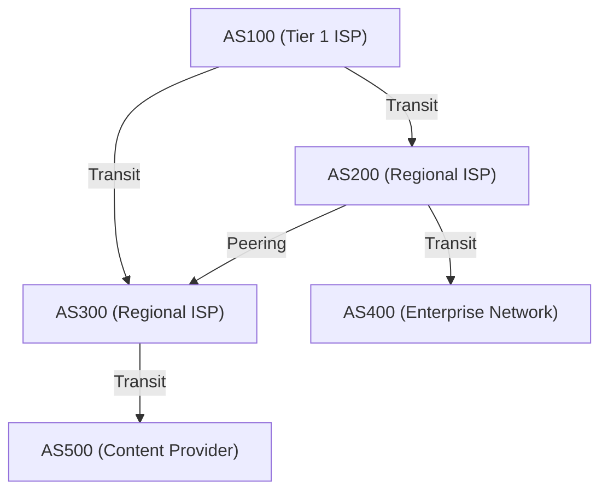

### Peering and Transit: The Economics of the Internet

In BGP inter-AS connections, there are broadly two business models.

1. **Transit**
   A relationship where small ISPs or enterprises pay communication fees to a massive ISP to be provided reachability to all locations on the internet (full route). This corresponds to a master-servant relationship of "customer" and "provider".
2. **Peering**
   A relationship where ISPs, or ISPs and content providers (like Google or Netflix), directly connect their networks to each other via IX (Internet Exchange) and the like. This is usually done free of charge (settlement-free), with the aim of creating traffic shortcuts and reducing costs.

### Path Vector and BGP's Path Selection Algorithm

BGP is a "path vector" protocol. It retains as an attribute which ASes were traversed (AS_PATH) to reach a specific IP network. For example, if the route information says `AS_PATH: [200, 100, 500]`, the packet will pass through the ASes in that order. This reliably prevents routing loops.

When a BGP router receives multiple routes for the same destination, it selects only one best path based on complex priorities (Local Preference, AS_PATH length, MED, distinction between eBGP/iBGP, etc.). The **Local Preference** attribute is particularly powerful, allowing business policies to be forced onto the router, such as "Even if it's technically a detour, routing through the peering line avoids transit costs, so prioritize that."

### BGP Hijacking and Route Vulnerabilities

BGP was originally designed based on a "belief in inherent goodness". Because it believes that "route information declared by others is correct", if a malicious or misconfigured AS sends an erroneous BGP update stating "I have the optimal path to Google's network (8.8.8.8/32)", traffic from all over the world gets sucked into that AS, causing a **BGP Hijacking**.
Historically, large-scale outages exploiting BGP vulnerabilities are too numerous to mention, such as the 2008 incident where YouTube went down globally in the aftermath of the Pakistani government blocking YouTube. Currently, the implementation of route information verification mechanisms using cryptographic technologies, such as RPKI (Resource Public Key Infrastructure), is underway.

## 3.6 Physical Constraints and the Battle of Routers: Latency and Bufferbloat

Routing in the network layer is a constant battle against the constraints of physics.
The speed at which light travels through an optical fiber is about 67% of the speed of light in a vacuum (approximately 200,000 km/s), making a physical delay (propagation delay) of about 100 to 120 milliseconds inevitable for a round trip (RTT) from Japan to the West Coast of the United States.

In addition to this, there is processing delay at each router, and **queuing delay**. During network congestion, routers temporarily accumulate packets in memory (buffers). Because modern routers are equipped with large-capacity memory, a phenomenon occurs where they continue to absorb prolonged congestion without dropping packets. This is **Bufferbloat**. Because a massive amount of packets remains stagnant in the buffer, congestion control at upper layers like TCP does not function normally, resulting in extreme delays (thousands of milliseconds). To solve this, advanced queue management algorithms such as AQM (Active Queue Management) and FQ-CoDel are implemented in modern routers and OSes.

## Conclusion

Layer 3, the Network Layer, is not merely a data carrier. Intertwined within it are the historical transition from IPv4 to IPv6, nanosecond hardware processing using TCAM, mathematical shortest path search via OSPF, and autonomous decentralized routing control laden with economic and political intentions via BGP.
Before a single IP packet reaches a server on the other side of the globe from your smartphone, countless routers instantly reference their own maps (routing tables) and continue passing the packet like a relay baton—this is the operation of the most massive and complex system humanity has ever built.

In the next chapter, we will explain the mechanics of the "Transport Layer (TCP/UDP)," which is built on top of this network layer and is responsible for guaranteeing packet delivery and controlling congestion.


# 第4章：传输层的确定性与速度 —— 支撑信息传递的终极困境

## 1. 导论：端到端原则与传输层的使命

我们在前面的章节中看到的网络层（IP）的主要任务，是跨越广阔的互联网这一网络海洋，将数据包物理且逻辑地送达到“目标计算机（主机的网络接口）”。但是，数据包仅仅到达目标主机，通信并没有结束。现代计算机系统在OS（操作系统）上通过多任务同时并行执行着大量的应用程序进程（Web浏览器、邮件客户端、视频流应用、后台同步进程、API服务等）。

从IP层无序且不断涌现的数据包山中，识别出哪个数据包属于哪个应用程序，将其重构为有意义的数据流，并在有缺失时进行填补。在端点全权负责这种最终数据管理的，正是“传输层（Transport Layer）”。

互联网设计思想的根基中，存在着一个非常优美且强大的架构决策，即“端到端原则（End-to-End Principle）”。这是由Jerome Saltzer等人在1981年提出的概念，其主张“网络的中间节点（路由器或交换机）应尽可能专注于简单的包转发（哑网络），而错误恢复、顺序控制、加密等复杂处理，应交由通信末端的主机（智能端点）来完成”。如果让网络的中间设备具备复杂的状态管理和错误纠正功能，互联网绝对无法获得如今这种全球规模的爆炸性扩展能力。

传输层始终在物理学限制和信息理论的夹缝中面临着一个根本性的困境。那就是“确定性（Reliability）”与“速度（Speed / Low Latency）”之间的权衡。为了不丢失任何信息地进行传递，需要确认和重传的开销，这会引发伴随光速这一物理极限的延迟。另一方面，如果试图将延迟降至最低，就不得不牺牲一部分信息的完整性。根据如何解决这一植根于物理定律的困境，以及为应用程序提供何种抽象，设计并演化出了TCP、UDP以及现代的QUIC等不同的协议。

## 2. TCP（Transmission Control Protocol）：担保确定性的坚固机制

TCP的基础是在互联网还被称为ARPANET的商业化之前的20世纪70年代，由Vinton Cerf和Robert Kahn奠定的。其设计哲学极其明确。即“无论在多么恶劣的网络环境下，即使是在频繁发生丢包的不稳定线路上，也要保证数据毫无缺失、以正确的顺序、且不重复地送达到对方的应用程序中”。只要应用程序开发者使用TCP，就完全无需在意背后的网络复杂性或包的丢失，只需将其作为“连续的字节流（Byte Stream）”来读写数据即可，这提供了一种强大的抽象。

### 通过端口号实现多路复用（Multiplexing）
如果说IP地址是表示“地球上的哪栋建筑”的地址，那么传输层的“端口号”就相当于表示“寄往那栋建筑里的哪个房间（哪个进程）”的逻辑窗口。端口号用16位无符号整数表示，取值范围从0到65535。
借此，在单一的IP地址和单一的物理网络接口上，数千至数万个不同的通信就可以同时被多路复用（Multiplex）。例如，HTTP是80号，HTTPS是443号，SSH是22号，主要服务都被预先分配了作为“知名端口（Well-Known Ports）”的编号。

### 三次握手：信任的建立与物理延迟
在开始通信之前，TCP必然会在发送端和接收端之间进行确立逻辑“连接（Connection）”的仪式。这就是“三次握手（3-Way Handshake）”。这不仅是进行通信意愿的确认，对于即将开始的庞大数据的交互而言，还具有状态空间的同步（Synchronization）这一极为重要的意义。


1. **SYN (Synchronize):** 客户端向服务端发送同步请求包（设置了SYN标志的TCP段）。此时，会提示随机生成的32位“初始序列号（ISN: Initial Sequence Number，此处设为X）”。ISN不从零或固定值开始是有原因的。一是为了防止将过去已确立并已断开的、相同IP和端口间通信中“在网络上迷路而延迟到达的旧数据包（幽灵包）”误认为新通信的包，二是具有防止攻击者猜测序列号并插入伪造数据的TCP序列预测攻击（IP欺骗）的密码学意义。
2. **SYN-ACK:** 服务端接受连接请求后，将客户端的ISN加1的值（X+1）作为“确认应答号（Acknowledgment Number）”返回，同时返回附加了服务端自身随机初始序列号（Y）的SYN-ACK包。
3. **ACK (Acknowledgment):** 客户端为了证明已正确接收到服务端的ISN，发送以Y+1作为确认应答号的ACK包。

在这3次包交互完成的瞬间，双向的通信状态就在内存中被确保，数据传输的准备就绪。但是，这个严密的过程承受着通信基础设施物理极限的重压。那就是“光速”。
真空中的光速约为每秒30万公里，但受限于互联网主要骨干网——光纤纤芯（石英玻璃）的折射率，光信号的传播速度会降至其三分之二左右（约每秒20万公里）。此外，还要加上途中路由器中的路由处理和交换带来的排队延迟。结果，例如在东京和纽约之间（直线距离约11,000公里，实际电缆长度更长），往返一次的时间（1 RTT: Round Trip Time）在物理上无论如何都需要150到200毫秒。由于TCP的三次握手至少会消耗这1 RTT，因此无论将带宽增加到多宽，建立连接时的延迟（Latency）都受到光速这一宇宙绝对法则的制约。

### 滑动窗口与顺序控制、校验和
进入数据传输阶段后，TCP会将从应用程序接收到的字节流分割成适当大小（MSS: Maximum Segment Size，通常是IP的MTU减去头部大小后的1460字节左右）的段进行发送。每个段都会被分配与数据字节数相对应的序列号，接收端即使遇到数据包顺序颠倒到达（乱序）的情况，也会基于此将原始数据重新排列成正确的顺序。

此外，TCP头部中包含16位的“校验和（Checksum）”，使用反码求和运算严格验证数据在传输路径上是否因电噪声或路由器的内存错误等发生了位翻转（损坏）。

如果在途中数据包缺失（丢包）或因损坏而被丢弃，接收端将持续返回期望的序列号的ACK（重复ACK），或者什么都不返回。发送端在一定时间（RTO: Retransmission Timeout）内未收到ACK返回，或者检测到重复ACK时，就会对该数据包进行“重传（Retransmit）”。

在这个机制中使通信速度大幅提升的是“滑动窗口（Sliding Window）”概念。在“发送1个包，直到收到其ACK才发送下一个包（停等协议，Stop-and-Wait）”的方式下，在前述的高延迟环境（RTT较大的环境）中吞吐量会绝望地下降。
在滑动窗口方式下，发送端和接收端会考虑彼此的缓冲区容量，动态协商“窗口大小（一次可发送的未确认数据的最大字节数）”。发送端无需等待来自接收端的ACK，就可以在这个窗口大小的范围内不断将数据包连续发送到网络中。然后每收到一个ACK，这个可发送配额（窗口）就会向前滑动。通过这种方式，在宽带且高延迟网络（BDP: Bandwidth-Delay Product，带宽延迟积大的环境）中实现了“让管道始终充满数据”的带宽最大化利用机制。

### 拥塞控制（Congestion Control）：防止网络崩溃的数学调和
可以说是TCP真正的杰作，也是互联网历史上最重要的技术突破之一的，就是“拥塞控制（Congestion Control）”。

1986年，早期的互联网（NSFNET）因通信量的增加而面临了被称为“拥塞崩溃（Congestion Collapse）”的致命系统故障。超出网络处理能力的数据涌入的结果是，路由器的队列（缓冲内存）溢出，大量数据包被丢弃。检测到丢包的TCP端点判断数据未送达，从而一齐进行数据包的“重传”。这导致更多的数据被注入网络，路由器更加不堪重负，有效吞吐量骤降至原先的数千分之一，陷入了毁灭性的恶性循环。

为了防止这种网络的死亡，1988年Van Jacobson等人为TCP引入了高度的动态控制算法。其核心是基于“AIMD（Additive Increase Multiplicative Decrease：和式增加，乘式减少）”原则对拥塞窗口（cwnd: Congestion Window）的控制。

1. **慢启动 (Slow Start):** 通信刚开始时，网络的空闲容量完全未知。因此，从极小的值（历史上是1 MSS，现代是10 MSS左右）开始发送窗口大小，每收到1个ACK就将窗口大小增加1 MSS。其结果带来了“每1 RTT窗口大小翻倍”的指数级增长。与“慢”这个名字相反，这是一个极具攻击性且在短时间内探索极限带宽的阶段。
2. **拥塞避免 (Congestion Avoidance):** 当窗口大小达到预先设定的阈值（ssthresh: Slow Start Threshold）时，停止指数级增长，切换为线性增长（每1 RTT增加1 MSS）。这是一个更加谨慎地探索网络极限容量（管道粗细）的阶段。
3. **丢包检测与乘式减少:** TCP将丢包（发生超时，或连续3次收到来自接收端的重复ACK）不仅仅解释为传输错误，而是视为“在网络路径上发生拥堵（拥塞），数据包从路由器缓冲区溢出掉落的信号”。在这一瞬间，TCP立即发挥自我控制，将发送窗口大小一下子激减至一半（或慢启动的初始值）。

通过这种“一点点地分享带宽（和式增加），一旦发生问题就大幅让步（乘式减少）”的数学化且利他主义的分布式算法，使得互联网上数以亿计、十亿计的独立TCP连接，在不存在中央集权的流量管理者的情况下，依然保持着“带宽的公平分配”与“整个网络稳定运行”的奇迹般的调和（稳态）。

近年来，由于路由器缓冲内存的大容量化适得其反，在因拥塞导致数据包丢弃发生之前，数据包持续滞留在变长的队列中，导致延迟（Ping值）飙升至数百毫秒到数秒的“缓冲膨胀（Bufferbloat）”作为新的物理现象成为了一个问题。为了应对这个问题，Google等人开发了不是将丢包而是将“RTT（延迟时间）的增加”检测为拥塞信号，在缓冲区溢出前主动限制发送速度的BBR（Bottleneck Bandwidth and Round-trip propagation time）等最新拥塞控制算法，这正在成为现代TCP的标准。

## 3. UDP（User Datagram Protocol）：为了速度而削减

如果说TCP是通过复杂的状态转移和高级的算法来保证数据完全确定性的“过度保护的管理者”，那么属于同一传输层的UDP，则是将作为协议的作用削减到极限的“极简主义的搬运工”。由Jon Postel于1980年设计的UDP，只具备作为传输层的最低限度的功能。

UDP的头部只有区区8字节（TCP头部通常为20字节，包含选项的话最大可达60字节）。其中包含的，仅仅是“源端口号”、“目标端口号”、“数据长度”以及用于检测数据损坏的简易“校验和”。

通过三次握手建立事前连接、通过序列号保证顺序、通过滑动窗口进行流量控制、重传处理、为了保护网络而进行的拥塞控制，在UDP中一概没有实现。它只是将从应用程序传递来的数据原封不动地包裹在IP数据报中，投入网络层，并以“发射后不管（Fire and Forget）”的方式发送而已。它甚至不关心是否送达到了对方。

但是，这种甚至可以说是不负责任的结构上的简单性，正是UDP最大的武器，也是它在特定用例中凌驾于TCP之上的原因。

### UDP的真谛：延迟至上主义与实时通信
在需要将物理延迟（Latency）削减到极限的实时通信中，TCP“为了保证确定性而进行的重传控制”反而会引发致命的问题。

例如，请想象一下FPS（第一人称射击）等在线游戏、语音通话（VoIP）、或者视频会议系统（Zoom、WebRTC等）。在这些应用程序中，会以每秒数十次到数百次的频率发送最新的位置信息或音频样本的数据包。
如果使用TCP，假设100毫秒前发送的音频数据包在途中的路由器中丢失。TCP会检测到该丢失并重传数据包，尝试在接收端以正确的顺序播放。但是，在对话或游戏实时进行的环境中，“延迟数百毫秒送达的过去的数据”已经不再有任何价值。
不仅如此，TCP在丢失的数据包被重传且顺序对齐之前，会停止处理（传递给应用程序）已经到达的后续新数据包并进行缓冲。这被称为“队头阻塞（Head-of-Line (HoL) Blocking）”。声音断断续续，或者游戏画面卡顿数秒后一下子快进的现象，很多都是由这种TCP等待重传导致的队头阻塞引起的。

在这种情况下，UDP可以果断放弃丢失的过去的数据包，让此时到达的最新的数据包立即在应用程序中被处理。在实时通信中，比起“凑齐所有数据”，“即使有少许噪音或掉帧，也要始终以最短延迟持续描绘最新状态”对人类的感官来说是更加自然舒适的用户体验。

此外，像DNS（Domain Name System）的名字解析或通过NTP（Network Time Protocol）进行的时间同步这样，对“一个小的请求包”通过“一个响应包”即可完成的简单的事务通信，完全没有握手开销的UDP也是最合适的。

## 4. QUIC：互联网通信的范式转换与下一代协议

从互联网的黎明期开始的几十年间，我们的网络架构一直受困于“如果想要可靠的流传输就用TCP，如果想要速度和实时性就用UDP”这一固化的二元论。然而，在现代Web的剧烈演进（特别是移动通信的普及，以及并行加载大量资源的HTTP/2时代）中，TCP根本上的设计本身成为桎梏的局限性开始暴露出来。

其最大的课题，就是我们在UDP一节中也提到过的TCP特有的“队头阻塞（HoL Blocking）”，以及伴随连接确立而产生的“过度的延迟”。
TCP将所有通信作为“单一的串行字节流”来管理。为了显示最新的Web网站，假设在HTTP/2上同时（多路复用地）请求了HTML、CSS、JavaScript、几十张图片等多个文件。但是，在底层的TCP层面上这是一条流，如果假设只有“图片A”的包丢失了1个，TCP层在完成该包的重传之前，甚至会在OS内核层面上阻塞本应毫无关系的“脚本B”或“图片C”的包的传递。
此外，现代Web必须使用加密（TLS/HTTPS），但在传统的协议栈中，在完成“TCP的三次握手（1 RTT）”之后，又要重新进行“TLS加密密钥交换的握手（1到2 RTT）”，因此在实际开始安全的数据发送之前，会消耗2到3 RTT的巨大物理延迟。

为了解决这些根本问题，并为现代互联网基础设施带来范式转换，由Google主导开发，并由IETF（Internet Engineering Task Force）标准化的下一代传输层协议就是“QUIC（Quick UDP Internet Connections）”。而且，以这个QUIC作为基础协议被重新定义的Web标准，就是“HTTP/3”。

### 中间盒子的僵化与逃向用户空间
QUIC最具突破性的方案在于，**“在现有的UDP数据包之上，在用户空间内重建了一个融入了加密和多路复用的全新传输层”**这一大胆的架构设计。

为什么不改良TCP，而是建立在UDP之上呢？互联网上无数的路由器、防火墙、NAT（网络地址转换，Network Address Translation）等“中间盒子（Middlebox）”，经过长年的运行，已经僵化到将除TCP和UDP以外的新协议（新协议号）视为“未知的威胁”而不问青红皂白地丢弃（这被称为互联网的Ossification：骨化现象）。另外，TCP的实现被硬编码在Windows或Linux等OS内核（中枢）的深处，因此为了普及新算法而更新全世界的OS将花费漫长的岁月。
因此QUIC采取了一种策略：在对中间盒子表现为单纯的“传统的UDP数据包”并使其通过的同时，在浏览器或应用程序（用户空间）的内部，独自实现了一种将TCP的优秀部分（拥塞控制和重传控制）进行了更高度演进的状态。

### QUIC的革新机制与超越物理限制

1. **通过流的独立性彻底消除HoL阻塞：**
   QUIC不是数据包的单一流，而是具备在协议层面上管理多个逻辑上“独立的流”的功能。就前面的例子来说，即使图片A的包在途中丢失，QUIC也只会将图片A的流作为等待重传而暂停，脚本B或图片C的流则完全不受影响地并行继续处理。由此，在丢包频发的移动网络等环境中，Web页面的显示速度将大幅提升。
2. **0-RTT（零RTT）连接确立与加密的融合：**
   QUIC从一开始就在协议中深度整合了相当于TLS 1.3的加密。它不会犯像TCP那样将“传输层连接”和“加密连接”分开的愚蠢错误。即使是第一次通信的服务器对象，也只需1 RTT就能完成连接和加密密钥的交换。更具突破性的是，如果是过去曾通信过的服务器对象（持有缓存的会话票据的服务器），就能实现“0-RTT”，即**无需等待握手，在发送第一个数据包的同时就可以开始HTTP请求**。这是从协议设计的角度对“光速导致的延迟”这一物理限制做出的极为精彩的回答。
3. **连接迁移（Connection Migration，不依赖于IP地址）：**
   传统的TCP连接受到“源IP、源端口、目标IP、目标端口”4个要素（四元组）的强烈绑定。因此，当用户带着智能手机外出，离开Wi-Fi环境切换到4G/5G的蜂窝网络，IP地址发生变化的瞬间，TCP连接就会断开，必须从耗时的握手重新开始。
   另一方面，QUIC并不通过IP地址，而是通过通信开始时生成的固有的“连接ID（Connection ID）”来管理每个连接。因此，即使物理IP地址或网络接口发生动态变化，只要连接ID相同，就可以毫不中断地无缝继续视频流的播放或大容量文件的下载。在移动通信成为主角的现代，这可以说是一个极其强大且必然的特性。

## 5. 结语：统御混沌的协议演进与秩序的构建

传输层在总是变动、路径切换、丢包和乱序如家常便饭的互联网网络层（IP）的混沌（Chaos）之上，建立起了应用程序可以安心使用的“坚固的逻辑秩序”。

由Vinton Cerf和Van Jacobson等人设计并打磨的TCP坚固的数学模型和拥塞控制，至今仍在保护互联网的骨干网免于崩溃，并持续支撑着全世界的数据传输。然后是为了响应追求物理延迟极限的实时通信的需求而出现的UDP的简单性。进而，为了克服这两者的局限性，融合了加密和多路复用，优化于现代移动环境而诞生的QUIC协议的精巧架构。

这一切，都是“在相隔遥远的计算机之间，在有限的带宽和光速之壁的物理限制下，如何准确且快速地送达信息”这一人类不断的科技探索的结晶。

当数据包以正确的顺序被重新排列，终于作为有意义的数据块被交付给应用程序时，单纯的电信号罗列终于开始拥有作为“信息”的价值。在下一章，我们将逼近建立在这个传输层提供的坚固基础之上、直接塑造我们日常接触的Web世界的“应用层（HTTP、DNS等）”机制的深渊。


# 第5章：应用层与Web的幕后 —— 从域名解析到加密通信的深渊

在之前的章节中，我们从光纤内全反射前进的光子以及铜线内传播的电磁波等物理层的行为开始，深入探讨了基于IP的数据包路由，以及基于TCP/UDP在传输层中数据传输的可靠性。在本章中，我们将终于踏入人类直接接触的领域，即“应用层”。

OSI参考模型中的第7层（应用层）、第6层（表示层）、第5层（会话层），在现代TCP/IP分层模型中，通常被统称为单一的“应用层”。应用层位于抽象化的最顶端，是由多种协议交织而成的复杂生态系统。在这里，我们将从历史背景、网络工程以及高级数学的视角，对在浏览器地址栏输入URL直到网页显示这一过程背后活跃的机制进行极其深入的剖析：包括DNS域名解析、HTTP资源传输，以及现代互联网不可或缺的SSL/TLS加密机制。

## 5.1 DNS（Domain Name System）：分布式分层数据库的奇迹与系谱

IP地址（IPv4中的32位数字，IPv6中的128位数字）对于路由器和交换机等网络设备构建用于数据包转发的路由表来说是最理想的，但却完全不适合人类直观地记忆、赋予意义并进行处理。

在互联网起源ARPANET的黎明期，主机名与网络地址的映射关系是通过一种极其原始的方法进行管理的。斯坦福研究院（SRI）的网络信息中心（NIC）以集中式的方式管理着一个名为 `HOSTS.TXT` 的单一文本文件，各个节点在夜间通过FTP下载该文件以更新自身的本地系统。然而，进入20世纪80年代后，随着连接到网络的主机数量开始呈指数级爆炸性增长，这种集中式模型暴露出了致命的局限性：流量瓶颈、更新延迟，以及命名冲突（命名空间枯竭）。

为了打破这一可扩展性危机，保罗·莫卡佩特里斯（Paul Mockapetris）于1983年设计并提出了DNS（Domain Name System），并被定义在RFC 882和RFC 883中。DNS架构的本质，是一个全球规模的分布式分层键值存储（Key-Value Store）。该系统为了消除单点故障并实现近乎无限的可扩展性，采用了一种具有划时代意义的分布式范式：将域名空间划分为树状结构，并将各自的管理权限进行委派（Delegation）。

### 域名解析的无尽旅程：从存根解析器到权威服务器

当用户在浏览器的地址栏中输入 `https://www.example.com` 的瞬间，OS内部的存根解析器（Stub Resolver）便会启动，在后台拉开了一场宏大的“域名解析之旅”的帷幕。这一过程也是如何规避网络延迟这一物理定律限制的连续缓存策略的体现。

1. **多级缓存查询**: 首先，会检查延迟最低的本地浏览器缓存。接着查询OS的DNS缓存，进一步还会查询本地网络上路由器的DNS缓存。克服光速（在真空中约为每秒30万公里，在光纤中约为其三分之二）这一物理限制的最有效手段，就是从根本上不产生网络通信。
2. **向递归解析器（完整解析器）发送查询**: 如果本地不存在缓存，查询将被发送至ISP或公共DNS提供商（如Google的 `8.8.8.8` 或Cloudflare的 `1.1.1.1` 等）运营的递归解析器（Recursive Resolver / Full Resolver）。该解析器将代替客户端承担域名解析的整个过程。
3. **向根服务器（Root Server）进行迭代查询**: 如果完整解析器的缓存中也没有相应的记录，完整解析器将向处于域名分层绝对顶点的“根服务器”发起查询。目前世界上存在从A到M的13个根服务器集群。根服务器并不直接知道 `www.example.com` 的IP地址，而是返回一个管理 `.com` 这一顶级域名（TLD, Top Level Domain）的名称服务器列表（Referral：委派响应）。此外，散布在世界各地的根服务器通过“任播（Anycast）”路由技术共享IP地址，并通过BGP（Border Gateway Protocol）的路径选择，将流量自主引导至在物理和网络拓扑上距离客户端最近的服务器。
4. **向TLD服务器进行迭代查询**: 接下来，完整解析器会向被引荐的 `.com` TLD服务器群中的一个发送查询。TLD服务器会返回被委派了 `example.com` 管理权限的权威（Authoritative）DNS服务器（名称服务器）的IP地址（NS记录）。
5. **向权威DNS服务器查询并获取记录**: 最后，完整解析器将直接访问 `example.com` 的权威DNS服务器。权威服务器的区域文件（Zone File）中记录了作为最终答案的 `www` 的A记录（IPv4地址）或AAAA记录（IPv6地址），抑或是CNAME记录（别名），这些记录将通过完整解析器返回给客户端的存根解析器。


这种复杂的分层往返通信，通常在仅仅几毫秒到几十毫秒的转瞬之间就能完成。DNS作为传输层协议，主要使用UDP的53号端口。通过完全消除TCP三次握手（SYN, SYN-ACK, ACK）的往返开销，实现了极致的延迟降低。然而，当DNS的响应有效载荷超过历史性的UDP限制即512字节（得益于EDNS0扩展，现在支持更大的容量）时，或者在进行旨在防止DNS缓存投毒攻击的密码学数字签名扩展即DNSSEC（DNS Security Extensions）的密钥验证时，亦或是进行区域传送（AXFR）时，都规定了向更可靠的TCP 53号端口的回退机制。

## 5.2 HTTP架构与协议的进化论

通过DNS获取到目标服务器IP地址的浏览器，接下来会与目标服务器（80号或443号端口）建立TCP连接，并开始使用应用层的主要语言——HTTP（HyperText Transfer Protocol）进行对话。

1989年，由欧洲核子研究组织（CERN）的蒂姆·伯纳斯-李（Tim Berners-Lee）构想的HTTP，原本是为了让全世界的物理学家们能够跨越网络高效地共享研究文档（超文本），并通过链接将其串联起来而设计的一种极其简化的协议。由请求行（方法、URI、协议版本）、首部字段、空行（CRLF）以及消息体构成的基于文本的明晰结构，强有力地推动了系统的调试与普及。

HTTP根本的设计思想以及最大的特征在于它的“无状态（Stateless）”。服务器完全不会在内存中保留客户端过去请求的状态或上下文。每个请求都作为完全独立的事务来完成。这种与REST（Representational State Transfer）架构相通的无状态性，极大地简化了服务器的实现，也使得为了处理庞大流量而在水平方向上增加服务器数量的横向扩展（负载均衡）变得容易。无论负载均衡器将请求分配给哪个后端服务器，都能保证得到相同的结果。然而，在诸如电商网站的购物车功能或用户登录状态的维持等不可避免地需要管理状态（State）的现代交互式Web应用中，这种严格的无状态性成为了一大限制。为了在协议之外克服这一问题，人们发明了通过HTTP首部让客户端保存状态的Cookie，以及基于会话令牌的拟态状态管理机制。

### 与物理限制的抗争：从HTTP/1.1到HTTP/3的范式转变

随着Web的爆炸性普及，以及单一页面中所包含资源（图像、CSS、JavaScript文件等）的不断庞大化，HTTP直面了网络物理定律（光速带来的延迟限制与数据包丢失），并在协议层面经历了架构的剧烈进化。

- **HTTP/1.1 (1997年 - )**: 在最初的HTTP/1.0中，每请求一个资源就要重复建立和断开一次TCP连接（三次握手和四次挥手），从延迟的角度来看效率极低。HTTP/1.1则标准化了持久连接（Persistent Connection, Keep-Alive），使得单一的TCP连接能够被复用，从而大幅削减了连接成本。然而，HTTP/1.1的管线化（Pipelining）技术由于实现的困难以及中间代理的兼容性问题并未普及，并且存在名为“队头阻塞（Head-of-Line, HoL Blocking）”的致命结构缺陷。这是指在单一TCP连接上，当服务器正在处理一个庞大资源或计算繁重的请求时，后续的请求会堵塞在队列中，导致整体延迟恶化的现象。为了避免这种情况，浏览器不得不依赖于对同一域名同时建立多个TCP连接（通常为6个左右）这种强硬的解决手段（如域名分片等）。
- **HTTP/2 (2015年 - )**: 基于Google开发的SPDY协议而标准化的HTTP/2，将协议从基于文本转变为“基于二进制分帧（Binary Framing）”，从根本上刷新了架构。最重要的创新是“多路复用（Multiplexing）”。在HTTP/2中，可以在单一的TCP连接内部创建多个虚拟的“流（Stream）”，将请求和响应的数据分割成微小的二进制帧，并能不计顺序地进行交织（Interleave）发送。由此，应用层面的HoL阻塞被彻底消除。此外，通过使用HPACK算法的首部压缩机制（静态哈夫曼编码与动态表相结合），大幅削减了在每个请求中重复发送的冗余Cookie或User-Agent等数据的传输量，将网络带宽的利用效率提升到了极致。
- **HTTP/3 (2022年 - )**: HTTP/2出色地解决了应用层的HoL阻塞，但其底层的传输层（TCP）中“数据包丢失时的HoL阻塞”这一物理壁垒依然存在。TCP为了保证可靠性，一旦中途丢失哪怕一个数据包，就会在重传完成之前，停止将该TCP连接上所有流的数据包交付给应用层（这是TCP顺序保证机制带来的弊端）。为了打破这一问题，HTTP/3抛弃了作为数十年互联网基础的TCP，采用了基于UDP的全新传输协议“QUIC（Quick UDP Internet Connections）”，实现了剧烈的范式转变。QUIC避开了TCP由于在OS内核空间实现而导致的演进迟缓问题，在可在用户空间实现的UDP上层，融入了独有的重传控制、拥塞控制，以及针对每个流独立的流量控制。即使发生数据包丢失，受到影响的也仅是该特定的流，其他流能够不受阻塞地继续处理。此外，QUIC将建立连接的握手与加密（TLS 1.3）的握手相整合，使得对于过去有过通信记录的服务器，能够以“0-RTT（Zero Round Trip Time）”直接开始发送加密数据。这是面对物理上的光速极限（与地球另一端的通信无论如何都会产生数百毫秒的延迟），通过在协议层彻底削减通信往返次数（RTT）以追求极致性能的结果结晶。

## 5.3 加密与信任机制：SSL/TLS的数学深渊与证明逻辑

互联网本质上是一个开放的分组通信网络，数据要经过无数的路由器和海底的光纤电缆，以接力传递的方式被转发至目的地。在这一路径上的任何一个节点（中间路由器、恶意的ISP，或者同一Wi-Fi网络上的窃听者），在物理上都有可能通过抓包来拦截甚至篡改通信内容。利用高等数学的力量来封锁这种网络绝对的脆弱性，并建立安全的通信通道，正是SSL（Secure Sockets Layer）及其后继者TLS（Transport Layer Security）协议的使命。

TLS在现代Web通信中所保证的，是以下“安全的三大支柱”。
1. **机密性（Confidentiality）**: 即使通信内容被第三方窃听也无法被解密。
2. **完整性（Integrity）**: 数据在通信路径上哪怕只有1个比特都没有被篡改。这由MAC（Message Authentication Code）或AEAD（Authenticated Encryption with Associated Data）来担保。
3. **身份验证（Authentication）**: 通信对方是合法域名的所有者（真实的服务器）。

实现这些目标的技术，是人类几个世纪以来不断积累，尤其是二战后随着计算机科学和数论的发展而实现飞跃的密码学理论的结晶。

### 密钥交换与公开密钥加密：离散对数问题与素数分解的壁垒

最简单且处理速度最快的加密方式是“对称密钥加密（Symmetric Cryptography）”（目前的标准是AES：Advanced Encryption Standard）。这是一种发送者和接收者使用相同的“对称密钥”进行加密和解密的方法。由于数学处理很轻量（比特的XOR运算以及替换、置换的组合），因此非常适合对千兆级通信进行实时加密。然而，对称密钥加密存在着一个根本性的悖论（密钥分发问题），即“在开始通信之前，如何将这个秘密的对称密钥本身安全地交给对方”。在像互联网这样毫无预先信任关系的对方进行通信时，如果直接发送对称密钥，密钥就会在中途被窃听，使得加密毫无意义。

成为人类历史上密码学最大突破的，是1976年惠特菲尔德·迪菲（Whitfield Diffie）与马丁·赫尔曼（Martin Hellman）发表的密钥交换算法，以及1977年由RSA（李维斯特、萨莫尔、阿德曼）等人发明的“公开密钥加密（非对称加密，Asymmetric Cryptography）”。

公开密钥加密的底层，存在着数学上的“单向函数（One-way function）”或“陷门单向函数（Trapdoor one-way function）”的概念。这利用了这样一种不对称性：“某一方向（加密）的计算计算机能够瞬间完成，但逆向（解密或推测密钥）的计算，哪怕把全世界的超级计算机连接起来，计算宇宙的寿命那么长的时间也无法完成”。

- **RSA加密**: 基于这样一个性质：将两个非常大的素数（$p$和$q$）相乘得到一个巨大的合数（$N = p \times q$）很容易（可以在多项式时间内计算出），但如果仅仅给出那个巨大的合数 $N$，要推导出原本的素因子 $p$ 和 $q$（整数分解问题）却极其困难（目前只知道亚指数时间算法）。它利用欧拉函数和费马小定理等数论的深邃性质，构建了一个数学陷门，使得用公钥加密的数据，只能由拥有相对应私钥的人才能解密。
- **椭圆曲线密码学（ECC: Elliptic Curve Cryptography）**: 作为目前TLS中主流的ECC，应用了定义在有限域上椭圆曲线（例如，满足 $y^2 = x^3 + ax + b$ 这样方程式的点集）中的“离散对数问题”的困难性。对椭圆曲线上的点定义了“加法”或“标量乘法”这样的几何操作。将某个起点 $G$ 相加秘密次数 $k$ 次得到点 $P = kG$ 是很容易的，但从公开的点 $G$ 和 $P$ 反向推算出到底相加了多少次的秘密系数 $k$（离散对数），则比RSA的素数分解还要困难。正因如此，ECC以RSA几分之一的极短密钥长度（例如用ECC 256bit就能实现与RSA 2048bit同等的安全性）实现了同等甚至更高的加密强度，大幅节省了CPU负载和网络带宽。

### TLS握手：为了构建信任的密码学仪式

在开始基于HTTPS的安全通信时，客户端与服务器会生成用于对称加密的安全“会话密钥”，并且执行用于验证对方身份的高级协商协议。这就是TLS握手。以下是针对最新标准中摒弃了所有冗余部分的“TLS 1.3”中1-RTT握手的剖析。


1. **ClientHello**: 客户端在开始连接时，向服务器发送自己支持的TLS版本、加密算法列表（Cipher Suites）以及用于生成密钥的初始数学参数（Key Share）。此外，还会使用SNI（Server Name Indication）扩展，以明文形式发送想要连接的主机名（例：`www.example.com`）。对于在单一IP地址上运行多个HTTPS域名的服务器（虚拟主机）而言，这是选择并返回正确证书所不可或缺的信息。
2. **ServerHello**: 服务器从客户端的列表中选择最强大且最合适的加密算法（例：`TLS_AES_256_GCM_SHA384`），并随同自身的Key Share数据一起进行响应。
3. **发送证书与签名（Authentication）**: 服务器发送自身的“数字证书（X.509）”。更进一步，服务器利用与该证书关联的“私钥”，针对至今为止所有握手消息的哈希值创建数字签名（CertificateVerify）并发送。由此，在数学上证明了服务器就是该证书的合法所有者（私钥的持有者）。
4. **密钥交换（Ephemeral Elliptic Curve Diffie-Hellman: ECDHE）**: 客户端与服务器，将在发送与接收中得到的相互的Key Share（公开的椭圆曲线上的点），与各自手头独有的秘密参数在数学上进行相乘。令人惊叹的是，凭借Diffie-Hellman密钥交换的数学性质（$ (g^a)^b = (g^b)^a = g^{ab} $），在网络上完全不传输任何秘密信息的情况下，客户端和服务器端宛如魔法般地合成出完全相同的、坚固的“主密钥（对称密钥）”。
5. **前向保密性（Perfect Forward Secrecy: PFS）**: TLS 1.3一个极其重要的特征是，用于这次密钥交换的参数（Key Share）在每次建立会话时都是一次性新生成的（Ephemeral）。正因如此，万一服务器用于长期身份证明的私钥（RSA或ECDSA密钥）在数年后被攻击者泄露，想要追溯并解密过去被记录、保存下来的加密通信数据包，在数学上也是完全不可能的。这就确保了过去通信的机密性在未来能够得到保障。

### PKI与信任链（Chain of Trust）：数字世界的护照

在到此为止的加密机制中，还遗留了一个致命的逻辑漏洞。那就是：“客户端如何确信，服务器发送过来的证书和公钥，真的属于目标域名（比如银行的网站）并且是真实的？”这个问题。

如果控制着网络路径的恶意中间人，伪装成服务器并将自己伪造的证书和公钥发送给客户端，实施“中间人攻击（Man-in-the-Middle Attack）”的话，密钥交换和加密本身在数学上能够完美成功。然而，被加密的通信对象将不再是目标银行，而是攻击者。

解决这一根源性认证问题的社会与技术框架，就是PKI（Public Key Infrastructure：公开密钥基础设施），以及作为信任锚的“证书颁发机构（CA：Certificate Authority）”的存在。

服务器所有者会创建包含自己公钥的CSR（证书签名请求），并提交给如DigiCert、GlobalSign或Let's Encrypt等值得信赖的第三方机构，也就是CA。CA在验证申请者确实拥有该域名的所有权（如域名验证、企业实体验证等）之后，利用CA自身强大的“私钥”，对服务器的公钥信息实施“数字签名”，并作为服务器证书予以颁发。

另一方面，在诸如Windows或macOS等操作系统，以及Chrome或Firefox等浏览器中，已经预先硬编码并内置了在世界范围内通过严格审计的根CA的“根证书（公钥）”集群，作为信任的基点（Trust Anchor）。

当客户端从服务器收到证书时，会使用OS内置的根CA的公钥，对证书上附加的CA数字签名进行密码学验证。如果签名验证成功，就能证明该证书的记载内容（域名和公钥）得到了CA的保证，并且没有被篡改。

1. 客户端无条件信任根CA（预先安装到信任存储中）。
2. 根CA信任中间CA，并为其签名。
3. 中间CA信任终端实体（Web服务器），并为其签名。

通过这种名为“信任链（Chain of Trust）”的传递关系，我们在与物理上遥远的未知服务器之间，动态且瞬间地构建了坚固的信任关系，从而建立起了安全的加密通信通道。

## 结论：协议层的融合与迈向下一境界

在第5章中，我们在应用层的深渊展开，对域名解析、数据请求与响应的协议，以及将这一切包裹其中的加密数学面纱进行了详细的剖析。

DNS作为互联网广阔的分布式地址簿发挥作用，HTTP确立了其作为资源搬运工的架构，而TLS则用最前沿的密码学理论铠甲为其提供坚固的守护。这些在历史上被设计为相互独立的协议层，但在现代Web中，正如在HTTP/3的QUIC中所看到的那样，传输层与应用层以及加密层之间的边界正在紧密融合，它们打破了物理延迟的极限，正持续向同时追求极致性能与安全性的精简形态演进。

在下一章中，我们将进一步探讨：穿过这层坚固的加密通信到达服务器端的请求，是如何生成动态内容，并与背后的数据库系统进行交互的。我们将围绕“后端系统的内部结构与分布式计算”，继续潜入更深一层的技术深渊。


# 第6章：支撑互联网的物理基础设施——光、热与海洋交织的巨大机制

互联网常常被谈论为一个虚无缥缈的抽象概念——“云（Cloud）”。我们通过智能手机或电脑发送的数据，仿佛通过看不见的电波或线缆，被吸入了“某处天空上”的存储空间，让人产生这样的错觉。然而，互联网的实体并非如云朵般轻盈。它极其厚重、充满物质性，且深受热力学、光学和地球物理学定律的束缚，无外乎是人类历史上最庞大的物理基础设施。

本章中，我们将深入剖析将这个“不可见网络”在物理世界中具象化的三大支柱——作为全球神经网络的“海底光缆”、承担数据存储与计算的热力学处理设施“超大规模数据中心”，以及打破光速壁垒、压缩时空的“CDN（内容分发网络）”。我们将从其物理机制、历史背景以及追求极限的专业技术视角进行彻底解剖。

---

## 1. 环绕地球的光之神经网络：海底光缆系统

目前，超过99%的跨国国际互联网通信，并非通过在太空中飞行的卫星，而是通过铺设在海底、直径仅有几厘米的“海底光缆（Submarine Communications Cable）”来传输的。当我们浏览国外的网站时，那些数据正以光速在水深数千米的漆黑深海中穿梭。

### 1.1 从电报到光纤的演进与对香农极限的挑战

海底线缆的历史远比互联网的诞生要古老，可以追溯到1850年铺设的跨越英吉利海峡的电报线缆。1858年，第一条横跨大西洋的电报线缆铺设完成，但当时使用的是摩尔斯电码通信，维多利亚女王向美国总统布坎南发送一条信息就花费了十几个小时。此后，经历了使用同轴电缆的模拟电话线路时代，自20世纪80年代后期开始引入了光纤线缆。1988年铺设的第一条跨大西洋光通信线缆“TAT-8”的容量为 280 Mbps（相当于约4万条电话线路），这在当时已经是革命性的带宽了。

现代的海底光缆，单根线缆就拥有数百 Tbps（太比特每秒）这种令人难以想象的通信容量。使这种飞跃性进化成为可能的，是“波分复用（WDM: Wavelength Division Multiplexing）”和“掺铒光纤放大器（EDFA: Erbium-Doped Fiber Amplifier）”这两项诺贝尔奖级别的物理学与工程学突破。

WDM 是一种在单根光纤中将不同波长（颜色）的光进行复用并同时发送的技术。借此，每根光纤的传输容量将以波长的数量呈乘数级增长。然而，无论作为光纤材料的石英玻璃纯度被提高到何种极限，在行进数百公里后，由于瑞利散射和红外吸收，光信号仍会衰减。因此，就需要每隔几十公里到一百公里设置一个中继器（Repeater）。

过去的中继器会进行一种复杂且受限的物理过程（O-E-O转换），即将衰减的光信号先转换为电信号，放大后再转换回光信号。然而，20世纪90年代实现商用的 EDFA，通过在光纤的纤芯中掺入稀土元素铒，并向其照射被称为泵浦光的强激光，使得光信号能够直接“以光的形式”被放大。这使得一次性放大多个不同波长的光信号成为可能，与 WDM 技术相结合后，通信容量迎来了爆炸性的增长。

当前，在通信工程领域，我们正在逼近克劳德·香农提出的信道容量理论极限，即“香农极限（Shannon Limit）”。为了突破这一限制，让单根光纤内拥有多个纤芯的“多芯光纤（Multicore Fiber）”以及复用光空间模式的“空分复用（SDM: Space Division Multiplexing）”等下一代物理层技术已经开始被研究和部署。

### 1.2 深海的物理环境与光缆铺设工程学

海底光缆的铺设是现代最严酷的工程之一。长达数千公里的线缆需要使用专门的“铺缆船（Cable layer）”沉入海底。

在铺设之前，会使用回声测深仪精确绘制海底地形图，并避开有海底山脉、海沟、热液矿床或滑坡危险的海域，从而选定最佳路线。线缆的结构会因铺设水深的不同而发生巨大变化。

在大陆架等水深较浅的海域（水深约 1000～1500 米以内），渔船的底拖网、船舶的锚，甚至鲨鱼等海洋生物的咬噬，带来物理切断的风险极高。因此，在保护光纤的聚碳酸酯树脂和铜管外侧，还会缠绕多层高张力钢丝（Steel Wire）进行“铠装（Armor）”，直径变得更粗，重量也更重。此外，还会使用水下遥控潜水器（ROV: Remotely Operated Vehicle）和海底犁，将线缆埋入海底泥沙中数米深。

另一方面，在水深数千米的深海区域，由于不存在渔网和船锚的威胁，为了在保持能够承受水压的坚固性的同时，防止铺设时因自重而断线，会采用省去钢丝铠装的“轻型光缆（Lightweight Cable）”。其直径仅在 17～20 毫米左右，与一根花园软管差不多粗细。

海底光缆的另一个重要物理层面是“电力供应”。为了驱动每隔几十公里设置的中继器，陆地上的登陆站（Cable Landing Station）会通过线缆内的铜制管（供电导体）输送高压直流电。在跨越大洋的光缆中，供电电压有时会超过 1 万伏特（10 kV），通常采用以海水和大地作为回路的“单线大地回路方式”。

### 1.3 地缘政治与科技巨头的崛起

曾经，由于铺设海底光缆需要巨额投资，主流方式是各国主要通信运营商联合成立财团（联盟），按比例分担成本和带宽。但近年来，这个生态系统发生了剧烈的转变。

Google、Meta（Facebook）、Microsoft、Amazon 等被称为“超大规模云厂商（Hyperscalers）”的科技巨头们，为了以超高速连接自家的庞大数据中心，开始单独或联合直接投资并铺设海底光缆。他们从单纯的互联网用户，摇身一变成了物理基础设施最大的所有者。由此，光缆的路由也正从传统的“主要城市间的连接”转变为对“自家数据中心间的最短、最快连接”进行优化。

```mermaid
graph TD
    A["登陆站 (Landing Station)"] -- "高压直流供电 / 光信号" --> B["中继器 (Repeater)"]
    B -- "光信号放大 (EDFA)" --> C["中继器 (Repeater)"]
    C -- "光信号放大" --> D["登陆站 (Landing Station)"]
    
    subgraph 海底光缆的结构
        E["光纤纤芯"]
        F["耐压铜管 (供电・防潮)"]
        G["高张力钢丝 (仅浅海域铠装)"]
        H["聚乙烯绝缘外护套"]
        E --> F
        F --> G
        G --> H
    end
```

---

## 2. 数据的热力学处理设施：超大规模数据中心

穿过海底光缆到达陆地的数据，最终会被运送至“数据中心”。数据中心是容纳数万至数十万台规模服务器群，并24小时365天不间断地进行计算和存储的巨大建筑。

### 2.1 云的实质与“PUE”之战

从物理学角度来看，数据中心的本质是“将庞大的电能作为输入接收，并产出信息处理这一熵减过程（计算结果）以及伴随其产生不可避免的『热量』的巨大热机”。CPU 和 GPU 等半导体在切换电流开关时，会因电阻而产生热量。如果不将这些热量有效地排到外部，半导体会瞬间发生热失控，从而在物理上被烧毁。

因此，数据中心设计和运营的最大焦点在于“冷却”和“电力效率”。表示这一效率最通用的指标就是“PUE（Power Usage Effectiveness，电源使用效率）”。

**PUE = 数据中心总耗电量 / IT 设备（服务器等）耗电量**

PUE 的理论最小值是 1.0（即所有电力纯粹只用于计算的状态）。过去的数据中心 PUE 超过 2.0（也就是说，消耗在空调等冷却设备上的电力与服务器消耗的一样多）也并不罕见。但是，在现代的超大规模数据中心中，通过极其极限的热力学优化，已经将该数值降至 1.1～1.2 左右。

### 2.2 冷却架构的进化

基于热力学原则，数据中心的冷却系统经历了以下演变：

1. **冷热通道隔离 (Hot/Cold Aisle Containment)**:
   早期的数据中心是使用空调设备（CRAC: Computer Room Air Conditioning）冷却整个房间，但冷空气和服务器排出的热空气会混合在一起，效率极低。现在，标准的做法是将服务器机架的进风面相对、出风面相对布置，并在物理上隔离通过冷空气的通道（冷通道）和通过热空气的通道（热通道），这被称为“通道封闭”。

2. **自然冷却 (Free Cooling)**:
   运行冷水机组（冷却水循环装置）的压缩机需要消耗巨大电力。因此，在室外空气足够寒冷的地区（如北欧或北海道等）建设数据中心，直接或通过热交换器间接利用外部冷空气进行冷却的“自然冷却”技术得到了普及。

3. **浸没式液冷 (Immersion Cooling) 与直接水冷 (Direct-to-Chip)**:
   近年来，用于 AI 训练和推理的高端 GPU 的发热密度，正在超越传统风冷的物理极限（空气的热容量和导热率较低）。为此，开始引入将服务器主板整体直接浸入非导电性的氟系惰性液体或矿物油中的“浸没式液冷”，以及将水冷头直接贴合在 CPU/GPU 均热板上，使用热容量远大于空气的液体直接带走热量的“直接水冷（Direct-to-Chip冷却）”。而在利用相变（液体沸腾产生的汽化热）的两相浸没式液冷中，甚至可以处理极高的热流密度。

### 2.3 冗余性与物理安全

由于数据中心是社会基础设施的中枢，因此被要求具备极限的冗余性（Redundancy）。在商业电源切断的瞬间，使用飞轮、铅酸蓄电池或锂离子电池的不间断电源（UPS）会在毫秒级别接管电力供应。与此同时，安装在建筑物外部的巨型柴油发电机或燃气轮机发电机将启动，利用储备的燃料维持整个设施连续运转数天之久。

在网络连接方面，也会接入多家不同通信运营商的线路，并在物理路径上（例如从建筑物东南西北等不同方向接入）进行完全分离，以防备因挖掘施工导致线缆切断等事故。

---

## 3. 压缩时空的技术：CDN（内容分发网络）

即便海底光缆连接了各大洲，数据中心积累了信息，但这还不足以支撑起现代的网页体验。在这里阻挡去路的，是阿尔伯特·爱因斯坦提出的宇宙绝对限速——“光速壁垒”。

### 3.1 光速壁垒与延迟的物理极限

真空中光速（$c$）约为 30万 km/s。但是，作为光纤纤芯的石英玻璃，其折射率约为 1.47，因此光在光纤中的速度会降至约 20万 km/s（约为真空中光速的三分之二）。

例如，从日本东京到美国东海岸弗吉尼亚州（世界最大的数据中心聚集地）的物理直线距离约为 11,000 公里，考虑海底光缆的路径后约为 14,000 公里。光信号单程传输所需的纯物理时间约为 70 毫秒。由于互联网通信需要数据包往返（RTT: Round Trip Time），因此作为物理法则，绝对会产生至少 140 毫秒的延迟（Latency）。此外，还会加上途中的路由器和交换机的处理延迟。

在打开最新的网站时，浏览器需要请求 HTML、CSS、JavaScript、图像等数百个文件，并在 TCP 的 3 次握手以及 TLS (SSL) 加密协商中让通信往返多次。如果所有用户都必须直接访问位于地球另一端的“源服务器（Origin Server）”，那么直到网页显示出来将会产生数秒到十几秒的延迟，使得实时的在线游戏或高画质视频流传输根本无法实现。

### 3.2 向边缘分散：CDN 的架构

能够从工程学上克服这一物理极限、压缩时空的系统正是“CDN（Content Delivery Network，内容分发网络）”。

CDN 的核心理念非常简单：“既然去距离用户遥远的源服务器获取数据太慢，那么提前在物理上离用户最近的地方放置一份数据副本（缓存）不就好了”。

CDN 运营商在世界各地主要城市的数据中心或 ISP（互联网服务提供商）的设施内，在物理上部署了成千上万被称为“边缘服务器（Edge Server）”的缓存服务器。当用户访问网站时，CDN 网络会瞬间判断用户的地理和网络位置，并将通信路由到延迟最低（最近）的边缘服务器。

实现这种路由的核心技术是“任播（Anycast）”和高级的“基于 DNS 的路由”。在任播路由中，世界各地的多个边缘服务器会被分配完全相同的 IP 地址。利用构成互联网骨干的 BGP（Border Gateway Protocol，边界网关协议）的路径选择算法，路由器会自动发挥作用，将数据包传送到网络上“最短”的服务器。借此，东京的用户会被引导到东京的边缘服务器，伦敦的用户则会被引导到伦敦的边缘服务器，而用户完全感觉不到这一过程。

```mermaid
graph TD
    UserA["用户 (东京)"] -- "通过最短路径访问" --> EdgeA["CDN边缘服务器 (东京)"]
    UserB["用户 (伦敦)"] -- "通过最短路径访问" --> EdgeB["CDN边缘服务器 (伦敦)"]
    UserC["用户 (纽约)"] -- "通过最短路径访问" --> EdgeC["CDN边缘服务器 (纽约)"]
    
    EdgeA -- "仅在缓存未命中时获取" --> Origin["源服务器 (弗吉尼亚州)"]
    EdgeB -- "仅在缓存未命中时获取" --> Origin
    EdgeC -- "仅在缓存未命中时获取" --> Origin
```

### 3.3 动态优化与边缘计算的到来

早期的 CDN 只是一套单纯缓存并分发图像、视频或静态 HTML 文件的简单机制。然而，现代的 CDN 已经演变成了一个极其庞大的分布式计算平台。

首先，是对动态内容（如每个用户不同的搜索结果或购物车内容等）的分发优化。尽管这些内容无法被缓存，但 CDN 会独自对边缘服务器与源服务器之间的通信路径进行优化（如分层缓存 Tiered Cache 或构建专用的高速路由网络），提供比标准互联网路径（BGP 尽力而为路径）丢包率更低、更稳定且高速的通信通道。此外，通过在边缘服务器端终止（Terminate）TCP 连接和 TLS 会话，大幅减少了与远程进行握手的往返次数。

其次，是“边缘计算（Edge Computing）”的崛起。过去，复杂的应用程序处理（认证、A/B 测试、图像动态调整大小、执行自定义逻辑等）都是在源服务器的 CPU 上进行的。但现在，以 Cloudflare Workers 和 AWS Lambda@Edge 为代表的技术，让开发者可以利用 V8 引擎等隔离的沙盒环境，直接在最靠近用户的边缘服务器上以毫秒级运行代码（如 JavaScript、Rust、WebAssembly 等）。这意味着，名副其实的“互联网边界（Edge）”已经开始发挥出作为一个巨大分布式计算机的作用。

---

## 4. 结语：与物理极限的无尽斗争

互联网基础设施的历史，就是一部与光速、热力学第二定律、能量守恒定律等支配宇宙的绝对物理法则作斗争的历史。

海底光缆的工程师们挑战深海的巨大水压与玻璃的光学极限，数据中心的设计师们为了冷却发热的硅晶圆而追求热力学极限，CDN 的架构师们为了避开光速壁垒不断构建高度复杂的分布式处理系统。

当我们轻触智能手机，就能瞬间访问全世界信息，这背后正是这些厚重、严酷且极其精密的物理基础设施在支撑。在第7章中，我们将深入挖掘在这个坚固的物理基础设施之上，软件和协议是如何维持着全球规模的自治去中心化网络，也就是“路由与 BGP 的世界”。


# Chapter 7: The Battle for Cybersecurity and Privacy

The history of the Internet is also a history of an endless battle between the ideal of free information sharing and the defense of systems and data from malicious attacks. Initially born as ARPANET, the Internet was designed on the premise of communication among a limited number of trusted researchers. Therefore, in the fundamental design of the protocols, "security" was an afterthought, resulting in an architecture based on the assumption of inherent human goodness. However, as the network expanded globally, became commercialized, and established its position as infrastructure, this early design philosophy became a fatal weakness.

In this chapter, we will peer into the technological abyss and detail to the utmost the physical and network mechanisms of DDoS attacks—one of the greatest threats shaking the modern Internet—the encryption and VPN (Virtual Private Network) technologies for ensuring communication privacy, and the next-generation security concept of "Zero Trust Architecture" born from the limitations of perimeter defense.

## 1. Physical Limits of Networks and the Dynamics of DDoS Attacks

Among cyberattacks, one of the most primitive yet most difficult to prevent is the **DDoS (Distributed Denial of Service) attack**. This is an attack that sends massive amounts of traffic exceeding the processing capacity and bandwidth limits of targeted servers or network equipment, rendering it impossible to provide services to legitimate users.

### Physical Saturation of Traffic: Bandwidth Limits
The Internet transmits data through physical media such as optical fibers, copper wires, and radio waves. While terabit-class communication capacity is achieved in these transmission paths through technologies like Wavelength Division Multiplexing (WDM), there is a strict physical upper limit to the bandwidth of the lines to which individual servers are connected (e.g., 1 Gbps or 10 Gbps). DDoS attacks exploit this limit in the "thickness of the pipe." When an attacker manipulates hundreds of thousands of malware-infected devices (a botnet) distributed worldwide to simultaneously send packets to a target, the buffer memory of router and switch interfaces overflows, causing packet drops. This phenomenon is similar to a pipe blockage in fluid dynamics, causing system-wide dysfunction the moment the volume of information (number of packets) exceeds processing capacity.

```mermaid
graph TD
    Attacker["Attacker (Botnet Master)"] -- "Command (C&C Server)" --> Bot1["Infected Device (Bot)"]
    Attacker -- "Command (C&C Server)" --> Bot2["Infected Device (Bot)"]
    Attacker -- "Command (C&C Server)" --> Bot3["Infected Device (Bot)"]
    Bot1 -- "Massive malicious requests (Amplification)" --> Target["Target Server/Network"]
    Bot2 -- "Massive malicious requests (Amplification)" --> Target
    Bot3 -- "Massive malicious requests (Amplification)" --> Target
```

### Exploiting TCP/IP Vulnerabilities: SYN Flood Attacks
Besides exhausting bandwidth, there are also attack methods that deplete server resources (CPU and memory). The most prominent of these is the **SYN Flood attack**. In the TCP protocol, establishing a communication connection involves a process called the "three-way handshake."
1. The client sends a "SYN" packet
2. The server replies with a "SYN-ACK" packet and allocates memory for the connection (TCB: Transmission Control Block)
3. The client sends an "ACK" packet to establish the connection

The attacker sends a massive volume of SYN packets with spoofed source IP addresses to the server. The server replies with SYN-ACKs, but the owner of the spoofed IP address never replies with an ACK (or does not exist). As a result, the server holds onto a massive number of "half-open" connections, depleting the memory area for connection management, and is forced to reject new connection requests from legitimate users. This is a brilliant attack mechanism that turns TCP's stateful nature of "guaranteeing reliable communication" against itself.

### Reflection (Amplification) Attacks: Exploitation of Asymmetry
**Reflection attacks (amplification attacks)** utilizing UDP (User Datagram Protocol) are even more ingenious. UDP is a connectionless protocol and does not verify the source. The attacker spoofs the target's IP address as the source and sends requests to public DNS or NTP servers on the Internet. In doing so, they use specific queries (like DNS ANY queries or NTP monlist) that return responses hundreds to thousands of times larger (several kilobytes) than the small request (a few tens of bytes).
The amplified massive response packets avalanche all at once toward the spoofed source, namely the target server. The attacker can generate terabit-class traffic against the target while consuming only a minimal amount of bandwidth. This realizes an asymmetry on the network akin to the "principle of leverage" in physics or resonance amplification in acoustic engineering.

## 2. Secrecy of Communication Paths: The Mechanism of Encryption and VPN

Packets flowing over the public network of the Internet are carried through numerous routers and ISP equipment along the way. Unencrypted cleartext communication can be easily intercepted (sniffed) or tampered with on the route. The powerful shields for protecting privacy and data confidentiality are "cryptography" and "VPN (Virtual Private Network)."

### The Mathematical Foundation of Modern Cryptography: Hybrid of Public and Symmetric Keys
Two main encryption methods are primarily used for protecting communications:
- **Symmetric Key Cryptography (e.g., AES)**: Uses the same key for both encryption and decryption of data. Processing speed is extremely fast, but it faces the challenge of how to securely deliver the key to the other party (the key distribution problem).
- **Public Key Cryptography (e.g., RSA, Elliptic Curve Cryptography)**: Uses a pair of a "public key" for encryption and a "private key" for decryption. It is based on advanced mathematical properties (asymmetry) such as the difficulty of prime factorization or the discrete logarithm problem. Computational cost is high.

For secure communication on the Internet (such as TLS/SSL and VPNs), a hybrid method combining these is adopted. First, during the handshake at the start of communication, a "session key (symmetric key)" is securely exchanged using public key cryptography, and subsequent large-volume data communication is encrypted using the high-speed session key. This achieves both secure key distribution and high-speed encrypted communication.

### Principles of VPN and Tunneling
**VPN (Virtual Private Network)** is a technology that uses encryption techniques to construct a virtual "dedicated line (tunnel)" over the public Internet. Representative protocols include IPsec, OpenVPN, and, more recently, WireGuard.

```mermaid
graph LR
    User["User Device"] -- "Encapsulation and Encryption (Tunnel)" --> VPNServer["VPN Gateway"]
    VPNServer -- "Decryption and Re-routing" --> Internet["Target Servers"]
    Attacker["En-route Router/ISP"] -- "Packet Interception" --> EncryptedData["Can only view meaningless encrypted data"]
```

The core mechanism of tunneling lies in "Encapsulation." The entire original IP packet (payload) the user intends to send is encrypted, then wrapped (encapsulated) as the data portion of a new IP packet, and a new IP header addressed to the VPN server is attached to the outside.
Internet routers along the path look only at the outer IP header and forward the packet to the VPN server. Because the contents are strongly encrypted, even if the packet is intercepted, it is difficult to analyze the original destination IP address, let alone the communication content. Once the packet reaches the VPN server, it is decrypted, the original header is extracted, and it is sent to its final destination. In this way, a logically and mathematically protected private space is created over a physically accessible infrastructure.

## 3. The Collapse of Perimeter Defense and the Rise of Zero Trust Architecture

For many years, network security for enterprises and organizations relied on a concept called "perimeter defense (perimeter model)." This is a castle-style defense strategy that places firewalls and IPS (Intrusion Prevention Systems) at the boundary between the Internet (external) and the corporate network (internal), treating the "outside as dangerous and the inside as safe."

### The Loss of the Perimeter Brought by Cloud and Telework
However, in the modern era, this model has completely broken down. With the spread of SaaS (Software as a Service), important data is placed on external clouds, and with the normalization of telework, employees access it from home or cafe Wi-Fi. The boundary line between the "inside to be protected" and the "dangerous outside" has melted away, leading to an explosive increase in traffic that cannot be controlled by conventional firewalls. Furthermore, perimeter defense is powerless against malware (such as ransomware) that has once penetrated the internal network or malicious internal perpetrators. The assumption that "the inside is trustworthy" became the greatest vulnerability.

### Zero Trust: Trust Nothing, Verify Everything
**Zero Trust Architecture (ZTA)** was proposed to address this paradigm shift. The basic philosophy of Zero Trust is "never trust any communication by default, regardless of the network location (internal or external) (Never Trust, Always Verify)."

In the Zero Trust model, the focus of security shifts from "network perimeters" to "identities (users and devices)" and "resources (data and applications)."

```mermaid
graph TD
    UserDevice["User & Device\n(State, Location, Threat Level)"] -- "Access Request" --> PolicyDecision["Policy Decision Point (PDP)\nIdP / Authentication & Authorization Engine"]
    PolicyDecision -- "Continuous Evaluation and Dynamic Authorization" --> PolicyEnforcement["Policy Enforcement Point (PEP)\nMicro-segmentation / Proxy"]
    PolicyEnforcement -- "Access Based on Principle of Least Privilege" --> ResourceA["Confidential Database"]
    PolicyEnforcement -- "Permit" --> ResourceB["SaaS Application"]
```

The core technical components for realizing Zero Trust are as follows:

1. **Identity and Access Management (IAM/IdP)**: Strongly verifies the user's identity by combining not just passwords, but MFA (Multi-Factor Authentication) and biometric authentication.
2. **Device Posture (Health) Evaluation**: Evaluates in real-time the OS patch status, antivirus software operational status, and past behavior of the device requesting access. Access from unsafe devices is immediately blocked.
3. **Micro-segmentation**: Finely divides the network and establishes minimal perimeters for each resource. It is a structure that prevents lateral movement of damage in the unlikely event of an intrusion.
4. **Continuous Authentication and Dynamic Policy**: Succeeding in logging in once does not mean continuous trust. Behaviors (such as changes in the source IP or abnormal data download volumes) are continuously monitored during the session, and dynamic control is exercised to sever the session the moment the risk score exceeds a threshold.

Zero Trust is not merely a product, but a design philosophy of "verifying all access every time and granting only the minimum necessary privileges (Least Privilege)," and it has become the only realistic solution for protecting data in modern decentralized IT infrastructure.

## 4. Future Security: Quantum Cryptography and Next-Generation Network Defense

The RSA and elliptic curve cryptography we currently rely on are based on the premise that "decryption would take an astronomical amount of time with the computational power of current computers." However, if "quantum computers" applying the principles of quantum mechanics are put into practical use, there is a risk that these mathematical problems will be solved instantaneously using Shor's algorithm and others. This is called **"Q-Day (the day of cryptographic decryption by quantum computers)."**

To counter this, two approaches are currently being researched:
One is the standardization of new cryptographic algorithms, **"Post-Quantum Cryptography (PQC),"** which are mathematically difficult even for quantum computers to decipher (such as lattice-based cryptography).
The other is **"Quantum Key Distribution (QKD),"** which uses the laws of physics (quantum mechanics) themselves as the basis for security. This is a technology for distributing keys by placing information on the quantum states (such as polarization) of photons. Because the quantum state changes the moment an eavesdropper attempts to observe (copy) a photon (the measurement problem / uncertainty principle), it is the ultimate secure communication that can physically detect eavesdropping with 100% certainty.

## Conclusion

Chapter 7 of the Internet is a continuous seesaw game between "convenience" and "security." From the saturation of the physical layer by DDoS attacks, to mathematical defense through cryptography, and to the paradigm shift of the architecture known as Zero Trust, cybersecurity has evolved beyond the boundaries of mere IT technology into an extremely advanced academic discipline where physics, mathematics, and behavioral psychology intersect.
Behind our casual actions of opening a browser and manipulating data on the cloud, a fierce electronic warfare in milliseconds between invisible attackers and defense systems is being waged 24 hours a day, 365 days a year.

In the next and final chapter, Chapter 8, we will explore the future of the Internet, namely the next-generation network paradigms such as Web 3.0, the Metaverse, and the Interplanetary Internet.


# Chapter 8: The Internet of the Future — A Next-Generation Network Woven by Decentralization, Outer Space, and Quantum Mechanics

Over the past few decades, the internet has continued to evolve as the most influential information infrastructure in human history. Starting with the establishment of packet switching technology in ARPANET in the 1960s, through the standardization of the TCP/IP protocol suite, the invention of the WWW (World Wide Web), and the widespread adoption of mobile broadband, its progress shows no signs of stopping. However, the internet we currently use is beginning to face fundamental architectural limits and physical constraints. These include the detrimental effects of centralization accompanying the massive growth of data centers, the physical delay of optical fibers in intercontinental communication, and the vulnerability of existing cryptographic technologies due to exponential improvements in computational power (especially the rise of quantum computers).

In this chapter, titled "Chapter 8: The Internet of the Future," we explore the forefront of the paradigm shifts currently underway. Specifically, we will detail to the utmost limit, from a professional perspective, the historical background, physics, and technical mechanisms of three pillars: "Web3 and Decentralized Architecture" aiming to break away from centralization, "Low Earth Orbit Satellite Communication Networks (such as Starlink)" that extend the constraints of physical infrastructure into outer space, and the "Quantum Internet" that applies the ultimate laws of physics to communications.

---

## 8.1 The True Value of Web3 and Decentralized Architecture: Building a Trustless Network

The current internet (Web2.0) is built upon the centralized management of data by giant platformers. While the client-server model is efficient, it harbors structural issues such as the existence of a Single Point of Failure (SPOF), ease of censorship, and infringement on user data privacy. The architectural-level answer to these issues is "Web3" and decentralized network technologies.

### 8.1.1 Content-Centric Networking and IPFS
The traditional Web (HTTP) is "location-centric." In other words, it accesses information by specifying "where it is (URL)." However, under this mechanism, if the server goes down or the domain expires, the content itself is lost, resulting in "broken links (404 Not Found)."

In contrast, decentralized storage systems represented by IPFS (InterPlanetary File System) adopt a "content-addressed" architecture. It accesses data using a unique "Content Identifier (CID)" obtained by passing the contents of the file through a cryptographic hash function (such as SHA-256).

```mermaid
graph TD
    A["User's Request (CID: QmXyZ...)"] -- "Search" --> B["DHT (Distributed Hash Table)"]
    B -- "Routing" --> C["Node Cluster"]
    C -- "Verify Hash Match" --> D["Neighboring node holding the relevant data"]
    D -- "Data Transfer (P2P)" --> A
```

The core of this mechanism lies in the Kademlia algorithm, which is a type of DHT (Distributed Hash Table). Kademlia defines the "distance" between a node ID and a data ID using the XOR (exclusive OR) operation. This makes it possible to efficiently map the topology of the entire network and discover nodes holding the desired data with an $O(\log N)$ computational complexity. Because data is distributed and replicated across nodes worldwide, access to the data is maintained even if some nodes go offline, granting it strong resistance to censorship.

### 8.1.2 Decentralized Consensus and Cryptographic Proofs
Another foundation of Web3 is blockchain technology. In a decentralized network, this is driven by a "consensus algorithm" that agrees on "who is recording the correct state" without the intervention of a central administrator.
The PoW (Proof of Work) adopted by early Bitcoin was a mechanism that made tampering physically difficult by utilizing the collision resistance of hash functions and expending massive amounts of computational energy. However, from the perspective of energy consumption, a transition to PoS (Proof of Stake) is currently underway.

In PoS, which is adopted by Ethereum 2.0 and others, validators who have staked (collateralized) crypto assets aggregate signatures using a special pairing-based cryptographic technology called BLS (Boneh-Lynn-Shacham) signatures. This compresses digital signatures from tens of thousands to hundreds of thousands of nodes into a minimal data size, achieving both high security and a certain level of scalability despite being a decentralized network. In the internet of the future, it is anticipated that these technologies will be standardly implemented on top of TCP/IP as a new layer of the OSI reference model (the value transfer/consensus formation layer).

---

## 8.2 A Satellite Communication Network Enveloping the Earth: Starlink and Beyond

The optical fiber networks laid across the ground are the backbone of the modern internet. However, there are physical constraints such as the cost of laying submarine cables, topographical restrictions, and above all, the "speed of light in a medium." Low Earth Orbit (LEO) satellite constellations, typified by SpaceX's Starlink, are attempting to solve these challenges in the frontier of outer space.

### 8.2.1 Orbital Mechanics and the Superiority of Low Earth Orbit (LEO)
Geostationary Earth Orbit (GEO) satellites are positioned at an altitude of approximately 35,786 km and are synchronized with the Earth's rotation, which offered the advantage of being able to fix the direction of antennas. However, because radio waves travel over 70,000 km just for a round trip, delays arising from physical constraints (about 120 milliseconds just for one way, with an effective latency of over 500 milliseconds) are unavoidable.

On the other hand, Starlink satellites are deployed in a low orbit at an altitude of approximately 550 km. According to orbital mechanics based on Kepler's Third Law, at this altitude, a satellite must orbit the Earth at a blistering speed of about 7.6 km/s (roughly 27,000 km/h) to balance the Earth's gravity with centrifugal force (orbiting the Earth in about 90 minutes).
Due to this low altitude, the physical propagation time of radio waves is drastically reduced to about 1/65th of GEO, and the theoretical communication latency becomes equivalent to or less than that of terrestrial optical fibers (20 to 40 milliseconds).

### 8.2.2 Phased Array Antennas and Wavefront Control of Radio Waves
Because the satellites move at high speeds, ground-based user terminals (flat panel antennas that lack physical moving parts like parabolic antennas) must electrically track the satellites passing overhead. This is where the "Phased Array Antenna" is used.
Thousands of microscopic antenna elements are arranged on a flat surface, and the "phase (timing of the wave)" of the radio waves radiated from each element is intentionally shifted in microseconds. According to Huygens' principle, the spherical waves from each element interfere with each other, forming a beam where the waves reinforce each other (constructive interference) only in a specific direction. This makes it possible to instantaneously direct a communication beam to a target satellite solely through software control, without physically moving the antenna.

```mermaid
graph TD
    A["User Terminal (Phased Array Antenna)"] -- "Phase-controlled microwave beam" --> B["LEO Satellite (Altitude 550km)"]
    B -- "Laser Space Communication (Speed of Light)" --> C["Adjacent LEO Satellite"]
    C -- "Laser Space Communication (Speed of Light)" --> D["LEO Satellite on Another Continent"]
    D -- "Microwave Downlink" --> E["Gateway Station on Another Continent"]
```

### 8.2.3 Optical Intersatellite Links (OISL) and the Absolute Superiority of the "Speed of Light in a Vacuum"
The true revolution of the Starlink network lies in Optical Intersatellite Links (OISL).
Modern long-distance communication relies on optical fibers, but the refractive index of an optical fiber core (silica glass) is about 1.47. In physics, the speed of light in a medium is expressed as $v = c / n$ (where $c$ is the speed of light in a vacuum and $n$ is the refractive index). In other words, the speed of light within an optical fiber is reduced to about 200,000 km/s.

In contrast, since the refractive index of outer space (a vacuum) is infinitely close to 1, laser communication between satellites takes place at the speed of light in a vacuum, $c \approx 300,000$ km/s.
For instance, when considering data transfer from London to New York, routing the data by launching it into space, transferring it as laser light through the vacuum of outer space, and dropping it back down to earth can yield a smaller theoretical absolute delay (latency) than routing it through submarine cables in the Atlantic Ocean. This brings about a decisive paradigm shift in High-Frequency Trading (HFT) in finance and global real-time systems. In the future, tens of thousands of satellites will surround the Earth, completing a mesh network where a dynamic, three-dimensional space routing protocol operates in place of BGP (Border Gateway Protocol).

---

## 8.3 Quantum Internet: The Ultimate Communication Brought by Entanglement

If Web3 reconstructs the architecture of "trust," and satellite communication networks break through the constraints of "space and speed," then the "Quantum Internet" is the pinnacle of physics in the "security and transmission means" of information. The quantum internet does not replace existing TCP/IP networks; it is a next-generation infrastructure that complements them, providing an information transmission channel based on entirely new laws of physics.

### 8.3.1 Basics of Quantum Mechanics: Superposition and Entanglement
Classical computers and the internet treat the high and low states of voltage as "0" or "1" bits. However, the quantum internet transmits information as quantum bits (Qubits). By utilizing the polarization state of photons (such as vertical or horizontal oscillations), it takes advantage of the "Superposition Principle," where "0" and "1" exist simultaneously.

Even more important is "Quantum Entanglement." When two particles are in an entangled state, no matter how physically distant they are (even the distance between Earth and Mars), the moment the state of one particle is measured and determined, the state of the other particle is immediately determined without any time lag. This non-local physical phenomenon, which Einstein called "spooky action at a distance," forms the backbone of the quantum internet.

### 8.3.2 Quantum Key Distribution (QKD) and Absolute Physical Security
Currently, the RSA cryptography and elliptic curve cryptography protecting internet communications depend on the mathematical difficulty that "factoring massive integers takes a very long computation time." However, if a large-scale quantum computer capable of implementing Shor's algorithm is realized, these encryptions would be broken in a short time.

Thus, expectations are high for Quantum Key Distribution (QKD). In the representative BB84 protocol, cryptographic keys are transmitted using single photons. Due to "Heisenberg's Uncertainty Principle," a fundamental principle of quantum mechanics, if a third party (eavesdropper) attempts to measure (eavesdrop on) a photon in flight, the quantum state changes (decoherence) at that exact moment. Furthermore, due to the "No-Cloning Theorem," it is physically impossible to accurately copy an unknown quantum state.
In other words, if there is eavesdropping activity on the communication path, the receiver will invariably detect it at the level of physical laws as an abnormal increase in the error rate. By sharing a secure random number guaranteed not to have been eavesdropped on and combining it with a One-Time Pad encryption, ultimate security that is absolutely indecipherable by a computer of any computational capability (even a cosmic-scale supercomputer) is realized.

### 8.3.3 Quantum Teleportation and the Wall of Quantum Repeaters
The ultimate goal of the quantum internet is the networking of "quantum teleportation," which transfers the quantum state itself to another location using entanglement. This will enable a "quantum cloud," where decentralized quantum computers are connected and function as a single, massive quantum calculator.

However, the technical barriers remain extremely high. Photons are absorbed or scattered and lost (attenuation) as they travel through optical fibers. In classical communication, "amplifiers" are placed along the way to strengthen the signal, but in quantum communication, due to the aforementioned "No-Cloning Theorem," photons cannot be copied and amplified.

```mermaid
graph TD
    A["Node A (Alice)"] -- "Entanglement Sharing" --> B["Quantum Repeater 1"]
    B -- "Entanglement Sharing" --> C["Quantum Repeater 2"]
    C -- "Entanglement Sharing" --> D["Node B (Bob)"]
    B -- "Bell Measurement (Swapping)" --> B
    C -- "Bell Measurement (Swapping)" --> C
    A -. "Direct entanglement established between A and B" .-> D
```

To break through this limitation, "Quantum Repeaters" are being researched. A quantum repeater generates entanglement only over short segments, and by continuously performing advanced quantum operations known as "entanglement swapping," it establishes entanglement over long distances. To realize this, "quantum memory" that temporarily stores quantum states in cryogenic environments is indispensable, and currently, physics breakthroughs using diamond NV centers (nitrogen-vacancy centers) and ultracold atomic gases are being fiercely contested in research institutes around the world.

---

## 8.4 Conclusion: The Future of Humanity and Networks

Born in the 1960s, the internet has grown into a neural network that connects all information on Earth. Now, Chapter 8, "The Internet of the Future," which we are currently facing, is an expansion into a more fundamental, physical dimension that extends beyond the software layer.

The decentralized architecture of Web3 builds a new trust foundation (trust layer) that secures societal transactions through mathematics and cryptography without relying on "trust" in a specific central authority.
Satellite communication networks, including Starlink, escape Earth's gravity well and depict a three-dimensional backbone that nullifies the barrier of distance by challenging the absolute speed limit of physics: the speed of light in a vacuum.
And the quantum internet elevates entanglement—the profound mystery of quantum mechanics—into engineering, attempting to fundamentally overturn the concepts of information transmission and security.

These technologies appear to be developing independently, but they will likely merge in the long run. By placing single photons (quanta) inside laser beams crisscrossing outer space, a global quantum cryptographic communication network utilizing the low-attenuation environment of outer space will be constructed, and the decentralized protocols of Web3 will operate upon it. Such a science-fiction-like network infrastructure is precisely being designed right now by human hands.

The internet of the future will no longer be just a "pipe for transferring information." It will evolve into the ultimate "intellectual infrastructure" that synchronizes humanity's economic activities, social consensus formation, and computational resources on a cosmic scale. Behind the internet that we casually use every day, an epic story of challenging the limits of physics and computer science continues to be woven even at this very moment.

