# Capítulo 1: El Amanecer y la Filosofía de Internet —— La Genealogía Tecnológica desde ARPANET hasta la WWW

Internet ——esta gigantesca red autónoma y descentralizada que hoy en día es la base de todas las actividades económicas, culturales y de comunicación de la humanidad—— de ninguna manera fue diseñada de la noche a la mañana por un solo genio. Su punto de partida fue el singular contexto histórico y geopolítico de la Guerra Fría; y, a través de un cambio de paradigma en la ingeniería de telecomunicaciones y la informática, es la cristalización de la noble filosofía compartida por innumerables investigadores: "¿Cómo transmitir información de manera robusta y libre, superando cualquier restricción física?".

En este capítulo, exploraremos con extrema profundidad cómo nació este sistema milagroso que es Internet, no como una simple enumeración de hechos históricos, sino desde una perspectiva profesional que abarca los mecanismos técnicos desde la capa física hasta la capa de aplicación, y su filosofía de diseño (arquitectura).

## 1.1 El Cambio de Paradigma en la Red: Los Límites de la Conmutación de Circuitos y el Nacimiento de la Conmutación de Paquetes

Para comprender la esencia histórica y técnica de Internet, el punto de partida absoluto es la invención del concepto de "Conmutación de Paquetes" (Packet Switching). A principios de la década de 1960, el centro de la infraestructura de comunicaciones de la época era el método de "Conmutación de Circuitos" (Circuit Switching), representado por la red telefónica.

### Mecanismo Físico y Vulnerabilidad de la Conmutación de Circuitos
El método de conmutación de circuitos consiste en conectar lógica o físicamente dos puntos de comunicación mediante interruptores de barras cruzadas o centrales electrónicas, utilizando tecnologías como la multiplexación por división de frecuencia (FDM), para asegurar y monopolizar una "ruta de comunicación dedicada (circuito)" desde el inicio hasta el final de la comunicación. Dado que este método garantiza el ancho de banda y el retraso mientras el circuito esté asegurado, era extremadamente adecuado para la comunicación de voz (telefonía) que requiere respuestas en tiempo real.

Sin embargo, esta arquitectura tenía un defecto fatal. Era la existencia de un "Punto Único de Fallo" (Single Point of Failure) y su extrema vulnerabilidad a la destrucción física. Durante la Guerra Fría, el Departamento de Defensa de los Estados Unidos estaba profundamente preocupado por un ataque nuclear de la Unión Soviética (especialmente por el pulso electromagnético: ataque EMP asociado a explosiones nucleares a gran altitud). Si los centros de comunicaciones centralizados (enormes centrales de conmutación) fueran destruidos físicamente, o si parte de la ruta de comunicación fuera cortada, el método de conmutación de circuitos no podría reconstruir de inmediato una ruta de desvío, y la cadena de mando y control (C2: Command and Control) de la nación quedaría completamente paralizada.

### El Avance de la Conmutación de Paquetes
Para romper esta desesperante restricción física, tres pioneros construyeron, de manera totalmente independiente pero casi simultánea, la base teórica: Paul Baran de la Corporación RAND, Donald Davies del Laboratorio Nacional de Física del Reino Unido (NPL), y Leonard Kleinrock del Instituto Tecnológico de Massachusetts (MIT).

Con el trasfondo de la teoría de la información de Claude Shannon, propusieron un enfoque revolucionario: en lugar de tratar la comunicación como "ondas" analógicas continuas o un "flujo" (stream) de datos ininterrumpido, dividieron los datos en pequeños bloques de datos digitales de longitud fija (o variable) ——es decir, "paquetes" (Packet) o, en palabras de Baran, "bloques de mensajes estandarizados".

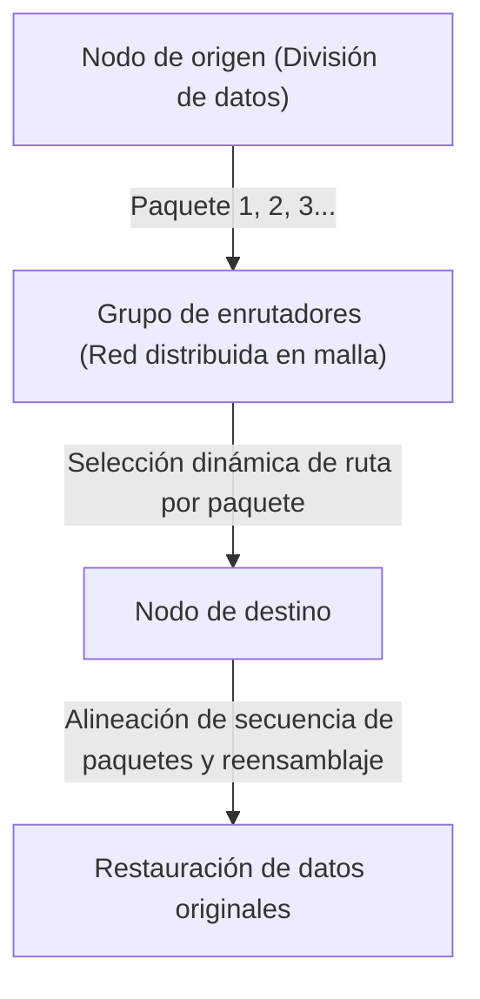

La innovación tecnológica del método de conmutación de paquetes se resume principalmente en los dos puntos siguientes:

1. **Realización de la Multiplexación Estadística (Statistical Multiplexing):**
   En lugar de monopolizar una línea física para una comunicación específica como en la conmutación de circuitos, los paquetes de múltiples comunicaciones no relacionadas comparten la misma línea física por división de tiempo. Dado que la comunicación de datos entre computadoras tiene una alta "naturaleza de ráfaga" (Burstiness: la característica donde fluye temporalmente una gran cantidad de datos, seguida de un silencio), el uso compartido del ancho de banda mediante la conmutación de paquetes elevó la eficiencia en el uso de los recursos de comunicación a su límite matemático.
2. **Almacenar y Reenviar (Store and Forward) y Selección Dinámica de Rutas:**
   Cada nodo de retransmisión (enrutador) que compone la red almacena temporalmente los paquetes recibidos en una cola (queue) en la memoria, y compara la dirección de destino escrita en el encabezado del paquete con la tabla de enrutamiento (routing table) que posee el propio nodo. Luego, calcula el estado de congestión de la red y el estado de desconexión de las líneas físicas en ese momento, y reenvía cada paquete al nodo adyacente óptimo.

Kleinrock utilizó la teoría de colas (Queuing Theory) para establecer un modelo matemático del retraso de los paquetes y el tamaño del búfer en este método de almacenamiento y reenvío. Incluso si una parte de la red se evapora debido a un ataque nuclear, los nodos sobrevivientes juzgarán la situación de manera autónoma, y los paquetes encontrarán una ruta de desvío (otra ruta en la red en malla) para llegar a su destino. Esta arquitectura "autónoma, distribuida y de autorreparación" es la verdadera fuente de la resiliencia (Resilience) de Internet.

## 1.2 La Construcción de ARPANET: Separación de Hardware y Protocolos a través del IMP

Quien implementó en el mundo físico la red de conmutación de paquetes, que antes era una existencia teórica, fue el proyecto "ARPANET", iniciado en 1969 con fondos de la Agencia de Proyectos de Investigación Avanzada del Departamento de Defensa de los EE. UU. (ARPA).

El entorno informático de la época era caótico en un grado que no se puede comparar con el actual. Los mainframes (grandes computadoras) desarrollados de forma independiente por compañías como IBM, DEC y SDS tenían códigos de caracteres (ASCII vs. EBCDIC), longitudes de palabra (16 bits, 32 bits, 36 bits, etc.) y sistemas operativos completamente diferentes, lo que hacía que comunicarlos directamente fuera extremadamente difícil desde el punto de vista técnico.

Por lo tanto, los diseñadores de ARPANET (como Larry Roberts) tomaron una decisión de diseño muy importante en la arquitectura de la red. Fue la introducción de computadoras pequeñas dedicadas al reenvío llamadas "IMP" (Interface Message Processor).

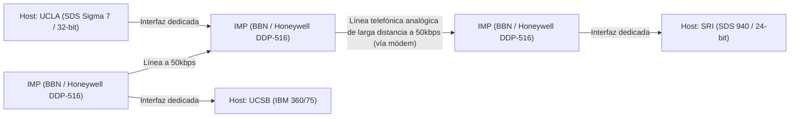

El desarrollo del IMP fue adjudicado a la empresa consultora BBN (Bolt Beranek and Newman) con sede en Boston. Modificaron la robusta minicomputadora "DDP-516" de Honeywell y dejaron que el IMP se encargara de todos los procesos complejos de red, como el protocolo de enrutamiento, la división y el reensamblaje de paquetes, y la detección de errores (CRC: Comprobación de Redundancia Cíclica).

Con esto, las enormes computadoras host de cada institución de investigación ya no necesitaban preocuparse por el complejo enrutamiento de paquetes o las características físicas de las líneas, sino que simplemente tenían que intercambiar datos con el IMP frente a ellas mediante una interfaz estandarizada (el protocolo BBN 1822). Este fue el primer gran caso de éxito de la aplicación de la "Separación de Intereses" (Separation of Concerns) del sistema al campo de las redes, y el IMP se convirtió en el ancestro directo del enrutador (Router) actual.

El 29 de octubre de 1969, se envió el primer mensaje "LO" desde el laboratorio de Kleinrock en UCLA hacia el SRI (Instituto de Investigación de Stanford) (el sistema colapsó cuando intentaban escribir "LOGIN"). Este fue el momento histórico en que ARPANET dio su primer llanto. Posteriormente, se implementó el algoritmo de enrutamiento inicial (enrutamiento de vector de distancias basado en el método de Bellman-Ford), y ARPANET creció rápidamente como una infraestructura que conectaba instituciones de investigación en todo Estados Unidos.

## 1.3 La Filosofía de Diseño de TCP/IP: El Principio End-to-End y el Abismo de la Encapsulación

Aunque ARPANET fue un gran éxito como una red única, pronto se enfrentó a un nuevo muro. El protocolo de comunicación llamado NCP (Network Control Program) utilizado dentro de ARPANET fue diseñado bajo la premisa de operar en una "red única, homogénea y altamente confiable" que era ARPANET.

Sin embargo, a principios de la década de 1970, comenzaron a aparecer una amplia variedad de redes con medios físicos, tamaños máximos de paquetes (MTU: Maximum Transmission Unit), velocidades de transferencia y tasas de error completamente diferentes, como la red de comunicación de paquetes satelitales (SATNET) y la red de comunicación de paquetes inalámbricos desarrollada por la Universidad de Hawái (PRNET, derivada de ALOHANET). Cuando se intentó interconectarlas para construir una "red de redes" (Internetwork) a escala global, se hizo evidente que el diseño de NCP fracasaría.

Quien resolvió este monumental desafío de conectar redes heterogéneas fue el innovador artículo "A Protocol for Packet Network Intercommunication" publicado por Vinton Cerf y Bob Kahn en 1974. El protocolo que diseñaron es precisamente "TCP/IP" (Transmission Control Protocol / Internet Protocol), la base de la Internet moderna.

### El Alma de la Arquitectura: El Principio End-to-End (End-to-End Argument)
En la base del diseño de TCP/IP fluye la filosofía más importante de la ingeniería de redes: el "Principio End-to-End" (End-to-End Principle / Argument). Este principio, formulado claramente en la década de 1980 por J. H. Saltzer, D. P. Reed, y D. D. Clark, argumenta lo siguiente:

"Las funciones avanzadas y específicas de la aplicación, como la garantía de fiabilidad en la transferencia de datos, el control de secuencia y el cifrado, deben implementarse en los hosts terminales (End-to-End) en ambos extremos de la comunicación, y no deben implementarse en el núcleo de la red (infraestructura de retransmisión o enrutadores)."

¿Qué pasaría si al lado del núcleo de la red (IMP o enrutadores) se le asignara un "estado" (State) complejo, como la confirmación de llegada de paquetes (ACK) o el control de retransmisión? En el instante en que un enrutador de retransmisión falle, ese estado se pierde y la comunicación se corta. Además, cada vez que surja una aplicación con nuevos requisitos, habría que reescribir el software de todos los enrutadores de retransmisión del mundo.

TCP/IP materializó este principio siendo extremadamente fiel. Los enrutadores IP (Internet Protocol) encargados del reenvío se especializaron en una función sumamente simple (transferencia de datagramas sin estado): "solo reenviar los paquetes recibidos hacia su destino con el mejor esfuerzo (best-effort)". IP no se preocupa en absoluto por la pérdida de paquetes o el desorden en la secuencia. Se limitó a ser una simple "red tonta" (Dumb Network).

A cambio, la enorme responsabilidad de garantizar la fiabilidad de la comunicación fue delegada completamente al TCP (Transmission Control Protocol) que se ejecuta en los hosts de ambos extremos. TCP observa los números de secuencia adjuntos a los paquetes desordenados transportados por IP, reensambla los datos originales, solicita autónomamente retransmisiones si hay faltantes, y ajusta la velocidad de transmisión si la red está congestionada (control de ventanas y algoritmo de inicio lento).

Esta filosofía de diseño de "mantener el núcleo extremadamente simple y dotar de inteligencia a los bordes (extremos)" es la razón principal por la cual Internet superó a la red telefónica y, más tarde, pudo absorber directamente y sin necesidad de modificar la infraestructura innovaciones explosivas que ni siquiera sus diseñadores previeron, como la Web, el video en streaming, la comunicación P2P y los teléfonos inteligentes.

### Encapsulación (Encapsulation) y el Modelo de Capas
TCP/IP utilizó el método de "encapsulación" (Encapsulation) de datos para lograr esta división lógica de roles. Este es un mecanismo mediante el cual cada capa recubre los datos a transmitir con su propia información de control (encabezado), como si fueran muñecas Matryoshka.

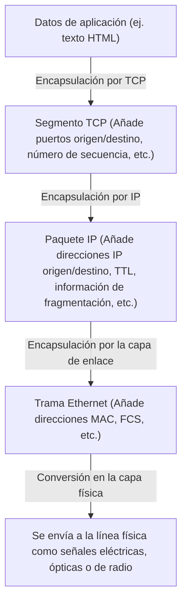

El enrutador solo mira el encabezado (dirección IP) del paquete IP para decidir el destino del reenvío, y no se involucra en absoluto con el contenido (encabezado TCP o datos). Con esto, IP ocultó y absorbió por completo las diferencias en las características físicas de las capas físicas subyacentes (fibra óptica, cables de cobre, Wi-Fi, 5G), logrando proporcionar a las capas superiores una "red virtual única a escala global".

El 1 de enero de 1983, se llevó a cabo el "Día de la Bandera" (Flag Day), en el que todos los hosts de ARPANET cambiaron simultáneamente de NCP a TCP/IP, dando nacimiento a "The Internet" en el verdadero sentido de la palabra.

## 1.4 El Ascenso de NSFNET y la Evolución del Enrutamiento Distribuido Autónomo

Después de la transición a TCP/IP, Internet superó el ámbito militar y de defensa para transformarse en una infraestructura colosal para la investigación académica. La fuerza impulsora decisiva de esto fue "NSFNET", construida a finales de la década de 1980 por la Fundación Nacional de Ciencias (NSF) de los Estados Unidos.

NSFNET se construyó como una red troncal (backbone) que conectaba cinco centros de supercomputación en todo Estados Unidos. Inicialmente a 56kbps, luego a líneas T1 (1.544Mbps) y finalmente a líneas T3 (45Mbps), repitió actualizaciones dramáticas en la capa física. Las redes de diversas universidades y regiones (redes regionales) comenzaron a conectarse jerárquicamente a esta red troncal de NSFNET.

A medida que la escala de la red se expandía explosivamente (escalamiento), surgió un nuevo desafío técnico. Ese era "el límite del enrutamiento". Hacer que todos los enrutadores de retransmisión compartieran la información de rutas de decenas de miles de nodos superaba los límites físicos de la capacidad de memoria y la potencia de cálculo.

Para resolver este problema, Internet introdujo el concepto de "Sistemas Autónomos" (AS: Autonomous System). Redefinió Internet no como una única y gigantesca red, sino como un conjunto de redes (AS) con políticas de administración independientes.

En el interior de un AS (IGP: Interior Gateway Protocol), se utilizan protocolos de enrutamiento de estado de enlace como OSPF (Open Shortest Path First), para construir un mapa topológico completo de la red y calcular a alta velocidad la ruta más corta mediante el algoritmo de Dijkstra.

Por otro lado, entre los diferentes AS (EGP: Exterior Gateway Protocol), no bastaba con la ruta más corta, sino que era necesario reflejar políticas organizativas y comerciales sobre "a través de qué redes se permite la comunicación". Para lograr esto, se desarrolló "BGP" (Border Gateway Protocol), que sigue siendo el pilar de Internet hasta el día de hoy. BGP adoptó un algoritmo de tipo vector de ruta (Path Vector), que previene completamente los bucles de enrutamiento y permite el intercambio de información de rutas entre los ISP (Proveedores de Servicios de Internet) de todo el mundo.

Con la construcción de NSFNET y el establecimiento de BGP, aunque no exista un administrador central, se completó el ecosistema de la Internet comercial moderna, donde cada organización se interconecta repetidamente (peering o tránsito) para funcionar de forma autónoma como una sola red en su conjunto. En 1995, NSFNET concluyó su función y la operación de la red troncal fue transferida completamente a un grupo de ISP privados.

## 1.5 El Nacimiento de la WWW: La Liberación del Conocimiento a través del Hipertexto y su Paso al Dominio Público

A finales de la década de 1980, cuando la infraestructura desde la capa física hasta la capa de red y la capa de transporte se había establecido a escala global, la cantidad de información acumulada en Internet estaba aumentando drásticamente. Sin embargo, en la Internet de esa época proliferaban aplicaciones individuales como FTP (transferencia de archivos), Telnet (inicio de sesión remoto) y USENET (foros electrónicos), y la información estaba aislada (silos) en las profundidades de los directorios de cada servidor. Para encontrar los datos deseados, era indispensable tener conocimientos sobre las direcciones IP de los servidores objetivo y complejos comandos UNIX, lo que representaba un estado extremadamente antidemocrático.

Quien derribó esta situación desde la raíz y provocó un cambio de paradigma en el intercambio de información fue el científico de la computación Tim Berners-Lee, de la Organización Europea para la Investigación Nuclear (CERN) en Ginebra, Suiza. En 1989, propuso un sistema innovador llamado "World Wide Web" (WWW).

El núcleo de su idea fue combinar el "hipertexto" (Hypertext: el concepto de crear enlaces desde una palabra en un documento hacia otro documento), que existía desde la década de 1960, con "Internet" (TCP/IP). Expandió los destinos de los enlaces de hipertexto, que antes estaban confinados dentro de una computadora local, a documentos en servidores en el otro lado del planeta.

Para construir este enorme espacio de información, Berners-Lee diseñó e implementó por sí solo tres especificaciones técnicas extremadamente sofisticadas.

1. **URI (Uniform Resource Identifier):**
   Un sistema de direcciones universal para designar de manera única la ubicación de cualquier recurso (texto, imagen, video, etc.) existente en la red.
2. **HTTP (Hypertext Transfer Protocol):**
   Un protocolo de la capa de aplicación para solicitar y transferir recursos especificados por la URI entre el cliente (navegador web) y el servidor. El punto más destacado de HTTP fue la adopción de un diseño "sin estado" (Stateless), que no mantiene el "estado" (State) de la comunicación. Gracias a esto, los servidores pudieron procesar eficientemente las solicitudes de millones de clientes.
3. **HTML (Hypertext Markup Language):**
   Un lenguaje de marcado para describir la estructura lógica de los documentos e insertar hipervínculos (etiquetas de anclaje `<a>`) a otros recursos.

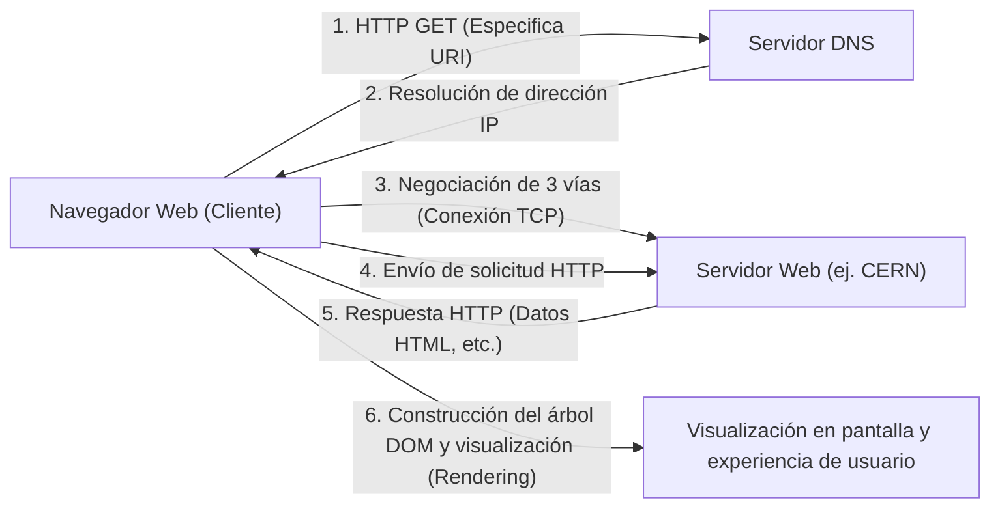

A fines de 1990, el primer servidor web del mundo (info.cern.ch) y un navegador comenzaron a funcionar en una computadora NeXT. La Web inicial estaba basada en texto, pero su experiencia intuitiva de exploración de información mediante enlaces se popularizó rápidamente entre los investigadores.

### El Dominio Público como una Decisión Histórica para la Humanidad
Sin embargo, la razón principal por la cual la WWW transformó el mundo en el verdadero sentido de la palabra y se estableció como la infraestructura de la sociedad moderna no es solo su excelente arquitectura técnica. El evento decisivo que dividió la historia ocurrió el 30 de abril de 1993.

El CERN, aceptando la firme petición de Tim Berners-Lee, tomó la asombrosa decisión de liberar de forma gratuita todas las tecnologías base de la WWW (software de servidor, cliente, bibliotecas de código) al "dominio público" (renuncia a los derechos de propiedad intelectual). El documento de declaración, en el que no se ejercía ninguna patente y no se exigía pago por su uso, llevaba la firma del director del CERN.

¿Qué hubiera pasado si, en ese momento, el CERN hubiera patentado las tecnologías de la WWW y buscado monetizarlas mediante licencias de software? Sin duda, la explosión de información de hoy no habría ocurrido. La WWW se habría quedado como un sistema cerrado de algunas empresas y universidades con recursos financieros, e Internet se habría fragmentado en guerras de estándares con protocolos rivales como Gopher, que aparecieron más tarde.

Al desaparecer por completo las barreras técnicas y legales mediante su paso al dominio público, hackers y empresas de todo el mundo ingresaron al ecosistema de la WWW. Marc Andreessen y otros del Centro Nacional de Aplicaciones de Supercomputación (NCSA) de EE. UU. desarrollaron y lanzaron gratuitamente "NCSA Mosaic", un innovador navegador gráfico que podía mostrar imágenes en línea. Esto fue el detonante del posterior Netscape Navigator y, por extensión, de la burbuja de las puntocom. Los individuos pudieron establecer libremente servidores web y transmitir información al mundo; se había logrado la "democratización de la información".

## 1.6 Conclusión: La Filosofía Supera a la Implementación

La historia de Internet que hemos visto en el Capítulo 1 no es solo una historia de aumento de la velocidad de comunicación. La invención de la conmutación de paquetes, basada en la realidad física de que "el control centralizado es vulnerable", el Principio End-to-End de que "la complejidad debe ser asumida por los extremos", y la liberación pública de la WWW, bajo la premisa de que "la información debe estar abierta a toda la humanidad de forma gratuita".

Lo que hace que Internet sea lo que es hoy no es ni hardware excelente ni un código brillante, sino estas "filosofías de diseño" (Philosophy) fuertes y coherentes. Superó las restricciones de la capa física mediante la encapsulación lógica y aceptó la diversidad a través de estándares abiertos (RFC: Request for Comments). Precisamente gracias a esta arquitectura que valora la descentralización y la libertad, Internet pudo lograr un escalamiento sin precedentes.

Sin embargo, entre el "nombre" que los humanos pueden entender y el "número" (dirección IP) que procesa la red, seguía existiendo una profunda brecha. En el próximo capítulo, desentrañaremos los mecanismos técnicos del gigantesco sistema de bases de datos distribuidas que trajo orden al espacio de direcciones de esta vasta red descentralizada autónoma y que apoyó silenciosamente la explosiva popularización de la WWW: "El abismo del espacio de direcciones IP y el DNS (Domain Name System)".

# Capítulo 2: Capa Física y Capa de Enlace de Datos ~La Entidad Física de los Datos Digitales y la Comunicación entre Vecinos~

En la base de la gigantesca red que es Internet, existe una enorme cadena de fenómenos físicos que transforman los datos lógicos digitales de "0" y "1" en fenómenos físicos como señales eléctricas, parpadeos de luz o fluctuaciones de ondas electromagnéticas, saltando a través del espacio y los medios para llegar a su destino. Cuando abrimos una página web casualmente en nuestro smartphone, detrás de escena, los fotones recorren fibras de vidrio que se arrastran por el fondo de las profundidades marinas, y las ondas de radio invisibles vuelan por el espacio acompañadas de cálculos complejos.

En este capítulo, nos centraremos en la primera capa (Capa Física) y la segunda capa (Capa de Enlace de Datos) del modelo de referencia OSI, y profundizaremos desde la perspectiva de un profesional hasta el límite en la parte "más física y terrenal" de la red que sustenta nuestras vidas, así como en los precisos mecanismos lógicos que las controlan.

---

## 2.1 Capa Física (Physical Layer): La Materialización Física de la Información y las Leyes del Universo

La misión principal de la capa física es convertir (modular) secuencias de bits discretas (0 y 1) manejadas por computadoras en señales físicas analógicas adaptadas a las características físicas del medio de transmisión (cables de cobre, fibra óptica, espacio como el vacío o el aire), y ponerlas en la ruta de transmisión. Aquí, las leyes de la ingeniería eléctrica, la mecánica cuántica y la óptica determinan los límites de la comunicación.

### El Teorema de Shannon-Hartley y los Límites de la Información
Al hablar de la capa física, es inevitable mencionar la teoría de la información publicada por Claude Shannon en 1948. El "Teorema de Shannon-Hartley" demostró matemáticamente la tasa máxima de transferencia de datos (capacidad del canal de comunicación) que se puede transmitir sin errores en un canal de comunicación con ruido presente.

$$ C = B \log_2\left(1 + \frac{S}{N}\right) $$

Aquí, $C$ es la capacidad del canal de comunicación (bps), $B$ es el ancho de banda (Hz) y $S/N$ es la relación señal-ruido (SNR). Esta hermosa ecuación muestra que, por más que avance la tecnología, existe un límite físico (límite de Shannon) en la cantidad de información que se puede enviar dado un ancho de banda y un entorno de ruido. Los ingenieros modernos de fibra óptica y Wi-Fi continúan una batalla sin fin sobre cómo elevar la velocidad de comunicación al límite máximo.

### La Física de la Fibra Óptica: Transportando la Luz "Encerrándola"
La columna vertebral del Internet moderno es, sin duda, la fibra óptica (Optical Fiber). En las telecomunicaciones eléctricas mediante cables de cobre, la comunicación de alta velocidad a largas distancias es difícil debido al efecto pelicular y la interferencia electromagnética (EMI), pero la fibra óptica ha superado esto.

La fibra óptica está compuesta de dos capas de cristal de cuarzo de pureza extremadamente alta: el "núcleo" (core) central y el "revestimiento" (cladding) que lo rodea. Al establecer el índice de refracción del núcleo ligeramente más alto (menos de unos pocos porcentajes) que el del revestimiento, según la ley de Snell, la luz que incide en un ángulo más plano que cierto ángulo crítico repite una reflexión interna total (Total Internal Reflection) en el límite entre el núcleo y el revestimiento. De esta manera, la luz avanza por el interior de la fibra sin filtrarse al exterior.

#### La Batalla contra la Dispersión y la Atenuación: El Cristal que Trajo un Premio Nobel
El cristal de antaño tenía muchas impurezas, por lo que la luz se atenuaba en pocos metros. En 1966, el Dr. Charles Kao (ganador del Premio Nobel de Física en 2009) descubrió que la causa de la atenuación en la fibra óptica no era una propiedad inherente del cristal, sino las impurezas (especialmente grupos hidroxilo y metales de transición), y predijo que si se aumentaba la pureza, sería posible la comunicación a larga distancia. En la década de 1970, el cristal de cuarzo de pérdida ultrabaja desarrollado por Corning logró una pérdida increíblemente baja de 0.2 dB/km en la banda de longitud de onda de 1550 nm (banda C). Esto significa que la intensidad de la luz solo se reduce a la mitad incluso después de avanzar 15 km.

Sin embargo, cuando la luz viaja largas distancias, se produce una "Dispersión Cromática (Chromatic Dispersion)" y una "Dispersión Modal (Modal Dispersion)", y la forma de onda del pulso colapsa. La dispersión cromática ocurre porque la velocidad de propagación en el cristal difiere según la longitud de onda (color) de la luz. La dispersión modal es un fenómeno en el que hay múltiples rutas (modos) para que la luz pase a través del núcleo, lo que provoca una desviación en el tiempo de llegada.
Para superar esto, se redujo el diámetro del núcleo a unos pocos micrómetros, cerca de la longitud de onda de la luz, y se desarrolló la "Fibra Monomodo (SMF)", que permite el paso de una sola ruta, convirtiéndose en la corriente principal para transmisiones a larga distancia como las comunicaciones intercontinentales.

#### EDFA y WDM: El Renacimiento de la Comunicación Óptica
En la década de 1990, ocurrieron dos revoluciones en las comunicaciones ópticas. La primera fue el amplificador de fibra óptica dopada con erbio (EDFA: Erbium-Doped Fiber Amplifier). Antes de eso, se requería un repetidor regenerativo lento y costoso que convertía primero la señal óptica atenuada en una señal eléctrica, la amplificaba y luego la convertía nuevamente en luz. El EDFA añadió erbio, un elemento de tierras raras, al núcleo de la fibra y, al aplicar luz de bombeo desde el exterior, provocó una emisión estimulada cuando pasaba la luz de la señal, haciendo posible amplificar directamente la luz como luz.

El segundo es la multiplexación por división de longitud de onda (WDM: Wavelength Division Multiplexing). Utilizando el principio de superposición donde la luz viaja de forma independiente sin mezclarse incluso si se emiten diferentes longitudes de onda (colores) en el mismo espacio al mismo tiempo, es una tecnología que agrupa y envía señales de múltiples longitudes de onda simultáneamente a través de una sola fibra. Con la tecnología de multiplexación por división de longitud de onda de alta densidad (DWDM), en la actualidad se transportan más de 100 señales de longitud de onda a intervalos de pocos milímetros en una sola fibra óptica, logrando un enorme ancho de banda de decenas de Tbps a varios Pbps en una sola fibra.

### Cables Submarinos: La Red Neuronal de la Tierra
Más del 99% de las comunicaciones de datos que conectan los continentes se transportan mediante cables submarinos, no mediante satélites artificiales. Tanto los datos de la nube como las imágenes de los sitios web extranjeros pasan todos por el fondo físico del mar.

#### Historia de Fracasos y Desafíos
La historia de los cables submarinos es mucho más antigua que Internet. El primer gran desafío fue el cable telegráfico transatlántico en 1858. Aunque el cable de cobre aislado con gutapercha, un tipo de caucho natural, se tendió con éxito, su funcionamiento con alta tensión, ignorando la advertencia de Lord Kelvin (William Thomson), provocó una ruptura del aislamiento y su silenciamiento en apenas unas semanas. Después, a lo largo de un largo período de tiempo, se mejoraron la teoría y los materiales, y en 1988 comenzó a funcionar "TAT-8", el primer cable submarino óptico transpacífico, marcando el inicio de la era óptica.

#### Estructura del Cable y Mecanismo de Tendido
Los cables submarinos modernos, tendidos en aguas profundas a varios miles de metros, están diseñados para soportar entornos extremos. Para proteger el haz de apenas unas cuantas fibras ópticas en el centro, están protegidos por múltiples capas, que incluyen alambres de acero de alta tensión, tubos de cobre o aluminio para resistir la presión del agua, y aislamiento de polietileno. En las zonas de aguas profundas, son tan delgados como de unos pocos centímetros de diámetro para reducir el peso mientras resisten las mordeduras de los tiburones y la enorme presión del agua, pero en aguas poco profundas, se aplica un blindaje grueso (armoring) para protegerlos de las redes de arrastre de los barcos de pesca, las anclas de los barcos y los terremotos submarinos, alcanzando un grosor de más de 10 centímetros de diámetro.

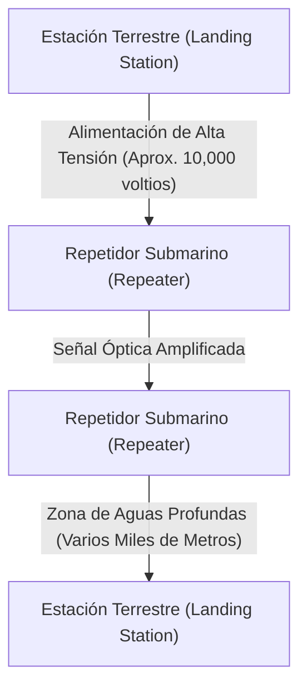

Dado que las señales ópticas se atenúan cada varias decenas de kilómetros incluso utilizando fibras de pérdida ultrabaja, hay "repetidores submarinos" (que incorporan el EDFA mencionado anteriormente) intercalados a intervalos regulares a lo largo del cable. La energía eléctrica para accionar estos repetidores en las profundidades del mar se suministra continuamente desde las estaciones terrestres en ambos extremos a través del tubo de cobre dentro del cable como corriente continua de alto voltaje, desde varios miles de voltios hasta un máximo de más de 10,000 voltios.
Para el tendido se utiliza un "barco tendecables" especializado, y en aguas poco profundas, un robot submarino (ROV) cava zanjas en el lecho marino y entierra el cable. Si se corta el cable, un barco de reparación acude rápidamente al lugar, engancha el extremo del cable desde las profundidades del mar con un rezón (garfio similar a un ancla), lo iza a bordo del barco y técnicos expertos empalman por fusión las fibras ópticas con una precisión de unos pocos micrones, lo que supone un trabajo increíblemente analógico y arduo.

### La Física de las Comunicaciones por Radio (La Base de Wi-Fi)
Con la popularización de los dispositivos móviles y el IoT, las comunicaciones mediante ondas electromagnéticas (ondas de radio) que vuelan por el espacio también se han convertido en el campo de batalla principal de la capa física. El Wi-Fi (conjunto de estándares IEEE 802.11) utiliza principalmente la banda ISM (bandas para uso industrial, científico y médico, que se pueden utilizar sin licencia) en la banda de 2.4 GHz, 5 GHz y la recientemente liberada banda de 6 GHz.

#### Compresión de Información Extrema mediante QAM (Modulación de Amplitud en Cuadratura)
En la "modulación" que coloca datos digitales en ondas analógicas, el Wi-Fi utiliza una tecnología extremadamente avanzada. Se trata de QAM (Quadrature Amplitude Modulation: Modulación de Amplitud en Cuadratura).
La onda llamada onda de radio tiene dos magnitudes físicas: "amplitud (altura de la onda)" y "fase (tiempo/ángulo de la onda)". QAM sintetiza dos ondas portadoras (señal I y señal Q) que difieren en fase 90 grados, y al variar la amplitud de cada una, asigna una secuencia de bits a un "punto" específico en el mapa de constelación.

Por ejemplo, con 16-QAM, se pueden representar 16 puntos (4 bits) con un solo cambio de onda (símbolo). En el último Wi-Fi 7 (802.11be), se ha adoptado una modulación de alta densidad casi demente llamada 4096-QAM. Esto representa 4096 puntos (12 bits) en una sola modulación. En un mapa de constelación donde se agolpan 4096 puntos, el lado receptor debe determinar con precisión qué "punto" se envió, sin quedar sepultado por ruidos diminutos. Para lograr esto, se utilizan códigos de corrección de errores avanzados y potentes procesadores de procesamiento de señales.

#### OFDM y MIMO: La Batalla contra el Multitrayecto y el Uso del Espacio
Las ondas de radio no solo viajan en línea recta, sino que también rebotan en paredes y muebles, se difractan y se dispersan. Por lo tanto, las ondas de radio emitidas por un transmisor toman diferentes rutas (multitrayecto o multipath) y llegan al receptor con tiempos ligeramente desfasados, provocando interferencias (fading o desvanecimiento) que destruyen la forma de la onda.
Las tecnologías para aprovechar esto o superarlo son OFDM y MIMO.

**OFDM (Multiplexación por División de Frecuencias Ortogonales)** es una tecnología que, en lugar de utilizar una única señal de alta velocidad y banda ancha, divide finamente la banda en numerosas frecuencias (subportadoras) muy estrechas y transmite datos en paralelo a baja velocidad en cada una de ellas. Dado que las subportadoras están dispuestas de manera que sean "ortogonales (matemáticamente no interfieren entre sí)", la eficiencia del uso de la frecuencia es extremadamente alta y también es resistente a las desviaciones de retardo debidas al multitrayecto.

**MIMO (Multiple-Input and Multiple-Output)** es una tecnología de "multiplexación espacial" que utiliza múltiples antenas para transmitir diferentes datos simultáneamente en la misma frecuencia. Utilizando la propiedad de que las ondas se mezclan de manera diferente en distintos lugares del espacio debido a la reflexión del multitrayecto, las señales complejas recibidas por múltiples antenas en el lado receptor se separan como si se resolvieran ecuaciones simultáneas, multiplicando la capacidad de comunicación por el número de antenas. Además, el **beamforming**, que ajusta con precisión la fase de las ondas de radio para cada antena para concentrar el haz de ondas de radio en una dirección específica, se ha convertido en una tecnología indispensable para el Wi-Fi moderno.

---

## 2.2 Capa de Enlace de Datos (Data Link Layer): Diálogo y Orden entre Dispositivos Directamente Conectados

Si la capa física es un mero "transportador de señales", la capa de enlace de datos es la capa encargada del conjunto de reglas y el control del tráfico para agrupar esas secuencias de bits crudas en bloques significativos llamados "tramas (frames)" y entregarlos de forma fiable al destino correcto dentro de la misma red (enlace).

### La Historia de Ethernet: La Inspiración en ALOHA
En la actualidad, el estándar de facto mundial para las redes LAN cableadas es Ethernet (IEEE 802.3).
Sus raíces se remontan a "ALOHAnet", una red de comunicaciones por radio creada en la Universidad de Hawái. ALOHAnet adoptó un protocolo extremadamente anárquico y ambicioso: "Si tienes datos que enviar, envíalos sin más. Si chocan y se destruyen, espera un tiempo aleatorio y vuelve a enviarlos".

En 1973, Bob Metcalfe, en el Centro de Investigación de Palo Alto (PARC) de Xerox, aplicó la idea de ALOHAnet a las comunicaciones sobre cable coaxial e inventó Ethernet. El primer Ethernet tenía una topología de "tipo bus", y múltiples computadoras compartían un solo cable coaxial grueso (yellow cable) perforándolo con unas agujas llamadas tomas vampiro (vampire taps).

#### CSMA/CD: Anarquía Ordenada
Debido a que todos compartían el medio (cable), si varios dispositivos enviaban señales eléctricas al mismo tiempo, las formas de onda se superponían y destruían los datos, generando una "colisión (collision)". El algoritmo distribuido de forma autónoma para evitar y resolver esto es "CSMA/CD (Carrier Sense Multiple Access with Collision Detection)".

1. **Carrier Sense (Detección de Portadora)**: Antes de transmitir, se mide el voltaje en el cable y se escucha para comprobar si alguien más está comunicándose.
2. **Multiple Access (Acceso Múltiple)**: Si nadie está comunicándose, cualquiera puede transmitir por su cuenta sin esperar un permiso central.
3. **Collision Detection (Detección de Colisiones)**: Incluso durante la transmisión, se monitorea el voltaje del cable, y si se detecta un aumento de voltaje anormal y diferente a la propia señal de transmisión, se considera una "colisión". Inmediatamente se emite una señal de atasco (jam signal) para notificar la colisión a todos los demás y se detiene la transmisión.
4. **Backoff (Postergación)**: Después de una colisión, cada nodo espera un tiempo aleatorio (calculado mediante el algoritmo de backoff exponencial) antes de intentar retransmitir.

Este mecanismo simple y sin necesidad de un administrador central que se basa en la premisa de "se asume que habrá infracciones de las reglas (colisiones), y si ocurren, se espera al azar", fue la principal razón por la que Ethernet derrotó a protocolos complejos y costosos como Token Ring de IBM o ATM y se apoderó de la hegemonía.

### Dirección MAC: La Identidad Absoluta del Hardware
Para la especificación del destino en la capa de enlace de datos se utiliza la dirección MAC (Media Access Control address). Si la dirección IP es una "dirección temporal", la dirección MAC es un "número de identidad innato".

La dirección MAC tiene una longitud de 48 bits (6 bytes) y se representa separando números hexadecimales de 2 dígitos con dos puntos, como "00:1A:2B:3C:4D:5E".
- **Primeros 24 bits (OUI: Organizationally Unique Identifier)**: Código de la empresa administrado y asignado por el IEEE que identifica de forma única al fabricante de los equipos de red (como Apple, Cisco, Intel).
- **Últimos 24 bits (UAA: Universally Administered Address)**: Número de serie que el fabricante asigna de forma secuencial a sus propios productos.

Por regla general, las tarjetas de interfaz de red (NIC) de todos los dispositivos de red del mundo tienen grabada en su ROM una dirección MAC única en el mundo.

### Estructura de la Trama: La Tecnología de Empaquetado de la Comunicación
En la capa de enlace de datos, a los datos que bajan de la capa de red (como los paquetes IP) se les añaden una cabecera (header) y una cola (trailer) antes y después, y se encapsulan en una unidad llamada "trama (frame)". La estructura de la trama de Ethernet (Ethernet II) es refinada hasta lo artístico.

1. **Preámbulo (Preamble)**: Secuencia de 7 bytes de "10101010". Un ejercicio de preparación para la sincronización de reloj en la NIC del lado receptor.
2. **SFD (Start Frame Delimiter)**: 1 byte de "10101011". Al terminar el preámbulo en "11", se le anuncia al receptor "aquí empiezan los datos reales".
3. **Dirección MAC de Destino (Destination MAC) / Dirección MAC de Origen (Source MAC)**: 6 bytes cada una. De quién para quién es la comunicación. Si el destino es "FF:FF:FF:FF:FF:FF", se convierte en una trama de difusión (broadcast) que llegará a todos.
4. **Tipo (EtherType)**: 2 bytes. Indica qué tipo de datos hay en la carga útil (payload), por ejemplo, 0x0800 para IPv4, 0x86DD para IPv6, 0x0806 para ARP.
5. **Carga útil (Data/Payload)**: Los datos reales confiados por las capas superiores. El tamaño es desde 46 bytes hasta un máximo de 1500 bytes (MTU: Maximum Transmission Unit).
6. **FCS (Frame Check Sequence)**: Cola de 4 bytes. Un valor hash calculado a partir de toda la trama (desde la MAC de destino hasta la carga útil) mediante un polinomio llamado CRC-32 (Comprobación de Redundancia Cíclica).

La NIC del receptor calcula el CRC a alta velocidad a nivel de hardware al recibir la trama. Si el FCS adjunto al final difiere del resultado de su propio cálculo aunque sea en 1 solo bit, asume que los datos se han corrompido debido a ruido o colisiones durante la comunicación y **descarta la trama sin piedad y sin ningún tipo de notificación**. La capa de enlace de datos ciertamente "detecta y descarta errores", pero no tiene la función de solicitar "estaba roto, así que reenvíamelo". Esta división de roles, en la que se delega la pesada responsabilidad del control de retransmisión a protocolos de capas superiores como el protocolo TCP, es lo que sustenta la escalabilidad de Internet.

### El Nacimiento del Hub de Conmutación y la Evolución a la Comunicación Full-Duplex
El Ethernet de tipo bus compartido mediante CSMA/CD era un mecanismo maravilloso, pero a medida que aumentaba el número de dispositivos (hosts) conectados a la red, las colisiones ocurrían con frecuencia, lo que tenía la debilidad fatal de reducir drásticamente el rendimiento efectivo (throughput).
El encargado de solucionar esto de raíz fue el "switch de capa 2 (switching hub)" popularizado en la década de 1990.

A diferencia de un hub (repeater hub), que es un dispositivo de capa física que difunde incondicionalmente las señales eléctricas recibidas a todos los puertos, el switch tiene un cerebro inteligente que comprende la capa de enlace de datos.
El switch tiene una "tabla de direcciones MAC" que utiliza una memoria interna (tabla CAM). Aprende las direcciones MAC de origen de los dispositivos conectados a cada puerto y crea automáticamente una tabla de correspondencia entre el puerto y la dirección MAC.
Luego, cuando entra una trama, el switch compara la dirección MAC de destino con la tabla y reenvía (forwarding) la trama "solamente" al puerto donde está conectado el dispositivo correspondiente.

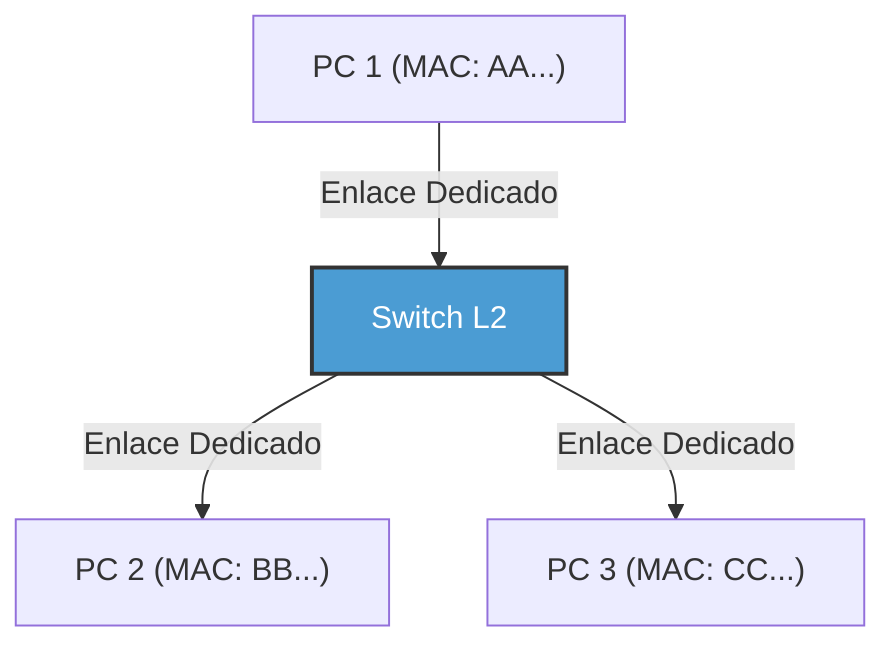

Gracias a la introducción del switch, el cableado entre cada nodo y el switch se volvió independiente tanto lógica como físicamente (topología de estrella). Debido a esto, las rutas de comunicación se separaron, por lo que las colisiones (collisions) ya no ocurrían por principio. Como resultado, fue posible la "comunicación Full-Duplex", que utiliza las líneas de transmisión y recepción al mismo tiempo.
En el Ethernet moderno, el algoritmo CSMA/CD ya no se utiliza y ha evolucionado a una pura comunicación Full-Duplex punto a punto. Además, gracias a la tecnología VLAN (Virtual LAN) mediante IEEE 802.1Q, las redes lógicas se pueden dividir e integrar de manera flexible sin estar atadas al cableado físico, por lo que continúa reinando como la tecnología base absoluta que soporta las infraestructuras corporativas y de gigantescos centros de datos.

### La Capa de Enlace de Datos del Wi-Fi: Control del Tráfico en el Espacio de Ondas de Radio Invisible
Mientras que el Ethernet por cable evolucionó a una comunicación Full-Duplex sin colisiones, el Wi-Fi inalámbrico se enfrenta al difícil reto de "todos comparten un único medio en el mismo espacio (aire)", igual que el antiguo Ethernet de bus compartido.

En la comunicación inalámbrica, debido a que las ondas de radio emitidas por uno mismo son demasiado fuertes durante la transmisión, es físicamente imposible recibir las débiles ondas de radio de otra persona al mismo tiempo para "detectar (CD)" colisiones. Además, existe un riesgo particular de la conexión inalámbrica llamado el "Problema del Nodo Oculto (Hidden Node Problem)": por ejemplo, los terminales A y C en lados opuestos del punto de acceso no reciben mutuamente sus ondas de radio, pero si transmiten al mismo tiempo, las ondas de radio colisionarán en el punto de acceso.

Por ello, el protocolo de la capa de enlace de datos del Wi-Fi (Capa MAC) adopta el mecanismo "CSMA/CA (Carrier Sense Multiple Access with Collision Avoidance: Acceso Múltiple con Escucha de Portadora y Evasión de Colisiones)".
En CSMA/CA, antes de transmitir, se interceptan las condiciones de las ondas de radio en el espacio por un período de tiempo fijo (DIFS), y además se espera un tiempo de backoff aleatorio antes de iniciar la transmisión. La diferencia más importante es el mecanismo **ACK (Acknowledge: Reconocimiento)** que no existía en las redes cableadas. En Wi-Fi, el lado que recibió los datos devuelve una trama ACK que indica que se recibieron correctamente de manera inmediata (después de un tiempo de espera extremadamente corto llamado SIFS). El lado transmisor asume que la comunicación fue exitosa solo cuando recibe este ACK. Si el ACK no regresa, asume que los datos se corrompieron por una colisión o interferencia, duplica el tiempo de backoff y vuelve a intentar la transmisión.

Además, para resolver el problema del nodo oculto, también existe un mecanismo llamado "Handshake RTS/CTS". Antes de enviar datos grandes, el lado transmisor envía una trama de control corta llamada RTS (Request to Send: Solicitud para Transmitir), y el lado receptor (como el punto de acceso) devuelve un CTS (Clear to Send: Libre para Transmitir). Este CTS incluye información sobre el tiempo de reserva (NAV: Network Allocation Vector) que dice: "Me comunicaré durante los próximos ○○ microsegundos, por lo que los terminales circundantes guarden silencio", y los terminales circundantes que lo reciben se abstienen de comunicarse. De esta manera, la capa de enlace de datos del Wi-Fi realiza un control de tráfico magistral en el espacio invisible de las ondas de radio.

---

## Conclusión

El mundo de los fenómenos físicos donde la luz atraviesa el cristal como fotones, soporta la presión del agua de las profundidades marinas y vuela por el espacio cambiando su fase y amplitud. Y sobre este fenómeno físico ruidoso e incierto, al aplicar capas como la sincronización a través del preámbulo, la identificación individual mediante direcciones MAC, la detección rigurosa de errores por CRC y el sofisticado control de tráfico a través del switching y CSMA/CA, se hace posible por primera vez "entregar bloques de datos significativos (tramas) al dispositivo vecino sin errores". Este es el milagro que logran la primera y la segunda capa.

Sin embargo, esto por sí solo no puede convertirse en un Internet que conecte el mundo. Esto se debe a que las comunicaciones mediante direcciones MAC solo son válidas en la pequeña aldea de la "misma red (dominio de difusión)" que está conectada al mismo switch o punto de acceso, o hasta que es bloqueada por un router.

En el siguiente capítulo, el "Capítulo 3: La Capa de Red y la IP", nos acercaremos a la esencia del IP (Internet Protocol) y el enrutamiento: el grandioso mecanismo de búsqueda de rutas para conectar un sinfín de estas aldeas locales y entregar paquetes, como en una cadena humana (bucket brigade), a redes desconocidas en el otro lado del mundo.

# Capítulo 3: La capa de red y el mecanismo de enrutamiento —— La carta de navegación de los paquetes cruzando el gran océano

La base de la Internet que usamos a diario en nuestras vidas es la tercera capa del modelo OSI, es decir, la "capa de red". Más allá de la comunicación directa a través de cables físicos o señales de radio (capa de enlace de datos), la razón por la que podemos comunicarnos a escala global con servidores a miles de kilómetros de distancia es la existencia de innumerables enrutadores interconectados y el grandioso mecanismo de control de rutas (enrutamiento) mediante el cual intercambian información de manera autónoma.

En este capítulo, desde la estructura de IP (Protocolo de Internet) hasta los límites de IPv4 y la arquitectura de IPv6, y las profundidades de BGP (Border Gateway Protocol) que conecta sistemas autónomos (AS) de todo el mundo, detallaremos al máximo el "arte de la navegación" para que los paquetes lleguen a su destino, desde perspectivas técnicas, históricas y físicas.

## 3.1 El paradigma de la capa de red: El principio de extremo a extremo

El mayor avance en la filosofía de diseño de Internet radica en el **principio de extremo a extremo (End-to-End)**, que establece que "los nodos intermedios de la red (enrutadores) se dedican exclusivamente al reenvío simple de paquetes, y el procesamiento complejo (corrección de errores o garantía de orden) se realiza en los extremos (hosts finales)".

En la red telefónica tradicional (conmutación de circuitos), se ocupaba una línea física desde el inicio hasta el final de la comunicación, y el estado se gestionaba en toda la red. Por el contrario, la capa de red de Internet (conmutación de paquetes) es "sin conexión" y no mantiene estado. Cada paquete es tratado como una "carta" independiente, y los enrutadores simplemente repiten la sencilla tarea de recibirlo, mirar el destino y enviarlo al siguiente punto de tránsito óptimo (siguiente salto) (reenvío). Esta combinación de "red tonta (Dumb Network)" y "terminal inteligente (Smart Terminal)" es la razón principal por la que Internet pudo escalar explosivamente y acomodar una variedad de aplicaciones.

## 3.2 Las direcciones de Internet: La evolución y la historia del agotamiento de las direcciones IP

A todos los dispositivos de la red se les asigna un identificador único, que es la dirección IP. Actualmente, Internet se encuentra en una fase de transición en la que coexisten dos generaciones de protocolos IP.

### IPv4: El espacio de 32 bits y la lucha contra el agotamiento

IPv4, definido en 1981 en RFC 791, tiene un espacio de 32 bits (aproximadamente 4.300 millones). En el momento de su diseño, el número 4.300 millones parecía astronómicamente grande, pero con la explosiva difusión de Internet, ya en la década de 1990 comenzó a advertirse de la crisis de su agotamiento.

Para superar esta crisis se crearon **CIDR (Classless Inter-Domain Routing)** y **NAT (Network Address Translation)**.
La asignación inicial de direcciones IP se realizaba mediante el método aproximado "con clases" de Clase A (/8), Clase B (/16) y Clase C (/24), lo que provocó un grave desperdicio de direcciones. CIDR reemplazó esto con máscaras de subred de longitud variable (VLSM), logrando un enrutamiento "sin clases" que asignaba solo la cantidad de direcciones necesarias.
Además, la aparición de NAT permitió compartir una sola dirección entre miles de dispositivos al vincular un espacio de direcciones IPv4 privadas a una única dirección IPv4 global. Sin embargo, NAT rompió el principio de extremo a extremo, resultando en la necesidad de tecnologías complejas de cruce de NAT (como STUN/TURN/ICE) para la comunicación P2P o en tiempo real.

### IPv6: El espacio infinito de 128 bits y la estructura de encabezado de próxima generación

Como solución fundamental al agotamiento de direcciones, en 1998 se formuló **IPv6** en RFC 2460. IPv6 tiene un espacio de direcciones de 128 bits, proporcionando un espacio vasto de $2^{128}$ (aproximadamente 340 undecillones), lo suficientemente grande como para que sobren direcciones incluso si se asignara una a cada grano de arena en la Tierra.

La innovación de IPv6 no es solo la longitud de la dirección. Se llevó a cabo una simplificación drástica de la estructura del encabezado. Las opciones de longitud variable y la suma de comprobación del encabezado que estaban en el encabezado de IPv4 fueron abolidas, y el encabezado básico se fijó en 40 bytes. Esto ha acelerado el procesamiento (enrutamiento) de paquetes en hardware (ASIC y TCAM). Además, la fragmentación (división de paquetes) ya no se realiza en los enrutadores intermedios, sino que se cambió la especificación para que solo la realice el host de origen, reduciendo en gran medida la carga de los enrutadores.

## 3.3 La dualidad del enrutamiento: El plano de control y el plano de datos

El interior de un enrutador se divide a grandes rasgos en dos "planos (planes)".

1. **Plano de control (Control Plane)**
   Es la parte inteligente donde los enrutadores se comunican entre sí utilizando protocolos de enrutamiento (como OSPF o BGP) para aprender la topología de la red (forma de conexión) y calcular la ruta óptima. Los resultados del cálculo se almacenan en una base de datos llamada RIB (Routing Information Base).
2. **Plano de datos (Data Plane)**
   Es la parte muscular que realmente recibe paquetes, determina la interfaz a través de la cual enviarlos basándose en la dirección IP de destino, y los reenvía. Utiliza una tabla especializada en el reenvío generada a partir de RIB llamada FIB (Forwarding Information Base), y emplea memorias especiales como TCAM (Ternary Content-Addressable Memory) para reenviar paquetes a la velocidad del cable de hardware en unidades de nanosegundos.

## 3.4 Gobernanza interna de la red: IGP y sistemas autónomos (AS)

Internet no es una sola red gigantesca, sino un conjunto de redes independientes administradas por ISP (Proveedores de Servicios de Internet), empresas, universidades, etc. Esta área de administración independiente se llama **AS (Autonomous System: Sistema Autónomo)**. En la actualidad, existen más de 100,000 AS en todo el mundo.

Para el enrutamiento dentro de un AS (dentro de una empresa o la red troncal de un ISP) se utiliza **IGP (Interior Gateway Protocol)**. Dos de los IGP más representativos son los siguientes:

- **OSPF (Open Shortest Path First) / IS-IS**
  Estos son protocolos de enrutamiento del tipo "estado de enlace (link-state)". Los enrutadores inundan (flood) el estado de conexión de su entorno (ancho de banda y estado de los enlaces) a toda la red, y cada enrutador construye un mapa completo (base de datos de topología) de toda la red. Sobre ese mapa, ejecutan el algoritmo de Dijkstra (algoritmo del camino más corto) y calculan la ruta cuyo "coste" hacia el destino sea el mínimo. Este es exactamente el mismo enfoque físico y matemático que usa un sistema de navegación para automóviles cuando calcula la ruta más corta considerando la información del tráfico.

## 3.5 BGP: El protocolo "diplomático" que teje Internet

Mientras que el interior de los AS está gobernado por OSPF, etc., el único estándar de facto de **EGP (Exterior Gateway Protocol)** que conecta AS con AS y forma la Internet global es **BGP (Border Gateway Protocol)**. BGP es un protocolo sumamente peculiar que determina las rutas reflejando no solo la distancia técnica más corta, sino también "relaciones comerciales" o "políticas entre naciones".

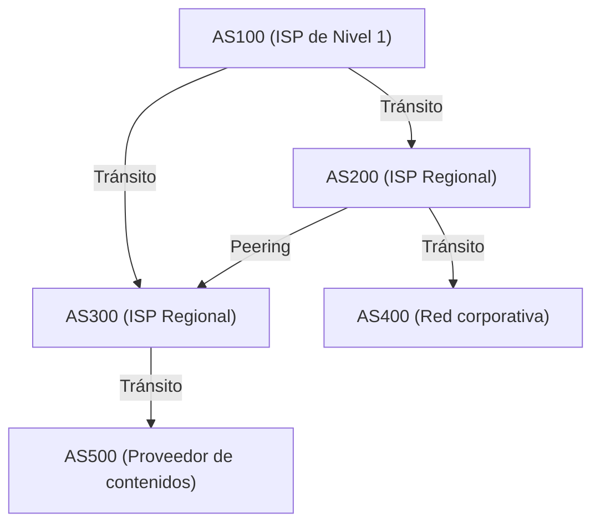

### Peering y tránsito: La economía de Internet

En las conexiones entre AS mediante BGP, existen principalmente dos modelos de negocio.

1. **Tránsito (Transit)**
   Es la relación en la que pequeños ISP o empresas pagan tarifas de comunicación a ISP gigantes para que les proporcionen accesibilidad a todas partes de Internet (rutas completas). Corresponde a una relación jerárquica de "cliente" y "proveedor".
2. **Peering (Emparejamiento)**
   Es la relación en la que los ISP entre sí, o ISP con proveedores de contenido (como Google o Netflix), conectan sus redes directamente a través de IX (Puntos de Intercambio de Internet), etc. Por lo general, se realiza de forma gratuita (sin liquidación) y su propósito es tomar atajos en el tráfico y reducir costos.

### Vector de rutas y el algoritmo de selección de rutas de BGP

BGP es un protocolo del tipo "vector de rutas (path-vector)". Mantiene como atributo por qué AS ha pasado (AS_PATH) antes de llegar a una red IP específica. Por ejemplo, si en la información de enrutamiento se lee `AS_PATH: [200, 100, 500]`, el paquete pasará por los AS en ese orden. Esto previene de forma fiable los bucles de enrutamiento.

Cuando un enrutador BGP recibe múltiples rutas hacia el mismo destino, selecciona solo una mejor ruta basándose en una compleja jerarquía de prioridades (Local Preference, longitud del AS_PATH, MED, si es eBGP/iBGP, etc.). En particular, el atributo **Local Preference (Preferencia local)** es poderoso y puede forzar en el enrutador políticas comerciales como "incluso si técnicamente es un desvío, usaré la línea de peering porque me ahorra el costo de tránsito, así que le doy prioridad".

### Secuestro de BGP (BGP Hijacking) y vulnerabilidades de rutas

BGP se diseñó originalmente basándose en la "presunción de bondad". Debido a que se confía ciegamente en que "la información de ruta anunciada por otros es correcta", cuando un AS malicioso o mal configurado envía una actualización BGP incorrecta diciendo "Tengo la ruta óptima a la red de Google (8.8.8.8/32)", ocurre un **Secuestro de BGP (BGP Hijacking)** donde el tráfico de todo el mundo es absorbido por ese AS.
A lo largo de la historia, las fallas a gran escala que explotan las vulnerabilidades de BGP son innumerables, como el incidente en el que el mundo entero se quedó sin YouTube debido al efecto dominó del bloqueo de YouTube por parte del gobierno paquistaní (2008). Actualmente, se avanza en la introducción de mecanismos de verificación de información de rutas utilizando técnicas criptográficas, como RPKI (Resource Public Key Infrastructure).

## 3.6 Las limitaciones físicas y la batalla de los enrutadores: Latencia y Bufferbloat

El enrutamiento de la capa de red es una batalla constante con las limitaciones de la física.
La velocidad a la que viaja la luz a través de la fibra óptica es aproximadamente el 67% de la velocidad de la luz en el vacío (unos 200.000 km/seg), y es inevitable que haya un retardo físico (retardo de propagación) de aproximadamente 100 a 120 milisegundos ida y vuelta (RTT) desde Japón hasta la costa oeste de los Estados Unidos.

Sumado a esto, existe el retardo de procesamiento en cada enrutador y el **retardo de encolamiento (queuing delay)**. Cuando hay congestión en la red, el enrutador almacena temporalmente los paquetes en memoria (buffer). Dado que los enrutadores recientes están equipados con memorias de gran capacidad, ocurre un fenómeno donde continúan absorbiendo la congestión prolongada sin descartar paquetes. Esto es el **Bufferbloat**. Debido a que un gran número de paquetes permanecen estancados en el buffer, el control de congestión de capas superiores como TCP no funciona normalmente, provocando como resultado un retardo extremo (miles de milisegundos). Para resolver esto, algoritmos avanzados de gestión de colas como AQM (Active Queue Management) o FQ-CoDel están implementados en los enrutadores modernos y sistemas operativos.

## Resumen

La Capa 3 o capa de red no es un simple transportista de datos. Allí se entrelazan complejamente la transición histórica de IPv4 a IPv6, el procesamiento en hardware de nanosegundos utilizando TCAM, la búsqueda matemática de la ruta más corta mediante OSPF y el control de enrutamiento distribuido autónomo con intenciones económicas y políticas mediante BGP.
Hasta que un solo paquete IP llega desde su teléfono inteligente a un servidor al otro lado del planeta, existe el esfuerzo del sistema más gigante y complejo jamás construido por la humanidad, en el cual innumerables enrutadores consultan instantáneamente sus propios mapas (tablas de enrutamiento) y pasan continuamente el paquete como si fuera el testigo en una carrera de relevos.

En el próximo capítulo, explicaremos el mecanismo de la "capa de transporte (TCP/UDP)", que se construye sobre esta capa de red y se encarga de la garantía de llegada de paquetes y el control de congestión.

# Capítulo 4: La Certeza y Velocidad de la Capa de Transporte —— El Dilema Definitivo que Sustenta la Transmisión de Información

## 1. Introducción: El Principio de Extremo a Extremo y la Misión de la Capa de Transporte

La tarea principal de la capa de red (IP) que hemos visto en los capítulos anteriores era entregar paquetes física y lógicamente al "ordenador de destino (interfaz de red del host)" a través del vasto mar de redes que es Internet. Sin embargo, la comunicación no termina simplemente con la llegada del paquete al host de destino. Los sistemas informáticos modernos ejecutan simultáneamente múltiples procesos de aplicaciones (navegadores web, clientes de correo, aplicaciones de transmisión de video, procesos de sincronización en segundo plano, servicios API, etc.) en multitarea sobre el sistema operativo.

De la montaña de paquetes que llegan desordenadamente desde la capa IP, se debe identificar qué paquete pertenece a qué aplicación, reconstruirlos como un flujo de datos con sentido o compensar si hay alguna pérdida. La "Capa de Transporte" (Transport Layer) es la responsable de toda la gestión final de los datos en estos puntos finales (endpoints).

En el núcleo de la filosofía de diseño de Internet existe una decisión arquitectónica muy hermosa y poderosa llamada el "Principio de Extremo a Extremo" (End-to-End Principle). Este es un concepto propuesto por Jerome Saltzer y otros en 1981, y es el principio de que "los nodos intermedios de la red (routers y switches) deben especializarse en el reenvío de paquetes lo más simple posible (red tonta), y los procesos complejos como la recuperación de errores, el control de secuencia y el cifrado deben delegarse a los hosts (endpoints inteligentes) en los extremos de la comunicación". Si a los dispositivos intermedios de la red se les hubiera dado capacidades complejas de gestión de estado y corrección de errores, Internet nunca habría podido adquirir la explosiva escalabilidad global que tiene hoy.

La capa de transporte se enfrenta constantemente a un dilema fundamental entre las limitaciones físicas y la teoría de la información. Ese es el compromiso entre la "Certeza" (Reliability) y la "Velocidad" (Speed / Low Latency). Para entregar información sin perder ni una sola pieza, se requiere la sobrecarga (overhead) de confirmación y retransmisión, lo que provoca un retraso (latencia) acompañado del límite físico de la velocidad de la luz. Por otro lado, si se intenta minimizar el retraso, se debe sacrificar parcialmente la integridad de la información. Dependiendo de cómo se resuelva este dilema arraigado en las leyes de la física y de qué abstracción se proporcione a la aplicación, se han diseñado y evolucionado diferentes protocolos como TCP, UDP y el moderno QUIC.

## 2. TCP (Transmission Control Protocol): Un Mecanismo Robusto que Garantiza la Certeza

El TCP fue fundado en la década de 1970, antes de la comercialización cuando Internet todavía se llamaba ARPANET, por Vinton Cerf y Robert Kahn. Su filosofía de diseño es extremadamente clara. "Garantizar que los datos lleguen a la aplicación de destino sin pérdida, en el orden correcto y sin duplicaciones, incluso en los entornos de red más pobres y en líneas inestables donde la pérdida de paquetes es frecuente". Proporcionó una poderosa abstracción de que los desarrolladores de aplicaciones, mientras usen TCP, no tienen que preocuparse en absoluto por la complejidad de la red subyacente o la pérdida de paquetes, y solo necesitan leer y escribir datos como un "flujo de bytes continuo".

### Multiplexación mediante Números de Puerto
Si una dirección IP es una dirección que indica "qué edificio del planeta", el "número de puerto" de la capa de transporte equivale a una ventana lógica que indica "a qué habitación (a qué proceso) de ese edificio se dirige". Los números de puerto se representan mediante enteros sin signo de 16 bits y toman valores de 0 a 65535.
Esto permite multiplexar simultáneamente miles o decenas de miles de comunicaciones diferentes sobre una única dirección IP y una única interfaz de red física. Por ejemplo, a los servicios principales se les han asignado números de antemano como "Puertos Conocidos" (Well-Known Ports), como el 80 para HTTP, el 443 para HTTPS y el 22 para SSH.

### 3-Way Handshake: Establecimiento de Confianza y Latencia Física
Antes de que TCP comience a comunicarse, siempre realiza un ritual para establecer una "conexión" lógica entre el emisor y el receptor. Este es el "3-Way Handshake" (Apretón de Manos de 3 Vías). Esto no solo confirma la intención de comunicarse, sino que tiene un significado sumamente importante: la sincronización del espacio de estados para el enorme intercambio de datos que está a punto de comenzar.

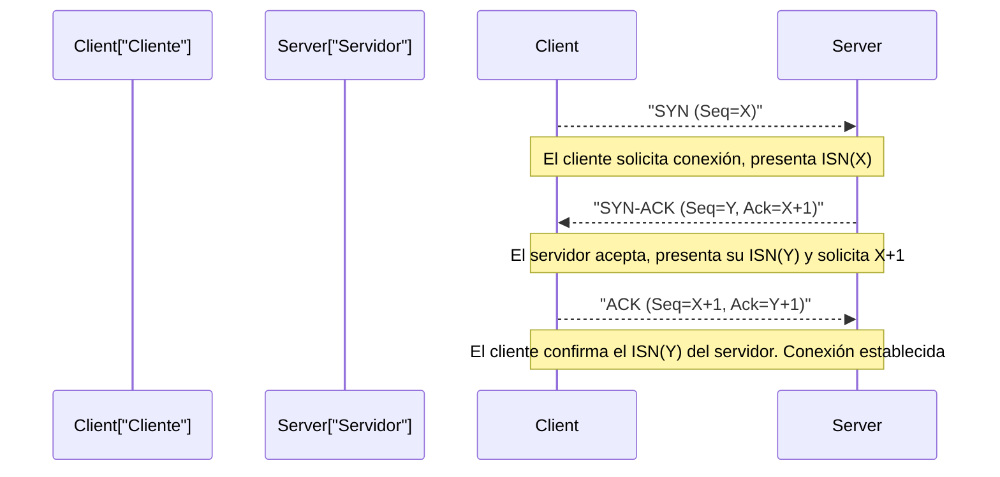

1. **SYN (Synchronize):** El cliente envía un paquete de solicitud de sincronización (un segmento TCP con la bandera SYN activada) al servidor. En este momento, presenta un "Número de Secuencia Inicial" (ISN: Initial Sequence Number, aquí X) de 32 bits generado aleatoriamente. Hay una razón por la cual el ISN no comienza en cero o en un valor fijo. Tiene la implicación criptográfica de prevenir que un "paquete fantasma antiguo retrasado y perdido en la red" en una comunicación previa ya establecida y desconectada entre la misma IP y puerto sea confundido con un paquete de la nueva comunicación, y para prevenir ataques de predicción de secuencia TCP (IP spoofing) donde un atacante adivina el número de secuencia e inserta datos falsos.
2. **SYN-ACK:** Cuando el servidor acepta la solicitud de conexión, devuelve un valor que suma 1 al ISN del cliente (X+1) como "Número de Reconocimiento" (Acknowledgment Number), y devuelve un paquete SYN-ACK que incluye el número de secuencia inicial aleatorio (Y) del propio servidor.
3. **ACK (Acknowledgment):** Como prueba de que ha recibido correctamente el ISN del servidor, el cliente envía un paquete ACK con Y+1 como el número de reconocimiento.

En el momento en que se completan estos tres intercambios de paquetes, el estado de comunicación bidireccional se asegura en la memoria y se preparan las transferencias de datos. Sin embargo, los límites físicos de la infraestructura de comunicaciones pesan sobre este estricto proceso. Esa es la "velocidad de la luz".
La velocidad de la luz en el vacío es de aproximadamente 300,000 km/segundo, pero debido al índice de refracción del núcleo de fibra óptica (vidrio de cuarzo), que es la columna vertebral principal de Internet, la velocidad de propagación de la señal óptica se reduce a unos dos tercios de eso (aproximadamente 200,000 km/segundo). Además, se añade el retardo de cola (queuing delay) causado por el enrutamiento y la conmutación en los routers intermedios. Como resultado, por ejemplo, el tiempo de ida y vuelta (1 RTT: Round Trip Time) entre Tokio y Nueva York (aproximadamente 11,000 km en línea recta, y la longitud real del cable es mayor) físicamente requiere ineludiblemente de 150 a 200 milisegundos. Dado que el 3-Way Handshake de TCP consume al menos 1 RTT, por mucho que se amplíe el ancho de banda, la latencia en el momento de establecer la conexión está restringida por la ley absoluta del universo que es la velocidad de la luz.

### Ventana Deslizante (Sliding Window), Control de Secuencia y Suma de Comprobación
Una vez en la fase de transferencia de datos, TCP divide el flujo de bytes recibido de la aplicación en segmentos de un tamaño apropiado (MSS: Maximum Segment Size, usualmente unos 1460 bytes restando el tamaño de la cabecera al MTU de IP) y los envía. A cada segmento se le asigna un número de secuencia correspondiente a la cantidad de bytes de datos, y con base en esto, incluso si los paquetes llegan desordenados (out-of-order), el receptor reordena los datos originales en la secuencia correcta.

Además, la cabecera TCP incluye un "Checksum" (suma de comprobación) de 16 bits, que verifica estrictamente usando el cálculo del complemento a 1 si los datos no se han corrompido (invertido en sus bits) por ruido eléctrico en la ruta de transmisión o errores en la memoria del router.

Si un paquete se pierde en el camino (pérdida de paquetes) o se corrompe y se descarta, el receptor continuará enviando el ACK del número de secuencia esperado (ACK duplicado) o no devolverá nada. Cuando el emisor no recibe un ACK durante un cierto período de tiempo (RTO: Retransmission Timeout) o detecta un ACK duplicado, "retransmite" (Retransmit) ese paquete.

En este mecanismo, el concepto de "Ventana Deslizante" (Sliding Window) es el que aumenta dramáticamente la velocidad de comunicación. En el método de "enviar un paquete y no enviar el siguiente hasta recibir su ACK" (Stop-and-Wait), el rendimiento cae de forma desesperante en el entorno de alta latencia (donde el RTT es grande) mencionado anteriormente.
En el método de ventana deslizante, el emisor y el receptor acuerdan dinámicamente un "tamaño de ventana" (la cantidad máxima de bytes de datos no confirmados que se pueden enviar a la vez) considerando la capacidad de los búferes de ambos. El emisor puede enviar sucesivamente paquetes a la red dentro de este rango del tamaño de ventana, sin tener que esperar los ACKs del receptor. Y cada vez que se recibe un ACK, este marco (ventana) de transmisión posible se desliza hacia adelante. Esto realiza un mecanismo para maximizar la utilización del ancho de banda que consiste en "mantener la tubería llena de datos" en una red con una línea gruesa y alto retardo (BDP: Bandwidth-Delay Product, un entorno donde el producto ancho de banda-retraso es grande).

### Control de Congestión (Congestion Control): La Armonía Matemática que Evita el Colapso de la Red
La verdadera obra maestra de TCP y uno de los avances técnicos más importantes en la historia de Internet es el "Control de Congestión" (Congestion Control).

En 1986, la Internet temprana (NSFNET) se enfrentó a una falla del sistema fatal llamada "Colapso por Congestión" (Congestion Collapse) debido al aumento en el tráfico. Como resultado de los datos entrantes que excedían la capacidad de procesamiento de la red, la cola (memoria de búfer) de los routers se desbordó y se descartaron grandes cantidades de paquetes. Los endpoints TCP, al detectar la pérdida de paquetes, concluyeron que los datos no habían llegado y "retransmitieron" simultáneamente los paquetes. Esto vertió aún más datos en la red, saturando aún más a los routers y cayendo en un círculo vicioso ruinoso donde el rendimiento efectivo (throughput) cayó drásticamente a un factor de varios miles de lo habitual.

Para evitar esta muerte de la red, Van Jacobson y otros introdujeron un algoritmo de control dinámico avanzado en TCP en 1988. Su núcleo es el control de la ventana de congestión (cwnd: Congestion Window) basado en el principio de "AIMD" (Additive Increase Multiplicative Decrease: Aumento Aditivo, Disminución Multiplicativa).

1. **Slow Start (Arranque Lento):** Inmediatamente después del inicio de la comunicación, la capacidad libre de la red es completamente desconocida. Por lo tanto, comienza con un tamaño de ventana de transmisión muy pequeño (históricamente 1 MSS, en los tiempos modernos alrededor de 10 MSS) y aumenta el tamaño de la ventana en 1 MSS por cada ACK recibido. Esto da como resultado un aumento exponencial donde "el tamaño de la ventana se duplica con cada RTT". A pesar del nombre "Lento", esta es una fase que explora el límite de ancho de banda de forma muy agresiva y en poco tiempo.
2. **Congestion Avoidance (Evitación de Congestión):** Cuando el tamaño de la ventana alcanza un umbral preestablecido (ssthresh: Slow Start Threshold), el aumento exponencial se detiene y cambia a un aumento lineal (una adición de 1 MSS por cada RTT). Esta es una fase que explora más cuidadosamente la capacidad límite (el grosor de la tubería) de la red.
3. **Detección de Pérdida de Paquetes y Disminución Multiplicativa:** TCP interpreta la pérdida de paquetes (la ocurrencia de un timeout o la recepción de un ACK duplicado tres veces seguidas desde el lado receptor) no como un simple error de transferencia, sino como una "señal de que se ha producido una congestión (atasco) en la ruta de red y que los paquetes se están desbordando del búfer del router". En este momento, TCP inmediatamente ejerce autocontrol y reduce drásticamente el tamaño de la ventana de transmisión a la mitad de una vez (o al valor inicial del arranque lento).

Gracias a este algoritmo descentralizado altruista y matemático de "compartir gradualmente el ancho de banda (aumento aditivo) y ceder inmediatamente cuando hay un problema (disminución multiplicativa)", cientos de millones o miles de millones de conexiones TCP independientes en Internet mantienen una armoniosa "homeostasis" milagrosa que logra la "división equitativa del ancho de banda" y el "funcionamiento estable de toda la red", a pesar de que no existe un administrador central de tráfico.

En los últimos años, el gran aumento en la capacidad de memoria del búfer de los routers ha resultado contraproducente; antes de que se produzca el descarte de paquetes por congestión, los paquetes continúan estancados en las cada vez más largas colas, lo que hace que el retraso (valor Ping) se dispare a cientos de milisegundos hasta unos pocos segundos, convirtiéndose en un nuevo problema físico llamado "Bufferbloat" (hinchazón de búfer). Para hacer frente a esto, Google y otros han desarrollado nuevos algoritmos de control de congestión como BBR (Bottleneck Bandwidth and Round-trip propagation time) que detectan el "aumento en RTT (tiempo de latencia)" en lugar de la pérdida de paquetes como señal de congestión, y aceleran (limitan) proactivamente la velocidad de envío antes de que se desborde el búfer. BBR se está convirtiendo en el estándar del TCP moderno.

## 3. UDP (User Datagram Protocol): Reducción al Mínimo para la Velocidad

Si TCP es un "administrador sobreprotector" que asegura la certeza total de los datos a través de complejas transiciones de estado y algoritmos avanzados, UDP, que pertenece a la misma capa de transporte, es un "transportista minimalista" cuyo papel como protocolo ha sido despojado al límite. Diseñado por Jon Postel en 1980, UDP tiene solo las funciones más elementales como capa de transporte.

La cabecera UDP tiene solo 8 bytes (la cabecera TCP normalmente tiene 20 bytes y hasta un máximo de 60 bytes incluyendo las opciones). Contiene únicamente el "Número de Puerto de Origen", el "Número de Puerto de Destino", la "Longitud de Datos" y un "Checksum" simple para detectar la corrupción de datos.

Ni el establecimiento previo de la conexión mediante un 3-Way Handshake, ni la garantía de secuencia por número de secuencia, ni el control de flujo por ventana deslizante, ni el procesamiento de retransmisión, ni el control de congestión para proteger la red; nada de esto está implementado en UDP. Simplemente envuelve los datos entregados por la aplicación en un datagrama IP, los lanza a la capa de red y los envía a modo de "Fire and Forget" (Dispara y Olvida). Ni siquiera se preocupa por si llegaron al destinatario o no.

Sin embargo, esta simplicidad estructural que podría llamarse irresponsable es precisamente la mayor arma de UDP, y la razón por la que supera a TCP en casos de uso específicos.

### El Verdadero Valor de UDP: Supremacía de la Latencia y Comunicación en Tiempo Real
En la comunicación en tiempo real, donde la latencia física (retraso) debe reducirse al límite, el "control de retransmisión para garantizar la certeza" de TCP causa un problema fatal.

Por ejemplo, imagine juegos en línea como los FPS (First-Person Shooter, disparos en primera persona), llamadas de voz (VoIP), o sistemas de videoconferencia (Zoom, WebRTC, etc.). Estas aplicaciones transmiten paquetes de las últimas actualizaciones de posición o muestras de voz decenas o cientos de veces por segundo.
Si se usara TCP y un paquete de voz enviado hace 100 milisegundos se perdiera en un router intermedio. TCP detecta la pérdida, retransmite el paquete e intenta reproducirlo en el orden correcto en el lado receptor. Sin embargo, en un entorno donde la conversación o el juego avanza en tiempo real, los "datos del pasado que llegaron con cientos de milisegundos de retraso" ya no tienen ningún valor.
Peor aún, hasta que el paquete perdido se retransmita y el orden se restablezca, TCP detendrá y almacenará en el búfer (buffering) el procesamiento (entrega a la aplicación) de los nuevos paquetes subsiguientes que ya han llegado. Esto se llama "Head-of-Line (HoL) Blocking" (Bloqueo de la Cabeza de la Línea). Muchos de los fenómenos donde el audio se entrecorta, o la pantalla del juego se congela por unos segundos para luego avanzar rápidamente (fast-forward) de golpe, son causados por este bloqueo HoL debido a la espera de retransmisión de TCP.

UDP, en tales casos, permite renunciar rápidamente al paquete perdido del pasado y procesar inmediatamente en la aplicación el último paquete que está llegando. En la comunicación en tiempo real, "representar siempre el estado más reciente con la latencia más corta, incluso si hay un poco de ruido o saltos de cuadros", resulta ser una experiencia de usuario mucho más natural y cómoda para los sentidos humanos que "que lleguen absolutamente todos los datos".

Además, UDP, que no tiene sobrecarga de handshake (apretón de manos), también es óptimo para comunicaciones de transacciones simples que se completan en "un pequeño paquete de respuesta" para "un pequeño paquete de solicitud", como la resolución de nombres de DNS (Domain Name System) o la sincronización de tiempo a través de NTP (Network Time Protocol).

## 4. QUIC: El Cambio de Paradigma en las Comunicaciones de Internet y el Protocolo de Próxima Generación

Durante décadas, desde los albores de Internet, nuestra arquitectura de red estuvo atrapada en un dualismo fijo: "Si quieres una transferencia de flujo (stream) certera, usa TCP; si quieres velocidad y tiempo real, usa UDP". Sin embargo, con la dramática evolución de la Web moderna (especialmente con la popularización de las comunicaciones móviles y la era de HTTP/2 que carga recursos masivos en paralelo), han comenzado a exponerse las limitaciones donde el diseño fundamental de TCP se convierte en un grillete.

El mayor problema son el "Head-of-Line (HoL) Blocking" peculiar de TCP mencionado también en la sección de UDP, y la "latencia excesiva" asociada con el establecimiento de la conexión.
TCP administra todas las comunicaciones como un "único flujo de bytes en serie". Suponga que solicitó múltiples archivos como HTML, CSS, JavaScript y docenas de imágenes simultáneamente (multiplexadas) sobre HTTP/2 para mostrar un sitio web moderno. Sin embargo, dado que a nivel del TCP subyacente esto es un solo flujo (stream), si incluso un paquete de la "Imagen A" se pierde, la capa TCP bloquea la entrega de los paquetes del "Script B" o la "Imagen C", que no deberían estar relacionados, a nivel de kernel del sistema operativo hasta que se complete la retransmisión de ese paquete de la Imagen A.
Además, la Web moderna requiere cifrado (TLS/HTTPS) obligatoriamente, pero en la pila de protocolos tradicional, después de completar el "Handshake 3-Way de TCP (1 RTT)", se realizaba un nuevo "Handshake de intercambio de claves criptográficas de TLS (1 a 2 RTT)", consumiendo así un gran retraso físico de 2 a 3 RTT antes de poder iniciar realmente la transmisión segura de datos.

Para resolver estos problemas fundamentales y provocar un cambio de paradigma en la infraestructura de Internet moderna, el "QUIC" (Quick UDP Internet Connections) es un protocolo de transporte de próxima generación, impulsado por Google y estandarizado por el IETF (Internet Engineering Task Force). Y el estándar Web redefinido tomando este QUIC como protocolo base es "HTTP/3".

### La Osificación de los Middleboxes y el Escape al Espacio de Usuario
El enfoque más innovador de QUIC radica en el diseño arquitectónico audaz de **"reconstruir una capa de transporte completamente nueva, integrando encriptación y multiplexación sobre paquetes UDP existentes, dentro del espacio de usuario"**.

¿Por qué se construyó sobre UDP en lugar de mejorar TCP? Innumerables "middleboxes" (cajas intermedias) en Internet, como enrutadores, firewalls y NAT (Network Address Translation), debido a años de operación, se han osificado (vuelto rígidos) descartando sin preguntar nuevos protocolos (nuevos números de protocolo) distintos a TCP y UDP como "amenazas desconocidas" (A esto se le llama Osificación de Internet: Ossification). Además, debido a que las implementaciones de TCP están codificadas en el núcleo (kernel) de sistemas operativos como Windows o Linux, se requeriría una inmensa cantidad de años para actualizar los sistemas operativos de todo el mundo y propagar nuevos algoritmos.
Por lo tanto, QUIC adoptó la estrategia de pasar a través de los middleboxes simplemente como "paquetes UDP tradicionales", mientras implementa independientemente partes superiores de TCP (control de congestión y control de retransmisiones) en un estado más altamente evolucionado, dentro del navegador o la aplicación (espacio de usuario).

### El Mecanismo Innovador de QUIC y la Trascendencia de las Limitaciones Físicas

1. **Eliminación Completa del Bloqueo HoL Mediante la Independencia de Flujos:**
   QUIC tiene la capacidad de administrar múltiples "flujos (streams) independientes" lógicos a nivel de protocolo, en lugar de un único flujo de paquetes. En el ejemplo mencionado anteriormente, incluso si los paquetes de la Imagen A se pierden en el camino, QUIC pausa solo el flujo de la Imagen A esperando su retransmisión, mientras que el procesamiento de los flujos del Script B y la Imagen C continúa en paralelo sin ser afectados en absoluto. Esto mejora drásticamente la velocidad de visualización de páginas web, en conexiones móviles y demás donde la pérdida de paquetes es frecuente.
2. **Establecimiento de Conexión de 0-RTT y Cifrado Integrado:**
   En QUIC, un cifrado equivalente a TLS 1.3 está profundamente integrado en el protocolo desde el principio. No comete el error de separar la "conexión de transporte" de la "conexión de cifrado" como hace TCP. Incluso con un servidor con el que se comunica por primera vez, completa la conexión y el intercambio de claves en tan solo 1 RTT. Aún más revolucionario, frente a servidores con los que se ha comunicado en el pasado (servidores de los que se tiene un ticket de sesión almacenado en caché), puede iniciar la solicitud HTTP de forma de "0-RTT", es decir, **iniciando el primer paquete de datos simultáneamente sin esperar el apretón de manos (handshake)**. Esta es una respuesta brillante en el diseño de protocolos para superar la restricción física del "retraso por la velocidad de la luz".
3. **Migración de Conexión (Independencia de la Dirección IP):**
   Las conexiones TCP convencionales estaban fuertemente atadas a los cuatro elementos (4-tupla) de "IP de origen, Puerto de origen, IP de destino, Puerto de destino". Por lo tanto, en el momento en que un usuario se desplaza con su teléfono inteligente y cambia de un entorno Wi-Fi a la red celular 4G/5G, cambiando la dirección IP, la conexión TCP se corta y había que empezar todo de nuevo desde el handshake que requiere mucho tiempo.
   Por otro lado, QUIC no gestiona cada conexión por la dirección IP, sino por una "Identificación de Conexión" (Connection ID) única generada al inicio de la comunicación. Por eso, incluso si la dirección IP física o la interfaz de red cambian dinámicamente, siempre y cuando el ID de conexión sea el mismo, la transmisión de videos en curso o la descarga de archivos grandes pueden continuar de manera fluida y sin cortes. En los tiempos modernos donde la comunicación móvil es protagonista, es una característica inmensamente poderosa y necesaria.

## 5. Conclusión: La Evolución de Protocolos que Gobiernan el Caos y la Construcción del Orden

La capa de transporte ha construido un "orden lógico sólido" que las aplicaciones pueden usar con tranquilidad por encima del caos (chaos) de la capa de red (IP) de Internet, la cual cambia constantemente de caminos y donde las pérdidas de paquetes y el cambio de orden son cosa de todos los días.

El sólido modelo matemático y el control de congestión de TCP, diseñado y pulido por Vinton Cerf y Van Jacobson, aún hoy continúa protegiendo el esqueleto de Internet del colapso y soportando la transferencia de datos en todo el mundo. Y la simplicidad de UDP responde a las demandas de las comunicaciones en tiempo real que persiguen los límites de la latencia física. Sumado a esto, superando las limitaciones de ambos, nació la arquitectura refinada del protocolo QUIC que integra cifrado y multiplexación, optimizado para el moderno ecosistema móvil.

Todo esto no es más que la cristalización de la constante exploración tecnológica humana para descubrir "cómo entregar información de manera exacta y rápida entre ordenadores muy distantes, dentro de las restricciones físicas del limitado ancho de banda y el límite de la velocidad de la luz".

Cuando los paquetes finalmente se reordenan en la secuencia correcta y se entregan a la aplicación como un bloque de datos con sentido, la simple secuencia de señales eléctricas empieza por fin a tener valor como "información". En el próximo capítulo, profundizaremos en el abismo del mecanismo de la "Capa de Aplicación (HTTP, DNS, etc.)", que está construida sobre la sólida base proporcionada por esta capa de transporte y que da forma directamente al mundo de la Web que experimentamos todos los días.

# Capítulo 5: La capa de aplicación y el trasfondo de la Web —— La profundidad desde la resolución de nombres hasta la comunicación cifrada

En los capítulos anteriores, hemos explorado profundamente desde el comportamiento de la capa física, como los fotones que avanzan con reflexión total interna dentro de la fibra óptica y las ondas electromagnéticas que se propagan en cables de cobre, hasta el enrutamiento de paquetes por IP y la certeza de la transferencia de datos en la capa de transporte mediante TCP/UDP. En este capítulo, finalmente damos un paso al área con la que nosotros los humanos interactuamos directamente, es decir, la "capa de aplicación".

La séptima capa (capa de aplicación), la sexta capa (capa de presentación) y la quinta capa (capa de sesión) en el modelo de referencia OSI, a menudo se discuten integradas como una única "capa de aplicación" en el modelo de capas TCP/IP moderno. La capa de aplicación se sitúa en el nivel más alto de abstracción y es un ecosistema complejo tejido por una variedad de protocolos. Aquí, analizaremos al extremo desde una perspectiva del contexto histórico, la ingeniería de redes y el punto de vista matemático avanzado los mecanismos que vibran detrás desde el momento en que se ingresa una URL en la barra de direcciones del navegador hasta que se muestra la página web: la resolución de nombres mediante DNS, la transferencia de recursos mediante HTTP y la comunicación cifrada mediante SSL/TLS, que es indispensable en el Internet moderno.

## 5.1 DNS (Domain Name System): La maravilla y genealogía de la base de datos jerárquica distribuida

Las direcciones IP (valores numéricos de 32 bits en IPv4 y de 128 bits en IPv6) son óptimas para la construcción de tablas de enrutamiento para que los dispositivos de red, como enrutadores y conmutadores, reenvíen paquetes, pero no son en absoluto adecuadas para que los humanos las memoricen intuitivamente, les den significado y las manejen.

En los albores de ARPANET, el origen de Internet, el mapeo de nombres de host y direcciones de red se gestionaba con un método extremadamente primitivo. El Network Information Center (NIC) del Stanford Research Institute (SRI) gestionaba de forma centralizada un único archivo de texto llamado `HOSTS.TXT`, y cada nodo descargaba este archivo a través de FTP por la noche y actualizaba su sistema local. Sin embargo, a principios de la década de 1980, cuando el número de hosts conectados a la red comenzó a mostrar un aumento explosivo exponencial, este modelo centralizado expuso limitaciones fatales: cuellos de botella de tráfico, retrasos en la actualización y colisiones de nombres (agotamiento del espacio de nombres).

Para superar esta crisis de escalabilidad, Paul Mockapetris diseñó y propuso en 1983 el DNS (Domain Name System), definido como RFC 882 y RFC 883. La esencia de la arquitectura del DNS es un almacén de clave-valor jerárquico distribuido a escala mundial. Este sistema adopta un paradigma distribuido revolucionario que divide el espacio de dominio en una estructura de árbol y delega (Delegation) la autoridad de gestión de cada uno, con el fin de eliminar puntos únicos de falla y tener una escalabilidad casi infinita.

### El viaje interminable de la resolución de nombres: Desde el resolver stub hasta el servidor autoritativo

En el momento en que el usuario ingresa `https://www.example.com` en el omnibox del navegador, se inicia el resolver stub (Stub Resolver) interno del sistema operativo y comienza el grandioso "viaje de resolución de nombres" en segundo plano. Este proceso es también una sucesión de estrategias de caché sobre cómo evitar la restricción de las leyes de la física del retardo de la red.

1. **Consulta de caché de múltiples niveles**: Primero, se verifica la caché del navegador local, que tiene la latencia más baja. Luego, se consulta la caché de DNS del sistema operativo, seguida por la caché de DNS del enrutador en la red local. El medio más eficaz para superar la restricción física de la velocidad de la luz (aproximadamente 300.000 kilómetros por segundo en el vacío, y aproximadamente dos tercios de eso en fibra óptica) es, en primer lugar, no generar comunicación de red.
2. **Consulta a un resolver recursivo (full resolver)**: Si no hay caché localmente, la consulta se envía a un resolver recursivo (Recursive Resolver / Full Resolver) operado por un ISP o un proveedor de DNS público (como `8.8.8.8` de Google o `1.1.1.1` de Cloudflare). Este resolver asume todo el proceso de resolución de nombres en nombre del cliente.
3. **Consulta iterativa al servidor raíz (Root Server)**: Si tampoco hay un registro correspondiente en la caché del full resolver, este realiza una consulta al "servidor raíz", que es el vértice absoluto de la jerarquía de dominios. Actualmente existen 13 clústeres de servidores raíz en el mundo, de la A a la M. El servidor raíz no conoce directamente la dirección IP de `www.example.com`, sino que responde (Referral: respuesta de delegación) con una lista de servidores de nombres que gestionan el TLD (Top Level Domain) `.com`. Cabe señalar que los servidores raíz repartidos por todo el mundo comparten direcciones IP mediante la tecnología de enrutamiento "Anycast", y por la selección de rutas BGP (Border Gateway Protocol), el tráfico se dirige de forma autónoma al servidor física y topológicamente de red más cercano al cliente.
4. **Consulta iterativa al servidor TLD**: A continuación, el full resolver envía una consulta a uno del grupo de servidores TLD `.com` que le han sido referidos. El servidor TLD devuelve la dirección IP (registro NS) del servidor DNS autoritativo (servidor de nombres) (Authoritative) al que se ha delegado la autoridad de gestión de `example.com`.
5. **Consulta al servidor DNS autoritativo y obtención del registro**: Finalmente, el full resolver accede directamente al servidor DNS autoritativo de `example.com`. En el archivo de zona del servidor autoritativo, se describe la respuesta final: el registro A (dirección IPv4) o el registro AAAA (dirección IPv6) de `www`, o un registro CNAME (alias), y estos se devuelven al resolver stub del cliente a través del full resolver.

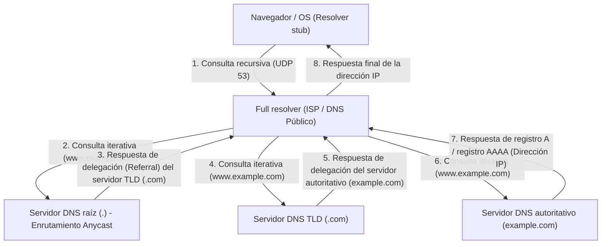

Esta compleja comunicación de ida y vuelta jerárquica generalmente se completa en un instante, de unos pocos a unas docenas de milisegundos. El DNS utiliza principalmente el puerto UDP 53 como protocolo de capa de transporte. Al eliminar por completo la sobrecarga de ida y vuelta del saludo de tres vías (three-way handshake: SYN, SYN-ACK, ACK) de TCP, logra una reducción extrema de la latencia. Sin embargo, cuando la carga útil de respuesta del DNS supera los 512 bytes del límite histórico de UDP (actualmente mayor gracias a la extensión EDNS0), o cuando se realiza la verificación de clave de DNSSEC (DNS Security Extensions), que es una extensión de firma digital criptográfica para evitar ataques de envenenamiento de caché de DNS, o cuando se realiza una transferencia de zona (AXFR), se estipula un respaldo (fallback) al puerto TCP 53 de alta confiabilidad.

## 5.2 Teoría de la evolución de la arquitectura y el protocolo HTTP

El navegador, tras obtener la dirección IP del servidor destino a través de DNS, establece a continuación una conexión TCP con el servidor destino (puerto 80 o 443), e inicia el diálogo mediante HTTP (HyperText Transfer Protocol), el idioma principal de la capa de aplicación.

HTTP, inventado en 1989 por Tim Berners-Lee de la Organización Europea para la Investigación Nuclear (CERN), fue originalmente un protocolo extremadamente simple para que los físicos de todo el mundo compartieran eficientemente documentos de investigación (hipertexto) a través de la red y los vincularan mediante enlaces. Su estructura clara y basada en texto de línea de solicitud (método, URI, versión del protocolo), campos de encabezado, línea en blanco (CRLF) y cuerpo del mensaje impulsó fuertemente la depuración y difusión del sistema.

La idea de diseño fundamental y característica principal de HTTP es que carece de estado ("Stateless"). El servidor no mantiene ningún estado o contexto de solicitudes pasadas del cliente en la memoria. Cada solicitud se completa como una transacción completamente independiente. Esta naturaleza sin estado, que también es común en la arquitectura REST (Representational State Transfer), simplificó dramáticamente la implementación de los servidores e hizo fácil el escalado horizontal (scale-out) para distribuir la carga al aumentar el número de servidores con el fin de manejar un tráfico masivo. Un balanceador de carga puede garantizar el mismo resultado sin importar a qué servidor backend asigne la solicitud. Sin embargo, en las modernas aplicaciones web interactivas donde la gestión del estado (State) es inevitable, como la función de carrito de compras en sitios de comercio electrónico o el mantenimiento del estado de inicio de sesión de un usuario, esta estricta falta de estado es una gran restricción. Para superar esto fuera del protocolo, se idearon las cookies, que permiten guardar el estado en el lado del cliente a través de encabezados HTTP, o los mecanismos de gestión de estado pseudo utilizando tokens de sesión.

### La lucha contra las restricciones físicas: El cambio de paradigma de HTTP/1.1 a HTTP/3

Con la difusión explosiva de la Web y la enorme cantidad de recursos (imágenes, CSS, archivos JavaScript, etc.) incluidos en una sola página, HTTP se enfrentó a las leyes físicas de la red (límite de retardo debido a la velocidad de la luz y pérdida de paquetes) y experimentó una evolución arquitectónica dramática a nivel de protocolo.

- **HTTP/1.1 (1997 - )**: En el HTTP/1.0 inicial, cada vez que se solicitaba un recurso, se repetía el establecimiento y desconexión de la conexión TCP (saludo de 3 vías y saludo de 4 vías), lo que era el colmo de la ineficiencia desde el punto de vista de la latencia. En HTTP/1.1 se estandarizó la conexión persistente (Persistent Connection / Keep-Alive), reduciendo drásticamente el costo de conexión al hacer que una sola conexión TCP fuera reutilizable. Sin embargo, la tecnología de "pipelining" (canalización) de HTTP/1.1 no se popularizó debido a dificultades de implementación y problemas de compatibilidad de los proxies intermedios, y sufría de un defecto estructural fatal llamado bloqueo "Head-of-Line (HoL)". Este es un fenómeno en el que, mientras el servidor procesa un recurso gigantesco o una solicitud de procesamiento pesado en una sola conexión TCP, las solicitudes posteriores se atascan en la cola y la latencia general empeora. Para evitar esto, los navegadores se vieron obligados a recurrir al truco de fuerza bruta de establecer múltiples conexiones TCP (generalmente alrededor de 6) simultáneamente hacia el mismo dominio (como el domain sharding).
- **HTTP/2 (2015 - )**: HTTP/2, estandarizado sobre la base del protocolo SPDY desarrollado por Google, renovó radicalmente la arquitectura del protocolo desde "basado en texto" a "basado en entramado binario (binary framing)". La innovación más importante es la "Multiplexación (Multiplexing) de flujos". En HTTP/2, se crean múltiples "flujos (streams)" virtuales dentro de una única conexión TCP, dividiendo los datos de solicitud y respuesta en pequeños marcos binarios y permitiendo su envío intercalado (interleaved) sin importar el orden. Con esto, el bloqueo HoL en la capa de aplicación se eliminó por completo. Además, el mecanismo de compresión de encabezados que utiliza el algoritmo HPACK (una combinación de codificación Huffman estática y tablas dinámicas) redujo drásticamente el volumen de transferencia de datos redundantes como cookies y User-Agent que se enviaban repetidamente en cada solicitud, maximizando la eficiencia de uso del ancho de banda de la red al extremo.
- **HTTP/3 (2022 - )**: Aunque HTTP/2 resolvió brillantemente el bloqueo HoL en la capa de aplicación, el muro físico del "bloqueo HoL en caso de pérdida de paquetes" en la capa de transporte (TCP) subyacente se mantuvo. Para garantizar la confiabilidad, si falta un solo paquete en TCP, se detiene la entrega de paquetes de datos a la capa de aplicación de todos los flujos sobre esa conexión TCP hasta que se completa la retransmisión (un efecto secundario del mecanismo de garantía de orden de TCP). Para romper este problema, HTTP/3 realizó un dramático cambio de paradigma descartando TCP, que fue la base de Internet durante décadas, y adoptando "QUIC (Quick UDP Internet Connections)", un nuevo protocolo de transporte basado en UDP. QUIC evita el retraso evolutivo de TCP, que está implementado en el espacio del kernel del SO, e incorpora sobre UDP, que se puede implementar en el espacio de usuario, su propio control de retransmisión, control de congestión y control de flujo independiente para cada flujo. Incluso si se pierden paquetes, el único afectado es ese flujo en particular, y otros flujos pueden continuar el procesamiento sin ser bloqueados. Además, QUIC integra el saludo de establecimiento de conexión con el saludo de cifrado (TLS 1.3), lo que permite comenzar a transmitir datos cifrados en "0-RTT (Zero Round Trip Time)" con servidores con los que haya un registro de comunicación previo. Este es el fruto resultante de la búsqueda del máximo rendimiento al recortar minuciosamente la cantidad de viajes de ida y vuelta (RTT) en la capa de protocolo frente a los límites de la velocidad de la luz física (la comunicación con el otro lado del mundo sufrirá inevitablemente cientos de milisegundos de latencia).

## 5.3 El mecanismo de cifrado y confianza: El abismo matemático y la lógica de la prueba de SSL/TLS

Internet es inherentemente una red de comunicación de paquetes abierta, donde los datos se transfieren estilo cadena humana hacia su destino a través de innumerables enrutadores y cables submarinos de fibra óptica. Es físicamente posible que cualquier nodo en esa ruta (enrutadores intermediarios, un ISP malicioso o un fisgón en la misma red Wi-Fi) intercepte e incluso altere el contenido de la comunicación mediante captura de paquetes (packet capture). Es el SSL (Secure Sockets Layer) y su sucesor, el protocolo TLS (Transport Layer Security), los que contienen la vulnerabilidad absoluta de esta red mediante el poder de las matemáticas avanzadas y establecen un canal de comunicación seguro.

Lo que TLS garantiza en la comunicación web moderna son los siguientes "tres pilares de la seguridad".
1. **Confidencialidad (Confidentiality)**: Incluso si el contenido de la comunicación es interceptado por un tercero, no puede ser descifrado.
2. **Integridad (Integrity)**: Los datos no se alteran ni un solo bit en la ruta de comunicación. Está garantizado por MAC (Message Authentication Code) o AEAD (Authenticated Encryption with Associated Data).
3. **Autenticación (Authentication)**: La otra parte de la comunicación es el propietario legítimo del dominio (el servidor auténtico).

Las tecnologías que logran esto son la cristalización de la teoría de la criptografía que la humanidad ha construido a lo largo de los siglos y ha saltado especialmente por el desarrollo de la informática y la teoría de números desde la Segunda Guerra Mundial.

### Intercambio de claves y criptografía de clave pública: El problema del logaritmo discreto y el muro de la factorización prima

El método de cifrado más simple y rápido de procesar es la "Criptografía de clave simétrica (Symmetric Cryptography)" (el estándar actual es AES: Advanced Encryption Standard). Este es un método en el que el remitente y el receptor realizan el cifrado y descifrado utilizando la misma "clave simétrica". Dado que el procesamiento matemático es ligero (combinaciones de operaciones XOR de bits, sustitución y transposición), es adecuado para cifrar comunicaciones de nivel gigabit en tiempo real. Sin embargo, la criptografía de clave simétrica tenía una paradoja fundamental (problema de distribución de claves): "¿Cómo pasar de forma segura esa misma clave simétrica secreta a la otra parte antes de iniciar la comunicación?". En las comunicaciones con una parte sin una relación de confianza previa, como en Internet, si se envía la clave simétrica tal cual, será interceptada en el camino y el cifrado perderá su sentido.

El mayor avance en la historia de la criptografía humana que resolvió esto fue el algoritmo de intercambio de claves publicado por Whitfield Diffie y Martin Hellman en 1976, y la "Criptografía de clave asimétrica (Asymmetric Cryptography) / pública" ideada por RSA (Rivest, Shamir, Adleman) y otros en 1977.

En la raíz de la criptografía de clave pública existe el concepto matemático de la "función unidireccional (One-way function)" o la "función unidireccional con trampa (Trapdoor one-way function)". Esto aprovecha la asimetría de que "el cálculo en una dirección (cifrado) se completa instantáneamente con una computadora, pero el cálculo en la dirección inversa (descifrado o conjetura de la clave) no terminaría incluso si las supercomputadoras de todo el mundo estuvieran conectadas y calcularan durante la vida del universo".

- **Criptografía RSA**: Se basa en la propiedad de que es fácil (computable en tiempo polinómico) multiplicar dos números primos muy grandes ($p$ y $q$) para crear un número compuesto gigante ($N = p \times q$), pero dado solo ese enorme número compuesto $N$, derivar los factores primos originales $p$ y $q$ (problema de factorización prima) es extremadamente difícil (solo se conocen algoritmos de tiempo subexponencial). Utilizando las propiedades profundas de la teoría de números, como la función totiente de Euler y el pequeño teorema de Fermat, construye una trampa matemática donde los datos cifrados con la clave pública solo pueden ser descifrados por aquel que tiene la clave privada correspondiente.
- **Criptografía de curva elíptica (ECC: Elliptic Curve Cryptography)**: ECC, que es la corriente principal en el TLS actual, aplica la dificultad del "problema del logaritmo discreto" definido en curvas elípticas sobre campos finitos (por ejemplo, un conjunto de puntos que satisfacen una ecuación como $y^2 = x^3 + ax + b$). Define operaciones geométricas como la "suma" o "multiplicación escalar" para puntos en la curva elíptica. Es fácil encontrar un punto $P = kG$ sumando un cierto punto inicial $G$ un número secreto de veces $k$, pero calcular hacia atrás el coeficiente secreto $k$ (logaritmo discreto) de cuántas veces se sumó a partir de los puntos publicados $G$ y $P$ es aún más difícil que la factorización prima de RSA. Debido a esto, ECC cuenta con una fuerza criptográfica equivalente o superior con una longitud de clave extremadamente corta de una fracción de la de RSA (por ejemplo, logra con ECC 256bit una seguridad equivalente a RSA 2048bit), ahorrando drásticamente la carga de la CPU y el ancho de banda de la red.

### El saludo TLS (TLS Handshake): El ritual criptográfico para construir confianza

Al iniciar una comunicación segura a través de HTTPS, el cliente y el servidor generan una "clave de sesión" segura para el cifrado de clave simétrica y ejecutan un protocolo de negociación avanzado para autenticar la identidad del otro. Este es el saludo de TLS. A continuación, se presenta la anatomía del saludo 1-RTT en "TLS 1.3", que es el último estándar en el que se han eliminado al máximo los elementos innecesarios.

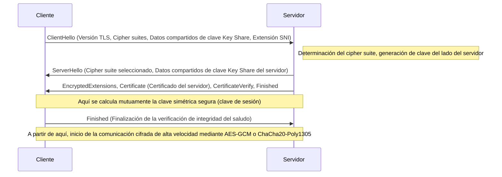

1. **ClientHello**: Al iniciar la conexión, el cliente envía al servidor la versión de TLS que admite, una lista de algoritmos de cifrado (Cipher Suites) y los parámetros matemáticos iniciales para generar la clave de cifrado (Key Share). Además, mediante la extensión SNI (Server Name Indication), transmite el nombre de host de destino (por ejemplo: `www.example.com`) en texto plano. Esta es una información indispensable para que un servidor que opera múltiples dominios HTTPS en una sola dirección IP (host virtual) seleccione y devuelva el certificado correcto.
2. **ServerHello**: El servidor selecciona el algoritmo de cifrado más fuerte y óptimo de la lista del cliente (por ejemplo: `TLS_AES_256_GCM_SHA384`) y responde junto con sus propios datos de Key Share.
3. **Envío y firma del certificado (Authentication)**: El servidor envía su propio "certificado digital (X.509)". Además, el servidor utiliza la "clave privada" asociada con ese certificado para crear y enviar una firma digital (CertificateVerify) sobre el valor hash de todos los mensajes de saludo hasta el momento. Esto prueba matemáticamente que el servidor es el propietario legítimo de ese certificado (poseedor de la clave privada).
4. **Intercambio de claves (Ephemeral Elliptic Curve Diffie-Hellman: ECDHE)**: El cliente y el servidor multiplican matemáticamente sus respectivos Key Share enviados y recibidos (puntos públicos en la curva elíptica) y los parámetros secretos que solo ellos tienen. Sorprendentemente, por la propiedad matemática del intercambio de claves Diffie-Hellman ($ (g^a)^b = (g^b)^a = g^{ab} $), sin enviar ninguna información secreta a través de la red, un "secreto maestro (master secret / clave simétrica)" exactamente igual y robusto se sintetiza mágicamente en el lado del cliente y en el lado del servidor.
5. **Secreto perfecto hacia adelante (Perfect Forward Secrecy: PFS)**: Una característica extremadamente importante de TLS 1.3 es que los parámetros utilizados para este intercambio de claves (Key Share) se generan recientemente para un solo uso (Ephemeral) cada vez que se establece una sesión. De esta manera, incluso si la clave privada a largo plazo del servidor utilizada para la verificación de identidad (clave RSA o ECDSA) se filtrara a un atacante unos años después, es matemáticamente imposible por completo descifrar retrospectivamente los paquetes de comunicación cifrados registrados y guardados en el pasado. La confidencialidad de las comunicaciones pasadas está garantizada hacia el futuro.

### PKI y la cadena de confianza (Chain of Trust): El pasaporte del mundo digital

En los mecanismos de cifrado descritos hasta ahora, queda un vacío lógico fatal: "¿Cómo puede estar seguro el cliente de que el certificado y la clave pública enviados por el servidor son realmente del dominio de destino (por ejemplo, el sitio web de un banco)?".
Si un atacante intermediario malicioso que controla la ruta de la red realiza un "Ataque de hombre en el medio (Man-in-the-Middle Attack)", simulando ser el servidor y enviando su propio certificado falso y clave pública al cliente, el intercambio de claves y el cifrado en sí tendrán éxito matemáticamente de manera perfecta. Sin embargo, la otra parte de la comunicación cifrada no será el banco previsto, sino el atacante.

El marco social y técnico para resolver este desafío de autenticación fundamental es la PKI (Public Key Infrastructure: Infraestructura de Clave Pública) y la existencia de las "Autoridades de Certificación (CA: Certificate Authority)", que sirven como anclajes de confianza.

El propietario del servidor crea una solicitud de firma de certificado (CSR) que incluye su propia clave pública y la presenta a una CA externa de confianza, como DigiCert, GlobalSign o Let's Encrypt. Después de verificar firmemente (validación de dominio, validación de existencia corporativa, etc.) que la propiedad del dominio pertenece al solicitante, la CA aplica una "firma digital" a la información de la clave pública del servidor utilizando su propia y poderosa "clave privada", y lo emite como un certificado de servidor.

Por otro lado, los sistemas operativos como Windows y macOS, así como los navegadores como Chrome y Firefox, tienen preinstalados un conjunto de "certificados raíz (claves públicas)" de CA raíz sometidas a estrictas auditorías globales codificados de forma rígida (hardcoded) como puntos de base de confianza (Trust Anchor).

Cuando un cliente recibe un certificado de un servidor, utiliza la clave pública de la CA raíz integrada en el sistema operativo para realizar una verificación criptográfica de la firma digital de la CA adjunta al certificado. Si la verificación de la firma tiene éxito, se prueba que el contenido del certificado (nombre de dominio y clave pública) está garantizado por la CA y no ha sido alterado.

1. El cliente confía incondicionalmente en la CA raíz (preinstalación en el almacén de confianza - trust store).
2. La CA raíz confía en la CA intermedia y la firma.
3. La CA intermedia confía en la entidad final (servidor web) y la firma.

A través de esta relación transitiva llamada "Cadena de Confianza (Chain of Trust)", construimos de forma dinámica e instantánea una relación de confianza sólida con servidores desconocidos y físicamente distantes, estableciendo canales de comunicación cifrados seguros.

## Conclusión: La fusión de capas y hacia la siguiente frontera

En el capítulo 5, hemos realizado una disección detallada del abismo de la capa de aplicación, el protocolo de solicitud y respuesta de datos, la resolución de nombres y el velo matemático del cifrado que lo envuelve todo.
El DNS funciona como una vasta libreta de direcciones distribuida en Internet, HTTP establece su arquitectura como portador de recursos, y TLS lo protege firmemente con la armadura de la teoría criptográfica de vanguardia. Estos fueron diseñados históricamente como capas de protocolo independientes, pero en la Web moderna, como se ve en el QUIC de HTTP/3, los límites entre la capa de transporte, la capa de aplicación y la capa de cifrado se fusionan estrechamente, rompiendo los límites físicos de latencia y continuando evolucionando hacia una forma refinada que persigue el máximo rendimiento y la seguridad al mismo tiempo.

En el próximo capítulo, profundizaremos aún más en el abismo técnico, sobre cómo las solicitudes que han pasado por esta sólida comunicación cifrada y han llegado al lado del servidor generan contenido dinámico e interactúan con el sistema de base de datos en segundo plano: "La estructura interna del sistema backend y la computación distribuida".

# Capítulo 6: La infraestructura física que sustenta Internet: el mecanismo gigante tejido por la luz, el calor y el océano

A menudo se habla de Internet como un concepto abstracto e intangible llamado "la nube" (cloud). Tenemos la ilusión de que los datos enviados desde nuestros teléfonos inteligentes y computadoras son absorbidos por el almacenamiento "en algún lugar del cielo" a través de ondas de radio y cables invisibles. Sin embargo, la realidad de Internet no es tan ligera como una nube. Es la infraestructura física más grande en la historia de la humanidad, extremadamente pesada, material y fuertemente ligada a las leyes de la termodinámica, la óptica y la geofísica.

En este capítulo, analizaremos exhaustivamente los tres pilares gigantes que materializan esta "red invisible" en el mundo físico: los "cables submarinos", que son la red neuronal a escala global; los "centros de datos a hiperescala", instalaciones de procesamiento termodinámico responsables del almacenamiento y cálculo de datos; y las "CDN (redes de entrega de contenido)", que rompen la barrera de la velocidad de la luz y comprimen el espacio-tiempo. Todo esto desde la perspectiva de su mecanismo físico, antecedentes históricos y un punto de vista técnico profesional que persigue los límites extremos.

---

## 1. La red neuronal de luz que envuelve la Tierra: el sistema de cables submarinos

En la actualidad, aproximadamente el 99% de las comunicaciones internacionales de Internet que cruzan fronteras no pasan por satélites artificiales que vuelan en el espacio exterior, sino a través de "cables de comunicaciones submarinos" de solo unos pocos centímetros de diámetro tendidos en el fondo del mar. Cuando navegamos por sitios web extranjeros, esos datos viajan a la velocidad de la luz a través de la oscuridad más profunda a miles de metros en el fondo del océano.

### 1.1 Evolución del telégrafo a la fibra óptica y el desafío del límite de Shannon

La historia de los cables submarinos es mucho más antigua que el nacimiento de Internet y se remonta al tendido del cable telegráfico entre el Canal de la Mancha en 1850. En 1858 se tendió el primer cable telegráfico transatlántico, pero en ese momento la comunicación se realizaba mediante código Morse, y se tardaba más de diez horas en enviar un mensaje de la reina Victoria al presidente estadounidense Buchanan. Posteriormente, tras la era de las líneas telefónicas analógicas con cables coaxiales, se empezaron a introducir cables de fibra óptica a finales de la década de 1980. La capacidad del "TAT-8", el primer cable transatlántico de comunicaciones ópticas tendido en 1988, era de 280 Mbps (equivalente a unas 40.000 líneas telefónicas), un ancho de banda revolucionario para la época.

Los cables submarinos modernos cuentan con una capacidad de comunicación inimaginable de cientos de Tbps (terabits por segundo) en un solo cable. Esta evolución espectacular fue posible gracias a dos avances físicos y de ingeniería de nivel del Premio Nobel: la "Multiplexación por División de Longitud de Onda (WDM: Wavelength Division Multiplexing)" y el "Amplificador de Fibra Dopada con Erbio (EDFA: Erbium-Doped Fiber Amplifier)".

WDM es una tecnología que multiplexa y transmite simultáneamente luz de diferentes longitudes de onda (colores) en una sola fibra óptica. Esto aumenta multiplicativamente la capacidad de transmisión por fibra según el número de longitudes de onda. Sin embargo, por muy purificado que esté el cristal de cuarzo (el material de la fibra óptica), la señal óptica se atenúa debido a la dispersión de Rayleigh y la absorción infrarroja tras recorrer cientos de kilómetros. Por lo tanto, se necesitan repetidores instalados cada decenas o cientos de kilómetros.

Antiguamente, los repetidores realizaban un proceso complejo y restrictivo (conversión O-E-O) de convertir la señal óptica atenuada en señal eléctrica, amplificarla y luego volver a convertirla en señal óptica. Sin embargo, el EDFA, comercializado en la década de 1990, dopó el núcleo de la fibra óptica con el elemento de tierras raras erbio, e irradiándolo con un fuerte láser llamado luz de bombeo, posibilitó amplificar directamente las señales ópticas "como luz". Esto permitió amplificar simultáneamente múltiples señales ópticas de diferentes longitudes de onda, y en combinación con la tecnología WDM, la capacidad de comunicación aumentó explosivamente.

En la actualidad, el campo de la ingeniería de telecomunicaciones se está acercando al "Límite de Shannon", el límite teórico de la capacidad del canal propuesto por Claude Shannon. Para superarlo, se han empezado a investigar e implementar tecnologías de capa física de próxima generación, como la "fibra multinúcleo", que tiene múltiples núcleos en una sola fibra, y la "Multiplexación por División Espacial (SDM: Space Division Multiplexing)", que multiplexa los modos espaciales de la luz.

### 1.2 Entorno físico en aguas profundas e ingeniería del tendido de cables

El tendido de cables submarinos es una de las obras de ingeniería más duras de la actualidad. Los cables, que se extienden a lo largo de miles de kilómetros, se hunden en el lecho marino utilizando "barcos cableros" (Cable layer) especializados.

Antes del tendido, se crean con precisión mapas topográficos del fondo marino utilizando ecosondas, y se seleccionan las rutas óptimas evitando cordilleras submarinas, fosas, yacimientos hidrotermales y zonas con riesgo de deslizamientos. La estructura del cable difiere drásticamente según la profundidad del agua donde se tiende.

En zonas marítimas poco profundas, como las plataformas continentales (menos de 1000 a 1500 metros de profundidad), el riesgo de cortes físicos debido a redes de arrastre, anclas de barcos o mordeduras de criaturas marinas como tiburones es extremadamente alto. Por lo tanto, se aplica una "armadura" (Armor) enrollando múltiples capas de alambre de acero de alta resistencia alrededor de la resina de policarbonato y el tubo de cobre que protegen la fibra óptica, haciéndola más gruesa y pesada. Además, se utilizan Vehículos Operados Remotamente (ROV) y arados submarinos para enterrar el cable varios metros en el barro y la arena del fondo marino.

Por otro lado, en zonas de aguas profundas a miles de metros de profundidad, como no existen amenazas de redes de pesca o anclas, se utilizan "cables ligeros" (Lightweight Cable) sin armadura de acero para evitar roturas por su propio peso durante el tendido, a la vez que mantienen la robustez suficiente para soportar la presión del agua. El diámetro es de solo 17 a 20 milímetros, casi tan grueso como una manguera de jardín.

Otro aspecto físico importante de los cables submarinos es el "suministro de energía". Para alimentar los repetidores instalados cada decenas de kilómetros, se suministra corriente continua de alto voltaje a través de un tubo de cobre (conductor de alimentación) en el interior del cable desde una "Estación de Aterrizaje de Cables" (Cable Landing Station) en tierra. Para los cables que cruzan el océano, el voltaje de suministro puede superar los 10,000 voltios (10 kV), y se adopta comúnmente el "Sistema de Retorno por Tierra de un Solo Hilo", que utiliza el agua de mar y la tierra como circuito de retorno.

### 1.3 Geopolítica y el ascenso de las grandes empresas tecnológicas

En el pasado, debido a la enorme inversión requerida para tender cables submarinos, el método principal consistía en que las principales operadoras de telecomunicaciones de cada país se agruparan para formar un consorcio y repartir los costos y el ancho de banda. Sin embargo, en los últimos años, este ecosistema ha sufrido una transformación dramática.

Empresas tecnológicas gigantes conocidas como "hiperescaladores", como Google, Meta (Facebook), Microsoft y Amazon, han comenzado a invertir y tender cables submarinos directamente, solas o conjuntamente, para conectar sus centros de datos a velocidades ultrarrápidas. Se han transformado de meros usuarios de Internet en los mayores propietarios de infraestructuras físicas. Como resultado, el enrutamiento de los cables se está optimizando pasando de la tradicional "conexión entre grandes ciudades" a la "conexión más corta y rápida entre sus propios centros de datos".

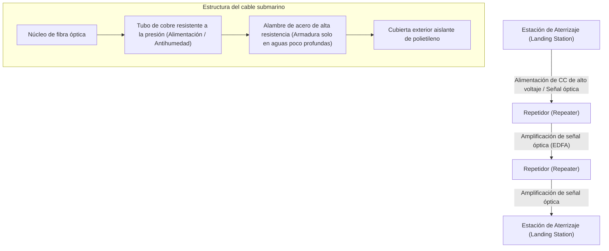

---

## 2. Instalación de procesamiento termodinámico de datos: Centro de datos a hiperescala

Los datos que llegan a tierra a través de cables submarinos se transportan finalmente a un "centro de datos". Un centro de datos es un edificio gigante que alberga desde decenas de miles hasta cientos de miles de servidores, que continúan realizando cálculos y almacenando de forma ininterrumpida las 24 horas del día, los 365 días del año.

### 2.1 La realidad de la nube y la batalla del "PUE"

Desde una perspectiva física, la esencia de un centro de datos es "un motor térmico gigante que toma una enorme cantidad de energía eléctrica como entrada y produce una reducción de entropía (resultados de cálculo) llamada procesamiento de información y el 'calor' inevitable que la acompaña". Los semiconductores como las CPU y GPU generan calor debido a la resistencia al encender y apagar las corrientes. Si este calor no se disipa eficientemente al exterior, los semiconductores se sobrecalentarán instantáneamente y se quemarán físicamente.

Por lo tanto, el mayor enfoque en el diseño y operación de los centros de datos es la "refrigeración" y la "eficiencia energética". El indicador más común que muestra esta eficiencia es el "PUE (Power Usage Effectiveness)".

**PUE = Consumo total de energía del centro de datos / Consumo de energía de los equipos de TI (servidores, etc.)**

El valor mínimo teórico del PUE es 1.0 (condición en la que toda la energía se utiliza puramente para cálculos). En el pasado, no era raro que los centros de datos tuvieran un PUE superior a 2.0 (es decir, consumían la misma cantidad de energía en equipos de refrigeración como aires acondicionados que la que usaban los servidores). Sin embargo, en los modernos centros de datos a hiperescala, se ha llevado a cabo una optimización termodinámica extrema para reducir esta cifra a entre 1.1 y 1.2.

### 2.2 Evolución de la arquitectura de refrigeración

Basados en los principios de la termodinámica, los sistemas de refrigeración de los centros de datos han evolucionado de la siguiente manera:

1. **Separación del pasillo frío y caliente (Hot Aisle / Cold Aisle)**:
   En los primeros centros de datos, toda la sala se enfriaba con equipos de aire acondicionado (CRAC: Computer Room Air Conditioning), pero el aire frío y el aire caliente expulsado de los servidores se mezclaban, lo cual era extremadamente ineficiente. Hoy en día, es estándar utilizar "contención de pasillos", en la que las partes frontales (entrada de aire) de los racks de servidores se enfrentan entre sí, al igual que las partes traseras (salida de aire), aislando físicamente los pasillos para el aire frío (pasillo frío) de los pasillos para el aire caliente (pasillo caliente).

2. **Refrigeración por aire exterior (Free Cooling)**:
   Se requiere una enorme cantidad de energía para hacer funcionar los compresores de las enfriadoras (chillers). Por ello, se ha popularizado el "Free Cooling", que consiste en construir centros de datos en regiones donde el aire exterior es lo suficientemente frío (como los países nórdicos o Hokkaido) y utilizar directamente el aire exterior o indirectamente mediante intercambiadores de calor para la refrigeración.

3. **Refrigeración por inmersión (Immersion Cooling) y refrigeración líquida directa (Direct-to-Chip)**:
   En los últimos años, la densidad de calor de las GPU de gama alta utilizadas para el aprendizaje e inferencia de IA está superando los límites físicos de la refrigeración por aire tradicional (debido a la baja capacidad calorífica y conductividad térmica del aire). Por esta razón, se ha comenzado a introducir la "refrigeración por inmersión", en la que toda la placa base del servidor se sumerge directamente en un líquido inerte no conductor basado en flúor o aceite mineral, y la "refrigeración Direct-to-Chip", en la que un bloque de agua (bloque de refrigeración líquida) se fija directamente al disipador de calor de la CPU/GPU para extraer el calor directamente mediante un líquido con una capacidad calorífica mucho mayor que el aire. Con la refrigeración por inmersión de dos fases, que utiliza cambios de fase (calor de vaporización al hervir el líquido), es posible manejar flujos de calor extremadamente altos.

### 2.3 Redundancia y seguridad física

Como los centros de datos son fundamentales para la infraestructura social, requieren de una redundancia (Redundancy) extrema. En el instante en que se interrumpe el suministro de energía comercial, un Sistema de Alimentación Ininterrumpida (SAI / UPS), que utiliza volantes de inercia, baterías de plomo-ácido o baterías de iones de litio, asume el suministro de energía en cuestión de milisegundos. Al mismo tiempo, arrancan enormes generadores diésel o de turbina de gas instalados fuera del edificio, que tienen la capacidad de mantener en funcionamiento toda la instalación durante varios días utilizando combustible almacenado.

En cuanto a las conexiones de red, se aseguran introduciendo líneas de múltiples operadoras de telecomunicaciones diferentes y separando completamente las rutas físicas (introduciéndolas desde diferentes direcciones, como el este, oeste, sur y norte del edificio), con el fin de estar preparados para accidentes, como cortes de cables causados por trabajos de excavación.

---

## 3. Tecnología que comprime el espacio-tiempo: CDN (Red de Entrega de Contenido)

Incluso si los cables submarinos conectan continentes y los centros de datos almacenan información, eso por sí solo no garantiza la experiencia web moderna. Aquí es donde se interpone el límite absoluto de velocidad del universo propuesto por Albert Einstein: "la barrera de la velocidad de la luz".

### 3.1 La barrera de la velocidad de la luz y el límite físico de la latencia

La velocidad de la luz en el vacío ($c$) es de unos 300,000 km/s. Sin embargo, como el índice de refracción del cristal de cuarzo que compone el núcleo de la fibra óptica es de aproximadamente 1.47, la velocidad de la luz a través de la fibra disminuye a unos 200,000 km/s (alrededor de dos tercios de la velocidad en el vacío).

Por ejemplo, la distancia física en línea recta desde Tokio (Japón) hasta el estado de Virginia en la costa este de los Estados Unidos (la mayor concentración de centros de datos del mundo) es de unos 11,000 km; teniendo en cuenta las rutas de los cables submarinos, es de unos 14,000 km. El tiempo físico puro requerido para que la señal óptica viaje en una dirección es de unos 70 milisegundos. Puesto que las comunicaciones por Internet requieren un viaje de ida y vuelta para los paquetes (RTT: Round Trip Time), las leyes de la física dictan que ocurrirá inevitablemente una latencia de al menos 140 milisegundos. A esto se le añade la latencia de procesamiento en los enrutadores (routers) y conmutadores (switches) del camino.

Al abrir un sitio web moderno, el navegador solicita cientos de archivos, incluyendo HTML, CSS, JavaScript e imágenes, provocando numerosos viajes de ida y vuelta de datos para el protocolo de enlace de tres vías (3-way handshake) de TCP y la negociación de cifrado TLS (SSL). Si todos los usuarios tuvieran que acceder directamente al "servidor de origen" al otro lado del mundo, se produciría un retraso de varios segundos a más de una década de segundos antes de que se mostrara la página web, lo que haría totalmente imposibles los juegos online en tiempo real y la transmisión de video de alta calidad.

### 3.2 Distribución hacia el borde: La arquitectura CDN

El sistema que supera ingenierilmente este límite físico y comprime el espacio-tiempo es la "CDN (Content Delivery Network)".

La idea básica de una CDN es sumamente simple: "Si es lento obtener los datos del servidor de origen ubicado lejos del usuario, bastará con colocar copias de los datos (cachés) de antemano en el lugar físicamente más cercano al usuario".

Los proveedores de CDN instalan físicamente miles o decenas de miles de servidores de caché llamados "servidores perimetrales" (Edge Server) dentro de las instalaciones de centros de datos y proveedores de servicios de Internet (ISP) en las principales ciudades de todo el mundo. Cuando un usuario accede a un sitio web, la red de la CDN determina instantáneamente la ubicación geográfica y de red del usuario, y enruta la comunicación al servidor perimetral con la latencia más baja (el más cercano).

La tecnología central que permite este enrutamiento es el "Anycast" y el enrutamiento avanzado "basado en DNS". En el enrutamiento Anycast, se asigna exactamente la misma dirección IP a múltiples servidores perimetrales en todo el mundo. Utilizando el algoritmo de selección de rutas BGP (Border Gateway Protocol) que constituye la columna vertebral de Internet, los enrutadores funcionan para entregar automáticamente los paquetes al servidor que está "más cerca" en la red. Como resultado, un usuario en Tokio es dirigido inconscientemente al servidor perimetral de Tokio, y un usuario en Londres es guiado al servidor perimetral de Londres.

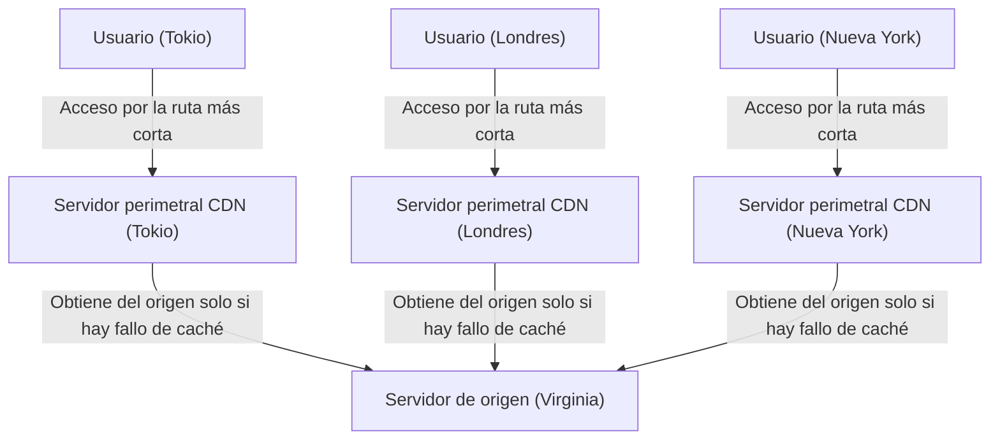

### 3.3 Optimización dinámica y la llegada de la computación perimetral (Edge Computing)

Las primeras CDN eran sistemas simples que solo almacenaban en caché y entregaban imágenes, videos y archivos HTML estáticos. Sin embargo, las CDN modernas han evolucionado hasta convertirse por sí mismas en gigantescas plataformas informáticas distribuidas.

En primer lugar, está la optimización de la entrega de contenido dinámico (como resultados de búsqueda diferentes para cada usuario o el contenido de los carritos de compras). Aunque estos no se pueden almacenar en caché, las CDN optimizan independientemente la ruta de comunicación entre el servidor perimetral y el servidor de origen (a través de Caché en Niveles -Tiered Cache- o construyendo una red de enrutamiento rápida dedicada), proporcionando un canal de comunicación estable y rápido con menos pérdida de paquetes que las rutas estándar de Internet (rutas de mejor esfuerzo de BGP). Además, al terminar la conexión TCP y la sesión TLS del lado del servidor perimetral (Terminate), reducen drásticamente el número de idas y vueltas para los protocolos de enlace con ubicaciones remotas.

En segundo lugar, el auge de la "computación perimetral" (Edge Computing). Anteriormente, el procesamiento de aplicaciones complejas (autenticación, pruebas A/B, redimensionamiento dinámico de imágenes, ejecución de lógica personalizada, etc.) se realizaba en la CPU del servidor de origen. Sin embargo, en la actualidad, con tecnologías representadas por Cloudflare Workers y AWS Lambda@Edge, los desarrolladores pueden utilizar entornos aislados o sandbox como el motor V8 para ejecutar código (JavaScript, Rust, WebAssembly, etc.) en milisegundos directamente en los servidores perimetrales más cercanos a los usuarios. Con esto, "el borde" (edge) de Internet literalmente está empezando a funcionar como un gigante ordenador distribuido.

---

## 4. Conclusión: La batalla sin fin contra los límites físicos

La historia de la infraestructura de Internet es una historia de lucha contra las leyes absolutas de la física que gobiernan el universo, tales como la velocidad de la luz, la segunda ley de la termodinámica y la ley de la conservación de la energía.

Los ingenieros de cables submarinos desafían la tremenda presión del agua en las profundidades del mar y los límites ópticos del cristal; los diseñadores de centros de datos persiguen los límites termodinámicos para enfriar las obleas de silicio que generan calor; y los arquitectos de CDN continúan construyendo sistemas avanzados de procesamiento distribuido para evadir la barrera de la velocidad de la luz.

Detrás de que nosotros toquemos nuestro smartphone y podamos acceder instantáneamente a información de todo el mundo, existe esta pesada, dura y extremadamente sofisticada infraestructura física. En el Capítulo 7, profundizaremos en "El mundo del enrutamiento y BGP", sobre cómo el software y los protocolos mantienen esta red autónoma distribuida a escala global por encima de esta sólida infraestructura física.

# Capítulo 7: La Batalla por la Ciberseguridad y la Privacidad

La historia de Internet es también la historia de una batalla constante entre el ideal de compartir información libremente y proteger sistemas y datos de ataques maliciosos. Originalmente, Internet, nacido como ARPANET, fue diseñado asumiendo la comunicación entre un grupo limitado de investigadores de confianza. Por lo tanto, en el diseño fundamental de sus protocolos, la "seguridad" quedó en segundo plano, resultando en una arquitectura basada en la creencia en la bondad humana. Sin embargo, a medida que la red se expandió a escala global, se comercializó y estableció su posición como infraestructura, esta filosofía de diseño inicial se convirtió en una debilidad fatal.

En este capítulo, exploraremos a fondo, asomándonos al abismo de la tecnología, los mecanismos físicos y de red de los ataques DDoS, una de las mayores amenazas que sacuden la Internet moderna; las tecnologías de cifrado y VPN (Redes Privadas Virtuales) para garantizar la privacidad de las comunicaciones; y el concepto de seguridad de próxima generación, la "Arquitectura Zero Trust" (Confianza Cero), surgida de los límites de la defensa perimetral.

## 1. Límites Físicos de la Red y la Dinámica de los Ataques DDoS

Uno de los ataques cibernéticos más primitivos, pero a la vez más difíciles de prevenir, es el **ataque DDoS (Distributed Denial of Service: Denegación de Servicio Distribuida)**. Este es un ataque que envía una cantidad masiva de tráfico, que excede los límites de la capacidad de procesamiento o del ancho de banda de la línea, a los servidores o equipos de red objetivo, haciendo imposible proporcionar servicios a los usuarios legítimos.

### Saturación Física del Tráfico: El Límite del Ancho de Banda
Internet transmite datos a través de medios físicos como fibra óptica, cables de cobre y ondas de radio. Aunque se han logrado capacidades de comunicación de la clase de terabits en estas rutas de transmisión mediante tecnologías como la multiplexación por división de longitud de onda (WDM), existe un estricto límite físico superior en el ancho de banda (por ejemplo, 1 Gbps o 10 Gbps) de la línea a la que está conectado cada servidor individual. Los ataques DDoS explotan este límite del "grosor de la tubería". Cuando un atacante manipula cientos de miles de dispositivos infectados con malware (botnets) distribuidos por todo el mundo para enviar paquetes simultáneamente al objetivo, la memoria intermedia (buffer) de las interfaces de enrutadores y conmutadores se desborda, produciendo la caída de paquetes (packet drop). Este fenómeno es similar a una tubería obstruida en dinámica de fluidos, y causa un mal funcionamiento de todo el sistema en el instante en que la cantidad de información (número de paquetes) supera la capacidad de procesamiento.

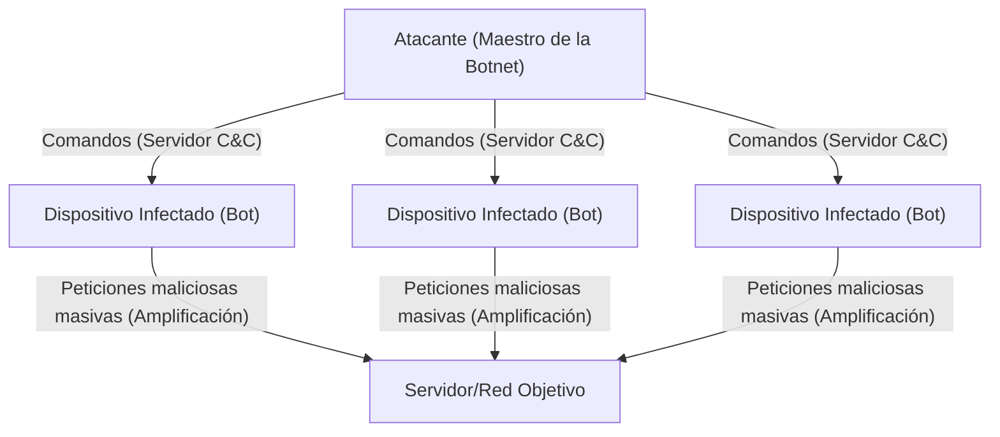

### Explotando las Vulnerabilidades de TCP/IP: Ataque SYN Flood
Además de llenar el ancho de banda, existen métodos de ataque que agotan los recursos del servidor (CPU y memoria). El ejemplo más representativo es el **ataque SYN Flood**. En el protocolo TCP, se sigue un procedimiento llamado "saludo de tres vías" (3-way handshake) para establecer una comunicación.
1. El cliente envía un paquete "SYN".
2. El servidor responde con un paquete "SYN-ACK" y reserva memoria (TCB: Transmission Control Block) para la conexión.
3. El cliente envía un paquete "ACK" para establecer la conexión.

El atacante envía una cantidad masiva de paquetes SYN con direcciones IP de origen falsificadas (spoofing) al servidor. El servidor devuelve SYN-ACK, pero el propietario de la dirección IP falsificada no devuelve el ACK (o no existe). Como resultado, el servidor acumula una gran cantidad de conexiones en un estado "semiabierto" (Half-open), agotando el espacio de memoria para la gestión de conexiones y viéndose obligado a rechazar nuevas solicitudes de conexión de usuarios legítimos. Este es un mecanismo de ataque brillante que vuelve en su contra la naturaleza de retención de estado (stateful) de TCP, que pretende "garantizar una comunicación confiable".

### Ataques de Reflexión (Amplificación): El Abuso de la Asimetría
Los **ataques de reflexión (ataques de amplificación)**, que utilizan el UDP (User Datagram Protocol), son aún más ingeniosos. UDP es un protocolo sin conexión y no verifica el origen de la transmisión. El atacante falsifica la dirección IP del objetivo como si fuera la de origen y envía solicitudes a servidores DNS públicos o servidores NTP en Internet. Al hacerlo, utilizan consultas específicas (como consultas DNS ANY o NTP monlist) que devuelven respuestas cientos o miles de veces mayores (varios kilobytes) que la pequeña solicitud inicial (decenas de bytes).
Los paquetes de respuesta amplificados y gigantescos entran en avalancha simultáneamente hacia el origen falsificado, es decir, el servidor objetivo. Los atacantes pueden generar tráfico a nivel de terabits contra el objetivo consumiendo solo una fracción del ancho de banda. Esto es la realización en la red de una asimetría, similar al "principio de la palanca" en física o la amplificación por resonancia en acústica.

## 2. El Secreto de las Rutas de Comunicación: Cifrado y Mecanismos de VPN

Los paquetes que fluyen por la red pública, Internet, son transportados a través de numerosos enrutadores y equipos de ISP en la ruta. Las comunicaciones en texto plano (clear text) no cifradas pueden ser fácilmente interceptadas (sniffing) y alteradas en el camino. Escudos poderosos para proteger la privacidad y la confidencialidad de los datos son la "Tecnología de Cifrado" y las "VPN (Virtual Private Network)".

### Fundamentos Matemáticos de la Criptografía Moderna: Híbrido de Clave Pública y Clave Simétrica
Para la protección de las comunicaciones, se utilizan principalmente dos métodos de cifrado.
- **Criptografía de clave simétrica (como AES)**: Se usa la misma clave para el cifrado y descifrado de los datos. La velocidad de procesamiento es muy alta, pero tiene el desafío de cómo entregar la clave de forma segura a la otra parte (problema de distribución de claves).
- **Criptografía de clave pública (como RSA o criptografía de curva elíptica)**: Se usa un par de claves: una "clave pública" para el cifrado y una "clave privada" para el descifrado. Se basa en propiedades matemáticas avanzadas (asimetría), como la dificultad de la factorización de números primos y el problema del logaritmo discreto. El coste computacional es alto.

En las comunicaciones seguras a través de Internet (TLS/SSL y VPN), se adopta un método híbrido que combina ambos. Primero, en el apretón de manos inicial de la comunicación, se intercambia de forma segura una "clave de sesión (clave simétrica)" utilizando criptografía de clave pública, y luego, para la comunicación posterior de grandes volúmenes de datos, se realiza el cifrado utilizando la clave de sesión de alta velocidad. Esto logra tanto una distribución de claves segura como una comunicación cifrada de alta velocidad.

### Principios de VPN y Tunelización
Una **VPN (Red Privada Virtual)** es una tecnología que utiliza tecnología de cifrado para construir una "línea dedicada (túnel)" virtual sobre la red pública de Internet. Los protocolos representativos incluyen IPsec y OpenVPN, y más recientemente WireGuard.

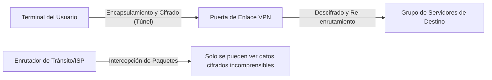

El mecanismo central de la tunelización es la "Encapsulación" (Encapsulation). Todo el paquete IP original (carga útil) que el usuario intenta enviar se cifra y luego se envuelve (encapsula) como la porción de datos de un nuevo paquete IP, y se adjunta un nuevo encabezado IP en el exterior dirigido al servidor VPN.
Los enrutadores de Internet en el camino solo miran el encabezado IP exterior y reenvían el paquete al servidor VPN. Dado que el contenido está fuertemente cifrado, incluso si el paquete es interceptado, es difícil analizar no solo el contenido de la comunicación, sino incluso la dirección IP de destino original. El paquete que llega al servidor VPN se descifra, se extrae el encabezado original y se envía al destino final. De esta manera, se crea un espacio privado lógica y matemáticamente protegido sobre una infraestructura a la que físicamente cualquiera puede acceder.

## 3. El Colapso de la Defensa Perimetral y el Auge de la Arquitectura Zero Trust

Durante muchos años, la seguridad de la red de empresas y organizaciones ha dependido de un concepto llamado "defensa perimetral" (modelo perimetral). Esta es una estrategia de defensa tipo fortaleza que coloca cortafuegos y sistemas de prevención de intrusiones (IPS) en el límite entre Internet (exterior) y la red corporativa (interior), y asume que "el exterior es peligroso, el interior es seguro".

### La Pérdida del Perímetro Provocada por la Nube y el Teletrabajo
Sin embargo, en la actualidad, este modelo ha colapsado por completo. Con la difusión del SaaS (Software as a Service), los datos importantes se almacenan en la nube fuera de la empresa, y con la generalización del teletrabajo, los empleados han comenzado a acceder desde el Wi-Fi de sus hogares o cafeterías. La frontera entre el "interior que debe protegerse" y el "exterior peligroso" se ha disuelto, y el tráfico incontrolable por los cortafuegos tradicionales ha aumentado explosivamente. Además, contra el malware (como el ransomware) que ha penetrado una vez en la red interna o contra actores maliciosos internos, la defensa perimetral es impotente. La premisa de que "el interior es de confianza" se ha convertido en la mayor vulnerabilidad.

### Zero Trust: No Confiar en Nada, Verificar Todo
Para responder a este cambio de paradigma se ha propuesto la **"Arquitectura Zero Trust" (ZTA)**. El principio básico de Zero Trust es que "independientemente de la ubicación de la red (dentro o fuera de la empresa), no se confía por defecto en ninguna comunicación (Never Trust, Always Verify)".

En el modelo Zero Trust, el enfoque de seguridad cambia de los "límites de la red" a la "identidad (usuarios y dispositivos)" y a los "recursos (datos y aplicaciones)".

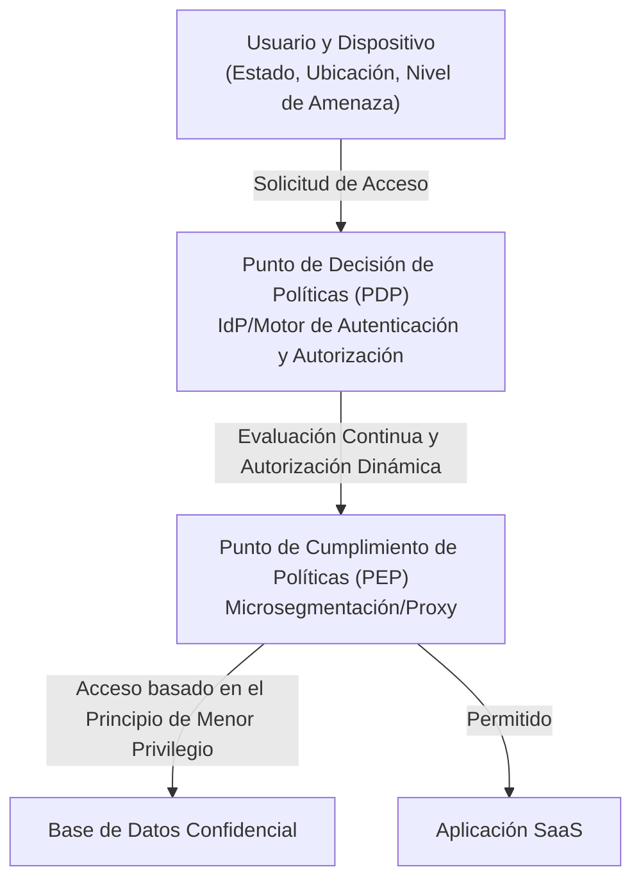

Los componentes tecnológicos centrales para lograr Zero Trust son los siguientes:

1. **Gestión de Identidad y Acceso (IAM/IdP)**: Verifica fuertemente la identidad del usuario combinando no solo contraseñas, sino también MFA (autenticación multifactor) o autenticación biométrica.
2. **Evaluación de la Postura (Salud) del Dispositivo**: Evalúa en tiempo real el estado de aplicación de parches del sistema operativo del terminal que solicita acceso, el estado de funcionamiento del software antivirus, el comportamiento pasado, etc. El acceso desde terminales no seguros se bloquea de inmediato.
3. **Microsegmentación**: Divide la red finamente y establece límites extremadamente pequeños para cada recurso. Es una estructura que previene la propagación horizontal del daño (movimiento lateral) en caso de que ocurra una intrusión.
4. **Autenticación Continua y Políticas Dinámicas**: No continúa confiando solo porque se haya iniciado sesión con éxito una vez. Durante la sesión, monitorea continuamente el comportamiento (cambio de IP de origen, volumen anormal de descarga de datos, etc.) y realiza un control dinámico que corta la sesión en el instante en que la puntuación de riesgo supera un umbral.

Zero Trust no es un simple producto, sino una filosofía de diseño que dicta que "se debe verificar cada acceso en todo momento y otorgar solo los privilegios mínimos necesarios (Least Privilege)", y se ha convertido en la única solución realista para proteger datos en la infraestructura de TI descentralizada de hoy.

## 4. El Futuro de la Seguridad: Criptografía Cuántica y Defensa de Redes de Próxima Generación

Cifrados como RSA y de curva elíptica de los que dependemos hoy se basan en la premisa de que "toma un tiempo astronómico descifrarlos con el poder de cálculo de las computadoras actuales". Sin embargo, si se lleva a la práctica una "computadora cuántica" que aplica los principios de la mecánica cuántica, existe el peligro de que estos problemas matemáticos se resuelvan instantáneamente mediante algoritmos como el de Shor. A esto se le llama **"Día Q" (Q-Day: El Día de la Desencriptación por Computadoras Cuánticas)**.

Para contrarrestar esto, actualmente se están investigando dos enfoques.
Uno es la estandarización de nuevos algoritmos de cifrado **"Criptografía Poscuántica (PQC: Post-Quantum Cryptography)"** que sean matemáticamente difíciles de descifrar incluso para computadoras cuánticas (como la criptografía basada en retículos).
El otro es la **"Distribución Cuántica de Claves (QKD: Quantum Key Distribution)"**, que utiliza las leyes de la física (mecánica cuántica) en sí mismas como base para la seguridad. Es una tecnología que entrega claves montando información en los estados cuánticos (como la polarización) de los fotones. Debido a que el estado cuántico cambia en el instante en que un espía intenta observar (copiar) el fotón (problema de medición, principio de incertidumbre), es una comunicación segura definitiva donde el espionaje puede ser detectado físicamente al 100%.

## Conclusión

El Capítulo 7 de Internet es un juego de balancín constante entre "conveniencia" y "seguridad". Desde la saturación de la capa física por los ataques DDoS, pasando por la defensa matemática a través de tecnologías de cifrado, hasta el cambio de paradigma arquitectónico de Zero Trust, la ciberseguridad ha evolucionado más allá de ser solo una tecnología de TI, hacia un campo de estudio extremadamente avanzado donde se cruzan la física, las matemáticas y la psicología del comportamiento.
Detrás del acto casual de abrir un navegador y manipular datos en la nube, se desarrolla una feroz guerra electrónica, con precisión de milisegundos, entre atacantes invisibles y sistemas de defensa las 24 horas del día, los 365 días del año.

En el próximo y último capítulo, el Capítulo 8, exploraremos el futuro de Internet, es decir, el paradigma de redes de próxima generación como la Web3.0, el Metaverso y la Internet Interplanetaria (Interplanetary Internet).

# Capítulo 8: El internet del futuro —— La red de próxima generación entrelazada por la descentralización, el espacio y la mecánica cuántica

A lo largo de las últimas décadas, el internet ha seguido evolucionando como la infraestructura de información más influyente en la historia de la humanidad. Comenzando con el establecimiento de la tecnología de conmutación de paquetes en ARPANET en la década de 1960, pasando por la estandarización del conjunto de protocolos TCP/IP, la invención de la WWW (World Wide Web) y llegando hasta la popularización de la banda ancha móvil, su avance no conoce límites. Sin embargo, el internet que utilizamos actualmente se enfrenta a límites fundamentales en su arquitectura y a restricciones físicas. Entre ellas se encuentran los problemas de centralización derivados del tamaño masivo de los centros de datos, los retrasos físicos de la fibra óptica en las comunicaciones intercontinentales y la vulnerabilidad de las tecnologías criptográficas existentes debido al aumento exponencial de la capacidad de cálculo (especialmente con el auge de las computadoras cuánticas).

En este capítulo, titulado "Capítulo 8: El internet del futuro", exploraremos la vanguardia de los cambios de paradigma que se están produciendo en la actualidad. Específicamente, detallaremos exhaustivamente desde una perspectiva profesional tres pilares: la "Web3 y la arquitectura descentralizada" que busca alejarse de la centralización, la "red de comunicación por satélite de órbita baja (como Starlink)" que expande las restricciones de la infraestructura física hacia el espacio exterior, y el "internet cuántico" que aplica las leyes fundamentales de la física a la comunicación, analizando sus antecedentes históricos, su física y sus mecanismos técnicos.

---

## 8.1 El verdadero valor de la Web3 y la arquitectura descentralizada: Construyendo una red sin necesidad de confianza (trustless)

El internet actual (Web2.0) se basa en la gestión centralizada de datos por parte de plataformas gigantes. Aunque el modelo cliente-servidor es eficiente, presenta problemas estructurales como la existencia de puntos únicos de fallo (SPOF: Single Point of Failure), la facilidad de censura y la violación de la privacidad de los datos del usuario. La respuesta a esto a nivel de arquitectura es la "Web3" y las tecnologías de redes descentralizadas.

### 8.1.1 Redes orientadas a contenido e IPFS
La Web tradicional (HTTP) está "orientada a la ubicación". Es decir, se accede a la información especificando "dónde está (URL)". Sin embargo, en este sistema, si un servidor se cae o un dominio expira, el contenido en sí desaparece, produciendo "enlaces rotos (404 Not Found)".

En contraste, los sistemas de almacenamiento descentralizado representados por IPFS (InterPlanetary File System) adoptan una arquitectura "orientada al contenido (Content-Addressed)". Se accede a los datos utilizando un "identificador de contenido (CID)" único obtenido al pasar el contenido del archivo por una función hash criptográfica (como SHA-256).

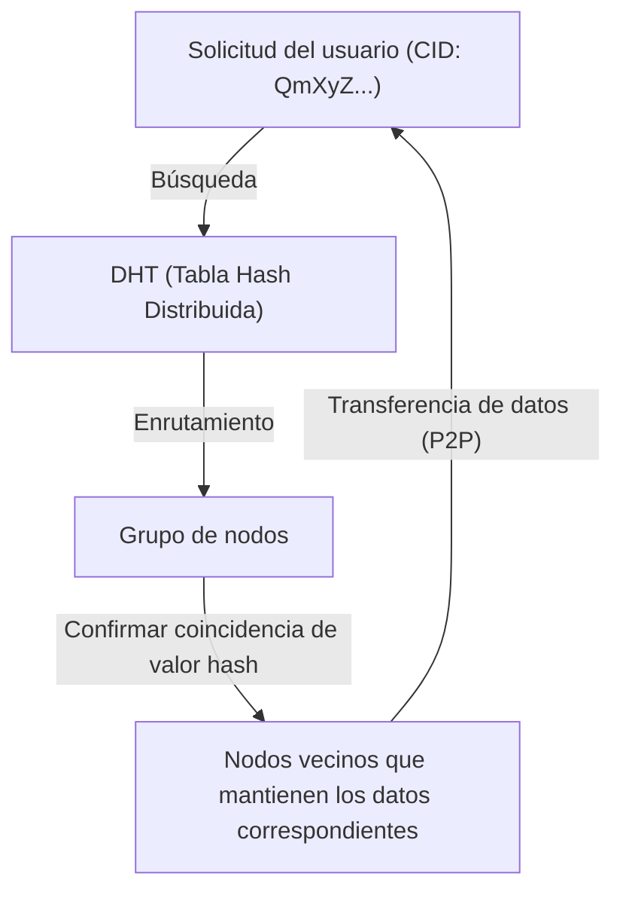

El núcleo de este mecanismo radica en el algoritmo Kademlia, que es un tipo de DHT (Distributed Hash Table: Tabla Hash Distribuida). Kademlia define la "distancia" entre el ID del nodo y el ID de los datos con una operación XOR (O exclusivo). Esto permite mapear de manera eficiente la topología de toda la red y descubrir nodos que mantienen los datos deseados con una complejidad computacional de $O(\log N)$. Dado que los datos se distribuyen y replican en nodos de todo el mundo, el acceso a los datos se mantiene incluso si algunos nodos se desconectan, otorgándole una fuerte resistencia a la censura.

### 8.1.2 Consenso descentralizado y pruebas criptográficas
Otra base de la Web3 es la tecnología blockchain. Esta se sostiene en redes descentralizadas mediante "algoritmos de consenso" en los que se acuerda "quién registra el estado correcto" sin la intervención de un administrador central.
El PoW (Proof of Work) adoptado inicialmente por Bitcoin utilizaba la resistencia a colisiones de las funciones hash, dificultando físicamente la manipulación mediante la inversión de una cantidad masiva de energía computacional. Sin embargo, desde la perspectiva del consumo de energía, actualmente se está avanzando hacia el PoS (Proof of Stake).

En el PoS adoptado en Ethereum 2.0 y otros, los validadores que han puesto en participación (staked) sus criptoactivos agrupan firmas utilizando una tecnología criptográfica especial basada en emparejamientos llamada firmas BLS (Boneh-Lynn-Shacham). Esto permite comprimir las firmas digitales de decenas a cientos de miles de nodos en un tamaño de datos minúsculo, logrando tanto una alta seguridad como una cierta escalabilidad a pesar de ser una red descentralizada. En el internet del futuro, se espera que estas tecnologías se implementen de manera estándar sobre TCP/IP como una nueva capa del modelo OSI (capa de transferencia de valor y consenso).

---

## 8.2 Red de comunicación por satélite que envuelve la Tierra: Starlink y más allá

La red de fibra óptica tendida en tierra es la columna vertebral del internet moderno. Sin embargo, existen restricciones físicas como el costo de tender cables submarinos, las limitaciones topográficas y, sobre todo, "la velocidad de la luz en un medio". Las constelaciones de satélites de órbita terrestre baja (LEO: Low Earth Orbit), representadas por Starlink de SpaceX, intentan resolver estos problemas en la frontera del espacio exterior.

### 8.2.1 Dinámica orbital y las ventajas de la órbita baja (LEO)
Los satélites de órbita geoestacionaria (GEO: Geostationary Earth Orbit) están ubicados a una altitud de aproximadamente 35,786 km y, al estar sincronizados con la rotación de la Tierra, tienen la ventaja de poder fijar la dirección de la antena. Sin embargo, dado que las ondas de radio viajan más de 70,000 km solo en ir y volver, no se pueden evitar los retrasos derivados de las restricciones físicas (aproximadamente 120 milisegundos solo de ida, con una latencia efectiva de más de 500 milisegundos).

Por otro lado, los satélites de Starlink se colocan en una órbita baja a una altitud de aproximadamente 550 km. Según la dinámica orbital basada en la tercera ley de Kepler, a esta altitud, para equilibrar la gravedad de la Tierra y la fuerza centrífuga, el satélite debe orbitar la Tierra a una velocidad feroz de aproximadamente 7.6 km/s (unos 27,000 km/h) (dando una vuelta a la Tierra en unos 90 minutos).
Debido a esta baja altitud, el tiempo de propagación física de las ondas de radio se reduce drásticamente a aproximadamente 1/65 de GEO, y la latencia teórica de comunicación es equivalente o inferior a la de la fibra óptica terrestre (20 a 40 milisegundos).

### 8.2.2 Antenas de arreglo en fase (Phased Array) y control del frente de onda de radio
Debido a que el satélite se mueve a alta velocidad, el terminal de usuario en tierra (una antena plana sin partes mecánicas móviles como las antenas parabólicas) debe rastrear eléctricamente al satélite a medida que pasa por encima. Aquí es donde se utiliza la "antena de arreglo en fase (Phased Array Antenna)".
Miles de antenas diminutas están alineadas en un plano, y la "fase (tiempo de la onda)" de las ondas de radio irradiadas por cada elemento se desplaza intencionalmente en microsegundos. Según el principio de Huygens, las ondas esféricas de cada elemento interfieren entre sí, formando un haz en el que las ondas se refuerzan (interferencia constructiva) solo en una dirección específica. Esto permite apuntar el haz de comunicación instantáneamente hacia el satélite objetivo utilizando únicamente el control por software, sin tener que mover físicamente la antena.

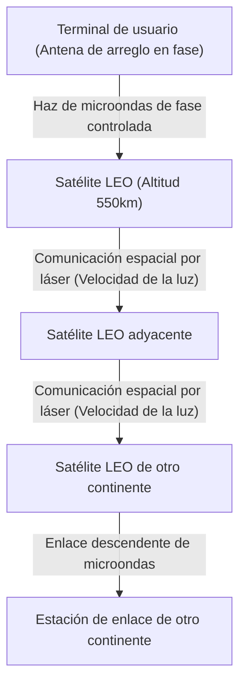

### 8.2.3 Comunicaciones ópticas espaciales (OISL) y la ventaja absoluta de la "velocidad de la luz en el vacío"
La verdadera revolución de la red Starlink radica en los enlaces ópticos entre satélites (OISL: Optical Intersatellite Links).
Las comunicaciones modernas a larga distancia dependen de la fibra óptica, pero el índice de refracción del núcleo de la fibra óptica (vidrio de cuarzo) es de aproximadamente 1.47. En física, la velocidad de la luz en un medio se expresa como $v = c / n$ ($c$ es la velocidad de la luz en el vacío y $n$ es el índice de refracción). En otras palabras, la velocidad de la luz dentro de la fibra óptica se reduce a aproximadamente 200,000 km/s.

En contraste, el índice de refracción del espacio exterior (vacío) está extremadamente cerca de 1, por lo que la comunicación por láser entre satélites se realiza a la velocidad de la luz en el vacío, $c \approx 300,000$ km/s.
Por ejemplo, considerando una transferencia de datos de Londres a Nueva York, una ruta que envíe los datos al espacio, los transmita a través del vacío del espacio mediante láseres y luego los vuelva a bajar a la tierra puede proporcionar una latencia absoluta teórica más baja que la de enviarlos a través de un cable submarino en el Atlántico. Esto produce un cambio de paradigma decisivo en el trading de alta frecuencia (HFT) en el ámbito financiero y en los sistemas globales en tiempo real. En el futuro, decenas de miles de satélites rodearán la Tierra, completando una red de malla en la que operará un protocolo de enrutamiento espacial tridimensional dinámico que reemplazará a BGP (Border Gateway Protocol).

---

## 8.3 Internet cuántico: La comunicación definitiva lograda por el entrelazamiento

Si la Web3 reconstruye la arquitectura de la "confianza" y las redes de comunicación por satélite rompen las restricciones de "espacio y velocidad", el "internet cuántico" es el pináculo de la física en materia de "seguridad y medios de transmisión" de la información. El internet cuántico no reemplaza a las redes TCP/IP existentes, sino que las complementa, siendo una infraestructura de próxima generación que proporciona canales de transmisión de información basados en leyes físicas completamente nuevas.

### 8.3.1 Fundamentos de la mecánica cuántica: Superposición y entrelazamiento
Las computadoras y el internet clásicos manejan información (como los niveles de voltaje altos o bajos) como bits de "0" o "1". Sin embargo, el internet cuántico transmite información como bits cuánticos (Qubits). Al utilizar los estados de polarización de los fotones (ondas longitudinales, ondas transversales, etc.), aprovecha el "principio de superposición (Superposition)" donde el "0" y el "1" existen simultáneamente.

Aún más importante es el "entrelazamiento cuántico (Quantum Entanglement)". Cuando dos partículas se encuentran en estado de entrelazamiento, sin importar la distancia física que las separe (incluso si es la distancia entre la Tierra y Marte), en el momento en que se mide y se determina el estado de una partícula, el estado de la otra partícula también se determina instantáneamente sin ningún retraso de tiempo. Este fenómeno físico no local, que Einstein llamó "acción espeluznante a distancia", se convierte en la columna vertebral del internet cuántico.

### 8.3.2 Distribución de claves cuánticas (QKD) y la seguridad física absoluta
Actualmente, la criptografía RSA y la criptografía de curva elíptica que protegen las comunicaciones por internet dependen de la dificultad matemática de que "factorizar números enteros gigantescos requiere mucho tiempo de cálculo". Sin embargo, si se hace realidad una computadora cuántica a gran escala capaz de implementar el algoritmo de Shor, estos métodos de cifrado se romperán en poco tiempo.

Aquí es donde entra en juego la distribución de claves cuánticas (QKD: Quantum Key Distribution). En el protocolo representativo BB84, se utiliza un único fotón para enviar la clave de cifrado. Según el "principio de incertidumbre de Heisenberg", que es un principio fundamental de la mecánica cuántica, si un tercero (un espía) intenta medir (espiar) un fotón en vuelo, el estado cuántico cambiará (decoherencia) en ese mismo instante. Además, según el "teorema de no clonación (No-Cloning Theorem)", es físicamente imposible copiar con precisión un estado cuántico desconocido.
Es decir, si hay una escucha ilegal en la ruta de comunicación, el receptor siempre podrá detectarla a nivel de las leyes físicas como un aumento anormal en la tasa de errores. Al compartir números aleatorios seguros que se garantiza no han sido interceptados y combinarlos con el cifrado de libreta de un solo uso (One-Time Pad), se logra una seguridad suprema que es absolutamente indescifrable por cualquier computadora con cualquier capacidad de cálculo (incluso una supercomputadora a escala cósmica).

### 8.3.3 Teletransportación cuántica y la barrera de los repetidores cuánticos
El objetivo final del internet cuántico es establecer una red de "teletransportación cuántica", que transfiere los propios estados cuánticos a otra ubicación utilizando el entrelazamiento. Esto permitirá conectar computadoras cuánticas descentralizadas, dando lugar a una "nube cuántica" que funciona como una sola computadora cuántica gigante.

Sin embargo, las barreras técnicas son extremadamente altas. Los fotones se pierden al ser absorbidos o dispersados (atenuación) mientras viajan por la fibra óptica. En la comunicación clásica, se colocan "amplificadores (amps)" en el medio para fortalecer la señal, pero en la comunicación cuántica, debido al "teorema de no clonación" mencionado anteriormente, no es posible copiar y amplificar los fotones.

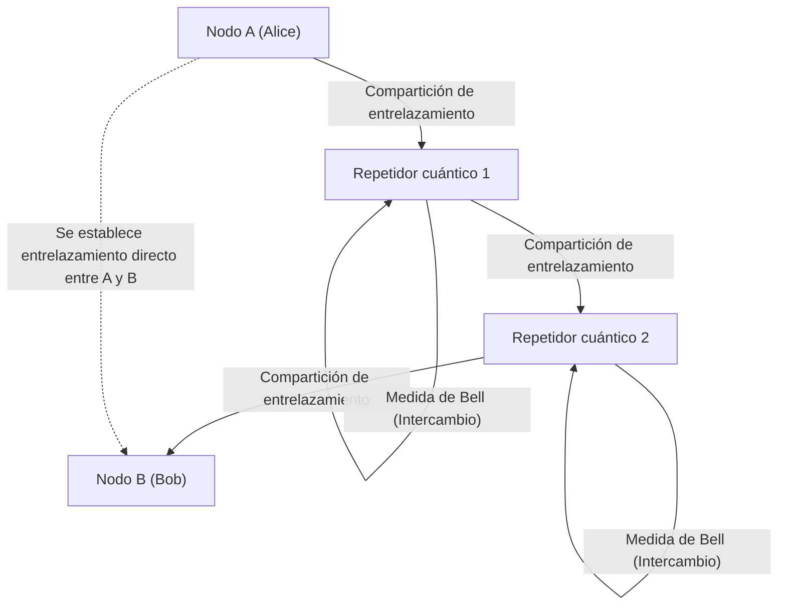

Para superar esta limitación, se está investigando el "repetidor cuántico (Quantum Repeater)". Los repetidores cuánticos generan entrelazamiento solo en segmentos cortos y realizan continuamente operaciones cuánticas avanzadas llamadas "intercambio de entrelazamiento (Entanglement Swapping)" para establecer entrelazamiento a largas distancias. Para lograr esto, una "memoria cuántica" que almacene temporalmente estados cuánticos en entornos criogénicos es indispensable, y actualmente, los centros de investigación de todo el mundo compiten por lograr avances físicos utilizando centros NV (centros de nitrógeno-vacante) en diamantes o gas de átomos ultrafríos.

---

## 8.4 Conclusión: El futuro de la humanidad y las redes

El internet, que nació en la década de 1960, se ha convertido en una red neuronal que conecta toda la información del planeta. Y ahora, el Capítulo 8 "El internet del futuro" al que nos enfrentamos es una expansión a una dimensión más fundamental y física que va más allá de la capa de software.

La arquitectura descentralizada de la Web3 no depende de la "confianza" en una autoridad central específica, sino que está construyendo una nueva base de confianza (trust layer) que garantiza las transacciones sociales mediante las matemáticas y la criptografía.
Las redes de comunicación por satélite, incluida Starlink, están escapando del pozo gravitatorio de la Tierra y desafiando el límite absoluto de velocidad de la física (la velocidad de la luz en el vacío), dibujando una columna vertebral tridimensional que anula la barrera de la distancia.
Y el internet cuántico está a punto de transformar el entrelazamiento, un profundo misterio de la mecánica cuántica, en ingeniería, y está tratando de cambiar fundamentalmente los conceptos de transmisión de información y seguridad.

Aunque estas tecnologías parecen desarrollarse de forma independiente, a largo plazo, se fusionarán. Al colocar un solo fotón (cuanto) dentro de la luz láser que vuela a través del espacio, se construirá una red global de comunicación criptográfica cuántica utilizando el espacio exterior, que tiene poca atenuación, y los protocolos descentralizados de la Web3 operarán sobre ella. Tal infraestructura de red propia de la ciencia ficción está siendo diseñada ahora mismo por las manos de la humanidad.

El internet del futuro dejará de ser simplemente "una tubería para transferir información". Evolucionará hasta convertirse en la "infraestructura intelectual" definitiva que sincronizará las actividades económicas de la humanidad, el consenso social y los recursos computacionales a escala cósmica. Detrás del internet que utilizamos casualmente todos los días, incluso en este momento, se sigue tejiendo una historia épica que desafía los límites de la física y la informática.

