# Chapitre 1 : L'aube et la philosophie d'Internet —— La généalogie technologique de l'ARPANET au WWW

Internet —— ce gigantesque réseau distribué et autonome, qui constitue aujourd'hui le fondement de toutes les activités économiques, de la culture et de la communication de l'humanité, n'a certainement pas été conçu du jour au lendemain par un seul génie. Trouvant son origine dans le contexte historique et géopolitique particulier de la guerre froide, et à travers un changement de paradigme en ingénierie des communications et en informatique, il est l'aboutissement d'une noble philosophie partagée par d'innombrables chercheurs : « comment transmettre l'information de manière robuste et libre, au-delà de toute contrainte physique ».

Dans ce chapitre, nous expliquerons comment est né le système miraculeux qu'est Internet. Il ne s'agira pas d'une simple énumération historique, mais d'une exploration approfondie depuis une perspective professionnelle, en examinant les mécanismes techniques, de la couche physique jusqu'à la couche application, ainsi que leur philosophie de conception (l'architecture).

## 1.1 Le changement de paradigme des réseaux : Les limites de la commutation de circuits et la naissance de la commutation de paquets

Pour comprendre l'essence historique et technologique d'Internet, le point de départ absolu est l'invention du concept de la « commutation de paquets (Packet Switching) ». Au début des années 1960, le centre des infrastructures de communication de l'époque reposait sur la méthode de la « commutation de circuits (Circuit Switching) », représentée par le réseau téléphonique.

### Le mécanisme physique et les vulnérabilités de la commutation de circuits
La commutation de circuits est une méthode dans laquelle deux points communicants sont connectés physiquement par des commutateurs crossbar ou électroniques, ou logiquement via des technologies telles que le multiplexage par répartition en fréquence (FDM). Elle réserve et occupe une « voie de communication dédiée (circuit) » depuis le début jusqu'à la fin de la communication. Étant donné que la bande passante et la latence sont garanties tant que le circuit est réservé, cette méthode était extrêmement adaptée aux communications vocales (téléphonie) nécessitant du temps réel.

Cependant, cette architecture présentait un défaut fatal : l'existence de « points individuels de défaillance (Single Point of Failure) » et une extrême vulnérabilité à la destruction physique. Pendant la guerre froide, le département de la Défense des États-Unis redoutait profondément une attaque nucléaire de l'Union soviétique (en particulier les attaques par impulsion électromagnétique ou EMP accompagnant les explosions nucléaires à haute altitude). Si un nœud de communication centralisé (un immense central téléphonique) était physiquement détruit, ou si une partie de la voie de communication était coupée, la commutation de circuits ne permettait pas de reconstruire immédiatement une route de contournement, paralysant ainsi complètement la chaîne de commandement et de contrôle (C2 : Command and Control) du pays.

### La percée de la commutation de paquets
Il y a trois pionniers qui ont établi, de manière totalement indépendante mais presque simultanément, les bases théoriques pour briser cette contrainte physique désespérante : Paul Baran de la RAND Corporation, Donald Davies du National Physical Laboratory (NPL) au Royaume-Uni, et Leonard Kleinrock du Massachusetts Institute of Technology (MIT).

S'appuyant sur la théorie de l'information de Claude Shannon, ils ont proposé une approche révolutionnaire. Plutôt que de traiter la communication comme une « onde » analogique continue ou un « flux » de données ininterrompu, ils ont suggéré de diviser les données en petits blocs de données numériques de longueur fixe (ou variable) —— c'est-à-dire des « paquets (Packet) », ou selon les mots de Baran, des « blocs de messages standardisés ».

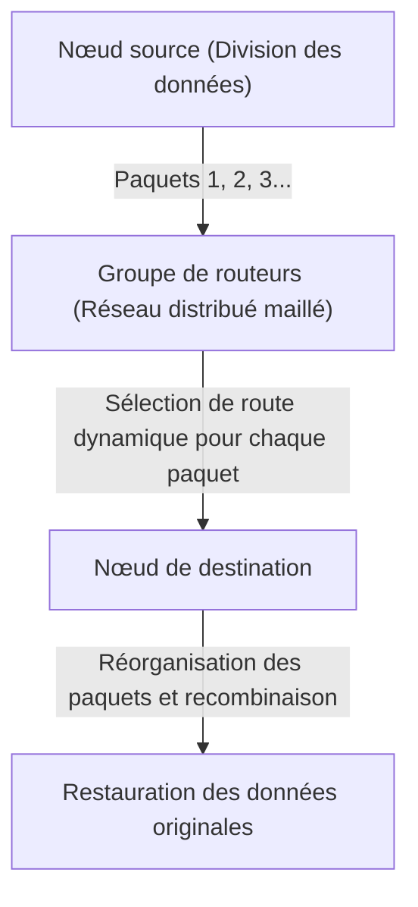

L'innovation technologique de la commutation de paquets se résume principalement à ces deux points :

1. **La réalisation du multiplexage statistique (Statistical Multiplexing) :**
   Au lieu d'occuper une ligne physique pour une communication spécifique comme dans la commutation de circuits, des paquets de multiples communications indépendantes partagent la même ligne physique par répartition dans le temps. Étant donné que la communication de données entre ordinateurs présente une forte « nature en rafale (Burstiness : une caractéristique où une grande quantité de données circule temporairement, suivie de silences) », le partage de la bande passante grâce à la commutation de paquets a poussé l'efficacité d'utilisation des ressources de communication à ses limites mathématiques.
2. **L'enregistrement et le retransmission (Store and Forward) et le routage dynamique :**
   Chaque nœud de relais (routeur) composant le réseau stocke temporairement le paquet reçu dans une file d'attente (queue) en mémoire, et compare l'adresse de destination indiquée dans l'en-tête du paquet avec la table de routage que le nœud lui-même possède. Ensuite, il calcule l'état de congestion du réseau à ce moment-là et la situation des coupures de lignes physiques, et transfère chaque paquet au nœud adjacent optimal.

Kleinrock a utilisé la théorie des files d'attente (Queuing Theory) pour établir un modèle mathématique des délais de paquets et de la taille des tampons dans cette méthode d'enregistrement et de retransmission. Même si une partie du réseau s'évaporait lors d'une attaque nucléaire, les nœuds survivants évalueraient la situation de manière autonome, et les paquets trouveraient des voies de contournement (d'autres itinéraires sur le réseau maillé) pour atteindre leur destination. C'est cette architecture « distribuée de manière autonome et auto-réparatrice » qui est à la racine de la résilience d'Internet.

## 1.2 La construction de l'ARPANET : Séparation du matériel et des protocoles grâce à l'IMP

La matérialisation dans le monde physique de ce réseau à commutation de paquets, qui n'existait qu'en théorie, est le projet « ARPANET », lancé en 1969 grâce au financement de l'Advanced Research Projects Agency (ARPA) du département de la Défense des États-Unis.

L'environnement informatique de l'époque était chaotique, sans commune mesure avec aujourd'hui. Les mainframes (ordinateurs géants) développés indépendamment par des entreprises telles qu'IBM, DEC et SDS, présentaient des codes de caractères (ASCII contre EBCDIC), des longueurs de mots (16 bits, 32 bits, 36 bits, etc.) et des systèmes d'exploitation complètement différents, rendant leur communication directe extrêmement difficile sur le plan technique.

Ainsi, les concepteurs de l'ARPANET (tels que Larry Roberts) ont pris une décision de conception d'une importance capitale pour l'architecture du réseau. Il s'agissait d'introduire un petit ordinateur de relais dédié, appelé « IMP (Interface Message Processor) ».

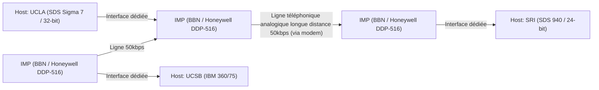

Le développement de l'IMP a été remporté par BBN (Bolt Beranek and Newman), une société de conseil basée à Boston. Ils ont modifié le robuste mini-ordinateur « DDP-516 » de Honeywell et ont confié à l'IMP toute la charge des traitements réseaux complexes, tels que les protocoles de routage, la fragmentation et le réassemblage des paquets, ainsi que la détection d'erreurs (CRC : contrôle de redondance cyclique).

Grâce à cela, les gigantesques ordinateurs hôtes de chaque institut de recherche n'avaient plus besoin de se soucier du routage complexe des paquets ou des caractéristiques physiques des lignes, il leur suffisait simplement de transmettre et de recevoir des données avec l'IMP qui se trouvait devant eux, via une interface standardisée (le protocole BBN 1822). C'est le premier grand succès de l'application de la « séparation des préoccupations (Separation of Concerns) » d'un système au domaine des réseaux, et l'IMP est devenu l'ancêtre direct du routeur (Router) d'aujourd'hui.

Le 29 octobre 1969, le premier message, « LO », a été envoyé depuis le laboratoire de Kleinrock à l'UCLA vers le SRI (Stanford Research Institute) (le système ayant planté en essayant de taper « LOGIN »). C'est le moment historique où l'ARPANET a vu le jour. Par la suite, l'algorithme de routage initial (routage à vecteur de distance basé sur l'algorithme de Bellman-Ford) a été implémenté, et l'ARPANET s'est rapidement développé en tant qu'infrastructure reliant les instituts de recherche à travers les États-Unis.

## 1.3 La philosophie de conception de TCP/IP : Le principe End-to-End et les profondeurs de l'encapsulation

Bien que l'ARPANET ait été un énorme succès en tant que réseau unique, il a fini par se heurter à un nouveau mur. Le protocole de communication NCP (Network Control Program) utilisé au sein de l'ARPANET a été conçu en supposant qu'il fonctionnerait sur l'ARPANET, un « réseau unique, homogène et hautement fiable ».

Cependant, dans les années 1970, une grande variété de réseaux ont commencé à émerger, comme les réseaux de communication par paquets utilisant des satellites (SATNET) et les réseaux de communication par paquets sans fil développés par l'Université d'Hawaï (PRNET, dérivé d'ALOHANET), présentant des supports physiques, des tailles maximales de paquets (MTU : Maximum Transmission Unit), des vitesses de transfert et des taux d'erreur complètement différents. Lors de la tentative d'interconnecter ces réseaux pour construire un « réseau de réseaux (Internetwork) » à l'échelle mondiale, il est devenu évident que la conception de NCP échouerait.

L'énorme défi de l'interconnexion de ces réseaux hétérogènes a été résolu par l'article révolutionnaire « A Protocol for Packet Network Intercommunication » publié par Vinton Cerf et Bob Kahn en 1974. Le protocole qu'ils ont conçu est précisément le fondement de l'Internet moderne : « TCP/IP (Transmission Control Protocol / Internet Protocol) ».

### L'âme de l'architecture : Le principe End-to-End (End-to-End Argument)
Au cœur de la conception de TCP/IP se trouve la philosophie la plus importante de l'ingénierie des réseaux : le « principe de bout en bout (End-to-End Principle / Argument) ». Formalisé dans les années 1980 par J. H. Saltzer, D. P. Reed, D. D. Clark et d'autres, ce principe affirme ce qui suit :

« Les fonctions avancées et spécifiques à l'application, telles que la garantie de la fiabilité du transfert de données, le contrôle de l'ordre et le chiffrement, doivent être implémentées sur les hôtes finaux (End-to-End) effectuant la communication, et ne doivent pas être implémentées dans le cœur du réseau (infrastructures de relais et routeurs). »

Que se passerait-il si on laissait le cœur du réseau (les IMP ou les routeurs) conserver des « états (State) » complexes, comme la confirmation de réception des paquets (ACK) ou le contrôle de retransmission ? Au moment où un routeur relais tombe en panne, cet état est perdu et la communication est interrompue. De plus, à chaque fois qu'une application ayant de nouvelles exigences apparaît, il faudrait réécrire les logiciels des routeurs relais du monde entier.

TCP/IP a concrétisé ce principe avec une fidélité extrême. Les routeurs IP (Internet Protocol) chargés des relais se sont spécialisés dans une fonction extrêmement simple : « transférer simplement les paquets reçus vers leur destination en utilisant la méthode du meilleur effort (best effort) » (transfert de datagrammes sans état). L'IP ne se soucie absolument pas de la perte de paquets ou de l'inversion de l'ordre. Il s'est contenté d'être un simple « réseau idiot (Dumb Network) ».

En échange, la lourde responsabilité de garantir la fiabilité de la communication a été entièrement confiée à TCP (Transmission Control Protocol) fonctionnant sur les ordinateurs hôtes aux deux extrémités. TCP réassemble les données d'origine en observant les numéros de séquence attachés aux paquets arrivés dans le désordre par IP, demande de manière autonome une retransmission en cas de perte, et ajuste la vitesse de transmission si le réseau est encombré (contrôle de fenêtre et algorithme de démarrage lent).

C'est précisément cette philosophie de conception consistant à « maintenir le cœur extrêmement simple et à placer l'intelligence aux bords (aux extrémités) » qui est la principale raison pour laquelle Internet a surpassé le réseau téléphonique et a pu, par la suite, absorber sans modification de l'infrastructure des innovations explosives, même inattendues par ses concepteurs, telles que le Web, le streaming vidéo, la communication P2P et les smartphones.

### L'encapsulation (Encapsulation) et le modèle en couches
Pour réaliser cette répartition logique des rôles, TCP/IP a utilisé une méthode appelée l'« encapsulation (Encapsulation) ». C'est un mécanisme où chaque couche superpose ses propres informations de contrôle (en-tête) sur les données à transmettre, à la manière des poupées russes.

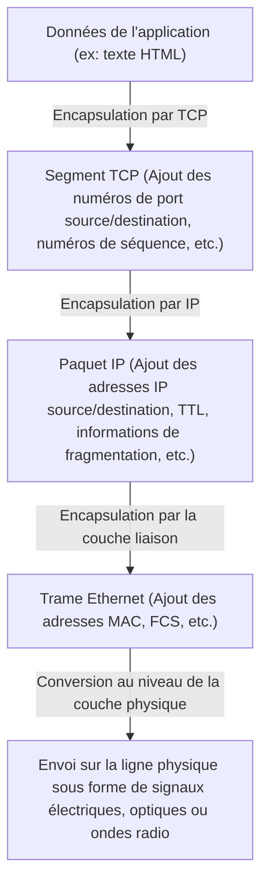

Le routeur détermine la destination en ne regardant que l'en-tête du paquet IP (l'adresse IP) et n'intervient absolument pas dans son contenu (en-tête TCP ou données). Grâce à cela, l'IP a réussi à dissimuler et à absorber complètement les différences de caractéristiques physiques de la couche physique inférieure (fibre optique, fils de cuivre, Wi-Fi, 5G), et à fournir un « réseau virtuel unique à l'échelle mondiale » à la couche supérieure.

Le 1er janvier 1983, a eu lieu le « Flag Day », où tous les hôtes de l'ARPANET sont passés simultanément du NCP au TCP/IP, marquant la naissance du véritable « Internet ».

## 1.4 L'essor de NSFNET et l'évolution du routage distribué autonome

Après la transition vers TCP/IP, Internet a dépassé le cadre militaire et de la défense nationale pour se transformer en une gigantesque infrastructure de recherche académique. La force motrice décisive de cette évolution a été « NSFNET », construit à la fin des années 1980 par la National Science Foundation (NSF) aux États-Unis.

NSFNET a été construit comme un réseau de base (backbone) reliant cinq centres de supercalculateurs à travers les États-Unis. Il a connu des mises à niveau spectaculaires successives de la couche physique, de 56 kbps initialement à des lignes T1 (1,544 Mbps), puis à des lignes T3 (45 Mbps). Les réseaux de chaque université ou région (réseaux régionaux) ont commencé à être connectés de manière hiérarchique au backbone de ce NSFNET.

À mesure que la taille du réseau augmentait (mise à l'échelle) de manière explosive, un nouveau défi technique est apparu. Il s'agissait des « limites du routage ». Le fait que tous les routeurs relais partagent les informations de routage de dizaines de milliers de nœuds dépassait les limites physiques de la capacité mémoire et de la puissance de calcul.

Pour résoudre ce problème, Internet a introduit le concept de « système autonome (AS : Autonomous System) ». Il a redéfini Internet non pas comme un seul réseau géant, mais comme un ensemble de réseaux (AS) ayant des politiques de gestion indépendantes.

À l'intérieur d'un AS (IGP : Interior Gateway Protocol), des protocoles de routage à état de liens comme OSPF (Open Shortest Path First) sont utilisés pour construire une carte topologique complète du réseau via l'algorithme de Dijkstra, afin de calculer rapidement le chemin le plus court.

D'autre part, entre les AS (EGP : Exterior Gateway Protocol), il était nécessaire de refléter des politiques commerciales et organisationnelles telles que « via quel réseau la communication est autorisée », plutôt qu'un simple chemin le plus court. C'est pour réaliser cela qu'a été développé le « BGP (Border Gateway Protocol) », qui soutient jusqu'à aujourd'hui le cœur d'Internet. BGP adopte un algorithme à vecteur de chemin (Path Vector), évitant complètement les boucles de routage tout en permettant l'échange d'informations de routage entre les FAI (Fournisseurs d'Accès à Internet) du monde entier.

Avec la construction de NSFNET et l'établissement de BGP, l'écosystème de l'Internet commercial moderne a été achevé. Même sans administrateur central, chaque organisation interagit de manière répétée (via peering ou transit) de sorte que le réseau fonctionne de manière autonome comme un tout. En 1995, NSFNET a terminé son rôle, et l'exploitation du réseau de base a été entièrement transférée aux FAI privés.
## 1.5 La naissance du WWW : La libération des connaissances par l'hypertexte et le domaine public

À la fin des années 1980, alors que l'infrastructure allant de la couche physique à la couche de transport avait été établie à l'échelle mondiale, la quantité d'informations accumulées sur Internet augmentait de façon spectaculaire. Cependant, l'Internet de l'époque était inondé d'applications individuelles telles que FTP (transfert de fichiers), Telnet (connexion à distance) et USENET (tableaux d'affichage électroniques), et les informations étaient isolées (en silos) au fond des répertoires de chaque serveur. Pour trouver les données souhaitées, la connaissance des adresses IP des serveurs cibles et des commandes UNIX complexes était indispensable, créant une situation extrêmement non démocratique.

Celui qui a fondamentalement renversé cette situation et provoqué un changement de paradigme dans le partage de l'information est Tim Berners-Lee, un informaticien de l'Organisation européenne pour la recherche nucléaire (CERN) à Genève, en Suisse. En 1989, il a proposé un système innovant appelé le « World Wide Web (WWW) ».

Le cœur de son idée était de combiner l'« hypertexte » (Hypertext : un concept existant depuis les années 1960 permettant de créer des liens d'un mot dans un document vers un autre document) avec « Internet (TCP/IP) ». Il a étendu les destinations des liens hypertextes, qui étaient confinées aux ordinateurs locaux, jusqu'aux documents sur des serveurs situés à l'autre bout du monde.

Afin de construire ce gigantesque espace d'information, Berners-Lee a conçu et mis en œuvre lui-même trois spécifications techniques extrêmement raffinées.

1. **URI (Uniform Resource Identifier) :**
   Un système d'adressage universel permettant de spécifier de manière unique l'emplacement de n'importe quelle ressource (texte, image, vidéo, etc.) existant sur le réseau.
2. **HTTP (Hypertext Transfer Protocol) :**
   Un protocole de la couche application permettant de demander et de transférer la ressource spécifiée par l'URI entre un client (navigateur Web) et un serveur. Le plus grand avantage de HTTP est qu'il adopte une conception « sans état (Stateless) » qui ne conserve pas l'« état (State) » de la communication. Cela a permis aux serveurs de traiter efficacement les requêtes de millions de clients.
3. **HTML (Hypertext Markup Language) :**
   Un langage de balisage pour décrire la structure logique d'un document et intégrer des hyperliens (balises d'ancrage `<a>`) vers d'autres ressources.

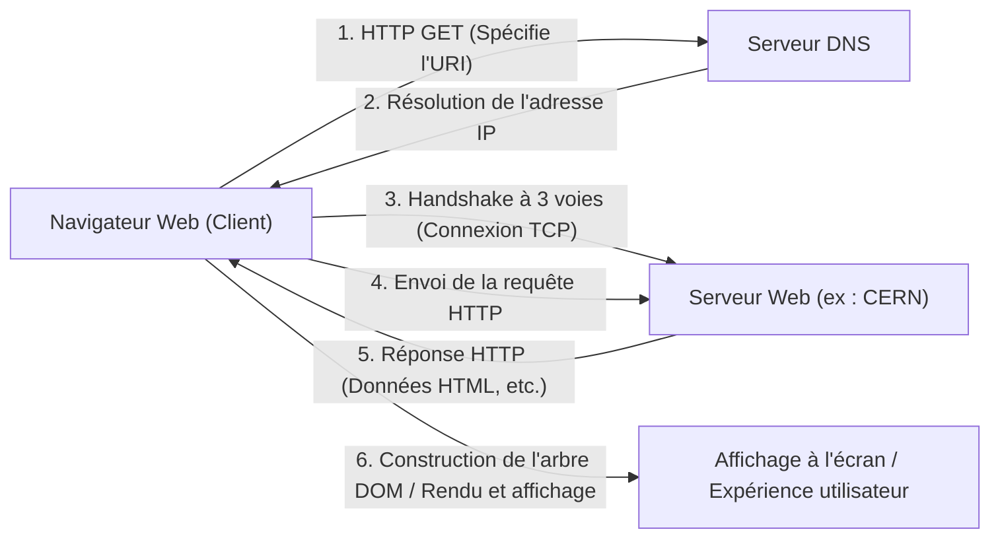

À la fin de 1990, le premier serveur Web au monde (info.cern.ch) et le premier navigateur ont commencé à fonctionner sur un ordinateur NeXT. Bien que le Web initial fût basé sur du texte, son expérience de recherche d'informations intuitive par des liens s'est rapidement répandue parmi les chercheurs.

### La décision historique du domaine public
Cependant, la principale raison pour laquelle le WWW a véritablement transformé le monde et s'est établi comme infrastructure de la société moderne n'est pas seulement son excellente architecture technique. L'événement décisif qui a changé l'histoire s'est produit le 30 avril 1993.

Le CERN, acceptant la forte demande de Tim Berners-Lee, a pris la décision étonnante de libérer gratuitement toutes les technologies fondamentales du WWW (logiciel serveur, client, bibliothèques de code) dans le « domaine public (renonciation aux droits de propriété intellectuelle) ». Un document de déclaration stipulant qu'aucun droit de brevet ne serait exercé et qu'aucune redevance ne serait exigée portait la signature du directeur du CERN.

Que se serait-il passé si le CERN avait alors breveté la technologie du WWW et cherché à la monétiser par des licences de logiciels ? Sans aucun doute, l'explosion de l'information d'aujourd'hui ne se serait pas produite. Le WWW serait resté un système fermé réservé à quelques entreprises et universités bien financées, et Internet aurait probablement été fragmenté par des batailles de normes avec des protocoles concurrents comme Gopher, apparu plus tard.

Grâce à cette mise dans le domaine public, les barrières techniques et juridiques ont complètement disparu, permettant aux hackers et aux entreprises du monde entier d'entrer dans l'écosystème du WWW. Marc Andreessen et d'autres du National Center for Supercomputing Applications (NCSA) aux États-Unis ont développé et publié gratuitement « NCSA Mosaic », un navigateur graphique révolutionnaire capable d'afficher des images en ligne, ce qui a déclenché plus tard la création de Netscape Navigator et, par extension, la bulle Internet. La « démocratisation de l'information », où les individus peuvent librement configurer des serveurs Web et diffuser des informations au monde entier, a été accomplie.

## 1.6 Conclusion : La philosophie surpasse l'implémentation

L'histoire d'Internet que nous avons vue dans le premier chapitre n'est pas simplement l'histoire de l'amélioration de la vitesse de communication. L'invention de la commutation de paquets basée sur la réalité physique selon laquelle « le contrôle centralisé est vulnérable », le principe de bout en bout (End-to-End) selon lequel « la complexité doit être assumée par les extrémités », et la mise dans le domaine public du WWW selon laquelle « l'information doit être ouverte gratuitement à toute l'humanité ».

Ce qui fait d'Internet ce qu'il est aujourd'hui, ce n'est pas un matériel ou un code exceptionnel, mais ces « philosophies de conception (Philosophy) » puissantes et cohérentes. Il surmonte les contraintes de la couche physique par une encapsulation logique et accepte la diversité grâce à des normes ouvertes (RFC : Request for Comments). C'est grâce à cette architecture qui respecte la décentralisation et la liberté qu'Internet a pu atteindre une évolutivité sans précédent.

Cependant, il existait encore un fossé profond entre les « noms » que les humains peuvent comprendre et les « nombres (adresses IP) » que les réseaux traitent. Le chapitre suivant dévoilera les mécanismes techniques du « gouffre de l'espace d'adresses IP et du DNS (Domain Name System) », un système de base de données distribuée géant qui a mis de l'ordre dans l'espace d'adressage de ce vaste réseau autonome et distribué, et a soutenu en coulisses la diffusion explosive du WWW.

# Chapitre 2 : Couche physique et couche liaison de données ~ L'entité physique des données numériques et la communication entre nœuds adjacents ~

À la base de ce réseau géant qu'est Internet, il y a une chaîne de phénomènes physiques extraordinaires qui convertissent les données numériques logiques de « 0 » et « 1 » en signaux électriques, en clignotements de lumière ou en ondulations d'ondes électromagnétiques, les envoyant au destinataire à travers l'espace et les milieux. Lorsque nous ouvrons nonchalamment un site Web sur notre smartphone, en coulisses, des photons parcourent des fibres de verre au fond de l'océan, et des ondes radio invisibles volent dans l'espace, accompagnées de calculs complexes.

Ce chapitre se concentre sur la couche 1 (couche physique) et la couche 2 (couche liaison de données) du modèle de référence OSI, et explore à l'extrême, du point de vue d'un professionnel, la partie « la plus physique et concrète » des réseaux qui soutiennent nos vies, ainsi que les mécanismes logiques précis qui les contrôlent.

---

## 2.1 Couche physique (Physical Layer) : Matérialisation physique de l'information et lois de l'univers

La mission principale de la couche physique est de convertir (moduler) les séquences de bits discrets (0 et 1) gérées par les ordinateurs en signaux physiques analogiques adaptés aux caractéristiques physiques du support de transmission (fil de cuivre, fibre optique, espace comme le vide ou l'air) et de les placer sur la ligne de transmission. Ici, les lois de l'ingénierie électrique, de la mécanique quantique et de l'optique déterminent les limites de la communication.

### Le théorème de Shannon-Hartley et les limites de l'information
Incontournable lorsque l'on parle de la couche physique, il y a la théorie de l'information publiée par Claude Shannon en 1948. Le « théorème de Shannon-Hartley » a mathématiquement prouvé le taux de transfert de données maximum (capacité du canal) pouvant être transmis sans erreur dans un canal de communication où du bruit est présent.

$$ C = B \log_2\left(1 + \frac{S}{N}\right) $$

Ici, $C$ est la capacité du canal de communication (bps), $B$ est la bande passante (Hz) et $S/N$ est le rapport signal sur bruit (SNR). Cette belle équation montre que, quels que soient les progrès technologiques, il y a une limite physique (la limite de Shannon) à la quantité d'informations qui peut être envoyée avec une bande passante et un environnement de bruit donnés. Les ingénieurs modernes de la fibre optique et du Wi-Fi continuent une bataille sans fin pour augmenter la vitesse de communication au plus près de cette limite.

### La physique de la fibre optique : transporter la lumière en l'« enfermant »
L'épine dorsale de l'Internet moderne est sans aucun doute la fibre optique (Optical Fiber). Les communications électriques sur fil de cuivre rencontrent des difficultés pour les communications à haut débit sur de longues distances en raison de l'effet de peau et des interférences électromagnétiques (EMI), mais la fibre optique a surmonté ces problèmes.

La fibre optique est composée de deux couches de verre de quartz de très haute pureté : le « cœur » (core) au centre et la « gaine » (cladding) qui l'entoure. En réglant l'indice de réfraction du cœur légèrement plus haut (de quelques pour cent ou moins) que celui de la gaine, selon la loi de Snell-Descartes, la lumière entrant avec un angle plus faible qu'un certain angle critique répète une réflexion totale (Total Internal Reflection) à la frontière entre le cœur et la gaine. Ainsi, la lumière progresse à l'intérieur de la fibre sans s'échapper vers l'extérieur.

#### La bataille contre la dispersion et l'atténuation : le verre qui a valu un prix Nobel
Auparavant, le verre contenait de nombreuses impuretés et la lumière s'atténuait en quelques mètres. En 1966, le Dr Charles Kao (lauréat du prix Nobel de physique 2009) a découvert que la cause de l'atténuation dans les fibres optiques n'était pas la nature intrinsèque du verre mais les impuretés (en particulier les groupes hydroxyle et les métaux de transition), et a prédit que les communications à longue distance seraient possibles si la pureté était augmentée. Le verre de quartz à très faible perte développé par Corning Inc. dans les années 1970 a atteint une perte incroyablement faible de 0,2 dB/km dans la bande de longueur d'onde de 1550 nm (bande C). Cela signifie que même après 15 km, seulement la moitié de l'intensité lumineuse est perdue.

Cependant, lorsque la lumière parcourt de longues distances, une « dispersion chromatique (Chromatic Dispersion) » et une « dispersion modale (Modal Dispersion) » se produisent, déformant la forme de l'impulsion. La dispersion chromatique se produit parce que la vitesse de propagation dans le verre varie selon la longueur d'onde (couleur) de la lumière. La dispersion modale est un phénomène où un décalage du temps d'arrivée se produit car il y a plusieurs chemins (modes) de lumière passant par le cœur.
Pour surmonter cela, la « fibre monomode (SMF : Single-Mode Fiber) », qui affine le diamètre du cœur à quelques micromètres près de la longueur d'onde de la lumière et ne laisse passer qu'un seul chemin, a été développée et est devenue la norme pour les transmissions à longue distance comme les communications intercontinentales.

#### EDFA et WDM : la renaissance des communications optiques
Dans les années 1990, deux révolutions ont eu lieu dans les communications optiques. La première est l'amplificateur à fibre dopée à l'erbium (EDFA : Erbium-Doped Fiber Amplifier). Auparavant, des répéteurs régénératifs lents et coûteux étaient nécessaires, qui convertissaient une fois le signal optique atténué en signal électrique, l'amplifiaient, puis le reconvertissaient en lumière. L'EDFA a rendu possible l'amplification directe de la lumière en tant que lumière en dopant le cœur de la fibre avec de l'erbium, un élément de terres rares, et en appliquant une lumière de pompage depuis l'extérieur pour provoquer une émission stimulée lorsque le signal optique passe.

La seconde est le multiplexage en longueur d'onde (WDM : Wavelength Division Multiplexing). C'est une technologie qui permet de regrouper et d'envoyer simultanément des signaux de plusieurs longueurs d'onde sur une seule fibre en utilisant le principe de superposition, selon lequel la lumière progresse indépendamment sans se mélanger même si différentes longueurs d'onde (couleurs) sont émises simultanément dans le même espace. Grâce à la technologie de multiplexage en longueur d'onde dense (DWDM), il est désormais possible de placer des signaux de plus de 100 ondes avec un intervalle de longueur d'onde de quelques millimètres sur une seule fibre optique, réalisant une bande passante incroyable de plusieurs dizaines de Tbps à plusieurs Pbps avec une seule fibre.

### Câbles sous-marins : le réseau nerveux de la Terre
Plus de 99 % des communications de données entre les continents ne sont pas acheminées par des satellites artificiels, mais par des câbles sous-marins. Les données dans le cloud, ainsi que les images des sites Web étrangers, passent toutes par le fond physique de l'océan.

#### L'histoire des échecs et des défis
L'histoire des câbles sous-marins est bien plus ancienne que celle d'Internet. Le premier grand défi a été le câble télégraphique transatlantique de 1858. Bien que le fil de cuivre isolé avec de la gutta-percha, une sorte de caoutchouc naturel, ait été posé avec succès, il s'est tu après seulement quelques semaines en raison d'une rupture d'isolation causée par un fonctionnement à haute tension ignorant l'avertissement de Lord Kelvin (William Thomson). Ensuite, les théories et les matériaux ont été améliorés sur une longue période, et en 1988, le « TAT-8 », le premier câble sous-marin à fibre optique transpacifique, est entré en service, ouvrant l'ère de la lumière.

#### Structure des câbles et mécanismes de pose
Les câbles sous-marins modernes posés dans les profondeurs océaniques à plusieurs milliers de mètres de fond sont conçus pour résister à des environnements extrêmes. Pour protéger le faisceau de seulement quelques fibres optiques au centre, ils sont protégés par plusieurs couches comprenant des fils d'acier à haute résistance, des tubes en cuivre ou en aluminium pour résister à la pression de l'eau, et des isolants en polyéthylène. Dans les eaux profondes, ils font quelques centimètres de diamètre pour rester légers tout en résistant aux morsures de requins et à l'énorme pression de l'eau, mais dans les eaux peu profondes, ils sont dotés d'un épais blindage (armure) pour les protéger des chaluts de fond des bateaux de pêche, des ancres des navires et des tremblements de terre sous-marins, et font plus de 10 centimètres de diamètre.

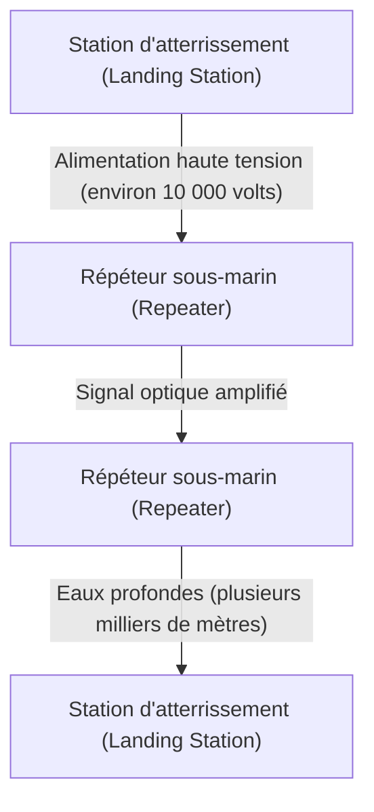

Même en utilisant des fibres à très faible perte, les signaux optiques s'atténuent tous les dizaines de kilomètres, c'est pourquoi des « répéteurs sous-marins » sont insérés à intervalles réguliers le long du câble. L'énergie électrique pour faire fonctionner ces répéteurs (qui intègrent les EDFA mentionnés précédemment) dans les grands fonds marins est fournie en permanence depuis les stations d'atterrissement aux deux extrémités par un tube de cuivre à l'intérieur du câble, sous la forme d'un courant continu à haute tension allant de quelques milliers de volts à plus de 10 000 volts.
Pour la pose, un « navire câblier » spécialisé est utilisé, et dans les eaux peu profondes, un robot sous-marin (ROV) creuse une tranchée au fond de la mer et enfouit le câble. Si un câble est coupé, un navire de réparation se rend d'urgence sur place, accroche l'extrémité du câble dans les eaux profondes avec un grappin (une griffe semblable à une ancre), le remonte sur le navire, et des techniciens qualifiés effectuent le raccordement par fusion des fibres optiques avec une précision de quelques microns, un travail extrêmement analogique et laborieux.

### Physique de la communication par ondes radio (La base du Wi-Fi)
Avec la popularisation des appareils mobiles et de l'IoT, les communications via des ondes électromagnétiques (ondes radio) volant dans l'espace sont également devenues un champ de bataille majeur de la couche physique. Le Wi-Fi (famille de normes IEEE 802.11) utilise principalement la bande des 2,4 GHz, la bande des 5 GHz, et plus récemment la bande ISM des 6 GHz (bandes industrielles, scientifiques et médicales, utilisables sans licence).

#### Une compression extrême de l'information grâce au QAM (Modulation d'amplitude en quadrature)
Lors de la « modulation », qui consiste à placer des données numériques sur des ondes analogiques, le Wi-Fi utilise une technologie extrêmement avancée. C'est le QAM (Quadrature Amplitude Modulation : Modulation d'amplitude en quadrature).
L'onde radio possède deux grandeurs physiques : l'« amplitude » (hauteur de l'onde) et la « phase » (synchronisation/angle de l'onde). Le QAM combine deux ondes porteuses (signal I et signal Q) déphasées de 90 degrés, et en faisant varier l'amplitude de chacune, attribue une séquence de bits à un « point » spécifique sur une carte de constellation.

Par exemple, avec le 16-QAM, 16 points (4 bits) peuvent être représentés par un seul changement d'onde (symbole). Dans le dernier Wi-Fi 7 (802.11be), une modulation haute densité pouvant être qualifiée de folle, le 4096-QAM, a été adoptée. Cela représente 4096 points (12 bits) en une seule modulation. Sur une carte de constellation où 4096 points s'entassent, le côté récepteur doit déterminer avec précision quel « point » a été transmis sans être noyé par un bruit infime. Pour y parvenir, des codes correcteurs d'erreurs avancés et de puissants processeurs de traitement de signal sont utilisés.

#### OFDM et MIMO : La bataille contre les trajets multiples et l'exploitation de l'espace
Les ondes radio ne se déplacent pas seulement en ligne droite, elles se réfléchissent sur les murs et les meubles, se diffractent et se diffusent. Ainsi, les ondes radio émises par un émetteur atteignent le récepteur avec des temps légèrement décalés en passant par différents chemins (trajets multiples, ou multipath), provoquant des interférences (évanouissement ou fading) et détruisant la forme d'onde.
Les technologies qui exploitent ou surmontent cela sont l'OFDM et le MIMO.

L'**OFDM (Multiplexage par répartition orthogonale de la fréquence)** est une technologie qui, au lieu d'utiliser un seul signal à large bande et à forte répulsion, divise finement la bande en un grand nombre de fréquences très étroites (sous-porteuses) et transmet les données en parallèle à une vitesse lente sur chacune d'elles. Les sous-porteuses sont disposées pour être « orthogonales » (n'interférant pas mathématiquement entre elles), de sorte que l'efficacité de l'utilisation des fréquences est extrêmement élevée et résiste bien aux décalages de retard causés par les trajets multiples.

Le **MIMO (Multiple-Input and Multiple-Output)** est une technologie de « multiplexage spatial » qui transmet différentes données simultanément sur la même fréquence en utilisant plusieurs antennes. Il exploite la propriété selon laquelle les ondes se mélangent différemment à différents endroits de l'espace en raison des réflexions multiples, sépare les signaux complexes reçus par plusieurs antennes du côté récepteur comme si l'on résolvait des équations simultanées, et multiplie la capacité de communication par le nombre d'antennes. De plus, le **Beamforming**, qui concentre le faisceau d'ondes radio dans une direction spécifique en ajustant finement la phase des ondes radio pour chaque antenne, est devenu une technologie indispensable dans le Wi-Fi moderne.
## 2.2 Couche Liaison de Données (Data Link Layer) : Dialogue et ordre entre équipements directement connectés

Si la couche physique est un simple "transporteur de signaux", la couche liaison de données est la couche chargée de regrouper ces séquences de bits brutes en blocs significatifs appelés "trames", et de fournir les règles et la régulation du trafic pour assurer leur livraison à la bonne destination au sein du même réseau (lien).

### L'histoire de l'Ethernet : L'inspiration d'ALOHA
Aujourd'hui, l'Ethernet (IEEE 802.3) est devenu le standard de facto mondial pour les réseaux locaux (LAN) filaires.
Ses racines remontent à "ALOHAnet", un réseau de communication sans fil créé à l'Université d'Hawaï. ALOHAnet utilisait un protocole extrêmement désordonné et ambitieux : "Si vous avez des données à envoyer, envoyez-les de toute façon. Si elles sont détruites par une collision, attendez un temps aléatoire puis retransmettez."

En 1973, Bob Metcalfe du centre de recherche de Palo Alto (PARC) de Xerox a appliqué l'idée d'ALOHAnet aux communications sur câble coaxial, inventant ainsi l'Ethernet. L'Ethernet initial utilisait une topologie "en bus", où de nombreux ordinateurs partageaient un seul câble coaxial épais (câble jaune) en le perçant avec des aiguilles appelées "vampire taps" (prises vampire).

#### CSMA/CD : Une anarchie ordonnée
Puisque le média (câble) est partagé par tous, si plusieurs équipements envoient des signaux électriques en même temps, les formes d'ondes se superposent et les données sont détruites. C'est ce qu'on appelle une "collision". "CSMA/CD" (Carrier Sense Multiple Access with Collision Detection) est un algorithme décentralisé autonome conçu pour éviter et résoudre ce problème.

1. **Carrier Sense (Détection de porteuse)** : Avant de transmettre, on mesure la tension sur le câble pour écouter si quelqu'un d'autre ne communique pas.
2. **Multiple Access (Accès multiple)** : Si personne ne communique, n'importe qui peut transmettre librement sans attendre la permission d'une autorité centrale.
3. **Collision Detection (Détection de collision)** : Même pendant la transmission, on surveille la tension du câble. Si une augmentation anormale de tension différente de son propre signal est détectée, c'est considéré comme une "collision". Un signal de brouillage (jam) est immédiatement émis pour informer tout le monde de la collision et la transmission est interrompue.
4. **Backoff (Réduction)** : Après une collision, chaque nœud attend un temps aléatoire (calculé par l'algorithme de backoff exponentiel) avant de tenter une retransmission.

Ce mécanisme simple et sans administrateur central, qui "suppose que des violations de règles (collisions) se produiront, et attend aléatoirement quand elles se produisent", est la principale raison pour laquelle l'Ethernet a vaincu des protocoles complexes et coûteux comme le Token Ring d'IBM ou l'ATM, pour finalement dominer.

### L'adresse MAC : L'identité absolue du matériel
Pour spécifier la destination au niveau de la couche liaison de données, l'adresse MAC (Media Access Control address) est utilisée. Si l'adresse IP est une "adresse temporaire", l'adresse MAC est "le numéro d'identification attribué à la naissance".

L'adresse MAC a une longueur de 48 bits (6 octets) et s'écrit sous la forme de nombres hexadécimaux à deux chiffres séparés par des deux-points, comme "00:1A:2B:3C:4D:5E".
- **Les 24 premiers bits (OUI : Organizationally Unique Identifier)** : Code d'entreprise géré et attribué par l'IEEE, qui identifie de manière unique le fournisseur de l'équipement réseau (Apple, Cisco, Intel, etc.).
- **Les 24 derniers bits (UAA : Universally Administered Address)** : Numéro de série attribué séquentiellement par le fournisseur à ses propres produits.

En principe, la carte d'interface réseau (NIC) de chaque équipement réseau dans le monde possède une adresse MAC unique gravée dans sa ROM.

### Structure de la trame : La technique d'emballage des communications
Dans la couche liaison de données, un en-tête et un bloc de fin (trailer) sont ajoutés avant et après les données provenant de la couche réseau (comme les paquets IP), les encapsulant dans une unité appelée "trame". La structure de la trame Ethernet (Ethernet II) est d'un raffinement artistique.

1. **Préambule (Preamble)** : Une séquence de 7 octets de "10101010". C'est un échauffement pour synchroniser l'horloge (synchronisation du timing) de la carte réseau réceptrice.
2. **SFD (Start Frame Delimiter)** : 1 octet de "10101011". La fin du préambule devenant "11" annonce au récepteur : "Les vraies données commencent ici".
3. **Adresse MAC de destination (Destination MAC) / Adresse MAC source (Source MAC)** : 6 octets chacune. Indique de qui vers qui se fait la communication. Si la destination est "FF:FF:FF:FF:FF:FF", il s'agit d'une trame de diffusion (broadcast) destinée à tout le monde.
4. **Type (EtherType)** : 2 octets. Indique le type de données contenues dans la charge utile (payload) (0x0800 pour IPv4, 0x86DD pour IPv6, 0x0806 pour ARP).
5. **Charge utile (Data/Payload)** : Les données réelles confiées par la couche supérieure. La taille va de 46 octets à un maximum de 1500 octets (MTU : Maximum Transmission Unit).
6. **FCS (Frame Check Sequence)** : Un trailer de 4 octets. Une valeur de hachage calculée à partir de la trame entière (de l'adresse MAC de destination à la charge utile) à l'aide d'un polynôme appelé CRC-32 (Contrôle de Redondance Cyclique).

La carte réseau réceptrice calcule rapidement le CRC au niveau matériel tout en recevant la trame. Si le résultat de son propre calcul diffère d'un seul bit du FCS situé à la fin, elle considère que les données ont été corrompues par du bruit ou une collision pendant la transmission et **détruit impitoyablement cette trame sans aucune notification**. La couche liaison de données s'assure de "détecter les erreurs et les jeter", mais elle n'a pas la fonction d'exiger : "C'était cassé, alors renvoyez-le s'il vous plaît". Cette répartition des rôles, où la lourde responsabilité du contrôle de retransmission est laissée aux protocoles de niveau supérieur comme TCP, soutient l'évolutivité (scalability) d'Internet.

### La naissance du commutateur (Switch) et l'évolution vers la communication en mode bidirectionnel simultané (Full-Duplex)
L'Ethernet à bus partagé avec CSMA/CD était un excellent mécanisme, mais il présentait une faiblesse fatale : à mesure que le nombre d'équipements (hôtes) connectés au réseau augmentait, les collisions devenaient fréquentes et le débit effectif chutait drastiquement.
C'est le "commutateur de niveau 2 (Switching Hub)", popularisé dans les années 1990, qui a fondamentalement résolu ce problème.

Alors qu'un concentrateur (Hub répéteur) est un équipement de couche physique qui diffuse inconditionnellement le signal électrique reçu sur tous les ports, le commutateur possède un cerveau intelligent qui comprend la couche liaison de données.
Le commutateur dispose en interne d'une "table d'adresses MAC" utilisant de la mémoire (table CAM). Il apprend l'adresse MAC source de l'équipement connecté à chaque port et construit automatiquement un tableau de correspondance entre les ports et les adresses MAC.
Ensuite, lorsqu'une trame arrive, le commutateur compare l'adresse MAC de destination avec la table et ne transfère la trame "qu'au" port où l'équipement correspondant est connecté (forwarding).

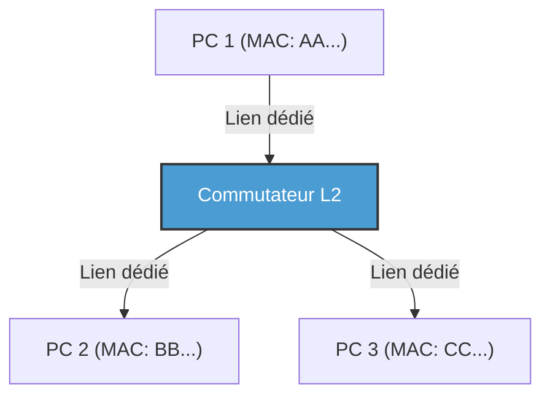

Avec l'introduction du commutateur, le câblage entre chaque nœud et le commutateur est devenu logiquement et physiquement indépendant (topologie en étoile). En conséquence, les chemins de communication étant séparés, les collisions (collisions) ne se produisaient plus en principe. Ainsi, il est devenu possible d'utiliser la ligne d'émission et la ligne de réception en même temps, c'est-à-dire la communication "Full-Duplex" (bidirectionnelle simultanée).
Dans l'Ethernet moderne, l'algorithme CSMA/CD n'est plus utilisé ; il a évolué vers une pure communication Full-Duplex point à point. De plus, la technologie VLAN (Virtual LAN) de la norme IEEE 802.1Q permet de diviser et d'intégrer de manière flexible les réseaux logiques sans être limité par le câblage physique, continuant ainsi de régner en tant que technologie de base absolue soutenant l'infrastructure des entreprises et des gigantesques centres de données.

### La couche liaison de données du Wi-Fi : La régulation du trafic dans l'espace invisible des ondes radio
Alors que l'Ethernet filaire a évolué vers une communication Full-Duplex sans collision, le Wi-Fi sans fil est confronté au même défi difficile que l'ancien Ethernet à bus partagé : "Tout le monde partage un seul média, à savoir le même espace (l'air)".

Dans la communication sans fil, comme ses propres ondes radio pendant l'émission sont trop fortes, il est physiquement impossible de recevoir simultanément les faibles ondes radio des autres pour "détecter (CD)" une collision. De plus, il existe un risque spécifique au sans-fil appelé le "problème du terminal caché (Hidden Node Problem)" : par exemple, les terminaux A et C situés de part et d'autre d'un point d'accès ne peuvent pas capter les ondes de l'autre, mais s'ils transmettent en même temps, leurs ondes radio entreront en collision sur le point d'accès.

C'est pourquoi le protocole de la couche liaison de données du Wi-Fi (couche MAC) adopte le "CSMA/CA (Carrier Sense Multiple Access with Collision Avoidance : Évitement de collision)".
Avec CSMA/CA, avant de transmettre, on écoute l'état des ondes radio dans l'espace pendant un certain temps (DIFS), puis on attend un temps de backoff aléatoire avant de commencer la transmission. La différence la plus importante est le mécanisme d'**ACK (Acknowledge : Accusé de réception)**, qui n'existait pas en filaire. En Wi-Fi, la partie qui reçoit les données renvoie immédiatement (après un temps d'attente extrêmement court appelé SIFS) une trame ACK pour indiquer qu'elle a été reçue correctement. L'émetteur juge que la communication a réussi seulement après avoir reçu cet ACK. Si l'ACK n'est pas renvoyé, on considère que les données ont été détruites par une collision ou une interférence, on double le temps de backoff et on tente de retransmettre.

De plus, pour résoudre le problème du terminal caché, il existe un mécanisme appelé "RTS/CTS Handshake". Avant d'envoyer de grosses données, l'émetteur envoie une courte trame de contrôle appelée RTS (Request to Send : Demande d'émission), et le récepteur (comme un point d'accès) renvoie un CTS (Clear to Send : Prêt à émettre). Ce CTS contient l'information d'un temps de réservation (NAV : Network Allocation Vector) disant : "Je vais communiquer pendant les prochaines XX microsecondes, donc que les terminaux environnants se taisent", et les terminaux environnants qui reçoivent cela s'abstiennent de communiquer. Ainsi, la couche liaison de données du Wi-Fi effectue une magnifique régulation du trafic dans l'espace invisible des ondes radio.

---

## Conclusion

Un monde de phénomènes physiques où la lumière traverse le verre sous forme de photons, résiste à la pression des eaux profondes et vole dans l'espace en changeant de phase et d'amplitude. C'est en superposant sur ces phénomènes physiques bruyants et incertains une synchronisation par préambule, une identification individuelle par adresse MAC, une détection d'erreur stricte par CRC, et un contrôle de trafic sophistiqué par commutation et CSMA/CA, qu'il devient enfin possible de "livrer sans erreur un bloc de données significatif (trame) à l'équipement voisin". C'est le miracle accompli par les première et deuxième couches.

Cependant, cela seul ne suffit pas à créer un Internet reliant le monde entier. En effet, la communication par adresse MAC n'est valable que dans le village étroit qu'est le "même réseau (domaine de diffusion)", c'est-à-dire jusqu'à ce qu'elle soit bloquée par un routeur ou au sein des équipements connectés au même commutateur ou point d'accès.

Dans le prochain chapitre, "Chapitre 3 : La couche réseau et IP", nous plongerons au cœur de l'IP (Internet Protocol) et du routage, ce mécanisme de routage grandiose pour relier ces innombrables villages locaux et livrer des paquets, comme une chaîne de seaux, à des réseaux inconnus de l'autre côté du globe.

# Chapitre 3 : La couche réseau et le mécanisme de routage —— La carte de navigation des paquets traversant les grands océans

La base de l'Internet que nous utilisons au quotidien est la 3ème couche du modèle de référence OSI, à savoir la "couche réseau". Au-delà de la communication directe via des câbles physiques ou des ondes radio (couche liaison de données), la capacité de communiquer à l'échelle mondiale avec des serveurs situés à des milliers de kilomètres repose sur d'innombrables routeurs interconnectés et sur le mécanisme grandiose de contrôle des chemins (routage) où ils échangent des informations de manière autonome.

Ce chapitre détaillera de manière exhaustive, d'un point de vue technique, historique et physique, "l'art de la navigation" permettant aux paquets d'atteindre leur destination, depuis la structure de l'IP (Internet Protocol), jusqu'aux limites de l'IPv4 et à l'architecture de l'IPv6, en passant par les profondeurs du BGP (Border Gateway Protocol) qui relie les systèmes autonomes (AS) du monde entier.

## 3.1 Le paradigme de la couche réseau : Le principe de bout en bout (End-to-End)

La plus grande percée dans la philosophie de conception d'Internet est le **principe de bout en bout (End-to-End)** : "Les nœuds intermédiaires du réseau (routeurs) se consacrent uniquement au simple transfert de paquets, tandis que les traitements complexes (correction d'erreurs et garantie d'ordre) sont effectués aux extrémités (hôtes finaux)".

Dans les réseaux téléphoniques traditionnels (commutation de circuits), une ligne physique était occupée du début à la fin de la communication, et l'état (state) était géré dans tout le réseau. En revanche, la couche réseau d'Internet (commutation de paquets) est "sans connexion (connectionless)" et ne conserve aucun état. Chaque paquet est traité comme une "lettre" indépendante, et le routeur répète la simple tâche de le recevoir, de regarder la destination et de l'envoyer (forwarding) au meilleur relais suivant (next hop). Cette combinaison de "Dumb Network" (réseau stupide) et de "Smart Terminal" (terminal intelligent) est la principale raison pour laquelle Internet a pu évoluer de manière explosive et accueillir des applications si diverses.

## 3.2 L'adresse d'Internet : L'évolution de l'adresse IP et l'histoire de son épuisement

Tous les équipements sur le réseau se voient attribuer un identifiant unique appelé adresse IP. Actuellement, Internet est dans une phase de transition et deux générations de protocoles IP coexistent.

### IPv4 : L'espace de 32 bits et la lutte contre l'épuisement

L'IPv4, défini en 1981 par la RFC 791, dispose d'un espace de 32 bits (environ 4,3 milliards). Lors de sa conception, le chiffre de 4,3 milliards semblait astronomiquement grand, mais avec la propagation explosive d'Internet, le risque d'épuisement a commencé à se faire sentir dès les années 1990.

Pour surmonter cette crise, le **CIDR (Classless Inter-Domain Routing)** et le **NAT (Network Address Translation)** ont été créés.
L'attribution initiale des adresses IP se faisait selon un système "classful" grossier de classe A (/8), classe B (/16) et classe C (/24), ce qui entraînait un grave gaspillage d'adresses. Le CIDR a remplacé cela par un masque de sous-réseau à longueur variable (VLSM), réalisant un routage "classless" où seules les adresses nécessaires sont allouées.
De plus, avec l'apparition du NAT, en associant un espace d'adressage IPv4 privé à une seule adresse IPv4 publique, il est devenu possible de partager une seule adresse avec des milliers d'appareils. Cependant, le NAT a détruit le principe de bout en bout et a nécessité des technologies complexes de traversée de NAT (STUN/TURN/ICE, etc.) pour les communications P2P et en temps réel.

### IPv6 : L'espace infini de 128 bits et la structure d'en-tête de nouvelle génération

L'**IPv6**, formulé en 1998 par la RFC 2460, est la solution fondamentale à l'épuisement des adresses. L'IPv6 dispose d'un espace d'adressage de 128 bits, offrant un espace si vaste de $2^{128}$ (environ 340 undécillions) qu'il resterait des adresses même si l'on en attribuait une à chaque grain de sable sur Terre.

L'innovation de l'IPv6 ne réside pas seulement dans la longueur de l'adresse. Une simplification radicale de la structure de l'en-tête a été réalisée. Les options de longueur variable et la somme de contrôle (checksum) de l'en-tête présentes dans l'IPv4 ont été supprimées, et l'en-tête de base a été fixé à 40 octets. Cela a accéléré le traitement des paquets (routage) par le matériel (ASIC et TCAM). De plus, la fragmentation (division des paquets) n'est plus effectuée par les routeurs intermédiaires, mais uniquement par l'hôte source, réduisant ainsi considérablement la charge des routeurs.

## 3.3 La dualité du routage : Le plan de contrôle (Control Plane) et le plan de données (Data Plane)

L'intérieur d'un routeur est divisé en deux grands "plans (planes)".

1. **Le plan de contrôle (Control Plane)**
   C'est la partie cérébrale où les routeurs communiquent entre eux à l'aide de protocoles de routage (OSPF, BGP, etc.) pour apprendre la topologie (structure de connexion) du réseau et calculer le chemin optimal. Les résultats du calcul sont stockés dans une base de données appelée RIB (Routing Information Base).
2. **Le plan de données (Data Plane)**
   C'est la partie musculaire qui reçoit réellement les paquets, détermine l'interface de sortie en fonction de l'adresse IP de destination et les transfère. Il utilise une table spécialisée pour le transfert appelée FIB (Forwarding Information Base), générée à partir du RIB, et emploie des mémoires spéciales telles que la TCAM (Ternary Content-Addressable Memory) pour transférer les paquets à la vitesse du support (wire speed) au niveau matériel en quelques nanosecondes.

## 3.4 La gouvernance interne du réseau : IGP et Systèmes Autonomes (AS)

Internet n'est pas un réseau unique et géant, mais un ensemble de réseaux indépendants gérés par des FAI (Fournisseurs d'Accès à Internet), des entreprises, des universités, etc. Ce domaine d'administration indépendant est appelé **AS (Autonomous System : Système Autonome)**. Il y a actuellement plus de 100 000 AS dans le monde.

Pour le routage interne à un AS (au sein d'une entreprise ou du backbone d'un FAI), l'**IGP (Interior Gateway Protocol)** est utilisé. Voici deux IGP représentatifs :

- **OSPF (Open Shortest Path First) / IS-IS**
  Ce sont des protocoles de routage d'état de liens (link-state). Les routeurs inondent (flooding) tout le réseau de l'état de leurs connexions environnantes (bande passante et état des liens), et chaque routeur construit une carte complète du réseau (base de données topologique). Sur cette carte, ils exécutent l'algorithme de Dijkstra (algorithme du chemin le plus court) pour calculer le chemin où le "coût" vers la destination est le plus bas. C'est la même approche physique et mathématique qu'un système de navigation automobile calculant l'itinéraire le plus court en tenant compte des informations sur les embouteillages.
## 3.5 BGP : Le protocole « diplomatique » qui tisse Internet

Alors que l'intérieur d'un AS est gouverné par des protocoles comme OSPF, c'est le **BGP (Border Gateway Protocol)**, le seul véritable standard de fait pour l'**EGP (Exterior Gateway Protocol)**, qui relie les AS entre eux et forme l'Internet mondial. Le BGP est un protocole extrêmement singulier, car il détermine les routes en reflétant non seulement la distance technique la plus courte, mais aussi les « relations commerciales » et les « politiques nationales ».

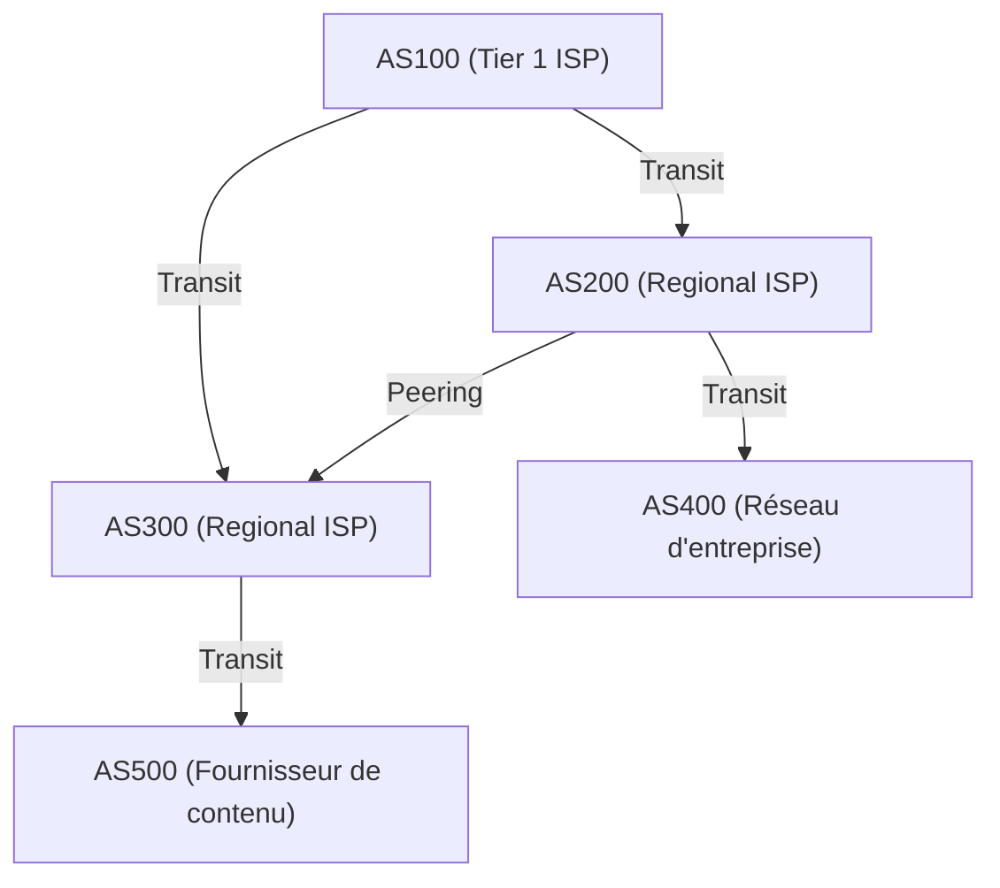

### Peering et Transit : L'économie d'Internet

Il existe principalement deux modèles économiques pour les connexions entre AS via BGP.

1. **Transit (Transit)**
   Il s'agit d'une relation où les petits FAI et les entreprises paient des frais de communication à un grand FAI pour obtenir une connectivité (full route) vers toutes les destinations sur Internet. C'est une relation hiérarchique de type « client » et « fournisseur ».
2. **Peering (Peering)**
   C'est une relation où les FAI entre eux, ou un FAI et un fournisseur de contenu (comme Google ou Netflix), connectent directement leurs réseaux mutuels via un IX (Internet Exchange). Cela se fait généralement gratuitement (settlement-free) dans le but de raccourcir le trafic et de réduire les coûts.

### Path Vector et l'algorithme de sélection de route BGP

Le BGP est un protocole de type « vecteur de chemin » (path vector). Il conserve comme attribut les AS traversés (`AS_PATH`) avant d'atteindre un réseau IP spécifique. Par exemple, si une information de routage indique `AS_PATH: [200, 100, 500]`, le paquet traversera les AS dans cet ordre. Cela empêche de manière fiable les boucles de routage.

Lorsqu'un routeur BGP reçoit plusieurs routes pour la même destination, il sélectionne un seul meilleur chemin basé sur une priorité complexe (Local Preference, longueur de l'AS_PATH, MED, distinction eBGP/iBGP, etc.). L'attribut **Local Preference (Préférence Locale)** est particulièrement puissant ; il permet d'imposer au routeur des politiques commerciales telles que : « Bien que ce soit techniquement un détour, nous privilégions cette route car passer par une ligne de peering évite les frais de transit ».

### Détournement BGP (BGP Hijacking) et vulnérabilités des routes

Le BGP a été conçu à l'origine sur le principe de la « confiance ». Il croit que « les informations de routage annoncées par d'autres sont correctes ». Par conséquent, si un AS malveillant ou mal configuré envoie une mise à jour BGP erronée affirmant : « J'ai la meilleure route vers le réseau de Google (8.8.8.8/32) », un **détournement BGP (BGP Hijacking)** se produit, aspirant le trafic mondial vers cet AS.
Historiquement, les incidents majeurs exploitant les vulnérabilités du BGP sont innombrables, comme l'incident de 2008 où la censure de YouTube par le gouvernement pakistanais a entraîné la panne de YouTube à l'échelle mondiale. Aujourd'hui, des mécanismes de vérification des informations de routage utilisant la cryptographie, tels que la RPKI (Resource Public Key Infrastructure), sont en cours de déploiement.

## 3.6 Contraintes physiques et lutte des routeurs : Latence et Bufferbloat

Le routage de la couche réseau est une lutte constante contre les contraintes de la physique.
La vitesse de la lumière à l'intérieur d'une fibre optique est d'environ 67 % de la vitesse de la lumière dans le vide (environ 200 000 km/s). Par conséquent, un délai physique (délai de propagation) d'environ 100 à 120 millisecondes aller-retour (RTT) entre le Japon et la côte ouest des États-Unis est inévitable.

À cela s'ajoutent les délais de traitement de chaque routeur, ainsi que le **délai de mise en file d'attente (queuing delay)**. Lors d'une congestion du réseau, les routeurs stockent temporairement les paquets dans leur mémoire (tampon/buffer). Les routeurs modernes étant équipés de mémoires de grande capacité, ils continuent d'absorber des congestions prolongées sans rejeter de paquets. C'est ce qu'on appelle le **Bufferbloat**. Le fait qu'un grand nombre de paquets stagne dans le tampon empêche le contrôle de congestion des couches supérieures (comme TCP) de fonctionner correctement, entraînant des latences extrêmes (des milliers de millisecondes). Pour résoudre ce problème, des algorithmes de gestion de file d'attente avancés tels que l'AQM (Active Queue Management) et FQ-CoDel sont implémentés dans les routeurs et systèmes d'exploitation modernes.

## Résumé

La troisième couche, la couche réseau, n'est pas un simple transporteur de données. Elle entremêle des processus complexes : la transition historique d'IPv4 à IPv6, le traitement matériel à la nanoseconde utilisant la TCAM, la recherche mathématique du chemin le plus court via OSPF, et le contrôle de routage autonome décentralisé imprégné d'intentions économiques et politiques par BGP.
Avant qu'un seul paquet IP n'atteigne le serveur à l'autre bout de la planète depuis votre smartphone, il y a le fonctionnement du système le plus vaste et le plus complexe construit par l'humanité, où d'innombrables routeurs consultent instantanément leurs propres cartes (tables de routage) et se passent les paquets comme un relais.

Dans le chapitre suivant, nous expliquerons le fonctionnement de la « couche transport (TCP/UDP) », construite au-dessus de cette couche réseau et chargée de la garantie de livraison des paquets et du contrôle de congestion.

# Chapitre 4 : Certitude et vitesse de la couche transport —— Le dilemme ultime soutenant la transmission de l'information

## 1. Introduction : Le principe de bout en bout et la mission de la couche transport

La mission principale de la couche réseau (IP) que nous avons vue dans les chapitres précédents était de transporter les paquets à travers le vaste océan d'Internet jusqu'à « l'ordinateur de destination (l'interface réseau de l'hôte) », physiquement et logiquement. Cependant, la simple arrivée du paquet à l'hôte de destination ne termine pas la communication. Les systèmes informatiques modernes exécutent simultanément, en mode multitâche, de nombreux processus d'application sur le système d'exploitation (navigateur Web, client de messagerie, application de streaming vidéo, processus de synchronisation en arrière-plan, services d'API, etc.).

La « couche transport » est responsable de l'autorité finale de gestion des données au niveau du point de terminaison : identifier à quelle application appartient chaque paquet parmi la montagne de paquets remontant de la couche IP de manière désordonnée, les reconstruire sous forme de flux de données significatif et, le cas échéant, compenser les pertes.

Au cœur de la philosophie de conception d'Internet se trouve une décision architecturale extrêmement élégante et puissante appelée le « principe de bout en bout (End-to-End Principle) ». C'est un concept proposé en 1981 par Jerome Saltzer et d'autres, stipulant que « les nœuds intermédiaires du réseau (routeurs et commutateurs) doivent se limiter autant que possible au simple transfert de paquets (dumb network), tandis que les traitements complexes tels que la récupération d'erreurs, le contrôle de l'ordre et le chiffrement doivent être confiés aux hôtes aux extrémités de la communication (smart endpoints) ». Si le réseau avait été conçu pour que les équipements intermédiaires gèrent des états complexes et corrigent les erreurs, Internet n'aurait jamais pu atteindre son évolutivité explosive à l'échelle mondiale telle que nous la connaissons aujourd'hui.

La couche transport est constamment confrontée à un dilemme fondamental entre les contraintes physiques et la théorie de l'information : le compromis entre la « Certitude (Reliability) » et la « Vitesse (Speed / Low Latency) ». Pour délivrer l'information sans aucune perte, une surcharge de vérification et de retransmission est nécessaire, ce qui entraîne des retards liés à la limite physique de la vitesse de la lumière. D'un autre côté, si l'on cherche à minimiser la latence, il faut inévitablement sacrifier une part de l'intégrité de l'information. C'est selon la façon de résoudre ce dilemme, enraciné dans les lois de la physique, et l'abstraction offerte aux applications que différents protocoles comme TCP, UDP et aujourd'hui QUIC ont été conçus et ont évolué.

## 2. TCP (Transmission Control Protocol) : Le mécanisme robuste garantissant la certitude

Les bases de TCP ont été posées dans les années 1970, avant la commercialisation d'Internet, lorsqu'il s'appelait encore ARPANET, par Vinton Cerf et Robert Kahn. Sa philosophie de conception est extrêmement claire : « Garantir que les données parviennent à l'application de destination sans perte, dans le bon ordre, et sans doublons, même dans les environnements réseau les plus dégradés et sur des lignes instables avec des pertes fréquentes de paquets ». Tant que les développeurs d'applications utilisent TCP, ils n'ont pas à se soucier de la complexité du réseau sous-jacent ni des pertes de paquets ; le protocole leur fournit une puissante abstraction en leur permettant de lire et d'écrire des données comme un simple « flux d'octets continu ».

### Multiplexage (Multiplexing) par les numéros de port
Si l'adresse IP est l'adresse indiquant « quel bâtiment sur Terre », le « numéro de port » de la couche transport correspond au guichet logique indiquant « vers quelle pièce de ce bâtiment (vers quel processus) ». Les numéros de port sont exprimés par des entiers non signés de 16 bits, prenant des valeurs de 0 à 65535.
Cela permet de multiplexer (superposer) simultanément des milliers, voire des dizaines de milliers de communications différentes sur une seule adresse IP et une seule interface réseau physique. Par exemple, HTTP utilise le port 80, HTTPS le port 443 et SSH le port 22 ; des numéros prédéfinis appelés « ports bien connus (Well-Known Ports) » sont attribués aux services principaux.

### Le Handshake à 3 voies (3-Way Handshake) : Établissement de la confiance et délai physique
Avant de commencer à communiquer, TCP effectue toujours un rituel pour établir une « connexion » logique entre l'expéditeur et le destinataire. C'est le « Handshake à 3 voies (3-Way Handshake) ». Cela ne se limite pas à confirmer l'intention de communiquer ; cela a une signification cruciale : la synchronisation de l'espace d'état en vue de l'énorme échange de données qui va suivre.

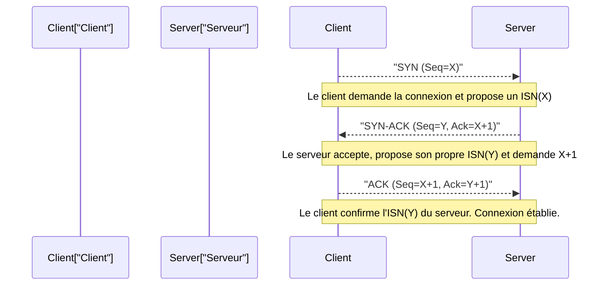

1. **SYN (Synchronize) :** Le client envoie au serveur un paquet de demande de synchronisation (un segment TCP avec le drapeau SYN activé). Ce faisant, il présente un « numéro de séquence initial (ISN: Initial Sequence Number) » de 32 bits généré de manière aléatoire (que nous appellerons X ici). Il y a une raison pour ne pas commencer l'ISN à zéro ou à une valeur fixe. Il s'agit d'une précaution cryptographique pour éviter de confondre des « paquets fantômes (ghost packets) » (de vieux paquets perdus et retardés sur le réseau provenant de communications antérieures terminées sur les mêmes IP et ports) avec ceux de la nouvelle communication, et pour prévenir les attaques de prédiction de séquence TCP (IP spoofing) où un attaquant insère de fausses données en devinant les numéros de séquence.
2. **SYN-ACK :** Lorsque le serveur accepte la demande de connexion, il renvoie un paquet SYN-ACK, en ajoutant 1 à l'ISN du client (X+1) comme « numéro d'accusé de réception (Acknowledgment Number) », tout en fournissant son propre numéro de séquence initial aléatoire (Y).
3. **ACK (Acknowledgment) :** Le client envoie un paquet ACK avec Y+1 comme numéro d'accusé de réception, pour prouver qu'il a bien reçu l'ISN du serveur.

Lorsque cet échange de trois paquets est terminé, l'état de communication bidirectionnelle est réservé en mémoire, et la préparation au transfert de données est complète. Cependant, ce processus rigoureux est lourdement limité par les contraintes physiques de l'infrastructure de communication, à savoir la « vitesse de la lumière ».
La vitesse de la lumière dans le vide est d'environ 300 000 km/s, mais en raison de l'indice de réfraction du cœur des fibres optiques (verre de silice), qui constituent l'épine dorsale d'Internet, la vitesse de propagation des signaux lumineux diminue d'environ un tiers (soit environ 200 000 km/s). De plus, des délais de file d'attente s'ajoutent en raison des traitements de routage et de commutation sur les routeurs intermédiaires. En conséquence, le temps nécessaire pour un aller-retour (1 RTT : Round Trip Time) entre Tokyo et New York (distance en ligne droite d'environ 11 000 km, mais la longueur réelle des câbles est plus importante) nécessite inévitablement entre 150 et 200 millisecondes. Étant donné que le Handshake à 3 voies de TCP consomme au moins 1 RTT, peu importe l'élargissement de la bande passante (bandwidth), la latence (délai) lors de l'établissement de la connexion est restreinte par la loi absolue de l'univers, la vitesse de la lumière.

### Fenêtre glissante (Sliding Window), contrôle de l'ordre et somme de contrôle (Checksum)
Une fois dans la phase de transfert de données, TCP divise le flux d'octets reçu de l'application en segments d'une taille appropriée (MSS : Maximum Segment Size, généralement autour de 1460 octets, soit le MTU IP moins la taille des en-têtes) et les transmet. Chaque segment se voit attribuer un numéro de séquence en fonction du nombre d'octets de données, ce qui permet au récepteur, même si les paquets arrivent dans le désordre (out-of-order), de reconstituer les données originales dans le bon ordre.

De plus, l'en-tête TCP comprend une « somme de contrôle (Checksum) » de 16 bits, qui vérifie rigoureusement à l'aide d'une somme en complément à 1 si les données n'ont pas subi de corruption (inversion de bits) due au bruit électrique sur le trajet de transmission ou à des erreurs mémoire dans les routeurs.

Si un paquet est perdu (packet loss) en cours de route ou s'il est endommagé et rejeté, le récepteur continue de renvoyer un ACK pour le numéro de séquence attendu (ACK dupliqué) ou ne renvoie rien. L'expéditeur « retransmet (Retransmit) » le paquet si aucun ACK n'est reçu après un certain temps (RTO : Retransmission Timeout) ou s'il détecte des ACK dupliqués.

Ce qui augmente considérablement la vitesse de communication dans ce mécanisme est le concept de la « fenêtre glissante (Sliding Window) ». L'approche « envoyer un paquet et attendre son ACK avant d'envoyer le suivant (Stop-and-Wait) » réduirait le débit de manière dramatique dans l'environnement à haute latence (grand RTT) mentionné ci-dessus.
Avec la méthode de la fenêtre glissante, l'expéditeur et le destinataire s'accordent dynamiquement sur la « taille de la fenêtre (le nombre maximum d'octets de données non confirmés pouvant être envoyés à la fois) », en tenant compte de la capacité de leurs mémoires tampons respectives. L'expéditeur peut alors envoyer successivement des paquets sur le réseau dans les limites de cette taille de fenêtre, sans attendre les ACK du récepteur. Et chaque fois qu'un ACK est reçu, cette limite d'envoi possible (la fenêtre) glisse vers l'avant. Cela réalise le mécanisme de maximisation de la bande passante consistant à « maintenir le tuyau rempli de données » dans un réseau à large bande et haute latence (un environnement avec un grand BDP : Bandwidth-Delay Product, produit délai-bande passante).

### Contrôle de congestion (Congestion Control) : L'harmonie mathématique pour prévenir l'effondrement du réseau
Le véritable chef-d'œuvre de TCP, et sans doute l'une des percées technologiques les plus importantes de l'histoire d'Internet, est le « contrôle de congestion (Congestion Control) ».

En 1986, le premier Internet (NSFNET) a été confronté à une défaillance système critique appelée « effondrement par congestion (Congestion Collapse) » due à l'augmentation du trafic. En raison d'un afflux de données dépassant la capacité de traitement du réseau, les files d'attente des routeurs (mémoires tampons) ont débordé, entraînant l'élimination massive de paquets. Les terminaux TCP, détectant la perte de paquets, ont conclu que les données n'étaient pas arrivées et ont procédé à la « retransmission » simultanée de tous les paquets. Cela a injecté encore plus de données dans le réseau, saturant davantage les routeurs et plongeant le système dans un cercle vicieux catastrophique, où le débit effectif chutait à un millième de sa valeur normale.

Pour éviter la mort du réseau, Van Jacobson et d'autres ont introduit en 1988 des algorithmes de contrôle dynamique avancés dans TCP. Au cœur de ce dispositif se trouve le contrôle de la fenêtre de congestion (cwnd : Congestion Window), basé sur le principe « AIMD (Additive Increase Multiplicative Decrease : Augmentation Additive et Diminution Multiplicative) ».

1. **Démarrage lent (Slow Start) :** Juste après le début de la communication, la capacité disponible du réseau est totalement inconnue. Par conséquent, la taille de la fenêtre de transmission commence avec une très petite valeur (historiquement 1 MSS, aujourd'hui environ 10 MSS), et est augmentée de 1 MSS pour chaque ACK reçu. Il en résulte une croissance exponentielle où la « taille de la fenêtre double à chaque RTT ». Contrairement à son nom « lent », c'est une phase extrêmement agressive et rapide d'exploration de la limite de bande passante.
2. **Évitement de congestion (Congestion Avoidance) :** Lorsque la taille de la fenêtre atteint un seuil prédéfini (ssthresh : Slow Start Threshold), la croissance exponentielle s'arrête et passe à une augmentation linéaire (addition de 1 MSS par RTT). C'est la phase d'exploration plus prudente de la capacité limite du réseau (la taille du tuyau).
3. **Détection de la perte de paquets et diminution multiplicative :** Lorsqu'il détecte une perte de paquets (survenue d'un timeout ou réception de 3 ACK dupliqués consécutifs par le récepteur), TCP interprète cela non pas comme une simple erreur de transfert, mais comme un « signe que des encombrements (congestion) se produisent sur le chemin du réseau et que des paquets débordent des tampons des routeurs ». À cet instant, TCP active immédiatement un autocontrôle, réduisant drastiquement la taille de la fenêtre de transmission de moitié (ou à la valeur initiale du démarrage lent).

Grâce à cet algorithme distribué, mathématique et altruiste de « partage progressif de la bande passante (augmentation additive) et concession soudaine en cas de problème (diminution multiplicative) », les milliards de connexions TCP indépendantes sur Internet, bien que dépourvues d'un gestionnaire de trafic centralisé, maintiennent une harmonie miraculeuse (homéostasie) en assurant une « répartition équitable de la bande passante » et le « fonctionnement stable du réseau dans son ensemble ».

Ces dernières années, la grande capacité des mémoires tampons des routeurs a eu un effet pervers : les paquets continuent de stagner dans des files d'attente de plus en plus longues avant qu'une suppression de paquets due à la congestion ne survienne, provoquant une augmentation spectaculaire des délais (valeurs Ping) de plusieurs centaines de millisecondes à plusieurs secondes. Ce nouveau phénomène physique, appelé « Bufferbloat », est devenu un problème. Pour y faire face, Google et d'autres ont développé de nouveaux algorithmes de contrôle de congestion, tels que BBR (Bottleneck Bandwidth and Round-trip propagation time), qui détectent l'« augmentation du RTT (temps de latence) » plutôt que la perte de paquets comme signe de congestion, et qui limitent de manière proactive la vitesse de transmission avant de saturer les tampons, devenant progressivement la norme TCP moderne.

## 3. UDP (User Datagram Protocol) : Le dépouillement au profit de la vitesse

Si TCP est le « gestionnaire surprotecteur » garantissant une certitude totale des données grâce à des transitions d'état complexes et des algorithmes avancés, UDP, qui appartient à la même couche transport, est le « transporteur minimaliste » dont le rôle de protocole a été réduit à l'extrême. Conçu par Jon Postel en 1980, UDP ne possède que les fonctions minimales de la couche transport.

L'en-tête d'UDP ne fait que 8 octets (l'en-tête TCP fait généralement 20 octets, et jusqu'à 60 octets avec les options). Il contient uniquement le « numéro de port source », le « numéro de port de destination », la « longueur des données » et une simple « somme de contrôle » pour détecter la corruption des données.

UDP n'implémente aucun établissement préalable de connexion via un Handshake à 3 voies, aucune garantie d'ordre par des numéros de séquence, aucun contrôle de flux via une fenêtre glissante, aucune retransmission et aucun contrôle de congestion pour protéger le réseau. Il enveloppe simplement les données transmises par l'application dans des datagrammes IP et les injecte dans la couche réseau, selon le principe du « Fire and Forget (Tirer et oublier) ». Il ne se soucie même pas de savoir si elles sont arrivées à destination.

Cependant, c'est précisément cette simplicité structurelle, que l'on pourrait qualifier d'irresponsable, qui est la plus grande arme d'UDP et la raison pour laquelle il surpasse TCP dans certains cas d'usage spécifiques.

### La véritable valeur d'UDP : La suprématie de la latence et la communication en temps réel
Dans les communications en temps réel, où il est nécessaire de réduire à l'extrême la latence (retard) physique, le « contrôle des retransmissions pour garantir la certitude » de TCP cause en réalité des problèmes fatals.

Imaginez, par exemple, des jeux en ligne comme les FPS (First-Person Shooters), les appels vocaux (VoIP) ou les systèmes de visioconférence (Zoom, WebRTC, etc.). Ces applications transmettent des paquets de données de localisation ou d'échantillons audio mis à jour des dizaines à des centaines de fois par seconde.
Si TCP était utilisé, et qu'un paquet vocal envoyé il y a 100 millisecondes était perdu dans un routeur intermédiaire, TCP détecterait cette perte, retransmettrait le paquet, et le récepteur essaierait de le reproduire dans le bon ordre. Cependant, dans un environnement où la conversation ou le jeu progresse en temps réel, « les données passées arrivées avec plusieurs centaines de millisecondes de retard » n'ont plus aucune valeur.
Pire encore, jusqu'à ce que le paquet perdu soit retransmis et que l'ordre soit rétabli, TCP arrête le traitement (le transfert à l'application) des nouveaux paquets déjà arrivés à la suite et les met en mémoire tampon. C'est ce qu'on appelle le blocage de tête de ligne (« Head-of-Line (HoL) Blocking »). Le son qui coupe de manière intermittente, ou l'écran de jeu qui fige pendant quelques secondes avant d'avancer en accéléré, sont souvent causés par ce blocage HoL dû à l'attente de retransmission de TCP.

Dans de tels cas, UDP permet d'abandonner gracieusement les paquets passés perdus et de traiter immédiatement avec l'application les paquets les plus récents qui arrivent. Dans les communications en temps réel, l'« affichage constant de l'état le plus récent avec la latence la plus courte, même avec quelques bruits ou pertes d'images », constitue une expérience utilisateur bien plus naturelle et confortable pour les sens humains que le fait « d'avoir toutes les données au complet ».

De plus, UDP, dépourvu de la surcharge du Handshake, est idéal pour des transactions de communication simples où « une petite requête » se conclut par « une réponse », comme la résolution de noms de domaine du DNS (Domain Name System) ou la synchronisation d'horloge du NTP (Network Time Protocol).
## 4. QUIC : Le changement de paradigme des communications sur Internet et le protocole de nouvelle génération

Pendant des décennies, depuis les débuts d'Internet, notre architecture réseau a été emprisonnée dans une dichotomie figée : "TCP si vous voulez un transfert de flux fiable, UDP si vous voulez de la vitesse et du temps réel". Cependant, avec l'évolution spectaculaire du Web moderne (notamment la généralisation des communications mobiles et l'ère de HTTP/2 qui charge massivement des ressources en parallèle), les limites de la conception fondamentale de TCP ont commencé à apparaître comme une entrave.

Le plus grand défi est le blocage en tête de ligne ("Head-of-Line" ou HoL) spécifique à TCP, évoqué dans la section UDP, ainsi que la "latence excessive" associée à l'établissement de la connexion.
TCP gère toutes les communications comme un "flux d'octets en série unique". Supposons que pour afficher un site Web moderne, vous demandiez simultanément (par multiplexage) via HTTP/2 plusieurs fichiers tels que du HTML, du CSS, du JavaScript et des dizaines d'images. Mais comme il s'agit d'un flux unique au niveau TCP sous-jacent, si ne serait-ce qu'un seul paquet de l'"Image A" est perdu, la couche TCP bloquera la livraison des paquets du "Script B" et de l'"Image C" (pourtant sans rapport) au niveau du noyau de l'OS jusqu'à ce que la retransmission de ce paquet soit terminée.
De plus, bien que le chiffrement (TLS/HTTPS) soit indispensable pour le Web moderne, l'ancienne pile de protocoles nécessitait de terminer la "négociation à trois voies (3-way handshake) de TCP (1 RTT)" avant d'effectuer la "négociation d'échange de clés de chiffrement de TLS (1 à 2 RTT)". Cela consommait donc un retard physique important de 2 à 3 RTT avant de commencer réellement la transmission sécurisée des données.

Pour résoudre ces problèmes fondamentaux et apporter un changement de paradigme à l'infrastructure Internet moderne, Google a dirigé le développement de "QUIC (Quick UDP Internet Connections)", un protocole de transport de nouvelle génération normalisé par l'IETF (Internet Engineering Task Force). Et la norme Web redéfinie avec ce QUIC comme protocole de base est "HTTP/3".

### L'ossification des "middleboxes" et la fuite vers l'espace utilisateur
L'approche la plus révolutionnaire de QUIC réside dans sa conception architecturale audacieuse : **"reconstruire entièrement dans l'espace utilisateur une nouvelle couche de transport intégrant le chiffrement et le multiplexage, par-dessus les paquets UDP existants"**.

Pourquoi l'avoir créé sur UDP au lieu d'améliorer TCP ? D'innombrables routeurs, pare-feux et NAT (Network Address Translation) sur Internet, appelés "middleboxes", se sont figés au fil des années d'exploitation et rejettent sans condition tout nouveau protocole (avec un nouveau numéro de protocole) autre que TCP et UDP, le considérant comme une "menace inconnue" (c'est ce qu'on appelle l'ossification d'Internet). De plus, l'implémentation de TCP étant codée en dur au plus profond des noyaux de systèmes d'exploitation (OS) comme Windows ou Linux, il faudrait un temps infini pour mettre à jour les OS du monde entier et diffuser de nouveaux algorithmes.
C'est pourquoi QUIC a adopté une stratégie consistant à traverser les middleboxes en se faisant passer pour de "simples paquets UDP traditionnels", tout en implémentant de manière indépendante à l'intérieur du navigateur ou de l'application (l'espace utilisateur) les meilleures parties de TCP (contrôle de congestion et de retransmission) dans un état beaucoup plus évolué.

### Les mécanismes innovants de QUIC et la transcendance des contraintes physiques

1. **Élimination complète du blocage HoL grâce à l'indépendance des flux :**
   QUIC possède la capacité de gérer de multiples "flux logiques indépendants" au niveau du protocole, au lieu d'un seul flux de paquets. Dans l'exemple précédent, si un paquet de l'Image A est perdu en cours de route, QUIC ne met en pause que le flux de l'Image A en attente de retransmission, tandis que les flux du Script B et de l'Image C continuent d'être traités en parallèle sans être affectés. Ainsi, la vitesse d'affichage des pages Web est considérablement améliorée, en particulier sur les réseaux mobiles où la perte de paquets est fréquente.
2. **Établissement de la connexion en 0-RTT et intégration du chiffrement :**
   QUIC intègre profondément dans son protocole un chiffrement équivalent à TLS 1.3 dès le départ. Il ne commet pas l'erreur de séparer la "connexion de transport" et la "connexion de chiffrement" comme le fait TCP. Même avec un serveur contacté pour la première fois, il complète la connexion et l'échange de clés de chiffrement en seulement 1 RTT. Plus révolutionnaire encore, si vous communiquez avec un serveur avec lequel vous avez déjà échangé dans le passé (un serveur possédant un ticket de session en cache), vous pouvez utiliser le "0-RTT", c'est-à-dire **initier une requête HTTP en même temps que le premier paquet de données sans attendre la fin de la négociation (handshake)**. C'est une réponse extrêmement brillante dès la conception du protocole face à la contrainte physique du "retard lié à la vitesse de la lumière".
3. **Migration de connexion (Indépendance vis-à-vis des adresses IP) :**
   Les connexions TCP traditionnelles étaient fortement liées à 4 éléments (le tuple à 4) : "IP source, port source, IP de destination, port de destination". Ainsi, lorsqu'un utilisateur se déplaçait avec son smartphone, quittant l'environnement Wi-Fi pour passer au réseau cellulaire 4G/5G et que son adresse IP changeait, la connexion TCP était coupée et il fallait recommencer la longue procédure de handshake.
   En revanche, QUIC gère chaque connexion non pas par une adresse IP, mais par un "ID de connexion (Connection ID)" unique généré au début de la communication. Par conséquent, même si l'adresse IP physique ou l'interface réseau change dynamiquement, tant que l'ID de connexion reste le même, le streaming vidéo ou le téléchargement de fichiers volumineux peut se poursuivre de manière transparente sans aucune interruption. À l'ère où les communications mobiles sont reines, c'est une caractéristique extrêmement puissante et inévitable.

## 5. Conclusion : L'évolution des protocoles maîtrisant le chaos et la construction de l'ordre

La couche de transport a bâti un "ordre logique solide" sur lequel les applications peuvent s'appuyer en toute sécurité, par-dessus le chaos de la couche réseau (IP) d'Internet, où les fluctuations constantes, les changements d'itinéraires, la perte de paquets et l'inversion de l'ordre sont monnaie courante.

Le modèle mathématique robuste et le contrôle de congestion de TCP, conçus et peaufinés par Vinton Cerf et Van Jacobson, continuent de protéger le réseau fédérateur (backbone) d'Internet de l'effondrement et soutiennent le transfert de données à travers le monde. Ensuite, la simplicité d'UDP répond aux exigences de communication en temps réel poursuivant l'extrême limite de la latence physique. Et enfin, pour surmonter les limites de ces deux protocoles, l'architecture raffinée du protocole QUIC est née, fusionnant le chiffrement et le multiplexage, et optimisée pour l'environnement mobile moderne.

Tout cela est l'aboutissement de la quête technologique incessante de l'humanité pour répondre à la question : "Comment transmettre l'information de manière précise et rapide entre des ordinateurs éloignés, malgré les contraintes physiques d'une bande passante limitée et de la vitesse de la lumière ?"

Lorsque les paquets sont réordonnés dans le bon ordre et finalement remis à l'application sous forme de blocs de données significatifs, une simple suite de signaux électriques commence enfin à prendre de la valeur en tant qu'"information". Dans le chapitre suivant, nous plongerons dans les abysses des mécanismes de la "couche application (HTTP, DNS, etc.)", qui se construit sur les fondations solides fournies par cette couche de transport et façonne directement le monde du Web que nous côtoyons au quotidien.

# Chapitre 5 : La couche application et les coulisses du Web —— Des abysses de la résolution de noms aux communications chiffrées

Dans les chapitres précédents, nous avons exploré en profondeur le comportement de la couche physique, des photons se déplaçant par réflexion totale dans les fibres optiques aux ondes électromagnétiques se propageant dans des fils de cuivre, puis le routage des paquets par IP, et enfin la fiabilité du transfert de données de la couche transport grâce à TCP/UDP. Dans ce chapitre, nous entrons enfin dans le domaine avec lequel nous autres humains interagissons directement : la "couche application".

Les couches 7 (couche application), 6 (couche présentation) et 5 (couche session) du modèle de référence OSI sont souvent abordées comme une unique "couche application" unifiée dans le modèle hiérarchique TCP/IP moderne. La couche application se situe au plus haut niveau d'abstraction et constitue un écosystème complexe tissé par une multitude de protocoles. Ici, nous allons disséquer à l'extrême, d'un point de vue historique, de l'ingénierie des réseaux et d'une perspective mathématique avancée, les mécanismes dynamiques qui opèrent en coulisses lorsque vous tapez une URL dans la barre d'adresse d'un navigateur jusqu'à l'affichage de la page Web : la résolution de noms par le DNS, le transfert de ressources par HTTP, et le chiffrement par SSL/TLS indispensable à l'Internet moderne.

## 5.1 DNS (Domain Name System) : Les merveilles et la généalogie de la base de données hiérarchique distribuée

Les adresses IP (valeurs numériques de 32 bits pour IPv4 et 128 bits pour IPv6) sont idéales pour que les équipements réseau tels que les routeurs et les commutateurs construisent des tables de routage pour transférer les paquets, mais elles ne conviennent pas du tout à la mémorisation intuitive et à la manipulation sémantique par les humains.

À l'aube d'ARPANET, l'ancêtre d'Internet, le mappage entre les noms d'hôtes et les adresses réseau était géré de manière extrêmement primitive. Le Network Information Center (NIC) du Stanford Research Institute (SRI) gérait un fichier texte unique, `HOSTS.TXT`, de manière centralisée, et chaque nœud téléchargeait ce fichier la nuit via FTP pour mettre à jour son système local. Cependant, au début des années 1980, avec l'augmentation exponentielle et explosive du nombre d'hôtes connectés au réseau, ce modèle centralisé a révélé ses limites fatales : goulots d'étranglement du trafic, retards de mise à jour et conflits de noms (épuisement de l'espace de noms).

Pour surmonter cette crise d'évolutivité, le DNS (Domain Name System), conçu et proposé par Paul Mockapetris en 1983, a été défini dans les RFC 882 et RFC 883. L'essence de l'architecture DNS est un stockage clé-valeur (Key-Value) hiérarchique distribué à l'échelle mondiale. Pour éliminer tout point de défaillance unique (Single Point of Failure) et offrir une évolutivité presque infinie, ce système adopte un paradigme distribué révolutionnaire divisant l'espace de noms de domaine en une structure arborescente et déléguant (Delegation) l'autorité administrative à chaque niveau.

### L'interminable voyage de la résolution de noms : Du "stub resolver" au serveur de noms faisant autorité

À l'instant où un utilisateur saisit `https://www.example.com` dans l'omnibox (barre d'adresse) de son navigateur, le "stub resolver" (résolveur d'extrémité) interne du système d'exploitation s'active et lance en arrière-plan le grand "voyage de la résolution de noms". Ce processus est également une succession de stratégies de mise en cache visant à contourner les contraintes des lois physiques, à savoir la latence du réseau.

1. **Interrogation des caches à plusieurs niveaux** : Tout d'abord, le cache du navigateur local, qui présente la latence la plus faible, est vérifié. Ensuite, le cache DNS de l'OS, puis le cache DNS du routeur sur le réseau local sont interrogés. Le moyen le plus efficace de surmonter la contrainte physique de la vitesse de la lumière (environ 300 000 kilomètres par seconde dans le vide, et environ les deux tiers de cette vitesse dans la fibre optique) est de ne générer aucune communication réseau du tout.
2. **Requête au résolveur récursif (Full Resolver)** : S'il n'y a pas de cache local, la requête est envoyée au résolveur récursif (Recursive Resolver / Full Resolver) géré par le FAI (Fournisseur d'Accès à Internet) ou un fournisseur de DNS public (comme le `8.8.8.8` de Google ou le `1.1.1.1` de Cloudflare). Ce résolveur prend en charge l'ensemble du processus de résolution de noms au nom du client.
3. **Interrogation itérative aux serveurs racines (Root Servers)** : Si le cache du résolveur complet ne contient pas non plus l'enregistrement correspondant, il interroge le "serveur racine", le sommet absolu de la hiérarchie des domaines. Il existe actuellement 13 grappes (clusters) de serveurs racines dans le monde, nommés de A à M. Le serveur racine ne connaît pas directement l'adresse IP de `www.example.com`, mais il renvoie une réponse de délégation (Referral) contenant une liste de serveurs de noms gérant le TLD (Top Level Domain) `.com`. De plus, les serveurs racines dispersés dans le monde entier partagent la même adresse IP grâce à la technologie de routage "Anycast", et le choix d'itinéraire par BGP (Border Gateway Protocol) dirige de manière autonome le trafic du client vers le serveur le plus proche physiquement et selon la topologie du réseau.
4. **Interrogation itérative au serveur TLD** : Ensuite, le résolveur complet envoie une requête à l'un des serveurs TLD `.com` qui lui a été indiqué. Le serveur TLD renvoie l'adresse IP (enregistrement NS) des serveurs DNS faisant autorité (Authoritative DNS Servers) auxquels l'autorité de gestion de `example.com` a été déléguée.
5. **Interrogation du serveur DNS faisant autorité et obtention de l'enregistrement** : Enfin, le résolveur complet accède directement au serveur DNS faisant autorité pour `example.com`. Le fichier de zone du serveur faisant autorité contient la réponse finale : l'enregistrement A (adresse IPv4) ou l'enregistrement AAAA (adresse IPv6), ou encore l'enregistrement CNAME (alias) pour `www`. Cette réponse est renvoyée au stub resolver du client via le résolveur complet.

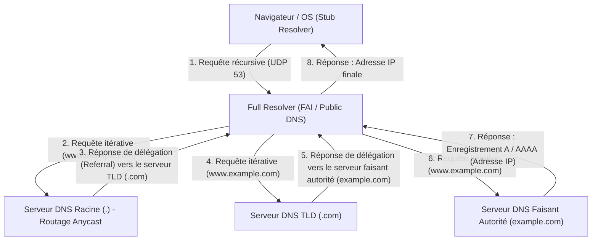

Cette communication aller-retour hiérarchique complexe s'achève généralement en un instant, en quelques millisecondes à quelques dizaines de millisecondes seulement. Le DNS utilise principalement le port UDP 53 comme protocole de couche transport. Il parvient à réduire drastiquement la latence en éliminant complètement la surcharge (overhead) des allers-retours de la négociation à trois voies (SYN, SYN-ACK, ACK) de TCP. Cependant, lorsque la charge utile (payload) de la réponse DNS dépasse la limite historique de 512 octets d'UDP (désormais plus grande grâce à l'extension EDNS0), lorsqu'on vérifie les clés de DNSSEC (DNS Security Extensions) qui est une extension de signature numérique cryptographique pour empêcher les attaques d'empoisonnement du cache DNS, ou lors du transfert de zone (AXFR), le système prévoit un repli (fallback) sur le port TCP 53, plus fiable.

## 5.2 L'architecture HTTP et la théorie de l'évolution des protocoles

Après avoir obtenu l'adresse IP du serveur cible via le DNS, le navigateur a établi une connexion TCP avec ce dernier (sur le port 80 ou 443) et entamé un dialogue via HTTP (HyperText Transfer Protocol), le langage principal de la couche application.

Inventé en 1989 par Tim Berners-Lee au Conseil Européen pour la Recherche Nucléaire (CERN), HTTP était à l'origine un protocole extrêmement simple destiné aux physiciens du monde entier pour partager efficacement des documents de recherche (hypertextes) sur le réseau et les relier par des liens. Sa structure claire basée sur le texte, composée d'une ligne de requête (méthode, URI, version du protocole), de champs d'en-tête, d'une ligne vide (CRLF) et d'un corps de message, a fortement favorisé le débogage et la popularisation du système.

La philosophie de conception fondamentale de HTTP et sa caractéristique principale est d'être "sans état" (Stateless). Le serveur ne conserve en mémoire aucun contexte ni état des requêtes passées du client. Chaque requête est exécutée comme une transaction complètement indépendante. Cette nature "sans état", que l'on retrouve également dans l'architecture REST (Representational State Transfer), a considérablement simplifié la mise en œuvre côté serveur et facilité la montée en charge (scale-out) par l'ajout horizontal de serveurs pour gérer un trafic massif. Un répartiteur de charge (Load Balancer) peut garantir le même résultat quel que soit le serveur back-end auquel la requête est transmise. Cependant, dans les applications Web interactives modernes où la gestion de l'état (State) est inévitable (comme le panier d'achat d'un site de e-commerce ou le maintien de l'état de connexion d'un utilisateur), cette stricte absence d'état constitue une contrainte majeure. Pour pallier cela en dehors du protocole, on a inventé des mécanismes de gestion d'état pseudo-continus tels que les Cookies (qui obligent le client à stocker un état via les en-têtes HTTP) ou les jetons de session (Session Tokens).

### La lutte contre les contraintes physiques : Le changement de paradigme de HTTP/1.1 à HTTP/3

Avec la diffusion explosive du Web et l'augmentation colossale des ressources contenues dans une seule page (images, fichiers CSS, JavaScript, etc.), HTTP a été confronté aux lois physiques du réseau (retard limité par la vitesse de la lumière et perte de paquets), ce qui l'a poussé à subir une évolution architecturale drastique au niveau du protocole.

- **HTTP/1.1 (1997 - )** : Le HTTP/1.0 initial répétait l'établissement et la coupure de la connexion TCP (handshake à 3 voies et handshake à 4 voies) pour chaque ressource demandée, ce qui était le summum de l'inefficacité en termes de latence. HTTP/1.1 a standardisé la connexion persistante (Persistent Connection / Keep-Alive), réduisant considérablement le coût des connexions en permettant la réutilisation d'une seule connexion TCP. Cependant, la technologie du pipelining (pipelining) de HTTP/1.1 n'est pas devenue populaire en raison de difficultés de mise en œuvre et de problèmes de compatibilité avec les proxy intermédiaires, et elle souffrait d'un défaut structurel fatal appelé "Head-of-Line (HoL) Blocking". Il s'agit d'un phénomène où, sur une seule connexion TCP, pendant que le serveur traite une ressource énorme ou une requête lourde, les requêtes suivantes restent bloquées dans la file d'attente, ce qui aggrave la latence globale. Pour contourner cela, les navigateurs ont dû recourir à des méthodes rudimentaires, comme l'ouverture simultanée de plusieurs connexions TCP (généralement environ 6) vers le même domaine (le "Domain Sharding", par exemple).
- **HTTP/2 (2015 - )** : Standardisé sur la base du protocole SPDY développé par Google, HTTP/2 a fondamentalement renouvelé l'architecture du protocole, passant d'un modèle basé sur le texte à un modèle "basé sur le cadrage binaire (Binary Framing)". L'innovation la plus importante est le "Multiplexage de flux (Multiplexing)". Dans HTTP/2, il est possible de créer plusieurs "flux" virtuels au sein d'une seule connexion TCP, de diviser les données des requêtes et des réponses en petites trames binaires, et de les transmettre de manière entrelacée (interleaved) sans se soucier de l'ordre. Cela a complètement éliminé le blocage HoL au niveau de la couche application. De plus, le mécanisme de compression d'en-tête utilisant l'algorithme HPACK (combinaison d'un codage de Huffman statique et d'une table dynamique) a drastiquement réduit la quantité de données redondantes transférées, comme les Cookies ou le User-Agent, qui sont envoyés à plusieurs reprises dans chaque requête, maximisant ainsi l'efficacité de l'utilisation de la bande passante du réseau.
- **HTTP/3 (2022 - )** : Bien que HTTP/2 ait brillamment résolu le blocage HoL de la couche application, la barrière physique du "blocage HoL lors de la perte de paquets" subsistait au niveau de la couche de transport sous-jacente (TCP). Pour garantir la fiabilité, TCP exige que si ne serait-ce qu'un seul paquet manque en cours de route, la livraison à la couche application de tous les paquets de données de tous les flux sur cette connexion TCP est stoppée jusqu'à ce que la retransmission soit terminée (un effet néfaste du mécanisme de garantie d'ordre de TCP). Pour briser ce problème, HTTP/3 a opéré un changement de paradigme radical en abandonnant TCP, qui était le socle d'Internet depuis des décennies, au profit d'un nouveau protocole de transport basé sur UDP appelé "QUIC (Quick UDP Internet Connections)". QUIC contourne le retard de l'évolution dû au fait que TCP est implémenté dans l'espace noyau (kernel space) de l'OS, et intègre ses propres contrôles de retransmission, de congestion, et un contrôle de flux indépendant par flux au-dessus d'UDP, implémentable dans l'espace utilisateur. Même si un paquet est perdu, seul le flux spécifique concerné est affecté, et les autres flux peuvent continuer à être traités sans être bloqués. De plus, QUIC intègre la négociation de l'établissement de la connexion et celle du chiffrement (TLS 1.3), permettant de commencer à envoyer des données chiffrées en "0-RTT (Zero Round Trip Time)" avec des serveurs ayant déjà un historique de communication. Face à la limite physique de la vitesse de la lumière (les communications avec l'autre bout de la Terre entraînent inévitablement un retard de plusieurs centaines de millisecondes), il s'agit du résultat de la poursuite de la performance ultime en réduisant drastiquement le nombre d'allers-retours (RTT) de communication au niveau de la couche du protocole.

## 5.3 Les mécanismes de chiffrement et de confiance : Les abysses mathématiques et la logique de preuve de SSL/TLS

Internet est intrinsèquement un réseau de communication par paquets ouvert, et les données sont transférées vers leur destination en relais, passant par d'innombrables routeurs et câbles à fibre optique sous-marins. Il est physiquement possible pour tout nœud sur ce chemin (routeur intermédiaire, FAI malveillant ou même un espion sur le même réseau Wi-Fi) d'intercepter et même de falsifier le contenu de la communication via la capture de paquets. Les protocoles SSL (Secure Sockets Layer) et son successeur TLS (Transport Layer Security) permettent de confiner cette vulnérabilité absolue du réseau grâce à la puissance des mathématiques avancées et d'établir un canal de communication sécurisé.

TLS garantit pour les communications Web modernes les "trois piliers de la sécurité" suivants :
1. **Confidentialité (Confidentiality)** : Le contenu de la communication ne peut pas être déchiffré même s'il est intercepté par un tiers.
2. **Intégrité (Integrity)** : Pas un seul bit de donnée n'est altéré sur le chemin de communication. Elle est garantie par des codes d'authentification de message (MAC : Message Authentication Code) ou par le chiffrement authentifié avec données associées (AEAD : Authenticated Encryption with Associated Data).
3. **Authentification (Authentication)** : Le correspondant est bien le propriétaire légitime du domaine (le vrai serveur).

Les technologies qui rendent cela possible sont le fruit de la théorie de la cryptographie, construite par l'humanité au fil des siècles et qui a fait un bond en avant grâce au développement de l'informatique et de la théorie des nombres, particulièrement après la Seconde Guerre mondiale.

### Échange de clés et cryptographie asymétrique (à clé publique) : Le mur du problème du logarithme discret et de la factorisation en nombres premiers

La méthode de chiffrement la plus simple et la plus rapide à traiter est la "cryptographie symétrique (à clé secrète)" (la norme actuelle étant l'AES : Advanced Encryption Standard). Il s'agit d'une méthode où l'expéditeur et le destinataire utilisent la même "clé partagée" (clé commune) pour chiffrer et déchiffrer. Les opérations mathématiques étant légères (combinaisons d'opérations XOR sur des bits, de substitutions et de permutations), cette méthode est adaptée au chiffrement en temps réel de communications de l'ordre du gigabit. Cependant, la cryptographie à clé symétrique souffrait d'un paradoxe fondamental (le problème de la distribution des clés) : "Comment transmettre de manière sécurisée cette clé secrète à l'autre partie avant même de commencer à communiquer ?" Dans des communications avec un correspondant avec lequel il n'y a pas de relation de confiance préalable, comme sur Internet, si la clé symétrique est envoyée telle quelle, elle sera interceptée en chemin, ce qui viderait le chiffrement de tout son sens.

La plus grande avancée de l'histoire de l'humanité en cryptographie pour résoudre cela a été l'algorithme d'échange de clés publié en 1976 par Whitfield Diffie et Martin Hellman, puis la "cryptographie à clé publique (cryptographie asymétrique)" conçue en 1977 par RSA (Rivest, Shamir, Adleman).

À la base de la cryptographie à clé publique se trouve le concept mathématique de "fonction à sens unique (One-way function)" ou de "fonction à sens unique avec trappe (Trapdoor one-way function)". Cela utilise l'asymétrie selon laquelle "le calcul dans un sens (le chiffrement) peut être effectué instantanément par un ordinateur, mais le calcul dans le sens inverse (le déchiffrement ou la devinette de la clé) ne se terminerait pas, même si l'on connectait tous les supercalculateurs du monde pour calculer pendant toute la durée de vie de l'univers".

- **Chiffrement RSA** : Il repose sur la propriété selon laquelle il est facile (calculable en temps polynomial) de multiplier deux très grands nombres premiers ($p$ et $q$) pour créer un nombre composé géant ($N = p \times q$), mais qu'il est extrêmement difficile (seuls des algorithmes en temps sous-exponentiel sont connus) de déduire les facteurs premiers originaux $p$ et $q$ à partir de ce seul nombre composé géant $N$ (le problème de la factorisation en nombres premiers). En utilisant des propriétés profondes de la théorie des nombres, telles que la fonction indicatrice d'Euler et le petit théorème de Fermat, cela construit une trappe mathématique où les données chiffrées avec la clé publique ne peuvent être déchiffrées que par le détenteur de la clé privée correspondante.
- **Cryptographie sur les courbes elliptiques (ECC : Elliptic Curve Cryptography)** : L'ECC, actuellement prédominante dans TLS, applique la difficulté du "problème du logarithme discret" défini sur des courbes elliptiques sur un corps fini (par exemple, un ensemble de points satisfaisant une équation comme $y^2 = x^3 + ax + b$). On définit des opérations géométriques telles que l'"addition" et la "multiplication scalaire" pour les points sur la courbe elliptique. S'il est facile de trouver un point $P = kG$ qui est la somme d'un point de départ $G$ additionné un nombre secret de fois $k$, il est encore plus difficile que la factorisation en nombres premiers de RSA de calculer à l'envers le coefficient secret $k$ (le logarithme discret) représentant le nombre d'additions, à partir des points publics $G$ et $P$. Grâce à cela, l'ECC offre une robustesse cryptographique équivalente ou supérieure avec une longueur de clé extrêmement courte, d'une fraction de celle de RSA (par exemple, en atteignant avec de l'ECC 256 bits une sécurité équivalente à celle du RSA 2048 bits), ce qui permet de réduire considérablement la charge du CPU et la bande passante du réseau.

### Handshake TLS : Un rituel cryptographique pour établir la confiance

Lorsqu'on lance une communication sécurisée via HTTPS, le client et le serveur génèrent une "clé de session" sécurisée pour le chiffrement symétrique et exécutent un protocole de négociation avancé pour authentifier l'identité de l'autre partie. C'est le "handshake" (négociation) TLS. Voici l'anatomie du handshake en 1-RTT dans "TLS 1.3", la norme la plus récente, dépouillée à l'extrême de tout superflu.

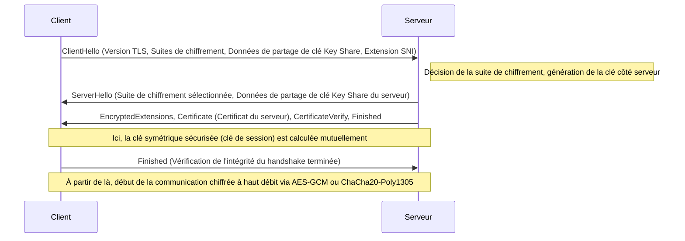

1. **ClientHello** : Au début de la connexion, le client envoie au serveur la version de TLS qu'il prend en charge, une liste d'algorithmes de chiffrement (Cipher Suites) et les paramètres mathématiques initiaux (Key Share) pour générer les clés de chiffrement. De plus, il utilise l'extension SNI (Server Name Indication) pour envoyer en texte clair le nom d'hôte de destination (par exemple : `www.example.com`). Il s'agit d'une information indispensable pour qu'un serveur hébergeant plusieurs domaines HTTPS sur une seule adresse IP (Virtual Host) puisse sélectionner et renvoyer le bon certificat.
2. **ServerHello** : Le serveur sélectionne l'algorithme de chiffrement le plus puissant et le plus optimal dans la liste du client (par exemple : `TLS_AES_256_GCM_SHA384`) et répond avec ses propres données Key Share.
3. **Envoi du certificat et signature (Authentication)** : Le serveur envoie son propre "certificat numérique (X.509)". En outre, le serveur utilise la "clé privée" associée à ce certificat pour créer et envoyer une signature numérique (CertificateVerify) basée sur la valeur de hachage de l'ensemble des messages du handshake jusqu'à présent. Cela prouve mathématiquement que le serveur est le propriétaire légitime (le détenteur de la clé privée) de ce certificat.
4. **Échange de clés (Ephemeral Elliptic Curve Diffie-Hellman : ECDHE)** : Le client et le serveur multiplient mathématiquement les Key Shares (les points publics sur la courbe elliptique) qu'ils ont échangés avec leurs propres paramètres secrets qu'ils sont les seuls à posséder. Étonnamment, grâce aux propriétés mathématiques de l'échange de clés Diffie-Hellman ($ (g^a)^b = (g^b)^a = g^{ab} $), exactement le même et puissant "secret maître (clé partagée/symétrique)" est synthétisé comme par magie côté client et côté serveur, sans qu'aucune information secrète ne transite sur le réseau.
5. **Confidentialité persistante (Perfect Forward Secrecy : PFS)** : Une caractéristique extrêmement importante de TLS 1.3 est que les paramètres (Key Share) utilisés pour cet échange de clés sont éphémères (Ephemeral) et générés de nouveau à chaque établissement de session, puis jetés. Par conséquent, même si la clé privée du serveur (clé RSA ou ECDSA), utilisée pour l'identification à long terme, venait à être divulguée à un attaquant plusieurs années plus tard, il serait mathématiquement totalement impossible de remonter dans le temps et de déchiffrer les paquets de communications chiffrées enregistrés et sauvegardés dans le passé. La confidentialité des communications passées est garantie pour l'avenir.

### PKI et la chaîne de confiance (Chain of Trust) : Le passeport du monde numérique

Dans les mécanismes de chiffrement abordés jusqu'à présent, il reste une faille logique fatale : "Comment le client peut-il être sûr que le certificat et la clé publique envoyés par le serveur sont réellement ceux du domaine cible (par exemple, le site Web de sa banque) ?"
Si un acteur malveillant contrôlant le chemin du réseau ("l'homme du milieu") mène une attaque de l'homme du milieu ("Man-in-the-Middle Attack") en se faisant passer pour le serveur et en envoyant son propre faux certificat et sa propre clé publique au client, l'échange de clés et le chiffrement en eux-mêmes réussiront parfaitement d'un point de vue mathématique. Cependant, le partenaire de la communication chiffrée ne sera pas la banque visée, mais l'attaquant.
Le cadre socio-technique qui résout ce défi fondamental de l'authentification est l'existence de la PKI (Public Key Infrastructure : Infrastructure à Clés Publiques) et de l'« Autorité de Certification (CA : Certificate Authority) » qui sert de point d'ancrage de confiance.

Le propriétaire du serveur crée une demande de signature de certificat (CSR) contenant sa propre clé publique et la soumet à une CA, qui est une tierce partie de confiance telle que DigiCert, GlobalSign ou Let's Encrypt. La CA vérifie avec certitude que le demandeur possède bien le domaine (validation de domaine, validation de l'existence de l'entreprise, etc.), puis utilise sa propre et puissante « clé privée » pour appliquer une « signature numérique » aux informations de la clé publique du serveur et l'émet sous forme de certificat de serveur.

D'autre part, les systèmes d'exploitation tels que Windows et macOS, ainsi que les navigateurs tels que Chrome et Firefox, intègrent des groupes de « certificats racines (clés publiques) » de CA racines qui ont été soumis au préalable à des audits rigoureux au niveau mondial. Ces certificats sont codés en dur et intégrés comme points de confiance (Trust Anchor).

Lorsque le client reçoit le certificat du serveur, il utilise la clé publique de la CA racine intégrée au système d'exploitation pour effectuer une vérification cryptographique de la signature numérique de la CA attachée au certificat. Si la vérification de la signature réussit, il est prouvé que le contenu (nom de domaine et clé publique) de ce certificat est garanti par la CA et n'a pas été altéré.

1. Le client fait confiance inconditionnellement à la CA racine (pré-installée dans le magasin d'approbations).
2. La CA racine fait confiance et signe la CA intermédiaire.
3. La CA intermédiaire fait confiance et signe l'entité finale (serveur Web).

Grâce à cette relation transitive appelée « Chaîne de confiance (Chain of Trust) », nous établissons de manière dynamique et instantanée une solide relation de confiance avec des serveurs inconnus physiquement éloignés, et établissons un canal de communication chiffré et sécurisé.

## Conclusion : Fusion des couches et nouvelles frontières

Dans le chapitre 5, nous avons effectué une analyse détaillée du protocole de résolution de noms, de la demande et de la réponse des données, et du voile mathématique du chiffrement qui enveloppe tout cela, se déployant dans les abysses de la couche application.
Le DNS sert de vaste carnet d'adresses décentralisé pour Internet, le HTTP établit l'architecture de transporteur de ressources, et le TLS le protège solidement avec l'armure de la théorie cryptographique de pointe. Historiquement, ils ont été conçus comme des couches de protocoles indépendantes, mais dans le Web moderne, comme on le voit avec le QUIC du HTTP/3, les frontières entre la couche de transport, la couche application et la couche de chiffrement se fondent étroitement. Ils continuent d'évoluer vers une forme sophistiquée qui brise les limites de latence physique et poursuit simultanément des performances et une sécurité extrêmes.

Dans le chapitre suivant, nous plongerons encore plus profondément dans les abysses technologiques de « l'architecture interne des systèmes back-end et de l'informatique distribuée » : comment une requête qui a traversé cette communication chiffrée robuste pour atteindre le serveur génère-t-elle un contenu dynamique et interagit-elle avec les systèmes de base de données en arrière-plan ?

# Chapitre 6 : L'infrastructure physique qui soutient Internet — Le mécanisme géant tissé de lumière, de chaleur et de mer

Internet est souvent évoqué sous le concept abstrait et immatériel de « Cloud (nuage) ». Les données envoyées depuis nos smartphones ou ordinateurs donnent l'illusion d'être aspirées dans un stockage « quelque part dans le ciel » via des ondes radio ou des câbles invisibles. Cependant, la réalité d'Internet n'est pas aussi légère qu'un nuage. Il s'agit de la plus grande infrastructure physique de l'histoire de l'humanité, extrêmement lourde, matérielle et fortement liée aux lois de la thermodynamique, de l'optique et de la géophysique.

Dans ce chapitre, nous allons disséquer en profondeur, à travers ses mécanismes physiques, son contexte historique et d'un point de vue technique professionnel repoussant les limites, les trois immenses piliers qui matérialisent ce « réseau invisible » dans le monde physique : les « câbles sous-marins » qui constituent le réseau neuronal à l'échelle de la planète, les « centres de données hyperscale » qui sont les installations de traitement thermodynamique responsables du stockage et des calculs des données, et le « CDN (réseau de diffusion de contenu) » qui brise le mur de la vitesse de la lumière et comprime l'espace-temps.

---

## 1. Le réseau neuronal de lumière enveloppant la Terre : Le système de câbles sous-marins

Aujourd'hui, environ 99 % des communications Internet internationales transfrontalières ne passent pas par des satellites artificiels en orbite dans l'espace, mais par des « câbles de communication sous-marins (Submarine Communications Cable) » de quelques centimètres de diamètre posés au fond des océans. Lorsque nous naviguons sur un site Web étranger, ces données traversent les ténèbres des fonds marins, à des milliers de mètres de profondeur, à la vitesse de la lumière.

### 1.1 De la télégraphie à la fibre optique et le défi de la limite de Shannon

L'histoire des câbles sous-marins est bien plus ancienne que la naissance d'Internet, remontant à 1850 avec la pose du câble télégraphique sous la Manche. Le premier câble télégraphique transatlantique a été posé en 1858, mais il s'agissait de communication en code Morse à l'époque, et il a fallu plus de dix heures pour envoyer un message de la reine Victoria au président américain Buchanan. Par la suite, après l'ère des lignes téléphoniques analogiques utilisant des câbles coaxiaux, l'introduction des câbles à fibres optiques a commencé à la fin des années 1980. Le premier câble de communication optique transatlantique « TAT-8 » posé en 1988 avait une capacité de 280 Mbps (soit environ 40 000 lignes téléphoniques), ce qui était une bande passante révolutionnaire pour l'époque.

Les câbles sous-marins modernes offrent des capacités de communication inimaginables de plusieurs centaines de Tbps (térabits par seconde) sur un seul câble. Cette évolution spectaculaire a été rendue possible par deux percées en physique et en ingénierie dignes d'un prix Nobel : le « Multiplexage par répartition en longueur d'onde (WDM : Wavelength Division Multiplexing) » et « l'Amplificateur à fibre dopée à l'erbium (EDFA : Erbium-Doped Fiber Amplifier) ».

Le WDM est une technologie qui multiplexe et transmet simultanément la lumière de différentes longueurs d'onde (couleurs) au sein d'une seule fibre optique. Cela multiplie de manière exponentielle la capacité de transmission par fibre pour chaque longueur d'onde ajoutée. Cependant, peu importe la pureté extrême du verre de silice, le matériau de la fibre optique, le signal optique s'atténue sur plusieurs centaines de kilomètres à cause de la diffusion de Rayleigh et de l'absorption infrarouge. Il faut donc des répéteurs (repeater) installés tous les dizaines ou centaines de kilomètres.

Les répéteurs du passé effectuaient un processus complexe et contraignant (conversion O-E-O) consistant à convertir le signal optique atténué en un signal électrique, à l'amplifier, puis à le reconvertir en signal optique. Cependant, l'EDFA, mis en pratique dans les années 1990, permet d'amplifier directement le signal optique « sous forme de lumière » en dopant le cœur de la fibre optique avec de l'erbium, un élément des terres rares, et en l'irradiant avec une forte lumière laser appelée lumière de pompage. Cela a permis d'amplifier simultanément plusieurs signaux optiques de différentes longueurs d'onde, et en le combinant avec la technologie WDM, la capacité de communication a augmenté de manière explosive.

Actuellement, dans le domaine de l'ingénierie des télécommunications, nous nous approchons de la « limite de Shannon (Shannon Limit) », la limite théorique de la capacité d'un canal de communication proposée par Claude Shannon. Pour dépasser cette limite, des technologies de couche physique de nouvelle génération commencent à être étudiées et mises en œuvre, telles que les « fibres multi-cœurs » qui ont plusieurs cœurs dans une seule fibre, et le « multiplexage par répartition spatiale (SDM : Space Division Multiplexing) » qui multiplexe les modes spatiaux de la lumière.

### 1.2 L'environnement physique en eaux profondes et l'ingénierie de la pose de câbles

La pose de câbles sous-marins est l'un des exploits d'ingénierie les plus extrêmes de l'époque moderne. Des câbles s'étendant sur des milliers de kilomètres sont coulés au fond de l'océan à l'aide de « navires câbliers (Cable layer) » dédiés.

Avant la pose, une carte topographique précise des fonds marins est créée à l'aide de sondeurs acoustiques, et l'itinéraire optimal est sélectionné pour éviter les chaînes de montagnes sous-marines, les fosses, les dépôts hydrothermaux et les zones à risque de glissements de terrain. La structure du câble varie considérablement en fonction de la profondeur à laquelle il est posé.

Dans les eaux peu profondes telles que les plateaux continentaux (moins d'environ 1000 à 1500 mètres de profondeur), le risque physique de rupture dû aux chaluts des bateaux de pêche, aux ancres des navires ou aux morsures d'animaux marins comme les requins est extrêmement élevé. Par conséquent, une « armure (Armor) » composée de plusieurs couches de fil d'acier à haute résistance (câble d'acier) est enroulée autour de la résine de polycarbonate et du tube en cuivre qui protègent la fibre optique, ce qui la rend plus épaisse et plus lourde. De plus, à l'aide de véhicules télécommandés sous-marins (ROV : Remotely Operated Vehicle) ou de charrues sous-marines, le câble est enfoui sur plusieurs mètres dans la boue ou le sable des fonds marins.

D'un autre côté, dans les eaux profondes à des milliers de mètres de profondeur, la menace des filets de pêche ou des ancres n'existant pas, des « câbles légers (Lightweight Cable) » sans armure d'acier sont utilisés pour éviter que le câble ne se casse sous son propre poids lors de la pose, tout en maintenant sa robustesse face à la pression de l'eau. Le diamètre est d'environ 17 à 20 millimètres, à peu près l'épaisseur d'un tuyau d'arrosage.

Un autre aspect physique critique des câbles sous-marins est « l'alimentation électrique ». Pour alimenter les répéteurs installés tous les dizaines de kilomètres, un courant continu haute tension est fourni depuis la station d'atterrissement (Cable Landing Station) à terre via un tube en cuivre (conducteur d'alimentation) à l'intérieur du câble. Pour les câbles traversant les océans, la tension d'alimentation peut dépasser 10 000 volts (10 kV) et le « système de retour par la terre à fil unique », qui utilise l'eau de mer et la terre comme circuit de retour, est généralement employé.

### 1.3 Géopolitique et essor des géants de la technologie

Autrefois, en raison de l'investissement colossal requis, il était courant que les principaux opérateurs de télécommunications de différents pays forment des consortiums (entreprises communes) pour partager les coûts et la bande passante lors de la pose de câbles sous-marins. Cependant, ces dernières années, cet écosystème a subi une transformation spectaculaire.

Les géants de la technologie appelés « hyperscalers » comme Google, Meta (Facebook), Microsoft et Amazon ont commencé à investir et à poser des câbles sous-marins de manière indépendante ou conjointe, afin de connecter leurs propres centres de données à très haut débit. De simples utilisateurs d'Internet, ils sont devenus les plus grands propriétaires d'infrastructures physiques. En conséquence, le routage des câbles est en train d'être optimisé, passant de la traditionnelle « connexion entre les grandes villes » à la « connexion la plus courte et la plus rapide entre leurs propres centres de données ».

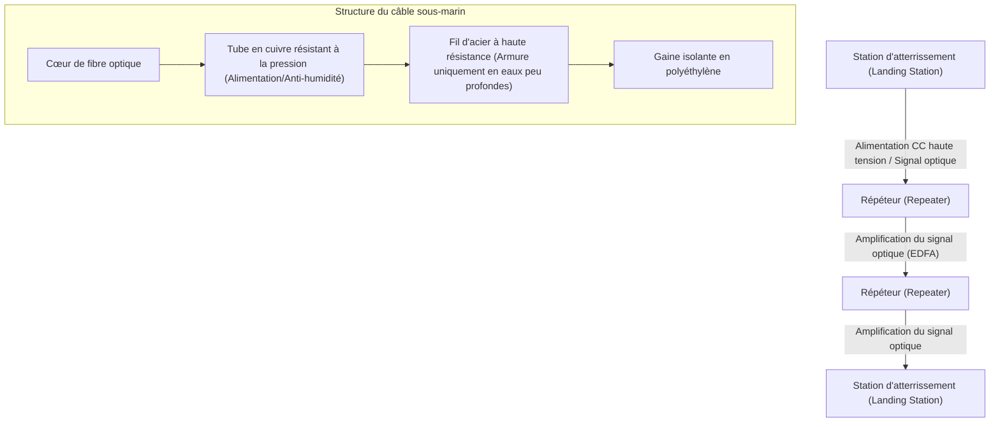

---

## 2. Les installations de traitement thermodynamique des données : Centres de données hyperscale

Les données qui atteignent la terre ferme par les câbles sous-marins sont finalement acheminées vers des « centres de données ». Un centre de données est un bâtiment gigantesque abritant de dizaines à des centaines de milliers de serveurs qui effectuent des calculs et du stockage sans interruption, 24 heures sur 24, 365 jours par an.

### 2.1 La réalité du Cloud et la bataille du « PUE »

D'un point de vue physique, l'essence d'un centre de données est « une machine thermique géante qui prend d'énormes quantités d'énergie électrique en entrée et produit une réduction d'entropie sous forme de traitement d'informations (résultats de calcul) avec la « chaleur » inévitable qui l'accompagne ». Les semi-conducteurs tels que les CPU et les GPU génèrent de la chaleur par résistance lors de l'activation et de la désactivation du courant. Si cette chaleur n'est pas évacuée efficacement vers l'extérieur, le semi-conducteur subira un emballement thermique instantané et brûlera physiquement.

Par conséquent, l'objectif principal de la conception et du fonctionnement d'un centre de données réside dans « le refroidissement » et « l'efficacité énergétique ». L'indicateur le plus courant de cette efficacité est le « PUE (Power Usage Effectiveness) ».

**PUE = Consommation électrique totale du centre de données / Consommation électrique des équipements informatiques (serveurs, etc.)**

La valeur théorique minimale du PUE est de 1.0 (un état où toute l'énergie est utilisée purement pour les calculs). Dans le passé, il n'était pas rare que les centres de données aient un PUE supérieur à 2.0 (c'est-à-dire qu'ils consommaient autant d'énergie pour l'équipement de refroidissement comme la climatisation que l'énergie utilisée par les serveurs). Cependant, dans les centres de données hyperscale modernes, une optimisation thermodynamique extrême est effectuée pour abaisser ce chiffre à des niveaux compris entre 1.1 et 1.2.

### 2.2 L'évolution de l'architecture de refroidissement

Basés sur les principes de la thermodynamique, les systèmes de refroidissement des centres de données ont évolué comme suit :

1. **Séparation des allées chaudes et des allées froides (Hot Aisle/Cold Aisle)** :
   Dans les premiers centres de données, la pièce entière était refroidie par des climatiseurs (CRAC : Computer Room Air Conditioning), mais l'air froid et l'air chaud évacués par les serveurs se mélangeaient, ce qui était extrêmement inefficace. Aujourd'hui, il est courant de placer les faces d'aspiration des racks de serveurs face à face, de même pour les faces d'échappement, en isolant physiquement les passages d'air froid (allées froides) des passages d'air chaud (allées chaudes) par un « confinement d'allée ».

2. **Refroidissement naturel (Free Cooling)** :
   Faire fonctionner les compresseurs des refroidisseurs (systèmes de circulation d'eau de refroidissement) nécessite énormément d'électricité. C'est pourquoi le « refroidissement naturel (Free Cooling) » s'est répandu, consistant à construire des centres de données dans des régions où l'air extérieur est suffisamment froid (Europe du Nord, Hokkaido, etc.) et à utiliser cet air froid directement ou indirectement via des échangeurs de chaleur pour le refroidissement.

3. **Refroidissement par immersion (Immersion Cooling) et refroidissement liquide direct (Direct-to-Chip)** :
   Récemment, la densité de génération de chaleur des GPU haut de gamme utilisés pour l'apprentissage et l'inférence de l'IA dépasse les limites physiques du refroidissement par air traditionnel (faible capacité thermique et conductivité thermique de l'air). Par conséquent, des technologies telles que le « refroidissement par immersion », où la carte mère entière du serveur est directement immergée dans un fluide inerte non conducteur à base de fluor ou d'huile minérale, et le « refroidissement liquide direct », où une tête de refroidissement liquide est fixée directement sur le dissipateur thermique du CPU/GPU pour évacuer la chaleur avec un liquide dont la capacité thermique est bien supérieure à celle de l'air, commencent à être introduites. Dans le refroidissement par immersion biphasique utilisant le changement de phase (chaleur de vaporisation due à l'ébullition du liquide), il est possible de gérer un flux thermique extrêmement élevé.

### 2.3 Redondance et sécurité physique

Parce que le centre de données est le cœur de l'infrastructure sociétale, une redondance (Redundancy) extrême est exigée. Au moment où l'alimentation commerciale est coupée, des alimentations sans interruption (UPS) utilisant des volants d'inertie, des batteries au plomb ou des batteries lithium-ion prennent le relais en quelques millisecondes. Simultanément, d'immenses générateurs diesel ou des turbines à gaz installés à l'extérieur du bâtiment démarrent et peuvent maintenir l'installation entière en fonctionnement pendant plusieurs jours en utilisant le carburant stocké.

La connexion réseau est également conçue pour tirer des lignes de plusieurs opérateurs de télécommunications différents et séparer complètement les itinéraires physiques (arrivée dans différentes directions, comme le nord, le sud, l'est et l'ouest du bâtiment) en vue d'accidents tels que des coupures de câbles dues à des travaux d'excavation.

---
## 3. La technologie qui compresse l'espace-temps : CDN (Réseau de diffusion de contenu)

Même si les câbles sous-marins relient les continents et que les centres de données stockent les informations, cela ne suffit pas à créer l'expérience web moderne. C'est ici que se dresse la limite de vitesse absolue de l'univers proposée par Albert Einstein : le « mur de la vitesse de la lumière ».

### 3.1 Le mur de la vitesse de la lumière et les limites physiques de la latence

La vitesse de la lumière dans le vide ($c$) est d'environ 300 000 km/s. Cependant, l'indice de réfraction du verre de quartz, qui constitue le cœur des fibres optiques, étant d'environ 1,47, la vitesse de la lumière dans la fibre tombe à environ 200 000 km/s (soit environ les deux tiers de celle dans le vide).

Par exemple, la distance physique en ligne droite entre Tokyo au Japon et l'État de Virginie sur la côte est des États-Unis (la plus grande concentration de centres de données au monde) est d'environ 11 000 km, ce qui donne environ 14 000 km en tenant compte du trajet des câbles sous-marins. Le temps physique pur nécessaire pour qu'un signal optique voyage dans un sens est d'environ 70 millisecondes. Étant donné que les communications Internet nécessitent l'aller-retour des paquets (RTT : Round Trip Time), un retard (latence) d'au moins 140 millisecondes se produit inévitablement en raison des lois de la physique. De plus, les retards de traitement au niveau des routeurs et des commutateurs en cours de route s'y ajoutent.

Lors de l'ouverture d'un site web moderne, le navigateur demande des centaines de fichiers, notamment du HTML, du CSS, du JavaScript, des images, et fait des allers-retours plusieurs fois pour le handshake à trois voies du TCP et la négociation de cryptage du TLS (SSL). Si tous les utilisateurs devaient accéder directement au « serveur d'origine » situé à l'autre bout de la planète, il faudrait des secondes voire plus de dix secondes pour afficher une page web, rendant les jeux en ligne en temps réel et le streaming vidéo haute définition complètement impossibles.

### 3.2 Décentralisation vers la périphérie (Edge) : L'architecture du CDN

Le système qui surmonte cette limite physique par l'ingénierie et compresse l'espace-temps est le « CDN (Content Delivery Network) ».

L'idée fondamentale du CDN est extrêmement simple. « S'il est trop long d'aller chercher des données sur un serveur d'origine éloigné de l'utilisateur, il suffit de placer à l'avance une copie (cache) des données à l'endroit physiquement le plus proche de l'utilisateur. »

Les fournisseurs de CDN placent physiquement des milliers, voire des dizaines de milliers de serveurs de cache, appelés « serveurs de périphérie (Edge Servers) », dans des centres de données et des installations de FAI (Fournisseurs d'Accès Internet) des principales villes du monde. Lorsqu'un utilisateur accède à un site web, le réseau du CDN détermine instantanément la position géographique et réseau de l'utilisateur, et achemine la communication vers le serveur de périphérie ayant la latence la plus faible (le plus proche).

La technologie de base permettant ce routage est l'« Anycast » et le « routage basé sur DNS » avancé. Dans le routage Anycast, exactement la même adresse IP est attribuée à plusieurs serveurs de périphérie dans le monde entier. En utilisant l'algorithme de sélection de chemin du BGP (Border Gateway Protocol), qui constitue l'épine dorsale d'Internet, les routeurs fonctionnent pour envoyer automatiquement les paquets au serveur le plus « court » du point de vue du réseau. Ainsi, les utilisateurs de Tokyo sont dirigés vers les serveurs de périphérie de Tokyo, et les utilisateurs de Londres vers ceux de Londres, sans même en avoir conscience.

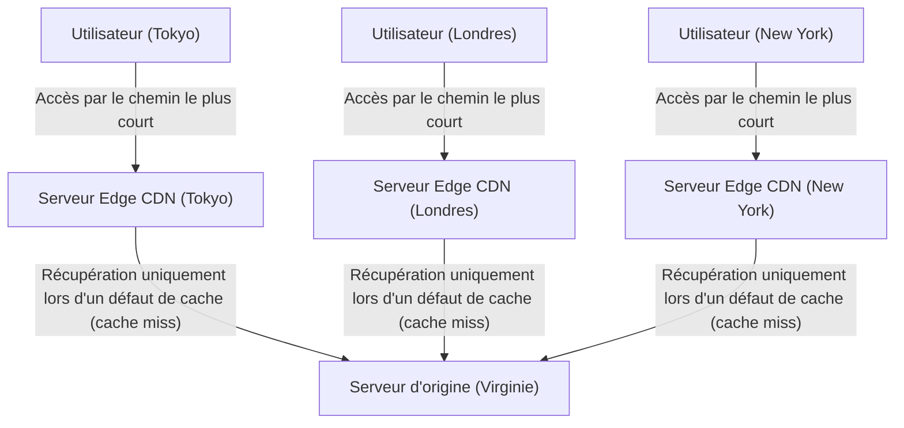

### 3.3 Optimisation dynamique et avènement du Edge Computing

Les premiers CDN étaient des mécanismes simples qui ne faisaient que mettre en cache et diffuser des images, des vidéos et des fichiers HTML statiques. Cependant, le CDN moderne a évolué pour devenir une immense plateforme de traitement distribué à part entière.

Premièrement, l'optimisation de la diffusion de contenu dynamique (comme les résultats de recherche uniques pour chaque utilisateur ou le contenu d'un panier d'achat). Bien qu'ils ne puissent pas être mis en cache, les CDN optimisent de manière indépendante le chemin de communication entre le serveur de périphérie et le serveur d'origine (en construisant un cache à plusieurs niveaux (Tiered Cache) ou un réseau de routage à haut débit dédié), offrant une voie de communication stable et à haut débit avec moins de perte de paquets que le chemin Internet standard (chemin best-effort du BGP). De plus, en terminant (Terminate) les connexions TCP et les sessions TLS du côté du serveur de périphérie, ils réduisent considérablement le nombre d'allers-retours de handshake avec des sites distants.

Deuxièmement, l'émergence de l'« Edge Computing ». Traditionnellement, le traitement des applications complexes (authentification, tests A/B, redimensionnement dynamique d'images, exécution de logique personnalisée, etc.) était effectué par le processeur du serveur d'origine. Mais aujourd'hui, grâce à des technologies telles que Cloudflare Workers ou AWS Lambda@Edge, les développeurs peuvent utiliser des environnements de bac à sable (sandbox) isolés comme le moteur V8 pour exécuter du code (JavaScript, Rust, WebAssembly, etc.) directement sur les serveurs de périphérie au plus près de l'utilisateur, en l'espace de millisecondes. En conséquence, la « frontière d'Internet (Edge) » commence littéralement à fonctionner comme un immense ordinateur distribué.

---

## 4. Conclusion : La lutte sans fin contre les limites physiques

L'histoire de l'infrastructure d'Internet est l'histoire de la lutte contre les lois physiques absolues qui régissent l'univers, telles que la vitesse de la lumière, la deuxième loi de la thermodynamique et la loi de conservation de l'énergie.

Les ingénieurs des câbles sous-marins ont défié la pression massive de l'eau dans les profondeurs et les limites optiques du verre, les concepteurs de centres de données ont poursuivi les limites thermodynamiques pour refroidir les tranches de silicium (wafers) qui génèrent de la chaleur, et les architectes de CDN continuent de construire des systèmes de traitement distribués avancés pour contourner le mur de la vitesse de la lumière.

Derrière notre capacité à appuyer sur notre smartphone et à accéder instantanément aux informations du monde entier, se cache cette infrastructure physique massive, rude et extrêmement sophistiquée. Dans le chapitre 7, nous approfondirons le monde du « Routage et BGP » pour voir comment les logiciels et les protocoles maintiennent ce réseau décentralisé et autonome à l'échelle mondiale par-dessus cette solide infrastructure physique.

# Chapitre 7 : La lutte pour la cybersécurité et la vie privée

L'histoire d'Internet est à la fois celle de l'idéal du partage libre de l'information et celle d'une lutte constante pour protéger les systèmes et les données contre les attaques malveillantes. À l'origine, Internet, né sous le nom d'ARPANET, a été conçu en partant du principe qu'il s'agirait d'une communication entre un nombre limité de chercheurs de confiance. Par conséquent, la « sécurité » a été reléguée au second plan dans la conception fondamentale des protocoles, avec une architecture basée sur l'idée de la bonne foi inhérente à l'homme (nature intrinsèquement bonne). Cependant, à mesure que le réseau s'est développé à l'échelle mondiale, s'est commercialisé et s'est établi en tant qu'infrastructure, cette philosophie de conception initiale est devenue une faille fatale.

Dans ce chapitre, nous allons examiner en détail, jusqu'aux profondeurs de la technologie, les mécanismes physiques et réseaux des attaques DDoS, l'une des plus grandes menaces pesant sur l'Internet moderne, le cryptage et les technologies VPN (Réseau Privé Virtuel) pour garantir la confidentialité des communications, ainsi que l'« architecture Zero Trust », un concept de sécurité de nouvelle génération né des limites de la défense périmétrique.

## 1. Les limites physiques du réseau et la dynamique des attaques DDoS

Parmi les cyberattaques, l'une des plus primitives et pourtant des plus difficiles à prévenir est l'**attaque DDoS (Distributed Denial of Service : Déni de service distribué)**. Il s'agit d'une attaque dans laquelle une quantité massive de trafic dépassant les capacités de traitement ou la bande passante de la ligne est envoyée aux serveurs et équipements réseau ciblés, rendant impossible la fourniture du service aux utilisateurs légitimes.

### Saturation physique du trafic : la limite de la bande passante
Internet transmet des données via des supports physiques tels que les fibres optiques, les fils de cuivre et les ondes radio. Bien que ces chemins de transmission atteignent des capacités de communication de l'ordre du térabit grâce à des technologies telles que le multiplexage en longueur d'onde (WDM) de la lumière, il existe une limite physique stricte à la bande passante des lignes (par exemple, 1 Gbps ou 10 Gbps) auxquelles les serveurs individuels sont connectés. L'attaque DDoS exploite cette limite de la « taille du tuyau ». Lorsque l'attaquant contrôle des centaines de milliers d'appareils infectés par des logiciels malveillants (botnet) répartis dans le monde entier et envoie des paquets simultanément vers la cible, la mémoire tampon des interfaces des routeurs et des commutateurs déborde et une perte de paquets (packet drop) se produit. Ce phénomène s'apparente au blocage d'un tuyau en dynamique des fluides : au moment où la quantité d'informations (nombre de paquets) dépasse la capacité de traitement, cela provoque une défaillance de l'ensemble du système.

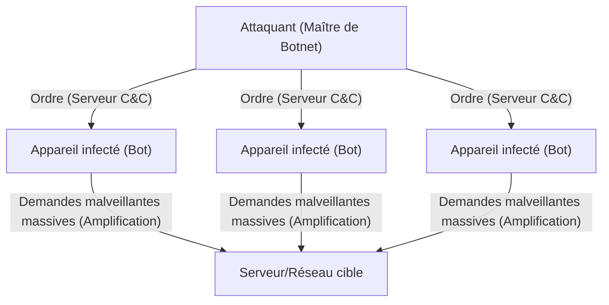

### Exploitation de la vulnérabilité TCP/IP : L'attaque SYN Flood
Outre le remplissage de la bande passante, il existe également des méthodes d'attaque qui épuisent les ressources du serveur (CPU et mémoire). Le représentant de cela est l'**attaque SYN Flood**. Dans le protocole TCP, lors de l'établissement d'une communication, on suit une procédure appelée « handshake à 3 voies » (three-way handshake).
1. Le client envoie un paquet « SYN »
2. Le serveur répond par un paquet « SYN-ACK » et alloue de la mémoire (TCB : Transmission Control Block) pour la connexion
3. Le client envoie un paquet « ACK » pour établir la connexion

L'attaquant envoie massivement des paquets SYN au serveur en usurpant (spoofing) l'adresse IP source. Le serveur renvoie un SYN-ACK, mais le propriétaire de l'adresse IP usurpée ne renvoie pas de ACK (ou bien n'existe pas). Par conséquent, le serveur se retrouve avec un grand nombre de connexions à l'état « semi-ouvert » (Half-open), la zone mémoire de gestion des connexions s'épuise et il est contraint de rejeter toute nouvelle demande de connexion émanant d'utilisateurs légitimes. Il s'agit d'un excellent mécanisme d'attaque qui utilise à l'envers la propriété de maintien d'état (stateful) du TCP qui « garantit une communication fiable ».

### Attaque par réflexion (amplification) : l'abus d'asymétrie
L'**attaque par réflexion (attaque d'amplification)** utilisant UDP (User Datagram Protocol) est encore plus astucieuse. UDP est un protocole sans connexion qui ne vérifie pas l'expéditeur. L'attaquant usurpe l'adresse IP de la cible comme source et envoie des requêtes aux serveurs DNS ou NTP publics sur Internet. À ce moment-là, il utilise des requêtes spécifiques (comme la requête DNS ANY ou NTP monlist) qui renvoient une réponse des centaines ou des milliers de fois plus grande (plusieurs kilo-octets) que la petite requête (quelques dizaines d'octets).
Ces paquets de réponse géants amplifiés affluent simultanément vers l'adresse source usurpée, c'est-à-dire le serveur ciblé. L'attaquant peut générer un trafic de l'ordre du térabit vers la cible en ne consommant qu'une infime fraction de bande passante. Cela réalise sur le réseau une asymétrie similaire au principe du levier en physique ou à l'amplification par résonance en ingénierie acoustique.

## 2. La confidentialité du chemin de communication : le mécanisme de cryptage et de VPN

Les paquets circulant sur le réseau public qu'est Internet sont transportés par de nombreux routeurs et équipements de FAI en cours de route. Les communications en texte clair (cleartext) non chiffrées peuvent être facilement interceptées (sniffing) ou modifiées en cours de route. Le bouclier puissant pour protéger la vie privée et la confidentialité des données est la « technologie de cryptographie » et le « VPN (Virtual Private Network) ».

### Les fondements mathématiques de la cryptographie moderne : hybridation de clés publiques et symétriques
Deux principales méthodes de chiffrement sont utilisées pour protéger les communications.
- **Le chiffrement à clé symétrique (AES, etc.)** : Utilise la même clé pour chiffrer et déchiffrer les données. La vitesse de traitement est très rapide, mais le défi est de savoir comment transmettre la clé à l'autre partie en toute sécurité (problème de distribution de clés).
- **Le chiffrement à clé publique (RSA, chiffrement à courbe elliptique, etc.)** : Utilise une paire composée d'une « clé publique » pour le chiffrement et d'une « clé privée » pour le déchiffrement. Il repose sur des propriétés mathématiques avancées (asymétrie) telles que la difficulté de la factorisation en nombres premiers et le problème du logarithme discret. Le coût de calcul est élevé.

Pour les communications sécurisées sur Internet (TLS/SSL et VPN), on adopte une méthode hybride qui combine les deux. D'abord, lors du handshake au début de la communication, le cryptage à clé publique est utilisé pour échanger en toute sécurité une « clé de session (clé symétrique) », puis la communication de données à grand volume qui suit est chiffrée à l'aide de la clé de session à grande vitesse. Cela permet de concilier une distribution sécurisée des clés et des communications chiffrées rapides.

### Le principe du VPN et du Tunneling
Le **VPN (Réseau Privé Virtuel)** est une technologie qui utilise le chiffrement pour construire une « ligne dédiée (tunnel) » virtuelle sur l'Internet public. Les protocoles typiques incluent IPsec, OpenVPN, et plus récemment WireGuard.

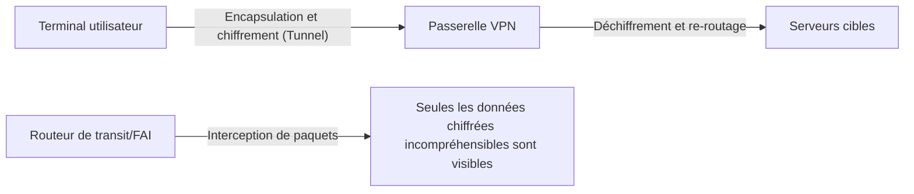

Le mécanisme central du tunneling réside dans l'« Encapsulation ». Le paquet IP d'origine (la charge utile ou payload) que l'utilisateur tente d'envoyer est entièrement chiffré, puis enveloppé (encapsulé) en tant que partie de données d'un nouveau paquet IP, et on y ajoute à l'extérieur un nouvel en-tête IP adressé au serveur VPN.
Les routeurs d'Internet sur le chemin ne regardent que l'en-tête IP extérieur et transfèrent le paquet au serveur VPN. Le contenu étant fortement chiffré, même si le paquet est intercepté, il est difficile d'analyser non seulement le contenu de la communication, mais aussi l'adresse IP de destination d'origine. Le paquet atteignant le serveur VPN est déchiffré, l'en-tête d'origine est extrait et il est envoyé à la destination finale. De cette manière, un espace privé logiquement et mathématiquement protégé est créé sur une infrastructure qui est physiquement accessible à tous.

## 3. L'effondrement de la défense périmétrique et l'essor de l'architecture Zero Trust

Pendant de nombreuses années, la sécurité des réseaux des entreprises et des organisations a reposé sur le concept de « défense périmétrique (Perimeter Model) ». Il s'agit d'une stratégie de défense de type château-fort qui consiste à placer des pare-feux et des IPS (systèmes de prévention des intrusions) à la frontière entre Internet (l'extérieur) et le réseau de l'entreprise (l'intérieur), considérant que « l'extérieur est dangereux, l'intérieur est sûr ».

### La perte des frontières provoquée par le Cloud et le télétravail
Cependant, aujourd'hui, ce modèle est complètement brisé. Avec la popularisation du SaaS (Software as a Service), les données importantes sont placées sur le Cloud en dehors de l'entreprise, et avec la généralisation du télétravail, les employés accèdent depuis le Wi-Fi de leur domicile ou d'un café. La ligne de démarcation entre « l'intérieur à protéger » et « l'extérieur dangereux » s'est dissoute, et le trafic qu'il est impossible de contrôler avec un pare-feu traditionnel a augmenté de manière explosive. De plus, la défense périmétrique est impuissante face aux logiciels malveillants (tels que les ransomwares) ou aux menaces internes malveillantes qui ont déjà pénétré le réseau interne. La prémisse selon laquelle « l'intérieur est digne de confiance » est devenue la plus grande vulnérabilité.

### Zero Trust : Ne faire confiance à rien, tout vérifier (Trust Nothing, Verify Everything)
L'**« Architecture Zero Trust (ZTA) »** a été proposée pour faire face à ce changement de paradigme. Le principe fondamental du Zero Trust est de « ne faire confiance par défaut à aucune communication, quel que soit l'emplacement du réseau (dans l'entreprise ou en dehors) (Never Trust, Always Verify) ».

Dans le modèle Zero Trust, l'objectif de la sécurité passe de la « frontière du réseau » à l'« identité (utilisateurs et appareils) » et aux « ressources (données et applications) ».

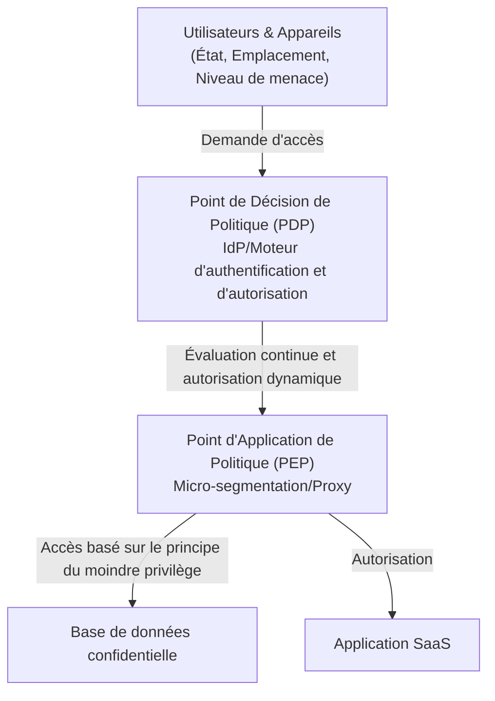

Les composants technologiques clés pour mettre en œuvre le Zero Trust sont les suivants :

1. **Gestion des Identités et des Accès (IAM/IdP)** : Confirme fermement l'identité de l'utilisateur en combinant non seulement des mots de passe, mais aussi le MFA (authentification multifacteur) ou l'authentification biométrique.
2. **Évaluation de l'état (posture) des appareils** : Évalue en temps réel l'état de l'appareil demandant l'accès, comme l'état des correctifs du système d'exploitation, l'état de fonctionnement du logiciel antivirus et le comportement passé. L'accès depuis des terminaux non sécurisés est immédiatement bloqué.
3. **Micro-segmentation** : Divise le réseau de manière très fine et établit des frontières extrêmement petites pour chaque ressource. Même en cas d'intrusion, il s'agit d'une structure qui empêche l'expansion horizontale des dommages (mouvement latéral).
4. **Authentification continue et politique dynamique** : Le fait de réussir à se connecter une fois ne signifie pas que l'on continue à faire confiance. Le comportement est surveillé en permanence même pendant la session (changement de l'IP source, volume anormal de téléchargement de données, etc.), avec un contrôle dynamique qui déconnecte la session au moment où le score de risque dépasse un seuil.

Le Zero Trust n'est pas simplement un produit, mais une philosophie de conception qui consiste à « vérifier chaque accès à chaque fois et à n'accorder que les privilèges minimaux nécessaires (Least Privilege) », et il est devenu la seule solution réaliste pour protéger les données dans l'infrastructure informatique distribuée moderne.
## 4. L'avenir de la sécurité : la cryptographie quantique et la défense des réseaux de nouvelle génération

Les chiffrements RSA et à courbe elliptique, sur lesquels nous nous appuyons actuellement, reposent sur l'hypothèse qu'il « faudrait un temps astronomique pour les déchiffrer avec la puissance de calcul des ordinateurs actuels ». Cependant, si les « ordinateurs quantiques », qui appliquent les principes de la mécanique quantique, deviennent utilisables, ces problèmes mathématiques pourraient être résolus instantanément par des algorithmes tels que celui de Shor. C'est ce que l'on appelle le **« Q-Day (le jour du déchiffrement par les ordinateurs quantiques) »**.

Pour contrer cela, deux approches sont actuellement à l'étude.
L'une est la standardisation de nouveaux algorithmes cryptographiques mathématiquement difficiles à déchiffrer même pour un ordinateur quantique, appelés **« Cryptographie post-quantique (PQC : Post-Quantum Cryptography) »** (comme la cryptographie fondée sur les réseaux euclidiens).
L'autre est la **« Distribution quantique de clés (QKD : Quantum Key Distribution) »**, qui fonde sa sécurité sur les lois de la physique (mécanique quantique) elle-même. Il s'agit d'une technologie qui distribue des clés en plaçant des informations sur l'état quantique des photons (comme la polarisation). Dès qu'un espion tente d'observer (copier) un photon, l'état quantique change (problème de la mesure, principe d'incertitude), ce qui permet de détecter physiquement toute écoute clandestine à 100 %. C'est la communication sécurisée ultime.

## Conclusion

Le septième chapitre d'Internet est un jeu de bascule constant entre « commodité » et « sécurité ». De la saturation de la couche physique due aux attaques DDoS à la défense mathématique par des techniques cryptographiques, en passant par le changement de paradigme architectural vers le Zero Trust, la cybersécurité a dépassé le cadre des simples technologies de l'information pour devenir une discipline extrêmement sophistiquée où se croisent la physique, les mathématiques et la psychologie comportementale.
Derrière nos actions quotidiennes, comme ouvrir un navigateur ou manipuler des données dans le cloud, se déroule 24 heures sur 24, 365 jours par an, une guerre électronique féroce à l'échelle de la milliseconde entre des attaquants invisibles et des systèmes de défense.

Dans le 8ème et dernier chapitre, nous explorerons l'avenir d'Internet, c'est-à-dire les paradigmes de réseau de nouvelle génération tels que le Web 3.0, le métavers et l'Internet interplanétaire (Interplanetary Internet).

# Chapitre 8 : L'Internet du futur —— Un réseau de nouvelle génération tissé par la décentralisation, l'espace et la mécanique quantique

Au cours des dernières décennies, Internet a continué d'évoluer en tant qu'infrastructure d'information la plus influente de l'histoire de l'humanité. Depuis l'établissement de la technologie de commutation de paquets dans ARPANET dans les années 1960, jusqu'à la normalisation de la suite de protocoles TCP/IP, l'invention du WWW (World Wide Web) et la popularisation du haut débit mobile, son avancée ne connaît pas de limites. Cependant, l'Internet que nous utilisons actuellement fait face à des limites architecturales fondamentales et à des contraintes physiques. Celles-ci incluent les effets néfastes de la centralisation accompagnant la croissance exponentielle des centres de données, la latence physique des fibres optiques dans les communications intercontinentales, et la vulnérabilité des technologies cryptographiques existantes en raison de l'amélioration spectaculaire de la puissance de calcul (en particulier l'essor des ordinateurs quantiques).

Dans ce chapitre, intitulé « Chapitre 8 : L'Internet du futur », nous explorerons la ligne de front de ce changement de paradigme en cours. Plus précisément, nous détaillerons à l'extrême, d'un point de vue professionnel, les contextes historiques, la physique et les mécanismes techniques de trois piliers : le « Web3 et les architectures décentralisées » qui visent à s'affranchir de la centralisation, les « réseaux de communication par satellites en orbite basse (comme Starlink) » qui étendent les contraintes des infrastructures physiques vers l'espace, et « l'Internet quantique » qui applique les lois ultimes de la physique aux communications.

---

## 8.1 La véritable valeur du Web3 et de l'architecture décentralisée : construire un réseau sans confiance (Trustless)

L'Internet actuel (Web 2.0) repose sur la gestion centralisée des données par d'énormes plateformes. Bien que le modèle client-serveur soit efficace, il souffre de problèmes structurels tels que l'existence de points de défaillance uniques (SPOF : Single Point of Failure), la facilité de censure et la violation de la vie privée des utilisateurs. La réponse à cela, au niveau architectural, est le « Web3 » et les technologies de réseau décentralisé.

### 8.1.1 Réseau orienté contenu et IPFS
Le Web traditionnel (HTTP) est « orienté localisation ». En d'autres termes, on accède à l'information en spécifiant « où elle se trouve (URL) ». Cependant, avec ce mécanisme, si le serveur tombe en panne ou si le domaine expire, le contenu lui-même disparaît, provoquant des « liens brisés (404 Not Found) ».

En revanche, les systèmes de stockage décentralisés représentés par IPFS (InterPlanetary File System) adoptent une architecture « orientée contenu (Content-Addressed) ». Les données sont accessibles à l'aide d'un « identifiant de contenu (CID) » unique obtenu en faisant passer le contenu du fichier par une fonction de hachage cryptographique (telle que SHA-256).

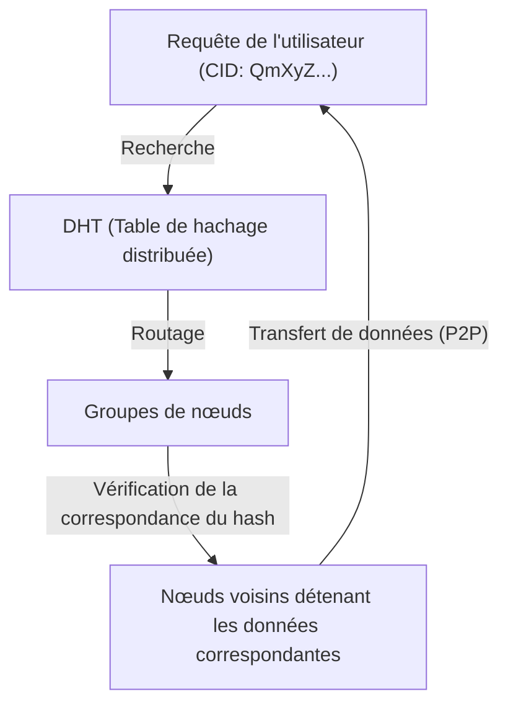

Le cœur de ce mécanisme réside dans l'algorithme Kademlia, qui est un type de DHT (Distributed Hash Table). Kademlia définit la « distance » entre un ID de nœud et un ID de donnée à l'aide de l'opération XOR (ou exclusif). Cela permet de cartographier efficacement la topologie de l'ensemble du réseau et de découvrir les nœuds détenant les données souhaitées avec une complexité de calcul de $O(\log N)$. Puisque les données sont distribuées et dupliquées sur des nœuds à travers le monde, même si certains nœuds se déconnectent, l'accès aux données est maintenu, ce qui offre une forte résistance à la censure.

### 8.1.2 Consensus décentralisé et preuves cryptographiques
Une autre fondation du Web3 est la technologie blockchain. Celle-ci repose sur un « algorithme de consensus » dans lequel un réseau décentralisé s'accorde sur « qui enregistre l'état correct » sans passer par un administrateur central.
Le PoW (Proof of Work), initialement adopté pour Bitcoin, utilisait la résistance aux collisions des fonctions de hachage et impliquait de dépenser une énorme énergie de calcul pour rendre la falsification physiquement difficile. Cependant, du point de vue de la consommation d'énergie, une transition vers le PoS (Proof of Stake) est actuellement en cours.

Dans le PoS, adopté par des réseaux comme Ethereum 2.0, les validateurs qui ont mis en jeu (staké) des crypto-actifs agrègent les signatures à l'aide d'une technologie cryptographique spéciale basée sur les couplages, appelée signature BLS (Boneh-Lynn-Shacham). Cela permet de compresser les signatures numériques de dizaines, voire de centaines de milliers de nœuds, en une taille de données infime, alliant ainsi une sécurité élevée et une certaine évolutivité au sein d'un réseau décentralisé. Dans l'Internet du futur, on s'attend à ce que ces technologies soient mises en œuvre de manière standard au-dessus de TCP/IP, en tant que nouvelle couche (couche de transfert de valeur et de consensus) du modèle de référence OSI.

---

## 8.2 Le réseau de communication par satellite englobant la Terre : Starlink et au-delà

Le réseau de fibres optiques posé au sol constitue la colonne vertébrale de l'Internet moderne. Cependant, il existe des contraintes physiques telles que le coût de pose des câbles sous-marins, les contraintes topographiques, et surtout, « la vitesse de la lumière dans un milieu ». Les constellations de satellites en orbite basse (LEO : Low Earth Orbit), représentées par Starlink de SpaceX, tentent de résoudre ces problèmes dans la frontière de l'espace.

### 8.2.1 Mécanique orbitale et supériorité de l'orbite basse (LEO)
Les satellites en orbite géostationnaire (GEO : Geostationary Earth Orbit) sont situés à une altitude d'environ 35 786 km et sont synchronisés avec la rotation de la Terre, ce qui a l'avantage de permettre de fixer la direction de l'antenne. Cependant, comme les ondes radio parcourent plus de 70 000 km pour un simple aller-retour, un retard dû aux contraintes de la physique (environ 120 millisecondes juste pour l'aller, avec une latence effective de 500 millisecondes ou plus) est inévitable.

D'autre part, les satellites Starlink sont placés en orbite basse à une altitude d'environ 550 km. Selon la mécanique orbitale basée sur la troisième loi de Kepler, à cette altitude, le satellite doit orbiter autour de la Terre à une vitesse fulgurante d'environ 7,6 km/s (environ 27 000 km/h) pour équilibrer la gravité terrestre et la force centrifuge (faisant le tour de la Terre en environ 90 minutes).
Grâce à cette faible altitude, le temps de propagation physique des ondes radio est considérablement réduit à environ 1/65ème de celui du GEO, et la latence de communication théorique devient égale ou inférieure à celle de la fibre optique terrestre (20 à 40 millisecondes).

### 8.2.2 Antennes à commande de phase (Phased Array) et contrôle du front d'onde radio
Étant donné que les satellites se déplacent à grande vitesse, les terminaux utilisateurs au sol (des antennes plates sans pièces mobiles physiques comme les antennes paraboliques) doivent suivre électriquement les satellites passant au-dessus d'eux. C'est là qu'interviennent les « antennes à commande de phase (Phased Array Antenna) ».
Des milliers de minuscules éléments d'antenne sont alignés sur une surface plane, et la « phase (le moment de l'onde) » des ondes radio rayonnées par chaque élément est intentionnellement décalée de l'ordre de la microseconde. Selon le principe de Huygens, les ondes sphériques de chaque élément interfèrent les unes avec les autres, formant un faisceau dans lequel les ondes se renforcent mutuellement (interférence constructive) dans une direction spécifique uniquement. Cela permet de diriger instantanément le faisceau de communication vers le satellite cible, uniquement grâce au contrôle logiciel, sans avoir à déplacer physiquement l'antenne.

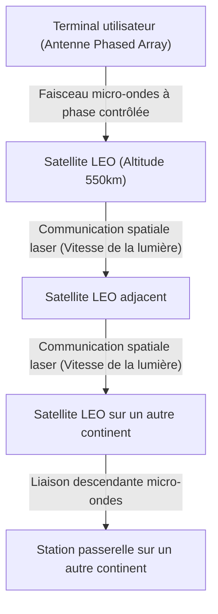

### 8.2.3 Communication spatiale optique (OISL) et l'avantage absolu de « la vitesse de la lumière dans le vide »
La véritable révolution du réseau Starlink réside dans les liaisons inter-satellites laser (OISL : Optical Intersatellite Links).
Les communications à longue distance modernes reposent sur la fibre optique, mais l'indice de réfraction du cœur (verre de silice) de la fibre optique est d'environ 1,47. En physique, la vitesse de la lumière dans un milieu est exprimée par $v = c / n$ ($c$ étant la vitesse de la lumière dans le vide, et $n$ l'indice de réfraction). Ainsi, la vitesse de la lumière dans la fibre optique chute à environ 200 000 km/s.

En revanche, l'indice de réfraction de l'espace (le vide) étant extrêmement proche de 1, la communication laser entre satellites s'effectue à la vitesse de la lumière dans le vide, soit $c \approx 300 000$ km/s.
Par exemple, si l'on considère le transfert de données de Londres à New York, plutôt que de passer par les câbles sous-marins de l'Atlantique, il est possible de réduire le retard absolu théorique (latence) en envoyant d'abord les données dans l'espace, en les transférant via un faisceau laser à travers le vide spatial, puis en les redescendant sur Terre. Cela apporte un changement de paradigme décisif pour le trading haute fréquence (HFT) dans la finance et les systèmes mondiaux en temps réel. À l'avenir, des dizaines de milliers de satellites entoureront la Terre, complétant un réseau maillé où fonctionnera un protocole de routage spatial tridimensionnel et dynamique en remplacement du BGP (Border Gateway Protocol).

---

## 8.3 L'Internet quantique : La communication ultime apportée par l'intrication

Si le Web3 reconstruit l'architecture de la « confiance » et que les réseaux de communication par satellite surmontent les contraintes « d'espace et de vitesse », « l'Internet quantique » représente l'apogée de la physique dans les « moyens de transmission et de sécurité » de l'information. L'Internet quantique ne vise pas à remplacer le réseau TCP/IP existant, mais à le compléter, en tant qu'infrastructure de nouvelle génération offrant un canal de transmission d'informations basé sur des lois physiques entièrement nouvelles.

### 8.3.1 Fondements de la mécanique quantique : Superposition et Intrication
Les ordinateurs et l'Internet classiques traitent les informations sous forme de bits, « 0 » ou « 1 », basés sur des niveaux de tension élevés ou bas. Cependant, dans l'Internet quantique, les informations sont transmises sous forme de bits quantiques (Qubits). En utilisant l'état de polarisation (oscillations longitudinales, transversales, etc.) des photons, on exploite le « principe de superposition (Superposition) » où « 0 » et « 1 » existent simultanément.

Plus important encore est « l'intrication quantique (Quantum Entanglement) ». Lorsque deux particules sont dans un état intriqué, peu importe la distance physique qui les sépare (même si c'est la distance entre la Terre et Mars), au moment même où l'état d'une particule est mesuré et déterminé, l'état de l'autre particule est également déterminé instantanément, sans aucun décalage temporel. Ce phénomène physique non local, qu'Einstein appelait une « action fantôme à distance », constitue l'épine dorsale de l'Internet quantique.

### 8.3.2 Distribution quantique de clés (QKD) et sécurité physique absolue
Actuellement, les chiffrements RSA et à courbe elliptique, qui protègent les communications sur Internet, reposent sur la difficulté mathématique qui veut que « la factorisation de nombres entiers gigantesques prend énormément de temps de calcul ». Cependant, si des ordinateurs quantiques à grande échelle capables d'implémenter l'algorithme de Shor voient le jour, ces cryptages seront brisés en peu de temps.

C'est là qu'intervient la distribution quantique de clés (QKD : Quantum Key Distribution). Le protocole BB84, par exemple, utilise des photons uniques pour transmettre une clé de chiffrement. Selon le principe fondamental de la mécanique quantique qu'est le « principe d'incertitude d'Heisenberg », si un tiers (un espion) tente de mesurer (écouter) un photon en vol, l'état quantique change instantanément (décohérence) à ce moment-là. De plus, selon le « théorème de non-clonage (No-Cloning Theorem) », il est physiquement impossible de copier exactement un état quantique inconnu.
En d'autres termes, s'il y a un acte d'écoute clandestine sur le chemin de communication, le récepteur pourra toujours le détecter avec certitude au niveau des lois de la physique grâce à une augmentation anormale du taux d'erreur. En partageant des nombres aléatoires sécurisés garantis sans écoute clandestine et en les combinant avec un chiffrement à masque jetable (One-Time Pad), on obtient une sécurité ultime, absolument indéchiffrable par n'importe quel ordinateur, quelle que soit sa puissance de calcul (même un supercalculateur à l'échelle de l'univers).

### 8.3.3 Téléportation quantique et le mur des répéteurs quantiques
Le but ultime de l'Internet quantique est la mise en réseau de la « téléportation quantique », qui utilise l'intrication pour transférer l'état quantique lui-même vers un autre endroit. Cela permettra de créer un « cloud quantique » reliant des ordinateurs quantiques distribués, fonctionnant comme un calculateur quantique géant et unique.

Cependant, les obstacles techniques restent extrêmement élevés. Les photons sont perdus en cours de route (atténuation) lorsqu'ils se déplacent dans une fibre optique en raison de l'absorption ou de la diffusion. Dans la communication classique, on place des « amplificateurs » en cours de route pour renforcer le signal, mais dans la communication quantique, en raison du « théorème de non-clonage » mentionné précédemment, on ne peut pas copier et amplifier des photons.

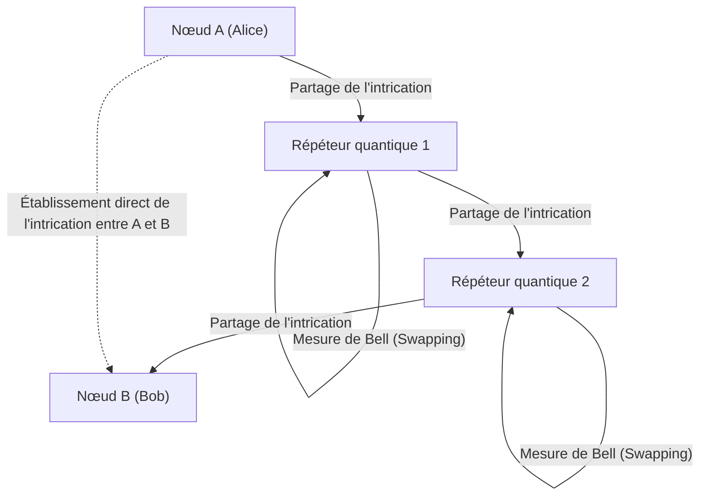

Pour surmonter cette limite, on étudie le « répéteur quantique (Quantum Repeater) ». Un répéteur quantique génère une intrication uniquement sur de courts segments et établit une intrication sur de longues distances en effectuant continuellement une opération quantique complexe appelée « échange d'intrication (entanglement swapping) ». Pour y parvenir, il est indispensable de disposer de « mémoires quantiques » capables de stocker temporairement des états quantiques dans un environnement cryogénique. Actuellement, les laboratoires du monde entier rivalisent pour réaliser des percées physiques utilisant des centres NV (centres azote-lacune) dans les diamants ou des gaz d'atomes froids.

---

## 8.4 Conclusion : L'humanité et l'avenir des réseaux

Né dans les années 1960, Internet est devenu un réseau neuronal reliant toutes les informations de la planète. Aujourd'hui, le chapitre 8, « L'Internet du futur », auquel nous sommes confrontés, ne se limite pas à la couche logicielle, mais constitue une expansion vers une dimension plus fondamentale et physique.

L'architecture décentralisée du Web3 construit une nouvelle base de confiance (couche de confiance) qui ne dépend plus de la « confiance » en une autorité centrale spécifique, mais garantit les transactions sociétales grâce aux mathématiques et à la cryptographie.
Les réseaux de communication par satellite tels que Starlink s'échappent du puits de gravité terrestre et défient la vitesse limite absolue de la physique, à savoir la vitesse de la lumière dans le vide, traçant une dorsale tridimensionnelle qui annule la barrière de la distance.
Et l'Internet quantique élève au rang d'ingénierie l'intrication, ce profond mystère de la mécanique quantique, dans le but de bouleverser radicalement les concepts mêmes de transmission d'informations et de sécurité.

Bien que ces technologies semblent se développer indépendamment, elles sont appelées à converger à long terme. En plaçant des photons uniques (quanta) dans les faisceaux laser traversant l'espace, un réseau mondial de communication cryptographique quantique tirant parti du faible taux d'atténuation de l'espace sera mis en place, et sur celui-ci fonctionneront les protocoles décentralisés du Web3. Une infrastructure réseau digne de la science-fiction est précisément en train d'être conçue par l'humanité actuelle.

L'Internet de demain ne sera plus un simple « tuyau pour transférer des informations ». Il évoluera vers l'ultime « infrastructure intellectuelle », synchronisant les activités économiques de l'humanité, la formation du consensus social et les ressources de calcul à une échelle cosmique. Derrière l'Internet que nous utilisons négligemment chaque jour, se tisse à cet instant même un récit grandiose repoussant les limites de la physique et de l'informatique.
