# अध्याय 1 इंटरनेट की शुरुआत और दर्शन —— ARPANET से WWW तक प्रौद्योगिकी की वंशावली

इंटरनेट——यह विशाल स्वायत्त विकेंद्रीकृत नेटवर्क, जो आज मानव की सभी आर्थिक गतिविधियों, संस्कृति और संचार की नींव है, कभी भी एक ही प्रतिभा द्वारा रातों-रात डिजाइन नहीं किया गया था। इसकी उत्पत्ति शीत युद्ध की विशिष्ट ऐतिहासिक और भू-राजनीतिक पृष्ठभूमि से हुई है, और दूरसंचार इंजीनियरिंग और कंप्यूटर विज्ञान में प्रतिमान बदलाव के माध्यम से, यह अनगिनत शोधकर्ताओं द्वारा साझा किए गए उच्च दर्शन का परिणाम है: "जानकारी को मजबूती से, स्वतंत्र रूप से और किसी भी भौतिक बाधाओं को पार करते हुए कैसे प्रसारित किया जाए।"

इस अध्याय में, हम केवल इतिहास की एक सूची के रूप में नहीं, बल्कि भौतिक परत से लेकर एप्लिकेशन परत तक तकनीकी तंत्र और इसके डिजाइन दर्शन (आर्किटेक्चर) के पेशेवर दृष्टिकोण से, इस चमत्कारी प्रणाली, इंटरनेट, का जन्म कैसे हुआ, इसका गहराई से विश्लेषण करेंगे।

## 1.1 नेटवर्क प्रतिमान में बदलाव: सर्किट स्विचिंग की सीमाएं और पैकेट स्विचिंग का जन्म

इंटरनेट के ऐतिहासिक और तकनीकी सार को समझने के लिए, "पैकेट स्विचिंग (Packet Switching)" की अवधारणा का आविष्कार सभी चीजों का प्रारंभिक बिंदु है। 1960 के दशक की शुरुआत में, उस समय के संचार बुनियादी ढांचे का केंद्र टेलीफोन नेटवर्क द्वारा दर्शाई गई "सर्किट स्विचिंग (Circuit Switching)" विधि थी।

### सर्किट स्विचिंग का भौतिक तंत्र और भेद्यता
सर्किट स्विचिंग विधि वह विधि है जिसमें क्रॉसबार स्विच और इलेक्ट्रॉनिक एक्सचेंजों को भौतिक रूप से या फ़्रीक्वेंसी-डिवीजन मल्टीप्लेक्सिंग (FDM) जैसी तकनीकों का उपयोग करके संचार करने वाले दो बिंदुओं के बीच तार्किक रूप से जोड़ा जाता है, और संचार की शुरुआत से अंत तक एक "समर्पित संचार पथ (सर्किट)" सुरक्षित और अधिग्रहित किया जाता है। चूँकि यह विधि बैंडविड्थ और विलंबता (latency) की गारंटी देती है जब तक सर्किट सुरक्षित रहता है, यह रियल-टाइम वॉइस संचार (टेलीफोन) के लिए अत्यधिक उपयुक्त थी।

हालाँकि, इस आर्किटेक्चर में एक घातक दोष था। वह "विफलता का एकल बिंदु (Single Point of Failure)" की उपस्थिति और भौतिक विनाश के प्रति इसकी अत्यधिक भेद्यता है। शीत युद्ध के दौरान, अमेरिकी रक्षा विभाग (DoD) सोवियत संघ के परमाणु हमलों (विशेष रूप से उच्च-ऊंचाई वाले परमाणु विस्फोटों से जुड़े इलेक्ट्रोमैग्नेटिक पल्स: EMP हमलों) को लेकर गहराई से चिंतित था। यदि केंद्रीकृत संचार हब (विशाल स्विचिंग केंद्र) भौतिक रूप से नष्ट हो जाते हैं, या संचार पथ का कोई हिस्सा कट जाता है, तो सर्किट स्विचिंग विधि तुरंत वैकल्पिक मार्गों का पुनर्निर्माण नहीं कर सकती है, और देश की कमांड और नियंत्रण प्रणाली (C2: Command and Control) पूरी तरह से पंगु हो जाएगी।

### पैकेट स्विचिंग नाम की एक बड़ी सफलता (Breakthrough)
तीन अग्रदूत हैं जिन्होंने इस हताश भौतिक बाधा को तोड़ने के लिए, पूरी तरह से स्वतंत्र रूप से, लेकिन लगभग एक ही समय में सैद्धांतिक आधार तैयार किया। RAND Corporation के पॉल बैरन (Paul Baran), यूके नेशनल फिजिकल लेबोरेटरी (NPL) के डोनाल्ड डेविस (Donald Davies), और मैसाचुसेट्स इंस्टीट्यूट ऑफ टेक्नोलॉजी (MIT) के लियोनार्ड क्लेनरॉक (Leonard Kleinrock)।

क्लाउड शैनन (Claude Shannon) के सूचना सिद्धांत (Information Theory) की पृष्ठभूमि के साथ, उन्होंने एक क्रांतिकारी दृष्टिकोण का प्रस्ताव दिया: संचार को एक सतत एनालॉग "तरंग (wave)" या डेटा की अखंड "धारा (stream)" के रूप में मानने के बजाय, डेटा को छोटे, निश्चित-लंबाई (या परिवर्तनीय-लंबाई) डिजिटल डेटा के टुकड़ों में विभाजित करना——अर्थात, "पैकेट (Packet)" या, बैरन के शब्दों में, "मानकीकृत संदेश ब्लॉक (standardized message blocks)"।

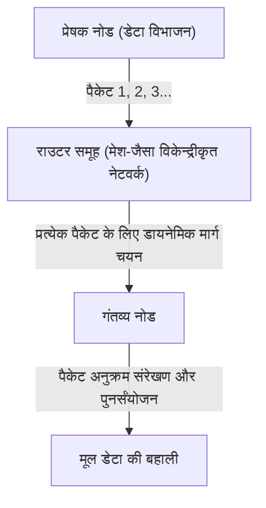

पैकेट स्विचिंग विधि के तकनीकी नवाचार को मुख्य रूप से निम्नलिखित दो बिंदुओं में संक्षेपित किया जा सकता है।

1. **सांख्यिकीय मल्टीप्लेक्सिंग (Statistical Multiplexing) की प्राप्ति:**
   सर्किट स्विचिंग की तरह एक विशिष्ट संचार के लिए भौतिक सर्किट पर एकाधिकार करने के बजाय, कई असंबंधित संचारों के पैकेट समय-साझाकरण (time-division) तरीके से एक ही भौतिक सर्किट को साझा करते हैं। कंप्यूटरों के बीच डेटा संचार में उच्च "बर्स्टनेस (Burstiness: यह विशेषता कि डेटा की एक बड़ी मात्रा अस्थायी रूप से प्रवाहित होती है और उसके बाद सन्नाटा छा जाता है)" होती है, इसलिए पैकेट स्विचिंग के माध्यम से बैंडविड्थ साझा करने से संचार संसाधनों के उपयोग की दक्षता गणितीय सीमा तक बढ़ जाती है।
2. **स्टोर-एंड-फॉरवर्ड (Store and Forward) और डायनेमिक मार्ग चयन:**
   नेटवर्क बनाने वाला प्रत्येक मध्यवर्ती नोड (राउटर) अस्थायी रूप से प्राप्त पैकेट्स को मेमोरी में एक कतार (queue) में जमा करता है, और पैकेट हेडर में उल्लिखित गंतव्य पते (destination address) की नोड की अपनी मार्ग तालिका (routing table) से तुलना करता है। फिर, यह उस समय नेटवर्क की भीड़ (congestion) की स्थिति और भौतिक सर्किट की डिस्कनेक्शन स्थिति की गणना करता है, और प्रत्येक पैकेट को सबसे इष्टतम आसन्न (adjacent) नोड पर अग्रेषित (forward) करता है।

क्लेनरॉक ने कतारबद्ध सिद्धांत (Queuing Theory) का उपयोग करके इस स्टोर-एंड-फॉरवर्ड विधि में पैकेट विलंब (delay) और बफर आकार का गणितीय मॉडल स्थापित किया। भले ही नेटवर्क का एक हिस्सा परमाणु हमले में वाष्पित (नष्ट) हो जाए, जीवित नोड्स स्वायत्त (autonomously) रूप से स्थिति का न्याय करेंगे, और पैकेट्स एक वैकल्पिक मार्ग (मेश नेटवर्क पर एक और मार्ग) ढूंढ लेंगे और अपने गंतव्य तक पहुंच जाएंगे। यह "स्वायत्त विकेन्द्रीकृत, स्व-उपचार (self-healing)" आर्किटेक्चर इंटरनेट के लचीलेपन (Resilience) का मूल है।

## 1.2 ARPANET का निर्माण: IMP के माध्यम से हार्डवेयर और प्रोटोकॉल का पृथक्करण

1969 में, अमेरिकी रक्षा विभाग की उन्नत अनुसंधान परियोजना एजेंसी (ARPA) द्वारा वित्त पोषित एक परियोजना "ARPANET" शुरू हुई, जिसने पैकेट-स्विच्ड नेटवर्क को भौतिक दुनिया में लागू किया, जो पहले केवल एक सैद्धांतिक अस्तित्व था।

उस समय का कंप्यूटर वातावरण आज की तुलना में कहीं अधिक अराजक था। IBM, DEC और SDS जैसी विभिन्न कंपनियों द्वारा स्वतंत्र रूप से विकसित मेनफ्रेम (बड़े कंप्यूटर) में पूरी तरह से अलग कैरेक्टर कोड (ASCII बनाम EBCDIC), शब्द की लंबाई (16-बिट, 32-बिट, 36-बिट, आदि) और ऑपरेटिंग सिस्टम थे, और उनके बीच सीधे संचार करना तकनीकी रूप से अत्यंत कठिन था।

इसलिए, ARPANET के डिजाइनरों (लैरी रॉबर्ट्स और अन्य) ने नेटवर्क आर्किटेक्चर में एक बहुत ही महत्वपूर्ण डिज़ाइन निर्णय लिया। वह "IMP (Interface Message Processor)" नामक एक समर्पित छोटे रिले (relay) कंप्यूटर को पेश करना था।

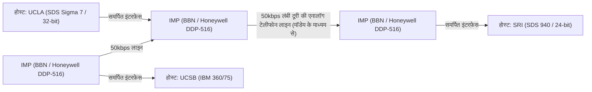

बोस्टन स्थित परामर्श फर्म BBN (Bolt Beranek and Newman) ने IMP विकसित करने की बोली जीती। उन्होंने हनीवेल (Honeywell) के मजबूत मिनीकंप्यूटर "DDP-516" को संशोधित किया और राउटिंग प्रोटोकॉल, पैकेट विखंडन और पुनर्संयोजन, और त्रुटि का पता लगाने (CRC: साइक्लिक रिडंडेंसी चेक) जैसे सभी जटिल नेटवर्क प्रोसेसिंग कार्यों का बोझ IMP पर डाल दिया।

नतीजतन, प्रत्येक शोध संस्थान में विशाल होस्ट कंप्यूटरों को अब जटिल पैकेट राउटिंग या लाइनों की भौतिक विशेषताओं के बारे में चिंता करने की आवश्यकता नहीं थी, और केवल मानकीकृत इंटरफ़ेस (BBN 1822 प्रोटोकॉल) का उपयोग करके उनके सामने IMP के साथ डेटा का आदान-प्रदान करना था। यह नेटवर्क क्षेत्र में "चिंताओं के पृथक्करण (Separation of Concerns)" को लागू करने का पहला महान सफल उदाहरण था, और IMP आज के राउटर (Router) का प्रत्यक्ष पूर्वज बन गया।

29 अक्टूबर, 1969 को, UCLA में क्लेनरॉक की प्रयोगशाला से पहला संदेश "LO" SRI (स्टैनफोर्ड रिसर्च इंस्टीट्यूट) को भेजा गया था (सिस्टम दुर्घटनाग्रस्त हो गया क्योंकि वे "LOGIN" टाइप करने का प्रयास कर रहे थे)। यह वह ऐतिहासिक क्षण है जब ARPANET का जन्म हुआ था। उसके बाद, प्रारंभिक राउटिंग एल्गोरिदम (बेलमैन-फोर्ड विधि पर आधारित दूरी-वेक्टर राउटिंग) लागू किया गया, और ARPANET तेजी से संयुक्त राज्य भर में अनुसंधान संस्थानों को जोड़ने वाले बुनियादी ढांचे के रूप में विकसित हुआ।

## 1.3 TCP/IP का डिज़ाइन दर्शन: एंड-टू-एंड सिद्धांत और एनकैप्सुलेशन की गहराई

ARPANET एकल नेटवर्क के रूप में एक बड़ी सफलता थी, लेकिन जल्द ही इसे एक नई दीवार का सामना करना पड़ा। ARPANET के भीतर उपयोग किया जाने वाला संचार प्रोटोकॉल, NCP (Network Control Program), को इस आधार पर डिज़ाइन किया गया था कि यह ARPANET जैसे "सजातीय और अत्यधिक विश्वसनीय एकल नेटवर्क" पर चलेगा।

हालाँकि, 1970 के दशक की शुरुआत में, विभिन्न प्रकार के नेटवर्क दिखाई देने लगे, जिनमें पूरी तरह से अलग भौतिक माध्यम, अधिकतम पैकेट आकार (MTU: Maximum Transmission Unit), स्थानांतरण गति और त्रुटि दर शामिल थे, जैसे कि कृत्रिम उपग्रहों का उपयोग करने वाला पैकेट संचार नेटवर्क (SATNET) और हवाई विश्वविद्यालय (Hawaii University) द्वारा विकसित वायरलेस पैकेट संचार नेटवर्क (ALOHANET से प्राप्त PRNET)। जब इन नेटवर्कों को एक दूसरे से जोड़कर वैश्विक स्तर पर "नेटवर्कों का नेटवर्क (Internetwork)" बनाने का प्रयास किया गया, तो यह स्पष्ट हो गया कि NCP का डिज़ाइन विफल हो जाएगा।

यह 1974 में विंटन सेर्फ़ (Vinton Cerf) और रॉबर्ट काह्न (Bob Kahn) द्वारा प्रकाशित ग्राउंडब्रेकिंग पेपर "A Protocol for Packet Network Intercommunication" था, जिसने क्रॉस-प्लेटफ़ॉर्म नेटवर्क कनेक्शन की इस भारी चुनौती को हल किया। उनके द्वारा डिज़ाइन किया गया प्रोटोकॉल "TCP/IP (Transmission Control Protocol / Internet Protocol)" है, जो आधुनिक इंटरनेट की नींव है।

### वास्तुकला की आत्मा: एंड-टू-एंड सिद्धांत (End-to-End Argument)
TCP/IP डिज़ाइन के मूल में नेटवर्क इंजीनियरिंग में सबसे महत्वपूर्ण दर्शन "एंड-टू-एंड सिद्धांत (End-to-End Principle / Argument)" है। 1980 के दशक में जे.एच. साल्टज़र (J. H. Saltzer), डी.पी. रीड (D. P. Reed) और डी.डी. क्लार्क (D. D. Clark) द्वारा स्पष्ट किया गया यह सिद्धांत, निम्नलिखित तर्क देता है:

"उन्नत और एप्लिकेशन-विशिष्ट कार्य, जैसे कि डेटा ट्रांसफर विश्वसनीयता, अनुक्रम नियंत्रण और एन्क्रिप्शन, को संचार के दोनों सिरों (End-to-End) पर अंतिम होस्ट में लागू किया जाना चाहिए, न कि नेटवर्क के कोर (रिले इंफ्रास्ट्रक्चर या राउटर्स) में।"

क्या होगा यदि नेटवर्क कोर (IMP या राउटर) को पैकेट आगमन की पुष्टि (ACK) और पुन: प्रेषण नियंत्रण जैसे जटिल "स्थिति (State)" को बनाए रखने के लिए बनाया जाए? जिस क्षण एक रिले राउटर विफल होता है, वह स्थिति खो जाती है और संचार कट जाता है। इसके अलावा, हर बार जब नई आवश्यकताओं के साथ कोई एप्लिकेशन प्रकट होता है, तो दुनिया भर में रिले राउटर्स के सॉफ़्टवेयर को फिर से लिखना होगा।

TCP/IP ने इस सिद्धांत को इसकी चरम सीमा तक लागू किया। IP (Internet Protocol) राउटर, जो रिले के प्रभारी हैं, "प्राप्त पैकेटों को उनके गंतव्य पर सर्वोत्तम प्रयास (best-effort) आधार पर अग्रेषित करना" के अत्यंत सरल कार्य (स्टेटलेस डेटाग्राम ट्रांसफर) में विशिष्ट हैं। IP पैकेट के नुकसान या क्रम से बाहर होने की कोई परवाह नहीं करता है। इसने खुद को एक मात्र "डंब नेटवर्क (Dumb Network: मूर्ख नेटवर्क)" तक सीमित रखा।

इसके बजाय, संचार की विश्वसनीयता सुनिश्चित करने की भारी जिम्मेदारी दोनों सिरों पर होस्ट कंप्यूटर पर चलने वाले TCP (Transmission Control Protocol) पर छोड़ दी गई। TCP IP द्वारा लाए गए आउट-ऑफ़-ऑर्डर पैकेट्स से जुड़े अनुक्रम (sequence) नंबरों को देखकर मूल डेटा को फिर से जोड़ता है, पैकेट्स गायब होने पर स्वायत्त रूप से पुन: प्रेषण का अनुरोध करता है, और नेटवर्क में भीड़ होने पर ट्रांसमिशन गति को समायोजित करता है (विंडो कंट्रोल और स्लो-स्टार्ट एल्गोरिदम)।

"कोर को जितना संभव हो उतना सरल रखने और किनारों (ends) को बुद्धिमत्ता (intelligence) देने" का यह डिज़ाइन दर्शन सबसे बड़ा कारण है कि इंटरनेट ने टेलीफोन नेटवर्क को पीछे छोड़ दिया और बाद में बिना किसी बुनियादी ढांचे के संशोधन के वेब, स्ट्रीमिंग वीडियो, P2P संचार और स्मार्टफोन जैसे विस्फोटक नवाचारों (जिनकी इसके डिजाइनरों ने भी कल्पना नहीं की थी) को निगलने में सक्षम हो गया।

### एनकैप्सुलेशन (Encapsulation) और पदानुक्रमित मॉडल (Hierarchical Model)
TCP/IP ने भूमिकाओं के इस तार्किक विभाजन को प्राप्त करने के लिए डेटा को "एनकैप्सुलेट (Encapsulate)" करने की तकनीक का इस्तेमाल किया। यह एक ऐसा तंत्र है जिसमें प्रत्येक परत प्रसारित किए जाने वाले डेटा के ऊपर अपनी नियंत्रण जानकारी (हेडर) को एक मैत्रियोश्का गुड़िया (Matryoshka doll) की तरह जोड़ती है।

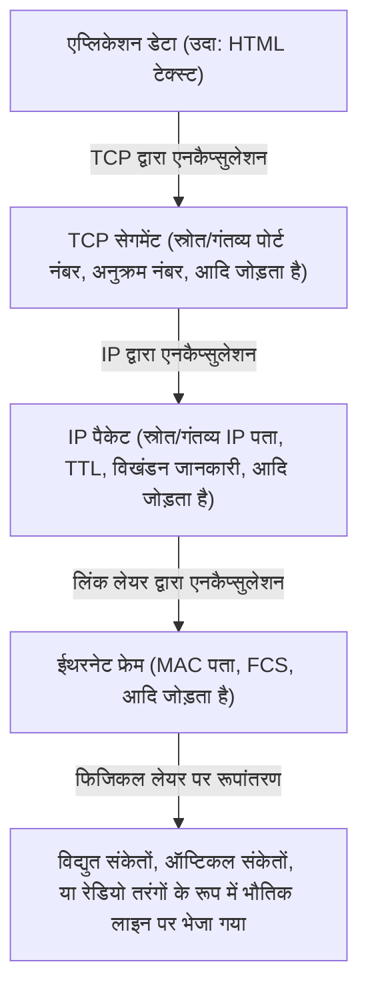

राउटर केवल गंतव्य निर्धारित करने के लिए IP पैकेट हेडर (IP पते) को देखता है, और इसकी सामग्री (TCP हेडर या डेटा) में बिल्कुल शामिल नहीं होता है। नतीजतन, IP अंतर्निहित भौतिक परत (ऑप्टिकल फाइबर, तांबे के तार, वाई-फाई, 5G) की भौतिक विशेषताओं में अंतर को पूरी तरह से छुपाता और अवशोषित करता है, और ऊपरी परतों को सफलतापूर्वक "वैश्विक एकल आभासी नेटवर्क" प्रदान करता है।

1 जनवरी, 1983 को, एक "फ्लैग डे (Flag Day)" आयोजित किया गया था, जहाँ ARPANET के सभी होस्ट एक साथ NCP से TCP/IP पर स्विच हो गए थे, और यहाँ सही अर्थों में "द इंटरनेट (The Internet)" का जन्म हुआ था।

## 1.4 NSFNET का उदय और स्वायत्त विकेंद्रीकृत राउटिंग का विकास

TCP/IP में संक्रमण के बाद, इंटरनेट ने सैन्य और राष्ट्रीय रक्षा की सीमाओं को पार कर लिया और अकादमिक अनुसंधान के लिए एक विशाल बुनियादी ढांचे में बदल गया। इसकी प्रेरक शक्ति "NSFNET" थी, जिसे 1980 के दशक के उत्तरार्ध में यूएस नेशनल साइंस फाउंडेशन (NSF) द्वारा बनाया गया था।

NSFNET को पूरे अमेरिका में पांच सुपरकंप्यूटर केंद्रों को जोड़ने वाले बैकबोन नेटवर्क के रूप में बनाया गया था, और इसकी भौतिक परत में पहले 56kbps, फिर T1 लाइनें (1.544Mbps), और फिर T3 लाइनें (45Mbps) में नाटकीय अपग्रेड किए गए थे। विभिन्न विश्वविद्यालयों और क्षेत्रीय नेटवर्क (क्षेत्रीय नेटवर्क) को इस NSFNET बैकबोन से पदानुक्रमित (hierarchically) रूप से जोड़ा गया था।

जैसे-जैसे नेटवर्क के पैमाने में विस्फोटक रूप से विस्तार हुआ (स्केलिंग), एक नई तकनीकी चुनौती सामने आई। यह थी "राउटिंग की सीमा"। सभी मध्यवर्ती राउटर्स के लिए हज़ारों नोड्स के रूटिंग जानकारी (मार्ग की जानकारी) को साझा करना मेमोरी क्षमता और कंप्यूटिंग शक्ति की भौतिक सीमा को पार कर जाएगा।

इस समस्या को हल करने के लिए, इंटरनेट ने "स्वायत्त प्रणाली (AS: Autonomous System)" की अवधारणा पेश की। इसने इंटरनेट को एक विशाल नेटवर्क के रूप में नहीं, बल्कि स्वतंत्र प्रबंधन नीतियों वाले नेटवर्क (AS) के संग्रह के रूप में पुनर्परिभाषित किया।

AS के अंदर (IGP: Interior Gateway Protocol), OSPF (Open Shortest Path First) जैसे लिंक-स्टेट रूटिंग प्रोटोकॉल का उपयोग किया जाता है, और डायक्स्ट्रा के एल्गोरिदम (Dijkstra's algorithm) का उपयोग नेटवर्क का पूरा टोपोलॉजी मैप बनाने और उच्च गति पर सबसे छोटे रास्ते की गणना करने के लिए किया जाता है।

दूसरी ओर, AS और AS (EGP: Exterior Gateway Protocol) के बीच, केवल सबसे छोटा रास्ता खोजना पर्याप्त नहीं था, बल्कि व्यावसायिक और संगठनात्मक नीतियों को प्रतिबिंबित करना आवश्यक था जैसे कि "किस नेटवर्क के माध्यम से संचार की अनुमति है"। इसे प्राप्त करने के लिए, "BGP (Border Gateway Protocol)", जो आज भी इंटरनेट की नींव का समर्थन करता है, विकसित किया गया था। BGP ने पाथ वेक्टर (Path Vector) एल्गोरिदम को अपनाया, जिससे रूटिंग लूप्स को पूरी तरह से रोका जा सका और दुनिया भर के ISP (इंटरनेट सर्विस प्रोवाइडर्स) के बीच रूटिंग जानकारी का आदान-प्रदान संभव हो सका।

NSFNET के निर्माण और BGP की स्थापना ने आधुनिक व्यावसायिक इंटरनेट इकोसिस्टम को पूरा किया, जहां प्रत्येक संगठन बार-बार आपस में जुड़ता है (पीयरिंग और ट्रांजिट), जिससे पूरा नेटवर्क एक केंद्रीय व्यवस्थापक के बिना स्वायत्त रूप से कार्य करता है। 1995 में, NSFNET ने अपनी भूमिका समाप्त की, और बैकबोन के संचालन को पूरी तरह से निजी ISP समूहों को हस्तांतरित कर दिया गया।

## 1.5 WWW का जन्म: हाइपरटेक्स्ट द्वारा ज्ञान की मुक्ति और सार्वजनिक डोमेन

1980 के दशक के अंत तक, जब भौतिक परत से लेकर नेटवर्क परत और ट्रांसपोर्ट परत तक का बुनियादी ढांचा वैश्विक स्तर पर स्थापित हो चुका था, इंटरनेट पर जमा जानकारी की मात्रा में नाटकीय रूप से वृद्धि हुई थी। हालाँकि, उस समय का इंटरनेट FTP (फ़ाइल ट्रांसफर), टेलनेट (रिमोट लॉगिन), और USENET (इलेक्ट्रॉनिक बुलेटिन बोर्ड) जैसे अलग-अलग एप्लिकेशनों से भरा हुआ था, और जानकारी प्रत्येक सर्वर की निर्देशिका (डायरेक्टरी) की गहराई में अलग-थलग (साइलो में) थी। वांछित डेटा खोजने के लिए लक्ष्य सर्वर का IP पता और जटिल UNIX कमांड का ज्ञान होना आवश्यक था, जो एक अत्यंत अलोकतांत्रिक स्थिति थी।

स्विट्जरलैंड के जिनेवा में यूरोपीय परमाणु अनुसंधान संगठन (CERN) के एक कंप्यूटर वैज्ञानिक टिम बर्नर्स-ली (Tim Berners-Lee) ने इस स्थिति को पूरी तरह से बदल दिया और सूचना साझाकरण में एक प्रतिमान बदलाव लाया। 1989 में, उन्होंने "वर्ल्ड वाइड वेब (World Wide Web - WWW)" नामक एक क्रांतिकारी प्रणाली का प्रस्ताव रखा।

उनके विचार का मूल "हाइपरटेक्स्ट (Hypertext: एक दस्तावेज़ में एक शब्द से दूसरे दस्तावेज़ तक लिंक बनाने की अवधारणा)", जो 1960 के दशक से अस्तित्व में था, और "इंटरनेट (TCP/IP)" को संयोजित करना था। उन्होंने स्थानीय कंप्यूटर के भीतर बंद हाइपरटेक्स्ट लिंक के गंतव्य का विस्तार दुनिया के दूसरी तरफ के सर्वर के दस्तावेज़ों तक कर दिया।

बर्नर्स-ली ने इस विशाल सूचना स्थान का निर्माण करने के लिए अकेले ही तीन अत्यधिक परिष्कृत तकनीकी विशिष्टताओं को डिज़ाइन और कार्यान्वित किया।

1. **URI (Uniform Resource Identifier):**
   नेटवर्क पर मौजूद किसी भी संसाधन (टेक्स्ट, चित्र, वीडियो, आदि) के स्थान को विशिष्ट रूप से निर्दिष्ट करने के लिए एक सार्वभौमिक पता प्रणाली (एड्रेसिंग सिस्टम)।
2. **HTTP (Hypertext Transfer Protocol):**
   URI द्वारा निर्दिष्ट संसाधनों का अनुरोध करने और स्थानांतरित करने के लिए क्लाइंट (वेब ब्राउज़र) और सर्वर के बीच उपयोग किया जाने वाला एक एप्लिकेशन लेयर प्रोटोकॉल। HTTP की सबसे बड़ी विशेषता यह है कि यह एक "स्टेटलेस (Stateless)" डिज़ाइन अपनाता है जो संचार की "स्थिति (State)" को नहीं रखता है। इससे सर्वर के लिए लाखों क्लाइंट्स से आने वाले अनुरोधों को कुशलतापूर्वक संभालना संभव हो गया।
3. **HTML (Hypertext Markup Language):**
   दस्तावेज़ की तार्किक संरचना का वर्णन करने और अन्य संसाधनों के हाइपरलिंक्स (एंकर टैग `<a>`) को एम्बेड करने के लिए एक मार्कअप भाषा।

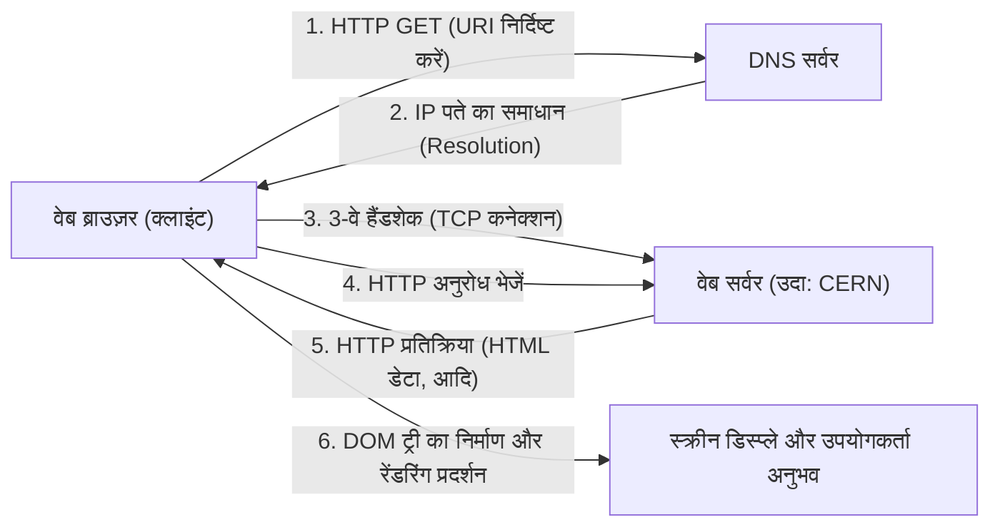

1990 के अंत में, दुनिया का पहला वेब सर्वर (info.cern.ch) और ब्राउज़र NeXT कंप्यूटर पर काम करने लगा। शुरुआती वेब टेक्स्ट-आधारित था, लेकिन इसके सहज ज्ञान युक्त लिंक-आधारित सूचना खोज अनुभव ने इसे शोधकर्ताओं के बीच जल्दी लोकप्रिय बना दिया।

### सार्वजनिक डोमेन का ऐतिहासिक निर्णय
हालाँकि, जिस सबसे बड़े कारण से WWW ने सही मायनों में दुनिया को बदल दिया और आधुनिक समाज के बुनियादी ढांचे के रूप में खुद को स्थापित किया, वह केवल इसका उत्कृष्ट तकनीकी आर्किटेक्चर नहीं है। 30 अप्रैल 1993 को एक निर्णायक घटना घटी जिसने इतिहास को बदल कर रख दिया।

टिम बर्नर्स-ली के मजबूत अनुरोध को स्वीकार करते हुए, CERN ने WWW की सभी मूलभूत तकनीकों (सर्वर सॉफ्टवेयर, क्लाइंट, कोड लाइब्रेरी) को "सार्वजनिक डोमेन (बौद्धिक संपदा अधिकारों का त्याग)" के रूप में मुफ़्त में जारी करने का आश्चर्यजनक निर्णय लिया। किसी भी पेटेंट अधिकार का प्रयोग न करने और कोई रॉयल्टी न मांगने के घोषणापत्र पर CERN के निदेशक के हस्ताक्षर थे।

यदि उस समय, CERN ने WWW तकनीक का पेटेंट करा लिया होता और सॉफ़्टवेयर लाइसेंसिंग के माध्यम से इसका मुद्रीकरण करने का प्रयास किया होता, तो क्या होता? निश्चित रूप से, आज का सूचना विस्फोट नहीं हुआ होता। WWW केवल वित्तीय संसाधनों वाली कुछ कंपनियों और विश्वविद्यालयों के लिए एक बंद प्रणाली बनी रहती, और बाद में गोफर (Gopher) जैसे प्रतिस्पर्धी प्रोटोकॉल के साथ मानक युद्धों के कारण इंटरनेट खंडित हो जाता।

सार्वजनिक डोमेन में इस रिलीज़ द्वारा तकनीकी और कानूनी बाधाओं को पूरी तरह से समाप्त कर दिया गया, जिससे दुनिया भर के हैकर्स और कंपनियों को WWW पारिस्थितिकी तंत्र में प्रवेश करने की अनुमति मिली। नेशनल सेंटर फॉर सुपरकंप्यूटिंग एप्लिकेशन (NCSA) में मार्क एंड्रीसन (Marc Andreessen) और अन्य लोगों ने एक अभूतपूर्व ग्राफिकल ब्राउज़र, "NCSA Mosaic" विकसित किया और उसे मुफ़्त में जारी किया, जो छवियों को इनलाइन प्रदर्शित कर सकता था। इससे बाद में नेटस्केप नेविगेटर (Netscape Navigator) का उदय हुआ, और अंततः आईटी बूम (IT bubble) शुरू हुआ। कोई भी व्यक्ति स्वतंत्र रूप से एक वेब सर्वर स्थापित कर सकता था और दुनिया भर में जानकारी प्रसारित कर सकता था, जिससे "सूचना का लोकतंत्रीकरण (Democratization of Information)" हासिल हुआ।

## 1.6 निष्कर्ष: दर्शन (Philosophy) कार्यान्वयन (Implementation) से बढ़कर है

अध्याय 1 में हमने इंटरनेट का जो इतिहास देखा, वह केवल संचार गति में सुधार का इतिहास नहीं है। पैकेट स्विचिंग का आविष्कार भौतिक वास्तविकता पर आधारित था कि "केंद्रीकृत नियंत्रण कमजोर है", एंड-टू-एंड सिद्धांत कि "जटिलता को सिरों (ends) द्वारा नियंत्रित किया जाना चाहिए", और WWW का सार्वजनिक प्रकाशन इस विचार पर आधारित था कि "जानकारी पूरी मानव जाति के लिए मुफ़्त में खुली होनी चाहिए"।

आज इंटरनेट को जो बनाता है वह उत्कृष्ट हार्डवेयर या कोड नहीं है, बल्कि ये शक्तिशाली और सुसंगत "डिज़ाइन दर्शन (Design Philosophy)" हैं। तार्किक एनकैप्सुलेशन के माध्यम से भौतिक परत की बाधाओं को पार करना और खुले मानकों (RFC: Request for Comments) के माध्यम से विविधता को स्वीकार करना। इस विकेंद्रीकृत और स्वतंत्रता का सम्मान करने वाले आर्किटेक्चर के कारण ही इंटरनेट अभूतपूर्व स्केलिंग (विस्तार) प्राप्त करने में सक्षम हुआ।

हालाँकि, अभी भी "नामों (Names)" (जिन्हें मनुष्य समझ सकते हैं) और "संख्याओं (IP Addresses)" (जिन्हें नेटवर्क प्रोसेस करते हैं) के बीच एक गहरी खाई मौजूद थी। अगले अध्याय में, हम "IP एड्रेस स्पेस और DNS (Domain Name System) की गहराई" के तकनीकी तंत्र का खुलासा करेंगे, जो एक विशाल वितरित डेटाबेस प्रणाली है जिसने इस विशाल स्वायत्त विकेंद्रीकृत नेटवर्क के पता स्थान (address space) में व्यवस्था लाई और पीछे से WWW के विस्फोटक प्रसार का समर्थन किया।
# अध्याय 2: भौतिक परत और डेटा लिंक परत ~ डिजिटल डेटा की भौतिक वास्तविकता और आसन्न संचार ~

इंटरनेट जैसे विशाल नेटवर्क के मूल में "0" और "1" के तार्किक डिजिटल डेटा को विद्युत संकेतों, प्रकाश की चमक, या विद्युत चुम्बकीय तरंगों की लहरों जैसी भौतिक घटनाओं में बदलने और अंतरिक्ष या माध्यम के पार छलांग लगाकर प्राप्तकर्ता तक पहुंचाने की एक असाधारण भौतिक घटनाओं की श्रृंखला मौजूद है। जब हम अनजाने में अपने स्मार्टफोन पर कोई वेबसाइट खोलते हैं, तो उसके पीछे गहरे समुद्र के तल में बिछी कांच की फाइबर के माध्यम से फोटॉन दौड़ रहे होते हैं, और अदृश्य रेडियो तरंगें जटिल गणनाओं के साथ अंतरिक्ष में उड़ रही होती हैं।

इस अध्याय में, हम OSI संदर्भ मॉडल की पहली परत (भौतिक परत) और दूसरी परत (डेटा लिंक परत) पर ध्यान केंद्रित करेंगे, और नेटवर्क के "सबसे भौतिक और जमीनी" हिस्से का और उन्हें नियंत्रित करने वाले सटीक तार्किक तंत्र का पेशेवरों के दृष्टिकोण से चरम गहराई तक विश्लेषण करेंगे जो हमारे जीवन का समर्थन करता है।

---

## 2.1 भौतिक परत (Physical Layer): सूचना का भौतिक साकारीकरण और ब्रह्मांड के नियम

भौतिक परत का सबसे बड़ा मिशन कंप्यूटर द्वारा नियंत्रित अलग-अलग बिट्स (0 और 1) को ट्रांसमिशन माध्यम (तांबे के तार, ऑप्टिकल फाइबर, वैक्यूम या हवा जैसी जगह) की भौतिक विशेषताओं के अनुकूल एनालॉग भौतिक संकेतों में परिवर्तित (मोडुलेट) करना और उन्हें ट्रांसमिशन पथ पर रखना है। यहां, इलेक्ट्रिकल इंजीनियरिंग, क्वांटम यांत्रिकी और प्रकाशिकी के नियम संचार की सीमाओं को निर्धारित करते हैं।

### शैनन-हार्टले प्रमेय और सूचना की सीमा
भौतिक परत की बात करते समय क्लाउड शैनन द्वारा 1948 में प्रकाशित सूचना सिद्धांत से बचना असंभव है। "शैनन-हार्टले प्रमेय" ने गणितीय रूप से उस अधिकतम डेटा ट्रांसफर दर (चैनल क्षमता) को साबित किया जिसे शोर वाले संचार चैनल में बिना किसी त्रुटि के भेजा जा सकता है।

$$ C = B \log_2\left(1 + \frac{S}{N}\right) $$

यहां, $C$ चैनल क्षमता (bps) है, $B$ बैंडविड्थ (Hz) है, और $S/N$ सिग्नल-टू-नॉइज़ अनुपात (SNR) है। यह सुंदर समीकरण दर्शाता है कि चाहे तकनीक कितनी भी उन्नत क्यों न हो, किसी दिए गए बैंडविड्थ और शोर के वातावरण में भेजी जा सकने वाली सूचना की मात्रा की एक भौतिक ऊपरी सीमा (शैनन सीमा) होती है। आधुनिक ऑप्टिकल फाइबर और वाई-फाई इंजीनियर संचार की गति को इस सीमा तक बढ़ाने के लिए एक अंतहीन लड़ाई लड़ रहे हैं।

### ऑप्टिकल फाइबर की भौतिकी: प्रकाश को "कैद करके" ले जाना
आधुनिक इंटरनेट की रीढ़ निस्संदेह ऑप्टिकल फाइबर (Optical Fiber) है। तांबे के तार के माध्यम से विद्युत संचार में, त्वचा प्रभाव (skin effect) और विद्युत चुम्बकीय हस्तक्षेप (EMI) के कारण लंबी दूरी का उच्च गति संचार मुश्किल है, लेकिन ऑप्टिकल फाइबर ने इन पर काबू पा लिया है।

ऑप्टिकल फाइबर अत्यधिक शुद्ध क्वार्ट्ज ग्लास की दो परतों से बना होता है: एक केंद्रीय "कोर" और एक "क्लैडिंग" जो इसे घेरती है। कोर के अपवर्तक सूचकांक (refractive index) को क्लैडिंग की तुलना में थोड़ा (कुछ प्रतिशत या उससे कम) अधिक सेट करके, स्नेल के नियम के आधार पर, एक निश्चित महत्वपूर्ण कोण (critical angle) से उथले कोण पर प्रवेश करने वाला प्रकाश कोर और क्लैडिंग की सीमा पर बार-बार पूर्ण आंतरिक परावर्तन (Total Internal Reflection) से गुजरता है। नतीजतन, प्रकाश फाइबर के अंदर आगे बढ़ता है बिना बाहर लीक हुए।

#### फैलाव और क्षीणन के खिलाफ लड़ाई: वह कांच जो नोबेल पुरस्कार लाया
अतीत में, कांच में कई अशुद्धियां होती थीं, और प्रकाश कुछ ही मीटर में कम (क्षीण) हो जाता था। 1966 में, डॉ. चार्ल्स काओ (2009 के नोबेल भौतिकी पुरस्कार विजेता) ने पता लगाया कि ऑप्टिकल फाइबर के क्षीणन का कारण कांच की अंतर्निहित प्रकृति नहीं बल्कि अशुद्धियां (विशेष रूप से हाइड्रॉक्सिल समूह और संक्रमण धातु) हैं, और भविष्यवाणी की कि यदि शुद्धता बढ़ाई जाती है तो लंबी दूरी का संचार संभव होगा। 1970 के दशक में कॉर्निंग द्वारा विकसित अति-निम्न-हानि (ultra-low-loss) क्वार्ट्ज ग्लास ने 1550nm बैंड (C बैंड) में 0.2dB/km के आश्चर्यजनक रूप से कम नुकसान को प्राप्त किया। इसका मतलब है कि 15 किमी की यात्रा करने के बाद भी प्रकाश की तीव्रता केवल आधी नष्ट होती है।

हालाँकि, जब प्रकाश लंबी दूरी तय करता है, तो "रंगीय फैलाव (Chromatic Dispersion)" और "मोडल फैलाव (Modal Dispersion)" होता है, और पल्स का तरंगरूप (waveform) विकृत हो जाता है। क्रोमैटिक फैलाव इसलिए होता है क्योंकि कांच के माध्यम से प्रकाश की गति प्रकाश की तरंग दैर्ध्य (रंग) के आधार पर भिन्न होती है। मोडल फैलाव एक ऐसी घटना है जहां कोर से गुजरने वाले प्रकाश के कई पथों (मोड) के कारण आगमन समय में अंतर होता है।
इसे दूर करने के लिए, कोर के व्यास को कुछ माइक्रोमीटर तक संकुचित किया गया, जो प्रकाश की तरंग दैर्ध्य के करीब है, और "सिंगल-मोड फाइबर (SMF)" विकसित किया गया जो केवल एक पथ से गुजरने की अनुमति देता है, और यह अंतरमहाद्वीपीय संचार जैसे लंबी दूरी के संचरण की मुख्यधारा बन गया।

#### EDFA और WDM: ऑप्टिकल संचार का पुनर्जागरण
1990 के दशक में ऑप्टिकल संचार में दो क्रांतियां हुईं। पहला एर्बियम-डोप्ड फाइबर एम्पलीफायर (EDFA: Erbium-Doped Fiber Amplifier) है। तब तक, धीमे और उच्च-लागत वाले पुनर्योजी रिपीटर (regenerative repeaters) की आवश्यकता थी, जो क्षीण ऑप्टिकल सिग्नल को विद्युत संकेत में परिवर्तित करते थे, इसे बढ़ाते थे, और फिर इसे प्रकाश में वापस परिवर्तित करते थे। EDFA ने फाइबर के कोर में दुर्लभ-पृथ्वी तत्व एर्बियम को जोड़कर और बाहर से उत्तेजित प्रकाश को लागू करके, सिग्नल प्रकाश के गुजरने पर उत्तेजित उत्सर्जन का कारण बनकर प्रकाश को सीधे प्रकाश के रूप में बढ़ाना संभव बना दिया।

दूसरा वेवलेंथ डिवीजन मल्टीप्लेक्सिंग (WDM: Wavelength Division Multiplexing) है। यह एक ऐसी तकनीक है जो सुपरपोजिशन के सिद्धांत (principle of superposition) का उपयोग करके एक साथ कई तरंग दैर्ध्य के संकेतों को एक ही फाइबर में भेजती है, यह सिद्धांत बताता है कि यदि एक ही स्थान पर एक ही समय में विभिन्न तरंग दैर्ध्य (रंग) का प्रकाश उत्सर्जित होता है, तो वे बिना मिश्रित हुए स्वतंत्र रूप से आगे बढ़ते हैं। हाई-डेंसिटी वेवलेंथ डिवीजन मल्टीप्लेक्सिंग (DWDM) तकनीक के साथ, अब एक ही ऑप्टिकल फाइबर पर कुछ मिलीमीटर की दूरी वाली तरंग दैर्ध्य में 100 से अधिक संकेतों को ले जाना और एक ही फाइबर के साथ दसियों Tbps से लेकर कई Pbps की अभूतपूर्व बैंडविड्थ प्राप्त करना संभव है।

### पनडुब्बी केबल: पृथ्वी का तंत्रिका नेटवर्क
महाद्वीपों के बीच 99% से अधिक डेटा संचार उपग्रहों द्वारा नहीं, बल्कि पनडुब्बी केबलों (submarine cables) द्वारा ले जाया जाता है। क्लाउड में डेटा, विदेशी वेबसाइटों की छवियां, ये सभी भौतिक रूप से समुद्र के तल से गुजरते हैं।

#### विफलता और चुनौती का इतिहास
पनडुब्बी केबलों का इतिहास इंटरनेट से बहुत पुराना है। पहली बड़ी चुनौती 1858 की ट्रान्साटलांटिक टेलीग्राफ केबल थी। प्राकृतिक रबर के एक प्रकार, गुट्टा-पर्चा (gutta-percha) से अछूता तांबे का तार, सफलतापूर्वक बिछाया गया था, लेकिन भगवान केल्विन (विलियम थॉमसन) की चेतावनियों को अनदेखा करते हुए उच्च वोल्टेज के संचालन के परिणामस्वरूप, केवल कुछ ही हफ्तों में इन्सुलेशन टूटने के कारण यह खामोश हो गया। उसके बाद, सिद्धांतों और सामग्रियों में सुधार करने में लंबा समय लगा, और 1988 में, पहली ट्रांस-पैसिफिक ऑप्टिकल पनडुब्बी केबल "TAT-8" का संचालन शुरू हुआ, जिसने प्रकाश के युग की शुरुआत की।

#### केबल संरचना और बिछाने का तंत्र
आधुनिक पनडुब्बी केबल, जो हजारों मीटर की गहराई पर गहरे समुद्र में बिछाई जाती हैं, चरम वातावरण का सामना करने के लिए डिज़ाइन की गई हैं। केंद्र में केवल कुछ ऑप्टिकल फाइबर के बंडल को सुरक्षित रखने के लिए, वे उच्च तन्यता (high-tensile) वाले स्टील के तारों, पानी के दबाव के प्रतिरोध के लिए तांबे या एल्यूमीनियम ट्यूबों, और पॉलीथीन इन्सुलेटर (polyethylene insulators) की कई परतों से सुरक्षित होती हैं। गहरे समुद्र में, शार्क के काटने और भारी पानी के दबाव को सहन करते हुए वजन कम करने के लिए इसका व्यास केवल कुछ सेंटीमीटर होता है, लेकिन उथले पानी में, मछली पकड़ने वाली नौकाओं के ट्रॉवलर, जहाजों के लंगर और पनडुब्बी भूकंप से बचाने के लिए भारी कवच (armoring) लागू किया जाता है, जिससे व्यास 10 सेंटीमीटर से अधिक हो जाता है।

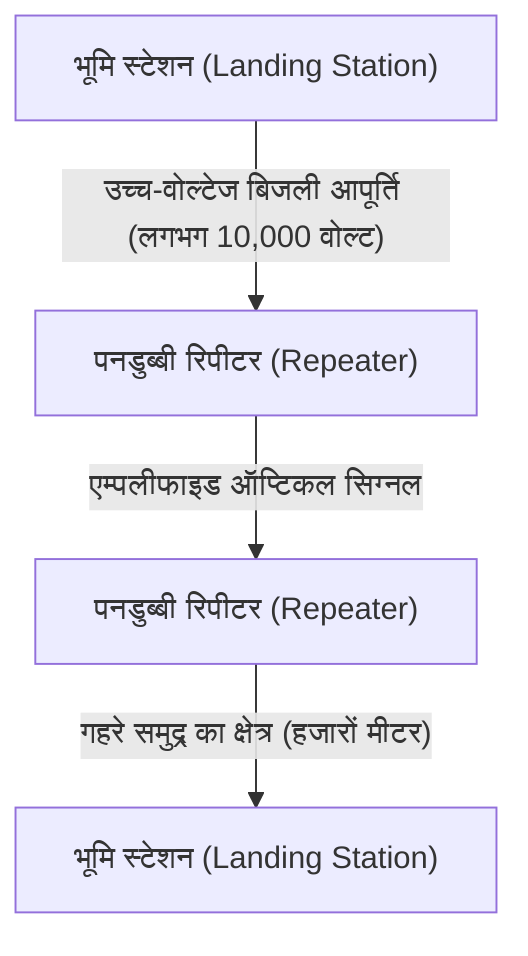

चूंकि अति-निम्न-नुकसान (ultra-low-loss) फाइबर का उपयोग करने पर भी ऑप्टिकल संकेत हर कुछ दसियों किलोमीटर पर क्षीण हो जाते हैं, इसलिए "पनडुब्बी रिपीटर (submarine repeaters)" केबल के साथ समान अंतराल पर डाले जाते हैं। इन रिपीटर्स (जिनमें उपर्युक्त EDFA शामिल है) को गहरे समुद्र में चलाने के लिए आवश्यक बिजली, दोनों सिरों पर भूमि स्टेशनों से केबल के भीतर एक तांबे की ट्यूब के माध्यम से लगातार हजारों वोल्ट से अधिकतम 10,000 वोल्ट तक उच्च वोल्टेज के डायरेक्ट करंट के रूप में आपूर्ति की जाती है।
बिछाने के लिए समर्पित "केबल बिछाने वाले जहाजों" का उपयोग किया जाता है, और उथले पानी में, पानी के नीचे रोबोट (ROV) समुद्र तल में खाइयां खोदते हैं और केबल को दफनाते हैं। यदि केबल कट जाती है, तो एक मरम्मत जहाज घटनास्थल पर पहुंचता है, गहरे समुद्र से एक ग्रैपल (लंगर जैसा पंजा) के साथ केबल के अंत को पकड़ता है, इसे जहाज backward पर खींचता है, और कुशल तकनीशियन एक अत्यंत एनालॉग और जमीनी प्रक्रिया करते हैं, जिसमें कई माइक्रोन की सटीकता के साथ ऑप्टिकल फाइबर को जोड़ना (fusion splicing) शामिल है।

### रेडियो संचार की भौतिकी (वाई-फाई की नींव)
मोबाइल उपकरणों और IoT के प्रसार के साथ, अंतरिक्ष में उड़ने वाली विद्युत चुम्बकीय तरंगों (रेडियो तरंगों) का उपयोग करने वाला संचार भी भौतिक परत का एक प्रमुख युद्धक्षेत्र बन गया है। वाई-फाई (IEEE 802.11 मानक समूह) मुख्य रूप से 2.4GHz और 5GHz बैंड, और हाल ही में जारी 6GHz बैंड (औद्योगिक, वैज्ञानिक और चिकित्सा बैंड, जिनका उपयोग बिना लाइसेंस के किया जा सकता है) के ISM बैंड का उपयोग करता है।

#### QAM (क्वाड्रेचर एम्प्लिट्यूड मॉड्यूलेशन) द्वारा चरम सूचना संपीड़न
एनालॉग तरंगों पर डिजिटल डेटा रखने के लिए "मॉड्यूलेशन" में वाई-फाई अत्यंत उन्नत तकनीक का उपयोग करता है। यही QAM (Quadrature Amplitude Modulation: क्वाड्रेचर एम्प्लिट्यूड मॉड्यूलेशन) है।
रेडियो तरंगों में दो भौतिक मात्राएं होती हैं: "आयाम (Amplitude: तरंग की ऊंचाई)" और "चरण (Phase: तरंग का समय/कोण)"। QAM दो वाहक तरंगों (I सिग्नल और Q सिग्नल) को 90 डिग्री के चरण अंतर के साथ जोड़ता है, और प्रत्येक के आयाम को बदलकर, नक्षत्र मानचित्र (constellation map) पर एक विशिष्ट "बिंदु" पर एक बिट स्ट्रिंग को असाइन करता है।

उदाहरण के लिए, 16-QAM के साथ, 16 बिंदु (4 बिट्स) को तरंग में एक ही परिवर्तन (प्रतीक) के साथ दर्शाया जा सकता है। नवीनतम वाई-फाई 7 (802.11be) में, 4096-QAM का उपयोग किया जाता है, जो एक पागलपन भरा उच्च-घनत्व वाला मॉड्यूलेशन है। यह एक मॉड्यूलेशन के साथ 4096 बिंदु (12 बिट्स) का प्रतिनिधित्व करता है। एक नक्षत्र मानचित्र में जहां 4096 बिंदु एक साथ भीड़भाड़ वाले हैं, प्राप्तकर्ता पक्ष को सूक्ष्म शोर में दबे बिना यह सटीक रूप से निर्धारित करना चाहिए कि कौन सा "बिंदु" भेजा गया था। इसे प्राप्त करने के लिए, उन्नत त्रुटि-सुधार कोड और शक्तिशाली सिग्नल-प्रोसेसिंग प्रोसेसर का उपयोग किया जाता है।

#### OFDM और MIMO: मल्टीपाथ के खिलाफ लड़ाई और अंतरिक्ष का उपयोग
रेडियो तरंगें न केवल सीधी रेखाओं में चलती हैं, बल्कि दीवारों और फर्नीचर से परावर्तित, विवर्तित (diffracted) और बिखरी (scattered) भी होती हैं। इसलिए, ट्रांसमीटर से उत्सर्जित रेडियो तरंगें विभिन्न पथों (मल्टीपाथ) से होकर अलग-अलग समय पर रिसीवर तक पहुंचती हैं, जिससे हस्तक्षेप (Fading) होता है और तरंगरूप नष्ट हो जाता है।
OFDM और MIMO वे प्रौद्योगिकियां हैं जो इसका लाभ उठाती हैं या इसे दूर करती हैं।

**OFDM (ऑर्थोगोनल फ्रीक्वेंसी डिवीजन मल्टीप्लेक्सिंग)** एक ऐसी तकनीक है जो ब्रॉडबैंड उच्च-प्रतिक्रिया (high-response) वाले सिंगल सिग्नल का उपयोग करने के बजाय बैंड को कई बहुत ही संकीर्ण आवृत्तियों (subcarriers) में विभाजित करती है और प्रत्येक पर धीमी गति से समानांतर में डेटा संचारित करती है। चूँकि उप-वाहकों (subcarriers) को "ऑर्थोगोनल (गणितीय रूप से एक-दूसरे के साथ हस्तक्षेप न करने वाले)" होने के लिए व्यवस्थित किया जाता है, इसलिए आवृत्ति उपयोग दक्षता बेहद अधिक होती है, और यह मल्टीपाथ के कारण देरी के बदलावों के प्रति भी प्रतिरोधी है।

**MIMO (Multiple-Input and Multiple-Output)** एक "स्थानिक मल्टीप्लेक्सिंग (spatial multiplexing)" तकनीक है जो एक ही आवृत्ति पर एक साथ विभिन्न डेटा संचारित करने के लिए कई एंटेना का उपयोग करती है। यह इस तथ्य का उपयोग करता है कि तरंगें मल्टीपाथ प्रतिबिंबों के कारण अंतरिक्ष में अलग-अलग स्थानों पर अलग-अलग तरीकों से मिश्रित होती हैं, प्राप्त करने वाले पक्ष पर कई एंटेना द्वारा प्राप्त जटिल संकेतों को अलग करती हैं, जैसे कि एक साथ समीकरणों को हल करना, और एंटेना की संख्या के अनुपात में संचार क्षमता को दोगुना करती हैं। इसके अलावा, **बीमफॉर्मिंग (Beamforming)**, जो एंटेना के बीच रेडियो तरंगों के चरण (phase) को बारीक रूप से समायोजित करके विशिष्ट दिशाओं में रेडियो तरंग बीम को केंद्रित करता है, आधुनिक वाई-फाई के लिए एक अनिवार्य तकनीक बन गया है।

---

## 2.2 डेटा लिंक परत (Data Link Layer): सीधे जुड़े उपकरणों के बीच संवाद और व्यवस्था

यदि भौतिक परत मात्र "सिग्नलों का वाहक" है, तो डेटा लिंक परत एक ऐसी परत है जो कच्चे बिट स्ट्रिंग्स को "फ्रेम" नामक अर्थपूर्ण खंडों (chunks) में बंडल करती है, और एक ही नेटवर्क (लिंक) के भीतर उन्हें सही गंतव्य तक सुरक्षित रूप से पहुंचाने के लिए नियम और यातायात नियंत्रण प्रदान करती है।

### इथरनेट (Ethernet) का इतिहास: ALOHA से प्रेरणा
वर्तमान में, वायर्ड लैन (Wired LAN) का वैश्विक वास्तविक मानक इथरनेट (IEEE 802.3) है।
इसकी जड़ें हवाई विश्वविद्यालय में बनाए गए वायरलेस संचार नेटवर्क "ALOHAnet" में जाती हैं। ALOHAnet ने एक बहुत ही अराजक और महत्वाकांक्षी प्रोटोकॉल अपनाया था: "यदि आप डेटा भेजना चाहते हैं, तो बस इसे भेज दें। यदि यह टकराता है और नष्ट हो जाता है, तो यादृच्छिक समय (random time) तक प्रतीक्षा करें और इसे फिर से भेजें।"

1973 में, ज़ेरॉक्स PARC (Palo Alto Research Center) में बॉब मेटकाफ ने ALOHAnet के विचार को समाक्षीय केबल (coaxial cable) पर संचार के लिए लागू किया और इथरनेट का आविष्कार किया। प्रारंभिक इथरनेट में एक "बस (bus)" टोपोलॉजी थी, जहां कई कंप्यूटर एक वैम्पायर टैप (vampire tap) नामक सुई डालकर एकल, मोटे समाक्षीय केबल (पीला केबल) को साझा करते थे।

#### CSMA/CD: व्यवस्थित अराजकता
चूंकि माध्यम (केबल) को सभी के द्वारा साझा किया जाता है, इसलिए जब कई उपकरण एक ही समय में विद्युत संकेत भेजते हैं, तो तरंगरूप ओवरलैप होते हैं और डेटा नष्ट हो जाता है, जिससे "टकराव (Collision)" होता है। "CSMA/CD (Carrier Sense Multiple Access with Collision Detection)" एक स्वायत्त विकेन्द्रीकृत (autonomous decentralized) एल्गोरिथ्म है जो इससे बचने और इसे हल करने के लिए है।

1. **Carrier Sense (वाहक संवेदन)**: प्रेषण से पहले केबल पर वोल्टेज को मापना और ध्यान से सुनना कि क्या कोई और संवाद तो नहीं कर रहा है।
2. **Multiple Access (बहु पहुंच)**: यदि कोई संवाद नहीं कर रहा है, तो कोई भी केंद्रीय अनुमति की प्रतीक्षा किए बिना स्वतंत्र रूप से संवाद कर सकता है।
3. **Collision Detection (टकराव का पता लगाना)**: प्रेषण के दौरान भी केबल के वोल्टेज की निगरानी करना, और यदि आप अपने स्वयं के प्रेषित संकेत से भिन्न असामान्य वोल्टेज वृद्धि का पता लगाते हैं, तो इसे "टकराव" के रूप में आंका जाता है। तुरंत एक जैम (jam) सिग्नल भेजना, बाकी सभी को टकराव के बारे में सूचित करना, और प्रेषण रोकना।
4. **Backoff (बैकऑफ)**: टकराव के बाद, प्रत्येक नोड यादृच्छिक समय (घातीय बैकऑफ एल्गोरिथ्म द्वारा गणना की गई समय) तक प्रतीक्षा करता है और फिर पुनः प्रेषण का प्रयास करता है।

यह सरल और गैर-केंद्रीकृत तंत्र जो "यह मानता है कि नियमों का उल्लंघन (टकराव) होगा, और यदि ऐसा होता है तो बेतरतीब ढंग से प्रतीक्षा करता है," आईबीएम के टोकन रिंग और एटीएम जैसे जटिल और महंगे प्रोटोकॉल को हराने और इथरनेट को हावी होने का सबसे बड़ा कारण है।

### मैक (MAC) पता: हार्डवेयर की पूर्ण पहचान
डेटा लिंक परत में, MAC पता (Media Access Control address) का उपयोग गंतव्य निर्दिष्ट करने के लिए किया जाता है। यदि आईपी (IP) पता एक "अस्थायी पता" है, तो मैक पता एक "जन्मजात मेरा नंबर" है।

मैक पते की लंबाई 48 बिट (6 बाइट्स) होती है, और इसे कॉलन द्वारा अलग किए गए 2-अंकीय हेक्साडेसिमल संख्याओं (जैसे "00:1A:2B:3C:4D:5E") के रूप में व्यक्त किया जाता है।
- **पहले 24 बिट (OUI: Organizationally Unique Identifier)**: IEEE द्वारा प्रबंधित और असाइन किया गया एक एंटरप्राइज कोड जो नेटवर्क उपकरण विक्रेता (जैसे Apple, Cisco, Intel, आदि) की विशिष्ट रूप से पहचान करता है।
- **अ अंतिम 24 बिट (UAA: Universally Administered Address)**: विक्रेताओं द्वारा उनके उत्पादों को क्रमिक रूप से असाइन किया गया सीरियल नंबर।

सिद्धांत रूप में, दुनिया भर के सभी नेटवर्क उपकरणों के नेटवर्क इंटरफ़ेस कार्ड (NIC) के पास उनके ROM में जलाया गया दुनिया में केवल एक ही विशिष्ट MAC पता होता है।

### फ्रेम संरचना: संचार की पैकिंग तकनीक
डेटा लिंक परत पर, नेटवर्क परत से उतरने वाले डेटा (जैसे आईपी पैकेट) से पहले और बाद में एक हेडर और एक ट्रेलर जोड़ा जाता है, और इसे "फ्रेम" नामक इकाई में इनकैप्सुलेट (encapsulated) किया जाता है। इथरनेट (Ethernet II) फ्रेम की संरचना कलात्मक रूप से परिष्कृत है।

1. **प्रस्तावना (Preamble)**: 7 बाइट्स का "10101010" का निरंतर क्रम। रिसीवर के एनआईसी की घड़ी को सिंक्रोनाइज़ (समय का मिलान) करने के लिए एक वार्म-अप अभ्यास।
2. **SFD (Start Frame Delimiter)**: 1 बाइट का "10101011"। प्रस्तावना का अंत "11" होने से रिसीवर को पता चलता है कि "यहां से असली डेटा शुरू होता है।"
3. **गंतव्य MAC पता (Destination MAC) / स्रोत MAC पता (Source MAC)**: प्रत्येक 6 बाइट्स। संचार किससे किसके लिए है। यदि गंतव्य "FF:FF:FF:FF:FF:FF" है, तो यह सभी के लिए एक ब्रॉडकास्ट (broadcast) फ्रेम होगा।
4. **प्रकार (EtherType)**: 2 बाइट्स। यह इंगित करता है कि पेलोड में कौन सा डेटा है (IPv4 के लिए 0x0800, IPv6 के लिए 0x86DD, ARP के लिए 0x0806)।
5. **पेलोड (Data/Payload)**: ऊपरी परतों से प्राप्त वास्तविक डेटा। आकार 46 बाइट्स से अधिकतम 1500 बाइट्स (MTU: Maximum Transmission Unit) तक होता है।
6. **FCS (Frame Check Sequence)**: 4 बाइट्स का ट्रेलर। एक हैश मान जिसकी गणना CRC-32 (चक्रीय अतिरेक जाँच) नामक बहुपदी का उपयोग करके पूरे फ्रेम (गंतव्य मैक से पेलोड तक) से की जाती है।

प्राप्त करने वाले पक्ष का एनआईसी फ्रेम प्राप्त करते समय हार्डवेयर स्तर पर उच्च गति से CRC की गणना करता है। यदि अंत में संलग्न FCS और उसकी स्वयं की गणना के परिणाम में 1 बिट का भी अंतर है, तो यह मान लेता है कि संचार के दौरान शोर या टकराव के कारण डेटा दूषित हो गया था, और वह फ्रेम **बिना किसी सूचना के बेरहमी से त्याग** दिया जाता है। डेटा लिंक परत मज़बूती से "त्रुटियों का पता लगाने और उन्हें त्यागने" का काम करती है, लेकिन इसमें "यह टूट गया था इसलिए इसे फिर से भेजें" का अनुरोध करने का कार्य नहीं है। इंटरनेट की स्केलेबिलिटी इस भूमिका विभाजन द्वारा समर्थित है, जहां पुनर्संचरण नियंत्रण की भारी जिम्मेदारी उच्च-स्तरीय टीसीपी (TCP) प्रोटोकॉल आदि को सौंप दी जाती है।

### स्विचिंग हब का जन्म और पूर्ण-द्वैध संचार (Full-Duplex Communication) का विकास
CSMA/CD के साथ साझा-बस इथरनेट एक महान प्रणाली थी, लेकिन इसकी एक घातक कमजोरी थी: जैसे-जैसे नेटवर्क से जुड़े उपकरणों (होस्ट) की संख्या बढ़ी, टकराव लगातार होने लगे, और प्रभावी थ्रूपुट (throughput) काफी कम हो गया।
इसे मूल रूप से 1990 के दशक में लोकप्रिय हुए "लेयर 2 स्विच (स्विचिंग हब)" द्वारा हल किया गया था।

हब (रिपीटर हब), भौतिक परत का उपकरण, जो प्राप्त विद्युत संकेतों को बिना किसी शर्त के सभी पोर्ट पर बिखेरता है, उसके विपरीत, एक स्विच के पास डेटा लिंक परत को समझने वाला एक स्मार्ट दिमाग होता है।
स्विच के अंदर मेमोरी (CAM टेबल) का उपयोग करके एक "MAC एड्रेस टेबल" होता है। यह प्रत्येक पोर्ट से जुड़े डिवाइस के स्रोत मैक पते को सीखता है और स्वचालित रूप से पोर्ट और मैक पतों का मिलान करने वाली तालिका बनाता है।
फिर, जब कोई फ्रेम आता है, तो स्विच तालिका के खिलाफ गंतव्य मैक पते की जांच करता है, और फ्रेम को "केवल" उस पोर्ट पर भेजता है (फ़ॉरवर्डिंग) जिससे संबंधित डिवाइस जुड़ा हुआ है।

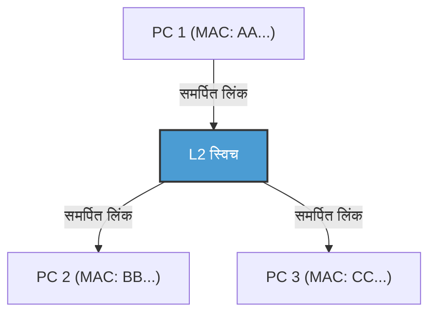

स्विच के परिचय के साथ, प्रत्येक नोड और स्विच के बीच वायरिंग तार्किक और भौतिक रूप से स्वतंत्र (स्टार टोपोलॉजी) हो गई। इसके परिणामस्वरूप, चूँकि संचार पथ अलग हो गए थे, टकराव (collision) सैद्धांतिक रूप से समाप्त हो गए। परिणामस्वरूप, "पूर्ण-द्वैध संचार (Full-Duplex)", जो एक ही समय में प्रेषण के लिए एक लाइन और प्राप्त करने के लिए एक लाइन का उपयोग करता है, संभव हो गया।
आधुनिक इथरनेट में, CSMA/CD एल्गोरिथ्म का अब उपयोग नहीं किया जाता है, और यह एक शुद्ध पॉइंट-टू-पॉइंट फुल-डुप्लेक्स संचार में विकसित हो गया है। इसके अलावा, IEEE 802.1Q पर आधारित VLAN (Virtual LAN) तकनीक के साथ, भौतिक वायरिंग से बंधे बिना तार्किक नेटवर्क को लचीले ढंग से विभाजित और एकीकृत करना संभव हो गया, और यह उद्यमों (enterprises) और विशाल डेटा केंद्रों के बुनियादी ढांचे का समर्थन करने वाली एक पूर्ण नींव तकनीक के रूप में राज करना जारी रखता है।

### वाई-फाई की डेटा लिंक परत: अदृश्य रेडियो स्पेस का यातायात नियंत्रण
जबकि वायर्ड इथरनेट टकराव-मुक्त फुल-डुप्लेक्स संचार में विकसित हुआ है, वायरलेस वाई-फाई को पहले के साझा-बस इथरनेट के समान ही कठिन चुनौती का सामना करना पड़ता है: "हर कोई एक ही स्थान (हवा) के एकल मीडिया को साझा करता है।"

वायरलेस संचार में, प्रेषण के दौरान स्वयं की रेडियो तरंगें इतनी मजबूत होती हैं कि एक ही समय में दूसरों से कमजोर रेडियो तरंगों को प्राप्त करना और टकराव का "पता लगाना (CD)" भौतिक रूप से असंभव है। इसके अलावा, एक विशिष्ट वायरलेस जोखिम है जिसे "छिपी हुई नोड समस्या (Hidden Node Problem)" कहा जाता है - उदाहरण के लिए, टर्मिनल A और C, जो एक्सेस प्वाइंट के विपरीत दिशा में हैं, एक-दूसरे के रेडियो सिग्नल तक नहीं पहुंच सकते हैं, लेकिन यदि वे एक ही समय में प्रेषित करते हैं, तो उनकी रेडियो तरंगें एक्सेस प्वाइंट पर टकराएंगी।

इसलिए, वाई-फाई डेटा लिंक लेयर प्रोटोकॉल (MAC लेयर) "CSMA/CA (Carrier Sense Multiple Access with Collision Avoidance: टकराव परिहार)" को अपनाता है।
CSMA/CA में, अंतरिक्ष में रेडियो तरंग की स्थिति को प्रेषण से पहले एक निश्चित समय (DIFS) के लिए बाधित (intercepted) किया जाता है, और फिर प्रेषण शुरू करने से पहले एक यादृच्छिक बैकऑफ़ समय (random backoff time) की प्रतीक्षा की जाती है। सबसे महत्वपूर्ण अंतर **ACK (Acknowledge: पावती)** तंत्र है जो वायर्ड नेटवर्क में मौजूद नहीं था। वाई-फाई में, डेटा प्राप्त करने वाला पक्ष तुरंत (SIFS नामक एक बहुत ही कम प्रतीक्षा समय के बाद) एक ACK फ्रेम भेजता है जो दर्शाता है कि इसे सफलतापूर्वक प्राप्त कर लिया गया है। प्रेषण पक्ष तय करता है कि संचार केवल तभी सफल होता है जब यह ACK प्राप्त होता है। यदि ACK वापस नहीं किया जाता है, तो यह माना जाता है कि डेटा टकराव या हस्तक्षेप के कारण दूषित हो गया है, बैकऑफ़ समय दोगुना कर दिया जाता है और पुनः संचरण (retransmission) का प्रयास किया जाता है।

इसके अलावा, छिपी हुई नोड समस्या को हल करने के लिए "RTS/CTS हैंडशेक" नामक एक तंत्र भी है। बड़े डेटा भेजने से पहले, भेजने वाला पक्ष एक छोटा नियंत्रण फ्रेम भेजता है जिसे RTS (Request to Send: भेजने का अनुरोध) कहा जाता है, और प्राप्त करने वाला पक्ष (जैसे एक्सेस प्वाइंट) CTS (Clear to Send: भेजने के लिए स्पष्ट) वापस करता है। इस CTS में आरक्षण समय (NAV: Network Allocation Vector) की जानकारी शामिल है, जो कहती है, "मैं अब से XX माइक्रोसेकंड के लिए संचार करूंगा, इसलिए आसपास के टर्मिनलों को चुप रहना चाहिए", और इसे प्राप्त करने वाले आसपास के टर्मिनल संचार से दूर रहते हैं। इस तरह, वाई-फाई की डेटा लिंक परत अदृश्य रेडियो तरंग अंतरिक्ष में यातायात का उत्कृष्ट नियंत्रण करती है।

---

## निष्कर्ष

एक भौतिक घटना की दुनिया जहां प्रकाश फोटॉन के रूप में कांच के माध्यम से दौड़ता है, गहरे समुद्र में पानी के दबाव का सामना करता है, और चरण और आयाम को बदलते हुए अंतरिक्ष में उड़ता है। और, उस शोरपूर्ण और अनिश्चित भौतिक घटना के शीर्ष पर, प्रस्तावना द्वारा सिंक्रोनाइज़ेशन (synchronization), मैक पते द्वारा व्यक्तिगत पहचान, CRC द्वारा सख्त त्रुटि का पता लगाना, और स्विचिंग या CSMA/CA द्वारा परिष्कृत ट्रैफ़िक नियंत्रण, पहली बार "डेटा के एक सार्थक चंक (फ्रेम) को आसन्न उपकरण में बिना किसी त्रुटि के वितरित करना" संभव बनाता है। यह वह चमत्कार है जिसे पहली और दूसरी परतें पूरा कर रही हैं।

हालाँकि, यह अपने आप में एक इंटरनेट नहीं बन सकता जो दुनिया भर को जोड़ता हो। ऐसा इसलिए है क्योंकि मैक पतों के साथ संचार केवल "उसी नेटवर्क (ब्रॉडकास्ट डोमेन)" के संकीर्ण गांव में मान्य है जो उसी स्विच या एक्सेस प्वाइंट से जुड़ा है, या राउटर द्वारा अवरुद्ध होने तक।

अगले अध्याय, "अध्याय 3: नेटवर्क परत और आईपी" में, हम आईपी (Internet Protocol) और रूटिंग के सार का पता लगाएंगे, जो इन अनगिनत स्थानीय गांवों को जोड़ने और बाल्टी ब्रिगेड की तरह दुनिया के दूसरी तरफ अज्ञात नेटवर्क पर पैकेट वितरित करने के लिए एक शानदार मार्ग खोज तंत्र है।
# अध्याय 3: नेटवर्क लेयर और रूटिंग तंत्र —— विशाल महासागर के पार पैकेट का नेविगेशन चार्ट

हम हर दिन जिस इंटरनेट का उपयोग करते हैं, उसका आधार OSI संदर्भ मॉडल की तीसरी लेयर है, जिसे "नेटवर्क लेयर" कहा जाता है। भौतिक केबलों या रेडियो तरंगों (डेटा लिंक लेयर) के माध्यम से सीधे संचार से परे, हजारों किलोमीटर दूर स्थित सर्वरों के साथ वैश्विक स्तर पर संचार कर पाने के पीछे, अनगिनत राउटर्स का जाल और उनके स्वायत्त रूप से सूचनाओं का आदान-प्रदान करने वाला एक शानदार मार्ग नियंत्रण (रूटिंग) तंत्र मौजूद है।

इस अध्याय में, IP (Internet Protocol) की संरचना से लेकर, IPv4 की सीमाओं और IPv6 के आर्किटेक्चर तक, और दुनिया भर के स्वायत्त प्रणालियों (AS) को जोड़ने वाले BGP (Border Gateway Protocol) की गहराई तक, पैकेट के अपने गंतव्य तक पहुंचने की "नेविगेशन तकनीक" के बारे में तकनीकी, ऐतिहासिक और भौतिक दृष्टिकोण से अत्यधिक विस्तार से चर्चा की गई है।

## 3.1 नेटवर्क लेयर का पैराडाइम: एंड-टू-एंड का सिद्धांत

इंटरनेट के डिज़ाइन दर्शन में सबसे बड़ी सफलता **एंड-टू-एंड (End-to-End) का सिद्धांत** है, जो कहता है कि "नेटवर्क के मध्यवर्ती नोड्स (राउटर्स) को केवल साधारण पैकेट फ़ॉरवर्डिंग पर ध्यान केंद्रित करना चाहिए, और जटिल प्रसंस्करण (जैसे त्रुटि सुधार और क्रम की गारंटी) टर्मिनल्स (एंड होस्ट) पर किया जाना चाहिए।"

पारंपरिक टेलीफोन नेटवर्क (सर्किट स्विचिंग पद्धति) में, संचार की शुरुआत से अंत तक एक भौतिक सर्किट पर कब्ज़ा रहता था, और पूरे नेटवर्क की स्थिति (स्टेट) प्रबंधित की जाती थी। इसके विपरीत, इंटरनेट (पैकेट स्विचिंग पद्धति) की नेटवर्क लेयर "कनेक्शनलेस" होती है और इसका कोई स्टेट नहीं होता है। प्रत्येक पैकेट को एक स्वतंत्र "पत्र" के रूप में माना जाता है, और राउटर इसे प्राप्त करते हैं, गंतव्य देखते हैं, और इसे सबसे अच्छे अगले रिले पॉइंट (नेक्स्ट हॉप) पर भेज (फ़ॉरवर्डिंग) देते हैं, इसी सरल कार्य को दोहराते हुए। "डंब नेटवर्क" (Dumb Network) और "स्मार्ट टर्मिनल" (Smart Terminal) का यह संयोजन ही वह सबसे बड़ा कारण है कि इंटरनेट इतनी तेज़ी से फ़ैल सका और विविध प्रकार के एप्लिकेशन को स्वीकार कर सका।

## 3.2 इंटरनेट का पता: IP एड्रेस का विकास और समाप्ति का इतिहास

नेटवर्क पर सभी उपकरणों को एक विशिष्ट पहचानकर्ता दिया जाता है जिसे IP एड्रेस कहते हैं। वर्तमान में, इंटरनेट संक्रमण के दौर से गुजर रहा है, और IP प्रोटोकॉल की दो पीढ़ियाँ एक साथ मौजूद हैं।

### IPv4: 32-बिट स्पेस और समाप्ति का विरोध

1981 में RFC 791 द्वारा परिभाषित IPv4 में 32-बिट (लगभग 4.3 बिलियन) स्पेस होता है। डिज़ाइन के समय, 4.3 बिलियन की संख्या अविश्वसनीय रूप से बड़ी लगती थी, लेकिन इंटरनेट के अत्यधिक प्रसार के कारण, 1990 के दशक में ही इसके खत्म होने के संकट की आवाज़ें उठने लगीं।

इस संकट से उबरने के लिए **CIDR (Classless Inter-Domain Routing)** और **NAT (Network Address Translation)** को विकसित किया गया।
शुरुआती IP एड्रेस का आवंटन एक व्यापक "क्लासफुल" पद्धति से किया गया था, जैसे क्लास A (/8), क्लास B (/16), और क्लास C (/24), जिससे एड्रेस की भारी बर्बादी हुई। CIDR ने इसे वेरिएबल लेंथ सबनेट मास्क (VLSM) से बदल दिया, और एक "क्लासलेस" रूटिंग को साकार किया जो केवल आवश्यक मात्रा में एड्रेस आवंटित करता है।
इसके अलावा, NAT की शुरुआत के साथ, एक प्राइवेट IPv4 एड्रेस स्पेस और एक सिंगल ग्लोबल IPv4 एड्रेस को जोड़कर, हजारों उपकरणों द्वारा एक ही एड्रेस साझा करना संभव हो गया। हालाँकि, NAT ने एंड-टू-एंड सिद्धांत को नष्ट कर दिया और P2P संचार व रियल-टाइम संचार के लिए जटिल NAT ट्रैवर्सल (जैसे STUN/TURN/ICE) तकनीकों की आवश्यकता को जन्म दिया।

### IPv6: 128-बिट का असीमित स्पेस और अगली पीढ़ी का हेडर ढांचा

एड्रेस समाप्ति के मूल समाधान के रूप में, 1998 में RFC 2460 द्वारा **IPv6** तैयार किया गया था। IPv6 में 128-बिट का एड्रेस स्पेस होता है, जो $2^{128}$ (लगभग 340 अनडेसिलियन) एड्रेस प्रदान करता है—इतनी विशाल जगह कि यदि पृथ्वी पर रेत के हर कण को एक एड्रेस दिया जाए, तब भी कुछ बच जाएंगे।

IPv6 का नवाचार केवल एड्रेस की लंबाई तक ही सीमित नहीं है। इसमें हेडर ढांचे का नाटकीय रूप से सरलीकरण किया गया है। IPv4 हेडर में मौजूद वेरिएबल-लेंथ ऑप्शंस और हेडर चेकसम को हटा दिया गया, और मूल हेडर को 40 बाइट्स पर फिक्स कर दिया गया। इसने हार्डवेयर (ASIC और TCAM) में पैकेट प्रोसेसिंग (रूटिंग) को तेज़ कर दिया है। साथ ही, विखंडन (पैकेट का टूटना) मध्यवर्ती राउटर्स द्वारा नहीं किया जाता है, बल्कि केवल भेजने वाले होस्ट द्वारा किया जाता है, जिससे राउटर्स का लोड काफी कम हो गया है।

## 3.3 रूटिंग की दोहरी प्रकृति: कंट्रोल प्लेन और डेटा प्लेन

राउटर का आंतरिक भाग मुख्य रूप से दो "प्लेन्स" (Planes) में बंटा होता है।

1. **कंट्रोल प्लेन (नियंत्रण प्लेन)**
   यह वह मस्तिष्क वाला हिस्सा है जहां राउटर्स एक-दूसरे के साथ रूटिंग प्रोटोकॉल (जैसे OSPF और BGP) का उपयोग करके संवाद करते हैं, नेटवर्क टोपोलॉजी (कनेक्शन कॉन्फ़िगरेशन) सीखते हैं, और सबसे इष्टतम मार्ग की गणना करते हैं। गणना के परिणाम RIB (Routing Information Base) नामक डेटाबेस में संग्रहीत किए जाते हैं।
2. **डेटा प्लेन (फ़ॉरवर्डिंग प्लेन)**
   यह वह मांसपेशियों वाला हिस्सा है जो वास्तव में पैकेट प्राप्त करता है, गंतव्य IP एड्रेस के आधार पर अगला इंटरफ़ेस तय करता है जहाँ पैकेट भेजना है, और इसे फ़ॉरवर्ड करता है। यह RIB से जनरेट किए गए FIB (Forwarding Information Base) नामक फ़ॉरवर्डिंग-विशिष्ट टेबल का उपयोग करता है, और नैनोसेकंड-स्तर के हार्डवेयर वायर-स्पीड पर पैकेट को ट्रांसफर करने के लिए TCAM (Ternary Content-Addressable Memory) जैसी विशेष मेमोरी का उपयोग करता है।

## 3.4 नेटवर्क का आंतरिक शासन: IGP और स्वायत्त प्रणालियां (AS)

इंटरनेट कोई एक विशाल नेटवर्क नहीं है, बल्कि यह ISP (इंटरनेट सेवा प्रदाता), कंपनियों, विश्वविद्यालयों आदि द्वारा प्रबंधित स्वतंत्र नेटवर्कों का एक संग्रह है। इस स्वतंत्र प्रबंधकीय क्षेत्र को **AS (Autonomous System: स्वायत्त प्रणाली)** कहा जाता है। वर्तमान में, दुनिया भर में 100,000 से अधिक AS मौजूद हैं।

AS के भीतर (किसी कंपनी या ISP बैकबोन के अंदर) रूटिंग के लिए **IGP (Interior Gateway Protocol)** का उपयोग किया जाता है। दो प्रमुख IGP निम्नलिखित हैं:

- **OSPF (Open Shortest Path First) / IS-IS**
  ये "लिंक-स्टेट प्रकार" के रूटिंग प्रोटोकॉल हैं। राउटर अपने आस-पास के कनेक्शन की स्थिति (लिंक बैंडविड्थ और स्थिति) को पूरे नेटवर्क में फ्लड करता है, और प्रत्येक राउटर पूरे नेटवर्क का एक पूरा नक्शा (टोपोलॉजी डेटाबेस) बनाता है। उस नक्शे पर, यह गंतव्य तक पहुंचने के लिए सबसे कम "लागत" वाले मार्ग की गणना करने के लिए दिज्क्स्ट्रा (Dijkstra) एल्गोरिथ्म (सबसे छोटा मार्ग एल्गोरिथ्म) चलाता है। यह भौतिक और गणितीय रूप से कार नेविगेशन सिस्टम द्वारा ट्रैफिक जाम की जानकारी को ध्यान में रखकर सबसे छोटे मार्ग की गणना करने के तरीके के समान है।

## 3.5 BGP: इंटरनेट को बुनने वाला "कूटनीतिक" प्रोटोकॉल

जहां एक ओर AS के अंदर OSPF आदि का शासन होता है, वहीं AS को AS से जोड़ने और वैश्विक इंटरनेट बनाने का काम **EGP (Exterior Gateway Protocol)** के एकमात्र वास्तविक मानक **BGP (Border Gateway Protocol)** का है। BGP एक अत्यंत विशिष्ट प्रोटोकॉल है जो मार्ग निर्धारित करने के लिए न केवल तकनीकी रूप से सबसे कम दूरी पर विचार करता है, बल्कि "व्यावसायिक संबंधों" और "राष्ट्रीय नीतियों" को भी दर्शाता है।

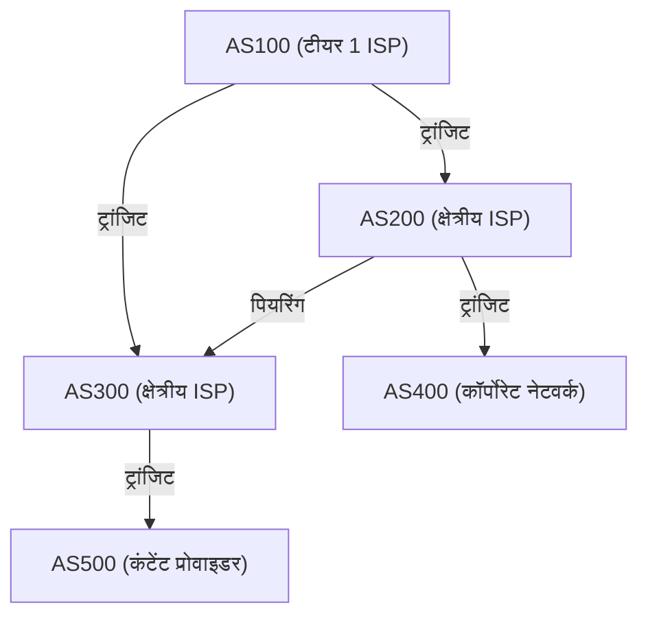

### पियरिंग और ट्रांजिट: इंटरनेट का अर्थशास्त्र

BGP के माध्यम से AS के बीच कनेक्शन के लिए मुख्य रूप से दो व्यापारिक मॉडल होते हैं:

1. **ट्रांजिट (Transit)**
   यह एक ऐसा संबंध है जहाँ छोटे ISP या कंपनियाँ एक बड़े ISP को इंटरनेट पर हर जगह (पूर्ण मार्ग) तक पहुँच प्रदान करने के लिए संचार शुल्क का भुगतान करती हैं। यह एक "ग्राहक" और "प्रदाता" के बीच एक मास्टर-स्लेव संबंध है।
2. **पियरिंग (Peering)**
   यह एक ऐसा संबंध है जहाँ ISP आपस में, या एक ISP और एक कंटेंट प्रोवाइडर (जैसे Google या Netflix), IX (इंटरनेट एक्सचेंज) आदि के माध्यम से सीधे एक-दूसरे के नेटवर्क को जोड़ते हैं। यह आमतौर पर बिना किसी शुल्क (सेटलमेंट-फ्री) के किया जाता है, जिसका उद्देश्य ट्रैफ़िक के लिए शॉर्टकट प्रदान करना और लागत कम करना है।

### पाथ वेक्टर और BGP का मार्ग चयन एल्गोरिथ्म

BGP एक "पाथ वेक्टर" प्रकार का प्रोटोकॉल है। एक विशिष्ट IP नेटवर्क तक पहुंचने के लिए, यह एक विशेषता के रूप में बनाए रखता है कि यह किन AS से होकर गुजरा है (AS_PATH)। उदाहरण के लिए, यदि मार्ग की जानकारी `AS_PATH: [200, 100, 500]` है, तो पैकेट उसी क्रम में AS से गुजरेंगे। यह विश्वसनीय रूप से रूटिंग लूप को रोकता है।

जब एक BGP राउटर एक ही गंतव्य के लिए कई मार्ग प्राप्त करता है, तो यह जटिल प्राथमिकताओं (स्थानीय प्राथमिकता (Local Preference), AS_PATH की लंबाई, MED, eBGP/iBGP भेद आदि) के आधार पर केवल एक सबसे अच्छे मार्ग (बेस्ट पाथ) का चयन करता है। विशेष रूप से **Local Preference (स्थानीय प्राथमिकता)** विशेषता बहुत शक्तिशाली है; यह राउटर्स पर व्यापारिक नीतियों को लागू कर सकती है, जैसे "भले ही तकनीकी रूप से यह लंबा रास्ता हो, लेकिन पियरिंग लाइन के माध्यम से जाने पर ट्रांजिट लागत नहीं लगती है, इसलिए इसे प्राथमिकता दी जानी चाहिए।"

### BGP हाईजैक और मार्ग की भेद्यता

BGP मूल रूप से "अंतर्निहित अच्छाई के सिद्धांत" (性善説) पर डिज़ाइन किया गया था। चूँकि यह मानता है कि "दूसरों द्वारा घोषित मार्ग की जानकारी सही है," अगर कोई दुर्भावनापूर्ण या गलत कॉन्फ़िगर किया गया AS गलत BGP अपडेट भेजता है कि "मेरे पास Google के नेटवर्क (8.8.8.8/32) के लिए सबसे अच्छा मार्ग है," तो दुनिया भर का ट्रैफ़िक उस AS में खिंच जाता है, जिसके परिणामस्वरूप **BGP हाईजैक** होता है।
इतिहास में, BGP की भेद्यता का शोषण करने वाली बड़े पैमाने की विफलताओं के कई उदाहरण हैं, जैसे 2008 की घटना जहाँ पाकिस्तान सरकार द्वारा YouTube को ब्लॉक करने के प्रयास के परिणामस्वरूप दुनिया भर में YouTube डाउन हो गया था। वर्तमान में, RPKI (Resource Public Key Infrastructure) जैसे क्रिप्टोग्राफ़िक तकनीकों का उपयोग करके मार्ग की जानकारी के सत्यापन तंत्र को पेश करने का काम चल रहा है।

## 3.6 भौतिक बाधाएं और राउटर का संघर्ष: लेटेंसी और बफ़रब्लोट

नेटवर्क लेयर की रूटिंग हमेशा भौतिकी की बाधाओं के साथ संघर्ष है।
ऑप्टिकल फाइबर के माध्यम से प्रकाश की गति निर्वात में प्रकाश की गति का लगभग 67% (लगभग 200,000 किमी/सेकंड) होती है, इसलिए जापान से अमेरिका के पश्चिमी तट तक आने-जाने (RTT) में लगभग 100-120 मिलीसेकंड की भौतिक देरी (प्रसार देरी) अपरिहार्य है।

इसके अलावा, प्रत्येक राउटर पर प्रोसेसिंग में देरी, और **कतारबद्ध देरी (Queueing Delay)** होती है। नेटवर्क भीड़ के दौरान, राउटर अस्थायी रूप से मेमोरी (बफ़र) में पैकेट जमा करते हैं। चूँकि हाल के राउटर्स बड़ी क्षमता वाली मेमोरी से लैस होते हैं, इसलिए एक ऐसी घटना होती है जहाँ वे पैकेट गिराए बिना लंबी भीड़ को अवशोषित करना जारी रखते हैं। इसे **बफ़रब्लोट (Bufferbloat)** कहा जाता है। बड़ी संख्या में पैकेट बफ़र में फंसे रहने से, TCP जैसी ऊपरी लेयर का भीड़ नियंत्रण ठीक से काम नहीं करता है, जिसके परिणामस्वरूप अत्यधिक देरी (हजारों मिलीसेकंड) होती है। इसे हल करने के लिए, आधुनिक राउटर्स और OS में AQM (Active Queue Management) और FQ-CoDel जैसे उन्नत कतार प्रबंधन एल्गोरिदम लागू किए गए हैं।

## निष्कर्ष

लेयर 3 (नेटवर्क लेयर) केवल डेटा ले जाने वाला वाहक नहीं है। यह IPv4 से IPv6 में ऐतिहासिक संक्रमण, TCAM का उपयोग करके नैनोसेकंड हार्डवेयर प्रोसेसिंग, OSPF के माध्यम से गणितीय सबसे छोटे मार्ग की खोज, और BGP के माध्यम से आर्थिक और राजनीतिक इरादों से भरे स्वायत्त विकेंद्रीकृत मार्ग नियंत्रण का एक जटिल रूप से बुना हुआ जाल है।
आपके स्मार्टफोन से पृथ्वी के दूसरी ओर स्थित सर्वर तक पहुंचने वाले एक एकल IP पैकेट के पीछे मानव जाति द्वारा बनाई गई सबसे बड़ी और सबसे जटिल प्रणाली का काम होता है, जहाँ अनगिनत राउटर तुरंत अपने स्वयं के नक्शे (रूटिंग टेबल) का संदर्भ लेते हैं और रिले बेटन की तरह पैकेट पास करना जारी रखते हैं।

अगले अध्याय में, हम "ट्रांसपोर्ट लेयर (TCP/UDP)" के तंत्र की व्याख्या करेंगे, जो इस नेटवर्क लेयर के ऊपर बना है और पैकेट डिलीवरी की गारंटी और भीड़ नियंत्रण के लिए जिम्मेदार है।
# अध्याय 4: ट्रांसपोर्ट लेयर की विश्वसनीयता और गति —— सूचना संचार को आधार देने वाली परम दुविधा

## 1. प्रस्तावना: एंड-टू-एंड सिद्धांत और ट्रांसपोर्ट लेयर का मिशन

पिछले अध्यायों में हमने देखा कि नेटवर्क लेयर (IP) का मुख्य कार्य, इंटरनेट रूपी विशाल नेटवर्क के समुद्र को पार करके, पैकेटों को "लक्ष्य कंप्यूटर (होस्ट के नेटवर्क इंटरफेस)" तक भौतिक और तार्किक रूप से पहुंचाना था। लेकिन, पैकेटों का केवल लक्ष्य होस्ट तक पहुंच जाना ही संचार को पूर्ण नहीं करता है। आधुनिक कंप्यूटर सिस्टम OS पर एक साथ कई एप्लिकेशन प्रोसेस (वेब ब्राउज़र, ईमेल क्लाइंट, वीडियो स्ट्रीमिंग ऐप, बैकग्राउंड सिंक प्रोसेस, API सेवा आदि) को मल्टीटास्किंग के साथ समानांतर रूप से चलाते हैं।

IP लेयर से अव्यवस्थित रूप से एक के बाद एक आने वाले पैकेटों के ढेर से, यह पहचानना कि कौन सा पैकेट किस एप्लिकेशन से संबंधित है, उन्हें एक सार्थक डेटा स्ट्रीम के रूप में फिर से बनाना, या यदि कोई कमी है तो उसे पूरा करना, इस एंडपॉइंट पर अंतिम डेटा प्रबंधन का पूरा अधिकार "ट्रांसपोर्ट लेयर (Transport Layer)" वहन करता है।

इंटरनेट की डिजाइन विचारधारा के मूल में "एंड-टू-एंड सिद्धांत (End-to-End Principle)" नामक एक अत्यंत सुंदर और शक्तिशाली आर्किटेक्चरल निर्णय मौजूद है। यह 1981 में जेरोम साल्ट्ज़र और अन्य लोगों द्वारा प्रस्तावित अवधारणा है, और यह सिद्धांत कहता है कि "नेटवर्क के मध्यवर्ती नोड्स (राउटर और स्विच) को यथासंभव सरल पैकेट ट्रांसफर (डंब नेटवर्क) में विशेषज्ञ होना चाहिए, और त्रुटि सुधार, अनुक्रम नियंत्रण, और एन्क्रिप्शन जैसी जटिल प्रक्रियाओं को संचार के अंतिम छोर पर मौजूद होस्ट (स्मार्ट एंडपॉइंट) पर छोड़ दिया जाना चाहिए।" यदि नेटवर्क के मध्यवर्ती उपकरणों को जटिल स्थिति प्रबंधन और त्रुटि सुधार कार्यों के साथ रखा गया होता, तो इंटरनेट कभी भी आज की तरह वैश्विक स्तर की विस्फोटक मापनीयता (scalability) प्राप्त नहीं कर पाता।

ट्रांसपोर्ट लेयर हमेशा भौतिक विज्ञान की बाधाओं और सूचना सिद्धांत के बीच एक मूलभूत दुविधा का सामना करती है। वह है "विश्वसनीयता (Reliability)" और "गति (Speed / Low Latency)" के बीच का ट्रेड-ऑफ़। जानकारी को बिना कोई हिस्सा खोए पहुंचाने के लिए पुष्टि और पुनर्प्रेषण (retransmission) के ओवरहेड की आवश्यकता होती है, जो प्रकाश की गति की भौतिक सीमा के साथ जुड़ी देरी (latency) का कारण बनता है। वहीं, देरी को कम करने का प्रयास करने पर, जानकारी की पूर्णता का कुछ हिस्सा त्यागना ही पड़ता है। इस भौतिक नियमों में निहित दुविधा को कैसे हल किया जाए, और एप्लिकेशन को किस प्रकार का एब्स्ट्रेक्शन प्रदान किया जाए, इसके आधार पर, TCP, UDP, और आधुनिक QUIC जैसे अलग-अलग प्रोटोकॉल डिज़ाइन और विकसित किए गए हैं।

## 2. TCP (Transmission Control Protocol): विश्वसनीयता सुनिश्चित करने वाला एक मजबूत तंत्र

TCP की नींव 1970 के दशक में, जब इंटरनेट को अभी भी ARPANET कहा जाता था और इसका व्यवसायीकरण नहीं हुआ था, विंटन सर्फ (Vinton Cerf) और रॉबर्ट कान (Robert Kahn) द्वारा रखी गई थी। इसका डिज़ाइन दर्शन अत्यंत स्पष्ट है: "किसी भी खराब नेटवर्क वातावरण में, यहां तक कि बार-बार पैकेट लॉस होने वाली अस्थिर लाइनों में भी, यह गारंटी देना कि डेटा बिना किसी नुकसान के, सही क्रम में, और बिना दोहराव के गंतव्य एप्लिकेशन तक पहुंचेगा।" जब तक एप्लिकेशन डेवलपर्स TCP का उपयोग करते हैं, उन्हें पृष्ठभूमि में नेटवर्क की जटिलता या पैकेटों के खोने के बारे में चिंता करने की बिल्कुल आवश्यकता नहीं होती है; उन्हें बस डेटा को "निरंतर बाइट स्ट्रीम (continuous byte stream)" के रूप में पढ़ना और लिखना होता है, इस प्रकार यह एक शक्तिशाली एब्स्ट्रेक्शन प्रदान करता है।

### पोर्ट नंबर द्वारा मल्टीप्लेक्सिंग (Multiplexing)
यदि IP एड्रेस "पृथ्वी पर कौन सी इमारत" दर्शाने वाला पता है, तो ट्रांसपोर्ट लेयर का "पोर्ट नंबर" "उस इमारत का कौन सा कमरा (कौन सी प्रोसेस)" दर्शाने वाली तार्किक खिड़की के बराबर है। पोर्ट नंबर को 16-बिट अनसाइन्ड (unsigned) पूर्णांक द्वारा दर्शाया जाता है, और इसका मान 0 से 65535 तक होता है।
इसके द्वारा, एकल IP पते और एकल भौतिक नेटवर्क इंटरफ़ेस पर एक ही समय में हजारों से दसियों हजार अलग-अलग संचारों को मल्टीप्लेक्स करना संभव हो जाता है। उदाहरण के लिए, HTTP 80, HTTPS 443, और SSH 22 है, इसी प्रकार प्रमुख सेवाओं को पहले से ही "वेल-नोन पोर्ट्स (Well-Known Ports)" के रूप में नंबर आवंटित किए गए हैं।

### 3-वे हैंडशेक: विश्वास की स्थापना और भौतिक देरी
TCP संचार शुरू करने से पहले, हमेशा प्रेषक और प्राप्तकर्ता के बीच एक तार्किक "कनेक्शन (connection)" स्थापित करने के लिए एक रस्म निभाता है। यही "3-वे हैंडशेक (3-Way Handshake)" है। यह केवल संचार के इरादे की पुष्टि नहीं करता है, बल्कि शुरू होने वाले विशाल डेटा के आदान-प्रदान के लिए स्थिति स्थान के सिंक्रनाइज़ेशन (Synchronization) के रूप में एक अत्यंत महत्वपूर्ण अर्थ रखता है।

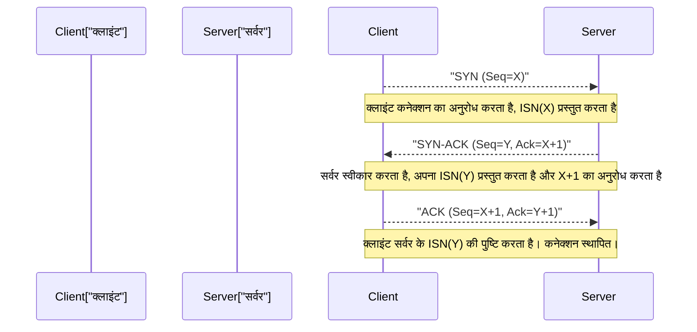

1. **SYN (Synchronize):** क्लाइंट सर्वर को एक सिंक्रनाइज़ेशन अनुरोध पैकेट (SYN फ्लैग सेट के साथ TCP सेगमेंट) भेजता है। इस समय, यह बेतरतीब ढंग से उत्पन्न 32-बिट "प्रारंभिक अनुक्रम संख्या (ISN: Initial Sequence Number, जिसे यहां X माना गया है)" प्रस्तुत करता है। ISN को शून्य या निश्चित मान से शुरू न करने का एक कारण है। अतीत में स्थापित और पहले से ही कटे हुए समान IP और पोर्ट के बीच संचार में, "नेटवर्क पर खोए हुए और देर से आने वाले पुराने पैकेट (घोस्ट पैकेट)" को नए संचार पैकेट समझने से रोकना, और हमलावर द्वारा अनुक्रम संख्या का अनुमान लगाकर नकली डेटा डालने वाले TCP अनुक्रम भविष्यवाणी हमले (IP स्पूफिंग) को रोकने का क्रिप्टोग्राफ़िक अर्थ है।
2. **SYN-ACK:** जब सर्वर कनेक्शन अनुरोध स्वीकार करता है, तो यह क्लाइंट के ISN में 1 जोड़कर (X+1) उसे "पावती संख्या (Acknowledgment Number)" के रूप में वापस करता है, और सर्वर की अपनी यादृच्छिक प्रारंभिक अनुक्रम संख्या (Y) के साथ एक SYN-ACK पैकेट भेजता है।
3. **ACK (Acknowledgment):** क्लाइंट, सर्वर का ISN सही ढंग से प्राप्त करने के प्रमाण के रूप में, Y+1 पावती संख्या के साथ एक ACK पैकेट भेजता है।

जब इन 3 पैकेटों का आदान-प्रदान पूरा हो जाता है, तो मेमोरी में द्विदिश (bidirectional) संचार स्थिति सुरक्षित हो जाती है, और डेटा स्थानांतरण की तैयारी पूरी हो जाती है। हालाँकि, इस सख्त प्रक्रिया पर संचार बुनियादी ढांचे की भौतिक सीमा भारी पड़ती है। वह है "प्रकाश की गति"।
निर्वात में प्रकाश की गति लगभग 300,000 किमी/सेकंड है, लेकिन इंटरनेट के मुख्य बैकबोन, ऑप्टिकल फाइबर के कोर (क्वार्ट्ज ग्लास) के अपवर्तक सूचकांक के कारण, प्रकाश संकेत की प्रसार गति लगभग दो-तिहाई (लगभग 200,000 किमी/सेकंड) तक गिर जाती है। इसके अलावा, रास्ते में राउटर पर रूटिंग प्रोसेसिंग और स्विचिंग के कारण कतारबद्ध होने (queuing) की देरी जुड़ जाती है। परिणामस्वरूप, उदाहरण के लिए टोक्यो और न्यूयॉर्क (सीधी दूरी लगभग 11,000 किमी, वास्तविक केबल की लंबाई इससे अधिक) के बीच एक राउंड ट्रिप टाइम (1 RTT) के लिए भौतिक रूप से कम से कम 150 से 200 मिलीसेकंड लगते हैं। TCP का 3-वे हैंडशेक कम से कम इस 1 RTT का उपभोग करता है, इसलिए चाहे आप बैंडविड्थ को कितना भी बढ़ा लें, कनेक्शन स्थापना के समय की लेटेंसी (देरी) प्रकाश की गति के सार्वभौमिक निरपेक्ष नियम द्वारा सीमित है।

### स्लाइडिंग विंडो और अनुक्रम नियंत्रण, चेकसम
डेटा ट्रांसफर चरण में प्रवेश करने पर, TCP एप्लिकेशन से प्राप्त बाइट स्ट्रीम को उपयुक्त आकार (MSS: Maximum Segment Size, आमतौर पर IP के MTU से हेडर आकार घटाकर लगभग 1460 बाइट्स) के सेगमेंट में विभाजित करता है और भेजता है। प्रत्येक सेगमेंट को डेटा बाइट्स की संख्या के आधार पर एक अनुक्रम संख्या दी जाती है, और इसके आधार पर, यदि पैकेट क्रम से बाहर (आउट-ऑफ़-ऑर्डर) भी पहुँचते हैं, तो प्राप्तकर्ता मूल डेटा को सही क्रम में फिर से व्यवस्थित करता है।

इसके अलावा, TCP हेडर में 16-बिट "चेकसम (Checksum)" शामिल होता है, जो 1's कॉम्प्लिमेंट (1's complement) योग गणना का उपयोग करके सख्ती से सत्यापित करता है कि ट्रांसमिशन पथ पर विद्युत शोर या राउटर की मेमोरी त्रुटि के कारण डेटा के बिट्स उलट (क्षतिग्रस्त) तो नहीं हुए हैं।

यदि कोई पैकेट रास्ते में खो जाता है (पैकेट लॉस) या क्षतिग्रस्त होने के कारण छोड़ दिया जाता है, तो प्राप्तकर्ता अपेक्षित अनुक्रम संख्या का ACK भेजना जारी रखता है (डुप्लिकेट ACK) या कुछ नहीं भेजता। यदि एक निश्चित समय (RTO: Retransmission Timeout) के लिए ACK वापस नहीं आता है या डुप्लिकेट ACK का पता चलता है, तो प्रेषक उस पैकेट को "पुनर्प्रेषित (Retransmit)" करता है।

इस तंत्र में जो संचार की गति को नाटकीय रूप से बढ़ाता है वह है "स्लाइडिंग विंडो (Sliding Window)" की अवधारणा। "एक पैकेट भेजना और उसके ACK प्राप्त होने तक अगला पैकेट नहीं भेजना (Stop-and-Wait)" पद्धति में, उपर्युक्त उच्च लेटेंसी वातावरण (बड़े RTT वाले वातावरण) में थ्रूपुट निराशाजनक रूप से कम हो जाता है।
स्लाइडिंग विंडो विधि में, प्रेषक और प्राप्तकर्ता एक दूसरे की बफर क्षमता पर विचार करते हैं और गतिशील रूप से "विंडो आकार (एक बार में भेजे जा सकने वाले अपुष्ट डेटा की अधिकतम बाइट संख्या)" पर सहमत होते हैं। प्रेषक, प्राप्तकर्ता से ACK की प्रतीक्षा किए बिना, इस विंडो आकार की सीमा के भीतर नेटवर्क में लगातार एक के बाद एक पैकेट भेज सकता है। और हर बार जब इसे ACK प्राप्त होता है, तो यह ट्रांसमिशन विंडो (विंडो) आगे की ओर स्लाइड करती है। इसके द्वारा, मोटे कनेक्शन और उच्च लेटेंसी वाले नेटवर्क (BDP: Bandwidth-Delay Product बड़ा होने वाले वातावरण) में, "पाइप को डेटा से भरे रखना" बैंडविड्थ के अधिकतम उपयोग का तंत्र महसूस किया जाता है।

### कंजेशन कंट्रोल (Congestion Control): नेटवर्क पतन को रोकने वाला गणितीय सामंजस्य
TCP की असली उत्कृष्ट कृति, जिसे इंटरनेट के इतिहास में सबसे महत्वपूर्ण तकनीकी सफलताओं में से एक कहा जा सकता है, वह है "कंजेशन कंट्रोल (Congestion Control)"।

1986 में, शुरुआती इंटरनेट (NSFNET) को ट्रैफ़िक में वृद्धि के कारण "कंजेशन कोलैप्स (Congestion Collapse)" नामक घातक सिस्टम विफलता का सामना करना पड़ा। नेटवर्क की प्रोसेसिंग क्षमता से अधिक डेटा आने के परिणामस्वरूप, राउटर की कतारें (बफर मेमोरी) भर गईं और बड़ी संख्या में पैकेट छोड़ दिए गए। पैकेट लॉस का पता चलने पर, TCP एंडपॉइंट्स ने यह मान लिया कि डेटा नहीं पहुंचा है और एक साथ पैकेटों का "पुनर्प्रेषण (retransmission)" किया। इसने नेटवर्क में और भी अधिक डेटा डाल दिया, राउटर्स को और भी अधिक जाम कर दिया, और एक विनाशकारी दुष्चक्र में फंस गया जहां प्रभावी थ्रूपुट पहले की तुलना में हजारों गुना कम हो गया।

इस नेटवर्क की मौत को रोकने के लिए, 1988 में वान जैकबसन (Van Jacobson) और अन्य लोगों ने TCP में एक उन्नत गतिशील नियंत्रण एल्गोरिथ्म पेश किया। इसके मूल में "AIMD (Additive Increase Multiplicative Decrease: योगात्मक वृद्धि और गुणात्मक कमी)" सिद्धांत पर आधारित कंजेशन विंडो (cwnd: Congestion Window) का नियंत्रण है।

1. **स्लो स्टार्ट (Slow Start):** संचार शुरू होने के ठीक बाद, नेटवर्क की खाली क्षमता पूरी तरह से अज्ञात होती है। इसलिए, ट्रांसमिशन विंडो का आकार बहुत छोटे मूल्य (ऐतिहासिक रूप से 1 MSS, आधुनिक समय में लगभग 10 MSS) से शुरू होता है, और प्राप्त प्रत्येक ACK के लिए विंडो का आकार 1 MSS बढ़ जाता है। इसके परिणामस्वरूप "विंडो का आकार हर 1 RTT में दोगुना हो जाता है", जो घातीय वृद्धि (exponential increase) लाता है। अपने "स्लो" नाम के विपरीत, यह बहुत आक्रामक रूप से और थोड़े समय में सीमा बैंडविड्थ की खोज करने का चरण है।
2. **कंजेशन एविडेंस (Congestion Avoidance):** जब विंडो का आकार पूर्व निर्धारित सीमा (ssthresh: Slow Start Threshold) तक पहुँच जाता है, तो घातीय वृद्धि रुक जाती है और यह रैखिक वृद्धि (प्रति 1 RTT में 1 MSS जोड़ना) में बदल जाती है। यह नेटवर्क की सीमा क्षमता (पाइप की मोटाई) को अधिक सावधानी से खोजने का चरण है।
3. **पैकेट लॉस का पता लगाना और गुणात्मक कमी:** पैकेट लॉस (टाइमआउट की घटना, या प्राप्तकर्ता से लगातार तीन बार डुप्लिकेट ACK प्राप्त होना) को TCP केवल एक स्थानांतरण त्रुटि के रूप में नहीं, बल्कि इस संकेत के रूप में व्याख्या करता है कि "नेटवर्क पथ पर भीड़ (कंजेशन) उत्पन्न हो गई है, और राउटर के बफर से पैकेट बाहर गिर गए हैं।" इसी क्षण, TCP तुरंत आत्म-नियंत्रण लागू करता है, और ट्रांसमिशन विंडो के आकार को तेजी से आधा (या स्लो स्टार्ट के प्रारंभिक मान तक) कम कर देता है।

यह गणितीय और परोपकारी विकेंद्रीकृत एल्गोरिथ्म, जो "बैंडविड्थ को थोड़ा-थोड़ा साझा करता है (योगात्मक वृद्धि), और समस्या होने पर तुरंत समझौता करता है (गुणात्मक कमी)", इंटरनेट पर करोड़ों और अरबों स्वतंत्र TCP कनेक्शनों को, केंद्रीकृत ट्रैफ़िक प्रबंधक के न होने के बावजूद, "बैंडविड्थ के उचित विभाजन" और "संपूर्ण नेटवर्क के स्थिर संचालन" का एक चमत्कारी सामंजस्य (होमियोस्टैसिस) बनाए रखने में मदद करता है।

हाल के वर्षों में, राउटर में बड़ी बफर मेमोरी होने का उल्टा असर पड़ा है, क्योंकि कंजेशन के कारण पैकेट छोड़े जाने तक, पैकेट बढ़ती कतार के अंदर ही फँसे रहते हैं, जिससे लेटेंसी (पिंग मान) सैकड़ों मिलीसेकंड से लेकर कई सेकंड तक बढ़ जाती है, जिसे "बफ़रब्लोट (Bufferbloat)" नामक नई भौतिक घटना के रूप में समस्याग्रस्त माना गया है। इसके समाधान के लिए, Google और अन्य ने BBR (Bottleneck Bandwidth and Round-trip propagation time) जैसे नवीनतम कंजेशन कंट्रोल एल्गोरिदम विकसित किए हैं, जो पैकेट लॉस के बजाय "RTT (लेटेंसी समय) में वृद्धि" को कंजेशन के संकेत के रूप में पहचानते हैं, और बफर ओवरफ्लो होने से पहले सक्रिय रूप से ट्रांसमिशन गति को सीमित करते हैं, जो आधुनिक TCP का मानक बन रहा है।

## 3. UDP (User Datagram Protocol): गति के लिए छंटनी

यदि TCP को एक "अति-सुरक्षात्मक प्रबंधक (overprotective manager)" माना जाए जो जटिल अवस्था परिवर्तनों और उन्नत एल्गोरिदम द्वारा डेटा की पूर्ण निश्चितता की गारंटी देता है, तो उसी ट्रांसपोर्ट लेयर से संबंधित UDP एक "न्यूनतमवादी ट्रांसपोर्टर (minimalist transporter)" है, जिसकी भूमिका प्रोटोकॉल के रूप में अपने कार्यों को चरम सीमा तक कम करना है। जॉन पोस्टेल (Jon Postel) द्वारा 1980 में डिज़ाइन किए गए UDP में ट्रांसपोर्ट लेयर के रूप में केवल न्यूनतम आवश्यक कार्य हैं।

UDP का हेडर केवल 8 बाइट्स का होता है (TCP हेडर आमतौर पर 20 बाइट्स का होता है, और विकल्पों के साथ अधिकतम 60 बाइट्स तक पहुँच सकता है)। इसमें केवल "स्रोत पोर्ट नंबर", "गंतव्य पोर्ट नंबर", "डेटा की लंबाई", और डेटा भ्रष्टाचार का पता लगाने के लिए एक सरल "चेकसम" शामिल है।

3-वे हैंडशेक के माध्यम से पूर्व कनेक्शन स्थापना, अनुक्रम संख्या द्वारा अनुक्रम गारंटी, स्लाइडिंग विंडो द्वारा प्रवाह नियंत्रण, पुनर्प्रेषण (retransmission) प्रक्रिया, और नेटवर्क की सुरक्षा के लिए कंजेशन कंट्रोल, इनमें से कुछ भी UDP में लागू नहीं किया गया है। यह बस एप्लिकेशन द्वारा दिए गए डेटा को IP डेटाग्राम में लपेटता है और इसे नेटवर्क लेयर में फेंक देता है, और बस "फायर एंड फॉरगेट (Fire and Forget)" की तरह भेज देता है। यह परवाह भी नहीं करता कि यह दूसरे छोर तक पहुँचा या नहीं।

हालाँकि, यह गैर-जिम्मेदार लगने वाली संरचनात्मक सरलता ही UDP का सबसे बड़ा हथियार है, और यही कारण है कि यह विशिष्ट उपयोग के मामलों में TCP से बेहतर प्रदर्शन करता है।

### UDP का वास्तविक मूल्य: लेटेंसी वर्चस्व और वास्तविक समय संचार (Real-time Communication)
रीयल-टाइम संचार में, जहाँ भौतिक लेटेंसी (देरी) को चरम सीमा तक कम करना आवश्यक है, TCP का "निश्चितता की गारंटी के लिए पुनर्प्रेषण नियंत्रण" वास्तव में घातक समस्याएँ पैदा करता है।

उदाहरण के लिए, FPS (फ़र्स्ट-पर्सन शूटर) जैसे ऑनलाइन गेम, वॉयस कॉल (VoIP), या वीडियो कॉन्फ्रेंसिंग सिस्टम (Zoom या WebRTC आदि) की कल्पना करें। ये एप्लिकेशन हर सेकंड में दर्जनों से लेकर सैकड़ों बार नवीनतम स्थान जानकारी या वॉयस सैंपल के पैकेट भेजते हैं।
मान लीजिए कि TCP का उपयोग किया जा रहा है, और 100 मिलीसेकंड पहले भेजा गया एक वॉयस पैकेट रास्ते में किसी राउटर पर खो जाता है। TCP उस नुकसान का पता लगाता है, पैकेट को फिर से भेजता है, और प्राप्तकर्ता की तरफ इसे सही क्रम में प्ले करने का प्रयास करता है। हालाँकि, ऐसे वातावरण में जहाँ बातचीत या गेम रीयल-टाइम में चल रहा है, "सैकड़ों मिलीसेकंड देर से आने वाले पिछले डेटा" का अब कोई मूल्य नहीं है।
इसके विपरीत, TCP जब तक खोए हुए पैकेट को फिर से नहीं भेज दिया जाता और क्रम संरेखित नहीं हो जाता, तब तक वह पहले से ही आ चुके बाद के नए पैकेटों के प्रसंस्करण (एप्लिकेशन को सौंपने) को रोककर उन्हें बफर कर लेता है। इसे "हेड-ऑफ़-लाइन (HoL) ब्लॉकिंग" कहा जाता है। ऑडियो के रुक-रुक कर आने, या गेम स्क्रीन के कई सेकंड तक फ़्रीज़ होने और फिर अचानक तेज़ी से आगे बढ़ने की कई घटनाएँ TCP की इसी पुनर्प्रेषण प्रतीक्षा के कारण होने वाले HoL ब्लॉकिंग के कारण होती हैं।

ऐसे मामलों में UDP आपको खोए हुए पिछले पैकेटों को शालीनता से छोड़ देने और तुरंत आ रहे नवीनतम पैकेटों को एप्लिकेशन में तुरंत संसाधित करने की अनुमति देता है। रीयल-टाइम संचार में, "सभी डेटा का मौजूद होना" की तुलना में, "भले ही थोड़ा शोर या फ्रेम ड्रॉप हो, कम से कम देरी के साथ हमेशा नवीनतम स्थिति को चित्रित करते रहना" मानव इंद्रियों के लिए कहीं अधिक स्वाभाविक और आरामदायक उपयोगकर्ता अनुभव बन जाता है।

इसके अलावा, DNS (Domain Name System) नामकरण समाधान या NTP (Network Time Protocol) समय सिंक्रनाइज़ेशन जैसे सरल लेन-देन वाले संचार के लिए, जहाँ "एक छोटे अनुरोध पैकेट" के लिए "एक प्रतिक्रिया पैकेट" में काम पूरा हो जाता है, UDP, जिसमें हैंडशेक ओवरहेड बिल्कुल नहीं होता है, सबसे उपयुक्त है।

## 4. QUIC: इंटरनेट संचार का प्रतिमान बदलाव (Paradigm Shift) और अगली पीढ़ी का प्रोटोकॉल

इंटरनेट की शुरुआत से लेकर दशकों तक, हमारा नेटवर्क आर्किटेक्चर एक निश्चित द्वैतवाद में फंसा हुआ था: "यदि आप विश्वसनीय स्ट्रीम ट्रांसफर चाहते हैं तो TCP का उपयोग करें, यदि आप गति और रीयल-टाइम चाहते हैं तो UDP का उपयोग करें।" हालांकि, आधुनिक वेब के नाटकीय विकास (विशेष रूप से मोबाइल संचार का प्रसार और HTTP/2 का युग, जहां भारी मात्रा में संसाधन समानांतर रूप से लोड किए जाते हैं) में, TCP के मौलिक डिजाइन की सीमाएं बाधाओं के रूप में सामने आने लगीं।

इसकी सबसे बड़ी चुनौती TCP-विशिष्ट "हेड-ऑफ़-लाइन (HoL) ब्लॉकिंग", जिसका उल्लेख UDP अनुभाग में भी किया गया था, और कनेक्शन स्थापना से जुड़ी "अत्यधिक लेटेंसी" है।
TCP सभी संचारों को "एक एकल क्रमिक बाइट स्ट्रीम" के रूप में प्रबंधित करता है। मान लीजिए कि आप नवीनतम वेबसाइट प्रदर्शित करने के लिए HTTP/2 पर एक साथ (मल्टीप्लेक्स करके) HTML, CSS, JavaScript, और दर्जनों छवियों जैसी कई फ़ाइलों का अनुरोध करते हैं। हालाँकि, क्योंकि यह अंतर्निहित TCP स्तर पर एक एकल स्ट्रीम है, यदि "छवि A" का केवल एक पैकेट खो जाता है, तो TCP लेयर उस पैकेट के पुनर्प्रेषण के पूरा होने तक OS कर्नेल स्तर पर असंबंधित "स्क्रिप्ट B" और "छवि C" पैकेटों के वितरण को भी ब्लॉक कर देगा।
इसके अलावा, आधुनिक वेब में एन्क्रिप्शन (TLS/HTTPS) की आवश्यकता होती है, लेकिन पारंपरिक प्रोटोकॉल स्टैक में "TCP का 3-वे हैंडशेक (1 RTT)" पूरा करने के बाद, यह एक नया "TLS एन्क्रिप्शन कुंजी विनिमय हैंडशेक (1 से 2 RTT)" करता है। इसलिए, सुरक्षित डेटा ट्रांसमिशन वास्तव में शुरू होने से पहले 2 से 3 RTT की एक बड़ी भौतिक देरी खर्च हो जाती थी।

इन मूलभूत समस्याओं को हल करने और आधुनिक इंटरनेट इन्फ्रास्ट्रक्चर में एक आदर्श बदलाव लाने के लिए, Google ने एक अगली पीढ़ी के ट्रांसपोर्ट प्रोटोकॉल का विकास किया जिसे "QUIC (Quick UDP Internet Connections)" कहा जाता है, और इसे IETF (Internet Engineering Task Force) द्वारा मानकीकृत किया गया है। और, इस QUIC को आधार प्रोटोकॉल के रूप में फिर से परिभाषित करने वाला वेब मानक "HTTP/3" है।

### मिडलबॉक्स का कठोर होना और यूजर स्पेस में पलायन
QUIC का सबसे क्रांतिकारी दृष्टिकोण इसके साहसिक आर्किटेक्चरल डिज़ाइन में है: **"मौजूदा UDP पैकेटों के ऊपर एन्क्रिप्शन और मल्टीप्लेक्सिंग को शामिल करके यूजर स्पेस में पूरी तरह से नया ट्रांसपोर्ट लेयर फिर से बनाया गया है।"**

उन्होंने TCP में सुधार करने के बजाय इसे UDP के ऊपर क्यों बनाया? इंटरनेट पर अनगिनत राउटर, फ़ायरवॉल और NAT (नेटवर्क एड्रेस ट्रांसलेशन) जैसे "मिडलबॉक्स", वर्षों के संचालन के कारण, TCP और UDP के अलावा किसी भी नए प्रोटोकॉल (नए प्रोटोकॉल नंबर) को बिना किसी सवाल के "अज्ञात खतरे" के रूप में छोड़ने के लिए कठोर हो गए हैं (इसे इंटरनेट का Ossification: ऑसिफिकेशन या अस्थिकरण कहा जाता है)। साथ ही, क्योंकि TCP कार्यान्वयन Windows और Linux जैसे OS कर्नेल (कोर) में गहराई से हार्डकोड किया गया है, दुनिया भर के सभी OS को अपडेट करने और नए एल्गोरिदम को लोकप्रिय बनाने में अनगिनत साल लगेंगे।
इसलिए, QUIC ने एक ऐसी रणनीति अपनाई जहां यह मिडलबॉक्स से "पारंपरिक UDP पैकेट" के रूप में गुजरता है, लेकिन ब्राउज़र या एप्लिकेशन (यूजर स्पेस) के अंदर, यह स्वतंत्र रूप से TCP के उत्कृष्ट भागों (कंजेशन कंट्रोल और पुनर्प्रेषण नियंत्रण) को अत्यधिक विकसित स्थिति में लागू करता है।

### QUIC का अभिनव तंत्र और भौतिक सीमाओं से पार पाना

1. **स्ट्रीम स्वतंत्रता के माध्यम से HoL ब्लॉकिंग का पूर्ण उन्मूलन:**
   QUIC में पैकेटों की एकल स्ट्रीम के बजाय, प्रोटोकॉल स्तर पर कई तार्किक "स्वतंत्र स्ट्रीम" प्रबंधित करने की क्षमता है। पिछले उदाहरण में, भले ही छवि A का पैकेट बीच में खो जाए, QUIC केवल छवि A के स्ट्रीम को पुनर्प्रेषण की प्रतीक्षा में रोक देता है, और स्क्रिप्ट B या छवि C की स्ट्रीम बिना किसी प्रभाव के समानांतर में प्रसंस्करण जारी रखती है। इससे मोबाइल नेटवर्क आदि पर वेब पेजों की प्रदर्शन गति में नाटकीय रूप से सुधार होता है जहाँ बार-बार पैकेट लॉस होता है।
2. **0-RTT (जीरो-आरटीटी) कनेक्शन स्थापना और एन्क्रिप्शन का एकीकरण:**
   QUIC में शुरू से ही TLS 1.3 के समतुल्य एन्क्रिप्शन इसके प्रोटोकॉल में गहराई से एकीकृत है। यह TCP की तरह "ट्रांसपोर्ट कनेक्शन" और "एन्क्रिप्शन कनेक्शन" को अलग करने की मूर्खता नहीं करता है। यहां तक कि अगर यह किसी ऐसे सर्वर से संचार कर रहा है जिसके साथ वह पहली बार संचार कर रहा है, तो भी वह केवल 1 RTT में कनेक्शन और एन्क्रिप्शन कुंजी का आदान-प्रदान पूरा कर लेता है। इससे भी अधिक क्रांतिकारी बात यह है कि यदि यह किसी ऐसे सर्वर के साथ है जिसके साथ उसने पहले संचार किया है (एक सर्वर जिसके पास कैश्ड सेशन टिकट है), तो यह "0-RTT" है, जिसका अर्थ है कि **यह हैंडशेक की प्रतीक्षा किए बिना पहले डेटा पैकेट ट्रांसमिशन के साथ ही HTTP अनुरोध शुरू कर सकता है**। यह "प्रकाश की गति के कारण देरी" की भौतिक बाधा के लिए प्रोटोकॉल डिज़ाइन की ओर से एक अत्यंत शानदार उत्तर है।
3. **कनेक्शन माइग्रेशन (IP पते से स्वतंत्रता):**
   पारंपरिक TCP कनेक्शन 4 तत्वों (4-टुपल) से मजबूती से बंधा होता था: "स्रोत IP, स्रोत पोर्ट, गंतव्य IP, गंतव्य पोर्ट"। इसलिए, जिस क्षण कोई उपयोगकर्ता अपना स्मार्टफोन ले जाता है, वाई-फाई वातावरण से बाहर निकलता है और 4G/5G सेलुलर लाइन पर स्विच करता है, जिससे IP पता बदल जाता है, तो TCP कनेक्शन कट जाता है और समय लेने वाले हैंडशेक को फिर से शुरू करने की आवश्यकता होती है।
   दूसरी ओर, QUIC प्रत्येक कनेक्शन को IP पते द्वारा नहीं, बल्कि संचार की शुरुआत में उत्पन्न एक अद्वितीय "कनेक्शन आईडी (Connection ID)" द्वारा प्रबंधित करता है। इसलिए, भले ही भौतिक IP पता या नेटवर्क इंटरफ़ेस गतिशील रूप से बदल जाए, जब तक कनेक्शन ID समान है, यह वीडियो स्ट्रीमिंग या बड़े फ़ाइलों के डाउनलोड को बिना काटे निर्बाध रूप से जारी रख सकता है। मोबाइल संचार के युग में, इसे एक अत्यंत शक्तिशाली और अपरिहार्य विशेषता कहा जा सकता है।

## 5. निष्कर्ष: अराजकता को नियंत्रित करने वाले प्रोटोकॉल का विकास और व्यवस्था का निर्माण

ट्रांसपोर्ट लेयर ने इंटरनेट की नेटवर्क लेयर (IP) की अराजकता (कैओस) के ऊपर, जहाँ लगातार परिवर्तन होते हैं, रास्ते बदलते हैं, और पैकेट लॉस या क्रम उलटना आम बात है, एक "मजबूत तार्किक व्यवस्था" स्थापित की है जिसका एप्लिकेशन सुरक्षित रूप से उपयोग कर सकते हैं।

विंटन सर्फ और वान जैकबसन द्वारा डिज़ाइन किए गए और निखारे गए TCP के मजबूत गणितीय मॉडल और कंजेशन कंट्रोल आज भी इंटरनेट बैकबोन को ढहने से बचाते हैं और दुनिया भर में डेटा ट्रांसफर का समर्थन करना जारी रखते हैं। फिर UDP की सरलता है, जो वास्तविक समय संचार की मांगों को पूरा करती है और भौतिक लेटेंसी को चरम सीमा तक कम करती है। और इसके अलावा, QUIC प्रोटोकॉल का परिष्कृत आर्किटेक्चर, जिसे दोनों की सीमाओं को पार करने के लिए एन्क्रिप्शन और मल्टीप्लेक्सिंग को मिला कर, आधुनिक मोबाइल वातावरण के लिए अनुकूलित करके बनाया गया है।

ये सभी मानव जाति की इस निरंतर तकनीकी खोज का परिणाम हैं कि "दूर स्थित कंप्यूटरों के बीच, सीमित बैंडविड्थ और प्रकाश की गति की भौतिक बाधाओं के भीतर, जानकारी को कितनी सटीक और तेजी से पहुंचाया जा सकता है।"

जब पैकेट सही क्रम में फिर से व्यवस्थित किए जाते हैं और अंततः डेटा के एक सार्थक खंड के रूप में एप्लिकेशन को सौंपे जाते हैं, तो विद्युत संकेतों का मात्र क्रम अंततः "जानकारी" के रूप में मूल्य रखना शुरू कर देता है। अगले अध्याय में, हम "एप्लिकेशन लेयर (HTTP, DNS, आदि)" के तंत्र की गहराई में जाएंगे, जो इस ट्रांसपोर्ट लेयर द्वारा प्रदान की गई मजबूत नींव पर बनाया गया है और सीधे उस वेब दुनिया को आकार देता है जिसका हम प्रतिदिन अनुभव करते हैं।
# अध्याय 5: एप्लिकेशन लेयर और वेब के पीछे की दुनिया —— नाम समाधान से लेकर एन्क्रिप्टेड संचार की गहराइयों तक

पिछले अध्यायों में, हमने भौतिक परत के व्यवहार की गहरी पड़ताल की है, जैसे कि ऑप्टिकल फाइबर के भीतर पूर्ण आंतरिक परावर्तन के साथ आगे बढ़ने वाले फोटॉन और तांबे के तारों में फैलने वाली विद्युत चुम्बकीय तरंगें, साथ ही IP के माध्यम से पैकेट की रूटिंग, और TCP/UDP के माध्यम से ट्रांसपोर्ट लेयर में डेटा ट्रांसफर की विश्वसनीयता। इस अध्याय में, हम अंततः उस क्षेत्र में कदम रखेंगे जिससे हम मनुष्य सीधे तौर पर जुड़ते हैं, अर्थात् "एप्लिकेशन लेयर"।

OSI संदर्भ मॉडल में लेयर 7 (एप्लिकेशन लेयर), लेयर 6 (प्रेजेंटेशन लेयर), और लेयर 5 (सेशन लेयर) को अक्सर आधुनिक TCP/IP पदानुक्रमित मॉडल में एकल "एप्लिकेशन लेयर" के रूप में एकीकृत किया जाता है। एप्लिकेशन लेयर अमूर्तता के उच्चतम स्तर पर स्थित है और विविध प्रोटोकॉल द्वारा बुना गया एक जटिल पारिस्थितिकी तंत्र है। यहां, हम ऐतिहासिक संदर्भ, नेटवर्क इंजीनियरिंग, और उन्नत गणितीय परिप्रेक्ष्य से DNS के माध्यम से नाम समाधान, HTTP के माध्यम से संसाधनों के हस्तांतरण, और SSL/TLS के माध्यम से एन्क्रिप्शन तंत्र का चरम सीमा तक विश्लेषण करेंगे, जो ब्राउज़र के एड्रेस बार में URL टाइप करने से लेकर वेब पेज के प्रदर्शित होने तक पर्दे के पीछे सक्रिय रूप से काम करते हैं, और जो आधुनिक इंटरनेट के लिए अपरिहार्य हैं।

## 5.1 DNS (डोमेन नेम सिस्टम): विकेंद्रीकृत पदानुक्रमित डेटाबेस का चमत्कार और वंशावली

IP एड्रेस (IPv4 में 32-बिट और IPv6 में 128-बिट संख्या) राउटर और स्विच जैसे नेटवर्क उपकरणों के लिए पैकेट ट्रांसफर हेतु रूटिंग टेबल बनाने के लिए आदर्श हैं, लेकिन मनुष्यों के लिए सहजता से याद रखने, अर्थ देने और उपयोग करने के लिए बिल्कुल भी उपयुक्त नहीं हैं।

ARPANET की शुरुआत में, जो इंटरनेट का उद्गम था, होस्टनेम और नेटवर्क एड्रेस की मैपिंग को बेहद आदिम तरीकों से प्रबंधित किया जाता था। स्टैनफोर्ड रिसर्च इंस्टीट्यूट (SRI) में नेटवर्क इंफॉर्मेशन सेंटर (NIC) ने `HOSTS.TXT` नामक एकल टेक्स्ट फ़ाइल को केंद्रीय रूप से प्रबंधित किया, और प्रत्येक नोड रात में FTP के माध्यम से इस फ़ाइल को डाउनलोड करता था और अपने स्थानीय सिस्टम को अपडेट करता था। हालाँकि, जब 1980 के दशक में नेटवर्क से जुड़े होस्ट्स की संख्या में तेजी से और घातांकीय वृद्धि होने लगी, तो इस केंद्रीकृत मॉडल ने ट्रैफिक बॉटलनेक, अपडेट में देरी, और नाम टकराव (नेमस्पेस की कमी) जैसी अपनी गंभीर सीमाओं को उजागर कर दिया।

स्केलेबिलिटी के इस संकट को दूर करने के लिए, 1983 में पॉल मोकापेट्रिस (Paul Mockapetris) ने DNS (डोमेन नेम सिस्टम) को डिज़ाइन और प्रस्तावित किया, जिसे RFC 882 और RFC 883 के रूप में परिभाषित किया गया था। DNS आर्किटेक्चर का सार विश्व स्तर पर वितरित पदानुक्रमित की-वैल्यू (Key-Value) स्टोर है। विफलता के एकल बिंदु (single point of failure) को खत्म करने और इसे लगभग अनंत स्केलेबिलिटी प्रदान करने के लिए, यह प्रणाली डोमेन स्पेस को एक ट्री संरचना में विभाजित करने और प्रत्येक के प्रबंधन अधिकार को सौंपने (Delegation) का एक क्रांतिकारी वितरित प्रतिमान अपनाती है।

### नाम समाधान की अंतहीन यात्रा: स्टब रिज़ॉल्वर से आधिकारिक सर्वर तक

जिस क्षण उपयोगकर्ता ब्राउज़र के ओम्निबॉक्स में `https://www.example.com` टाइप करता है, OS के भीतर स्टब रिज़ॉल्वर (Stub Resolver) सक्रिय हो जाता है, और पृष्ठभूमि में एक शानदार "नाम समाधान की यात्रा" शुरू होती है। यह प्रक्रिया नेटवर्क विलंबता नामक भौतिक नियमों की बाधाओं से बचने के लिए कैशिंग रणनीतियों की एक श्रृंखला भी है।

1. **मल्टी-स्टेज कैश क्वेरी**: सबसे पहले, सबसे कम लेटेंसी वाले लोकल ब्राउज़र कैश की जाँच की जाती है। इसके बाद, OS के DNS कैश, और फिर लोकल नेटवर्क पर राउटर के DNS कैश की पूछताछ की जाती है। प्रकाश की गति (निर्वात में लगभग 300,000 किलोमीटर प्रति सेकंड, और ऑप्टिकल फाइबर में इसका लगभग दो-तिहाई) की भौतिक बाधाओं को दूर करने का सबसे प्रभावी साधन शुरुआत में ही नेटवर्क संचार को उत्पन्न होने से रोकना है।
2. **पुनरावर्ती रिज़ॉल्वर (फुल रिज़ॉल्वर) को क्वेरी**: यदि कैश स्थानीय स्तर पर मौजूद नहीं है, तो क्वेरी ISP या सार्वजनिक DNS प्रदाताओं (जैसे Google का `8.8.8.8` या Cloudflare का `1.1.1.1`) द्वारा संचालित पुनरावर्ती रिज़ॉल्वर (Recursive Resolver / Full Resolver) को भेजी जाती है। यह रिज़ॉल्वर क्लाइंट की ओर से नाम समाधान की पूरी प्रक्रिया का प्रभार लेता है।
3. **रूट सर्वर (Root Server) से पुनरावृत्त पूछताछ**: यदि फुल रिज़ॉल्वर के कैश में भी संबंधित रिकॉर्ड नहीं है, तो फुल रिज़ॉल्वर "रूट सर्वर" से पूछताछ करता है, जो डोमेन पदानुक्रम का पूर्ण शिखर है। वर्तमान में दुनिया भर में रूट सर्वर के A से M तक 13 क्लस्टर हैं। रूट सर्वर सीधे `www.example.com` का IP एड्रेस नहीं जानता है, बल्कि यह `.com` TLD (टॉप लेवल डोमेन) का प्रबंधन करने वाले नेम सर्वरों की सूची (Referral: प्रत्यायोजन प्रतिक्रिया) के साथ उत्तर देता है। यह ध्यान दिया जाना चाहिए कि दुनिया भर में फैले रूट सर्वर "एनीकास्ट (Anycast)" रूटिंग तकनीक के माध्यम से IP एड्रेस साझा करते हैं, और BGP (बॉर्डर गेटवे प्रोटोकॉल) मार्ग चयन द्वारा, ट्रैफ़िक को क्लाइंट के भौतिक रूप से और नेटवर्क टोपोलॉजी के दृष्टिकोण से निकटतम सर्वर तक स्वायत्त रूप से निर्देशित किया जाता है।
4. **TLD सर्वर से पुनरावृत्त पूछताछ**: इसके बाद, फुल रिज़ॉल्वर रेफर किए गए `.com` TLD सर्वर समूहों में से एक को क्वेरी भेजता है। TLD सर्वर आधिकारिक (Authoritative) DNS सर्वर (नेम सर्वर) का IP एड्रेस (NS रिकॉर्ड) लौटाता है, जिसे `example.com` के प्रबंधन का अधिकार सौंपा गया है।
5. **आधिकारिक DNS सर्वर से पूछताछ और रिकॉर्ड प्राप्त करना**: अंत में, फुल रिज़ॉल्वर सीधे `example.com` के आधिकारिक DNS सर्वर तक पहुंचता है। आधिकारिक सर्वर की ज़ोन फ़ाइल में अंतिम उत्तर होता है, जो `www` का A रिकॉर्ड (IPv4 एड्रेस) या AAAA रिकॉर्ड (IPv6 एड्रेस), या CNAME रिकॉर्ड (उर्फ़) होता है, और इन्हें फुल रिज़ॉल्वर के माध्यम से क्लाइंट के स्टब रिज़ॉल्वर को वापस कर दिया जाता है।

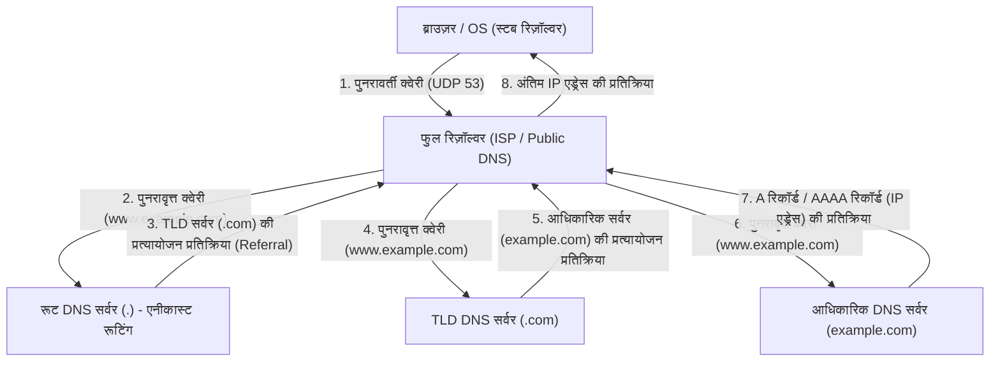

यह जटिल पदानुक्रमित राउंड-ट्रिप संचार आमतौर पर कुछ मिलीसेकंड से लेकर दसियों मिलीसेकंड के क्षणिक समय में पूरा हो जाता है। DNS मुख्य रूप से ट्रांसपोर्ट लेयर प्रोटोकॉल के रूप में UDP पोर्ट 53 का उपयोग करता है। TCP द्वारा थ्री-वे हैंडशेक (SYN, SYN-ACK, ACK) के राउंड-ट्रिप ओवरहेड को पूरी तरह से समाप्त करके, यह अत्यधिक लेटेंसी में कमी प्राप्त करता है। हालाँकि, जब DNS प्रतिक्रिया पेलोड ऐतिहासिक UDP सीमा 512 बाइट्स (अब EDNS0 एक्सटेंशन के कारण बड़ा) से अधिक हो जाता है, जब DNS कैश पॉइज़निंग हमलों को रोकने के लिए क्रिप्टोग्राफ़िक डिजिटल हस्ताक्षर एक्सटेंशन DNSSEC (DNS सिक्योरिटी एक्सटेंशन) का कुंजी सत्यापन किया जाता है, या जब ज़ोन ट्रांसफ़र (AXFR) किया जाता है, तो अत्यधिक विश्वसनीय TCP पोर्ट 53 पर फ़ॉलबैक निर्धारित किया गया है।

## 5.2 HTTP आर्किटेक्चर और प्रोटोकॉल का विकासवाद

DNS द्वारा लक्ष्य सर्वर का IP एड्रेस प्राप्त करने के बाद, ब्राउज़र अगला कदम लक्ष्य सर्वर (पोर्ट 80 या 443) के साथ TCP कनेक्शन स्थापित करता है और HTTP (हाइपरटेक्स्ट ट्रांसफर प्रोटोकॉल), जो एप्लिकेशन लेयर की मुख्य भाषा है, का उपयोग करके बातचीत शुरू करता है।

1989 में यूरोपीय नाभिकीय अनुसंधान संगठन (CERN) में टिम बर्नर्स-ली द्वारा कल्पित HTTP मूल रूप से दुनिया भर के भौतिकविदों के लिए नेटवर्क पर अनुसंधान दस्तावेजों (हाइपरटेक्स्ट) को कुशलतापूर्वक साझा करने और उन्हें लिंक द्वारा जोड़ने के लिए एक अत्यंत सरल प्रोटोकॉल था। रिक्वेस्ट लाइन (विधी, URI, प्रोटोकॉल संस्करण), हेडर फील्ड्स, खाली लाइन (CRLF), और मैसेज बॉडी की स्पष्ट टेक्स्ट-आधारित संरचना ने सिस्टम की डिबगिंग और लोकप्रियता को दृढ़ता से बढ़ावा दिया।

HTTP का मौलिक डिज़ाइन दर्शन और सबसे बड़ी विशेषता यह है कि यह "स्टेटलेस (Stateless)" है। सर्वर क्लाइंट के पिछले अनुरोध की स्थिति या संदर्भ को मेमोरी में बिल्कुल भी नहीं रखता है। प्रत्येक अनुरोध पूरी तरह से स्वतंत्र लेनदेन के रूप में पूरा होता है। यह स्टेटलेसनेस, जो REST (रिप्रेज़ेंटेशनल स्टेट ट्रांसफ़र) आर्किटेक्चर से भी जुड़ी है, सर्वर के कार्यान्वयन को नाटकीय रूप से सरल बनाती है और विशाल ट्रैफ़िक को संभालने के लिए क्षैतिज रूप से सर्वरों की संख्या बढ़ाने वाले स्केल-आउट (लोड बैलेंसिंग) को आसान बनाती है। लोड बैलेंसर यह सुनिश्चित कर सकता है कि चाहे वह किसी भी बैकएंड सर्वर को अनुरोध वितरित करे, परिणाम समान होगा। हालाँकि, ई-कॉमर्स साइटों पर शॉपिंग कार्ट कार्यक्षमता या उपयोगकर्ता के लॉगिन स्टेट को बनाए रखने जैसे स्टेट (State) प्रबंधन, जो आधुनिक इंटरेक्टिव वेब एप्लिकेशन में अपरिहार्य हैं, के लिए यह सख्त स्टेटलेसनेस एक बड़ी बाधा बन जाती है। इस बाधा को प्रोटोकॉल के बाहर से दूर करने के लिए, HTTP हेडर्स के माध्यम से क्लाइंट पक्ष में स्थिति सहेजने वाली कुकीज़ (Cookies) या सेशन टोकन के माध्यम से छद्म स्थिति प्रबंधन तंत्र का आविष्कार किया गया था।

### भौतिक बाधाओं के साथ संघर्ष: HTTP/1.1 से HTTP/3 तक प्रतिमान बदलाव

वेब के विस्फोटक प्रसार और एकल पृष्ठ में शामिल संसाधनों (चित्र, CSS, जावास्क्रिप्ट फ़ाइलें आदि) के बड़े पैमाने पर विस्तार के साथ, HTTP को नेटवर्क के भौतिक नियमों (प्रकाश की गति द्वारा विलंबता की सीमा और पैकेट हानि) का सामना करना पड़ा है, और इसमें प्रोटोकॉल स्तर पर नाटकीय वास्तुशिल्प विकास हुआ है।

- **HTTP/1.1 (1997 - )**: मूल HTTP/1.0 में, हर बार एक संसाधन का अनुरोध करने पर, TCP कनेक्शन की स्थापना और वियोग (थ्री-वे हैंडशेक और 4-वे हैंडशेक) को दोहराया जाता था, जो विलंबता के दृष्टिकोण से अत्यधिक अकुशल था। HTTP/1.1 में, पर्सिस्टेंट कनेक्शन (कीप-अलाइव) को मानकीकृत किया गया, जिसने एकल TCP कनेक्शन को पुन: प्रयोज्य बनाकर कनेक्शन लागत को नाटकीय रूप से कम कर दिया। हालाँकि, HTTP/1.1 की पाइपलाइनिंग तकनीक कार्यान्वयन की कठिनाई और मध्यवर्ती प्रॉक्सी के साथ संगतता समस्याओं के कारण व्यापक नहीं हो पाई, और इसमें "हेड-ऑफ़-लाइन (HoL) ब्लॉकिंग" नामक एक घातक संरचनात्मक दोष था। यह एक ऐसी घटना है जहाँ एकल TCP कनेक्शन पर, जबकि सर्वर एक विशाल संसाधन या प्रसंस्करण-भारी अनुरोध को संसाधित कर रहा होता है, बाद के अनुरोध कतार में फंस जाते हैं, जिससे समग्र विलंबता खराब हो जाती है। इससे बचने के लिए, ब्राउज़रों को एक ही डोमेन के लिए एक साथ कई TCP कनेक्शन (आमतौर पर लगभग 6 कनेक्शन) खोलने जैसी ज़बरदस्ती वाली तरकीबों (जैसे डोमेन शार्डिंग) पर निर्भर रहना पड़ा।
- **HTTP/2 (2015 - )**: Google द्वारा विकसित SPDY प्रोटोकॉल के आधार पर मानकीकृत, HTTP/2 ने प्रोटोकॉल को टेक्स्ट-आधारित से "बाइनरी फ्रेमिंग-आधारित" में बदलकर वास्तुकला को मूल रूप से नया रूप दिया। सबसे महत्वपूर्ण नवाचार "स्ट्रीम मल्टीप्लेक्सिंग (Multiplexing)" है। HTTP/2 में, एक एकल TCP कनेक्शन के भीतर कई आभासी "स्ट्रीम" बनाए जा सकते हैं, और अनुरोध और प्रतिक्रिया डेटा को छोटे बाइनरी फ़्रेम में विभाजित किया जा सकता है, जिन्हें अनुक्रम की परवाह किए बिना इंटरलीव (एक दूसरे के बीच में) करके भेजा जा सकता है। इससे एप्लिकेशन लेयर में HoL ब्लॉकिंग पूरी तरह से समाप्त हो गई। इसके अलावा, HPACK एल्गोरिथम (स्थिर हफ़मैन कोडिंग और गतिशील तालिकाओं का संयोजन) का उपयोग करने वाले हेडर संपीड़न तंत्र ने प्रत्येक अनुरोध में बार-बार भेजे जाने वाले कुकीज़ और उपयोगकर्ता-एजेंट जैसे अनावश्यक डेटा की मात्रा को नाटकीय रूप से कम कर दिया, और नेटवर्क बैंडविड्थ उपयोग दक्षता को अधिकतम कर दिया।
- **HTTP/3 (2022 - )**: HTTP/2 ने एप्लिकेशन लेयर में HoL ब्लॉकिंग को शानदार ढंग से समाप्त कर दिया, लेकिन अंतर्निहित ट्रांसपोर्ट लेयर (TCP) में "पैकेट हानि के दौरान HoL ब्लॉकिंग" की भौतिक बाधा बनी रही। TCP, विश्वसनीयता सुनिश्चित करने के लिए, रास्ते में एक भी पैकेट गुम हो जाने पर, उस TCP कनेक्शन पर सभी स्ट्रीम के डेटा पैकेटों को एप्लिकेशन लेयर को सौंपना तब तक रोक देता है जब तक कि पुन: प्रसारण पूरा न हो जाए (TCP के क्रम गारंटी तंत्र का नकारात्मक प्रभाव)। इस समस्या को दूर करने के लिए, HTTP/3 ने TCP को त्याग दिया, जो दशकों से इंटरनेट की नींव था, और UDP-आधारित नए ट्रांसपोर्ट प्रोटोकॉल "QUIC (क्विक UDP इंटरनेट कनेक्शन)" को अपनाते हुए एक नाटकीय प्रतिमान बदलाव किया। QUIC, OS के कर्नेल स्पेस में TCP के लागू होने के कारण होने वाले विकासवादी विलंब से बचा, और UDP की ऊपरी परत में, जिसे यूजर स्पेस में लागू किया जा सकता है, अपने स्वयं के रिट्रांसमिशन कंट्रोल, कंजेशन कंट्रोल और प्रति-स्ट्रीम स्वतंत्र फ्लो कंट्रोल को शामिल किया। भले ही एक पैकेट गुम हो जाए, केवल वह विशिष्ट स्ट्रीम प्रभावित होती है, और अन्य स्ट्रीम बिना ब्लॉक किए प्रसंस्करण जारी रख सकती हैं। इसके अलावा, QUIC ने कनेक्शन स्थापना हैंडशेक और एन्क्रिप्शन (TLS 1.3) हैंडशेक को एकीकृत किया, जिससे अतीत में संचार इतिहास वाले सर्वरों के साथ "0-RTT (ज़ीरो राउंड ट्रिप टाइम)" में एन्क्रिप्टेड डेटा का प्रसारण शुरू करना संभव हो गया। भौतिक प्रकाश की गति की सीमाओं (पृथ्वी के दूसरी ओर संचार करने में अनिवार्य रूप से सैकड़ों मिलीसेकंड की देरी होगी) के खिलाफ, प्रोटोकॉल लेयर पर संचार राउंड-ट्रिप (RTT) की संख्या को पूरी तरह से कम करके, यह अंतिम प्रदर्शन का पीछा करने के परिणाम का क्रिस्टलीकरण है।

## 5.3 एन्क्रिप्शन और विश्वास का तंत्र: SSL/TLS की गणितीय गहराई और प्रमाण का तर्क

इंटरनेट मूल रूप से एक खुला पैकेट संचार नेटवर्क है, और डेटा अनगिनत राउटर और समुद्र के नीचे ऑप्टिकल फाइबर केबल के माध्यम से गंतव्य तक बकेट-ब्रिगेड शैली में स्थानांतरित किया जाता है। उस मार्ग पर किसी भी नोड (मध्यवर्ती राउटर, दुर्भावनापूर्ण ISP, या उसी वाई-फ़ाई नेटवर्क पर छिपकर बात सुनने वाले) के लिए पैकेट कैप्चर के माध्यम से संचार सामग्री को रोकना और यहाँ तक कि उसके साथ छेड़छाड़ करना भौतिक रूप से संभव है। SSL (सिक्योर सॉकेट्स लेयर) और इसका उत्तराधिकारी TLS (ट्रांसपोर्ट लेयर सिक्योरिटी) प्रोटोकॉल उन्नत गणित की शक्ति से नेटवर्क की इस पूर्ण भेद्यता को रोकते हैं और एक सुरक्षित संचार चैनल स्थापित करते हैं।

आधुनिक वेब संचार में TLS निम्नलिखित "सुरक्षा के तीन स्तंभों" की गारंटी देता है:
1. **गोपनीयता (Confidentiality)**: यदि संचार सामग्री को किसी तीसरे पक्ष द्वारा इंटरसेप्ट किया जाता है तो भी इसे डिक्रिप्ट नहीं किया जा सकता है।
2. **अखंडता (Integrity)**: संचार पथ पर डेटा में एक बिट का भी बदलाव नहीं किया गया है। यह MAC (मैसेज ऑथेंटिकेशन कोड) या AEAD (ऑथेंटिकेटेड एन्क्रिप्शन विद एसोसिएटेड डेटा) द्वारा सुनिश्चित किया जाता है।
3. **प्रमाणीकरण (Authentication)**: संचार करने वाला पक्ष वैध डोमेन का स्वामी (असली सर्वर) है।

इनको साकार करने वाली तकनीक क्रिप्टोग्राफी (क्रिप्टोग्राफिक थ्योरी) का क्रिस्टलीकरण है जिसे मानवता ने सदियों से बनाया है, और जिसने द्वितीय विश्व युद्ध के बाद विशेष रूप से कंप्यूटर विज्ञान और संख्या सिद्धांत के विकास के साथ छलांग लगाई है।

### कुंजी विनिमय और सार्वजनिक-कुंजी क्रिप्टोग्राफी: असतत लघुगणक समस्या और अभाज्य गुणनखंडन की दीवार

सबसे सरल और सबसे तेज़ एन्क्रिप्शन विधि "सममित क्रिप्टोग्राफी (Symmetric Cryptography)" (वर्तमान मानक AES: एडवांस्ड एन्क्रिप्शन स्टैंडर्ड) है। यह एक ऐसी विधि है जहाँ प्रेषक और प्राप्तकर्ता एन्क्रिप्शन और डिक्रिप्शन के लिए एक ही "सामान्य कुंजी" का उपयोग करते हैं। चूँकि गणितीय प्रसंस्करण हल्का है (बिट्स के XOR संचालन या प्रतिस्थापन और ट्रांसपोज़िशन का संयोजन), यह वास्तविक समय में गीगाबिट-क्लास संचार को एन्क्रिप्ट करने के लिए उपयुक्त है। हालाँकि, सममित क्रिप्टोग्राफी में एक मौलिक विरोधाभास (कुंजी वितरण समस्या) थी: "संचार शुरू करने से पहले उस गुप्त सामान्य कुंजी को दूसरे पक्ष को सुरक्षित रूप से कैसे वितरित किया जाए"। इंटरनेट जैसे बिना किसी पूर्व विश्वास संबंध वाले पक्ष के साथ संवाद करते समय, यदि सामान्य कुंजी को ऐसे ही भेज दिया जाता है, तो रास्ते में कुंजी को चुरा लिया जाएगा, जिससे एन्क्रिप्शन अर्थहीन हो जाएगा।

मानव इतिहास में क्रिप्टोग्राफी के क्षेत्र में यह सबसे बड़ी सफलता 1976 में व्हिटफ़ील्ड डिफ़ी और मार्टिन हेलमैन द्वारा प्रकाशित कुंजी विनिमय एल्गोरिदम, और 1977 में RSA (रिवेस्ट, शमीर, एडलमैन) द्वारा कल्पित "सार्वजनिक-कुंजी क्रिप्टोग्राफी (Asymmetric Cryptography)" थी।

सार्वजनिक-कुंजी क्रिप्टोग्राफी के मूल में गणितीय "एक-तरफ़ा फ़ंक्शन (One-way function)" या "ट्रैपडोर एक-तरफ़ा फ़ंक्शन (Trapdoor one-way function)" की अवधारणा है। यह इस विषमता का उपयोग करता है कि "एक दिशा (एन्क्रिप्शन) में गणना कंप्यूटर द्वारा तुरंत समाप्त हो जाती है, लेकिन विपरीत दिशा (डिक्रिप्शन या कुंजी अनुमान) में गणना, भले ही आप दुनिया भर के सुपर कंप्यूटरों को जोड़ दें और ब्रह्मांड के जीवनकाल तक गणना करते रहें, कभी खत्म नहीं होगी।"

- **RSA एन्क्रिप्शन**: यह इस गुण पर आधारित है कि दो बहुत बड़ी अभाज्य संख्याओं ($p$ और $q$) को गुणा करके एक विशाल भाज्य संख्या ($N = p \times q$) बनाना आसान है (बहुपद समय में गणना योग्य), लेकिन केवल विशाल भाज्य संख्या $N$ दिए जाने पर मूल अभाज्य कारकों $p$ और $q$ को निकालना (अभाज्य गुणनखंडन समस्या) अत्यंत कठिन है (केवल अर्ध-घातीय समय एल्गोरिदम ज्ञात हैं)। यूलर के टॉटिएंट फ़ंक्शन और फ़र्मेट के लिटिल थ्योरम जैसे संख्या सिद्धांत के गहन गुणों का उपयोग करके, यह एक गणितीय ट्रैपडोर बनाता है जहाँ सार्वजनिक कुंजी से एन्क्रिप्ट किए गए डेटा को केवल वही व्यक्ति डिक्रिप्ट कर सकता है जिसके पास संबंधित निजी कुंजी हो।
- **एलिप्टिक कर्व क्रिप्टोग्राफी (ECC: Elliptic Curve Cryptography)**: ECC, जो वर्तमान TLS में मुख्यधारा है, एक परिमित क्षेत्र (finite field) पर एलिप्टिक कर्व (उदाहरण के लिए, समीकरण $y^2 = x^3 + ax + b$ को संतुष्ट करने वाले बिंदुओं का सेट) पर परिभाषित "असतत लघुगणक समस्या" की कठिनाई को लागू करता है। यह एलिप्टिक कर्व पर बिंदुओं के लिए "जोड़" और "स्केलर गुणन" जैसे ज्यामितीय संचालन को परिभाषित करता है। किसी प्रारंभिक बिंदु $G$ को $k$ बार जोड़कर बिंदु $P = kG$ खोजना आसान है, लेकिन सार्वजनिक किए गए बिंदु $G$ और $P$ से गुप्त गुणांक $k$ (असतत लघुगणक) की विपरीत गणना करना कि इसे कितनी बार जोड़ा गया था, RSA के अभाज्य गुणनखंडन से भी अधिक कठिन है। नतीजतन, ECC एक अत्यंत छोटी कुंजी लंबाई के साथ (उदाहरण के लिए, RSA 2048bit के बराबर सुरक्षा ECC 256bit के साथ प्राप्त की जाती है), जो RSA के आकार का केवल एक अंश है, बराबर या अधिक एन्क्रिप्शन ताकत का दावा करता है, और नाटकीय रूप से CPU लोड और नेटवर्क बैंडविड्थ बचाता है।

### TLS हैंडशेक: विश्वास बनाने के लिए एक क्रिप्टोग्राफ़िक अनुष्ठान

HTTPS का उपयोग करके सुरक्षित संचार शुरू करते समय, क्लाइंट और सर्वर सममित क्रिप्टोग्राफी के लिए एक सुरक्षित "सेशन कुंजी" उत्पन्न करते हैं और एक-दूसरे की पहचान को प्रमाणित करने के लिए एक उन्नत वार्ता प्रोटोकॉल निष्पादित करते हैं। यह TLS हैंडशेक है। निम्नलिखित "TLS 1.3" में 1-RTT हैंडशेक की शारीरिक रचना है, जो नवीनतम मानक है और इसे चरम सीमा तक सुव्यवस्थित किया गया है।

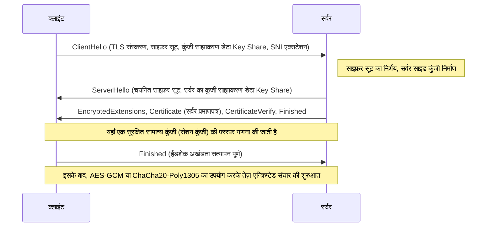

1. **ClientHello**: कनेक्शन शुरू करने पर, क्लाइंट सर्वर को समर्थित TLS संस्करण, एन्क्रिप्शन एल्गोरिदम (Cipher Suites) की सूची और एन्क्रिप्शन कुंजी उत्पन्न करने के लिए प्रारंभिक गणितीय पैरामीटर (Key Share) भेजता है। इसके अतिरिक्त, यह SNI (सर्वर नेम इंडिकेशन) एक्सटेंशन का उपयोग करके गंतव्य के होस्टनेम (उदा: `www.example.com`) को सादे टेक्स्ट (plaintext) में भेजता है। यह उन सर्वरों (वर्चुअल होस्ट्स) के लिए आवश्यक जानकारी है जो एकल IP एड्रेस पर कई HTTPS डोमेन संचालित करते हैं, ताकि वे सही प्रमाणपत्र का चयन करके उसे वापस कर सकें।
2. **ServerHello**: सर्वर क्लाइंट की सूची में से सबसे मजबूत और सबसे इष्टतम एन्क्रिप्शन एल्गोरिदम (उदा: `TLS_AES_256_GCM_SHA384`) का चयन करता है, और अपने स्वयं के Key Share डेटा के साथ प्रतिक्रिया देता है।
3. **प्रमाणपत्र भेजना और हस्ताक्षर करना (Authentication)**: सर्वर अपना "डिजिटल प्रमाणपत्र (X.509)" भेजता है। इसके अलावा, सर्वर प्रमाणपत्र से जुड़ी "निजी कुंजी" का उपयोग करके अब तक के संपूर्ण हैंडशेक संदेशों की हैश वैल्यू के लिए एक डिजिटल हस्ताक्षर (CertificateVerify) बनाता है और उसे भेजता है। यह गणितीय रूप से साबित करता है कि सर्वर उस प्रमाणपत्र का सही मालिक है (निजी कुंजी का धारक)।
4. **कुंजी विनिमय (Ephemeral Elliptic Curve Diffie-Hellman: ECDHE)**: क्लाइंट और सर्वर गणितीय रूप से एक दूसरे के भेजे और प्राप्त किए गए Key Share (एलिप्टिक कर्व पर सार्वजनिक बिंदु) को उनके स्वयं के गुप्त मापदंडों के साथ गुणा करते हैं। आश्चर्यजनक रूप से, डिफ़ी-हेलमैन कुंजी विनिमय ($ (g^a)^b = (g^b)^a = g^{ab} $) के गणितीय गुणों के कारण, नेटवर्क पर कोई भी गुप्त जानकारी भेजे बिना क्लाइंट और सर्वर पक्षों पर ठीक वही मजबूत "मास्टर सीक्रेट (सामान्य कुंजी)" जादुई रूप से संश्लेषित हो जाता है।
5. **परफेक्ट फॉरवर्ड सीक्रेसी (Perfect Forward Secrecy: PFS)**: TLS 1.3 की एक बहुत ही महत्वपूर्ण विशेषता यह है कि कुंजी विनिमय के लिए उपयोग किए जाने वाले पैरामीटर (Key Share) प्रत्येक सत्र स्थापित होने पर डिस्पोजेबल के रूप में नए सिरे से उत्पन्न (Ephemeral) होते हैं। नतीजतन, यदि सर्वर की दीर्घकालिक पहचान के लिए उपयोग की जाने वाली निजी कुंजी (RSA या ECDSA कुंजी) वर्षों बाद हमलावर को लीक हो जाती है, तो भी अतीत में रिकॉर्ड और सहेजे गए एन्क्रिप्टेड संचार पैकेटों को पूर्वव्यापी रूप से डिक्रिप्ट करना गणितीय रूप से पूरी तरह से असंभव है। अतीत के संचार की गोपनीयता भविष्य के लिए सुनिश्चित की जाती है।

### PKI और विश्वास की श्रृंखला (Chain of Trust): डिजिटल दुनिया का पासपोर्ट

अब तक के एन्क्रिप्शन तंत्र में, तर्क में एक घातक खामी बनी हुई है। समस्या यह है: "क्लाइंट यह कैसे आश्वस्त हो सकता है कि सर्वर से भेजा गया प्रमाणपत्र और सार्वजनिक कुंजी वास्तव में लक्षित डोमेन (उदाहरण के लिए, बैंक की वेबसाइट) के वास्तविक हैं?"
यदि नेटवर्क मार्ग को नियंत्रित करने वाला कोई दुर्भावनापूर्ण मध्यस्थ "मैन-इन-द-मिडिल अटैक (Man-in-the-Middle Attack)" करता है, जहाँ वह सर्वर होने का नाटक करता है और क्लाइंट को अपना नकली प्रमाणपत्र और सार्वजनिक कुंजी भेजता है, तो कुंजी विनिमय और एन्क्रिप्शन अपने आप में गणितीय रूप से पूरी तरह सफल होंगे। हालाँकि, एन्क्रिप्टेड संचार का दूसरा पक्ष लक्षित बैंक नहीं, बल्कि हमलावर होगा।

इस मौलिक प्रमाणीकरण चुनौती को हल करने वाला सामाजिक और तकनीकी ढांचा PKI (पब्लिक की इंफ्रास्ट्रक्चर) है, और "प्रमाणन प्राधिकरण (CA: Certificate Authority)" का अस्तित्व है, जो विश्वास के लंगर के रूप में कार्य करता है।

सर्वर का मालिक अपनी स्वयं की सार्वजनिक कुंजी सहित एक CSR (सर्टिफिकेट साइनिंग रिक्वेस्ट) बनाता है और इसे DigiCert, GlobalSign, या Let's Encrypt जैसे विश्वसनीय तृतीय-पक्ष संगठन CA को सबमिट करता है। CA यह सत्यापित करने के बाद कि आवेदक के पास वास्तव में डोमेन का स्वामित्व है (डोमेन सत्यापन, कॉर्पोरेट अस्तित्व सत्यापन, आदि), सर्वर की सार्वजनिक कुंजी की जानकारी पर "डिजिटल हस्ताक्षर" लागू करने के लिए अपनी स्वयं की मजबूत "निजी कुंजी" का उपयोग करता है और इसे सर्वर प्रमाणपत्र के रूप में जारी करता है।

दूसरी ओर, Windows और macOS जैसे ऑपरेटिंग सिस्टम, और Chrome और Firefox जैसे ब्राउज़र में वैश्विक रूप से कड़ाई से ऑडिट किए गए रूट CA के "रूट प्रमाणपत्र (सार्वजनिक कुंजी)" का एक समूह पहले से ही हार्ड-कोडित और निर्मित होता है जो विश्वास के आधार बिंदु (Trust Anchor) के रूप में कार्य करता है।

जब क्लाइंट सर्वर से प्रमाणपत्र प्राप्त करता है, तो वह OS में अंतर्निहित रूट CA की सार्वजनिक कुंजी का उपयोग करके प्रमाणपत्र से जुड़े CA के डिजिटल हस्ताक्षर का क्रिप्टोग्राफ़िक सत्यापन करता है। यदि हस्ताक्षर सत्यापन सफल होता है, तो यह साबित हो जाता है कि प्रमाणपत्र की सामग्री (डोमेन नाम और सार्वजनिक कुंजी) की गारंटी CA द्वारा दी गई है और इसके साथ छेड़छाड़ नहीं की गई है।

1. क्लाइंट बिना शर्त रूट CA पर भरोसा करता है (ट्रस्ट स्टोर में पूर्व-स्थापना)।
2. रूट CA मध्यवर्ती CA पर भरोसा करता है और हस्ताक्षर करता है।
3. मध्यवर्ती CA एंड-एंटिटी (वेब सर्वर) पर भरोसा करता है और हस्ताक्षर करता है।

इस "विश्वास की श्रृंखला (Chain of Trust)" के सकर्मक संबंध के माध्यम से, हम भौतिक रूप से दूर स्थित अज्ञात सर्वरों के साथ गतिशील और तुरंत एक मजबूत विश्वास संबंध बनाते हैं, और एक सुरक्षित एन्क्रिप्टेड संचार चैनल स्थापित करते हैं।

## निष्कर्ष: लेयर्स का संलयन और अगले मोर्चे की ओर

अध्याय 5 में, हमने एप्लिकेशन लेयर की गहराई में सामने आने वाले नाम समाधान, डेटा अनुरोध और प्रतिक्रिया प्रोटोकॉल, और इन सभी को घेरने वाले एन्क्रिप्शन के गणितीय आवरण का विस्तृत विश्लेषण किया है।
DNS इंटरनेट की विशाल विकेन्द्रीकृत पता पुस्तिका (address book) के रूप में कार्य करता है, HTTP संसाधनों के वाहक के रूप में अपनी वास्तुकला स्थापित करता है, और TLS अत्याधुनिक क्रिप्टोग्राफ़िक सिद्धांत के कवच के साथ इसकी दृढ़ता से रक्षा करता है। हालांकि इन्हें ऐतिहासिक रूप से स्वतंत्र प्रोटोकॉल लेयर्स के रूप में डिज़ाइन किया गया था, लेकिन आधुनिक वेब में, जैसा कि HTTP/3 के QUIC में देखा जा सकता है, ट्रांसपोर्ट लेयर, एप्लिकेशन लेयर और एन्क्रिप्शन लेयर की सीमाएँ आपस में घनिष्ठ रूप से मिल गई हैं। वे भौतिक लेटेंसी की सीमाओं को तोड़ रहे हैं और एक परिष्कृत रूप में विकसित होते जा रहे हैं जो एक ही समय में चरम प्रदर्शन और सुरक्षा का पीछा करता है।

अगले अध्याय में, हम इस बात पर गहराई से विचार करेंगे कि कैसे यह अनुरोध, जो इस मजबूत एन्क्रिप्टेड संचार से होकर सर्वर-पक्ष तक पहुँचता है, गतिशील सामग्री उत्पन्न करता है और पृष्ठभूमि में डेटाबेस सिस्टम के साथ बातचीत करता है। हम "बैकएंड सिस्टम की आंतरिक संरचना और वितरित कंप्यूटिंग" में एक स्तर गहरे तकनीकी रसातल में गोता लगाएंगे。
# अध्याय 6: इंटरनेट को सहारा देने वाला भौतिक बुनियादी ढांचा —— प्रकाश, ऊष्मा और समुद्र द्वारा बुना गया एक विशाल तंत्र

इंटरनेट को अक्सर "क्लाउड (बादल)" नामक एक निराकार और अमूर्त अवधारणा के रूप में वर्णित किया जाता है। हमें यह भ्रम होता है कि हमारे स्मार्टफोन या कंप्यूटर से भेजा गया डेटा अदृश्य रेडियो तरंगों या केबलों के माध्यम से "आसमान में कहीं" मौजूद स्टोरेज में समाहित हो जाता है। हालाँकि, इंटरनेट की वास्तविकता बादलों जैसी हल्की नहीं है। यह अत्यंत विशाल, भौतिक, और थर्मोडायनामिक्स, प्रकाशिकी, तथा भूभौतिकी के नियमों से दृढ़तापूर्वक बंधा हुआ, मानव इतिहास का सबसे बड़ा भौतिक बुनियादी ढांचा है।

इस अध्याय में, हम इस "अदृश्य नेटवर्क" को भौतिक दुनिया में साकार करने वाले तीन विशाल स्तंभों——वैश्विक तंत्रिका नेटवर्क "सबमरीन केबल्स (समुद्र तल केबल)", डेटा के भंडारण और गणना का कार्यभार संभालने वाली थर्मोडायनामिक प्रसंस्करण सुविधा "हाइपरस्केल डेटा सेंटर", और प्रकाश की गति की दीवार को तोड़कर अंतरिक्ष-समय को संपीड़ित करने वाले "CDN (कंटेंट डिलीवरी नेटवर्क)"——का उनके भौतिक तंत्र, ऐतिहासिक पृष्ठभूमि, और चरम सीमाओं को पार करने वाले पेशेवर तकनीकी दृष्टिकोण से गहराई से विश्लेषण करेंगे।

---

## 1. पृथ्वी को लपेटने वाला प्रकाश का तंत्रिका नेटवर्क: सबमरीन केबल सिस्टम

वर्तमान में, सीमाओं को पार करने वाले अंतरराष्ट्रीय इंटरनेट संचार का लगभग 99% अंतरिक्ष में उड़ने वाले कृत्रिम उपग्रहों से नहीं, बल्कि समुद्र तल पर बिछाए गए केवल कुछ सेंटीमीटर व्यास वाले "सबमरीन केबल (Submarine Communications Cable)" के माध्यम से होकर गुजरता है। जब हम विदेशी वेबसाइटों को ब्राउज़ करते हैं, तो वह डेटा हजारों मीटर गहरे समुद्र के घने अंधेरे में प्रकाश की गति से दौड़ रहा होता है।

### 1.1 टेलीग्राफ से ऑप्टिकल फाइबर तक का विकास और शैनन लिमिट को चुनौती

सबमरीन केबल का इतिहास इंटरनेट के जन्म से भी बहुत पुराना है, जो 1850 में इंग्लिश चैनल के पार टेलीग्राफ केबल बिछाए जाने तक जाता है। 1858 में पहला ट्रांसअटलांटिक (अटलांटिक पार) टेलीग्राफ केबल बिछाया गया था, लेकिन उस समय संचार मोर्स कोड द्वारा होता था, और महारानी विक्टोरिया से अमेरिकी राष्ट्रपति बुकानन को संदेश भेजने में एक दर्जन घंटे से अधिक का समय लगा था। इसके बाद, समाक्षीय केबल (कोएक्सियल केबल) का उपयोग करने वाले एनालॉग टेलीफोन लाइनों के युग से गुजरने के बाद, 1980 के दशक के उत्तरार्ध से ऑप्टिकल फाइबर केबल्स की शुरुआत हुई। 1988 में बिछाए गए पहले ट्रांसअटलांटिक ऑप्टिकल कम्युनिकेशन केबल "TAT-8" की क्षमता 280 Mbps (लगभग 40,000 टेलीफोन लाइनों के बराबर) थी, जो उस समय के लिए एक क्रांतिकारी बैंडविड्थ थी।

आधुनिक सबमरीन केबल्स एक ही केबल में सैकड़ों Tbps (टेराबिट प्रति सेकंड) की अकल्पनीय संचार क्षमता का दावा करती हैं। इस छलांग लगाने वाले विकास को संभव बनाने वाली दो नोबेल पुरस्कार-स्तरीय भौतिक और इंजीनियरिंग सफलताएँ हैं - "वेवलेंथ डिवीजन मल्टीप्लेक्सिंग (WDM)" और "एर्बियम-डोप्ड फाइबर एम्पलीफायर (EDFA)"।

WDM एक ऐसी तकनीक है जो एक ही ऑप्टिकल फाइबर के भीतर विभिन्न तरंग दैर्ध्य (रंगों) के प्रकाश को मल्टीप्लेक्स करके एक साथ प्रसारित करती है। इसके परिणामस्वरूप, प्रति फाइबर ट्रांसमिशन क्षमता तरंग दैर्ध्य की संख्या के गुणक में बढ़ जाती है। हालाँकि, भले ही ऑप्टिकल फाइबर की सामग्री क्वार्ट्ज ग्लास (सिलिका ग्लास) की शुद्धता को चरम सीमा तक बढ़ा दिया गया हो, कुछ सौ किलोमीटर की यात्रा के दौरान रेले स्कैटरिंग (Rayleigh scattering) और इन्फ्रारेड एब्जॉर्प्शन के कारण ऑप्टिकल सिग्नल क्षीण (attenuated) हो जाते हैं। इसलिए, हर कुछ दर्जन से सौ किलोमीटर पर स्थापित किए जाने वाले रिपीटर (पुनरावर्तक) की आवश्यकता होती है।

अतीत में रिपीटर क्षीण ऑप्टिकल सिग्नल को एक बार इलेक्ट्रिकल सिग्नल में परिवर्तित करते थे, उसे एम्पलीफाई (प्रवर्धित) करते थे और फिर वापस ऑप्टिकल सिग्नल में परिवर्तित करते थे (O-E-O रूपांतरण), जो एक जटिल और सीमित प्रक्रिया थी। हालाँकि, 1990 के दशक में व्यावहारिक रूप से लागू हुए EDFA ने, ऑप्टिकल फाइबर के कोर में एक दुर्लभ पृथ्वी तत्व एर्बियम को जोड़कर और उस पर 'पंप लाइट' नामक शक्तिशाली लेजर प्रकाश डालकर, ऑप्टिकल सिग्नल को "प्रकाश के रूप में" सीधे एम्पलीफाई करना संभव बना दिया। इसने विभिन्न तरंग दैर्ध्य वाले कई ऑप्टिकल सिग्नलों को एक साथ एम्पलीफाई करने की अनुमति दी, और WDM तकनीक के साथ जुड़ने से संचार क्षमता में विस्फोटक रूप से वृद्धि हुई।

वर्तमान में, संचार इंजीनियरिंग के क्षेत्र में, हम क्लॉड शैनन द्वारा प्रस्तावित चैनल क्षमता की सैद्धांतिक सीमा, "शैनन लिमिट (Shannon Limit)" के करीब पहुंच रहे हैं। इसे पार करने के लिए, अगली पीढ़ी की फिजिकल लेयर तकनीकों पर शोध और उनका कार्यान्वयन शुरू हो गया है, जैसे कि एक फाइबर के भीतर कई कोर रखने वाला "मल्टी-कोर फाइबर" और प्रकाश के स्थानिक मोड को मल्टीप्लेक्स करने वाला "स्पेस डिवीजन मल्टीप्लेक्सिंग (SDM)"।

### 1.2 गहरे समुद्र का भौतिक वातावरण और केबल बिछाने की इंजीनियरिंग

सबमरीन केबल्स बिछाना आधुनिक समय की सबसे कठिन इंजीनियरिंग परियोजनाओं में से एक है। हजारों किलोमीटर तक फैले केबल्स को समर्पित "केबल लेयर (Cable layer) जहाजों" का उपयोग करके समुद्र तल पर उतारा जाता है।

बिछाने से पहले, इको साउंडर (ध्वनि गहराई मापक यंत्र) का उपयोग करके समुद्र तल का एक सटीक स्थलाकृतिक मानचित्र (topographic map) बनाया जाता है, और समुद्र के नीचे के पहाड़ों, खाइयों, हाइड्रोथर्मल वेंट और भूस्खलन के जोखिम वाले क्षेत्रों से बचते हुए एक इष्टतम मार्ग चुना जाता है। बिछाए जाने वाले क्षेत्र की गहराई के आधार पर केबल की संरचना में भारी बदलाव होता है।

उथले पानी वाले क्षेत्रों जैसे कि महाद्वीपीय शेल्फ (लगभग 1000 से 1500 मीटर या उससे कम गहराई) में, मछली पकड़ने वाले जहाजों के बॉटम ट्रॉल नेट, जहाजों के लंगर, या शार्क जैसे समुद्री जीवों के काटने के कारण शारीरिक रूप से कटने का जोखिम बेहद अधिक होता है। इसलिए, ऑप्टिकल फाइबर की सुरक्षा करने वाले पॉलीकार्बोनेट राल और तांबे के ट्यूब के बाहर, उच्च तन्यता वाले स्टील के तारों (स्टील वायर) की कई परतें लपेटकर एक "आर्मर (Armor)" लगाया जाता है, जिससे इसका व्यास मोटा और वजन भारी हो जाता है। इसके अलावा, रिमोटली ऑपरेटेड व्हीकल (ROV) और सीबेड हल (plough) का उपयोग करके, केबल को समुद्र तल की मिट्टी और रेत में कई मीटर गहराई तक दफनाने का कार्य किया जाता है।

दूसरी ओर, हजारों मीटर गहरे समुद्री क्षेत्रों में, जहां मछली पकड़ने वाले जालों या लंगरों का कोई खतरा नहीं होता, पानी के दबाव को झेल सकने वाली मजबूती को बनाए रखते हुए, बिछाने के दौरान अपने ही वजन से टूटने से बचाने के लिए स्टील वायर आर्मर के बिना "लाइटवेट केबल (Lightweight Cable)" को अपनाया जाता है। इसका व्यास केवल 17 से 20 मिलीमीटर के आसपास होता है, जो कि बगीचे की नली जितना ही मोटा होता है।

सबमरीन केबल का एक और महत्वपूर्ण भौतिक पहलू "बिजली की आपूर्ति" है। हर कुछ दर्जन किलोमीटर पर स्थापित रिपीटरों को चलाने के लिए, भूमि पर स्थित केबल लैंडिंग स्टेशन (Cable Landing Station) से, केबल के भीतर तांबे की ट्यूब (विद्युत आपूर्ति कंडक्टर) के माध्यम से उच्च वोल्टेज का प्रत्यक्ष प्रवाह (Direct Current) प्रदान किया जाता है। महासागरों को पार करने वाले केबलों में, आपूर्ति वोल्टेज 10,000 वोल्ट (10 kV) से भी अधिक हो सकता है, और आमतौर पर समुद्री जल और पृथ्वी को रिटर्न सर्किट के रूप में उपयोग करने वाली "सिंगल-वायर अर्थ रिटर्न प्रणाली (Single-wire earth return system)" को अपनाया जाता है।

### 1.3 भू-राजनीति और विशाल टेक कंपनियों का उदय

अतीत में, चूंकि सबमरीन केबल्स बिछाने के लिए भारी निवेश की आवश्यकता होती थी, इसलिए विभिन्न देशों के प्रमुख दूरसंचार वाहकों (carriers) का एक साथ मिलकर कंसोर्टियम (consortium) बनाना और लागत तथा बैंडविड्थ को आपस में बांटना ही मुख्यधारा थी। हालाँकि, हाल के वर्षों में, इस इकोसिस्टम में एक नाटकीय बदलाव आया है।

Google, Meta (Facebook), Microsoft, और Amazon जैसी "हाइपरस्केलर (Hyperscaler)" कहलाने वाली विशाल टेक कंपनियों ने अपने स्वयं के डेटा सेंटरों को अति-तीव्र गति से जोड़ने के लिए, स्वतंत्र रूप से या संयुक्त रूप से सबमरीन केबल्स में सीधे निवेश करना और उन्हें बिछाना शुरू कर दिया है। वे इंटरनेट के केवल उपयोगकर्ताओं से भौतिक बुनियादी ढांचे के सबसे बड़े मालिकों में बदल गए हैं। इसके कारण, केबल की रूटिंग (रास्ते का निर्धारण) को पारंपरिक "प्रमुख शहरों के बीच कनेक्शन" से "अपने डेटा सेंटरों के बीच सबसे छोटे और सबसे तेज कनेक्शन" के रूप में अनुकूलित (optimized) किया जा रहा है।

```mermaid
graph TD
    A["लैंडिंग स्टेशन (Landing Station)"] -- "उच्च वोल्टेज डीसी बिजली आपूर्ति / ऑप्टिकल सिग्नल" --> B["रिपीटर (Repeater)"]
    B -- "ऑप्टिकल सिग्नल प्रवर्धन (EDFA)" --> C["रिपीटर (Repeater)"]
    C -- "ऑप्टिकल सिग्नल प्रवर्धन" --> D["लैंडिंग स्टेशन (Landing Station)"]
    
    subgraph सबमरीन केबल की संरचना
        E["ऑप्टिकल फाइबर कोर"]
        F["दबाव-प्रतिरोधी तांबे की ट्यूब (बिजली की आपूर्ति / नमी से बचाव)"]
        G["उच्च-तन्यता वाले स्टील वायर (केवल उथले समुद्र में आर्मर)"]
        H["पॉलीथीन इन्सुलेशन आवरण"]
        E --> F
        F --> G
        G --> H
    end
```

---

## 2. डेटा की थर्मोडायनामिक प्रसंस्करण सुविधा: हाइपरस्केल डेटा सेंटर

सबमरीन केबलों के माध्यम से भूमि पर पहुंचने वाले डेटा को अंततः "डेटा सेंटर" में ले जाया जाता है। डेटा सेंटर एक विशाल इमारत है जिसमें हजारों से लेकर लाखों की संख्या में सर्वर होते हैं, जो बिना रुके 24 घंटे, 365 दिन गणना और भंडारण का कार्य करते हैं।

### 2.1 क्लाउड की वास्तविकता और "PUE" की लड़ाई

भौतिकी के दृष्टिकोण से देखा जाए तो, डेटा सेंटर का सार "एक विशाल ताप इंजन (heat engine) है जो भारी मात्रा में विद्युत ऊर्जा को इनपुट के रूप में ग्रहण करता है, और सूचना प्रसंस्करण (गणना परिणाम) के रूप में एन्ट्रॉपी (entropy) में कमी और इसके साथ ही अपरिहार्य 'ऊष्मा (Heat)' पैदा करता है"। CPU और GPU जैसे सेमीकंडक्टर विद्युत प्रवाह को चालू या बंद करते समय प्रतिरोध के कारण ऊष्मा उत्पन्न करते हैं। यदि इस ऊष्मा को कुशलतापूर्वक बाहर नहीं निकाला जाता है, तो सेमीकंडक्टर्स में तुरंत थर्मल रनवे (thermal runaway) हो जाएगा, और वे भौतिक रूप से जल जाएंगे।

इसलिए, डेटा सेंटर के डिज़ाइन और संचालन का सबसे बड़ा केंद्र बिंदु "शीतलन (Cooling)" और "विद्युत दक्षता (Power Efficiency)" है। इस दक्षता को दर्शाने वाला सबसे आम मीट्रिक "PUE (पॉवर यूसेज इफ़ेक्टिवनेस)" है।

**PUE = संपूर्ण डेटा सेंटर की बिजली खपत / IT उपकरणों (सर्वर आदि) की बिजली खपत**

PUE का सैद्धांतिक न्यूनतम मूल्य 1.0 (एक ऐसी स्थिति जहां सभी बिजली विशुद्ध रूप से केवल गणना के लिए उपयोग की जाती है) है। अतीत में, डेटा सेंटरों में PUE का 2.0 से अधिक होना असामान्य नहीं था (अर्थात, वे वातानुकूलन जैसे शीतलन उपकरणों पर उतनी ही बिजली की खपत कर रहे थे जितनी सर्वर उपयोग कर रहे थे)। हालाँकि, आधुनिक हाइपरस्केल डेटा सेंटरों में, इस आंकड़े को 1.1 से 1.2 की सीमा तक नीचे लाने के लिए चरम थर्मोडायनामिक अनुकूलन किया गया है।

### 2.2 शीतलन वास्तुकला (Cooling Architecture) का विकास

थर्मोडायनामिक्स के सिद्धांतों के आधार पर, डेटा सेंटर शीतलन प्रणालियों का विकास इस प्रकार हुआ है:

1. **हॉट आइल और कोल्ड आइल का पृथक्करण**:
   शुरुआती डेटा सेंटरों में, पूरे कमरे को एयर कंडीशनर (CRAC: Computer Room Air Conditioning) का उपयोग करके ठंडा किया जाता था, लेकिन ठंडी हवा और सर्वर से निकलने वाली गर्म हवा आपस में मिल जाती थी, जो अत्यधिक अप्रभावी था। आजकल, "आइल कंटेनमेंट (Aisle Containment)" मानक बन गया है, जहां सर्वर रैक के हवा खींचने वाले किनारों और हवा छोड़ने वाले किनारों को एक-दूसरे के आमने-सामने रखा जाता है, और ठंडी हवा के मार्ग (कोल्ड आइल) और गर्म हवा के मार्ग (हॉट आइल) को भौतिक रूप से अलग किया जाता है।

2. **फ्री कूलिंग (बाहरी वायु से शीतलन)**:
   चिलर (शीतलन जल संचलन प्रणाली) के कंप्रेसर को चलाने के लिए भारी मात्रा में बिजली की आवश्यकता होती है। इसलिए, उन क्षेत्रों में (जैसे उत्तरी यूरोप या होक्काइडो) जहां बाहर की हवा पर्याप्त ठंडी होती है, डेटा सेंटर बनाए गए, और बाहरी हवा का प्रत्यक्ष या अप्रत्यक्ष रूप से हीट एक्सचेंजर्स के माध्यम से शीतलन के लिए उपयोग करने वाली "फ्री कूलिंग (Free Cooling)" तकनीक लोकप्रिय हो गई।

3. **इमर्शन कूलिंग (तरल में डुबोकर शीतलन) और डायरेक्ट-टू-चिप (प्रत्यक्ष जल शीतलन)**:
   हाल के वर्षों में, AI प्रशिक्षण और निष्कर्ष के लिए उपयोग किए जाने वाले हाई-एंड GPU का हीट जनरेशन घनत्व (ऊष्मा उत्पादन घनत्व) पारंपरिक एयर कूलिंग की भौतिक सीमाओं (हवा की कम ताप क्षमता और कम तापीय चालकता) को पार कर रहा है। इसलिए, सर्वर के पूरे मदरबोर्ड को सीधे गैर-प्रवाहकीय फ्लोरीन-आधारित निष्क्रिय तरल (inert liquid) या खनिज तेल में डुबोने वाली "इमर्शन कूलिंग", और CPU/GPU के हीट स्प्रेडर पर सीधे वाटर-कूलिंग हेड लगाकर हवा की तुलना में कहीं अधिक ताप क्षमता वाले तरल के माध्यम से सीधे ऊष्मा निकालने वाली "डायरेक्ट-टू-चिप (Direct-to-Chip) कूलिंग" तकनीकें अपनाई जा रही हैं। तरल के उबलने पर वाष्पीकरण की ऊष्मा का उपयोग करने वाली दो-चरणीय (two-phase) इमर्शन कूलिंग के साथ, अत्यधिक उच्च हीट फ्लक्स को संभालना संभव है।

### 2.3 रिडंडेंसी (Redundancy) और भौतिक सुरक्षा

चूंकि डेटा सेंटर सामाजिक बुनियादी ढांचे के केंद्र हैं, इसलिए इनमें चरम स्तर की रिडंडेंसी (अतिरिक्त व्यवस्था) की आवश्यकता होती है। जिस क्षण व्यावसायिक बिजली की आपूर्ति बाधित होती है, फ्लाईव्हील, लेड-एसिड बैटरी या लिथियम-आयन बैटरी का उपयोग करने वाले अनइंटरप्टिबल पावर सप्लाई (UPS) डिवाइस मिलीसेकंड के भीतर बिजली का भार संभाल लेते हैं। उसी समय, इमारत के बाहर स्थापित विशाल डीजल जनरेटर या गैस टर्बाइन जनरेटर चालू हो जाते हैं, जिनमें भंडारित ईंधन का उपयोग करके पूरी सुविधा को कई दिनों तक सुचारू रूप से चलाने की क्षमता होती है।

नेटवर्क कनेक्शन के मामले में भी, विभिन्न दूरसंचार प्रदाताओं की कई लाइनों को लाया जाता है, और खुदाई कार्यों के दौरान केबल कटने जैसी दुर्घटनाओं से बचाव के लिए भौतिक मार्गों (जैसे इमारत के पूर्व, पश्चिम, उत्तर, दक्षिण आदि अलग-अलग दिशाओं से लाइनें लाना) को पूरी तरह से अलग रखा जाता है।

---

## 3. अंतरिक्ष-समय को संपीड़ित करने वाली तकनीक: CDN (कंटेंट डिलीवरी नेटवर्क)

भले ही सबमरीन केबल्स महाद्वीपों को जोड़ते हैं, और डेटा सेंटर सूचनाओं को संग्रहीत करते हैं, लेकिन इतना ही आधुनिक वेब अनुभव के लिए पर्याप्त नहीं है। यहीं पर अल्बर्ट आइंस्टीन द्वारा प्रस्तावित ब्रह्मांड की पूर्ण गति सीमा——"प्रकाश की गति की दीवार" सामने आ खड़ी होती है।

### 3.1 प्रकाश की गति की दीवार और विलंबता (Latency) की भौतिक सीमाएं

निर्वात में प्रकाश की गति ($c$) लगभग 300,000 किमी/सेकंड है। हालाँकि, चूंकि ऑप्टिकल फाइबर के कोर में उपयोग होने वाले क्वार्ट्ज ग्लास का अपवर्तनांक (refractive index) लगभग 1.47 होता है, इसलिए फाइबर के अंदर प्रकाश की गति गिरकर लगभग 200,000 किमी/सेकंड (निर्वात में गति का लगभग दो-तिहाई) रह जाती है।

उदाहरण के लिए, टोक्यो, जापान से अमेरिकी पूर्वी तट पर वर्जीनिया (दुनिया के सबसे बड़े डेटा सेंटरों का केंद्र) तक की भौतिक सीधी दूरी लगभग 11,000 किमी है, और सबमरीन केबल के मार्ग पर विचार करें तो यह लगभग 14,000 किमी हो जाती है। एक दिशा में यात्रा करने के लिए ऑप्टिकल सिग्नल द्वारा लिया गया शुद्ध भौतिक समय लगभग 70 मिलीसेकंड है। चूंकि इंटरनेट संचार में पैकेट्स की राउंड ट्रिप (RTT: Round Trip Time) आवश्यक है, इसलिए भौतिकी के नियमों के अनुसार कम से कम 140 मिलीसेकंड की विलंबता (latency) निश्चित रूप से होगी। इसके अतिरिक्त, रास्ते में आने वाले राउटर और स्विचों पर होने वाली प्रोसेसिंग के कारण होने वाली विलंबता भी इसमें जुड़ जाती है।

एक आधुनिक वेबसाइट खोलते समय, ब्राउज़र HTML, CSS, JavaScript, चित्र आदि जैसी सैकड़ों फाइलों का अनुरोध करता है, और TCP के 3-वे हैंडशेक या TLS (SSL) के एन्क्रिप्शन नेगोशिएशन (बातचीत) में संचार कई बार आगे-पीछे होता है। यदि सभी उपयोगकर्ताओं को सीधे पृथ्वी के दूसरी ओर स्थित "ओरिजिन सर्वर (मूल सर्वर)" तक पहुंचना पड़ता, तो वेब पेजों के प्रदर्शित होने में कई सेकंड से लेकर दर्जन से अधिक सेकंड की देरी होती, और वास्तविक समय वाले (रियल-टाइम) ऑनलाइन गेम और उच्च गुणवत्ता वाली वीडियो स्ट्रीमिंग तो बिल्कुल भी संभव नहीं हो पाती।

### 3.2 एज (Edge) पर वितरण: CDN का आर्किटेक्चर

इस भौतिक सीमा को इंजीनियरिंग के माध्यम से दूर करके, अंतरिक्ष-समय को संपीड़ित (कंप्रेस) करने वाली प्रणाली ही "CDN (कंटेंट डिलीवरी नेटवर्क)" है।

CDN का मूल विचार अत्यंत सरल है। "यदि उपयोगकर्ता से बहुत दूर स्थित ओरिजिन सर्वर से डेटा प्राप्त करने में देरी होती है, तो हमें बस डेटा की एक प्रति (कैश/cache) पहले से ही उपयोगकर्ता के भौतिक रूप से सबसे निकटतम स्थान पर रखनी चाहिए।"

CDN प्रदाता दुनिया भर के प्रमुख शहरों में डेटा सेंटरों और ISP (इंटरनेट सर्विस प्रोवाइडर) की सुविधाओं के भीतर भौतिक रूप से हजारों और लाखों कैश सर्वर तैनात करते हैं, जिन्हें "एज सर्वर (Edge Server)" कहा जाता है। जब कोई उपयोगकर्ता किसी वेबसाइट पर पहुंचता है, तो CDN का नेटवर्क तुरंत उपयोगकर्ता की भौगोलिक और नेटवर्क स्थिति का निर्धारण करता है और सबसे कम विलंबता (सबसे करीब) वाले एज सर्वर की ओर संचार को रूट करता है।

इस रूटिंग को संभव बनाने वाली मुख्य तकनीक "Anycast (एनीकास्ट)" और उन्नत "DNS-आधारित रूटिंग" है। Anycast रूटिंग में, दुनिया भर के कई एज सर्वरों को बिल्कुल एक ही IP पता सौंपा जाता है। इंटरनेट की रीढ़, BGP (Border Gateway Protocol) के पथ चयन एल्गोरिदम का उपयोग करके, राउटर स्वचालित रूप से नेटवर्क के संदर्भ में "सबसे छोटे" रास्ते वाले सर्वर तक पैकेट्स को पहुंचाता है। इसके परिणामस्वरूप, टोक्यो के उपयोगकर्ता टोक्यो के एज सर्वर पर, और लंदन के उपयोगकर्ता लंदन के एज सर्वर पर बिना किसी एहसास के निर्देशित हो जाते हैं।

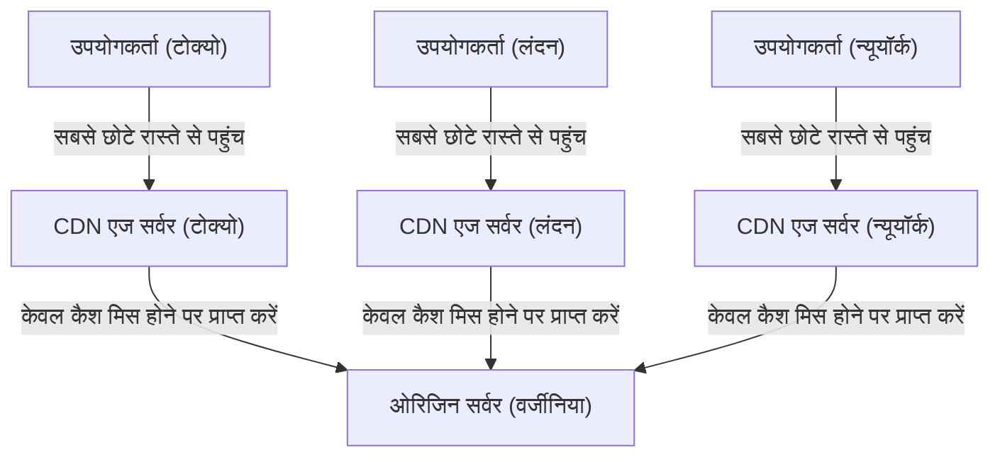

### 3.3 डायनेमिक ऑप्टिमाइजेशन और एज कंप्यूटिंग का आगमन

शुरुआती CDN केवल चित्र, वीडियो और स्थिर HTML फाइलों को कैश करने और वितरित करने वाला एक सरल तंत्र थे। हालाँकि, आधुनिक CDN अपने आप में एक विशाल वितरित कंप्यूटिंग प्लेटफॉर्म (distributed computing platform) के रूप में विकसित हो गए हैं।

पहला, डायनेमिक कंटेंट (जैसे उपयोगकर्ता-विशिष्ट खोज परिणाम या शॉपिंग कार्ट की सामग्री) के वितरण का अनुकूलन है। इन्हें कैश नहीं किया जा सकता, लेकिन CDN एज सर्वर और ओरिजिन सर्वर के बीच संचार पथ को स्वतंत्र रूप से अनुकूलित करते हैं (टियर्ड कैश या समर्पित उच्च गति वाले रूटिंग नेटवर्क का निर्माण करके) और मानक इंटरनेट पथ (BGP के बेस्ट-एफर्ट पथ) की तुलना में कम पैकेट नुकसान (packet loss) के साथ एक स्थिर और तेज संचार चैनल प्रदान करते हैं। इसके अलावा, एज सर्वर पर TCP कनेक्शन और TLS सत्रों को समाप्त (Terminate) करके, दूरस्थ स्थानों के साथ हैंडशेक राउंड-ट्रिप्स की संख्या को नाटकीय रूप से कम कर दिया जाता है।

दूसरा, "एज कंप्यूटिंग (Edge Computing)" का उदय है। पारंपरिक रूप से, जटिल एप्लिकेशन प्रोसेसिंग (प्रमाणीकरण, A/B परीक्षण, डायनेमिक इमेज रिसाइजिंग, कस्टम लॉजिक निष्पादन, आदि) ओरिजिन सर्वर के CPU पर किया जाता था। हालाँकि, अब Cloudflare Workers और AWS Lambda@Edge जैसी तकनीकों के साथ, डेवलपर्स V8 इंजन जैसे पृथक सैंडबॉक्स वातावरण का उपयोग करके उपयोगकर्ता के बहुत करीब स्थित एज सर्वर पर सीधे कोड (JavaScript, Rust, WebAssembly, आदि) को मिलीसेकंड के पैमाने पर निष्पादित कर सकते हैं। इसके परिणामस्वरूप, शाब्दिक अर्थ में "इंटरनेट की सीमा (एज)" ने एक विशाल वितरित कंप्यूटर के रूप में कार्य करना शुरू कर दिया है।

---

## 4. निष्कर्ष: भौतिक सीमाओं के साथ अंतहीन लड़ाई

इंटरनेट बुनियादी ढांचे का इतिहास प्रकाश की गति, थर्मोडायनामिक्स के दूसरे नियम, और ऊर्जा संरक्षण के नियम जैसे ब्रह्मांड को नियंत्रित करने वाले पूर्ण भौतिक नियमों के साथ लड़ाई का इतिहास है।

सबमरीन केबल्स के इंजीनियर गहरे समुद्र के भारी पानी के दबाव और कांच की ऑप्टिकल सीमाओं को चुनौती देते हैं, डेटा सेंटरों के डिजाइनर ऊष्मा पैदा करने वाले सिलिकॉन वेफर्स को ठंडा करने के लिए थर्मोडायनामिक सीमाओं को पार करने का प्रयास करते हैं, और CDN आर्किटेक्ट प्रकाश की गति की दीवार से बचने के लिए उन्नत वितरित प्रसंस्करण प्रणाली का निर्माण जारी रखे हुए हैं।

हम अपने स्मार्टफोन को टैप करके दुनिया भर की जानकारी तक तुरंत पहुंच सकते हैं, इसके पीछे यह विशाल, कठोर, और अत्यंत परिष्कृत भौतिक बुनियादी ढांचा मौजूद है। अध्याय 7 में, हम "रूटिंग और BGP की दुनिया" में गहराई से गोता लगाएंगे, और जानेंगे कि कैसे सॉफ्टवेयर और प्रोटोकॉल इस मजबूत भौतिक बुनियादी ढांचे के ऊपर वैश्विक स्तर पर एक स्वायत्त और वितरित नेटवर्क को बनाए रखते हैं।
# अध्याय 7: साइबर सुरक्षा और गोपनीयता की लड़ाई

इंटरनेट का इतिहास मुक्त रूप से जानकारी साझा करने के आदर्श और दुर्भावनापूर्ण हमलों से सिस्टम और डेटा की रक्षा करने के लिए निरंतर संघर्ष का भी इतिहास है। शुरुआत में, ARPANET के रूप में पैदा हुआ इंटरनेट, सीमित विश्वसनीय शोधकर्ताओं के बीच संचार की धारणा के साथ डिज़ाइन किया गया था। इसलिए, प्रोटोकॉल के मौलिक डिज़ाइन में "सुरक्षा" को पीछे छोड़ दिया गया था, और यह मानव स्वभाव के मूल रूप से अच्छा होने (性善説) पर आधारित एक वास्तुकला थी। हालांकि, जैसे-जैसे नेटवर्क का विश्व स्तर पर विस्तार हुआ, इसका व्यवसायीकरण हुआ, और इसने बुनियादी ढांचे के रूप में अपनी स्थिति स्थापित की, यह प्रारंभिक डिज़ाइन दर्शन एक घातक कमजोरी बन गया।

इस अध्याय में, हम आधुनिक इंटरनेट को हिला देने वाले सबसे बड़े खतरों में से एक, DDoS हमलों के भौतिक और नेटवर्क तंत्र, संचार की गोपनीयता सुनिश्चित करने के लिए एन्क्रिप्शन और VPN (वर्चुअल प्राइवेट नेटवर्क) प्रौद्योगिकियों, और परिधि रक्षा (boundary defense) की सीमाओं से पैदा हुई अगली पीढ़ी की सुरक्षा अवधारणा "ज़ीरो ट्रस्ट आर्किटेक्चर" के बारे में, प्रौद्योगिकी की गहराई में झांकते हुए चरम विस्तार से चर्चा करेंगे।

## 1. नेटवर्क की भौतिक सीमाएं और DDoS हमले की गतिशीलता

साइबर हमलों में सबसे आदिम होते हुए भी, सबसे कठिन हमलों में से एक **DDoS (Distributed Denial of Service: वितरित सेवा से इनकार) हमला** है। यह एक ऐसा हमला है जो लक्ष्य सर्वर या नेटवर्क उपकरणों को ट्रैफ़िक की इतनी बड़ी मात्रा भेजता है जो उनकी प्रसंस्करण क्षमता या बैंडविड्थ की सीमा को पार कर जाता है, जिससे वैध उपयोगकर्ताओं को सेवा प्रदान करना असंभव हो जाता है।

### ट्रैफ़िक की भौतिक संतृप्ति (Saturation): बैंडविड्थ की सीमाएं
इंटरनेट ऑप्टिकल फाइबर, तांबे के तारों और रेडियो तरंगों जैसे भौतिक माध्यमों के माध्यम से डेटा प्रसारित करता है। यद्यपि इन संचरण पथों में प्रकाश की वेवलेंथ-डिवीजन मल्टीप्लेक्सिंग (WDM) जैसी तकनीकों के माध्यम से टेराबिट-श्रेणी की संचार क्षमता हासिल की गई है, फिर भी उन लाइनों के बैंडविड्थ (जैसे 1Gbps या 10Gbps) पर सख्त भौतिक ऊपरी सीमाएं हैं जिनसे अलग-अलग सर्वर जुड़े हुए हैं। DDoS हमले इसी "पाइप की मोटाई" की सीमा का फायदा उठाते हैं। जब कोई हमलावर दुनिया भर में फैले सैकड़ों-हजारों मैलवेयर-संक्रमित उपकरणों (बॉटनेट) को नियंत्रित करता है और एक साथ लक्ष्य पर पैकेट भेजता है, तो राउटर और स्विच के इंटरफेस की बफर मेमोरी ओवरफ्लो हो जाती है, और पैकेट ड्रॉप होने लगते हैं। यह घटना द्रव गतिकी (fluid dynamics) में पाइप के बंद होने के समान है, और जिस क्षण सूचना की मात्रा (पैकेट की संख्या) प्रसंस्करण क्षमता से अधिक हो जाती है, यह संपूर्ण सिस्टम की खराबी का कारण बनती है।

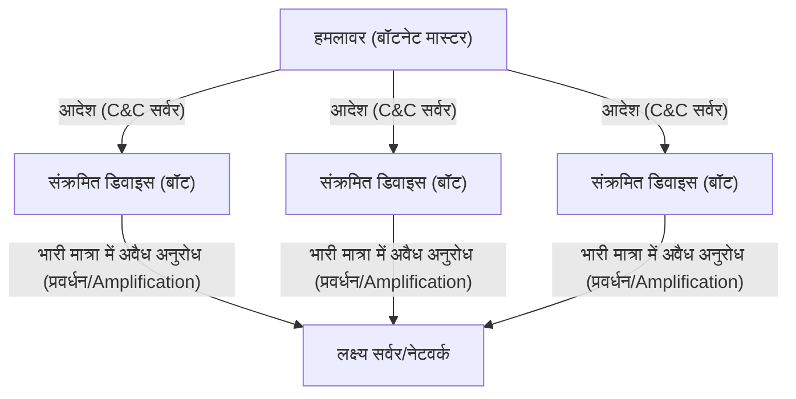

### TCP/IP की कमजोरियों का फायदा उठाना: SYN Flood हमला
बैंडविड्थ को भरने के अलावा, ऐसे हमले के तरीके भी हैं जो सर्वर के संसाधनों (CPU और मेमोरी) को समाप्त कर देते हैं। इसका एक प्रमुख उदाहरण **SYN Flood हमला** है। TCP प्रोटोकॉल में, संचार स्थापित करते समय, "3-वे हैंडशेक" (3-way handshake) नामक एक प्रक्रिया का पालन किया जाता है।
1. क्लाइंट "SYN" पैकेट भेजता है
2. सर्वर "SYN-ACK" पैकेट के साथ उत्तर देता है और कनेक्शन के लिए मेमोरी (TCB: Transmission Control Block) सुरक्षित करता है
3. क्लाइंट "ACK" पैकेट भेजता है और कनेक्शन स्थापित करता है

हमलावर नकली (स्पूफ किए गए) स्रोत IP पतों वाले भारी मात्रा में SYN पैकेट सर्वर को भेजते हैं। सर्वर SYN-ACK लौटाता है, लेकिन जाली IP पते का मालिक ACK वापस नहीं करता (या मौजूद नहीं होता)। परिणामस्वरूप, सर्वर बड़ी संख्या में "हॉफ-ओपन (Half-open)" कनेक्शनों के साथ फँस जाता है, कनेक्शन प्रबंधन के लिए मेमोरी क्षेत्र समाप्त हो जाता है, और इसे वैध उपयोगकर्ताओं के नए कनेक्शन अनुरोधों को अस्वीकार करने के लिए मजबूर होना पड़ता है। यह एक शानदार आक्रमण तंत्र है जो TCP की "विश्वसनीय संचार सुनिश्चित करने" की स्थिति-बनाए-रखने (stateful) वाली प्रकृति का फायदा उठाता है।

### रिफ्लेक्शन (प्रवर्धन) हमले: विषमता (Asymmetry) का दुरुपयोग
UDP (User Datagram Protocol) का उपयोग करने वाले **रिफ्लेक्शन हमले (प्रवर्धन हमले)** और भी अधिक चालाक होते हैं। UDP एक कनेक्शन-रहित (connectionless) प्रोटोकॉल है और यह स्रोत को सत्यापित नहीं करता है। हमलावर लक्ष्य के IP पते को स्रोत के रूप में जाली बनाता है और इंटरनेट पर सार्वजनिक DNS सर्वर या NTP सर्वर को अनुरोध भेजता है। इस समय, वे विशिष्ट क्वेरीज़ (जैसे DNS ANY क्वेरी या NTP monlist) का उपयोग करते हैं जो छोटे अनुरोध (कुछ दसियों बाइट्स) के जवाब में सैकड़ों से हजारों गुना बड़े आकार (कई किलोबाइट्स) की प्रतिक्रियाएं लौटाते हैं।
प्रवर्धित और विशाल प्रतिक्रिया पैकेट एक साथ जाली स्रोत, यानी लक्ष्य सर्वर की ओर हिमस्खलन की तरह गिरते हैं। हमलावर बहुत कम बैंडविड्थ की खपत करते हुए लक्ष्य के खिलाफ टेराबिट-श्रेणी का ट्रैफ़िक उत्पन्न करने में सक्षम हो जाते हैं। यह नेटवर्क पर भौतिकी में "लीवर के सिद्धांत" या ध्वनिक इंजीनियरिंग (acoustic engineering) में अनुनाद प्रवर्धन (resonance amplification) जैसी विषमता का कार्यान्वयन है।

## 2. संचार मार्गों की गोपनीयता: एन्क्रिप्शन और VPN तंत्र

इंटरनेट पर बहने वाले पैकेट, जो एक सार्वजनिक नेटवर्क है, रास्ते में कई राउटर्स और ISP उपकरणों के माध्यम से ले जाए जाते हैं। बिना एन्क्रिप्ट किए गए प्लेनटेक्स्ट (क्लियरटेक्स्ट) संचार को रास्ते में आसानी से इंटरसेप्ट (स्निफ़) किया जा सकता है या उसमें छेड़छाड़ की जा सकती है। गोपनीयता और डेटा की अखंडता की रक्षा के लिए "क्रिप्टोग्राफ़ी" (एन्क्रिप्शन तकनीक) और "VPN (वर्चुअल प्राइवेट नेटवर्क)" एक शक्तिशाली ढाल हैं।

### आधुनिक क्रिप्टोग्राफी की गणितीय नींव: सार्वजनिक कुंजी और सममित कुंजी का हाइब्रिड (Hybrid)
संचार की सुरक्षा के लिए मुख्य रूप से दो एन्क्रिप्शन विधियों का उपयोग किया जाता है:
- **सममित कुंजी एन्क्रिप्शन (जैसे AES)**: डेटा को एन्क्रिप्ट और डिक्रिप्ट करने के लिए एक ही कुंजी का उपयोग किया जाता है। प्रसंस्करण गति बहुत तेज होती है, लेकिन चुनौती यह है कि कुंजी को दूसरे पक्ष तक सुरक्षित रूप से कैसे पहुंचाया जाए (कुंजी वितरण समस्या)।
- **सार्वजनिक कुंजी एन्क्रिप्शन (जैसे RSA और अण्डाकार वक्र एन्क्रिप्शन/Elliptic Curve Cryptography)**: एन्क्रिप्शन के लिए "सार्वजनिक कुंजी" और डिक्रिप्शन के लिए "निजी कुंजी" की एक जोड़ी का उपयोग करता है। यह अभाज्य गुणनखंडन (prime factorization) की कठिनाई और असतत लघुगणक समस्याओं (discrete logarithm problems) जैसे उन्नत गणितीय गुणों (विषमता) पर आधारित है। इसकी कम्प्यूटेशनल लागत अधिक होती है।

इंटरनेट पर सुरक्षित संचार (TLS/SSL और VPN) में, इन दोनों को मिलाकर एक हाइब्रिड विधि का उपयोग किया जाता है। सबसे पहले, संचार की शुरुआत में हैंडशेक के दौरान, सार्वजनिक कुंजी एन्क्रिप्शन का उपयोग करके सुरक्षित रूप से एक "सत्र कुंजी (सममित कुंजी)" का आदान-प्रदान किया जाता है। फिर, बाद में बड़े डेटा के संचार के लिए, तेज़ सत्र कुंजी का उपयोग करके एन्क्रिप्शन किया जाता है। इसके द्वारा, सुरक्षित कुंजी वितरण और उच्च गति वाले एन्क्रिप्टेड संचार दोनों को प्राप्त किया जाता है।

### VPN और टनेलिंग (Tunneling) का सिद्धांत
**VPN (वर्चुअल प्राइवेट नेटवर्क)** एक ऐसी तकनीक है जो सार्वजनिक इंटरनेट पर एक आभासी "समर्पित रेखा (टनल)" बनाने के लिए एन्क्रिप्शन तकनीक का उपयोग करती है। इसके विशिष्ट प्रोटोकॉल में IPsec, OpenVPN और हाल ही में WireGuard शामिल हैं।

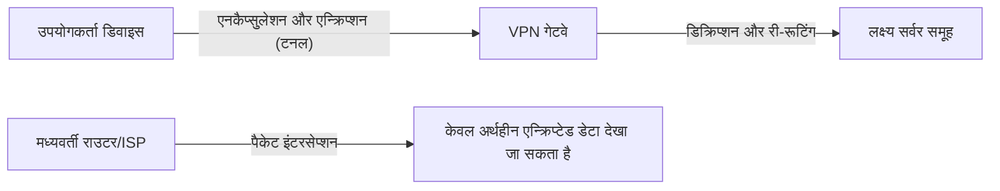

टनेलिंग का मुख्य तंत्र "एनकैप्सुलेशन (Encapsulation)" में निहित है। यह उपयोगकर्ता द्वारा भेजे जाने वाले संपूर्ण मूल IP पैकेट (पेलोड) को एन्क्रिप्ट करता है, और फिर इसे एक नए IP पैकेट के डेटा भाग के रूप में लपेटता (एनकैप्सुलेट करता) है, और इसके बाहर VPN सर्वर को संबोधित एक नया IP हेडर जोड़ता है।
रास्ते में इंटरनेट राउटर केवल बाहरी IP हेडर को देखते हैं और पैकेट को VPN सर्वर पर अग्रेषित (फॉरवर्ड) करते हैं। चूंकि सामग्री मजबूती से एन्क्रिप्टेड होती है, भले ही पैकेट को इंटरसेप्ट किया जाए, संचार सामग्री का विश्लेषण करना तो दूर, मूल गंतव्य IP पते का विश्लेषण करना भी मुश्किल है। VPN सर्वर पर पहुंचने वाले पैकेट को डिक्रिप्ट किया जाता है, मूल हेडर को निकाला जाता है, और इसे अंतिम गंतव्य पर भेजा जाता है। इस प्रकार, भौतिक रूप से किसी के भी द्वारा सुलभ बुनियादी ढांचे पर, एक तार्किक और गणितीय रूप से संरक्षित निजी स्थान बनाया जाता है।

## 3. परिधि रक्षा का पतन और ज़ीरो ट्रस्ट आर्किटेक्चर का उदय

कई वर्षों से, कॉर्पोरेट और संगठनात्मक नेटवर्क सुरक्षा "परिधि रक्षा (पेरीमीटर मॉडल)" नामक अवधारणा पर निर्भर थी। यह महल जैसी रक्षा रणनीति थी जहाँ इंटरनेट (बाहरी) और कंपनी के नेटवर्क (आंतरिक) के बीच की सीमा पर फ़ायरवॉल और IPS (घुसपैठ रोकथाम प्रणाली) स्थापित किए गए थे, और यह माना गया था कि "बाहर खतरा है, अंदर सुरक्षित है।"

### क्लाउड और टेलीवर्क द्वारा लाया गया सीमाओं का नुकसान
हालांकि, आधुनिक समय में यह मॉडल पूरी तरह से विफल हो गया है। SaaS (सॉफ़्टवेयर एज़ अ सर्विस) के प्रसार के साथ, महत्वपूर्ण डेटा कंपनी के बाहर क्लाउड में रखा जाने लगा है, और टेलीवर्क के सामान्य होने के कारण कर्मचारी घरों या कैफे के वाई-फाई से नेटवर्क तक पहुंचने लगे हैं। "सुरक्षित किए जाने वाले अंदर" और "खतरनाक बाहर" के बीच की सीमा रेखा पिघल गई है और गायब हो गई है, जिससे ऐसा ट्रैफ़िक विस्फोटक रूप से बढ़ गया है जिसे पारंपरिक फ़ायरवॉल द्वारा नियंत्रित नहीं किया जा सकता है। इसके अलावा, एक बार जब मैलवेयर (जैसे रैंसमवेयर) या कोई दुर्भावनापूर्ण अंदरूनी व्यक्ति आंतरिक नेटवर्क में प्रवेश कर जाता है, तो परिधि रक्षा शक्तिहीन हो जाती है। यह धारणा कि "अंदर पर भरोसा किया जा सकता है" सबसे बड़ी भेद्यता बन गई है।

### ज़ीरो ट्रस्ट (Zero Trust): Trust Nothing, Verify Everything (किसी पर भरोसा न करें, सब कुछ सत्यापित करें)
इस प्रतिमान बदलाव (paradigm shift) का जवाब देने के लिए **"ज़ीरो ट्रस्ट आर्किटेक्चर (Zero Trust Architecture: ZTA)"** का प्रस्ताव किया गया था। ज़ीरो ट्रस्ट का मूल दर्शन यह है कि "नेटवर्क के स्थान (कंपनी के अंदर या बाहर) की परवाह किए बिना, डिफ़ॉल्ट रूप से किसी भी संचार पर भरोसा न करें (Never Trust, Always Verify)।"

ज़ीरो ट्रस्ट मॉडल में, सुरक्षा का ध्यान "नेटवर्क परिधि" से हटकर "पहचान (उपयोगकर्ता और उपकरण)" और "संसाधन (डेटा और एप्लिकेशन)" पर स्थानांतरित हो जाता है।

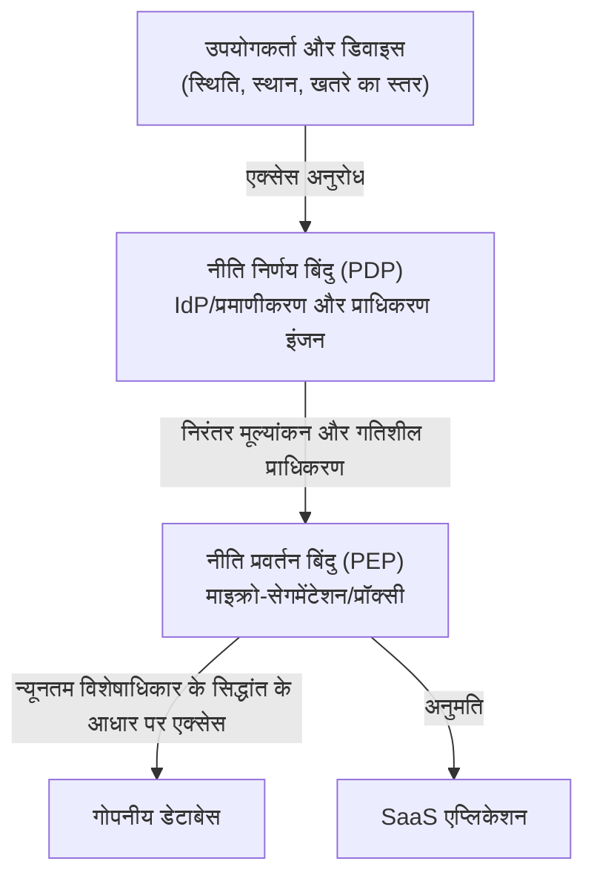

ज़ीरो ट्रस्ट को साकार करने के लिए मुख्य तकनीकी घटक निम्नलिखित हैं:

1. **पहचान और एक्सेस प्रबंधन (IAM/IdP)**: न केवल पासवर्ड, बल्कि उपयोगकर्ताओं की पहचान को मजबूती से सत्यापित करने के लिए MFA (मल्टी-फैक्टर ऑथेंटिकेशन) और बायोमेट्रिक प्रमाणीकरण का संयोजन करता है।
2. **डिवाइस पॉस्चर (स्वास्थ्य) मूल्यांकन**: एक्सेस का अनुरोध करने वाले डिवाइस की OS पैच स्थिति, एंटीवायरस सॉफ़्टवेयर की कार्यशील स्थिति, और पिछले व्यवहार आदि का वास्तविक समय में मूल्यांकन करता है। असुरक्षित उपकरणों से एक्सेस को तुरंत ब्लॉक कर दिया जाता है।
3. **माइक्रो-सेगमेंटेशन (Microsegmentation)**: नेटवर्क को बारीक हिस्सों में विभाजित करता है और प्रत्येक संसाधन के लिए बहुत छोटी सीमाएँ निर्धारित करता है। यह एक ऐसी संरचना है जो घुसपैठ होने की स्थिति में भी क्षैतिज फैलाव (लेटरल मूवमेंट/lateral movement) को रोकती है।
4. **निरंतर प्रमाणीकरण और गतिशील नीतियां**: सिर्फ इसलिए कि कोई एक बार सफलतापूर्वक लॉग इन कर लेता है, इसका मतलब यह नहीं है कि उस पर भरोसा किया जाता रहेगा। सत्र (session) के दौरान भी व्यवहार (जैसे स्रोत IP में परिवर्तन, असामान्य डेटा डाउनलोड मात्रा आदि) की लगातार निगरानी की जाती है, और गतिशील नियंत्रण लागू किया जाता है जो जोखिम स्कोर एक निश्चित सीमा से अधिक होते ही सत्र को काट देता है।

ज़ीरो ट्रस्ट कोई उत्पाद मात्र नहीं है, बल्कि यह एक डिज़ाइन दर्शन है कि "हर बार हर एक्सेस को सत्यापित करें और केवल आवश्यक न्यूनतम विशेषाधिकार (Least Privilege) प्रदान करें," और आधुनिक विकेंद्रीकृत IT बुनियादी ढांचे में डेटा की सुरक्षा के लिए यह एकमात्र व्यावहारिक समाधान बन गया है।

## 4. भविष्य की सुरक्षा: क्वांटम क्रिप्टोग्राफी और अगली पीढ़ी के नेटवर्क की रक्षा

वर्तमान में हम जिन RSA और एलिप्टिक कर्व क्रिप्टोग्राफी पर निर्भर हैं, वे इस आधार पर आधारित हैं कि "वर्तमान कंप्यूटरों की कंप्यूटिंग शक्ति के साथ इसे डिक्रिप्ट करने में खगोलीय समय लगेगा।" हालांकि, अगर क्वांटम यांत्रिकी (quantum mechanics) के सिद्धांतों को लागू करने वाले "क्वांटम कंप्यूटर" व्यावहारिक उपयोग में आते हैं, तो इस बात का खतरा है कि शोर के एल्गोरिदम (Shor's algorithm) आदि के माध्यम से ये गणितीय समस्याएं तुरंत हल हो जाएंगी। इसे **"Q-Day (क्वांटम कंप्यूटर द्वारा डिक्रिप्शन का दिन)"** कहा जाता है।

इसका मुक़ाबला करने के लिए वर्तमान में दो दृष्टिकोणों पर शोध किया जा रहा है:
पहला एक नए एन्क्रिप्शन एल्गोरिदम का मानकीकरण है जिसे गणितीय रूप से क्वांटम कंप्यूटरों के लिए भी समझना मुश्किल है, जिसे **"पोस्ट-क्वांटम क्रिप्टोग्राफी (PQC)"** कहा जाता है (जैसे लैटिस क्रिप्टोग्राफी/lattice cryptography)।
दूसरा है **"क्वांटम की डिस्ट्रीब्यूशन (QKD: Quantum Key Distribution)"**, जो सुरक्षा के आधार के रूप में भौतिकी (क्वांटम यांत्रिकी) के नियमों का ही उपयोग करता है। यह एक ऐसी तकनीक है जो फोटॉन की क्वांटम अवस्था (जैसे ध्रुवीकरण/polarization) में जानकारी एम्बेड करके कुंजी वितरित करती है। जिस क्षण कोई ईव्सड्रॉपर (चुपके से सुनने वाला) फोटॉन का निरीक्षण (कॉपी) करने का प्रयास करता है, क्वांटम अवस्था बदल जाती है (पर्यवेक्षक प्रभाव/अनिश्चितता सिद्धांत), जिससे यह परम सुरक्षित संचार बन जाता है जहाँ ईव्सड्रॉपिंग का भौतिक रूप से 100% पता लगाया जा सकता है।

## निष्कर्ष

इंटरनेट का अध्याय 7, "सुविधा" और "सुरक्षा" के बीच एक निरंतर सी-सॉ (seesaw) का खेल है। DDoS हमलों के माध्यम से भौतिक परत की संतृप्ति से लेकर, एन्क्रिप्शन प्रौद्योगिकी के माध्यम से गणितीय सुरक्षा, और ज़ीरो ट्रस्ट के वास्तुकला प्रतिमान बदलाव तक, साइबर सुरक्षा केवल IT तकनीक की सीमाओं को पार कर गई है और एक अत्यधिक उन्नत शैक्षणिक क्षेत्र में विकसित हुई है जहां भौतिकी, गणित और व्यवहार मनोविज्ञान एक-दूसरे को काटते हैं।
हम लापरवाही से अपना ब्राउज़र खोलते हैं और क्लाउड में डेटा में हेरफेर करते हैं, लेकिन इसके पीछे, अदृश्य हमलावरों और रक्षा प्रणालियों के बीच मिलीसेकंड के स्तर पर एक भयंकर इलेक्ट्रॉनिक युद्ध 24 घंटे, साल के 365 दिन चलता रहता है।

अगले और अंतिम अध्याय, अध्याय 8 में, हम इंटरनेट के भविष्य का पता लगाएंगे, अर्थात् अगली पीढ़ी के नेटवर्क प्रतिमान जैसे कि वेब 3.0, मेटावर्स, और इंटरप्लेनेटरी इंटरनेट (Interplanetary Internet)।


# अध्याय 8: भविष्य का इंटरनेट —— विकेंद्रीकरण, बाहरी अंतरिक्ष और क्वांटम यांत्रिकी द्वारा बुना गया अगली पीढ़ी का नेटवर्क

पिछले कुछ दशकों में, इंटरनेट मानव इतिहास के सबसे प्रभावशाली सूचना बुनियादी ढांचे के रूप में विकसित होता रहा है। 1960 के दशक में ARPANET में पैकेट-स्विचिंग तकनीक की स्थापना से शुरू होकर, TCP/IP प्रोटोकॉल सूट के मानकीकरण, WWW (वर्ल्ड वाइड वेब) के आविष्कार और मोबाइल ब्रॉडबैंड के प्रसार तक, इसकी प्रगति रुकने का नाम नहीं ले रही है। हालाँकि, जिस इंटरनेट का हम वर्तमान में उपयोग कर रहे हैं, वह वास्तुशिल्प की मूलभूत सीमाओं और भौतिक बाधाओं का सामना कर रहा है। इनमें डेटा केंद्रों के विशाल होने से जुड़ी केंद्रीकरण की कमियाँ, अंतरमहाद्वीपीय संचार में ऑप्टिकल फाइबर की भौतिक विलंबता (latency), और कंप्यूटिंग शक्ति में घातांकीय वृद्धि (विशेषकर क्वांटम कंप्यूटर के उदय) के कारण मौजूदा एन्क्रिप्शन प्रौद्योगिकियों की भेद्यता शामिल हैं।

इस अध्याय में, "अध्याय 8: भविष्य का इंटरनेट" शीर्षक के तहत, हम वर्तमान में चल रहे प्रतिमान बदलाव (paradigm shift) में सबसे आगे के विकासों का पता लगाएंगे। विशेष रूप से, हम तीन स्तंभों: "Web3 और विकेंद्रीकृत वास्तुकला" जो केंद्रीकरण से दूर जाने का लक्ष्य रखता है, "लो अर्थ ऑर्बिट (LEO) सैटेलाइट संचार नेटवर्क (जैसे Starlink)" जो भौतिक बुनियादी ढांचे की बाधाओं को बाहरी अंतरिक्ष तक विस्तारित करता है, और "क्वांटम इंटरनेट" जो भौतिकी के अंतिम नियमों को संचार में लागू करता है, की ऐतिहासिक पृष्ठभूमि, भौतिकी और तकनीकी तंत्र को एक पेशेवर दृष्टिकोण से अत्यंत विस्तार से स्पष्ट करेंगे।

---

## 8.1 Web3 और विकेंद्रीकृत वास्तुकला का वास्तविक मूल्य: एक ट्रस्टलेस नेटवर्क का निर्माण

वर्तमान इंटरनेट (Web 2.0) विशाल प्लेटफॉर्म कंपनियों द्वारा डेटा के केंद्रीकृत प्रबंधन पर आधारित है। हालांकि क्लाइंट-सर्वर मॉडल कुशल है, लेकिन इसमें संरचनात्मक चुनौतियाँ हैं जैसे कि सिंगल पॉइंट ऑफ़ फेलियर (SPOF) की उपस्थिति, सेंसरशिप की आसानी, और उपयोगकर्ता डेटा की गोपनीयता का उल्लंघन। इसका वास्तुकला-स्तर (architecture-level) का समाधान "Web3" और विकेंद्रीकृत नेटवर्क तकनीक है।

### 8.1.1 कंटेंट-ओरिएंटेड नेटवर्क और IPFS
पारंपरिक वेब (HTTP) "स्थान-उन्मुख (location-oriented)" है। यानी, आप सूचना को "यह कहाँ स्थित है (URL)" निर्दिष्ट करके एक्सेस करते हैं। हालाँकि, इस तंत्र में, यदि सर्वर डाउन हो जाता है या डोमेन समाप्त हो जाता है, तो सामग्री स्वयं ही गायब हो जाती है, जिससे "टूटा हुआ लिंक (404 Not Found)" उत्पन्न होता है।

इसके विपरीत, IPFS (InterPlanetary File System) जैसे विकेंद्रीकृत भंडारण (स्टोरेज) सिस्टम "सामग्री-उन्मुख (Content-Addressed)" वास्तुकला को अपनाते हैं। डेटा को एक अद्वितीय "सामग्री पहचानकर्ता (CID)" का उपयोग करके एक्सेस किया जाता है, जो फ़ाइल की सामग्री को क्रिप्टोग्राफ़िक हैश फ़ंक्शन (जैसे SHA-256) के माध्यम से गुजार कर प्राप्त किया जाता है।

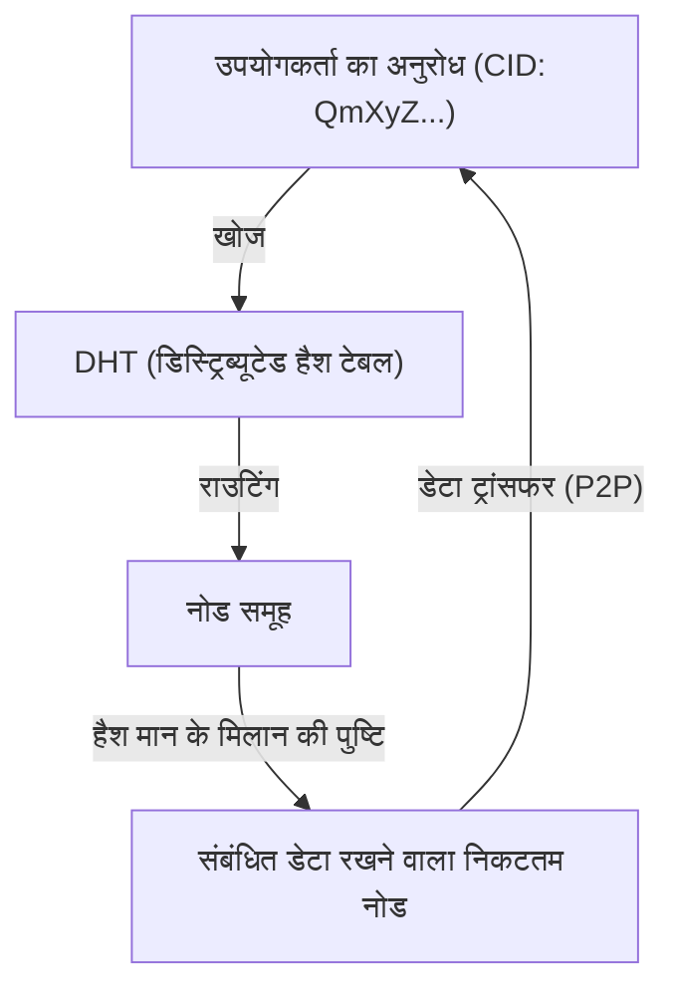

इस तंत्र का मूल काडेमलिया (Kademlia) एल्गोरिदम है, जो एक प्रकार का DHT (डिस्ट्रिब्यूटेड हैश टेबल) है। काडेमलिया नोड आईडी और डेटा आईडी के बीच की "दूरी" को XOR ऑपरेशन (एक्सक्लूसिव OR) द्वारा परिभाषित करता है। यह संपूर्ण नेटवर्क टोपोलॉजी को कुशलतापूर्वक मैप करना संभव बनाता है, और $O(\log N)$ की कम्प्यूटेशनल जटिलता के साथ लक्षित डेटा रखने वाले नोड को खोजने की अनुमति देता है। क्योंकि डेटा दुनिया भर के नोड्स में वितरित और दोहराया (replicated) जाता है, भले ही कुछ नोड ऑफ़लाइन हो जाएं, डेटा तक पहुंच बनी रहती है, और इसमें सेंसरशिप के खिलाफ मजबूत प्रतिरोध होता है।

### 8.1.2 विकेंद्रीकृत सर्वसम्मति और क्रिप्टोग्राफ़िक प्रमाण
Web3 की एक अन्य नींव ब्लॉकचेन तकनीक है। यह एक "सर्वसम्मति एल्गोरिदम (consensus algorithm)" पर आधारित है जो यह सहमति देता है कि विकेंद्रीकृत नेटवर्क में केंद्रीय व्यवस्थापक के हस्तक्षेप के बिना "कौन सही स्थिति रिकॉर्ड कर रहा है"।
प्रारंभ में बिटकॉइन में अपनाई गई PoW (प्रूफ़ ऑफ़ वर्क), एक ऐसा तंत्र था जिसने हैश फ़ंक्शंस के टकराव प्रतिरोध (collision resistance) का उपयोग किया और भारी मात्रा में कम्प्यूटेशनल ऊर्जा का निवेश करके डेटा से छेड़छाड़ को भौतिक रूप से कठिन बना दिया। हालाँकि, ऊर्जा खपत के दृष्टिकोण से, वर्तमान में PoS (प्रूफ़ ऑफ़ स्टेक) की ओर संक्रमण (transition) चल रहा है।

Ethereum 2.0 आदि में अपनाए गए PoS में, वैलिडेटर्स जिन्होंने अपनी क्रिप्टो संपत्ति को स्टेक (संपार्श्विक) किया है, BLS (Boneh-Lynn-Shacham) सिग्नेचर नामक एक विशेष पेयरिंग-आधारित क्रिप्टोग्राफी तकनीक का उपयोग करके हस्ताक्षरों को एकत्र करते हैं। यह दसियों से लेकर सैकड़ों हजारों नोड्स द्वारा किए गए डिजिटल हस्ताक्षरों को एक छोटे से डेटा आकार में संपीड़ित करता है, जिससे विकेंद्रीकृत नेटवर्क होने के बावजूद उच्च सुरक्षा और एक निश्चित स्तर की स्केलेबिलिटी दोनों प्राप्त होती है। भविष्य के इंटरनेट में, यह माना जाता है कि इन तकनीकों को OSI संदर्भ मॉडल की एक नई परत (मूल्य हस्तांतरण और सर्वसम्मति परत) के रूप में TCP/IP के ऊपर मानक रूप में लागू किया जाएगा।

---

## 8.2 पृथ्वी को घेरने वाला सैटेलाइट संचार नेटवर्क: Starlink और उससे आगे

जमीन पर बिछाया गया ऑप्टिकल फाइबर नेटवर्क आधुनिक इंटरनेट की रीढ़ है। हालाँकि, सबमरीन (समुद्र के नीचे) केबल बिछाने की लागत, स्थलाकृतिक बाधाएं, और सबसे बढ़कर, "माध्यम में प्रकाश की गति" जैसी भौतिक बाधाएं मौजूद हैं। SpaceX के Starlink द्वारा प्रतिनिधित्व किया गया लो अर्थ ऑर्बिट (LEO) उपग्रह तारामंडल (satellite constellation), बाहरी अंतरिक्ष के नए मोर्चे में इन चुनौतियों को हल करने का प्रयास कर रहा है।

### 8.2.1 कक्षीय यांत्रिकी और लो अर्थ ऑर्बिट (LEO) के लाभ
जियोस्टेशनरी अर्थ ऑर्बिट (GEO) उपग्रह लगभग 35,786 किमी की ऊंचाई पर स्थित होते हैं और पृथ्वी के घूर्णन के साथ सिंक्रनाइज़ होते हैं, जिससे एंटीना की दिशा को स्थिर रखने का लाभ मिलता है। हालाँकि, चूंकि रेडियो तरंगें केवल आगे और पीछे यात्रा करने में 70,000 किमी से अधिक की दूरी तय करती हैं, भौतिक बाधाओं से उत्पन्न होने वाली देरी (latency) अपरिहार्य है (केवल एक तरफ के लिए लगभग 120 मिलीसेकंड, और प्रभावी विलंबता 500 मिलीसेकंड से अधिक)।

दूसरी ओर, Starlink उपग्रह लगभग 550 किमी की ऊंचाई पर निचली कक्षा में रखे जाते हैं। केप्लर के तीसरे नियम पर आधारित कक्षीय यांत्रिकी (orbital mechanics) के अनुसार, इस ऊंचाई पर, पृथ्वी के गुरुत्वाकर्षण और केन्द्रापसारक बल (centrifugal force) को संतुलित करने के लिए, उपग्रह को पृथ्वी की परिक्रमा लगभग 7.6 किमी/सेकेंड (लगभग 27,000 किमी/घंटा) की भयंकर गति से करनी चाहिए (लगभग 90 मिनट में पृथ्वी का एक चक्कर)।
इस कम ऊंचाई के कारण, रेडियो तरंगों का भौतिक प्रसार समय नाटकीय रूप से GEO के लगभग 1/65वें हिस्से तक कम हो जाता है, और सैद्धांतिक संचार विलंबता स्थलीय ऑप्टिकल फाइबर (20-40 मिलीसेकंड) के बराबर या उससे कम हो जाती है।

### 8.2.2 फेज़्ड एरे एंटीना और रेडियो तरंगों का वेवफ्रंट नियंत्रण
चूँकि उपग्रह उच्च गति से चलते हैं, ग्राउंड-आधारित उपयोगकर्ता टर्मिनलों (सपाट एंटेना जिनमें पैराबोलिक एंटेना जैसे भौतिक चलने वाले हिस्से नहीं होते हैं) को आकाश से गुजरने वाले उपग्रहों को विद्युत रूप से ट्रैक करना चाहिए। यहीं पर "फेज़्ड एरे एंटीना (Phased Array Antenna)" का उपयोग किया जाता है।
हज़ारों छोटे एंटीना तत्व एक समतल सतह पर व्यवस्थित होते हैं, और प्रत्येक तत्व से निकलने वाली रेडियो तरंगों के "फेज़ (तरंग के समय)" को जानबूझकर माइक्रोसेकंड द्वारा स्थानांतरित किया जाता है। ह्यूजेंस के सिद्धांत (Huygens' principle) के अनुसार, प्रत्येक तत्व से गोलाकार तरंगें (spherical waves) एक-दूसरे के साथ हस्तक्षेप करती हैं, जिससे एक बीम बनता है जहां तरंगें केवल एक विशिष्ट दिशा (रचनात्मक हस्तक्षेप) में मजबूत होती हैं। यह भौतिक रूप से एंटीना को हिलाए बिना, केवल सॉफ्टवेयर नियंत्रण के साथ, संचार बीम को लक्षित उपग्रह की ओर तुरंत निर्देशित करना संभव बनाता है।

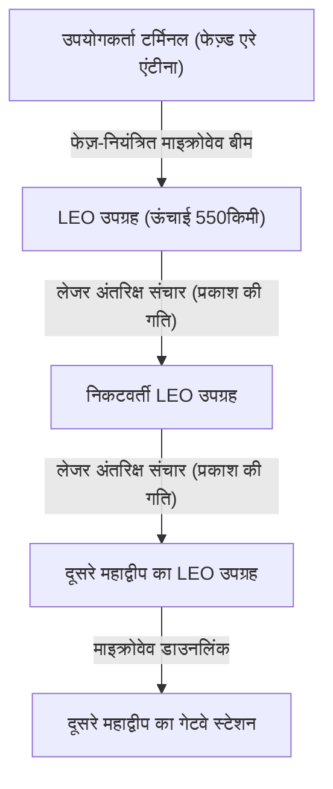

### 8.2.3 ऑप्टिकल इंटर-सैटेलाइट लिंक (OISL) और "निर्वात में प्रकाश की गति" का पूर्ण लाभ
Starlink नेटवर्क की सच्ची क्रांति ऑप्टिकल इंटरसैटेलाइट लिंक्स (OISL) में निहित है।
आधुनिक लंबी दूरी का संचार ऑप्टिकल फाइबर पर निर्भर करता है, लेकिन ऑप्टिकल फाइबर के कोर (क्वार्ट्ज ग्लास) का अपवर्तनांक (refractive index) लगभग 1.47 है। भौतिकी में, किसी माध्यम में प्रकाश की गति $v = c / n$ ($c$ निर्वात में प्रकाश की गति है, $n$ अपवर्तनांक है) द्वारा व्यक्त की जाती है। दूसरे शब्दों में, ऑप्टिकल फाइबर के अंदर प्रकाश की गति गिरकर लगभग 200,000 किमी/सेकेंड रह जाती है।

इसके विपरीत, चूँकि बाहरी अंतरिक्ष (निर्वात) का अपवर्तनांक लगभग 1 है, उपग्रहों के बीच लेजर संचार निर्वात में प्रकाश की गति, $c \approx 300,000$ किमी/सेकेंड पर होता है।
उदाहरण के लिए, यदि हम लंदन से न्यूयॉर्क में डेटा ट्रांसफर पर विचार करें, तो अटलांटिक महासागर में सबमरीन केबल से गुजरने की तुलना में, डेटा को एक बार अंतरिक्ष में लॉन्च करना, निर्वात अंतरिक्ष के माध्यम से लेजर प्रकाश द्वारा स्थानांतरित करना, और फिर से इसे वापस जमीन पर लाने का मार्ग सैद्धांतिक रूप से पूर्ण विलंबता (latency) को कम कर सकता है। यह वित्त में उच्च-आवृत्ति व्यापार (HFT) और वैश्विक रीयल-टाइम सिस्टम में एक निर्णायक प्रतिमान बदलाव लाएगा। भविष्य में, दसियों हज़ार उपग्रह पृथ्वी को घेर लेंगे, जिससे एक जाल (मेश नेटवर्क) पूरा होगा जहाँ BGP (बॉर्डर गेटवे प्रोटोकॉल) को बदलने के लिए एक गतिशील, त्रि-आयामी (three-dimensional) बाहरी अंतरिक्ष राउटिंग प्रोटोकॉल संचालित होगा।

---

## 8.3 क्वांटम इंटरनेट: एंटेंगलमेंट (उलझाव) द्वारा लाया गया अंतिम संचार

यदि Web3 "विश्वास" की वास्तुकला का पुनर्निर्माण करता है, और सैटेलाइट संचार नेटवर्क "अंतरिक्ष और गति" की बाधाओं को तोड़ता है, तो "क्वांटम इंटरनेट" सूचना के "सुरक्षा और संचरण (transmission) के साधन" में भौतिकी का चरम है। क्वांटम इंटरनेट मौजूदा TCP/IP नेटवर्क को प्रतिस्थापित नहीं करता है, बल्कि यह इसका पूरक है और पूरी तरह से नए भौतिक नियमों के आधार पर सूचना संचरण चैनल प्रदान करने वाला अगली पीढ़ी का बुनियादी ढांचा है।

### 8.3.1 क्वांटम यांत्रिकी की मूल बातें: सुपरपोजिशन और एंटेंगलमेंट
शास्त्रीय कंप्यूटर और इंटरनेट वोल्टेज की ऊंचाई (उच्च/निम्न) को "0" या "1" के बिट्स के रूप में मानते हैं। हालाँकि, क्वांटम इंटरनेट में, सूचना को क्वांटम बिट्स (क्यूबिट्स) के रूप में प्रेषित किया जाता है। फोटॉन (photon) की ध्रुवीकरण स्थिति (जैसे ऊर्ध्वाधर या क्षैतिज कंपन) का उपयोग करके, यह "सुपरपोजिशन (Superposition)" के सिद्धांत का उपयोग करता है जहाँ "0" और "1" एक साथ मौजूद होते हैं।

इससे भी महत्वपूर्ण "क्वांटम एंटेंगलमेंट (Quantum Entanglement)" है। जब दो कण उलझी हुई (entangled) अवस्था में होते हैं, तो भले ही वे भौतिक रूप से कितने भी दूर हों (भले ही वे पृथ्वी और मंगल ग्रह की दूरी पर हों), जिस क्षण एक कण की स्थिति को मापा जाता है और निर्धारित किया जाता है, उसी क्षण दूसरे कण की स्थिति भी बिना किसी समय अंतराल के तुरंत निर्धारित हो जाती है। यह गैर-स्थानीय भौतिक घटना, जिसे आइंस्टीन ने "दूरी पर डरावनी कार्रवाई (spooky action at a distance)" कहा था, क्वांटम इंटरनेट की रीढ़ बन जाएगी।

### 8.3.2 क्वांटम की डिस्ट्रीब्यूशन (QKD) और भौतिक रूप से पूर्ण सुरक्षा
वर्तमान में, इंटरनेट संचार की सुरक्षा करने वाली RSA क्रिप्टोग्राफी और एलीप्टिक-कर्व (elliptic-curve) क्रिप्टोग्राफी इस गणितीय कठिनाई पर निर्भर करती हैं कि "बड़े पूर्णांकों का गुणनखंड करने में बहुत लंबा कम्प्यूटेशनल समय लगता है।" हालाँकि, यदि शोर के एल्गोरिदम (Shor's algorithm) को लागू करने में सक्षम एक बड़े पैमाने का क्वांटम कंप्यूटर साकार हो जाता है, तो ये एन्क्रिप्शन कम समय में ही टूट जाएंगे।

इसलिए, क्वांटम की डिस्ट्रीब्यूशन (QKD) से काफी उम्मीदें हैं। विशिष्ट BB84 प्रोटोकॉल में, एन्क्रिप्शन कुंजियों (keys) को प्रसारित करने के लिए एकल फोटॉन (single photons) का उपयोग किया जाता है। क्वांटम यांत्रिकी के मूल सिद्धांत, "हाइजेनबर्ग के अनिश्चितता सिद्धांत (Heisenberg's Uncertainty Principle)" के अनुसार, यदि कोई तीसरा पक्ष (कॉल सुनने वाला/eavesdropper) उड़ान में फोटॉन को मापने (सुनने) का प्रयास करता है, तो उसी क्षण क्वांटम अवस्था बदल जाएगी (डिकोहिरेंस)। इसके अलावा, "नो-क्लोनिंग प्रमेय (No-Cloning Theorem)" के कारण, किसी अज्ञात क्वांटम अवस्था की सटीक रूप से प्रतिलिपि बनाना भौतिक रूप से असंभव है।
दूसरे शब्दों में, यदि संचार पथ पर कोई छिपकर बातें सुनने (wiretapping) की क्रिया होती है, तो प्राप्तकर्ता भौतिकी के नियमों के स्तर पर त्रुटि दर में असामान्य वृद्धि के रूप में निश्चित रूप से इसका पता लगा सकता है। सुरक्षित यादृच्छिक संख्याओं (random numbers) को साझा करके जिनके बारे में गारंटी दी जाती है कि उन्हें सुना नहीं गया है, और उन्हें वन-टाइम पैड (One-Time Pad) एन्क्रिप्शन के साथ जोड़कर, परम सुरक्षा प्राप्त की जा सकती है जिसे किसी भी कम्प्यूटेशनल शक्ति वाले कंप्यूटर (यहां तक कि ब्रह्मांड-स्तर के सुपर कंप्यूटर) द्वारा भी डिक्रिप्ट (decrypt) करना बिल्कुल असंभव है।

### 8.3.3 क्वांटम टेलीपोर्टेशन और क्वांटम रिपीटर्स की बाधा
क्वांटम इंटरनेट का अंतिम लक्ष्य "क्वांटम टेलीपोर्टेशन" की नेटवर्किंग है, जो क्वांटम अवस्थाओं को दूसरे स्थान पर स्थानांतरित करने के लिए एंटेंगलमेंट का उपयोग करता है। यह एक "क्वांटम क्लाउड" को संभव बनाएगा, जो विकेंद्रीकृत क्वांटम कंप्यूटरों को एक दूसरे से जोड़ेगा और उन्हें एक ही विशाल क्वांटम कंप्यूटर के रूप में कार्य करने देगा।

हालाँकि, तकनीकी बाधाएँ अभी भी बहुत अधिक हैं। जब फोटॉन ऑप्टिकल फाइबर के माध्यम से यात्रा करते हैं तो वे अवशोषित या बिखर जाते हैं (क्षीणन / attenuation)। शास्त्रीय संचार में, सिग्नल को मजबूत करने के लिए रास्ते में "एम्पलीफायर (amplifiers)" लगाए जाते हैं, लेकिन क्वांटम संचार में, उपर्युक्त "नो-क्लोनिंग प्रमेय" के कारण, फोटॉन को कॉपी और प्रवर्धित (amplified) नहीं किया जा सकता है।

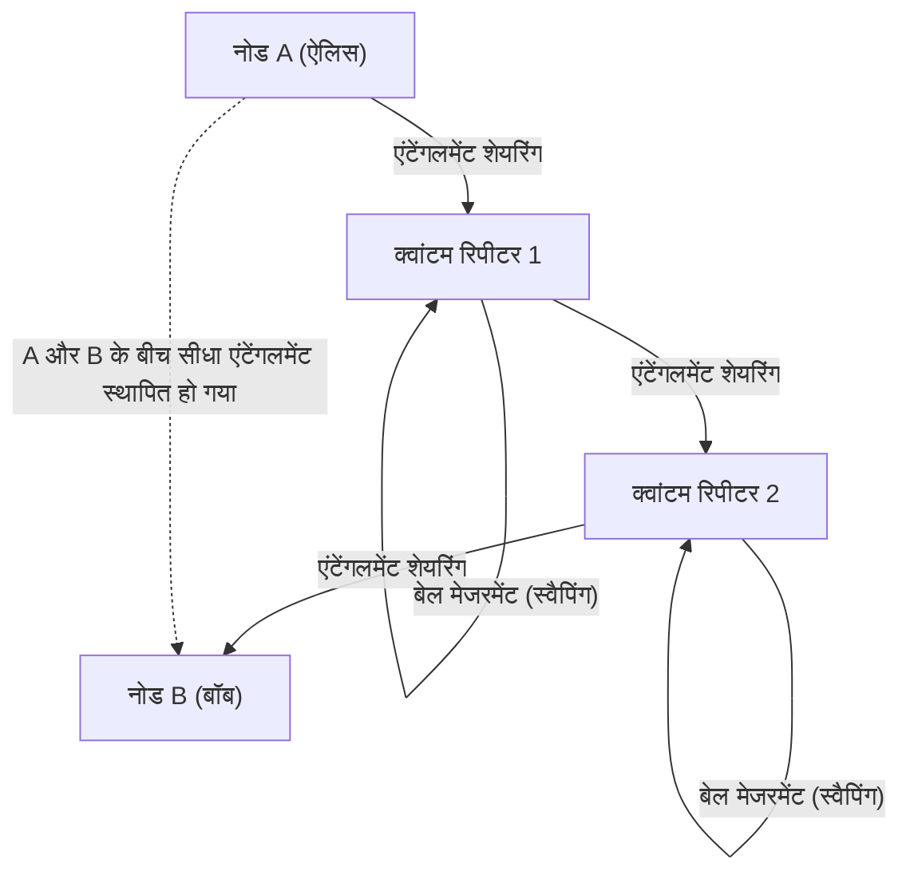

इस सीमा को तोड़ने के लिए, "क्वांटम रिपीटर्स (Quantum Repeaters)" पर शोध किया जा रहा है। क्वांटम रिपीटर केवल छोटे वर्गों में एंटेंगलमेंट उत्पन्न करते हैं, और "एंटेंगलमेंट स्वैपिंग" नामक उन्नत क्वांटम संचालन को लगातार निष्पादित करके लंबी दूरी पर एंटेंगलमेंट स्थापित करते हैं। इसे साकार करने के लिए, क्रायोजेनिक वातावरण (अत्यधिक कम तापमान) के तहत क्वांटम अवस्थाओं को अस्थायी रूप से संग्रहीत करने के लिए एक "क्वांटम मेमोरी" आवश्यक है, और वर्तमान में, हीरे के NV केंद्रों (नाइट्रोजन-वैकेंसी केंद्रों) और ठंडे परमाणु गैसों का उपयोग करके भौतिक सफलताओं के लिए दुनिया भर की प्रयोगशालाओं में प्रतिस्पर्धा चल रही है।

---

## 8.4 निष्कर्ष: मानवता और नेटवर्क का भविष्य

1960 के दशक में जन्मा इंटरनेट, पृथ्वी पर सभी सूचनाओं को जोड़ने वाले एक तंत्रिका नेटवर्क (neural network) के रूप में विकसित हो गया है। और अब, अध्याय 8 "भविष्य का इंटरनेट" जिसका हम सामना कर रहे हैं, वह केवल सॉफ्टवेयर की परतों तक सीमित नहीं है, बल्कि यह एक अधिक मौलिक और भौतिक आयाम का विस्तार है।

Web3 की विकेंद्रीकृत वास्तुकला एक नई विश्वास नींव (ट्रस्ट लेयर) का निर्माण कर रही है, जो किसी विशिष्ट केंद्रीय प्राधिकरण में "विश्वास" पर निर्भर नहीं करती है, बल्कि गणित और क्रिप्टोग्राफी के माध्यम से समाज के लेन-देन को सुरक्षित करती है।
Starlink जैसे उपग्रह संचार नेटवर्क, पृथ्वी के गुरुत्वाकर्षण कूप (gravity well) से बाहर छलांग लगाकर और निर्वात में प्रकाश की गति की निरपेक्ष भौतिक सीमा गति को चुनौती देकर, एक त्रि-आयामी (3D) रीढ़ की हड्डी को चित्रित कर रहे हैं जो दूरी की बाधा को अमान्य कर देती है।
और क्वांटम इंटरनेट, क्वांटम यांत्रिकी के गहन रहस्य, एंटेंगलमेंट को इंजीनियरिंग में ऊँचा उठाकर, सूचना संचरण और सुरक्षा की अवधारणाओं को मौलिक रूप से पलटने का प्रयास कर रहा है।

यद्यपि ऐसा प्रतीत होता है कि ये प्रौद्योगिकियां स्वतंत्र रूप से विकसित हो रही हैं, लेकिन लंबे समय में इनका विलय हो जाएगा। बाहरी अंतरिक्ष में उड़ने वाले लेजर प्रकाश पर एकल फोटॉन (क्वांटम) को रखकर, कम क्षीणन (attenuation) वाले बाहरी अंतरिक्ष का उपयोग करके एक वैश्विक क्वांटम क्रिप्टोग्राफी संचार नेटवर्क बनाया जाएगा, और इसके शीर्ष पर, Web3 का विकेंद्रीकृत प्रोटोकॉल संचालित होगा। विज्ञान कथाओं जैसा ऐसा नेटवर्क इंफ्रास्ट्रक्चर अभी मानवता के हाथों द्वारा डिजाइन किया जा रहा है।

भविष्य का इंटरनेट केवल "सूचना प्रसारित करने वाला पाइप" नहीं रह जाएगा। यह एक अंतिम "बौद्धिक बुनियादी ढांचे (intellectual infrastructure)" में विकसित होगा जो ब्रह्मांडीय पैमाने पर मानवता की आर्थिक गतिविधियों, सामाजिक सर्वसम्मति निर्माण और कम्प्यूटेशनल संसाधनों को सिंक्रनाइज़ करेगा। हम रोज़मर्रा जिस इंटरनेट का अनजाने में इस्तेमाल करते हैं, उसके पीछे, इसी क्षण भी, भौतिकी और कंप्यूटर विज्ञान की सीमाओं को चुनौती देने वाली एक भव्य कहानी बुनी जा रही है।
