# Bab 1 Fajar dan Filosofi Internet —— Silsilah Teknologi dari ARPANET hingga WWW

Internet——jaringan terdistribusi otonom raksasa yang saat ini menjadi fondasi bagi segala aktivitas ekonomi, budaya, dan komunikasi umat manusia, sama sekali bukan dirancang dalam semalam oleh satu orang jenius saja. Ini berawal dari latar belakang sejarah dan geopolitik spesifik dari Perang Dingin, melalui pergeseran paradigma dalam rekayasa komunikasi dan ilmu komputer, serta merupakan kristalisasi dari filosofi mulia yang dianut bersama oleh tak terhitung banyaknya peneliti: "bagaimana mentransmisikan informasi secara tangguh dan bebas, melampaui berbagai batasan fisik apa pun."

Dalam bab ini, kita akan membahas bagaimana sistem ajaib bernama internet ini lahir, tidak hanya sekadar rentetan sejarah, melainkan dengan menggali sangat dalam dari sudut pandang profesional tentang mekanisme teknis dari lapisan fisik hingga lapisan aplikasi, serta filosofi desainnya (arsitektur).

## 1.1 Pergeseran Paradigma Jaringan: Keterbatasan Circuit Switching dan Lahirnya Packet Switching

Untuk memahami esensi sejarah dan teknis internet, titik awal dari segalanya adalah penemuan konsep "Packet Switching". Pada awal 1960-an, pusat infrastruktur komunikasi pada saat itu adalah metode "Circuit Switching" yang direpresentasikan oleh jaringan telepon.

### Mekanisme Fisik dan Kerentanan Circuit Switching
Metode circuit switching adalah metode yang secara logis menghubungkan dua titik yang berkomunikasi dengan sakelar crossbar atau sistem sakelar elektronik baik secara fisik, atau dengan menggunakan teknologi seperti Frequency Division Multiplexing (FDM), untuk mengamankan dan menempati "jalur komunikasi (sirkuit) khusus" dari awal hingga akhir komunikasi. Metode ini sangat cocok untuk komunikasi suara (telepon) yang membutuhkan waktu nyata karena menjamin bandwidth dan latensi selama sirkuit diamankan.

Namun, terdapat kelemahan fatal pada arsitektur ini. Itu adalah keberadaan "Single Point of Failure" (Titik Kegagalan Tunggal) dan kerentanan ekstrem terhadap kehancuran fisik. Selama Perang Dingin, Departemen Pertahanan AS sangat mengkhawatirkan serangan nuklir dari Uni Soviet (terutama serangan pulsa elektromagnetik: serangan EMP, yang menyertai ledakan nuklir di ketinggian). Jika pusat komunikasi yang tersentralisasi (pusat pertukaran raksasa) hancur secara fisik, atau jika sebagian rute komunikasi terputus, metode circuit switching tidak dapat segera membangun kembali rute memutar, sehingga sistem komando dan kendali (C2: Command and Control) nasional akan lumpuh total.

### Terobosan Bernama Packet Switching
Ada tiga pelopor yang membangun dasar teoritis untuk memecahkan hambatan fisik yang putus asa ini secara independen, namun pada waktu yang hampir bersamaan. Mereka adalah Paul Baran dari RAND Corporation, Donald Davies dari National Physical Laboratory (NPL) Inggris, dan Leonard Kleinrock dari Massachusetts Institute of Technology (MIT).

Dengan berlatar belakang teori informasi Claude Shannon, mereka mengusulkan pendekatan revolusioner: daripada memperlakukan komunikasi sebagai "gelombang" analog yang berkesinambungan atau "aliran" data yang tidak terputus, data dibagi menjadi potongan-potongan data digital kecil dengan panjang tetap (atau variabel)——yaitu "Paket (Packet)", atau dalam istilah Baran "blok pesan terstandarisasi".

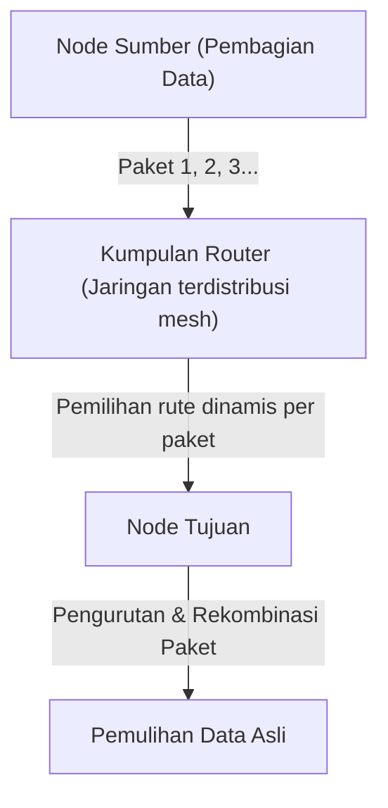

Inovasi teknis dari metode packet switching pada dasarnya bermuara pada dua poin berikut.

1. **Realisasi Statistical Multiplexing (Multiplexing Statistik):**
   Tidak seperti circuit switching yang menempati sirkuit fisik untuk komunikasi tertentu, paket dari berbagai komunikasi yang tidak terkait berbagi sirkuit fisik yang sama secara time-division. Komunikasi data antar komputer sangat bersifat "Burstiness" (karakteristik di mana data mengalir dalam jumlah besar untuk sementara waktu, diikuti oleh keheningan), sehingga berbagi bandwidth dengan packet switching meningkatkan efisiensi pemanfaatan sumber daya komunikasi hingga batas matematisnya.
2. **Store and Forward (Simpan dan Teruskan) dan Pemilihan Rute Dinamis:**
   Setiap node relai (router) yang membentuk jaringan untuk sementara menyimpan paket yang diterima dalam antrean di memori, lalu membandingkan alamat tujuan yang tertulis di header paket dengan tabel perutean (routing table) yang dimiliki oleh node tersebut. Kemudian, menghitung status kemacetan jaringan pada saat itu atau status pemutusan sirkuit fisik, dan meneruskan setiap paket ke node terdekat yang paling optimal.

Kleinrock menggunakan Teori Antrean (Queuing Theory) untuk menetapkan model matematis penundaan paket dan ukuran buffer dalam metode store and forward ini. Bahkan jika sebagian jaringan menguap oleh serangan nuklir, node yang masih bertahan secara otonom menilai situasi, dan paket-paket akan menemukan rute memutar (rute lain di jaringan mesh) untuk mencapai tujuannya. Arsitektur "terdistribusi otonom / dapat pulih sendiri" inilah yang merupakan akar ketangguhan (Resilience) internet.

## 1.2 Pembangunan ARPANET: Pemisahan Perangkat Keras dan Protokol oleh IMP

Jaringan packet switching yang dulunya hanyalah keberadaan teoritis, diimplementasikan ke dunia fisik melalui proyek "ARPANET" yang dimulai pada tahun 1969 yang didanai oleh Advanced Research Projects Agency (ARPA) dari Departemen Pertahanan AS.

Lingkungan komputer pada saat itu sangat kacau balau bila dibandingkan dengan era modern. Komputer mainframe yang dikembangkan secara independen oleh perusahaan seperti IBM, DEC, SDS, dll., memiliki kode karakter (ASCII vs EBCDIC), panjang kata (16 bit, 32 bit, 36 bit, dll.), dan sistem operasi yang sama sekali berbeda, sehingga sangat sulit secara teknis untuk membuat mereka berkomunikasi secara langsung.

Oleh karena itu, para perancang ARPANET (seperti Larry Roberts dan lainnya) membuat keputusan desain yang sangat penting dalam arsitektur jaringan. Itu adalah pengenalan komputer kecil khusus untuk perelayan yang disebut "IMP (Interface Message Processor)".

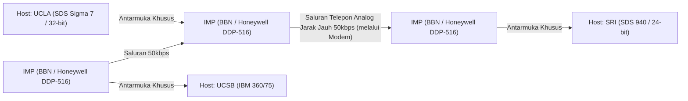

Pengembangan IMP dimenangkan oleh perusahaan konsultan yang berbasis di Boston, BBN (Bolt Beranek and Newman). Mereka memodifikasi komputer mini tangguh "DDP-516" dari perusahaan Honeywell, dan membebankan semua pemrosesan jaringan yang rumit seperti protokol perutean, pemisahan dan perakitan paket, dan pendeteksian kesalahan (CRC: Cyclic Redundancy Check) kepada IMP.

Dengan ini, komputer host raksasa di masing-masing lembaga penelitian tidak perlu lagi mengkhawatirkan perutean paket yang rumit atau karakteristik fisik dari saluran tersebut, dan cukup bertukar data dengan IMP yang ada di depan mereka melalui antarmuka standar (protokol BBN 1822). Ini adalah contoh sukses besar pertama dari penerapan "Pemisahan Perhatian (Separation of Concerns)" sistem pada bidang jaringan, dan IMP menjadi leluhur langsung dari router masa kini.

Pada 29 Oktober 1969, pesan pertama "LO" dikirim dari laboratorium Kleinrock di UCLA ke SRI (Stanford Research Institute) (sistemnya mogok saat mencoba mengetik "LOGIN"). Ini adalah momen bersejarah di mana ARPANET lahir. Kemudian, algoritme perutean awal (perutean vektor jarak berbasis Bellman-Ford) diimplementasikan, dan ARPANET tumbuh pesat sebagai infrastruktur yang menghubungkan lembaga-lembaga penelitian di seluruh Amerika Serikat.

## 1.3 Filosofi Desain TCP/IP: Prinsip End-to-End dan Kedalaman Enkapsulasi

ARPANET meraih kesuksesan besar sebagai satu jaringan tunggal, tetapi akhirnya menghadapi hambatan baru. Protokol komunikasi yang digunakan dalam ARPANET yang disebut NCP (Network Control Program) dirancang dengan asumsi akan berjalan di atas ARPANET, sebuah "jaringan tunggal yang homogen dan andal".

Namun, memasuki tahun 1970-an, berbagai jaringan yang sangat beragam mulai bermunculan, seperti jaringan komunikasi paket menggunakan satelit buatan (SATNET) dan jaringan komunikasi paket nirkabel yang dikembangkan oleh Universitas Hawaii (PRNET, turunan dari ALOHANET), yang mana media fisik, ukuran paket maksimum (MTU: Maximum Transmission Unit), kecepatan transfer, dan tingkat kesalahan (error rate) sangatlah berbeda. Ketika mereka mencoba menghubungkan ini semua untuk membangun sebuah "jaringan dari berbagai jaringan (Internetwork)" berskala global, menjadi jelas bahwa desain NCP akan gagal.

Tantangan luar biasa dari koneksi jaringan yang heterogen ini diselesaikan oleh makalah terobosan "A Protocol for Packet Network Intercommunication" yang diterbitkan oleh Vinton Cerf dan Bob Kahn pada tahun 1974. Protokol yang mereka rancang itulah "TCP/IP (Transmission Control Protocol / Internet Protocol)", yang merupakan fondasi internet modern.

### Jiwa dari Arsitektur: Prinsip End-to-End (End-to-End Argument)
Dasar desain TCP/IP mengalirkan filosofi paling penting dalam rekayasa jaringan: "Prinsip End-to-End (End-to-End Principle / Argument)". Prinsip yang dikodifikasikan pada 1980-an oleh J. H. Saltzer, D. P. Reed, dan D. D. Clark dkk. ini, menegaskan hal berikut.

"Fungsi canggih dan spesifik aplikasi seperti jaminan keandalan transfer data, kontrol urutan, dan enkripsi harus diimplementasikan pada host titik akhir di kedua sisi komunikasi (End-to-End), dan tidak boleh diimplementasikan di inti jaringan (infrastruktur relai atau router)."

Jika sisi inti jaringan (IMP atau router) diberi "Status (State)" yang rumit seperti pengakuan kedatangan paket (ACK) atau kontrol transmisi ulang, apa yang akan terjadi? Saat router relai rusak, status itu akan hilang dan komunikasi terputus. Selain itu, setiap kali aplikasi dengan persyaratan baru muncul, perangkat lunak pada router relai di seluruh dunia harus ditulis ulang.

TCP/IP mewujudkan prinsip ini dengan setia hingga ke batas maksimal. Router IP (Internet Protocol) yang bertanggung jawab atas relai hanya dikhususkan pada fungsi yang sangat sederhana (transfer datagram stateless): "hanya meneruskan paket yang diterima ke tujuannya dengan best-effort (usaha terbaik)". IP sama sekali tidak peduli tentang hilangnya paket atau tertukarnya urutan. Ia benar-benar hanya berdedikasi menjadi sebuah "Dumb Network (Jaringan Bodoh)".

Sebagai gantinya, tanggung jawab berat untuk menjamin keandalan komunikasi sepenuhnya diserahkan kepada TCP (Transmission Control Protocol) yang berjalan di komputer host pada kedua titik akhir. TCP menyatukan kembali data asli dengan melihat nomor urut (sequence number) yang terpasang pada paket yang dikirimkan tidak berurutan oleh IP, secara otonom meminta pengiriman ulang jika ada yang hilang, dan menyesuaikan kecepatan transmisi jika jaringan mengalami kemacetan (kontrol jendela / window control dan algoritma slow-start).

Filosofi desain yang "menjaga inti se-sederhana mungkin, dan memberikan kecerdasan pada tepi (titik akhir)" inilah alasan terbesar mengapa internet mampu melampaui jaringan telepon, dan kemudian menelan mentah-mentah inovasi eksplosif yang bahkan tidak diprediksi oleh perancangnya, seperti Web, video streaming, komunikasi P2P, dan ponsel pintar, tanpa perlu perbaikan infrastruktur.

### Enkapsulasi (Encapsulation) dan Model Hierarki
TCP/IP menggunakan metode yang disebut "Enkapsulasi (Encapsulation)" dari data untuk mewujudkan pembagian peran logis ini. Ini adalah sebuah mekanisme di mana setiap lapisan membungkus informasi kontrol (header)-nya sendiri pada data yang akan dikirim layaknya boneka Matryoshka.

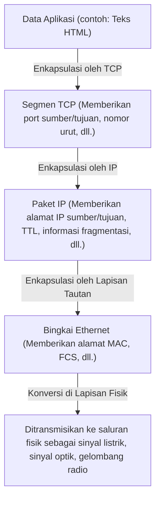

Router hanya melihat header paket IP (alamat IP) untuk menentukan tujuan transfer, dan sama sekali tidak terlibat dengan isinya (header TCP atau data). Dengan ini, IP sepenuhnya menyembunyikan dan menyerap perbedaan karakteristik fisik pada lapisan fisik yang lebih rendah (serat optik, kabel tembaga, Wi-Fi, 5G), dan berhasil menyediakan "jaringan virtual tunggal berskala global" ke lapisan yang lebih tinggi.

Pada tanggal 1 Januari 1983, dilaksanakannya "Hari Bendera (Flag Day)" di mana semua host di ARPANET secara serempak beralih dari NCP ke TCP/IP, dan pada titik ini "The Internet" dalam arti yang sebenarnya lahir.

## 1.4 Kebangkitan NSFNET dan Evolusi Perutean Terdistribusi Otonom

Setelah transisi ke TCP/IP, internet melampaui batas militer dan pertahanan negara, dan berubah menjadi infrastruktur penelitian akademis raksasa. Pendorong yang menentukan adalah "NSFNET", yang dibangun oleh Yayasan Sains Nasional AS (NSF) pada akhir 1980-an.

NSFNET dibangun sebagai jaringan tulang punggung (backbone network) yang menghubungkan lima pusat superkomputer di Amerika Serikat, yang mana pada awalnya 56kbps, kemudian berulang kali mengalami pemutakhiran dramatis pada lapisan fisik menjadi sirkuit T1 (1,544Mbps) dan kemudian sirkuit T3 (45Mbps). Universitas dan jaringan regional (regional network) menjadi terhubung secara hierarkis ke tulang punggung NSFNET ini.

Selagi skala jaringan berkembang secara eksplosif (scaling), tantangan teknis baru pun muncul. Itu adalah "Keterbatasan Perutean". Jika semua router relai saling berbagi informasi rute dari puluhan ribu node, maka akan melebihi batas fisik kapasitas memori dan daya komputasi.

Untuk memecahkan masalah ini, internet memperkenalkan konsep yang disebut "Sistem Otonom (AS: Autonomous System)". Internet didefinisikan ulang bukan sebagai jaringan raksasa tunggal, melainkan sebagai sebuah kumpulan jaringan (AS) dengan kebijakan pengelolaan yang independen.

Di dalam AS (IGP: Interior Gateway Protocol), ia menggunakan protokol perutean jenis link-state seperti OSPF (Open Shortest Path First), untuk membangun peta topologi lengkap jaringan dengan algoritma Dijkstra (Dijkstra's algorithm) dan menghitung rute terpendek dengan cepat.

Sementara itu, di antara AS satu dengan AS lain (EGP: Exterior Gateway Protocol), diperlukan refleksi dari kebijakan bisnis dan organisasional seperti "melalui jaringan mana komunikasi diizinkan", dan bukan sekadar rute terpendek. Hal yang dikembangkan untuk merealisasikan ini dan mendukung tulang punggung internet hingga saat ini adalah "BGP (Border Gateway Protocol)". BGP mengadopsi algoritma jenis Path Vector, dengan sepenuhnya mencegah loop perutean, serta memungkinkan pertukaran informasi rute di antara ISP (Internet Service Provider) di seluruh dunia.

Dengan pembangunan NSFNET dan pembentukan BGP, meskipun tidak ada administrator pusat, ekosistem internet komersial modern disempurnakan di mana masing-masing organisasi melakukan interkoneksi berulang (peering dan transit) sehingga secara keseluruhan berfungsi sebagai satu jaringan yang otonom. Pada 1995, NSFNET menyelesaikan perannya, dan operasi tulang punggung sepenuhnya diserahkan kepada grup ISP swasta.

## 1.5 Lahirnya WWW: Pembebasan Pengetahuan melalui Hypertext dan Domain Publik

Pada akhir 1980-an, ketika infrastruktur dari lapisan fisik hingga lapisan jaringan dan lapisan transport telah tertata pada skala global, jumlah informasi yang terakumulasi di internet meningkat tajam secara drastis. Namun, internet pada waktu itu memiliki banyak aplikasi individual seperti FTP (File Transfer), Telnet (Remote Login), dan USENET (Bulletin Board) yang beroperasi berantakan, dan informasi terisolasi (Siloed) jauh di dalam direktori pada setiap peladen. Untuk mencari data yang dituju, alamat IP peladen target dan pengetahuan tentang perintah UNIX yang rumit sangat diperlukan, sehingga keadaannya sangat tidak demokratis.

Ilmuwan komputer dari Organisasi Riset Nuklir Eropa (CERN) di Jenewa, Swiss, yaitu Tim Berners-Lee, adalah sosok yang menjungkirbalikkan situasi ini dari akar-akarnya dan memicu pergeseran paradigma berbagi informasi. Pada tahun 1989, dia mengusulkan sistem inovatif yang disebut "World Wide Web (WWW)".

Inti dari gagasannya adalah menggabungkan "Hypertext (konsep menautkan suatu kata dalam dokumen ke dokumen lain)" yang telah ada sejak 1960-an, dengan "Internet (TCP/IP)". Ia memperluas tautan hypertext yang sebelumnya tertutup dalam komputer lokal menuju dokumen di server di belahan bumi lain.

Untuk membangun ruang informasi yang sangat luas ini, Berners-Lee secara mandiri merancang dan mengimplementasikan tiga spesifikasi teknis yang sangat canggih.

1. **URI (Uniform Resource Identifier):**
   Sistem alamat universal untuk menetapkan secara unik letak segala sumber daya (teks, gambar, video, dll.) yang ada di jaringan.
2. **HTTP (Hypertext Transfer Protocol):**
   Protokol lapisan aplikasi untuk meminta dan mentransfer sumber daya yang ditentukan oleh URI antara klien (peramban web) dan server. Poin terunggul dari HTTP adalah adopsi rancangan "Stateless (Tanpa Status)" di mana status komunikasi tidak dipertahankan. Ini memungkinkan server untuk menangani permintaan dari jutaan klien secara efisien.
3. **HTML (Hypertext Markup Language):**
   Bahasa markah untuk mendeskripsikan struktur logis dokumen, dan untuk menyematkan hyperlink (tag jangkar `<a>`) ke sumber daya lain.

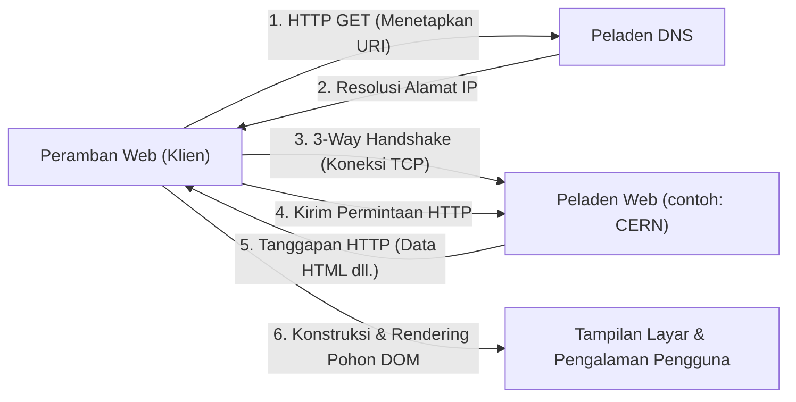

Pada akhir tahun 1990, server web (info.cern.ch) dan peramban pertama di dunia mulai beroperasi di komputer NeXT. Web awal berbasis teks, tetapi pengalaman eksplorasi informasi dengan tautan yang intuitif tersebut dengan cepat menjadi populer di kalangan peneliti.

### Keputusan Bersejarah Umat Manusia Bernama Domain Publik
Namun, alasan terbesar mengapa WWW sungguh-sungguh mengubah dunia dan mengakar sebagai infrastruktur masyarakat modern bukan hanya arsitektur teknisnya yang luar biasa. Peristiwa menentukan yang menjadi pembeda sejarah terjadi pada 30 April 1993.

Menerima permintaan kuat dari Tim Berners-Lee, CERN membuat keputusan menakjubkan untuk membebaskan seluruh teknologi dasar WWW (perangkat lunak server, klien, perpustakaan kode) secara gratis sebagai "Domain Publik (pelepasan hak kekayaan intelektual)". Dokumen pernyataan yang tidak menggunakan hak paten apa pun dan tidak memungut biaya royalti, ditandatangani oleh direktur CERN.

Apa jadinya jika saat itu CERN mematenkan teknologi WWW dan berupaya melakukan monetisasi melalui lisensi perangkat lunak? Sudah pasti ledakan informasi saat ini tidak akan pernah terjadi. WWW akan tetap menjadi sistem tertutup hanya bagi beberapa perusahaan atau universitas dengan dana besar, dan internet akan terpecah dalam perang standar dengan protokol pesaing seperti Gopher yang muncul belakangan.

Dengan tereliminasinya berbagai hambatan teknis dan hukum sepenuhnya melalui pembukaan ke domain publik, para peretas dan perusahaan di seluruh dunia masuk ke dalam ekosistem WWW. Marc Andreessen dkk. dari National Center for Supercomputing Applications (NCSA) AS mengembangkan dan mempublikasikan secara gratis peramban grafis terobosan "NCSA Mosaic" yang dapat menampilkan gambar sebaris, yang mana kemudian memicu Netscape Navigator, hingga menyebabkan meletusnya gelembung TI (Dot-com bubble). "Demokratisasi Informasi", di mana tiap individu dapat secara bebas mendirikan server Web dan mengirimkan informasi ke seluruh dunia, berhasil dicapai.

## 1.6 Penutup: Filosofi Melampaui Implementasi

Sejarah internet yang kita lihat di Bab 1 bukanlah sekadar sejarah peningkatan kecepatan komunikasi. Penemuan packet switching didasarkan pada realitas fisik bahwa "kontrol terpusat adalah rentan", prinsip End-to-End yang menyatakan "kerumitan harus ditanggung oleh titik akhir", dan dibukanya WWW ke ranah publik yang menyatakan "informasi harus terbuka bagi seluruh umat manusia secara gratis".

Hal yang menjadikan wujud internet seperti saat ini, bukanlah perangkat keras atau kode yang luar biasa, tetapi ini semua adalah "Filosofi Desain (Philosophy)" yang kuat dan konsisten. Mengatasi hambatan lapisan fisik dengan enkapsulasi logis, dan menerima keragaman melalui standar terbuka (RFC: Request for Comments). Karena adanya arsitektur yang menjunjung tinggi desentralisasi dan kebebasan inilah internet mampu mencapai penskalaan (scaling) yang belum pernah terjadi sebelumnya.

Namun, di antara "nama" yang dapat dipahami manusia, dan "angka (alamat IP)" yang diproses jaringan, jurang yang dalam masih membentang. Pada bab berikutnya, kita akan mengungkap mekanisme teknis dari "Ruang alamat IP dan Kedalaman DNS (Domain Name System)", sebuah sistem database terdistribusi raksasa yang membawa keteraturan pada ruang alamat dari jaringan terdistribusi otonom yang sangat luas ini, serta mendukung penyebaran WWW yang eksplosif dari balik layar.

# Bab 2: Lapisan Fisik dan Lapisan Tautan Data 〜Entitas Fisik dari Data Digital dan Komunikasi Antar Tetangga〜

Di dasar jaringan raksasa yang disebut internet ini, terdapat rantai fenomena fisik luar biasa yang mengubah data digital logis "0" dan "1" menjadi fenomena fisik seperti sinyal listrik, kelap-kelip cahaya, atau riak gelombang elektromagnetik, dan mengirimkannya ke pihak lain melintasi ruang serta medium perantara. Ketika kita tanpa sadar membuka situs web di ponsel pintar, di balik layar, foton-foton sedang bergegas melewati serat kaca yang menjalar di dasar lautan dalam, dan gelombang radio tak kasat mata beterbangan melintasi ruang angkasa dengan perhitungan yang rumit.

Dalam bab ini, kita akan berfokus pada lapisan ke-1 (lapisan fisik) dan lapisan ke-2 (lapisan tautan data) dari Model Referensi OSI, menggali bagian "paling fisik dan bernuansa kasar" dari jaringan yang menopang kehidupan kita hingga ke batas tertinggi dari sudut pandang profesional, serta mekanisme logis terperinci yang mengendalikannya.

---## 2.1 Lapisan Fisik (Physical Layer): Realisasi Fisik Informasi dan Hukum Alam Semesta

Misi terbesar dari lapisan fisik adalah mengubah (memodulasi) deretan bit diskrit (0 dan 1) yang ditangani oleh komputer menjadi sinyal fisik analog yang sesuai dengan karakteristik fisik media transmisi (kabel tembaga, serat optik, ruang hampa udara atau udara), dan menempatkannya pada jalur transmisi. Di sini, hukum-hukum teknik elektro, mekanika kuantum, dan optik menentukan batas-batas komunikasi.

### Teorema Shannon-Hartley dan Batas Informasi
Hal yang tidak dapat dihindari saat membahas lapisan fisik adalah teori informasi yang diumumkan oleh Claude Shannon pada tahun 1948. "Teorema Shannon-Hartley" secara matematis membuktikan laju transfer data (kapasitas saluran) maksimum yang dapat dikirimkan tanpa kesalahan (error) pada saluran komunikasi yang memiliki derau (noise).

$$ C = B \log_2\left(1 + \frac{S}{N}\right) $$

Di sini, $C$ adalah kapasitas saluran (bps), $B$ adalah bandwidth (Hz), dan $S/N$ adalah rasio sinyal terhadap derau (SNR). Persamaan indah ini menunjukkan bahwa secanggih apapun teknologi berkembang, terdapat batas fisik (batas Shannon) pada jumlah informasi yang dapat dikirim pada bandwidth dan lingkungan derau yang diberikan. Para insinyur serat optik dan Wi-Fi modern terus melanjutkan pertempuran tanpa akhir tentang bagaimana meningkatkan kecepatan komunikasi hingga sedekat mungkin dengan batas ini.

### Fisika Serat Optik: "Mengurung" dan Membawa Cahaya
Tulang punggung internet modern tidak diragukan lagi adalah serat optik (Optical Fiber). Dalam telekomunikasi listrik melalui kabel tembaga, komunikasi jarak jauh berkecepatan tinggi sulit dilakukan akibat efek kulit (skin effect) dan interferensi elektromagnetik (EMI), namun serat optik telah mengatasi hal-hal tersebut.

Serat optik terdiri dari dua lapisan kaca kuarsa dengan kemurnian sangat tinggi: "inti (core)" di bagian tengah dan "selubung (clad)" yang mengelilinginya. Dengan mengatur indeks bias inti sedikit (kurang dari beberapa persen) lebih tinggi daripada selubung, berdasarkan hukum Snell, cahaya yang masuk dengan sudut lebih dangkal dari sudut kritis tertentu akan berulang kali mengalami pemantulan internal total (Total Internal Reflection) pada batas antara inti dan selubung. Berkat ini, cahaya merambat melalui dalam serat tanpa bocor ke luar.

#### Pertempuran Melawan Dispersi dan Atenuasi: Kaca yang Membawa Hadiah Nobel
Kaca pada masa lalu memiliki banyak ketidakmurnian, sehingga cahaya akan meredup (atenuasi) setelah beberapa meter. Pada tahun 1966, Dr. Charles Kao (pemenang Hadiah Nobel Fisika 2009) menemukan bahwa penyebab atenuasi pada serat optik bukanlah sifat asli kaca, melainkan ketidakmurnian (terutama gugus hidroksil dan logam transisi), dan meramalkan bahwa komunikasi jarak jauh akan memungkinkan jika kemurniannya ditingkatkan. Kaca kuarsa kerugian-sangat-rendah yang dikembangkan oleh Corning pada tahun 1970-an mencapai kerugian sangat rendah yang mengejutkan, yaitu 0,2 dB/km pada pita panjang gelombang 1550 nm (pita C). Ini berarti bahwa intensitas cahaya hanya hilang setengahnya meskipun telah menempuh jarak 15 km.

Namun, ketika cahaya menempuh jarak jauh, "Dispersi Kromatik (Chromatic Dispersion)" dan "Dispersi Modal (Modal Dispersion)" terjadi, menyebabkan bentuk gelombang pulsa menjadi hancur. Dispersi kromatik terjadi karena kecepatan rambat di dalam kaca berbeda-beda tergantung pada panjang gelombang (warna) cahaya. Dispersi modal adalah fenomena di mana terjadi perbedaan waktu kedatangan karena terdapat banyak jalur (mode) cahaya yang melewati inti.
Untuk mengatasinya, diameter inti dikecilkan menjadi beberapa mikrometer yang mendekati panjang gelombang cahaya, dan "Serat Mode Tunggal (Single Mode Fiber/SMF)" yang hanya melewatkan satu jalur dikembangkan, menjadikannya arus utama untuk transmisi jarak jauh seperti komunikasi antarbenua.

#### EDFA dan WDM: Renaisans Komunikasi Optik
Pada tahun 1990-an, dua revolusi terjadi dalam komunikasi optik. Yang pertama adalah Penguat Serat Optik Berdoped Erbium (EDFA: Erbium-Doped Fiber Amplifier). Sebelumnya, diperlukan pengulang regeneratif (regenerative repeater) yang lambat dan mahal, yang mengubah sinyal optik yang meredup menjadi sinyal listrik terlebih dahulu, memperkuatnya, dan kemudian mengubahnya kembali menjadi cahaya. EDFA memungkinkan penguatan cahaya secara langsung dalam bentuk cahaya dengan mendoping unsur tanah jarang erbium ke dalam inti serat dan memberikan cahaya eksitasi dari luar, menyebabkan emisi terstimulasi saat sinyal optik melewatinya.

Yang kedua adalah Multiplexing Pembagian Panjang Gelombang (WDM: Wavelength Division Multiplexing). Teknologi ini memanfaatkan prinsip superposisi, di mana cahaya dengan panjang gelombang (warna) berbeda yang dipancarkan secara bersamaan ke dalam ruang yang sama tidak akan bercampur dan merambat secara independen, untuk mengirimkan banyak sinyal panjang gelombang secara bersamaan dalam satu serat. Berkat teknologi Multiplexing Pembagian Panjang Gelombang Kepadatan Tinggi (DWDM), saat ini memungkinkan untuk memuat lebih dari 100 sinyal panjang gelombang dengan jarak beberapa milimeter pada satu serat optik, mewujudkan bandwidth luar biasa dari puluhan Tbps hingga beberapa Pbps dalam satu serat.

### Kabel Bawah Laut: Jaringan Saraf Bumi
Lebih dari 99% komunikasi data yang menghubungkan antarbenua tidak dibawa oleh satelit buatan, melainkan oleh kabel bawah laut. Data cloud dan gambar di situs web luar negeri pun semuanya melewati dasar laut secara fisik.

#### Sejarah Kegagalan dan Tantangan
Sejarah kabel bawah laut jauh lebih tua daripada internet. Tantangan besar pertama adalah kabel telegraf lintas Atlantik pada tahun 1858. Kabel tembaga yang diisolasi dengan getah perca (gutta-percha), sejenis karet alam, berhasil diletakkan, namun akibat pengoperasian dengan tegangan tinggi yang mengabaikan peringatan Lord Kelvin (William Thomson), kabel tersebut mengalami kerusakan isolasi dan bungkam hanya dalam beberapa minggu. Setelah itu, butuh waktu lama untuk menyempurnakan teori dan materialnya, hingga pada tahun 1988, kabel serat optik bawah laut lintas Pasifik pertama "TAT-8" mulai beroperasi, menandai dimulainya era optik.

#### Struktur Kabel dan Mekanisme Pemasangan
Kabel bawah laut modern yang diletakkan di laut dalam sedalam ribuan meter dirancang untuk tahan terhadap lingkungan ekstrem. Untuk melindungi hanya segelintir bundel serat optik di bagian tengah, kabel ini dilindungi dalam beberapa lapisan menggunakan kawat baja tarik tinggi, tabung tembaga atau aluminium untuk ketahanan tekanan air, isolator polietilen, dll. Di bagian laut dalam, diameternya hanya sekitar beberapa sentimeter untuk membuatnya ringan sekaligus menahan gigitan hiu dan tekanan air yang sangat besar, tetapi di perairan dangkal, kabel ini diberi pelindung baja (armoring) tebal untuk melindunginya dari pukat harimau perahu nelayan, jangkar kapal, dan gempa bumi bawah laut, sehingga diameternya menjadi lebih dari 10 sentimeter.

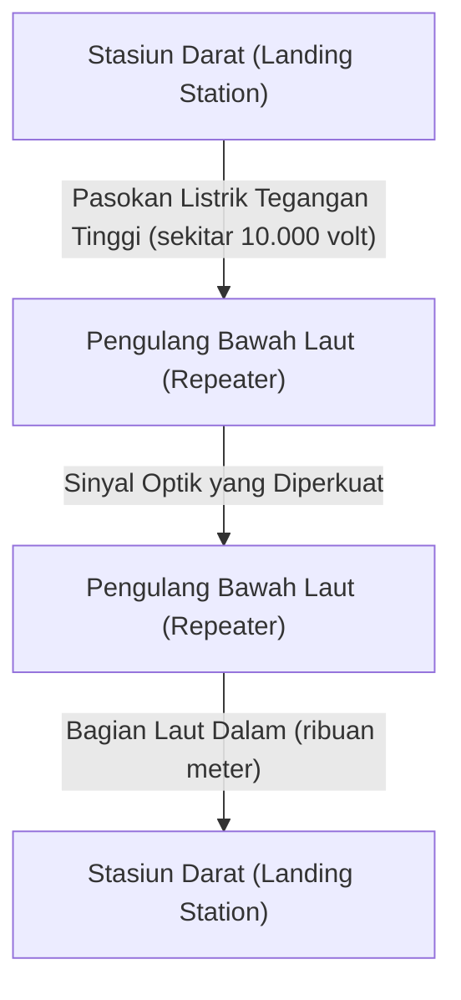

Karena sinyal optik meredup setiap puluhan kilometer bahkan jika menggunakan serat kerugian sangat rendah, "pengulang bawah laut (repeater)" disisipkan dengan interval yang sama di sepanjang kabel. Daya untuk menggerakkan pengulang ini (yang berisi EDFA yang disebutkan sebelumnya) di laut dalam dipasok secara terus-menerus sebagai arus searah bertegangan tinggi dari beberapa ribu volt hingga maksimal 10.000 volt atau lebih melalui tabung tembaga di dalam kabel dari stasiun darat di kedua ujungnya.
Untuk pemasangannya, "kapal peletak kabel" khusus digunakan, dan di perairan dangkal, robot bawah air (ROV) menggali parit di dasar laut dan mengubur kabel. Jika kabel terputus, kapal perbaikan akan bergegas ke tempat kejadian, menangkap ujung kabel dari kedalaman laut dengan pengait (grapple) yang mirip jangkar, dan menariknya ke atas kapal, di mana para teknisi ahli akan melakukan penyambungan fusi serat optik dengan presisi beberapa mikron, sebuah operasi analog dan manual yang luar biasa rumit.

### Fisika Komunikasi Gelombang Radio (Fondasi Wi-Fi)
Dengan penyebaran perangkat seluler dan IoT secara luas, komunikasi melalui gelombang elektromagnetik (gelombang radio) yang beterbangan di udara juga menjadi medan pertempuran utama untuk lapisan fisik. Wi-Fi (kelompok standar IEEE 802.11) pada dasarnya menggunakan pita frekuensi ISM (pita Industri, Sains, dan Medis, yang dapat digunakan tanpa lisensi) di pita 2,4 GHz, 5 GHz, dan pita 6 GHz yang baru saja dibebaskan dalam beberapa tahun terakhir.

#### Kompresi Informasi Ekstrem dengan QAM (Quadrature Amplitude Modulation)
Dalam proses "modulasi" yang menempatkan data digital pada gelombang analog, Wi-Fi menggunakan teknologi yang sangat canggih. Itu adalah QAM (Quadrature Amplitude Modulation: Modulasi Amplitudo Kuadratur).
Gelombang, yaitu gelombang radio, memiliki dua besaran fisik: "amplitudo (tinggi gelombang)" dan "fase (waktu/sudut gelombang)". QAM mensintesis dua gelombang pembawa (sinyal I dan sinyal Q) dengan fase yang berbeda 90 derajat, dan dengan memvariasikan amplitudo masing-masing, menetapkan deretan bit ke "titik" tertentu pada peta konstelasi.

Misalnya, dalam 16-QAM, 16 titik (4 bit) dapat direpresentasikan dalam satu perubahan gelombang (simbol). Pada Wi-Fi 7 terbaru (802.11be), modulasi kepadatan tinggi ekstrem, yaitu 4096-QAM, diadopsi. Ini merepresentasikan 4096 titik (12 bit) dalam satu modulasi tunggal. Dalam peta konstelasi di mana 4096 titik berdesakan, pihak penerima harus menentukan secara akurat "titik" mana yang ditransmisikan, tanpa terkubur oleh derau sekecil apa pun. Untuk mewujudkan hal ini, digunakan kode koreksi kesalahan (error correction code) tingkat lanjut dan prosesor pemrosesan sinyal yang kuat.

#### OFDM dan MIMO: Pertempuran Melawan Multipath dan Pemanfaatan Ruang
Gelombang radio tidak hanya berjalan dalam garis lurus, tetapi juga memantul dari dinding dan furnitur, mendifraksi, dan menyebar. Akibatnya, gelombang radio yang dipancarkan dari pemancar mengambil jalur yang berbeda (multipath) dan mencapai penerima dengan waktu yang sedikit bergeser, menyebabkan interferensi (fading) dan merusak bentuk gelombang.
Teknologi untuk memanfaatkannya, atau mengatasinya, adalah OFDM dan MIMO.

**OFDM (Orthogonal Frequency-Division Multiplexing)** adalah teknologi di mana, alih-alih menggunakan sinyal tunggal broadband dengan pantulan tinggi, bandwidth dibagi menjadi sejumlah besar frekuensi sangat sempit (subcarrier), dan data ditransmisikan secara paralel pada kecepatan rendah ke masing-masing frekuensi tersebut. Karena subcarrier disusun sedemikian rupa sehingga "ortogonal (secara matematis tidak saling mengganggu)", efisiensi pemanfaatan frekuensi sangat tinggi, dan teknologi ini juga kuat terhadap pergeseran penundaan yang disebabkan oleh multipath.

**MIMO (Multiple-Input and Multiple-Output)** adalah teknologi "multiplexing spasial" yang menggunakan beberapa antena untuk mengirimkan data berbeda secara bersamaan pada frekuensi yang sama. Dengan memanfaatkan sifat bahwa gelombang bercampur secara berbeda di tempat yang berbeda di ruang angkasa karena pantulan multipath, sinyal kompleks yang diterima oleh banyak antena di sisi penerima dipisahkan seolah-olah memecahkan persamaan simultan, melipatgandakan kapasitas komunikasi sebanyak jumlah antena. Lebih jauh lagi, **Beamforming**, yang menyesuaikan fase gelombang radio secara halus untuk setiap antena untuk memusatkan pancaran gelombang radio ke arah tertentu, juga telah menjadi teknologi yang sangat diperlukan dalam Wi-Fi modern.

---

## 2.2 Lapisan Data Link (Data Link Layer): Dialog dan Keteraturan Antara Perangkat yang Terhubung Langsung

Jika lapisan fisik hanyalah sekadar "pembawa sinyal", maka lapisan data link adalah lapisan yang bertanggung jawab atas aturan dan pengaturan lalu lintas untuk menyatukan deretan bit mentah tersebut menjadi gumpalan bermakna yang disebut "frame", dan memastikan pengirimannya ke tujuan yang benar dalam jaringan (tautan/link) yang sama.

### Sejarah Ethernet (Ethernet): Inspirasi dari ALOHA
Saat ini, standar de facto global untuk LAN kabel adalah Ethernet (IEEE 802.3).
Akar dari Ethernet dapat ditelusuri kembali ke jaringan komunikasi nirkabel "ALOHAnet" yang dibuat di University of Hawaii. ALOHAnet mengadopsi protokol yang sangat tidak teratur dan ambisius: "Jika Anda memiliki data untuk dikirim, kirimkan saja. Jika bertabrakan dan hancur, tunggu beberapa saat secara acak lalu kirim lagi".

Pada tahun 1973, Bob Metcalfe di Pusat Penelitian Palo Alto (PARC) milik Xerox menerapkan ide ALOHAnet ke komunikasi melalui kabel koaksial, dan menciptakan Ethernet. Ethernet awal memiliki topologi "bus", di mana banyak komputer berbagi satu kabel koaksial tebal (kabel kuning) dengan menusukkan jarum yang disebut vampire tap.

#### CSMA/CD: Keadaan Anarki yang Teratur
Karena semua pihak berbagi media (kabel), "tabrakan (collision)" akan terjadi ketika beberapa perangkat mengirimkan sinyal listrik pada saat yang sama, menyebabkan gelombang tumpang tindih dan merusak data. Algoritma terdesentralisasi otonom untuk menghindari dan menyelesaikan masalah ini adalah "CSMA/CD (Carrier Sense Multiple Access with Collision Detection)".

1. **Carrier Sense (Deteksi Pembawa)**: Mengukur tegangan pada kabel sebelum mengirim, untuk mendengarkan apakah ada pihak lain yang sedang berkomunikasi.
2. **Multiple Access (Akses Ganda)**: Jika tidak ada yang berkomunikasi, siapa pun boleh mengirim sesukanya tanpa harus menunggu izin dari otoritas pusat.
3. **Collision Detection (Deteksi Tabrakan)**: Kabel dipantau untuk melihat tegangannya bahkan selama transmisi, dan jika lonjakan tegangan abnormal yang berbeda dari sinyal transmisi sendiri terdeteksi, itu dinilai sebagai "tabrakan". Segera mengeluarkan sinyal jam (jam signal) untuk memberi tahu yang lain tentang tabrakan tersebut, lalu menghentikan transmisi.
4. **Backoff (Mundur)**: Setelah bertabrakan, setiap node akan menunggu waktu acak (waktu yang dihitung oleh algoritma exponential backoff) sebelum mencoba mengirim ulang.

Mekanisme sederhana tanpa perlunya administrator pusat ini, berdasarkan asumsi bahwa "pelanggaran aturan (tabrakan) akan terjadi, dan jika terjadi, tunggu secara acak," adalah alasan terbesar Ethernet menaklukkan protokol kompleks dan mahal seperti Token Ring dan ATM dari IBM, dan meraih hegemoni.

### Alamat MAC: Tanda Pengenal Absolut bagi Perangkat Keras
Untuk menetapkan tujuan di lapisan data link, alamat MAC (Media Access Control address) digunakan. Jika alamat IP adalah "alamat sementara", maka alamat MAC adalah "nomor identitas bawaan sejak lahir".

Alamat MAC memiliki panjang 48 bit (6 byte), dan ditulis sebagai angka heksadesimal dua digit yang dipisahkan oleh titik dua, seperti "00:1A:2B:3C:4D:5E".
- **24 bit pertama (OUI: Organizationally Unique Identifier)**: Kode perusahaan yang mengidentifikasi secara unik vendor peralatan jaringan (Apple, Cisco, Intel, dll.), dikelola dan dialokasikan oleh IEEE.
- **24 bit terakhir (UAA: Universally Administered Address)**: Nomor seri berurutan yang dialokasikan oleh vendor untuk produknya sendiri.

Pada prinsipnya, kartu antarmuka jaringan (NIC) dari semua peralatan jaringan di seluruh dunia memiliki satu alamat MAC yang unik di dunia yang telah dibakar ke dalam ROM.

### Struktur Frame: Teknologi Pengepakan Komunikasi
Di lapisan data link, data yang turun dari lapisan jaringan (seperti paket IP) dikemas (dienkapsulasi) dalam unit yang disebut "frame" dengan menambahkan header dan trailer di awal dan akhirnya. Struktur frame Ethernet (Ethernet II) sangat disempurnakan hingga ke tingkat yang artistik.

1. **Preamble**: Rangkaian "10101010" sepanjang 7 byte. Ini adalah pemanasan untuk menyinkronkan jam (sinkronisasi waktu) NIC di sisi penerima.
2. **SFD (Start Frame Delimiter)**: 1 byte dari "10101011". Dengan membuat akhir preamble menjadi "11", hal itu memberi tahu sisi penerima bahwa "data sebenarnya dimulai dari sini".
3. **Alamat MAC Tujuan (Destination MAC) / Alamat MAC Pengirim (Source MAC)**: Masing-masing 6 byte. Menentukan komunikasi dari siapa ke siapa. Jika tujuannya adalah "FF:FF:FF:FF:FF:FF", ini menjadi frame broadcast yang mencapai semua perangkat.
4. **Tipe (EtherType)**: 2 byte. Menunjukkan tipe data yang ada dalam payload (0x0800 untuk IPv4, 0x86DD untuk IPv6, 0x0806 untuk ARP).
5. **Payload (Data/Payload)**: Data aktual yang dititipkan dari lapisan atas. Ukurannya mulai dari 46 byte hingga maksimum 1500 byte (MTU: Maximum Transmission Unit).
6. **FCS (Frame Check Sequence)**: Trailer 4 byte. Nilai hash yang dihitung dari seluruh frame (mulai dari alamat MAC tujuan hingga payload) menggunakan polinomial yang disebut CRC-32 (Cyclic Redundancy Check).

NIC pada sisi penerima melakukan perhitungan CRC berkecepatan tinggi pada tingkat perangkat keras sambil menerima frame. Jika FCS yang terlampir di akhir dan hasil perhitungannya sendiri berbeda bahkan hanya 1 bit, data dianggap rusak karena noise atau tabrakan selama transmisi, dan frame tersebut **dibuang tanpa ampun tanpa pemberitahuan**. Lapisan data link dengan andal "mendeteksi dan membuang kesalahan", namun tidak memiliki kemampuan untuk meminta "pengiriman ulang karena rusak". Pembagian peran ini, di mana tanggung jawab berat untuk mengontrol transmisi ulang didelegasikan pada protokol tingkat lebih tinggi seperti TCP, adalah hal yang menopang skalabilitas internet.

### Lahirnya Switching Hub dan Evolusi menuju Komunikasi Full-Duplex
Ethernet tipe bus bersama dengan CSMA/CD adalah sistem yang brilian, namun memiliki kelemahan fatal: seiring bertambahnya jumlah perangkat (host) yang terhubung ke jaringan, tabrakan semakin sering terjadi dan throughput efektif akan menurun drastis.
Hal ini diselesaikan secara fundamental oleh "Layer 2 Switch (Switching Hub)", yang mulai populer pada tahun 1990-an.

Sementara hub (repeater hub) adalah perangkat lapisan fisik yang menyebarkan sinyal listrik yang diterimanya tanpa syarat ke semua port, switch memiliki otak cerdas yang memahami lapisan data link.
Switch memiliki "tabel alamat MAC" yang menggunakan memori internal (tabel CAM). Switch ini mempelajari alamat MAC sumber dari perangkat yang terhubung ke masing-masing port, dan secara otomatis membuat tabel korespondensi antara port dan alamat MAC.
Lalu, saat frame masuk, switch memeriksa alamat MAC tujuan dengan tabel tersebut, dan meneruskan (forwarding) frame "hanya" ke port tempat perangkat terkait tersebut terhubung.

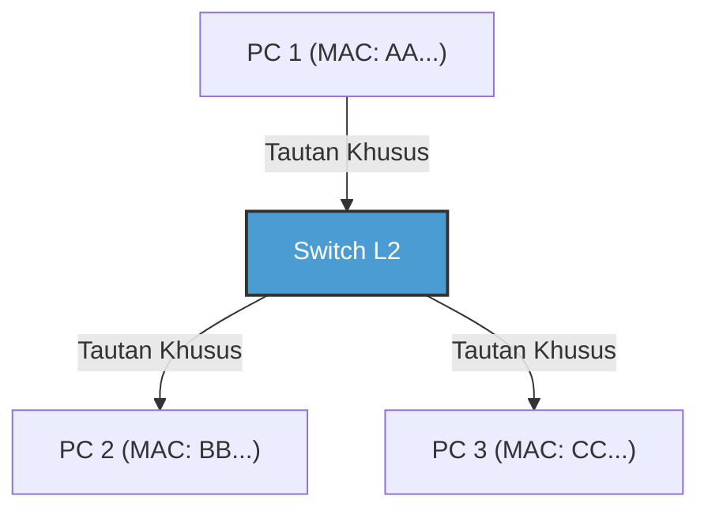

Dengan diperkenalkannya switch, pengkabelan antara setiap node dan switch menjadi independen secara logis dan fisik (topologi bintang). Alhasil, tabrakan tidak lagi terjadi secara fundamental karena jalur komunikasi telah dipisahkan. Akibatnya, menjadi mungkin untuk melakukan "Komunikasi Full-Duplex" di mana jalur transmisi dan jalur penerimaan digunakan secara bersamaan.
Pada Ethernet modern, algoritma CSMA/CD tidak lagi digunakan, namun telah berevolusi menjadi komunikasi full-duplex point-to-point murni. Terlebih lagi, berkat teknologi VLAN (Virtual LAN) berdasarkan IEEE 802.1Q, telah memungkinkan untuk membagi dan mengintegrasikan jaringan logis secara fleksibel tanpa terikat oleh pengkabelan fisik, menjadikannya bertahta sebagai teknologi fundamental absolut yang mendukung infrastruktur perusahaan (enterprise) dan pusat data raksasa.

### Lapisan Data Link pada Wi-Fi: Pengaturan Lalu Lintas di Ruang Gelombang Radio Tak Terlihat
Sementara Ethernet kabel berevolusi menjadi komunikasi full-duplex tanpa tabrakan, Wi-Fi nirkabel menghadapi tantangan yang sama sulitnya dengan Ethernet tipe bus bersama pada masa lalu: "semua pihak berbagi media tunggal yang sama, yaitu ruang (udara)".

Dalam komunikasi nirkabel, karena gelombang radio yang dipancarkan sendiri terlalu kuat, secara fisik tidak mungkin untuk menerima gelombang radio lemah dari pihak lain secara bersamaan demi "mendeteksi (CD)" tabrakan. Selain itu, ada risiko khusus untuk nirkabel yang disebut "Masalah Node Tersembunyi (Hidden Node Problem)"—misalnya, terminal A dan C yang berada di kedua sisi access point tidak bisa saling menjangkau gelombang radionya, namun jika mereka mengirim secara bersamaan, gelombang radio mereka akan bertabrakan di access point.

Oleh karena itu, protokol lapisan data link (lapisan MAC) Wi-Fi menggunakan "CSMA/CA (Carrier Sense Multiple Access with Collision Avoidance)".
Dalam CSMA/CA, sebelum melakukan transmisi, status gelombang radio di ruang dipantau untuk jangka waktu tertentu (DIFS), dan transmisi baru dimulai setelah menunggu waktu backoff yang acak. Perbedaan paling penting adalah mekanisme **ACK (Acknowledge: Tanggapan Konfirmasi)**, yang tidak ada di jaringan kabel. Di Wi-Fi, pihak yang menerima data segera mengirim balik frame ACK (setelah waktu tunggu yang sangat singkat, yang disebut SIFS) untuk menunjukkan bahwa data berhasil diterima. Pihak pengirim baru dapat menilai bahwa komunikasi berhasil bila sudah menerima ACK ini. Jika ACK tidak kembali, dinilai bahwa data tersebut rusak akibat tabrakan atau interferensi, dan waktu backoff akan digandakan guna mencoba pengiriman ulang.

Lebih jauh lagi, terdapat pula mekanisme yang disebut "RTS/CTS Handshake" untuk mengatasi masalah node tersembunyi. Sebelum mengirim data besar, pihak pengirim mengirimkan frame kontrol pendek yang disebut RTS (Request to Send), lalu pihak penerima (misalnya, access point) merespons dengan CTS (Clear to Send). CTS ini memuat informasi tentang waktu reservasi (NAV: Network Allocation Vector), yang berarti "Saya akan berkomunikasi selama ○○ mikrodetik mulai sekarang, jadi perangkat di sekitarnya harap diam", dan perangkat di sekitarnya yang menerima ini akan menahan diri untuk tidak berkomunikasi. Melalui cara inilah lapisan data link Wi-Fi berhasil melakukan pengaturan lalu lintas secara apik di ruang gelombang radio yang tak kasat mata.

---

## Penutup

Dunia fenomena fisik di mana cahaya melesat menembus kaca sebagai foton, bertahan menghadapi tekanan air laut dalam, dan berhamburan ke ruang angkasa sembari mengubah fase dan amplitudonya. Kemudian, di atas fenomena fisik yang penuh derau dan ketidakpastian itu, disematkan sinkronisasi dengan preamble, identifikasi individu melalui alamat MAC, deteksi kesalahan ketat menggunakan CRC, serta kontrol lalu lintas yang canggih menggunakan switching atau CSMA/CA, sehingga untuk pertama kalinya memungkinkan untuk "mengirimkan sekumpulan data bermakna (frame) ke perangkat sebelah tanpa kesalahan". Inilah keajaiban yang diwujudkan oleh Lapisan 1 dan Lapisan 2.

Namun, hal ini saja belum bisa menjadi internet yang menghubungkan seluruh dunia. Pasalnya, komunikasi menggunakan alamat MAC hanya berfungsi di "desa yang sempit", yaitu "jaringan yang sama (broadcast domain)" yang terhubung ke switch atau access point yang sama, atau yang terhalang oleh router.

Bab berikutnya "Bab 3: Lapisan Jaringan dan IP", akan mengupas inti dari IP (Internet Protocol) dan mekanisme perutean (routing), yaitu skema pencarian rute epik yang menghubungkan desa-desa lokal tak terhitung jumlahnya untuk mengantarkan paket bagaikan estafet ember ke jaringan tak dikenal di sisi lain bumi.

# Bab 3: Lapisan Jaringan dan Mekanisme Routing —— Peta Pelayaran Paket Mengarungi Samudra

Dasar dari internet yang kita gunakan sehari-hari adalah Lapisan ke-3 dalam Model Referensi OSI, yakni "Lapisan Jaringan". Melampaui komunikasi langsung melalui kabel fisik atau gelombang radio (lapisan data link), alasan kita mampu berkomunikasi secara global dengan server yang jaraknya ribuan kilometer adalah keberadaan mekanisme pengaturan rute (routing) yang luar biasa di mana router yang tak terhitung jumlahnya secara mandiri bertukar informasi.

Bab ini akan membahas teknik "ilmu pelayaran" bagaimana paket dapat mencapai tujuannya dengan menelaahnya secara mendalam dari sudut pandang teknis, historis, dan fisik, mulai dari struktur IP (Internet Protocol), limitasi pada IPv4 dan arsitektur IPv6, hingga mencapai kedalaman BGP (Border Gateway Protocol) yang menghubungkan Sistem Otonom (AS) di seluruh dunia.

## 3.1 Paradigma Lapisan Jaringan: Prinsip End-to-End

Terobosan terbesar dalam filosofi perancangan internet terletak pada **prinsip End-to-End**, yaitu "node perantara dalam jaringan (router) hanya mendedikasikan diri pada penerusan paket (packet forwarding), sementara proses kompleks (koreksi kesalahan dan jaminan urutan) dilakukan oleh titik akhir (end-host)".

Pada jaringan telepon tradisional (circuit switching), jalur fisik diduduki sejak komunikasi dimulai hingga berakhir, dan status (state) dikelola di seluruh jaringan. Sebaliknya, lapisan jaringan internet (packet switching) bersifat "connectionless" dan tidak mempertahankan status. Setiap paket diperlakukan sebagai "surat" independen, dan router berulang kali melakukan tugas sederhana: menerima paket, melihat tujuan, dan meneruskannya ke titik estafet berikutnya (next hop) yang optimal. Kombinasi "Dumb Network (Jaringan Bodoh)" dan "Smart Terminal (Terminal Cerdas)" inilah alasan terbesar mengapa internet mampu berkembang pesat dan mengakomodasi beragam aplikasi.

## 3.2 Alamat Internet: Evolusi dan Sejarah Habisnya Alamat IP

Sebuah pengidentifikasi unik berupa alamat IP diberikan kepada semua perangkat di jaringan. Saat ini, internet berada dalam masa transisi, di mana dua generasi protokol IP bercampur.

### IPv4: Ruang 32 Bit dan Perlawanan terhadap Penipisan

IPv4, yang didefinisikan dalam RFC 791 pada tahun 1981, memiliki ruang 32 bit (sekitar 4,3 miliar). Pada saat desain awalnya, angka 4,3 miliar terasa sangat besar, namun karena ledakan popularitas internet, krisis kelangkaan alamat mulai disuarakan pada tahun 1990-an.

Solusi yang diciptakan untuk mengatasi krisis ini adalah **CIDR (Classless Inter-Domain Routing)** dan **NAT (Network Address Translation)**.
Alokasi alamat IP awal dilakukan dengan metode "classful" yang kasar seperti Kelas A (/8), Kelas B (/16), dan Kelas C (/24), yang menyebabkan pemborosan alamat yang parah. CIDR menggantinya dengan Variable Length Subnet Mask (VLSM), mewujudkan perutean "classless" yang mengalokasikan alamat hanya sebanyak yang dibutuhkan.
Selanjutnya, dengan kemunculan NAT, ruang alamat IPv4 privat dan satu alamat IPv4 publik dapat dikaitkan, sehingga memungkinkan ribuan perangkat untuk berbagi satu alamat. Namun, NAT merusak prinsip End-to-End dan mengharuskan teknologi pelintasan NAT (NAT traversal) yang kompleks (seperti STUN/TURN/ICE) untuk komunikasi P2P atau real-time.

### IPv6: Ruang Tak Terbatas 128 Bit dan Struktur Header Generasi Berikutnya

Sebagai solusi mendasar untuk kelangkaan alamat, **IPv6** dirumuskan dalam RFC 2460 pada tahun 1998. IPv6 memiliki ruang alamat 128 bit, menyediakan ruang luas sebanyak $2^{128}$ (sekitar 340 undecillion) alamat, yang bahkan tidak akan habis jika dialokasikan ke setiap butir pasir di bumi.

Inovasi IPv6 bukan hanya pada panjang alamatnya. Penyederhanaan drastis dilakukan pada struktur headernya. Opsi panjang variabel dan checksum header yang ada pada IPv4 dihapus, dan header dasar ditetapkan pada 40 byte. Hal ini mempercepat pemrosesan paket (routing) oleh perangkat keras (ASIC dan TCAM). Selain itu, fragmentasi (pembagian paket) tidak lagi dilakukan oleh router perantara, melainkan hanya oleh host pengirim, yang secara signifikan mengurangi beban pada router.

## 3.3 Dualitas Routing: Control Plane dan Data Plane

Bagian dalam router pada dasarnya dibagi menjadi dua "plane (bidang)":

1. **Control Plane (Bidang Kontrol)**
   Ini adalah bagian otak di mana router saling berkomunikasi menggunakan protokol perutean (seperti OSPF atau BGP), mempelajari topologi jaringan (bentuk koneksi), dan menghitung rute optimal. Hasil perhitungannya disimpan dalam basis data yang disebut RIB (Routing Information Base).
2. **Data Plane (Bidang Data)**
   Ini adalah bagian otot yang secara aktual menerima paket, menentukan antarmuka berikutnya berdasarkan alamat IP tujuan, dan meneruskannya (forwarding). Menggunakan tabel khusus penerusan yang disebut FIB (Forwarding Information Base) yang dihasilkan dari RIB, bidang ini mentransfer paket dengan kecepatan perangkat keras skala nanodetik menggunakan memori khusus seperti TCAM (Ternary Content-Addressable Memory).

## 3.4 Tata Kelola Jaringan Internal: IGP dan Sistem Otonom (AS)

Internet bukanlah sebuah jaringan raksasa tunggal, melainkan kumpulan jaringan independen yang masing-masing dikelola oleh ISP (Penyedia Layanan Internet), perusahaan, universitas, dll. Area manajemen independen ini disebut **AS (Autonomous System: Sistem Otonom)**. Saat ini, terdapat lebih dari 100.000 AS di seluruh dunia.

Untuk routing di dalam AS (di dalam perusahaan atau backbone ISP), digunakan **IGP (Interior Gateway Protocol)**. Dua IGP perwakilan adalah sebagai berikut:

- **OSPF (Open Shortest Path First) / IS-IS**
  Ini adalah protokol perutean tipe "link-state". Router menyebarkan (flooding) status koneksi di sekitarnya (bandwidth dan status tautan) ke seluruh jaringan, dan setiap router membangun peta lengkap jaringan (basis data topologi). Di atas peta tersebut, Algoritma Dijkstra (algoritma jalur terpendek) dijalankan untuk menghitung rute dengan "biaya (cost)" paling minimum ke tujuan. Secara fisik dan matematis, pendekatan ini sama persis dengan sistem navigasi mobil yang menghitung rute terpendek dengan mempertimbangkan informasi kemacetan.

## 3.5 BGP: Protokol "Diplomasi" yang Menjalin Internet

Sementara bagian dalam AS diatur oleh OSPF dan sejenisnya, standar de facto tunggal dari **EGP (Exterior Gateway Protocol)** yang menghubungkan antar AS dan membentuk internet global adalah **BGP (Border Gateway Protocol)**. BGP adalah protokol yang sangat unik karena menentukan rute tidak hanya berdasarkan jarak teknis terpendek, tetapi juga mencerminkan "hubungan bisnis" dan "kebijakan antar negara".

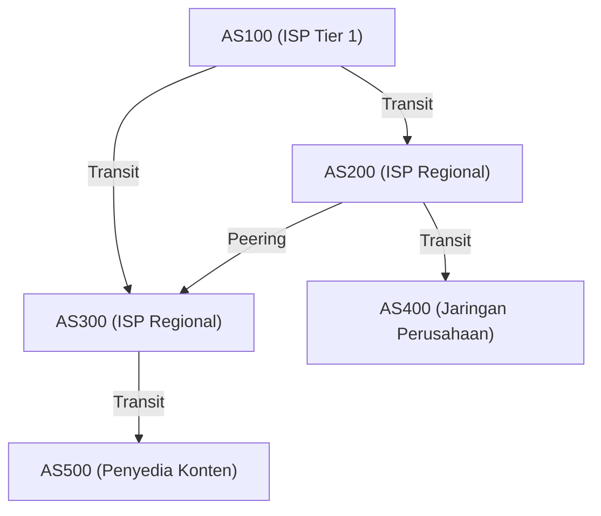

### Peering dan Transit: Ekonomi Internet

Koneksi antar AS menggunakan BGP umumnya dibagi menjadi dua model bisnis:

1. **Transit**
   Sebuah hubungan di mana ISP kecil atau perusahaan membayar biaya komunikasi kepada ISP raksasa (Tier 1) untuk disediakan jangkauan (full route) ke semua tempat di internet. Ini setara dengan hubungan tuan dan hamba antara "pelanggan" dan "penyedia".
2. **Peering**
   Hubungan di mana sesama ISP, atau ISP dengan penyedia konten (seperti Google atau Netflix), menghubungkan jaringan mereka secara langsung satu sama lain melalui IX (Internet Exchange) atau sejenisnya. Hal ini biasanya dilakukan secara gratis (settlement-free), dengan tujuan memotong jalan lalu lintas dan menekan biaya.

### Vektor Path (Path Vector) dan Algoritma Seleksi Rute BGP

BGP adalah protokol bertipe "path vector". Protokol ini mempertahankan atribut tentang AS mana saja yang telah dilalui (AS_PATH) sebelum mencapai jaringan IP tertentu. Misalnya, jika informasi rute memuat `AS_PATH: [200, 100, 500]`, paket akan melewati AS dalam urutan tersebut. Hal ini secara andal mencegah terjadinya routing loop (putaran perutean).

Ketika router BGP menerima beberapa rute menuju tujuan yang sama, ia memilih hanya satu jalur terbaik berdasarkan prioritas yang kompleks (Local Preference, panjang AS_PATH, MED, jenis eBGP/iBGP, dll.). Secara khusus, atribut **Local Preference (Preferensi Lokal)** sangat kuat, dan dapat memaksakan kebijakan bisnis pada router, seperti "Secara teknis rutenya memutar jauh, tapi lebih baik memprioritaskannya karena menggunakan jalur peering tidak dikenakan biaya transit".

### Pembajakan BGP (BGP Hijacking) dan Kerentanan Rute

BGP awalnya dirancang berdasarkan "teori niat baik". Karena ia mempercayai bahwa "informasi rute yang diumumkan pihak lain adalah benar", jika ada AS yang berniat jahat atau melakukan kesalahan konfigurasi lalu mengirim pembaruan BGP keliru yang menyatakan "Saya memiliki rute optimal ke jaringan Google (8.8.8.8/32)", maka lalu lintas dari seluruh dunia akan tersedot ke AS tersebut, inilah yang disebut **Pembajakan BGP (BGP Hijacking)**.
Sepanjang sejarah, gangguan skala besar yang mengeksploitasi kerentanan BGP tak terhitung jumlahnya, seperti insiden tahun 2008 ketika pemerintah Pakistan mencoba memblokir YouTube, tetapi justru berdampak mematikan YouTube di seluruh dunia. Saat ini, penerapan mekanisme verifikasi informasi rute menggunakan teknologi kriptografi, seperti RPKI (Resource Public Key Infrastructure), sedang terus didorong.

## 3.6 Kendala Fisik dan Pertarungan Router: Latensi dan Bufferbloat

Routing di lapisan jaringan selalu bertarung melawan kendala fisika.
Kecepatan rambat cahaya di dalam serat optik adalah sekitar 67% dari kecepatan cahaya dalam ruang hampa (sekitar 200.000 km/detik), sehingga keterlambatan fisik (propagation delay) sebesar 100-120 milidetik untuk perjalanan pulang pergi (RTT) dari Jepang ke Pantai Barat Amerika tidak dapat dihindari.

Selain itu, terdapat keterlambatan pemrosesan di setiap router, serta **queueing delay (penundaan antrean)**. Saat jaringan mengalami kongesti (kepadatan), router akan menyimpan paket sementara di memori (buffer). Karena router modern memiliki memori berkapasitas sangat besar, terjadilah fenomena di mana paket terus diserap oleh memori selama kongesti berlangsung panjang alih-alih dibuang (drop). Inilah yang disebut **Bufferbloat**. Terus tertahannya paket dalam jumlah masif di dalam buffer mengakibatkan kontrol kongesti di lapisan atas seperti TCP tidak bekerja secara normal, yang pada akhirnya menyebabkan keterlambatan ekstrem (ribuan milidetik). Untuk menyelesaikan masalah ini, algoritma manajemen antrean tingkat lanjut seperti AQM (Active Queue Management) dan FQ-CoDel telah diimplementasikan pada router dan OS modern.
## Kesimpulan

Lapisan ke-3, Lapisan Jaringan, bukanlah sekadar pengangkut data belaka. Di dalamnya, terdapat perubahan historis dari IPv4 ke IPv6, pemrosesan perangkat keras dalam nanodetik menggunakan TCAM, pencarian rute terpendek secara matematis dengan OSPF, serta kontrol rute terdistribusi otonom oleh BGP yang sarat akan niat ekonomi dan politik, yang semuanya saling terkait dengan rumit.
Dari satu paket IP di ponsel pintar Anda hingga mencapai server di sisi lain bumi, ada sejumlah besar router yang merujuk peta mereka (tabel routing) dalam sekejap, terus mengoper paket seperti tongkat estafet, sebuah aktivitas dari sistem paling masif dan kompleks yang pernah dibangun manusia.

Pada bab berikutnya, kita akan membahas mekanisme "Lapisan Transpor (TCP/UDP)", yang dibangun di atas lapisan jaringan ini dan bertanggung jawab atas jaminan pengiriman paket serta kontrol kongesti.

# Bab 4: Kepastian dan Kecepatan Lapisan Transpor —— Dilema Utama yang Mendukung Transmisi Informasi

## 1. Pendahuluan: Prinsip End-to-End dan Misi Lapisan Transpor

Tugas utama lapisan jaringan (IP) yang kita lihat di bab-bab sebelumnya adalah mengirimkan paket secara fisik dan logis melintasi lautan jaringan yang luas, yaitu internet, menuju "komputer tujuan (antarmuka jaringan host)". Akan tetapi, komunikasi tidak selesai hanya ketika paket mencapai host tujuan. Sistem komputer modern menjalankan banyak proses aplikasi secara bersamaan (multitasking) pada OS (web browser, klien email, aplikasi streaming video, proses sinkronisasi di latar belakang, layanan API, dll.).

Dari tumpukan paket yang terus muncul tanpa urutan dari lapisan IP, tugas mengidentifikasi paket mana yang milik aplikasi mana, merekonstruksinya menjadi aliran data yang bermakna, atau mengkompensasinya jika ada yang hilang, sepenuhnya diemban oleh "Lapisan Transpor (Transport Layer)" sebagai otoritas akhir dalam pengelolaan data di endpoint.

Pada inti dari filosofi desain internet terdapat keputusan arsitektur yang sangat indah dan kuat yang disebut "Prinsip End-to-End (End-to-End Principle)". Ini adalah konsep yang diusulkan oleh Jerome Saltzer dan rekan-rekannya pada tahun 1981, sebuah prinsip yang menyatakan bahwa "node perantara dalam jaringan (router dan switch) harus dikhususkan sedapat mungkin pada penerusan paket sederhana (dumb network), sementara proses kompleks seperti pemulihan kesalahan, kontrol urutan, dan enkripsi harus diserahkan kepada host di ujung komunikasi (smart endpoint)". Jika perangkat perantara jaringan dibekali dengan manajemen status yang kompleks atau fungsi koreksi kesalahan, internet tidak akan pernah bisa mencapai skalabilitas yang eksplosif secara global seperti sekarang ini.

Lapisan transpor selalu dihadapkan pada dilema mendasar di antara kendala fisika dan teori informasi. Itu adalah tarik-ulur (trade-off) antara "Kepastian (Reliability)" dan "Kecepatan (Speed / Low Latency)". Untuk menyampaikan informasi tanpa kehilangan apa pun, overhead konfirmasi dan transmisi ulang diperlukan, yang menyebabkan penundaan yang disertai batasan fisik kecepatan cahaya. Di sisi lain, jika kita mencoba meminimalkan penundaan, kita harus mengorbankan sebagian dari integritas informasi. Bagaimana menyelesaikan dilema yang berakar dari hukum fisika ini dan abstraksi seperti apa yang harus diberikan pada aplikasi telah membentuk evolusi protokol yang berbeda seperti TCP, UDP, dan QUIC modern.

## 2. TCP (Transmission Control Protocol): Mekanisme Kuat untuk Menjamin Kepastian

TCP diletakkan dasarnya pada tahun 1970-an sebelum komersialisasi, ketika internet masih disebut ARPANET, oleh Vinton Cerf dan Robert Kahn. Filosofi desainnya sangat jelas. Yaitu "menjamin bahwa di bawah lingkungan jaringan seburuk apa pun, bahkan pada jalur yang tidak stabil di mana paket loss sering terjadi, data akan sampai ke aplikasi tujuan tanpa cacat, dalam urutan yang benar, dan tanpa duplikasi". Pengembang aplikasi diberikan abstraksi yang kuat di mana, selama menggunakan TCP, mereka tidak perlu mempedulikan kompleksitas jaringan di baliknya atau kehilangan paket sama sekali, cukup membaca dan menulis data sebagai "aliran byte (byte stream) kontinu".

### Multiplexing melalui Nomor Port
Jika alamat IP adalah alamat yang menunjukkan "bangunan mana di bumi ini", maka "nomor port" di lapisan transpor sama dengan loket logis yang menunjukkan "ruangan mana di bangunan itu (proses mana) yang dituju". Nomor port direpresentasikan oleh bilangan bulat tak bertanda (unsigned integer) 16-bit, dengan nilai dari 0 hingga 65535.
Hal ini memungkinkan multiplexing ribuan hingga puluhan ribu komunikasi berbeda secara bersamaan di atas satu alamat IP dan satu antarmuka jaringan fisik. Misalnya, HTTP menggunakan port 80, HTTPS port 443, dan SSH port 22; layanan utama ini telah dialokasikan nomor-nomor yang dikenal sebagai "Well-Known Ports".

### 3-Way Handshake: Membangun Kepercayaan dan Keterlambatan Fisik
Sebelum TCP memulai komunikasi, selalu ada ritual untuk membentuk "koneksi (connection)" secara logis antara pengirim dan penerima. Inilah "3-Way Handshake". Ini bukan hanya untuk mengonfirmasi niat berkomunikasi, tetapi juga memiliki arti yang sangat penting berupa sinkronisasi (Synchronization) ruang status untuk pertukaran data dalam jumlah besar yang akan dimulai.

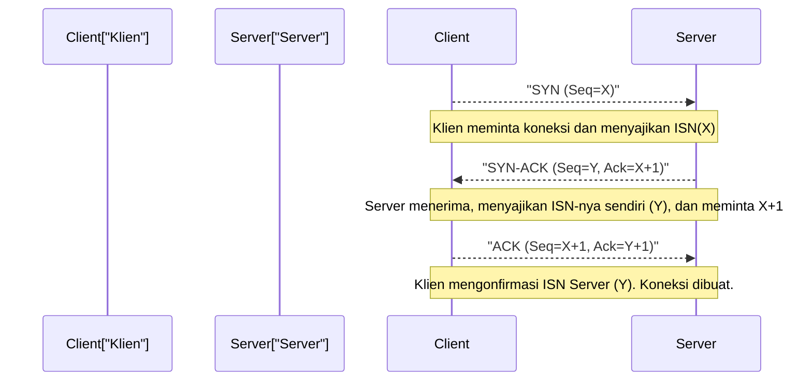

1. **SYN (Synchronize):** Klien mengirimkan paket permintaan sinkronisasi (segmen TCP dengan flag SYN yang diatur) ke server. Pada saat ini, klien menyajikan "Nomor Urutan Awal (ISN: Initial Sequence Number, di sini kita sebut X)" 32-bit yang dihasilkan secara acak. Ada alasan mengapa ISN tidak dimulai dari nol atau nilai tetap. Tujuannya adalah untuk mencegah agar "paket lama yang tersesat di jaringan dan datang terlambat (ghost packet)" pada komunikasi dengan IP dan port yang sama yang sudah terputus di masa lalu disalahartikan sebagai paket komunikasi yang baru. Hal ini juga memiliki implikasi kriptografi untuk mencegah serangan prediksi nomor urut TCP (IP Spoofing) di mana penyerang mencoba menebak nomor urut untuk memasukkan data palsu.
2. **SYN-ACK:** Saat server menerima permintaan koneksi, server mengembalikan nilai ISN klien ditambah 1 (X+1) sebagai "Nomor Konfirmasi (Acknowledgment Number)", seraya mengirim balik paket SYN-ACK yang dilampiri nomor urutan awalnya (ISN) sendiri secara acak (Y).
3. **ACK (Acknowledgment):** Sebagai bukti bahwa klien menerima ISN server dengan benar, klien mengirimkan paket ACK dengan Y+1 sebagai nomor konfirmasi.

Ketika pertukaran tiga paket ini selesai, status komunikasi dua arah diamankan di memori dan persiapan untuk transfer data telah siap. Akan tetapi, batas fisik infrastruktur komunikasi sangat membebani proses ketat ini. Batas itu adalah "kecepatan cahaya".
Kecepatan cahaya dalam ruang hampa adalah sekitar 300.000 km/detik, namun, karena indeks bias dari inti (kaca kuarsa) pada serat optik, yang merupakan tulang punggung utama internet, kecepatan rambat sinyal cahaya turun menjadi sekitar dua pertiganya (sekitar 200.000 km/detik). Selain itu, penundaan pemrosesan perutean di router perantara serta penundaan antrean (queuing delay) dari switching juga harus ditambahkan. Akibatnya, misalnya antara Tokyo dan New York (jarak lurus sekitar 11.000 km, sementara panjang kabel sebenarnya lebih dari itu), waktu untuk satu perjalanan bolak-balik (1 RTT: Round Trip Time) secara fisik mutlak memerlukan 150 hingga 200 milidetik. Karena 3-way handshake dari TCP memerlukan setidaknya 1 RTT ini, tak peduli seberapa lebar bandwidth (lebar pita) yang Anda tingkatkan, latensi (penundaan) pada saat pembentukan koneksi selalu dibatasi oleh hukum absolut alam semesta yakni kecepatan cahaya.

### Sliding Window, Kontrol Urutan, dan Checksum
Begitu memasuki fase transfer data, TCP membagi aliran byte yang diterima dari aplikasi ke dalam segmen-segmen dengan ukuran yang sesuai (MSS: Maximum Segment Size, biasanya sekitar 1460 byte, yang didapat dari IP MTU dikurangi ukuran header) lalu mengirimkannya. Setiap segmen diberi nomor urut (sequence number) yang sesuai dengan jumlah byte datanya. Berdasarkan nomor ini, pihak penerima dapat menyusun kembali data tersebut ke dalam urutan asli yang benar, bahkan jika paket tiba dalam keadaan tidak berurutan (out of order).

Selain itu, header TCP berisi 16-bit "Checksum", yang dengan ketat memverifikasi apakah ada pembalikan bit (korupsi) pada data akibat derau (noise) listrik di jalur transmisi atau kesalahan memori pada router, dengan menggunakan operasi penjumlahan komplemen satu.

Apabila paket hilang di tengah jalan (packet loss), atau rusak dan dibuang, pihak penerima akan terus mengirimkan ACK dengan nomor urut yang diharapnya (duplicate ACK), atau tidak merespons sama sekali. Pihak pengirim akan "mengirim ulang (Retransmit)" paket tersebut apabila dalam waktu tertentu (RTO: Retransmission Timeout) tidak ada ACK yang kembali, atau jika mendeteksi adanya duplicate ACK.

Dalam mekanisme ini, hal yang secara drastis meningkatkan kecepatan komunikasi adalah konsep "Sliding Window". Menggunakan sistem "mengirim satu paket lalu tidak mengirim paket berikutnya sampai ACK dari paket itu diterima (Stop-and-Wait)" akan menyebabkan penurunan throughput yang sangat fatal di lingkungan dengan latensi tinggi (RTT besar) seperti yang telah disebutkan di atas.
Dalam sistem Sliding Window, pengirim dan penerima secara dinamis menyetujui "Ukuran Window (jumlah maksimal byte data belum dikonfirmasi yang bisa dikirimkan sekaligus)" dengan mempertimbangkan kapasitas buffer masing-masing. Pihak pengirim dapat terus menerus mengirimkan rangkaian paket ke jaringan dalam batas ukuran window ini, tanpa harus menunggu ACK dari pihak penerima. Setiap kali menerima ACK, bingkai (window) batas pengiriman yang diizinkan ini akan bergeser ke depan. Hal ini mewujudkan mekanisme pemanfaatan bandwidth yang maksimal yakni dengan "terus mengisi pipa dengan data" di lingkungan jaringan berkapasitas besar namun latensi tinggi (BDP: Bandwidth-Delay Product besar).

### Kontrol Kongesti (Congestion Control): Harmoni Matematis Mencegah Keruntuhan Jaringan
Karya agung sesungguhnya dari TCP, yang dapat dikatakan sebagai salah satu terobosan teknologi paling penting dalam sejarah internet, adalah "Kontrol Kongesti (Congestion Control)".

Pada tahun 1986, jaringan internet awal (NSFNET) menghadapi kegagalan sistem yang fatal yang dikenal sebagai "Keruntuhan Kongesti (Congestion Collapse)" akibat lonjakan volume komunikasi. Akibat masuknya data yang melebihi kapasitas pemrosesan jaringan, antrean router (buffer memory) meluap dan sejumlah besar paket dibuang. Endpoint TCP yang mendeteksi packet loss berasumsi bahwa data tidak terkirim dan secara serentak melakukan "pengiriman ulang" paket. Akibatnya, lebih banyak data dituangkan ke dalam jaringan, router semakin kewalahan, dan siklus perusak (vicious cycle) yang fatal pun terjadi, di mana throughput efektif anjlok menjadi hanya sepersekian ribu dari sebelumnya.

Untuk mencegah kematian jaringan ini, pada tahun 1988 Van Jacobson dan koleganya memperkenalkan algoritma kontrol dinamis tingkat tinggi pada TCP. Inti dari algoritma ini adalah kontrol pada window kongesti (cwnd: Congestion Window) yang berbasis pada prinsip "AIMD (Additive Increase Multiplicative Decrease: Peningkatan Aditif Penurunan Multiplikatif)".

1. **Slow Start:** Sesaat setelah komunikasi dimulai, kapasitas kosong jaringan sama sekali tidak diketahui. Oleh karena itu, ukuran window pengiriman dimulai dari nilai yang sangat kecil (secara historis 1 MSS, dan sekitar 10 MSS di era modern), dan setiap kali menerima 1 ACK, ukuran window ditambah sebesar 1 MSS. Hal ini berakibat pada peningkatan secara eksponensial di mana "ukuran window menjadi dua kali lipat setiap 1 RTT". Berlawanan dengan namanya "Slow", ini adalah fase untuk mengeksplorasi batas bandwidth secara sangat agresif dan dalam waktu singkat.
2. **Penghindaran Kongesti (Congestion Avoidance):** Saat ukuran window mencapai ambang batas yang telah ditentukan (ssthresh: Slow Start Threshold), peningkatan eksponensial dihentikan, dan sistem beralih ke peningkatan linier (penambahan 1 MSS per 1 RTT). Ini adalah fase untuk meraba kapasitas batas (ketebalan pipa) jaringan secara lebih hati-hati.
3. **Deteksi Packet Loss dan Penurunan Multiplikatif:** Saat terjadi packet loss (timeout terjadi, atau penerimaan duplicate ACK 3 kali berturut-turut dari penerima), TCP tidak menganggapnya sebagai sekadar kesalahan transmisi, melainkan menerjemahkannya sebagai "tanda bahwa kemacetan (kongesti) telah terjadi di jalur jaringan dan paket tumpah dari buffer router". Pada detik ini juga, TCP segera memberlakukan kendali diri dan secara drastis mengurangi ukuran window pengirimannya menjadi setengahnya (atau ke nilai awal dari Slow Start).

Melalui algoritma terdistribusi yang matematis dan altruistik berupa "berbagi bandwidth sedikit demi sedikit (Peningkatan Aditif), namun langsung menyerah ketika terjadi masalah (Penurunan Multiplikatif)" ini, ratusan juta, atau bahkan miliaran koneksi TCP mandiri di internet dapat mempertahankan keharmonisan (homeostasis) yang ajaib yang berupa "pembagian bandwidth yang adil" dan "operasional seluruh jaringan yang stabil", meskipun tidak ada manajer lalu lintas (traffic) yang tersentralisasi.

Belakangan ini, kapasitas memori buffer router yang semakin besar justru membawa dampak buruk. Sebelum pembuangan paket akibat kongesti terjadi, paket terus menumpuk di antrean yang memanjang, menyebabkan latensi (nilai Ping) melonjak hingga ratusan milidetik sampai beberapa detik. Fenomena fisik baru yang dikenal sebagai "Bufferbloat" ini mulai menjadi masalah. Untuk menanganinya, algoritma kontrol kongesti modern seperti BBR (Bottleneck Bandwidth and Round-trip propagation time) dikembangkan oleh Google dan lainnya, yang mendeteksi "peningkatan RTT (waktu tunda)" alih-alih kehilangan paket sebagai tanda kongesti, dan secara aktif membatasi kecepatan transmisi sebelum buffer menjadi penuh, menjadikannya standar baru untuk TCP saat ini.

## 3. UDP (User Datagram Protocol): Pengurangan untuk Kecepatan

Jika TCP adalah "manajer overprotektif" yang menjamin kepastian sempurna dari data lewat transisi status yang rumit dan algoritma canggih, maka UDP, yang berada di lapisan transpor yang sama, adalah "pengangkut minimalis" yang telah mengurangi peran sebagai protokol ke batas absolutnya. Dirancang oleh Jon Postel pada tahun 1980, UDP hanya memiliki fungsi transpor yang paling mendasar.

Header UDP hanyalah 8 byte (sedangkan header TCP biasanya 20 byte dan bisa mencapai maksimal 60 byte termasuk opsinya). Di dalamnya hanya memuat "nomor port sumber", "nomor port tujuan", "panjang data", serta "checksum" sederhana untuk mendeteksi korupsi data.

Dari mulai inisiasi koneksi lewat 3-way handshake, jaminan urutan lewat sequence number, kontrol aliran menggunakan sliding window, pemrosesan pengiriman ulang, hingga kontrol kongesti untuk melindungi jaringan, semuanya sama sekali tidak diimplementasikan pada UDP. Data yang diteruskan dari aplikasi hanya dibungkus dalam datagram IP untuk dilempar ke lapisan jaringan lalu dikirim dengan prinsip "Fire and Forget (tembak dan lupakan)". Ia bahkan tidak peduli apakah data itu sudah sampai ke tujuannya atau belum.

Akan tetapi, kesederhanaan struktural yang bisa disebut tidak bertanggung jawab inilah yang justru menjadi senjata terbesar UDP, dan alasan mengapa UDP bisa mengalahkan TCP dalam beberapa use case tertentu.

### Nilai Sejati UDP: Mengutamakan Latensi dan Komunikasi Real-Time
Dalam komunikasi real-time, di mana latensi fisik (penundaan) harus ditekan seminimal mungkin, "kontrol transmisi ulang (retransmission) untuk memastikan kepastian" dari TCP justru menyebabkan masalah yang mematikan.

Sebagai contoh, bayangkan game online seperti FPS (First Person Shooter), panggilan suara (VoIP), atau sistem konferensi video (Zoom, WebRTC, dll.). Dalam aplikasi-aplikasi ini, paket-paket sampel suara atau informasi posisi terkini dikirim puluhan hingga ratusan kali dalam satu detik.
Apabila menggunakan TCP, misalkan sebuah paket suara yang dikirim 100 milidetik yang lalu hilang di sebuah router di perjalanan. TCP akan mendeteksi kerugian itu, mengirim ulang paket, dan kemudian pihak penerima akan mencoba memutarnya (playback) dengan urutan yang benar. Tapi, di lingkungan mana percakapan atau game sedang berjalan di waktu-nyata (real-time), "data lama yang tiba ratusan milidetik kemudian" sudah tak ada artinya lagi.
Alih-alih membantu, TCP justru akan menyetop proses penyerahan paket baru yang lebih mutakhir ke aplikasi dan menahannya di buffer (buffering) sambil menunggu paket yang hilang itu berhasil terkirim ulang agar urutannya lengkap. Inilah yang disebut dengan "Head-of-Line (HoL) Blocking". Terjadinya suara yang putus-putus, atau layar game membeku beberapa detik lalu tiba-tiba di-fast-forward, sebagian besar disebabkan oleh HoL blocking akibat antrean kirim ulang di TCP ini.

Dalam kasus semacam ini, UDP bisa merelakan masa lalu yang hilang (paket drop) dan memungkinkan aplikasi untuk segera memproses paket baru yang barusan tiba. Dalam komunikasi real-time, dibandingkan "semua datanya utuh tersusun", akan jauh lebih wajar bagi organ sensorik manusia jika "meski ada sedikit noise (gangguan) atau frame rate (frame drop), status ter-update selalu ditayangkan secara terus-menerus dengan latensi terpendek"; hal inilah yang memberikan user experience yang jauh lebih nyaman.

Selain itu, untuk komunikasi transaksi sederhana yang cukup hanya menggunakan "1 paket request kecil" untuk dibalas dengan "1 paket response", seperti pada resolusi nama DNS (Domain Name System) dan sinkronisasi waktu NTP (Network Time Protocol), UDP yang tidak memiliki overhead dari handshake sangatlah cocok.

## 4. QUIC: Pergeseran Paradigma Komunikasi Internet dan Protokol Generasi Berikutnya

Selama puluhan tahun dari masa awal mula munculnya internet, arsitektur jaringan kita terjebak pada dikotomi yang baku: "Jika Anda ingin kepastian pengiriman aliran data (stream), pakailah TCP; jika Anda ingin kecepatan dan real-time, pakailah UDP". Akan tetapi, seiring dengan evolusi dramatis Web saat ini (khususnya meluasnya komunikasi seluler (mobile) dan masuknya era HTTP/2 yang memuat begitu banyak sumber daya secara simultan), batasan dari desain dasar TCP mulai memperlihatkan bahwa desain itu sendiri justru menjadi hambatan.

Masalah terbesar adalah, seperti yang disinggung di bagian UDP di atas, adanya karakteristik bawaan TCP seperti "Head-of-Line (HoL) Blocking" dan "Latensi berlebihan" akibat dari pembangunan koneksi (connection establishment).
TCP mengelola semua arus komunikasi sebagai "satu rangkaian arus byte (byte stream) yang linear secara seri (serial)". Bayangkan jika Anda me-request file dalam jumlah banyak seperti HTML, CSS, JavaScript, serta puluhan file gambar secara bersamaan (multiplexed) melalui HTTP/2 demi menampilkan situs web terkini. Namun, di tingkat TCP sebagai dasarnya, mereka diolah sebagai satu aliran (stream); jadi seandainya ada 1 saja paket "Gambar A" yang hilang, TCP akan memblokir (di tingkat kernel OS) transmisi dari paket-paket "Skrip B" maupun "Gambar C" yang sebenarnya tidak terkait, dan semuanya harus menunggu sampai paket Gambar A selesai dikirimkan ulang.
Bukan hanya itu, demi kewajiban standar Web masa kini yang mengharuskan enkripsi (TLS/HTTPS), dengan stack protokol (tumpukan protokol) konvensional, "3-Way Handshake TCP (1 RTT)" harus dibereskan terlebih dahulu. Lalu diikuti oleh "Handshake pertukaran kunci enkripsi TLS (1~2 RTT)". Praktisnya dibutuhkan pemborosan keterlambatan fisik sebanyak 2~3 RTT, sebelum transmisi data aman yang sebenarnya akhirnya dimulai.

Untuk membereskan problem fundamental ini dan memicu pergeseran paradigma pada infrastruktur internet zaman sekarang, protokol transpor generasi selanjutnya yang standar pengembangannya dipimpin oleh Google, dan dibakukan oleh IETF (Internet Engineering Task Force), adalah "QUIC (Quick UDP Internet Connections)". Berangkat dari fondasi QUIC yang telah terdefinisi ulang, standar Web yang melandasinya kini dinamakan "HTTP/3".

### Kekakuan Middlebox dan Pelarian menuju Ruang Pengguna (User Space)
Pendekatan paling revolusioner QUIC, terletak di arsitektur perancangannya yang berani: **"Membangun ulang suatu lapisan transpor baru di ruang pengguna (user space) dengan membenamkan sistem enkripsi dan multiplexing ke atas paket UDP yang sudah ada."**

Mengapa bukannya menyempurnakan TCP, tetapi malah membangun di atas UDP? Di internet terdapat sangat banyak router, firewall, dan sistem terjemahan alamat (NAT: Network Address Translation) yang berfungsi sebagai "Middlebox". Karena pengoperasian mereka dari tahun ke tahun, telah membuat struktur konfigurasi mereka kaku. Jika disodori protokol-protokol jenis baru (yang tak dikenal dan bernomor beda selain TCP dan UDP), protokol asing itu akan langsung dibuang dan didepak tanpa pandang bulu karena dicap "ancaman anonim (tak diketahui)". Ini lazim dikenal sebagai "Osifikasi (Ossification / Pengerasan tulang) Internet". Tidak hanya itu, penerapan dari TCP itu sendiri di-hardcode (tertanam lekat-lekat) begitu dalam pada sistem operasi inti (OS Kernel) seperti Windows atau Linux; sehingga, memodifikasi semua OS di seluruh dunia agar bisa mengakomodasi pembaruan dan populasi dari suatu algoritma baru yang merata, dibutuhkan tahun-tahun pengerjaan yang sungguh sangat melelahkan.
Oleh karena itu QUIC mengakali dengan bersiasat di hadapan middlebox dengan bertopengkan paket-paket yang mengalir tersebut hanyalah murni bentuk "Paket UDP konvensional", selagi di saat yang sama pada bagian terdalam dari peramban web atau aplikasi di atas (user space), sebuah wujud baru implementasi unggulan milik TCP yang disempurnakan berevolusi dengan kontrol kongesti dan kontrol transmisi yang spesifiknya dimodifikasi khusus.

### Mekanisme Inovatif QUIC dan Melampaui Batas Fisik

1. **Pembebasan Mutlak dari HoL Blocking Melalui Independensi Aliran Data (Stream Independence):**
   QUIC tak sekedar mendulang satu aliran arus (stream) paket saja, namun ia memiliki kapabilitas memanajemen secara fungsi agar aliran tersebut pada level protokol, bisa saling independen atau "Aliran Mandiri". Kalau mengacu contoh yang disampaikan sebelumnya; andaikata paket milik Gambar A mendadak terhapus di lintasan tengah, pada QUIC arus transmisi Gambar A sajalah yang akan dibekukan sementara menunggu dikirim ulang, sementara transmisi dari Skrip B atau Gambar C takkan tersentuh dampaknya sama sekali. Hal ini menyebabkan lompatan drastis peningkatan rendering kecepatan halaman website web; teristimewa sekali untuk jaringan dari jalur perangkat mobile yang senantiasa fluktuatif mengalami frekuensi Packet Loss.
2. **Koneksi Stabil 0-RTT dan Integrasi Secara Sepadan untuk Urusan Enkripsi:**
   QUIC telah sejak mula berpadu secara mantap dan erat dengan sebuah enkripsi bawaan yang secara fitur ekuivalen setara kelasnya dengan TLS 1.3. Berbeda dengan kebodohan metode TCP lawas di masa dulu yang mengklasifikasikan tahapan "koneksi transportasi data (Transport)" dan tahapan "enkripsi (Encryption)" masing-masingnya harus dikerjakan terpisah. Bahkan kendati baru pertama kali berkomunikasi dengan salah satu server sekalipun, hanya memerlukan hitungan tunggal durasi 1 RTT untuk menyelesaikan peresmian tahapan dari persetujuan sambungan koneksi serta bertukar pin sandi (Kunci Enkripsi). Apalagi poin pencapaian tertingginya yaitu, bila mana sebelumnya klien telah berkontak koneksi dengan server tertentu (yang servernya itu menahan simpanan tiket sesi perijinan sementara di cache memori): proses jabat tangan akan menempuh tahapan kilat yang dikenal sebagai "0-RTT". Di mana dengan kata lain, **proses awal dari hantaran data paket HTTP Request yang terdepan, bisa ditembak secara berbarengan langsung tanpa perlu repot menunggu verifikasi sesi "handshake" tersebut lagi.** Ini merupakan wujud respons cerdas yang ditelurkan langsung di tata rancang desain protokol itu sendiri, melawan batas fisik yang membatasi seperti "Penundaan gara-gara dibatasi oleh rasio pergerakan hukum laju kecepatan cahaya".
3. **Migrasi Koneksi Tanpa Putus (Ketergantungan IP yang Dihilangkan):**
   Pada koneksi konvensional protokol TCP sangatlah bergantung dan wajib diikat kepada formasi kaku empat serangkai (4-tuple) berikut: "Alamat IP Sumber (Source IP), Port Sumber (Source Port), IP Target (Destination IP), serta Port Tujuan (Destination Port)". Imbas dari pola statis tersebut; apakala misalnya saja seorang pengguna memegang telepon cerdasnya untuk pergi ke tempat-tempat yang di luar, bertransisi secara berurutan koneksinya misalnya berpindah antara dari naungan Wi-Fi beralih koneksi ke jaringan paket kuota sinyal 4G/5G, tentu yang menjadi imbas langsung yaitu alamat IP yang dipakai otomatis berganti seketika; dengan sekejap pulalah koneksi TCP tersebut otomatis langsung terputus secara sepihak dan lantas koneksinya wajib memulai perulangan kembali melakukan sesi penantian jabat tangan (Handshake) dengan sangat melelahkan dan mengorbankan begitu membuang banyak waktu.
   Sedangkan pada sisi protokol QUIC ini tak dikelola patokannya berpandu atas wewenang penomoran dari Alamat IP (IP Address) saja semata-mata, melainkan justru memakai patokan dengan diresmikannya semacam sertifikasi identitas ID yang diterbitkan pertama kali unik sesaat setelah proses mula jalinan koneksi berhasil dibuka "ID Koneksi (Connection ID)". Makanya, biarpun Alamat Identitas IP fisik asli dan antarmuka instrumen network hardware senantiasa konstan senantiasa beralih bertransisi sekalipun, asalkan bila Identitas Nomor dari ID Koneksinya identik kembar seirama, aktivitas rutinitas aliran streaming pada tayangan Video maupun aktivitas pendownloadan pengunduhan paket besar dokumen File besar tidak akan sedikitpun sampai merasakan efek disrupsi (terputus sambungan koneksinya) yang berartinya melainkan langsung mulus seolah tanpa terjadi apapun (Seamless). Terkhususnya sekali bagi dunia jaringan mobilisasi komunikasi di zaman kehidupan moderen termutakhir ini sebagai titik pusat peran komunikasi pentingnya, poin inilah yang begitu terasa krusial menjadi bukti karakteristik kapabilitas andalan utamanya yang tak tergoyahkan.

## 5. Penutup: Membangun Tatanan dan Evolusi Protokol yang Mengatur Kekacauan

Di lapisan jaringan (IP) internet, fluktuasi selalu terjadi, rute dapat beralih terus menerus, kehilangan paket serta pengiriman dengan urutan tidak keruan adalah makanan lumrah setiap harinya. Dan di atas lautan "kekacauan (chaos)" itulah, lapisan transpor secara teladan memantapkan jaminan terwujudnya suatu "Tatanan Logika Mutlak Nan Kokoh" yang mana para aplikasi dapat selalu aman bersandar menggantungkan diri melaluinya.

Vinton Cerf serta kawan-kawan perancangnya seperti Van Jacobson yang secara sangat detail menguji asah-asahan kemantapan arsitektur dari prototipe Model TCP Matematis Kontrol Aliran (Congestion Control) yang amat tangguh berpresisi tinggi untuk menolak mencegah tumbangnya tulang punggung fundamental arsitektur penyokong jagat internet sejak masa silam hingga saat detik ini, demi mampu selalu melancarkan pasokan stabil transmisi hantaran lalu lintas dari sekian transfer paket data ke segala pelosok jaringan luas semesta ini. Belum lagi, ada kehebatan simplistis elegan arsitektur kesederhanaan dari UDP dalam merepons tuntutan kebutuhan di tengah limit batas latensi komunikasi pada sistem waktu real-time sesingkat mungkin. Di posisi pamungkas dan pada tingkat level final, kini tersaji satu paket solusi yang telah dilebur keunggulannya menjadi satu buah inovasi perpaduan di antara sinkronisasi sistem perlindungan pengaman ganda berupa proteksi enkripsi (Encryption) beserta multiplexing tingkat tinggi. Hal tersebut dioptimasi secara ideal secara eksklusif bagi kalangan era mobile masa modern; tak pelak inilah arsitektur paripurna elegan protokol besutan revolusioner: "QUIC".

Sekumpulan serangkaian rentetan mahakarya inilah, tak terbantahkan lagi, tak lain dan tak bukan bermuara semua murni semata karena bukti pencapaian puncak mahakarya dari sekian eksplorasi teknologi oleh peradaban nalar umat manusia untuk menjawab satu pertanyaan kunci pencarian yang pantang menyerah yaitu, "BAGAIMANA caranya kita bisa mendaratkan Informasi transfer komunikasi agar dengan presisi terukur utuh maksimal serta melaju sepantas-pantasnya secepat cahaya untuk menyambungkan titik komputer yang lokasinya luar biasa sangat saling berjauhan, sekaligus berhadapan di ruang lingkup hambatan dimensi keterbatasan batas laju pita kelajuan dari rasio hukum pembatasan kecepatan dinding batasan cahaya?"

Ketikalah paket-paket telah selesai disusun urut-urutannya lagi dengan urutan formasi susunan paling presisi paling benarnya, lalu setidaknya sekumpulan baris baris serangkaian kumpulan elemen sinyal elektrik tadi lambat laun menjadi seutas wujud formasi bermakna pada saat paket paket tersebut dikembalikan kepada jajaran aplikasi pada antarmuka tujuan akhirnya. Nah pada detik itu jugalah deretan barisan kode sinyal elektronik perlahan menanjak maknanya bereinkarnasi murni berubah sebagai suatu muatan utuh dengan menyandang identitas makna martabat dan arti hakiki bernama "INFORMASI". Berikutnya, untuk bab bagian seri pembahasan setelah bab yang sekarang kelak ini, di hadapan Anda sudah berdiri secara kokoh kuat sekali pada tatanan dari bagian panggung lantai pijakan konstruksi Lapisan Transpor itu tadi, barulah kita terjun menelusuri penemuan kedalaman lorong mekanika kerangka arsitektur pondasi pembentuk pilar dari wajah struktur ekosistem situs jaringan muka Web Network dunia keseharian masyarakat universal kita yakni di ranah koridor tahapan "Lapisan Aplikasi (HTTP, DNS, Dll)".

# Bab 5: Lapisan Aplikasi dan Sisi Belakang Web —— Kedalaman dari Resolusi Nama hingga Komunikasi Enkripsi

Pada bab-bab yang telah kita pelajari sebelumnya, perihal dari kajian eksplorasi awal dimulai perihal mengenai pembahasan yang bermuara dari lapisan Fisik yang menjelaskan tata cara tentang serangkaian rambatan foton atau fenomena pancaran gelombang elektromagnet yang menyusuri jalur medium logam tembaga ataupun penjalaran transmisi foton di saat berselancar pada lajur serabut untai media optikal fiber; kemudian ditelaah juga fenomena penentuan jalur jalan paket IP (Routing IP), menyambung sampai melaju kepada kajian tentang garansi keabsahan reliabilitas transmisi pada wilayah domain area dari Transport Layer (TCP/UDP). Namun di chapter bagian pada kesempatan kali ini pula, di waktu tepat momen ini pula lah kita siap segera mulai untuk beralih masuk mulai turun tangan secara frontal menuju fase tahap panggung medan berikutnya. Dan itulah dimensi babak arena utama di panggung teratas di mana pihak entitas manusianya sudah langsung turut berhadapan menatapnya sedekat mungkin. Mari sambut masuknya kita pada wilayah tahapan, "Lapisan Aplikasi (Application Layer)".

Merujuk panduan yang dibentangkan oleh pedoman standarisasi Model Referensi OSI, di tingkat deret 7 (Lapisan Aplikasi / Application Layer), Lalu pada deret urutan 6 (Lapisan Presentasi / Presentation Layer), kemudian merangkak ke tingkat ke 5 (Lapisan Sesi / Session Layer); yang pada faktanya ke semua fungsi spesialis dari penggabungan dari tiga serangkai hierarki itu jika pada perspektif tata sistem standarisasi protokol modern dari keluarga Hierarki Model TCP/IP kini telah seutuhnya resmi direduksi sekaligus dipampatkan perwujudannya tergabung terfusi hanya menjadi pada sebatas di kelas wilayah hierarki fungsi satu lapisan tunggal spesifik belaka saja dinamakan: "Lapisan Aplikasi (Application Layer)". Lapisan Aplikasi sejatinya berada mengambil porsi singgasana level kedudukan arsitektur tingkat tumpukan hirarki kasta abstraksi lapisan kelas tingkat teratas. Posisi puncaknya inilah yang bertindak dan mendapuk kedudukannya sebagai kawah ekosistem di mana sedemikian kompleks dan semrawutnya rajutan interaksi persilangan pergerakan manuver banyak pihak dari serangkaian kombinasi-kombinasi varietas dan jajaran aneka ragam pernak-pernik protokol. 
Sejalan dengan kerangka pembahasan ruang tema ini pula, dengan begitu cermat dan seksama sedalam mungkin mari kita amati dan bedah langsung pengamatan kita kepada peristiwa dibalik apa saja aktivitas dinamik yang terusik menari-nari menopang pertunjukan panggung di bagian bilik layar balik saat ketika sejak kali pertama jemari mengetik serangkaian input teks ke dalam isian boks URL Bar di layar penjelajah browser hingga klimaks detik tampil dan dipresentasikannya pampang visual perwujudan halaman tampilan layar laman website secara final. Mulai bermula di prosesi transisi tahapan penguraian (Resolusi Nama / Name Resolution) dengan memanfaatkan sokongan peranan Domain Name System (DNS); Menelusuri fase distribusi pelimpahan suplai persediaan sumber (Resource Transfer) dari pengandalan kinerja protokol HTTP; tak lepas serta pula turut dilibatkannya mekanisme proses dari tata cara komunikasi penyandian persandian pengamanan sandi dari perlindungan benteng algoritma enkripsi oleh sistem perlindungan mutakhir SSL/TLS. Hal tersebut dipelajari dengan sudut pandang dan kacamata dari cakupan tinjauan latar jejak jejak lintas fragmen fragmen kronik dimensi Sejarah dan juga tidak luput turut pula membawanya bersama pembedahan analisa pengupas telak tajam komprehensif pada kacamata perspektif pengkajian presisi tinggi pada teori bidang Ilmu Rekayasa Jaringan, ditambah tinjauan mendalam dari segi rumusan tata Ilmu matematika.

## 5.1 DNS (Domain Name System): Keajaiban dan Silsilah Basis Data Hierarkis Terdistribusi

Alamat IP (angka 32-bit pada IPv4 dan 128-bit pada IPv6) sangat ideal untuk membangun tabel routing yang digunakan oleh perangkat jaringan seperti router dan switch untuk meneruskan paket, tetapi sama sekali tidak cocok bagi manusia untuk mengingatnya secara intuitif, memberinya makna, dan mengelolanya.

Pada masa awal ARPANET, yang merupakan cikal bakal internet, pemetaan antara nama host dan alamat jaringan dikelola menggunakan metode yang sangat primitif. Pusat Informasi Jaringan (NIC) di Stanford Research Institute (SRI) secara terpusat mengelola file teks tunggal bernama `HOSTS.TXT`, dan setiap node akan mengunduh file ini melalui FTP pada malam hari untuk memperbarui sistem lokal mereka. Namun, memasuki tahun 1980-an, ketika jumlah host yang terhubung ke jaringan mulai menunjukkan peningkatan eksplosif secara eksponensial, model terpusat ini mengungkap batasan fatal: kemacetan lalu lintas, penundaan pembaruan, dan bentrokan nama (habisnya ruang nama).

Untuk mengatasi krisis skalabilitas ini, DNS (Domain Name System) yang didefinisikan sebagai RFC 882 dan RFC 883, dirancang dan diusulkan oleh Paul Mockapetris pada tahun 1983. Inti dari arsitektur DNS adalah penyimpanan Key-Value hierarkis yang didistribusikan dalam skala global. Untuk menghilangkan titik kegagalan tunggal dan memberikan skalabilitas yang hampir tak terbatas, sistem ini mengadopsi paradigma terdistribusi yang revolusioner dengan membagi ruang domain menjadi struktur pohon dan mendelegasikan (Delegation) otoritas manajemen untuk masing-masing cabang.

### Perjalanan Panjang Resolusi Nama: Dari Stub Resolver hingga Server Otoritatif

Saat pengguna mengetik `https://www.example.com` di omnibox peramban, Stub Resolver di dalam OS akan aktif, dan "perjalanan resolusi nama" yang epik pun dimulai di latar belakang. Proses ini juga merupakan serangkaian strategi cache tentang bagaimana menghindari kendala hukum fisika berupa penundaan jaringan.

1. **Kueri Cache Bertingkat**: Pertama, cache peramban lokal dengan latensi terendah diperiksa. Selanjutnya, cache DNS OS, dan kemudian cache DNS dari router di jaringan lokal akan dikueri. Cara paling efektif untuk mengatasi batasan fisik kecepatan cahaya (sekitar 300.000 kilometer per detik dalam ruang hampa, dan sekitar dua pertiganya di dalam serat optik) adalah dengan tidak memicu komunikasi jaringan sama sekali.
2. **Kueri ke Resolver Rekursif (Full Resolver)**: Jika tidak ada cache secara lokal, kueri akan dikirim ke Resolver Rekursif (Recursive Resolver / Full Resolver) yang dioperasikan oleh ISP atau penyedia DNS publik (seperti `8.8.8.8` milik Google atau `1.1.1.1` milik Cloudflare). Resolver ini menangani seluruh proses resolusi nama atas nama klien.
3. **Kueri Berulang ke Root Server**: Jika cache full resolver juga tidak memiliki catatan terkait, full resolver akan mengirimkan kueri ke "Root Server", puncak mutlak dari hierarki domain. Saat ini terdapat 13 kluster Root Server di dunia, dari A hingga M. Root server tidak secara langsung mengetahui alamat IP dari `www.example.com`, melainkan merespons dengan daftar name server yang mengelola TLD (Top Level Domain) `.com` (Referral: respons pendelegasian). Selain itu, root server yang tersebar di seluruh dunia berbagi alamat IP melalui teknologi perutean "Anycast", dan melalui pemilihan jalur BGP (Border Gateway Protocol), lalu lintas secara mandiri diarahkan ke server yang paling dekat secara fisik dan topologi jaringan dari klien.
4. **Kueri Berulang ke Server TLD**: Selanjutnya, full resolver mengirimkan kueri ke salah satu server TLD `.com` yang direkomendasikan. Server TLD mengembalikan alamat IP (catatan NS) dari server DNS Otoritatif (Authoritative) (name server) yang telah didelegasikan otoritas manajemen untuk `example.com`.
5. **Kueri ke Server DNS Otoritatif dan Pengambilan Catatan**: Terakhir, full resolver secara langsung mengakses server DNS otoritatif dari `example.com`. File zona dari server otoritatif berisi jawaban akhir berupa catatan A (alamat IPv4), catatan AAAA (alamat IPv6), atau catatan CNAME (nama alias) dari `www`, yang kemudian dikembalikan ke stub resolver klien melalui full resolver.

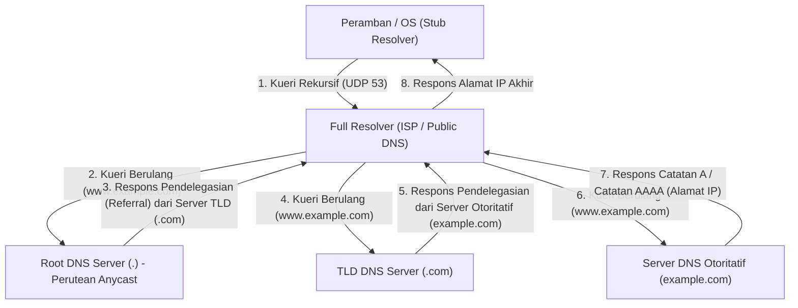

Komunikasi bolak-balik hierarkis yang kompleks ini biasanya diselesaikan hanya dalam beberapa milidetik hingga puluhan milidetik. DNS terutama menggunakan UDP port 53 sebagai protokol lapisan transport. Dengan sepenuhnya menghilangkan overhead bolak-balik dari jabat tangan tiga arah TCP (SYN, SYN-ACK, ACK), pengurangan latensi yang ekstrem dapat dicapai. Namun, jika payload respons DNS melebihi batas UDP historis sebesar 512 byte (kini lebih besar dengan ekstensi EDNS0), atau saat memverifikasi kunci untuk DNSSEC (DNS Security Extensions) yaitu ekstensi tanda tangan digital kriptografi guna mencegah serangan peracunan cache DNS, atau saat melakukan transfer zona (AXFR), mekanisme pembaharuan ulang (fallback) ke port TCP 53 yang lebih andal telah ditetapkan.

## 5.2 Arsitektur HTTP dan Evolusi Protokol

Setelah mendapatkan alamat IP server target melalui DNS, peramban selanjutnya akan membuat koneksi TCP dengan server target (port 80 atau 443) dan memulai dialog menggunakan HTTP (HyperText Transfer Protocol), yang merupakan bahasa utama dari lapisan aplikasi.

Ditemukan pada tahun 1989 oleh Tim Berners-Lee di Organisasi Eropa untuk Penelitian Nuklir (CERN), HTTP pada awalnya adalah protokol yang sangat sederhana yang memungkinkan fisikawan di seluruh dunia untuk secara efisien membagikan dan menghubungkan dokumen penelitian (hypertext) melalui jaringan. Struktur berbasis teksnya yang jelas—terdiri dari baris permintaan (metode, URI, versi protokol), kolom header, baris kosong (CRLF), dan badan pesan—telah sangat mendorong proses debugging dan penyebaran sistem ini.

Filosofi desain mendasar dan fitur terbesar HTTP adalah bahwa ia "Stateless". Server sama sekali tidak menyimpan status atau konteks permintaan klien sebelumnya dalam memori. Setiap permintaan diselesaikan sebagai transaksi yang sepenuhnya independen. Sifat stateless ini, yang juga terkait dengan arsitektur REST (Representational State Transfer), menyederhanakan implementasi server secara dramatis, serta memudahkan proses peningkatan skala (scale-out, atau penyeimbangan beban) dengan menambah jumlah server secara horizontal untuk menangani lalu lintas yang sangat besar. Penyeimbang beban (load balancer) dapat memastikan hasil yang sama ke server backend mana pun permintaan itu didistribusikan. Namun, dalam aplikasi web interaktif modern di mana manajemen status (State) tidak dapat dihindari, seperti fungsi keranjang belanja di situs web e-commerce atau menjaga status login pengguna, sifat stateless yang ketat ini menjadi kendala besar. Untuk mengatasi hal ini di luar protokol, mekanisme manajemen status semu dirancang, seperti Cookie yang menyimpan status di sisi klien melalui header HTTP, dan token sesi.

### Perjuangan Melawan Kendala Fisik: Pergeseran Paradigma dari HTTP/1.1 ke HTTP/3

Seiring dengan penyebaran Web yang eksplosif dan meningkatnya jumlah sumber daya (seperti gambar, CSS, dan file JavaScript) yang dimuat dalam satu halaman, HTTP menghadapi hukum fisik jaringan (batasan latensi karena kecepatan cahaya dan kehilangan paket), serta telah menjalani evolusi arsitektur yang dramatis pada tingkat protokol.

- **HTTP/1.1 (1997 - )**: Pada HTTP/1.0 awalnya, koneksi dan pemutusan TCP (jabat tangan 3 arah dan jabat tangan 4 arah) diulang setiap kali satu sumber daya diminta, yang merupakan inefisiensi ekstrem dari perspektif latensi. Dalam HTTP/1.1, Koneksi Persisten (Persistent Connection / Keep-Alive) distandardisasi, mengurangi biaya koneksi secara dramatis dengan memungkinkan satu koneksi TCP digunakan kembali. Namun, teknologi pipelining di HTTP/1.1 tidak diadopsi secara luas karena kesulitan implementasi dan masalah kompatibilitas proxy perantara, sehingga memiliki kelemahan struktural fatal yang disebut "Head-of-Line (HoL) Blocking". Ini adalah fenomena di mana, pada koneksi TCP tunggal, sementara server memproses satu sumber daya besar atau permintaan berat, permintaan berikutnya menjadi terhambat dalam antrean, sehingga memperburuk keseluruhan latensi. Untuk menghindari hal ini, peramban terpaksa mengandalkan retasan paksa dengan membuka beberapa koneksi TCP secara bersamaan (biasanya sekitar 6 koneksi) ke domain yang sama (seperti domain sharding).
- **HTTP/2 (2015 - )**: HTTP/2, yang distandardisasi berdasarkan protokol SPDY yang dikembangkan oleh Google, merombak arsitektur protokol secara mendasar dari berbasis teks ke berbasis "pembingkaian biner" (binary framing). Inovasi paling pentingnya adalah "Multiplexing aliran" (Multiplexing). Di HTTP/2, beberapa "aliran" (stream) virtual dapat dibuat dalam satu koneksi TCP tunggal, dan data dari permintaan dan respons dibagi ke dalam bingkai biner kecil yang dapat disisipkan (interleave) serta dikirim tanpa memandang urutannya. Hal ini sepenuhnya menghilangkan HoL blocking di lapisan aplikasi. Selain itu, dengan menggunakan mekanisme kompresi header berbasis algoritma HPACK (kombinasi pengodean Huffman statis dan tabel dinamis), volume transfer data redundan seperti Cookie dan User-Agent yang dikirim berulang pada setiap permintaan berkurang drastis, sehingga memaksimalkan efisiensi penggunaan bandwidth jaringan.
- **HTTP/3 (2022 - )**: HTTP/2 secara brilian menyelesaikan HoL blocking di lapisan aplikasi, tetapi penghalang fisik "HoL blocking selama kehilangan paket" di lapisan transport dasar (TCP) tetap ada. Untuk memastikan keandalan, ketika satu paket pun hilang, TCP menghentikan pengiriman paket data dari semua aliran pada koneksi TCP itu ke lapisan aplikasi sampai pengiriman ulang selesai (efek samping dari mekanisme jaminan urutan TCP). Untuk mengatasi masalah ini, HTTP/3 melakukan pergeseran paradigma dramatis dengan meninggalkan TCP yang telah menjadi tulang punggung internet selama puluhan tahun, dan mengadopsi protokol transport baru berbasis UDP yaitu "QUIC (Quick UDP Internet Connections)". QUIC menghindari penundaan evolusi yang terjadi karena TCP diimplementasikan di ruang kernel OS, dengan mengintegrasikan kontrol pengiriman ulangnya sendiri, kontrol kemacetan, dan kontrol aliran independen per aliran di atas UDP yang dapat diimplementasikan di ruang pengguna. Jika sebuah paket hilang, hanya aliran spesifik itu yang terpengaruh, sementara aliran lainnya dapat terus memproses tanpa diblokir. Lebih lanjut lagi, QUIC menggabungkan jabat tangan untuk pembuatan koneksi dengan jabat tangan untuk enkripsi (TLS 1.3), memungkinkan dimulainya pengiriman data terenkripsi dalam "0-RTT (Zero Round Trip Time)" dengan server yang memiliki riwayat komunikasi sebelumnya. Menghadapi batasan fisik kecepatan cahaya (komunikasi dengan belahan bumi lain selalu menyebabkan penundaan ratusan milidetik), ini adalah puncaknya dalam mengejar kinerja tertinggi dengan mengurangi jumlah perjalanan pulang-pergi (RTT) secara menyeluruh pada lapisan protokol.

## 5.3 Mekanisme Enkripsi dan Kepercayaan: Kedalaman Matematis dan Logika Pembuktian SSL/TLS

Internet pada dasarnya adalah jaringan komunikasi paket yang terbuka, dan data ditransfer ke tujuannya melalui pengerjaan estafet ember (bucket relay) melintasi router yang tak terhitung jumlahnya serta kabel serat optik bawah laut. Setiap node di sepanjang jalur itu (router perantara, ISP yang jahat, atau penyadap di jaringan Wi-Fi yang sama) secara fisik mampu mencegat isi komunikasi melalui penangkapan paket dan bahkan mengubahnya. Adalah protokol SSL (Secure Sockets Layer) dan penerusnya, TLS (Transport Layer Security), yang menahan kerentanan absolut dari jaringan ini menggunakan kekuatan matematika tingkat lanjut guna membuat saluran komunikasi yang aman.

Di dalam komunikasi Web modern, TLS menjamin "3 pilar keamanan" berikut:
1. **Kerahasiaan (Confidentiality)**: Isi komunikasi tidak dapat diuraikan meskipun disadap oleh pihak ketiga.
2. **Integritas (Integrity)**: Bahwa tidak ada satupun bit data yang dirusak atau diubah di jalur komunikasi. Ini dijamin oleh MAC (Message Authentication Code) dan AEAD (Authenticated Encryption with Associated Data).
3. **Autentikasi (Authentication)**: Bahwa pihak yang berkomunikasi adalah pemilik sah dari domain (server asli).

Teknologi yang mewujudkan ini adalah puncak dari teori kriptografi yang telah dibangun umat manusia selama berabad-abad, dan yang mengambil lompatan besar dengan perkembangan ilmu komputer dan teori bilangan terutama sejak Perang Dunia II.

### Pertukaran Kunci dan Kriptografi Kunci Publik: Masalah Logaritma Diskrit dan Tembok Faktorisasi Prima

Metode enkripsi paling sederhana dan tercepat adalah "Kriptografi Kunci Simetris (Symmetric Cryptography)" (standar saat ini adalah AES: Advanced Encryption Standard). Ini adalah teknik di mana pengirim dan penerima menggunakan "kunci simetris" yang sama untuk enkripsi dan dekripsi. Karena proses matematisnya ringan (kombinasi operasi XOR bit, substitusi, dan permutasi), ini cocok untuk mengenkripsi komunikasi kelas gigabit secara real-time. Namun, kriptografi kunci simetris memiliki paradoks mendasar (masalah distribusi kunci): "bagaimana cara mengirimkan kunci simetris rahasia itu sendiri secara aman ke pihak lain sebelum memulai komunikasi?". Dalam komunikasi dengan pihak tanpa hubungan kepercayaan sebelumnya seperti di internet, jika kunci simetris dikirim apa adanya, kunci itu dapat disadap di tengah jalan, membuat enkripsi menjadi tidak berguna.

Terobosan terbesar dalam kriptografi sejarah manusia yang menanggulangi hal ini adalah algoritma pertukaran kunci yang diterbitkan oleh Whitfield Diffie dan Martin Hellman pada tahun 1976, dan "Kriptografi Kunci Publik (Asymmetric Cryptography)" yang dirancang oleh RSA (Rivest, Shamir, Adleman) dkk. pada tahun 1977.

Dasar dari kriptografi kunci publik bertumpu pada konsep matematis "Fungsi satu arah (One-way function)" atau "Fungsi satu arah dengan pintu jebakan (Trapdoor one-way function)". Konsep ini memanfaatkan asimetri yang menyatakan, "perhitungan dalam satu arah (enkripsi) dapat diselesaikan secara instan oleh komputer, tetapi perhitungan dalam arah sebaliknya (dekripsi atau menebak kunci) tidak akan pernah selesai bahkan jika semua superkomputer di dunia digabungkan dan terus menghitung selama rentang usia alam semesta".

- **Kriptografi RSA**: Ini didasarkan pada sifat bahwa sangat mudah (dapat dihitung dalam waktu polinomial) untuk mengalikan dua bilangan prima yang sangat besar ($p$ dan $q$) dan menghasilkan sebuah bilangan komposit raksasa ($N = p \times q$), tetapi sangat sulit (hanya algoritma waktu sub-eksponensial yang diketahui) untuk menentukan faktor prima awal $p$ dan $q$ (masalah faktorisasi prima) hanya dari bilangan komposit raksasa $N$ yang diberikan. Dengan memanfaatkan sifat-sifat mendalam dari teori bilangan, seperti Fungsi Totient Euler dan Teorema Kecil Fermat, data yang dienkripsi dengan kunci publik membangun pintu jebakan (trapdoor) matematis yang hanya dapat didekripsi oleh pihak yang memegang pasangan kunci privatnya.
- **Kriptografi Kurva Eliptik (ECC: Elliptic Curve Cryptography)**: ECC, yang merupakan arus utama dalam TLS saat ini, mengaplikasikan kesulitan "Masalah Logaritma Diskrit" yang didefinisikan pada kurva eliptik di lapangan berhingga (misalnya, himpunan titik yang memenuhi persamaan seperti $y^2 = x^3 + ax + b$). Operasi geometris seperti "penjumlahan" dan "perkalian skalar" didefinisikan untuk titik-titik pada kurva eliptik. Mencari titik $P = kG$, di mana titik awal $G$ dijumlahkan dengan dirinya sendiri sebanyak jumlah rahasia $k$ kali, adalah hal yang mudah. Namun, menghitung mundur koefisien rahasia $k$ (logaritma diskrit) dari titik $G$ dan $P$ yang dipublikasikan adalah hal yang bahkan lebih sulit daripada faktorisasi prima RSA. Dengan ini, ECC membanggakan kekuatan enkripsi yang sama atau lebih baik dari RSA dengan panjang kunci yang sangat jauh lebih pendek (misalnya, keamanan yang setara dengan RSA 2048-bit dapat dicapai dengan ECC 256-bit), sehingga menghemat beban CPU dan bandwidth jaringan secara drastis.

### Jabat Tangan TLS: Ritual Kriptografi untuk Membangun Kepercayaan

Saat memulai komunikasi aman via HTTPS, klien dan server menghasilkan "kunci sesi" yang aman untuk kriptografi kunci simetris dan menjalankan protokol negosiasi canggih untuk mengautentikasi identitas satu sama lain. Inilah yang disebut jabat tangan TLS. Berikut ini adalah anatomi jabat tangan 1-RTT dari "TLS 1.3", standar terbaru yang memangkas segala inefisiensi.

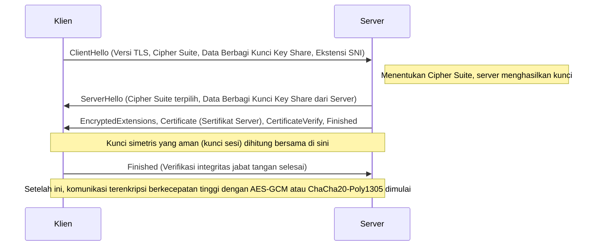

1. **ClientHello**: Saat memulai koneksi, klien mengirimkan versi TLS yang didukungnya, daftar algoritma enkripsi (Cipher Suites), dan parameter matematis awal (Key Share) untuk menghasilkan kunci enkripsi ke server. Selain itu, menggunakan ekstensi SNI (Server Name Indication), nama host target (misalnya, `www.example.com`) dikirim dalam teks biasa (plaintext). Ini adalah informasi penting bagi server yang mengoperasikan beberapa domain HTTPS pada satu alamat IP (virtual host) untuk memilih dan mengembalikan sertifikat yang benar.
2. **ServerHello**: Server memilih algoritma enkripsi yang paling kuat dan optimal (misalnya, `TLS_AES_256_GCM_SHA384`) dari daftar milik klien, lalu merespons beserta data Key Share miliknya.
3. **Pengiriman Sertifikat dan Tanda Tangan (Authentication)**: Server mengirimkan "sertifikat digital (X.509)" miliknya. Selanjutnya, server menggunakan "kunci privat" yang terkait dengan sertifikat tersebut untuk membuat dan mengirimkan tanda tangan digital (CertificateVerify) terhadap nilai hash dari seluruh pesan jabat tangan sejauh ini. Dengan demikian, terbukti secara matematis bahwa server tersebut adalah pemilik sah dari sertifikat tersebut (pemegang kunci privat).
4. **Pertukaran Kunci (Ephemeral Elliptic Curve Diffie-Hellman: ECDHE)**: Klien dan server secara matematis mengalikan Key Share (titik-titik publik pada kurva eliptik) yang mereka kirim dan terima dengan parameter rahasia yang hanya mereka miliki di sisi masing-masing. Secara luar biasa, melalui sifat matematis dari pertukaran kunci Diffie-Hellman ($ (g^a)^b = (g^b)^a = g^{ab} $), "master secret (kunci simetris)" yang sama dan kuat disintesis secara ajaib baik di sisi klien maupun di sisi server, tanpa harus mentransmisikan informasi rahasia apa pun melalui jaringan.
5. **Kerahasiaan Maju Sempurna (Perfect Forward Secrecy: PFS)**: Fitur yang sangat penting dari TLS 1.3 adalah bahwa parameter (Key Share) yang digunakan untuk pertukaran kunci ini bersifat sekali pakai dan dihasilkan secara baru (Ephemeral) setiap kali sesi dibuat. Dengan cara ini, seandainya kunci privat (seperti kunci RSA atau ECDSA) server untuk pembuktian identitas jangka panjang bocor ke penyerang di tahun-tahun mendatang, sama sekali tidak mungkin secara matematis untuk merunut balik dan mendekripsi paket komunikasi terenkripsi yang pernah direkam dan disimpan di masa lalu. Kerahasiaan dari komunikasi masa lalu dijamin keberlangsungannya untuk masa depan.

### PKI dan Rantai Kepercayaan (Chain of Trust): Paspor Dunia Digital

Di dalam mekanisme enkripsi yang telah dijelaskan, masih tersisa satu celah logika fatal. Yaitu pertanyaan: "Bagaimana klien dapat yakin bahwa sertifikat dan kunci publik yang dikirim oleh server tersebut benar-benar asli milik domain targetnya (misalnya, situs web sebuah bank)?".
Jika perantara jahat yang menguasai rute jaringan melakukan "Serangan Man-in-the-Middle" (Man-in-the-Middle Attack) dengan menyamar sebagai server dan mengirimkan sertifikat palsu dan kunci publiknya sendiri kepada klien, pertukaran kunci dan proses enkripsinya sendiri akan berhasil dengan sempurna secara matematis. Akan tetapi, pihak yang berinteraksi melalui komunikasi terenkripsi tersebut bukanlah bank target, melainkan sang penyerang.

Kerangka sosio-teknis untuk memecahkan tantangan autentikasi fundamental ini adalah keberadaan PKI (Public Key Infrastructure: Infrastruktur Kunci Publik) dan "Otoritas Sertifikat (CA: Certificate Authority)" yang bertindak sebagai jangkar kepercayaan.

Pemilik server membuat CSR (Certificate Signing Request) yang berisi kunci publiknya sendiri, kemudian menyerahkannya kepada lembaga pihak ketiga tepercaya yaitu CA, seperti DigiCert, GlobalSign, atau Let's Encrypt. Setelah memverifikasi bahwa hak kepemilikan domain benar-benar ada pada pemohon (melalui validasi domain, validasi organisasi, dll.), CA menerapkan "tanda tangan digital" pada informasi kunci publik server tersebut dengan menggunakan "kunci privat" miliknya sendiri yang kuat, dan kemudian menerbitkannya sebagai sertifikat server.

Di sisi lain, di dalam sistem operasi seperti Windows dan macOS, serta peramban seperti Chrome dan Firefox, sekumpulan "sertifikat root (kunci publik)" dari root CA yang telah menjalani audit ketat secara global telah di-hardcode sebelumnya dan disertakan sebagai titik awal dari kepercayaan (Trust Anchor).

Ketika klien menerima sertifikat dari server, ia menggunakan kunci publik root CA yang sudah tertanam pada OS untuk melakukan verifikasi kriptografi atas tanda tangan digital CA yang disertakan pada sertifikat tersebut. Jika verifikasi tanda tangan berhasil, hal tersebut membuktikan bahwa isi sertifikat (seperti nama domain dan kunci publik) dijamin oleh CA dan belum mengalami perusakan.

1. Klien mempercayai root CA tanpa syarat (pra-instalasi ke dalam trust store).
2. Root CA mempercayai perantara CA dan menandatanganinya.
3. Perantara CA mempercayai entitas akhir (server Web) dan menandatanganinya.

Melalui hubungan transitif yang disebut "Rantai Kepercayaan (Chain of Trust)" ini, kita mampu membangun hubungan kepercayaan yang kuat secara dinamis dan seketika dengan server yang tidak dikenal dan berjarak jauh secara fisik, sekaligus memantapkan saluran komunikasi yang terenkripsi aman.

## Kesimpulan: Konvergensi Lapisan dan Melangkah ke Tahap Berikutnya

Di Bab 5, kita telah melakukan anatomi rinci tentang resolusi nama, protokol permintaan dan respons data, serta selubung matematis enkripsi yang menyelimuti semuanya, yang terjadi di kedalaman lapisan aplikasi.
DNS berfungsi sebagai buku alamat terdistribusi yang luas bagi internet, HTTP menetapkan arsitektur sebagai pembawa sumber daya, dan TLS melindunginya dengan kuat menggunakan zirah teori kriptografi mutakhir. Secara historis, berbagai elemen tersebut telah dirancang sebagai lapisan protokol independen, namun di Web modern, seperti yang terlihat dalam QUIC pada HTTP/3, batas antara lapisan transport, lapisan aplikasi, dan lapisan enkripsi berpadu dengan erat, berevolusi ke dalam bentuk canggih yang menembus batas latensi fisik dan mengejar kinerja tertinggi serta keamanan ekstrem secara bersamaan.

Pada bab selanjutnya, kita akan menyelami kedalaman teknis yang lebih jauh mengenai "struktur internal sistem backend dan komputasi terdistribusi", untuk melihat bagaimana sebuah permintaan yang telah melewati komunikasi terenkripsi kuat dan mencapai sisi server akan menghasilkan konten yang dinamis, serta berinteraksi dengan sistem basis data di belakangnya.

# Bab 6: Infrastruktur Fisik yang Mendukung Internet — Mekanisme Raksasa Anyaman Cahaya, Panas, dan Lautan

Internet kerap dibicarakan sebagai konsep abstrak tak berwujud yang disebut "Cloud (Awan)". Kita mungkin terilusi seolah data yang dikirimkan dari ponsel pintar atau komputer kita dihisap masuk ke dalam penyimpanan di "suatu tempat di atas langit" melalui kabel dan gelombang radio tak kasat mata. Akan tetapi, kenyataan dari internet tidaklah seringan awan. Pada dasarnya ini adalah infrastruktur fisik terbesar dalam sejarah manusia, yang sangat berat, material, dan terikat erat pada hukum termodinamika, optika, dan geofisika.

Dalam bab ini, kita akan melakukan anatomi menyeluruh dari perspektif teknis profesional yang mengejar performa ekstrem, meliputi mekanisme fisik dan latar belakang historis pada tiga pilar raksasa yang mewujudkan "jaringan tak kasat mata" ini di dunia fisik, yaitu: "kabel bawah laut" yang menjadi saraf skala bumi, "Pusat Data Berskala Sangat Besar (Hyperscale Data Center)" yang merupakan fasilitas pemrosesan termodinamika untuk penyimpanan dan komputasi data, serta "CDN (Jaringan Pengiriman Konten)" yang menghancurkan batas kecepatan cahaya dan mengompresi ruang dan waktu.

---
## 1. Jaringan Saraf Cahaya yang Menyelimuti Bumi: Sistem Kabel Bawah Laut

Saat ini, sekitar 99% lalu lintas internet internasional lintas batas tidak melewati satelit buatan yang terbang di luar angkasa, melainkan melalui "Kabel Komunikasi Bawah Laut (Submarine Communications Cable)" dengan diameter hanya beberapa sentimeter yang dipasang di dasar laut. Saat kita menjelajahi situs web luar negeri, data tersebut melesat dengan kecepatan cahaya menembus kegelapan pekat di kedalaman ribuan meter.

### 1.1 Evolusi dari Telegraf ke Serat Optik dan Tantangan pada Batas Shannon

Sejarah kabel bawah laut jauh lebih tua daripada penemuan internet, kembali ke tahun 1850 dengan pemasangan kabel telegraf antara Inggris dan Prancis melintasi Selat Inggris. Pada tahun 1858, kabel telegraf trans-Atlantik pertama dipasang, namun pada saat itu komunikasi masih menggunakan kode Morse, dan butuh waktu lebih dari sepuluh jam untuk mengirim pesan dari Ratu Victoria kepada Presiden AS Buchanan. Setelah itu, melalui era saluran telepon analog menggunakan kabel koaksial, pengenalan kabel serat optik dimulai sejak akhir 1980-an. Kabel komunikasi optik trans-Atlantik pertama, "TAT-8", yang dipasang pada tahun 1988, memiliki kapasitas 280 Mbps (setara dengan sekitar 40.000 saluran telepon), yang merupakan bandwidth revolusioner untuk masa itu.

Kabel bawah laut modern menawarkan kapasitas komunikasi yang sangat besar hingga ratusan Tbps (Terabit per detik) pada satu kabel. Lompatan evolusioner ini dimungkinkan oleh dua terobosan fisika dan teknik tingkat Hadiah Nobel: "Wavelength Division Multiplexing (WDM)" dan "Erbium-Doped Fiber Amplifier (EDFA)".

WDM adalah teknologi yang memultipleks (menggabungkan) cahaya dengan panjang gelombang (warna) yang berbeda ke dalam satu serat optik untuk dikirimkan secara bersamaan. Dengan ini, kapasitas transmisi per serat meningkat secara eksponensial sebanding dengan jumlah panjang gelombang. Namun, tidak peduli seberapa murni kaca kuarsa (bahan serat optik) dibuat, sinyal optik akan melemah setelah menempuh jarak ratusan kilometer akibat hamburan Rayleigh dan penyerapan inframerah. Oleh karena itu, repeater (pengulang) yang dipasang setiap puluhan hingga ratusan kilometer sangat diperlukan.

Repeater di masa lalu melakukan proses rumit dan terbatas (konversi O-E-O), di mana sinyal optik yang melemah diubah menjadi sinyal listrik terlebih dahulu, diperkuat, dan kemudian diubah kembali menjadi sinyal optik. Namun, EDFA yang mulai digunakan pada tahun 1990-an memungkinkan sinyal optik diperkuat secara langsung "sebagai cahaya" dengan menambahkan erbium, suatu elemen tanah jarang, ke inti serat optik, dan menyorotinya dengan sinar laser kuat yang disebut laser pompa. Hal ini memungkinkan beberapa sinyal optik dengan panjang gelombang berbeda diperkuat secara bersamaan, dan ketika dikombinasikan dengan teknologi WDM, kapasitas komunikasi meningkat secara eksplosif.

Saat ini, dalam bidang teknik komunikasi, kita mulai mendekati "Batas Shannon (Shannon Limit)", yang merupakan batas teoretis kapasitas saluran komunikasi yang diusulkan oleh Claude Shannon. Untuk melampaui batas ini, teknologi lapisan fisik generasi berikutnya seperti "Multicore Fiber" (memiliki beberapa inti dalam satu serat) dan "Space Division Multiplexing (SDM)" (memultipleks mode spasial cahaya) mulai diteliti dan diimplementasikan.

### 1.2 Lingkungan Fisik Laut Dalam dan Teknik Pemasangan Kabel

Pemasangan kabel bawah laut adalah salah satu rekayasa paling ekstrem di era modern. Kabel sepanjang ribuan kilometer ditenggelamkan ke dasar laut menggunakan "kapal pemasang kabel (Cable layer)" khusus.

Sebelum pemasangan, peta topografi dasar laut dibuat secara presisi menggunakan echosounder (perangkat pengukur kedalaman suara), dan rute optimal dipilih dengan menghindari area berbahaya seperti gunung bawah laut, palung laut, deposit hidrotermal, dan area rawan longsor. Struktur kabel sangat bervariasi tergantung pada kedalaman air tempat kabel dipasang.

Di daerah perairan dangkal seperti landas kontinen (kedalaman air sekitar 1000 hingga 1500 meter), risiko pemotongan fisik oleh jaring pukat kapal nelayan, jangkar kapal, atau gigitan biota laut seperti hiu sangat tinggi. Oleh karena itu, di luar resin polikarbonat dan pipa tembaga yang melindungi serat optik, ditambahkan "Pelindung Luar (Armor)" berupa lilitan kawat baja tegangan tinggi berlapis-lapis, sehingga diameternya lebih tebal dan bobotnya lebih berat. Selain itu, menggunakan Kendaraan Dioperasikan Jarak Jauh (ROV) atau bajak dasar laut, kabel dikubur beberapa meter di dalam lumpur atau pasir di dasar laut.

Di sisi lain, di laut dalam dengan kedalaman ribuan meter, ancaman dari jaring ikan atau jangkar tidak ada, sehingga digunakan "Kabel Ringan (Lightweight Cable)" yang tidak memiliki pelindung baja untuk mencegah putusnya kabel akibat beratnya sendiri saat dipasang, namun tetap mempertahankan kekokohan untuk menahan tekanan air. Diameternya hanya sekitar 17 hingga 20 milimeter, setebal selang taman.

Aspek fisik penting lainnya dari kabel bawah laut adalah "pasokan listrik". Untuk menggerakkan repeater yang dipasang setiap puluhan kilometer, arus searah tegangan tinggi dipasok dari stasiun pendaratan (Cable Landing Station) di darat melalui tabung tembaga (konduktor pasokan listrik) di dalam kabel. Untuk kabel lintas samudera, tegangan pasokan listrik bisa melebihi 10.000 volt (10 kV), dan umumnya mengadopsi "sistem pengembalian bumi kawat tunggal" yang menggunakan air laut dan bumi sebagai sirkuit kembali.

### 1.3 Geopolitik dan Kebangkitan Raksasa Teknologi

Di masa lalu, karena investasi yang sangat besar, pemasangan kabel bawah laut didominasi oleh konsorsium yang dibentuk oleh perusahaan telekomunikasi besar dari berbagai negara untuk berbagi biaya dan bandwidth. Namun dalam beberapa tahun terakhir, ekosistem ini telah mengalami perubahan dramatis.

Perusahaan teknologi raksasa (Hyperscaler) seperti Google, Meta (Facebook), Microsoft, dan Amazon mulai berinvestasi langsung dan memasang kabel bawah laut baik secara independen maupun bersama-sama, untuk menghubungkan pusat data mereka secara ultra-cepat. Mereka telah bertransformasi dari sekadar pengguna internet menjadi pemilik infrastruktur fisik terbesar. Akibatnya, perutean kabel kini dioptimalkan dari "koneksi antar kota-kota besar" tradisional menjadi "koneksi terpendek dan tercepat antar pusat data perusahaan".

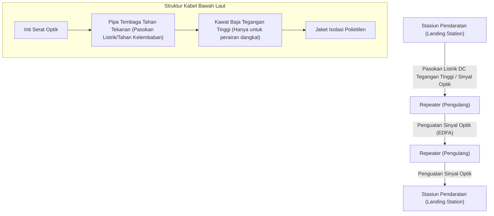

---

## 2. Fasilitas Pemrosesan Termodinamika Data: Pusat Data Berskala Besar (Hyperscale)

Data yang mencapai daratan melalui kabel bawah laut pada akhirnya diangkut ke "Pusat Data". Pusat data adalah bangunan besar yang menampung puluhan ribu hingga ratusan ribu server, yang terus melakukan komputasi dan penyimpanan 24 jam sehari, 365 hari setahun tanpa henti.

### 2.1 Realitas Cloud dan Pertarungan "PUE"

Dari sudut pandang fisika, esensi dari pusat data adalah "mesin panas raksasa yang menerima energi listrik dalam jumlah besar sebagai input, dan menghasilkan pengurangan entropi berupa pemrosesan informasi (hasil komputasi) serta pelepasan 'panas' yang tak terelakkan". Semikonduktor seperti CPU dan GPU menghasilkan panas akibat resistansi listrik saat menghidupkan dan mematikan arus bolak-balik. Jika panas ini tidak dibuang ke luar secara efisien, semikonduktor akan langsung mengalami pelarian termal (thermal runaway) dan terbakar secara fisik.

Oleh karena itu, fokus utama desain dan operasi pusat data terletak pada "pendinginan" dan "efisiensi daya". Metrik paling umum yang menunjukkan efisiensi ini adalah "PUE (Power Usage Effectiveness)".

**PUE = Total Konsumsi Daya Pusat Data / Konsumsi Daya Peralatan IT (seperti server)**

Nilai teoretis minimum PUE adalah 1,0 (kondisi di mana semua daya murni digunakan hanya untuk komputasi). Di masa lalu, bukan hal yang aneh jika pusat data memiliki PUE lebih dari 2,0 (artinya jumlah daya yang dikonsumsi untuk peralatan pendingin seperti AC sama besarnya dengan yang digunakan server). Namun, pada pusat data hyperscale modern, optimalisasi termodinamika ekstrem dilakukan untuk menurunkan angka ini hingga kisaran 1,1 - 1,2.

### 2.2 Evolusi Arsitektur Pendinginan

Berdasarkan prinsip-prinsip termodinamika, sistem pendingin pusat data telah berkembang sebagai berikut:

1. **Pemisahan Hot Aisle (Lorong Panas) dan Cold Aisle (Lorong Dingin)**:
   Pada pusat data awal, seluruh ruangan didinginkan menggunakan AC (CRAC: Computer Room Air Conditioning), namun udara dingin dan udara panas yang dikeluarkan server bercampur, sehingga sangat tidak efisien. Saat ini, standar yang digunakan adalah "Aisle Containment", di mana bagian sisi hisap (intake) dan buang (exhaust) rak server dihadapkan satu sama lain, secara fisik mengisolasi lorong untuk udara dingin (Cold Aisle) dan lorong untuk udara panas (Hot Aisle).

2. **Free Cooling (Pendinginan Udara Luar)**:
   Memutar kompresor chiller (unit sirkulasi air pendingin) membutuhkan listrik yang sangat besar. Oleh karena itu, praktik "Free Cooling" menjadi populer, di mana pusat data dibangun di daerah dengan suhu udara luar yang cukup dingin (seperti Eropa Utara atau Hokkaido), dan udara luar digunakan secara langsung atau tidak langsung melalui penukar panas (heat exchanger) untuk pendinginan.

3. **Pendinginan Celup (Immersion Cooling) dan Pendinginan Cairan Langsung (Direct-to-Chip)**:
   Dalam beberapa tahun terakhir, kepadatan panas GPU kelas atas yang digunakan untuk pelatihan dan inferensi AI mulai melampaui batas fisik pendingin udara tradisional (karena kapasitas panas dan konduktivitas termal udara yang rendah). Akibatnya, teknologi "Immersion Cooling" mulai diperkenalkan, di mana seluruh motherboard server dicelupkan langsung ke dalam cairan inert berbasis fluor non-konduktif atau minyak mineral. Teknologi "Direct-to-Chip" juga digunakan dengan menempelkan kepala pendingin air langsung ke penyebar panas CPU/GPU untuk membuang panas menggunakan cairan yang memiliki kapasitas panas jauh lebih besar daripada udara. Pada pendinginan celup dua fase (memanfaatkan panas laten penguapan cairan yang mendidih), fluks panas yang sangat tinggi dapat ditangani.

### 2.3 Redundansi dan Keamanan Fisik

Karena pusat data adalah pusat infrastruktur sosial, diperlukan redundansi tingkat ekstrem. Segera setelah pasokan listrik komersial terputus, Uninterruptible Power Supply (UPS) menggunakan roda gila (flywheel), baterai asam timbal, atau baterai lithium-ion akan mengambil alih pasokan listrik dalam hitungan milidetik. Pada saat yang sama, generator diesel besar atau generator turbin gas yang dipasang di luar gedung akan menyala, dan mampu menjaga seluruh fasilitas beroperasi selama beberapa hari menggunakan bahan bakar yang disimpan.

Untuk koneksi jaringan, fasilitas juga menarik kabel dari beberapa penyedia telekomunikasi berbeda dan sepenuhnya memisahkan jalur fisik (seperti masuk dari berbagai arah: utara, selatan, timur, barat gedung) untuk bersiap menghadapi insiden seperti kabel putus akibat pekerjaan penggalian.

---

## 3. Teknologi Mengompresi Ruang dan Waktu: CDN (Content Delivery Network)

Bahkan dengan kabel bawah laut yang menghubungkan benua dan pusat data yang menyimpan informasi, pengalaman web modern tidak dapat terwujud hanya dengan hal itu. Hal yang menghalangi di sini adalah batas kecepatan absolut alam semesta yang diusulkan oleh Albert Einstein—"batas kecepatan cahaya".

### 3.1 Batas Kecepatan Cahaya dan Batas Fisik Latensi

Kecepatan cahaya dalam ruang hampa ($c$) adalah sekitar 300.000 km/s. Namun, karena indeks bias kaca kuarsa yang merupakan inti serat optik adalah sekitar 1,47, kecepatan cahaya dalam serat optik turun menjadi sekitar 200.000 km/s (sekitar dua pertiga kecepatannya dalam ruang hampa).

Sebagai contoh, jarak lurus fisik dari Tokyo, Jepang ke Virginia di Pantai Timur Amerika (lokasi konsentrasi pusat data terbesar di dunia) adalah sekitar 11.000 km, dan jika memperhitungkan rute kabel bawah laut, jaraknya menjadi sekitar 14.000 km. Waktu fisik murni yang dibutuhkan sinyal optik untuk merambat satu arah adalah sekitar 70 milidetik. Dalam komunikasi internet, karena paket harus melakukan perjalanan bolak-balik (RTT: Round Trip Time), setidaknya 140 milidetik keterlambatan (latensi) secara absolut akan terjadi sebagai hukum fisika. Selanjutnya, latensi pemrosesan pada router dan switch di sepanjang jalur juga akan ditambahkan.

Saat membuka situs web terbaru, peramban (browser) meminta ratusan file seperti HTML, CSS, JavaScript, gambar, dll., dan mengharuskan komunikasi bolak-balik berulang kali selama jabat tangan tiga arah (3-way handshake) TCP dan negosiasi enkripsi TLS (SSL). Jika semua pengguna harus mengakses langsung ke "server asal (Origin Server)" yang berada di sisi lain belahan bumi, jeda beberapa hingga lebih dari sepuluh detik akan terjadi sebelum halaman web ditampilkan, sehingga game online real-time atau streaming video berkualitas tinggi menjadi hal yang mustahil dilakukan.

### 3.2 Distribusi ke Edge (Tepi): Arsitektur CDN

Sistem yang mengatasi batas fisik ini secara teknis dan mengompresi ruang dan waktu adalah "CDN (Content Delivery Network)".

Ide dasar CDN sangatlah sederhana. "Jika terlalu lambat untuk mengambil data dari server asal yang letaknya jauh dari pengguna, maka letakkan salinan data (cache) di lokasi fisik yang terdekat dengan pengguna sebelumnya."

Penyedia CDN secara fisik menempatkan ribuan atau puluhan ribu server cache yang disebut "Server Edge (Edge Server)" di dalam pusat data atau fasilitas penyedia layanan internet (ISP) di kota-kota besar di seluruh dunia. Ketika seorang pengguna mengakses sebuah situs web, jaringan CDN secara instan menentukan lokasi geografis dan jaringan pengguna tersebut, lalu merutekan komunikasi ke server edge dengan latensi terendah (yang paling dekat).

Teknologi inti yang memungkinkan rute ini adalah "Anycast" dan "Rute Berbasis DNS" tingkat lanjut. Dalam perutean Anycast, alamat IP yang sama persis diberikan ke beberapa server edge di seluruh dunia. Dengan memanfaatkan algoritma pemilihan jalur BGP (Border Gateway Protocol) yang membentuk tulang punggung internet, router berfungsi secara otomatis untuk mengirimkan paket ke server "terdekat" dalam jaringan. Dengan ini, pengguna di Tokyo tanpa disadari akan diarahkan ke server edge di Tokyo, dan pengguna di London akan diarahkan ke server edge di London.

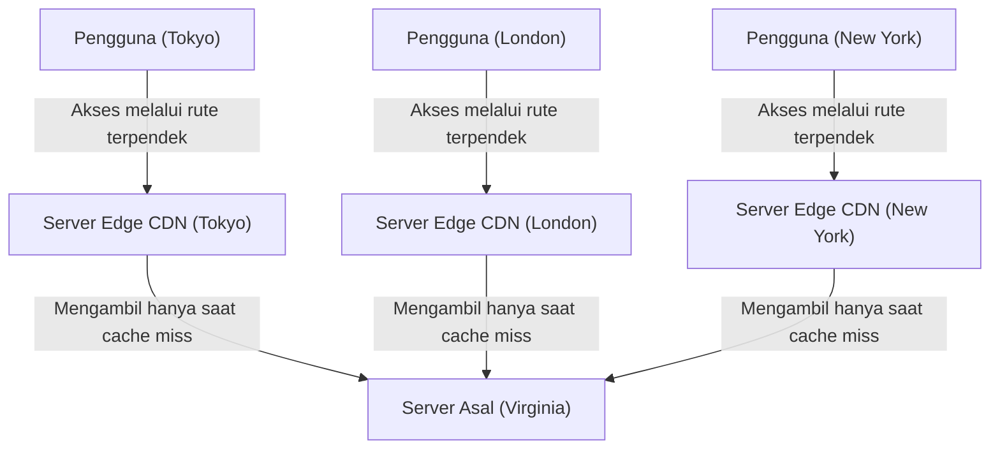

### 3.3 Optimalisasi Dinamis dan Kedatangan Edge Computing

Pada awalnya, CDN adalah sistem sederhana yang hanya menyimpan file statis (HTML, gambar, video) di dalam cache untuk didistribusikan. Namun, CDN modern telah berevolusi menjadi platform komputasi terdistribusi yang masif dengan sendirinya.

Pertama, optimalisasi distribusi konten dinamis (seperti hasil pencarian atau isi keranjang belanja yang berbeda untuk tiap pengguna). Konten ini tidak dapat di-cache, tetapi CDN secara independen mengoptimalkan rute komunikasi antara server edge dan server asal (membangun cache berjenjang / Tiered Cache dan jaringan perutean berkecepatan tinggi khusus) untuk menyediakan jalur komunikasi berkecepatan tinggi yang stabil dengan kehilangan paket yang lebih sedikit dibandingkan rute internet standar (rute terbaik BGP). Selanjutnya, dengan mengakhiri (terminate) koneksi TCP dan sesi TLS di sisi server edge, jumlah jabat tangan (handshake) bolak-balik dengan lokasi yang jauh dikurangi secara drastis.

Kedua, munculnya "Edge Computing". Di masa lalu, pemrosesan aplikasi yang kompleks (otentikasi, pengujian A/B, pengubahan ukuran gambar dinamis, eksekusi logika khusus, dll.) dilakukan pada CPU server asal. Namun saat ini, melalui teknologi yang diwakili oleh Cloudflare Workers atau AWS Lambda@Edge, pengembang dapat mengeksekusi kode (seperti JavaScript, Rust, WebAssembly) secara langsung dalam hitungan milidetik di server edge terdekat dengan pengguna, menggunakan lingkungan sandbox terisolasi seperti V8 Engine. Akibatnya, secara harfiah "batas (edge) internet" mulai berfungsi sebagai komputer terdistribusi raksasa.

---

## 4. Kesimpulan: Pertarungan Tak Berujung Melawan Batas Fisika

Sejarah infrastruktur internet adalah sejarah pertarungan melawan hukum fisika absolut yang mengatur alam semesta, seperti kecepatan cahaya, hukum kedua termodinamika, dan hukum kekekalan energi.

Para insinyur kabel bawah laut menghadapi tekanan air yang luar biasa besar di laut dalam dan batas optik kaca; desainer pusat data mengejar batas ekstrem termodinamika untuk mendinginkan wafer silikon penghasil panas; dan arsitek CDN terus membangun sistem pemrosesan terdistribusi canggih untuk menghindari tembok kecepatan cahaya.

Di balik kemudahan kita mengetuk layar ponsel pintar dan mengakses informasi di seluruh dunia secara instan, terdapat infrastruktur fisik yang berat, keras, dan sangat canggih ini. Pada Bab 7, kita akan mempelajari secara mendalam tentang "Dunia Perutean dan BGP"—bagaimana perangkat lunak dan protokol memelihara jaringan terdistribusi otonom dalam skala global di atas infrastruktur fisik yang kokoh ini.

# Bab 7: Pertempuran Keamanan Siber dan Privasi

Sejarah internet juga merupakan sejarah pertarungan yang terus berlanjut antara idealisme berbagi informasi yang bebas dan upaya melindungi sistem serta data dari serangan berbahaya. Pada awalnya, internet yang terlahir sebagai ARPANET, dirancang dengan asumsi bahwa komunikasi hanya dilakukan di antara para peneliti yang tepercaya dan jumlahnya terbatas. Oleh karena itu, dalam rancangan dasar protokol, "keamanan" dikesampingkan, dan arsitekturnya dibangun atas dasar keyakinan bahwa setiap pengguna pada dasarnya beritikad baik. Namun, seiring dengan meluasnya jaringan pada skala global, komersialisasi, dan pembentukan statusnya sebagai infrastruktur penting, filosofi desain awal ini menjadi kelemahan fatal.

Dalam bab ini, kita akan merambah jauh ke dalam teknologi secara ekstrem, dengan membahas mekanisme fisik dan jaringan dari serangan DDoS (salah satu ancaman terbesar yang mengguncang internet modern), teknologi enkripsi dan VPN (Virtual Private Network) untuk menjamin privasi komunikasi, serta konsep keamanan generasi mendatang, "Arsitektur Zero Trust," yang lahir dari keterbatasan sistem pertahanan batas.

## 1. Keterbatasan Fisik Jaringan dan Dinamika Serangan DDoS

Dari semua serangan siber, yang paling primitif sekaligus salah satu yang paling sulit dicegah adalah **Serangan DDoS (Distributed Denial of Service)**. Ini adalah serangan di mana penyerang membanjiri perangkat jaringan atau server target dengan jumlah lalu lintas (traffic) masif yang melampaui kapasitas pemrosesan atau batas lebar pita (bandwidth) koneksinya, sehingga membuat layanan tidak tersedia bagi pengguna yang sah.

### Kejenuhan Fisik Lalu Lintas: Batasan Lebar Pita (Bandwidth) Jaringan
Internet mentransmisikan data melalui media fisik seperti serat optik, kabel tembaga, dan gelombang radio. Walaupun saluran transmisi ini telah mencapai kapasitas tingkat terabit menggunakan teknologi WDM, masih terdapat batas fisik yang kaku pada lebar pita (misalnya 1Gbps atau 10Gbps) koneksi yang dimiliki masing-masing server. Serangan DDoS mengeksploitasi keterbatasan dari "ketebalan pipa" ini. Saat seorang penyerang mengontrol perangkat yang terinfeksi malware berjumlah ratusan ribu yang tersebar di seluruh dunia (botnet), dan secara serentak mengirimkan paket ke target, memori penyangga (buffer memory) pada antarmuka router atau switch akan meluap, yang menyebabkan hilangnya paket (packet drop). Fenomena ini mirip dengan pipa yang tersumbat dalam dinamika fluida, di mana seketika jumlah informasi (jumlah paket) melampaui kapasitas pemrosesan, akan memicu malfungsi sistem secara keseluruhan.

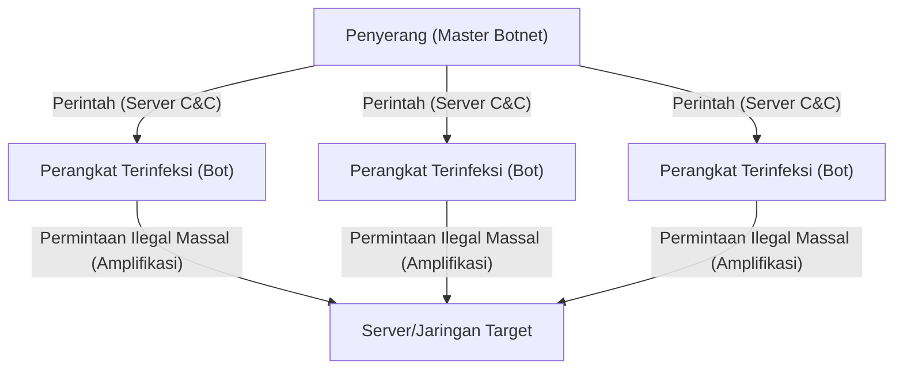

### Mengeksploitasi Kerentanan TCP/IP: Serangan SYN Flood
Selain memenuhi bandwidth, ada juga metode serangan yang menghabiskan sumber daya server (CPU dan memori). Salah satu yang paling terkenal adalah **Serangan SYN Flood**. Protokol TCP mengikuti prosedur yang disebut "jabat tangan 3 arah (3-way handshake)" ketika membangun koneksi:
1. Klien mengirim paket "SYN".
2. Server merespons dengan paket "SYN-ACK", dan memesan memori (TCB: Transmission Control Block) untuk koneksi tersebut.
3. Klien mengirim paket "ACK" untuk memastikan koneksi.

Penyerang mengirimkan sejumlah besar paket SYN dengan alamat IP sumber yang dipalsukan (IP spoofing) ke server. Server merespons dengan SYN-ACK, tetapi alamat IP palsu tersebut tidak pernah merespons dengan ACK (atau sebenarnya IP itu tidak ada). Akibatnya, server menahan sejumlah besar koneksi dalam keadaan "setengah terbuka (Half-open)", menghabiskan alokasi memori manajemen koneksi, dan dipaksa untuk menolak permintaan koneksi baru dari pengguna yang sah. Ini adalah mekanisme serangan luar biasa yang mengeksploitasi sifat berorientasi status (stateful) dari TCP, yang semestinya menjamin komunikasi yang andal.

### Serangan Refleksi (Amplifikasi): Mengeksploitasi Asimetri
**Serangan Refleksi/Amplifikasi** yang memanfaatkan protokol UDP (User Datagram Protocol) jauh lebih cerdik. UDP adalah protokol connectionless, artinya protokol ini tidak memverifikasi sumber pengirim. Penyerang memalsukan alamat IP dari server target sebagai alamat sumber, lalu mengirim permintaan ke server DNS publik atau server NTP di internet. Selama proses ini, query spesifik (seperti DNS ANY query atau NTP monlist) digunakan yang akan menghasilkan balasan ratusan hingga ribuan kali lebih besar (beberapa kilobyte) sebagai tanggapan dari permintaan kecil (sekitar beberapa puluh byte).
Balasan besar yang diamplifikasi tersebut meluncur layaknya longsoran salju secara bersamaan ke IP sumber palsu, yaitu server target. Penyerang hanya menghabiskan sedikit bandwidth namun dapat menghasilkan lalu lintas (traffic) berukuran terabit terhadap targetnya. Ini adalah implementasi jaringan dari prinsip asimetris, mirip dengan prinsip pengungkit dalam fisika atau amplifikasi resonansi dalam teknik akustik.

## 2. Kerahasiaan Jalur Komunikasi: Mekanisme Enkripsi dan VPN

Paket-paket yang mengalir di atas internet (yang mana merupakan jaringan publik) diangkut melintasi banyak router dan peralatan ISP. Data yang dikomunikasikan dalam teks polos (clear text) yang tidak dienkripsi rentan untuk dicegat (sniffing) atau diubah selama transit. "Kriptografi (Enkripsi)" dan "VPN (Virtual Private Network)" berfungsi sebagai perisai kuat untuk melindungi privasi serta kerahasiaan data.

### Dasar Matematika dari Kriptografi Modern: Hibrida Kunci Publik dan Simetris
Dua metode enkripsi utama yang digunakan untuk mengamankan komunikasi:
- **Kriptografi Kunci Simetris (misal, AES)**: Menggunakan kunci yang sama baik untuk mengenkripsi maupun mendekripsi data. Eksekusinya sangat cepat, namun memiliki tantangan terkait cara menyerahkan kunci tersebut secara aman kepada penerima (masalah distribusi kunci).
- **Kriptografi Kunci Asimetris (Kunci Publik) (misal, RSA, Enkripsi Kurva Eliptik)**: Menggunakan sepasang kunci, "kunci publik" untuk mengenkripsi dan "kunci privat" untuk mendekripsi. Konsep ini didasarkan pada sifat-sifat matematis (asimetris) yang canggih, seperti tingkat kesulitan dalam memecah faktor prima (faktorisasi bilangan bulat) atau memecahkan masalah logaritma diskrit. Hal ini memerlukan biaya komputasi yang tinggi.

Komunikasi aman di internet (seperti TLS/SSL atau VPN) mengadopsi sistem hybrid (campuran) dari kedua metode tersebut. Pertama, saat proses handshake dimulai, sistem akan menukar "kunci sesi (kunci simetris)" secara aman menggunakan kriptografi kunci publik. Setelah itu, untuk pertukaran data volume besar, akan menggunakan kunci sesi yang berkecepatan tinggi tadi untuk melakukan enkripsi. Pendekatan ini mencapai keamanan pada distribusi kunci sekaligus kemampuan transmisi data yang cepat.

### Prinsip-Prinsip VPN dan Tunneling
**VPN (Virtual Private Network)** adalah teknologi untuk menciptakan jalur komunikasi atau "saluran khusus (tunnel)" secara virtual di atas jaringan internet publik menggunakan teknik enkripsi. Protokol-protokol terkemuka meliputi IPsec, OpenVPN, dan belakangan ini, WireGuard.

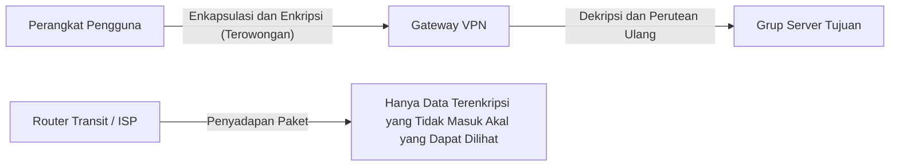

Mekanisme inti dari tunneling terletak pada "Enkapsulasi (Encapsulation)". Seluruh paket IP asli (payload) yang akan dikirim oleh pengguna dienkripsi, lalu dibungkus (dienkapsulasi) sebagai data di dalam paket IP baru, dengan header IP baru yang dialamatkan ke server VPN.
Router internet yang berada di jalur transmisi hanya melihat header IP luar dan meneruskan paket ke server VPN. Karena isi di dalamnya dienkripsi dengan kuat, jika disadap, bukan saja mustahil untuk menguraikan kontennya, tapi juga mustahil untuk mengetahui ke alamat IP mana sebenarnya paket itu ditujukan. Paket yang tiba di server VPN didekripsi, header aslinya diekstraksi, dan pada akhirnya diteruskan ke lokasi tujuan akhir. Begitulah cara teknologi ini menciptakan lingkungan privat terlindungi yang masuk akal dan kuat secara logika matematis pada infrastruktur yang secara fisik dapat diakses publik.

## 3. Runtuhnya Sistem Pertahanan Batas (Perimeter) dan Kebangkitan Arsitektur Zero Trust

Selama bertahun-tahun, keamanan jaringan perusahaan dan organisasi sangat bergantung pada konsep yang disebut "Pertahanan Perimeter (Perimeter Defense Model)". Ini merupakan strategi pertahanan yang menyerupai benteng, di mana firewall atau IPS (Intrusion Prevention System) ditempatkan pada titik persimpangan antara internet (eksternal) dan jaringan internal perusahaan (internal) dengan persepsi "di luar itu berbahaya, di dalam itu aman."

### Hilangnya Batas Dampak dari Komputasi Awan dan Pekerjaan Jarak Jauh (Telework)
Namun demikian, model ini di era modern telah usang. Meluasnya penerapan SaaS (Software as a Service) berarti bahwa data krusial kini berada di luar ekosistem fisik perusahaan di atas komputasi awan. Berlakunya tren bekerja dari jarak jauh (telework) menyebabkan karyawan mengakses dari jaringan Wi-Fi rumah tangga maupun kedai kopi. Garis pemisah antara "internal aman yang perlu dilindungi" dan "eksternal yang berbahaya" telah meleleh; akibatnya, muncul lonjakan tajam dari lalu lintas yang tidak dapat diawasi oleh tembok firewall tradisional. Lebih lanjut lagi, tembok batas menjadi lumpuh saat dihadapkan dengan malware (contohnya ransomware) atau ancaman internal dari karyawan apabila mereka telah menembus masuk ke jaringan. Premis "bagian dalam itu bisa dipercaya" berubah menjadi celah kerentanan yang masif.

### Zero Trust: Trust Nothing, Verify Everything
**"Arsitektur Zero Trust (ZTA: Zero Trust Architecture)"** muncul sebagai tanggapan terhadap pergeseran paradigma tersebut. Prinsip mendasar dari Zero Trust adalah bahwa "tanpa memandang lokasi jaringan (apakah internal atau eksternal), tidak ada lalu lintas komunikasi yang dapat dipercaya secara otomatis / default (Jangan Percaya, Selalu Verifikasi)".

Di dalam sebuah model Zero Trust, fokus keamanan telah bergeser dari "batas/perimeter jaringan" menuju ke "identitas (pengguna dan perangkat)" serta "sumber daya (data dan aplikasi)".

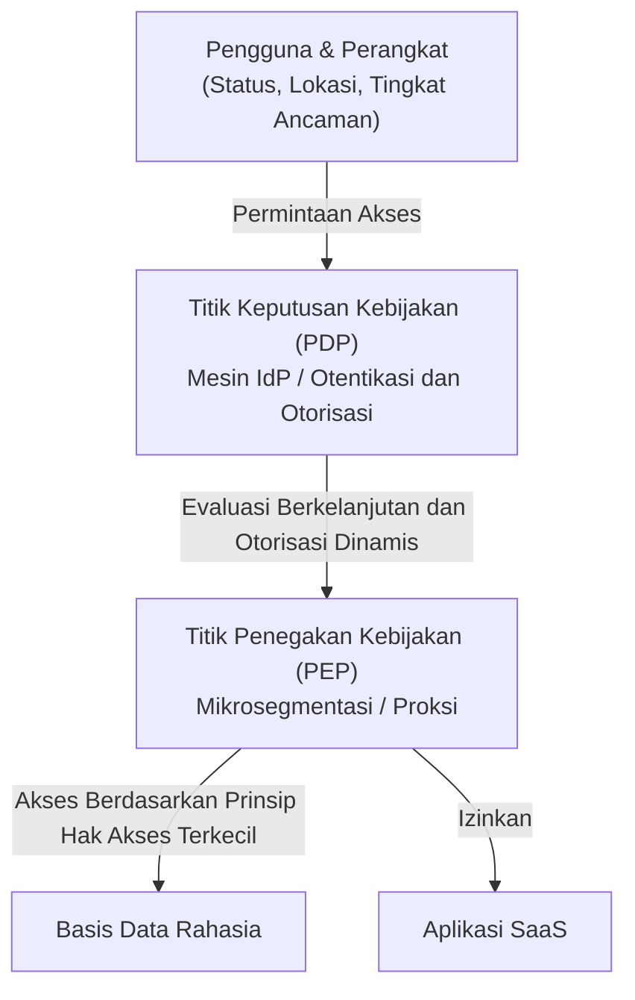

Komponen teknologi utama yang mendukung realisasi Zero Trust adalah:

1. **Manajemen Identitas dan Akses (IAM/IdP)**: Tidak hanya kata sandi (password), tetapi dikombinasikan dengan MFA (Otentikasi Multi-Faktor) atau biometrik, secara andal memastikan identitas dari entitas pengguna.
2. **Penilaian Postur (Kesehatan) Perangkat**: Kondisi terkini sistem penambal OS pada perangkat yang meminta akses, operasi fungsional perlindungan perangkat lunak antivirus, serta evaluasi pada pola historis akan dicek secara waktu nyata (real-time). Permintaan akses dari perangkat yang komprominya dicurigai akan secepatnya ditolak.
3. **Mikrosegmentasi (Microsegmentation)**: Jaringan dipotong menjadi segmen berukuran mikro, membentuk perlindungan lokal terkecil bagi sumber daya individu. Meski terjadi kompromi atau kebocoran (breach), kerangkanya dapat membatasi jangkauan dampak (pergerakan lateral / lateral movement).
4. **Otentikasi Berkelanjutan dan Kebijakan Dinamis**: Sebuah aktivitas tidak akan selamanya mendapat izin hanya karena log masuk awal dinilai lolos. Evaluasi dilakukan terus-menerus selama pemakaian berlangsung (Misalnya, jika sumber IP tiba-tiba berganti, atau aktivitas pengunduhan data besar-besaran secara aneh). Bila terdeteksi nilai risiko yang melampaui batas wajar (threshold), hak intervensi untuk pemutusan koneksi akan diambil secara seketika dan dinamis.

Zero Trust bukanlah sekadar produk piranti keras melainkan filosofi konseptual di mana "setiap akses diwajibkan melewati tahap verifikasi, hanya diperbolehkan mendapat pemberian otorisasi spesifik berprinsip Hak Akses Terkecil (Least Privilege)"; pada infrastruktur IT terdesentralisasi kiwari, menjadikannya kunci penyelesaian realistis satu-satunya.

## 4. Keamanan di Masa Depan: Kriptografi Kuantum dan Pertahanan Jaringan Generasi Mendatang

Saat ini, kita masih mengandalkan RSA atau enkripsi Kurva Eliptik di mana jaminannya bermuara pada "secara teori perwujudan dekripsi oleh piranti komputer akan menelan rentang waktu setara siklus astronomi". Namun masalah mencuat jika kapabilitas mekanik kuantum pada "Komputer Kuantum (Quantum Computer)" mulai merajai lini produksi secara memadai. Hal tersebut membuat algoritma-algoritma mutakhir layaknya Algoritma Shor dengan mudah mampu menaklukkan pertahanan fungsi matematis tersebut seketika. Momen kiamat pertahanan siber disebut sebagai **"Q-Day (Hari Komputer Kuantum Membobol Kriptografi)"**.

Terdapat 2 skenario terpisah yang tengah didorong majunya pengembangan guna mengantisipasi hari H tersebut:
Pendekatan pertama: Merupakan fondasi arsitektur perumusan kriptografi terkini dari algoritma komputasional matematis canggih yang kebal dari mesin komputer kuantum dikenal sebagai **"Kriptografi Pasca-Kuantum (PQC: Post-Quantum Cryptography)"** sebagai basis dasar standardisasi (Misalnya, kriptografi kisi / Lattice-based cryptography).
Pendekatan kedua: Mendirikan sebuah basis keamanan lewat prinsip tata aturan murni fisika (mekanika kuantum), dinamakan **"Distribusi Kunci Kuantum (QKD: Quantum Key Distribution) atau Kriptografi Kuantum"**. Dengan pemanfaatan medium kondisi muatan energi sub-partikel fisik pembawa spektrum (Contoh polarisasi) untuk mengangkut informasi mendistribusikan kunci. Jika oknum peretas yang tak diundang melakukan pemantauan / mencoba menduplikasi spektrum foton, maka struktur informasi seketika mengalami kegagalan fungsi atau disrupsi formasi (Berdasarkan Prinsip Masalah Pengukuran Observasi Kuantum - Teori Ketidakpastian Heisenberg), jadi secara absolut akan memberitahukan penyusupan dengan efikasi 100% menjadikan wujud perisai ini sebagai mekanisme penangkal komunikasi paling definitif.

## Penutup

Bab 7 dari internet mencerminkan tarik-ulur yang tiada usainya menyoal masalah seputar "kemudahan (kepraktisan) utilitas" diadu dengan rasionalisasi "pertahanan pengamanan". Diawali oleh problem kejenuhan muatan struktur lapis dimensi infrastruktur nyata pada eksploitasi serangan siber DDoS, penanggulangan metode pertahanan matriks algoritma matematis menggunakan teknik-teknik teknologi pengenkripsian. Bertranformasi menjadi pergeseran cara pandang fundamental (paradigma) rancang bangun arsitektural yakni penerapan Zero Trust. Semua hal itu telah mentransformasikan kajian sekuritas perlindungan keamanan dunia siber (cybersecurity) beralih melampaui kerangka rekayasa teknis komputer (IT) saja, dan menjalar menuju irisan disiplin ranah saintifik maha canggih di mana landasan prinsip Fisika, Ilmu Matematika serta telaah psikologi perilaku (Behavioral Psychology) bersinggungan.
Segala hal sepele rutinitas seperti setiap sapuan navigasi klik jari pengguna ponsel pintar (smartphone) sampai melompat pada penyimpanan basis operasional aktivitas sinkronisasi data lintas komputasi awan di baliknya terselimuti jejak pertempuran klandestin intens yang bereskalasi per fraksi sepersekian milidetik yang tak bisa disaksikan langsung oleh mata telanjang, bekerja tiada ampun sepanjang masa merentang setiap detiknya dalam rentang 365 hari yang berlangsung.

Menyambut titik puncak bab berikutnya, yakni Bab 8 merangkum "Gambaran Ekosistem Dunia Internet Datang". Web3.0 menanti, eksplorasi batas-batas metaverse, berpadu pencarian identifikasi tata surya antar jejaring angkasa yang disinggung di seputar gagasan besar Planet Internet (Interplanetary Internet). Menyingkap jejak model kerangka jaringan dunia komputasi hari-hari mendatang!

# Bab 8: Internet di Masa Depan —— Jaringan Generasi Mendatang yang Terjalin dari Desentralisasi, Ruang Angkasa, dan Mekanika Kuantum

Internet tak hentinya bertransformasi menjadi basis fasilitas peranti penyebarluasan sistem penerangan struktur tata kelola telekomunikasi jaringan informasi terbesar pencatat catatan paling radikal berdampak yang pernah umat manusia ketahui dari dekade ke dekade. Diawali penetapan pondasi pengusungan pertukaran (switching) paket pertukaran oleh program proyek ARPANET pada pertengahan panggung kurun 1960an berlalu. Hingga konsolidasi fondasi regulasi perangkaian susunan protokoler standar kerangka TCP/IP, diikuti inovasi karya megah ciptaan rancangan WWW (World Wide Web) dan gelombang pemakaian jaringan akses komunikasi bergerak (Mobile Broadband); jejak tapak perkembangan ini membuktikan progres beruntun tak henti-henti. Sayangnya seberapa masif internet di mana khalayak kini menaruh ketergantungan di waktu berjalan telah berada di garis perpotongan krusial persimpangan keterbatasan hambatan konstruktif struktur dari dimensi asali / fisik batas fundamental di baliknya. Sisi malapetaka sentralisasi dominan akibat masifnya penumpukan kapasitas entitas Pusat Data; halangan penghantar penangguhan delay gelombang fiber transmisi komunikasi lintas antar benua; serta puncaknya letupan performa eksponensial kemampuan piranti komputasi (Utamanya kebangkitan kedigdayaan Mesin Komputer Kuantum) menyajikan celah pelemahan rentan dari kerangka algoritma kriptografi tradisional masa sekarang.

Sesi diskusi dalam "Bab 8: Internet di Masa Depan", merencanakan untuk menyusuri penjelajahan tapal batas dari pergeseran radikal paradigma masif yang masih berlansung seketika saat ini. Mengarah lebih terperinci lagi, kerangka terbagi di atas pijakan 3 dasar: pertama terobosan menjauh meruntuhkan dominasi struktur penyokong arus pusat otoritas "Arsitektur Ekosistem Sistem Web3 & Desentralisasi", pilar selanjutnya merupakan bentang ekspansi memperlebar batas operasional peranti dari batas infrastruktur dimensi fisik meroket melebarkan sayap eksistensinya terhubung hingga luar atmosfer tata surya angkasa yakni "Konstelasi Telekomunikasi Satelit Berada Pada LEO / Low Earth Orbit" (Sebagai contohnya entitas program sekelas Starlink), serta muara konsep pamungkas menyematkan pengaplikasian regulasi teori kemutlakan dasar sistem fisika dalam wujud implementasi pertukaran sinyal "Internet Kuantum (Quantum Internet)". Menghadirkannya dibungkus menggunakan kacamata analisis para ahli, kami berikhtiar menyelami sedalam tingkatan batas paling terperinci secara ekstrem akan asal mula riwayat histori historikal di sebaliknya hingga telaah kacamata struktur landasan hukum asas fisik sampai di pembedahan anatomi mesin mekanika keteknikannya.

---
## 8.1 Nilai Sejati Web3 dan Arsitektur Terdesentralisasi: Membangun Jaringan Tanpa Kepercayaan (Trustless)

Internet saat ini (Web2.0) dibangun di atas manajemen data terpusat oleh platformer raksasa. Meskipun efisien, model klien-server memiliki masalah struktural seperti adanya titik kegagalan tunggal (SPOF: Single Point of Failure), kemudahan penyensoran, dan pelanggaran privasi data pengguna. Jawaban di tingkat arsitektur terhadap hal ini adalah "Web3" dan teknologi jaringan terdesentralisasi.

### 8.1.1 Jaringan Berorientasi Konten dan IPFS
Web konvensional (HTTP) berorientasi pada lokasi ("location-oriented"). Artinya, Anda mengakses informasi dengan menentukan "di mana" informasi itu berada (URL). Namun, dengan sistem ini, jika server mati atau domain kadaluarsa, konten itu sendiri akan hilang, yang mengakibatkan "tautan rusak (404 Not Found)".

Sebaliknya, sistem penyimpanan terdesentralisasi seperti IPFS (InterPlanetary File System) mengadopsi arsitektur "berorientasi konten" (Content-Addressed). Sistem ini mengakses data menggunakan "Pengenal Konten" (CID: Content Identifier) unik yang diperoleh dengan melewatkan isi file melalui fungsi hash kriptografi (seperti SHA-256).

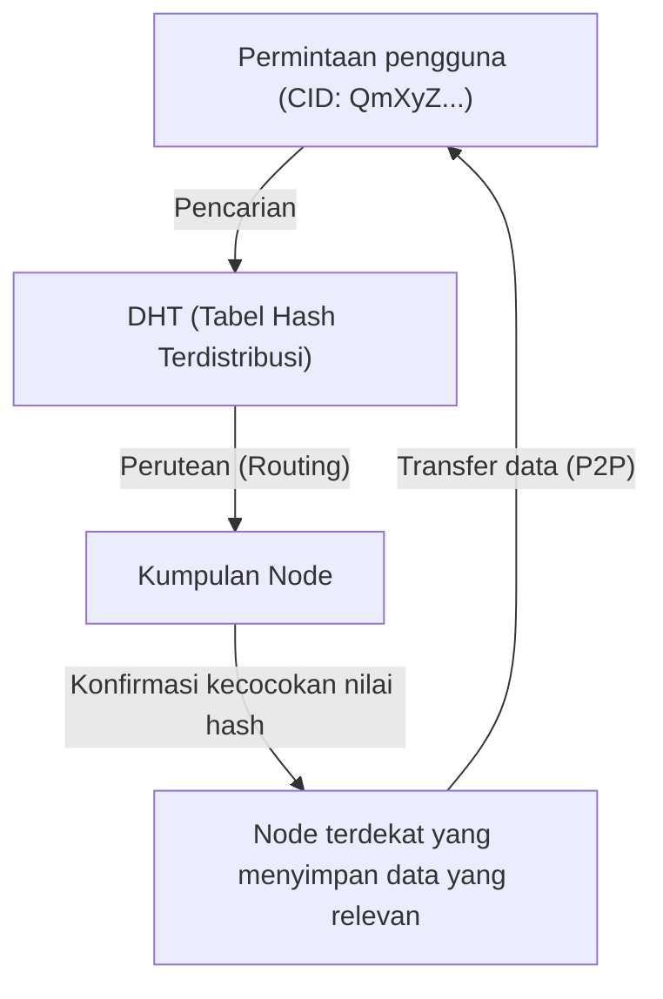

Inti dari mekanisme ini adalah algoritma Kademlia, yang merupakan sejenis DHT (Distributed Hash Table). Kademlia mendefinisikan "jarak" antara ID node dan ID data menggunakan operasi XOR (Exclusive OR). Hal ini memungkinkan pemetaan topologi seluruh jaringan secara efisien dan menemukan node yang menampung data yang diinginkan dengan kompleksitas komputasi $O(\log N)$. Karena data didistribusikan dan direplikasi di node-node di seluruh dunia, bahkan jika beberapa node offline, akses ke data tetap dipertahankan, dan memiliki ketahanan yang kuat terhadap penyensoran.

### 8.1.2 Konsensus Terdesentralisasi dan Bukti Kriptografi
Fondasi lain dari Web3 adalah teknologi blockchain. Ini dibangun di atas "algoritma konsensus" yang menyetujui "siapa yang mencatat status yang benar" di jaringan terdesentralisasi tanpa melalui administrator pusat.
PoW (Proof of Work) yang diadopsi di Bitcoin pada awalnya adalah sebuah mekanisme yang memanfaatkan ketahanan benturan (collision resistance) dari fungsi hash, dan secara fisik menyulitkan gangguan dengan menginvestasikan sejumlah besar energi komputasi. Namun, dari sudut pandang konsumsi energi, saat ini sedang berlangsung transisi ke PoS (Proof of Stake).

Dalam PoS, yang diadopsi di Ethereum 2.0 dan lainnya, validator yang melakukan staking (menjaminkan) aset kripto mengumpulkan tanda tangan menggunakan teknik kriptografi berbasis pasangan khusus yang disebut tanda tangan BLS (Boneh-Lynn-Shacham). Hal ini mengompresi tanda tangan digital dari puluhan ribu hingga ratusan ribu node ke dalam ukuran data yang kecil, menyeimbangkan keamanan yang tinggi dan tingkat skalabilitas tertentu sambil tetap menjadi jaringan terdesentralisasi. Di internet masa depan, teknologi-teknologi ini diperkirakan akan diimplementasikan sebagai standar di atas TCP/IP sebagai lapisan baru dari model referensi OSI (lapisan transfer nilai dan pembentukan konsensus).

---

## 8.2 Jaringan Komunikasi Satelit yang Menyelimuti Bumi: Starlink dan Masa Depan

Jaringan serat optik yang diletakkan di darat adalah tulang punggung internet modern. Namun, terdapat biaya pemasangan kabel bawah laut, keterbatasan topografi, dan yang terpenting, batasan fisik berupa "kecepatan cahaya di dalam medium". Konstelasi satelit Orbit Bumi Rendah (LEO: Low Earth Orbit), seperti yang dicontohkan oleh Starlink milik SpaceX, mencoba memecahkan masalah ini di batas ruang angkasa.

### 8.2.1 Mekanika Orbital dan Keunggulan Orbit Rendah (LEO)
Satelit Orbit Geostasioner (GEO: Geostationary Earth Orbit) terletak di ketinggian sekitar 35.786 km dan disinkronkan dengan rotasi Bumi, yang memiliki keuntungan berupa kemampuan untuk memperbaiki arah antena. Namun, karena gelombang radio bergerak sejauh lebih dari 70.000 km pulang pergi, penundaan (sekitar 120 milidetik untuk satu arah, dan latensi efektif 500 milidetik atau lebih) yang timbul dari batasan fisik tidak dapat dihindari.

Di sisi lain, satelit Starlink ditempatkan di orbit rendah pada ketinggian sekitar 550 km. Menurut mekanika orbital yang didasarkan pada Hukum Ketiga Kepler, pada ketinggian ini, untuk mengimbangi gravitasi Bumi dan gaya sentrifugal, satelit harus mengorbit Bumi dengan kecepatan yang sangat tinggi yaitu sekitar 7,6 km/s (sekitar 27.000 km/jam) (mengelilingi Bumi dalam waktu sekitar 90 menit).
Berkat ketinggian yang rendah ini, waktu perambatan fisik gelombang radio dipersingkat secara dramatis menjadi sekitar 1/65 dari GEO, dan latensi komunikasi teoretis menjadi setara dengan atau kurang dari serat optik terestrial (20 hingga 40 milidetik).

### 8.2.2 Antena Phased Array dan Kontrol Muka Gelombang Radio
Karena satelit bergerak dengan kecepatan tinggi, terminal pengguna di darat (antena datar tanpa bagian penggerak fisik seperti antena parabola) harus melacak satelit yang melintas di atasnya secara elektrik. Di sinilah "Antena Phased Array" digunakan.
Ribuan elemen antena mikroskopis disejajarkan dalam satu bidang datar, dan "fase" (waktu gelombang) gelombang radio yang dipancarkan dari setiap elemen secara sengaja digeser dalam satuan mikrodetik. Menurut prinsip Huygens, gelombang sferis dari setiap elemen saling berinterferensi, membentuk pancaran (beam) di mana gelombang saling menguatkan (interferensi konstruktif) hanya pada arah tertentu. Hal ini memungkinkan pancaran komunikasi diarahkan secara instan ke satelit yang dituju hanya melalui kontrol perangkat lunak, tanpa menggerakkan antena secara fisik.

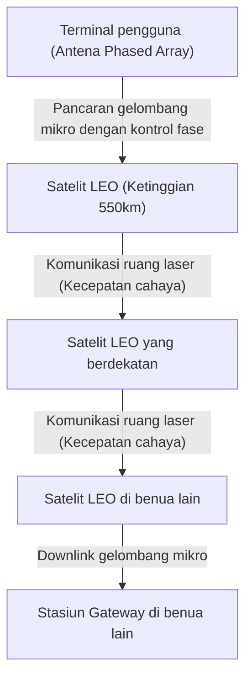

### 8.2.3 Komunikasi Luar Angkasa Optik (OISL) dan Keunggulan Absolut "Kecepatan Cahaya dalam Ruang Hampa"
Revolusi sejati dari jaringan Starlink terletak pada tautan antarsatelit optik (OISL: Optical Intersatellite Links).
Komunikasi jarak jauh modern bergantung pada serat optik, namun indeks bias inti serat optik (kaca kuarsa) adalah sekitar 1,47. Dalam fisika, kecepatan cahaya dalam suatu medium dinyatakan sebagai $v = c / n$ (di mana $c$ adalah kecepatan cahaya dalam ruang hampa, dan $n$ adalah indeks bias). Dengan kata lain, kecepatan cahaya di dalam serat optik berkurang menjadi sekitar 200.000 km/s.

Sebaliknya, indeks bias ruang angkasa (ruang hampa) mendekati 1, sehingga komunikasi laser antarsatelit berlangsung dengan kecepatan cahaya dalam ruang hampa $c \approx 300.000$ km/s.
Misalnya, saat mempertimbangkan transfer data dari London ke New York, daripada merutekannya melalui kabel bawah laut Atlantik, mengirim data ke luar angkasa, mentransfernya melalui ruang hampa dengan sinar laser, lalu menurunkannya kembali ke bumi, dapat memberikan penundaan absolut (latensi) teoretis yang lebih rendah. Ini membawa pergeseran paradigma yang menentukan dalam perdagangan frekuensi tinggi (HFT) keuangan dan sistem waktu nyata global. Di masa depan, jaringan mesh di mana puluhan ribu satelit mengelilingi Bumi dan protokol perutean ruang angkasa tiga dimensi dan dinamis menggantikan BGP (Border Gateway Protocol) akan diselesaikan.

---

## 8.3 Internet Kuantum: Komunikasi Pamungkas yang Dihadirkan oleh Entanglement

Jika Web3 merekonstruksi arsitektur "kepercayaan" dan jaringan komunikasi satelit menerobos batasan "ruang dan kecepatan", maka "Internet Kuantum" adalah puncak fisika dalam hal "keamanan dan sarana transmisi" informasi. Internet Kuantum bukanlah pengganti jaringan TCP/IP yang ada, melainkan infrastruktur generasi berikutnya yang melengkapinya dan menyediakan saluran transmisi informasi yang sepenuhnya baru berdasarkan hukum fisika.

### 8.3.1 Dasar-dasar Mekanika Kuantum: Superposisi dan Entanglement
Komputer dan internet klasik memperlakukan level voltase sebagai bit "0" atau "1". Namun, dalam internet kuantum, informasi ditransmisikan sebagai qubit (quantum bit). Dengan memanfaatkan status polarisasi foton (seperti osilasi vertikal dan horizontal), ia menggunakan "Prinsip Superposisi", di mana "0" dan "1" ada secara bersamaan.

Yang lebih penting adalah "Keterikatan Kuantum" (Quantum Entanglement). Ketika dua partikel berada dalam keadaan terjerat (entangled), tidak peduli seberapa jauh jarak fisik mereka (bahkan antara Bumi dan Mars), pada saat keadaan salah satu partikel diukur dan ditentukan, keadaan partikel lainnya juga ditentukan secara instan tanpa jeda waktu. Fenomena fisik non-lokal ini, yang oleh Einstein disebut sebagai "aksi jarak jauh yang menakutkan" (spooky action at a distance), menjadi tulang punggung internet kuantum.

### 8.3.2 Distribusi Kunci Kuantum (QKD) dan Keamanan Absolut Fisik
Saat ini, kriptografi RSA dan kriptografi kurva eliptik yang melindungi komunikasi internet bergantung pada kesulitan matematis bahwa "faktorisasi prima dari bilangan bulat besar membutuhkan waktu komputasi yang sangat lama". Namun, jika komputer kuantum berskala besar yang mampu mengimplementasikan algoritma Shor terwujud, enkripsi ini akan dapat ditembus dalam waktu singkat.

Oleh karena itu, yang diharapkan adalah Distribusi Kunci Kuantum (QKD: Quantum Key Distribution). Dalam protokol BB84 yang representatif, foton tunggal digunakan untuk mengirimkan kunci enkripsi. Berdasarkan "Prinsip Ketidakpastian Heisenberg", yang merupakan prinsip dasar mekanika kuantum, jika pihak ketiga (penyadadap) mencoba mengukur (menyadap) foton yang sedang terbang, keadaan kuantum tersebut akan berubah (decoherence) pada saat itu juga. Selain itu, karena "Teorema Tanpa Kloning" (No-Cloning Theorem), secara fisik mustahil untuk menyalin status kuantum yang tidak diketahui secara akurat.
Dengan kata lain, jika ada tindakan penyadapan di jalur komunikasi, penerima dapat mendeteksinya sebagai peningkatan tingkat kesalahan yang tidak wajar di tingkat hukum fisika. Dengan berbagi angka acak aman yang dijamin belum disadap dan menggabungkannya dengan enkripsi pad sekali pakai (One-Time Pad), keamanan pamungkas yang benar-benar tidak dapat dipecahkan oleh komputer dengan kemampuan komputasi apa pun (bahkan superkomputer berskala kosmik) dapat direalisasikan.

### 8.3.3 Teleportasi Kuantum dan Dinding Repeater Kuantum
Tujuan akhir internet kuantum adalah jaringan "Teleportasi Kuantum", yang mentransfer keadaan kuantum itu sendiri ke lokasi lain menggunakan keterikatan (entanglement). Hal ini memungkinkan sebuah "Quantum Cloud" yang menghubungkan komputer kuantum terdesentralisasi agar berfungsi sebagai satu komputer kuantum besar tunggal.

Namun, hambatan teknisnya sangat tinggi. Saat foton bergerak melalui serat optik, foton tersebut diserap atau dihamburkan lalu hilang (atenuasi). Dalam komunikasi klasik, "penguat" (amplifier) ditempatkan di tengah jalan untuk memperkuat sinyal, namun dalam komunikasi kuantum, karena "teorema tanpa kloning" yang disebutkan di atas, foton tidak dapat disalin dan diperkuat.

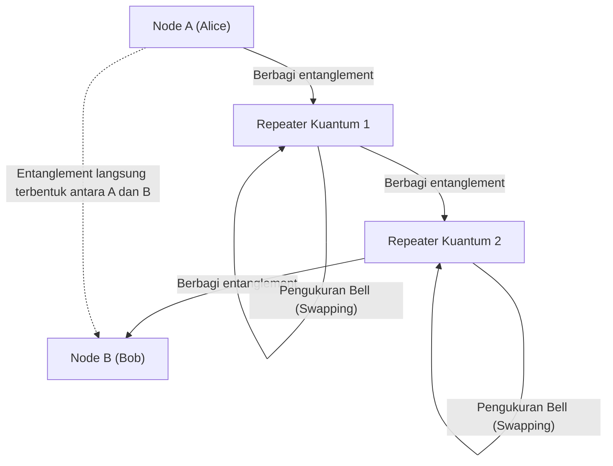

Untuk mengatasi keterbatasan ini, penelitian sedang dilakukan pada "Repeater Kuantum" (Quantum Repeater). Repeater kuantum menghasilkan entanglement hanya di bagian-bagian pendek, dan membentuk entanglement jarak jauh dengan terus melakukan operasi kuantum tingkat lanjut yang disebut "entanglement swapping". Untuk mewujudkan hal ini, "Memori Kuantum", yang untuk sementara waktu menyimpan status kuantum di lingkungan bersuhu sangat rendah (kriogenik), sangatlah penting. Saat ini, penemuan terobosan fisik menggunakan pusat NV (Nitrogen-Vacancy center) pada berlian dan gas atom dingin sedang dilombakan di laboratorium di seluruh dunia.

---

## 8.4 Kesimpulan: Masa Depan Umat Manusia dan Jaringan

Internet, yang lahir pada tahun 1960-an, telah berkembang menjadi sistem saraf yang menghubungkan semua informasi di Bumi. Dan sekarang, Bab 8, "Internet Masa Depan", yang sedang kita hadapi, merupakan perluasan ke dimensi yang lebih mendasar dan fisik yang melampaui lapisan perangkat lunak.

Arsitektur Web3 yang terdesentralisasi membangun fondasi kepercayaan (trust layer) baru yang menjamin transaksi sosial melalui matematika dan kriptografi, tanpa bergantung pada "kepercayaan" terhadap otoritas pusat tertentu.
Jaringan komunikasi satelit, termasuk Starlink, keluar dari sumur gravitasi Bumi dan menantang batas kecepatan absolut fisika, yaitu kecepatan cahaya dalam ruang hampa, dengan demikian menggambarkan tulang punggung tiga dimensi yang menghilangkan hambatan jarak.
Dan internet kuantum mencoba untuk membalikkan konsep transmisi informasi dan keamanan secara fundamental dengan menyublimasikan entanglement, misteri mendalam dari mekanika kuantum, menjadi sebuah rekayasa (engineering).

Meskipun teknologi-teknologi ini tampaknya berkembang secara independen, namun dalam jangka panjang mereka akan menyatu. Dengan menempatkan foton tunggal (kuantum) dalam sinar laser yang melesat melintasi ruang angkasa, jaringan komunikasi kriptografi kuantum global akan dibangun memanfaatkan ruang angkasa dengan sedikit atenuasi, dan protokol terdesentralisasi Web3 akan beroperasi di atasnya. Infrastruktur jaringan layaknya fiksi ilmiah (SF) seperti itu sekarang sedang dirancang oleh tangan manusia.

Internet di masa depan tidak lagi sekadar "pipa untuk mentransfer informasi". Ini akan berevolusi menjadi infrastruktur intelektual tertinggi, yang menyinkronkan aktivitas ekonomi manusia, pembentukan konsensus sosial, dan sumber daya komputasi pada skala kosmik. Di balik internet yang secara santai kita gunakan setiap hari, saat ini pun, sebuah kisah epik yang menantang batas fisika dan ilmu komputer terus ditenun.
