# 제1장 인터넷의 여명과 철학 —— ARPANET에서 WWW에 이르는 기술의 계보

인터넷——오늘날 인류의 모든 경제 활동, 문화, 그리고 커뮤니케이션의 기반이 되고 있는 이 거대한 자율 분산형 네트워크는 결코 단일한 천재에 의해 하룻밤 사이에 설계된 것이 아니다. 그것은 냉전이라는 특이한 역사적·지정학적 배경을 기점으로 하여, 통신 공학과 컴퓨터 과학에 있어서의 패러다임 시프트를 거쳐, 수많은 연구자들이 공유한 "정보를 어떻게 견고하고 자유롭게, 어떠한 물리적 제약도 초월하여 전달할 것인가"라는 숭고한 철학의 결정체이다.

본 장에서는 인터넷이라는 기적의 시스템이 어떻게 탄생했는지를 단순한 역사의 나열이 아니라, 물리 계층에서 애플리케이션 계층에 이르는 기술적 메커니즘과 그 설계 사상(아키텍처)이라는 전문가적인 시점에서 극한까지 깊이 파고들어 해설한다.

## 1.1 네트워크 패러다임의 전환: 회선 교환의 한계와 패킷 교환의 탄생

인터넷의 역사적·기술적 본질을 이해하는 데 있어 모든 출발점이 되는 것이 '패킷 교환(Packet Switching)'이라는 개념의 발명이다. 1960년대 초반, 당시 통신 인프라의 중심은 전화망으로 대표되는 '회선 교환(Circuit Switching)' 방식이었다.

### 회선 교환의 물리적 메커니즘과 취약성
회선 교환 방식이란 통신을 수행하는 두 지점 간에, 크로스바 스위치나 전자 교환기를 물리적 또는 주파수 분할 다중화(FDM) 등의 기술을 사용하여 논리적으로 결합하고, 통신 시작부터 종료까지 '전용 통신로(회선)'를 확보·점유하는 방식이다. 이 방식은 회선이 확보되어 있는 한 대역폭과 지연이 보장되기 때문에, 실시간성이 요구되는 음성 통신(전화)에 매우 적합했다.

그러나 이 아키텍처에는 치명적인 결함이 존재했다. 그것은 '단일 장애점(Single Point of Failure)'의 존재와 물리적 파괴에 대한 극도의 취약성이다. 냉전 하에서 미국 국방부는 소비에트 연방의 핵 공격(특히 고고도 핵폭발에 수반되는 전자기 펄스: EMP 공격)을 깊이 우려하고 있었다. 중앙 집중적인 통신 거점(거대한 교환국)이 물리적으로 파괴되거나 통신 경로의 일부가 절단될 경우, 회선 교환 방식에서는 우회 경로를 즉각적으로 재구축할 수 없어 국가의 지휘 명령 계통(C2: Command and Control)이 완전히 마비되고 만다.

### 패킷 교환이라는 브레이크스루
이 절망적인 물리적 제약을 타파하기 위한 이론적 기반을, 완전히 독립적으로, 그러나 거의 같은 시기에 구축한 3명의 선구자가 있다. 랜드 연구소의 폴 바란(Paul Baran), 영국 국립 물리 연구소(NPL)의 도널드 데이비스(Donald Davies), 그리고 매사추세츠 공과대학교(MIT)의 레너드 클라인록(Leonard Kleinrock)이다.

그들은 클로드 섀넌(Claude Shannon)의 정보 이론을 배경으로 하면서, 통신을 연속적인 아날로그의 '파동'이나 끊김 없는 데이터의 '스트림'으로 다루는 것이 아니라, 데이터를 고정 길이(또는 가변 길이)의 작은 디지털 데이터 덩어리——즉 '패킷(Packet)' 또는 바란의 말을 빌리자면 '표준화된 메시지 블록'——으로 분할한다는 혁명적인 접근법을 제창했다.

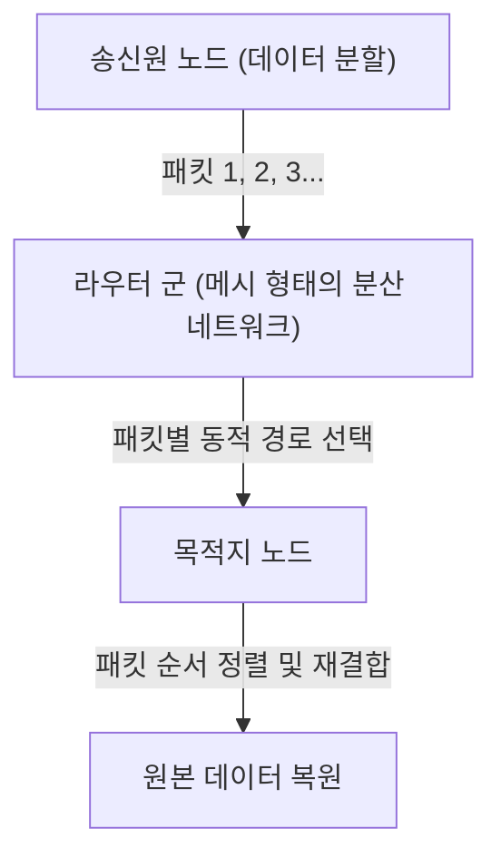

패킷 교환 방식의 기술적 혁신성은 주로 다음 2가지로 요약된다.

1. **통계적 다중화(Statistical Multiplexing)의 실현:**
   회선 교환처럼 특정 통신으로 물리 회선을 점유하는 것이 아니라, 무관한 여러 통신의 패킷이 동일한 물리 회선을 시분할로 공유한다. 컴퓨터 간의 데이터 통신은 '버스트성(Burstiness: 일시적으로 대량의 데이터가 흐르고 그 후 무음이 지속되는 특성)'이 높기 때문에, 패킷 교환에 의한 대역폭 공유는 통신 리소스의 이용 효율을 수학적 한계까지 끌어올렸다.
2. **스토어 앤 포워드(Store and Forward)와 동적 경로 선택:**
   네트워크를 구성하는 각 중계 노드(라우터)는 수신한 패킷을 메모리 상의 큐(대기열)에 일시적으로 축적하고, 패킷 헤더에 기재된 목적지 주소와 노드 자신이 가진 경로표(라우팅 테이블)를 대조한다. 그리고 그 시점의 네트워크 혼잡(輻輳) 상태나 물리적 회선의 단절 상황을 계산하여, 패킷마다 최적의 인접 노드로 전송한다.

클라인록은 대기열 이론(Queuing Theory)을 이용하여, 이 스토어 앤 포워드 방식에서의 패킷 지연 및 버퍼 크기에 대한 수학적 모델을 확립했다. 네트워크의 일부가 핵 공격으로 증발하더라도, 살아남은 노드가 자율적으로 상황을 판단하여 패킷은 우회로(메시 네트워크 상의 다른 경로)를 찾아내 목적지에 도달한다. 이 '자율 분산형·자기 복구형' 아키텍처야말로 인터넷의 강인성(Resilience)의 근원이다.

## 1.2 ARPANET의 구축: IMP를 통한 하드웨어와 프로토콜의 분리

이론상의 존재였던 패킷 교환 네트워크를 물리 세계에 구현한 것이 1969년 미국 국방부 고등연구계획국(ARPA)의 자금 지원으로 시작된 프로젝트 'ARPANET'이다.

당시의 컴퓨터 환경은 현대와 비교할 수 없을 정도로 혼돈스러웠다. IBM, DEC, SDS 등 각 사가 독자적으로 개발한 메인프레임(대형 컴퓨터)은 문자 코드(ASCII 대 EBCDIC), 워드 길이(16비트, 32비트, 36비트 등), 운영 체제가 완전히 달랐으며, 이들을 직접 통신시키는 것은 기술적으로 매우 어려웠다.

그래서 ARPANET의 설계자들(래리 로버츠 등)은 네트워크 아키텍처에 있어 매우 중요한 설계상의 결단을 내린다. 그것은 'IMP(Interface Message Processor)'라고 불리는 전용 중계용 소형 컴퓨터를 도입하는 것이었다.

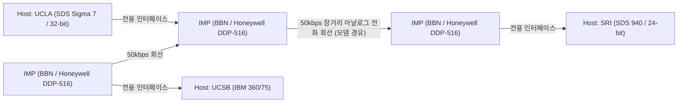

IMP의 개발은 보스턴에 거점을 둔 컨설팅 회사 BBN(Bolt Beranek and Newman)이 낙찰받았다. 그들은 Honeywell 사의 견고한 미니컴퓨터 'DDP-516'을 개조하여 라우팅 프로토콜, 패킷의 분할과 조립, 오류 검출(CRC: 순환 중복 검사)과 같은 복잡한 네트워크 처리 모두를 IMP가 부담하게 했다.

이로 인해 각 연구 기관의 거대한 호스트 컴퓨터는 복잡한 패킷 라우팅이나 회선의 물리적 특성을 전혀 신경 쓸 필요가 없어졌고, 단지 눈앞에 있는 IMP와 표준화된 인터페이스(BBN 1822 프로토콜)로 데이터를 주고받기만 하면 되었다. 이것은 시스템의 '관심사의 분리(Separation of Concerns)'를 네트워크 분야에 적용한 최초의 위대한 성공 사례이며, IMP는 오늘날 라우터(Router)의 직접적인 시조가 되었다.

1969년 10월 29일, UCLA의 클라인록 연구실에서 SRI(스탠퍼드 연구소)를 향해 최초의 메시지 "LO"가 송신되었다("LOGIN"이라고 치려다 시스템이 다운되었기 때문에). 이것이 ARPANET이 첫 울음을 터뜨린 역사적 순간이다. 그 후 초기의 라우팅 알고리즘(벨만-포드 방정식에 기반한 거리 벡터형 라우팅)이 구현되었고, ARPANET은 전미 연구 기관을 잇는 인프라로서 급속도로 성장해 나간다.

## 1.3 TCP/IP의 설계 사상: End-to-End 원칙과 캡슐화의 심연

ARPANET은 단일 네트워크로서는 큰 성공을 거두었으나, 이내 새로운 장벽에 직면한다. ARPANET 내에서 사용되던 NCP(Network Control Program)라는 통신 프로토콜은 ARPANET이라는 '균질하고 신뢰성 높은 단일 네트워크' 위에서 동작하는 것을 전제로 설계되어 있었다.

그러나 1970년대에 들어서자, 인공위성을 사용한 패킷 통신망(SATNET)이나 하와이 대학이 개발한 무선 패킷 통신망(ALOHANET에서 파생된 PRNET) 등, 물리 매체, 패킷의 최대 크기(MTU: Maximum Transmission Unit), 전송 속도, 오류율이 전혀 다른 다양하고 수많은 네트워크가 등장하기 시작했다. 이들을 상호 연결하여 지구 규모의 '네트워크의 네트워크(Internetwork)'를 구축하려고 했을 때, NCP의 설계로는 파탄을 맞을 것이 명백해졌다.

이 이기종 간 네트워크 연결의 엄청난 과제를 해결한 것이 1974년에 빈튼 서프(Vinton Cerf)와 로버트 칸(Bob Kahn)이 발표한 획기적인 논문 "A Protocol for Packet Network Intercommunication"이다. 그들이 설계한 프로토콜이야말로 현대 인터넷의 기반인 'TCP/IP(Transmission Control Protocol / Internet Protocol)'이다.

### 아키텍처의 영혼: End-to-End 원칙 (End-to-End Argument)
TCP/IP 설계의 근저에는 네트워크 공학에서 가장 중요한 철학인 'End-to-End 원칙(End-to-End Principle / Argument)'이 흐르고 있다. 1980년대에 J. H. 솔처(J. H. Saltzer), D. P. 리드(D. P. Reed), D. D. 클라크(D. D. Clark) 등에 의해 명문화된 이 원칙은 다음과 같이 주장한다.

"데이터 전송의 신뢰성 확보나 순서 제어, 암호화 같은 고도화되고 애플리케이션 고유의 기능은, 통신을 수행하는 양단의 말단 호스트(End-to-End)에서 구현되어야 하며, 네트워크의 코어(중계 인프라나 라우터)에는 구현해서는 안 된다."

만약 네트워크 코어 측(IMP나 라우터)에 패킷 도달 확인(ACK)이나 재전송 제어 등의 복잡한 '상태(State)'를 갖게 한다면 어떻게 될까. 중계 라우터가 고장 나는 순간 그 상태는 소실되고 통신은 끊어진다. 또한 새로운 요구 사항을 가진 애플리케이션이 등장할 때마다 전 세계의 중계 라우터 소프트웨어를 다시 작성해야만 할 것이다.

TCP/IP는 이 원칙을 극한까지 충실하게 구현했다. 중계를 담당하는 IP(Internet Protocol) 라우터는 "수신한 패킷을 목적지를 향해 베스트 에포트(최선의 노력)로 전송할 뿐"이라는 극히 단순한 기능(상태가 없는 데이터그램 전송)에 특화되었다. IP는 패킷의 분실이나 순서가 뒤바뀌는 것을 전혀 신경 쓰지 않는다. 단순한 '멍청한 네트워크(Dumb Network)'에 철저했던 것이다.

그 대신 통신의 신뢰성을 담보하는 중책은 모두 양단 호스트 컴퓨터에서 동작하는 TCP(Transmission Control Protocol)에 맡겨졌다. TCP는 IP가 운반해 온 순서가 뒤죽박죽인 패킷에 부여된 시퀀스 번호를 보고 원래의 데이터를 다시 조립하고, 결손이 있으면 자율적으로 재전송 요구를 하며, 네트워크가 혼잡하면 송신 속도를 조절한다(윈도우 제어 및 슬로우 스타트 알고리즘).

이 "코어를 극한까지 단순하게 유지하고, 엣지(말단)에 지성을 부여한다"는 설계 사상이야말로 인터넷이 전화망을 능가하고, 훗날 Web, 스트리밍 동영상, P2P 통신, 스마트폰이라는, 설계자조차 예상하지 못했던 폭발적인 이노베이션을 인프라 개보수 없이 그대로 삼킬 수 있었던 가장 큰 이유이다.

### 캡슐화(Encapsulation)와 계층 모델
TCP/IP는 이 논리적인 역할 분담을 실현하기 위해 데이터를 '캡슐화(Encapsulation)'하는 방식을 사용했다. 이는 송신할 데이터에 대해 각 계층이 자신의 제어 정보(헤더)를 마트료시카 인형처럼 덧씌워가는 메커니즘이다.

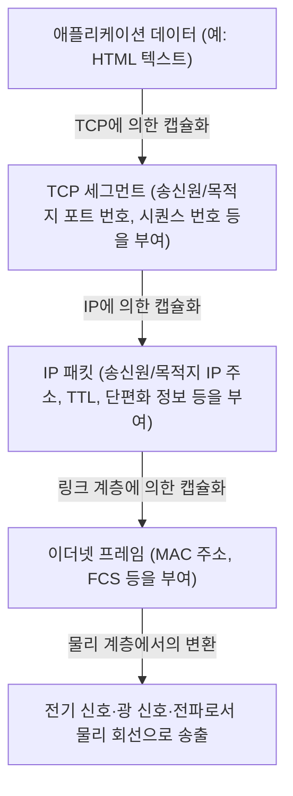

라우터는 IP 패킷의 헤더(IP 주소)만을 보고 전송처를 결정하며, 그 내용물(TCP 헤더나 데이터)에는 일절 관여하지 않는다. 이로 인해 IP는 하위 물리 계층(광섬유, 구리선, Wi-Fi, 5G)의 물리적 특성 차이를 완전히 은폐·흡수하여, 상위 계층에 대해 '지구 규모의 단일 가상 네트워크'를 제공하는 데 성공했다.

1983년 1월 1일, ARPANET 상의 모든 호스트가 NCP에서 TCP/IP로 일제히 전환하는 '플래그 데이(Flag Day)'가 실시되었고, 여기서 진정한 의미의 'The Internet'이 탄생한 것이다.

## 1.4 NSFNET의 대두와 자율 분산 라우팅의 진화

TCP/IP로 전환된 후, 인터넷은 군사·국방의 틀을 넘어 학술 연구의 거대한 인프라로 변모해 나간다. 그 결정적인 추진력이 된 것이 1980년대 후반 미국 국립과학재단(NSF)이 구축한 'NSFNET'이다.

NSFNET은 전미 5개 슈퍼컴퓨터 센터를 잇는 백본 네트워크로서 구축되었으며, 초기는 56kbps, 나중에는 T1 회선(1.544Mbps), 그리고 T3 회선(45Mbps)으로 물리 계층의 극적인 업그레이드를 반복했다. 각 대학이나 지역 네트워크(리저널 네트워크)는 이 NSFNET 백본에 계층적으로 접속하게 되었다.

네트워크 규모가 폭발적으로 확대(스케일링)되는 가운데 새로운 기술적 과제가 부상했다. 그것이 '라우팅의 한계'이다. 수만 개에 달하는 노드의 경로 정보를 모든 중계 라우터가 공유하는 것은 메모리 용량과 계산 능력의 물리적 한계를 넘어서는 것이었다.

이 문제를 해결하기 위해 인터넷은 '자율 시스템(AS: Autonomous System)'이라는 개념을 도입했다. 인터넷을 단일한 거대한 네트워크가 아니라, 독립적인 관리 정책을 가진 네트워크(AS)의 집합체로 재정의한 것이다.

AS 내부(IGP: Interior Gateway Protocol)에서는 OSPF(Open Shortest Path First)와 같은 링크 스테이트형 라우팅 프로토콜을 사용하고, 다익스트라 알고리즘(Dijkstra's algorithm)에 의해 네트워크의 완전한 토폴로지 맵을 구축하여 최단 경로를 고속으로 계산한다.

반면 AS와 AS 간(EGP: Exterior Gateway Protocol)에서는 단순한 최단 경로가 아니라 '어느 네트워크를 경유하여 통신을 허가할 것인가'라는 비즈니스상·조직상의 정책을 반영시킬 필요가 있었다. 이를 실현하기 위해 개발된 것이 오늘날에 이르기까지 인터넷의 근간을 지탱하고 있는 'BGP(Border Gateway Protocol)'이다. BGP는 패스 벡터(Path Vector)형 알고리즘을 채택하여 라우팅 루프를 완전히 방지하면서 전 세계의 ISP(인터넷 서비스 제공자) 간 경로 정보의 교환을 가능하게 했다.

NSFNET의 구축과 BGP의 확립으로, 중앙 관리자가 존재하지 않아도 각 조직이 상호 접속(피어링 및 트랜짓)을 반복함으로써 전체적으로 하나의 네트워크가 자율적으로 기능한다는 현대 상용 인터넷 생태계가 완성된 것이다. 1995년 NSFNET은 그 역할을 다했고, 백본의 운영은 완전히 민간 ISP 군으로 이양되었다.

## 1.5 WWW의 탄생: 하이퍼텍스트를 통한 지식의 해방과 퍼블릭 도메인화

물리 계층에서 네트워크 계층, 트랜스포트 계층에 이르는 인프라스트럭처가 지구 규모로 정비된 1980년대 말, 인터넷 상에 축적되는 정보의 양은 극적으로 증가하고 있었다. 그러나 당시 인터넷은 FTP(파일 전송), Telnet(원격 로그인), USENET(전자 게시판)과 같은 개별 애플리케이션이 난립하고 있었고, 정보는 각 서버 디렉토리 깊은 곳에 고립(사일로화)되어 있었다. 원하는 데이터를 찾아내려면 대상 서버의 IP 주소나 복잡한 UNIX 명령어에 대한 지식이 필수적이어서 지극히 비민주적인 상태였다.

이 상황을 근본적으로 뒤집고 정보 공유의 패러다임 시프트를 일으킨 사람이 스위스 제네바에 있는 유럽 원자핵 공동 연구소(CERN)의 컴퓨터 과학자 팀 버너스리(Tim Berners-Lee)이다. 1989년 그는 'World Wide Web(WWW)'이라는 혁신적인 시스템을 제안했다.

그의 아이디어의 핵심은 1960년대부터 존재했던 '하이퍼텍스트(Hypertext: 문서 내의 단어에서 다른 문서로 링크를 연결하는 개념)'와 '인터넷(TCP/IP)'을 결합시키는 것이었다. 로컬 컴퓨터 내에 갇혀 있던 하이퍼텍스트의 링크 목적지를 지구 반대편에 있는 서버의 문서로까지 확장시킨 것이다.

버너스리는 이 거대한 정보 공간을 구축하기 위해 3가지의 매우 세련된 기술 사양을 독자적으로 설계하고 구현했다.

1. **URI (Uniform Resource Identifier):**
   네트워크 상에 존재하는 모든 리소스(텍스트, 이미지, 동영상 등)의 소재를 고유하게 지정하기 위한 보편적인 주소 체계.
2. **HTTP (Hypertext Transfer Protocol):**
   클라이언트(웹 브라우저)와 서버 간에 URI로 지정된 리소스를 요청·전송하기 위한 애플리케이션 계층 프로토콜. HTTP의 가장 뛰어난 점은 통신의 '상태(State)'를 유지하지 않는 '스테이트리스(Stateless)' 설계를 채택했다는 것이다. 이로 인해 서버는 수백만 클라이언트의 요청을 효율적으로 처리할 수 있게 되었다.
3. **HTML (Hypertext Markup Language):**
   문서의 논리적 구조를 기술하고, 다른 리소스로의 하이퍼링크(앵커 태그 `<a>`)를 삽입하기 위한 마크업 언어.

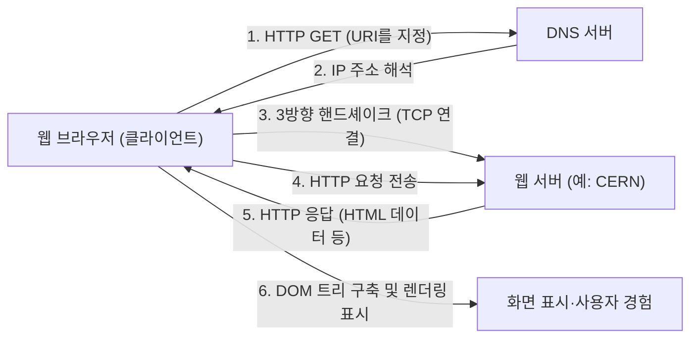

1990년 말, NeXT 컴퓨터 상에서 세계 최초의 웹 서버(info.cern.ch)와 브라우저가 가동을 시작했다. 초기의 웹은 텍스트 기반이었으나, 그 직관적인 링크를 통한 정보 탐색 경험은 연구자들 사이에서 순식간에 보급되어 갔다.

### 퍼블릭 도메인이라는 인류사적 결단
그러나 WWW가 진정한 의미에서 세상을 변혁하고 현대 사회의 인프라스트럭처로서 정착한 가장 큰 이유는 그 뛰어난 기술적 아키텍처 때문만은 아니다. 역사를 가른 결정적인 사건은 1993년 4월 30일에 일어났다.

CERN은 팀 버너스리의 강력한 요청을 받아들여, WWW의 기반 기술(서버 소프트웨어, 클라이언트, 코드 라이브러리) 전체를 '퍼블릭 도메인(지적 재산권 포기)'으로서 무상 개방한다는 경이로운 결단을 내린 것이다. 어떠한 특허권도 행사하지 않으며 이용료도 요구하지 않겠다는 성명 문서에는 CERN 디렉터의 서명이 적혀 있었다.

만약 이때 CERN이 WWW 기술을 특허화하고 소프트웨어 라이선스를 통한 수익화를 꾀했다면 어떻게 되었을까. 틀림없이 오늘날의 정보 폭발은 일어나지 않았을 것이다. WWW는 자금력 있는 일부 기업이나 대학만의 폐쇄적인 시스템에 머물렀을 것이고, 훗날 등장할 Gopher 등의 경쟁 프로토콜과의 규격 다툼으로 인터넷은 분단되었을 것이다.

이 퍼블릭 도메인화로 인해 기술적·법적 장벽이 완전히 소멸함으로써, 전 세계의 해커와 기업들이 WWW 생태계에 참여했다. 미국 국립 슈퍼컴퓨터 응용 연구소(NCSA)의 마크 앤드리슨(Marc Andreessen) 등은 이미지를 인라인으로 표시할 수 있는 획기적인 그래피컬 브라우저 'NCSA Mosaic'를 개발·무상 공개했고, 이것이 훗날 Netscape Navigator, 나아가 IT 버블의 방아쇠가 된다. 개인이 자유롭게 웹 서버를 구축하고 전 세계를 향해 정보를 발신하는 '정보의 민주화'가 달성된 것이다.

## 1.6 맺음말: 사상이 구현을 능가한다

제1장에서 살펴본 인터넷의 역사는 단순한 통신 속도의 향상사가 아니다. "중앙 집중적인 제어는 취약하다"는 물리적 현실에 기반한 패킷 교환의 발명, "복잡성은 말단이 떠맡아야 한다"는 End-to-End 원칙, 그리고 "정보는 모든 인류에게 무상으로 열려 있어야 한다"는 WWW의 퍼블릭화.

인터넷을 오늘날의 모습으로 만든 것은 뛰어난 하드웨어나 코드도 아닌, 이 강력하고 일관된 '설계 사상(Philosophy)'이다. 물리 계층의 제약을 논리적인 캡슐화로 극복하고, 열린 표준(RFC: Request for Comments)을 통해 다양성을 수용한다. 이 분산과 자유를 존중하는 아키텍처가 있었기에 인터넷은 전대미문의 스케일링을 달성할 수 있었다.

그러나 인간이 이해할 수 있는 '이름'과 네트워크가 처리하는 '숫자(IP 주소)' 사이에는 여전히 깊은 골이 존재했다. 다음 장에서는 이 광대한 자율 분산 네트워크의 주소 공간에 질서를 가져오고, WWW의 폭발적 보급을 뒤에서 지탱한 거대한 분산 데이터베이스 시스템, 'IP 주소 공간과 DNS(Domain Name System)의 심연'에 대해 그 기술적 메커니즘을 파헤쳐 볼 것이다.

# 제2장: 물리 계층과 데이터 링크 계층 ~디지털 데이터의 물리적 실체와 인접 기기 간 통신~

인터넷이라는 거대한 네트워크의 근저에는 '0'과 '1'이라는 논리적인 디지털 데이터를 전기 신호, 빛의 점멸, 또는 전자파의 파문과 같은 물리적인 현상으로 변환하여 공간이나 매질을 뛰어넘어 상대방에게 전달하는 엄청난 물리 현상의 연쇄가 존재한다. 우리가 스마트폰으로 무심코 웹사이트를 열 때, 그 이면에서는 심해 바닥을 기어가는 유리 섬유 속을 광자가 질주하고, 보이지 않는 전파가 복잡한 계산을 동반하며 공간을 날아다니고 있다.

본 장에서는 OSI 참조 모델의 제1계층(물리 계층)과 제2계층(데이터 링크 계층)에 초점을 맞추어, 우리의 생활을 지탱하는 네트워크의 '가장 물리적이고 고된' 부분과 그것들을 제어하는 치밀한 논리 메커니즘을 전문가의 시점에서 극한까지 깊이 파고들 것이다.

---

## 2.1 물리 계층(Physical Layer): 정보의 물리적 실체화와 우주의 법칙

물리 계층의 최대 사명은 컴퓨터가 다루는 이산적인 비트열(0과 1)을 전송 매체(구리선, 광섬유, 진공이나 공기 등의 공간)의 물리적 특성에 맞춘 아날로그적인 물리 신호로 변환(변조)하여 전송로에 싣는 것이다. 여기서는 전기 공학이나 양자 역학, 광학의 법칙이 통신의 한계를 결정짓는다.

### 섀넌-하틀리 정리와 정보의 한계
물리 계층을 이야기할 때 피할 수 없는 것이 클로드 섀넌이 1948년에 발표한 정보 이론이다. '섀넌-하틀리 정리'는 노이즈가 존재하는 통신로에서 오류 없이 송신할 수 있는 최대 데이터 전송 속도(통신로 용량)를 수학적으로 증명했다.

$$ C = B \log_2\left(1 + \frac{S}{N}\right) $$

여기서 $C$는 통신로 용량(bps), $B$는 대역폭(Hz), $S/N$은 신호 대 잡음비(SNR)이다. 이 아름다운 방정식은 기술이 아무리 진보하더라도, 주어진 대역폭과 노이즈 환경 하에서 보낼 수 있는 정보량에는 물리적인 상한(섀넌 한계)이 있음을 보여준다. 현대의 광섬유나 Wi-Fi 엔지니어들은 어떻게 해서든 이 한계에 아슬아슬하게 닿을 때까지 통신 속도를 끌어올리기 위한 끝없는 싸움을 계속하고 있다.

### 광섬유의 물리학: 빛을 '가두어' 나르다
현대 인터넷의 뼈대는 틀림없이 광섬유(Optical Fiber)이다. 구리선을 이용한 전기 통신에서는 표피 효과나 전자파 간섭(EMI)으로 인해 장거리 고속 통신이 어렵지만, 광섬유는 이것들을 극복했다.

광섬유는 중심부의 '코어'와 그것을 둘러싸는 '클래드'라는 2개 층의 매우 순도 높은 석영 유리로 구성된다. 코어의 굴절률을 클래드보다 약간(수 퍼센트 이하) 높게 설정함으로써, 스넬의 법칙에 따라 일정한 임계각보다 얕은 각도로 입사한 빛이 코어와 클래드의 경계에서 전반사(Total Internal Reflection)를 반복한다. 이로 인해 빛은 밖으로 새어 나가지 않고 섬유 내부를 진행한다.

#### 분산 및 감쇠와의 싸움: 노벨상을 가져다준 유리
예전의 유리는 불순물이 많아 수 미터 만에 빛이 감쇠해버렸다. 1966년 찰스 가오 박사(2009년 노벨 물리학상 수상)는 광섬유 감쇠의 원인이 유리 본연의 성질이 아니라 불순물(특히 수산기나 전이 금속)에 있다는 것을 밝혀내고, 순도를 높이면 장거리 통신이 가능해질 것이라고 예언했다. 1970년대에 코닝사가 개발한 극저손실 석영 유리는 파장 1550nm 대역(C 밴드)에서 0.2dB/km라는 경이적인 저손실을 실현했다. 이는 15km를 진행해도 빛의 강도가 절반밖에 손실되지 않음을 의미한다.

그러나 빛이 장거리를 이동하면 '파장 분산(Chromatic Dispersion)'과 '모드 분산(Modal Dispersion)'이 발생하여 펄스의 파형이 무너지고 만다. 파장 분산은 빛의 파장(색)에 따라 유리 속의 진행 속도가 다르기 때문에 발생한다. 모드 분산은 코어 속을 통과하는 빛의 경로(모드)가 여러 개 있기 때문에 도달 시간에 차이가 생기는 현상이다.
이것을 극복하기 위해 코어의 직경을 빛의 파장에 가까운 수 마이크로미터까지 가늘게 만들어, 단일 경로만 통과시키는 '단일 모드 광섬유(SMF)'가 개발되어 대륙 간 통신 등 장거리 전송의 주류가 되었다.

#### EDFA와 WDM: 광통신의 르네상스
1990년대, 광통신에 두 가지 혁명이 일어났다. 첫 번째는 어븀 첨가 광섬유 증폭기(EDFA: Erbium-Doped Fiber Amplifier)이다. 그 전까지는 감쇠된 광신호를 한 번 전기 신호로 변환하여 증폭한 뒤 다시 빛으로 되돌리는 느리고 비용이 많이 드는 재생 중계기가 필요했다. EDFA는 섬유의 코어에 희토류 원소인 어븀을 첨가하고 외부에서 펌프광을 쏘아줌으로써, 신호광이 통과할 때 유도 방출을 일으켜 빛을 빛 그대로 직접 증폭하는 것을 가능하게 했다.

두 번째는 파장 분할 다중(WDM: Wavelength Division Multiplexing)이다. 빛은 다른 파장(색)을 동시에 같은 공간에 쏘아도 서로 섞이지 않고 독립적으로 진행한다는 중첩의 원리를 이용하여, 1가닥의 섬유에 여러 파장의 신호를 동시에 묶어서 보내는 기술이다. 고밀도 파장 분할 다중(DWDM) 기술 덕분에 현재는 1가닥의 광섬유에 수 밀리미터 간격의 파장으로 100개 이상의 신호를 실어, 수십 Tbps~수 Pbps라는 엄청난 대역폭을 단일 섬유로 실현하고 있다.

### 해저 케이블: 지구의 신경망
대륙 간을 연결하는 데이터 통신의 99% 이상은 인공위성이 아니라 해저 케이블에 의해 운반되고 있다. 클라우드 데이터도, 해외 웹사이트의 이미지도 모두 물리적인 바다 밑바닥을 통과하고 있는 것이다.

#### 실패와 도전의 역사
해저 케이블의 역사는 인터넷보다 훨씬 오래되었다. 최초의 큰 도전은 1858년의 대서양 횡단 전신 케이블이었다. 천연 고무의 일종인 구타페르카로 절연된 구리선은 부설에 성공했지만, 켈빈 경(윌리엄 톰슨)의 경고를 무시한 고전압 운용이 화근이 되어 불과 몇 주 만에 절연 파괴를 일으키고 침묵했다. 그 후 긴 시간에 걸쳐 이론과 소재가 개량되어, 1988년에는 최초의 태평양 횡단 광해저 케이블 'TAT-8'이 가동하며 빛의 시대가 막을 열었다.

#### 케이블의 구조와 부설 메커니즘
수심 수천 미터의 심해에 부설되는 현대의 해저 케이블은 극한 환경에 견딜 수 있도록 설계되어 있다. 중심에 있는 불과 몇 가닥의 광섬유 다발을 보호하기 위해, 고장력 강철 와이어, 수압을 견디기 위한 구리나 알루미늄 튜브, 폴리에틸렌 절연체 등으로 몇 겹이나 보호되고 있다. 심해부에서는 상어의 물어뜯기나 거대한 수압에 견디면서도 경량화를 위해 직경 수 센티미터 정도의 굵기지만, 얕은 바다에서는 어선의 저인망이나 선박의 닻, 해저 지진으로부터 보호하기 위해 두꺼운 장갑(아머링)이 덧씌워져 직경 10센티미터 이상의 굵기가 된다.

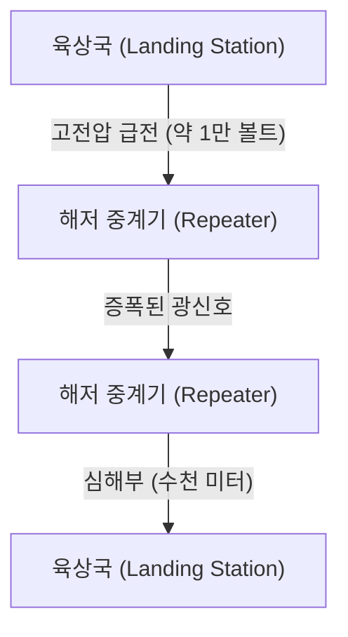

광신호는 초저손실 섬유를 사용해도 수십 킬로미터마다 감쇠하기 때문에, 케이블 중간에는 '해저 중계기(리피터)'가 일정한 간격으로 끼워져 있다. 이 중계기(앞서 언급한 EDFA가 내장되어 있다)를 심해에서 구동시키기 위한 전력은 양 끝의 육상국에서 케이블 내의 동관을 통해 수천 볼트에서 최대 1만 볼트 이상의 고전압 직류 전류로 끊임없이 급전되고 있다.
부설에는 전용 '케이블 부설선'이 사용되며, 얕은 바다에서는 수중 로봇(ROV)이 해저에 도랑을 파서 케이블을 매설한다. 만약 케이블이 절단된 경우에는 수리선이 현장으로 급파되어, 심해에서 케이블의 끝을 그래플(닻 같은 갈고리)로 걸어 선상으로 끌어올린 뒤 숙련된 기술자가 광섬유를 수 미크론의 정밀도로 융착 접속하는, 엄청나게 아날로그적이고 고된 작업이 이루어지고 있는 것이다.

### 전파 통신의 물리(Wi-Fi의 기반)
모바일 디바이스와 IoT의 보급으로 인해, 공간을 날아다니는 전자파(전파)를 이용한 통신도 물리 계층의 주전장이 되었다. Wi-Fi(IEEE 802.11 규격군)는 주로 2.4GHz 대역이나 5GHz 대역, 그리고 최근 개방된 6GHz 대역의 ISM 밴드(산업·과학·의료용 밴드로, 면허 없이 이용 가능)를 이용한다.

#### QAM(직교 진폭 변조)에 의한 극한의 정보 압축
디지털 데이터를 아날로그 파동에 싣는 '변조'에 있어, Wi-Fi는 매우 고도의 기술을 사용하고 있다. 그것이 QAM(Quadrature Amplitude Modulation: 직교 진폭 변조)이다.
전파라는 파동에는 '진폭(파동의 높이)'과 '위상(파동의 타이밍·각도)'이라는 두 가지 물리량이 있다. QAM은 위상이 90도 다른 2개의 반송파(I 신호와 Q 신호)를 합성하고, 각각의 진폭을 변화시킴으로써 성좌도(Constellation Map) 상의 특정 '점'에 비트열을 할당한다.

예를 들어 16-QAM이라면, 1회의 파동 변화(심볼)로 16개의 점(4비트)을 표현할 수 있다. 최신 Wi-Fi 7(802.11be)에서는 4096-QAM이라는 광기라고도 할 수 있는 고밀도 변조가 채택되었다. 이는 1회의 변조로 4096개의 점(12비트)을 표현한다. 4096개의 점이 빽빽하게 모여 있는 성좌도에서, 수신 측은 미세한 노이즈에 파묻히지 않고 송신된 '점'이 어느 것이었는지를 정확하게 판별해야 한다. 이를 실현하기 위해 고도의 오류 정정 부호와 강력한 신호 처리 프로세서가 사용되고 있다.

#### OFDM과 MIMO: 다중 경로(Multipath)와의 싸움과 공간의 활용
전파는 직진할 뿐만 아니라 벽이나 가구에 반사되고 회절되며 산란한다. 그 때문에 송신기에서 방출된 전파는 다른 경로(다중 경로)를 거쳐 조금씩 어긋난 타이밍에 수신기에 도달하며, 간섭(페이징)을 일으켜 파형을 망가뜨리고 만다.
이것을 역이용하거나 극복하기 위한 기술이 OFDM과 MIMO이다.

**OFDM(직교 주파수 분할 다중)**은 대역폭이 넓고 반발이 심한 단일 신호 대신, 대역을 다수의 매우 좁은 주파수(부반송파)로 잘게 분할하여 각각에 느린 속도로 데이터를 병렬 송신하는 기술이다. 부반송파끼리 '직교(수학적으로 서로 간섭하지 않음)'하도록 배치되기 때문에 주파수의 이용 효율이 매우 높고 다중 경로로 인한 지연의 어긋남에도 강하다.

**MIMO(Multiple-Input and Multiple-Output)**는 여러 개의 안테나를 사용하여 다른 데이터를 동시에 같은 주파수로 송신하는 '공간 다중' 기술이다. 다중 경로 반사에 의해 공간의 다른 장소에서 파동이 서로 다르게 섞이는 성질을 이용하여, 수신 측의 여러 안테나로 받은 복잡한 신호를 연립방정식을 풀듯이 분리해서 통신 용량을 안테나 수만큼 배가시킨다. 더욱이 전파의 위상을 안테나마다 미세 조정하여 특정 방향으로 전파 빔을 집중시키는 **빔포밍** 또한 현대의 Wi-Fi에는 빼놓을 수 없는 기술이 되었다.

---

## 2.2 데이터 링크 계층(Data Link Layer): 직접 연결된 기기 간의 대화와 질서

물리 계층이 단순한 '신호의 운반자'라면, 데이터 링크 계층은 그 날것의 비트열을 의미 있는 '프레임'이라는 덩어리로 묶어 동일 네트워크(링크) 내의 올바른 목적지로 확실하게 전달하기 위한 규칙과 교통 정리를 담당하는 계층이다.

### 이더넷(Ethernet)의 역사: ALOHA로부터의 착상
현재 유선 LAN의 세계적인 사실상 표준(De facto standard)이 되어 있는 것이 이더넷(IEEE 802.3)이다.
그 뿌리는 하와이 대학에서 만들어진 무선 통신 네트워크 'ALOHAnet'으로 거슬러 올라간다. ALOHAnet은 '보내고 싶은 데이터가 있으면 일단 보낸다. 충돌해서 망가지면 임의의 시간을 기다린 후 재전송한다'라는 매우 무질서하고 야심 찬 프로토콜을 채택하고 있었다.

1973년 제록스의 팰로앨토 연구소(PARC)에 있던 밥 멧칼프는 ALOHAnet의 아이디어를 동축 케이블 상의 통신에 응용하여 이더넷을 발명했다. 초기의 이더넷은 '버스형' 토폴로지였으며, 굵은 1가닥의 동축 케이블(옐로우 케이블)에 다수의 컴퓨터가 뱀파이어 탭이라 불리는 바늘을 찔러 넣어 공유하고 있었다.

#### CSMA/CD: 질서 있는 무정부 상태
매체(케이블)를 전원이 공유하기 때문에, 여러 기기가 동시에 전기 신호를 흘려보내면 파형이 겹쳐져 데이터가 파괴되는 '충돌(콜리전)'이 발생한다. 이를 회피하고 해결하기 위한 자율 분산형 알고리즘이 'CSMA/CD(Carrier Sense Multiple Access with Collision Detection)'이다.

1. **Carrier Sense(캐리어 감지)**: 송신 전에 케이블 상의 전압을 측정하여 누군가 통신하고 있지 않은지 귀를 기울인다.
2. **Multiple Access(다중 접근)**: 아무도 통신하고 있지 않다면, 중앙의 허가를 기다리지 않고 누구나 마음대로 송신해도 된다.
3. **Collision Detection(충돌 검출)**: 송신 중에도 케이블의 전압을 감시하여, 자신의 송신 신호와 다른 이상한 전압 상승을 감지한 경우에는 '충돌'로 판단한다. 즉시 잼 신호를 내보내 다른 모든 이에게 충돌을 알리고 송신을 중지한다.
4. **Backoff(백오프)**: 충돌 후에는 각 노드가 임의의 시간(지수 백오프 알고리즘에 의해 계산된 시간)만큼 대기한 후 재송신을 시도한다.

이 '규칙 위반(충돌)이 일어나는 것을 전제로 하고, 일어났다면 무작위로 기다린다'라는 단순하고 중앙 관리자를 필요로 하지 않는 구조야말로 IBM의 토큰 링이나 ATM과 같은 복잡하고 비싼 프로토콜을 무너뜨리고 이더넷이 패권을 쥔 가장 큰 이유이다.

### MAC 주소: 하드웨어의 절대적인 신분 증명
데이터 링크 계층에서의 목적지 지정에는 MAC 주소(Media Access Control address)가 사용된다. IP 주소가 '일시적인 주소'라고 한다면, MAC 주소는 '태어날 때부터 부여받은 주민등록번호'이다.

MAC 주소는 48비트(6바이트)의 길이를 가지며, '00:1A:2B:3C:4D:5E'와 같이 2자리의 16진수를 콜론으로 구분하여 표기된다.
- **전반 24비트 (OUI: Organizationally Unique Identifier)**: IEEE가 관리·할당을 수행하며, 네트워크 기기 벤더(Apple, Cisco, Intel 등)를 고유하게 식별하는 기업 코드.
- **후반 24비트 (UAA: Universally Administered Address)**: 벤더가 자사 제품에 대해 일련번호로 할당하는 시리얼 번호.

원칙적으로 전 세계 모든 네트워크 기기의 네트워크 인터페이스 카드(NIC)는 ROM에 구워진 세상에 단 하나뿐인 MAC 주소를 가지고 있다.

### 프레임 구조: 통신의 패킹 기술
데이터 링크 계층에서는 네트워크 계층에서 내려온 데이터(IP 패킷 등)의 앞뒤에 헤더와 트레일러를 부가하여 '프레임'이라는 단위로 캡슐화한다. 이더넷(Ethernet II) 프레임의 구조는 예술적일 정도로 세련되어 있다.

1. **프리앰블 (Preamble)**: 7바이트의 '10101010'의 연속. 수신 측 NIC의 클럭 동기화(타이밍 맞추기)를 수행하기 위한 준비 운동.
2. **SFD (Start Frame Delimiter)**: 1바이트의 '10101011'. 프리앰블의 마지막이 '11'이 됨으로써 '여기서부터가 진짜 데이터다'라고 수신 측에 알린다.
3. **목적지 MAC 주소 (Destination MAC) / 송신원 MAC 주소 (Source MAC)**: 각 6바이트. 누구로부터 누구에게 가는 통신인가. 목적지가 'FF:FF:FF:FF:FF:FF'인 경우는 전원에게 전달되는 브로드캐스트 프레임이 된다.
4. **타입 (EtherType)**: 2바이트. 페이로드에 들어 있는 데이터가 무엇인지(IPv4라면 0x0800, IPv6라면 0x86DD, ARP라면 0x0806)를 나타낸다.
5. **페이로드 (Data/Payload)**: 상위 계층에서 맡은 실제 데이터. 크기는 46바이트에서 최대 1500바이트(MTU: Maximum Transmission Unit).
6. **FCS (Frame Check Sequence)**: 4바이트의 트레일러. 프레임 전체(목적지 MAC에서 페이로드까지)로부터 CRC-32(순환 중복 검사)라는 다항식을 사용하여 계산된 해시값.

수신 측의 NIC는 프레임을 수신하면서 하드웨어 수준에서 고속으로 CRC를 계산한다. 만약 끝에 붙어 있는 FCS와 자신의 계산 결과가 1비트라도 다르면, 통신 도중의 노이즈나 충돌로 데이터가 파손되었다고 간주하고 해당 프레임을 **아무런 통지도 없이 가차 없이 폐기**한다. 데이터 링크 계층은 '오류를 감지해서 버리는' 것까지는 확실하게 수행하지만, '망가졌으니까 다시 보내달라'고 요구하는 기능은 갖지 않는다. 재전송 제어라는 무거운 책임은 더 상위의 TCP 프로토콜 등에 맡기는 이러한 역할 분담이 인터넷의 확장성을 지탱하고 구하고 있다.

### 스위칭 허브의 탄생과 전이중 통신으로의 진화
CSMA/CD에 의한 공유 버스형 이더넷은 훌륭한 구조였지만, 네트워크에 연결되는 기기(호스트)가 늘어남에 따라 충돌이 빈발하여 실효 처리율(스루풋)이 급감한다는 치명적인 약점이 있었다.
이것을 근본부터 해결한 것이 1990년대에 보급된 '레이어 2 스위치(스위칭 허브)'이다.

허브(리피터 허브)가 수신한 전기 신호를 모든 포트에 무조건 뿌려대는 물리 계층의 기기인 것에 비해, 스위치는 데이터 링크 계층을 이해하는 똑똑한 두뇌를 가지고 있다.
스위치는 내부에 메모리(CAM 테이블)를 이용한 'MAC 주소 테이블'을 가지고 있다. 각 포트에 연결된 기기의 송신원 MAC 주소를 학습하고, 자동으로 포트와 MAC 주소의 대응표를 만들어낸다.
그리고 프레임이 들어오면, 스위치는 목적지 MAC 주소를 테이블과 대조하여 해당하는 기기가 연결되어 있는 포트에'만' 프레임을 흘려보낸다(포워딩).

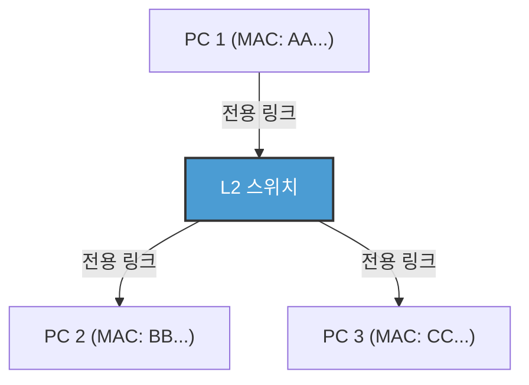

스위치의 도입으로 인해 각 노드와 스위치 간의 배선은 논리적으로나 물리적으로나 독립되었다(스타형 토폴로지). 이에 따라 통신 경로가 분리되었기 때문에 충돌(콜리전)이 원리적으로 발생하지 않게 되었다. 결과적으로 송신용 선과 수신용 선을 동시에 사용하는 '전이중 통신(Full-Duplex)'이 가능해진 것이다.
현대의 이더넷에 있어 CSMA/CD 알고리즘은 더 이상 사용되지 않으며, 순수한 포인트 투 포인트의 전이중 통신으로 진화를 이룩했다. 더욱이 IEEE 802.1Q에 의한 VLAN(Virtual LAN) 기술을 통해, 물리적인 배선에 얽매이지 않고 논리적인 네트워크를 유연하게 분할·통합할 수 있게 되어, 엔터프라이즈나 거대한 데이터 센터의 인프라를 지탱하는 절대적인 기반 기술로서 계속 군림하고 있다.

### Wi-Fi의 데이터 링크 계층: 보이지 않는 전파 공간의 교통 정리
유선 이더넷이 충돌 없는 전이중 통신으로 진화한 반면, 무선 Wi-Fi는 과거의 공유 버스형 이더넷과 마찬가지로 '전원이 같은 공간(공기)이라는 단일 매체를 공유한다'라는 곤란한 과제에 직면해 있다.

무선 통신에서는 송신 중인 자신의 전파가 너무 강하기 때문에 타인의 미약한 전파를 동시에 수신하여 충돌을 '검출(CD)'하는 것이 물리적으로 불가능하다. 또한 '숨겨진 단말 문제(Hidden Node Problem)'——예를 들어 액세스 포인트를 사이에 두고 양쪽에 있는 단말 A와 C는 서로의 전파가 닿지 않지만 동시에 송신하면 액세스 포인트 상에서 전파가 충돌해버리는——라는 무선 특유의 리스크가 있다.

그래서 Wi-Fi의 데이터 링크 계층 프로토콜(MAC 계층)에서는 'CSMA/CA(Carrier Sense Multiple Access with Collision Avoidance: 충돌 회피)'가 채택되어 있다.
CSMA/CA에서는 송신 전에 일정 시간(DIFS) 공간의 전파 상황을 엿듣고, 나아가 임의의 백오프 시간을 기다린 후에 송신을 개시한다. 가장 중요한 차이는 유선에는 없었던 **ACK(Acknowledge: 확인 응답)** 구조이다. Wi-Fi에서는 데이터를 수신한 측은 정상적으로 받았음을 나타내는 ACK 프레임을 즉시(SIFS라는 매우 짧은 대기 시간 후) 되돌려 보낸다. 송신 측은 이 ACK를 받고 나서야 비로소 통신이 성공했다고 판단한다. 만약 ACK가 돌아오지 않으면 충돌이나 간섭으로 데이터가 망가졌다고 판단하고, 백오프 시간을 두 배로 늘려 재송신을 시도한다.

더욱이 숨겨진 단말 문제를 해결하기 위해 'RTS/CTS 핸드셰이크'라는 구조도 존재한다. 큰 데이터를 보내기 전에 송신 측이 RTS(Request to Send: 송신 요청)라는 짧은 제어 프레임을 보내고, 수신 측(액세스 포인트 등)이 CTS(Clear to Send: 송신 클리어)를 반환한다. 이 CTS에는 '지금부터 ○○마이크로초 동안 통신할 테니 주위의 단말은 조용히 해달라'는 예약 시간(NAV: Network Allocation Vector) 정보가 포함되어 있어, 이를 받은 주위 단말은 통신을 자제한다. 이처럼 Wi-Fi의 데이터 링크 계층은 보이지 않는 전파 공간에서의 훌륭한 교통 정리를 수행하고 있는 것이다.

---

## 맺음말

광자로서 유리 속을 질주하고, 심해의 수압을 견디며, 위상과 진폭을 변화시키면서 공간을 날아다니는 물리 현상의 세계. 그리고 그 노이즈가 섞이고 불확실한 물리 현상 위에 프리앰블에 의한 동기화, MAC 주소에 의한 개체 식별, CRC에 의한 엄밀한 오류 검출, 그리고 스위칭이나 CSMA/CA에 의한 세련된 트래픽 제어를 촘촘히 깔아 놓음으로써, 비로소 '인접한 기기로 의미 있는 데이터 덩어리(프레임)를 오류 없이 전달하는' 것이 가능해진다. 이것이 제1계층과 제2계층이 이룩하고 있는 기적인 것이다.

그러나 이것만으로는 전 세계를 연결하는 인터넷이 될 수 없다. MAC 주소에 의한 통신은 어디까지나 같은 스위치나 액세스 포인트에 연결된, 혹은 라우터에 가로막히기 전까지의 '같은 네트워크(브로드캐스트 도메인)'라는 좁은 마을 안에서만 통용되기 때문이다.

다음 장 '제3장: 네트워크 계층과 IP'에서는 이 수많은 로컬 마을끼리를 연결하고, 지구 반대편에 있는 미지의 네트워크로 패킷을 양동이 릴레이처럼 전달하기 위한 장대한 경로 탐색 구조, 즉 IP(Internet Protocol)와 라우팅의 진수에 다가갈 것이다.

# 제3장: 네트워크 계층과 라우팅의 구조 —— 대양을 건너는 패킷의 항해도

우리가 일상적으로 이용하는 인터넷의 근간을 이루는 것이 OSI 참조 모델의 제3계층, 즉 '네트워크 계층'입니다. 물리적인 케이블이나 전파를 통한 직접적인 통신(데이터 링크 계층)을 넘어, 수천 킬로미터 떨어진 서버와 지구 규모로 통신할 수 있는 배경에는 무수히 얽혀 있는 라우터와, 그것들이 자율적으로 정보를 교환하는 장대한 경로 제어(라우팅) 메커니즘이 존재합니다.

본 장에서는 IP(Internet Protocol)의 구조부터 IPv4의 한계와 IPv6의 아키텍처, 그리고 전 세계의 자율 시스템(AS)을 연결하는 BGP(Border Gateway Protocol)의 심연까지, 패킷이 목적지에 도달하기 위한 '항해술'에 대해 기술적·역사적·물리적 관점에서 극한까지 상세히 설명합니다.

## 3.1 네트워크 계층의 패러다임: 종단 간(End-to-End)의 원칙

인터넷의 설계 사상에 있어 가장 큰 돌파구는 '네트워크의 중간 노드(라우터)는 단순한 패킷 전달에만 전념하고, 복잡한 처리(오류 정정이나 순서 보장)는 종단(엔드 호스트)에서 수행한다'는 **종단 간(End-to-End)의 원칙**에 있습니다.

기존의 전화망(회선 교환 방식)에서는 통신의 시작부터 종료까지 물리적인 회선을 점유하고, 네트워크 전체에서 상태(State)를 관리했습니다. 반면, 인터넷(패킷 교환 방식)의 네트워크 계층은 '비연결형(Connectionless)'이며, 상태를 가지지 않습니다. 각 패킷은 독립된 '편지'로 취급되며, 라우터는 그것을 받아 목적지를 보고 최적의 다음 중계 지점(넥스트 홉)으로 내보내는(포워딩) 단순 작업을 반복합니다. 이 '덤 네트워크(Dumb Network)'와 '스마트 터미널(Smart Terminal)'의 조합이야말로, 인터넷이 폭발적으로 확장하고 다양한 애플리케이션을 수용할 수 있었던 가장 큰 이유입니다.

## 3.2 인터넷의 주소: IP 주소의 진화와 고갈의 역사

네트워크 상의 모든 기기에는 고유한 식별자인 IP 주소가 부여됩니다. 현재 인터넷은 과도기에 있으며, 두 세대의 IP 프로토콜이 혼재되어 있습니다.

### IPv4: 32비트의 공간과 고갈에 대한 저항

1981년 RFC 791로 정의된 IPv4는 32비트(약 43억 개)의 공간을 가집니다. 설계 당시 43억이라는 숫자는 터무니없이 크게 느껴졌지만, 인터넷의 폭발적인 보급으로 인해 1990년대에는 벌써 고갈의 위기가 거론되기 시작했습니다.

이 위기를 극복하기 위해 만들어진 것이 **CIDR(Classless Inter-Domain Routing)**과 **NAT(Network Address Translation)**입니다.
초기의 IP 주소 할당은 클래스 A(/8), 클래스 B(/16), 클래스 C(/24)라는 대략적인 '클래스풀(Classful)' 방식으로 이루어져 심각한 주소 낭비를 초래했습니다. CIDR은 이를 가변 길이 서브넷 마스크(VLSM)로 대체하여 필요한 만큼만 주소를 할당하는 '클래스리스(Classless)' 라우팅을 실현했습니다.
또한, NAT의 등장으로 프라이빗 IPv4 주소 공간과 단일 글로벌 IPv4 주소를 연결함으로써, 하나의 주소를 수천 대의 디바이스에서 공유하는 것이 가능해졌습니다. 그러나 NAT는 종단 간의 원칙을 파괴하고, P2P 통신이나 실시간 통신에서 복잡한 NAT 통과(STUN/TURN/ICE 등) 기술을 요구하는 결과를 낳았습니다.

### IPv6: 128비트의 무한 공간과 차세대 헤더 구조

주소 고갈의 근본적인 해결책으로 1998년 RFC 2460에서 제정된 것이 **IPv6**입니다. IPv6는 128비트의 주소 공간을 가지며, $2^{128}$(약 340간) 개라는 지구상의 모든 모래알에 주소를 할당하고도 남을 만큼의 광대한 공간을 제공합니다.

IPv6의 혁신성은 주소의 길이뿐만이 아닙니다. 헤더 구조의 극적인 간소화가 이루어졌습니다. IPv4 헤더에 있던 가변 길이 옵션이나 헤더 체크섬은 폐지되고, 기본 헤더는 40바이트로 고정되었습니다. 이를 통해 하드웨어(ASIC이나 TCAM)에서의 패킷 처리(라우팅)가 고속화되었습니다. 또한, 단편화(패킷의 분할)는 중간 라우터에서는 수행되지 않고 송신원 호스트만이 수행하는 사양으로 변경되어, 라우터의 부하가 크게 경감되었습니다.

## 3.3 라우팅의 양면성: 컨트롤 플레인과 데이터 플레인

라우터의 내부는 크게 두 가지 '플레인(평면)'으로 나뉩니다.

1. **컨트롤 플레인 (제어 평면)**
   라우터들이 라우팅 프로토콜(OSPF나 BGP 등)을 사용하여 서로 통신하며, 네트워크의 토폴로지(연결 형태)를 학습하고 최적의 경로를 계산하는 두뇌 부분입니다. 계산 결과는 RIB(Routing Information Base)라는 데이터베이스에 저장됩니다.
2. **데이터 플레인 (전달 평면)**
   실제로 패킷을 수신하고, 목적지 IP 주소를 바탕으로 다음에 패킷을 내보낼 인터페이스를 결정하여 전달하는 근육 부분입니다. RIB에서 생성된 FIB(Forwarding Information Base)라고 불리는 전달에 특화된 테이블을 사용하며, TCAM(Ternary Content-Addressable Memory) 등의 특수한 메모리를 사용하여 나노초 단위의 하드웨어 와이어 스피드로 패킷을 전달합니다.

## 3.4 네트워크의 내부 통치: IGP와 자율 시스템(AS)

인터넷은 단일 거대 네트워크가 아니라, ISP(인터넷 서비스 제공자), 기업, 대학 등이 각각 관리하는 독립된 네트워크의 집합체입니다. 이 독립된 관리 영역을 **AS(Autonomous System: 자율 시스템)**라고 부릅니다. 현재 전 세계에는 약 10만 개 이상의 AS가 존재합니다.

AS의 내부(기업 내나 ISP의 백본 내) 라우팅에는 **IGP(Interior Gateway Protocol)**가 사용됩니다. 대표적인 IGP에는 다음 두 가지가 있습니다.

- **OSPF (Open Shortest Path First) / IS-IS**
  이들은 '링크 상태(Link State)형' 라우팅 프로토콜입니다. 라우터는 자신의 주변 연결 상태(링크의 대역폭이나 상태)를 네트워크 전체에 플러딩(Flooding)하고, 각 라우터가 네트워크 전체의 완전한 지도(토폴로지 데이터베이스)를 구축합니다. 그 지도상에서 다익스트라(Dijkstra) 알고리즘(최단 경로 알고리즘)을 실행하여, 목적지까지의 '비용(Cost)'이 최소가 되는 경로를 계산합니다. 이는 내비게이션이 정체 정보를 고려하여 최단 루트를 계산하는 것과 물리적·수학적으로 동일한 접근 방식입니다.

## 3.5 BGP: 인터넷을 엮어내는 '외교' 프로토콜

AS의 내부가 OSPF 등으로 통치되고 있는 반면, AS와 AS를 연결하여 글로벌 인터넷을 형성하는 것이 **EGP(Exterior Gateway Protocol)**의 유일한 사실상 표준(De facto standard)인 **BGP(Border Gateway Protocol)**입니다. BGP는 기술적인 최단 거리뿐만 아니라 '비즈니스 관계'나 '국가 간의 정책'을 반영하여 경로를 결정하는 매우 특이한 프로토콜입니다.

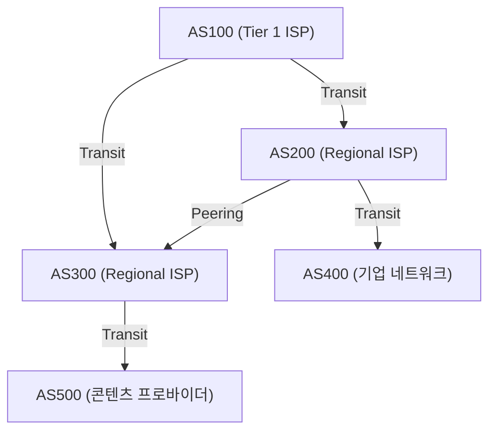

### 피어링과 트랜짓: 인터넷의 경제학

BGP에 의한 AS 간의 연결에는 크게 나누어 두 가지 비즈니스 모델이 존재합니다.

1. **트랜짓 (Transit)**
   소규모 ISP나 기업이 거대 ISP에게 통신 요금을 지불하고, 인터넷의 모든 곳으로의 도달성(풀 라우트)을 제공받는 관계입니다. '고객'과 '프로바이더'의 주종 관계에 해당합니다.
2. **피어링 (Peering)**
   ISP끼리, 혹은 ISP와 콘텐츠 프로바이더(Google이나 Netflix 등)가 IX(인터넷 익스체인지) 등을 통해 서로의 네트워크를 직접 연결하는 관계입니다. 통상적으로 무상(Settlement-free)으로 이루어지며, 트래픽의 숏컷(지름길)과 비용 절감이 목적입니다.

### 패스 벡터와 BGP의 경로 선택 알고리즘

BGP는 '패스 벡터(Path Vector)형' 프로토콜입니다. 특정 IP 네트워크에 도달하기까지 어느 AS를 경유해 왔는지(AS_PATH)를 속성으로 유지합니다. 예를 들어, 경로 정보에 `AS_PATH: [200, 100, 500]`이 있다면, 패킷은 그 순서대로 AS를 통과해 나갑니다. 이를 통해 라우팅 루프를 확실하게 방지합니다.

BGP 라우터는 동일한 목적지에 대해 여러 경로를 수신한 경우, 복잡한 우선순위(Local Preference, AS_PATH의 길이, MED, eBGP/iBGP의 차이 등)에 기반하여 베스트 패스를 하나만 선택합니다. 특히 **Local Preference(로컬 프리퍼런스)** 속성은 강력하여, "기술적으로는 우회하더라도 피어링 회선을 통하는 것이 트랜짓 비용이 들지 않기 때문에 그쪽을 우선한다"와 같은 비즈니스 상의 정책을 라우터에 강제할 수 있습니다.

### BGP 하이재킹과 경로의 취약성

BGP는 원래 '성선설'에 기초하여 설계되었습니다. "타인이 선언한 경로 정보는 올바르다"고 믿어버리기 때문에, 악의가 있거나 설정 실수를 범한 AS가 "내가 Google의 네트워크(8.8.8.8/32)로 가는 최적의 경로를 가지고 있습니다"라고 잘못된 BGP 업데이트를 송신하면, 전 세계의 트래픽이 그 AS로 빨려 들어가는 **BGP 하이재킹(Hijacking)**이 발생합니다.
역사상 파키스탄 정부의 YouTube 차단 여파로 전 세계의 YouTube가 다운된 사건(2008년) 등, BGP의 취약성을 찌른 대규모 장애는 이루 헤아릴 수 없습니다. 현재는 RPKI(Resource Public Key Infrastructure) 등 암호 기술을 이용한 경로 정보 검증 메커니즘의 도입이 진행되고 있습니다.

## 3.6 물리적 제약과 라우터의 싸움: 레이턴시와 버퍼블로트

네트워크 계층의 라우팅은 항상 물리학적 제약과의 싸움입니다.
광섬유 안에서 빛이 나아가는 속도는 진공 중 빛의 속도의 약 67%(약 20만 km/초)이며, 일본에서 미국 서해안까지 왕복(RTT)에 약 100~120밀리초의 물리적 지연(전파 지연)을 피할 수 없습니다.

여기에 더해, 각 라우터에서의 처리 지연, 그리고 **큐잉(Queuing) 지연**이 존재합니다. 네트워크 폭주 시, 라우터는 패킷을 일시적으로 메모리(버퍼)에 축적합니다. 최근의 라우터는 대용량 메모리를 탑재하고 있기 때문에, 패킷을 드롭하지 않고 길어지는 폭주를 계속해서 흡수해 버리는 현상이 일어납니다. 이것이 **버퍼블로트(Bufferbloat)**입니다. 버퍼에 대량의 패킷이 계속 체류함으로써 TCP 등의 상위 계층 폭주 제어가 정상적으로 작동하지 않게 되고, 결과적으로 극단적인 지연(수천 밀리초)을 일으킵니다. 이를 해결하기 위해 AQM(Active Queue Management)이나 FQ-CoDel과 같은 고도의 큐 관리 알고리즘이 현대의 라우터나 OS에 구현되어 있습니다.

## 요약

제3계층·네트워크 계층은 단순한 데이터의 운반자가 아닙니다. 거기에는 IPv4에서 IPv6로의 역사적 전환, TCAM을 이용한 나노초 단위의 하드웨어 처리, OSPF에 의한 수학적 최단 경로 탐색, 그리고 BGP에 의한 경제적·정치적 의도를 내포한 자율 분산적인 경로 제어가 복잡하게 얽혀 있습니다.
하나의 IP 패킷이 당신의 스마트폰에서 지구 반대편의 서버에 도달하기까지는 무수한 라우터가 자신이 가진 지도(라우팅 테이블)를 순식간에 참조하고 릴레이 배턴처럼 패킷을 계속해서 전달하는, 인류가 구축한 가장 거대하고 복잡한 시스템의 활동이 있는 것입니다.

다음 장에서는 이 네트워크 계층 위에 구축되어 패킷의 도달 보장과 폭주 제어를 담당하는 '전송 계층(TCP/UDP)'의 구조에 대해 해설하겠습니다.

# 제4장: 전송 계층의 확실성과 속도 —— 정보 전달을 지탱하는 궁극의 딜레마

## 1. 서론: 종단 간 원칙(End-to-End Principle)과 전송 계층의 사명

지금까지의 장에서 살펴본 네트워크 계층(IP)의 주된 임무는, 광대한 인터넷이라는 네트워크의 바다를 넘어 패킷을 '목적지 컴퓨터(호스트의 네트워크 인터페이스)'까지 물리적이고 논리적으로 전달하는 것이었습니다. 그러나 패킷이 목적지 호스트에 도달하는 것만으로 통신이 완료되는 것은 아닙니다. 현대의 컴퓨터 시스템은 OS 상에서 동시에 다수의 애플리케이션 프로세스(웹 브라우저, 이메일 클라이언트, 동영상 스트리밍 앱, 백그라운드 동기화 프로세스, API 서비스 등)를 멀티태스킹으로 병렬 실행하고 있습니다.

IP 계층에서 무질서하게 잇달아 올라오는 패킷 무리의 산에서, 어느 패킷이 어느 애플리케이션에 속하는 것인지를 식별하고, 의미 있는 데이터 스트림으로 재구성하거나, 결손이 있다면 보완합니다. 이 엔드포인트에서의 최종적인 데이터 관리의 전권을 담당하는 것이 '전송 계층(Transport Layer)'입니다.

인터넷 설계 사상의 근간에는 '종단 간 원칙(End-to-End Principle)'이라는, 매우 아름답고 강력한 아키텍처 상의 결정이 존재합니다. 이는 1981년 제롬 솔처(Jerome Saltzer) 등에 의해 제창된 개념으로, "네트워크의 중간 노드(라우터나 스위치)는 가능한 한 단순한 패킷 전달(Dumb Network)에 특화하고, 오류 복구나 순서 제어, 암호화와 같은 복잡한 처리는 통신의 말단에 있는 호스트(Smart Endpoint)에 맡겨야 한다"는 원칙입니다. 만약 네트워크의 중간 장비에 복잡한 상태 관리나 오류 정정 기능을 갖게 했다면, 인터넷은 현재와 같은 세계 규모의 폭발적인 확장성을 결코 얻지 못했을 것입니다.

전송 계층은 항상 물리학적 제약과 정보 이론의 틈새에서 하나의 근원적인 딜레마에 직면해 있습니다. 그것은 '확실성(Reliability)'과 '속도(Speed / Low Latency)'의 트레이드오프입니다. 정보를 하나도 누락시키지 않고 전달하기 위해서는 확인과 재전송의 오버헤드가 필요하며, 이는 빛의 속도라는 물리적 한계를 동반한 지연을 야기합니다. 반면, 지연을 최소화하려고 하면 정보의 무결성을 일부 희생할 수밖에 없습니다. 이 물리 법칙에 뿌리를 둔 딜레마를 어떻게 해결하고, 애플리케이션에 어떤 추상화를 제공할 것인지에 따라 TCP, UDP, 그리고 현대의 QUIC라는 서로 다른 프로토콜이 설계되고 진화해 왔습니다.

## 2. TCP (Transmission Control Protocol): 확실성을 담보하는 견고한 메커니즘

TCP는 인터넷이 아직 ARPANET이라고 불리던 상용화 이전인 1970년대에 빈튼 서프(Vinton Cerf)와 로버트 칸(Robert Kahn)에 의해 기초가 세워졌습니다. 그 설계 철학은 극히 명확합니다. "어떠한 열악한 네트워크 환경하에서도, 패킷 손실이 빈발하는 불안정한 회선이더라도, 데이터가 결손 없이, 올바른 순서로, 중복 없이 상대방 애플리케이션에 도착하는 것을 보장한다"는 것입니다. 애플리케이션 개발자는 TCP를 사용하는 한, 배후에 있는 네트워크의 복잡성이나 패킷의 분실을 전혀 신경 쓸 필요 없이 그저 '연속된 바이트 스트림'으로서 데이터를 읽고 쓰기만 하면 되는 강력한 추상화를 제공했습니다.

### 포트 번호를 통한 멀티플렉싱(다중화)
IP 주소가 "지구상의 어느 건물인가"를 나타내는 주소라고 한다면, 전송 계층의 '포트 번호'는 "그 건물의 어느 방(어느 프로세스) 앞인가"를 나타내는 논리적인 창구에 해당합니다. 포트 번호는 16비트 부호 없는 정수로 표현되며, 0부터 65535까지의 값을 가집니다.
이를 통해 단일 IP 주소와 단일 물리적 네트워크 인터페이스 위에서 수천에서 수만 개의 각기 다른 통신을 동시에 다중화(멀티플렉스)하는 것이 가능해집니다. 예를 들어, HTTP는 80번, HTTPS는 443번, SSH는 22번과 같이 주요 서비스에는 '잘 알려진 포트(Well-Known Ports)'로서 미리 번호가 할당되어 있습니다.

### 3-way 핸드셰이크: 신뢰의 확립과 물리적 지연
TCP는 통신을 시작하기 전에 반드시 송신 측과 수신 측 사이에서 논리적인 '커넥션(연결)'을 확립하기 위한 의식을 거칩니다. 이것이 '3-way 핸드셰이크(3-Way Handshake)'입니다. 이는 단순히 통신 의사를 확인하는 것뿐만 아니라, 앞으로 시작될 방대한 데이터 교환을 향한 상태 공간의 동기화(Synchronization)라는 매우 중요한 의미를 지닙니다.

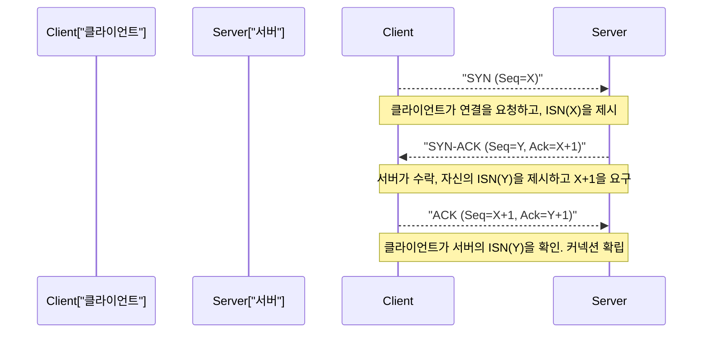

1. **SYN (Synchronize):** 클라이언트는 서버에 대해 동기화 요청 패킷(SYN 플래그를 세운 TCP 세그먼트)을 전송합니다. 이때, 무작위로 생성된 32비트 '초기 시퀀스 번호(ISN: Initial Sequence Number, 여기서는 X라고 함)'를 제시합니다. ISN을 0이나 고정값부터 시작하지 않는 데에는 이유가 있습니다. 과거에 확립되어 이미 절단된 동일 IP·포트 간의 통신에서 '네트워크상에서 길을 잃어 지연 도착한 오래된 패킷(고스트 패킷)'을 새로운 통신의 패킷으로 오인하는 것을 방지하기 위함이며, 또한 공격자가 시퀀스 번호를 추측하여 가짜 데이터를 삽입하는 TCP 시퀀스 예측 공격(IP 스푸핑)을 방지하기 위한 암호론적인 의미가 있습니다.
2. **SYN-ACK:** 서버는 연결 요청을 수락하면, 클라이언트의 ISN에 1을 더한 값(X+1)을 '확인 응답 번호(Acknowledgment Number)'로서 반환함과 동시에, 서버 자신의 무작위 초기 시퀀스 번호(Y)를 부여한 SYN-ACK 패킷을 반송합니다.
3. **ACK (Acknowledgment):** 클라이언트는 서버의 ISN을 올바르게 수신했다는 증거로, Y+1을 확인 응답 번호로 한 ACK 패킷을 전송합니다.

이 세 번의 패킷 교환이 완료된 시점에서 양방향 통신 상태가 메모리 상에 확보되며, 데이터 전송 준비가 갖추어집니다. 단, 이 엄밀한 프로세스에는 통신 인프라의 물리적 한계가 무겁게 짓누릅니다. 그것은 바로 '빛의 속도'입니다.
진공 중의 빛의 속도는 초당 약 30만 km이지만, 인터넷의 주된 백본인 광섬유의 코어(석영 유리)의 굴절률로 인해 광신호의 전파 속도는 약 3분의 2(초당 약 20만 km)로 떨어집니다. 게다가 도중의 라우터에서의 라우팅 처리나 스위칭에 의한 큐잉 지연이 더해집니다. 그 결과, 예를 들어 도쿄와 뉴욕 간(직선거리 약 11,000km, 실제 케이블 길이는 그 이상)에서의 1왕복 시간(1 RTT: Round Trip Time)은 물리적으로 어쩔 수 없이 150~200밀리초가 소요됩니다. TCP의 3-way 핸드셰이크는 최소한 이 1 RTT를 소비하므로, 대역폭(Bandwidth)을 아무리 넓혀도 연결 확립 시의 대기 시간(지연)은 빛의 속도라는 우주의 절대적인 법칙에 의해 제약받는 것입니다.

### 슬라이딩 윈도우와 순서 제어·체크섬
데이터 전송 단계에 들어가면, TCP는 애플리케이션으로부터 받은 바이트 스트림을 적절한 크기(MSS: Maximum Segment Size, 보통 IP의 MTU에서 헤더 크기를 뺀 1460바이트 정도)의 세그먼트로 분할하여 전송합니다. 각 세그먼트에는 데이터 바이트 수에 따른 시퀀스 번호가 부여되며, 수신 측은 이를 바탕으로 패킷의 순서가 뒤바뀌어 도착(아웃 오브 오더)한 경우라도 원래의 데이터를 올바른 순서로 재정렬합니다.

또한, TCP 헤더에는 16비트 '체크섬(Checksum)'이 포함되어 있어, 데이터가 전송 경로상의 전기적 노이즈나 라우터의 메모리 오류 등으로 인해 비트 반전(손상)을 일으키지 않았는지를 1의 보수 합 연산을 이용하여 엄밀하게 검증합니다.

도중에 패킷이 누락(패킷 로스)되거나 손상되어 폐기된 경우, 수신 측은 기대하는 시퀀스 번호의 ACK를 계속 반환(중복 ACK)하거나 아무것도 반환하지 않습니다. 송신 측은 일정 시간(RTO: Retransmission Timeout) ACK가 돌아오지 않거나 중복 ACK를 감지한 경우, 해당 패킷을 '재전송(Retransmit)'합니다.

이 메커니즘에서 통신 속도를 획기적으로 끌어올리는 것이 '슬라이딩 윈도우(Sliding Window)'라는 개념입니다. "하나의 패킷을 보내고, 그 ACK를 받을 때까지 다음 패킷을 보내지 않는(Stop-and-Wait)" 방식으로는 앞서 언급한 고지연 환경(RTT가 큰 환경)에서 처리량(스루풋)이 절망적일 정도로 저하되어 버립니다.
슬라이딩 윈도우 방식에서는 송신 측과 수신 측이 서로의 버퍼 용량을 고려하여 '윈도우 크기(한 번에 송신 가능한 미확인 데이터의 최대 바이트 수)'를 동적으로 합의합니다. 송신 측은 수신 측으로부터의 ACK를 기다리지 않고, 이 윈도우 크기의 범위 내에서 차례차례 패킷을 연속해서 네트워크로 내보낼 수 있습니다. 그리고 ACK를 받을 때마다 이 송신 가능 틀(윈도우)이 앞쪽으로 슬라이드해 나갑니다. 이를 통해 두꺼운 회선이면서 고지연인 네트워크(BDP: Bandwidth-Delay Product, 대역 지연 곱이 큰 환경)에서 '파이프를 데이터로 계속 채운다'는 대역의 최대 활용 메커니즘을 실현하고 있습니다.

### 혼잡 제어(Congestion Control): 네트워크 붕괴를 막는 수학적 조화
TCP의 진정한 걸작이자, 인터넷의 역사에서 가장 중요한 기술적 돌파구 중 하나라고 할 수 있는 것이 '혼잡 제어(Congestion Control)'입니다.

1986년, 초기의 인터넷(NSFNET)은 통신량의 증가로 인해 '혼잡 붕괴(Congestion Collapse)'라고 불리는 치명적인 시스템 장애에 직면했습니다. 네트워크의 처리 능력을 초과하는 데이터가 유입된 결과, 라우터의 큐(버퍼 메모리)가 넘쳐서 대량의 패킷이 폐기되었습니다. 패킷 로스를 감지한 TCP 엔드포인트는 데이터가 도착하지 않았다고 판단하여 일제히 패킷 '재전송'을 수행합니다. 이로 인해 네트워크에 더 많은 데이터가 쏟아져 들어오고, 라우터는 더욱 펑크가 나며 실효 스루풋이 기존의 수천 분의 일로 급감하는 파멸적인 악순환에 빠진 것입니다.

이러한 네트워크의 죽음을 막기 위해, 1988년 밴 제이콥슨(Van Jacobson) 등은 TCP에 고도화된 동적 제어 알고리즘을 도입했습니다. 그 핵심을 이루는 것이 'AIMD(Additive Increase Multiplicative Decrease: 가산적 증가·승산적 감소)' 원칙에 기반한 혼잡 윈도우(cwnd: Congestion Window)의 제어입니다.

1. **슬로우 스타트(Slow Start):** 통신 시작 직후에는 네트워크의 여유 용량을 전혀 알 수 없습니다. 따라서 송신 윈도우 크기를 아주 작은 값(역사적으로는 1 MSS, 현대에는 10 MSS 정도)부터 시작하여, ACK를 1개 받을 때마다 윈도우 크기를 1 MSS씩 늘립니다. 이것은 결과적으로 '1 RTT마다 윈도우 크기가 2배가 되는' 지수 함수적인 증가를 가져옵니다. '슬로우'라는 이름과는 정반대로, 한계 대역을 매우 공격적이고 단시간에 탐색하는 단계입니다.
2. **혼잡 회피(Congestion Avoidance):** 윈도우 크기가 미리 설정된 임계값(ssthresh: Slow Start Threshold)에 도달하면, 지수 함수적인 증가를 멈추고 선형 증가(1 RTT당 1 MSS의 가산)로 전환합니다. 보다 신중하게 네트워크의 한계 용량(파이프의 굵기)을 탐색하는 단계입니다.
3. **패킷 로스의 감지와 승산적 감소:** 패킷 로스(타임아웃의 발생, 또는 수신 측으로부터의 중복 ACK를 3회 연속 수신)를, TCP는 단순한 전송 에러가 아니라 "네트워크 경로상에 정체(혼잡)가 발생하여 라우터의 버퍼에서 패킷이 흘러넘쳤다는 신호"로 해석합니다. 이 순간, TCP는 즉각적으로 자율 제어를 작동시켜 송신 윈도우 크기를 단번에 절반(또는 슬로우 스타트의 초기값)으로 격감시킵니다.

이 '대역을 조금씩 나누어 쓰고(가산적 증가), 문제가 생기면 단번에 양보하는(승산적 감소)' 수학적이고 이타주의적인 분산 알고리즘을 통해, 인터넷상의 수억, 수십억 개의 독립적인 TCP 커넥션은 중앙집권적인 트래픽 관리자가 존재하지 않음에도 불구하고 '대역폭의 공평한 분할'과 '네트워크 전체의 안정적 가동'이라는 기적적인 조화(항상성)를 유지하고 있는 것입니다.

최근에는 라우터 버퍼 메모리의 대용량화가 역효과를 내어, 혼잡으로 인한 패킷 폐기가 발생하기 전까지 길어지는 큐 속에 패킷이 계속 체류하며 지연(Ping 값)이 수백 밀리초에서 수 초까지 튀어 오르는 '버퍼블로트(Bufferbloat)'라는 새로운 물리적 현상이 문제화되었습니다. 이에 대처하기 위해, 패킷 로스가 아닌 'RTT(지연 시간)의 증가'를 혼잡의 신호로 감지하고 버퍼를 넘치게 하기 전에 능동적으로 송신 속도를 줄이는 BBR(Bottleneck Bandwidth and Round-trip propagation time) 등의 최신 혼잡 제어 알고리즘이 구글 등에 의해 개발되어 현대 TCP의 표준이 되어가고 있습니다.

## 3. UDP (User Datagram Protocol): 속도를 위한 덜어냄

TCP가 복잡한 상태 천이와 고도의 알고리즘을 통해 데이터의 완전한 확실성을 보장하는 '과보호하는 관리자'라면, 같은 전송 계층에 속하는 UDP는 프로토콜로서의 역할을 극한까지 덜어낸 '미니멀리스트 운반자'입니다. 존 포스텔(Jon Postel)에 의해 1980년에 설계된 UDP는 전송 계층으로서의 최소한의 기능만을 가집니다.

UDP의 헤더는 고작 8바이트밖에 되지 않습니다(TCP 헤더는 보통 20바이트이며 옵션을 포함하면 최대 60바이트에 달합니다). 거기에 포함되는 것은 '송신지 포트 번호', '목적지 포트 번호', '데이터 길이', 그리고 데이터의 손상을 감지하기 위한 간단한 '체크섬'뿐입니다.

3-way 핸드셰이크를 통한 사전 연결 확립도, 시퀀스 번호를 통한 순서 보장도, 슬라이딩 윈도우에 의한 흐름 제어도, 재전송 처리도, 네트워크를 보호하기 위한 혼잡 제어도 UDP에는 일절 구현되어 있지 않습니다. 애플리케이션으로부터 전달받은 데이터를 그대로 IP 데이터그램에 싸서 네트워크 계층으로 던져 넣고, 'Fire and Forget(쏘고 잊어버리기)' 방식으로 송신할 뿐입니다. 상대방에게 도착했는지 여부조차 관여하지 않습니다.

그러나 이 무책임하다고도 할 수 있는 구조적 단순함이야말로 UDP의 최대 무기이며, 특정 사용 사례에서 TCP를 능가하는 이유입니다.

### UDP의 진가: 지연 시간 지상주의와 실시간 통신
물리적인 지연 시간(레이턴시)을 극한까지 줄여야 하는 실시간 통신에서, TCP의 '확실성을 보장하기 위한 재전송 제어'는 오히려 치명적인 문제를 일으킵니다.

예를 들어, FPS(1인칭 슈팅) 등의 온라인 게임, 음성 통화(VoIP), 혹은 화상 회의 시스템(Zoom이나 WebRTC 등)을 상상해 보십시오. 이러한 애플리케이션에서는 1초에 수십 번에서 수백 번의 빈도로 최신 위치 정보나 음성 샘플 패킷을 전송합니다.
만약 TCP를 사용하고 있고, 100밀리초 전에 전송된 음성 패킷이 도중의 라우터에서 유실되었다고 가정해 보겠습니다. TCP는 그 유실을 감지하고 패킷을 재전송하여 수신 측에서 올바른 순서로 재생하려고 시도합니다. 그러나 대화나 게임이 실시간으로 진행되고 있는 환경에서 '수백 밀리초 늦게 도착한 과거의 데이터'는 더 이상 아무런 가치도 없습니다.
그뿐만 아니라, TCP는 손실된 패킷이 재전송되어 순서가 맞춰질 때까지, 이미 도착해 있는 후속의 새로운 패킷 처리(애플리케이션으로의 전달)를 멈추고 버퍼링해 버립니다. 이를 'Head-of-Line (HoL) 블로킹'이라고 부릅니다. 음성이 뚝뚝 끊기거나 게임 화면이 수 초간 멈췄다가 단숨에 빨리 감기되는 현상의 대부분은 이 TCP의 재전송 대기로 인한 HoL 블로킹이 원인입니다.

UDP는 이럴 때 결손된 과거의 패킷을 미련 없이 포기하고, 지금 도착하고 있는 최신의 패킷을 즉시 애플리케이션에서 처리할 수 있게 해줍니다. 실시간 통신에서는 '모든 데이터가 갖추어지는 것'보다 '다소의 노이즈나 프레임 드롭이 있더라도, 항상 최신 상태를 최단 지연 시간으로 계속 묘사하는 것'이 인간의 감각 기관에는 훨씬 자연스럽고 쾌적한 사용자 경험이 되는 것입니다.

또한, DNS(Domain Name System)의 이름 확인이나 NTP(Network Time Protocol)에 의한 시각 동기화처럼 '하나의 작은 요청 패킷'에 대해 '하나의 응답 패킷'으로 완결되는 단순한 트랜잭션 통신에도 핸드셰이크의 오버헤드가 전혀 없는 UDP가 최적입니다.

## 4. QUIC: 인터넷 통신의 패러다임 시프트와 차세대 프로토콜

인터넷의 여명기부터 수십 년에 걸쳐, 우리의 네트워크 아키텍처는 "확실한 스트림 전송을 원한다면 TCP, 속도와 실시간성을 원한다면 UDP"라는 고착화된 이분법에 얽매여 있었습니다. 그러나 현대 웹의 극적인 진화(특히 모바일 통신의 보급과, 대량의 리소스를 병렬로 로드하는 HTTP/2의 시대)에 있어서 TCP의 근본적인 설계 자체가 족쇄가 되는 한계가 드러나기 시작했습니다.

그 최대의 과제가 UDP 항목에서도 언급한 TCP 특유의 'Head-of-Line (HoL) 블로킹'과, 연결 확립에 수반되는 '과도한 지연 시간'입니다.
TCP는 모든 통신을 '단일한 직렬의 바이트 스트림'으로 관리합니다. 최신 웹 사이트를 표시하기 위해 HTML, CSS, JavaScript, 수십 장의 이미지 등 여러 파일을 HTTP/2 상에서 동시에(멀티플렉스하여) 요청했다고 가정합시다. 하지만 기반이 되는 TCP 레벨에서는 하나의 스트림이기 때문에, 만약 '이미지 A'의 패킷이 단 하나라도 유실된 경우, TCP 계층은 그 패킷의 재전송이 완료될 때까지 전혀 관계가 없는 '스크립트 B'나 '이미지 C'의 패킷 전달마저도 OS의 커널 레벨에서 차단해 버립니다.
게다가 현대의 웹은 암호화(TLS/HTTPS)가 필수인데, 기존의 프로토콜 스택에서는 'TCP의 3-way 핸드셰이크(1 RTT)'를 완료시킨 후에 다시 'TLS의 암호 키 교환 핸드셰이크(1~2 RTT)'를 수행하기 때문에, 실제로 안전한 데이터 송신을 시작하기까지 2~3 RTT라는 막대한 물리적 지연을 소비하고 있었습니다.

이러한 근본 문제를 해결하고 현대의 인터넷 인프라에 패러다임 시프트를 가져오기 위해 구글이 개발을 주도하고 IETF(Internet Engineering Task Force)에 의해 표준화된 차세대 전송 프로토콜이 'QUIC(Quick UDP Internet Connections)'입니다. 그리고 이 QUIC를 기반 프로토콜로 재정의한 웹 규격이 'HTTP/3'입니다.

### 미들박스의 경직화와 유저 공간으로의 탈출
QUIC의 가장 획기적인 접근법은 **"기존의 UDP 패킷 위에 암호화와 다중화를 통합한 완전히 새로운 전송 계층을 유저 공간(User Space)에서 재구축했다"**는 대담한 아키텍처 설계에 있습니다.

왜 TCP를 개량하지 않고 UDP 위에 만들었을까요? 인터넷상의 수많은 라우터나 방화벽, NAT(Network Address Translation) 등의 '미들박스(Middlebox)'는 오랜 운영에 의해 TCP와 UDP 이외의 새로운 프로토콜(새로운 프로토콜 번호)을 '미지의 위협'으로 간주하여 무조건 폐기하도록 경직화되어 버렸습니다(이것을 인터넷의 골화(Ossification) 현상이라고 부릅니다). 또한, TCP의 구현은 Windows나 Linux 등의 OS 커널(핵심부) 깊숙이 하드코딩되어 있기 때문에, 전 세계의 OS를 업데이트하여 새로운 알고리즘을 보급시키는 데에는 터무니없이 오랜 세월이 걸립니다.
그래서 QUIC는 미들박스 측에서는 단순한 '기존의 UDP 패킷'으로서 통과시키면서, 브라우저나 애플리케이션(유저 공간) 내부에서 TCP의 뛰어난 부분(혼잡 제어나 재전송 제어)을 보다 고도하게 진화시킨 상태로 독자적으로 구현한다는 전략을 취한 것입니다.

### QUIC의 혁신적인 메커니즘과 물리적 제약의 초월

1. **스트림의 독립성에 의한 HoL 블로킹의 완전 해소:**
   QUIC는 패킷의 단일 스트림이 아니라, 프로토콜 레벨에서 복수의 논리적인 '독립된 스트림'을 관리하는 기능을 가지고 있습니다. 앞서 말한 예로 들면, 이미지 A의 패킷이 도중에 손실되더라도 QUIC는 이미지 A의 스트림만을 재전송 대기로 일시 정지하고, 스크립트 B나 이미지 C의 스트림은 아무런 영향을 받지 않고 병행하여 처리를 계속합니다. 이를 통해 패킷 로스가 빈발하는 모바일 회선 등에서 웹 페이지 표시 속도가 극적으로 향상됩니다.
2. **0-RTT(제로 아르티티)의 연결 확립과 암호화의 통합:**
   QUIC는 처음부터 TLS 1.3 상당의 암호화가 프로토콜에 깊게 통합되어 있습니다. TCP처럼 '전송 계층의 연결'과 '암호화의 연결'을 나누는 우를 범하지 않습니다. 처음 통신하는 서버 상대라 하더라도 단 1 RTT 만에 연결과 암호 키 교환을 완료시킵니다. 더욱 획기적인 것은, 과거에 통신한 적이 있는 서버(캐시된 세션 티켓을 가진 서버) 상대라면, '0-RTT', 즉 **핸드셰이크를 기다리지 않고 첫 번째 데이터 패킷 전송과 동시에 HTTP 요청을 시작할 수 있다**는 것입니다. 이것은 '빛의 속도에 의한 지연'이라는 물리적 제약에 대한 프로토콜 설계 측면에서의 매우 선명한 해답입니다.
3. **커넥션 마이그레이션 (IP 주소 비의존성):**
   기존의 TCP 커넥션은 "출발지 IP, 출발지 포트, 목적지 IP, 목적지 포트"의 4요소(4-Tuple)에 강하게 묶여 있었습니다. 그 때문에 사용자가 스마트폰을 들고 다니며 Wi-Fi 환경에서 벗어나 4G/5G의 셀룰러 회선으로 전환되어 IP 주소가 변화한 순간, TCP 연결은 끊어지고 시간이 걸리는 핸드셰이크부터 다시 시작해야 했습니다.
   반면 QUIC는 각 연결을 IP 주소가 아니라, 통신 개시 시에 생성되는 고유한 '커넥션 ID(Connection ID)'로 관리합니다. 따라서 물리적인 IP 주소나 네트워크 인터페이스가 동적으로 변하더라도 커넥션 ID가 동일하다면, 동영상 스트리밍이나 대용량 파일 다운로드를 전혀 끊김 없이 원활하게 지속할 수 있습니다. 이동 통신이 주역이 된 현대에 있어 매우 강력하고도 필연적인 특성이라 할 수 있습니다.

## 5. 맺음말: 혼돈을 통제하는 프로토콜의 진화와 질서의 구축

전송 계층은 끊임없이 변동하고 경로가 바뀌며 패킷 손실이나 순서 역전이 일상다반사인 인터넷 네트워크 계층(IP)의 혼돈(카오스) 위에, 애플리케이션이 안심하고 이용할 수 있는 '견고한 논리적 질서'를 구축해 냈습니다.

빈튼 서프와 밴 제이콥슨 등이 설계하고 다듬어낸 TCP의 견고한 수학적 모델과 혼잡 제어는, 지금도 여전히 인터넷의 백본을 붕괴로부터 지켜내며 전 세계의 데이터 전송을 계속해서 지탱하고 있습니다. 그리고 물리적인 지연 시간의 극한을 추구하는 실시간 통신의 요구에 부응하는 UDP의 단순함. 나아가, 이 두 가지의 한계를 극복하고자 암호화와 다중화를 융합하고 모던한 모바일 환경에 최적화되어 탄생한 QUIC 프로토콜의 세련된 아키텍처.

이 모든 것은, "멀리 떨어진 컴퓨터 간에 제한된 대역폭과 빛의 속도의 벽이라는 물리적 제약 속에서, 어떻게 정보를 정확하고 빠르게 전달할 정답을 것인가"라는 인류의 끊임없는 기술적 탐구의 결정체인 것입니다.

패킷이 올바른 순서로 재정렬되어 마침내 의미 있는 데이터 덩어리로서 애플리케이션에 넘겨졌을 때, 단순한 전기 신호의 나열은 마침내 '정보'로서의 가치를 지니기 시작합니다. 다음 장에서는 이 전송 계층이 제공하는 굳건한 토대 위에 구축되어 우리가 일상적으로 접하는 웹의 세계를 직접적으로 형성하는 '애플리케이션 계층(HTTP, DNS 등)' 메커니즘의 심연으로 다가갑니다.

# 제5장: 애플리케이션 계층과 웹의 이면 —— 이름 확인(Name Resolution)부터 암호화 통신까지의 심연

지금까지의 장에서는 광섬유 내부를 전반사하며 나아가는 광자나 구리선 내부를 전파하는 전자기파와 같은 물리 계층의 동작부터 시작하여, IP를 통한 패킷 라우팅, 그리고 TCP/UDP를 통한 전송 계층(Transport Layer)에서의 데이터 전송의 확실성에 대해 깊이 탐구해 왔다. 본 장에서는 드디어 우리 인간이 직접 접하는 영역, 즉 '애플리케이션 계층'으로 발을 들여놓는다.

OSI 참조 모델에서의 제7계층(애플리케이션 계층), 제6계층(프레젠테이션 계층), 제5계층(세션 계층)은 현대의 TCP/IP 계층 모델에서는 단일 '애플리케이션 계층'으로 통합되어 언급되는 경우가 많다. 애플리케이션 계층은 추상화의 최상위에 위치하며, 다양한 프로토콜이 엮어내는 복잡한 생태계이다. 여기서는 브라우저의 주소창에 URL을 입력한 후 웹 페이지가 표시되기까지의 이면에서 역동적으로 움직이는, DNS를 통한 이름 확인, HTTP를 통한 리소스 전송, 그리고 현대 인터넷에 필수불가결한 SSL/TLS를 통한 암호화 메커니즘을 역사적 맥락, 네트워크 공학, 그리고 고도의 수학적 시각에서 극한까지 해부해 나갈 것이다.

## 5.1 DNS(Domain Name System): 분산형 계층 데이터베이스의 경이로움과 계보

IP 주소(IPv4의 32비트, IPv6의 128비트 수치)는 라우터나 스위치 같은 네트워크 장비가 패킷을 전송하기 위한 라우팅 테이블을 구축하는 데는 최적이지만, 인간이 직관적으로 기억하고 의미 부여하여 다루기에는 전혀 적합하지 않다.

인터넷의 기원인 ARPANET의 여명기에 호스트 이름과 네트워크 주소의 매핑은 극히 원시적인 기법으로 관리되고 있었다. 스탠퍼드 연구소(SRI)의 네트워크 인포메이션 센터(NIC)가 단일 텍스트 파일인 `HOSTS.TXT`를 중앙집권적으로 관리하고, 각 노드는 야간에 FTP를 통해 이 파일을 다운로드하여 자신의 로컬 시스템을 업데이트했던 것이다. 그러나 1980년대에 접어들어 네트워크에 연결되는 호스트 수가 지수함수적으로 폭발적인 증가를 보이기 시작하자, 이 중앙집권 모델은 트래픽 병목 현상, 업데이트 지연, 그리고 이름 충돌(네임스페이스 고갈)이라는 치명적인 한계를 드러냈다.

이러한 확장성(Scalability)의 위기를 타파하기 위해, 1983년 폴 모카페트리스(Paul Mockapetris)에 의해 설계 및 제창된 것이 RFC 882 및 RFC 883으로 정의된 DNS(Domain Name System)이다. DNS 아키텍처의 본질은 전 세계 규모로 분산된 계층형 Key-Value 스토어이다. 이 시스템은 단일 장애점(SPOF)을 배제하고 무한에 가까운 확장성을 갖추기 위해, 도메인 공간을 트리 구조로 분할하고 각각의 관리 권한을 위임(Delegation)하는 획기적인 분산 패러다임을 채택하고 있다.

### 이름 확인의 끝없는 여정: 스터브 리졸버(Stub Resolver)에서 권한 서버(Authoritative Server)까지

사용자가 브라우저의 옴니박스에 `https://www.example.com`이라고 입력하는 순간, OS 내부의 스터브 리졸버(Stub Resolver)가 기동하며 백그라운드에서 장대한 '이름 확인의 여정'이 막을 올린다. 이 프로세스는 네트워크 지연이라는 물리 법칙의 제약을 어떻게 회피할 것인가 하는 캐시 전략의 연속이기도 하다.

1. **다단 캐시 조회**: 먼저 지연 시간(Latency)이 가장 낮은 로컬의 브라우저 캐시를 확인한다. 다음으로 OS의 DNS 캐시, 나아가 로컬 네트워크 상의 라우터 DNS 캐시를 조회한다. 광속(진공 중에서 대략 초속 30만 킬로미터, 광섬유 내에서는 그 약 3분의 2)의 물리적 제약을 극복하기 위한 가장 유효한 수단은 애초에 네트워크 통신을 발생시키지 않는 것이다.
2. **재귀적 리졸버(풀 리졸버)로의 쿼리**: 로컬에 캐시가 존재하지 않는 경우, 쿼리는 ISP나 퍼블릭 DNS 제공자(Google의 `8.8.8.8`이나 Cloudflare의 `1.1.1.1` 등)가 운용하는 재귀적 리졸버(Recursive Resolver / Full Resolver)로 송출된다. 이 리졸버는 클라이언트를 대신하여 이름 확인의 전체 과정을 떠맡는다.
3. **루트 서버(Root Server)로의 반복적 질의**: 풀 리졸버의 캐시에도 해당 레코드가 없는 경우, 풀 리졸버는 도메인 계층의 절대적인 정점인 '루트 서버'에 질의를 수행한다. 루트 서버는 현재 전 세계에 A부터 M까지의 13개 클러스터가 존재한다. 루트 서버는 `www.example.com`의 IP 주소를 직접 알고 있는 것이 아니라, `.com`이라는 TLD(Top Level Domain)를 관리하는 네임 서버의 목록을 응답(Referral: 위임 응답)한다. 참고로, 전 세계에 흩어져 있는 루트 서버는 '애니캐스트(Anycast)' 라우팅 기술을 통해 IP 주소를 공유하고 있으며, BGP(Border Gateway Protocol)의 경로 선택에 의해 클라이언트로부터 물리적 및 네트워크 토폴로지적으로 가장 가까운 서버로 트래픽이 자율적으로 유도된다.
4. **TLD 서버로의 반복적 질의**: 다음으로 풀 리졸버는 소개받은 `.com`의 TLD 서버군 중 하나에 쿼리를 던진다. TLD 서버는 `example.com`의 관리 권한을 위임받은 권한(Authoritative) DNS 서버(네임 서버)의 IP 주소(NS 레코드)를 반환한다.
5. **권한 DNS 서버로의 질의와 레코드 획득**: 마지막으로 풀 리졸버는 `example.com`의 권한 DNS 서버에 직접 접근한다. 권한 서버의 존 파일(Zone File)에는 최종적인 해답인 `www`의 A 레코드(IPv4 주소) 또는 AAAA 레코드(IPv6 주소), 혹은 CNAME 레코드(별칭)가 기술되어 있으며, 이것들이 풀 리졸버를 거쳐 클라이언트의 스터브 리졸버로 반환된다.

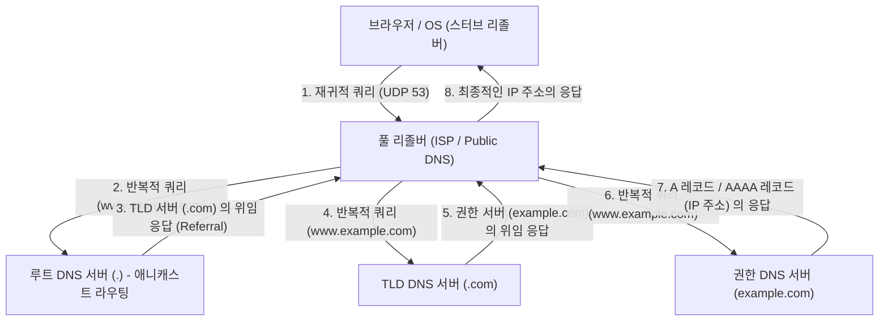

이 복잡한 계층형 왕복 통신은 통상 불과 수 밀리초에서 수십 밀리초라는 찰나의 시간에 완료된다. DNS는 전송 계층 프로토콜로서 주로 UDP 포트 53번을 사용한다. TCP에 의한 3-Way Handshake(SYN, SYN-ACK, ACK)의 왕복 오버헤드를 완전히 배제함으로써 극한의 지연 시간 단축을 실현하고 있는 것이다. 그러나 DNS의 응답 페이로드가 역사적인 UDP의 제한인 512바이트(EDNS0 확장에 의해 현재는 더 큼)를 초과하는 경우나, DNS 캐시 포이즈닝 공격을 방지하기 위한 암호학적 전자서명 확장인 DNSSEC(DNS Security Extensions)의 키 검증을 수행하는 경우, 혹은 존 전송(AXFR)을 수행하는 경우에는 신뢰성이 높은 TCP 포트 53번으로의 폴백(Fallback)이 규정되어 있다.

## 5.2 HTTP 아키텍처와 프로토콜의 진화론

DNS를 통해 대상 서버의 IP 주소를 획득한 브라우저는 다음으로 대상 서버(포트 80번 또는 443번)와의 사이에서 TCP 연결을 확립하고, 애플리케이션 계층의 주요 언어인 HTTP(HyperText Transfer Protocol)를 통한 대화를 시작한다.

1989년 유럽입자물리연구소(CERN)의 팀 버너스리에 의해 고안된 HTTP는 본래 전 세계의 물리학자들이 연구 문서(하이퍼텍스트)를 네트워크 너머로 효율적으로 공유하고, 링크를 통해 연결하기 위한 극히 간소한 프로토콜이었다. 요청 라인(메서드, URI, 프로토콜 버전), 헤더 필드, 빈 줄(CRLF), 그리고 메시지 바디라는 텍스트 기반의 명쾌한 구조는 시스템의 디버깅과 보급을 강력하게 뒷받침했다.

HTTP의 근본적인 설계 사상이자 최대의 특징은 '무상태성(Stateless)'이라는 것이다. 서버는 클라이언트의 과거 요청 상태나 컨텍스트를 일절 메모리상에 유지하지 않는다. 각 요청은 완전히 독립된 트랜잭션으로서 완결된다. 이 REST(Representational State Transfer) 아키텍처와도 통하는 무상태성으로 인해 서버의 구현이 극적으로 간략화되었고, 막대한 트래픽을 처리하기 위해 서버 대수를 수평 방향으로 늘리는 스케일 아웃(부하 분산)이 용이해졌다. 로드 밸런서는 어떤 백엔드 서버에 요청을 분배해도 동일한 결과를 보장할 수 있다. 그러나 이커머스 사이트의 장바구니 기능이나 사용자의 로그인 상태 유지 등 상태(State) 관리가 불가피한 현대의 인터랙티브한 웹 애플리케이션에 있어 이 엄밀한 무상태성은 큰 제약이 된다. 이를 프로토콜 외부에서 극복하기 위해 고안된 것이, HTTP 헤더를 통해 클라이언트 측에 상태를 저장하게 하는 Cookie나 세션 토큰에 의한 의사적인 상태 관리 메커니즘이다.

### 물리적 제약과의 투쟁: HTTP/1.1에서 HTTP/3으로의 패러다임 시프트

웹의 폭발적인 보급과 단일 페이지에 포함되는 리소스(이미지, CSS, JavaScript 파일 등)의 방대화에 따라, HTTP는 네트워크의 물리 법칙(광속에 의한 지연 제한 및 패킷 손실)에 직면하게 되었고, 프로토콜 수준에서의 극적인 아키텍처 진화를 이루어 왔다.

- **HTTP/1.1 (1997년 - )**: 당초의 HTTP/1.0에서는 리소스를 하나 요청할 때마다 TCP 연결의 확립과 절단(3-Way Handshake와 4-Way Handshake)을 반복하고 있었기에, 지연 시간 관점에서 비효율성의 극치였다. HTTP/1.1에서는 Persistent Connection(Keep-Alive)이 표준화되어, 단일 TCP 연결을 재사용 가능하게 함으로써 연결 비용을 극적으로 삭감했다. 그러나 HTTP/1.1의 파이프라이닝 기술은 구현의 어려움과 중간 프록시의 호환성 문제로 보급되지 못했고, 'Head-of-Line(HoL) 블로킹'이라는 치명적인 구조적 결함을 안고 있었다. 이는 단일 TCP 연결 상에서 서버가 하나의 거대한 리소스나 처리가 무거운 요청을 처리하는 동안, 후속 요청이 큐(Queue)에 막혀버려 전체 지연 시간이 악화되는 현상이다. 브라우저는 이를 회피하기 위해 동일 도메인에 대해 동시에 여러 개의 TCP 연결(통상 6개 정도)을 맺는 억지스러운 해킹(도메인 샤딩 등)에 의존할 수밖에 없었다.
- **HTTP/2 (2015년 - )**: Google이 개발한 SPDY 프로토콜을 기반으로 표준화된 HTTP/2는 프로토콜을 텍스트 기반에서 '바이너리 프레이밍 기반'으로 아키텍처의 근본부터 쇄신했다. 가장 중요한 혁신은 '스트림의 다중화(Multiplexing)'이다. HTTP/2에서는 단일 TCP 연결 안에 여러 개의 가상 '스트림'을 생성하고, 요청과 응답의 데이터를 작은 바이너리 프레임으로 분할하여, 순서에 관계없이 인터리빙(교차)하여 전송할 수 있게 되었다. 이로써 애플리케이션 계층에서의 HoL 블로킹이 완전히 해소되었다. 또한, HPACK 알고리즘을 사용한 헤더 압축 메커니즘(정적 허프만 부호화와 동적 테이블의 조합)을 통해 각 요청에서 반복해서 전송되는 장황한 Cookie나 User-Agent 등의 데이터 전송량을 극적으로 줄여, 네트워크 대역폭의 이용 효율을 극한까지 높였다.
- **HTTP/3 (2022년 - )**: HTTP/2는 애플리케이션 계층에서의 HoL 블로킹을 훌륭하게 해소했지만, 기반이 되는 전송 계층(TCP)에서의 '패킷 손실 시의 HoL 블로킹'이라는 물리적인 장벽은 남아 있었다. TCP는 신뢰성을 담보하기 위해 도중에 패킷이 하나라도 누락되면 재전송이 완료될 때까지 해당 TCP 연결 상의 모든 스트림의 데이터 패킷을 애플리케이션 계층으로 전달하는 것을 중단해 버린다(TCP의 순서 보장 메커니즘에 의한 폐해). 이 문제를 타파하기 위해 HTTP/3는 수십 년간 인터넷의 기반이었던 TCP를 버리고, UDP 기반의 새로운 전송 프로토콜인 'QUIC(Quick UDP Internet Connections)'을 채택하는 극적인 패러다임 시프트를 단행했다. QUIC는 TCP가 OS의 커널 공간에서 구현되어 있음으로 인한 진화의 지연을 회피하고, 사용자 공간에서 구현 가능한 UDP의 상위 계층에 독자적인 재전송 제어, 혼잡 제어, 그리고 스트림별 독립적인 흐름 제어를 내장했다. 패킷이 누락되더라도 영향을 받는 것은 그 특정 스트림뿐이며, 다른 스트림은 차단되지 않고 처리를 계속할 수 있다. 나아가 QUIC는 연결 확립의 핸드셰이크와 암호화(TLS 1.3) 핸드셰이크를 통합하여, 과거에 통신 실적이 있는 서버와는 '0-RTT(Zero Round Trip Time)'로 암호화 데이터의 전송을 개시하는 것을 가능하게 했다. 물리적인 빛의 속도 한계(지구 반대편과의 통신에는 어쩔 수 없이 수백 밀리초의 지연이 발생한다)에 대해, 프로토콜 계층에서의 통신 왕복 횟수(RTT)를 철저히 깎아냄으로써 궁극의 퍼포먼스를 추구한 결과의 결정체이다.

## 5.3 암호화와 신뢰의 메커니즘: SSL/TLS의 수학적 심연과 증명의 논리

인터넷은 본질적으로 열린 패킷 통신 네트워크이며, 데이터는 무수한 라우터나 바닷속의 광섬유 케이블을 경유하여 목적지로 양동이 릴레이식으로 전송된다. 그 경로상의 어떠한 노드(중간 라우터나 악의적인 ISP, 혹은 동일 Wi-Fi 네트워크상의 도청자)라도 통신 내용을 패킷 캡처를 통해 가로채고, 심지어 변조하는 것이 물리적으로 가능하다. 이 네트워크의 절대적인 취약성을 고도의 수학의 힘으로 봉쇄하고 안전한 통신 채널을 확립하는 것이 SSL(Secure Sockets Layer) 및 그 후속인 TLS(Transport Layer Security) 프로토콜이다.

TLS가 현대의 웹 통신에서 보장하는 것은 다음의 '보안의 3대 기둥'이다.
1. **기밀성(Confidentiality)**: 통신 내용이 제3자에게 도청되더라도 해독할 수 없을 것.
2. **무결성(Integrity)**: 통신 경로상에서 데이터가 단 1비트라도 변조되지 않았을 것. MAC(Message Authentication Code)이나 AEAD(Authenticated Encryption with Associated Data)에 의해 담보된다.
3. **인증(Authentication)**: 통신 상대가 정당한 도메인의 소유자(진짜 서버)일 것.

이것들을 실현하는 기술은 인류가 수세기에 걸쳐 구축해 왔고, 특히 제2차 세계대전 이후의 컴퓨터 과학과 정수론의 발전에 의해 비약적으로 발전한 암호 이론의 결정체이다.

### 키 교환과 공개키 암호: 이산로그 문제와 소인수분해의 장벽

가장 단순하고 처리가 고속인 암호화 방식은 '대칭키 암호(Symmetric Cryptography)'(현재의 표준은 AES: Advanced Encryption Standard)이다. 이는 송신자와 수신자가 동일한 '대칭키'를 사용하여 암호화와 복호화를 수행하는 기법이다. 수학적 처리가 가벼워(비트의 XOR 연산이나 치환·전치의 조합) 기가비트급의 통신을 실시간으로 암호화하는 데 적합하다. 그러나 대칭키 암호는 "통신을 시작하기 전에 그 비밀 대칭키 자체를 어떻게 안전하게 상대방에게 전달할 것인가"라는 근본적인 역설(키 분배 문제)을 안고 있었다. 인터넷처럼 사전 신뢰 관계가 없는 상대와의 통신에서 대칭키를 그대로 보내면 도중에 키가 도청되어 암호화의 의미가 없어진다.

이 인류사적인 암호학에 있어서의 최대의 돌파구가 된 것이 1976년 휫필드 디피와 마틴 헬만이 발표한 키 교환 알고리즘, 그리고 1977년 RSA(리베스트, 샤미르, 애들먼) 등에 의해 고안된 '공개키 암호(Asymmetric Cryptography)'이다.

공개키 암호의 밑바탕에는 수학적인 '일방향 함수(One-way function)' 또는 '트랩도어(Trapdoor)가 있는 일방향 함수'의 개념이 존재한다. 이는 "어떤 방향(암호화)으로의 계산은 컴퓨터로 순식간에 끝나지만, 역방향(복호화나 키의 추측)의 계산은 설령 전 세계의 슈퍼컴퓨터를 연결하여 우주의 수명 기간 동안 계속 계산하더라도 끝나지 않는다"라는 비대칭성을 이용한 것이다.

- **RSA 암호**: 매우 큰 2개의 소수($p$와 $q$)를 곱하여 거대한 합성수($N = p \times q$)를 만드는 것은 용이(다항식 시간 내에 계산 가능)하지만, 그 거대한 합성수 $N$만 주어지고서 원래의 소인수 $p$와 $q$를 도출해내는 것(소인수분해 문제)은 극히 곤란(준지수 시간 알고리즘만이 알려져 있음)하다는 성질에 기반하고 있다. 오일러의 피 함수(Totient function)나 페르마의 소정리 등 정수론의 심연한 성질을 이용하여, 공개키로 암호화된 데이터는 쌍이 되는 개인키(Secret Key)를 가진 자만이 복호화할 수 있는 수학적인 트랩도어를 구축하고 있다.
- **타원곡선 암호(ECC: Elliptic Curve Cryptography)**: 현재의 TLS에서 주류인 ECC는 유한체 상의 타원곡선(예를 들어, $y^2 = x^3 + ax + b$와 같은 방정식을 만족하는 점의 집합)에서 정의되는 '이산로그 문제'의 곤란성을 응용하고 있다. 타원곡선 상의 점에 대해 '덧셈'이나 '스칼라 곱'이라는 기하학적인 조작을 정의한다. 어떤 시점 $G$를 비밀의 횟수 $k$번 더한 점 $P = kG$를 구하는 것은 용이하지만, 공개된 점 $G$와 $P$로부터 몇 번 더했는지 하는 비밀의 계수 $k$(이산로그)를 역산하는 것은 RSA의 소인수분해보다 훨씬 곤란하다. 이로 인해 ECC는 RSA의 몇 분의 일이라는 극히 짧은 키 길이(예를 들어 RSA 2048bit와 동등한 안전성을 ECC 256bit로 실현)로 동등 이상의 암호 강도를 자랑하며, CPU 부하와 네트워크 대역폭을 극적으로 절약하고 있다.

### TLS 핸드셰이크: 신뢰를 구축하기 위한 암호학적 의식

HTTPS를 통한 보안 통신을 개시할 때, 클라이언트와 서버는 대칭키 암호를 위한 안전한 '세션 키'를 생성하고, 또한 상대방의 신원을 인증하기 위한 고도의 협상 프로토콜을 실행한다. 이것이 TLS 핸드셰이크이다. 아래는 최신 규격이며 극한까지 낭비가 깎여나간 'TLS 1.3'에서의 1-RTT 핸드셰이크의 해부학이다.

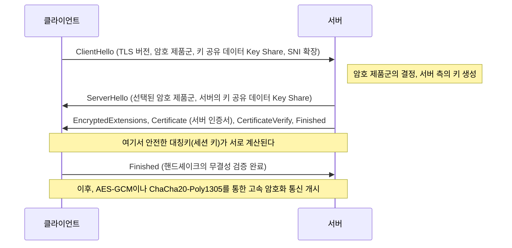

1. **ClientHello**: 클라이언트는 연결 개시에 즈음하여 자신이 지원하는 TLS 버전, 암호화 알고리즘의 목록(Cipher Suites), 그리고 암호키를 생성하기 위한 초기의 수학적 파라미터(Key Share)를 서버에 송신한다. 또한, SNI(Server Name Indication) 확장을 이용하여 접속할 호스트명(예: `www.example.com`)을 평문으로 송신한다. 이는 단일 IP 주소로 여러 개의 HTTPS 도메인을 운용하고 있는 서버(가상 호스트)가 올바른 인증서를 선택하여 반환하기 위해 불가결한 정보이다.
2. **ServerHello**: 서버는 클라이언트의 목록에서 가장 강력하고 최적인 암호 알고리즘(예: `TLS_AES_256_GCM_SHA384`)을 선택하고, 자신의 Key Share 데이터와 함께 응답한다.
3. **인증서의 송신과 서명(Authentication)**: 서버는 자신의 '디지털 인증서(X.509)'를 송신한다. 더불어, 서버는 그 인증서에 연결된 '개인키'를 사용하여 지금까지의 핸드셰이크 메시지 전체의 해시값에 대한 디지털 서명(CertificateVerify)을 생성하여 송신한다. 이를 통해 서버가 그 인증서의 정당한 소유자(개인키의 소지자)라는 것이 수학적으로 증명된다.
4. **키 교환(Ephemeral Elliptic Curve Diffie-Hellman: ECDHE)**: 클라이언트와 서버는 송수신한 서로의 Key Share(공개된 타원곡선 상의 점)와 자신의 수중에만 있는 비밀 파라미터를 수학적으로 곱한다. 놀랍게도 Diffie-Hellman 키 교환의 수학적 성질($ (g^a)^b = (g^b)^a = g^{ab} $)에 의해 네트워크 상에 비밀 정보를 일절 흘려보내지 않고도 클라이언트 측과 서버 측에서 완전히 똑같고 견고한 '마스터 시크릿(대칭키)'이 마법처럼 합성되는 것이다.
5. **완전 순방향 기밀성(Perfect Forward Secrecy: PFS)**: TLS 1.3의 매우 중요한 특징은 이 키 교환에 사용되는 파라미터(Key Share)가 세션이 확립될 때마다 일회용으로 신규 생성된다(Ephemeral)는 점이다. 이로 인해 만에 하나 서버의 장기적인 신분 증명용인 개인키(RSA나 ECDSA 키)가 수년 후에 공격자에게 유출된다고 하더라도, 과거에 기록·저장되어 있던 암호화 통신의 패킷을 거슬러 올라가 복호화하는 것은 수학적으로 완전히 불가능해진다. 과거 통신의 기밀성이 미래에 걸쳐서 담보되는 것이다.

### PKI와 신뢰의 사슬(Chain of Trust): 디지털 세계의 여권

여기까지의 암호화 메커니즘에 있어서 한 가지 치명적인 논리의 틈이 남아 있다. "서버에서 보내온 인증서와 공개키가 정말로 그 대상 도메인(예를 들어 은행의 웹사이트)의 진짜의 것이라고 클라이언트는 어떻게 확신하는가?"라는 문제이다.
네트워크 경로를 지배하는 악의적인 중간자가 서버인 척하며 자신의 가짜 인증서와 공개키를 클라이언트에게 보내는 '중간자 공격(Man-in-the-Middle Attack)'을 수행할 경우, 키 교환과 암호화 자체는 수학적으로 완벽하게 성공한다. 그러나 암호화된 통신의 상대방은 목적지인 은행이 아니라 공격자가 되어버린다.

이 근원적인 인증의 과제를 해결하는 사회·기술적 프레임워크가 PKI(Public Key Infrastructure: 공개키 기반구조)와 신뢰의 앵커가 되는 '인증기관(CA: Certificate Authority)'의 존재이다.

서버의 소유자는 자신의 공개키를 포함한 CSR(인증서 서명 요청)을 작성하여 DigiCert나 GlobalSign, 혹은 Let's Encrypt와 같은 신뢰할 수 있는 제3자 기관인 CA에 제출한다. CA는 그 도메인의 소유권이 신청자에게 확실히 있음을 검증(도메인 인증, 기업 실재 인증 등)한 다음, CA 자신의 강력한 '개인키'를 사용하여 서버의 공개키 정보에 대해 '디지털 서명'을 가하고 서버 인증서로서 발행한다.

한편, Windows나 macOS 같은 운영체제, 그리고 Chrome이나 Firefox 같은 브라우저에는 미리 전 세계적으로 엄격한 감사를 받은 루트 CA의 '루트 인증서(공개키)' 군이 신뢰의 기점(Trust Anchor)으로서 하드코딩되어 내장되어 있다.

클라이언트가 서버로부터 인증서를 받으면, OS에 내장된 루트 CA의 공개키를 사용하여 인증서에 부여된 CA의 디지털 서명에 대해 암호학적인 검증을 수행한다. 서명의 검증이 성공하면 그 인증서의 기재 내용(도메인 이름이나 공개키)이 CA에 의해 보증되고 있으며 변조되지 않았음이 증명된다.

1. 클라이언트는 루트 CA를 무조건적으로 신뢰한다(트러스트 스토어에 사전 설치).
2. 루트 CA는 중간 CA를 신뢰하고 서명한다.
3. 중간 CA는 엔드 엔티티(웹 서버)를 신뢰하고 서명한다.

이 '신뢰의 사슬(Chain of Trust)'이라는 추이적 관계성에 의해, 우리는 물리적으로 멀리 떨어진 미지의 서버와의 사이에 견고한 신뢰 관계를 동적이고 순식간에 구축하여 안전한 암호화 통신 채널을 확립하고 있는 것이다.

## 결론: 계층의 융합과 다음 경지로

제5장에서는 애플리케이션 계층의 심연에서 전개되는 이름 확인, 데이터 요청과 응답의 프로토콜, 그리고 그 모든 것을 감싸는 암호화의 수학적 베일에 대해 상세한 해부를 진행해 왔다.
DNS가 인터넷의 광대한 분산형 주소록으로서 기능하고, HTTP가 리소스 운반자로서의 아키텍처를 확립하며, TLS가 그것을 최첨단 암호 이론의 갑옷으로 견고하게 수호한다. 이것들은 역사적으로는 독립된 프로토콜 계층으로 설계되어 왔지만, 현대의 웹에서는 HTTP/3의 QUIC에서 볼 수 있듯이 전송 계층과 애플리케이션 계층, 그리고 암호화 계층의 경계가 밀접하게 융합되어 물리적인 지연 시간의 한계를 타파하고 극한의 퍼포먼스와 보안을 동시에 추구하는 세련된 형태로 진화를 거듭하고 있다.

다음 장에서는 이 견고한 암호화 통신을 통과하여 서버 측에 도달한 요청이 어떻게 동적인 콘텐츠를 생성하고, 배후의 데이터베이스 시스템과 대화하는가. '백엔드 시스템의 내부 구조와 분산 컴퓨팅'에 대해 한 단계 더 깊은 기술적 심연으로 잠수해 들어갈 것이다.

# 제6장: 인터넷을 지탱하는 물리적 인프라스트럭처——빛과 열과 바다가 직조하는 거대 기구

인터넷은 종종 '클라우드(구름)'라는 실체 없는 추상적인 개념으로 이야기됩니다. 우리의 스마트폰이나 PC에서 전송된 데이터는 보이지 않는 전파나 케이블을 통해 '어딘가 하늘 위'에 있는 스토리지로 빨려 들어가는 듯한 착각을 불러일으킵니다. 하지만 인터넷의 실체는 구름처럼 가벼운 것이 아닙니다. 그것은 극히 중후하고, 물질적이며, 열역학과 광학, 그리고 지구물리학의 법칙에 강하게 얽매인, 인류 역사상 최대의 물리적 인프라스트럭처임에 틀림없습니다.

본 장에서는 이 '불가시의 네트워크'를 물리 세계에 구현하고 있는 세 가지 거대한 기둥——지구 규모의 신경망인 '해저 케이블', 데이터의 보관과 연산을 담당하는 열역학적 처리 시설 '하이퍼스케일 데이터센터', 그리고 광속의 벽을 허물고 시공간을 압축하는 'CDN(콘텐츠 전송 네트워크)'——에 대해, 그 물리적 메커니즘, 역사적 배경, 그리고 극한을 추구하는 프로페셔널한 기술적 관점에서 철저하게 해부합니다.

---

## 1. 지구를 감싸는 빛의 신경망: 해저 케이블 시스템

현재 국경을 넘나드는 국제 인터넷 통신의 약 99%는 우주 공간을 나는 인공위성이 아니라, 해저에 부설된 직경 불과 수 센티미터의 '해저 케이블(Submarine Communications Cable)'을 경유하고 있습니다. 우리가 해외 웹사이트를 열람할 때, 그 데이터는 수천 미터 심해의 칠흑 같은 어둠 속을 빛의 속도로 질주하고 있는 것입니다.

### 1.1 전신에서 광섬유로의 진화와 섀넌 한계에 대한 도전

해저 케이블의 역사는 인터넷의 탄생보다 훨씬 오래되었으며, 1850년 영불 해협 간의 전신 케이블 부설까지 거슬러 올라갑니다. 1858년에는 최초의 대서양 횡단 전신 케이블이 부설되었지만, 당시는 모스 부호에 의한 통신이었고, 빅토리아 여왕이 뷰캐넌 미국 대통령에게 메시지를 전송하는 데 10시간 이상이 소요되었습니다. 그 후 동축 케이블을 이용한 아날로그 전화 회선의 시대를 거쳐, 1980년대 후반부터 광섬유 케이블의 도입이 시작되었습니다. 1988년에 부설된 최초의 대서양 횡단 광통신 케이블 'TAT-8'의 용량은 280 Mbps(전화 회선으로 약 4만 회선 분량)였는데, 이는 당시로서는 혁명적인 대역폭이었습니다.

현대의 해저 케이블은 단일 케이블로 수백 Tbps(테라비트 초당)라는 상상을 초월하는 통신 용량을 자랑합니다. 이 비약적인 진화를 가능하게 한 것이 '파장 분할 다중화(WDM: Wavelength Division Multiplexing)'와 '어븀 첨가 광섬유 증폭기(EDFA: Erbium-Doped Fiber Amplifier)'라는 두 가지 노벨상급 물리학적·공학적 돌파구입니다.

WDM은 하나의 광섬유 안에 서로 다른 파장(색)의 빛을 다중화하여 동시에 전송하는 기술입니다. 이로 인해 광섬유 1가닥당 전송 용량은 파장의 수만큼 기하급수적으로 증가합니다. 하지만 광섬유의 소재인 석영 유리가 아무리 극한까지 순도를 높였다 하더라도, 수백 킬로미터를 나아가는 동안 레일리 산란이나 적외선 흡수에 의해 광신호는 감쇠하고 맙니다. 그래서 필요한 것이 수십 킬로미터에서 백 킬로미터마다 설치되는 중계기(리피터)입니다.

과거의 중계기는 감쇠된 광신호를 한 번 전기 신호로 변환하고 증폭한 뒤 다시 광신호로 변환하는 복잡하고 제약이 많은 프로세스(O-E-O 변환)를 수행했습니다. 하지만 1990년대에 실용화된 EDFA는 광섬유의 코어에 희토류 원소인 어븀을 첨가하고, 그곳에 펌프광이라 불리는 강한 레이저광을 조사함으로써 광신호를 '빛인 채로' 직접 증폭하는 것을 가능하게 했습니다. 이를 통해 파장이 다른 여러 광신호를 일괄적으로 증폭할 수 있게 되었고, WDM 기술과 결합하여 통신 용량은 폭발적으로 증대된 것입니다.

현재 통신 공학 분야에서는 클로드 섀넌이 제창한 통신로 용량의 이론적 한계인 '섀넌 한계(Shannon Limit)'에 근접하고 있습니다. 이를 뛰어넘기 위해 단일 광섬유 내에 여러 코어를 두는 '멀티코어 광섬유'나, 빛의 공간 모드를 다중화하는 '공간 분할 다중화(SDM: Space Division Multiplexing)'와 같은 차세대 물리 계층 기술이 연구 및 구현되기 시작하고 있습니다.

### 1.2 심해의 물리 환경과 케이블 부설 공학

해저 케이블의 부설은 현대의 가장 가혹한 엔지니어링 중 하나입니다. 수천 킬로미터에 달하는 케이블을 전용 '케이블 부설선(Cable layer)'을 이용해 해저에 가라앉힙니다.

부설에 앞서 음향 측심기를 이용해 해저 지형도를 정밀하게 작성하고, 해저 산맥이나 해구, 열수 광상, 산사태 위험이 있는 해역을 피한 최적의 루트를 선정합니다. 케이블의 구조는 부설되는 수심에 따라 극적으로 달라집니다.

수심이 얕은 대륙붕 등의 해역(수심 약 1000~1500미터 이내)에서는 어선의 저인망이나 선박의 닻, 또는 상어 등 해양 생물이 물어뜯는 등의 물리적 절단 위험이 매우 높습니다. 그렇기 때문에 광섬유를 보호하는 폴리카보네이트 수지나 동관 외부에 한 번 더 여러 겹의 고장력 강선(스틸 와이어)을 감은 '외장(Armor)'이 시공되며, 직경은 굵어지고 무게도 무거워집니다. 나아가 원격 조종 무인 탐사기(ROV: Remotely Operated Vehicle)나 해저 쟁기(플라우)를 이용해 해저의 진흙이나 모래 속에 케이블을 수 미터 매설하는 작업이 이루어집니다.

반면, 수심 수천 미터의 심해역에서는 어망이나 닻의 위협이 존재하지 않기 때문에, 수압을 견딜 수 있는 견고성을 유지하면서도 부설 시 자체 하중으로 인한 단선을 방지하기 위해 강선 외장을 생략한 '경량 케이블(Lightweight Cable)'이 채택됩니다. 직경은 17~20밀리미터 정도로 정원용 호스 정도의 굵기밖에 되지 않습니다.

해저 케이블의 또 다른 중요한 물리적 측면은 '전력 공급'입니다. 수십 킬로미터마다 설치된 중계기를 구동하기 위해 육상의 육양국(Cable Landing Station)에서 케이블 내의 구리 튜브(급전 도체)를 통해 고전압의 직류 전류가 공급됩니다. 대양을 횡단하는 케이블에서는 급전 전압이 1만 볼트(10 kV)를 넘기도 하며, 바닷물과 대지를 귀로 회로로 이용하는 '단선 대지 귀로 방식'이 일반적으로 채택되고 있습니다.

### 1.3 지정학과 거대 테크 기업의 대두

과거 해저 케이블의 부설은 막대한 투자가 필요하기 때문에 각국의 주요 통신 캐리어가 결집해 컨소시엄(공동 사업체)을 형성하고 비용과 대역을 안분하는 방식이 주류였습니다. 하지만 최근 이 생태계는 극적인 변모를 이루고 있습니다.

Google, Meta(Facebook), Microsoft, Amazon 등 '하이퍼스케일러'라 불리는 거대 테크 기업군이 자사의 데이터센터 간을 초고속으로 연결하기 위해 단독 혹은 공동으로 해저 케이블에 직접 투자 및 부설을 하게 된 것입니다. 그들은 단순한 인터넷 이용자에서 물리 인프라스트럭처의 최대 소유자로 변모를 이루었습니다. 이로 인해 케이블의 라우팅은 기존의 '주요 도시 간의 연결'에서 '자사 데이터센터 간의 최단·최속 연결'로 최적화되고 있습니다.

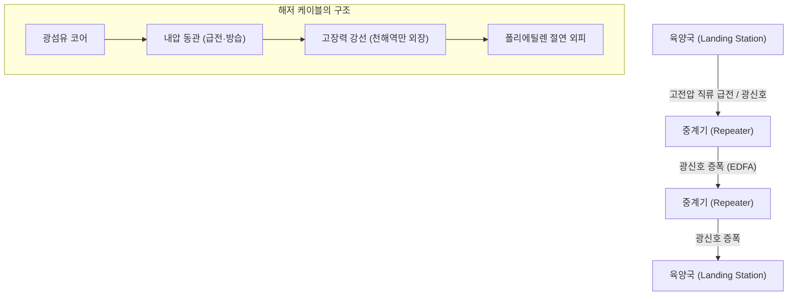

---

## 2. 데이터의 열역학적 처리 시설: 하이퍼스케일 데이터센터

해저 케이블을 거쳐 육지에 도달한 데이터는 최종적으로 '데이터센터'로 운반됩니다. 데이터센터란 수만 대에서 수십만 대 규모의 서버군을 수용하고, 24시간 365일 쉬지 않고 연산과 기억을 계속하는 거대한 건축물입니다.

### 2.1 클라우드의 실체와 'PUE'의 싸움

물리학적인 시각에서 보면, 데이터센터의 본질은 "막대한 전기에너지를 입력으로 받아들여, 정보 처리라는 엔트로피의 감소(연산 결과)와 그에 수반되는 불가피한 '열'을 만들어내는 거대한 열기관"입니다. CPU나 GPU 등의 반도체는 전류의 켜짐·꺼짐을 전환할 때 저항에 의해 열을 발생시킵니다. 이 열을 효율적으로 외부로 배출하지 않으면 반도체는 순식간에 열폭주를 일으켜 물리적으로 소손되고 맙니다.

따라서 데이터센터의 설계와 운영의 최대 초점은 '냉각'과 '전력 효율'에 있습니다. 이 효율을 나타내는 가장 일반적인 지표가 'PUE(Power Usage Effectiveness)'입니다.

**PUE = 데이터센터 전체의 소비 전력 / IT 기기(서버 등)의 소비 전력**

PUE의 이론상 최솟값은 1.0(모든 전력이 순수하게 연산에만 사용된 상태)입니다. 과거의 데이터센터는 PUE가 2.0을 넘는(즉, 서버가 사용하는 것과 같은 양의 전력을 에어컨 등의 냉각 설비에 소비하고 있는) 일도 드물지 않았습니다. 하지만 현대의 하이퍼스케일 데이터센터에서는 이 수치를 1.1~1.2대까지 끌어내리는 극한의 열역학적 최적화가 이루어지고 있습니다.

### 2.2 냉각 아키텍처의 진화

열역학의 원칙에 근거하여 데이터센터의 냉각 시스템은 다음과 같이 진화해 왔습니다.

1. **핫아일·콜드아일의 분리**:
   초기의 데이터센터에서는 방 전체를 공조기(CRAC: Computer Room Air Conditioning)로 식혔으나, 차가운 공기와 서버에서 배출된 뜨거운 공기가 섞여 극히 비효율적이었습니다. 현재는 서버 랙의 흡기면끼리, 배기면끼리 마주 보게 배치하고, 냉기가 통하는 통로(콜드아일)와 열기가 통하는 통로(핫아일)를 물리적으로 격리하는 '아일 컨테인먼트(Aisle Containment)'가 표준이 되었습니다.

2. **프리 쿨링 (외기 냉방)**:
   칠러(냉각수 순환 장치)의 컴프레서를 돌리는 데는 막대한 전력이 필요합니다. 그래서 외기가 충분히 차가운 지역(북유럽이나 홋카이도 등)에 데이터센터를 건설하고, 외기를 직접 혹은 열교환기를 거쳐 간접적으로 냉각에 이용하는 '프리 쿨링'이 보급되었습니다.

3. **액침 냉각(Immersion Cooling)과 직접 수랭(Direct-to-Chip)**:
   최근 AI의 학습이나 추론에 사용되는 하이엔드 GPU의 발열 밀도는 기존 공랭의 물리적 한계(공기의 열용량과 열전도율의 낮음)를 넘어서고 있습니다. 그래서 서버의 마더보드 전체를 비도전성 불소계 비활성 액체나 광물유에 직접 담그는 '액침 냉각'이나, CPU/GPU의 히트 스프레더에 직접 수랭 헤드를 밀착시켜 공기보다 훨씬 열용량이 큰 액체로 직접 열을 빼앗는 '다이렉트 투 칩 냉각'의 도입이 시작되고 있습니다. 상전이(액체의 끓음에 의한 기화열)를 이용한 2상식 액침 냉각에서는 극히 높은 열유속을 처리하는 것이 가능합니다.

### 2.3 이중화와 물리적 보안

데이터센터는 사회 인프라의 중추이기 때문에 극한의 이중화(Redundancy)가 요구됩니다. 상용 전원이 차단되는 순간에 플라이휠이나 납축전지, 리튬이온 전지를 이용한 무정전 전원 장치(UPS)가 밀리초 단위로 전력을 이어받습니다. 그와 동시에 건물 외부에 설치된 거대한 디젤 발전기나 가스터빈 발전기가 기동하여, 비축된 연료를 사용해 며칠 동안 시설 전체를 계속 가동할 수 있는 능력을 갖추고 있습니다.

네트워크 연결 역시 여러 다른 통신 캐리어의 회선을 끌어오고, 물리적인 경로(건물의 동서남북 등 다른 방향에서의 인입)를 완전히 분리함으로써 굴착 공사로 인한 케이블 절단 등의 사고에 대비하고 있습니다.

---

## 3. 시공간을 압축하는 기술: CDN(콘텐츠 전송 네트워크)

해저 케이블이 대륙 간을 연결하고 데이터센터가 정보를 축적한다 해도, 그것만으로는 현대의 웹 경험이 성립하지 않습니다. 여기서 가로막는 것이 알베르트 아인슈타인이 제창한 우주의 절대적인 제한 속도——'광속의 벽'입니다.

### 3.1 광속의 벽과 레이턴시의 물리적 한계

진공 중의 빛의 속도($c$)는 약 30만 km/s입니다. 하지만 광섬유의 코어인 석영 유리의 굴절률은 약 1.47이기 때문에 광섬유 안에서 빛의 속도는 약 20만 km/s(진공 중의 약 3분의 2)로 저하됩니다.

예를 들어, 일본 도쿄에서 미국 동해안의 버지니아주(세계 최대의 데이터센터 집적지)까지의 물리적인 직선 거리는 약 11,000 km, 해저 케이블의 경로를 고려하면 약 14,000 km가 됩니다. 광신호가 편도를 전달되는 데 소요되는 순수한 물리적 시간은 약 70밀리초입니다. 인터넷 통신에서는 패킷의 왕복(RTT: Round Trip Time)이 필요하므로 최소한 140밀리초의 지연(레이턴시)이 물리 법칙으로서 절대적으로 발생합니다. 게다가 도중의 라우터나 스위치에서의 처리 지연이 가산됩니다.

최신의 웹사이트를 열 때, 브라우저는 HTML, CSS, JavaScript, 이미지 등 수백 개의 파일을 요청하고, TCP의 3-Way 핸드셰이크나 TLS(SSL)의 암호화 네고시에이션으로 몇 번이나 통신을 왕복시킵니다. 만약 모든 사용자가 지구 반대편의 '오리진 서버'에 직접 접근해야 한다고 하면, 웹페이지가 표시되기까지 수 초에서 십수 초의 지연이 발생하여 실시간 온라인 게임이나 고화질 동영상 스트리밍은 도저히 불가능한 것이 됩니다.

### 3.2 엣지로의 분산: CDN의 아키텍처

이 물리적 한계를 공학적으로 극복하여 시공간을 압축하는 시스템이 'CDN(Content Delivery Network)'입니다.

CDN의 기본 사상은 극히 심플합니다. "사용자에게서 멀리 떨어진 오리진 서버로 데이터를 가지러 가는 것이 느리다면, 사용자의 물리적으로 가장 가까운 장소에 데이터의 복사본(캐시)을 미리 배치해 두면 된다"라는 발상입니다.

CDN 사업자는 전 세계 주요 도시에 있는 데이터센터나 ISP(인터넷 서비스 제공자)의 시설 내에 '엣지 서버(Edge Server)'라 불리는 수천, 수만 대의 캐시 서버를 물리적으로 배치하고 있습니다. 사용자가 웹사이트에 접속하면, CDN의 네트워크는 순식간에 사용자의 지리적·네트워크적 위치를 판정하여 가장 레이턴시가 낮은(가장 가까운) 엣지 서버로 통신을 라우팅합니다.

이 라우팅을 가능하게 하는 핵심 기술이 '애니캐스트(Anycast)'와 고도화된 'DNS 기반의 라우팅'입니다. 애니캐스트 라우팅에서는 전 세계의 여러 엣지 서버에 완전히 동일한 IP 주소를 할당합니다. 인터넷의 기간을 이루는 BGP(Border Gateway Protocol)의 경로 선택 알고리즘을 이용하여, 라우터가 자동으로 네트워크적으로 '최단'의 서버로 패킷을 전송하도록 기능합니다. 이를 통해 도쿄의 사용자는 도쿄의 엣지 서버로, 런던의 사용자는 런던의 엣지 서버로 의식하지 않고 유도되는 것입니다.

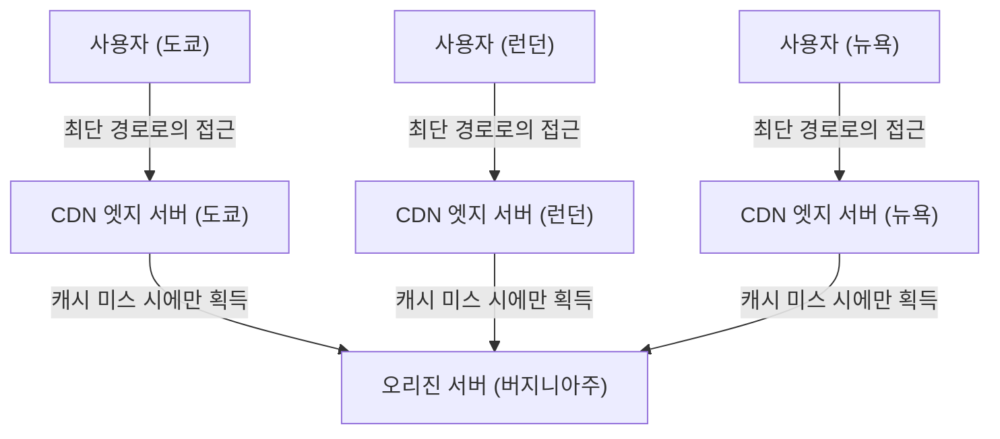

### 3.3 동적 최적화와 엣지 컴퓨팅의 도래

초기의 CDN은 이미지나 동영상, 정적인 HTML 파일을 캐시하여 전송하는 것뿐인 심플한 구조였습니다. 하지만 현대의 CDN은 그 자체로 거대한 분산 컴퓨팅 플랫폼으로 진화하고 있습니다.

첫째로, 동적 콘텐츠(사용자마다 다른 검색 결과나 쇼핑 카트의 내용물 등)의 전송 최적화입니다. 이것들은 캐시할 수 없지만, CDN은 엣지 서버와 오리진 서버 간의 통신 경로를 독자적으로 최적화(Tiered Cache나 전용 고속 라우팅망의 구축)하여 표준 인터넷 경로(BGP의 베스트 에포트 경로)보다 패킷 손실이 적고 안정적이며 고속인 통신로를 제공합니다. 게다가 엣지 서버 측에서 TCP의 연결이나 TLS의 세션을 종단(Terminate)시킴으로써 원격지와의 핸드셰이크 왕복 횟수를 극적으로 줄이고 있습니다.

둘째로, '엣지 컴퓨팅(Edge Computing)'의 대두입니다. 기존에는 복잡한 애플리케이션의 처리(인증, A/B 테스트, 이미지의 동적 리사이즈, 커스텀 로직의 실행 등)는 오리진 서버의 CPU에서 이루어졌습니다. 하지만 현재는 Cloudflare Workers나 AWS Lambda@Edge로 대표되는 기술을 통해 개발자는 V8 엔진 등의 격리된 샌드박스 환경을 이용하여, 사용자의 가장 가까이에 있는 엣지 서버 위에서 직접 코드(JavaScript나 Rust, WebAssembly 등)를 밀리초 단위로 실행할 수 있게 되었습니다. 이를 통해 글자 그대로 '인터넷의 경계(엣지)'가 거대한 분산 컴퓨터로서 기능하기 시작하고 있는 것입니다.

---

## 4. 결어: 물리 한계와의 끝없는 투쟁

인터넷 인프라의 역사는 광속, 열역학 제2법칙, 에너지 보존의 법칙과 같은 우주를 지배하는 절대적인 물리 법칙과의 투쟁의 역사입니다.

해저 케이블의 기술자들은 심해의 거대한 수압과 유리의 광학적 한계에 도전하고, 데이터센터의 설계자들은 발열하는 실리콘 웨이퍼를 냉각하기 위한 열역학적 극한을 추구하며, CDN의 아키텍트들은 광속의 벽을 회피하기 위한 고도의 분산 처리 시스템을 계속해서 구축하고 있습니다.

우리가 스마트폰을 탭하여 전 세계의 정보에 순식간에 접근할 수 있는 이면에는 이처럼 중후하고 가혹하며 극도로 세련된 물리적 인프라스트럭처가 존재하고 있습니다. 제7장에서는 이 견고한 물리 인프라 위에서 소프트웨어와 프로토콜이 어떻게 세계 규모의 자율 분산 네트워크를 유지하고 있는지, '라우팅과 BGP의 세계'에 대해 깊이 파고들어 갈 것입니다.

# 제7장: 사이버 보안과 프라이버시의 전쟁

인터넷의 역사는 자유로운 정보 공유의 이상과 악의적인 공격으로부터 시스템과 데이터를 보호하기 위한 끊임없는 전쟁의 역사이기도 합니다. 초기에 ARPANET으로 탄생한 인터넷은 제한된 신뢰할 수 있는 연구자들 간의 통신을 전제로 설계되었습니다. 그로 인해 프로토콜의 근본적인 설계에서 '보안'은 뒷전으로 미뤄졌고, 성선설에 기반한 아키텍처를 띄고 있었습니다. 하지만 네트워크가 세계 규모로 확대되고, 상업화되며, 인프라스트럭처로서의 입지를 확립함에 따라, 이 초기 설계 사상은 치명적인 약점이 되었습니다.

본 장에서는 현대 인터넷을 뒤흔드는 최대의 위협 중 하나인 DDoS 공격의 물리적·네트워크적 메커니즘, 통신의 프라이버시를 확보하기 위한 암호화와 VPN(가상 사설망) 기술, 그리고 경계 방어의 한계에서 비롯된 차세대 보안 개념인 '제로 트러스트 아키텍처'에 대해 기술의 심연을 들여다보며 극한까지 상세히 설명합니다.

## 1. 네트워크의 물리적 한계와 DDoS 공격의 역학

사이버 공격 중에서도 가장 원시적이면서도, 가장 방어하기 어려운 공격 중 하나가 **DDoS(Distributed Denial of Service: 분산 서비스 거부) 공격**입니다. 이는 표적이 되는 서버나 네트워크 장비에 처리 능력이나 회선 대역폭의 한계를 초과하는 대량의 트래픽을 보내어, 정상적인 사용자에게 서비스 제공을 불가능하게 만드는 공격입니다.

### 트래픽의 물리적 포화: 회선 대역폭의 한계
인터넷은 광섬유나 구리선, 전파와 같은 물리적인 매질을 통해 데이터를 전송합니다. 이러한 전송로에는 광 파장 다중화 기술(WDM) 등을 통해 테라비트급 통신 용량이 구현되어 있지만, 개별 서버가 연결된 회선의 대역폭(예: 1Gbps나 10Gbps)에는 엄격한 물리적 상한이 존재합니다. DDoS 공격은 이 '토관의 굵기'의 한계를 파고듭니다. 공격자가 전 세계에 분산된 수십만 대의 멀웨어에 감염된 기기(봇넷)를 조종하여, 일제히 표적을 향해 패킷을 전송하면 라우터나 스위치의 인터페이스 버퍼 메모리가 넘쳐 패킷 드롭(Packet Drop)이 발생합니다. 이 현상은 유체역학에서의 파이프 막힘과 유사하며, 정보량(패킷 수)이 처리 능력을 초과하는 순간 시스템 전체의 기능 부전을 야기합니다.

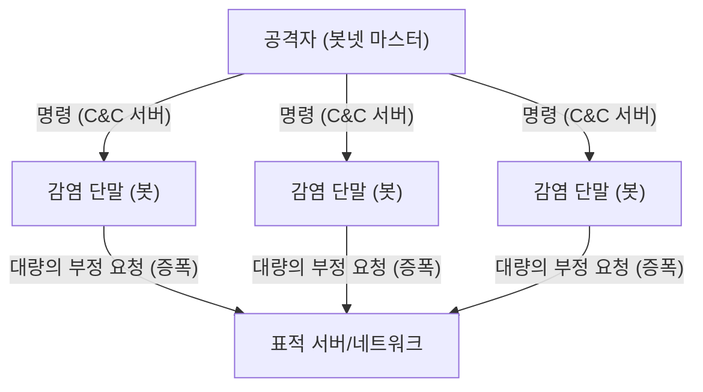

### TCP/IP의 취약점을 찌르다: SYN Flood 공격
대역폭을 가득 채울 뿐만 아니라, 서버의 리소스(CPU나 메모리)를 고갈시키는 공격 수법도 존재합니다. 그 대표격이 **SYN Flood 공격**입니다. TCP 프로토콜에서는 통신을 확립할 때 '3방향 핸드셰이크(3-Way Handshake)'라는 절차를 거칩니다.
1. 클라이언트가 'SYN' 패킷을 전송
2. 서버가 'SYN-ACK' 패킷을 회신하고, 연결용 메모리(TCB: Transmission Control Block)를 확보
3. 클라이언트가 'ACK' 패킷을 전송하여 연결 확립

공격자는 출발지 IP 주소를 위장(스푸핑)한 대량의 SYN 패킷을 서버에 보냅니다. 서버는 SYN-ACK를 회신하지만, 위장된 IP 주소의 주인은 ACK를 반환하지 않습니다 (혹은 존재하지 않습니다). 결과적으로 서버는 '반개방(Half-open)' 상태의 커넥션을 대량으로 떠안게 되고, 연결 관리를 위한 메모리 영역이 고갈되어 정상적인 사용자로부터의 새로운 접속 요청을 거부할 수밖에 없게 됩니다. 이는 TCP의 '신뢰성 있는 통신을 보장한다'는 상태 유지(스테이트풀) 성질을 역이용한 훌륭한 공격 메커니즘입니다.

### 리플렉션(증폭) 공격: 비대칭성의 악용
UDP(User Datagram Protocol)를 이용한 **리플렉션 공격(증폭 공격)**은 한층 더 교묘합니다. UDP는 비연결형(Connectionless) 프로토콜로, 출발지 확인을 수행하지 않습니다. 공격자는 표적의 IP 주소를 출발지로 위장하여 인터넷상의 공개 DNS 서버나 NTP 서버에 요청을 전송합니다. 이때, 작은 요청(수십 바이트)에 대해 수백 배에서 수천 배 크기(수 킬로바이트)의 응답을 반환하는 특정 쿼리를 사용합니다 (DNS ANY 쿼리나 NTP monlist 등).
증폭된 거대한 응답 패킷은 위장된 출발지, 즉 표적 서버로 일제히 눈사태처럼 밀려듭니다. 공격자는 아주 적은 대역폭만 소비하고도 표적에 대해 테라비트급 트래픽을 발생시키는 것이 가능해집니다. 이는 물리학에서의 '지렛대의 원리'나 음향 공학에서의 공명 증폭과 같은 비대칭성을 네트워크상에서 구현한 것입니다.

## 2. 통신 경로의 은닉성: 암호화와 VPN의 메커니즘

공중망인 인터넷상을 흐르는 패킷은 경유하는 다수의 라우터나 ISP 장비를 통해 운반됩니다. 암호화되지 않은 평문(클리어 텍스트) 통신은 경로상에서 쉽게 도청(스니핑)이나 변조가 가능합니다. 프라이버시와 데이터의 기밀성을 지키기 위한 강력한 방패가 '암호 기술'과 'VPN(Virtual Private Network)'입니다.

### 현대 암호의 수학적 기반: 공개키와 대칭키의 하이브리드
통신의 보호에는 주로 2가지 암호 방식이 사용됩니다.
- **대칭키 암호 방식 (AES 등)**: 데이터의 암호화와 복호화에 같은 키를 사용. 처리 속도가 매우 빠르지만, 키를 상대방에게 어떻게 안전하게 전달할 것인가(키 분배 문제)라는 과제가 있음.
- **공개키 암호 방식 (RSA나 타원 곡선 암호 등)**: 암호화용 '공개키'와 복호화용 '개인키' 쌍을 사용. 소인수분해의 어려움이나 이산로그 문제와 같은 고도의 수학적 성질(비대칭성)에 기반함. 계산 비용이 높음.

인터넷상의 안전한 통신(TLS/SSL이나 VPN)에서는 이들을 조합한 하이브리드 방식이 채택되고 있습니다. 먼저, 통신 개시 시의 핸드셰이크에서 공개키 암호를 사용하여 안전하게 '세션 키(대칭키)'를 교환하고, 그 후의 대용량 데이터 통신에는 고속인 세션 키를 이용하여 암호화를 수행합니다. 이를 통해 안전한 키 분배와 고속 암호 통신의 양립을 실현하고 있습니다.

### VPN과 터널링의 원리
**VPN(가상 사설망)**은 암호화 기술을 사용하여 공중 인터넷상에 가상의 '전용선(터널)'을 구축하는 기술입니다. 대표적인 프로토콜로는 IPsec이나 OpenVPN, 최근에는 WireGuard 등이 있습니다.

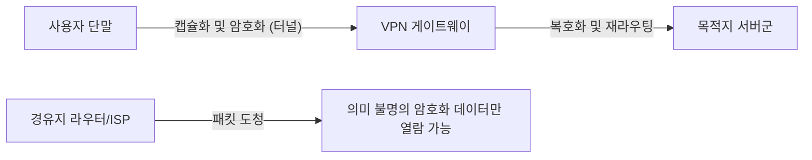

터널링의 핵심적인 메커니즘은 '캡슐화(Encapsulation)'에 있습니다. 사용자가 전송하려는 원래의 IP 패킷(페이로드) 전체를 암호화한 다음, 그것을 새로운 IP 패킷의 데이터 부분으로 감싸고(캡슐화), 바깥쪽에 VPN 서버를 향하는 새로운 IP 헤더를 부여합니다.
경로상에 있는 인터넷의 라우터는 바깥쪽의 IP 헤더만 보고 패킷을 VPN 서버로 전달합니다. 내용물은 강력하게 암호화되어 있기 때문에, 패킷을 도청당하더라도 통신 내용은커녕 본래의 목적지 IP 주소조차 분석하기 어렵습니다. VPN 서버에 도달한 패킷은 복호화되고, 원래의 헤더가 추출되어 최종 목적지로 전송됩니다. 이처럼 물리적으로는 누구나 접근 가능한 인프라 위에서 논리적이고 수학적으로 보호된 프라이빗 공간을 창출하는 것입니다.

## 3. 경계 방어의 붕괴와 제로 트러스트 아키텍처의 대두

오랜 기간 기업이나 조직의 네트워크 보안은 '경계 방어(페리미터 모델)'라 불리는 개념에 의존해 왔습니다. 이는 인터넷(외부)과 사내 네트워크(내부)의 경계에 방화벽이나 IPS(침입 방지 시스템)를 설치하여, '밖은 위험하고 안은 안전하다'고 간주하는 성곽형 방어 전략입니다.

### 클라우드와 원격 근무가 초래한 경계의 상실
하지만 현대에 와서 이 모델은 완전히 파탄 났습니다. SaaS(Software as a Service)의 보급으로 인해 중요한 데이터는 사외의 클라우드상에 놓이고, 원격 근무의 일반화로 직원들은 자택이나 카페의 Wi-Fi를 통해 접근하게 되었습니다. '지켜야 할 내부'와 '위험한 외부'의 경계선이 녹아 없어지고, 기존 방화벽으로는 통제 불가능한 트래픽이 폭발적으로 증가했습니다. 게다가 한 번 내부 네트워크에 침투한 멀웨어(랜섬웨어 등)나 악의적인 내부 범죄자에 대해 경계 방어는 무력합니다. '내부는 신뢰할 수 있다'는 전제가 최대의 취약점이 된 것입니다.

### 제로 트러스트: Trust Nothing, Verify Everything
이러한 패러다임 전환에 대응하기 위해 제창된 것이 **'제로 트러스트 아키텍처(Zero Trust Architecture: ZTA)'**입니다. 제로 트러스트의 기본 이념은 '네트워크의 위치(사내인지 사외인지)에 관계없이 어떠한 통신도 기본적으로 신뢰하지 않는다(Never Trust, Always Verify)'는 것입니다.

제로 트러스트 모델에서 보안의 초점은 '네트워크의 경계'에서 '아이덴티티(사용자와 디바이스)' 및 '리소스(데이터나 애플리케이션)'로 이동합니다.

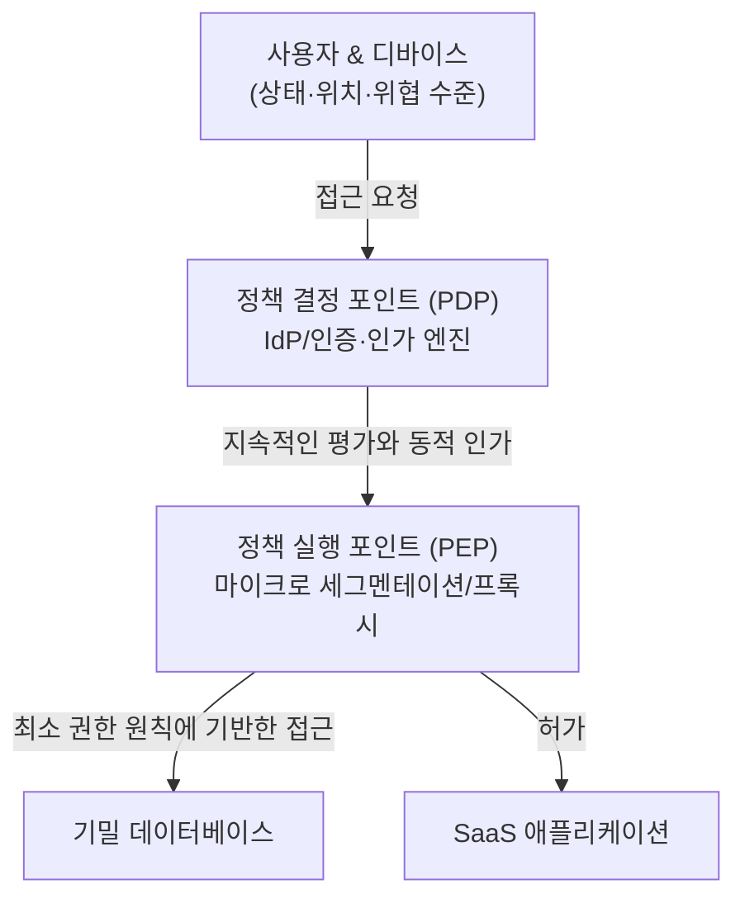

제로 트러스트를 구현하기 위한 핵심적인 기술적 컴포넌트는 다음과 같습니다:

1. **아이덴티티 및 접근 관리 (IAM/IdP)**: 단순한 비밀번호뿐만 아니라, MFA(다중 요소 인증)나 생체 인식 등을 조합하여 사용자의 신원을 강력하게 확인합니다.
2. **디바이스 포스처(건전성) 평가**: 접근을 요청하는 단말기의 OS 패치 적용 상황, 백신 소프트웨어 가동 상태, 과거의 행위 등을 실시간으로 평가합니다. 안전하지 않은 단말기로부터의 접근은 즉시 차단됩니다.
3. **마이크로 세그멘테이션**: 네트워크를 잘게 분할하여 리소스마다 극소의 경계를 설정합니다. 만일 침입당하더라도 피해의 수평 전개(래터럴 무브먼트)를 막는 구조입니다.
4. **지속적 인증과 동적 정책**: 한 번 로그인에 성공했다고 해서 계속 신뢰하는 것은 아닙니다. 세션 중에도 행위(접근 출발지 IP 변경, 비정상적인 데이터 다운로드 양 등)를 지속적으로 감시하며, 위험 점수가 임계치를 초과하는 순간 세션을 차단하는 동적 제어를 수행합니다.

제로 트러스트는 단순한 제품이 아니라, '모든 접근을 매번 검증하고, 필요 최소한의 권한(Least Privilege)만을 부여한다'는 설계 사상이며, 현대의 분산된 IT 인프라에서 데이터를 지키기 위한 유일하고 현실적인 해답이 되었습니다.

## 4. 미래의 보안: 양자 암호와 차세대 네트워크 방어

현재 우리가 의존하고 있는 RSA나 타원 곡선 암호는 '현재 컴퓨터의 계산 능력으로는 해독에 천문학적인 시간이 걸린다'는 전제에 기반하고 있습니다. 하지만 양자 역학의 원리를 응용한 '양자 컴퓨터'가 실용화된다면, 쇼어(Shor) 알고리즘 등에 의해 이러한 수학적 문제들이 순식간에 풀려버릴 위험성이 있습니다. 이를 **'Q-Day(양자 컴퓨터에 의한 암호 해독의 날)'**라고 부릅니다.

이에 대항하기 위해 현재 2가지 접근법이 연구되고 있습니다.
하나는 수학적으로 양자 컴퓨터로도 해독이 어려운 새로운 암호 알고리즘인 **'양자 내성 암호(PQC: Post-Quantum Cryptography)'**의 표준화입니다 (격자 기반 암호 등).
다른 하나는 물리학(양자 역학)의 법칙 자체를 보안의 근거로 삼는 **'양자 암호 통신(QKD: Quantum Key Distribution)'**입니다. 광자의 양자 상태(편광 등)에 정보를 실어 키 분배를 하는 기술로, 도청자가 광자를 관측(복사)하려는 순간 양자 상태가 변화(관측 문제·불확정성 원리)하기 때문에, 도청을 100% 물리적으로 감지할 수 있는 궁극의 보안 통신입니다.

## 맺음말

인터넷의 제7장, 그것은 '편의성'과 '안전성'의 끊임없는 시소게임입니다. DDoS 공격으로 인한 물리적 계층의 포화부터 암호 기술을 통한 수학적 방어, 그리고 제로 트러스트라는 아키텍처의 패러다임 전환에 이르기까지, 사이버 보안은 단순한 IT 기술의 틀을 넘어 물리학, 수학, 행동 심리학이 교차하는 지극히 고도화된 학문 영역으로 진화했습니다.
우리가 무심코 브라우저를 열고 클라우드상의 데이터를 조작하는 배후에는 보이지 않는 공격자와 방어 시스템 간의, 밀리초 단위의 장절한 전자전이 24시간 365일 펼쳐지고 있는 것입니다.

다음 최종장인 제8장에서는 인터넷의 미래, 즉 Web 3.0, 메타버스, 그리고 성간 인터넷(Interplanetary Internet)과 같은 차세대 네트워크 패러다임에 대해 탐구해 보겠습니다.

# 제8장: 미래의 인터넷 —— 분산화, 우주 공간, 그리고 양자 역학이 엮어내는 차세대 네트워크

인터넷은 지난 수십 년 동안 인류 역사상 가장 영향력 있는 정보 인프라로 계속 진화해 왔습니다. 1960년대 ARPANET에서의 패킷 교환 기술 확립을 시작으로, TCP/IP 프로토콜 제품군의 표준화, WWW(World Wide Web)의 발명, 그리고 모바일 브로드밴드의 보급에 이르기까지 그 발걸음은 멈출 줄 모릅니다. 하지만 우리가 현재 이용하고 있는 인터넷은 아키텍처의 근본적인 한계나 물리적인 제약에 직면해 있습니다. 데이터 센터의 거대화에 따른 중앙 집권화의 폐해, 대륙 간 통신에 있어서 광섬유의 물리적 지연, 그리고 계산 능력의 비약적 향상(특히 양자 컴퓨터의 대두)으로 인한 기존 암호 기술의 취약화 등입니다.

본 장에서는 '제8장: 미래의 인터넷'이라는 제목으로 현재 진행형으로 이루어지고 있는 패러다임 전환의 최전선을 탐구합니다. 구체적으로는 중앙 집권에서의 탈피를 목표로 하는 'Web3와 분산형 아키텍처', 물리적 인프라의 제약을 우주 공간으로 확장하는 '저궤도 위성 통신망(Starlink 등)', 그리고 물리학의 궁극적인 법칙을 통신에 응용하는 '양자 인터넷'이라는 3가지 기둥에 대해, 그 역사적 배경, 물리학, 그리고 기술적 메커니즘을 전문가적 관점에서 극한까지 상세하게 서술합니다.

---

## 8.1 Web3와 분산형 아키텍처의 진가: 트러스트리스(Trustless)한 네트워크의 구축

현재의 인터넷(Web2.0)은 거대한 플랫폼 기업에 의한 데이터의 중앙 집권적 관리 위에 성립되어 있습니다. 클라이언트-서버 모델은 효율적인 반면, 단일 장애점(SPOF: Single Point of Failure)의 존재, 검열의 용이성, 그리고 사용자 데이터의 프라이버시 침해라는 구조적인 과제를 안고 있습니다. 이에 대한 아키텍처 수준에서의 해답이 'Web3' 및 분산형 네트워크 기술입니다.

### 8.1.1 콘텐츠 지향 네트워크와 IPFS
기존의 웹(HTTP)은 '위치 지향(Location-Addressed)'입니다. 즉, '어디에 있는지(URL)'를 지정하여 정보에 접근합니다. 하지만 이 구조에서는 서버가 다운되거나 도메인이 만료되면 콘텐츠 자체가 소실되어 버리는 '링크 깨짐(404 Not Found)'이 발생합니다.

이에 반해, IPFS(InterPlanetary File System)로 대표되는 분산형 스토리지 시스템은 '콘텐츠 지향(Content-Addressed)' 아키텍처를 채택하고 있습니다. 파일의 내용을 암호학적 해시 함수(SHA-256 등)에 통과시켜 얻어지는 고유한 '콘텐츠 식별자(CID)'를 사용하여 데이터에 접근합니다.

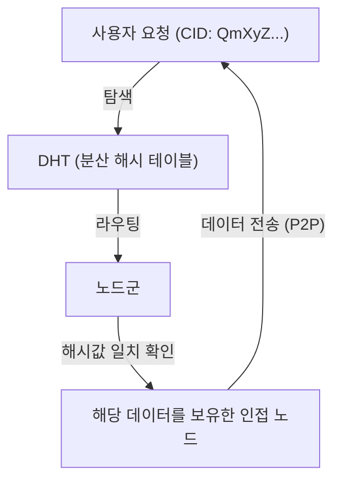

이 메커니즘의 핵심은 DHT(Distributed Hash Table: 분산 해시 테이블)의 일종인 Kademlia 알고리즘에 있습니다. Kademlia는 노드 ID와 데이터 ID 사이의 '거리'를 XOR 연산(배타적 논리합)으로 정의합니다. 이를 통해 네트워크 전체의 토폴로지를 효율적으로 매핑하여 $O(\log N)$ 의 계산 복잡도로 목적하는 데이터를 보유한 노드를 발견하는 것이 가능해집니다. 데이터는 전 세계의 노드에 분산 및 복제되므로, 일부 노드가 오프라인이 되어도 데이터에 대한 접근은 유지되며 검열에 대한 강한 내성을 갖습니다.

### 8.1.2 분산형 합의 형성 및 암호학적 증명
Web3의 또 다른 기반이 블록체인 기술입니다. 이는 분산형 네트워크에서 '누가 올바른 상태를 기록하고 있는가'를 중앙의 관리자를 거치지 않고 합의하는 '합의 알고리즘(Consensus Algorithm)'에 의해 성립됩니다.
초기 비트코인에 채택된 PoW(Proof of Work)는 해시 함수의 충돌 내성을 이용하여 방대한 계산 에너지를 투입함으로써 위변조를 물리적으로 어렵게 만드는 구조였습니다. 하지만 에너지 소비 관점에서 현재는 PoS(Proof of Stake)로의 전환이 진행되고 있습니다.

Ethereum 2.0 등에서 채택하고 있는 PoS에서는 암호 자산을 스테이킹(담보화)한 검증자(Validator)가 BLS(Boneh-Lynn-Shacham) 서명이라는 특수한 페어링 기반 암호 기술을 사용하여 서명을 집약합니다. 이를 통해 수만에서 수십만 개의 노드에 의한 디지털 서명을 아주 작은 데이터 크기로 압축하여, 분산형 네트워크이면서도 높은 보안성과 일정 수준의 확장성을 양립시키고 있습니다. 미래의 인터넷에서는 이러한 기술들이 OSI 참조 모델의 새로운 계층(가치 이전 및 합의 형성 계층)으로서 TCP/IP 위에 표준으로 구현되어 갈 것으로 생각됩니다.

---

## 8.2 지구를 감싸는 위성 통신망: Starlink와 그 너머로

지상에 부설된 광섬유망은 현대 인터넷의 백본(Backbone)입니다. 하지만 해저 케이블 부설 비용, 지형적 제약, 그리고 무엇보다 '매질 내 빛의 속도'라는 물리적인 제약이 존재합니다. SpaceX의 Starlink로 대표되는 저궤도(LEO: Low Earth Orbit) 위성 군집(Constellation)은 이러한 과제들을 우주 공간이라는 프론티어에서 해결하고자 하고 있습니다.

### 8.2.1 궤도 역학과 저궤도(LEO)의 우위성
정지 궤도(GEO: Geostationary Earth Orbit) 위성은 고도 약 35,786 km에 위치하여 지구의 자전과 동기화되어 있기 때문에 안테나의 방향을 고정할 수 있다는 장점이 있었습니다. 하지만 전파가 왕복하는 데만 약 70,000 km 이상의 거리를 이동하기 때문에 물리적 제약에서 발생하는 지연(편도로만 약 120밀리초, 실질적인 대기 시간(Latency)은 500밀리초 이상)을 피할 수 없습니다.

반면, Starlink 위성은 고도 약 550 km의 저궤도에 배치됩니다. 케플러의 제3법칙에 기반한 궤도 역학에 따르면, 이 고도에서는 지구의 중력과 원심력을 맞추기 위해 위성이 약 7.6 km/s(시속 약 27,000 km)라는 맹렬한 속도로 지구를 궤도 비행해야 합니다(약 90분 만에 지구 한 바퀴).
이 낮은 고도로 인해 전파의 물리적 전파 시간은 GEO의 약 65분의 1로 극적으로 단축되며, 이론상 통신 지연 시간은 지상 광섬유와 동등하거나 그 이하(20~40밀리초)가 됩니다.

### 8.2.2 위상 배열 안테나(Phased Array Antenna)와 전파 파면 제어
위성이 고속으로 이동하기 때문에 지상의 사용자 단말기(파라볼라 안테나처럼 물리적 구동부를 갖지 않는 평면 안테나)는 상공을 통과하는 위성을 전기적으로 추적해야 합니다. 여기서 사용되는 것이 '위상 배열 안테나(Phased Array Antenna)'입니다.
수천 개의 미세한 안테나 소자가 평면으로 배열되어 있으며, 각 소자에서 방사되는 전파의 '위상(파동의 타이밍)'을 마이크로초 단위로 의도적으로 어긋나게 합니다. 하위헌스 원리(Huygens' Principle)에 의해 각 소자로부터의 구면파가 간섭을 일으켜 특정 방향으로만 파동이 강해지는(보강 간섭) 빔이 형성됩니다. 이를 통해 물리적으로 안테나를 움직이지 않고도 소프트웨어 제어만으로 통신 빔을 즉각적으로 목적 위성으로 향하게 하는 것이 가능해집니다.

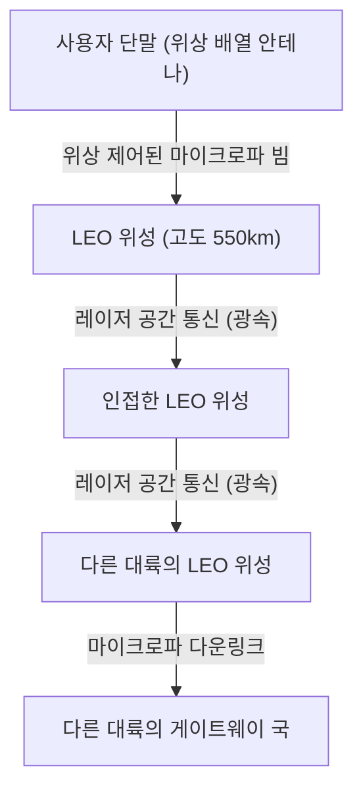

### 8.2.3 광무선 통신(OISL)과 '진공 중 광속'의 절대적 우위성
Starlink 망의 진정한 혁명은 위성 간 레이저 통신(OISL: Optical Intersatellite Links)에 있습니다.
현대의 장거리 통신은 광섬유에 의존하고 있지만, 광섬유 코어(석영 유리)의 굴절률은 약 1.47입니다. 물리학에서 매질 내 빛의 속도는 $v = c / n$ ($c$는 진공에서의 빛의 속도, $n$은 굴절률)으로 표현됩니다. 즉, 광섬유 내 빛의 속도는 약 200,000 km/s로 떨어져 있습니다.

이에 반해, 우주 공간(진공)의 굴절률은 무한히 1에 가깝기 때문에 위성 간 레이저 통신은 진공에서의 빛의 속도인 $c \approx 300,000$ km/s 로 이루어집니다.
예를 들어 런던에서 뉴욕으로의 데이터 전송을 생각했을 때, 대서양 해저 케이블을 경유하는 것보다 데이터를 한 번 우주로 쏘아 올려 진공 상태인 우주 공간을 레이저 빛으로 전송한 후 다시 지상으로 내려보내는 경로가 이론적인 절대 지연 시간(레이턴시)을 더 줄일 수 있습니다. 이는 금융의 고빈도 매매(HFT)나 글로벌 실시간 시스템에서 결정적인 패러다임 전환을 가져옵니다. 장래에는 수만 기의 위성이 지구를 둘러싸고, BGP(Border Gateway Protocol)를 대체할 동적이고 3차원적인 우주 공간의 라우팅 프로토콜이 가동되는 그물망(메시 네트워크)이 완성될 것입니다.

---

## 8.3 양자 인터넷: 얽힘(Entanglement)이 가져다주는 궁극의 통신

Web3가 '신뢰'의 아키텍처를 재구축하고, 위성 통신망이 '공간과 속도'의 제약을 돌파하는 것이라면, '양자 인터넷'은 정보의 '보안 및 전달 수단'에 있어서 물리학의 극치입니다. 양자 인터넷은 기존 TCP/IP 네트워크를 대체하는 것이 아니라 그것을 보완하여, 전혀 새로운 물리 법칙에 기반한 정보 전달 채널을 제공하는 차세대 인프라입니다.

### 8.3.1 양자 역학의 기초: 중첩과 얽힘
고전적인 컴퓨터나 인터넷은 전압의 높낮이 등을 '0' 또는 '1'의 비트로 다룹니다. 하지만 양자 인터넷에서는 양자 비트(Qubit)로서 정보를 전송합니다. 광자(Photon)의 편광 상태(수직, 수평 등)를 이용함으로써 '0'과 '1'이 동시에 존재하는 '중첩의 원리(Superposition)'를 이용합니다.

더욱 중요한 것이 '양자 얽힘(Quantum Entanglement)'입니다. 두 입자가 얽힘 상태에 있을 때, 그들은 물리적으로 아무리 떨어져 있더라도(설령 지구와 화성의 거리일지라도) 한쪽 입자의 상태를 측정하여 확정하는 순간, 다른 한쪽 입자의 상태도 시차 없이 즉각적으로 확정됩니다. 아인슈타인이 '기묘한 원격 작용'이라 불렀던 이 비국소적인 물리 현상이 양자 인터넷의 백본이 됩니다.

### 8.3.2 양자 키 분배(QKD)와 물리학적인 절대 안전성
현재 인터넷 통신을 보호하고 있는 RSA 암호나 타원 곡선 암호는 '거대한 정수의 소인수 분해는 계산 시간이 매우 오래 걸린다'는 수학적인 어려움에 의존하고 있습니다. 하지만 쇼어의 알고리즘(Shor's Algorithm)을 구현할 수 있는 대규모 양자 컴퓨터가 실현된다면 이러한 암호들은 단시간에 뚫리고 맙니다.

그래서 기대받고 있는 것이 양자 키 분배(QKD: Quantum Key Distribution)입니다. 대표적인 BB84 프로토콜에서는 단일 광자를 사용하여 암호 키 전송합니다. 양자 역학의 기본 원리인 '하이젠베르크의 불확정성 원리'에 의해 제3자(도청자)가 비행 중인 광자를 측정(도청)하려고 하면, 그 순간 양자 상태가 변화(결어긋남, Decoherence)하고 맙니다. 또한 '양자 복제 불가능 정리(No-Cloning Theorem)'에 의해 미지의 양자 상태를 정확하게 복사하는 것은 물리학적으로 불가능합니다.
즉, 통신 경로 상에 도청 행위가 있으면 수신자는 에러율의 비정상적인 상승을 통해 이를 물리 법칙 수준에서 반드시 감지해 낼 수 있습니다. 도청되지 않았음이 보장된 안전한 난수를 공유하고 원타임 패드(One-Time Pad) 암호와 결합함으로써, 어떠한 계산 능력을 가진 컴퓨터(우주 규모의 슈퍼컴퓨터)라 할지라도 절대 해독 불가능한 궁극의 보안이 실현됩니다.

### 8.3.3 양자 원격전송과 양자 중계기의 장벽
양자 인터넷의 최종 목표는 얽힘을 이용하여 양자 상태 자체를 다른 장소로 전송하는 '양자 원격전송(Quantum Teleportation)'의 네트워크화입니다. 이를 통해 분산형 양자 컴퓨터끼리 연결하여 단일의 거대한 양자 계산기로 기능하게 하는 '양자 클라우드'가 가능해집니다.

하지만 기술적인 장벽은 매우 높은 상태에 있습니다. 광자는 광섬유 내부를 나아가는 동안 흡수되거나 산란되어 소실되고 맙니다(감쇠). 고전적인 통신에서는 중간에 '증폭기(앰프)'를 두어 신호를 강하게 하지만, 양자 통신에서는 앞서 언급한 '복제 불가능 정리'가 있기 때문에 광자를 복사하여 증폭할 수 없습니다.

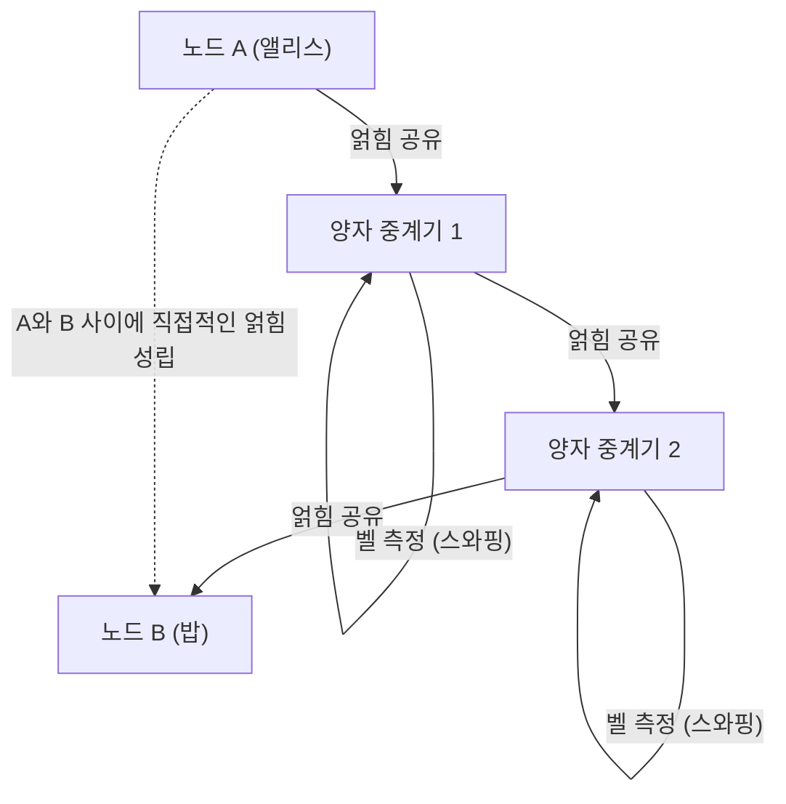

이 한계를 돌파하기 위해 연구되고 있는 것이 '양자 중계기(Quantum Repeater)'입니다. 양자 중계기는 짧은 구간에서만 얽힘을 생성하고 '얽힘 스와핑(Entanglement Swapping)'이라는 고도의 양자 조작을 연속적으로 수행함으로써 장거리 간의 얽힘을 확립합니다. 이를 실현하기 위해서는 양자 상태를 극저온 환경에서 일시적으로 저장하는 '양자 메모리'가 필수 불가결하며, 현재 다이아몬드의 NV 센터(질소-공공 결함)나 냉각 원자 기체를 이용한 물리학적 돌파구가 전 세계의 연구소에서 경쟁적으로 연구되고 있습니다.

---

## 8.4 맺음말: 인류와 네트워크의 미래

1960년대에 첫 선을 보인 인터넷은 지구상의 모든 정보를 연결하는 신경망으로 성장했습니다. 그리고 지금, 우리가 직면한 제8장 '미래의 인터넷'은 소프트웨어 계층에 머물지 않는, 보다 근원적이고 물리학적인 차원으로의 확장입니다.

Web3의 분산형 아키텍처는 특정 중앙 기관에 대한 '신뢰'에 의존하지 않고 수학과 암호학을 통해 사회의 트랜잭션을 담보하는 새로운 신뢰 기반(트러스트 레이어)을 구축하고 있습니다.
Starlink를 비롯한 위성 통신망은 지구의 중력 우물을 벗어나, 진공에서의 광속이라는 물리학의 절대적인 한계 속도에 도전함으로써 거리의 장벽을 무효화하는 3차원적인 백본을 그려내고 있습니다.
그리고 양자 인터넷은 양자 역학의 심연한 신비인 얽힘을 엔지니어링으로 승화시켜, 정보의 전달과 보안의 개념을 근본부터 뒤엎으려 하고 있습니다.

이러한 기술들은 각각 독립적으로 발전하고 있는 것처럼 보이지만, 장기적으로는 융합해 나갈 것입니다. 우주 공간을 날아다니는 레이저 빛 속에 단일 광자(양자)를 실어 보냄으로써 감쇠가 적은 우주 공간을 이용한 글로벌 양자 암호 통신망이 구축되고, 그 위에서 Web3의 분산형 프로토콜이 가동된다. 그런 SF 같은 네트워크 인프라가 바로 지금 인류의 손에 의해 설계되어 가고 있는 것입니다.

앞으로의 인터넷은 단순히 '정보를 전송하는 토관(Pipe)'이 아니게 됩니다. 그것은 인류의 경제 활동, 사회적인 합의 형성, 그리고 계산 자원을 우주 규모로 동기화시키는 궁극의 '지적 인프라스트럭처'로 진화해 나갈 것입니다. 우리가 매일 무심코 이용하고 있는 인터넷의 이면에서는, 지금 이 순간에도 물리학과 컴퓨터 과학의 한계에 도전하는 장대한 서사가 끊임없이 쓰여지고 있습니다.

