# 第1章 インターネットの黎明と哲学 —— ARPANETからWWWに至る技術の系譜

インターネット——今日、人類のあらゆる経済活動、文化、そしてコミュニケーションの基盤となっているこの巨大な自律分散型ネットワークは、決して単一の天才によって一夜にして設計されたものではない。それは冷戦という特異な歴史的・地政学的背景を起点とし、通信工学と計算機科学におけるパラダイムシフトを経て、無数の研究者たちが共有した「情報をいかにして堅牢かつ自由に、いかなる物理的制約をも超えて伝達するか」という崇高な哲学の結晶である。

本章では、インターネットという奇跡のシステムがいかにして誕生したのかを、単なる歴史の羅列ではなく、物理層からアプリケーション層に至るまでの技術的メカニズムと、その設計思想（アーキテクチャ）というプロフェッショナルな視点から極限まで深く掘り下げて解説する。

## 1.1 ネットワークパラダイムの転換：回線交換の限界とパケット交換の誕生

インターネットの歴史的・技術的本質を理解する上で、すべての出発点となるのが「パケット交換（Packet Switching）」という概念の発明である。1960年代初頭、当時の通信インフラの中心は、電話網に代表される「回線交換（Circuit Switching）」方式であった。

### 回線交換の物理的メカニズムと脆弱性
回線交換方式とは、通信を行う2点間において、クロスバースイッチや電子交換機を物理的、あるいは周波数分割多重化（FDM）などの技術を用いて論理的に結合し、通信開始から終了まで「専用の通信路（回線）」を確保・占有する方式である。この方式は、回線が確保されている限り帯域幅と遅延が保証されるため、リアルタイム性が求められる音声通信（電話）には極めて適していた。

しかし、このアーキテクチャには致命的な欠陥が存在した。それは「単一障害点（Single Point of Failure）」の存在と、物理的破壊に対する極度の脆弱性である。冷戦下において、米国防総省はソビエト連邦からの核攻撃（特に高高度核爆発に伴う電磁パルス：EMP攻撃）を深く懸念していた。中央集権的な通信拠点（巨大な交換局）が物理的に破壊された場合、あるいは通信経路の一部が寸断された場合、回線交換方式では迂回経路を即座に再構築することができず、国家の指揮命令系統（C2: Command and Control）が完全に麻痺してしまう。

### パケット交換というブレイクスルー
この絶望的な物理的制約を打ち破るための理論的基盤を、全く独立に、しかしほぼ同時期に構築した3人の先駆者がいる。ランド研究所のポール・バラン（Paul Baran）、イギリス国立物理学研究所（NPL）のドナルド・デイビース（Donald Davies）、そしてマサチューセッツ工科大学（MIT）のレナード・クラインロック（Leonard Kleinrock）である。

彼らは、クロード・シャノン（Claude Shannon）の情報理論を背景としつつ、通信を連続的なアナログの「波」や切れ目のないデータの「ストリーム」として扱うのではなく、データを固定長（あるいは可変長）の小さなデジタルデータの塊——すなわち「パケット（Packet）」あるいはバランの言葉で言えば「標準化されたメッセージ・ブロック」——に分割するという革命的なアプローチを提唱した。

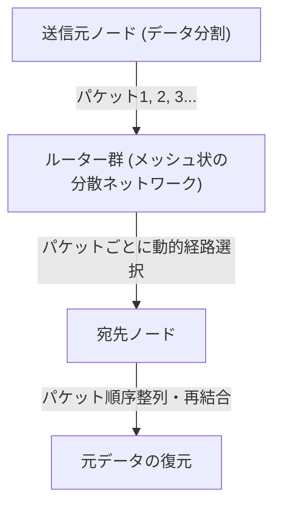

パケット交換方式の技術的革新性は、主に以下の2点に集約される。

1. **統計的多重化（Statistical Multiplexing）の実現:**
   回線交換のように特定の通信で物理回線を占有するのではなく、複数の無関係な通信のパケットが、同じ物理回線を時分割で共有する。計算機間のデータ通信は「バースト性（Burstiness：一時的に大量のデータが流れ、その後無音が続く特性）」が高いため、パケット交換による帯域の共有は、通信リソースの利用効率を数学的限界まで引き上げた。
2. **ストア・アンド・フォワード（Store and Forward）と動的経路選択:**
   ネットワークを構成する各中継ノード（ルーター）は、受信したパケットを一時的にメモリ上のキュー（待ち行列）に蓄積し、パケットのヘッダに記載された宛先アドレスと、ノード自身が持つ経路表（ルーティングテーブル）を照らし合わせる。そして、その時点でのネットワークの輻輳（ふくそう）状態や物理的回線の切断状況を計算し、パケットごとに最適な隣接ノードへ転送する。

クラインロックは待ち行列理論（Queuing Theory）を用いて、このストア・アンド・フォワード方式におけるパケットの遅延やバッファサイズの数学的モデルを確立した。ネットワークの一部が核攻撃で蒸発したとしても、生き残ったノードが自律的に状況を判断し、パケットは迂回路（メッシュネットワーク上の別の経路）を見つけ出して宛先に到達する。この「自律分散型・自己修復型」のアーキテクチャこそが、インターネットの強靭性（Resilience）の根源である。

## 1.2 ARPANETの構築：IMPによるハードウェアとプロトコルの分離

理論上の存在であったパケット交換ネットワークを物理世界に実装したのが、1969年に米国防総省高等研究計画局（ARPA）の資金提供により開始されたプロジェクト「ARPANET」である。

当時の計算機環境は、現代とは比較にならないほど混沌としていた。IBM、DEC、SDSなど、各社が独自に開発したメインフレーム（大型計算機）は、文字コード（ASCII対EBCDIC）、ワード長（16ビット、32ビット、36ビットなど）、オペレーティングシステムが完全に異なっており、これらを直接通信させることは技術的に極めて困難であった。

そこで、ARPANETの設計者たち（ラリー・ロバーツら）は、ネットワークアーキテクチャにおいて非常に重要な設計上の決断を下す。それは「IMP（Interface Message Processor）」と呼ばれる専用の中継用小型コンピューターを導入することであった。

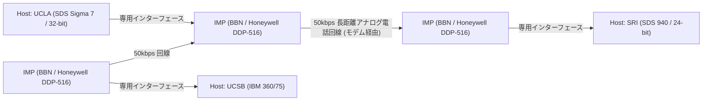

IMPの開発は、ボストンに拠点を置くコンサルティング会社BBN（Bolt Beranek and Newman）が落札した。彼らはHoneywell社の堅牢なミニコン「DDP-516」を改造し、ルーティングプロトコル、パケットの分割と組み立て、エラー検出（CRC: 巡回冗長検査）といった複雑なネットワーク処理のすべてをIMPに負担させた。

これにより、各研究機関の巨大なホストコンピューターは、複雑なパケットルーティングや回線の物理的特性を一切気にする必要がなくなり、ただ目の前にあるIMPと標準化されたインターフェース（BBN 1822プロトコル）でデータの受け渡しをするだけで済むようになった。これは、システムの「関心の分離（Separation of Concerns）」をネットワーク分野に適用した最初の偉大な成功例であり、IMPは今日のルーター（Router）の直接的な始祖となった。

1969年10月29日、UCLAのクラインロックの研究室からSRI（スタンフォード研究所）に向けて、最初のメッセージ「LO」が送信された（"LOGIN"と打とうとしてシステムがクラッシュしたため）。これが、ARPANETが産声を上げた歴史的瞬間である。その後、初期のルーティングアルゴリズム（ベルマン・フォード法に基づく距離ベクトル型ルーティング）が実装され、ARPANETは全米の研究機関を結ぶインフラとして急速に成長していく。

## 1.3 TCP/IPの設計思想：End-to-End原則とカプセル化の深淵

ARPANETは単一のネットワークとしては大成功を収めたが、やがて新たな壁に直面する。ARPANET内で使用されていたNCP（Network Control Program）という通信プロトコルは、ARPANETという「均質で信頼性の高い単一ネットワーク」の上で動くことを前提として設計されていた。

しかし1970年代に入ると、人工衛星を使ったパケット通信網（SATNET）や、ハワイ大学が開発した無線パケット通信網（ALOHANETから派生したPRNET）など、物理媒体、パケットの最大サイズ（MTU: Maximum Transmission Unit）、転送速度、エラー率が全く異なる多種多様なネットワークが登場し始めた。これらを相互接続して地球規模の「ネットワークのネットワーク（Internetwork）」を構築しようとしたとき、NCPの設計では破綻することが明白となった。

この異機種間ネットワーク接続の途方もない課題を解決したのが、1974年にヴィントン・サーフ（Vinton Cerf）とロバート・カーン（Bob Kahn）が発表した画期的な論文 "A Protocol for Packet Network Intercommunication" である。彼らが設計したプロトコルこそが、現代インターネットの基盤である「TCP/IP（Transmission Control Protocol / Internet Protocol）」である。

### アーキテクチャの魂：End-to-End原則 (End-to-End Argument)
TCP/IPの設計の根底には、ネットワーク工学における最も重要な哲学「End-to-End原則（End-to-End Principle / Argument）」が流れている。1980年代にJ. H. Saltzer、D. P. Reed、D. D. Clarkらによって明文化されたこの原則は、以下のように主張する。

「データ転送の信頼性確保や順序制御、暗号化といった高度でアプリケーション固有の機能は、通信を行う両端の末端ホスト（End-to-End）において実装されるべきであり、ネットワークのコア（中継インフラやルーター）には実装するべきではない」

もしネットワークのコア側（IMPやルーター）に、パケットの到達確認（ACK）や再送制御などの複雑な「状態（State）」を持たせてしまうと、どうなるか。中継ルーターが故障した瞬間にその状態は失われ、通信は切断される。また、新しい要件を持つアプリケーションが登場するたびに、世界中の中継ルーターのソフトウェアを書き換えなければならなくなる。

TCP/IPはこの原則を極限まで忠実に具現化した。中継を担うIP（Internet Protocol）ルーターは「受け取ったパケットを宛先に向けてベストエフォート（最善の努力）で転送するだけ」という極めて単純な機能（ステートレスなデータグラム転送）に特化した。IPはパケットの紛失や順序の入れ替わりを一切気にしない。単なる「ダム・ネットワーク（Dumb Network：馬鹿なネットワーク）」に徹したのである。

その代わり、通信の信頼性を担保する重責は、すべて両端のホストコンピューターで動くTCP（Transmission Control Protocol）に委ねられた。TCPは、IPが運んできた順序バラバラのパケットに付けられたシーケンス番号を見て元のデータを組み立て直し、欠損があれば自律的に再送要求を行い、ネットワークが輻輳していれば送信速度を調整する（ウィンドウ制御やスロースタート・アルゴリズム）。

この「コアを極限まで単純に保ち、エッジ（末端）に知性を持たせる」という設計思想こそが、インターネットが電話網を凌駕し、後にWeb、ストリーミング動画、P2P通信、スマートフォンといった、設計者すら予想しなかった爆発的なイノベーションを、インフラの改修なしにそのまま飲み込むことができた最大の理由である。

### カプセル化（Encapsulation）と階層モデル
TCP/IPはこの論理的な役割分担を実現するために、データを「カプセル化（Encapsulation）」するという手法を用いた。これは、送信するデータに対して、各階層が自身の制御情報（ヘッダ）をマトリョーシカ人形のように被せていくメカニズムである。

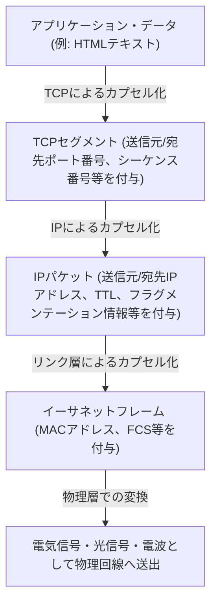

ルーターはIPパケットのヘッダ（IPアドレス）だけを見て転送先を決定し、その中身（TCPヘッダやデータ）には一切関与しない。これにより、IPは下位の物理層（光ファイバー、銅線、Wi-Fi、5G）の物理的特性の違いを完全に隠蔽・吸収し、上位層に対して「地球規模の単一の仮想ネットワーク」を提供することに成功した。

1983年1月1日、ARPANET上のすべてのホストがNCPからTCP/IPへと一斉に切り替わる「フラッグ・デー（Flag Day）」が実施され、ここに真の意味での「The Internet」が誕生したのである。

## 1.4 NSFNETの台頭と自律分散ルーティングの進化

TCP/IPへの移行後、インターネットは軍事・国防の枠を超え、学術研究の巨大なインフラへと変貌を遂げていく。その決定的な推進力となったのが、1980年代後半に米国国立科学財団（NSF）が構築した「NSFNET」である。

NSFNETは全米の5つのスーパーコンピューターセンターを結ぶバックボーンネットワークとして構築され、初期は56kbps、後にT1回線（1.544Mbps）、そしてT3回線（45Mbps）へと物理層の劇的なアップグレードを繰り返した。各大学や地域のネットワーク（リージョナル・ネットワーク）は、このNSFNETのバックボーンに階層的に接続されるようになった。

ネットワークの規模が爆発的に拡大（スケーリング）する中で、新たな技術的課題が浮上した。それが「ルーティングの限界」である。数万に及ぶノードの経路情報をすべての中継ルーターが共有することは、メモリ容量と計算能力の物理的限界を超えてしまう。

この問題を解決するため、インターネットは「自律システム（AS: Autonomous System）」という概念を導入した。インターネットを単一の巨大なネットワークではなく、独立した管理ポリシーを持つネットワーク（AS）の集合体として再定義したのである。

ASの内部（IGP: Interior Gateway Protocol）では、OSPF（Open Shortest Path First）のようなリンクステート型ルーティングプロトコルを用い、ダイクストラ法（Dijkstra's algorithm）によってネットワークの完全なトポロジマップを構築して最短経路を高速に計算する。

一方、ASとASの間（EGP: Exterior Gateway Protocol）では、単なる最短経路ではなく、「どのネットワークを経由して通信を許可するか」というビジネス上・組織上のポリシーを反映させる必要があった。これを実現するために開発されたのが、今日に至るまでインターネットの根幹を支えている「BGP（Border Gateway Protocol）」である。BGPはパスベクトル（Path Vector）型のアルゴリズムを採用し、ルーティングループを完全に防ぎつつ、世界中のISP（インターネットサービスプロバイダ）間で経路情報の交換を可能にした。

NSFNETの構築とBGPの確立により、中央の管理者が存在しなくても、各組織が相互接続（ピアリングやトランジット）を繰り返すことで全体として一つのネットワークが自律的に機能するという、現代の商用インターネットのエコシステムが完成したのである。1995年、NSFNETはその役割を終え、バックボーンの運営は完全に民間のISP群へと移譲された。

## 1.5 WWWの誕生：ハイパーテキストによる知識の解放とパブリックドメイン化

物理層からネットワーク層、トランスポート層に至るインフラストラクチャが地球規模で整備された1980年代末、インターネット上に蓄積される情報の量は劇的に増加していた。しかし、当時のインターネットは、FTP（ファイル転送）、Telnet（遠隔ログイン）、USENET（電子掲示板）といった個別のアプリケーションが乱立しており、情報は各サーバーのディレクトリの奥深くに孤立（サイロ化）していた。目的のデータを探し出すには、対象サーバーのIPアドレスや複雑なUNIXコマンドの知識が不可欠であり、極めて非民主的な状態であった。

この状況を根本から覆し、情報共有のパラダイムシフトを起こしたのが、スイス・ジュネーブにある欧州原子核研究機構（CERN）の計算機科学者、ティム・バーナーズ＝リー（Tim Berners-Lee）である。1989年、彼は「World Wide Web（WWW）」という革新的なシステムを提案した。

彼のアイデアの核心は、1960年代から存在していた「ハイパーテキスト（Hypertext：文書内の単語から別の文書へリンクを張る概念）」と、「インターネット（TCP/IP）」を結合させることであった。ローカルコンピュータ内に閉じていたハイパーテキストのリンク先を、地球の裏側にあるサーバーのドキュメントにまで拡張したのである。

バーナーズ＝リーは、この巨大な情報空間を構築するために、3つの極めて洗練された技術仕様を独力で設計・実装した。

1. **URI (Uniform Resource Identifier):**
   ネットワーク上に存在するあらゆるリソース（テキスト、画像、動画など）の所在を、一意に指定するための普遍的なアドレス体系。
2. **HTTP (Hypertext Transfer Protocol):**
   クライアント（Webブラウザ）とサーバー間で、URIで指定されたリソースを要求・転送するためのアプリケーション層プロトコル。HTTPの最も優れた点は、通信の「状態（State）」を保持しない「ステートレス（Stateless）」な設計を採用したことである。これにより、サーバーは数百万のクライアントからのリクエストを効率的に捌くことが可能となった。
3. **HTML (Hypertext Markup Language):**
   文書の論理構造を記述し、他のリソースへのハイパーリンク（アンカータグ `<a>`）を埋め込むためのマークアップ言語。

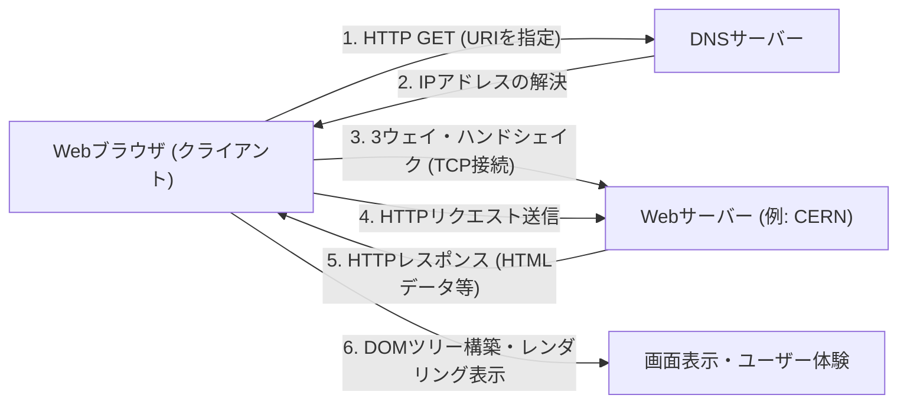

1990年末、NeXTコンピュータ上で世界初のWebサーバー（info.cern.ch）とブラウザが稼働を開始した。初期のWebはテキストベースであったが、その直感的なリンクによる情報探索体験は、研究者たちの間で瞬く間に普及していった。

### パブリックドメインという人類史的決断
しかし、WWWが真の意味で世界を変革し、現代社会のインフラストラクチャとして定着した最大の理由は、その優れた技術的アーキテクチャだけではない。歴史を分けた決定的な出来事は、1993年4月30日に起きた。

CERNは、ティム・バーナーズ＝リーの強い要望を受け入れ、WWWの基盤技術（サーバーソフトウェア、クライアント、コードライブラリ）のすべてを「パブリックドメイン（知的財産権の放棄）」として無償開放するという、驚異的な決断を下したのである。一切の特許権を行使せず、利用料も要求しないという声明文書には、CERNのディレクターの署名が記されていた。

もしこの時、CERNがWWWの技術を特許化し、ソフトウェアライセンスによる収益化を図っていたらどうなっていたか。間違いなく、今日の情報爆発は起きていなかっただろう。WWWは一部の資金力のある企業や大学だけの閉鎖的なシステムに留まり、後に登場するGopherなどの競合プロトコルとの規格争いでインターネットは分断されていたはずだ。

このパブリックドメイン化によって技術的・法的な障壁が完全に消滅したことで、世界中のハッカーや企業がWWWのエコシステムに参入した。米国立スーパーコンピュータ応用研究所（NCSA）のマーク・アンドリーセン（Marc Andreessen）らは、画像をインライン表示できる画期的なグラフィカルブラウザ「NCSA Mosaic」を開発・無償公開し、これが後のNetscape Navigator、ひいてはITバブルの引き金となる。個人が自由にWebサーバーを立ち上げ、世界に向けて情報を発信する「情報の民主化」が達成されたのである。

## 1.6 結言：思想が実装を凌駕する

第1章で見てきたインターネットの歴史は、単なる通信速度の向上史ではない。「中央集権的な制御は脆弱である」という物理的現実に基づくパケット交換の発明、「複雑さは末端が引き受けるべきだ」というEnd-to-End原則、そして「情報はすべての人類に無償で開かれるべきだ」というWWWのパブリック化。

インターネットを今日の姿たらしめているのは、優れたハードウェアでもコードでもなく、これらの強力で一貫した「設計思想（Philosophy）」である。物理層の制約を論理的なカプセル化によって乗り越え、オープンな標準（RFC: Request for Comments）によって多様性を受け入れる。この分散と自由を尊ぶアーキテクチャがあったからこそ、インターネットは未曾有のスケーリングを達成できた。

しかし、人間が理解できる「名前」と、ネットワークが処理する「数字（IPアドレス）」の間には、依然として深い溝が存在していた。次章では、この広大な自律分散ネットワークの住所空間に秩序をもたらし、WWWの爆発的普及を裏から支えた巨大な分散データベースシステム、「IPアドレス空間とDNS（Domain Name System）の深淵」について、その技術的メカニズムを紐解いていく。

# 第2章：物理層とデータリンク層 〜デジタルデータの物理的実体と隣接間通信〜

インターネットという巨大なネットワークの根底には、「0」と「1」の論理的なデジタルデータを、電気信号、光の点滅、あるいは電磁波の波紋といった物理的な現象に変換し、空間や媒質を飛び越えて相手に届けるという途方もない物理現象の連鎖が存在している。我々がスマートフォンで何気なくウェブサイトを開くとき、その裏側では深海の底を這うガラス繊維の中を光子が駆け抜け、見えない電波が複雑な計算を伴って空間を飛び交っている。

本章では、OSI参照モデルにおける第1層（物理層）と第2層（データリンク層）に焦点を当て、我々の生活を支えるネットワークの「最も物理的で泥臭い」部分と、それらを制御する緻密な論理メカニズムをプロフェッショナルの視点から極限まで深掘りしていく。

---

## 2.1 物理層（Physical Layer）：情報の物理的実体化と宇宙の法則

物理層の最大の使命は、コンピュータが扱う離散的なビット列（0と1）を、伝送媒体（銅線、光ファイバー、真空や空気などの空間）の物理的特性に合わせたアナログ的な物理信号に変換（変調）し、伝送路に乗せることである。ここでは、電気工学や量子力学、光学の法則が通信の限界を決定づける。

### シャノン＝ハートレーの定理と情報の限界
物理層を語る上で避けて通れないのが、クロード・シャノンが1948年に発表した情報理論である。「シャノン＝ハートレーの定理」は、ノイズが存在する通信路において、エラーなしで送信できる最大のデータ転送レート（通信路容量）を数学的に証明した。

$$ C = B \log_2\left(1 + \frac{S}{N}\right) $$

ここで、$C$は通信路容量（bps）、$B$は帯域幅（Hz）、$S/N$は信号対雑音比（SNR）である。この美しい方程式は、どれだけ技術が進歩しようとも、与えられた帯域幅とノイズ環境下で送れる情報量には物理的な上限（シャノン限界）があることを示している。現代の光ファイバーやWi-Fiのエンジニアたちは、いかにしてこの限界ギリギリまで通信速度を引き上げるかという終わりのない戦いを続けている。

### 光ファイバーの物理学：光を「閉じ込めて」運ぶ
現代のインターネットの屋台骨は、間違いなく光ファイバー（Optical Fiber）である。銅線による電気通信では表皮効果や電磁干渉（EMI）により長距離の高速通信が困難だが、光ファイバーはこれらを克服した。

光ファイバーは、中心部の「コア」とそれを取り囲む「クラッド」という2層の極めて純度の高い石英ガラスから構成される。コアの屈折率をクラッドよりもわずかに（数パーセント以下）高く設定することで、スネルの法則に基づき、一定の臨界角よりも浅い角度で入射した光がコアとクラッドの境界で全反射（Total Internal Reflection）を繰り返す。これにより、光は外に漏れることなくファイバー内部を進行する。

#### 分散と減衰との戦い：ノーベル賞をもたらしたガラス
かつてのガラスは不純物が多く、数メートルで光が減衰してしまった。1966年、チャールズ・カオ博士（2009年ノーベル物理学賞受賞）は、光ファイバーの減衰の原因がガラス本来の性質ではなく不純物（特に水酸基や遷移金属）にあることを突き止め、純度を高めれば長距離通信が可能になると予言した。1970年代にコーニング社が開発した極低損失の石英ガラスは、波長1550nmの帯域（Cバンド）において0.2dB/kmという驚異的な低損失を実現した。これは、15km進んでも光の強度が半分しか失われないことを意味する。

しかし、光が長距離を移動すると「波長分散（Chromatic Dispersion）」と「モード分散（Modal Dispersion）」が発生し、パルスの波形が崩れてしまう。波長分散は、光の波長（色）によってガラス中の進行速度が異なるために生じる。モード分散は、コアの中を通る光の経路（モード）が複数あるために到達時間にズレが生じる現象である。
これを克服するために、コアの直径を光の波長に近い数マイクロメートルまで細くし、単一の経路しか通さない「シングルモードファイバー（SMF）」が開発され、大陸間通信などの長距離伝送の主流となった。

#### EDFAとWDM：光通信のルネサンス
1990年代、光通信に二つの革命が起きた。一つ目はエルビウム添加光ファイバ増幅器（EDFA：Erbium-Doped Fiber Amplifier）である。それまでは、減衰した光信号を一度電気信号に変換し、増幅してから再び光に戻すという遅くて高コストな再生中継器が必要だった。EDFAは、ファイバーのコアに希土類元素のエルビウムを添加し、外部から励起光を当てることで、信号光が通過する際に誘導放出を起こさせ、光を光のまま直接増幅することを可能にした。

二つ目は、波長分割多重（WDM：Wavelength Division Multiplexing）である。光は異なる波長（色）を同時に同じ空間に放っても混ざり合わずに独立して進むという重ね合わせの原理を利用し、1本のファイバーに複数の波長の信号を同時に束ねて送る技術だ。高密度波長分割多重（DWDM）技術により、現在では1本の光ファイバーに数ミリ間隔の波長で100波以上の信号を乗せ、数十Tbps〜数Pbpsという途方もない帯域幅を単一のファイバーで実現している。

### 海底ケーブル：地球の神経網
大陸間を結ぶデータ通信の99%以上は、人工衛星ではなく海底ケーブルによって運ばれている。クラウドのデータも、海外のウェブサイトの画像も、すべて物理的な海の底を通っているのである。

#### 失敗と挑戦の歴史
海底ケーブルの歴史は、インターネットよりもはるかに古い。最初の大きな挑戦は、1858年の大西洋横断電信ケーブルであった。天然ゴムの一種であるガタパーチャで絶縁された銅線は敷設に成功したものの、ケルヴィン卿（ウィリアム・トムソン）の警告を無視した高電圧による運用が祟り、わずか数週間で絶縁破壊を起こして沈黙した。その後、長い時間をかけて理論と素材が改良され、1988年には初の太平洋横断光海底ケーブル「TAT-8」が稼働し、光の時代が幕を開けた。

#### ケーブルの構造と敷設のメカニズム
水深数千メートルの深海に敷設される現代の海底ケーブルは、極限環境に耐えるよう設計されている。中心にあるわずか数本の光ファイバーの束を守るため、高張力鋼鉄のワイヤー、耐水圧のための銅やアルミニウムのチューブ、ポリエチレンの絶縁体などで何重にも保護されている。深海部ではサメの噛みつきや巨大な水圧に耐えつつも軽量化のために直径数センチ程度の太さだが、浅瀬では漁船の底引き網や船舶の錨、海底地震から守るために分厚い装甲（アーマーリング）が施され、直径10センチ以上の太さになる。

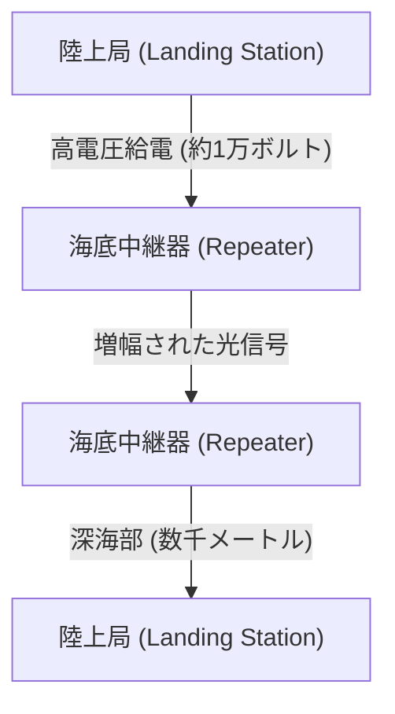

光信号は超低損失のファイバーを使っても数十キロメートルごとに減衰するため、ケーブルの途中には「海底中継器（リピーター）」が等間隔で挟み込まれている。この中継器（前述のEDFAが内蔵されている）を深海で駆動させるための電力は、両端の陸上局からケーブル内の銅管を通じて、数千ボルトから最大1万ボルト以上の高電圧の直流電流として絶え間なく給電されている。
敷設には専用の「ケーブル敷設船」が用いられ、浅瀬では水中ロボット（ROV）が海底に溝を掘り、ケーブルを埋設する。もしケーブルが切断された場合は、修理船が現場に急行し、深海からケーブルの端をグラップル（錨のような爪）で引っかけ、船上に引き上げて熟練の技術者が光ファイバーを数ミクロンの精度で融着接続するという、途方もなくアナログで泥臭い作業が行われているのである。

### 電波通信の物理（Wi-Fiの基盤）
モバイルデバイスやIoTの普及により、空間を飛び交う電磁波（電波）による通信も物理層の主戦場となった。Wi-Fi（IEEE 802.11規格群）は主に2.4GHz帯や5GHz帯、そして近年解放された6GHz帯のISMバンド（産業・科学・医療用バンドで、免許不要で利用可能）を利用する。

#### QAM（直交振幅変調）による極限の情報圧縮
デジタルデータをアナログ波に乗せる「変調」において、Wi-Fiは極めて高度な技術を用いている。それがQAM（Quadrature Amplitude Modulation：直交振幅変調）である。
電波という波には「振幅（波の高さ）」と「位相（波のタイミング・角度）」という2つの物理量がある。QAMは、位相が90度異なる2つの搬送波（I信号とQ信号）を合成し、それぞれの振幅を変化させることで、コンスタレーションマップ上の特定の「点」にビット列を割り当てる。

例えば、16-QAMであれば、1回の波の変化（シンボル）で16個の点（4ビット）を表現できる。最新のWi-Fi 7（802.11be）では、4096-QAMという狂気とも言える高密度変調が採用されている。これは1回の変調で4096個の点（12ビット）を表現する。4096個の点がひしめき合うコンスタレーションマップにおいて、受信側は微小なノイズに埋もれることなく、送信された「点」がどれだったのかを正確に判別しなければならない。これを実現するために、高度な誤り訂正符号や強力な信号処理プロセッサが使われている。

#### OFDMとMIMO：マルチパスとの戦いと空間の活用
電波は直進するだけでなく、壁や家具に反射し、回折し、散乱する。そのため、送信機から放たれた電波は、異なる経路（マルチパス）を通って少しずつズレたタイミングで受信機に到達し、干渉（フェージング）を起こして波形を壊してしまう。
これを逆手に取り、または克服するための技術がOFDMとMIMOである。

**OFDM（直交周波数分割多重）**は、広帯域の高反発な単一信号の代わりに、帯域を多数の非常に狭い周波数（サブキャリア）に細かく分割し、それぞれにゆっくりとした速度でデータを並列送信する技術だ。サブキャリア同士が「直交（数学的に互いに干渉しない）」するように配置されるため、周波数の利用効率が極めて高く、マルチパスによる遅延のズレにも強い。

**MIMO（Multiple-Input and Multiple-Output）**は、複数のアンテナを使って異なるデータを同時に同じ周波数で送信する「空間多重」技術である。マルチパス反射によって空間の異なる場所で波が異なる混ざり方をする性質を利用し、受信側の複数のアンテナで受けた複雑な信号を連立方程式を解くように分離して、通信容量をアンテナの数だけ倍増させる。さらに、電波の位相をアンテナごとに微調整して特定の方向へ電波のビームを集中させる**ビームフォーミング**も、現代のWi-Fiには欠かせない技術となっている。

---

## 2.2 データリンク層（Data Link Layer）：直接つながった機器間の対話と秩序

物理層が単なる「信号の運び屋」であるならば、データリンク層はその生のビット列を意味のある「フレーム」という塊にまとめ、同一ネットワーク（リンク）内の正しい宛先へ確実に届けるためのルールと交通整理を担う層である。

### イーサネット（Ethernet）の歴史：ALOHAからの着想
現在、有線LANの世界的なデファクトスタンダードとなっているのがイーサネット（IEEE 802.3）である。
そのルーツは、ハワイ大学で作られた無線通信ネットワーク「ALOHAnet」に遡る。ALOHAnetは「送りたいデータがあればとにかく送る。衝突して壊れたらランダムな時間待ってから再送する」という極めて無秩序で野心的なプロトコルを採用していた。

1973年、ゼロックスのパロアルト研究所（PARC）にいたボブ・メトカーフは、ALOHAnetのアイデアを同軸ケーブル上の通信に応用し、イーサネットを発明した。初期のイーサネットは「バス型」トポロジーであり、太い1本の同軸ケーブル（イエローケーブル）に多数のコンピュータがヴァンパイアタップと呼ばれる針を突き刺して共有していた。

#### CSMA/CD：秩序ある無政府状態
メディア（ケーブル）を全員で共有するため、複数の機器が同時に電気信号を流すと波形が重なり合ってデータが破壊される「衝突（コリジョン）」が発生する。これを回避し、解決するための自律分散型アルゴリズムが「CSMA/CD（Carrier Sense Multiple Access with Collision Detection）」である。

1. **Carrier Sense（キャリア検知）**: 送信前にケーブル上の電圧を測定し、誰かが通信していないか耳を澄ます。
2. **Multiple Access（多重アクセス）**: 誰も通信していなければ、中央の許可を待たずに誰でも勝手に送信してよい。
3. **Collision Detection（衝突検出）**: 送信中もケーブルの電圧を監視し、自らの送信信号と異なる異常な電圧上昇を検知した場合は「衝突」と判断。直ちにジャム信号を出して他の全員に衝突を知らせ、送信を中止する。
4. **Backoff（バックオフ）**: 衝突後は、各ノードがランダムな時間（指数バックオフアルゴリズムによって計算された時間）だけ待機してから再送信を試みる。

この「ルール違反（衝突）が起きることを前提とし、起きたらランダムに待つ」というシンプルで中央管理者を必要としない仕組みこそが、IBMのトークンリングやATMといった複雑で高価なプロトコルを打ち破り、イーサネットが覇権を握った最大の理由である。

### MACアドレス：ハードウェアの絶対的な身分証明
データリンク層での宛先指定には、MACアドレス（Media Access Control address）が使用される。IPアドレスが「一時的な住所」だとすれば、MACアドレスは「生まれ持ったマイナンバー」である。

MACアドレスは48ビット（6バイト）の長さを持ち、「00:1A:2B:3C:4D:5E」のように2桁の16進数をコロンで区切って表記される。
- **前半24ビット (OUI: Organizationally Unique Identifier)**: IEEEが管理・割り当てを行う、ネットワーク機器のベンダー（Apple、Cisco、Intelなど）を一意に識別する企業コード。
- **後半24ビット (UAA: Universally Administered Address)**: ベンダーが自社の製品に対して連番で割り当てるシリアル番号。

原則として、世界中のすべてのネットワーク機器のネットワークインターフェースカード（NIC）は、ROMに焼付けられた世界に一つだけのMACアドレスを持っている。

### フレーム構造：通信のパッキング技術
データリンク層では、ネットワーク層から降りてきたデータ（IPパケットなど）の前後にヘッダとトレーラを付加し、「フレーム」という単位でカプセル化する。イーサネット（Ethernet II）フレームの構造は芸術的なまでに洗練されている。

1. **プリアンブル (Preamble)**: 7バイトの「10101010」の連続。受信側のNICのクロック同期（タイミング合わせ）を行うための準備運動。
2. **SFD (Start Frame Delimiter)**: 1バイトの「10101011」。プリアンブルの最後が「11」になることで、「ここからが本番のデータだ」と受信側に告げる。
3. **宛先MACアドレス (Destination MAC) / 送信元MACアドレス (Source MAC)**: 各6バイト。誰から誰への通信か。宛先が「FF:FF:FF:FF:FF:FF」の場合は、全員に届くブロードキャストフレームとなる。
4. **タイプ (EtherType)**: 2バイト。ペイロードに入っているデータが何か（IPv4なら0x0800、IPv6なら0x86DD、ARPなら0x0806）を示す。
5. **ペイロード (Data/Payload)**: 上位層から預かった実際のデータ。サイズは46バイトから最大1500バイト（MTU：Maximum Transmission Unit）。
6. **FCS (Frame Check Sequence)**: 4バイトのトレーラ。フレーム全体（宛先MACからペイロードまで）からCRC-32（巡回冗長検査）という多項式を用いて計算されたハッシュ値。

受信側のNICは、フレームを受信しながらハードウェアレベルで高速にCRCを計算する。もし末尾に付いているFCSと自身の計算結果が1ビットでも異なっていれば、通信途中のノイズや衝突でデータが破損したとみなし、そのフレームを**何の通知もせずに容赦なく破棄**する。データリンク層は「エラーを検知して捨てる」ことまでは確実に行うが、「壊れていたから再送してくれ」と要求する機能は持たない。再送制御という重い責任は、より上位のTCPプロトコルなどに委ねるという役割分担が、インターネットのスケーラビリティを支えている。

### スイッチングハブの誕生と全二重通信への進化
CSMA/CDによる共有バス型イーサネットは素晴らしい仕組みだったが、ネットワークに接続される機器（ホスト）が増えるにつれて衝突が頻発し、実効スループットが激減するという致命的な弱点があった。
これを根本から解決したのが、1990年代に普及した「レイヤ2スイッチ（スイッチングハブ）」である。

ハブ（リピータハブ）が受信した電気信号をすべてのポートに無条件にばらまく物理層の機器であるのに対し、スイッチはデータリンク層を理解する賢い頭脳を持っている。
スイッチは、内部にメモリ（CAMテーブル）を用いた「MACアドレステーブル」を持っている。各ポートに接続されている機器の送信元MACアドレスを学習し、自動的にポートとMACアドレスの対応表を作り上げる。
そして、フレームが入ってくると、スイッチは宛先MACアドレスをテーブルと照らし合わせ、該当する機器がつながっているポートに「だけ」フレームを流す（フォワーディング）。

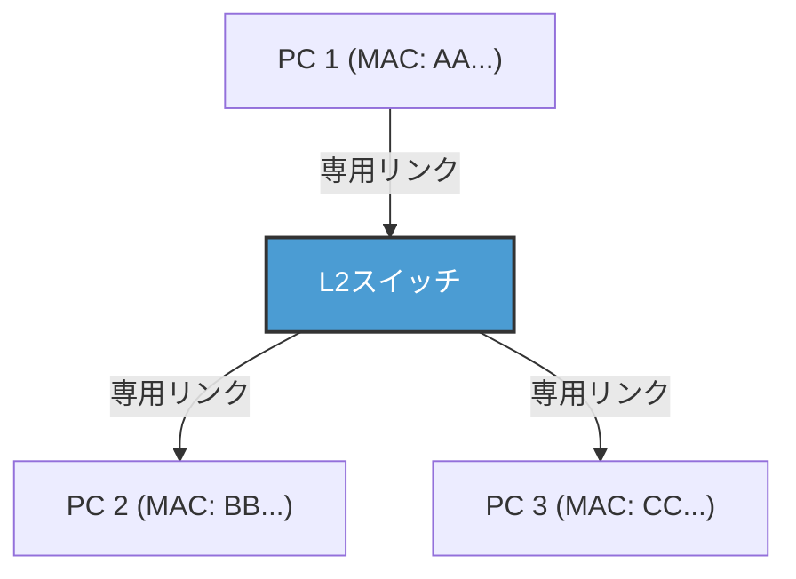

スイッチの導入により、各ノードとスイッチ間の配線は論理的にも物理的にも独立した（スター型トポロジー）。これにより、通信経路が分離されたため衝突（コリジョン）が原理的に発生しなくなった。結果として、送信用の線と受信用の線を同時に使う「全二重通信（Full-Duplex）」が可能となったのである。
現代のイーサネットにおいて、CSMA/CDアルゴリズムはもはや使われておらず、純粋なポイントツーポイントの全二重通信へと進化を遂げた。さらに、IEEE 802.1QによるVLAN（Virtual LAN）技術により、物理的な配線に縛られずに論理的なネットワークを柔軟に分割・統合できるようになり、エンタープライズや巨大データセンターのインフラを支える絶対的な基盤技術として君臨し続けている。

### Wi-Fiのデータリンク層：見えない電波空間の交通整理
有線のイーサネットが衝突のない全二重通信へと進化した一方で、無線のWi-Fiは、かつての共有バス型イーサネットと同じ「全員が同じ空間（空気）という単一のメディアを共有する」という困難な課題に直面している。

無線通信では、送信中の自分の電波が強すぎるため、他人の微弱な電波を同時に受信して衝突を「検出（CD）」することが物理的に不可能である。また、「隠れ端末問題（Hidden Node Problem）」——例えば、アクセスポイントを挟んで両側にいる端末AとCは、互いの電波は届かないが、同時に送信するとアクセスポイント上で電波が衝突してしまう——という無線特有のリスクがある。

そこでWi-Fiのデータリンク層プロトコル（MAC層）では、「CSMA/CA（Carrier Sense Multiple Access with Collision Avoidance：衝突回避）」が採用されている。
CSMA/CAでは、送信前に一定時間（DIFS）空間の電波状況を傍受し、さらにランダムなバックオフ時間を待ってから送信を開始する。最も重要な違いは、有線にはなかった**ACK（Acknowledge：確認応答）**の仕組みである。Wi-Fiでは、データを受信した側は、正常に受け取れたことを示すACKフレームを即座（SIFSという極めて短い待ち時間の後）に送り返す。送信側は、このACKを受け取って初めて通信が成功したと判断する。もしACKが返ってこなければ、衝突や干渉でデータが壊れたと判断し、バックオフ時間を倍に増やして再送を試みる。

さらに隠れ端末問題を解決するため、「RTS/CTSハンドシェイク」という仕組みも存在する。大きなデータを送る前に、送信側がRTS（Request to Send：送信リクエスト）という短い制御フレームを送り、受信側（アクセスポイントなど）がCTS（Clear to Send：送信クリア）を返す。このCTSには「これから○○マイクロ秒間通信するから、周囲の端末は黙っていてくれ」という予約時間（NAV：Network Allocation Vector）の情報が含まれており、これを受け取った周囲の端末は通信を自粛する。このように、Wi-Fiのデータリンク層は、見えない電波空間における見事な交通整理を行っているのである。

---

## 結び

光子としてガラスの中を駆け抜け、深海の水圧に耐え、位相と振幅を変化させながら空間を飛び交う物理現象の世界。そして、そのノイジーで不確実な物理現象の上に、プリアンブルによる同期、MACアドレスによる個体識別、CRCによる厳密なエラー検出、そしてスイッチングやCSMA/CAによる洗練されたトラフィック制御を敷き詰めることで、初めて「隣の機器へ意味のあるデータの塊（フレーム）をエラーなく届ける」ことが可能になる。これが第1層と第2層が成し遂げている奇跡である。

しかし、これだけでは世界中をつなぐインターネットにはなり得ない。MACアドレスによる通信は、あくまで同じスイッチやアクセスポイントに繋がった、あるいはルーターに遮られるまでの「同じネットワーク（ブロードキャストドメイン）」という狭い村の中でしか通用しないからだ。

次章「第3章：ネットワーク層とIP」では、この無数のローカルな村同士を繋ぎ合わせ、地球の裏側にある未知のネットワークへパケットをバケツリレーのように届けるための壮大な経路探索の仕組み、すなわちIP（Internet Protocol）とルーティングの真髄に迫る。

# 第3章：ネットワーク層とルーティングの仕組み —— 大海原を渡るパケットの航海図

私たちが日常的に利用しているインターネットの根幹を成すのが、OSI参照モデルにおける第3層、すなわち「ネットワーク層」です。物理的なケーブルや電波による直接的な通信（データリンク層）を超え、数千キロ離れたサーバーと地球規模で通信できる背景には、無数に張り巡らされたルーターと、それらが自律的に情報を交換し合う壮大な経路制御（ルーティング）のメカニズムが存在します。

本章では、IP（Internet Protocol）の構造から、IPv4の限界とIPv6のアーキテクチャ、そして世界中の自律システム（AS）を結びつけるBGP（Border Gateway Protocol）の深淵まで、パケットが宛先へと到達するための「航海術」について、技術的・歴史的・物理的な視点から極限まで詳述します。

## 3.1 ネットワーク層のパラダイム：エンド・ツー・エンドの原則

インターネットの設計思想における最大のブレイクスルーは、「ネットワークの中間ノード（ルーター）は単純なパケット転送のみに専念し、複雑な処理（エラー訂正や順序保証）は終端（エンドホスト）で行う」という**エンド・ツー・エンド（End-to-End）の原則**にあります。

従来の電話網（回線交換方式）では、通信の開始から終了まで物理的な回線を占有し、ネットワーク全体で状態（ステート）を管理していました。これに対し、インターネット（パケット交換方式）のネットワーク層は「コネクションレス」であり、状態を持ちません。各パケットは独立した「手紙」として扱われ、ルーターはそれを受け取り、宛先を見て最適な次の中継地点（ネクストホップ）へ送り出す（フォワーディング）という単純作業を繰り返します。この「ダム・ネットワーク（Dumb Network）」と「スマート・ターミナル（Smart Terminal）」の組み合わせこそが、インターネットが爆発的にスケールし、多様なアプリケーションを受容できた最大の理由です。

## 3.2 インターネットの住所：IPアドレスの進化と枯渇の歴史

ネットワーク上のすべての機器には、一意の識別子であるIPアドレスが付与されます。現在、インターネットは移行期にあり、二つの世代のIPプロトコルが混在しています。

### IPv4：32ビットの空間と枯渇への抗い

1981年にRFC 791で定義されたIPv4は、32ビット（約43億個）の空間を持ちます。設計当初、43億という数字は途方もなく大きく感じられましたが、インターネットの爆発的な普及により、1990年代には早くも枯渇の危機が叫ばれ始めました。

この危機を乗り越えるために生み出されたのが、**CIDR（Classless Inter-Domain Routing）**と**NAT（Network Address Translation）**です。
初期のIPアドレス割り当ては、クラスA（/8）、クラスB（/16）、クラスC（/24）という大雑把な「クラスフル」方式で行われており、深刻なアドレスの浪費を招いていました。CIDRはこれを可変長サブネットマスク（VLSM）に置き換え、必要な分だけアドレスを割り当てる「クラスレス」なルーティングを実現しました。
さらに、NATの登場により、プライベートIPv4アドレス空間と単一のグローバルIPv4アドレスを紐づけることで、一つのアドレスを数千台のデバイスで共有することが可能になりました。しかし、NATはエンド・ツー・エンドの原則を破壊し、P2P通信やリアルタイム通信において複雑なNAT越え（STUN/TURN/ICEなど）の技術を要求する結果となりました。

### IPv6：128ビットの無限空間と次世代のヘッダ構造

アドレス枯渇の根本的解決策として1998年にRFC 2460で策定されたのが**IPv6**です。IPv6は128ビットのアドレス空間を持ち、$2^{128}$（約340澗）個という、地球上のすべての砂粒にアドレスを割り当てても余るほどの広大な空間を提供します。

IPv6の革新性はアドレスの長さだけではありません。ヘッダ構造の劇的な簡素化が行われました。IPv4ヘッダにあった可変長オプションやヘッダチェックサムは廃止され、基本ヘッダは40バイトに固定されました。これにより、ハードウェア（ASICやTCAM）でのパケット処理（ルーティング）が高速化されています。また、フラグメンテーション（パケットの分割）は中間ルーターでは行われず、送信元ホストのみが行う仕様に変更され、ルーターの負荷が大きく軽減されました。

## 3.3 ルーティングの二面性：コントロールプレーンとデータプレーン

ルーターの内部は、大きく二つの「プレーン（平面）」に分かれています。

1. **コントロールプレーン（制御平面）**
   ルーター同士がルーティングプロトコル（OSPFやBGPなど）を用いて通信し合い、ネットワークのトポロジー（接続形態）を学習し、最適な経路を計算する頭脳部分です。計算結果はRIB（Routing Information Base）というデータベースに格納されます。
2. **データプレーン（転送平面）**
   実際にパケットを受信し、宛先IPアドレスを元に次にパケットを送り出すインターフェースを決定し、転送する筋肉部分です。RIBから生成されたFIB（Forwarding Information Base）と呼ばれる転送に特化したテーブルを用い、TCAM（Ternary Content-Addressable Memory）などの特殊なメモリを使用して、ナノ秒単位のハードウェア・ワイヤースピードでパケットを転送します。

## 3.4 ネットワークの内部統治：IGPと自律システム（AS）

インターネットは単一の巨大なネットワークではなく、ISP（インターネットサービスプロバイダ）、企業、大学などがそれぞれ管理する独立したネットワークの集合体です。この独立した管理領域を**AS（Autonomous System：自律システム）**と呼びます。現在、世界中には約10万以上のASが存在します。

ASの内部（企業内やISPのバックボーン内）のルーティングには、**IGP（Interior Gateway Protocol）**が使用されます。代表的なIGPには以下の二つがあります。

- **OSPF（Open Shortest Path First） / IS-IS**
  これらは「リンクステート型」のルーティングプロトコルです。ルーターは自身の周囲の接続状態（リンクの帯域幅や状態）をネットワーク全体にフラッディングし、各ルーターがネットワーク全体の完全な地図（トポロジーデータベース）を構築します。その地図上で、ダイクストラ法（最短経路アルゴリズム）を実行し、目的地までの「コスト」が最小となる経路を計算します。これは、カーナビが渋滞情報を加味して最短ルートを計算するのと物理的・数学的に同じアプローチです。

## 3.5 BGP：インターネットを織りなす「外交」プロトコル

ASの内部がOSPF等で統治されている一方、ASとASを結びつけ、グローバルなインターネットを形成するのが**EGP（Exterior Gateway Protocol）**の唯一のデファクトスタンダードである**BGP（Border Gateway Protocol）**です。BGPは、技術的な最短距離だけでなく、「ビジネス関係」や「国家間のポリシー」を反映して経路を決定する、極めて特異なプロトコルです。

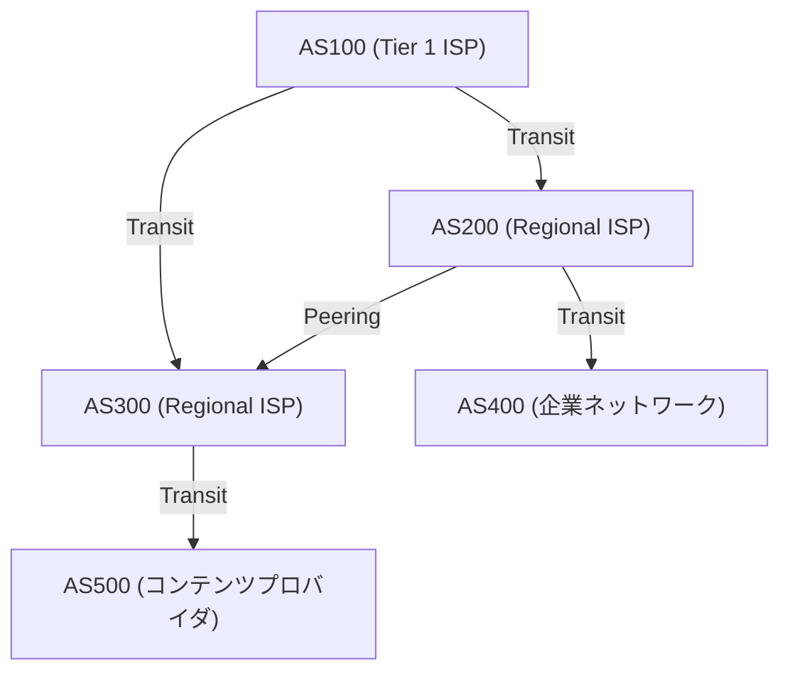

### ピアリングとトランジット：インターネットの経済学

BGPによるAS間の接続には、大きく分けて二つのビジネスモデルが存在します。

1. **トランジット（Transit）**
   小規模なISPや企業が、巨大なISPに対して通信料金を支払い、インターネットのすべての場所への到達性（フルルート）を提供してもらう関係です。「顧客」と「プロバイダ」の主従関係にあたります。
2. **ピアリング（Peering）**
   ISP同士、あるいはISPとコンテンツプロバイダ（GoogleやNetflixなど）が、IX（インターネットエクスチェンジ）などを介して互いのネットワークを直接接続する関係です。通常は無償（セツルメントフリー）で行われ、トラフィックのショートカットとコスト削減が目的です。

### パスベクターとBGPの経路選択アルゴリズム

BGPは「パスベクター型」プロトコルです。特定のIPネットワークに到達するまでに、どのASを経由してきたか（AS_PATH）を属性として保持します。例えば、経路情報に `AS_PATH: [200, 100, 500]` とあれば、パケットはその順序でASを通過していきます。これにより、ルーティングループを確実に防止しています。

BGPルーターは、同じ宛先に対して複数の経路を受信した場合、複雑な優先順位（Local Preference, AS_PATHの長さ, MED, eBGP/iBGPの別など）に基づいてベストパスを一つだけ選択します。特に**Local Preference（ローカルプリファレンス）**属性は強力で、「技術的には遠回りでも、ピアリング回線を通した方がトランジット費用がかからないから、そちらを優先する」といったビジネス上のポリシーをルーターに強制することができます。

### BGPハイジャックと経路の脆弱性

BGPは元々「性善説」に基づいて設計されました。「他人が宣言した経路情報は正しい」と信じ込むため、悪意のある、あるいは設定ミスを犯したASが「私がGoogleのネットワーク（8.8.8.8/32）への最適な経路を持っています」と誤ったBGPアップデートを送信すると、世界中のトラフィックがそのASに吸い込まれてしまう**BGPハイジャック**が発生します。
歴史上、パキスタン政府によるYouTube遮断の余波で世界中のYouTubeがダウンした事件（2008年）など、BGPの脆弱性を突いた大規模障害は枚挙にいとまがありません。現在ではRPKI（Resource Public Key Infrastructure）など、暗号技術を用いた経路情報の検証メカニズムの導入が進められています。

## 3.6 物理的制約とルーターの戦い：レイテンシとバッファブロート

ネットワーク層のルーティングは、常に物理学の制約との戦いです。
光ファイバーの中を光が進む速度は真空中の光速の約67%（約20万km/秒）であり、日本からアメリカ西海岸まで往復（RTT）で約100〜120ミリ秒の物理的な遅延（伝搬遅延）が避けられません。

これに加え、各ルーターでの処理遅延、そして**キューイング遅延**が存在します。ネットワークの輻輳時、ルーターはパケットを一時的にメモリ（バッファ）に蓄積します。近年のルーターは大容量のメモリを搭載しているため、パケットをドロップせずに長引く輻輳を吸収し続けてしまう現象が起きます。これが**バッファブロート（Bufferbloat）**です。バッファに大量のパケットが滞留し続けることで、TCPなどの上位レイヤーの輻輳制御が正常に働かず、結果として極端な遅延（数千ミリ秒）を引き起こします。これを解決するために、AQM（Active Queue Management）やFQ-CoDelといった高度なキュー管理アルゴリズムが現代のルーターやOSには実装されています。

## まとめ

第3層・ネットワーク層は、単なるデータの運び屋ではありません。そこには、IPv4からIPv6への歴史的転換、TCAMを用いたナノ秒のハードウェア処理、OSPFによる数学的な最短経路探索、そしてBGPによる経済的・政治的意図を孕んだ自律分散的な経路制御が複雑に絡み合っています。
一つのIPパケットがあなたのスマートフォンから地球の裏側のサーバーへと到達するまでには、無数のルーターが自らの持つ地図（ルーティングテーブル）を瞬時に参照し、リレーのバトンのようにパケットを渡し続けるという、人類が構築した最も巨大で複雑なシステムの営みがあるのです。

次章では、このネットワーク層の上に構築され、パケットの到達保証や輻輳制御を担う「トランスポート層（TCP/UDP）」の仕組みについて解説します。

# 第4章：トランスポート層の確実性と速度 —— 情報伝達を支える究極のジレンマ

## 1. 序論：エンドツーエンド原則とトランスポート層の使命

これまでの章で見てきたネットワーク層（IP）の主たる任務は、広大なインターネットというネットワークの海を越えて、パケットを「目的のコンピュータ（ホストのネットワークインターフェース）」まで物理的かつ論理的に送り届けることでした。しかし、パケットが目的のホストに到達しただけでは、通信は完結しません。現代のコンピュータシステムは、OS上で同時に多数のアプリケーションプロセス（Webブラウザ、メールクライアント、動画ストリーミングアプリ、バックグラウンドの同期プロセス、APIサービスなど）をマルチタスクで並行実行しています。

IP層から無秩序に次々と上がってくるパケット群の山から、どのパケットがどのアプリケーションに属するものなのかを識別し、意味のあるデータストリームとして再構築し、あるいは欠損があれば補完する。このエンドポイントにおける最終的なデータ管理の全権を担うのが「トランスポート層（Transport Layer）」です。

インターネットの設計思想の根幹には「エンドツーエンド原則（End-to-End Principle）」という、非常に美しく、かつ強力なアーキテクチャ上の決定が存在します。これは1981年にジェローム・サルツァーらによって提唱された概念であり、「ネットワークの中間ノード（ルーターやスイッチ）は可能な限り単純なパケット転送（ダム・ネットワーク）に特化し、エラー回復や順序制御、暗号化といった複雑な処理は、通信の末端にあるホスト（スマート・エンドポイント）に委ねるべきである」とする原則です。もしネットワークの中間機器に複雑な状態管理やエラー訂正機能を持たせていたら、インターネットは現在のような世界規模の爆発的な拡張性を獲得することは決してできなかったでしょう。

トランスポート層は常に、物理学的な制約と情報理論の狭間で一つの根源的なジレンマに直面しています。それは「確実性（Reliability）」と「速度（Speed / Low Latency）」のトレードオフです。情報を一つも欠落させずに届けるためには確認と再送のオーバーヘッドが必要となり、それは光速という物理的限界を伴う遅延を引き起こします。一方、遅延を最小化しようとすれば、情報の完全性を一部犠牲にせざるを得ません。この物理法則に根ざしたジレンマをどのように解決し、アプリケーションにどのような抽象化を提供するかに応じて、TCP、UDP、そして現代のQUICという異なるプロトコルが設計され、進化を遂げてきました。

## 2. TCP（Transmission Control Protocol）：確実性を担保する堅牢な機構

TCPは、インターネットがまだARPANETと呼ばれていた商用化以前の1970年代に、ヴィントン・サーフ（Vinton Cerf）とロバート・カーン（Robert Kahn）によって基礎が築かれました。その設計哲学は極めて明確です。「いかなる劣悪なネットワーク環境下でも、パケットロスが頻発する不安定な回線であっても、データが欠損なく、正しい順序で、重複なく相手のアプリケーションに届くことを保証する」というものです。アプリケーション開発者はTCPを使う限り、背後にあるネットワークの複雑さやパケットの紛失を一切気にする必要がなく、ただ「連続したバイトストリーム」としてデータを読み書きすればよいという、強力な抽象化を提供しました。

### ポート番号によるマルチプレクシング（多重化）
IPアドレスが「地球上のどの建物か」を示す住所だとすれば、トランスポート層の「ポート番号」は「その建物のどの部屋（どのプロセス）宛てか」を示す論理的な窓口に相当します。ポート番号は16ビットの符号なし整数で表現され、0から65535までの値をとります。
これにより、単一のIPアドレスと単一の物理的なネットワークインターフェースの上で、数千から数万もの異なる通信を同時に多重化（マルチプレクス）することが可能になります。例えば、HTTPは80番、HTTPSは443番、SSHは22番といったように、主要なサービスには「ウェルノウンポート（Well-Known Ports）」としてあらかじめ番号が割り当てられています。

### 3ウェイハンドシェイク：信頼の確立と物理的遅延
TCPは通信を始める前に、必ず送信側と受信側の間で論理的な「コネクション（接続）」を確立するための儀式を行います。これが「3ウェイハンドシェイク（3-Way Handshake）」です。これは単に通信の意思確認を行うだけでなく、これから始まる膨大なデータのやり取りに向けた状態空間の同期（Synchronization）という極めて重要な意味を持ちます。

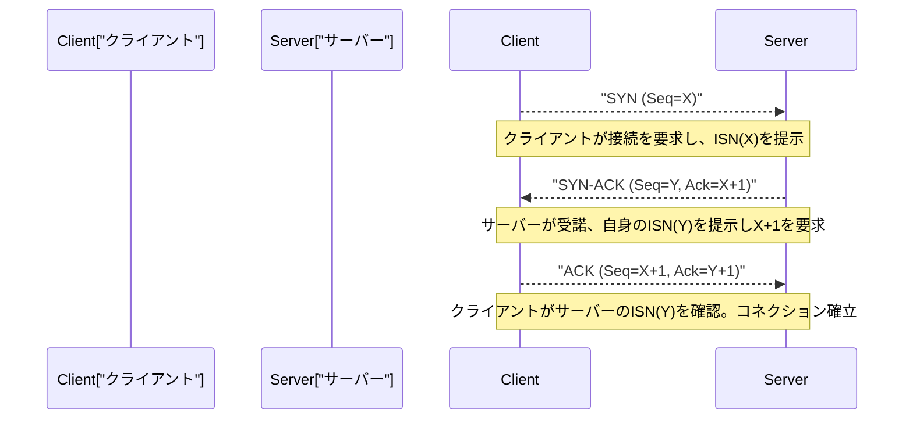

1. **SYN (Synchronize):** クライアントはサーバーに対し、同期要求パケット（SYNフラグを立てたTCPセグメント）を送信します。この際、ランダムに生成された32ビットの「初期シーケンス番号（ISN: Initial Sequence Number, ここではXとする）」を提示します。ISNをゼロや固定値から始めないのには理由があります。過去に確立され、すでに切断された同一IP・ポート間の通信における「ネットワーク上を迷子になって遅延到達した古いパケット（ゴーストパケット）」を新しい通信のパケットと誤認するのを防ぐため、そして攻撃者がシーケンス番号を推測して偽のデータを挿入するTCPシーケンス予測攻撃（IPスプーフィング）を防ぐための暗号論的な意味合いがあります。
2. **SYN-ACK:** サーバーは接続要求を受け入れると、クライアントのISNに1を加えた値（X+1）を「確認応答番号（Acknowledgment Number）」として返しつつ、サーバー自身のランダムな初期シーケンス番号（Y）を付与したSYN-ACKパケットを返送します。
3. **ACK (Acknowledgment):** クライアントはサーバーのISNを正しく受け取った証として、Y+1を確認応答番号としたACKパケットを送信します。

この3回のパケットのやり取りが完了した時点で、双方向の通信状態がメモリ上に確保され、データ転送の準備が整います。ただし、この厳密なプロセスには通信インフラの物理的限界が重くのしかかります。それは「光の速度」です。
真空中の光の速度は約30万km/秒ですが、インターネットの主たるバックボーンである光ファイバーのコア（石英ガラス）の屈折率により、光信号の伝搬速度はその約3分の2（約20万km/秒）に低下します。さらに、途中のルーターでのルーティング処理やスイッチングによるキューイング遅延が加わります。その結果、例えば東京とニューヨーク間（直線距離約11,000km、実際のケーブル長はそれ以上）での1往復の時間（1 RTT: Round Trip Time）は物理的にどうしても150〜200ミリ秒を要します。TCPの3ウェイハンドシェイクは最低でもこの1 RTTを消費するため、どれほど帯域幅（バンド幅）を広げても、接続確立時のレイテンシ（遅延）は光速という宇宙の絶対的な法則によって制約されるのです。

### スライディングウィンドウと順序制御・チェックサム
データ転送フェーズに入ると、TCPはアプリケーションから受け取ったバイトストリームを適切なサイズ（MSS: Maximum Segment Size、通常はIPのMTUからヘッダサイズを引いた1460バイト程度）のセグメントに分割して送信します。各セグメントにはデータバイト数に応じたシーケンス番号が振られ、受信側はこれをもとにパケットの順序が入れ替わって到着（アウトオブオーダー）した場合でも、元のデータを正しい順序に並べ直します。

また、TCPヘッダーには16ビットの「チェックサム（Checksum）」が含まれており、データが伝送経路上の電気的ノイズやルーターのメモリエラー等でビット反転（破損）を起こしていないかを1の補数和演算を用いて厳密に検証します。

途中でパケットが欠損（パケットロス）したり、破損して破棄された場合、受信側は期待するシーケンス番号のACKを返し続ける（重複ACK）か、何も返しません。送信側は一定時間（RTO: Retransmission Timeout）ACKが返ってこない、あるいは重複ACKを検知した場合に、そのパケットを「再送（Retransmit）」します。

この仕組みにおいて通信速度を劇的に引き上げているのが「スライディングウィンドウ（Sliding Window）」という概念です。「1つパケットを送って、そのACKを受け取るまで次のパケットを送らない（Stop-and-Wait）」方式では、前述の高レイテンシ環境（RTTが大きい環境）においてスループットが絶望的なまでに低下してしまいます。
スライディングウィンドウ方式では、送信側と受信側が互いのバッファ容量を考慮して「ウィンドウサイズ（一度に送信可能な未確認データの最大バイト数）」を動的に合意します。送信側は、受信側からのACKを待つことなく、このウィンドウサイズの範囲内で次々とパケットを連続してネットワークに送り出すことができます。そしてACKを受け取るごとに、この送信可能枠（ウィンドウ）が前方にスライドしていきます。これにより、太い回線かつ高遅延なネットワーク（BDP: Bandwidth-Delay Product、帯域遅延積が大きい環境）における「パイプをデータで満たし続ける」という帯域の最大活用メカニズムを実現しています。

### 輻輳制御（Congestion Control）：ネットワーク崩壊を防ぐ数学的調和
TCPの真の傑作であり、インターネットの歴史において最も重要な技術的ブレイクスルーの一つと言えるのが「輻輳制御（Congestion Control）」です。

1986年、初期のインターネット（NSFNET）は通信量の増大により「輻輳崩壊（Congestion Collapse）」と呼ばれる致命的なシステム障害に直面しました。ネットワークの処理能力を超過するデータが流入した結果、ルーターのキュー（バッファメモリ）が溢れて大量のパケットが破棄されました。パケットロスを検知したTCPエンドポイントは、データが届かなかったと判断して一斉にパケットの「再送」を行います。これによりネットワークにさらに多くのデータが注ぎ込まれ、ますますルーターがパンクし、実効スループットが従来の数千分の一にまで急落するという破滅的な悪循環に陥ったのです。

このネットワークの死を防ぐため、1988年にヴァン・ジェイコブソン（Van Jacobson）らはTCPに高度な動的制御アルゴリズムを導入しました。その中核をなすのが「AIMD（Additive Increase Multiplicative Decrease：加法的増加・乗法的減少）」の原則に基づいた輻輳ウィンドウ（cwnd: Congestion Window）の制御です。

1. **スロースタート (Slow Start):** 通信開始直後は、ネットワークの空き容量が全く不明です。そのため、送信ウィンドウサイズをごく小さな値（歴史的には1 MSS、現代では10 MSS程度）から始め、ACKを1つ受け取るごとにウィンドウサイズを1 MSSずつ増やします。これは結果として「1RTTごとにウィンドウサイズが2倍になる」という指数関数的な増加をもたらします。「スロー」という名前とは裏腹に、限界帯域を極めて攻撃的かつ短時間で探索するフェーズです。
2. **輻輳回避 (Congestion Avoidance):** ウィンドウサイズがあらかじめ設定された閾値（ssthresh: Slow Start Threshold）に達すると、指数関数的な増加を止め、線形増加（1 RTTあたり1 MSSの加算）に切り替えます。より慎重にネットワークの限界容量（パイプの太さ）を探るフェーズです。
3. **パケットロスの検知と乗法的減少:** パケットロス（タイムアウトの発生、または受信側からの重複ACKを3回連続で受信）を、TCPは単なる転送エラーではなく「ネットワーク経路上で渋滞（輻輳）が発生し、ルーターのバッファからパケットが溢れ落ちたサイン」であると解釈します。この瞬間、TCPは即座に自己制御を働かせ、送信ウィンドウサイズを一気に半分（またはスロースタートの初期値）に激減させます。

この「帯域を少しずつ分け合い（加法的増加）、問題が起きたら一気に譲り合う（乗法的減少）」という数学的かつ利他主義的な分散アルゴリズムにより、インターネット上の何億、何十億という独立したTCPコネクションは、中央集権的なトラフィック管理者が存在しないにもかかわらず、「帯域幅の公平な分割」と「ネットワーク全体の安定稼働」という奇跡的な調和（ホメオスタシス）を保っているのです。

近年では、ルーターのバッファメモリの大容量化が裏目に出て、輻輳によるパケット破棄が発生するまでの間、長大化するキューの中にパケットが滞留し続け、遅延（Ping値）が数百ミリ秒〜数秒にまで跳ね上がる「バッファブロート（Bufferbloat）」という新たな物理的現象が問題化しました。これに対処するため、パケットロスではなく「RTT（遅延時間）の増加」を輻輳のサインとして検知し、バッファを溢れさせる前に能動的に送信速度を絞るBBR（Bottleneck Bandwidth and Round-trip propagation time）などの最新の輻輳制御アルゴリズムがGoogleらによって開発され、現代のTCPの標準になりつつあります。

## 3. UDP（User Datagram Protocol）：速度のための削ぎ落とし

TCPが複雑な状態遷移と高度なアルゴリズムによってデータの完全な確実性を保証する「過保護な管理者」であるとすれば、同じトランスポート層に属するUDPは、プロトコルとしての役割を極限まで削ぎ落とした「ミニマリストな運び屋」です。ジョン・ポステル（Jon Postel）によって1980年に設計されたUDPは、トランスポート層としての最低限の機能しか持ちません。

UDPのヘッダーはわずか8バイトしかありません（TCPヘッダーは通常20バイト、オプションを含めると最大60バイトに及びます）。そこに含まれるのは、「送信元ポート番号」「宛先ポート番号」「データ長」そしてデータの破損を検知するための簡易な「チェックサム」のみです。

3ウェイハンドシェイクによる事前の接続確立も、シーケンス番号による順序保証も、スライディングウィンドウによるフロー制御も、再送処理も、ネットワークを保護するための輻輳制御も、UDPには一切実装されていません。アプリケーションから渡されたデータをそのままIPデータグラムに包んでネットワーク層に投げ込み、「Fire and Forget（撃ちっ放し）」で送信するだけです。相手に届いたかどうかすら関知しません。

しかし、この無責任とも言える構造的単純さこそが、UDPの最大の武器であり、特定のユースケースにおいてTCPを凌駕する理由なのです。

### UDPの真価：レイテンシ至上主義とリアルタイム通信
物理的なレイテンシ（遅延）を極限まで削る必要があるリアルタイム通信において、TCPの「確実性を保証するための再送制御」は、かえって致命的な問題を引き起こします。

例えば、FPS（ファーストパーソン・シューター）などのオンラインゲーム、音声通話（VoIP）、あるいはビデオ会議システム（ZoomやWebRTCなど）を想像してください。これらのアプリケーションでは、1秒間に数十回〜数百回の頻度で最新の位置情報や音声サンプルのパケットを送信します。
もしTCPを使用しており、100ミリ秒前に送信された音声パケットが途中のルーターでロスしたとします。TCPはそのロスを検知してパケットを再送し、受信側で正しい順序で再生しようと試みます。しかし、会話やゲームがリアルタイムで進行している環境において、「数百ミリ秒遅れて届いた過去のデータ」にはもはや何の価値もありません。
それどころか、TCPは失われたパケットが再送されて順番が揃うまで、すでに到着している後続の新しいパケットの処理（アプリケーションへの引き渡し）を止めてバッファリングしてしまいます。これを「Head-of-Line（HoL）ブロッキング」と呼びます。音声が途切れ途切れになったり、ゲームの画面が数秒間フリーズして一気に早送りになる現象の多くは、このTCPの再送待ちによるHoLブロッキングが原因です。

UDPはこのような場合、欠損した過去のパケットを潔く諦め、今到着している最新のパケットをすぐにアプリケーションで処理することを可能にします。リアルタイム通信においては、「すべてのデータが揃うこと」よりも「多少のノイズやコマ落ちがあっても、常に最新の状態を最短の遅延で描写し続けること」のほうが、人間の感覚器にとって遥かに自然で快適なユーザー体験となるのです。

また、DNS（Domain Name System）の名前解決やNTP（Network Time Protocol）による時刻同期のように、「1つの小さなリクエスト・パケット」に対して「1つのレスポンス・パケット」で完結するような単純なトランザクション通信にも、ハンドシェイクのオーバーヘッドが全くないUDPが最適です。

## 4. QUIC：インターネット通信のパラダイムシフトと次世代のプロトコル

インターネットの黎明期から数十年にわたり、我々のネットワークアーキテクチャは「確実なストリーム転送が欲しいならTCP、速度とリアルタイム性が欲しいならUDP」という固定化された二元論に囚われていました。しかし、現代のWebの劇的な進化（特にモバイル通信の普及と、大量のリソースを並行してロードするHTTP/2の時代）において、TCPの根本的な設計そのものが足枷となる限界が露呈し始めました。

その最大の課題が、UDPの項でも触れたTCP特有の「Head-of-Line (HoL) ブロッキング」と、接続確立に伴う「過剰なレイテンシ」です。
TCPはすべての通信を「単一の直列なバイトストリーム」として管理します。最新のWebサイトを表示するために、HTML、CSS、JavaScript、何十枚もの画像などの複数ファイルをHTTP/2上で同時に（マルチプレックスして）要求したとします。しかし基盤となるTCPレベルでは1本のストリームであるため、仮に「画像A」のパケットが1つだけロスした場合、TCP層はそのパケットの再送が完了するまで、関係のないはずの「スクプレプトB」や「画像C」のパケットの引き渡しまでもOSのカーネルレベルでブロックしてしまいます。
さらに、現代のWebは暗号化（TLS/HTTPS）が必須ですが、従来のプロトコルスタックでは「TCPの3ウェイハンドシェイク（1 RTT）」を完了させた後に、改めて「TLSの暗号鍵交換のハンドシェイク（1〜2 RTT）」を行うため、実際に安全なデータ送信を開始するまでに2〜3 RTTという多大な物理的遅延を消費していました。

これらの根本問題を解決し、現代のインターネットインフラにパラダイムシフトをもたらすためにGoogleが開発を主導し、IETF（Internet Engineering Task Force）によって標準化された次世代トランスポートプロトコルが「QUIC（Quick UDP Internet Connections）」です。そして、このQUICを基盤プロトコルとして再定義されたWeb規格が「HTTP/3」です。

### ミドルボックスの硬直化とユーザー空間への脱出
QUICの最も画期的なアプローチは、**「既存のUDPパケットの上に、暗号化と多重化を組み込んだ全く新しいトランスポート層をユーザー空間で再構築した」**という大胆なアーキテクチャ設計にあります。

なぜTCPを改良するのではなく、UDPの上に作ったのでしょうか。インターネット上の無数のルーターやファイアウォール、NAT（Network Address Translation）などの「ミドルボックス」は、長年の運用によりTCPとUDP以外の新しいプロトコル（新しいプロトコル番号）を「未知の脅威」として問答無用で破棄するように硬直化してしまっています（これをインターネットのOssification：骨化現象と呼びます）。また、TCPの実装はWindowsやLinuxなどのOSカーネル（中核）の深くにハードコードされているため、全世界のOSをアップデートして新しいアルゴリズムを普及させるには途方もない年月がかかります。
そこでQUICは、ミドルボックスからは単なる「従来のUDPパケット」として通過させつつ、ブラウザやアプリケーション（ユーザー空間）の内部に、TCPの優れた部分（輻輳制御や再送制御）をより高度に進化させた状態で独自に実装するという戦略をとったのです。

### QUICの革新的なメカニズムと物理的制約の超越

1. **ストリームの独立性によるHoLブロッキングの完全解消：**
   QUICはパケットの単一ストリームではなく、プロトコルレベルで複数の論理的な「独立したストリーム」を管理する機能を持っています。前述の例で言えば、画像Aのパケットが途中で損失しても、QUICは画像Aのストリームのみを再送待ちとして一時停止し、スクリプトBや画像Cのストリームは一切影響を受けずに並行して処理を継続します。これにより、パケットロスが頻発するモバイル回線などにおいて、Webページの表示速度が劇的に向上します。
2. **0-RTT（ゼロアールティーティー）の接続確立と暗号化の統合：**
   QUICは、最初からTLS 1.3相当の暗号化がプロトコルに深く統合されています。TCPのように「トランスポートの接続」と「暗号化の接続」を分ける愚を犯しません。初めて通信するサーバー相手であっても、たった1 RTTで接続と暗号鍵の交換を完了させます。さらに画期的なのは、過去に通信したことのあるサーバー（キャッシュされたセッションチケットを持つサーバー）相手ならば、「0-RTT」、つまり**ハンドシェイクを待つことなく最初のデータパケット送信と同時にHTTPリクエストを開始できる**のです。これは「光の速度による遅延」という物理的制約に対する、プロトコル設計からの極めて鮮やかな回答です。
3. **コネクションマイグレーション（IPアドレスへの非依存）：**
   従来のTCPコネクションは、「送信元IP、送信元ポート、宛先IP、宛先ポート」の4要素（4タプル）に強く縛られていました。そのため、ユーザーがスマートフォンを持ち歩き、Wi-Fi環境から外に出て4G/5Gのセルラー回線に切り替わってIPアドレスが変化した瞬間、TCPの接続は切断され、時間のかかるハンドシェイクからやり直す必要がありました。
   一方QUICは、各接続をIPアドレスではなく、通信開始時に生成される固有の「コネクションID（Connection ID）」で管理します。そのため、物理的なIPアドレスやネットワークインターフェースが動的に変化しても、コネクションIDが同一であれば、動画のストリーミングや大容量ファイルのダウンロードを一切切断することなくシームレスに継続できます。移動体通信が主役となった現代において、極めて強力かつ必然的な特性と言えます。

## 5. 結び：混沌を統べるプロトコルの進化と秩序の構築

トランスポート層は、常に変動し、経路が切り替わり、パケットロスや順序の逆転が日常茶飯事であるインターネットのネットワーク層（IP）の混沌（カオス）の上に、アプリケーションが安心して利用できる「強固な論理的秩序」を築き上げました。

ヴィントン・サーフとヴァン・ジェイコブソンらが設計し磨き上げたTCPの堅牢な数学的モデルと輻輳制御は、今なおインターネットのバックボーンを崩壊から守り、世界中のデータ転送を支え続けています。そして、物理的なレイテンシの極限を追求するリアルタイム通信の要求に応えるUDPのシンプルさ。さらには、それら両者の限界を克服すべく、暗号化と多重化を融合し、モダンなモバイル環境に最適化されて誕生したQUICプロトコルの洗練されたアーキテクチャ。

これらはすべて、「遠く離れたコンピュータ間で、限られた帯域と光速の壁という物理的制約の中、いかに情報を正確に、そして速く届けるか」という人類の絶え間ない技術的探求の結晶なのです。

パケットが正しい順序で並べ直され、ようやく意味のあるデータの塊としてアプリケーションに手渡されたとき、単なる電気信号の羅列はついに「情報」としての価値を持ち始めます。次章では、このトランスポート層が提供する強固な土台の上に構築され、私たちが日常的に触れるWebの世界を直接的に形作る「アプリケーション層（HTTP、DNSなど）」のメカニズムの深淵に迫ります。

# 第5章：アプリケーション層とWebの裏側 —— 名前解決から暗号化通信までの深淵

これまでの章では、光ファイバー内を全反射しながら進む光子や、銅線内を伝播する電磁波といった物理層の振る舞いから始まり、IPによるパケットのルーティング、そしてTCP/UDPによるトランスポート層でのデータ転送の確実性について深く探求してきた。本章では、いよいよ我々人間が直接触れる領域、すなわち「アプリケーション層」へと足を踏み入れる。

OSI参照モデルにおける第7層（アプリケーション層）、第6層（プレゼンテーション層）、第5層（セッション層）は、現代のTCP/IP階層モデルにおいては単一の「アプリケーション層」として統合されて語られることが多い。アプリケーション層は、抽象化の最上位に位置し、多様なプロトコルが織りなす複雑なエコシステムである。ここでは、ブラウザのアドレスバーにURLを打ち込んでからウェブページが表示されるまでの背後で躍動する、DNSによる名前解決、HTTPによるリソースの転送、そして現代のインターネットに不可欠なSSL/TLSによる暗号化のメカニズムを、歴史的文脈、ネットワーク工学、および高度な数学的視座から極限まで解剖していく。

## 5.1 DNS（Domain Name System）：分散型階層データベースの驚異と系譜

IPアドレス（IPv4における32ビット、IPv6における128ビットの数値）は、ルーターやスイッチといったネットワーク機器がパケットを転送するためのルーティングテーブルの構築には最適であるが、人間が直感的に記憶し、意味を付与して扱うには全く適していない。

インターネットの起源であるARPANETの黎明期において、ホスト名とネットワークアドレスのマッピングは極めて原始的な手法で管理されていた。スタンフォード研究所（SRI）のネットワークインフォメーションセンター（NIC）が単一のテキストファイルである `HOSTS.TXT` を中央集権的に管理し、各ノードは夜間にFTPを通じてこのファイルをダウンロードし、自身のローカルシステムを更新していたのである。しかし、1980年代に入りネットワークに接続されるホスト数が指数関数的な爆発的増加を見せ始めると、この中央集権モデルはトラフィックのボトルネック、更新の遅延、そして名前の衝突（ネームスペースの枯渇）という致命的な限界を露呈した。

このスケーラビリティの危機を打破するため、1983年にポール・モカペトリス（Paul Mockapetris）によって設計・提唱されたのが、RFC 882およびRFC 883として定義されたDNS（Domain Name System）である。DNSのアーキテクチャの本質は、世界規模で分散された階層型のKey-Valueストアである。このシステムは、単一障害点を排除し、無限に近い拡張性を持たせるために、ドメイン空間をツリー構造に分割し、それぞれの管理権限を委譲（Delegation）するという画期的な分散パラダイムを採用している。

### 名前解決の果てしない旅路：スタブリゾルバから権威サーバーまで

ユーザーがブラウザのオムニボックスに `https://www.example.com` と入力した瞬間、OS内部のスタブリゾルバ（Stub Resolver）が起動し、バックグラウンドで壮大な「名前解決の旅」が幕を開ける。このプロセスは、ネットワーク遅延という物理法則の制約をいかにして回避するかという、キャッシュ戦略の連続でもある。

1. **多段キャッシュの照会**: まず、最もレイテンシの低いローカルのブラウザキャッシュが確認される。次にOSのDNSキャッシュ、さらにローカルネットワーク上のルーターのDNSキャッシュが照会される。光速（真空中でおよそ秒速30万キロメートル、光ファイバー内ではその約3分の2）の物理的制約を克服するための最も有効な手段は、そもそもネットワーク通信を発生させないことである。
2. **再帰的リゾルバ（フルリゾルバ）へのクエリ**: ローカルにキャッシュが存在しない場合、クエリはISPやパブリックDNSプロバイダ（Googleの `8.8.8.8` やCloudflareの `1.1.1.1` など）が運用する再帰的リゾルバ（Recursive Resolver / Full Resolver）へと送出される。このリゾルバはクライアントに代わって名前解決の全行程を引き受ける。
3. **ルートサーバー（Root Server）への反復的問い合わせ**: フルリゾルバのキャッシュにも該当レコードがない場合、フルリゾルバはドメイン階層の絶対的な頂点である「ルートサーバー」に問い合わせを行う。ルートサーバーは現在世界にAからMまでの13クラスタが存在する。ルートサーバーは `www.example.com` のIPアドレスを直接知っているわけではなく、`.com` というTLD（Top Level Domain）を管理するネームサーバーのリスト群を応答（Referral：委譲応答）する。なお、世界中に点在するルートサーバーは「エニーキャスト（Anycast）」ルーティング技術によってIPアドレスを共有しており、BGP（Border Gateway Protocol）の経路選択により、クライアントから物理的およびネットワークトポロジー的に最も近いサーバーへとトラフィックが自律的に誘導される。
4. **TLDサーバーへの反復的問い合わせ**: 次にフルリゾルバは、紹介された `.com` のTLDサーバー群の一つにクエリを投げる。TLDサーバーは `example.com` の管理権限を委譲されている権威（Authoritative）DNSサーバー（ネームサーバー）のIPアドレス（NSレコード）を返す。
5. **権威DNSサーバーへの問い合わせとレコードの取得**: 最後に、フルリゾルバは `example.com` の権威DNSサーバーに直接アクセスする。権威サーバーのゾーンファイルには、最終的な解答である `www` のAレコード（IPv4アドレス）またはAAAAレコード（IPv6アドレス）、あるいはCNAMEレコード（別名）が記述されており、これらがフルリゾルバを経由してクライアントのスタブリゾルバへと返却される。

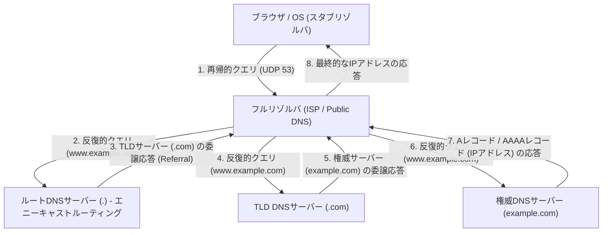

この複雑な階層型往復通信は、通常わずか数ミリ秒から数十ミリ秒という刹那の時間で完了する。DNSはトランスポート層プロトコルとして主にUDPポート53番を使用する。TCPによるスリーウェイハンドシェイク（SYN, SYN-ACK, ACK）の往復オーバーヘッドを完全に排除することで、極限のレイテンシ削減を実現しているのである。しかし、DNSの応答ペイロードが歴史的なUDPの制限である512バイト（EDNS0拡張により現在はより大きい）を超える場合や、DNSキャッシュポイズニング攻撃を防止するための暗号学的電子署名拡張であるDNSSEC（DNS Security Extensions）の鍵検証を行う場合、あるいはゾーン転送（AXFR）を行う場合には、信頼性の高いTCPポート53番へのフォールバックが規定されている。

## 5.2 HTTPアーキテクチャとプロトコルの進化論

DNSによって対象サーバーのIPアドレスを獲得したブラウザは、次に対象サーバー（ポート80番または443番）との間でTCP接続を確立し、アプリケーション層の主要言語であるHTTP（HyperText Transfer Protocol）による対話を開始する。

1989年、欧州原子核研究機構（CERN）のティム・バーナーズ＝リーによって考案されたHTTPは、元来、世界中の物理学者たちが研究文書（ハイパーテキスト）をネットワーク越しに効率的に共有し、リンクによって繋ぎ合わせるための極めて簡素なプロトコルであった。リクエストライン（メソッド、URI、プロトコルバージョン）、ヘッダーフィールド、空行（CRLF）、そしてメッセージボディというテキストベースの明快な構造は、システムのデバッグと普及を強力に後押しした。

HTTPの根本的な設計思想にして最大の特徴は「ステートレス（Stateless）」であることだ。サーバーはクライアントの過去のリクエスト状態やコンテキストを一切メモリ上に保持しない。各リクエストは完全に独立したトランザクションとして完結する。このREST（Representational State Transfer）アーキテクチャにも通じるステートレス性により、サーバーの実装が劇的に簡略化され、莫大なトラフィックを捌くためにサーバー台数を水平方向に増やすスケールアウト（負荷分散）が容易となった。ロードバランサーは、どのバックエンドサーバーにリクエストを振り分けても同一の結果を保証できる。しかし、ECサイトのショッピングカート機能やユーザーのログイン状態の維持など、状態（State）の管理が不可避な現代のインタラクティブなWebアプリケーションにおいて、この厳密なステートレス性は大きな制約となる。これをプロトコル外で克服するために考案されたのが、HTTPヘッダーを通じてクライアント側に状態を保存させるCookieや、セッショントークンによる擬似的な状態管理メカニズムである。

### 物理的制約との闘い：HTTP/1.1からHTTP/3へのパラダイムシフト

Webの爆発的な普及と、単一ページに含まれるリソース（画像、CSS、JavaScriptファイルなど）の膨大化に伴い、HTTPはネットワークの物理法則（光速による遅延制限とパケットロス）に直面し、プロトコルレベルでの劇的なアーキテクチャの進化を遂げてきた。

- **HTTP/1.1 (1997年 - )**: 当初のHTTP/1.0では、リソースを1つリクエストするたびにTCP接続の確立と切断（スリーウェイハンドシェイクと4ウェイハンドシェイク）を繰り返しており、レイテンシの観点から非効率の極みであった。HTTP/1.1では Persistent Connection（Keep-Alive）が標準化され、単一のTCP接続を再利用可能にすることで接続コストを劇的に削減した。しかし、HTTP/1.1のパイプライニング技術は実装の困難さと中間プロキシの互換性問題から普及せず、「Head-of-Line (HoL) ブロッキング」という致命的な構造的欠陥を抱えていた。これは、単一のTCP接続上で、サーバーが一つの巨大なリソースや処理の重いリクエストを処理している間、後続のリクエストがキューに詰まってしまい、全体のレイテンシが悪化する現象である。ブラウザはこれを回避するために、同一ドメインに対して同時に複数のTCP接続（通常6接続程度）を張るという力技のハック（ドメインシャーディング等）に頼らざるを得なかった。
- **HTTP/2 (2015年 - )**: Googleが開発したSPDYプロトコルをベースに標準化されたHTTP/2は、プロトコルをテキストベースから「バイナリフレーミングベース」へとアーキテクチャの根本から刷新した。最も重要な革新は「ストリームの多重化（Multiplexing）」である。HTTP/2では、単一のTCP接続の中に複数の仮想的な「ストリーム」を作成し、リクエストとレスポンスのデータを小さなバイナリフレームに分割して、順序を問わずにインターリーブ（交差）させて送信できるようになった。これにより、アプリケーション層におけるHoLブロッキングが完全に解消された。さらに、HPACKアルゴリズムを用いたヘッダー圧縮機構（静的ハフマン符号化と動的テーブルの組み合わせ）により、各リクエストで繰り返し送信される冗長なCookieやUser-Agentなどのデータ転送量を劇的に削減し、ネットワーク帯域の利用効率を極限まで高めた。
- **HTTP/3 (2022年 - )**: HTTP/2はアプリケーション層でのHoLブロッキングを見事に解消したが、基盤となるトランスポート層（TCP）における「パケットロス時のHoLブロッキング」という物理的な壁は残存していた。TCPは信頼性を担保するため、途中でパケットが1つでも欠落すると、再送が完了するまでそのTCP接続上のすべてのストリームのデータパケットのアプリケーション層への引き渡しを停止してしまう（TCPの順序保証メカニズムによる弊害）。この問題を打破するため、HTTP/3は数十年間インターネットの基盤であったTCPを捨て去り、UDPベースの新しいトランスポートプロトコル「QUIC（Quick UDP Internet Connections）」を採用するという劇的なパラダイムシフトを行った。QUICは、TCPがOSのカーネル空間で実装されていることによる進化の遅延を回避し、ユーザー空間で実装可能なUDPの上層に、独自の再送制御、輻輳制御、そしてストリームごとの独立したフロー制御を組み込んだ。パケットが欠落しても、影響を受けるのはその特定のストリームのみであり、他のストリームはブロックされることなく処理を継続できる。さらにQUICは、接続確立のハンドシェイクと暗号化（TLS 1.3）のハンドシェイクを統合し、過去に通信実績のあるサーバーとは「0-RTT（Zero Round Trip Time）」で暗号化データの送信を開始することを可能にした。物理的な光の速度の限界（地球の裏側との通信にはどうしても数百ミリ秒の遅延が生じる）に対して、プロトコルレイヤーでの通信往復回数（RTT）を徹底的に削ぎ落とすことで、究極のパフォーマンスを追求した結果の結晶である。

## 5.3 暗号化と信頼のメカニズム：SSL/TLSの数学的深淵と証明の論理

インターネットは本質的にオープンなパケット通信ネットワークであり、データは無数のルーターや海中の光ファイバーケーブルを経由して宛先へとバケツリレー式に転送される。その経路上のいかなるノード（中間ルーターや悪意のあるISP、あるいは同一Wi-Fiネットワーク上の盗聴者）も、通信内容をパケットキャプチャによって傍受し、さらには改ざんすることが物理的に可能である。このネットワークの絶対的な脆弱性を、高度な数学の力によって封じ込め、安全な通信チャネルを確立するのが、SSL（Secure Sockets Layer）およびその後継であるTLS（Transport Layer Security）プロトコルである。

TLSが現代のWeb通信において保証するのは、以下の「セキュリティの3本柱」である。
1. **機密性（Confidentiality）**: 通信内容が第三者に盗聴されても解読できないこと。
2. **完全性（Integrity）**: 通信経路上でデータが1ビットたりとも改ざんされていないこと。MAC（Message Authentication Code）やAEAD（Authenticated Encryption with Associated Data）により担保される。
3. **認証（Authentication）**: 通信相手が、正当なドメインの所有者（本物のサーバー）であること。

これらを実現する技術は、人類が何世紀にもわたって築き上げ、特に第二次世界大戦以降の計算機科学と数論の発展によって飛躍した暗号理論の結晶である。

### 鍵交換と公開鍵暗号：離散対数問題と素因数分解の壁

最も単純かつ処理が高速な暗号化方式は「共通鍵暗号（Symmetric Cryptography）」（現在の標準はAES：Advanced Encryption Standard）である。これは送信者と受信者が同一の「共通鍵」を用いて暗号化と復号を行う手法である。数学的な処理が軽量（ビットのXOR演算や置換・転置の組み合わせ）であるため、ギガビット級の通信をリアルタイムに暗号化するのに適している。しかし、共通鍵暗号は「通信を始める前に、その秘密の共通鍵自体をどうやって安全に相手に渡すか」という、根本的なパラドックス（鍵配送問題）を抱えていた。インターネットのように事前の信頼関係がない相手との通信において、共通鍵をそのまま送れば、途中で鍵が盗聴され、暗号化の意味を成さなくなる。

この人類史上の暗号学における最大のブレイクスルーとなったのが、1976年にホイットフィールド・ディフィーとマーティン・ヘルマンが発表した鍵交換アルゴリズム、そして1977年にRSA（リベスト、シャミア、エーデルマン）らによって考案された「公開鍵暗号（Asymmetric Cryptography）」である。

公開鍵暗号の根底には、数学的な「一方向関数（One-way function）」あるいは「落とし戸付き一方向関数（Trapdoor one-way function）」の概念が存在する。これは、「ある方向（暗号化）への計算はコンピュータで瞬時に終わるが、逆方向（復号や鍵の推測）の計算は、たとえ世界中のスーパーコンピュータを繋ぎ合わせて宇宙の寿命の期間計算し続けても終わらない」という非対称性を利用したものである。

- **RSA暗号**: 非常に大きな2つの素数（$p$と$q$）を掛け合わせて巨大な合成数（$N = p \times q$）を作ることは容易（多項式時間で計算可能）だが、その巨大な合成数 $N$ のみを与えられて、元の素因数 $p$ と $q$ を導き出す（素因数分解問題）のは極めて困難（準指数時間アルゴリズムしか知られていない）であるという性質に基づいている。オイラーのトーティエント関数やフェルマーの小定理などの数論の深淵な性質を利用し、公開鍵で暗号化されたデータは、対となる秘密鍵を持つ者にしか復号できない数学的なトラップドアを構築している。
- **楕円曲線暗号（ECC: Elliptic Curve Cryptography）**: 現在のTLSにおける主流であるECCは、有限体上の楕円曲線（例えば、$y^2 = x^3 + ax + b$ のような方程式を満たす点の集合）において定義される「離散対数問題」の困難性を応用している。楕円曲線上の点に対して「足し算」や「スカラー倍」という幾何学的な操作を定義する。ある始点 $G$ を秘密の回数 $k$ 回足し合わせた点 $P = kG$ を求めることは容易だが、公開された点 $G$ と $P$ から、何回足し合わせたかという秘密の係数 $k$（離散対数）を逆算することは、RSAの素因数分解よりもさらに困難である。これにより、ECCはRSAの数分の一という極めて短い鍵長（例えばRSA 2048bitと同等の安全性をECC 256bitで実現）で同等以上の暗号強度を誇り、CPU負荷とネットワーク帯域を劇的に節約している。

### TLSハンドシェイク：信頼を構築するための暗号学的儀式

HTTPSによるセキュアな通信を開始する際、クライアントとサーバーは共通鍵暗号のための安全な「セッション鍵」を生成し、かつ相手の身元を認証するための高度なネゴシエーションプロトコルを実行する。これがTLSハンドシェイクである。以下は、最新の規格であり極限まで無駄が削ぎ落とされた「TLS 1.3」における1-RTTハンドシェイクの解剖学である。

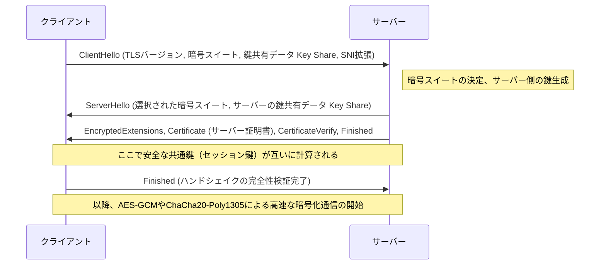

1. **ClientHello**: クライアントは接続開始にあたり、自身がサポートするTLSバージョン、暗号化アルゴリズムのリスト（Cipher Suites）、そして暗号鍵を生成するための初期の数学的パラメーター（Key Share）をサーバーに送信する。また、SNI（Server Name Indication）拡張を用いて、接続先のホスト名（例：`www.example.com`）を平文で送信する。これは、単一のIPアドレスで複数のHTTPSドメインを運用しているサーバー（バーチャルホスト）が、正しい証明書を選択して返すために不可欠な情報である。
2. **ServerHello**: サーバーはクライアントのリストから最も強力で最適な暗号アルゴリズム（例：`TLS_AES_256_GCM_SHA384`）を選択し、自身のKey Shareデータとともに応答する。
3. **証明書の送信と署名（Authentication）**: サーバーは自身の「デジタル証明書（X.509）」を送信する。さらに、サーバーはその証明書に紐付く「秘密鍵」を用いて、これまでのハンドシェイクメッセージ全体のハッシュ値に対するデジタル署名（CertificateVerify）を作成して送信する。これにより、サーバーがその証明書の正当な所有者（秘密鍵の所持者）であることが数学的に証明される。
4. **鍵交換（Ephemeral Elliptic Curve Diffie-Hellman: ECDHE）**: クライアントとサーバーは、送受信した互いのKey Share（公開された楕円曲線上の点）と、自身の手元だけにある秘密のパラメーターを数学的に掛け合わせる。驚くべきことに、Diffie-Hellman鍵交換の数学的性質（$ (g^a)^b = (g^b)^a = g^{ab} $）により、ネットワーク上に秘密情報を一切流すことなく、クライアント側とサーバー側で全く同じ強固な「マスターシークレット（共通鍵）」が魔法のように合成されるのである。
5. **前方秘匿性（Perfect Forward Secrecy: PFS）**: TLS 1.3の極めて重要な特徴は、この鍵交換に用いられるパラメーター（Key Share）が、セッションが確立されるごとに使い捨てで新規に生成される（Ephemeral）という点である。これにより、万が一サーバーの長期的な身分証明用である秘密鍵（RSAやECDSA鍵）が数年後に攻撃者に漏洩したとしても、過去に記録・保存されていた暗号化通信のパケットを遡って復号することは、数学的に完全に不可能となる。過去の通信の機密性が未来にわたって担保されるのである。

### PKIと信頼の連鎖（Chain of Trust）：デジタル世界のパスポート

ここまでの暗号化メカニズムにおいて、一つ致命的な論理の隙が残されている。「サーバーから送られてきた証明書と公開鍵が、本当にその対象ドメイン（例えば銀行のWebサイト）の本物のものであると、クライアントはどうやって確信するのか？」という問題である。
ネットワーク経路を支配する悪意のある中間者が、サーバーのふりをして自身の偽の証明書と公開鍵をクライアントに送りつける「中間者攻撃（Man-in-the-Middle Attack）」を行った場合、鍵交換と暗号化自体は数学的に完璧に成功する。しかし、暗号化された通信の相手は目的の銀行ではなく、攻撃者となってしまう。

この根源的な認証の課題を解決する社会・技術的フレームワークが、PKI（Public Key Infrastructure：公開鍵基盤）と、信頼のアンカーとなる「認証局（CA：Certificate Authority）」の存在である。

サーバーの所有者は、自らの公開鍵を含むCSR（証明書署名要求）を作成し、DigiCertやGlobalSign、あるいはLet's Encryptといった信頼できる第三者機関であるCAに提出する。CAは、そのドメインの所有権が申請者に確実にあることを検証（ドメイン認証、企業実在認証など）した上で、CA自身の強力な「秘密鍵」を用いて、サーバーの公開鍵情報に対して「デジタル署名」を施し、サーバー証明書として発行する。

一方、WindowsやmacOSといったオペレーティングシステム、およびChromeやFirefoxといったブラウザには、あらかじめ世界的に厳格な監査を受けたルートCAの「ルート証明書（公開鍵）」群が、信頼の基点（Trust Anchor）としてハードコーディングされて組み込まれている。

クライアントがサーバーから証明書を受け取ると、OS内蔵のルートCAの公開鍵を用いて、証明書に付与されたCAのデジタル署名の暗号学的な検証を行う。署名の検証が成功すれば、その証明書の記載内容（ドメイン名や公開鍵）がCAによって保証されており、改ざんされていないことが証明される。

1. クライアントはルートCAを無条件に信頼する（トラストストアへの事前インストール）。
2. ルートCAは中間CAを信頼し、署名する。
3. 中間CAはエンドエンティティ（Webサーバー）を信頼し、署名する。

この「信頼の連鎖（Chain of Trust）」という推移的関係性によって、我々は物理的に遠く離れた未知のサーバーとの間に、強固な信頼関係を動的かつ瞬時に構築し、安全な暗号化通信チャネルを確立しているのである。

## 結論：レイヤーの融合と次なる境地へ

第5章では、アプリケーション層の深淵において展開される、名前解決、データの要求と応答のプロトコル、そしてそれら全てを包み込む暗号化の数学的ベールについて、詳細な解剖を行ってきた。
DNSがインターネットの広大な分散型住所録として機能し、HTTPがリソースの運び手としてのアーキテクチャを確立し、TLSがそれを最先端の暗号理論の鎧で強固に守護する。これらは歴史的には独立したプロトコル・レイヤーとして設計されてきたが、現代のWebにおいては、HTTP/3のQUICに見られるように、トランスポート層とアプリケーション層、そして暗号化層の境界が密接に融合し、物理的なレイテンシの限界を打ち破り、極限のパフォーマンスとセキュリティを同時に追求する洗練された形へと進化を続けている。

次章では、この強固な暗号化通信を通過してサーバー側に到達したリクエストが、どのようにして動的なコンテンツを生成し、背後のデータベースシステムと対話するのか。「バックエンド・システムの内部構造と分散コンピューティング」について、さらに一段深い技術的深淵へと潜っていく。

# 第6章：インターネットを支える物理的インフラストラクチャ——光と熱と海が織りなす巨大機構

インターネットはしばしば「クラウド（雲）」という実体のない抽象的な概念として語られます。私たちのスマートフォンやパソコンから送信されたデータは、目に見えない電波やケーブルを通じて「どこかの空の上」にあるストレージへ吸い込まれていくかのような錯覚を覚えます。しかし、インターネットの実態は、雲のように軽やかなものではありません。それは極めて重厚で、物質的で、熱力学と光学、そして地球物理学の法則に強く縛られた、人類史上最大の物理的インフラストラクチャに他なりません。

本章では、この「不可視のネットワーク」を物理世界に具現化している3つの巨大な柱——地球規模の神経網である「海底ケーブル」、データの保管と演算を担う熱力学的処理施設「ハイパースケール・データセンター」、そして光速の壁を打ち破り時空を圧縮する「CDN（コンテンツ配信ネットワーク）」——について、その物理的メカニズム、歴史的背景、そして極限を追求するプロフェッショナルな技術的視点から徹底的に解剖します。

---

## 1. 地球を包む光の神経網：海底ケーブルシステム

現在、国境を越える国際インターネット通信の約99%は、宇宙空間を飛ぶ人工衛星ではなく、海底に敷設された直径わずか数センチメートルの「海底ケーブル（Submarine Communications Cable）」を経由しています。私たちが海外のウェブサイトを閲覧する際、そのデータは深海数千メートルの漆黒の闇の中を、光の速度で駆け抜けているのです。

### 1.1 電信から光ファイバーへの進化とシャノン限界への挑戦

海底ケーブルの歴史は、インターネットの誕生よりもはるかに古く、1850年の英仏海峡間の電信ケーブル敷設にまで遡ります。1858年には最初の大西洋横断電信ケーブルが敷設されましたが、当時はモールス信号による通信であり、ビクトリア女王からブキャナン米大統領へのメッセージ送信に十数時間を要しました。その後、同軸ケーブルを用いたアナログ電話回線の時代を経て、1980年代後半から光ファイバーケーブルの導入が始まりました。1988年に敷設された最初の大西洋横断光通信ケーブル「TAT-8」の容量は280 Mbps（電話回線にして約4万回線分）でしたが、これは当時としては革命的な帯域幅でした。

現代の海底ケーブルは、単一のケーブルで数百 Tbps（テラビット毎秒）という想像を絶する通信容量を誇ります。この飛躍的な進化を可能にしたのが、「波長分割多重（WDM: Wavelength Division Multiplexing）」と「エルビウム添加光ファイバー増幅器（EDFA: Erbium-Doped Fiber Amplifier）」という2つのノーベル賞級の物理学的・工学的ブレイクスルーです。

WDMは、1本の光ファイバーの中に異なる波長（色）の光を多重化して同時に送信する技術です。これにより、ファイバー1本あたりの伝送容量は波長の数だけ乗数的に増加します。しかし、光ファイバーの素材である石英ガラスがいくら極限まで純度を高められていても、数百キロメートル進むうちにレイリー散乱や赤外吸収によって光信号は減衰してしまいます。そこで必要になるのが、数十キロメートルから百キロメートルごとに設置される中継器（リピーター）です。

かつての中継器は、減衰した光信号を一度電気信号に変換し、増幅してから再び光信号に変換するという複雑で制約の多いプロセス（O-E-O変換）を行っていました。しかし、1990年代に実用化されたEDFAは、光ファイバーのコアに希土類元素であるエルビウムを添加し、そこにポンプ光と呼ばれる強いレーザー光を照射することで、光信号を「光のまま」直接増幅することを可能にしました。これにより、波長の異なる複数の光信号を一括して増幅できるようになり、WDM技術と結合することで通信容量は爆発的に増大したのです。

現在、通信工学の分野では、クロード・シャノンが提唱した通信路容量の理論的限界である「シャノン限界（Shannon Limit）」に近づきつつあります。これを超えるため、単一のファイバー内に複数のコアを持たせる「マルチコアファイバー」や、光の空間モードを多重化する「空間分割多重（SDM: Space Division Multiplexing）」といった次世代の物理層技術が研究・実装され始めています。

### 1.2 深海の物理環境とケーブル敷設の工学

海底ケーブルの敷設は、現代の最も過酷なエンジニアリングの一つです。数千キロメートルに及ぶケーブルを、専用の「ケーブル敷設船（Cable layer）」を用いて海底に沈めていきます。

敷設に先立ち、音響測深機を用いて海底地形図が精密に作成され、海底山脈や海溝、熱水鉱床、地滑りの危険がある海域を避けた最適なルートが選定されます。ケーブルの構造は、敷設される水深によって劇的に異なります。

水深が浅い大陸棚などの海域（水深約1000〜1500メートル以浅）では、漁船の底引き網や船舶の錨、あるいはサメなどの海洋生物による噛みつきといった物理的切断リスクが極めて高くなります。そのため、光ファイバーを保護するポリカーボネート樹脂や銅管の外側に、さらに何重もの高張力鋼線（スチールワイヤー）を巻きつけた「外装（Armor）」が施され、直径は太く重量も重くなります。さらに、遠隔操作無人探査機（ROV: Remotely Operated Vehicle）や海底プラウ（鋤）を用いて、海底の泥や砂の中にケーブルを数メートル埋設する作業が行われます。

一方、水深数千メートルの深海域では、漁網や錨の脅威は存在しないため、水圧に耐えうる堅牢性を保ちつつも、敷設時の自重による断線を防ぐために鋼線の外装を省いた「軽量ケーブル（Lightweight Cable）」が採用されます。直径は17〜20ミリメートル程度、ガーデンホースほどの太さしかありません。

海底ケーブルのもう一つの重要な物理的側面は「電力供給」です。数十キロメートルごとに設置された中継器を駆動させるため、陸上の陸揚げ局（Cable Landing Station）から、ケーブル内の銅製チューブ（給電導体）を通じて高電圧の直流電流が供給されます。大洋を横断するケーブルでは、給電電圧は1万ボルト（10 kV）を超えることもあり、海水と大地を帰路回路として利用する「単線大地帰路方式」が一般的に採用されています。

### 1.3 地政学と巨大テック企業の台頭

かつて海底ケーブルの敷設は、莫大な投資が必要なため、各国の主要通信キャリアが結集してコンソーシアム（共同事業体）を形成し、コストと帯域を按分する方式が主流でした。しかし近年、このエコシステムは劇的な変貌を遂げています。

Google、Meta（Facebook）、Microsoft、Amazonといった「ハイパースケーラー」と呼ばれる巨大テック企業群が、自社のデータセンター間を超高速で結ぶために、単独あるいは共同で海底ケーブルに直接投資・敷設を行うようになったのです。彼らは単なるインターネットの利用者から、物理インフラストラクチャの最大の所有者へと変貌を遂げました。これにより、ケーブルのルーティングは従来の「主要都市間の接続」から、「自社データセンター間の最短・最速接続」へと最適化されつつあります。

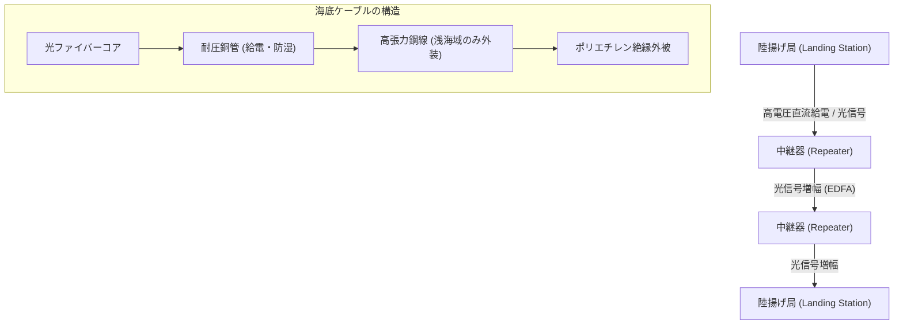

---

## 2. データの熱力学的処理施設：ハイパースケール・データセンター

海底ケーブルを通って陸地に到達したデータは、最終的に「データセンター」へと運ばれます。データセンターとは、数万台から数十万台規模のサーバー群を収容し、24時間365日休むことなく演算と記憶を続ける巨大な建築物です。

### 2.1 クラウドの実態と「PUE」の戦い

物理学的な視点から見れば、データセンターの本質は「莫大な電気エネルギーを入力として受け取り、情報処理というエントロピーの減少（演算結果）と、それに伴う不可避の『熱』を産み出す巨大な熱機関」です。CPUやGPUなどの半導体は、電流のオン・オフを切り替える際に抵抗によって熱を発生させます。この熱を効率的に外部へ排出しなければ、半導体は瞬時に熱暴走を起こし、物理的に焼損してしまいます。

したがって、データセンターの設計と運用の最大の焦点は「冷却」と「電力効率」にあります。この効率を示す最も一般的な指標が「PUE（Power Usage Effectiveness）」です。

**PUE = データセンター全体の消費電力 / IT機器（サーバー等）の消費電力**

PUEの理論上の最小値は1.0（すべての電力が純粋に演算のみに使われた状態）です。かつてのデータセンターはPUEが2.0を超える（つまり、サーバーが使うのと同じ量の電力を、エアコンなどの冷却設備に消費している）ことも珍しくありませんでした。しかし、現代のハイパースケール・データセンターでは、この数値を1.1〜1.2台にまで引き下げる極限の熱力学的最適化が行われています。

### 2.2 冷却アーキテクチャの進化

熱力学の原則に基づき、データセンターの冷却システムは以下のように進化してきました。

1. **ホットアイル・コールドアイルの分離**:
   初期のデータセンターでは、部屋全体を空調機（CRAC: Computer Room Air Conditioning）で冷やしていましたが、冷たい空気とサーバーから排出された熱い空気が混ざり合い、極めて非効率でした。現在では、サーバーラックの吸気面同士、排気面同士を向かい合わせて配置し、冷気を通す通路（コールドアイル）と熱気を通す通路（ホットアイル）を物理的に隔離する「アイルコンテインメント」が標準となっています。

2. **フリークーリング（外気冷房）**:
   チラー（冷却水循環装置）のコンプレッサーを回すのには莫大な電力が必要です。そこで、外気が十分に冷たい地域（北欧や北海道など）にデータセンターを建設し、外気を直接、あるいは熱交換器を介して間接的に冷却に利用する「フリークーリング」が普及しました。

3. **液浸冷却（Immersion Cooling）と直接水冷（Direct-to-Chip）**:
   近年、AIの学習や推論に用いられるハイエンドGPUの発熱密度は、従来の空冷の物理的限界（空気の熱容量と熱伝導率の低さ）を超えつつあります。そこで、サーバーのマザーボード全体を非導電性のフッ素系不活性液体や鉱物油に直接沈める「液浸冷却」や、CPU/GPUのヒートスプレッダに直接水冷ヘッドを密着させ、空気よりはるかに熱容量の大きい液体で直接熱を奪う「ダイレクト・ツー・チップ冷却」の導入が始まっています。相変化（液体の沸騰による気化熱）を利用した二相式液浸冷却では、極めて高い熱流束を処理することが可能です。

### 2.3 冗長性と物理的セキュリティ

データセンターは社会インフラの中枢であるため、極限の冗長性（Redundancy）が求められます。商用電源が遮断された瞬間に、フライホイールや鉛蓄電池、リチウムイオン電池を用いた無停電電源装置（UPS）がミリ秒単位で電力を引き継ぎます。それと同時に、建屋の外に設置された巨大なディーゼル発電機やガスタービン発電機が起動し、備蓄された燃料を使って数日間にわたり施設全体を稼働させ続ける能力を持っています。

ネットワーク接続も、複数の異なる通信キャリアの回線を引き込み、物理的な経路（建物の東西南北など異なる方向からの引き込み）を完全に分離することで、掘削工事によるケーブル切断などの事故に備えています。

---

## 3. 時空を圧縮する技術：CDN（コンテンツ配信ネットワーク）

海底ケーブルが大陸間をつなぎ、データセンターが情報を蓄積しても、それだけでは現代のウェブ体験は成立しません。ここで立ちはだかるのが、アルバート・アインシュタインが提唱した宇宙の絶対的な制限速度——「光速の壁」です。

### 3.1 光速の壁とレイテンシの物理的限界

真空中の光の速度（$c$）は約30万 km/sです。しかし、光ファイバーのコアである石英ガラスの屈折率は約1.47であるため、ファイバー中の光の速度は約20万 km/s（真空中の約3分の2）に低下します。

たとえば、日本の東京からアメリカ東海岸のバージニア州（世界最大のデータセンター集積地）までの物理的な直線距離は約11,000 km、海底ケーブルの経路を考慮すると約14,000 kmになります。光信号が片道を伝わるのに要する純粋な物理的時間は約70ミリ秒です。インターネット通信ではパケットの往復（RTT: Round Trip Time）が必要なため、最低でも140ミリ秒の遅延（レイテンシ）が物理法則として絶対に発生します。さらに、途中のルーターやスイッチでの処理遅延が加算されます。

最新のウェブサイトを開く際、ブラウザはHTML、CSS、JavaScript、画像など数百のファイルを要求し、TCPの3ウェイハンドシェイクやTLS（SSL）の暗号化ネゴシエーションで何度も通信を往復させます。もし全てのユーザーが地球の裏側の「オリジンサーバー」に直接アクセスしなければならないとしたら、ウェブページが表示されるまでに数秒から十数秒の遅延が発生し、リアルタイムのオンラインゲームや高画質の動画ストリーミングは到底不可能なものとなります。

### 3.2 エッジへの分散：CDNのアーキテクチャ

この物理的限界を工学的に克服し、時空を圧縮するシステムが「CDN（Content Delivery Network）」です。

CDNの基本思想は極めてシンプルです。「ユーザーから遠く離れたオリジンサーバーにデータを取りに行くのが遅いのであれば、ユーザーの物理的に最も近い場所にデータのコピー（キャッシュ）をあらかじめ配置しておけばよい」という発想です。

CDN事業者は、世界中の主要都市にあるデータセンターやISP（インターネットサービスプロバイダ）の施設内に、「エッジサーバー（Edge Server）」と呼ばれる何千、何万ものキャッシュサーバーを物理的に配置しています。ユーザーがウェブサイトにアクセスすると、CDNのネットワークは瞬時にユーザーの地理的・ネットワーク的位置を判定し、最もレイテンシの低い（最も近い）エッジサーバーへと通信をルーティングします。

このルーティングを可能にする中核技術が「Anycast（エニーキャスト）」と高度な「DNSベースのルーティング」です。Anycastルーティングでは、世界中の複数のエッジサーバーに全く同じIPアドレスを割り当てます。インターネットの基幹を成すBGP（Border Gateway Protocol）の経路選択アルゴリズムを利用し、ルーターが自動的にネットワーク的に「最短」のサーバーへパケットを送り届けるように機能します。これにより、東京のユーザーは東京のエッジサーバーへ、ロンドンのユーザーはロンドンのエッジサーバーへ、意識することなく誘導されるのです。

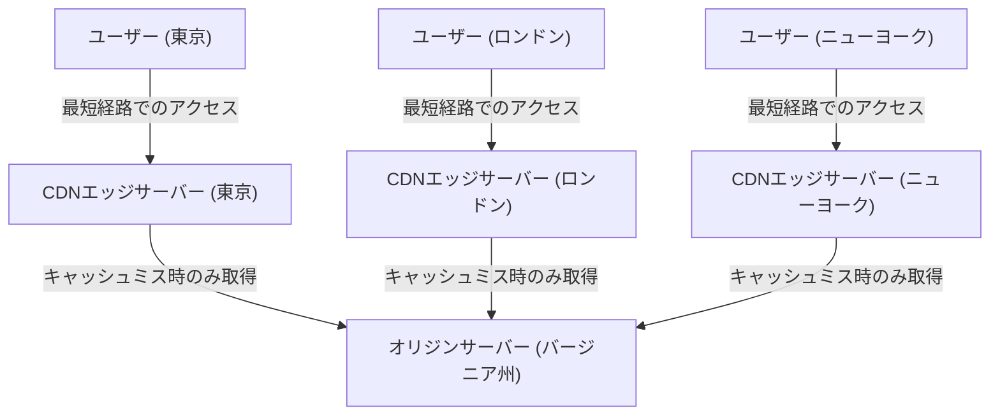

### 3.3 動的最適化とエッジコンピューティングの到来

初期のCDNは、画像や動画、静的なHTMLファイルをキャッシュして配信するだけのシンプルな仕組みでした。しかし現代のCDNは、それ単体で巨大な分散コンピューティング・プラットフォームへと進化しています。

第一に、動的コンテンツ（ユーザーごとに異なる検索結果やショッピングカートの中身など）の配信最適化です。これらはキャッシュできませんが、CDNはエッジサーバーとオリジンサーバー間の通信経路を独自に最適化（Tiered Cacheや専用の高速ルーティング網の構築）し、標準のインターネット経路（BGPのベストエフォート経路）よりもパケットロスが少なく、安定して高速な通信路を提供します。さらに、エッジサーバー側でTCPの接続やTLSのセッションを終端（Terminate）させることで、遠隔地とのハンドシェイクの往復回数を劇的に減らしています。

第二に、「エッジコンピューティング（Edge Computing）」の台頭です。従来、複雑なアプリケーションの処理（認証、A/Bテスト、画像の動的リサイズ、カスタムロジックの実行など）は、オリジンサーバーのCPUで行われていました。しかし現在では、Cloudflare WorkersやAWS Lambda@Edgeに代表される技術により、開発者はV8エンジンなどの隔離されたサンドボックス環境を用いて、ユーザーの直近にあるエッジサーバー上で直接コード（JavaScriptやRust, WebAssemblyなど）をミリ秒単位で実行できるようになりました。これにより、文字通り「インターネットの境界（エッジ）」が巨大な分散コンピューターとして機能し始めているのです。

---

## 4. 結語：物理限界との果てなき闘い

インターネットインフラの歴史は、光速、熱力学第二法則、エネルギー保存の法則といった、宇宙を支配する絶対的な物理法則との闘いの歴史です。

海底ケーブルの技術者たちは深海の巨大な水圧とガラスの光学限界に挑み、データセンターの設計者たちは発熱するシリコンウェハーを冷却するための熱力学的極限を追求し、CDNのアーキテクトたちは光速の壁を回避するための高度な分散処理システムを構築し続けています。

私たちがスマートフォンをタップして、世界中の情報に瞬時にアクセスできる背後には、これらの重厚で、過酷で、そして極めて洗練された物理的インフラストラクチャが存在しています。第7章では、この強固な物理インフラの上で、ソフトウェアとプロトコルがどのようにして世界規模の自律分散ネットワークを維持しているのか、「ルーティングとBGPの世界」について深く掘り下げていきます。

# 第7章：サイバーセキュリティとプライバシーの戦い

インターネットの歴史は、自由な情報共有の理想と、悪意ある攻撃からシステムとデータを守るための絶え間ない戦いの歴史でもあります。当初、ARPANETとして誕生したインターネットは、限られた信頼できる研究者間での通信を前提に設計されていました。そのため、プロトコルの根本的な設計において「セキュリティ」は後回しにされており、性善説に基づいたアーキテクチャとなっていました。しかし、ネットワークが世界規模に拡大し、商業化され、インフラストラクチャとしての地位を確立するにつれ、この初期の設計思想は致命的な弱点となりました。

本章では、現代のインターネットを揺るがす最大の脅威の一つであるDDoS攻撃の物理的・ネットワーク的メカニズム、通信のプライバシーを確保するための暗号化とVPN（仮想プライベートネットワーク）の技術、そして境界防御の限界から生まれた次世代のセキュリティ概念「ゼロトラストアーキテクチャ」について、技術の深淵を覗きながら極限まで詳述します。

## 1. ネットワークの物理的限界とDDoS攻撃の力学

サイバー攻撃の中でも最も原始的でありながら、最も防ぐのが困難な攻撃の一つが、**DDoS（Distributed Denial of Service：分散型サービス拒否）攻撃**です。これは、標的となるサーバーやネットワーク機器に対して、処理能力や回線帯域の限界を超える大量のトラフィックを送りつけ、正規のユーザーへのサービス提供を不可能にする攻撃です。

### トラフィックの物理的飽和：回線帯域の限界
インターネットは、光ファイバーや銅線、電波といった物理的な媒質を介してデータを伝送します。これらの伝送路には、光の波長多重技術（WDM）などによりテラビット級の通信容量が実現されていますが、個々のサーバーが接続されている回線の帯域幅（例えば1Gbpsや10Gbps）には厳格な物理的上限が存在します。DDoS攻撃は、この「土管の太さ」の限界を突きます。攻撃者が世界中に分散する何十万台ものマルウェアに感染したデバイス（ボットネット）を操り、一斉に標的へパケットを送信すると、ルーターやスイッチのインターフェースのバッファメモリが溢れ、パケットドロップが発生します。この現象は流体力学におけるパイプの詰まりに似ており、情報量（パケット数）が処理能力を超えた瞬間にシステム全体の機能不全を引き起こします。

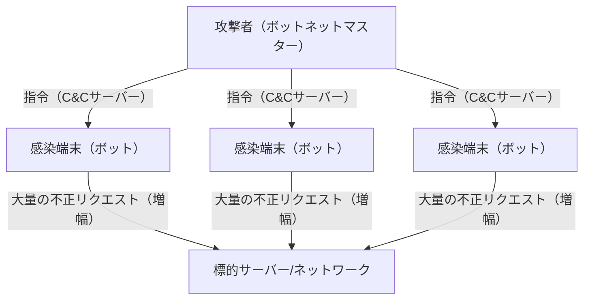

### TCP/IPの脆弱性を突く：SYN Flood攻撃
帯域幅を埋め尽くすだけでなく、サーバーのリソース（CPUやメモリ）を枯渇させる攻撃手法も存在します。その代表格が**SYN Flood攻撃**です。TCPプロトコルでは、通信を確立する際に「3ウェイ・ハンドシェイク」と呼ばれる手順を踏みます。
1. クライアントが「SYN」パケットを送信
2. サーバーが「SYN-ACK」パケットを返信し、接続用のメモリ（TCB: Transmission Control Block）を確保
3. クライアントが「ACK」パケットを送信して接続確立

攻撃者は、送信元IPアドレスを偽装（スプーフィング）した大量のSYNパケットをサーバーに送りつけます。サーバーはSYN-ACKを返しますが、偽装されたIPアドレスの主はACKを返しません（または存在しません）。結果として、サーバーは「半開（Half-open）」状態のコネクションを大量に抱え込み、接続管理のためのメモリ領域が枯渇し、正規のユーザーからの新たな接続要求を拒否せざるを得なくなります。これは、TCPの「信頼性のある通信を保証する」という状態保持（ステートフル）の性質を逆手に取った見事な攻撃メカニズムです。

### リフレクション（増幅）攻撃：非対称性の悪用
UDP（User Datagram Protocol）を利用した**リフレクション攻撃（増幅攻撃）**は、さらに巧妙です。UDPはコネクションレス型プロトコルであり、送信元の確認を行いません。攻撃者は、標的のIPアドレスを送信元に偽装し、インターネット上の公開DNSサーバーやNTPサーバーにリクエストを送信します。この際、小さなリクエスト（数十バイト）に対して、数百倍から数千倍のサイズ（数キロバイト）の応答を返すような特定のクエリを使用します（DNS ANYクエリやNTP monlistなど）。
増幅された巨大な応答パケットは、偽装された送信元、すなわち標的のサーバーへと一斉に雪崩れ込みます。攻撃者はわずかな帯域しか消費せずに、標的に対してテラビット級のトラフィックを発生させることが可能となります。これは物理学における「てこの原理」や、音響工学における共鳴増幅のような非対称性をネットワーク上で実現したものです。

## 2. 通信経路の秘匿性：暗号化とVPNのメカニズム

公衆網であるインターネット上を流れるパケットは、経由する多数のルーターやISPの機器を通じて運ばれます。暗号化されていない平文（クリアテキスト）の通信は、経路上で容易に傍受（スニッフィング）や改ざんが可能です。プライバシーとデータの機密性を守るための強力な盾が「暗号技術」と「VPN（Virtual Private Network）」です。

### 現代暗号の数学的基盤：公開鍵と共通鍵のハイブリッド
通信の保護には主に2つの暗号方式が用いられます。
- **共通鍵暗号方式（AESなど）**: データの暗号化と復号に同じ鍵を使用。処理速度が非常に速いが、鍵をどのように安全に相手に渡すか（鍵配送問題）という課題がある。
- **公開鍵暗号方式（RSAや楕円曲線暗号など）**: 暗号化用の「公開鍵」と復号用の「秘密鍵」のペアを使用。素因数分解の困難さや離散対数問題といった高度な数学的性質（非対称性）に基づいている。計算コストが高い。

インターネット上のセキュアな通信（TLS/SSLやVPN）では、これらを組み合わせたハイブリッド方式が採用されています。まず、通信開始時のハンドシェイクで公開鍵暗号を用いて安全に「セッション鍵（共通鍵）」を交換し、その後の大容量データの通信には高速なセッション鍵を用いて暗号化を行います。これにより、安全な鍵配送と高速な暗号通信の両立を実現しています。

### VPNとトンネリングの原理
**VPN（仮想プライベートネットワーク）**は、暗号化技術を用いて、公衆インターネット上に仮想的な「専用線（トンネル）」を構築する技術です。代表的なプロトコルにはIPsecやOpenVPN、最近ではWireGuardなどがあります。

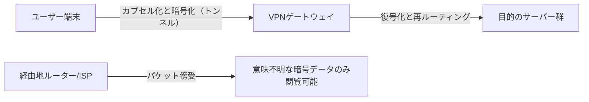

トンネリングの核心的なメカニズムは「カプセル化（Encapsulation）」にあります。ユーザーが送信しようとする元のIPパケット（ペイロード）全体を暗号化した上で、それを新たなIPパケットのデータ部分として包み込み（カプセル化）、外側にVPNサーバー宛の新しいIPヘッダを付与します。
経路上にあるインターネットのルーターは、外側のIPヘッダだけを見てパケットをVPNサーバーへと転送します。中身は強力に暗号化されているため、パケットを傍受されても、通信内容はおろか、本来の宛先IPアドレスすら解析することは困難です。VPNサーバーに到達したパケットは復号され、元のヘッダが取り出されて最終的な目的地へと送信されます。このようにして、物理的には誰でもアクセス可能なインフラ上で、論理的かつ数学的に保護されたプライベート空間を創出するのです。

## 3. 境界防禦の崩壊とゼロトラストアーキテクチャの台頭

長年、企業や組織のネットワークセキュリティは「境界防御（ペリメタ・モデル）」と呼ばれる概念に依存していました。これは、インターネット（外部）と社内ネットワーク（内部）の境界にファイアウォールやIPS（侵入防止システム）を設置し、「外は危険、内は安全」とみなす城郭型の防衛戦略です。

### クラウドとテレワークがもたらした境界の喪失
しかし、現代ではこのモデルは完全に破綻しています。SaaS（Software as a Service）の普及により重要なデータは社外のクラウド上に置かれ、テレワークの一般化により従業員は自宅やカフェのWi-Fiからアクセスするようになりました。「守るべき内部」と「危険な外部」の境界線が溶けてなくなり、従来のファイアウォールでは制御不可能なトラフィックが爆発的に増加しました。さらに、一度内部ネットワークに侵入したマルウェア（ランサムウェアなど）や悪意ある内部犯行者に対して、境界防御は無力です。「内側は信頼できる」という前提が最大の脆弱性となったのです。

### ゼロトラスト：Trust Nothing, Verify Everything
このパラダイムシフトに対応するために提唱されたのが**「ゼロトラストアーキテクチャ（Zero Trust Architecture: ZTA）」**です。ゼロトラストの基本理念は「ネットワークの場所（社内か社外か）に関わらず、いかなる通信もデフォルトでは信頼しない（Never Trust, Always Verify）」というものです。

ゼロトラストモデルにおいて、セキュリティの焦点は「ネットワークの境界」から「アイデンティティ（ユーザーとデバイス）」および「リソース（データやアプリケーション）」へと移行します。

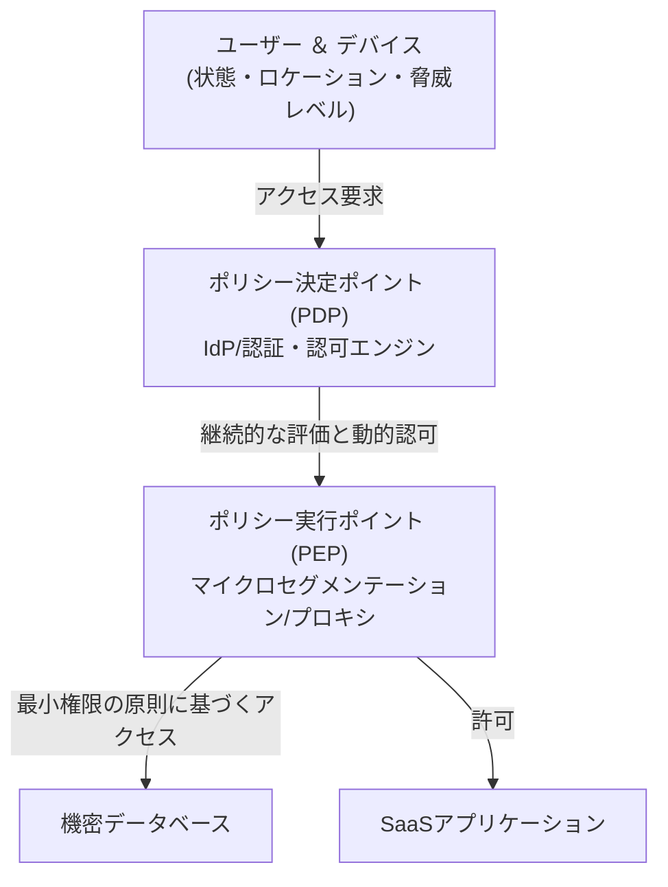

ゼロトラストを実現するための核となる技術的コンポーネントは以下の通りです：

1. **アイデンティティとアクセス管理（IAM/IdP）**: 単なるパスワードだけでなく、MFA（多要素認証）や生体認証を組み合わせ、ユーザーの身元を強力に確認します。
2. **デバイスポスチャ（健全性）の評価**: アクセスを要求している端末のOSパッチ適用状況、アンチウイルスソフトの稼働状態、過去の振る舞いなどをリアルタイムで評価します。安全でない端末からのアクセスは即座に遮断されます。
3. **マイクロセグメンテーション**: ネットワークを細かく分割し、リソースごとに極小の境界を設けます。万が一侵入されても、被害の水平展開（ラテラルムーブメント）を防ぐ構造です。
4. **継続的認証と動的ポリシー**: 一度ログインに成功したからといって信頼し続けるわけではありません。セッション中も振る舞い（アクセス元のIP変更、異常なデータダウンロード量など）を継続的に監視し、リスクスコアが閾値を超えた瞬間にセッションを切断する動的な制御を行います。

ゼロトラストは単なる製品ではなく、「すべてのアクセスを毎回検証し、必要最小限の権限（Least Privilege）のみを与える」という設計思想であり、現代の分散化されたITインフラにおいてデータを守るための唯一の現実的な解となっています。

## 4. 未来のセキュリティ：量子暗号と次世代ネットワーク防衛

現在私たちが依存しているRSAや楕円曲線暗号は、「現在のコンピュータの計算能力では解読に天文学的な時間がかかる」という前提に基づいています。しかし、量子力学の原理を応用した「量子コンピュータ」が実用化されれば、Shorのアルゴリズムなどにより、これらの数学的問題は瞬時に解かれてしまう危険性があります。これを**「Q-Day（量子コンピュータによる暗号解読の日）」**と呼びます。

これに対抗するため、現在2つのアプローチが研究されています。
一つは、数学的に量子コンピュータでも解読が困難な新しい暗号アルゴリズム**「耐量子計算機暗号（PQC: Post-Quantum Cryptography）」**の標準化です（格子暗号など）。
もう一つは、物理学（量子力学）の法則そのものをセキュリティの根拠とする**「量子暗号通信（QKD: Quantum Key Distribution）」**です。光子の量子状態（偏光など）に情報を乗せて鍵を配送する技術であり、盗聴者が光子を観測（コピー）しようとした瞬間に量子状態が変化する（観測問題・不確定性原理）ため、盗聴を100%物理的に検知できるという究極のセキュア通信です。

## おわりに

インターネットの第7章、それは「利便性」と「安全性」の絶え間ないシーソーゲームです。DDoS攻撃による物理的レイヤーの飽和から、暗号技術による数学的防御、そしてゼロトラストというアーキテクチャのパラダイムシフトに至るまで、サイバーセキュリティは単なるIT技術の枠を超え、物理学、数学、行動心理学が交差する極めて高度な学問領域へと進化しました。
私たちが何気なくブラウザを開き、クラウド上のデータを操作する背後には、見えない攻撃者と防衛システムによる、ミリ秒単位の壮絶な電子戦が24時間365日繰り広げられているのです。

次の最終章である第8章では、インターネットの未来、すなわちWeb3.0、メタバース、そして星間インターネット（Interplanetary Internet）といった次世代のネットワークパラダイムについて探求していきます。

# 第8章：未来のインターネット —— 分散化、宇宙空間、そして量子力学が織りなす次世代のネットワーク

インターネットは過去数十年にわたり、人類史上最も影響力のある情報インフラストラクチャとして進化を続けてきました。1960年代のARPANETにおけるパケット交換技術の確立から始まり、TCP/IPプロトコルスイートの標準化、WWW（World Wide Web）の発明、そしてモバイルブロードバンドの普及に至るまで、その歩みは留まることを知りません。しかし、私たちが現在利用しているインターネットは、アーキテクチャの根本的な限界や物理的な制約に直面しつつあります。データセンターの巨大化に伴う中央集権化の弊害、大陸間通信における光ファイバーの物理的遅延、そして計算能力の飛躍的向上（特に量子コンピュータの台頭）による既存の暗号技術の脆弱化などです。

本章では、「第8章：未来のインターネット」と題し、現在進行形で行われているパラダイムシフトの最前線を探求します。具体的には、中央集権からの脱却を目指す「Web3と分散型アーキテクチャ」、物理的インフラの制約を宇宙空間へと拡張する「低軌道衛星通信網（Starlinkなど）」、そして物理学の究極の法則を通信に応用する「量子インターネット」の3つの柱について、その歴史的背景、物理学、そして技術的メカニズムをプロフェッショナルな視点から極限まで詳述します。

---

## 8.1 Web3と分散型アーキテクチャの真価：トラストレスなネットワークの構築

現在のインターネット（Web2.0）は、巨大なプラットフォーマーによるデータの中央集権的 관리の上に成り立っています。クライアント・サーバーモデルは効率的である反面、単一障害点（SPOF: Single Point of Failure）の存在、検閲の容易さ、そしてユーザーデータのプライバシー侵害という構造的な課題を抱えています。これに対するアーキテクチャレベルでの解答が「Web3」および分散型ネットワーク技術です。

### 8.1.1 コンテンツ指向ネットワークとIPFS
従来のWeb（HTTP）は「ロケーション指向」です。つまり、「どこにあるか（URL）」を指定して情報にアクセスします。しかし、この仕組みではサーバーがダウンしたり、ドメインが失効したりすると、コンテンツそのものが消失してしまう「リンク切れ（404 Not Found）」が発生します。

これに対し、IPFS（InterPlanetary File System）に代表される分散型ストレージシステムは「コンテンツ指向（Content-Addressed）」のアーキテクチャを採用しています。ファイルの内容を暗号学的ハッシュ関数（SHA-256など）に通すことで得られる固有の「コンテンツ識別子（CID）」を用いてデータにアクセスします。

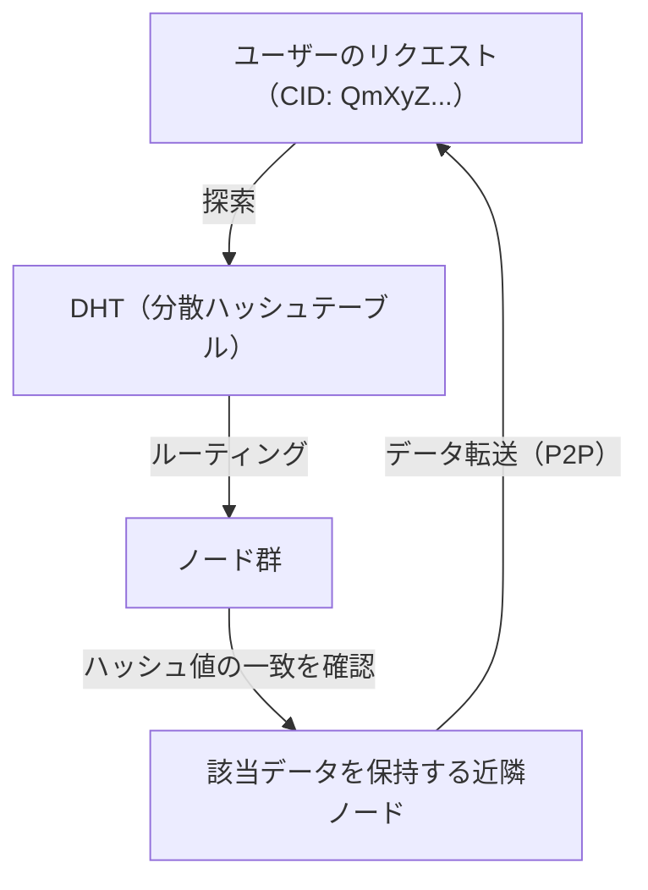

このメカニズムの核心は、DHT（Distributed Hash Table：分散ハッシュテーブル）の一種であるKademliaアルゴリズムにあります。Kademliaは、ノードIDとデータIDの間の「距離」をXOR演算（排他的論理和）で定義します。これにより、ネットワーク全体のトポロジを効率的にマッピングし、$O(\log N)$ の計算量で目的のデータを保持するノードを発見することが可能になります。データは世界中のノードに分散・複製されるため、一部のノードがオフラインになってもデータへのアクセスは維持され、検閲への強い耐性を持ちます。

### 8.1.2 分散型合意形成と暗号学的証明
Web3のもう一つの基盤がブロックチェーン技術です。これは分散型ネットワークにおいて、「誰が正しい状態を記録しているか」を中央の管理者を介さずに合意する「コンセンサスアルゴリズム」によって成り立っています。
当初のビットコインに採用されたPoW（Proof of Work）は、ハッシュ関数の衝突耐性を利用し、膨大な計算エネルギーを投じることで改ざんを物理的に困難にする仕組みでした。しかし、エネルギー消費の観点から、現在はPoS（Proof of Stake）へと移行が進んでいます。

Ethereum 2.0などで採用されているPoSでは、暗号資産をステーキング（担保化）したバリデーターが、BLS（Boneh-Lynn-Shacham）署名という特殊なペアリングベースの暗号技術を用いて署名を集約します。これにより、数万から数十万のノードによるデジタル署名をわずかなデータサイズに圧縮し、分散型ネットワークでありながら高いセキュリティと一定のスケーラビリティを両立させています。未来のインターネットでは、これらの技術がOSI参照モデルの新たなレイヤー（価値移転・合意形成レイヤー）としてTCP/IPの上に標準実装されていくと考えられます。

---

## 8.2 地球を包み込む衛星通信網：Starlinkとその先へ

地上に敷設された光ファイバー網は、現代のインターネットのバックボーンです。しかし、海底ケーブルの敷設コスト、地形的制約、そして何より「媒質中の光の速度」という物理的な制約が存在します。SpaceXのStarlinkに代表される低軌道（LEO: Low Earth Orbit）衛星コンステレーションは、これらの課題を宇宙空間というフロンティアで解決しようとしています。

### 8.2.1 軌道力学と低軌道（LEO）の優位性
静止軌道（GEO: Geostationary Earth Orbit）衛星は高度約35,786 kmに位置し、地球の自転と同期しているため、アンテナの方向を固定できる利点がありました。しかし、電波が往復するだけで約70,000 km以上の距離を移動するため、物理学的な制約から生じる遅延（片道だけで約120ミリ秒、実質的なレイテンシは500ミリ秒以上）が避けられません。

一方、Starlinkの衛星は高度約550 kmの低軌道に配置されます。ケプラーの第三法則に基づく軌道力学によれば、この高度では地球の重力と遠心力を釣り合わせるために、衛星は約7.6 km/s（時速約27,000 km）という猛烈な速度で地球を周回する必要があります（約90分で地球を一周）。
この低さにより、電波の物理的伝播時間はGEOの約65分の1へと劇的に短縮され、理論上の通信レイテンシは地上光ファイバーと同等かそれ以下（20〜40ミリ秒）になります。

### 8.2.2 位相配列アンテナ（フェーズドアレイ）と電波の波面制御
衛星が高速で移動するため、地上のユーザー端末（パラボラアンテナのような物理的駆動部を持たない平面アンテナ）は、上空を通過する衛星を電気的に追尾しなければなりません。ここで用いられるのが「位相配列アンテナ（Phased Array Antenna）」です。
数千個の微小なアンテナ素子が平面に並んでおり、各素子から放射される電波の「位相（波のタイミング）」をマイクロ秒単位で意図的にずらします。ホイヘンスの原理により、各素子からの球面波が干渉し合い、特定の方向でのみ波が強め合う（建設的干渉）ビームが形成されます。これにより、物理的にアンテナを動かすことなく、ソフトウェアの制御のみで通信ビームを瞬時に目的の衛星へ指向させることが可能になります。

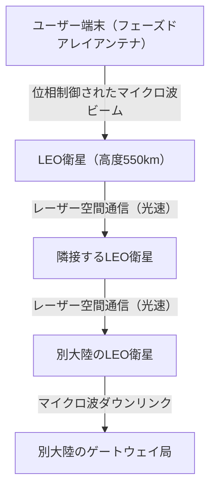

### 8.2.3 光空間通信（OISL）と「真空中の光速」の絶対的優位性
Starlink網の真の革命は、衛星間レーザー通信（OISL: Optical Intersatellite Links）にあります。
現代の長距離通信は光ファイバーに依存していますが、光ファイバーのコア（石英ガラス）の屈折率は約1.47です。物理学において、媒質中の光の速度は $v = c / n$ （$c$ は真空中の光速、$n$ は屈折率）で表されます。つまり、光ファイバー内の光の速度は約200,000 km/sに低下しています。

これに対し、宇宙空間（真空）の屈折率は限りなく1に近いため、衛星間でのレーザー通信は真空中の光速 $c \approx 300,000$ km/s で行われます。
たとえば、ロンドンからニューヨークへのデータ転送を考えた場合、大西洋の海底ケーブルを経由するより、データを一度宇宙に打ち上げ、真空の宇宙空間をレーザー光で転送し、再び地上に降ろすルートのほうが、理論上の絶対遅延（レイテンシ）を小さくすることができます。これは金融の高頻度取引（HFT）やグローバルなリアルタイムシステムにおいて、決定的なパラダイムシフトをもたらします。将来的には、数万機の衛星が地球を取り囲み、BGP（Border Gateway Protocol）に代わる動的で三次元的な宇宙空間のルーティングプロトコルが稼働する網の目（メッシュネットワーク）が完成するでしょう。

---

## 8.3 量子インターネット：エンタングルメントがもたらす究極の通信

Web3が「信頼」のアーキテクチャを再構築し、衛星通信網が「空間と速度」の制約を突破するならば、「量子インターネット」は情報の「セキュリティと伝達手段」における物理学の極致です。量子インターネットは、既存のTCP/IPネットワークを置き換えるものではなく、それを補完し、全く新しい物理法則に基づく情報伝達チャネルを提供する次世代インフラです。

### 8.3.1 量子力学の基礎：重ね合わせとエンタングルメント
古典的なコンピュータやインターネットは、電圧の高低などを「0」か「1」のビットとして扱います。しかし量子インターネットでは、量子ビット（Qubit）として情報を伝送します。光子（フォトン）の偏光状態（縦揺れ・横揺れなど）を利用することで、「0」と「1」が同時に存在する「重ね合わせの原理（Superposition）」を利用します。

さらに重要なのが「量子もつれ（Quantum Entanglement）」です。2つの粒子がエンタングルメント状態にあるとき、それらはどれほど物理的に離れていても（たとえ地球と火星の距離であっても）、一方の粒子の状態を測定して確定した瞬間、もう一方の粒子の状態もタイムラグなしに即座に確定します。アインシュタインが「不気味な遠隔作用」と呼んだこの非局所的な物理現象が、量子インターネットのバックボーンとなります。

### 8.3.2 量子鍵配送（QKD）と物理学的な絶対安全
現在、インターネットの通信を保護しているRSA暗号や楕円曲線暗号は、「巨大な整数の素因数分解は非常に計算時間がかかる」という数学的な困難性に依存しています。しかし、ショアのアルゴリズムを実装できる大規模な量子コンピュータが実現すれば、これらの暗号は短時間で突破されてしまいます。

そこで期待されているのが、量子鍵配送（QKD: Quantum Key Distribution）です。代表的なBB84プロトコルでは、単一光子を用いて暗号鍵を送信します。量子力学の基本原理である「ハイゼンベルクの不確定性原理」により、第三者（盗聴者）が飛行中の光子を測定（盗聴）しようとすると、その瞬間に量子状態が変化（デコヒーレンス）してしまいます。また「量子複製不可能定理（No-Cloning Theorem）」により、未知の量子状態を正確にコピーすることは物理学的に不可能です。
つまり、通信経路上で盗聴行為があれば、受信者はエラー率の異常上昇としてそれを物理法則レベルで必ず検知できます。盗聴されていないことが保証された安全な乱数を共有し、ワンタイムパッド（One-Time Pad）暗号と組み合わせることで、いかなる計算能力を持つコンピュータ（宇宙規模のスーパーコンピュータ）であっても絶対に解読不可能な究極のセキュリティが実現します。

### 8.3.3 量子テレポーテーションと量子中継器の壁
量子インターネットの最終目標は、エンタングルメントを利用して量子状態そのものを別の場所に転送する「量子テレポーテーション」のネットワーク化です。これにより、分散型量子コンピュータ同士を接続し、単一の巨大な量子計算機として機能させる「量子クラウド」が可能になります。

しかし、技術的な壁は極めて高い状態にあります。光子は光ファイバー内を進むうちに吸収されたり散乱したりして失われてしまいます（減衰）。古典的な通信では途中に「増幅器（アンプ）」を置いて信号を強くしますが、量子通信では前述の「非クローニング定理」があるため、光子をコピーして増幅することができません。

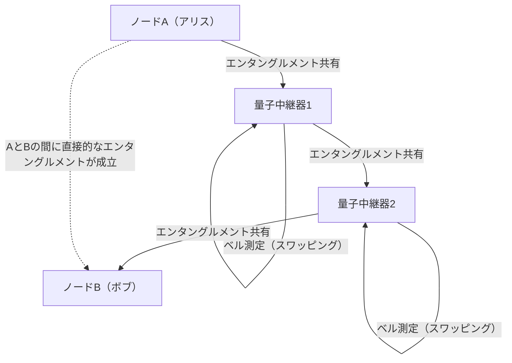

この限界を突破するために研究されているのが「量子中継器（Quantum Repeater）」です。量子中継器は、短い区間でのみエンタングルメントを生成し、「エンタングルメント・スワッピング」という高度な量子操作を連続的に行うことで、長距離間でエンタングルメントを確立します。これを実現するためには、量子状態を極低温環境下で一時的に保存する「量子メモリ」が必要不可欠であり、現在、ダイヤモンドのNVセンター（窒素-空孔中心）や冷却原子気体を用いた物理学的ブレイクスルーが世界中の研究所で競い合われています。

---

## 8.4 結び：人類とネットワークの未来

1960年代に産声を上げたインターネットは、地球上のあらゆる情報を結びつける神経網へと成長しました。そして今、私たちが直面している第8章「未来のインターネット」は、ソフトウェアのレイヤーにとどまらない、より根源的で物理学的な次元への拡張です。

Web3の分散型アーキテクチャは、特定の中央機関への「信頼」に依存せず、数学と暗号学によって社会のトランザクションを担保する新たな信頼基盤（トラスト・レイヤー）を構築しています。
Starlinkをはじめとする衛星通信網は、地球の重力井戸を飛び出し、真空中の光速という物理学の絶対的な限界速度に挑むことで、距離の壁を無効化する三次元的なバックボーンを描き出しています。
そして量子インターネットは、量子力学の深淵なる神秘であるエンタングルメントをエンジニアリングへと昇華させ、情報の伝達とセキュリティの概念を根本から覆そうとしています。

これらの技術はそれぞれ独立して発展しているように見えますが、長期的には融合していくでしょう。宇宙空間を飛び交うレーザー光のなかに単一光子（量子）を乗せることで、減衰の少ない宇宙空間を利用したグローバルな量子暗号通信網が構築され、その上でWeb3の分散型プロトコルが稼働する。そんなSFのようなネットワークインフラが、現在の人類の手によってまさに設計されつつあるのです。

これからのインターネットは、単に「情報を転送する土管」ではなくなります。それは、人類の経済活動、社会的な合意形成、そして計算資源を宇宙規模で同期させる、究極の「知的インフラストラクチャ」へと進化していくことでしょう。私たちが日々何気なく利用しているインターネットの裏側では、今この瞬間も、物理学とコンピュータサイエンスの限界に挑む壮大な物語が紡がれ続けているのです。

