# Capítulo 1: O Alvorecer e a Filosofia da Internet —— A Genealogia Tecnológica da ARPANET à WWW

A Internet —— esta gigantesca rede autônoma e descentralizada que serve de base para toda a atividade econômica, cultural e de comunicação da humanidade hoje, não foi projetada da noite para o dia por um único gênio. Tendo como ponto de partida o contexto histórico e geopolítico peculiar da Guerra Fria, e passando por mudanças de paradigma na engenharia de telecomunicações e na ciência da computação, ela é a cristalização de uma filosofia sublime compartilhada por inúmeros pesquisadores: "como transmitir informações de forma robusta e livre, superando qualquer restrição física".

Neste capítulo, explicaremos profundamente como surgiu esse sistema milagroso chamado Internet, não como uma simples enumeração histórica, mas a partir de uma perspectiva profissional, mergulhando ao máximo nos mecanismos técnicos da camada física à camada de aplicação, bem como em sua filosofia de design (arquitetura).

## 1.1 Mudança de Paradigma na Rede: Os Limites da Comutação de Circuitos e o Nascimento da Comutação de Pacotes

Para entender a essência histórica e tecnológica da Internet, o ponto de partida de tudo é a invenção do conceito de "Comutação de Pacotes" (Packet Switching). No início da década de 1960, o centro da infraestrutura de telecomunicações da época era o método de "Comutação de Circuitos" (Circuit Switching), representado pela rede telefônica.

### O Mecanismo Físico e a Vulnerabilidade da Comutação de Circuitos
O método de comutação de circuitos consiste em conectar lógica ou fisicamente (usando chaves crossbar, centrais eletrônicas ou tecnologias como a Multiplexação por Divisão de Frequência - FDM) dois pontos de comunicação, garantindo e ocupando uma "rota de comunicação dedicada (circuito)" do início ao fim da comunicação. Como a largura de banda e o atraso são garantidos enquanto o circuito está estabelecido, esse método era extremamente adequado para comunicação de voz em tempo real (telefone).

No entanto, havia uma falha fatal nessa arquitetura. Era a existência de um "Ponto Único de Falha" (Single Point of Failure) e a extrema vulnerabilidade à destruição física. Durante a Guerra Fria, o Departamento de Defesa dos EUA estava profundamente preocupado com um ataque nuclear da União Soviética (especialmente o Pulso Eletromagnético - ataque EMP - associado a explosões nucleares de alta altitude). Se um nó central de comunicação (uma grande central de comutação) fosse fisicamente destruído, ou se parte da rota de comunicação fosse cortada, o método de comutação de circuitos não poderia reconstruir imediatamente uma rota alternativa, e o sistema de Comando e Controle (C2: Command and Control) do país ficaria completamente paralisado.

### O Grande Avanço: A Comutação de Pacotes
Três pioneiros, de forma totalmente independente mas quase simultânea, construíram a base teórica para romper essa restrição física desesperadora: Paul Baran da RAND Corporation, Donald Davies do Laboratório Nacional de Física do Reino Unido (NPL) e Leonard Kleinrock do Instituto de Tecnologia de Massachusetts (MIT).

Eles, tendo como pano de fundo a teoria da informação de Claude Shannon, propuseram uma abordagem revolucionária: em vez de tratar a comunicação como uma "onda" analógica contínua ou um "fluxo" ininterrupto de dados, os dados seriam divididos em pequenos blocos de dados digitais de comprimento fixo (ou variável) —— ou seja, "Pacotes" (Packets) ou, nas palavras de Baran, "blocos de mensagens padronizados".

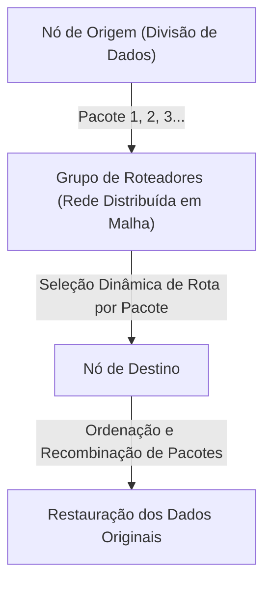

A inovação tecnológica do método de comutação de pacotes pode ser resumida em dois pontos principais:

1. **Realização da Multiplexação Estatística (Statistical Multiplexing):**
   Em vez de ocupar o circuito físico com uma comunicação específica, como na comutação de circuitos, os pacotes de várias comunicações não relacionadas compartilham o mesmo circuito físico por divisão de tempo. A comunicação de dados entre computadores é altamente "em rajadas" (Burstiness: uma característica em que uma grande quantidade de dados flui temporariamente, seguida por um período de silêncio); portanto, o compartilhamento de largura de banda por meio da comutação de pacotes elevou a eficiência da utilização dos recursos de comunicação ao limite matemático.
2. **Armazenamento e Encaminhamento (Store and Forward) e Seleção Dinâmica de Rotas:**
   Cada nó intermediário (roteador) que compõe a rede acumula temporariamente os pacotes recebidos em uma fila (queue) na memória, comparando o endereço de destino escrito no cabeçalho do pacote com a tabela de roteamento (routing table) que o próprio nó possui. Em seguida, calcula o estado de congestionamento da rede e as desconexões das linhas físicas naquele momento, e encaminha cada pacote para o nó adjacente ideal.

Kleinrock usou a Teoria das Filas (Queuing Theory) para estabelecer um modelo matemático para o atraso de pacotes e o tamanho do buffer neste método de armazenamento e encaminhamento. Mesmo que parte da rede seja vaporizada por um ataque nuclear, os nós sobreviventes avaliam autonomamente a situação, e os pacotes encontram um desvio (outra rota na rede em malha) e chegam ao destino. Essa arquitetura "autônoma, descentralizada e de autocura" é a própria raiz da resiliência (Resilience) da Internet.

## 1.2 A Construção da ARPANET: A Separação de Hardware e Protocolo através dos IMPs

Foi o projeto "ARPANET", iniciado em 1969 com financiamento da Agência de Projetos de Pesquisa Avançada (ARPA) do Departamento de Defesa dos EUA, que implementou a rede de comutação de pacotes, até então apenas uma existência teórica, no mundo físico.

O ambiente computacional da época era incomensuravelmente caótico em comparação com o atual. Os mainframes (computadores de grande porte) desenvolvidos de forma independente por empresas como IBM, DEC e SDS tinham códigos de caracteres (ASCII vs. EBCDIC), tamanhos de palavra (16 bits, 32 bits, 36 bits, etc.) e sistemas operacionais completamente diferentes. Fazer com que eles se comunicassem diretamente era tecnicamente muito difícil.

Por isso, os projetistas da ARPANET (Larry Roberts e outros) tomaram uma decisão de design extremamente importante na arquitetura da rede. Foi a introdução de um pequeno computador dedicado ao retransmissão chamado "IMP (Interface Message Processor)".

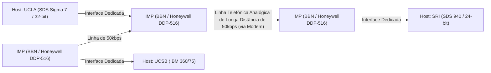

O desenvolvimento do IMP foi concedido à BBN (Bolt Beranek and Newman), uma empresa de consultoria sediada em Boston. Eles modificaram um minicomputador robusto da Honeywell, o "DDP-516", e sobrecarregaram o IMP com todo o complexo processamento de rede, incluindo protocolos de roteamento, divisão e montagem de pacotes e detecção de erros (CRC: Verificação de Redundância Cíclica).

Com isso, os gigantescos computadores host de cada instituição de pesquisa não precisavam mais se preocupar com o roteamento complexo de pacotes ou as características físicas das linhas, precisando apenas trocar dados usando o IMP à sua frente e uma interface padronizada (o protocolo BBN 1822). Este foi o primeiro grande exemplo de sucesso na aplicação do princípio da "Separação de Preocupações" (Separation of Concerns) na área de redes, e o IMP tornou-se o ancestral direto dos roteadores (Routers) de hoje.

Em 29 de outubro de 1969, do laboratório de Kleinrock na UCLA para o SRI (Stanford Research Institute), a primeira mensagem, "LO", foi enviada (o sistema travou enquanto tentava digitar "LOGIN"). Este é o momento histórico em que a ARPANET deu o seu primeiro choro. Depois disso, os primeiros algoritmos de roteamento (roteamento vetor de distância baseado no algoritmo de Bellman-Ford) foram implementados, e a ARPANET cresceu rapidamente como uma infraestrutura conectando instituições de pesquisa em todos os EUA.

## 1.3 A Filosofia de Design do TCP/IP: O Princípio End-to-End e o Abismo do Encapsulamento

A ARPANET foi um enorme sucesso como uma rede única, mas logo enfrentou um novo obstáculo. O protocolo de comunicação NCP (Network Control Program) usado dentro da ARPANET foi projetado sob a premissa de que rodaria na ARPANET, uma "rede única, homogênea e altamente confiável".

No entanto, na década de 1970, começou a surgir uma grande variedade de redes com mídias físicas, tamanho máximo de pacote (MTU: Maximum Transmission Unit), velocidades de transferência e taxas de erro completamente diferentes, como a rede de comunicação de pacotes por satélite (SATNET) e a rede de comunicação de pacotes sem fio (PRNET, derivada da ALOHANET) desenvolvida pela Universidade do Havaí. Quando se tentou interconectar tudo isso para construir uma "rede de redes" (Internetwork) em escala global, ficou claro que o design do NCP falharia.

Este imenso desafio da interconexão de redes heterogêneas foi resolvido em 1974 com a publicação do artigo inovador "A Protocol for Packet Network Intercommunication" por Vinton Cerf e Bob Kahn. O protocolo que eles projetaram é o "TCP/IP (Transmission Control Protocol / Internet Protocol)", a base da Internet moderna.

### A Alma da Arquitetura: O Princípio End-to-End (End-to-End Argument)
No cerne do design do TCP/IP flui a filosofia mais importante da engenharia de redes: o "Princípio End-to-End" (End-to-End Principle / Argument). Este princípio, que foi explicitado na década de 1980 por J. H. Saltzer, D. P. Reed e D. D. Clark, argumenta o seguinte:

"Funções avançadas e específicas de aplicações, como a garantia de confiabilidade da transferência de dados, controle de ordem e criptografia, devem ser implementadas nos hosts terminais (End-to-End) de ambas as extremidades que realizam a comunicação, e não no núcleo da rede (infraestrutura de retransmissão ou roteadores)."

O que aconteceria se o lado do núcleo da rede (IMPs e roteadores) tivesse um "estado" (State) complexo, como a confirmação de recebimento (ACK) e o controle de retransmissão dos pacotes? No momento em que um roteador intermediário falhasse, esse estado seria perdido e a comunicação seria cortada. Além disso, a cada vez que surgisse um novo aplicativo com novos requisitos, o software de todos os roteadores intermediários do mundo precisaria ser reescrito.

O TCP/IP incorporou este princípio da maneira mais fiel possível. O roteador IP (Internet Protocol) responsável pela retransmissão especializou-se em uma função extremamente simples (transferência de datagramas sem estado: stateless): "apenas transferir os pacotes recebidos em direção ao destino com o melhor esforço (best-effort)". O IP não se importa absolutamente com a perda ou reordenação de pacotes. Ele se limitou a ser apenas uma "rede burra" (Dumb Network).

Em vez disso, a pesada responsabilidade de garantir a confiabilidade da comunicação foi deixada inteiramente a cargo do TCP (Transmission Control Protocol), que roda nos computadores host em ambas as extremidades. O TCP examina os números de sequência anexados aos pacotes desordenados transportados pelo IP, reagrupa os dados originais e, se houver falta de algo, solicita autonomamente uma retransmissão e, se a rede estiver congestionada, ajusta a velocidade de envio (controle de janela e algoritmo de slow start).

Essa filosofia de design de "manter o núcleo extremamente simples e colocar a inteligência nas bordas (extremidades)" é o maior motivo pelo qual a Internet superou as redes telefônicas e conseguiu engolir inovações explosivas que nem os projetistas previram, como a Web, o streaming de vídeo, a comunicação P2P e os smartphones, sem precisar modificar a infraestrutura.

### Encapsulamento (Encapsulation) e o Modelo de Camadas
O TCP/IP usou um método chamado "Encapsulamento" (Encapsulation) para realizar essa divisão lógica de funções. Esse é um mecanismo pelo qual cada camada aplica suas próprias informações de controle (cabeçalho) sobre os dados a serem transmitidos, semelhante a uma boneca Matryoshka.

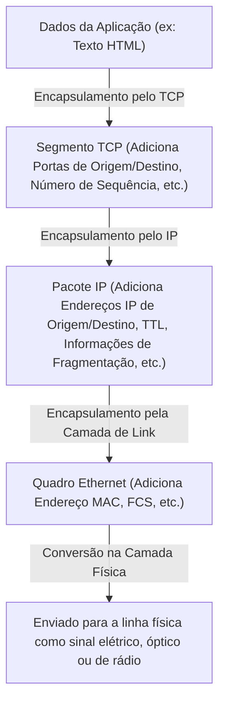

Os roteadores decidem o destino da transferência olhando apenas para o cabeçalho do pacote IP (endereço IP) e não se envolvem com o seu conteúdo (cabeçalho TCP ou dados). Como resultado, o IP conseguiu esconder e absorver completamente as diferenças nas características físicas da camada física subjacente (fibra óptica, fios de cobre, Wi-Fi, 5G) e fornecer à camada superior uma "rede virtual única em escala global".

Em 1 de janeiro de 1983, um "Flag Day" foi realizado, no qual todos os hosts na ARPANET mudaram de uma só vez do NCP para o TCP/IP, e aqui nasceu "A Internet" em seu sentido verdadeiro.

## 1.4 A Ascensão da NSFNET e a Evolução do Roteamento Distribuído Autônomo

Após a transição para o TCP/IP, a Internet transcendeu as fronteiras militares e de defesa nacional, transformando-se em uma enorme infraestrutura para a pesquisa acadêmica. A força motriz decisiva para isso foi a "NSFNET", construída no final da década de 1980 pela Fundação Nacional da Ciência (NSF) dos Estados Unidos.

A NSFNET foi construída como uma rede de backbone que conectava cinco centros de supercomputação em todos os EUA. Ela passou por upgrades drásticos da camada física repetidas vezes: inicialmente com linhas de 56 kbps, depois para linhas T1 (1,544 Mbps) e, em seguida, para linhas T3 (45 Mbps). As universidades e redes regionais começaram a se conectar hierarquicamente ao backbone desta NSFNET.

Com a expansão explosiva em escala da rede, surgiu um novo desafio técnico. Foram os "Limites do Roteamento". Compartilhar as informações de rota de dezenas de milhares de nós com todos os roteadores intermediários ultrapassaria os limites físicos de capacidade de memória e capacidade de computação.

Para resolver este problema, a Internet introduziu o conceito de "Sistema Autônomo" (AS: Autonomous System). A Internet foi redefinida não como uma única rede gigante, mas como um conjunto de redes (AS) com políticas de gerenciamento independentes.

Dentro de um AS (IGP: Interior Gateway Protocol), usam-se protocolos de roteamento do tipo estado de enlace (link-state), como o OSPF (Open Shortest Path First), para construir um mapa completo da topologia da rede usando o algoritmo de Dijkstra (Dijkstra's algorithm) e calcular a rota mais curta em alta velocidade.

Por outro lado, entre um AS e outro AS (EGP: Exterior Gateway Protocol), tornou-se necessário refletir não apenas a rota mais curta, mas as políticas organizacionais e comerciais, como "através de qual rede permitir a comunicação". O que foi desenvolvido para realizar isso é o "BGP (Border Gateway Protocol)", que sustenta a espinha dorsal da Internet até hoje. O BGP adotou um algoritmo do tipo vetor de caminho (Path Vector), evitando completamente os loops de roteamento e permitindo a troca de informações de rotas entre os ISPs (Provedores de Serviço de Internet) em todo o mundo.

A construção da NSFNET e o estabelecimento do BGP completaram o ecossistema da Internet comercial moderna, no qual não há um administrador central, mas cada organização repete interconexões (peering e trânsito) de modo que a rede como um todo funcione de forma autônoma. Em 1995, a NSFNET cumpriu o seu papel, e a operação do backbone foi totalmente transferida para um grupo de ISPs privados.

## 1.5 O Nascimento da WWW: A Libertação do Conhecimento via Hipertexto e sua Transição para o Domínio Público

No final da década de 1980, quando a infraestrutura da camada física, de rede e de transporte havia sido estabelecida em escala global, a quantidade de informações acumuladas na Internet havia aumentado dramaticamente. No entanto, a Internet naquela época estava saturada com aplicações individuais, como FTP (transferência de arquivos), Telnet (login remoto) e USENET (fóruns eletrônicos), e as informações ficavam isoladas (em silos) no fundo dos diretórios de cada servidor. Para encontrar os dados desejados, o conhecimento do endereço IP do servidor alvo ou comandos complexos do UNIX era essencial, o que constituía um estado extremamente não democrático.

Quem mudou radicalmente essa situação e causou uma mudança de paradigma no compartilhamento de informações foi Tim Berners-Lee, um cientista da computação no CERN (Organização Europeia para a Pesquisa Nuclear) em Genebra, Suíça. Em 1989, ele propôs um sistema revolucionário chamado "World Wide Web (WWW)".

O núcleo de sua ideia era combinar o "Hipertexto" (Hypertext: o conceito de vincular uma palavra em um documento a outro documento), que existia desde a década de 1960, com a "Internet" (TCP/IP). Ele expandiu o destino do hiperlink, que estava confinado em computadores locais, para documentos em servidores do outro lado do globo.

Berners-Lee projetou e implementou, sozinho, três especificações técnicas extremamente refinadas para construir esse enorme espaço de informações:

1. **URI (Uniform Resource Identifier):**
   Um sistema de endereçamento universal para especificar de forma unívoca o local de todos os recursos (textos, imagens, vídeos, etc.) existentes na rede.
2. **HTTP (Hypertext Transfer Protocol):**
   O protocolo da camada de aplicação para solicitar e transferir os recursos especificados pelo URI entre o cliente (navegador da Web) e o servidor. A melhor característica do HTTP é que ele adotou um design "sem estado" (Stateless), que não mantém o "estado" (State) da comunicação. Isso permitiu que o servidor lidasse eficientemente com solicitações de milhões de clientes.
3. **HTML (Hypertext Markup Language):**
   Uma linguagem de marcação para descrever a estrutura lógica de um documento e incorporar hiperlinks (a tag âncora `<a>`) para outros recursos.

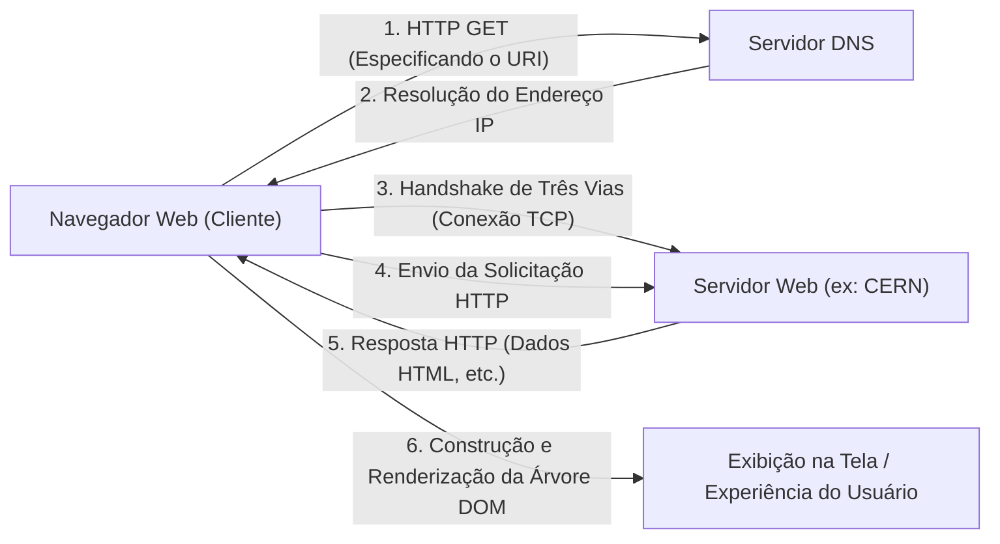

No final de 1990, o primeiro servidor Web do mundo (info.cern.ch) e o primeiro navegador começaram a funcionar em um computador NeXT. A Web inicial era baseada em texto, mas sua experiência intuitiva de descoberta de informações por meio de links se espalhou rapidamente entre os pesquisadores.

### A Decisão Histórica de Passar para o Domínio Público
No entanto, o maior motivo pelo qual a WWW realmente transformou o mundo e se estabeleceu como a infraestrutura da sociedade moderna não é apenas sua arquitetura técnica brilhante. O evento decisivo que mudou a história ocorreu em 30 de abril de 1993.

O CERN, aceitando um forte pedido de Tim Berners-Lee, tomou a surpreendente decisão de liberar todas as tecnologias base da WWW (software de servidor, clientes, bibliotecas de código) gratuitamente como "Domínio Público" (renúncia dos direitos de propriedade intelectual). O documento declarando que nenhuma patente seria exercida e nenhuma taxa de uso seria exigida foi assinado pelos diretores do CERN.

E se o CERN tivesse patenteado a tecnologia WWW e tentado monetizá-la através do licenciamento de software? Sem dúvida, a explosão de informações de hoje não teria ocorrido. A WWW teria permanecido um sistema fechado apenas para empresas e universidades com recursos financeiros, e a Internet teria sido fragmentada por guerras de padrões com protocolos rivais, como o Gopher, que apareceram mais tarde.

Como as barreiras técnicas e legais desapareceram completamente por causa dessa liberação para o domínio público, hackers e empresas em todo o mundo entraram no ecossistema da WWW. Marc Andreessen, do Centro Nacional de Aplicações de Supercomputação (NCSA), e outros desenvolveram e lançaram gratuitamente o revolucionário navegador gráfico "NCSA Mosaic", capaz de exibir imagens inline. Isso desencadeou o Netscape Navigator e, em última análise, a bolha da tecnologia da informação. A "Democratização da Informação" foi alcançada, em que os indivíduos poderiam criar livremente servidores da Web e transmitir informações para o mundo.

## 1.6 Conclusão: A Filosofia Supera a Implementação

A história da Internet vista no Capítulo 1 não é apenas uma história de melhoria na velocidade de comunicação. A invenção da comutação de pacotes baseada na realidade física de que "o controle centralizado é vulnerável", o Princípio End-to-End de que "a complexidade deve ser tratada pelas extremidades" e a liberação pública da WWW baseada na ideia de que "as informações devem ser abertas gratuitamente a toda a humanidade".

O que faz a Internet ser o que é hoje não são hardwares excelentes ou códigos notáveis, mas essas "Filosofias de Design" fortes e consistentes. Ao superar as restrições da camada física por meio de encapsulamento lógico e ao abraçar a diversidade por meio de padrões abertos (RFC: Request for Comments), a Internet foi capaz de alcançar um dimensionamento sem precedentes, graças a essa arquitetura que reverencia a descentralização e a liberdade.

No entanto, ainda existia um abismo profundo entre os "nomes" que os humanos podiam entender e os "números (endereços IP)" que a rede processava. No próximo capítulo, desvendaremos o mecanismo técnico por trás do enorme sistema de banco de dados distribuído, "O Abismo do Espaço de Endereços IP e o DNS (Domain Name System)", que trouxe ordem ao espaço de endereços desta vasta rede autônoma e descentralizada, e apoiou silenciosamente a popularização explosiva da WWW.

# Capítulo 2: A Camada Física e a Camada de Link de Dados 〜 A Entidade Física dos Dados Digitais e a Comunicação entre Vizinhos 〜

Na base da rede colossal que é a Internet, existe uma imensa cadeia de fenômenos físicos que transformam os dados digitais lógicos de "0" e "1" em sinais elétricos, flashes de luz ou oscilações de ondas eletromagnéticas, transmitindo-os através do espaço e de meios materiais até o destinatário. Quando nós, despreocupadamente, abrimos um site no smartphone, por trás disso, fótons correm por fibras de vidro rastejando no fundo do oceano escuro, e ondas de rádio invisíveis cruzam o espaço envoltas em cálculos complexos.

Neste capítulo, focaremos na Camada 1 (Camada Física) e na Camada 2 (Camada de Link de Dados) do modelo de referência OSI. Mergulharemos ao máximo, a partir da perspectiva de um profissional, nas partes "mais físicas e cruas" da rede que sustenta nossas vidas, bem como nos meticulosos mecanismos lógicos que as controlam.

---

## 2.1 A Camada Física (Physical Layer): A Materialização Física da Informação e as Leis do Universo

A maior missão da camada física é converter (modular) as sequências de bits discretas (0 e 1) tratadas pelos computadores em sinais físicos analógicos adaptados às características físicas do meio de transmissão (fios de cobre, fibras ópticas, espaço como o vácuo ou o ar) e enviá-los ao canal de comunicação. Aqui, as leis da engenharia elétrica, mecânica quântica e óptica determinam os limites da comunicação.

### O Teorema de Shannon-Hartley e os Limites da Informação
Ao falar da camada física, não se pode ignorar a teoria da informação publicada por Claude Shannon em 1948. O "Teorema de Shannon-Hartley" provou matematicamente a taxa máxima de transferência de dados (capacidade do canal) que pode ser transmitida sem erros em um canal de comunicação com ruído.

$$ C = B \log_2\left(1 + \frac{S}{N}\right) $$

Onde $C$ é a capacidade do canal (bps), $B$ é a largura de banda (Hz), e $S/N$ é a relação sinal-ruído (SNR). Esta bela equação demonstra que não importa o quanto a tecnologia avance, existe um limite físico (limite de Shannon) para a quantidade de informação que pode ser enviada sob uma dada largura de banda e condição de ruído. Os engenheiros modernos de fibra óptica e Wi-Fi continuam uma batalha sem fim sobre como aumentar a velocidade de comunicação o mais próximo possível desse limite.

### A Física das Fibras Ópticas: Transportando Luz "Confinada"
A espinha dorsal da Internet moderna é, sem dúvida, a fibra óptica (Optical Fiber). Enquanto na telecomunicação por fios de cobre a comunicação de alta velocidade a longa distância era difícil devido ao efeito pelicular e à interferência eletromagnética (EMI), as fibras ópticas superaram esses obstáculos.

A fibra óptica é composta por um vidro de quartzo de altíssima pureza em duas camadas: um "núcleo" (core) central e um "revestimento" (cladding) circundante. Ao definir o índice de refração do núcleo ligeiramente maior (menos de alguns por cento) do que o do revestimento, com base na Lei de Snell, a luz que entra em um ângulo mais raso do que um determinado ângulo crítico sofrerá reflexão interna total (Total Internal Reflection) repetidamente na fronteira entre o núcleo e o revestimento. Graças a isso, a luz avança no interior da fibra sem vazar para o exterior.

#### A Batalha Contra a Dispersão e a Atenuação: O Vidro que Trouxe o Prêmio Nobel
O vidro do passado tinha muitas impurezas, fazendo com que a luz se atenuasse em poucos metros. Em 1966, o Dr. Charles Kao (vencedor do Prêmio Nobel de Física em 2009) descobriu que a causa da atenuação na fibra óptica não era a propriedade intrínseca do vidro, mas as impurezas (especialmente o grupo hidroxila e os metais de transição), prevendo que, se a pureza fosse aumentada, a comunicação de longa distância seria possível. O vidro de quartzo de baixíssima perda desenvolvido pela Corning na década de 1970 alcançou a incrível baixa perda de 0,2 dB/km na banda de comprimento de onda de 1550 nm (Banda C). Isso significa que, mesmo avançando 15 km, apenas metade da intensidade da luz é perdida.

No entanto, quando a luz viaja por longas distâncias, ocorrem a "Dispersão Cromática" (Chromatic Dispersion) e a "Dispersão Modal" (Modal Dispersion), causando a degradação da forma de onda do pulso. A dispersão cromática ocorre porque a velocidade de propagação através do vidro difere dependendo do comprimento de onda (cor) da luz. A dispersão modal é o fenômeno onde há atrasos na chegada devido aos múltiplos caminhos (modos) de luz passando pelo núcleo.
Para superar isso, o diâmetro do núcleo foi afinado para alguns micrômetros, próximo ao comprimento de onda da luz, desenvolvendo a "Fibra Monomodo" (SMF: Single-Mode Fiber), que permite a passagem de apenas um único caminho. Essa fibra tornou-se a norma para transmissões de longa distância, como em comunicações intercontinentais.

#### EDFA e WDM: O Renascimento das Comunicações Ópticas
Na década de 1990, ocorreram duas revoluções nas comunicações ópticas. A primeira foi o Amplificador de Fibra Dopada com Érbio (EDFA: Erbium-Doped Fiber Amplifier). Até então, eram necessários repetidores de regeneração lentos e caros, que primeiramente convertiam o sinal óptico atenuado em sinal elétrico, amplificando-o e, então, convertendo-o de volta em luz. O EDFA dopou o núcleo da fibra com o elemento de terra-rara Érbio, e ao irradiá-lo com luz de bombeamento (pump light) a partir do exterior, provocava emissão estimulada à medida que o sinal de luz passava, tornando possível amplificar a luz diretamente como luz.

A segunda foi a Multiplexação por Divisão de Comprimento de Onda (WDM: Wavelength Division Multiplexing). Usando o princípio de sobreposição de que a luz, mesmo ao enviar diferentes comprimentos de onda (cores) simultaneamente no mesmo espaço, progride de forma independente sem se misturar, essa tecnologia agrupa sinais de vários comprimentos de onda e os envia em um único feixe de fibra óptica. Devido à tecnologia de Multiplexação Densa por Divisão de Comprimento de Onda (DWDM), atualmente, mais de 100 sinais de comprimento de onda separados por intervalos de poucos nanômetros são carregados em uma única fibra, conseguindo uma incrível largura de banda de dezenas de Tbps a vários Pbps em uma fibra única.

### Cabos Submarinos: A Rede Neural da Terra
Mais de 99% da comunicação de dados intercontinental é transportada por cabos submarinos, não por satélites artificiais. Tanto os dados na nuvem quanto as imagens em sites estrangeiros passam todos fisicamente pelo fundo do mar.

#### Uma História de Falhas e Desafios
A história dos cabos submarinos é muito anterior à Internet. O primeiro grande desafio foi o cabo telegráfico transatlântico de 1858. Fios de cobre isolados por guta-percha, um tipo de borracha natural, foram colocados com sucesso; no entanto, eles silenciaram em apenas algumas semanas, provocando um colapso do isolamento devido ao uso de altas tensões, ignorando as advertências de Lord Kelvin (William Thomson). Depois disso, a teoria e os materiais melhoraram ao longo de um extenso período, e o "TAT-8", o primeiro cabo submarino de fibra óptica transpacífico, entrou em operação em 1988, inaugurando a era da luz.

#### A Estrutura dos Cabos e a Engenharia de Lançamento
Os cabos submarinos modernos colocados no fundo do oceano profundo a uma profundidade de milhares de metros são projetados para resistir a ambientes extremos. Para proteger um feixe de apenas algumas fibras ópticas no centro, elas são blindadas por várias camadas, utilizando fios de aço de alta tensão, tubos de cobre ou alumínio para suportar a pressão da água, e isolantes de polietileno. No fundo do oceano, a espessura tem apenas alguns centímetros de diâmetro para ser leve enquanto resiste às mordidas de tubarões e à imensa pressão da água, mas em áreas rasas, é aplicada uma armadura espessa (armouring) para protegê-los de redes de pesca de arrasto, âncoras de navios e terremotos submarinos, atingindo mais de 10 centímetros de diâmetro.

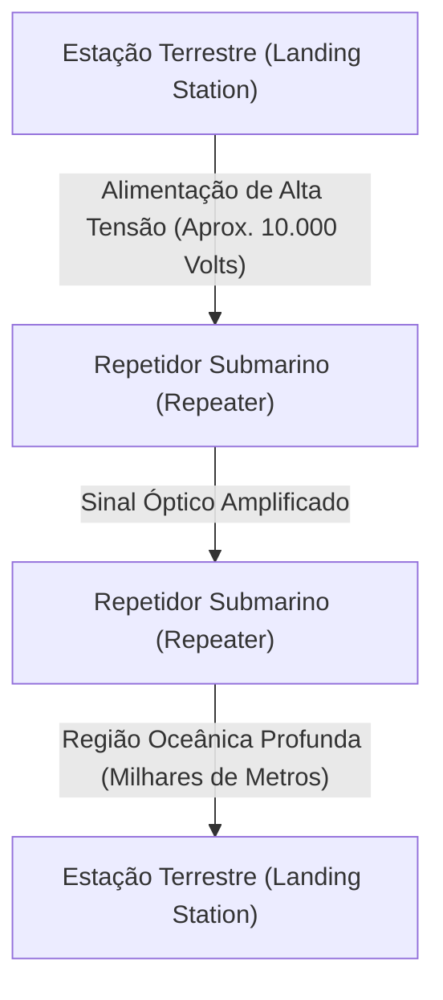

Como o sinal óptico sofre atenuação a cada dezenas de quilômetros, mesmo usando fibras de perda ultra baixa, "repetidores submarinos" (repeaters) estão inseridos em intervalos regulares ao longo do cabo. A energia para conduzir esses repetidores (os EDFAs mencionados acima embutidos neles) no oceano profundo é constantemente fornecida das estações terrestres de ambas as pontas através de tubos de cobre dentro do cabo na forma de uma corrente contínua de alta tensão de milhares a um máximo de mais de 10.000 volts.
Em áreas de deposição de cabos, são usados "navios lançadores de cabos" dedicados, enquanto em áreas rasas, um robô submarino (ROV) cava valas no fundo do mar para enterrar os cabos. Se um cabo for cortado, um navio de reparo viaja para o local, pega a extremidade do cabo nas profundezas com um gancho parecido com uma âncora, iça-o para bordo e o pessoal qualificado realiza operações esmagadoramente analógicas e sujas unindo meticulosamente fibras ópticas com uma precisão de alguns mícrons.

### A Física da Radiocomunicação (A Base do Wi-Fi)
Com o uso crescente de dispositivos móveis e da IoT, a comunicação usando ondas eletromagnéticas (ondas de rádio) que voam pelo espaço também se tornou o principal campo de batalha da camada física. O Wi-Fi (conjunto de padrões IEEE 802.11) usa principalmente a banda de 2,4 GHz, a banda de 5 GHz e a banda ISM de 6 GHz recentemente liberada (Banda Industrial, Científica e Médica, disponível sem licença).

#### Compressão Extrema de Informação por QAM (Modulação de Amplitude em Quadratura)
Na "modulação", onde dados digitais são colocados em uma onda analógica, o Wi-Fi emprega tecnologia muito avançada. É o QAM (Quadrature Amplitude Modulation: Modulação de Amplitude em Quadratura).
A onda, conhecida como onda de rádio, tem duas quantidades físicas: "amplitude (altura da onda)" e "fase (tempo/ângulo da onda)". O QAM sintetiza duas ondas portadoras que diferem em fase em 90 graus (o sinal I e o sinal Q), e ao alterar a amplitude de cada uma, atribui uma sequência de bits a um determinado "ponto" no mapa de constelação.

Por exemplo, com o 16-QAM, você pode representar 16 pontos (4 bits) com uma mudança de onda (símbolo). O mais recente Wi-Fi 7 (802.11be) emprega a modulação de densidade insanamente alta de 4096-QAM. Isso expressa 4096 pontos (12 bits) em uma única modulação. Num mapa de constelação lotado com 4096 pontos, o receptor precisa determinar com precisão qual "ponto" foi transmitido, sem se enterrar num minúsculo ruído. Para conseguir isso, são usados códigos avançados de correção de erros e potentes processadores de sinal.

#### OFDM e MIMO: A Batalha Contra os Caminhos Múltiplos e o Uso do Espaço
As ondas de rádio não se propagam apenas em linha reta, mas também refletem nas paredes e móveis, se difratam e se espalham. Devido a isso, as ondas de rádio emitidas por um transmissor viajam através de diferentes caminhos (multipath), chegando ao receptor com temporizações ligeiramente deslocadas, causando interferência (fading) e quebrando a forma de onda.
A tecnologia que aproveita e supera isso é o OFDM e o MIMO.

**OFDM (Multiplexação por Divisão de Frequências Ortogonais)** é uma tecnologia onde, em vez de usar um único sinal de alta velocidade em banda larga, a banda é dividida finamente em um grande número de frequências muito estreitas (subportadoras), e transmite os dados paralelamente nelas a uma velocidade lenta. Uma vez que as subportadoras estão posicionadas de forma que sejam "ortogonais" (sem interferência matemática) umas às outras, a eficiência da utilização da frequência é extremamente alta e é altamente resistente aos desvios de atraso devido ao multipath.

**MIMO (Multiple-Input and Multiple-Output)** é uma tecnologia de "multiplexação espacial" que usa várias antenas para enviar dados diferentes na mesma frequência ao mesmo tempo. Ele usa o fato de que as reflexões do caminho múltiplo causam ondas que se misturam diferentemente em diferentes partes do espaço; recebendo-as com as múltiplas antenas do receptor, o sinal complexo é separado de forma semelhante à resolução de um sistema de equações lineares, dobrando a capacidade de comunicação pelo número de antenas. Além disso, a capacidade de **beamforming** em ajustar a fase das ondas de rádio e concentrar o feixe em uma determinada direção tornou-se uma tecnologia indispensável no Wi-Fi moderno.

---

## 2.2 A Camada de Link de Dados (Data Link Layer): Diálogo e Ordem Entre Dispositivos Diretamente Conectados
Se a camada física for um mero "transportador de sinais", a camada de enlace de dados é a camada responsável por agrupar essa sequência de bits brutos em blocos significativos chamados "quadros" (frames), assumindo as regras e o controle de tráfego para garantir a entrega ao destino correto dentro da mesma rede (enlace).

### A história do Ethernet: Inspiração no ALOHA
Atualmente, o padrão global de fato para LANs com fio é o Ethernet (IEEE 802.3).
Suas raízes remontam à rede de comunicação sem fio "ALOHAnet", criada na Universidade do Havaí. A ALOHAnet adotou um protocolo extremamente caótico e ambicioso: "Se você tiver dados para enviar, envie de qualquer maneira. Se colidir e for destruído, espere um tempo aleatório e retransmita."

Em 1973, Bob Metcalfe, que estava no Palo Alto Research Center (PARC) da Xerox, aplicou as ideias da ALOHAnet à comunicação sobre cabos coaxiais e inventou o Ethernet. O Ethernet inicial tinha uma topologia em "barramento" (bus), onde muitos computadores compartilhavam um único cabo coaxial grosso (yellow cable) perfurando-o com agulhas chamadas vampire taps.

#### CSMA/CD: Anarquia ordenada
Como a mídia (cabo) é compartilhada por todos, ocorre uma "colisão" (collision) que destrói os dados se múltiplos dispositivos enviarem sinais elétricos simultaneamente, fazendo as formas de onda se sobreporem. O algoritmo autônomo e distribuído para evitar e resolver isso é o "CSMA/CD (Carrier Sense Multiple Access with Collision Detection)".

1. **Carrier Sense (Sensor de portadora)**: Antes de transmitir, mede-se a tensão no cabo e escuta-se para ver se alguém não está se comunicando.
2. **Multiple Access (Múltiplo acesso)**: Se ninguém estiver se comunicando, qualquer um pode enviar os dados por conta própria, sem esperar permissão central.
3. **Collision Detection (Detecção de colisão)**: Mesmo durante a transmissão, a tensão do cabo é monitorada. Se for detectado um aumento anormal na tensão diferente do próprio sinal transmitido, é julgado como uma "colisão". Imediatamente emite-se um sinal de jam (bloqueio) para notificar todos os outros sobre a colisão e interromper a transmissão.
4. **Backoff**: Após a colisão, cada nó aguarda um tempo aleatório (tempo calculado pelo algoritmo de backoff exponencial) antes de tentar retransmitir.

Este mecanismo simples e sem a necessidade de um administrador central, que assume "quebra de regras (colisões) como premissa e espera aleatoriamente quando ocorrem", foi a principal razão pela qual o Ethernet derrotou protocolos complexos e caros como Token Ring e ATM da IBM para conquistar a hegemonia.

### Endereço MAC: A identidade absoluta do hardware
Na camada de enlace de dados, o endereço MAC (Media Access Control address) é usado para especificar o destino. Se o endereço IP é uma "residência temporária", o endereço MAC é o "número de identificação nato".

O endereço MAC tem um comprimento de 48 bits (6 bytes) e é escrito separando números hexadecimais de 2 dígitos com dois pontos, como "00:1A:2B:3C:4D:5E".
- **Primeiros 24 bits (OUI: Organizationally Unique Identifier)**: Um código de empresa administrado e atribuído pelo IEEE que identifica unicamente o fornecedor do equipamento de rede (Apple, Cisco, Intel, etc.).
- **Últimos 24 bits (UAA: Universally Administered Address)**: Um número de série atribuído sequencialmente pelo fornecedor aos seus próprios produtos.

Como regra geral, as placas de interface de rede (NICs) de todos os equipamentos de rede em todo o mundo possuem um endereço MAC único gravado na ROM.

### Estrutura do quadro: A tecnologia de empacotamento da comunicação
Na camada de enlace de dados, um cabeçalho (header) e um trailer (trailer) são adicionados antes e depois dos dados (como pacotes IP) que descem da camada de rede, encapsulando-os em uma unidade chamada "quadro" (frame). A estrutura do quadro Ethernet (Ethernet II) é refinada a ponto de ser artística.

1. **Preâmbulo (Preamble)**: Uma sequência de 7 bytes de "10101010". É um exercício de preparação para sincronização de clock (ajuste de tempo) da NIC receptora.
2. **SFD (Start Frame Delimiter)**: 1 byte de "10101011". O final do preâmbulo tornando-se "11" diz ao receptor "A partir daqui estão os dados reais".
3. **Endereço MAC de destino (Destination MAC) / Endereço MAC de origem (Source MAC)**: 6 bytes cada. Indica a comunicação de quem para quem. Se o destino for "FF:FF:FF:FF:FF:FF", torna-se um quadro de broadcast que alcança a todos.
4. **Tipo (EtherType)**: 2 bytes. Indica quais dados estão no payload (0x0800 para IPv4, 0x86DD para IPv6, 0x0806 para ARP).
5. **Payload (Data/Payload)**: Os dados reais confiados pelas camadas superiores. O tamanho varia de 46 bytes a um máximo de 1500 bytes (MTU: Maximum Transmission Unit).
6. **FCS (Frame Check Sequence)**: Um trailer de 4 bytes. Um valor hash calculado a partir de todo o quadro (do endereço MAC de destino ao payload) usando um polinômio chamado CRC-32 (Verificação de Redundância Cíclica).

A NIC receptora calcula o CRC em alta velocidade no nível de hardware enquanto recebe o quadro. Se o resultado do seu próprio cálculo diferir em um único bit do FCS anexado ao final, ela assume que os dados foram corrompidos devido a ruído na comunicação ou colisão, e descarta impiedosamente esse quadro **sem nenhuma notificação**. A camada de enlace de dados certifica-se de "detectar e descartar erros", mas não tem a função de solicitar "Estava quebrado, envie-o novamente". Essa forte responsabilidade do controle de retransmissão é delegada a protocolos de camadas superiores, como o TCP. Essa divisão de papéis sustenta a escalabilidade da Internet.

### O nascimento do switching hub e a evolução para comunicação full-duplex
O Ethernet com topologia em barramento compartilhado via CSMA/CD era um mecanismo brilhante, mas tinha uma fraqueza fatal: à medida que o número de dispositivos (hosts) conectados à rede aumentava, ocorriam colisões frequentes, reduzindo drasticamente o throughput efetivo.
O que resolveu isso fundamentalmente foi o "switch de Camada 2 (switching hub)", que se popularizou na década de 1990.

Enquanto um hub (hub repetidor) é um dispositivo da camada física que espalha incondicionalmente os sinais elétricos recebidos para todas as portas, um switch possui um cérebro inteligente que compreende a camada de enlace de dados.
O switch possui uma "tabela de endereços MAC" usando memória interna (tabela CAM). Ele aprende os endereços MAC de origem dos dispositivos conectados a cada porta e cria automaticamente uma tabela de correspondência entre porta e endereço MAC.
Então, quando um quadro entra, o switch verifica o endereço MAC de destino contra a tabela e envia (encaminha) o quadro "apenas" para a porta à qual o dispositivo correspondente está conectado (forwarding).

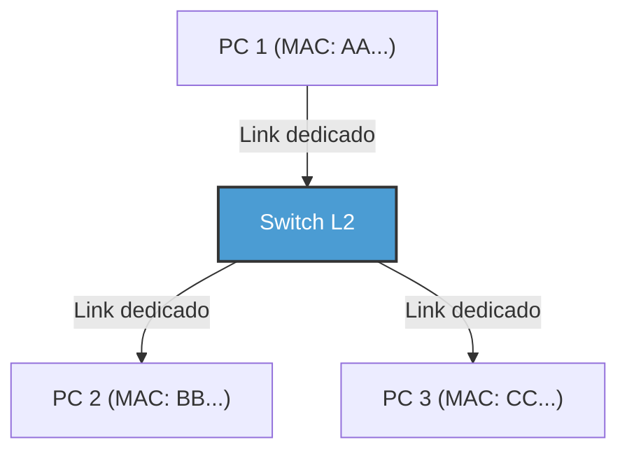

Com a introdução dos switches, a fiação entre cada nó e o switch tornou-se independente lógica e fisicamente (topologia em estrela). Como resultado, devido à separação dos caminhos de comunicação, não ocorreram mais colisões fundamentalmente. Assim, tornou-se possível a "comunicação full-duplex (Full-Duplex)", que usa as linhas de transmissão e recepção simultaneamente.
No Ethernet moderno, o algoritmo CSMA/CD não é mais utilizado, e ele evoluiu para comunicação full-duplex puramente ponto-a-ponto. Além disso, através da tecnologia VLAN (Virtual LAN) pelo IEEE 802.1Q, redes lógicas podem ser flexivelmente divididas e integradas sem estar limitadas a configurações físicas de fios. Assim, ele continua a reinar como a tecnologia fundamental absoluta que suporta a infraestrutura de empresas e imensos data centers.

### A camada de enlace de dados do Wi-Fi: Controle de tráfego de um espaço invisível de ondas de rádio
Enquanto o Ethernet com fio evoluiu para comunicação full-duplex livre de colisões, o Wi-Fi sem fio enfrenta um desafio difícil: "todos compartilham a mesma mídia única (ar) no mesmo espaço", muito similar ao antigo Ethernet de barramento compartilhado.

Na comunicação sem fio, é fisicamente impossível interceptar (CD) colisões enquanto se recebe simultaneamente o sinal fraco de rádio de outra pessoa porque as próprias ondas de rádio transmitidas são excessivamente potentes. Além disso, existe um risco exclusivo da rede sem fio: o "Problema do Nó Oculto (Hidden Node Problem)" — por exemplo, os terminais A e C em lados opostos de um ponto de acesso (access point) não conseguem interceptar as ondas de rádio um do outro, mas colidirão no ponto de acesso se transmitirem simultaneamente.

Consequentemente, o protocolo da camada de enlace de dados do Wi-Fi (camada MAC) emprega "CSMA/CA (Carrier Sense Multiple Access with Collision Avoidance: Prevenção contra colisões)".
No CSMA/CA, ouve-se (intercepta) o espaço das ondas de rádio durante um período especificado (DIFS) antes da transmissão, e em seguida a transmissão começa após esperar um tempo de backoff aleatório adicional. A diferença mais importante é o mecanismo **ACK (Acknowledge: Resposta de confirmação)**, ausente na comunicação com fio. No Wi-Fi, quem recebe os dados envia imediatamente (após um tempo de espera extremamente curto chamado SIFS) um quadro ACK que sinaliza a recepção bem-sucedida. O remetente considera que a comunicação foi bem-sucedida apenas após receber esse ACK. Se nenhum ACK for retornado, presume-se que os dados foram corrompidos por colisão ou interferência, dobra o tempo de backoff e tenta retransmitir.

Além disso, para solucionar o problema do nó oculto, existe um mecanismo denominado "RTS/CTS Handshake". Antes de transmitir grandes conjuntos de dados, o remetente envia um quadro de controle curto chamado RTS (Request to Send: Solicitação para envio) e o receptor (tal como um ponto de acesso) retorna o CTS (Clear to Send: Limpar para envio). Este CTS inclui a informação da janela de reserva (NAV: Network Allocation Vector), que informa: "A partir de agora, transmitirei por XX microssegundos; portanto, terminais adjacentes permaneçam quietos". Ao receber isso, os terminais próximos refreiam-se (pausam) na sua transmissão. Dessa forma, a camada de enlace de dados do Wi-Fi atua admiravelmente no controle de tráfego do espaço sem fio invisível.

---

## Conclusão

O mundo dos fenômenos físicos onde as ondas correm pelas fibras de vidro como fótons, resistem à pressão da água em mar profundo, e viajam pelo espaço variando amplitude e fase. E sobrepostas a esse mundo físico instável e ruidoso, são introduzidas metodologias refinadas de controle de tráfego, como sincronização via preâmbulos, identificações de hardware via endereços MAC, detecções de erro rigorosas usando CRCs, e switching ou mecanismos como o CSMA/CA, finalmente possibilitando a "entrega com sucesso de pacotes de dados (quadros) significativos ao dispositivo vizinho sem erros". Esse é o milagre que as camadas 1 e 2 alcançaram.

Contudo, unicamente com essas funcionalidades não é possível construir uma Internet global. Pois comunicações baseadas no endereço MAC funcionam somente dentro da pequena comunidade chamada "mesma rede (domínio de broadcast)", alcançando dispositivos vinculados a esse switch específico, ponto de acesso, ou até a delimitação dada por um roteador.

No próximo capítulo "Capítulo 3: Camada de rede e IP", faremos uma exploração mais profunda sobre os mecanismos épicos de descoberta de rotas. Essencialmente focaremos no IP (Internet Protocol) e em métodos de roteamento que agrupam tais pequenas redes em incontáveis quantidades ao redor do planeta para repassar pacotes em "bucket brigades" visando a infraestruturas de rede longínquas na extremidade oposta da Terra.

# Capítulo 3: A Camada de Rede e o Mecanismo de Roteamento —— O Mapa de Navegação de Pacotes Cruzando os Oceanos

O alicerce da Internet que utilizamos cotidianamente reside na terceira camada do Modelo OSI, ou seja, na "Camada de Rede". Além da comunicação direta via cabos físicos ou ondas de rádio (camada de enlace de dados), o poder de comunicar-se globalmente com um servidor a milhares de quilômetros apoia-se em incontáveis roteadores conectados, mais seus formidáveis e gigantes mecanismos autônomos de troca de tráfego para deliberação de rotas (Roteamento).

Neste capítulo, daremos aos leitores as compreensões fundamentais — até atingirmos explicações exaustivas sobre o "mecanismo de navegação" para a chegada dos pacotes ao seu rumo correto através da perspectiva da engenharia e da física, avaliando as estruturas básicas do IP, os constrangimentos na era de escassez do IPv4 até o aparecimento arquitetônico do novo IPv6, incluindo as profundidades insondáveis do protocolo inter-domínio globalmente empregado, chamado BGP (Border Gateway Protocol), encarregado de vincular múltiplos "sistemas autônomos" (AS) no mundo.

## 3.1 Paradigma da Camada de Rede: O Princípio Fim-a-Fim

O maior marco arquitetônico concebido nos sistemas iniciais no desenho da Internet diz respeito ao **Princípio Fim-a-Fim (End-to-End Principle)**. Onde as posições assumem que os "Nós intermediários das redes (Roteadores) foquem devotamente nas transmissões elementares, deixando a responsabilidade das complexas tratativas analíticas de processamento de erros bem como o sequenciamento dos pacotes ao cargo das finalidades perimetrais de ponta (End hosts)".

O legado da malha tradicional de comunicações analógicas da rede telefônica exigia redes estatais restritivas que controlavam exclusivamente e gerenciavam continuamente os "Estados (States)" de canais físicos dedicados desde o princípio da comunicação até o final. Em constraste, o modo de rede de comutação orientada da Internet não tem "estados". Cada "pacote" é gerido como uma simples "carta solta", o que incita a roteadores assumirem o ato monótono de recolher e despachar dados pelo itinerário correto em direções mais sensatas analisando os endereços (Forwarding). A parceria simbiótica entre uma malha ignorante ("Dumb Network") versus dispositivos pontuais sofisticados ("Smart Terminal"), possibilitaram e justificaram os avanços da aceitação massiva da Internet englobando toda espécie de ramificação aplicativo de alta escalabilidade.

## 3.2 O Endereço da Internet: A Evolução dos Endereços IP e a História do Esgotamento

Todo dispositivo numa rede é dotado de um identificador unívoco chamado Endereço IP. Atualmente, vivenciamos momentos de transições intermédias na Internet contendo ambos os protocolos rodando cumulativamente.

### IPv4: O Espaço de 32 bits e a Resistência à Depleção

Definido inicialmente pelo documento padronizador "RFC 791" lançado em 1981, as composições das estruturas operacionais baseiam-se em espaços algorítmicos totalizando 32 bits, significando matematicamente cerca de 4,3 bilhões de quantias independentes. Outrora visto como colossalmente grande, o esgotamento já entrava em clamores acentuados sob temores durante os anos de 1990 devido à gigantesca proliferação rápida por todo o ciberespaço global e ao crescimento generalizado entre os internautas de adoções tecnológicas.

As principais estratégias elaboradas na contenção iminente do limite consistiram na aparição do **CIDR (Classless Inter-Domain Routing)** com o **NAT (Network Address Translation)**.
As premissas rudimentares primárias atribuíam metodologias fixas ineficientes em blocos como a sub-divisão nas Classes A (/8), B (/16), até C (/24). Essas designações conhecidas sob a alcunha de "Categorizações de Classes Restritivas", catalisaram fortes consumos inúteis esgotando desnecessariamente reservas colossais. O modelo CIDR mudou este escopo por máscaras varíaveis adaptativas (VLSM), onde redes providenciam fragmentos com apenas o indispensável gerando metodologias sub-divisórias dinâmicas, criando e gerindo lógicas conhecidas por "sem classes" (classless).
Além disso, o florescimento tecnológico através do advento do "NAT" forneceu às estruturas internas locais baseadas em zonas (IPv4 privados), partilhas compartilhando unicamente por pontas terminais a nível mundial contendo debaixo desses guarda-chuvas centenas/milhares de equipamentos conectados de forma independente em apenas uma identidade "pública". Apesar de o NAT quebrar rudimentarmente os preceitos de arquiteturas fim-a-fim outrora estipulados, requer engenharia e desenvolvimentos intricados de travessias P2P (Ex: protocolos STUN/TURN/ICE) e transmissões fluídas via canais contínuos reais no tempo.

### IPv6: O Espaço Infinito de 128 bits e as Estruturas de Cabeçalhos da Próxima Geração

Como uma solução fundamental para o esgotamento de endereços, o **IPv6** foi formulado em 1998 com a RFC 2460. O IPv6 possui um espaço de endereço de 128 bits, fornecendo um espaço vasto de $2^{128}$ (cerca de 340 undecilhões), mais do que suficiente para atribuir um endereço a cada grão de areia da Terra e ainda sobrar.

A inovação do IPv6 não é apenas no comprimento do endereço. Houve uma simplificação drástica na estrutura do cabeçalho. As opções de comprimento variável e as somas de verificação (checksum) do cabeçalho que existiam no cabeçalho IPv4 foram abolidas, e o cabeçalho base foi fixado em 40 bytes. Isso acelera o processamento de pacotes (roteamento) no nível de hardware (ASIC e TCAM). Além disso, a fragmentação (divisão de pacotes) não é mais realizada pelos roteadores intermediários, tendo sido alterada para uma especificação onde apenas o host de origem a realiza, reduzindo drasticamente a carga sobre os roteadores.

## 3.3 A Dualidade do Roteamento: O Plano de Controle e o Plano de Dados

O interior de um roteador é amplamente dividido em dois "planos" (planes).

1. **Plano de Controle (Control Plane)**
   É a parte do "cérebro" onde os roteadores se comunicam uns com os outros usando protocolos de roteamento (como OSPF ou BGP), aprendem a topologia da rede (forma das conexões) e calculam a rota ideal. Os resultados dos cálculos são armazenados em um banco de dados chamado RIB (Routing Information Base).
2. **Plano de Dados (Data Plane / Forwarding Plane)**
   É a parte "muscular" que realmente recebe os pacotes, determina a interface de saída com base no endereço IP de destino e encaminha (forwards) o pacote. Ele usa uma tabela especializada para encaminhamento gerada a partir da RIB chamada FIB (Forwarding Information Base), além de memórias especiais como a TCAM (Ternary Content-Addressable Memory), para transferir pacotes em velocidade de fio (wire-speed) baseada em hardware na casa dos nanossegundos.

## 3.4 Governança Interna da Rede: IGP e os Sistemas Autônomos (AS)

A Internet não é uma única rede gigantesca, mas um aglomerado de redes independentes geridas por ISPs (Provedores de Serviços de Internet), empresas, universidades, etc. Essa área de gestão independente é chamada de **AS (Autonomous System: Sistema Autônomo)**. Atualmente, existem mais de 100.000 ASes ao redor do mundo.

Para o roteamento dentro de um AS (como em uma rede corporativa ou no backbone de um ISP), utiliza-se um **IGP (Interior Gateway Protocol)**. Existem dois principais IGPs representativos:

- **OSPF (Open Shortest Path First) / IS-IS**
  Estes são protocolos de roteamento do tipo "estado de enlace" (link-state). Um roteador envia o estado de suas conexões ao redor (largura de banda do enlace e status) por toda a rede (inundação/flooding), e cada roteador constrói um mapa completo da rede inteira (banco de dados de topologia). Sobre esse mapa, executa-se o algoritmo de Dijkstra (algoritmo do caminho mais curto) para calcular o trajeto que minimiza o "custo" até o destino. Esta é fisicamente e matematicamente a mesma abordagem que um sistema de navegação por GPS usa para calcular a rota mais curta levando em consideração o trânsito.

## 3.5 BGP: O Protocolo "Diplomático" Tecendo a Internet

Enquanto o interior do AS é governado por OSPF e afins, o responsável por conectar AS com AS e formar a Internet global é o único padrão de fato dos **EGPs (Exterior Gateway Protocols)**, o **BGP (Border Gateway Protocol)**. O BGP é um protocolo extremamente peculiar que determina rotas refletindo não apenas as distâncias técnicas mais curtas, mas também "relações de negócios" e "políticas entre países".

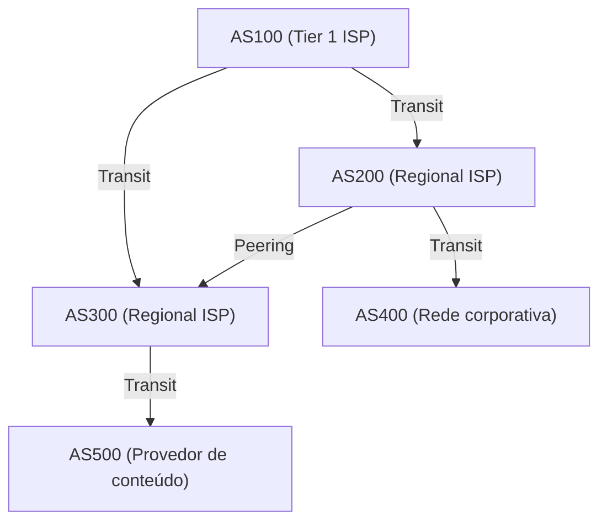

### Peering e Trânsito: A Economia da Internet

Existem basicamente dois modelos de negócios para conexão entre ASes usando o BGP.

1. **Trânsito (Transit)**
   É a relação em que um pequeno ISP ou empresa paga uma taxa de comunicação para um ISP gigante, recebendo alcançabilidade (full route) para todos os locais da Internet. Corresponde à relação mestre-escravo de "cliente" e "provedor".
2. **Peering (Troca de Tráfego)**
   É a relação em que ISPs entre si, ou um ISP e um provedor de conteúdo (como Google ou Netflix), conectam diretamente suas redes por meio de um IX (Internet Exchange), etc. Geralmente é feito gratuitamente (settlement-free), tendo como objetivo atalhos de tráfego e redução de custos.

### Path Vector e o Algoritmo de Seleção de Rotas do BGP

O BGP é um protocolo do tipo "Path Vector" (Vetor de Caminho). Ele mantém como atributo por quais ASes passou (AS_PATH) antes de alcançar uma determinada rede IP. Por exemplo, se a informação de rota mostrar `AS_PATH: [200, 100, 500]`, o pacote passa pelos ASes nessa ordem. Com isso, previne-se de forma garantida os loops de roteamento.

Quando um roteador BGP recebe várias rotas para o mesmo destino, ele seleciona apenas um melhor caminho (best path) com base em prioridades complexas (Local Preference, tamanho do AS_PATH, MED, distinção entre eBGP/iBGP, etc.). Em especial, o atributo **Local Preference (Preferência Local)** é poderoso, e permite impor políticas de negócios nos roteadores, tais como: "Mesmo que tecnicamente seja um desvio, priorize a rota pela linha de peering, pois não incorrerá em taxas de trânsito."

### BGP Hijacking e a Vulnerabilidade das Rotas

O BGP foi originalmente projetado sob a "teoria da bondade inata" (suposição de boa fé). Como ele confia que "as informações de rota declaradas por terceiros estão corretas", se um AS malicioso ou um AS que comete um erro de configuração enviar uma atualização de BGP incorreta dizendo "Eu tenho a melhor rota para a rede do Google (8.8.8.8/32)", o tráfego do mundo todo pode ser sugado para esse AS, causando o que chamamos de **BGP Hijacking (Sequestro de BGP)**.
Historicamente, grandes incidentes explorando as vulnerabilidades do BGP são inúmeros, como o evento de 2008 onde as repercussões de um bloqueio do YouTube pelo governo do Paquistão derrubaram o YouTube ao redor do mundo inteiro. Hoje em dia, a introdução de mecanismos de verificação de rotas utilizando tecnologias criptográficas, como o RPKI (Resource Public Key Infrastructure), tem avançado.

## 3.6 Limitações Físicas e a Batalha dos Roteadores: Latência e Bufferbloat

O roteamento da camada de rede é uma batalha constante contra as limitações da física.
A velocidade com que a luz avança pela fibra óptica é cerca de 67% da velocidade da luz no vácuo (aproximadamente 200.000 km/s), e um atraso físico inevitável (atraso de propagação) de cerca de 100 a 120 milissegundos é incontornável para uma viagem de ida e volta (RTT) entre o Japão e a Costa Oeste dos EUA.

Somado a isso, existem atrasos no processamento em cada roteador e os **atrasos de fila (Queuing Delay)**. Em momentos de congestionamento na rede, os roteadores armazenam pacotes temporariamente na memória (buffer). Como os roteadores recentes são equipados com memória de grande capacidade, ocorre um fenômeno onde continuam a absorver longos congestionamentos sem descartar (dropar) pacotes. A isto chama-se **Bufferbloat**. Como um enorme número de pacotes fica estagnado no buffer de forma prolongada, o controle de congestionamento de camadas superiores, como o TCP, deixa de operar normalmente, resultando em latências extremas (na ordem de milhares de milissegundos). Para resolver isso, algoritmos avançados de gestão de filas, como o AQM (Active Queue Management) e o FQ-CoDel, vêm sendo implementados nos sistemas operacionais e roteadores modernos.

## Resumo

A Camada 3 / Camada de Rede não é meramente uma transportadora de dados. Ali, a transição histórica do IPv4 para o IPv6, os processamentos em hardware na casa dos nanossegundos com TCAMs, o cálculo matemático das rotas mais curtas com o OSPF, e o controle distribuído e autônomo de rotas cheio de intenções econômicas e políticas via BGP, se entrelaçam de maneira complexa.
Para que um único pacote IP alcance seu smartphone a um servidor no lado oposto do globo, existe a colossal atividade deste sistema tão gigantesco construído pela humanidade: um número incalculável de roteadores consulta em um piscar de olhos seu próprio mapa (tabela de roteamento) e continua passando o pacote adiante, sem parar, feito um revezamento de bastões (bucket brigade).

No próximo capítulo, discorreremos sobre os mecanismos por trás das "Camadas de Transporte (TCP/UDP)" — as quais são erguidas no topo desta camada de rede — se responsabilizando pela garantia da chegada de pacotes aliada ao controle do fluxo/congestionamento.

# Capítulo 4: A Certeza e Velocidade da Camada de Transporte —— O Derradeiro Dilema Sustentando a Transmissão da Informação

## 1. Introdução: O Princípio Fim-a-Fim e a Missão da Camada de Transporte

A principal missão da camada de rede (IP), que vimos nos capítulos anteriores, é garantir que os pacotes cruzem o vasto oceano da Internet até o "computador de destino (a interface de rede do host)", de maneira física e lógica. Contudo, a comunicação não está finalizada simplesmente porque o pacote chegou ao host de destino. Os modernos sistemas computacionais operam em sistemas multitarefas executando diversos processos de aplicativos em paralelo no Sistema Operacional ao mesmo tempo (navegadores Web, clientes de e-mail, aplicativos de streaming de vídeo, processos de sincronização em segundo plano, serviços de API, etc.).

A missão e autoridade final assumida nos terminais na extração dos pacotes caóticos e emergentes que surgem um por um aleatoriamente a partir do nível IP, passa por identificar e reconhecer com sucesso de qual aplicativo específico o pacote pertence; reunificá-los e reorganizá-los em blocos de dados contínuos com significado coerente; e até complementar falhas caso essas interrupções percam partes ao decorrer desse trânsito. A camada assumidora que detém a responsabilidade inteira no gerenciamento dos dados no endpoint é conhecida por "Camada de Transporte (Transport Layer)".

Existe uma decisão arquitetônica muito elegante e bastante robusta inserida no cerne das ideias de design da própria Internet: o "Princípio Fim-a-Fim (End-to-End Principle)". Este conceito, que emergiu na década de 1980 sugerido por Jerome Saltzer e outros, estipula que: "Nós do centro das malhas interconectivas (tais como os switches e os roteadores) deverão voltar seus focos de modo único na remessa veloz de trânsito dos simples pacotes (Dumb Network); e as operações minuciosas laboriosas complexas - como os sequenciamentos protetivos em reparos nas defasagens ocorridas na comunicação, formatação corretiva em erro, e algoritmos de criptografia - precisam sem questionamento serem delegadas unicamente para os terminais nas extremidades comunicacionais conhecidas por (Smart-endpoints/Hosts espertos)". Se tais dispositivos no meio das redes precisassem abrigar funcionalidades analíticas dotadas em recuperações complexas gerenciadoras interinas mantendo os "estados de conexão", a Internet certamente jamais poderia ter atingido expansibilidade em grandezas colossais e de rápido alcance internacional experimentadas nos dias modernos.

A camada de transporte invariavelmente encontra perante os princípios e limitações ditadas nas dinâmicas da física versus das teorias abstratas em relação na informação com um grande e iminente fundamental dilema: O antagonismo e compromisso estipulado em termos de peso gerencial baseando trade-offs travado no conflito contra a lentidão focado entre as noções ligadas à "Certeza Absoluta (Reliability)" se contrapondo perante as vertentes opostas de "Velocidade Imediata (Speed / Low Latency)". Em via de manter incólume as remessas transmitidas impecavelmente, sem jamais ter pedaços deixados para trás, requer a exigência rigorosa cobrada com pesos sobre confirmações de devoluções chanceladoras (ACKs), ocasionando retardos nas dinâmicas comunicacionais amarrando impasses provocados pelo inevitável retardo regido ditado da lei restritiva universal da velocidade luz no mundo real e material. Por contraponto se desejarmos suprimir qualquer retardador nas propulsões de trânsito com latência diminuta, teremos invariavelmente abdicar, com concessões baseadas sobre os rigores perfeccionistas asseguradores com a integridade exaustiva, anulando perfeitamente a certeza na garantia. Dependendo na resolução perante esta equação balizadora no dilema restritivo interligado pelas dinâmicas naturais base e as provisões fornecedoras estipuladas e disponibilizadas para as infraestruturas dos aplicativos construídos, consolidaram e derivaram-se perante evoluções metodológicas gerando vertentes que impulsionam formatos variados protocolares de comunicações desenhados em particular nos esquemas tais quais: a natureza em robustez procedimental contínua (TCP); do desenvolvimento perante propostas operacionais impulsionadoras sem compromissos nas velocidades puras formadas (UDP); e a ascensão revolucionária arquitetural moderna e propulsora formatada presente no novo (QUIC).

## 2. TCP (Transmission Control Protocol): O Mecanismo Robusto Garantidor da Certeza

O protocolo TCP formou e obteve suas bases na formulação estrutural criada no início remoto e pioneiro pelas brilhantes mentes encabeçadas por Vinton Cerf e Robert Kahn, na longínqua era pré-comercial durante o decorrer dos idos dos anos 1970 da outrora denominada rede inicial ARPANET. O escopo conceitual formador arquitetural idealizador do desenho base era absolutamente claro nas diretrizes impostas: "Em garantia inegociável, atestar o recebimento perfeitamente adequado ausente na sua integridade perante as ocorrências destrutivas e faltantes corrompidas; sendo recebido intocável de maneira na sequência esperada imaculável eliminada qualquer dupla sobreposição excedente, encaminhando puramente ao aplicacional receptor requisitor alvo, operante não se importando das instabilidades provocadas pelas degradações frequentes nas oscilações destrutivas acarretando quedas colossais nos acidentais frequentes percalços nas perdas acidentadas perdidas corrompedoras nos pacotes em ambientes deteriorados (perdas severas nos canais de comunicação com instabilidade extrema)". Ao estipular perante as formatações criadas essa outorga balizadora os engenheiros criadores nas metodologias fornecendo a todos desenvolvimentos aplicações a isenção libertadora da total abstração na premissa operacional onde: caso acoplem no funcionamento sob o regimento propulsor TCP, se torna descartada desnecessária a complexa verificação nos desastres ocorridos na instabilidade das pontas com pacotes sumidos nas complexas e falhas malhas estruturais nas redes interconectadas sob e a sua volta; propiciando assim simplicidades construtoras efetuando puras interações baseadas puramente referenciando as metodologias aliviadoras operantes lidando "fluxos serializados em torrentes simplórias encadeadas denominadas puros: Byte Streams (Fluxos de dados serializados limpos lógicos)", promovendo providências imensuravelmente vitais conceituais fortes na formulação interativa computacional procedimental.

### Multiplexação Baseada nos Números de Porta (Ports)
Caso nós classifiquemos conceitualmente baseados por parâmetros análogos de comparações utilizando referências que estipulam Endereços IP com as definições "Indica qual casa material exata edificada global no globo terreste"; estipulando sob esta métrica a conceituação nas atribuições da base conceitual nas "Portas de Acesso no estrato Transportador da comunicação (Ports)" definem e demarcam com lógica, posições procedimentais fixas balizadoras associando na resposta a diretriz: "Qual recinto (ou processo computacional isolado na referida unidade) interno atrelado deve atuar nas provisões de ser a interface encarregadora para a entrada na edificação estipulada". As portas utilizam em bases numerais lógicas variáveis formadoras, demarcadas perfeitamente expressadas no campo delimitador em exatos 16 bits base não portando indicativos negativos (Inteiros limitados aos numéricos não assinados "unsigned integers"), balizando demarcações em números iniciadores a base delimitada originária de 0 transpassando alcances com tetos englobando referências limites máximas permitidas perfazendo exatos em 65535 demarcadores limiares limites formadores valores referenciais suportados abarcadores máximos na grade suportada atrelada numéricos abarcados valores contadores limiares totais absolutos alcançados valores.
Sendo com o arranjo deste esquema base viável interligar, acoplar e entrelaçar contundentes coexistências sucessivas massificadoras (centenas aos formidáveis milhares atrelados em fluxos autônomos simultâneos ocorrendo atrelados mutuamente paralelos em processamentos conjuntos) multiplexadas ocorrendo sobreposições simultâneas ("Multiplexing / Multiplicação conjunta operante agregadora"), escorando simultaneamente embasadas nas amarrações conjuntas balizadas utilizando sobre e apoiadas estritamente num exclusivo único formador e único limitador balizador identificador referenciado formador único baseando no arranjo referenciado sobre exclusivo identificador: o IP singular ligado indissociável atrelado amarrado apenas sobre uma exclusiva matriz interativa referenciada única provinda e geradora propulsora matriz ligante conectiva (As vinculações materiais restritivas amarradas com uma referenciadora única Placa da rede matriz referida material e referida base procedimental física da interface referida operadora construtiva e referenciadora construtora "Rede Física Interface formadora construtora base limitadora material (A referida Placa Interface na matriz atrelada operadora física)"). Os exemplificadores conhecidamente notáveis na rotina do dia são as associações fixadas mandatórias: do protocolo padrão HTTP apoiando na baliza operante sob base no valor porta referida 80; no tráfego gerencial blindador criptográfico HTTPS ancorado utilizando referenciadora Porta baseada atreladora balizadora na numeradora de base formatada fixada vinculadora do valor 443; protocolos propulsores atrelados seguros operantes nos terminais virtuais comandos remotos amparadores no conhecido nas (Criptografadas remessas seguras balizadoras em tráfegos balizadores consolidadas procedimentais em envios no Secure Shell ou "SSH") fixados referenciados vinculados perante a referenciadora da marcação fixada balizadora valorizando na numeração fixada no algarismo atrelado 22; estas formatações baseadas atreladas preestabelecidas referenciadas recebem base formadora vinculadoras conhecidas consolidadas amarradas nomeadas padronizadoras procedimentais no conceito batizadas universalmente conhecidas em "Portas famosas conhecidas universais referenciadoras populares pré-reconhecidas consolidadas padronizadoras globais (Nomenclatura técnica oficial em: Well-Known Ports)".

### O 3-Way Handshake: Consolidação na Confiança Perante Obstáculos Estagnadores Universais da Base Velocista Imutável Limitante Físicos Naturais e Morosidades Naturais Inerentes de Atrasos Decorrentes Condicionantes Retentivos Limitadores Universais
O TCP antes que lance torrentes massivas de envios informativos torrenciais colossais e despache blocos formadores amontoados propulsores informacionais comunicadores trocados efetuadores entre matriz receptora com originária geradora propulsora; realiza impreterivelmente uma sequência fixa ritualística formadora atrelada exigente obrigatória inarredável ininterrupta amarrada imperativa contundente propulsora de trâmites procedimentais consolidativos lógicos referenciados conectivos iniciadores ("Formando Ações baseadas de estabelecimentos referenciadores da união firmadora ou (A referida baseada Conexão unificadora referenciadora lógica referida "Connection")"). Esta engenhosa metodologia procedimental metodológica arquitetural balizadora complexa construtora base atreladora formadora da concepção referenciada e nominada é mundialmente conhecida apelidada e popularizada no jargão com o epíteto batizada na formatação base: "Aperto de mão contundente baseado consolidativo de etapas trilhas tripartites triplas (3-Way Handshake/ Aperto constituído procedimental sequencial de trâmites perante mãos formadoras baseadas nas três sucessivas sequenciais e continuas vias das etapas e formulações sucessórias procedimentais balizadoras sucessórias em tripla via e formato referenciadores no jargão de três vias contundentes referenciadores de sucessões e confirmações)". Isto vai muito além contundentemente superando abordagens triviais singelas pautadas unicamente efetuadas perante superficiais trocadas baseadas no intencionamento confirmador superficial de comunicação genérica; estende as abissais fundamentais profundidades pautadas construtivas nas preparações nas amarras atreladoras das formatações organizacionais complexas estáticas preparatórias formadoras da sincronização estática atrelada complexa estática amarradora da sincronização formadora conectiva referenciada (O "Synchronization/Sincronismo atrelador referenciador de formatações base referidas de sincronias complexas preparatórias").

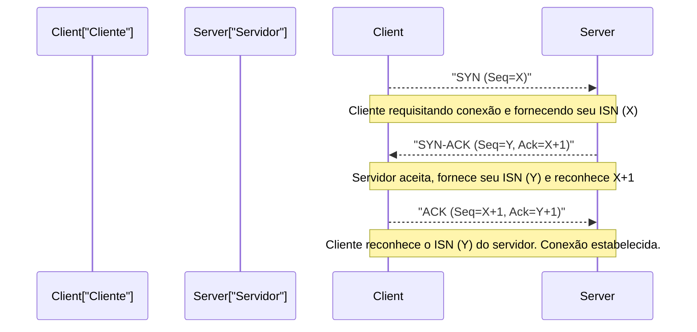

1. **SYN (Synchronize):** O cliente envia ao servidor um pacote de solicitação de sincronização (um segmento TCP com a flag SYN ativada). Neste momento, ele apresenta um "Número de Sequência Inicial" (ISN - Initial Sequence Number, aqui representado por X) de 32 bits gerado aleatoriamente. Existe um motivo para não iniciar o ISN em zero ou em um valor fixo. Serve para evitar que "pacotes fantasmas" (pacotes perdidos na rede que chegam com atraso) de uma comunicação anterior já encerrada entre o mesmo IP e porta sejam confundidos com os pacotes da nova comunicação. Além disso, há um propósito criptográfico de evitar ataques de predição de sequência TCP (IP Spoofing), onde um invasor tenta adivinhar o número de sequência para inserir dados falsos.
2. **SYN-ACK:** Quando o servidor aceita a solicitação de conexão, ele retorna um pacote SYN-ACK. Este pacote contém o ISN do cliente somado de 1 (X+1) como o "Número de Confirmação" (Acknowledgment Number), além do próprio número de sequência inicial aleatório do servidor (Y).
3. **ACK (Acknowledgment):** Como prova de que recebeu o ISN do servidor corretamente, o cliente envia um pacote ACK com Y+1 como o número de confirmação.

No momento em que essa troca de três pacotes é concluída, o estado de comunicação bidirecional é alocado na memória e a preparação para a transferência de dados está pronta. No entanto, o limite físico da infraestrutura de comunicação pesa sobre este rigoroso processo. Trata-se da "velocidade da luz".
A velocidade da luz no vácuo é de cerca de 300.000 km/s, mas devido ao índice de refração do núcleo de fibra óptica (vidro de quartzo), que é o principal backbone da Internet, a velocidade de propagação dos sinais de luz cai para cerca de dois terços disso (aproximadamente 200.000 km/s). Além disso, somam-se os atrasos de roteamento e de fila (queuing delay) causados pelos roteadores no caminho. Como resultado, o tempo de ida e volta (1 RTT: Round Trip Time) entre Tóquio e Nova Iorque (distância em linha reta de cerca de 11.000 km, mas o comprimento real do cabo é maior) exige fisicamente e inevitavelmente de 150 a 200 milissegundos. Como o 3-way handshake do TCP consome no mínimo 1 RTT, por maior que seja a largura de banda (bandwidth), a latência (atraso) durante o estabelecimento da conexão é limitada pela lei absoluta do universo, a velocidade da luz.

### Janela Deslizante (Sliding Window), Controle de Ordem e Checksum
Ao entrar na fase de transferência de dados, o TCP divide o byte stream recebido do aplicativo em segmentos de tamanho adequado (MSS: Maximum Segment Size, geralmente em torno de 1460 bytes, que é o MTU do IP menos o tamanho do cabeçalho) e os envia. A cada segmento é atribuído um número de sequência correspondente à quantidade de bytes de dados. Com base nisso, mesmo que os pacotes cheguem fora de ordem (out-of-order), o lado receptor os reorganiza na ordem correta original.

Além disso, o cabeçalho TCP inclui um "Checksum" (soma de verificação) de 16 bits, que verifica rigorosamente usando a soma de complemento de um se os dados não sofreram inversão de bit (corrupção) devido a ruídos elétricos na rota de transmissão ou erros de memória no roteador.

Se um pacote for perdido (packet loss) ou danificado e descartado no meio do caminho, o lado receptor continuará enviando ACKs para o número de sequência esperado (Duplicate ACK) ou não enviará nenhuma resposta. Se o lado transmissor não receber um ACK por um certo tempo (RTO: Retransmission Timeout) ou detectar ACKs duplicados, ele fará a "Retransmissão (Retransmit)" daquele pacote.

O conceito que eleva dramaticamente a velocidade de comunicação neste mecanismo é a "Janela Deslizante (Sliding Window)". O método "enviar um pacote e não enviar o próximo até receber o seu ACK (Stop-and-Wait)" resulta em uma queda desesperadora na taxa de transferência (throughput) nos ambientes de alta latência (onde o RTT é grande) mencionados anteriormente.
No método de janela deslizante, os lados transmissor e receptor concordam dinamicamente sobre o "tamanho da janela" (o número máximo de bytes de dados não confirmados que podem ser enviados de uma vez), levando em conta as capacidades de buffer de ambos. O remetente pode enviar vários pacotes sucessivamente para a rede, um após o outro dentro dos limites deste tamanho de janela, sem esperar pelos ACKs do receptor. E a cada ACK recebido, este limite de envio (a janela) desliza para frente. Isso concretiza o mecanismo de maximização de uso da largura de banda, ou seja, de "manter o tubo cheio de dados" em redes de alta latência e com conexões largas (ambientes com grande BDP: Bandwidth-Delay Product, o produto do atraso pela largura de banda).
### Controle de Congestionamento (Congestion Control): Harmonia Matemática para Prevenir o Colapso da Rede
Uma das verdadeiras obras-primas do TCP, e que pode ser considerada um dos avanços tecnológicos mais importantes na história da internet, é o "Controle de Congestionamento (Congestion Control)".

Em 1986, a internet inicial (NSFNET) enfrentou uma falha de sistema fatal chamada "Colapso de Congestionamento (Congestion Collapse)" devido ao aumento do volume de tráfego. Como resultado da entrada de dados que excedeu a capacidade de processamento da rede, as filas (memória buffer) dos roteadores transbordaram e uma grande quantidade de pacotes foi descartada. Os endpoints TCP, ao detectarem a perda de pacotes, determinaram que os dados não haviam chegado e realizaram a "retransmissão" dos pacotes todos de uma vez. Isso fez com que ainda mais dados fossem despejados na rede, sobrecarregando ainda mais os roteadores, e o rendimento efetivo despencou para uma fração de milhares em relação ao que era, caindo em um ciclo vicioso catastrófico.

Para prevenir a morte desta rede, em 1988, Van Jacobson e outros introduziram algoritmos de controle dinâmico avançados no TCP. O núcleo disso é o controle da Janela de Congestionamento (cwnd: Congestion Window) baseado no princípio de "AIMD (Additive Increase Multiplicative Decrease: Aumento Aditivo, Redução Multiplicativa)".

1. **Slow Start (Início Lento):** Imediatamente após o início da comunicação, a capacidade disponível da rede é completamente desconhecida. Portanto, o tamanho da janela de transmissão começa com um valor muito pequeno (historicamente 1 MSS, modernamente cerca de 10 MSS), e a cada ACK recebido, o tamanho da janela aumenta em 1 MSS. Isso resulta em um aumento exponencial onde "o tamanho da janela dobra a cada RTT". Apesar do nome "Lento", esta é uma fase para explorar a largura de banda limite de forma extremamente agressiva e em um curto espaço de tempo.
2. **Prevenção de Congestionamento (Congestion Avoidance):** Quando o tamanho da janela atinge um limite predefinido (ssthresh: Slow Start Threshold), o aumento exponencial é interrompido e muda para um aumento linear (adição de 1 MSS por RTT). É a fase de explorar de forma mais cautelosa a capacidade limite da rede (a espessura do tubo).
3. **Detecção de Perda de Pacotes e Redução Multiplicativa:** O TCP interpreta a perda de pacotes (ocorrência de timeout, ou recebimento de ACKs duplicados do lado do receptor 3 vezes consecutivas) não apenas como um erro de transferência, mas como um "sinal de que ocorreu um congestionamento na rota da rede e os pacotes transbordaram do buffer do roteador". Neste instante, o TCP aplica um autocontrole imediato e reduz drasticamente o tamanho da janela de transmissão pela metade de uma vez (ou para o valor inicial do Slow Start).

Através desse algoritmo distribuído matemático e altruísta de "compartilhar a largura de banda pouco a pouco (aumento aditivo) e ceder drasticamente se houver problemas (redução multiplicativa)", as centenas de milhões, ou bilhões, de conexões TCP independentes na internet mantêm uma harmonia miraculosa (homeostase) de "divisão justa da largura de banda" e "operação estável de toda a rede", mesmo na ausência de um administrador de tráfego centralizado.

Nos últimos anos, o aumento da capacidade da memória buffer dos roteadores saiu pela culatra e, antes que ocorra o descarte de pacotes devido ao congestionamento, os pacotes continuam a se acumular nas filas cada vez maiores, causando o problema físico de "Bufferbloat", onde o atraso (valor do Ping) salta para centenas de milissegundos a vários segundos. Para lidar com isso, os algoritmos de controle de congestionamento mais recentes, como o BBR (Bottleneck Bandwidth and Round-trip propagation time) desenvolvido pelo Google e outros, detectam o "aumento do RTT (tempo de atraso)" em vez da perda de pacotes como um sinal de congestionamento, limitando proativamente a velocidade de transmissão antes de sobrecarregar o buffer, e estão se tornando o novo padrão do TCP moderno.

## 3. UDP (User Datagram Protocol): Omissão para a Velocidade

Se o TCP é um "administrador superprotetor" que garante a certeza absoluta dos dados através de transições de estado complexas e algoritmos avançados, o UDP, que pertence à mesma camada de transporte, é um "transportador minimalista" que reduziu ao extremo o seu papel como protocolo. Projetado por Jon Postel em 1980, o UDP possui apenas as funções mínimas como camada de transporte.

O cabeçalho do UDP tem apenas 8 bytes (o cabeçalho do TCP tem geralmente 20 bytes, podendo chegar até a 60 bytes com opções). O que está incluído é apenas o "Número da porta de origem", "Número da porta de destino", "Comprimento dos dados" e um "Checksum" simples para detectar a corrupção de dados.

O UDP não implementa de forma alguma o estabelecimento prévio de conexão com handshake de 3 vias (3-way handshake), a garantia de ordem por números de sequência, o controle de fluxo por janela deslizante, os processos de retransmissão ou o controle de congestionamento para proteger a rede. Ele simplesmente embrulha os dados passados pelo aplicativo diretamente em um datagrama IP, lança-os na camada de rede e os transmite no modo "Fire and Forget (Disparar e Esquecer)". Ele nem sequer se importa se chegaram ao destinatário.

No entanto, essa simplicidade estrutural que até pode ser chamada de irresponsável é a maior arma do UDP, e a razão pela qual supera o TCP em casos de uso específicos.

### O Verdadeiro Valor do UDP: O Supremacismo da Latência e Comunicação em Tempo Real
Na comunicação em tempo real onde é necessário reduzir ao extremo a latência (atraso) física, o "controle de retransmissão para garantir a certeza" do TCP causa um problema fatal.

Por exemplo, imagine jogos online como FPS (First-Person Shooter), chamadas de voz (VoIP) ou sistemas de videoconferência (como Zoom e WebRTC). Esses aplicativos transmitem pacotes com as últimas informações de posição ou amostras de voz a uma frequência de dezenas a centenas de vezes por segundo.
Se eles estivessem usando TCP e um pacote de voz enviado há 100 milissegundos fosse perdido num roteador no meio do caminho, o TCP detectaria essa perda, retransmitiria o pacote e tentaria reproduzi-lo na ordem correta no lado do receptor. No entanto, num ambiente onde a conversa ou o jogo progridem em tempo real, "dados do passado que chegaram com centenas de milissegundos de atraso" não têm mais qualquer valor.
Pelo contrário, o TCP vai pausar o processamento (a entrega ao aplicativo) dos pacotes novos subsequentes que já chegaram, armazenando-os em buffer até que o pacote perdido seja retransmitido e a ordem esteja correta. Isso é chamado de "Head-of-Line (HoL) Blocking". Grande parte das ocorrências onde o áudio corta ou a tela do jogo congela por alguns segundos e depois avança rapidamente é causada por esse bloqueio HoL do TCP aguardando retransmissão.

O UDP, em casos como esse, permite que se desista bravamente de pacotes passados ausentes e se processem imediatamente no aplicativo os pacotes mais recentes que estão chegando. Na comunicação em tempo real, "manter a representação do estado mais recente continuamente e com o menor atraso possível, mesmo que haja algum ruído ou queda de frames" proporciona uma experiência de utilizador muito mais natural e confortável aos sentidos humanos do que "ter todos os dados completos".

Além disso, para transações simples e comunicações como a resolução de nomes de DNS (Domain Name System) ou a sincronização de tempo do NTP (Network Time Protocol), onde tudo se completa com "1 pacote de resposta" para "1 pequeno pacote de requisição", o UDP, que não possui nenhum overhead de handshake, é perfeitamente adequado.

## 4. QUIC: A Mudança de Paradigma na Comunicação da Internet e o Protocolo da Próxima Geração

Por várias décadas desde os primórdios da internet, a nossa arquitetura de rede esteve prisioneira do dualismo fixo de que "se queres transferência de stream fiável, usa TCP; se queres velocidade e tempo real, usa UDP". No entanto, na drástica evolução da Web moderna (especialmente a disseminação da comunicação móvel e a era do HTTP/2, que carrega enormes quantidades de recursos em paralelo), as limitações em que a própria concepção fundamental do TCP se torna um obstáculo começaram a revelar-se.

O maior desafio nisso é o "Bloqueio Head-of-Line (HoL)" peculiar ao TCP mencionado na secção do UDP, e a "latência excessiva" que acompanha o estabelecimento da conexão.
O TCP gere toda a comunicação como um "único fluxo de bytes em série". Suponha que solicitou vários ficheiros em simultâneo (multiplexados) em HTTP/2, como HTML, CSS, JavaScript e dezenas de imagens, para exibir um site moderno. Mas, por se tratar de um fluxo único no nível do TCP subjacente, se um único pacote da "Imagem A" for perdido, a camada TCP irá bloquear a nível do kernel do SO até a entrega dos pacotes do "Script B" ou da "Imagem C" que não deveriam ter relação, até que a retransmissão do pacote perdido seja concluída.
Além disso, a Web moderna exige criptografia (TLS/HTTPS), mas, com a pilha de protocolos convencional, após concluir o "Handshake de 3 Vias do TCP (1 RTT)", realiza-se um novo "handshake para troca de chaves de criptografia TLS (1 a 2 RTT)". Isso consome um enorme atraso físico de 2 a 3 RTTs até que o envio de dados seguro realmente comece.

Para resolver esses problemas fundamentais e trazer uma mudança de paradigma na infraestrutura moderna da internet, o protocolo de transporte de próxima geração, liderado no seu desenvolvimento pelo Google e padronizado pela IETF (Internet Engineering Task Force), é o "QUIC (Quick UDP Internet Connections)". E o padrão da Web que redefiniu o QUIC como seu protocolo de base é o "HTTP/3".

### A Ossificação das Middleboxes e a Fuga para o Espaço de Utilizador
A abordagem mais inovadora do QUIC é o design audacioso de arquitetura que **"reconstruiu completamente uma nova camada de transporte no espaço de utilizador que integra a criptografia e a multiplexação por cima dos pacotes UDP existentes"**.

Por que foi criado em cima do UDP, em vez de se aperfeiçoar o TCP? Incontáveis roteadores, firewalls e "middleboxes" como NAT (Network Address Translation) na internet tornaram-se inflexíveis após anos de operação, descartando de modo incondicional novos protocolos (com novos números de protocolo) além do TCP e UDP como se fossem "ameaças desconhecidas" (esse fenômeno é chamado de Ossificação da Internet). Além disso, como a implementação do TCP está profundamente enraizada no kernel do sistema operacional (SO) do Windows ou Linux (codificada no núcleo), levaria uma quantidade imensa de anos para atualizar os SOs a nível global e disseminar um novo algoritmo.
Assim, o QUIC adotou a estratégia de permitir que as middleboxes o deixem passar apenas como "pacotes UDP convencionais", enquanto o seu interior (nos navegadores e aplicativos no espaço de utilizador) implementa de forma independente as partes excelentes do TCP (como o controlo de congestionamento e a retransmissão) desenvolvidas para um estado mais avançado.

### O Mecanismo Inovador do QUIC e a Transcedência das Limitações Físicas

1. **Total Eliminação do Bloqueio HoL pela Independência das Streams:**
   O QUIC possui a capacidade de gerir vários "streams independentes" lógicos a nível de protocolo, em vez de um único fluxo de pacotes. No exemplo anterior, se pacotes da Imagem A forem perdidos no caminho, o QUIC apenas suspende o stream da Imagem A, aguardando retransmissão, e os streams do Script B e da Imagem C não são afetados de todo, prosseguindo com o processamento em paralelo. Isso melhora drasticamente a velocidade de exibição de páginas web em redes móveis, onde a perda de pacotes ocorre com frequência.
2. **Estabelecimento de Conexão em 0-RTT (Zero-RTT) e Integração de Criptografia:**
   No QUIC, uma criptografia equivalente à do TLS 1.3 está profundamente integrada no protocolo desde o início. Ele não comete a insensatez de separar "conexão de transporte" de "conexão de criptografia", como faz o TCP. Mesmo com um servidor onde seja a primeira vez a comunicar, ele conclui a conexão e a troca de chaves de criptografia num único RTT (1 RTT). E de forma ainda mais inovadora, se o servidor for um parceiro com o qual comunicou no passado (um servidor com um ticket de sessão na cache), pode-se iniciar as solicitações HTTP de imediato a par do envio dos primeiros pacotes de dados sem ter de aguardar pelo handshake, ou seja, através do **"0-RTT"**. Essa é uma resposta extremamente brilhante através do desenho de protocolo à limitação física que é o "atraso pela velocidade da luz".
3. **Migração de Conexão (Independência de Endereço IP):**
   As conexões TCP convencionais eram fortemente restritas por 4 elementos (4-tupla): "IP de origem, Porta de origem, IP de destino, Porta de destino". Por isso, se o utilizador andasse por aí com um smartphone, saísse de um ambiente Wi-Fi e mudasse para uma conexão celular 4G/5G, no momento em que o endereço IP mudasse, a conexão TCP caía e era necessário reiniciar o longo processo de handshake.
   O QUIC, por sua vez, gere cada conexão não pelo endereço IP, mas por um "ID de Conexão (Connection ID)" único gerado no início da comunicação. Por isso, mesmo se o endereço IP físico ou a interface da rede mudarem dinamicamente, desde que o ID de conexão seja idêntico, um download de um ficheiro de grande capacidade ou uma visualização em streaming de um vídeo podem continuar de forma fluída e ininterrupta. Na atualidade, onde as comunicações móveis são os protagonistas, pode-se afirmar que esta é uma caraterística extremamente poderosa e incontornável.

## 5. Conclusão: A Evolução dos Protocolos e a Construção da Ordem que Governam o Caos

A camada de transporte construiu uma "ordem lógica formidável" e fidedigna que as aplicações podem utilizar com total segurança acima do caos da camada de rede (IP) da internet, em que variações constantes, mudança de rotas e inversão de percursos assim como perda de pacotes são problemas diários.

O robusto modelo matemático e de controle de congestionamento do TCP, desenvolvido e aprimorado por Vinton Cerf, Van Jacobson e outros, ainda defende hoje o backbone da internet do colapso e suporta a transferência de dados no mundo inteiro. Segue-se a simplicidade do UDP, respondendo às demandas de comunicações em tempo real e perseguindo os limites da latência física. Finalmente, temos a arquitetura sofisticada do protocolo QUIC que nasceu combinando criptografia e multiplexação e de forma a estar perfeitamente otimizado para o moderno ambiente móvel, para superar os limites de ambos os protocolos anteriores.

Tudo isso não é senão a cristalização da contínua pesquisa tecnológica da humanidade à questão: "Como transmitir a informação rápida e com fiabilidade, dentro do condicionamento físico da limitação de largura de banda e limite da velocidade da luz entre computadores situados a grandes distâncias?".

Apenas quando os pacotes são reordenados para a sequência correta e são finalmente entregues às aplicações como blocos de dados com significado, aí a simples sequência de sinais elétricos inicia o seu papel em ter o valor de "informação". No próximo capítulo, iremos aprofundar-nos nos domínios do mecanismo da "camada de aplicação (HTTP, DNS, etc.)" na qual é elaborada, de maneira direta, o mundo da Web com o qual interagimos no dia-a-dia, que é construída em cima deste robusto fundamento que esta camada de transporte proporciona.

# Capítulo 5: A Camada de Aplicação e os Bastidores da Web —— O Abismo da Resolução de Nomes à Comunicação Criptografada

Nos capítulos anteriores, começamos pelo comportamento da camada física, com os fotões avançando sob a forma de reflexão total no interior das fibras óticas e as ondas eletromagnéticas propagando-se nos fios de cobre, passamos para o roteamento dos pacotes pelo IP e exploramos a fundo a certeza das transferências de dados na camada de transporte via TCP/UDP. Neste capítulo, entraremos finalmente na área com que nós humanos interagimos diretamente: a "camada de aplicação".

As sétima (camada de aplicação), sexta (camada de apresentação) e quinta (camada de sessão) camadas do modelo de referência OSI são frequentemente integradas na arquitetura de camadas TCP/IP moderna como uma única "camada de aplicação". A camada de aplicação está posicionada no nível mais alto de abstração e é um ecossistema complexo tecido por múltiplos protocolos. Aqui, dissecaremos ao extremo os mecanismos que ocorrem nos bastidores desde o momento em que digitamos um URL na barra de endereços do navegador até a página web ser exibida: a resolução de nomes pelo DNS, a transferência de recursos pelo HTTP e o mecanismo de criptografia pelo SSL/TLS (indispensável na internet moderna), a partir do contexto histórico, engenharia de rede e uma perspetiva matemática avançada.

## 5.1 DNS (Domain Name System): As Maravilhas e Genealogia da Base de Dados Hierárquica Distribuída

Endereços IP (valores numéricos de 32 bits no IPv4, 128 bits no IPv6) são ideais para a construção de tabelas de roteamento para equipamentos de rede como roteadores e switches encaminharem pacotes, mas são completamente inadequados para que seres humanos os memorizem intuitivamente, atribuam significados e os utilizem.

Nos primórdios da ARPANET, a origem da internet, o mapeamento entre nomes de host e endereços de rede era gerido por um método extremamente primitivo. O Network Information Center (NIC) do Stanford Research Institute (SRI) geria centralizadamente um único arquivo de texto chamado `HOSTS.TXT`, e cada nó fazia o download deste arquivo via FTP durante a noite para atualizar o seu próprio sistema local. No entanto, ao entrar na década de 1980, quando o número de hosts conectados à rede começou a apresentar um aumento exponencial explosivo, este modelo centralizado expôs limitações fatais: gargalos de tráfego, atrasos nas atualizações e colisões de nomes (esgotamento do namespace).

Para superar esta crise de escalabilidade, em 1983, Paul Mockapetris projetou e propôs o DNS (Domain Name System), definido nos RFC 882 e RFC 883. A essência da arquitetura do DNS é ser um armazenamento de valor-chave (Key-Value store) hierárquico distribuído à escala global. Para eliminar pontos únicos de falha e ter uma escalabilidade quase infinita, este sistema adota um paradigma distribuído inovador, onde o espaço de domínio é dividido numa estrutura em árvore, com a respetiva autoridade administrativa delegada (Delegation).

### A Viagem Infindável da Resolução de Nomes: Dos Stub Resolvers até aos Servidores Autoritativos

No instante em que o utilizador insere `https://www.example.com` na omnibox do browser, o Stub Resolver interno do sistema operativo é acionado e uma épica "jornada de resolução de nomes" tem início em segundo plano. Este processo é, também, uma sucessão de estratégias de cache para contornar as restrições das leis da física chamadas latência de rede.

1. **Consulta de Cache em Múltiplas Etapas:** Primeiro, é verificado o cache local do browser, que possui a menor latência. A seguir, o cache de DNS do SO e, depois, o cache de DNS do roteador na rede local. O meio mais eficaz de superar a restrição física da velocidade da luz (cerca de 300.000 km/s no vácuo e cerca de dois terços disso na fibra ótica) é não gerar qualquer comunicação na rede para começar.
2. **Consulta ao Resolvedor Recursivo (Full Resolver):** Se não houver cache local, a consulta é enviada para um resolvedor recursivo (Recursive Resolver / Full Resolver) operado pelo ISP ou por provedores de DNS público (como o `8.8.8.8` do Google ou o `1.1.1.1` da Cloudflare). Este resolvedor assume a responsabilidade por todo o processo de resolução de nomes em nome do cliente.
3. **Consulta Iterativa ao Servidor Raiz (Root Server):** Se também não houver o registo correspondente no cache do full resolver, ele faz uma consulta ao "servidor raiz", o ápice absoluto da hierarquia de domínios. Os servidores raiz consistem atualmente em 13 clusters, de A a M, em todo o mundo. O servidor raiz não conhece diretamente o endereço IP de `www.example.com`, mas responde (Referral: resposta de delegação) com uma lista dos servidores de nomes que gerem o TLD (Top Level Domain) `.com`. Além disso, os servidores raiz espalhados pelo mundo partilham endereços IP através da tecnologia de roteamento "Anycast" e, pela seleção de rota do BGP (Border Gateway Protocol), o tráfego é guiado autonomamente para o servidor física e topologicamente mais próximo do cliente.
4. **Consulta Iterativa ao Servidor TLD:** A seguir, o full resolver lança a consulta a um dos servidores TLD do `.com` apresentados. O servidor TLD retorna os endereços IP (registos NS) dos servidores DNS Autoritativos (servidores de nomes) a quem foi delegada a autoridade administrativa do `example.com`.
5. **Consulta ao Servidor DNS Autoritativo e Aquisição do Registo:** Finalmente, o full resolver acessa diretamente o servidor DNS autoritativo do `example.com`. O arquivo de zona do servidor autoritativo contém a resposta final, ou seja, o registo A (endereço IPv4), o registo AAAA (endereço IPv6) ou o registo CNAME (alias) do `www`, e estes são devolvidos ao stub resolver do cliente através do full resolver.

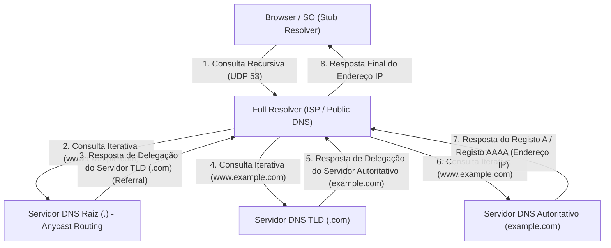

Esta complexa comunicação hierárquica de ida e volta geralmente é concluída em um tempo fugaz de apenas alguns a algumas dezenas de milissegundos. O DNS usa principalmente a porta 53 do UDP como seu protocolo da camada de transporte. Ao eliminar completamente o overhead de ida e volta do 3-way handshake do TCP (SYN, SYN-ACK, ACK), ele alcança uma redução extrema de latência. No entanto, um fallback (recuo) para a porta 53 do TCP, altamente confiável, está previsto quando a carga útil de resposta do DNS excede o limite histórico do UDP de 512 bytes (atualmente maior com a extensão EDNS0), ao verificar chaves do DNSSEC (DNS Security Extensions) - uma extensão de assinatura digital criptográfica para impedir ataques de envenenamento de cache DNS -, ou ao realizar transferência de zona (AXFR).

## 5.2 Arquitetura HTTP e a Teoria da Evolução do Protocolo

O navegador, que obteve o endereço IP do servidor alvo pelo DNS, estabelece em seguida uma conexão TCP com o servidor de destino (porta 80 ou 443) e inicia um diálogo usando o HTTP (HyperText Transfer Protocol), a principal linguagem da camada de aplicação.

Inventado em 1989 por Tim Berners-Lee no Conselho Europeu para a Pesquisa Nuclear (CERN), o HTTP era originalmente um protocolo extremamente simples para que físicos de todo o mundo partilhassem documentos de pesquisa (hipertexto) de forma eficiente em rede e os vinculassem através de links. A sua estrutura clara, baseada em texto – constituída por linha de requisição (método, URI, versão do protocolo), campos de cabeçalho, linha vazia (CRLF) e corpo da mensagem – impulsionou vigorosamente a difusão e a depuração (debugging) dos sistemas.

A filosofia de design fundamental e a maior caraterística do HTTP é ser "sem estado (Stateless)". O servidor não mantém absolutamente nenhum estado ou contexto das requisições passadas do cliente em memória. Cada requisição é concluída como uma transação completamente independente. Devido a esta característica de não manter o estado, que é comparável com a arquitetura REST (Representational State Transfer), a implementação do servidor tornou-se drasticamente mais simples, e também facilitou o scale-out (balanceamento de carga), permitindo escalar de forma horizontal no processamento para gerir volumes massivos de tráfego. O balanceador de carga garante o mesmo resultado independentemente de qual servidor backend recebe a requisição. No entanto, em aplicações Web interativas modernas, onde o controle de estado (State) é inevitável – como nas funcionalidades de carrinho de compras de sites de e-commerce e na manutenção da sessão de login do utilizador – essa estrita ausência de estado torna-se uma grande limitação. Para contornar isso fora do protocolo, foram criados mecanismos pseudogerenciadores de estado, como os Cookies, que fazem com que o lado do cliente armazene os estados através de cabeçalhos HTTP, e tokens de sessão.

### A Luta Contra as Limitações Físicas: A Mudança de Paradigma do HTTP/1.1 para o HTTP/3

Com a difusão explosiva da Web e o crescimento maciço de recursos em páginas únicas (imagens, CSS, JavaScript, etc.), o HTTP confrontou-se com as leis físicas das redes (limitações de atraso da velocidade da luz e a perda de pacotes) e evoluiu de modo drástico em arquitetura ao nível do protocolo.

- **HTTP/1.1 (1997 - ):** No HTTP/1.0 original, cada vez que se solicitava um recurso, a conexão e a desconexão TCP (3-way handshake e 4-way handshake) eram repetidas, o que constituía o cúmulo da ineficiência sob o ponto de vista da latência. No HTTP/1.1, a Conexão Persistente (Keep-Alive) foi padronizada, permitindo a reutilização de uma única conexão TCP e reduzindo drasticamente os custos de conexão. No entanto, a tecnologia de pipelining do HTTP/1.1 não se popularizou devido a dificuldades de implementação e problemas de compatibilidade com proxies intermediários, e sofria de uma falha estrutural fatal conhecida como "Bloqueio Head-of-Line (HoL)". Este é o fenómeno em que, sobre uma única conexão TCP, enquanto o servidor processa um recurso enorme ou uma requisição pesada, as requisições subsequentes ficam entupidas na fila, piorando a latência geral. Para contornar isso, os navegadores foram forçados a depender de truques de força bruta (como o domain sharding), estabelecendo simultaneamente múltiplas conexões TCP (geralmente cerca de 6) para o mesmo domínio.
- **HTTP/2 (2015 - ):** Baseado no protocolo SPDY desenvolvido pelo Google, o HTTP/2 renovou a arquitetura a partir de seus fundamentos, passando do protocolo baseado em texto para o "baseado em frames binários". A inovação mais importante é a "Multiplexação de Streams (Multiplexing)". No HTTP/2, tornou-se possível criar múltiplos "streams" virtuais dentro de uma única conexão TCP, dividindo os dados de requisição e resposta em pequenos frames binários e transmitindo-os intercalados, independentemente da ordem. Isso eliminou completamente o bloqueio HoL na camada de aplicação. Além disso, o mecanismo de compressão de cabeçalho através do algoritmo HPACK (uma combinação de codificação de Huffman estática e uma tabela dinâmica) reduziu drasticamente a quantidade de dados transmitidos redundantes, como Cookies e User-Agent repetidos em cada solicitação, otimizando de sobremaneira a eficiência de utilização da largura de banda da rede ao limite extremo.
- **HTTP/3 (2022 - ):** O HTTP/2 resolveu brilhantemente o bloqueio HoL na camada de aplicação, mas a barreira física do "bloqueio HoL por perda de pacotes" na camada de transporte subjacente (TCP) permaneceu. Para garantir a fiabilidade, o TCP interrompe a entrega à camada de aplicação de pacotes de dados de todos os streams na conexão TCP até que a retransmissão de um pacote perdido seja concluída (efeito colateral do mecanismo de garantia de sequência do TCP). Para ultrapassar este problema, o HTTP/3 realizou uma drástica mudança de paradigma ao abandonar o TCP, que foi a fundação da internet por décadas, e adotar o "QUIC (Quick UDP Internet Connections)", um novo protocolo de transporte baseado no UDP. O QUIC evitou o atraso na evolução causado pela implementação do TCP no espaço do kernel do SO e incorporou, em uma camada superior ao UDP que pode ser implementada no espaço do utilizador, seu próprio controlo de retransmissão, controlo de congestionamento e um controlo de fluxo independente para cada stream. Se um pacote for perdido, apenas aquele stream específico será afetado, permitindo que os outros streams continuem o processamento sem serem bloqueados. Ademais, o QUIC integrou o handshake de estabelecimento de conexão com o handshake de criptografia (TLS 1.3), viabilizando o início da transmissão de dados criptografados em "0-RTT (Zero Round Trip Time)" com servidores com os quais já se tinha comunicado no passado. É a cristalização de um resultado da busca pela performance derradeira, diminuindo totalmente a frequência de idas e vindas de comunicação (RTT) na camada de protocolo, em resposta aos limites físicos da velocidade da luz (inevitavelmente causando atrasos de centenas de milissegundos para se comunicar com o outro lado da Terra).

## 5.3 O Mecanismo de Criptografia e Confiança: O Abismo Matemático e a Lógica de Prova do SSL/TLS

A internet é essencialmente uma rede de comunicação de pacotes aberta, onde os dados são transferidos em estilo "linha de balde" para o seu destino através de inúmeros roteadores e cabos de fibra ótica submarinos. Qualquer nó nessa rota (roteadores intermediários, ISPs mal-intencionados, ou espiões na mesma rede Wi-Fi) tem a capacidade física de interceptar o conteúdo da comunicação por captura de pacotes, e até de alterá-lo. Para conter a vulnerabilidade absoluta desta rede pelo poder da matemática avançada e instituir um canal de comunicação seguro, usa-se o protocolo SSL (Secure Sockets Layer) e o seu sucessor, o protocolo TLS (Transport Layer Security).

O TLS assegura os seguintes "três pilares da segurança" nas comunicações modernas da Web:
1. **Confidencialidade (Confidentiality):** O facto de o conteúdo da comunicação ser impossível de decifrar, mesmo que seja intercetado por terceiros.
2. **Integridade (Integrity):** A garantia de que nem um único bit dos dados foi alterado na rota da comunicação. É assegurada por MAC (Message Authentication Code) e AEAD (Authenticated Encryption with Associated Data).
3. **Autenticação (Authentication):** A confirmação de que o parceiro de comunicação é o proprietário legítimo do domínio (o servidor verdadeiro).

A tecnologia que torna isso realidade é a cristalização da teoria criptográfica que a humanidade vem edificando por séculos, e que deu um salto drástico em especial devido ao desenvolvimento das ciências da computação e da teoria dos números após a Segunda Guerra Mundial.

### Troca de Chaves e Criptografia de Chave Pública: A Barreira do Problema do Logaritmo Discreto e Fatoração em Números Primos

O método de criptografia mais simples e com processamento mais rápido é a "Criptografia de Chave Simétrica (Symmetric Cryptography)" (o padrão atual é o AES: Advanced Encryption Standard). Trata-se de uma técnica onde tanto o remetente quanto o destinatário usam a mesma "chave comum" para criptografar e descriptografar. Por ser leve em processamento matemático (combinando operações XOR de bits, substituições e transposições), é adequado para a criptografia em tempo real de comunicações em escala gigabit. No entanto, a criptografia simétrica abrigava um paradoxo fundamental (problema de distribuição de chaves): "Antes de iniciar a comunicação, como entregar a própria chave secreta comum, de forma segura, à outra parte?". Em comunicações com partes em que não existe uma relação de confiança prévia, tal como na internet, se for enviada de forma direta a chave comum, a mesma será intercetada a meio, desprovendo de sentido ao propósito da criptografia.

O maior avanço tecnológico na criptografia na história humana foi o algoritmo de troca de chaves publicado por Whitfield Diffie e Martin Hellman em 1976, e a "Criptografia de Chave Pública (Asymmetric Cryptography)" formulada por RSA (Rivest, Shamir, Adleman) e colegas em 1977.

Na base da criptografia de chave pública está o conceito matemático de "função unidirecional (One-way function)" ou "função unidirecional com alçapão (Trapdoor one-way function)". Esta tira partido da assimetria onde "a computação em uma certa direção (criptografia) termina instantaneamente em um computador, mas o cálculo na direção inversa (decifração ou adivinhação da chave) não terminaria, mesmo que se conetasse os supercomputadores do mundo inteiro e se continuasse o cálculo pelo período de vida útil do próprio universo".

- **Criptografia RSA:** Fundamenta-se na propriedade de que criar um número composto gigante ($N = p \times q$) pela multiplicação de dois números primos muito grandes ($p$ e $q$) é fácil (calculável em tempo polinomial), mas ao receber apenas o número composto gigante $N$, deduzir os fatores primos originais $p$ e $q$ (problema de fatoração de primos) é extremamente difícil (apenas algoritmos de tempo subexponencial são conhecidos). Tirando vantagem de propriedades profundas da teoria dos números, tais como a função totiente de Euler e o pequeno teorema de Fermat, os dados criptografados com uma chave pública constroem um alçapão matemático em que apenas quem tem a chave secreta correspondente será capaz de os descriptografar.
- **Criptografia de Curva Elíptica (ECC: Elliptic Curve Cryptography):** A ECC, que é dominante no TLS moderno, aplica a complexidade do "problema do logaritmo discreto" definido numa curva elíptica sobre um corpo finito (por exemplo, um conjunto de pontos que satisfazem uma equação como $y^2 = x^3 + ax + b$). Operações geométricas, como "adição" ou "multiplicação escalar", são definidas para pontos na curva elíptica. Encontrar o ponto $P = kG$ somando um ponto inicial $G$ a ele mesmo um número secreto $k$ de vezes é fácil, mas calcular retroativamente o coeficiente secreto $k$ (logaritmo discreto), ou seja, a quantidade de adições, a partir dos pontos públicos $G$ e $P$, é ainda mais difícil do que a fatoração do RSA. Como resultado, o ECC exibe força criptográfica igual ou superior à do RSA com uma fração muito curta do tamanho da chave do RSA (por exemplo, alcançando com 256 bits do ECC a segurança equivalente a 2048 bits do RSA), o que economiza drasticamente a carga do CPU e a largura de banda da rede.

### TLS Handshake: O Ritual Criptográfico para Construir Confiança

Ao iniciar uma comunicação segura através de HTTPS, o cliente e o servidor geram uma "chave de sessão" segura para a criptografia de chave simétrica, e executam também um protocolo de negociação avançado para autenticar a identidade da contraparte. Isto é o TLS handshake. A seguir, apresenta-se a anatomia do 1-RTT handshake na mais recente especificação "TLS 1.3", que foi otimizada para remover todo e qualquer desperdício ao limite extremo.
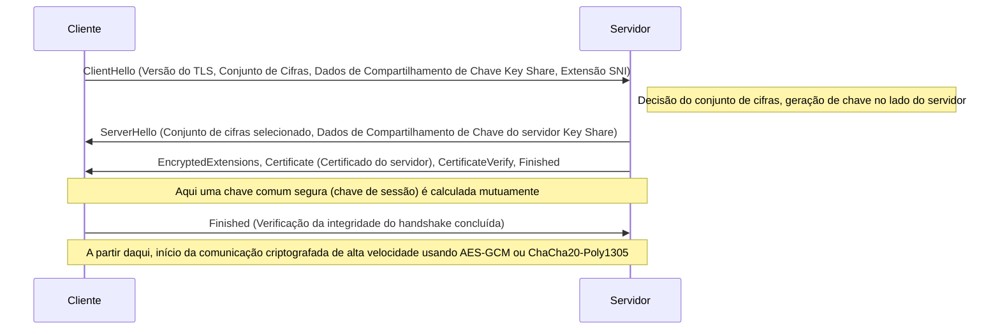

1. **ClientHello**: Ao iniciar a conexão, o cliente envia ao servidor a versão do TLS que suporta, uma lista de algoritmos de criptografia (Cipher Suites) e os parâmetros matemáticos iniciais (Key Share) para gerar a chave de criptografia. Além disso, usando a extensão SNI (Server Name Indication), ele envia o nome do host de destino (ex: `www.example.com`) em texto simples. Esta é uma informação essencial para que servidores que hospedam múltiplos domínios HTTPS em um único endereço IP (virtual hosts) possam selecionar e retornar o certificado correto.
2. **ServerHello**: O servidor seleciona o algoritmo de criptografia mais forte e ideal (ex: `TLS_AES_256_GCM_SHA384`) da lista do cliente e responde com seus próprios dados Key Share.
3. **Envio de Certificado e Assinatura (Authentication)**: O servidor envia seu "certificado digital (X.509)". Além disso, o servidor usa a "chave privada" associada a esse certificado para criar e enviar uma assinatura digital (CertificateVerify) sobre o valor hash de todas as mensagens de handshake até o momento. Isso prova matematicamente que o servidor é o proprietário legítimo desse certificado (possuidor da chave privada).
4. **Troca de Chaves (Ephemeral Elliptic Curve Diffie-Hellman: ECDHE)**: O cliente e o servidor multiplicam matematicamente o Key Share que enviaram e receberam um do outro (um ponto em uma curva elíptica pública) pelos seus próprios parâmetros secretos mantidos apenas localmente. Surpreendentemente, devido às propriedades matemáticas da troca de chaves Diffie-Hellman ($ (g^a)^b = (g^b)^a = g^{ab} $), exatamente o mesmo "segredo mestre (chave comum)" forte é magicamente sintetizado nos lados do cliente e do servidor, sem que nenhuma informação secreta seja transmitida pela rede.
5. **Perfect Forward Secrecy (PFS)**: Uma característica crucial do TLS 1.3 é que os parâmetros usados ​​para esta troca de chaves (Key Share) são gerados de forma nova e descartável (Efêmera) cada vez que uma sessão é estabelecida. Como resultado, mesmo no caso improvável de que a chave privada para identificação de longo prazo do servidor (chave RSA ou ECDSA) seja vazada para um invasor anos depois, é matematicamente completamente impossível descriptografar os pacotes de comunicação criptografados que foram gravados e salvos no passado. A confidencialidade das comunicações passadas é garantida no futuro.

### PKI e a Cadeia de Confiança (Chain of Trust): Passaportes no Mundo Digital

Nos mecanismos de criptografia discutidos até agora, resta uma falha lógica fatal. É o problema de: "Como o cliente pode ter certeza de que o certificado e a chave pública enviados pelo servidor são realmente autênticos para aquele domínio de destino (por exemplo, o site de um banco)?"
Se um intermediário malicioso controlando a rota da rede realizar um "Ataque Man-in-the-Middle", disfarçando-se de servidor e enviando seu próprio certificado falso e chave pública para o cliente, a troca de chaves e a própria criptografia serão matematicamente e perfeitamente bem-sucedidas. No entanto, a outra parte na comunicação criptografada seria o invasor, não o banco pretendido.

A estrutura sociotécnica que resolve este desafio fundamental de autenticação é a PKI (Public Key Infrastructure: Infraestrutura de Chave Pública) e a existência de "Autoridades de Certificação (CA)" que atuam como âncoras de confiança.

O proprietário do servidor cria um CSR (Certificate Signing Request - Solicitação de Assinatura de Certificado) contendo sua chave pública e o envia a uma instituição terceira confiável (CA), como DigiCert, GlobalSign ou Let's Encrypt. Após verificar (através de validação de domínio, validação de organização, etc.) que o solicitante definitivamente possui os direitos de propriedade sobre o domínio, a CA aplica uma "assinatura digital" às informações da chave pública do servidor usando a própria "chave privada" forte da CA e emite um certificado de servidor.

Por outro lado, sistemas operacionais como Windows e macOS, e navegadores como Chrome e Firefox, vêm com um grupo de "certificados raiz (chaves públicas)" de CAs raiz, que passaram por rigorosas auditorias globais com antecedência, codificados de forma rígida (hardcoded) neles como pontos de partida de confiança (Trust Anchors).

Quando o cliente recebe um certificado do servidor, ele usa a chave pública da CA raiz integrada ao sistema operacional para verificar criptograficamente a assinatura digital da CA anexada ao certificado. Se a verificação da assinatura for bem-sucedida, prova-se que o conteúdo do certificado (nome de domínio e chave pública) é garantido pela CA e não foi adulterado.

1. O cliente confia na CA raiz incondicionalmente (pré-instalação no armazenamento de confiança - trust store).
2. A CA raiz confia e assina CAs intermediárias.
3. A CA intermediária confia e assina a entidade final (servidor Web).

Através desta relação transitiva conhecida como "Cadeia de Confiança (Chain of Trust)", construímos de forma dinâmica e instantânea uma forte relação de confiança com servidores desconhecidos distantes fisicamente, e estabelecemos um canal de comunicação criptografado seguro.

## Conclusão: A Fusão de Camadas e o Próximo Nível

No Capítulo 5, realizamos uma dissecação detalhada da resolução de nomes, dos protocolos para solicitar e responder dados e do véu matemático de criptografia que envolve tudo isso - desenrolando-se nas profundezas da camada de aplicação.
O DNS atua como o vasto catálogo de endereços distribuído da Internet, o HTTP estabelece a arquitetura como o transportador de recursos e o TLS os guarda firmemente com a armadura da teoria criptográfica de ponta. Historicamente, essas foram projetadas como camadas de protocolo independentes, mas na Web moderna, como visto no HTTP/3 (QUIC), as fronteiras entre as camadas de transporte, aplicação e criptografia estão intimamente fundidas, evoluindo para uma forma refinada que rompe os limites da latência física, buscando simultaneamente o máximo de desempenho e segurança.

No próximo capítulo, mergulharemos em profundidades técnicas ainda maiores na "estrutura interna dos sistemas de back-end e computação distribuída" - observando como as solicitações que passaram por essa comunicação criptografada forte e atingiram o lado do servidor geram conteúdo dinâmico e interagem com os sistemas de banco de dados subjacentes.

# Capítulo 6: A Infraestrutura Física que Sustenta a Internet —— O Gigantesco Mecanismo Tecido por Luz, Calor e o Oceano

A Internet é frequentemente falada como o conceito abstrato e intangível de "a nuvem" (cloud). Podemos ter a ilusão de que os dados enviados de nossos smartphones ou computadores são sugados por ondas de rádio ou cabos invisíveis para um armazenamento "em algum lugar no céu". No entanto, a realidade da Internet não é tão leve quanto uma nuvem. Trata-se de uma entidade extremamente massiva e material, fortemente limitada pelas leis da termodinâmica, da óptica e da geofísica - nada menos que a maior infraestrutura física da história da humanidade.

Neste capítulo, dissecaremos completamente os três pilares gigantes que manifestam essa "rede invisível" no mundo físico: os "cabos submarinos" que formam a rede neural global, as instalações de processamento termodinâmico para armazenar e calcular dados conhecidas como "Data Centers de Hiperescala", e a "CDN (Rede de Distribuição de Conteúdo)" que quebra a barreira da velocidade da luz para comprimir o espaço e o tempo. Exploraremos tudo isso a partir de seus mecanismos físicos, contexto histórico e da perspectiva tecnológica e profissional em busca do extremo.

---

## 1. A Rede Neural de Luz Envolvendo a Terra: Sistemas de Cabos Submarinos

Atualmente, cerca de 99% da comunicação internacional da Internet através das fronteiras não passa por satélites no espaço, mas através de "Cabos Submarinos de Comunicação" de apenas alguns centímetros de diâmetro dispostos no fundo do oceano. Quando navegamos em sites estrangeiros, nossos dados correm pela escuridão do mar profundo, a milhares de metros abaixo, na velocidade da luz.

### 1.1 A Evolução do Telégrafo para a Fibra Óptica e o Desafio ao Limite de Shannon

A história dos cabos submarinos é muito mais antiga do que o nascimento da Internet, remontando à colocação do cabo telegráfico através do Canal da Mancha em 1850. O primeiro cabo telegráfico transatlântico foi instalado em 1858, mas utilizava código Morse, e levava mais de dez horas para transmitir uma mensagem da Rainha Vitória ao Presidente dos EUA, Buchanan. Mais tarde, após a era das linhas telefônicas analógicas usando cabos coaxiais, a introdução de cabos de fibra óptica começou no final da década de 1980. O "TAT-8", o primeiro cabo transatlântico de comunicação óptica colocado em 1988, tinha uma capacidade de 280 Mbps (equivalente a cerca de 40.000 linhas telefônicas), uma largura de banda revolucionária para a época.

Os cabos submarinos modernos ostentam uma capacidade de comunicação insondável de centenas de Tbps (Terabits por segundo) em um único cabo. Este avanço exponencial foi possibilitado por dois avanços na física e engenharia dignos de um Prêmio Nobel: "Multiplexação por Divisão de Comprimento de Onda (WDM: Wavelength Division Multiplexing)" e "Amplificador de Fibra Dopada com Érbio (EDFA: Erbium-Doped Fiber Amplifier)".

WDM é uma tecnologia que multiplexa luzes de diferentes comprimentos de onda (cores) em uma única fibra óptica para transmissão simultânea. Isso aumenta a capacidade de transmissão por fibra multiplicativamente pelo número de comprimentos de onda. No entanto, não importa quão purificado seja o vidro de quartzo - o material da fibra óptica - o sinal óptico inevitavelmente atenuará devido à dispersão de Rayleigh e à absorção infravermelha ao longo de várias centenas de quilômetros. É aí que entram os repetidores, instalados a cada poucas dezenas a centenas de quilômetros.

Os repetidores do passado usavam um processo complexo e restritivo (conversão O-E-O) de converter sinais ópticos atenuados em sinais elétricos, amplificá-los e convertê-los de volta em sinais ópticos. No entanto, o EDFA, comercializado na década de 1990, possibilitou a amplificação direta do sinal óptico "como luz" dopando o núcleo da fibra óptica com o elemento de terra rara Érbio e irradiando-o com um forte laser chamado luz de bomba. Como resultado, tornou-se possível amplificar simultaneamente múltiplos sinais ópticos de diferentes comprimentos de onda e, quando combinado com a tecnologia WDM, a capacidade de comunicação explodiu.

Atualmente, o campo da engenharia de comunicações está se aproximando do limite teórico da capacidade do canal proposto por Claude Shannon, conhecido como "Limite de Shannon (Shannon Limit)". Para ultrapassar este limite, tecnologias de camada física de próxima geração estão começando a ser pesquisadas e implementadas, como "Fibras Multimodo" que têm múltiplos núcleos dentro de uma única fibra e "Multiplexação por Divisão Espacial (SDM)" que multiplexa os modos espaciais da luz.

### 1.2 O Ambiente Físico do Mar Profundo e a Engenharia de Instalação de Cabos

A colocação de cabos submarinos é um dos empreendimentos de engenharia mais exigentes da atualidade. O cabo de milhares de quilômetros de comprimento é baixado até o fundo do oceano usando um "navio lançador de cabos" (Cable layer) especializado.

Antes da instalação, mapas topográficos detalhados do fundo do mar são criados usando ecobatímetros, e a rota ideal é selecionada evitando cadeias montanhosas submarinas, fossas, depósitos hidrotermais e áreas propensas a deslizamentos de terra. A estrutura do cabo varia drasticamente dependendo da profundidade da água em que é instalado.

Em águas rasas como plataformas continentais (profundidades de água menores do que cerca de 1000 a 1500 metros), o risco de corte físico por redes de arrasto de navios pesqueiros, âncoras de navios ou mordidas de organismos marinhos como tubarões é extremamente alto. Como resultado, é aplicado um invólucro de "Armadura" (Armor), no qual fios de aço de alta tensão são enrolados em várias camadas em torno da resina de policarbonato e do tubo de cobre que protege a fibra óptica, tornando-a mais espessa e pesada. Além disso, veículos subaquáticos operados remotamente (ROV) ou arados submarinos são usados ​​para enterrar o cabo vários metros profundamente na lama ou areia do fundo do mar.

Por outro lado, em águas profundas de milhares de metros, não há ameaça de redes de pesca ou âncoras, portanto são adotados "Cabos Leves" (Lightweight Cable) - projetados para serem robustos contra a pressão da água, mas isentos da armadura de fio de aço para evitar a quebra devido ao seu próprio peso durante a instalação. O diâmetro tem apenas cerca de 17 a 20 milímetros, da espessura de uma mangueira de jardim.

Outro aspecto físico crítico dos cabos submarinos é a "fonte de alimentação". Para acionar repetidores instalados a cada poucas dezenas de quilômetros, a corrente contínua de alta tensão é fornecida a partir de estações de aterragem de cabos (Cable Landing Stations) em terra, através de um tubo de cobre (condutor de energia) dentro do cabo. Para cabos que cruzam o oceano, a tensão de alimentação pode exceder 10.000 volts (10 kV) e o "sistema de retorno por terra em fio único", utilizando a água do mar e a terra como circuito de retorno, é comumente empregado.

### 1.3 Geopolítica e a Ascensão dos Gigantes da Tecnologia

No passado, a instalação de cabos submarinos exigia investimentos colossais, então o método dominante era que as principais operadoras de telecomunicações de vários países se unissem para formar consórcios, dividindo custos e largura de banda. No entanto, este ecossistema passou por uma transformação dramática nos últimos anos.

Um grupo de corporações gigantes de tecnologia apelidadas de "Hyperscalers" - como Google, Meta (Facebook), Microsoft e Amazon - começou a investir e a instalar cabos submarinos de forma independente ou em parceria, para conectar seus próprios data centers em velocidades ultrarrápidas. Eles deixaram de ser meros usuários da Internet para se tornarem os maiores proprietários da infraestrutura física. Como resultado, o roteamento de cabos está sendo otimizado das conexões convencionais "entre as principais cidades" para conexões "mais curtas e rápidas entre seus próprios data centers".

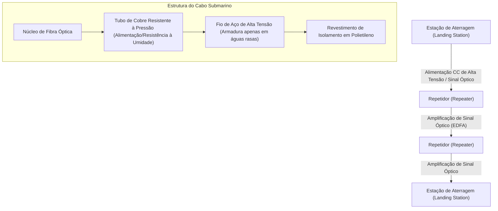

---

## 2. Instalações de Processamento Termodinâmico de Dados: Data Centers de Hiperescala

Dados que chegam à terra através de cabos submarinos são finalmente transportados para "Data Centers". Data centers são edifícios gigantescos que abrigam grupos de servidores na escala de dezenas a centenas de milhares, realizando cálculos contínuos e armazenamento 24 horas por dia, 365 dias por ano.

### 2.1 A Realidade da Nuvem e a Batalha da "PUE"

De uma perspectiva física, a essência de um data center é uma "máquina térmica gigantesca que toma energia elétrica maciça como entrada para produzir uma redução de entropia no processamento de informações (resultados computacionais) e o 'calor' inevitável acompanhante". Semicondutores, como CPUs e GPUs, geram calor devido à resistência sempre que as correntes são ligadas e desligadas. Se esse calor não for expelido de forma eficiente, o semicondutor enfrentará instantaneamente fuga térmica e será queimado fisicamente.

Portanto, o foco principal de todo o projeto e operações do data center está no "resfriamento" e "eficiência energética". A métrica mais comum para esta eficiência é o "PUE" (Power Usage Effectiveness - Eficiência no Uso de Energia).

**PUE = Consumo total de energia do data center / Consumo de energia do equipamento de TI (servidores, etc.)**

O limite inferior teórico do PUE é 1,0 (estado em que toda a energia elétrica é utilizada puramente para cálculo). Não era incomum que os data centers do passado tivessem PUEs excedendo 2,0 (o que significa que eles consumiam tanta eletricidade nos equipamentos de refrigeração, como ar condicionado, quanto nos próprios servidores). No entanto, em data centers modernos de hiperescala, ocorre otimização termodinâmica extrema para reduzir esse número à faixa de 1,1 a 1,2.

### 2.2 Evolução das Arquiteturas de Resfriamento

Com base nos princípios da termodinâmica, os sistemas de refrigeração para data centers evoluíram da seguinte forma:

1. **Separação de Corredores Frios (Cold Aisle) e Corredores Quentes (Hot Aisle)**:
   Em data centers antigos, todo o ambiente era resfriado usando sistemas de Ar Condicionado de Sala de Computadores (CRAC), mas o ar frio se misturava com a exaustão quente dos servidores, tornando-o extremamente ineficiente. Hoje, o padrão é o "Aisle Containment", onde os lados de entrada de ar e exaustão dos racks de servidores ficam voltados um para o outro e são fisicamente isolados em "corredores frios" (passagens de ar frio) e "corredores quentes" (passagens de ar quente).

2. **Free Cooling (Resfriamento por Ar Externo)**:
   É necessária uma enorme quantidade de energia para acionar os compressores dos chillers (dispositivos de circulação de água de resfriamento). Para lidar com isso, os data centers são construídos em regiões onde o ar externo é suficientemente frio (como o norte da Europa e Hokkaido), para usar "free cooling", que utiliza o ar frio externo direta ou indiretamente (através de trocadores de calor) para o resfriamento.

3. **Resfriamento por Imersão (Immersion Cooling) e Resfriamento Direto no Chip (Direct-to-Chip)**:
   Nos últimos anos, a densidade de calor das GPUs de ponta usadas em inferência e treinamento em IA está excedendo os limites físicos do resfriamento a ar tradicional (a baixa capacidade térmica e condutividade do ar). Para lidar com isso, foram introduzidos sistemas como o "resfriamento por imersão", onde placas-mãe inteiras de servidores são submersas em líquidos inertes não condutores baseados em fluorocarbonos ou óleo mineral, bem como sistemas de "resfriamento direto no chip", que acoplam blocos de resfriamento líquido (water blocks) diretamente nos dissipadores de calor de CPUs/GPUs, permitindo que a remoção de calor ocorra com um líquido que tem uma capacidade térmica infinitamente superior à do ar. No resfriamento por imersão bifásico que utiliza a mudança de fase (calor latente devido à evaporação), podem ser processados fluxos de calor excepcionalmente altos.

### 2.3 Redundância e Segurança Física

Como os data centers são o centro da infraestrutura social, é exigida "redundância" (Redundancy) extrema. No instante em que o fornecimento de energia comercial é cortado, Fontes de Alimentação Ininterrupta (UPS) usando volantes (flywheels), baterias de chumbo-ácido e baterias de íon-lítio assumem o fornecimento de energia em milissegundos. Simultaneamente, enormes geradores a diesel e turbinas a gás localizados fora da instalação são ativados e têm a capacidade de manter toda a instalação funcionando por dias, operando com combustível armazenado.

As conexões de rede também dependem do fornecimento de linhas de comunicação a partir de múltiplas operadoras diferentes e da separação física completa das rotas (por exemplo, aproximações de diferentes direções — norte, sul, leste, oeste — do edifício) para se preparar para acidentes, como o rompimento de cabos devido a escavações.

---

## 3. A Tecnologia para Comprimir Espaço e Tempo: CDN (Rede de Distribuição de Conteúdo)

Mesmo que cabos submarinos conectem continentes e data centers acumulem informações, isso por si só não é suficiente para realizar a experiência web moderna. Há a barreira de um limite de velocidade absoluto no universo postulado por Albert Einstein — a "velocidade da luz".

### 3.1 A Barreira da Velocidade da Luz e os Limites Físicos da Latência

A velocidade da luz no vácuo ($c$) é de cerca de 300.000 km/s. No entanto, como o índice de refração do vidro de quartzo (o núcleo da fibra óptica) é de cerca de 1,47, a velocidade da luz na fibra diminui para cerca de 200.000 km/s (cerca de dois terços de sua velocidade no vácuo).

Por exemplo, a distância física em linha reta de Tóquio, Japão a Virgínia, EUA na Costa Leste (o maior cluster de data centers do mundo) é de cerca de 11.000 km, e, se considerarmos a rota dos cabos submarinos, torna-se de aproximadamente 14.000 km. O tempo puramente físico exigido para um sinal óptico viajar unidirecionalmente é de cerca de 70 milissegundos. Nas comunicações pela Internet, os pacotes exigem transporte de ida e volta (RTT: Round Trip Time), portanto um atraso físico garantido (latência) de pelo menos 140 milissegundos é ditado pelas leis da física. Além disso, um atraso extra decorrente do processamento por roteadores e switches no caminho é adicionado.

Quando você abre um site moderno, seu navegador solicita centenas de arquivos como HTML, CSS, JavaScript e imagens, fazendo várias viagens de ida e volta por conta do 3-way handshake do TCP e negociação de criptografia do TLS (SSL). Se todos os usuários tivessem que acessar diretamente o "servidor de origem" no lado oposto da Terra, atrasos de vários segundos a mais de dez segundos ocorreriam antes que as páginas da web fossem exibidas. Jogos online em tempo real e streaming de vídeo de alta definição seriam virtualmente impossíveis.

### 3.2 Distribuição para a Borda: A Arquitetura da CDN

O sistema que engendra a engenharia para superar esse limite físico e comprimir o espaço e o tempo é a "CDN" (Content Delivery Network).

A filosofia básica da CDN é extremamente simples: "Se for lento buscar os dados de um servidor de origem localizado longe do usuário, você pode simplesmente colocar com antecedência uma cópia dos dados (cache) na localização física mais próxima do usuário."

Os provedores de CDN mantêm fisicamente milhares ou dezenas de milhares de servidores de cache chamados "Servidores de Borda" (Edge Servers) localizados em data centers e instalações de ISPs em grandes cidades ao redor do mundo. Quando um usuário acessa um site, a rede da CDN determina instantaneamente a localização geográfica e de rede do usuário e roteia a comunicação para o servidor de borda com a menor latência (mais próximo).

A tecnologia principal que torna esse roteamento possível é o "Anycast" e o "Roteamento baseado em DNS" avançado. Com o roteamento Anycast, exatamente o mesmo endereço IP é atribuído a vários servidores de borda no mundo todo. Ele funciona alavancando o algoritmo de seleção de rota do BGP (Border Gateway Protocol) - a espinha dorsal da internet - de modo que os roteadores enviem pacotes automaticamente para o servidor que está no caminho de rede "mais curto". Desta forma, sem nenhuma conscientização consciente, os usuários em Tóquio são direcionados para o servidor de borda de Tóquio, e os usuários em Londres para o servidor de borda de Londres.

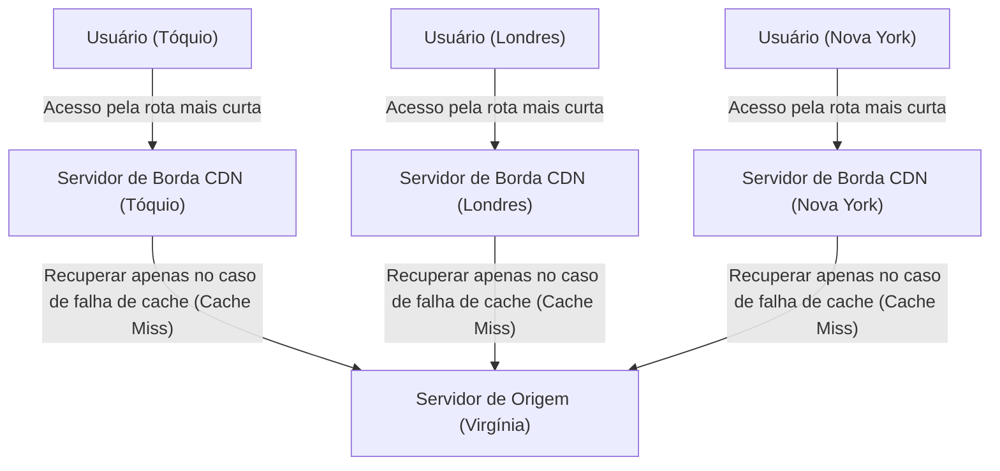

### 3.3 Otimização Dinâmica e a Chegada da Edge Computing (Computação de Borda)

As primeiras CDNs eram meros mecanismos simples que apenas faziam cache e entregavam arquivos de imagem, vídeo e HTML estático. Contudo, as CDNs modernas evoluíram de forma independente para plataformas imensas e distribuídas de computação.

Primeiro, é a otimização de entrega para conteúdos dinâmicos (resultados de pesquisa variados para cada usuário, ou conteúdos do carrinho de compras). Embora estes não possam ser armazenados em cache, a CDN otimiza independentemente o caminho da comunicação entre os servidores de borda e de origem (como Cache em Camadas e o uso de redes de roteamento privadas super-rápidas), entregando um caminho com latência e perda de pacotes muito menor em relação ao roteamento padrão e de melhor esforço do BGP da Internet. Adicionalmente, encerrando conexões TCP e sessões TLS nos servidores de borda (Terminate), o número de viagens de ida e volta para trocas de negociação de distância extrema diminuiu drasticamente.

Em segundo lugar, a ascensão da "Edge Computing" (Computação de Borda). Anteriormente, processamentos complexos de aplicações (autenticação, testes A/B, redimensionamento de imagens dinâmico ou execução de lógicas customizadas) eram realizados nas CPUs dos servidores de origem. Contudo, hoje em dia, graças a tecnologias lideradas pela Cloudflare Workers e AWS Lambda@Edge, desenvolvedores podem usar ambientes de caixa de areia isolados (como a Engine V8) para executar diretamente códigos (JavaScript, Rust, WebAssembly, etc.) em milissegundos nos próprios servidores de borda, muito perto dos usuários. Por causa disso, literalmente a "borda (edge)" da internet começou a agir como um gigantesco computador distribuído.

---

## 4. Epílogo: A Batalha Infindável contra as Limitações Físicas

A história da infraestrutura da Internet é a história das lutas contra as leis físicas absolutas e fundamentais que governam o universo: a velocidade da luz, a Segunda Lei da Termodinâmica e as leis de conservação de energia.

Os engenheiros de cabos submarinos desafiam a gigantesca pressão das profundezas do oceano e os limites óticos do vidro. Arquitetos de data centers prosseguem incansavelmente em direção a limites termodinâmicos para dissipar as temperaturas escaldantes produzidas pelas wafers de silício. Engenheiros e arquitetos nas frentes das CDNs continuam construindo sofisticados sistemas distribuídos e de software para evadir a muralha da barreira da luz.

Por trás de seu simples toque no smartphone para obter rápido acesso instantâneo a informações do outro lado do planeta, existe uma infraestrutura física material superpesada, extrema e profundamente sofisticada em pleno e ruidoso vapor de trabalho. No Capítulo 7, com esta imensa e firme fundação sob os pés, estudaremos rigorosamente como o software e os protocolos podem cooperar entre si para criar, sustentar e conduzir uma rede interconectada, autônoma, global e resiliente na parte em que caímos em profundidade em "Roteamento e o Mundo do BGP".

# Capítulo 7: A Batalha da Segurança Cibernética e Privacidade

A história da Internet é tanto a história do ideal de livre compartilhamento de informações, quanto a história da batalha constante para proteger sistemas e dados de ataques maliciosos. Inicialmente concebida como ARPANET, a Internet foi projetada com a premissa de comunicação entre pesquisadores limitados e confiáveis. Por esse motivo, no projeto fundamental dos protocolos, a "segurança" foi deixada para depois, resultando em uma arquitetura baseada na crença da boa-fé. No entanto, à medida que a rede se expandiu em escala global, foi comercializada e estabeleceu sua posição como infraestrutura, essa filosofia de projeto inicial tornou-se uma fraqueza fatal.

Neste capítulo, detalharemos ao extremo, observando o abismo da tecnologia, os mecanismos físicos e de rede dos ataques DDoS — uma das maiores ameaças que abalam a Internet moderna —, as tecnologias de criptografia e VPN (Rede Privada Virtual) para garantir a privacidade das comunicações, e o conceito de segurança de próxima geração nascido dos limites da defesa de perímetro: a "Arquitetura Zero Trust".

## 1. O Limite Físico da Rede e a Dinâmica dos Ataques DDoS

Entre os ataques cibernéticos, um dos mais primitivos e, no entanto, um dos mais difíceis de prevenir, é o ataque **DDoS (Distributed Denial of Service - Negação de Serviço Distribuída)**. Trata-se de um ataque que envia um volume massivo de tráfego que excede os limites de capacidade de processamento ou largura de banda dos servidores ou equipamentos de rede alvo, impossibilitando o fornecimento do serviço aos usuários legítimos.

### Saturação Física do Tráfego: O Limite da Largura de Banda

A Internet transmite dados através de meios físicos, como fibras ópticas, fios de cobre e ondas de rádio. Nessas vias de transmissão, tecnologias de multiplexação de comprimento de onda (WDM) e outras alcançam capacidades de comunicação da ordem de terabits; no entanto, existe um limite físico estrito para a largura de banda das conexões às quais os servidores individuais estão conectados (por exemplo, 1 Gbps ou 10 Gbps). O ataque DDoS explora esse limite da "espessura do cano". Quando um invasor controla centenas de milhares de dispositivos infectados por malware distribuídos pelo mundo (botnets) e os faz enviar pacotes simultaneamente ao alvo, a memória de buffer das interfaces dos roteadores e switches transborda, causando queda de pacotes (packet drop). Este fenômeno é semelhante a um entupimento de cano na dinâmica de fluidos, onde no instante em que a quantidade de informação (número de pacotes) excede a capacidade de processamento, provoca o colapso funcional de todo o sistema.

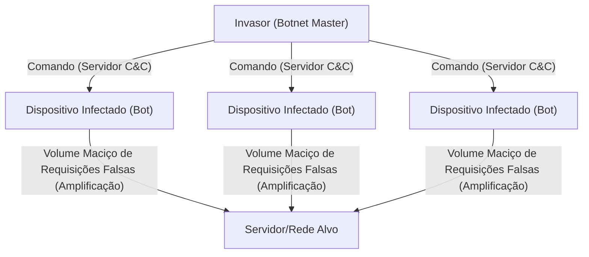

### Explorando as Vulnerabilidades do TCP/IP: O Ataque SYN Flood

Além de preencher a largura de banda, também existem métodos de ataque que esgotam os recursos (CPU e memória) do servidor. O representante típico é o ataque **SYN Flood**. No protocolo TCP, um procedimento chamado "3-way handshake" é usado ao estabelecer a comunicação:
1. O cliente envia um pacote "SYN"
2. O servidor retorna um pacote "SYN-ACK" e reserva memória para a conexão (TCB: Transmission Control Block)
3. O cliente envia um pacote "ACK" estabelecendo a conexão

O invasor envia um volume massivo de pacotes SYN com endereços IP de origem falsificados (spoofing) ao servidor. O servidor responde com o SYN-ACK, mas o proprietário do endereço IP falsificado não retorna o ACK (ou o endereço não existe). Como resultado, o servidor acumula um grande número de conexões no estado "semi-aberto" (Half-open), as áreas de memória para gerenciar conexões se esgotam e ele se vê forçado a rejeitar novas solicitações de conexão de usuários legítimos. Este é um mecanismo de ataque brilhante que explora a natureza de manutenção de estado (stateful) do TCP de "garantir uma comunicação confiável".

### Ataque de Reflexão (Amplificação): O Abuso da Assimetria

O **ataque de reflexão (ataque de amplificação)**, que utiliza o UDP (User Datagram Protocol), é ainda mais engenhoso. O UDP é um protocolo sem conexão e não verifica a origem. O invasor falsifica o endereço de origem com o IP do alvo e envia solicitações para servidores DNS ou NTP públicos na Internet. Nesse processo, ele usa consultas específicas (como DNS ANY ou NTP monlist) em que, para uma solicitação pequena (dezenas de bytes), o servidor retorna uma resposta de tamanho centenas ou milhares de vezes maior (milhares de bytes).
O pacote de resposta ampliado e gigantesco é despejado em massa em direção à origem falsificada, ou seja, o servidor alvo. O invasor pode gerar tráfego em nível de terabit contra o alvo consumindo apenas uma pequena fração de largura de banda. Trata-se da implementação na rede de uma assimetria semelhante ao "princípio da alavanca" na física ou à amplificação de ressonância na acústica.

## 2. Ocultação das Rotas de Comunicação: A Mecânica da Criptografia e da VPN

Pacotes que trafegam na rede pública, que é a Internet, são transportados através de vários roteadores e equipamentos de ISPs (Provedores de Serviços de Internet) ao longo do caminho. Uma comunicação em texto simples (clear text) não criptografada pode ser facilmente interceptada (sniffing) ou adulterada durante a rota. Escudos poderosos para proteger a privacidade e a confidencialidade dos dados são a "tecnologia de criptografia" e a "VPN (Virtual Private Network)".

### A Base Matemática da Criptografia Moderna: Híbrido de Chave Pública e Chave Comum

A proteção da comunicação usa principalmente dois métodos de criptografia:
- **Criptografia de Chave Comum (Symmetric Key, ex: AES)**: Usa a mesma chave para criptografar e descriptografar os dados. A velocidade de processamento é muito rápida, mas existe o desafio de como entregar a chave de forma segura à outra parte (o problema da distribuição de chaves).
- **Criptografia de Chave Pública (Asymmetric Key, ex: RSA ou Criptografia de Curva Elíptica)**: Usa um par de uma "chave pública" para criptografia e uma "chave privada" para descriptografia. É baseada em propriedades matemáticas avançadas (assimetria), como a dificuldade de fatoração em números primos ou o problema do logaritmo discreto. O custo computacional é alto.

Nas comunicações seguras da Internet (como TLS/SSL e VPN), um método híbrido que combina ambos é adotado. Primeiro, a criptografia de chave pública é usada para trocar com segurança a "chave de sessão (chave comum)" durante o handshake no início da comunicação; depois, para a comunicação de dados de grande volume, a chave de sessão de alta velocidade é usada para criptografia. Assim, alcança-se tanto a distribuição segura de chaves quanto a comunicação criptografada de alta velocidade.

### Princípio da VPN e do Tunelamento (Tunneling)

**VPN (Virtual Private Network)** é uma tecnologia que utiliza a técnica de criptografia para criar uma "linha dedicada (túnel)" virtual em cima da Internet pública. Protocolos representativos incluem o IPsec, OpenVPN e, mais recentemente, WireGuard.

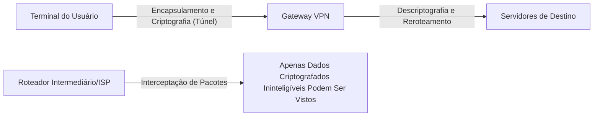

O mecanismo central do tunelamento reside no "Encapsulamento" (Encapsulation). O pacote IP original (payload) que o usuário pretende enviar é totalmente criptografado e, em seguida, encapsulado como os dados de um novo pacote IP, recebendo um novo cabeçalho IP externo endereçado ao servidor VPN.
Os roteadores de Internet no caminho olham apenas para o cabeçalho IP externo e encaminham o pacote para o servidor VPN. Como o conteúdo é fortemente criptografado, mesmo que o pacote seja interceptado, é difícil decifrar não apenas o conteúdo da comunicação, mas também o endereço IP de destino original. O pacote que chega ao servidor VPN é descriptografado, o cabeçalho original é extraído e o pacote é transmitido ao seu destino final. Desta forma, em uma infraestrutura fisicamente acessível a qualquer pessoa, cria-se um espaço privado protegido de forma lógica e matemática.
## 3. O Colapso da Defesa de Perímetro e a Ascensão da Arquitetura Zero Trust

Por muitos anos, a segurança de rede de empresas e organizações dependeu de um conceito chamado "defesa de perímetro" (modelo de perímetro). Esta é uma estratégia de defesa no estilo castelo, onde firewalls e IPS (Sistemas de Prevenção de Intrusões) são colocados na fronteira entre a internet (externa) e a rede corporativa (interna), considerando que "o lado de fora é perigoso, o lado de dentro é seguro".

### A Perda do Perímetro Trazida pela Nuvem e pelo Teletrabalho
No entanto, nos tempos modernos, este modelo entrou em colapso completamente. Com a disseminação do SaaS (Software as a Service), dados importantes são colocados na nuvem fora da empresa e, com a generalização do teletrabalho, os funcionários passaram a acessar do Wi-Fi de suas casas ou cafés. A linha divisória entre "o interior a ser protegido" e "o exterior perigoso" derreteu e desapareceu, e o tráfego que não pode ser controlado por firewalls tradicionais aumentou de forma explosiva. Além disso, a defesa de perímetro é impotente contra malwares (como ransomwares) que já invadiram a rede interna ou contra ameaças internas maliciosas. A premissa de que "o interior é confiável" tornou-se a maior vulnerabilidade.

### Zero Trust: Trust Nothing, Verify Everything
Para responder a essa mudança de paradigma, foi proposta a **"Arquitetura Zero Trust (Zero Trust Architecture: ZTA)"**. O princípio básico do Zero Trust é que "independentemente da localização da rede (interna ou externa), nenhuma comunicação é confiável por padrão (Never Trust, Always Verify)".

No modelo Zero Trust, o foco da segurança muda do "perímetro da rede" para a "identidade (usuários e dispositivos)" e "recursos (dados e aplicativos)".

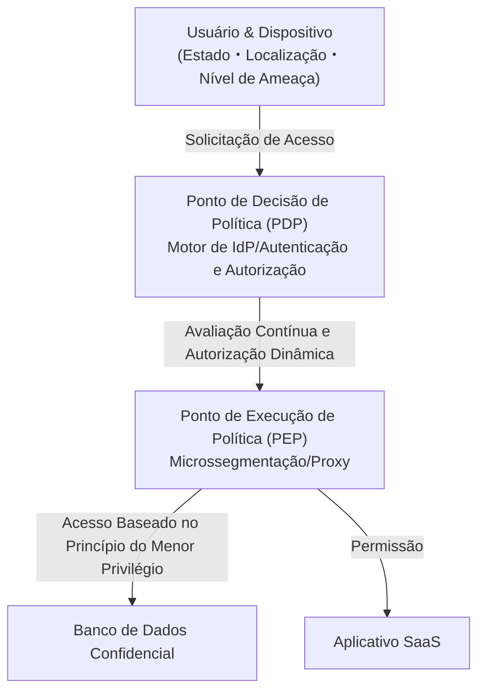

Os componentes tecnológicos centrais para concretizar o Zero Trust são os seguintes:

1. **Gestão de Identidade e Acesso (IAM/IdP)**: Confirma fortemente a identidade do usuário combinando não apenas senhas, mas também MFA (Autenticação Multifator) e autenticação biométrica.
2. **Avaliação da Postura do Dispositivo (Integridade)**: Avalia em tempo real o status de aplicação de patches do sistema operacional do terminal que solicita acesso, o status operacional do software antivírus, comportamentos passados, etc. O acesso de terminais inseguros é bloqueado imediatamente.
3. **Microssegmentação**: Divide a rede de forma granular e estabelece perímetros mínimos para cada recurso. Caso ocorra uma invasão, é uma estrutura que impede a expansão horizontal dos danos (movimento lateral).
4. **Autenticação Contínua e Políticas Dinâmicas**: Um login bem-sucedido não significa confiança contínua. Durante a sessão, o comportamento (mudança de IP da origem do acesso, volume anormal de download de dados, etc.) é monitorado continuamente, e um controle dinâmico é realizado para desconectar a sessão no momento em que a pontuação de risco ultrapassa o limite.

O Zero Trust não é um mero produto, mas sim uma filosofia de design que "verifica todos os acessos a cada vez e concede apenas o mínimo de privilégios necessários (Least Privilege)", tornando-se a única solução realista para proteger dados nas infraestruturas de TI descentralizadas modernas.

## 4. O Futuro da Segurança: Criptografia Quântica e Defesa de Rede de Próxima Geração

As criptografias RSA e de curva elíptica das quais dependemos atualmente baseiam-se na premissa de que "levará um tempo astronômico para serem decifradas com o poder de processamento dos computadores atuais". No entanto, se um "computador quântico" que aplica os princípios da mecânica quântica for colocado em uso prático, existe o perigo de que esses problemas matemáticos sejam resolvidos instantaneamente por meio do algoritmo de Shor e outros. A isso chamamos de **"Q-Day (O dia da quebra da criptografia por computadores quânticos)"**.

Para combater isso, duas abordagens estão sendo pesquisadas atualmente.
Uma é a padronização de um novo algoritmo criptográfico que é matematicamente difícil de decifrar até mesmo para computadores quânticos, a **"Criptografia Pós-Quântica (PQC: Post-Quantum Cryptography)"** (como a criptografia baseada em reticulados).
A outra é a **"Distribuição de Chave Quântica (QKD: Quantum Key Distribution)"**, que usa as próprias leis da física (mecânica quântica) como base para a segurança. É uma tecnologia que distribui chaves colocando informações no estado quântico de fótons (como polarização). Como o estado quântico muda no instante em que um interceptador tenta observar (copiar) os fótons (problema de medição, princípio da incerteza), é a comunicação segura definitiva onde a interceptação pode ser 100% detectada fisicamente.

## Conclusão

O Capítulo 7 da internet, trata-se de um jogo de gangorra contínuo entre "conveniência" e "segurança". Desde a saturação da camada física por ataques DDoS, passando pela defesa matemática através de técnicas de criptografia, até a mudança de paradigma arquitetural do Zero Trust, a segurança cibernética evoluiu além dos limites da mera tecnologia de TI para uma área acadêmica extremamente avançada onde a física, a matemática e a psicologia comportamental se cruzam.
Por trás de quando casualmente abrimos um navegador e manipulamos dados na nuvem, uma guerra eletrônica feroz em milissegundos é travada 24 horas por dia, 365 dias por ano, entre atacantes invisíveis e sistemas de defesa.

No próximo e último capítulo, o Capítulo 8, exploraremos o futuro da internet, ou seja, os paradigmas de rede de próxima geração, como Web3.0, Metaverso e a Internet Interplanetária (Interplanetary Internet).

# Capítulo 8: A Internet do Futuro —— Uma Rede de Próxima Geração Tecida por Descentralização, Espaço Sideral e Mecânica Quântica

A internet continuou a evoluir ao longo das últimas décadas como a infraestrutura de informação mais influente na história da humanidade. Começando com o estabelecimento da tecnologia de comutação de pacotes na ARPANET nos anos 1960, passando pela padronização do conjunto de protocolos TCP/IP, a invenção da WWW (World Wide Web) e culminando com a disseminação da banda larga móvel, seu progresso não dá sinais de parar. No entanto, a internet que usamos atualmente está enfrentando limites fundamentais de arquitetura e restrições físicas. Estes incluem os efeitos negativos da centralização devido ao gigantismo dos data centers, o atraso físico das fibras ópticas nas comunicações intercontinentais e o enfraquecimento das tecnologias de criptografia existentes devido aos rápidos avanços na capacidade de computação (especialmente a ascensão dos computadores quânticos).

Neste capítulo, intitulado "Capítulo 8: A Internet do Futuro", exploraremos as linhas de frente da mudança de paradigma atualmente em andamento. Especificamente, detalharemos exaustivamente e com uma perspectiva profissional três pilares: a "Web3 e Arquitetura Descentralizada", que visa romper com a centralização; as "Redes de Comunicação por Satélite de Baixa Órbita (como Starlink)", que expandem as restrições da infraestrutura física para o espaço sideral; e a "Internet Quântica", que aplica as leis definitivas da física à comunicação, abordando seus contextos históricos, física e mecanismos tecnológicos.

---

## 8.1 O Verdadeiro Valor da Web3 e da Arquitetura Descentralizada: A Construção de uma Rede Trustless

A internet atual (Web2.0) é construída sobre a gestão centralizada de dados por corporações gigantes de plataformas. O modelo cliente-servidor, embora eficiente, sofre de problemas estruturais como a existência de Pontos Únicos de Falha (SPOF: Single Point of Failure), facilidade de censura e violação da privacidade dos dados dos usuários. A resposta a nível arquitetural para isso é a "Web3" e as tecnologias de rede descentralizada.

### 8.1.1 Redes Orientadas a Conteúdo e IPFS
A Web tradicional (HTTP) é "orientada a localização". Ou seja, especificamos "onde está (URL)" para acessar a informação. No entanto, com este mecanismo, se o servidor cair ou o domínio expirar, ocorre um "link quebrado (404 Not Found)" onde o próprio conteúdo desaparece.

Em contraste, sistemas de armazenamento descentralizado representados pelo IPFS (InterPlanetary File System) adotam uma arquitetura "orientada a conteúdo (Content-Addressed)". O acesso aos dados é feito usando um "Identificador de Conteúdo (CID)" exclusivo obtido ao passar o conteúdo do arquivo por uma função hash criptográfica (como SHA-256).

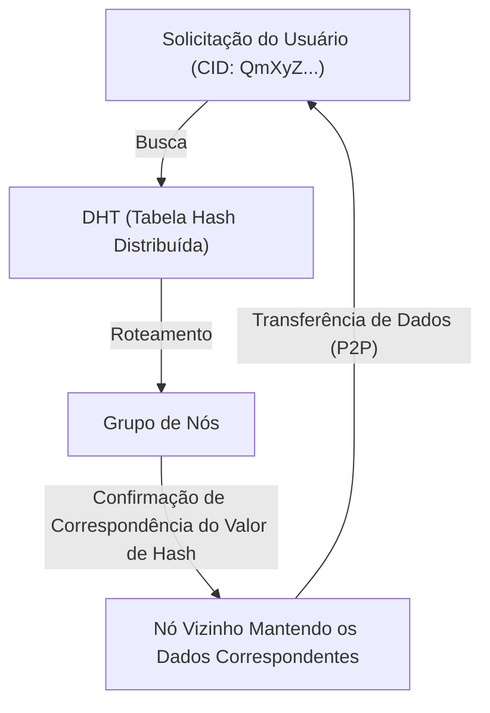

O núcleo deste mecanismo reside no algoritmo Kademlia, que é um tipo de DHT (Distributed Hash Table: Tabela Hash Distribuída). O Kademlia define a "distância" entre o ID do nó e o ID dos dados usando a operação XOR (Ou Exclusivo). Isso permite mapear eficientemente a topologia de toda a rede e descobrir o nó que retém os dados desejados com uma complexidade de tempo de $O(\log N)$. Como os dados são distribuídos e replicados em nós ao redor do mundo, mesmo que alguns nós fiquem offline, o acesso aos dados é mantido, possuindo forte resistência à censura.

### 8.1.2 Formação de Consenso Descentralizado e Provas Criptográficas
Outra base da Web3 é a tecnologia blockchain. Ela é formada por um "algoritmo de consenso" que concorda sobre "quem está registrando o estado correto" em uma rede descentralizada, sem a intervenção de um administrador central.
O PoW (Proof of Work), adotado inicialmente no Bitcoin, era um mecanismo que dificultava fisicamente as adulterações investindo quantidades massivas de energia computacional, usando a resistência à colisão das funções hash. No entanto, da perspectiva do consumo de energia, há atualmente uma transição em andamento para o PoS (Proof of Stake).

No PoS, adotado no Ethereum 2.0 e outros, os validadores que apostam (usam como garantia) ativos criptográficos agregam assinaturas usando uma tecnologia criptográfica especial baseada em emparelhamento chamada assinaturas BLS (Boneh-Lynn-Shacham). Ao fazer isso, assinaturas digitais de dezenas a centenas de milhares de nós são comprimidas em um tamanho de dados minúsculo, alcançando tanto alta segurança quanto uma certa escalabilidade, mesmo sendo uma rede descentralizada. Na internet do futuro, acredita-se que essas tecnologias serão implementadas de forma padrão sobre o TCP/IP como uma nova camada do modelo de referência OSI (Camada de transferência de valor e formação de consenso).

---

## 8.2 A Rede de Comunicação via Satélite Envolvendo a Terra: Starlink e Além

As redes de fibras ópticas instaladas no solo são a espinha dorsal da internet moderna. Contudo, existem desafios como os custos de instalação de cabos submarinos, restrições topográficas e, acima de tudo, a restrição física da "velocidade da luz em um meio". As constelações de satélites de Baixa Órbita Terrestre (LEO: Low Earth Orbit), representadas pela Starlink da SpaceX, estão tentando resolver essas questões na fronteira do espaço sideral.

### 8.2.1 Dinâmica Orbital e a Vantagem da Baixa Órbita (LEO)
Os satélites de Órbita Geoestacionária (GEO: Geostationary Earth Orbit) estão localizados a uma altitude de cerca de 35.786 km e sincronizam com a rotação da Terra, tendo a vantagem de poder fixar a direção das antenas. Contudo, como as ondas de rádio viajam mais de 70.000 km apenas para ir e voltar, o atraso resultante das restrições físicas (cerca de 120 milissegundos apenas em uma direção, com uma latência efetiva superior a 500 milissegundos) é inevitável.

Por outro lado, os satélites da Starlink são colocados em uma órbita baixa com uma altitude de cerca de 550 km. De acordo com a dinâmica orbital baseada na Terceira Lei de Kepler, nesta altitude, para equilibrar a gravidade da Terra com a força centrífuga, o satélite precisa orbitar a Terra a uma velocidade impressionante de cerca de 7,6 km/s (cerca de 27.000 km/h) (dando a volta na Terra em cerca de 90 minutos).
Devido a essa baixa altitude, o tempo de propagação física das ondas de rádio é drasticamente reduzido para cerca de 1/65 do GEO, e a latência de comunicação teórica torna-se igual ou inferior à das fibras ópticas terrestres (20 a 40 milissegundos).

### 8.2.2 Antenas de Arranjo de Fase (Phased Array) e Controle da Frente de Onda de Rádio
Como o satélite se move em alta velocidade, o terminal do usuário em solo (uma antena plana sem partes móveis físicas como as antenas parabólicas) deve rastrear eletricamente o satélite passando por cima. É aqui que a "Antena de Arranjo de Fase (Phased Array Antenna)" é usada.
Milhares de componentes de antena minúsculos estão dispostos em um plano, e a "fase (o tempo da onda)" das ondas de rádio emitidas por cada componente é intencionalmente deslocada em unidades de microssegundos. Pelo Princípio de Huygens, as ondas esféricas de cada componente interferem umas com as outras, formando um feixe onde as ondas se fortalecem (interferência construtiva) apenas em uma direção específica. Isso torna possível direcionar instantaneamente o feixe de comunicação para o satélite alvo apenas com controle por software, sem mover a antena fisicamente.

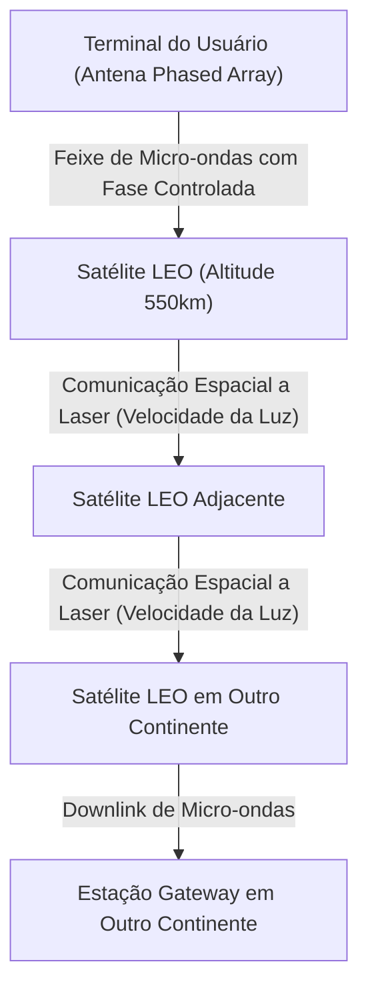

### 8.2.3 Comunicação Espacial Óptica (OISL) e a Vantagem Absoluta da "Velocidade da Luz no Vácuo"
A verdadeira revolução da rede Starlink reside nas Comunicações Intersatélite a Laser (OISL: Optical Intersatellite Links).
A comunicação de longa distância moderna depende de fibras ópticas, mas o índice de refração do núcleo (vidro de quartzo) da fibra óptica é de cerca de 1,47. Na física, a velocidade da luz em um meio é expressa por $v = c / n$ ($c$ é a velocidade da luz no vácuo, $n$ é o índice de refração). Em outras palavras, a velocidade da luz dentro da fibra óptica cai para cerca de 200.000 km/s.

Em contrapartida, como o índice de refração do espaço sideral (vácuo) é quase 1, a comunicação a laser entre satélites é realizada na velocidade da luz no vácuo $c \approx 300.000$ km/s.
Por exemplo, considerando a transferência de dados de Londres para Nova York, em vez de passar por cabos submarinos no Atlântico, uma rota que lança os dados para o espaço, os transfere através do espaço sideral a vácuo com luz laser e depois os traz de volta para o solo, pode reduzir o atraso absoluto teórico (latência). Isso traz uma mudança de paradigma decisiva nas Negociações de Alta Frequência (HFT) em finanças e em sistemas globais em tempo real. No futuro, dezenas de milhares de satélites envolverão a Terra e completarão uma malha de rede onde um protocolo de roteamento dinâmico e tridimensional no espaço sideral substituirá o BGP (Border Gateway Protocol).

---

## 8.3 Internet Quântica: A Comunicação Suprema Trazida pelo Emaranhamento

Se a Web3 reconstrói a arquitetura de "confiança" e a rede de comunicação via satélite rompe as restrições de "espaço e velocidade", a "Internet Quântica" é o auge da física em termos de "segurança e meios de transmissão" da informação. A Internet Quântica não é uma substituição para as redes TCP/IP existentes, mas sim uma infraestrutura de próxima geração que as complementa e fornece canais de transmissão de informação baseados em leis da física completamente novas.

### 8.3.1 Fundamentos da Mecânica Quântica: Superposição e Emaranhamento
Os computadores clássicos e a internet tratam a alta ou baixa tensão como bits de "0" ou "1". No entanto, na internet quântica, a informação é transmitida como bits quânticos (Qubits). Utilizando os estados de polarização (oscilação vertical ou horizontal) dos fótons, ela aproveita o "Princípio da Superposição (Superposition)", onde "0" e "1" existem simultaneamente.

Mais importante ainda é o "Emaranhamento Quântico (Quantum Entanglement)". Quando duas partículas estão em estado de emaranhamento, não importa a distância física entre elas (mesmo se for a distância entre a Terra e Marte), no instante em que o estado de uma partícula é medido e determinado, o estado da outra partícula também é determinado imediatamente sem defasagem de tempo. Este fenômeno físico não local, que Einstein chamou de "ação fantasmagórica à distância", serve como a espinha dorsal da internet quântica.

### 8.3.2 Distribuição de Chave Quântica (QKD) e Segurança Física Absoluta
Atualmente, as criptografias RSA e de curva elíptica que protegem a comunicação na internet dependem da dificuldade matemática de que "a fatoração de inteiros gigantescos leva um tempo de computação muito longo". No entanto, se um computador quântico de grande escala capaz de implementar o algoritmo de Shor for percebido, essas criptografias serão rompidas em pouco tempo.

Por isso, espera-se a Distribuição de Chave Quântica (QKD: Quantum Key Distribution). No protocolo representativo BB84, fótons únicos são usados para transmitir chaves de criptografia. De acordo com o princípio básico da mecânica quântica, o "Princípio da Incerteza de Heisenberg", se um terceiro (espião) tentar medir (interceptar) os fótons em voo, os estados quânticos mudarão (decoerência) naquele instante. Além disso, de acordo com o "Teorema da Não-Clonagem Quântica (No-Cloning Theorem)", é fisicamente impossível copiar com precisão um estado quântico desconhecido.
Em outras palavras, se houver um ato de interceptação no caminho de comunicação, o receptor sempre será capaz de detectá-lo em nível de lei física como um aumento anormal na taxa de erro. Ao compartilhar números aleatórios seguros garantidos de que não foram interceptados e combinando com a criptografia de One-Time Pad, é alcançada a segurança final, absolutamente impossível de ser decifrada por computadores com qualquer capacidade de computação (mesmo supercomputadores em escala cósmica).

### 8.3.3 Teletransporte Quântico e a Barreira dos Repetidores Quânticos
O objetivo final da internet quântica é a formação de rede de "Teletransporte Quântico", que transfere o próprio estado quântico para outro local usando emaranhamento. Isso tornará possível a "Nuvem Quântica", conectando computadores quânticos descentralizados entre si para funcionarem como um único e gigantesco computador quântico.

No entanto, as barreiras tecnológicas permanecem extremamente altas. Os fótons são perdidos através da absorção ou dispersão (atenuação) à medida que viajam pela fibra óptica. Na comunicação clássica, um "amplificador" é colocado no caminho para fortalecer o sinal, mas na comunicação quântica, devido ao "Teorema da Não-Clonagem" mencionado, não é possível copiar fótons e amplificá-los.

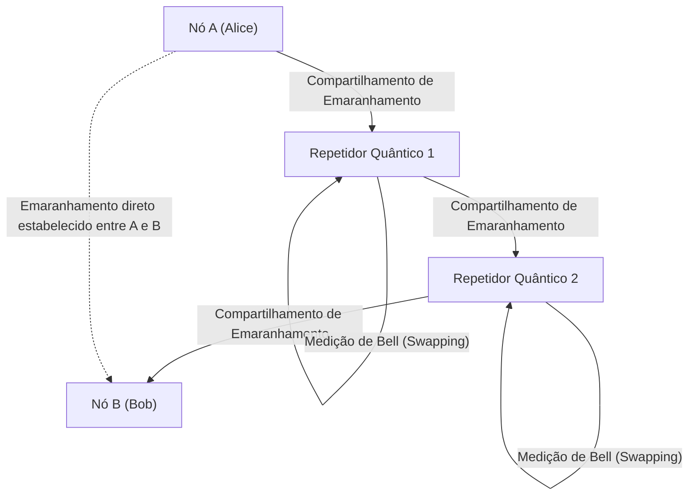

Para romper essa limitação, os "Repetidores Quânticos (Quantum Repeaters)" estão sendo pesquisados. O repetidor quântico gera emaranhamentos apenas em seções curtas e, realizando continuamente operações quânticas avançadas chamadas "Entanglement Swapping (Troca de Emaranhamento)", estabelece o emaranhamento a longas distâncias. Para conseguir isso, a "memória quântica" que armazena temporariamente os estados quânticos em ambientes de temperatura ultrabaixa é indispensável, e atualmente as descobertas da física usando centros NV (centros nitrogênio-vacância) em diamantes e gases de átomos resfriados estão competindo em laboratórios ao redor do mundo.

---

## 8.4 Conclusão: O Futuro da Humanidade e das Redes

A internet, que nasceu nos anos 1960, cresceu e se tornou uma rede neural conectando todas as informações na Terra. E agora, o "Capítulo 8: A Internet do Futuro" que enfrentamos é uma expansão para dimensões mais fundamentais e físicas que vão além das camadas de software.

A arquitetura descentralizada da Web3 constrói uma nova base de confiança (camada de confiança) que garante as transações da sociedade através da matemática e criptografia, sem depender da "confiança" em agências centrais específicas.
As redes de comunicação via satélite, incluindo a Starlink, escapam do poço de gravidade da Terra e desafiam o limite de velocidade absoluta da física conhecido como a velocidade da luz no vácuo, traçando um backbone tridimensional que anula as barreiras da distância.
E a internet quântica tenta derrubar radicalmente o conceito de transmissão de informações e segurança, sublimando o emaranhamento, um mistério profundo da mecânica quântica, na engenharia.

Embora pareça que essas tecnologias estão se desenvolvendo independentemente umas das outras, a longo prazo, elas se fundirão. Ao colocar um único fóton (quantum) dentro da luz de um laser voando pelo espaço sideral, uma rede global de criptografia quântica será construída usando o espaço sideral, que tem baixa atenuação, e os protocolos descentralizados da Web3 operarão em cima dela. Uma infraestrutura de rede tão próxima à ficção científica está, no momento, sendo projetada pelas mãos da humanidade atual.

A internet do futuro não será mais apenas um "cano por onde fluem informações". Ela evoluirá para a "infraestrutura intelectual" suprema que sincroniza as atividades econômicas da humanidade, a formação de consenso social e recursos computacionais em uma escala cósmica. Por trás da internet que usamos casualmente no nosso dia a dia, mesmo neste exato momento, uma história épica desafiando os limites da física e da ciência da computação continua a ser tecida.
