# Глава 1. Зарождение и философия Интернета — генеалогия технологий от ARPANET до WWW

Интернет — эта гигантская автономная децентрализованная сеть, которая сегодня является основой всей экономической деятельности, культуры и коммуникации человечества, ни в коем случае не была спроектирована за одну ночь каким-то одним гением. Она берет свое начало в уникальном историческом и геополитическом контексте холодной войны, прошла через смену парадигм в области техники связи и информатики и является кристаллизацией возвышенной философии, которую разделяло бесчисленное множество исследователей: «как передавать информацию надежно и свободно, преодолевая любые физические ограничения».

В этой главе мы подробно, с профессиональной точки зрения, рассмотрим, как появилась на свет эта чудо-система под названием Интернет, не просто перечисляя исторические факты, а предельно глубоко погружаясь в технические механизмы от физического до прикладного уровня и концепции их проектирования (архитектуру).

## 1.1 Смена сетевой парадигмы: пределы коммутации каналов и рождение коммутации пакетов

Отправной точкой для понимания исторической и технической сути Интернета является изобретение концепции «коммутации пакетов (Packet Switching)». В начале 1960-х годов основой инфраструктуры связи была «коммутация каналов (Circuit Switching)», типичным примером которой является телефонная сеть.

### Физический механизм и уязвимость коммутации каналов
Система коммутации каналов — это метод, при котором физически или логически (с использованием таких технологий, как частотное мультиплексирование FDM) соединяются две точки связи с помощью координатных соединителей или электронных коммутаторов, обеспечивая и занимая «выделенный канал связи (линию)» от начала и до конца связи. Этот метод отлично подходил для голосовой связи (телефонии), требующей работы в реальном времени, поскольку, пока канал обеспечен, гарантируются пропускная способность и задержка.

Однако эта архитектура имела фатальный недостаток. Это наличие «единой точки отказа (Single Point of Failure)» и крайняя уязвимость к физическому разрушению. В условиях холодной войны Министерство обороны США всерьез опасалось ядерной атаки со стороны Советского Союза (особенно электромагнитного импульса, ЭМИ, сопровождающего высотные ядерные взрывы). Если бы централизованные узлы связи (гигантские телефонные станции) были физически уничтожены или часть маршрутов связи была разорвана, система коммутации каналов не смогла бы мгновенно перестроить обходные маршруты, и система командования и управления страны (C2: Command and Control) была бы полностью парализована.

### Прорыв под названием «коммутация пакетов»
Существуют три пионера, которые совершенно независимо друг от друга, но почти одновременно, создали теоретическую базу для преодоления этого безнадежного физического ограничения. Это Пол Бэран (Paul Baran) из корпорации RAND, Дональд Дэвис (Donald Davies) из Национальной физической лаборатории Великобритании (NPL) и Леонард Кляйнрок (Leonard Kleinrock) из Массачусетского технологического института (MIT).

Они, опираясь на теорию информации Клода Шеннона (Claude Shannon), предложили революционный подход: вместо того, чтобы рассматривать связь как непрерывные аналоговые «волны» или неразрывные «потоки» данных, они предложили разделять данные на небольшие цифровые блоки фиксированной (или переменной) длины — то есть на «пакеты (Packet)» или, как их называл Бэран, «стандартизированные блоки сообщений».

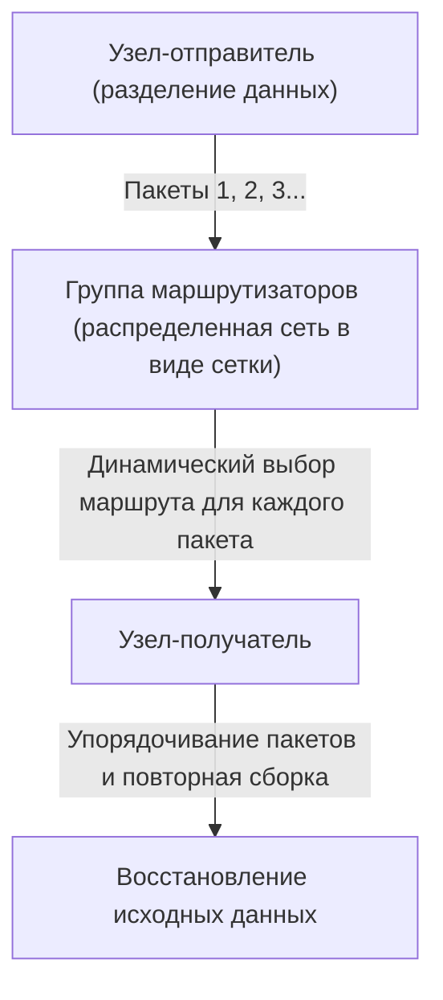

Техническая инновационность коммутации пакетов сводится в основном к следующим двум пунктам:

1. **Реализация статистического мультиплексирования (Statistical Multiplexing):**
   Вместо того, чтобы занимать физическую линию для определенного сеанса связи, как при коммутации каналов, пакеты из множества несвязанных сеансов разделяют одну и ту же физическую линию с разделением по времени. Поскольку передача данных между компьютерами обладает высокой «взрывностью (Burstiness: свойство, при котором временно передается большой объем данных, за которым следует тишина)», совместное использование пропускной способности посредством коммутации пакетов подняло эффективность использования ресурсов связи до математического предела.
2. **Промежуточное хранение и передача (Store and Forward) и динамический выбор маршрута:**
   Каждый промежуточный узел (маршрутизатор), составляющий сеть, временно накапливает полученные пакеты в очереди (queue) в памяти, сверяя адрес назначения, указанный в заголовке пакета, с таблицей маршрутизации (routing table), которой владеет сам узел. Затем он вычисляет состояние перегрузки сети и состояние отключения физических линий на данный момент и пересылает каждый пакет оптимальному соседнему узлу.

Кляйнрок использовал теорию очередей (Queuing Theory) для создания математической модели задержки пакетов и размера буфера в этой системе с промежуточным хранением. Даже если часть сети испарится в результате ядерной атаки, уцелевшие узлы автономно оценят ситуацию, и пакеты найдут обходной путь (другой маршрут в ячеистой сети), чтобы достичь пункта назначения. Эта «автономная децентрализованная, самовосстанавливающаяся» архитектура и является источником устойчивости (Resilience) Интернета.

## 1.2 Создание ARPANET: разделение аппаратного обеспечения и протоколов с помощью IMP

Проектом, реализовавшим в физическом мире сеть с коммутацией пакетов, существовавшую лишь в теории, стал проект «ARPANET», запущенный в 1969 году при финансовой поддержке Агентства перспективных исследовательских проектов Министерства обороны США (ARPA).

Компьютерная среда того времени была несоизмеримо хаотичнее нынешней. Мейнфреймы (большие ЭВМ), независимо разработанные такими компаниями, как IBM, DEC и SDS, имели совершенно разные кодировки символов (ASCII против EBCDIC), длину слова (16 бит, 32 бита, 36 бит и т.д.) и операционные системы. Напрямую связать их технически было чрезвычайно сложно.

Поэтому создатели ARPANET (Ларри Робертс и др.) приняли очень важное архитектурное решение. Они ввели специализированные небольшие компьютеры для ретрансляции, названные «IMP (Interface Message Processor)».

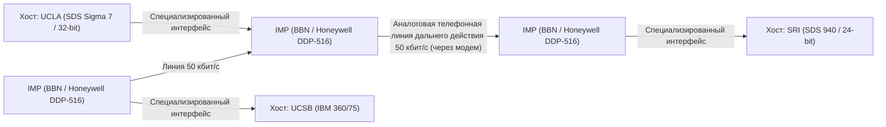

Контракт на разработку IMP выиграла консалтинговая компания BBN (Bolt Beranek and Newman) из Бостона. Они модифицировали надежный мини-компьютер «DDP-516» компании Honeywell, переложив на IMP все сложные сетевые процессы: протоколы маршрутизации, разбиение и сборку пакетов, а также обнаружение ошибок (CRC: циклический избыточный код).

Благодаря этому огромным хост-компьютерам в каждом исследовательском институте больше не нужно было беспокоиться о сложной маршрутизации пакетов или физических характеристиках линий. Им оставалось лишь передавать данные с помощью стандартизированного интерфейса (протокол BBN 1822) в находящийся перед ними IMP. Это стало первым великим примером успешного применения принципа «разделения зон ответственности (Separation of Concerns)» в области сетей связи, а IMP стал прямым предком современных маршрутизаторов (Router).

29 октября 1969 года из лаборатории Кляйнрока в Калифорнийском университете в Лос-Анджелесе (UCLA) в Стэнфордский исследовательский институт (SRI) было отправлено первое сообщение «LO» (система дала сбой при попытке напечатать «LOGIN»). Это был исторический момент рождения ARPANET. Впоследствии был реализован ранний алгоритм маршрутизации (векторно-дистанционная маршрутизация на основе алгоритма Беллмана-Форда), и ARPANET начала стремительно расти как инфраструктура, объединяющая исследовательские институты по всей территории США.

## 1.3 Философия дизайна TCP/IP: принцип End-to-End и бездна инкапсуляции

ARPANET увенчалась огромным успехом как единая сеть, но вскоре столкнулась с новой преградой. Протокол связи NCP (Network Control Program), использовавшийся в ARPANET, был спроектирован из расчета работы в «однородной, высоконадежной единой сети», которой и была ARPANET.

Однако в 1970-х годах начали появляться разнообразные сети, такие как спутниковая пакетная сеть связи (SATNET) и сеть беспроводной пакетной связи, разработанная Гавайским университетом (PRNET, производная от ALOHANET), которые имели совершенно разные физические среды, максимальный размер пакета (MTU: Maximum Transmission Unit), скорость передачи и частоту ошибок. Когда попытались соединить их для создания глобальной «сети сетей (Internetwork)», стало очевидно, что дизайн NCP потерпит крах.

Решение этой невероятно сложной проблемы взаимодействия разнородных сетей предложили Винтон Серф (Vinton Cerf) и Роберт Кан (Bob Kahn) в своей революционной статье 1974 года "A Protocol for Packet Network Intercommunication". Разработанный ими протокол — это и есть «TCP/IP (Transmission Control Protocol / Internet Protocol)», фундамент современного Интернета.

### Душа архитектуры: принцип End-to-End (End-to-End Argument)
В основе дизайна TCP/IP лежит важнейшая философская концепция сетевой инженерии — «принцип End-to-End (End-to-End Principle / Argument)». Сформулированный в 1980-х годах Дж. Х. Зальцером, Д. П. Ридом и Д. Д. Кларком, этот принцип гласит:

«Сложные, специфичные для приложений функции, такие как обеспечение надежности передачи данных, контроль последовательности и шифрование, должны быть реализованы на конечных узлах (хостах) связи (End-to-End), а не в ядре сети (транзитной инфраструктуре или маршрутизаторах)».

Что бы произошло, если бы мы наделили ядро сети (IMP или маршрутизаторы) сложным «состоянием (State)», например, подтверждением доставки пакетов (ACK) или управлением повторной передачей? В момент выхода из строя транзитного маршрутизатора это состояние было бы потеряно, а связь разорвана. Кроме того, с появлением каждого нового приложения с новыми требованиями пришлось бы переписывать программное обеспечение на всех маршрутизаторах по всему миру.

TCP/IP воплотил этот принцип с предельной точностью. IP-маршрутизатор (Internet Protocol), отвечающий за транзит, специализируется на чрезвычайно простой функции (передача дейтаграмм без сохранения состояния): «просто пересылать полученные пакеты к месту назначения с максимальными усилиями (best-effort)». IP вообще не заботится о потере пакетов или нарушении их порядка. Он стал просто «тупой сетью (Dumb Network)».

Взамен вся тяжесть ответственности за обеспечение надежности связи была возложена на протокол TCP (Transmission Control Protocol), работающий на конечных хост-компьютерах. TCP пересобирает исходные данные, ориентируясь на порядковые номера, присвоенные пакетам, которые IP доставил в беспорядке; при наличии пропусков автономно запрашивает повторную передачу; а при перегрузке сети регулирует скорость отправки (управление окном и алгоритм медленного старта).

Эта концепция — «сохранять ядро предельно простым и наделять интеллектом края (конечные узлы)» — и есть главная причина, по которой Интернет превзошел телефонные сети и впоследствии смог поглотить взрывные инновации, такие как Web, потоковое видео, P2P-связь и смартфоны, которые не предвидели даже сами разработчики, без необходимости переделывать инфраструктуру.

### Инкапсуляция (Encapsulation) и иерархическая модель
Для реализации такого логического разделения ролей TCP/IP использует метод «инкапсуляции (Encapsulation)». Это механизм, при котором каждый уровень накладывает свою управляющую информацию (заголовок) на передаваемые данные, подобно матрешке.

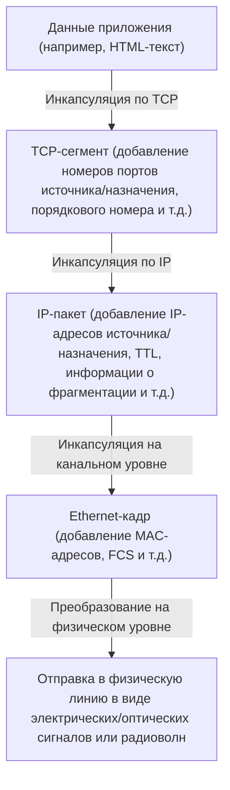

Маршрутизаторы смотрят только на заголовок IP-пакета (IP-адрес), чтобы определить место назначения, и никак не взаимодействуют с его содержимым (TCP-заголовком или данными). Таким образом, IP полностью скрывает и поглощает различия в физических характеристиках нижележащего физического уровня (оптоволокно, медные провода, Wi-Fi, 5G) и успешно предоставляет верхним уровням «единую глобальную виртуальную сеть».

1 января 1983 года произошел «Flag Day», когда все хосты в ARPANET одновременно перешли с NCP на TCP/IP, и именно тогда родился «The Internet» в его истинном смысле.

## 1.4 Подъем NSFNET и эволюция автономной децентрализованной маршрутизации

После перехода на TCP/IP Интернет вышел за рамки военных и оборонных ведомств и превратился в гигантскую инфраструктуру для академических исследований. Решающей движущей силой этого процесса стала сеть «NSFNET», созданная Национальным научным фондом США (NSF) во второй половине 1980-х годов.

NSFNET была построена как магистральная сеть, соединяющая пять суперкомпьютерных центров США. Изначально ее скорость составляла 56 кбит/с, затем физический уровень был кардинально модернизирован до линий T1 (1,544 Мбит/с), а позже — до линий T3 (45 Мбит/с). Сети университетов и региональные сети (regional networks) стали иерархически подключаться к магистрали NSFNET.

В процессе взрывного роста масштабов (масштабирования) сети возникла новая техническая проблема. Это «предел маршрутизации». Обмен информацией о маршрутах десятков тысяч узлов всеми транзитными маршрутизаторами превышал физические пределы объема памяти и вычислительной мощности.

Для решения этой проблемы Интернет ввел концепцию «автономной системы (AS: Autonomous System)». Интернет был переосмыслен не как единая гигантская сеть, а как совокупность сетей (AS) с независимыми политиками управления.

Внутри AS (IGP: Interior Gateway Protocol) используются протоколы маршрутизации на основе состояния каналов (link-state), такие как OSPF (Open Shortest Path First). Они строят полную топологическую карту сети и используют алгоритм Дейкстры (Dijkstra's algorithm) для высокоскоростного вычисления кратчайших путей.

С другой стороны, между AS (EGP: Exterior Gateway Protocol) нужно было учитывать не просто кратчайший путь, а бизнес- и организационные политики вида «через какую сеть разрешить связь». Для реализации этого был разработан BGP (Border Gateway Protocol), который до сегодняшнего дня поддерживает основу Интернета. BGP использует алгоритм вектора пути (Path Vector), полностью предотвращая образование петель маршрутизации и обеспечивая обмен информацией о маршрутах между ISP (интернет-провайдерами) по всему миру.

С созданием NSFNET и утверждением BGP была завершена экосистема современного коммерческого Интернета: даже без центрального администратора каждая организация функционирует автономно как единая сеть за счет многократных взаимных подключений (пиринг и транзит). В 1995 году NSFNET завершила свою роль, и управление магистральными сетями было полностью передано группе частных ISP.

## 1.5 Рождение WWW: освобождение знаний с помощью гипертекста и переход в общественное достояние

К концу 1980-х годов, когда инфраструктура от физического и сетевого уровней до транспортного была развернута в глобальном масштабе, объем информации, накапливаемой в Интернете, резко возрос. Однако в Интернете того времени хаотично сосуществовали разрозненные приложения, такие как FTP (передача файлов), Telnet (удаленный вход) и USENET (электронные доски объявлений), а информация была изолирована глубоко в каталогах каждого отдельного сервера. Поиск нужных данных требовал знания IP-адреса целевого сервера и сложных команд UNIX, что было крайне недемократично.

Тимоти Бернерс-Ли (Tim Berners-Lee), специалист по информатике из Европейской организации по ядерным исследованиям (CERN) в Женеве (Швейцария), в корне изменил эту ситуацию и произвел сдвиг парадигмы в обмене информацией. В 1989 году он предложил инновационную систему под названием «World Wide Web (WWW)».

Суть его идеи заключалась в объединении «Интернета (TCP/IP)» с «гипертекстом (Hypertext: концепция связывания документов путем создания ссылок на другие документы)», который существовал еще с 1960-х годов. Он расширил гипертекстовые ссылки, которые ранее замыкались внутри локальных компьютеров, на документы на серверах на другой стороне земного шара.

Чтобы построить это гигантское информационное пространство, Бернерс-Ли самостоятельно спроектировал и реализовал три чрезвычайно элегантные технические спецификации:

1. **URI (Uniform Resource Identifier):** Универсальная система адресации для уникального указания местоположения любых ресурсов (текстов, изображений, видео и т.д.), существующих в сети.
2. **HTTP (Hypertext Transfer Protocol):** Протокол прикладного уровня для запроса и передачи ресурсов, указанных с помощью URI, между клиентом (веб-браузером) и сервером. Самым выдающимся преимуществом HTTP является его дизайн «без сохранения состояния (Stateless)», который не сохраняет «состояние (State)» связи. Это позволило серверам эффективно обрабатывать запросы от миллионов клиентов.
3. **HTML (Hypertext Markup Language):** Язык разметки для описания логической структуры документа и встраивания гиперссылок (тег привязки `<a>`) на другие ресурсы.

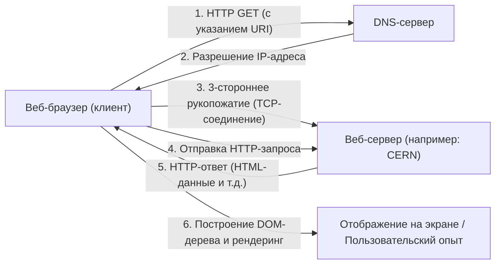

В конце 1990 года на компьютере NeXT заработали первый в мире веб-сервер (info.cern.ch) и браузер. Изначально Web был текстовым, но его интуитивно понятный опыт поиска информации по ссылкам в мгновение ока распространился среди исследователей.

### Переход в общественное достояние: историческое решение человечества
Однако главная причина, по которой WWW по-настоящему изменил мир и утвердился в качестве инфраструктуры современного общества, кроется не только в его превосходной технической архитектуре. Решающее историческое событие произошло 30 апреля 1993 года.

CERN, по настоятельной просьбе Тима Бернерса-Ли, принял поразительное решение безвозмездно открыть все базовые технологии WWW (серверное программное обеспечение, клиент, библиотеки кода) как «общественное достояние (Public Domain: отказ от прав интеллектуальной собственности)». В заявлении с подписью директора CERN говорилось об отказе от использования любых патентных прав и требований лицензионных отчислений.

Что было бы, если бы тогда CERN запатентовал технологию WWW и попытался монетизировать ее через лицензии на ПО? Безусловно, сегодняшнего информационного взрыва бы не произошло. WWW остался бы закрытой системой лишь для некоторых финансово обеспеченных компаний и университетов, а Интернет, скорее всего, оказался бы раздроблен в результате войн стандартов с конкурирующими протоколами, такими как Gopher, появившимися позже.

Благодаря этому переходу в общественное достояние, технические и юридические барьеры полностью исчезли, и хакеры и компании со всего мира ринулись в экосистему WWW. Марк Андреессен (Marc Andreessen) и его коллеги из Национального центра суперкомпьютерных приложений США (NCSA) разработали и бесплатно выпустили революционный графический браузер «NCSA Mosaic», способный отображать изображения в тексте (inline). Это стало спусковым крючком для создания Netscape Navigator и, в конечном итоге, пузыря доткомов. Была достигнута «демократизация информации», позволившая частным лицам свободно запускать веб-серверы и транслировать информацию на весь мир.

## 1.6 Заключение: Идеология превосходит реализацию

История Интернета, которую мы рассмотрели в главе 1, — это не просто история увеличения скорости связи. Это изобретение коммутации пакетов, основанное на физической реальности: «централизованное управление уязвимо»; принцип End-to-End: «сложность должны брать на себя конечные узлы»; и публикация WWW в открытом доступе: «информация должна быть бесплатна и открыта для всего человечества».

То, что делает Интернет таким, какой он есть сегодня, — это не выдающееся аппаратное обеспечение или код, а эти мощные, последовательные «идеологии проектирования (Philosophy)». Преодоление ограничений физического уровня за счет логической инкапсуляции, принятие разнообразия за счет открытых стандартов (RFC: Request for Comments). Именно благодаря этой архитектуре, ценящей децентрализацию и свободу, Интернет смог достичь беспрецедентного масштабирования.

Однако между «именами», понятными человеку, и «цифрами (IP-адресами)», обрабатываемыми сетью, по-прежнему существовала глубокая пропасть. В следующей главе мы разберем технические механизмы гигантской распределенной системы баз данных, которая привнесла порядок в адресное пространство этой обширной автономной децентрализованной сети и незаметно поддержала взрывное распространение WWW — «Бездну адресного пространства IP и DNS (Domain Name System)».

# Глава 2: Физический и канальный уровни — физическая сущность цифровых данных и связь между соседями

В основе гигантской сети Интернет лежит невероятная цепочка физических явлений, преобразующая логические цифровые данные, состоящие из «0» и «1», в аналоговые физические сигналы — электрические импульсы, вспышки света или колебания электромагнитных волн — для их доставки получателю сквозь пространство и среды. Когда мы не задумываясь открываем веб-сайт на смартфоне, за кадром фотоны мчатся по стеклянным волокнам, проложенным по дну океанов, а невидимые радиоволны пересекают пространство, сопровождаемые сложнейшими вычислениями.

В этой главе мы сосредоточимся на первом (физическом) и втором (канальном) уровнях эталонной модели OSI. С позиции профессионалов мы максимально глубоко изучим самую «физическую и приземленную» часть сетей, поддерживающих нашу жизнь, а также тончайшие логические механизмы, управляющие ею.

---

## 2.1 Физический уровень (Physical Layer): Физическое воплощение информации и законы Вселенной

Главная миссия физического уровня заключается в преобразовании (модуляции) дискретных битовых последовательностей (0 и 1), с которыми работают компьютеры, в аналоговые физические сигналы, адаптированные к физическим свойствам среды передачи (медные провода, оптоволокно, вакуум или воздух), и отправке их в линию связи. Здесь пределы связи определяются законами электротехники, квантовой механики и оптики.

### Теорема Шеннона-Хартли и пределы информации
При обсуждении физического уровня невозможно обойти стороной теорию информации, опубликованную Клодом Шенноном в 1948 году. «Теорема Шеннона-Хартли» математически доказала максимальную скорость передачи данных (пропускную способность канала), которую можно передать без ошибок по каналу связи с шумом.

$$ C = B \log_2\left(1 + \frac{S}{N}\right) $$

Где $C$ — пропускная способность канала (бит/с), $B$ — ширина полосы пропускания (Гц), а $S/N$ — отношение сигнал/шум (SNR). Это прекрасное уравнение показывает, что, независимо от прогресса технологий, существует физический предел (предел Шеннона) объема информации, который можно передать при заданной полосе пропускания и уровне шума. Современные инженеры в области оптоволоконной связи и Wi-Fi ведут бесконечную борьбу за то, чтобы довести скорость передачи данных до этого самого предела.

### Физика оптоволокна: транспортировка света взаперти
Основой современного Интернета, несомненно, является оптическое волокно (Optical Fiber). Электрическая связь по медным проводам затрудняет высокоскоростную передачу на большие расстояния из-за скин-эффекта и электромагнитных помех (EMI), но оптоволокно преодолело эти проблемы.

Оптическое волокно состоит из двух слоев сверхчистого кварцевого стекла: центральной «сердцевины» (core) и окружающей ее «оболочки» (cladding). Показатель преломления сердцевины делают немного выше (на несколько процентов или меньше), чем у оболочки. Согласно закону Снеллиуса, свет, падающий под углом, меньшим критического, испытывает многократное полное внутреннее отражение (Total Internal Reflection) на границе сердцевины и оболочки. Благодаря этому свет распространяется внутри волокна, не выходя наружу.

#### Борьба с дисперсией и затуханием: стекло, принесшее Нобелевскую премию
Стекло прошлого содержало много примесей, из-за чего свет затухал уже через несколько метров. В 1966 году доктор Чарльз Као (лауреат Нобелевской премии по физике 2009 года) установил, что причиной затухания в оптическом волокне являются не свойства самого стекла, а примеси (особенно гидроксильные группы и переходные металлы), и предсказал, что повышение чистоты сделает возможной связь на большие расстояния. Сверхчистое кварцевое стекло, разработанное компанией Corning в 1970-х годах, обеспечило поразительно низкие потери в 0,2 дБ/км в диапазоне длин волн 1550 нм (C-диапазон). Это означает, что даже после прохождения 15 км теряется только половина интенсивности света.

Однако при перемещении света на большие расстояния возникают «хроматическая дисперсия» (Chromatic Dispersion) и «модальная дисперсия» (Modal Dispersion), из-за чего форма импульса искажается. Хроматическая дисперсия возникает из-за того, что скорость распространения в стекле зависит от длины волны (цвета) света. Модальная дисперсия — это явление, при котором возникает разница во времени прибытия из-за наличия нескольких путей (мод) прохождения света через сердцевину.
Для преодоления этих проблем было разработано «одномодовое волокно» (SMF - Single Mode Fiber), диаметр сердцевины которого уменьшен до нескольких микрометров, близких к длине волны света, так что оно пропускает только один путь. Оно стало основным для передачи на большие расстояния, таких как межконтинентальная связь.

#### EDFA и WDM: Ренессанс оптической связи
В 1990-х годах в оптической связи произошли две революции. Первой стал волоконно-оптический усилитель на эрбии (EDFA: Erbium-Doped Fiber Amplifier). До этого требовались медленные и дорогие регенеративные повторители, которые преобразовывали затухший оптический сигнал в электрический, усиливали его, а затем снова превращали в свет. В EDFA в сердцевину волокна добавляется редкоземельный элемент эрбий. При облучении внешним светом накачки происходит вынужденное излучение при прохождении сигнального света, что позволяет напрямую усиливать свет, оставаясь светом.

Второй революцией стало спектральное уплотнение каналов (WDM: Wavelength Division Multiplexing). Эта технология использует принцип суперпозиции, согласно которому свет разных длин волн (цветов), испущенный одновременно в одно и то же пространство, не смешивается, а распространяется независимо, что позволяет передавать множество сигналов с разными длинами волн одновременно по одному волокну. Благодаря технологии плотного спектрального мультиплексирования (DWDM), сегодня по одному оптическому волокну одновременно передается более 100 сигналов с интервалами в несколько миллиметров, обеспечивая колоссальную пропускную способность от десятков Тбит/с до нескольких Пбит/с.

### Подводные кабели: нервная система Земли
Более 99% межконтинентальной передачи данных осуществляется не через спутники, а по подводным кабелям. Данные в облаке и изображения на зарубежных сайтах — все это проходит по физическому дну океана.

#### История неудач и вызовов
История подводных кабелей намного старше Интернета. Первым серьезным вызовом стал трансатлантический телеграфный кабель 1858 года. Медный провод, изолированный гуттаперчей (разновидность натурального каучука), был успешно проложен, но из-за использования высокого напряжения, вопреки предупреждениям лорда Кельвина (Уильяма Томсона), изоляция пробилась всего через несколько недель, и кабель замолчал. После этого потребовалось много времени на совершенствование теории и материалов. В 1988 году заработал первый транстихоокеанский волоконно-оптический кабель «TAT-8», открыв эру света.

#### Структура кабелей и механизмы прокладки
Современные подводные кабели, прокладываемые в глубоководных районах на глубине нескольких тысяч метров, спроектированы так, чтобы выдерживать экстремальные условия. Для защиты пучка из всего нескольких оптических волокон в центре, они покрыты множеством слоев: высокопрочной стальной проволокой, медной или алюминиевой трубкой для защиты от давления воды, полиэтиленовым изолятором и т.д. В глубоководных частях, чтобы выдержать укусы акул и колоссальное давление воды, но при этом сохранить малый вес, их диаметр составляет всего несколько сантиметров. На мелководье, для защиты от донных тралов рыболовных судов, якорей и подводных землетрясений, применяется толстая броня (Armoring), увеличивающая диаметр до 10 сантиметров и более.

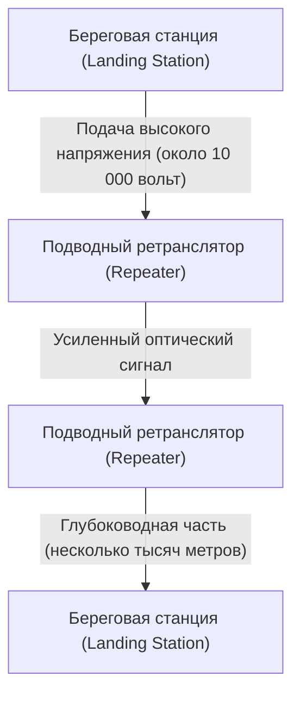

Поскольку даже в сверхнизкопотерьном волокне оптический сигнал затухает через каждые несколько десятков километров, через равные промежутки в кабель встраиваются «подводные ретрансляторы» (упомянутые выше EDFA). Для питания этих ретрансляторов на морском дне с береговых станций на обоих концах по медным трубкам внутри кабеля непрерывно подается постоянный ток высокого напряжения от нескольких тысяч до более чем 10 000 вольт.
Для прокладки используются специальные «кабелеукладочные суда». На мелководье подводные роботы (ROV) роют траншею на морском дне и закапывают кабель. Если кабель обрывается, на место происшествия прибывает ремонтное судно. Оно цепляет конец кабеля из глубин океана с помощью грейфера (когтя, похожего на якорь), поднимает его на палубу, и опытные техники сваривают оптические волокна с микронной точностью — невероятно аналоговая и кропотливая работа.

### Физика радиосвязи (основа Wi-Fi)
С распространением мобильных устройств и IoT, радиосвязь, использующая электромагнитные волны в пространстве, также стала главным полем битвы на физическом уровне. Wi-Fi (стандарты IEEE 802.11) использует в основном частоты 2,4 ГГц, 5 ГГц и недавно освобожденные диапазоны 6 ГГц — диапазоны ISM (для промышленных, научных и медицинских целей, не требующие лицензии).

#### QAM (квадратурная амплитудная модуляция): экстремальное сжатие информации
Для «модуляции» цифровых данных на аналоговую волну Wi-Fi использует чрезвычайно сложную технологию — QAM (Quadrature Amplitude Modulation: квадратурная амплитудная модуляция).
У радиоволны есть две физические характеристики: «амплитуда (высота волны)» и «фаза (время/угол волны)». QAM объединяет две несущие волны (сигналы I и Q), сдвинутые по фазе на 90 градусов, и, изменяя амплитуду каждой из них, назначает битовую последовательность определенной «точке» на диаграмме созвездия (Constellation map).

Например, 16-QAM может представить 16 точек (4 бита) одним изменением волны (символом). В новейшем стандарте Wi-Fi 7 (802.11be) применяется безумно высокоплотная модуляция 4096-QAM. При этом одним модулированием представляются 4096 точек (12 бит). На диаграмме созвездия, где теснятся 4096 точек, приемник должен точно определить отправленную «точку», не утонув в микроскопическом шуме. Для этого используются передовые коды коррекции ошибок и мощные процессоры обработки сигналов.

#### OFDM и MIMO: борьба с многолучевостью и использование пространства
Радиоволны не только распространяются по прямой, но и отражаются, дифрагируют и рассеиваются от стен и мебели. Из-за этого радиоволны, испущенные передатчиком, достигают приемника по разным путям (многолучевое распространение - Multipath) с небольшой задержкой, вызывая интерференцию (замирание, Fading) и искажение формы волны.
Технологии, которые используют это в своих интересах или преодолевают это — OFDM и MIMO.

**OFDM (мультиплексирование с ортогональным частотным разделением каналов)** — это технология, при которой вместо одного широкополосного, легко отражаемого сигнала, полоса пропускания делится на множество очень узких частот (поднесущих), и данные передаются параллельно на каждой из них с медленной скоростью. Поскольку поднесущие располагаются «ортогонально» (математически не мешая друг другу), эффективность использования частот крайне высока, и технология устойчива к задержкам из-за многолучевого распространения.

**MIMO (Multiple-Input and Multiple-Output)** — это технология «пространственного мультиплексирования», которая использует несколько антенн для одновременной передачи разных данных на одной и той же частоте. Используя свойство радиоволн смешиваться по-разному в разных точках пространства из-за многолучевого отражения, сложные сигналы, полученные несколькими антеннами на принимающей стороне, разделяются так же, как решаются системы линейных уравнений, удваивая пропускную способность пропорционально числу антенн. Кроме того, неотъемлемой технологией современного Wi-Fi стало **формирование луча (Beamforming)**, которое микрорегулирует фазу радиоволн для каждой антенны, чтобы сфокусировать луч в определенном направлении.

---

## 2.2 Канальный уровень (Data Link Layer): Диалог и порядок между напрямую соединенными устройствами

Если физический уровень — это просто «перевозчик сигналов», то канальный уровень объединяет эти сырые битовые последовательности в осмысленные блоки, называемые «кадрами» (frames), и берет на себя правила и управление трафиком для их гарантированной доставки правильному адресату в пределах той же сети (канала).

### История Ethernet: Вдохновение от ALOHA
Сегодня мировым стандартом де-факто для проводных локальных сетей (LAN) является Ethernet (IEEE 802.3).
Его корни уходят в беспроводную сеть «ALOHAnet», созданную в Гавайском университете. ALOHAnet использовала крайне анархичный и амбициозный протокол: «Если есть данные для отправки, отправляй в любом случае. Если они столкнутся и разрушатся, подожди случайное время и отправь снова».

В 1973 году Боб Меткалф из Исследовательского центра Пало-Альто (PARC) компании Xerox применил идеи ALOHAnet к связи по коаксиальному кабелю, изобретя Ethernet. Ранний Ethernet имел «шинную» топологию: к одному толстому коаксиальному кабелю (Yellow Cable) подключалось множество компьютеров с помощью так называемых «вампирских ответвителей» (Vampire tap).

#### CSMA/CD: Упорядоченная анархия
Поскольку среда (кабель) является общей для всех, если несколько устройств одновременно передают электрические сигналы, формы волн накладываются друг на друга и данные разрушаются. Возникает «коллизия» (столкновение). Автономный децентрализованный алгоритм для избежания и решения этой проблемы называется «CSMA/CD (Carrier Sense Multiple Access with Collision Detection — множественный доступ с контролем несущей и обнаружением коллизий)».

1. **Carrier Sense (Контроль несущей)**: Перед отправкой измеряется напряжение в кабеле, чтобы «послушать», не передает ли кто-нибудь другой.
2. **Multiple Access (Множественный доступ)**: Если никто не передает данные, любой может начать отправку без ожидания разрешения от центрального узла.
3. **Collision Detection (Обнаружение коллизий)**: Во время отправки напряжение в кабеле продолжает отслеживаться. Если устройство замечает аномальное повышение напряжения, отличное от его собственного передаваемого сигнала, это считается «коллизией». Оно немедленно отправляет jam-сигнал, оповещая всех остальных о коллизии, и прекращает передачу.
4. **Backoff (Задержка повторной передачи)**: После коллизии каждый узел ожидает случайное время (вычисляемое по алгоритму экспоненциальной задержки), прежде чем попытаться передать данные снова.

Этот простой и не требующий центрального администратора механизм, предполагающий, что «нарушения правил (коллизии) произойдут, а когда они произойдут, нужно подождать случайное время», является главной причиной, по которой Ethernet победил сложные и дорогие протоколы, такие как IBM Token Ring или ATM, и захватил господство.

### MAC-адрес: Абсолютное удостоверение личности оборудования
Для указания адресата на канальном уровне используется MAC-адрес (Media Access Control address). Если IP-адрес — это «временный адрес проживания», то MAC-адрес — это «уникальный идентификационный номер, данный при рождении».

MAC-адрес имеет длину 48 бит (6 байт) и записывается как 16-ричные числа по две цифры, разделенные двоеточиями, например, «00:1A:2B:3C:4D:5E».
- **Первые 24 бита (OUI: Organizationally Unique Identifier)**: Код компании, управляемый и назначаемый IEEE, который уникально идентифицирует производителя сетевого оборудования (Apple, Cisco, Intel и т.д.).
- **Последние 24 бита (UAA: Universally Administered Address)**: Серийный номер, последовательно назначаемый производителем своим продуктам.

Как правило, сетевой интерфейс (NIC) каждого сетевого устройства в мире имеет уникальный, зашитый в ПЗУ MAC-адрес.

### Структура кадра: Технология упаковки связи
На канальном уровне к данным, полученным с сетевого уровня (например, IP-пакетам), добавляются заголовок и концевик (trailer), инкапсулируя их в единицу, называемую «кадром» (frame). Структура кадра Ethernet (Ethernet II) изящна до совершенства.

1. **Преамбула (Preamble)**: 7 байтов из последовательности «10101010». Разминка для синхронизации тактовой частоты NIC на приемной стороне.
2. **SFD (Start Frame Delimiter)**: 1 байт «10101011». Окончание преамбулы «11» сообщает приемной стороне, что «дальше начинаются реальные данные».
3. **MAC-адрес назначения (Destination MAC) / MAC-адрес источника (Source MAC)**: По 6 байт каждый. От кого и кому направлено сообщение. Если адрес назначения — «FF:FF:FF:FF:FF:FF», это широковещательный кадр (broadcast frame), доставляемый всем.
4. **Тип (EtherType)**: 2 байта. Указывает, какие данные находятся в полезной нагрузке (например, 0x0800 для IPv4, 0x86DD для IPv6, 0x0806 для ARP).
5. **Полезная нагрузка (Data/Payload)**: Фактические данные, полученные от верхнего уровня. Размер от 46 до максимум 1500 байт (MTU: Maximum Transmission Unit).
6. **FCS (Frame Check Sequence)**: 4-байтовый концевик. Хэш-значение, вычисленное для всего кадра (от MAC-адреса назначения до полезной нагрузки) с использованием полинома CRC-32 (циклический избыточный код).

NIC на приемной стороне, принимая кадр, аппаратно и на высокой скорости вычисляет CRC. Если FCS в конце кадра отличается от собственного результата вычислений хотя бы на 1 бит, кадр считается поврежденным из-за шума или коллизий при передаче и **безжалостно отбрасывается без какого-либо уведомления**. Канальный уровень надежно выполняет задачу «обнаружить ошибку и выбросить», но не имеет функции запроса: «данные были повреждены, отправьте снова». Распределение ролей, при котором тяжелая ответственность за повторную передачу возлагается на более высокий протокол TCP и т.д., поддерживает масштабируемость Интернета.

### Рождение коммутаторов и переход к полнодуплексной связи
Ethernet на основе общей шины с CSMA/CD был отличным механизмом, но имел фатальный недостаток: по мере увеличения количества устройств (хостов), подключенных к сети, коллизии учащались, и реальная пропускная способность резко падала.
Это проблему в корне решили «коммутаторы 2-го уровня (коммутирующие концентраторы)», получившие широкое распространение в 1990-х годах.

В отличие от концентратора-повторителя (хаба) — устройства физического уровня, которое безусловно рассылает полученный электрический сигнал на все порты, коммутатор обладает интеллектуальным «мозгом», понимающим канальный уровень.
Коммутатор имеет внутри «таблицу MAC-адресов», использующую память (CAM). Он изучает MAC-адреса источников устройств, подключенных к каждому порту, и автоматически формирует таблицу соответствия портов и MAC-адресов.
Затем, когда поступает кадр, коммутатор сверяет MAC-адрес назначения с таблицей и направляет (пересылает) кадр «только» в тот порт, к которому подключено соответствующее устройство.

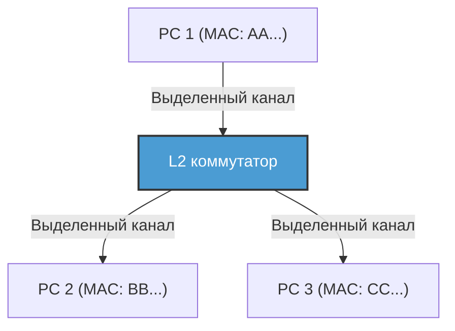

С внедрением коммутаторов соединения между каждым узлом и коммутатором стали логически и физически независимыми (звездообразная топология). Благодаря разделению путей передачи данных, коллизии в принципе перестали возникать. В результате стала возможной «полнодуплексная связь (Full-Duplex)», когда линии приема и передачи используются одновременно.
В современном Ethernet алгоритм CSMA/CD больше не используется, и технология эволюционировала в чистую полнодуплексную связь точка-точка. Более того, благодаря технологии VLAN (Virtual LAN) по стандарту IEEE 802.1Q стало возможным гибко разделять и объединять логические сети независимо от физической проводки, и Ethernet продолжает править бал как абсолютная базовая технология, поддерживающая инфраструктуру предприятий и гигантских центров обработки данных.

### Канальный уровень Wi-Fi: управление трафиком в невидимом радиопространстве
В то время как проводной Ethernet эволюционировал до полнодуплексной связи без коллизий, беспроводной Wi-Fi столкнулся с той же сложной проблемой, что и старый шинный Ethernet — «разделение единой среды (воздуха) в одном пространстве всеми пользователями».

При беспроводной связи физически невозможно одновременно передавать свой сильный радиосигнал и принимать слабый сигнал другого устройства, чтобы «обнаружить» (CD) коллизию. Кроме того, существует специфический для беспроводной связи риск — «проблема скрытого узла (Hidden Node Problem)». Например, терминалы A и C, расположенные по разные стороны от точки доступа, не могут принимать сигналы друг друга, но если они будут вести передачу одновременно, их сигналы столкнутся на точке доступа.

Поэтому протокол канального уровня Wi-Fi (MAC-уровень) использует алгоритм «CSMA/CA (Carrier Sense Multiple Access with Collision Avoidance: множественный доступ с контролем несущей и предотвращением коллизий)».
В CSMA/CA перед отправкой устройство в течение определенного времени (DIFS) перехватывает состояние радиоволн в пространстве, а затем ждет случайное время отсрочки (backoff) перед началом передачи. Самым важным отличием является механизм **ACK (Acknowledge: подтверждение)**, которого не было в проводных сетях. В Wi-Fi принимающая сторона немедленно (после крайне короткого времени ожидания SIFS) отправляет назад кадр ACK, чтобы показать, что данные получены успешно. Отправляющая сторона считает связь успешной только после получения этого ACK. Если ACK не возвращается, считается, что данные повреждены из-за коллизии или помех, и время отсрочки удваивается для повторной передачи.

Для решения проблемы скрытого узла также существует механизм «рукопожатия RTS/CTS». Перед отправкой больших данных передающая сторона отправляет короткий управляющий кадр RTS (Request to Send), а принимающая сторона (например, точка доступа) возвращает CTS (Clear to Send). Этот CTS содержит информацию о зарезервированном времени (NAV: Network Allocation Vector): «Я собираюсь осуществлять связь в течение следующих ОО микросекунд, поэтому окружающие терминалы, пожалуйста, помолчите», и окружающие терминалы, получив это, воздерживаются от связи. Таким образом, канальный уровень Wi-Fi обеспечивает превосходное управление трафиком в невидимом пространстве радиоволн.

---

## Заключение

Мир физических явлений, где фотоны мчатся сквозь стекло, кабели выдерживают давление глубин океана, а электромагнитные волны пересекают пространство, меняя фазу и амплитуду. И только положив поверх этих шумных и неопределенных физических явлений синхронизацию с помощью преамбулы, индивидуальную идентификацию с помощью MAC-адресов, строгий контроль ошибок с помощью CRC и сложное управление трафиком с помощью коммутации и CSMA/CA, становится возможным «безошибочно доставить осмысленный блок данных (кадр) соседнему устройству». Это то чудо, которого достигают первый и второй уровни.

Но одного этого недостаточно для создания Интернета, объединяющего весь мир. Связь с использованием MAC-адресов работает только в рамках «узкой деревни» (широковещательного домена), то есть устройств, подключенных к одному и тому же коммутатору, точке доступа или до первого маршрутизатора.

В следующей главе, «Глава 3: Сетевой уровень и IP», мы приблизимся к сути IP (Internet Protocol) и маршрутизации — грандиозному механизму поиска пути, который соединяет эти бесчисленные локальные деревни вместе и доставляет пакеты, словно передавая ведро по цепочке, в неизвестные сети на другой стороне земного шара.

# Глава 3: Сетевой уровень и механизмы маршрутизации — морская карта для пакетов, пересекающих океан

Основой Интернета, которым мы пользуемся повседневно, является 3-й уровень эталонной модели OSI, а именно «сетевой уровень». За прямым соединением через физические кабели или радиоволны (канальный уровень) и возможностью связи с серверами на расстоянии тысяч километров в глобальном масштабе скрывается грандиозный механизм управления маршрутами (маршрутизации). Этот механизм опирается на бесчисленное множество развернутых маршрутизаторов, которые автономно обмениваются информацией друг с другом.

В этой главе мы максимально подробно, с технической, исторической и физической точек зрения, расскажем об искусстве «навигации», позволяющем пакетам достигать пункта назначения: от структуры протокола IP (Internet Protocol) и ограничений IPv4 до архитектуры IPv6 и бездны BGP (Border Gateway Protocol), связывающего воедино автономные системы (AS) по всему миру.

## 3.1 Парадигма сетевого уровня: Принцип End-to-End

Крупнейшим прорывом в философии проектирования Интернета стал **принцип End-to-End (от конца к концу)**: «промежуточные узлы (маршрутизаторы) в сети должны заниматься только простой пересылкой пакетов, а сложная обработка (исправление ошибок, обеспечение порядка) должна выполняться на конечных устройствах (хостах)».

В традиционных телефонных сетях (с коммутацией каналов) физическая линия была занята от начала до конца сеанса связи, а сеть в целом управляла состоянием (state). В отличие от этого, сетевой уровень Интернета (коммутация пакетов) функционирует «без установления соединения» (connectionless) и не сохраняет состояние. Каждый пакет рассматривается как независимое «письмо», а маршрутизатор повторяет простую операцию: получает его, смотрит на адрес назначения и отправляет (forwarding) к оптимальному следующему транзитному узлу (next hop). Эта комбинация «тупой сети (Dumb Network)» и «умных терминалов (Smart Terminal)» является главной причиной, почему Интернет смог взрывообразно масштабироваться и вместить самые разные приложения.

## 3.2 Адреса в Интернете: Эволюция IP-адресов и история их истощения

Каждому устройству в сети присваивается уникальный идентификатор — IP-адрес. В настоящее время Интернет находится в переходном периоде, когда сосуществуют два поколения IP-протокола.

### IPv4: Пространство в 32 бита и борьба с его истощением

IPv4, определенный в RFC 791 в 1981 году, имеет 32-битное адресное пространство (около 4,3 миллиарда адресов). При разработке цифра в 4,3 миллиарда казалась астрономической, но из-за взрывного роста Интернета угроза истощения стала очевидной уже в 1990-х годах.

Для преодоления этого кризиса были созданы **CIDR (Classless Inter-Domain Routing)** и **NAT (Network Address Translation)**.
Изначально распределение IP-адресов осуществлялось по «классовой» (classful) системе: классы A (/8), B (/16) и C (/24), что приводило к серьезной растрате адресов. CIDR заменил этот подход бесклассовой (classless) маршрутизацией с масками подсети переменной длины (VLSM), выделяя ровно столько адресов, сколько необходимо.
Кроме того, с появлением NAT, который связывал пространство частных IPv4-адресов с одним публичным IPv4-адресом, стало возможным делить один адрес между тысячами устройств. Однако NAT нарушил принцип End-to-End и потребовал сложных технологий преодоления NAT (таких как STUN/TURN/ICE) для P2P-связи и связи в реальном времени.

### IPv6: Бесконечное 128-битное пространство и структура заголовка следующего поколения

В качестве фундаментального решения проблемы истощения адресов в 1998 году в RFC 2460 был принят протокол **IPv6**. IPv6 имеет 128-битное адресное пространство, предоставляя астрономические $2^{128}$ (около 340 ундециллионов) адресов — пространство настолько обширное, что его хватило бы, чтобы присвоить IP-адрес каждой песчинке на Земле, и адреса еще бы остались.

Инновационность IPv6 не ограничивается только длиной адреса. Было кардинально упрощено строение заголовка. Опции переменной длины и контрольная сумма заголовка, присутствовавшие в IPv4, были упразднены, а базовый заголовок зафиксирован на уровне 40 байт. Это ускорило обработку пакетов (маршрутизацию) на аппаратном уровне (в ASIC и TCAM). Кроме того, спецификация была изменена так, что фрагментация (разбиение) пакетов больше не выполняется промежуточными маршрутизаторами, а осуществляется только хостом-отправителем, что значительно снизило нагрузку на маршрутизаторы.

## 3.3 Двойственность маршрутизации: Control Plane и Data Plane

Внутренняя структура маршрутизатора в целом разделена на две «плоскости (Plane)».

1. **Плоскость управления (Control Plane)**
   Это «мозг» устройства, где маршрутизаторы связываются друг с другом с помощью протоколов маршрутизации (таких как OSPF или BGP), изучают топологию сети (схему соединений) и вычисляют оптимальные маршруты. Результаты вычислений сохраняются в базе данных RIB (Routing Information Base).
2. **Плоскость передачи (Data Plane)**
   Это «мышцы», которые фактически получают пакеты, определяют исходящий интерфейс на основе IP-адреса назначения и отправляют пакеты. Для передачи данных со скоростью среды (wire-speed) на аппаратном уровне за наносекунды используются специализированные таблицы FIB (Forwarding Information Base), созданные из RIB, и специальная память, такая как TCAM (Ternary Content-Addressable Memory).

## 3.4 Внутреннее управление сетями: IGP и автономные системы (AS)

Интернет — это не единая монолитная сеть, а совокупность независимых сетей, управляемых интернет-провайдерами (ISP), корпорациями, университетами и т. д. Эта зона независимого управления называется **автономной системой (AS: Autonomous System)**. На сегодняшний день в мире существует более 100 000 AS.

Для маршрутизации внутри AS (в корпоративной сети или магистрали ISP) используется **IGP (Interior Gateway Protocol)**. Существуют два основных протокола IGP:

- **OSPF (Open Shortest Path First) / IS-IS**
  Это протоколы маршрутизации на основе состояния каналов (link-state). Маршрутизатор рассылает информацию о состоянии своих локальных подключений (пропускной способности канала и его статусе) по всей сети (flooding), в результате чего каждый маршрутизатор строит полную карту всей сети (базу данных топологии). На этой карте с помощью алгоритма Дейкстры (Dijkstra's algorithm) вычисляется маршрут до пункта назначения с минимальной «стоимостью». Это физически и математически тот же подход, который использует автомобильный навигатор для расчета кратчайшего маршрута с учетом информации о пробках.

## 3.5 BGP: «Дипломатический» протокол, сплетающий Интернет

В то время как внутренние сети AS управляются OSPF и другими протоколами, единственным стандартом де-факто для протокола **EGP (Exterior Gateway Protocol)**, который связывает AS между собой и формирует глобальный Интернет, является **BGP (Border Gateway Protocol)**. BGP — это крайне специфичный протокол, который определяет маршруты не только на основе технического кратчайшего расстояния, но и с учетом «деловых отношений» и «политики между государствами».

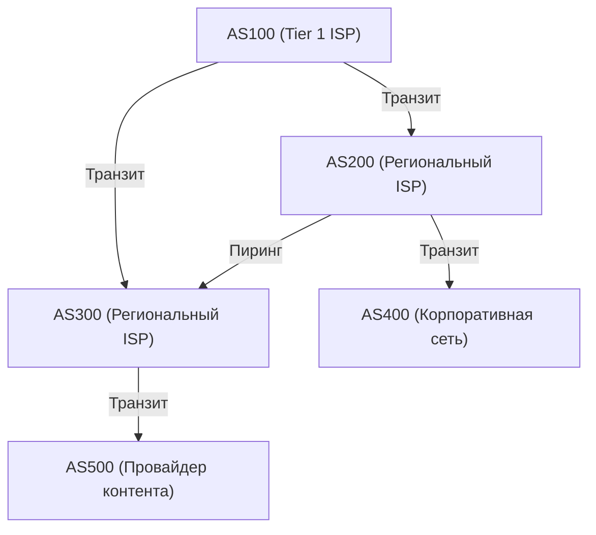

### Пиринг и Транзит: Экономика Интернета

В соединениях между AS через BGP существуют две основные бизнес-модели:

1. **Транзит (Transit)**
   Отношения, при которых мелкие ISP или корпорации платят гигантским ISP за связь и получают доступность (маршруты по умолчанию, full route) ко всем частям Интернета. Это классические отношения «клиент — провайдер».
2. **Пиринг (Peering)**
   Отношения, при которых интернет-провайдеры или интернет-провайдеры и провайдеры контента (например, Google или Netflix) подключают свои сети напрямую друг к другу через точки обмена трафиком (IX: Internet Exchange). Обычно это делается бесплатно (settlement-free) с целью сокращения маршрутов трафика и снижения затрат.

### Вектор пути и алгоритм выбора маршрута в BGP

BGP — это протокол типа «вектор пути» (Path Vector). В качестве атрибута он сохраняет информацию о том, через какие AS прошел пакет, прежде чем достиг определенной IP-сети (атрибут AS_PATH). Например, если в информации о маршруте указано `AS_PATH: [200, 100, 500]`, пакет пройдет через эти AS в указанном порядке. Таким образом надежно предотвращается образование петель маршрутизации.

Когда маршрутизатор BGP получает несколько маршрутов к одному и тому же пункту назначения, он выбирает только один лучший путь (best path) на основе сложного набора приоритетов (Local Preference, длина AS_PATH, MED, тип сессии eBGP/iBGP и т. д.). Особенно мощным является атрибут **Local Preference (локальный приоритет)**. Он позволяет навязывать маршрутизатору бизнес-политику: «Технически это может быть обходной путь, но поскольку маршрут через пиринговый канал не требует затрат на транзит, мы выберем его».

### Перехват BGP (BGP Hijacking) и уязвимости маршрутизации

Протокол BGP изначально был разработан на основе принципа «презумпции добросовестности». Поскольку маршрутизатор «верит», что объявленная кем-то другим информация о маршрутах верна, когда злонамеренная AS или AS с ошибками конфигурации отправляет ошибочное обновление BGP, утверждая «У меня лучший маршрут к сети Google (8.8.8.8/32)», трафик со всего мира начинает стекаться в эту AS. Это называется **перехватом BGP (BGP Hijacking)**.
В истории было множество крупномасштабных сбоев, связанных с уязвимостью BGP, таких как инцидент 2008 года, когда в результате блокировки YouTube правительством Пакистана сервис стал недоступен во всем мире. В настоящее время внедряются механизмы криптографической проверки маршрутной информации, такие как RPKI (Resource Public Key Infrastructure).

## 3.6 Физические ограничения и борьба маршрутизаторов: Задержка и Bufferbloat

Маршрутизация на сетевом уровне — это постоянная борьба с ограничениями физики.
Скорость света в оптоволокне составляет около 67% от скорости света в вакууме (около 200 000 км/с), поэтому избежать физической задержки (задержки распространения) при передаче данных туда и обратно (RTT) от Японии до западного побережья США в 100–120 миллисекунд невозможно.

К этому добавляются задержки обработки в каждом маршрутизаторе и **задержка в очередях (queuing delay)**. При перегрузке сети маршрутизаторы временно накапливают пакеты в памяти (буферах). Поскольку современные маршрутизаторы оснащены большим объемом памяти, возникает явление, при котором маршрутизатор поглощает длительную перегрузку, не отбрасывая пакеты. Это **«разбухание буфера» (Bufferbloat)**. Постоянное накопление огромного количества пакетов в буфере не позволяет нормально работать механизмам контроля перегрузки верхних уровней (например, TCP), что приводит к экстремальным задержкам (до нескольких тысяч миллисекунд). Для решения этой проблемы в современные маршрутизаторы и ОС внедрены передовые алгоритмы управления очередями (AQM — Active Queue Management, такие как FQ-CoDel).

## Заключение

3-й уровень — сетевой уровень — это не просто доставщик данных. Это сложный комплекс, где переплетаются исторический переход от IPv4 к IPv6, наносекундная аппаратная обработка с использованием TCAM, математический поиск кратчайших путей с помощью OSPF и автономно-децентрализованное управление маршрутами с помощью BGP, несущее в себе экономические и политические намерения.
Прежде чем единственный IP-пакет с вашего смартфона достигнет сервера на другой стороне Земли, он проходит через бесчисленное количество маршрутизаторов, которые мгновенно сверяются со своими картами (таблицами маршрутизации) и, как эстафетную палочку, передают пакет дальше. Это результат работы самой огромной и сложной системы, созданной человечеством.

В следующей главе мы разберем механизмы «транспортного уровня (TCP/UDP)», который надстраивается над этим сетевым уровнем и отвечает за гарантию доставки пакетов и контроль перегрузок.

# Глава 4: Надежность и скорость на транспортном уровне — главная дилемма, лежащая в основе передачи информации

## 1. Введение: Принцип End-to-End и миссия транспортного уровня

Главная задача сетевого уровня (IP), который мы рассматривали в предыдущих главах, заключалась в физической и логической доставке пакетов через бескрайний океан Интернета до «целевого компьютера (сетевого интерфейса хоста)». Однако на доставке пакетов к пункту назначения процесс связи не заканчивается. В современных компьютерных системах на базе ОС работают сотни параллельных прикладных процессов в многозадачном режиме (веб-браузеры, почтовые клиенты, приложения потокового видео, фоновые процессы синхронизации, API-сервисы и т. д.).

Из горы пакетов, беспорядочно поступающих с уровня IP, необходимо выделить, какой пакет принадлежит какому приложению, пересобрать из них осмысленный поток данных и компенсировать потери в случае их возникновения. Полную ответственность за окончательное управление данными на конечных устройствах несет «транспортный уровень» (Transport Layer).

В основе философии Интернета лежит одно очень красивое и мощное архитектурное решение — «принцип End-to-End (от конца к концу)». Эта концепция, выдвинутая в 1981 году Джеромом Зальцером и его коллегами, гласит: «Промежуточные узлы сети (маршрутизаторы и коммутаторы) должны специализироваться на максимально простой пересылке пакетов (dumb network), а сложные процессы, такие как восстановление ошибок, контроль последовательности и шифрование, должны быть возложены на узлы на концах соединения (smart endpoints)». Если бы промежуточные сетевые устройства были обременены управлением сложными состояниями и функциями исправления ошибок, Интернет никогда бы не достиг своей нынешней взрывной глобальной масштабируемости.

Транспортный уровень постоянно сталкивается с фундаментальной дилеммой на стыке физических ограничений и теории информации. Это компромисс между «Надежностью» (Reliability) и «Скоростью» (Speed / Low Latency). Для доставки информации без единой потери необходимы накладные расходы на подтверждение и повторную отправку, что приводит к задержкам, обусловленным физическим пределом — скоростью света. С другой стороны, попытка минимизировать задержку неизбежно ведет к частичному пожертвованию целостностью информации. В зависимости от того, как решается эта дилемма, основанная на законах физики, и какие абстракции предоставляются приложениям, были разработаны и эволюционировали различные протоколы: TCP, UDP и современный QUIC.

## 2. TCP (Transmission Control Protocol): Надежный механизм, гарантирующий достоверность

Основы TCP были заложены Винтоном Серфом и Робертом Каном еще в 1970-х годах, в эпоху до коммерциализации, когда Интернет еще назывался ARPANET. Философия его дизайна предельно ясна: «Гарантировать доставку данных без потерь, в правильном порядке и без дублирования приложению получателя, даже в самых плохих сетевых условиях и на нестабильных каналах с частой потерей пакетов». Разработчикам приложений, использующим TCP, не нужно беспокоиться о сложности сети и потерях пакетов: протокол предоставил мощную абстракцию, позволяющую просто читать и писать данные как «непрерывный поток байтов».

### Мультиплексирование с помощью номеров портов
Если IP-адрес — это адрес, указывающий, «какое это здание на планете», то «номер порта» транспортного уровня является логическим окном, указывающим, «в какую комнату (какому процессу) в этом здании» адресованы данные. Номер порта представляет собой 16-битное беззнаковое целое число в диапазоне от 0 до 65535.
Это позволяет одновременно мультиплексировать (обслуживать) тысячи и десятки тысяч различных соединений поверх одного IP-адреса и одного физического сетевого интерфейса. Основным службам заранее назначены «хорошо известные порты» (Well-Known Ports): например, 80 для HTTP, 443 для HTTPS, 22 для SSH и так далее.

### 3-стороннее рукопожатие: Установление доверия и физическая задержка
Прежде чем начать обмен данными, TCP всегда выполняет ритуал установки логического «соединения» (connection) между отправителем и получателем. Это «3-стороннее рукопожатие» (3-Way Handshake). Это не просто проверка намерения общаться, но и синхронизация (Synchronization) пространства состояний перед обменом огромным объемом данных — важнейший этап.

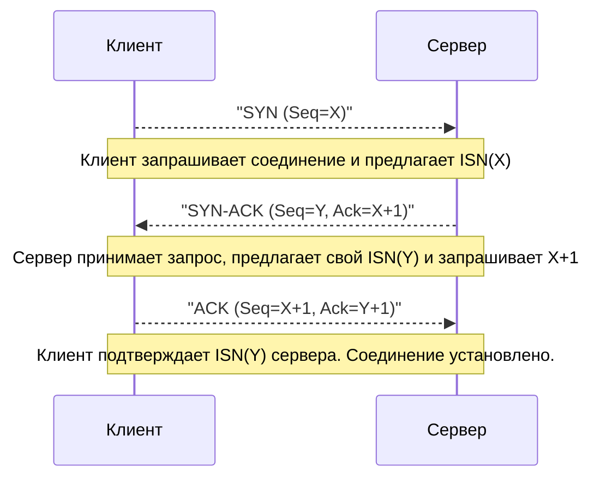

1. **SYN (Synchronize):** Клиент отправляет серверу пакет запроса синхронизации (TCP-сегмент с установленным флагом SYN). При этом он предлагает случайно сгенерированный 32-битный «начальный порядковый номер» (ISN: Initial Sequence Number, здесь обозначен как X). Существуют причины, по которым ISN не начинается с нуля или фиксированного значения. Это криптографическая мера защиты от путаницы, когда «старые задержанные пакеты-призраки» от закрытого соединения между теми же IP и портами ошибочно принимаются за пакеты нового соединения, а также от атак подмены IP (IP Spoofing) с прогнозированием последовательности TCP.
2. **SYN-ACK:** Получив запрос на соединение, сервер отправляет пакет SYN-ACK. В качестве «номера подтверждения» (Acknowledgment Number) он возвращает ISN клиента плюс единица (X+1), а также прикрепляет свой случайный начальный номер последовательности (Y).
3. **ACK (Acknowledgment):** В качестве доказательства успешного получения ISN сервера клиент отправляет пакет ACK с номером подтверждения Y+1.

После завершения этого обмена тремя пакетами состояние двунаправленной связи закрепляется в памяти, и все готово к передаче данных. Однако на этот строгий процесс тяжело ложится ограничение инфраструктуры связи — «скорость света».
Скорость света в вакууме составляет около 300 000 км/с, но из-за показателя преломления сердцевины оптоволокна (кварцевого стекла) скорость распространения сигнала снижается примерно до двух третей (около 200 000 км/с). Дополнительно накладываются задержки маршрутизации и очереди на коммутаторах. В результате, время прохождения сигнала туда и обратно (1 RTT: Round Trip Time) между Токио и Нью-Йорком (прямое расстояние около 11 000 км, фактическая длина кабеля больше) физически занимает не менее 150–200 миллисекунд. Трехстороннее рукопожатие TCP потребляет как минимум 1 RTT, поэтому, как бы мы ни расширяли пропускную способность, задержка (latency) при установке соединения ограничивается абсолютным законом Вселенной.

### Скользящее окно, контроль порядка и контрольная сумма
Переходя к этапу передачи данных, TCP разделяет байтовый поток от приложения на сегменты соответствующего размера (MSS: Maximum Segment Size, обычно около 1460 байт, что равно MTU IP за вычетом размеров заголовков). Каждому сегменту присваивается порядковый номер (Sequence Number), соответствующий количеству байтов данных. Если пакеты доставляются с нарушением порядка, получатель, используя эти номера, перестраивает исходные данные в правильной последовательности.

Кроме того, заголовок TCP содержит 16-битную «контрольную сумму» (Checksum). Она используется для строгой проверки с помощью арифметики обратного кода того, не произошло ли инвертирования битов (повреждения данных) из-за электрических шумов на маршруте или ошибок памяти маршрутизатора.

Если пакет теряется (Packet Loss) в пути или отбрасывается из-за повреждения, получатель продолжает отправлять ACK для ожидаемого номера последовательности (Duplicate ACK) или не отвечает вообще. Отправитель, если ACK не возвращается в течение заданного времени (RTO: Retransmission Timeout) или если он обнаруживает дублированные ACK, выполняет «повторную передачу» (Retransmit) этого пакета.

Механизмом, который радикально увеличивает скорость передачи в этой схеме, является «скользящее окно» (Sliding Window). Подход «отправить один пакет и не отправлять следующий, пока не будет получен ACK» (Stop-and-Wait) привел бы к катастрофическому падению пропускной способности в средах с высокой задержкой (высоким RTT).
В механизме скользящего окна отправитель и получатель динамически договариваются о «размере окна» (максимальном количестве байтов неподтвержденных данных, которое можно отправить за раз) с учетом емкости буферов друг друга. В пределах этого окна отправитель может непрерывно отправлять в сеть один пакет за другим, не дожидаясь ACK от получателя. При получении каждого ACK эта рамка отправки (окно) сдвигается вперед. Это позволяет поддерживать передачу данных на максимальном уровне в сетях с толстым каналом и высокой задержкой (средах с большим BDP: Bandwidth-Delay Product), реализуя механизм «заполнения трубы данными».

### Контроль перегрузки (Congestion Control): Математическая гармония, спасающая сеть от краха
Истинным шедевром TCP и одним из важнейших технологических прорывов в истории Интернета является «контроль перегрузки» (Congestion Control).

В 1986 году на ранних этапах развития Интернета (NSFNET) из-за роста трафика возник фатальный системный сбой — «крах от перегрузки» (Congestion Collapse). Из-за притока данных, превышающих вычислительные возможности сети, буферы (очереди) маршрутизаторов переполнялись, и огромное количество пакетов отбрасывалось. Конечные узлы TCP, заметив потерю пакетов, решали, что данные не дошли, и синхронно выполняли «повторную отправку». Это привело к тому, что в сеть вливалось еще больше данных, маршрутизаторы еще больше переполнялись, и эффективная пропускная способность резко падала в тысячи раз, создавая разрушительный порочный круг.

Чтобы предотвратить эту «смерть сети», в 1988 году Ван Якобсон внедрил в TCP продвинутые алгоритмы динамического управления. В их основе лежит контроль окна перегрузки (cwnd: Congestion Window) на базе принципа AIMD (Additive Increase Multiplicative Decrease: аддитивное увеличение, мультипликативное уменьшение).

1. **Медленный старт (Slow Start):** Сразу после начала связи свободная емкость сети неизвестна. Поэтому окно отправки начинается с очень маленького значения (исторически 1 MSS, сегодня около 10 MSS), и с получением каждого ACK размер окна увеличивается на 1 MSS. В результате размер окна «удваивается каждый RTT» — растет экспоненциально. Вопреки названию «медленный», это фаза агрессивного и быстрого поиска предела пропускной способности.
2. **Предотвращение перегрузки (Congestion Avoidance):** Когда окно достигает предварительно заданного порога (ssthresh: Slow Start Threshold), экспоненциальный рост останавливается и сменяется линейным (прибавление 1 MSS за 1 RTT). Это фаза более осторожного исследования пропускной способности сети.
3. **Обнаружение потери пакетов и мультипликативное уменьшение:** Потерю пакета (тайм-аут или три подряд дублированных ACK) TCP трактует не как простую ошибку передачи, а как «признак того, что на маршруте образовался затор (перегрузка), и пакеты выпали из буфера маршрутизатора». В этот момент TCP мгновенно включает самоконтроль и резко уменьшает окно отправки наполовину (или до начального значения медленного старта).

Благодаря этому математическому и альтруистическому распределенному алгоритму, в котором «мы понемногу делимся пропускной способностью (аддитивное увеличение) и сразу же уступаем, если возникает проблема (мультипликативное уменьшение)», сотни миллионов и миллиарды независимых TCP-соединений в Интернете, не имея централизованного диспетчера трафика, поддерживают чудесный баланс (гомеостаз) — «справедливое разделение пропускной способности» и «стабильную работу всей сети».

В последние годы увеличение емкости буферов маршрутизаторов привело к новой физической проблеме — «Bufferbloat». До того как произойдет отбрасывание пакетов из-за перегрузки, пакеты накапливаются в длинных очередях, и задержка (пинг) возрастает до сотен миллисекунд или даже секунд. Для борьбы с этим Google разработала BBR (Bottleneck Bandwidth and Round-trip propagation time) — новейший алгоритм, который использует «увеличение RTT (времени задержки)», а не потерю пакетов как сигнал перегрузки, активно ограничивая скорость до переполнения буферов. BBR становится современным стандартом TCP.

## 3. UDP (User Datagram Protocol): Упрощение ради скорости

Если TCP — это «гиперопекающий администратор», гарантирующий полную достоверность данных с помощью сложных переходов состояний и алгоритмов, то UDP, также относящийся к транспортному уровню, — это «курьер-минималист», чьи функции протокола урезаны до предела. Разработанный Джоном Постелом в 1980 году, UDP имеет только минимально необходимые функции транспортного уровня.

Заголовок UDP составляет всего 8 байт (тогда как заголовок TCP обычно 20 байт, а с опциями доходит до 60). В нем содержатся лишь: «Номер порта источника», «Номер порта назначения», «Длина данных» и простая «Контрольная сумма» для обнаружения повреждений.

Никакого предварительного установления соединения (3-стороннего рукопожатия), никакой гарантии порядка через номера последовательностей, никакого контроля потока через скользящее окно, никаких механизмов повторной отправки или контроля перегрузки в UDP нет. Данные, полученные от приложения, просто упаковываются в IP-дейтаграммы и забрасываются в сеть в стиле «выстрелил и забыл» (Fire and Forget). UDP даже не интересуется, дошли ли они до адресата.

Но именно эта безответственная структурная простота и является главным оружием UDP, благодаря которому в определенных случаях он превосходит TCP.

### Истинная ценность UDP: Приоритет минимальной задержки в связи реального времени
В приложениях реального времени, где физическую задержку (Latency) нужно сократить до предела, «контроль повторной передачи для обеспечения надежности» TCP вызывает фатальные проблемы.

Представьте себе онлайн-игры (шутеры от первого лица), голосовые вызовы (VoIP) или системы видеоконференций (Zoom, WebRTC). Эти приложения десятки и сотни раз в секунду отправляют пакеты с актуальными координатами или фрагментами звука.
Если используется TCP, и голосовой пакет, отправленный 100 мс назад, теряется на промежуточном маршрутизаторе, TCP замечает потерю, запрашивает повторную передачу и пытается воспроизвести данные на стороне получателя в правильном порядке. Однако в условиях, когда диалог или игра идут в реальном времени, «прошлые данные, пришедшие с задержкой в несколько сотен миллисекунд», уже не представляют никакой ценности.
Хуже того, ожидая потерянный пакет, TCP приостанавливает (буферизует) обработку уже прибывших последующих свежих пакетов и не передает их приложению. Это называется «Head-of-Line (HoL) Blocking» (Блокировка начала очереди). Прерывающийся звук или «зависание» экрана в игре на несколько секунд с последующей перемоткой вперед в большинстве случаев вызваны именно HoL-блокировкой из-за ожидания повторной передачи TCP.

UDP в подобных ситуациях позволяет просто отказаться от потерянного прошлого пакета и немедленно обработать новейший пришедший пакет. Для человеческих чувств «небольшие шумы или пропуск кадров, но при этом постоянное отображение актуального состояния с минимальной задержкой» являются гораздо более естественным и комфортным пользовательским опытом, чем «ожидание всех данных».

Кроме того, для простых транзакций, где «один маленький пакет-запрос» соответствует «одному пакету-ответу», таких как разрешение имен DNS (Domain Name System) или синхронизация времени NTP (Network Time Protocol), UDP, не имеющий накладных расходов на рукопожатие, подходит идеально.

## 4. QUIC: Сдвиг парадигмы в интернет-коммуникациях и протокол нового поколения

На протяжении десятилетий с зарождения Интернета наша сетевая архитектура была прикована к фиксированной дихотомии: «если нужна надежная передача потока — используй TCP, если скорость и реал-тайм — UDP». Однако с радикальной эволюцией современного Web (особенно с распространением мобильной связи и HTTP/2, загружающим огромные объемы ресурсов параллельно) ограничения самого базового дизайна TCP стали очевидными оковами.

Главными проблемами стали упоминавшаяся блокировка Head-of-Line (HoL) и «избыточная задержка» при установке соединения.
TCP управляет всей связью как «единым последовательным потоком байтов». Предположим, для отображения современного сайта мы через HTTP/2 параллельно (мультиплексно) запрашиваем множество файлов (HTML, CSS, JS, десятки картинок). Но на базовом уровне TCP это один поток. Если теряется пакет «Картинки A», уровень TCP до завершения повторной передачи этого пакета будет блокировать передачу приложению пакетов несвязанных «Скрипта B» и «Картинки C» на уровне ядра ОС.
Кроме того, современный Web требует шифрования (TLS/HTTPS). В традиционном стеке после завершения «рукопожатия TCP» (1 RTT) следовало «рукопожатие для обмена ключами TLS» (1-2 RTT). То есть до начала реальной безопасной передачи данных расходовалась огромная физическая задержка в 2-3 RTT.

Чтобы решить эти фундаментальные проблемы и совершить сдвиг парадигмы в инфраструктуре Интернета, Google при поддержке IETF стандартизировала протокол следующего поколения — «QUIC» (Quick UDP Internet Connections). На основе QUIC как базового протокола был переопределен стандарт Web — «HTTP/3».

### Окостенение Middlebox'ов и побег в пространство пользователя
Самым инновационным подходом QUIC является дерзкий архитектурный дизайн: **«Над существующими пакетами UDP в пространстве пользователя был воссоздан совершенно новый транспортный уровень со встроенным шифрованием и мультиплексированием»**.

Почему QUIC не улучшил TCP, а был построен поверх UDP? Бесчисленные «middlebox'ы» (маршрутизаторы, брандмауэры, NAT) в Интернете из-за многолетней практики стали жестко отвергать новые протоколы (новые номера протоколов) помимо TCP и UDP как «неизвестные угрозы» (Это называется Окостенением Интернета, Ossification). Более того, реализации TCP глубоко интегрированы в ядра ОС (Windows, Linux), и на обновление ядер во всем мире ушли бы многие годы.
Поэтому QUIC выбрал стратегию маскировки под «обычные пакеты UDP» для прохождения через фильтры, реализуя при этом лучшие черты TCP (контроль перегрузки и повторную передачу) в улучшенном виде непосредственно внутри браузеров и приложений (в пользовательском пространстве).

### Инновационные механизмы QUIC и преодоление физических барьеров

1. **Полное устранение HoL-блокировки благодаря независимости потоков:**
   QUIC обладает функцией управления несколькими логически «независимыми потоками» на уровне протокола, а не как единым потоком пакетов. В примере выше, если пакет Картинки A теряется, QUIC приостанавливает только поток Картинки A для ожидания повторной передачи, в то время как потоки Скрипта B и Картинки C продолжают обрабатываться параллельно без каких-либо препятствий. Это кардинально ускоряет загрузку веб-страниц, особенно в мобильных сетях с частой потерей пакетов.
2. **Установление соединения за 0-RTT и интегрированное шифрование:**
   QUIC изначально и глубоко интегрирован с шифрованием уровня TLS 1.3. Он не допускает ошибки TCP по разделению «транспортного соединения» и «соединения шифрования». Даже при первом обращении к серверу соединение и обмен ключами завершаются всего за 1 RTT. Еще более революционным является то, что при связи с уже известным сервером (имеющим кэшированный билет сессии) применяется **«0-RTT» — можно начать отправку первого пакета HTTP-запроса одновременно с началом связи без ожидания рукопожатия**. Это исключительно блестящий ответ в дизайне протокола на физическое ограничение «задержки из-за скорости света».
3. **Миграция соединения (Connection Migration) и независимость от IP-адресов:**
   Традиционное соединение TCP жестко привязывалось к 4 элементам: IP-источника, Порт-источника, IP-назначения, Порт-назначения (4-tuple). Из-за этого при переключении смартфона с Wi-Fi на 4G/5G и смене IP-адреса соединение TCP разрывалось, и приходилось начинать долгое рукопожатие заново.
   QUIC же управляет каждым соединением не через IP-адреса, а через уникальный идентификатор соединения (Connection ID), генерируемый в начале. Благодаря этому, даже если физический IP-адрес или сетевой интерфейс динамически меняются, при неизменном ID соединения загрузка больших файлов или видеопоток продолжаются бесшовно, без прерываний. В современную эпоху, когда мобильная связь стала доминирующей, это свойство является крайне мощным и необходимым.

## 5. Заключение: Эволюция протоколов, подчиняющих хаос и создающих порядок

Транспортный уровень воздвиг «строгий логический порядок» поверх хаоса сетевого уровня (IP), где постоянно меняются маршруты, а потеря и нарушение порядка пакетов — обычное явление.

Надежные математические модели и механизмы контроля перегрузки TCP, разработанные Винтоном Серфом и Ван Якобсоном, до сих пор спасают магистрали Интернета от краха и поддерживают передачу данных по всему миру. С другой стороны, UDP своей простотой отвечает требованиям коммуникаций в реальном времени, стремящихся к минимизации задержек. И наконец, изящная архитектура протокола QUIC, объединившая в себе шифрование и мультиплексирование для преодоления ограничений обоих предшественников, оптимизированная для современной мобильной среды.

Все это — кристаллизация бесконечных инженерных изысканий человечества: «Как точно и быстро передать информацию между отдаленными компьютерами в условиях ограниченной пропускной способности и физического барьера скорости света».

Только после того, как пакеты перестроены в правильном порядке и переданы приложению в виде осмысленного блока данных, набор электрических сигналов обретает ценность как «информация». В следующей главе мы углубимся в бездну механизмов «прикладного уровня» (HTTP, DNS и т.д.), который строится на этом прочном фундаменте транспортного уровня и непосредственно формирует привычный нам мир Web.

# Глава 5: Прикладной уровень и изнанка Web — бездна от разрешения имен до зашифрованной связи

В предыдущих главах мы глубоко погрузились в физические явления — от фотонов, отражающихся внутри оптоволокна, и электромагнитных волн в медных проводах на физическом уровне, до маршрутизации пакетов по IP и обеспечения надежности передачи на транспортном уровне с помощью TCP/UDP. В этой главе мы, наконец, вступаем в ту область, с которой человек контактирует напрямую, — «прикладной уровень» (Application Layer).

Седьмой (прикладной), шестой (представительский) и пятый (сеансовый) уровни эталонной модели OSI в современной иерархии TCP/IP обычно объединяют и рассматривают как единый «прикладной уровень». Прикладной уровень находится на вершине абстракции и представляет собой сложную экосистему, сотканную из множества протоколов. Здесь мы с исторической, сетевой и математической точек зрения максимально детально разберем механизмы, которые оживают за кадром в тот момент, когда вы вводите URL-адрес в строку браузера, и до момента появления веб-страницы: разрешение имен через DNS, передачу ресурсов по HTTP и жизненно важные для современного Интернета механизмы шифрования SSL/TLS.

## 5.1 DNS (Domain Name System): Чудо и генеалогия распределенной иерархической базы данных

IP-адреса (32-битные числа в IPv4 и 128-битные в IPv6) идеально подходят для того, чтобы сетевое оборудование вроде маршрутизаторов и коммутаторов формировало таблицы маршрутизации, но они совершенно не годятся для интуитивного запоминания и восприятия человеком.

На заре Интернета (во времена ARPANET) сопоставление имен хостов с сетевыми адресами осуществлялось крайне примитивно. Сетевой информационный центр (NIC) Стэнфордского исследовательского института (SRI) централизованно управлял единым текстовым файлом `HOSTS.TXT`, а каждый узел скачивал его по FTP ночью и обновлял свои локальные данные. Однако к началу 1980-х годов, когда число подключенных хостов начало расти по экспоненте, эта централизованная модель обнажила свои фатальные ограничения: узкие места в трафике, задержки в обновлениях и коллизии имен (исчерпание пространства имен).

Для преодоления этого кризиса масштабируемости в 1983 году Пол Мокапетрис (Paul Mockapetris) разработал и предложил DNS (Domain Name System), определенную в документах RFC 882 и RFC 883. Суть архитектуры DNS — глобальная распределенная иерархическая структура типа Key-Value. Чтобы исключить единую точку отказа и обеспечить практически бесконечную масштабируемость, доменное пространство было разбито на древовидную структуру, а полномочия по управлению каждым сегментом были делегированы (Delegation). Это стало революционной децентрализованной парадигмой.

### Бесконечное путешествие разрешения имен: От Stub Resolver до Авторитативного сервера

В тот момент, когда пользователь вводит `https://www.example.com` в омнибокс браузера, внутри ОС запускается компонент `Stub Resolver`, и в фоновом режиме начинается грандиозное «путешествие по разрешению имени». Этот процесс представляет собой непрерывную череду стратегий кэширования, направленных на то, чтобы избежать физических ограничений сетевых задержек.

1. **Многоуровневый опрос кэша**: Сначала проверяется локальный кэш браузера, имеющий наименьшую задержку (latency). Затем опрашивается DNS-кэш операционной системы, а после него — кэш маршрутизатора в локальной сети. Самый эффективный способ обойти физические ограничения скорости света (около 300 000 км/с в вакууме и 2/3 от этой скорости в оптоволокне) — вообще не осуществлять сетевую связь.
2. **Запрос к рекурсивному резолверу (Full Resolver)**: Если в локальных кэшах данных нет, запрос отправляется к рекурсивному резолверу, управляемому провайдером (ISP) или публичной DNS (например, `8.8.8.8` от Google или `1.1.1.1` от Cloudflare). Этот резолвер берет на себя всю цепочку разрешения имени от лица клиента.
3. **Итеративные запросы к корневым серверам (Root Server)**: Если кэш Full Resolver также пуст, он делает запрос к «корневому серверу», который находится на самой вершине доменной иерархии. В мире сейчас существует 13 кластеров корневых серверов (от A до M). Корневой сервер не знает IP-адрес для `www.example.com` напрямую; он возвращает (Referral — делегирующий ответ) список серверов имен, управляющих зоной верхнего уровня (TLD - Top Level Domain), в данном случае `.com`. Следует отметить, что разбросанные по всему миру серверы используют технологию маршрутизации «Anycast», разделяя один IP-адрес. Алгоритмы BGP автоматически направляют трафик на сервер, физически и топологически ближайший к клиенту.
4. **Итеративный запрос к TLD-серверу**: Затем Full Resolver отправляет запрос одному из серверов зоны `.com`. Этот TLD-сервер возвращает IP-адреса (NS-записи) авторитативных (Authoritative) DNS-серверов, которым делегировано управление зоной `example.com`.
5. **Запрос к авторитативному DNS-серверу и получение записей**: Наконец, Full Resolver обращается напрямую к авторитативному серверу `example.com`. В файле зоны этого сервера содержится окончательный ответ — A-запись (IPv4-адрес) или AAAA-запись (IPv6-адрес) для `www`, либо запись CNAME (псевдоним). Эта информация возвращается в Stub Resolver клиента через Full Resolver.

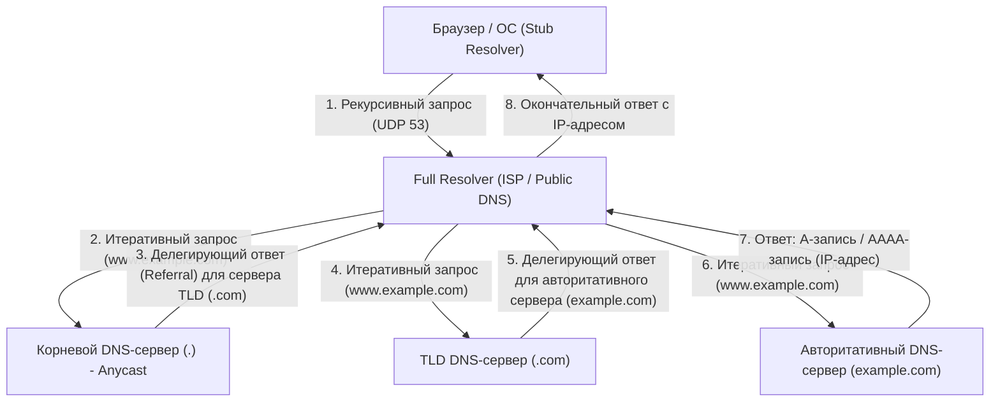

Эта сложная иерархическая двусторонняя связь обычно завершается за доли секунды — от нескольких до нескольких десятков миллисекунд. В качестве протокола транспортного уровня DNS использует преимущественно UDP-порт 53. Полное исключение накладных расходов на трехэтапное рукопожатие TCP (SYN, SYN-ACK, ACK) обеспечивает экстремальное снижение задержки. Однако, если размер полезной нагрузки DNS превышает историческое ограничение UDP в 512 байт (которое в настоящее время расширено благодаря EDNS0), либо требуется криптографическая проверка подписей DNSSEC (DNS Security Extensions) для защиты от подмены кэша, или же выполняется передача зоны (AXFR), протокол предусматривает запасной вариант — использование более надежного TCP-порта 53.

## 5.2 Архитектура HTTP и теория эволюции протокола

Браузер, получивший целевой IP-адрес с помощью DNS, устанавливает TCP-соединение с сервером (порт 80 или 443) и начинает диалог через главный язык прикладного уровня — HTTP (HyperText Transfer Protocol).

HTTP, придуманный Тимом Бернерсом-Ли в CERN в 1989 году, изначально был крайне простым протоколом для того, чтобы физики по всему миру могли эффективно обмениваться исследовательскими документами (гипертекстом) через сеть и связывать их ссылками. Понятная текстовая структура: строка запроса (метод, URI, версия протокола), поля заголовков, пустая строка (CRLF) и тело сообщения (Message Body), стала мощным драйвером отладки и популярности системы.

Основная философия дизайна и важнейшая особенность HTTP — отсутствие сохранения состояния (Stateless). Сервер не сохраняет в памяти информацию о предыдущих запросах или контексте клиента. Каждый запрос — это отдельная, полностью автономная транзакция. Эта «Stateless» природа, перекликающаяся с архитектурой REST, радикально упростила разработку серверов и позволила легко реализовать горизонтальное масштабирование (Scale Out) — добавление серверов для распределения огромных потоков трафика. Балансировщик нагрузки (Load Balancer) гарантирует одинаковый результат независимо от того, на какой сервер (Backend) отправлен запрос.
Однако в современных интерактивных веб-приложениях, где управление состоянием (State) неизбежно — например, для функции корзины покупок на сайте электронной коммерции или сохранения сеанса входа пользователя — это строгое отсутствие состояний становится серьезным ограничением. Для преодоления этого вне протокола HTTP были изобретены механизмы, сохраняющие состояние на стороне клиента — Cookie, передаваемые через HTTP-заголовки, и управление состоянием с помощью токенов сеанса.

### Битва с физическими ограничениями: Сдвиг парадигмы от HTTP/1.1 к HTTP/3

В связи с взрывным распространением Web и колоссальным увеличением количества ресурсов на одной странице (изображения, CSS, JavaScript-файлы и т.д.), протокол HTTP столкнулся с законами физики (задержки из-за скорости света и потери пакетов) и претерпел радикальные архитектурные изменения на уровне протокола.

- **HTTP/1.1 (1997 г. - )**: В первоначальном HTTP/1.0 каждое обращение за ресурсом требовало установления и разрыва TCP-соединения (трех- и четырехэтапное рукопожатие), что было верхом неэффективности с точки зрения задержек. В HTTP/1.1 было стандартизировано Persistent Connection (Keep-Alive), позволившее повторно использовать одно TCP-соединение, что радикально снизило накладные расходы. Однако технология конвейеризации (Pipelining) в HTTP/1.1 не прижилась из-за сложности реализации и проблем совместимости с промежуточными прокси-серверами, и протокол страдал от фатального структурного дефекта — «блокировки Head-of-Line (HoL)». Это явление, когда на одном TCP-соединении сервер обрабатывает огромный ресурс или тяжелый запрос, а последующие запросы застревают в очереди, ухудшая общую задержку. Чтобы обойти это, браузерам приходилось прибегать к силовому решению — одновременному открытию множества TCP-соединений (обычно до 6) к одному домену (например, Domain Sharding).
- **HTTP/2 (2015 г. - )**: HTTP/2, стандартизированный на основе протокола SPDY от Google, радикально изменил архитектуру с текстовой на «бинарную (Binary Framing)». Самым важным нововведением стало «Мультиплексирование потоков (Multiplexing)». В HTTP/2 внутри одного TCP-соединения создаются несколько виртуальных «потоков». Данные запросов и ответов делятся на маленькие бинарные кадры (фреймы), которые можно смешивать (чередовать) и отправлять в любом порядке. Это полностью устранило HoL-блокировку на прикладном уровне. Кроме того, механизм сжатия заголовков алгоритмом HPACK (комбинация статического кода Хаффмана и динамической таблицы) позволил резко сократить объем избыточных данных (таких как Cookie или User-Agent, передаваемых в каждом запросе), максимально повысив эффективность использования пропускной способности сети.
- **HTTP/3 (2022 г. - )**: Хотя HTTP/2 блестяще решил проблему HoL на прикладном уровне, оставался физический барьер: «HoL-блокировка при потере пакетов» на базовом транспортном уровне (TCP). Для обеспечения надежности TCP при потере хотя бы одного пакета останавливает доставку приложению всех данных (пакетов) во всех потоках этого соединения до завершения повторной передачи. Для устранения этой проблемы HTTP/3 отказался от TCP, который был основой Интернета десятилетиями, и совершил кардинальный сдвиг парадигмы, перейдя на новый транспортный протокол на базе UDP — «QUIC (Quick UDP Internet Connections)». QUIC позволяет избежать задержек развития, вызванных реализацией TCP в ядре ОС. Он был создан поверх UDP (работающего в пользовательском пространстве) и включает собственные алгоритмы контроля повторной передачи, контроля перегрузок и независимого контроля потоков (Flow Control). Теперь при потере пакета блокируется только конкретный поток, а остальные продолжают работу без задержек. Более того, QUIC объединил рукопожатие установки соединения с криптографическим рукопожатием (TLS 1.3), позволив начать безопасную передачу данных с серверами, с которыми ранее уже устанавливалась связь, с «нулевой задержкой» (0-RTT - Zero Round Trip Time). Это результат стремления к максимальной производительности: протокольный уровень безжалостно урезал количество обменов пакетами (RTT), чтобы преодолеть абсолютный предел скорости света (необходимость сотен миллисекунд для связи с другой стороной планеты).

## 5.3 Шифрование и механизмы доверия: Математическая бездна SSL/TLS и логика доказательств

По своей природе Интернет — это открытая сеть коммутации пакетов, где данные передаются подобно эстафетной палочке через тысячи маршрутизаторов и подводных оптических кабелей. Любой узел на этом пути (промежуточный маршрутизатор, злонамеренный провайдер, или "прослушиватель" в той же Wi-Fi сети) имеет физическую возможность не только перехватывать (Sniffing) содержимое пакетов, но и изменять их. Абсолютную уязвимость сети подавляет мощь высшей математики, а протоколы SSL (Secure Sockets Layer) и его преемник TLS (Transport Layer Security) создают безопасный канал связи.

TLS гарантирует «три столпа безопасности» в современных веб-коммуникациях:
1. **Конфиденциальность (Confidentiality)**: Содержимое сообщений невозможно расшифровать даже при перехвате третьей стороной.
2. **Целостность (Integrity)**: Гарантия того, что ни один бит данных не был изменен в пути. Обеспечивается MAC (Message Authentication Code) и AEAD (Authenticated Encryption with Associated Data).
3. **Аутентификация (Authentication)**: Гарантия того, что собеседник — истинный владелец домена (настоящий сервер).

Технологии, реализующие это, — плоды криптографии, выстроенной человечеством за многие столетия, и пережившей колоссальный скачок благодаря развитию информатики и теории чисел после Второй мировой войны.

### Обмен ключами и асимметричное шифрование: Дискретные логарифмы и стена факторизации

Самый простой и быстрый метод — это «симметричное шифрование (Symmetric Cryptography)» (текущий стандарт — AES: Advanced Encryption Standard). В этом методе отправитель и получатель используют один и тот же «общий ключ» для шифрования и дешифрования. Поскольку математические операции легки (побитовое исключающее ИЛИ (XOR), комбинации перестановок), это идеально подходит для шифрования гигабитных потоков связи в реальном времени. Однако симметричное шифрование столкнулось с фундаментальным парадоксом (проблема распределения ключей): «Как безопасно передать секретный общий ключ адресату до начала связи?». В Интернете, где нет предварительных доверительных отношений, передача ключа по открытой сети приведет к его перехвату, и шифрование потеряет смысл.

Крупнейшим прорывом в истории человеческой криптографии стал алгоритм обмена ключами Диффи-Хеллмана, представленный Уитфилдом Диффи и Мартином Хеллманом в 1976 году, и «асимметричное (с открытым ключом) шифрование (Asymmetric Cryptography)», изобретенное в 1977 году RSA (Ривест, Шамир, Адлеман).

В основе асимметричного шифрования лежат математические концепции «односторонних функций (One-way function)» или «односторонних функций с лазейкой (Trapdoor one-way function)». Это асимметрия, при которой «вычисления в одном направлении (шифрование) выполняются компьютером мгновенно, но обратные вычисления (дешифрование или взлом ключа) не завершатся, даже если все суперкомпьютеры мира будут работать на протяжении всей жизни Вселенной».

- **Шифрование RSA**: Основано на том факте, что легко (за полиномиальное время) перемножить два очень больших простых числа ($p$ и $q$) для получения гигантского составного числа ($N = p \times q$), но крайне сложно (известны только субэкспоненциальные алгоритмы) получить исходные простые множители $p$ и $q$, имея только это огромное число $N$ (задача факторизации). Используя глубокие свойства теории чисел, такие как функция Эйлера и малая теорема Ферма, RSA создает математическую лазейку (trapdoor), благодаря которой данные, зашифрованные открытым ключом, могут быть расшифрованы только владельцем парного секретного ключа.
- **Шифрование на эллиптических кривых (ECC: Elliptic Curve Cryptography)**: Господствующее сегодня в TLS, ECC использует сложность «задачи дискретного логарифмирования», определяемой на эллиптических кривых в конечном поле (например, множестве точек, удовлетворяющих уравнению вида $y^2 = x^3 + ax + b$). На этих точках определены геометрические операции «сложения» и «скалярного умножения». Найти точку $P = kG$, полученную сложением начальной точки $G$ с самой собой секретное количество раз $k$, легко. Но обратить процесс — вычислить секретный коэффициент $k$ (дискретный логарифм), зная лишь публичные точки $G$ и $P$ — еще сложнее, чем факторизовать числа в RSA. Поэтому ECC обеспечивает сопоставимую или более высокую криптографическую стойкость при гораздо меньшей длине ключа (например, безопасность RSA 2048 бит достигается ключом ECC всего в 256 бит), кардинально снижая нагрузку на CPU и экономя пропускную способность сети.

### Рукопожатие TLS: Криптографический ритуал для построения доверия

При установке безопасного соединения по HTTPS клиент и сервер генерируют безопасный «сеансовый ключ» для симметричного шифрования и выполняют сложный протокол согласования для аутентификации друг друга. Это называется рукопожатием TLS. Ниже приведена анатомия сверхэффективного 1-RTT рукопожатия в новейшем стандарте TLS 1.3.

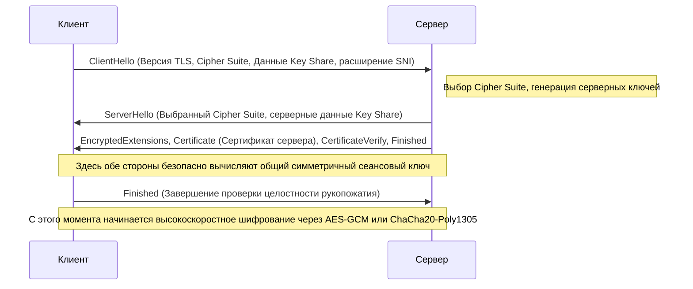

1. **ClientHello**: Начиная соединение, клиент передает поддерживаемую версию TLS, список алгоритмов шифрования (Cipher Suites) и исходные математические параметры (Key Share) для генерации ключей. Также он в открытом виде отправляет имя целевого хоста (например, `www.example.com`) с помощью расширения SNI (Server Name Indication). Эта информация жизненно важна для серверов (виртуальных хостов), которые обслуживают несколько доменов HTTPS на одном IP-адресе, чтобы они могли выбрать и вернуть правильный сертификат.
2. **ServerHello**: Сервер выбирает самый сильный и подходящий алгоритм из списка клиента (например, `TLS_AES_256_GCM_SHA384`) и отвечает вместе со своими данными Key Share.
3. **Отправка сертификата и подписи (Authentication)**: Сервер отправляет свой цифровой сертификат (X.509). Кроме того, сервер использует «секретный ключ», привязанный к сертификату, для создания и отправки цифровой подписи (CertificateVerify) на основе хэш-значения всего предыдущего обмена сообщениями. Это математически доказывает, что сервер является законным владельцем сертификата (обладателем секретного ключа).
4. **Обмен ключами (Ephemeral Elliptic Curve Diffie-Hellman: ECDHE)**: Клиент и сервер математически умножают полученные друг от друга данные Key Share (публичные точки на эллиптической кривой) на свои секретные параметры, хранящиеся только локально. Удивительно, но благодаря математическим свойствам алгоритма Диффи-Хеллмана ($ (g^a)^b = (g^b)^a = g^{ab} $), на стороне клиента и на стороне сервера магическим образом синтезируется абсолютно одинаковый сильный «Мастер-секрет (Общий ключ)», без передачи каких-либо секретных данных по сети.
5. **Совершенная прямая секретность (Perfect Forward Secrecy: PFS)**: Важнейшая особенность TLS 1.3 состоит в том, что параметры обмена (Key Share) генерируются заново (Ephemeral) для каждого сеанса и являются одноразовыми. Благодаря этому, даже если долгосрочный секретный ключ сервера (RSA или ECDSA), используемый для удостоверения личности, будет украден через несколько лет, математически абсолютно невозможно ретроспективно расшифровать ранее записанные пакеты связи. Конфиденциальность прошлых коммуникаций гарантирована на будущее.

### PKI и цепочка доверия (Chain of Trust): Цифровой паспорт

Во всем описанном криптографическом механизме оставалась одна фатальная логическая брешь: «Как клиент может быть уверен, что сертификат и открытый ключ, присланные сервером, действительно принадлежат настоящему целевому домену (например, сайту банка)?».
Если злоумышленник, контролирующий маршрут (Man-in-the-Middle Attack), притворится сервером и отправит свой поддельный сертификат и публичный ключ клиенту, то обмен ключами и само шифрование с точки зрения математики пройдут идеально. Но собеседником окажется не банк, а злоумышленник.

Социально-техническим фреймворком, решающим эту фундаментальную проблему аутентификации, является PKI (Public Key Infrastructure: Инфраструктура открытых ключей) и Удостоверяющие центры (CA: Certificate Authority), выступающие якорями доверия.

Владелец сервера создает запрос на подпись сертификата (CSR), содержащий его открытый ключ, и передает его доверенной третьей стороне — CA, такой как DigiCert, GlobalSign или Let's Encrypt. Удостоверяющий центр проверяет, действительно ли домен принадлежит заявителю (проверка домена, проверка организации и т.д.), и затем использует свой собственный мощный секретный ключ для наложения «цифровой подписи» на информацию об открытом ключе сервера. Таким образом выдается серверный сертификат.

С другой стороны, в операционные системы, такие как Windows или macOS, а также в браузеры (Chrome, Firefox), на заводе встраиваются и жестко кодируются корневые сертификаты (открытые ключи) Корневых Удостоверяющих Центров (Root CA), прошедших строгий глобальный аудит. Это называется Хранилищем доверенных сертификатов (Trust Anchor).

Когда клиент получает сертификат от сервера, он использует встроенный в ОС открытый ключ Root CA для проверки криптографической подписи CA на сертификате. Если проверка подписи проходит успешно, доказано, что содержимое сертификата (доменное имя и открытый ключ) гарантировано CA и не было изменено.

1. Клиент безоговорочно доверяет Root CA (предварительная установка в хранилище).
2. Root CA доверяет и подписывает промежуточный CA (Intermediate CA).
3. Промежуточный CA доверяет и подписывает конечный субъект (веб-сервер).

Через эту транзитивную структуру «Цепочки доверия (Chain of Trust)» мы можем мгновенно и динамично выстраивать прочные доверительные отношения с физически удаленным, неизвестным сервером и устанавливать безопасный зашифрованный канал.

## Заключение: Слияние уровней и новые горизонты

В 5-й главе мы подробно разобрали происходящее в глубинах прикладного уровня: разрешение имен, протоколы запросов и ответов для передачи данных, а также криптографическую математическую завесу, обволакивающую все это.
DNS выступает глобальной распределенной адресной книгой Интернета, HTTP создает архитектуру доставки ресурсов, а TLS обеспечивает мощную защиту, используя новейшую криптографическую броню. Исторически они проектировались как независимые протоколы-уровни, но в современном Web, как видно на примере QUIC в HTTP/3, границы между транспортным, прикладным и криптографическим уровнями стираются. Они сливаются воедино, пробивая потолок физических задержек и непрерывно эволюционируя в утонченные системы, добивающиеся одновременно максимальной производительности и безопасности.

В следующей главе мы спустимся еще на один уровень глубже и узнаем, как запрос, прошедший сквозь эту прочную криптографическую защиту, генерирует динамический контент и взаимодействует с базами данных: «Внутренняя структура бэкенд-систем и распределенные вычисления».

# Глава 6: Физическая инфраструктура, поддерживающая Интернет — гигантский механизм, сотканный из света, тепла и океана

Интернет часто описывают как некое бесплотное, абстрактное понятие — «облако». Когда мы отправляем данные со смартфонов или компьютеров, возникает иллюзия, будто они через невидимые радиоволны или кабели всасываются в некое хранилище «где-то в небесах». Однако в реальности Интернет вовсе не такой легкий, как облако. Это самая тяжелая, материальная, жестко скованная законами термодинамики, оптики и геофизики физическая инфраструктура за всю историю человечества.

В этой главе мы максимально детально и с профессиональной инженерной точки зрения разберем три гигантских столпа, воплощающих эту «невидимую сеть» в физическом мире: «подводные кабели» (нервную систему планетарного масштаба), «гипермасштабные дата-центры» (термодинамические центры обработки и хранения данных) и «CDN (сети доставки контента)», прорывающие барьер скорости света и сжимающие пространство и время.

---

## 1. Световая нервная система Земли: Системы подводных кабелей

В настоящее время около 99% международного интернет-трафика, пересекающего государственные границы, передается не через космические спутники, а через «подводные кабели связи (Submarine Communications Cable)» диаметром всего в пару сантиметров. Когда мы просматриваем зарубежный веб-сайт, эти данные несутся со скоростью света сквозь кромешную тьму океанских глубин.

### 1.1 Эволюция от телеграфа к оптоволокну и вызов пределу Шеннона

История подводных кабелей гораздо старше Интернета — она восходит к 1850 году, когда был проложен телеграфный кабель через Ла-Манш. В 1858 году был проложен первый трансатлантический телеграфный кабель. В то время передача велась азбукой Морзе, и чтобы отправить сообщение от королевы Виктории президенту США Бьюкенену, потребовалось более десятка часов. Затем последовала эра аналоговых телефонных линий на базе коаксиальных кабелей, а с конца 1980-х началось внедрение оптических волокон. Проложенный в 1988 году первый трансатлантический оптоволоконный кабель «TAT-8» имел пропускную способность 280 Мбит/с (что эквивалентно примерно 40 000 телефонным линиям) — революционную по тем временам ширину канала.

Современные подводные кабели обладают невообразимой пропускной способностью, достигающей сотен Тбит/с (терабит в секунду) на один кабель. Этот колоссальный скачок стал возможным благодаря двум прорывам нобелевского уровня в области физики и инженерии: «Спектральному уплотнению каналов (WDM: Wavelength Division Multiplexing)» и «Эрбиевым волоконно-оптическим усилителям (EDFA: Erbium-Doped Fiber Amplifier)».

WDM — это технология, мультиплексирующая свет с разной длиной волны (цветом) для одновременной передачи внутри одного оптического волокна. Это позволяет умножить пропускную способность одного волокна на количество используемых длин волн. Однако, какой бы сверхчистой ни была сердцевина кварцевого стекла, проходя сотни километров, световой сигнал затухает из-за рэлеевского рассеяния и инфракрасного поглощения. Поэтому каждые несколько десятков или сотен километров необходимо устанавливать усилители-ретрансляторы (Repeater).

Раньше в ретрансляторах использовался сложный и ограничивающий процесс (O-E-O преобразование): затухший оптический сигнал конвертировался в электрический, усиливался, а затем снова превращался в оптический. Однако в 1990-х появились усилители EDFA. Добавляя в сердцевину волокна редкоземельный элемент эрбий и облучая его мощным лазерным «светом накачки», они позволили напрямую усиливать оптический сигнал, «оставляя его светом». Это сделало возможным одновременное усиление множества оптических сигналов с разными длинами волн, что в сочетании с WDM привело к взрывному росту пропускной способности.

В настоящее время телекоммуникационная инженерия приближается к «Пределу Шеннона (Shannon Limit)» — теоретическому пределу пропускной способности канала связи, предложенному Клодом Шенноном. Чтобы преодолеть этот барьер, активно исследуются и внедряются технологии физического уровня нового поколения, такие как «многосердцевинные волокна» (с несколькими сердцевинами внутри одного волокна) и «пространственное мультиплексирование (SDM: Space Division Multiplexing)».

### 1.2 Физическая среда глубин и инженерия прокладки кабелей

Прокладка подводного кабеля — один из самых суровых видов современной инженерии. Кабели длиной в тысячи километров погружают на дно с помощью специальных «кабелеукладочных судов (Cable layer)».

Перед прокладкой с помощью эхолотов создается точная топографическая карта морского дна, чтобы выбрать оптимальный маршрут, избегая подводных хребтов, впадин, гидротермальных источников и зон оползней. Структура кабеля кардинально отличается в зависимости от глубины.

На мелководье, например, на континентальном шельфе (глубиной до 1000–1500 метров), существует высочайший риск физического повреждения кабелей рыболовными тралами, якорями судов или акулами. Поэтому поверх поликарбонатной смолы и медной трубы, защищающих оптические волокна, наматывают несколько слоев высокопрочной стальной проволоки (Armor - броня). Такой кабель получается толстым и тяжелым. Кроме того, с помощью подводных роботов (ROV) или подводных плугов кабель закапывают в ил или песок на глубину в несколько метров.

А вот в глубоководных районах (на глубине нескольких тысяч метров) угрозы от сетей и якорей нет. Там используется «Облегченный кабель (Lightweight Cable)» без стальной брони, чтобы кабель мог выдержать колоссальное давление воды, но не обрывался под собственным весом при укладке. Диаметр такого кабеля составляет всего 17–20 миллиметров — примерно с садовый шланг.

Еще один важный физический аспект подводного кабеля — «электроснабжение». Чтобы питать ретрансляторы, расставленные каждые несколько десятков километров, с береговой станции (Cable Landing Station) по медной трубке (проводнику) внутри кабеля подается постоянный ток высокого напряжения. Для трансокеанских кабелей напряжение может превышать 10 000 вольт (10 кВ). В таких случаях обычно используется «система с возвратом через землю», где роль обратной цепи играют морская вода и земля.

### 1.3 Геополитика и восхождение гигантских IT-компаний

Раньше для прокладки подводных кабелей требовались огромные инвестиции, поэтому ведущие телекоммуникационные компании разных стран объединялись в консорциумы для распределения затрат и пропускной способности. Но в последние годы эта экосистема кардинально изменилась.

Группа гигантских технологических компаний, которых называют «гиперскейлерами» (Hyperscalers) — Google, Meta (Facebook), Microsoft и Amazon — начали самостоятельно или совместно инвестировать и прокладывать подводные кабели для сверхбыстрого соединения собственных дата-центров. Они превратились из простых пользователей Интернета в крупнейших владельцев физической инфраструктуры. Таким образом, маршрутизация кабелей оптимизируется не для «связи между ключевыми городами», а для «кратчайшего и быстрейшего соединения дата-центров одной компании».

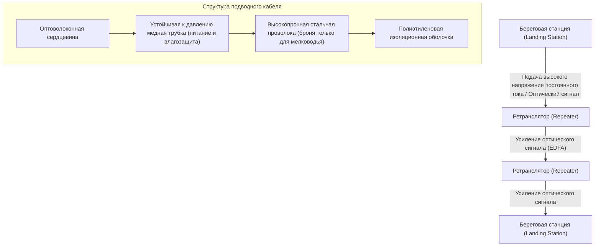

---

## 2. Термодинамические центры обработки данных: Гипермасштабные дата-центры

Данные, достигшие суши через подводные кабели, в конечном итоге попадают в «дата-центры». Дата-центр — это гигантское сооружение, где размещаются от десятков до сотен тысяч серверов, непрерывно обрабатывающих и хранящих информацию 24 часа в сутки, 365 дней в году.

### 2.1 Истинное лицо облака и битва за PUE

С точки зрения физики дата-центр — это «гигантская тепловая машина, которая получает на вход колоссальное количество электрической энергии, производит вычисления (снижение энтропии) и генерирует неизбежное «тепло»». Полупроводники, такие как CPU и GPU, при переключении тока вырабатывают тепло из-за электрического сопротивления. Если это тепло эффективно не отводить, полупроводники мгновенно перегреются и физически сгорят (тепловой пробой).

Поэтому главной задачей при проектировании и эксплуатации дата-центров являются «Охлаждение» и «Энергоэффективность». Самым распространенным показателем эффективности является PUE (Power Usage Effectiveness).

**PUE = Общее энергопотребление дата-центра / Энергопотребление IT-оборудования (серверов и т. д.)**

Теоретический минимум PUE равен 1.0 (когда вся энергия уходит исключительно на вычисления). Раньше во многих дата-центрах PUE превышал 2.0 (то есть кондиционеры и охлаждение потребляли столько же энергии, сколько и сами серверы). Но в современных гипермасштабных дата-центрах благодаря термодинамической оптимизации этот показатель снижен до 1.1–1.2.

### 2.2 Эволюция архитектуры охлаждения

На основе законов термодинамики системы охлаждения дата-центров эволюционировали следующим образом:

1. **Разделение на горячие и холодные коридоры (Hot/Cold Aisle Containment)**:
   В ранних дата-центрах всё помещение охлаждалось кондиционерами (CRAC), но холодный воздух смешивался с горячим от серверов, что было крайне неэффективно. Сейчас серверные стойки располагают так, чтобы они втягивали воздух из одних коридоров («холодные коридоры») и выбрасывали горячий воздух в другие («горячие коридоры»), физически изолируя их друг от друга.

2. **Фрикулинг (Free Cooling - Охлаждение наружным воздухом)**:
   Работа компрессоров чиллеров (установок охлаждения жидкости) требует огромной энергии. Поэтому дата-центры строят в регионах с холодным климатом (Скандинавия, Хоккайдо) и используют холодный уличный воздух для охлаждения напрямую или косвенно через теплообменники (фрикулинг).

3. **Иммерсионное охлаждение (Immersion Cooling) и Прямое жидкостное охлаждение (Direct-to-Chip)**:
   В последние годы тепловыделение мощных GPU, используемых для обучения ИИ, начинает превышать физические возможности воздушного охлаждения (из-за низкой теплоемкости и теплопроводности воздуха). В ответ на это внедряется «Иммерсионное охлаждение», при котором материнские платы целиком погружаются в диэлектрические жидкости (фторуглероды или минеральные масла), а также «Прямое жидкостное охлаждение», когда тепло от CPU/GPU забирается с помощью водоблоков и жидкости, обладающей гораздо большей теплоемкостью. Двухфазное иммерсионное охлаждение (использующее теплоту парообразования) способно отводить экстремально высокие тепловые потоки.

### 2.3 Избыточность и физическая безопасность

Поскольку дата-центр — это узел социальной инфраструктуры, от него требуется крайняя степень избыточности (Redundancy). Если отключается основное питание, миллисекундный переход осуществляют источники бесперебойного питания (ИБП) на маховиках, свинцово-кислотных или литий-ионных батареях. Одновременно с этим запускаются гигантские дизельные или газотурбинные генераторы, расположенные снаружи здания. За счет запасов топлива они могут обеспечивать работу всего объекта на протяжении нескольких дней.

Что касается сети, дата-центры подключают к линиям нескольких разных операторов связи, а кабели вводят в здание с противоположных сторон (север-юг, восток-запад) во избежание одновременного обрыва при, например, строительных работах поблизости.

---

## 3. Технология, сжимающая пространство и время: CDN (Сети доставки контента)

Даже если подводные кабели соединяют континенты, а дата-центры хранят данные, этого недостаточно для современного веб-опыта. Здесь мы сталкиваемся с абсолютным пределом скорости во Вселенной, открытым Альбертом Эйнштейном, — «барьером скорости света».

### 3.1 Барьер скорости света и физический предел задержек

Скорость света в вакууме ($c$) составляет около 300 000 км/с. Однако показатель преломления кварцевого стекла (сердцевины оптоволокна) равен примерно 1,47, поэтому скорость света в волокне падает до ~200 000 км/с (две трети от скорости в вакууме).

Например, прямое физическое расстояние от Токио (Япония) до штата Вирджиния на восточном побережье США (крупнейшего в мире кластера дата-центров) составляет около 11 000 км, а с учетом маршрутов подводных кабелей — около 14 000 км. Чистое физическое время прохождения оптического сигнала в одну сторону составляет около 70 миллисекунд. Интернет-коммуникации требуют передачи туда-обратно (RTT: Round Trip Time), поэтому по законам физики обязательно возникает задержка (Latency) минимум в 140 миллисекунд. К этому прибавляются задержки обработки на промежуточных маршрутизаторах и коммутаторах.

При открытии современного сайта браузер запрашивает сотни файлов (HTML, CSS, JS, изображения) и выполняет многочисленные раунды трехстороннего рукопожатия TCP и согласования шифрования TLS (SSL). Если бы каждому пользователю приходилось обращаться напрямую к «оригинальному серверу (Origin Server)» на другой стороне Земли, появление веб-страницы занимало бы от нескольких до десятка секунд. Онлайн-игры в реальном времени или потоковое видео высокого качества стали бы совершенно невозможны.

### 3.2 Распределение к границам сети: Архитектура CDN

Система, инженерным образом преодолевающая это физическое ограничение и сжимающая пространство и время, называется «CDN (Content Delivery Network)».

Базовая концепция CDN предельно проста: «Если добираться до оригинального сервера слишком долго, давайте заранее разместим копии данных (кэш) в тех местах, которые физически находятся максимально близко к пользователям».

Операторы CDN физически размещают тысячи и десятки тысяч кэширующих серверов, называемых «Пограничными серверами» (Edge Server), внутри дата-центров в крупных городах или на площадках интернет-провайдеров по всему миру. Когда пользователь обращается к веб-сайту, сеть CDN мгновенно определяет его географическое и сетевое положение и направляет трафик на ближайший Edge-сервер с минимальной задержкой.

Ключевой технологией, обеспечивающей такую маршрутизацию, является «Anycast» и продвинутая «DNS-маршрутизация». В маршрутизации Anycast один и тот же IP-адрес назначается нескольким Edge-серверам по всему миру. Используя алгоритмы выбора пути BGP (Border Gateway Protocol), маршрутизаторы автоматически доставляют пакеты к серверу, который «ближе всего» в сетевом смысле. Таким образом, пользователь из Токио будет незаметно перенаправлен на Edge-сервер в Токио, а пользователь из Лондона — в Лондон.

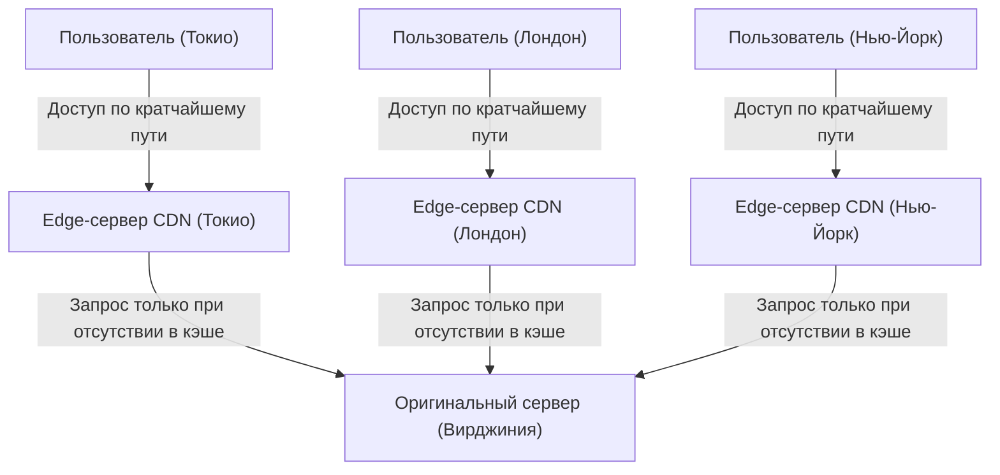

### 3.3 Динамическая оптимизация и эра граничных вычислений (Edge Computing)

Первые CDN были простыми системами для кэширования и доставки статических HTML-файлов, картинок и видео. Современные CDN эволюционировали в гигантские платформы распределенных вычислений сами по себе.

Во-первых, это оптимизация доставки динамического контента (например, результатов поиска или корзины покупок, уникальных для каждого пользователя). Такой контент нельзя закэшировать, но CDN предлагает собственную оптимизированную сеть (Tiered Cache или выделенные скоростные магистрали) между Edge-сервером и оригинальным сервером. Она стабильнее и быстрее, с меньшим количеством потерь пакетов по сравнению со стандартными маршрутами (маршрутами Best-Effort в BGP). Кроме того, TCP-соединения и TLS-сеансы «приземляются» (Terminate) прямо на Edge-сервере, что кардинально сокращает количество раундов рукопожатия (RTT) с удаленными узлами.

Во-вторых, это подъем «Граничных вычислений (Edge Computing)». Раньше сложная логика приложения (аутентификация, A/B-тестирование, динамическое изменение размера изображений, выполнение кастомной логики) обрабатывалась CPU на оригинальном сервере. Но сейчас благодаря таким технологиям, как Cloudflare Workers и AWS Lambda@Edge, разработчики могут использовать изолированные среды-песочницы (например, движок V8), чтобы за миллисекунды выполнять код (на JavaScript, Rust, WebAssembly) прямо на ближайшем к пользователю Edge-сервере. Буквально «граница (Edge)» Интернета начинает функционировать как гигантский распределенный компьютер.

---

## 4. Заключение: Бесконечная битва с физическими ограничениями

История интернет-инфраструктуры — это история борьбы с абсолютными законами Вселенной: скоростью света, вторым началом термодинамики и законом сохранения энергии.

Инженеры подводных кабелей бросают вызов гигантскому давлению морских глубин и оптическим пределам стекла; проектировщики дата-центров стремятся к термодинамическому совершенству, чтобы охлаждать нагревающиеся кремниевые пластины; а архитекторы CDN продолжают строить сложнейшие распределенные системы для преодоления барьера скорости света.

За каждым касанием смартфона и мгновенным доступом к информации со всего света стоит эта массивная, суровая и в то же время невероятно утонченная физическая инфраструктура. В Главе 7 мы углубимся в мир «Маршрутизации и BGP», чтобы понять, как поверх этой прочной физической инфраструктуры программное обеспечение и протоколы поддерживают глобальную автономную децентрализованную сеть.

# Глава 7: Битва за кибербезопасность и конфиденциальность

История Интернета — это не только стремление к идеалу свободного обмена информацией, но и непрекращающаяся история борьбы за защиту систем и данных от злонамеренных атак. Изначально Интернет, зародившийся как ARPANET, проектировался с расчетом на связь в ограниченном кругу доверенных исследователей. Поэтому при фундаментальном проектировании протоколов «безопасность» была отодвинута на второй план, а архитектура базировалась на принципе презумпции добросовестности. Однако по мере того как сеть расширялась до мировых масштабов, коммерциализировалась и укрепляла свой статус инфраструктуры, этот изначальный замысел превратился в фатальную уязвимость.

В этой главе мы заглянем в бездну технологий и с профессиональной детальностью рассмотрим физические и сетевые механизмы DDoS-атак — одной из величайших угроз современному Интернету; технологии шифрования и VPN (виртуальных частных сетей) для обеспечения конфиденциальности связи; а также «архитектуру нулевого доверия» (Zero Trust) — концепцию безопасности нового поколения, рожденную из осознания пределов периметральной защиты.

## 1. Физические пределы сетей и механика DDoS-атак

Одной из самых примитивных, но в то же время самых труднопредотвратимых кибератак является **DDoS-атака (Distributed Denial of Service: Распределенный отказ в обслуживании)**. Это атака, при которой на целевой сервер или сетевое оборудование обрушивается колоссальный объем трафика, превышающий пределы их вычислительной мощности или пропускной способности канала, что делает невозможным обслуживание легитимных пользователей.

### Физическое насыщение трафика: предел пропускной способности
Интернет передает данные через физические среды: оптоволокно, медные провода, радиоволны. И хотя благодаря таким технологиям, как спектральное уплотнение каналов (WDM), пропускная способность этих сред достигает терабитного уровня, у каждого отдельного канала, к которому подключен сервер (например, 1 Гбит/с или 10 Гбит/с), существует строгий физический верхний предел. DDoS-атака бьет именно по этому ограничению «толщины трубы». Злоумышленник, управляющий ботнетом (botnet) из сотен тысяч зараженных вредоносным ПО устройств, разбросанных по всему миру, синхронно отправляет пакеты на цель. Буферная память интерфейсов маршрутизаторов и коммутаторов переполняется, и пакеты начинают отбрасываться. Это явление похоже на засор трубы в гидродинамике: в тот момент, когда объем информации (количество пакетов) превышает пропускную способность, вся система выходит из строя.

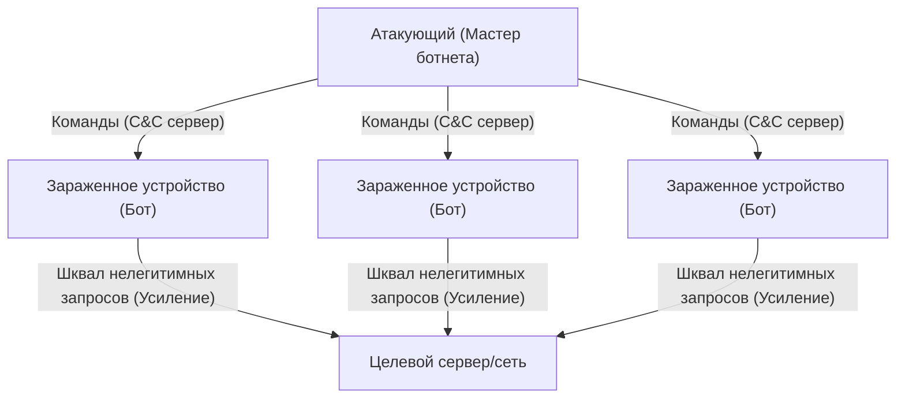

### Использование уязвимостей TCP/IP: SYN Flood
Существуют методы атак, направленные на истощение не только пропускной способности, но и ресурсов сервера (CPU и памяти). Яркий пример — **SYN Flood атака**. Протокол TCP устанавливает соединение с помощью так называемого «3-стороннего рукопожатия».
1. Клиент отправляет пакет «SYN».
2. Сервер отвечает пакетом «SYN-ACK» и резервирует память (TCB: Transmission Control Block) для соединения.
3. Клиент отправляет пакет «ACK» для завершения установки соединения.

Атакующий отправляет на сервер огромное количество SYN-пакетов с поддельными (spoofing) IP-адресами источника. Сервер отвечает пакетами SYN-ACK, но поскольку владельцы поддельных адресов не отправляют ACK (или таких адресов вовсе не существует), сервер остается с огромным количеством «полуоткрытых» (Half-open) соединений. Память, выделенная для управления этими соединениями, истощается, и сервер вынужден отказывать в подключении легитимным пользователям. Это блестящий механизм атаки, который оборачивает против сервера само свойство протокола TCP — сохранение состояния (stateful) для «гарантии надежной связи».

### Атака с отражением и усилением (Reflection Attack): злоупотребление асимметрией
**Атака с отражением/усилением**, использующая протокол UDP (User Datagram Protocol), еще более коварна. UDP — это протокол без установления соединения (connectionless), который не проверяет источник. Злоумышленник подделывает IP-адрес источника, подставляя вместо него адрес жертвы, и отправляет запросы на публичные DNS-серверы или NTP-серверы в Интернете. При этом используются специфические запросы (например, DNS ANY или NTP monlist), в которых крошечный запрос (в несколько десятков байт) вызывает ответ, в сотни или тысячи раз превышающий его по размеру (несколько килобайт).
Многократно усиленные гигантские ответные пакеты лавиной обрушиваются на поддельный адрес источника — то есть на сервер жертвы. Затрачивая ничтожную часть своей пропускной способности, атакующий может сгенерировать трафик терабитного уровня. Это реализация в сети некой асимметрии, похожей на «правило рычага» в физике или резонансное усиление в акустике.

## 2. Секретность маршрутов связи: Механизмы шифрования и VPN

Пакеты, передаваемые по публичной сети Интернет, проходят через множество маршрутизаторов и оборудование интернет-провайдеров. Коммуникация в открытом виде (clear text), не защищенная шифрованием, может быть легко перехвачена (сниффинг) или изменена на пути следования. Мощным щитом для защиты конфиденциальности и секретности данных являются «Технологии шифрования» и «VPN (Virtual Private Network)».

### Математический фундамент современной криптографии: Гибрид открытого и общего ключей
Для защиты связи в основном используются два метода шифрования:
- **Шифрование с общим ключом (например, AES)**: Для шифрования и дешифрования используется один и тот же «общий ключ». Скорость обработки очень высока, но возникает «проблема распределения ключей» — как безопасно передать ключ собеседнику.
- **Шифрование с открытым ключом (например, RSA, эллиптическая криптография)**: Используется пара ключей — «открытый ключ» для шифрования и «закрытый ключ» для дешифрования. Базируется на глубоких математических свойствах (асимметрии), таких как сложность факторизации или проблема дискретного логарифмирования. Вычислительные затраты высоки.

При установке защищенного соединения в Интернете (TLS/SSL или VPN) применяется гибридный метод, объединяющий эти два подхода. В начале, во время рукопожатия, шифрование с открытым ключом используется для безопасного обмена «сеансовым ключом (общим ключом)». Затем, для передачи больших объемов данных, применяется высокоскоростное шифрование с использованием этого сеансового ключа. Это позволяет совместить безопасную передачу ключей и высокоскоростную зашифрованную связь.

### Принципы VPN и туннелирования
**VPN (Виртуальная частная сеть)** — это технология, которая использует шифрование для создания виртуальной «выделенной линии (туннеля)» поверх публичного Интернета. Среди типичных протоколов можно назвать IPsec, OpenVPN и, из более новых, WireGuard.

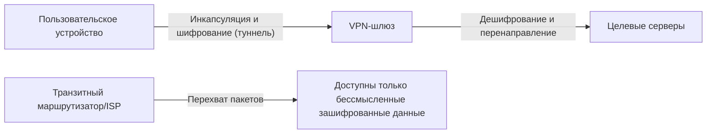

Ключевой механизм туннелирования — это «инкапсуляция» (Encapsulation). Исходный IP-пакет (полезная нагрузка), который хочет отправить пользователь, полностью шифруется. Затем он упаковывается как блок данных (инкапсулируется) внутрь нового IP-пакета с новым внешним IP-заголовком, адресованным VPN-серверу.
Интернет-маршрутизаторы на пути следования смотрят только на внешний IP-заголовок и пересылают пакет к VPN-серверу. Внутреннее содержимое надежно зашифровано, поэтому, даже если пакет перехватят, расшифровать его или узнать истинный IP-адрес назначения будет крайне сложно. Пакет, достигнув VPN-сервера, дешифруется, извлекается исходный заголовок, и пакет отправляется к конечному пункту. Таким образом, в физически открытой для всех инфраструктуре логически и математически создается защищенное частное пространство.

## 3. Крах периметральной защиты и восхождение архитектуры нулевого доверия (Zero Trust)

Долгое время корпоративная и организационная сетевая безопасность опиралась на концепцию «периметральной защиты» (Perimeter Model). Это стратегия защиты по типу «замка», при которой на границе между Интернетом (внешним миром) и корпоративной сетью (внутренним миром) устанавливаются брандмауэры (Firewall) и системы предотвращения вторжений (IPS), исходя из предпосылки «снаружи опасно, внутри безопасно».

### Облако и удаленная работа стерли границы
Однако в наши дни эта модель полностью рухнула. С развитием SaaS (Software as a Service) критически важные данные теперь хранятся вне компании, в облаке. Из-за распространения удаленной работы сотрудники все чаще подключаются из дома или кафе через общественный Wi-Fi. Граница между «внутренним пространством, которое нужно защищать» и «опасным внешним миром» растаяла, и произошел взрывной рост трафика, который невозможно контролировать традиционными брандмауэрами. Более того, периметральная защита абсолютно бессильна против вредоносного ПО (например, программ-вымогателей, Ransomware), уже проникшего во внутреннюю сеть, или инсайдеров со злым умыслом. Сама предпосылка о том, что «внутри можно доверять», стала главной уязвимостью.

### Zero Trust: Trust Nothing, Verify Everything (Не доверяй ничему, проверяй всё)
Ответом на этот сдвиг парадигмы стала концепция **«Архитектура нулевого доверия» (Zero Trust Architecture: ZTA)**. Фундаментальный принцип Zero Trust гласит: «Никакое соединение не пользуется доверием по умолчанию, независимо от его местоположения (внутри сети или снаружи) (Never Trust, Always Verify)».

В модели Zero Trust фокус безопасности смещается с «сетевого периметра» на «идентичность (пользователь и устройство)» и «ресурсы (данные и приложения)».

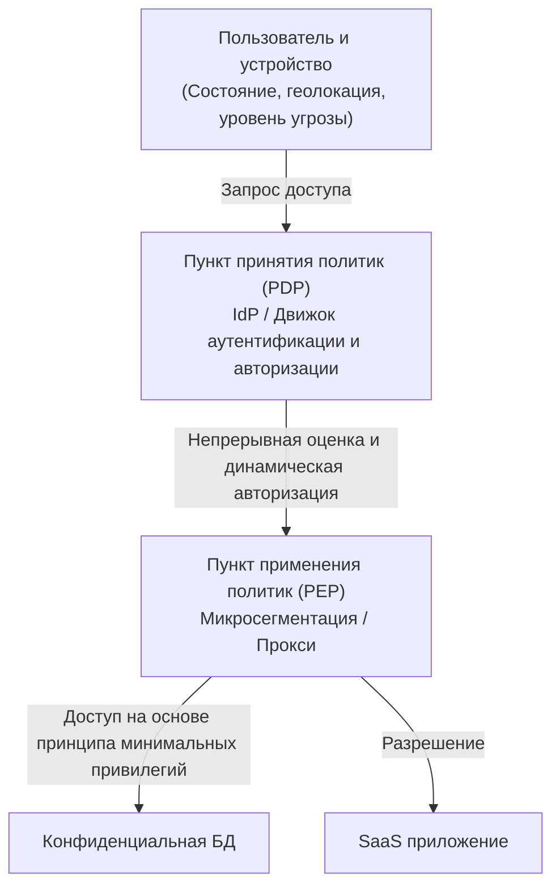

Ключевые технологические компоненты для реализации Zero Trust:

1. **Управление идентификацией и доступом (IAM/IdP)**: Использование не только паролей, но и многофакторной аутентификации (MFA) и биометрии для надежного подтверждения личности.
2. **Оценка состояния устройства (Device Posture)**: Оценка в реальном времени состояния ОС (установлены ли патчи), активности антивируса, прошлой истории поведения устройства, запрашивающего доступ. Доступ с небезопасных устройств блокируется немедленно.
3. **Микросегментация**: Разделение сети на мельчайшие сегменты и создание микро-периметров вокруг каждого ресурса. Даже в случае успешного вторжения, это не позволит злоумышленнику перемещаться внутри сети (Lateral Movement).
4. **Непрерывная аутентификация и динамические политики**: Однократный успешный вход не означает вечное доверие. Даже во время сеанса поведение (смена IP, аномальный объем скачиваемых данных) непрерывно мониторится. Как только оценка риска (Risk Score) превышает порог, применяются механизмы динамического контроля, вплоть до разрыва сессии.

Zero Trust — это не какой-то конкретный продукт, а философия дизайна: «Каждый доступ должен проверяться каждый раз, и предоставляются только минимально необходимые привилегии (Least Privilege)». В современных децентрализованных IT-инфраструктурах это стало единственно реалистичным решением для защиты данных.

## 4. Безопасность будущего: Квантовая криптография и защита сетей нового поколения

RSA и эллиптическая криптография, от которых мы зависим сегодня, базируются на предпосылке, что «современным компьютерам потребуется астрономическое время на их взлом». Однако, если появится полноценный «квантовый компьютер», основанный на принципах квантовой механики, алгоритм Шора сможет мгновенно решать эти математические задачи. Этот момент получил название **«Q-Day (День взлома криптографии квантовым компьютером)»**.

Для борьбы с этой угрозой в настоящее время развиваются два подхода:
Первый — стандартизация новых криптографических алгоритмов, которые математически сложны для взлома даже квантовыми компьютерами: **«Постквантовая криптография (PQC: Post-Quantum Cryptography)»** (например, криптография на решетках).
Второй подход основан на законах самой физики (квантовой механики) — это **«Квантовое распределение ключей (QKD: Quantum Key Distribution)»**. Технология передает ключи, кодируя информацию в квантовые состояния фотонов (например, в поляризацию). Если злоумышленник попытается «измерить» (перехватить) фотон, его квантовое состояние мгновенно изменится (проблема измерения, принцип неопределенности). Это позволяет на физическом уровне со 100% вероятностью обнаружить перехват. Это обеспечивает абсолютную безопасность коммуникаций.

## Заключение

Седьмая глава истории Интернета — это бесконечные качели между «удобством» и «безопасностью». От насыщения физического уровня DDoS-атаками до математической защиты криптографии и изменения парадигмы с архитектурой Zero Trust — кибербезопасность переросла рамки обычных IT-технологий и превратилась в сложную междисциплинарную область, где пересекаются физика, математика и поведенческая психология.
За нашим повседневным использованием браузера и облака кроется невидимая, ожесточенная электронная война, идущая 24/7/365 с миллисекундной точностью между атакующими и системами защиты.

В заключительной Главе 8 мы отправимся в будущее Интернета, чтобы изучить сетевые парадигмы следующего поколения: Web 3.0, Метавселенную и Межпланетный Интернет (Interplanetary Internet).

# Глава 8: Интернет будущего — децентрализация, космос и сети следующего поколения, сотканные из квантовой механики

На протяжении последних десятилетий Интернет продолжал эволюционировать как самая влиятельная информационная инфраструктура в истории человечества. От создания технологии коммутации пакетов в ARPANET в 1960-х годах, стандартизации стека протоколов TCP/IP, изобретения WWW (World Wide Web) и до распространения мобильного широкополосного доступа — его развитие не знает остановок. Однако Интернет, которым мы пользуемся сейчас, сталкивается с фундаментальными архитектурными ограничениями и физическими барьерами. Среди них — негативные последствия централизации из-за гипермасштабирования дата-центров, физические задержки в оптоволоконных кабелях при межконтинентальной связи и растущая уязвимость существующих технологий шифрования перед лицом стремительного роста вычислительных мощностей (особенно с появлением квантовых компьютеров).

В этой главе, озаглавленной «Глава 8: Интернет будущего», мы исследуем передовые рубежи сдвигов парадигмы, происходящих прямо сейчас. Мы максимально детально, с профессиональной точки зрения, рассмотрим исторические предпосылки, физику и технические механизмы трех главных столпов будущего: «Web3 и децентрализованную архитектуру», стремящуюся уйти от централизации; «Низкоорбитальные спутниковые сети связи (такие как Starlink)», расширяющие границы физической инфраструктуры в космос; и «Квантовый интернет», применяющий высшие законы физики для передачи данных.

---

## 8.1 Истинная ценность Web3 и децентрализованной архитектуры: Построение сетей, не требующих доверия (Trustless)

Современный Интернет (Web2.0) зиждется на централизованном управлении данными гигантскими платформерами. Модель клиент-сервер эффективна, но имеет структурные проблемы: наличие единой точки отказа (SPOF: Single Point of Failure), легкость цензуры и нарушение приватности пользовательских данных. Архитектурным ответом на эти вызовы стали «Web3» и технологии децентрализованных сетей.

### 8.1.1 Контентно-ориентированные сети и IPFS
Традиционный Web (HTTP) является «локационно-ориентированным» (Location-addressed). То есть для доступа к информации мы указываем, «где она находится (URL)». Но в такой системе, если сервер падает или срок регистрации домена истекает, контент исчезает, возникает ошибка «битая ссылка (404 Not Found)».

В противовес этому, распределенные системы хранения, такие как IPFS (InterPlanetary File System), используют «контентно-ориентированную (Content-Addressed)» архитектуру. Доступ к данным осуществляется с помощью уникального «идентификатора контента (CID)», который генерируется путем пропускания содержимого файла через криптографическую хеш-функцию (например, SHA-256).

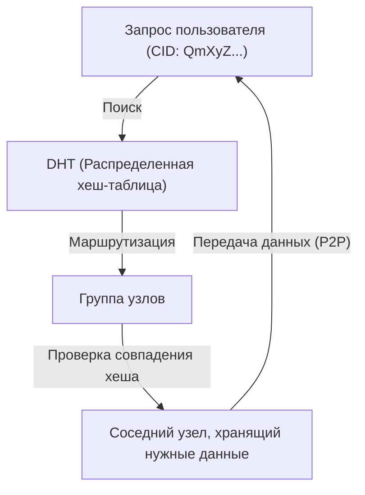

Сердцем этого механизма является алгоритм Kademlia — разновидность DHT (Distributed Hash Table: распределенная хеш-таблица). Kademlia определяет «расстояние» между ID узла и ID данных через операцию XOR (исключающее ИЛИ). Это позволяет эффективно картировать топологию всей сети и находить узлы, хранящие целевые данные, с вычислительной сложностью $O(\log N)$. Поскольку данные распределяются и дублируются на узлах по всему миру, даже если часть узлов отключится от сети, доступ к данным сохранится. Такая архитектура обладает колоссальной устойчивостью к цензуре.

### 8.1.2 Распределенный консенсус и криптографические доказательства
Другим фундаментом Web3 является технология блокчейн. Она опирается на «алгоритмы консенсуса» — способ, позволяющий децентрализованной сети без центрального администратора приходить к согласию о том, «кто фиксирует правильное состояние».
В изначальном алгоритме Bitcoin — PoW (Proof of Work) — использовалась устойчивость хеш-функций к коллизиям. Применяя колоссальные объемы вычислительной энергии, система делала подделку данных физически невозможной. Однако из-за проблем с энергопотреблением сейчас происходит переход к алгоритмам PoS (Proof of Stake).

В системах PoS, используемых, например, в Ethereum 2.0, валидаторы (узлы, заблокировавшие криптовалюту в качестве залога) применяют особую криптографическую технику на базе спаривания (pairing-based cryptography) — подписи BLS (Boneh-Lynn-Shacham) для агрегации подписей. Это позволяет сжать цифровые подписи десятков и сотен тысяч узлов до крошечного объема данных, обеспечивая децентрализованной сети как высочайший уровень безопасности, так и необходимую масштабируемость. Ожидается, что в Интернете будущего эти технологии будут стандартизированы поверх TCP/IP как новый уровень эталонной модели OSI (уровень передачи ценности и консенсуса).

---

## 8.2 Спутниковая сеть связи, обволакивающая Землю: Starlink и за его пределами

Оптоволоконные сети, проложенные по земле, — это магистраль современного Интернета. Но здесь есть свои барьеры: высокая стоимость прокладки подводных кабелей, топографические ограничения и, самое главное, физическое ограничение — «скорость света в среде». Спутниковые группировки на низкой околоземной орбите (LEO: Low Earth Orbit), ярким примером которых является Starlink от SpaceX, пытаются решить эти проблемы, осваивая новый рубеж — космос.

### 8.2.1 Орбитальная механика и преимущества низкой околоземной орбиты (LEO)
Спутники на геостационарной орбите (GEO: Geostationary Earth Orbit) находятся на высоте около 35 786 км и синхронизированы с вращением Земли, что дает преимущество — антенну можно направить в одну фиксированную точку. Но поскольку радиосигналу приходится преодолевать более 70 000 км в обе стороны, избежать физической задержки (около 120 мс только в одну сторону, а реальная задержка превышает 500 мс) невозможно.

Спутники Starlink же располагаются на низкой орбите — на высоте около 550 км. Согласно законам орбитальной механики, основанным на третьем законе Кеплера, на такой высоте, чтобы уравновесить гравитацию Земли и центробежную силу, спутники должны нестись с бешеной скоростью около 7,6 км/с (около 27 000 км/ч), совершая полный оборот вокруг Земли примерно за 90 минут.
Благодаря столь малой высоте физическое время прохождения радиосигнала кардинально сокращается — примерно в 65 раз по сравнению с GEO. Теоретическая задержка связи (latency) становится равной или даже меньшей, чем у наземного оптоволокна (20–40 мс).

### 8.2.2 Фазированные антенные решетки и управление волновым фронтом
Так как спутники движутся с огромной скоростью, наземные терминалы пользователей (плоские антенны без механических движущихся частей, в отличие от параболических антенн) должны отслеживать пролетающие над ними спутники электронным способом. Для этого используются «Фазированные антенные решетки (Phased Array Antenna)».
На плоскости расположены тысячи крошечных антенных элементов. Фаза (timing) испускаемых ими радиоволн намеренно сдвигается с точностью до микросекунд. Согласно принципу Гюйгенса, сферические волны от каждого элемента интерферируют (конструктивная интерференция), и формируется направленный луч в определенном направлении. Это позволяет мгновенно направлять луч связи на нужный спутник только за счет программного управления, без физического перемещения антенны.

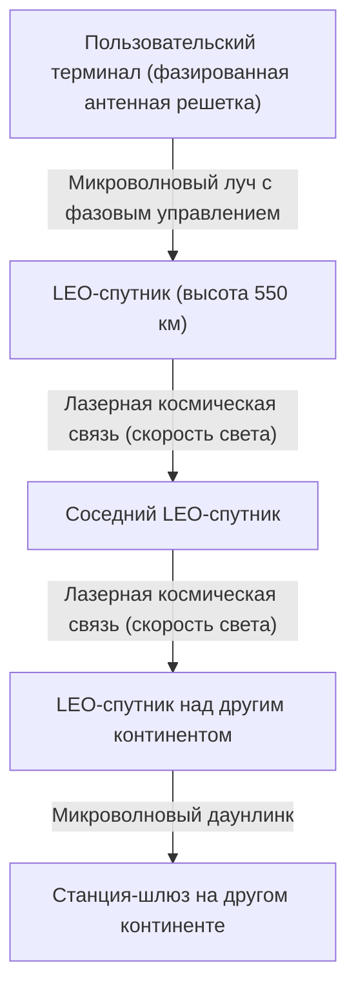

### 8.2.3 Оптическая межспутниковая связь (OISL) и абсолютное превосходство «скорости света в вакууме»
Истинная революция сети Starlink кроется в межспутниковой лазерной связи (OISL: Optical Intersatellite Links).
Современная междугородняя и международная связь зависит от оптоволокна, но показатель преломления сердцевины (кварцевого стекла) составляет около 1,47. В физике скорость света в среде равна $v = c / n$ ($c$ — скорость света в вакууме, $n$ — показатель преломления). То есть в оптоволокне скорость света падает примерно до 200 000 км/с.

В противовес этому показатель преломления космического пространства (вакуума) бесконечно близок к 1. Поэтому межспутниковая лазерная связь идет со скоростью света в вакууме $c \approx 300 000$ км/с.
Например, при передаче данных из Лондона в Нью-Йорк маршрут, когда данные отправляются в космос, пересылаются лазером через вакуум, а затем спускаются на землю, может иметь меньшую абсолютную теоретическую задержку, чем маршрут по трансатлантическому подводному кабелю. Это принесет решающий сдвиг парадигмы в высокочастотном трейдинге (HFT) и глобальных системах реального времени. В будущем десятки тысяч спутников окружат Землю, и появится ячеистая сеть (Mesh Network), в которой вместо BGP (Border Gateway Protocol) заработают динамичные трехмерные протоколы космической маршрутизации.

---

## 8.3 Квантовый интернет: Высшая форма связи, рожденная квантовой запутанностью

Если Web3 перестраивает архитектуру «доверия», а спутниковые сети преодолевают ограничения «пространства и скорости», то «Квантовый интернет» — это вершина физики в области «безопасности и методов передачи» информации. Квантовый интернет не заменит существующие TCP/IP-сети, он их дополнит, предоставив совершенно новые каналы передачи информации, основанные на физических законах.

### 8.3.1 Основы квантовой механики: Суперпозиция и квантовая запутанность
Классические компьютеры и Интернет оперируют битами «0» или «1» на основе напряжения. Квантовый интернет передает информацию в виде квантовых битов (кубитов, Qubit). Используя поляризацию (вертикальную, горизонтальную и т.д.) фотонов, реализуется принцип «суперпозиции (Superposition)», когда «0» и «1» существуют одновременно.

Еще более важна «квантовая запутанность (Quantum Entanglement)». Когда две частицы запутаны, на каком бы гигантском расстоянии друг от друга они ни находились (даже если одна на Земле, а другая на Марсе), в тот самый момент, когда измеряется и определяется состояние одной частицы, состояние второй определяется мгновенно и без малейшей задержки. Именно это нелокальное физическое явление, которое Эйнштейн называл «жутким дальнодействием», станет фундаментом квантового интернета.

### 8.3.2 Квантовое распределение ключей (QKD) и абсолютная физическая безопасность
В настоящее время шифрование RSA и эллиптическая криптография полагаются на математическую сложность — «факторизация гигантских чисел занимает слишком много времени». Но если появятся мощные квантовые компьютеры, способные реализовать алгоритм Шора, это шифрование будет взломано за считанные минуты.

Главной надеждой является квантовое распределение ключей (QKD: Quantum Key Distribution). В популярном протоколе BB84 ключ шифрования передается одиночными фотонами. Согласно фундаментальному закону квантовой механики — «Принципу неопределенности Гейзенберга», если третье лицо (шпион) попытается измерить (прослушать) фотон в полете, его квантовое состояние в тот же миг изменится (наступит декогеренция). А по «Теореме о запрете клонирования (No-Cloning Theorem)» физически невозможно создать точную копию неизвестного квантового состояния.
Это означает, что любое прослушивание на линии обязательно будет замечено получателем на физическом уровне в виде аномального скачка процента ошибок. Если обменяться гарантированно не перехваченным случайным ключом и использовать его для шифрования методом «одноразового блокнота (One-Time Pad)», будет достигнута абсолютная, взломостойкая безопасность, неподвластная компьютерам с любой вычислительной мощностью, даже если это суперкомпьютер размером со Вселенную.

### 8.3.3 Квантовая телепортация и барьер квантовых повторителей
Конечной целью квантового интернета является сетевая «квантовая телепортация» — передача самих квантовых состояний в другие места с помощью запутанности. Это позволит объединять удаленные квантовые компьютеры в «квантовые облака», заставляя их работать как один гигантский квантовый суперкомпьютер.

Однако технологический барьер сейчас крайне высок. Фотоны при прохождении через оптоволокно поглощаются и рассеиваются (затухание). В классической связи для усиления сигнала на пути ставят «усилители», но в квантовой связи из-за упомянутой «теоремы о запрете клонирования» скопировать и усилить фотон невозможно.

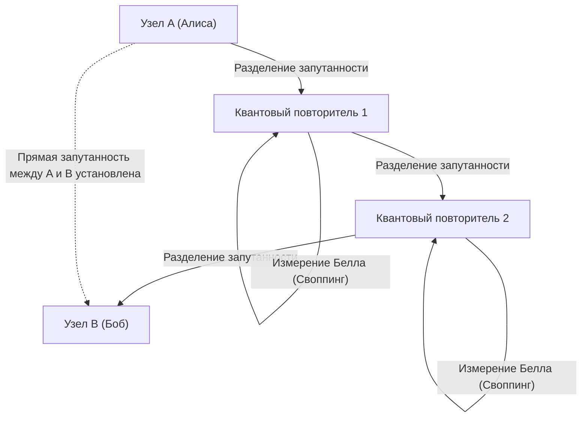

Для прорыва этого ограничения исследуются «Квантовые повторители (Quantum Repeater)». Квантовый повторитель создает запутанность только на коротких участках и, последовательно выполняя сложнейшую квантовую операцию «обмена запутанностью (Entanglement Swapping)», устанавливает запутанность на огромных расстояниях. Для этого жизненно необходима «квантовая память», способная временно сохранять квантовые состояния при сверхнизких температурах. В лабораториях по всему миру сейчас идет гонка за физические прорывы с использованием NV-центров (азото-замещенных вакансий) в алмазах или ультрахолодных атомарных газов.

---

## 8.4 Заключение: Будущее человечества и сетей

Интернет, зародившийся в 1960-х, вырос в нервную систему, соединяющую всю информацию на Земле. И сейчас мы стоим на пороге Главы 8: «Интернет будущего» — расширения в более фундаментальное, физическое измерение, выходящее далеко за рамки программного уровня.

Децентрализованная архитектура Web3 строит новый фундамент доверия (Trust Layer), гарантирующий социальные транзакции с помощью математики и криптографии, не завися от «доверия» к единым центральным авторитетам.
Спутниковые сети, такие как Starlink, вырываются из гравитационного колодца Земли и бросают вызов абсолютному пределу скорости во Вселенной — скорости света в вакууме. Они прорисовывают трехмерную транспортную магистраль, стирающую барьеры расстояний.
А Квантовый интернет возводит непостижимую мистику квантовой механики — запутанность — в ранг инженерии, стремясь радикально перевернуть концепции передачи информации и безопасности.

Хотя может показаться, что все эти технологии развиваются обособленно, в долгосрочной перспективе они сольются воедино. Одиночные фотоны (кванты), летящие внутри лазерных лучей сквозь безвоздушное пространство космоса, создадут глобальную квантовую криптографическую сеть с низким уровнем затухания. И поверх нее будут работать децентрализованные протоколы Web3. Эта научно-фантастическая сетевая инфраструктура прямо в эту минуту проектируется руками человечества.

Интернет будущего больше не будет просто «трубой для передачи данных». Он эволюционирует в совершенную «Интеллектуальную инфраструктуру», синхронизирующую в космическом масштабе экономическую активность человечества, общественный консенсус и вычислительные ресурсы. За кулисами Интернета, которым мы не задумываясь пользуемся каждый день, прямо в эту секунду продолжает писаться великая эпопея о покорении пределов физики и компьютерных наук.
