# 第一章 互联网的黎明与哲学 —— 从ARPANET到WWW的技术谱系

互联网——如今作为人类所有经济活动、文化以及交流基础的这个巨大的自治去中心化网络，绝不是由单个天才在一夜之间设计出来的。它以冷战这一特殊的历史与地缘政治背景为起点，经历了通信工程与计算机科学的范式转变，是无数研究人员共同秉持的“如何跨越一切物理限制，坚固且自由地传递信息”这一崇高哲学的结晶。

本章将不仅限于简单的历史罗列，而是从物理层到应用层的技术机制，以及其设计思想（架构）等专业视角，极度深入地解说互联网这个奇迹般的系统是如何诞生的。

## 1.1 网络范式的转变：电路交换的局限与分组交换的诞生

要理解互联网的历史与技术本质，“分组交换（Packet Switching）”概念的发明是一切的起点。20世纪60年代初，当时通信基础设施的核心是以电话网为代表的“电路交换（Circuit Switching）”方式。

### 电路交换的物理机制与脆弱性
电路交换方式是指在进行通信的两个节点之间，通过交叉开关或电子交换机进行物理连接，或者利用频分多路复用（FDM）等技术进行逻辑连接，从通信开始到结束始终确保并占用“专用通信路径（线路）”的方式。只要线路得到保障，这种方式就能保证带宽与延迟，因此非常适合对实时性要求极高的语音通信（电话）。

然而，这种架构存在致命的缺陷。那就是“单点故障（Single Point of Failure）”的存在，以及对物理破坏的极度脆弱。在冷战期间，美国国防部深切担忧来自苏联的核打击（特别是伴随高空核爆的电磁脉冲：EMP攻击）。如果中央集权型的通信节点（巨大的交换局）遭到物理破坏，或者通信路径的一部分被切断，电路交换方式无法立即重建绕行路径，国家指挥命令系统（C2: Command and Control）将彻底瘫痪。

### 分组交换的突破
有三位先驱各自独立、却几乎在同一时期构筑了打破这种令人绝望的物理限制的理论基础。他们分别是兰德公司（RAND Corporation）的保罗·巴兰（Paul Baran）、英国国家物理实验室（NPL）的唐纳德·戴维斯（Donald Davies）以及麻省理工学院（MIT）的伦纳德·克莱因罗克（Leonard Kleinrock）。

他们以克劳德·香农（Claude Shannon）的信息论为背景，提出了一种革命性的方法：不再将通信视为连续的模拟“波”或不断的数据“流”，而是将数据分割成固定长度（或可变长度）的微小数字数据块——即“分组（Packet）”或者用巴兰的话说叫“标准化消息块”。

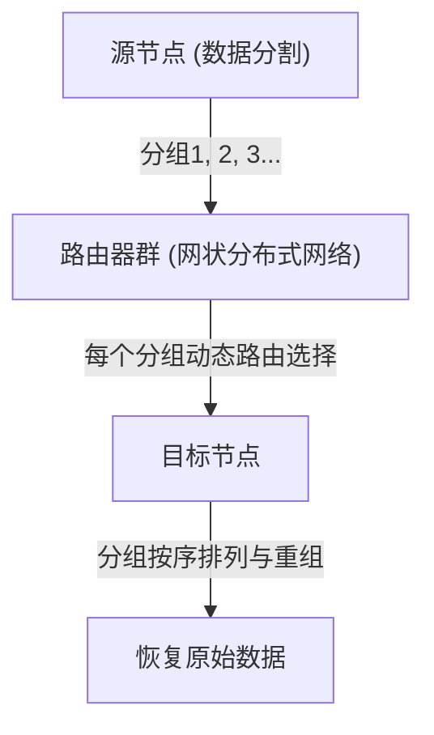

分组交换方式的技术创新性主要集中在以下两点：

1. **实现统计多路复用（Statistical Multiplexing）:**
   与电路交换在特定通信中独占物理线路不同，多个无关通信的分组按时间分片共享同一条物理线路。由于计算机间的数据通信具有高度的“突发性（Burstiness：短暂产生大量数据后紧接着是无声期）”，分组交换带来的带宽共享，将通信资源的利用效率提升到了数学极限。
2. **存储转发（Store and Forward）与动态路由选择:**
   构成网络的各个中继节点（路由器）将接收到的分组暂时存储在内存的队列（等待队列）中，将分组头部记录的目标地址与节点自身的路由表（Routing Table）进行核对。然后，计算当时的网路拥塞状态与物理线路断开情况，为每个分组选择最优的相邻节点进行转发。

克莱因罗克利用排队论（Queuing Theory）确立了这种存储转发方式下分组延迟与缓冲区大小的数学模型。即使网络的一部分在核打击中蒸发，幸存的节点也能自主判断情况，分组会在网状网络中找到绕行路径到达目的地。这种“自治去中心化、自我修复型”的架构，正是互联网韧性（Resilience）的根源。

## 1.2 ARPANET的构建：通过IMP实现硬件与协议的分离

将理论上的分组交换网络在物理世界中实现的，是1969年由美国国防部高级研究计划局（ARPA）资助启动的“ARPANET”项目。

当时的计算机环境远比现代混乱得多。IBM、DEC、SDS等各家公司自主开发的大型机（Mainframe），其字符编码（ASCII对EBCDIC）、字长（16位、32位、36位等）、操作系统完全不同，在技术上很难让它们直接进行通信。

因此，ARPANET的设计者们（拉里·罗伯茨等人）在网络架构上做出了一个极其重要的设计决策。那就是引入一种被称为“IMP（接口消息处理器，Interface Message Processor）”的专用中继小型计算机。

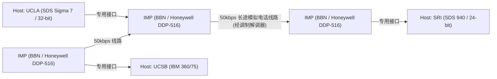

IMP的开发由总部位于波士顿的咨询公司BBN（Bolt Beranek and Newman）中标。他们改造了霍尼韦尔公司坚固的小型机“DDP-516”，让IMP承担了路由协议、分组分割与组装、错误检测（CRC：循环冗余校验）等所有复杂的网络处理。

如此一来，各研究机构庞大的主机无需再关心复杂的分组路由或线路的物理特性，只需通过眼前标准化的接口（BBN 1822协议）与IMP进行数据交换即可。这是将系统的“关注点分离（Separation of Concerns）”应用到网络领域的首个伟大成功案例，IMP也成为了当今路由器（Router）的直接鼻祖。

1969年10月29日，从UCLA的克莱因罗克实验室向SRI（斯坦福研究院）发送了第一条消息“LO”（因为原本试图输入“LOGIN”，但系统崩溃了）。这是ARPANET诞生的历史性瞬间。随后，早期的路由算法（基于贝尔曼-福特算法的距离矢量路由）被实现，ARPANET迅速成长为连接全美研究机构的基础设施。

## 1.3 TCP/IP的设计思想：端到端原则与封装的深渊

虽然ARPANET作为单一网络取得了巨大成功，但不久便面临新的壁垒。ARPANET内使用的NCP（网络控制程序，Network Control Program）通信协议，其设计前提是运行在ARPANET这个“同质且高可靠性的单一网络”之上。

然而进入20世纪70年代后，出现了使用人造卫星的分组通信网（SATNET）、夏威夷大学开发的无线分组通信网（从ALOHANET衍生出的PRNET）等，这些网络的物理介质、最大传输单元（MTU：Maximum Transmission Unit）、传输速度和错误率各不相同。当试图将它们互连以构建全球规模的“网络之网络（Internetwork）”时，NCP的设计显然会崩溃。

解决这一异构网络互连艰巨挑战的，是1974年文顿·瑟夫（Vinton Cerf）和罗伯特·卡恩（Bob Kahn）发表的突破性论文《A Protocol for Packet Network Intercommunication》。他们设计的协议，正是现代互联网的基础——“TCP/IP（传输控制协议 / 网际协议）”。

### 架构之魂：端到端原则 (End-to-End Principle / Argument)
在TCP/IP设计的根基中，流淌着网络工程中最重要的哲学——“端到端原则”。这一原则在20世纪80年代由J. H. Saltzer、D. P. Reed和D. D. Clark等人明文化，其主张如下：

“确保数据传输可靠性、顺序控制、加密等高度且特定于应用的功能，应当在通信两端的终端主机（End-to-End）上实现，而不应在网络核心（中继基础设施或路由器）中实现。”

如果在网络核心端（IMP或路由器）加入数据包到达确认（ACK）或重传控制等复杂的“状态（State）”，会发生什么？中继路由器一旦发生故障，该状态就会丢失，通信就会中断。此外，每当出现具有新要求的应用时，就必须重写全世界中继路由器的软件。

TCP/IP将这一原则发挥到了极致。负责中继的IP（Internet Protocol）路由器只专注于极其简单的功能（无状态的数据报转发），即“仅仅以尽力而为（Best Effort）的方式将接收到的数据包转发向目的地”。IP完全不关心数据包的丢失或乱序。它彻底做到了只是一个单纯的“哑网络（Dumb Network）”。

取而代之的是，担保通信可靠性的重任完全交给了在两端主机上运行的TCP（Transmission Control Protocol）。TCP通过查看IP运来的乱序数据包上附加的序列号来重新组装原始数据，如果有缺失，它会自主要求重传；如果网络拥塞，它会调整发送速度（窗口控制与慢启动算法）。

这种“保持核心极致简单，让边缘（终端）拥有智慧”的设计思想，正是互联网能够超越电话网，并在之后毫不费力地接纳诸如Web、流媒体视频、P2P通信、智能手机等甚至连设计者都未曾预料到的爆发式创新的最大原因（无需改造基础设施）。

### 封装（Encapsulation）与分层模型
为了实现这种逻辑上的角色分工，TCP/IP采用了将数据“封装（Encapsulation）”的方法。这是一种像俄罗斯套娃一样的机制：每一层都会对要发送的数据加上自己的控制信息（头部）。

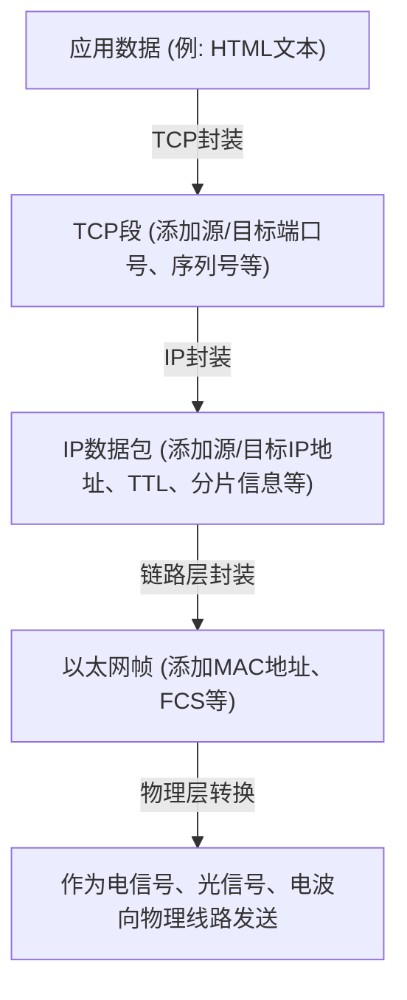

路由器只看IP数据包的头部（IP地址）来决定转发目的地，对其内容（TCP头部或数据）完全不干预。由此，IP成功地彻底隐藏并吸收了底层物理层（光纤、铜线、Wi-Fi、5G）的物理特性差异，为上层提供了一个“全球规模的单一虚拟网络”。

1983年1月1日，ARPANET上的所有主机一致从NCP切换到TCP/IP，实施了“标志日（Flag Day）”，真正意义上的“The Internet”由此诞生。

## 1.4 NSFNET的崛起与自治分布式路由的演进

过渡到TCP/IP后，互联网跨越了军事与国防的框架，转变为巨大的学术研究基础设施。成为其决定性推动力的是20世纪80年代后期由美国国家科学基金会（NSF）构建的“NSFNET”。

NSFNET是作为连接全美5个超级计算机中心的骨干网络而建立的，初期为56kbps，后来发展到T1线路（1.544Mbps），再到T3线路（45Mbps），经历了物理层的剧烈升级。各大学和地区网络（Regional Network）也开始以分层结构连接到NSFNET的骨干网上。

在网络规模爆发式扩大（扩展）的过程中，新的技术课题浮出水面。那就是“路由的极限”。让所有中继路由器共享数万个节点的路径信息，超出了内存容量和计算能力的物理极限。

为了解决这个问题，互联网引入了“自治系统（AS: Autonomous System）”的概念。互联网不再是一个单一的巨大网络，而是被重新定义为具有独立管理策略的网络（AS）的集合体。

在AS内部（IGP: Interior Gateway Protocol），使用如OSPF（开放最短路径优先）等链路状态型路由协议，通过迪杰斯特拉算法（Dijkstra's algorithm）构建网络的完整拓扑图，高速计算最短路径。

另一方面，在AS与AS之间（EGP: Exterior Gateway Protocol），不能仅靠最短路径，还必须反映“允许通信经过哪个网络”这种商业和组织上的策略。为了实现这一点，开发出了至今支撑互联网根基的“BGP（边界网关协议，Border Gateway Protocol）”。BGP采用了路径矢量（Path Vector）型算法，在完全防止路由环路的同时，实现了全球ISP（互联网服务提供商）之间的路由信息交换。

通过NSFNET的构建和BGP的确立，即使没有中央管理者，各组织也能通过不断互连（对等与转接），作为整体自律地发挥功能，现代商业互联网的生态系统由此完成。1995年，NSFNET完成了其使命，骨干网的运营完全移交给了民间ISP群体。

## 1.5 WWW的诞生：通过超文本解放知识与进入公有领域

20世纪80年代末，随着从物理层到网络层、传输层的基础设施在全球范围内建立起来，互联网上积累的信息量急剧增加。然而，当时的互联网上充斥着FTP（文件传输）、Telnet（远程登录）、USENET（电子公告板）等各自独立的应用，信息孤立（孤岛化）在各服务器目录的最深处。要找到所需的数据，必须了解目标服务器的IP地址和复杂的UNIX命令，处于极其非民主化的状态。

从根本上颠覆这种局面并引发信息共享范式转变的，是位于瑞士日内瓦的欧洲核子研究组织（CERN）的计算机科学家蒂姆·伯纳斯-李（Tim Berners-Lee）。1989年，他提出了一种名为“万维网（World Wide Web，WWW）”的革命性系统。

他想法的核心，是将20世纪60年代就已经存在的“超文本（Hypertext：从文档内单词链接到另一文档的概念）”与“互联网（TCP/IP）”结合起来。他将原本封闭在本地计算机内的超文本链接，扩展到了地球另一端的服务器文档上。

为了构建这个巨大的信息空间，伯纳斯-李独自设计并实现了3项极其精炼的技术规范。

1. **URI (Uniform Resource Identifier):**
   用于唯一指定存在于网络上的任何资源（文本、图像、视频等）所在位置的通用地址体系。
2. **HTTP (Hypertext Transfer Protocol):**
   用于客户端（Web浏览器）与服务器之间，请求和传输由URI指定资源的应用层协议。HTTP最出色的一点在于，它采用了不保持通信“状态（State）”的“无状态（Stateless）”设计。这使得服务器能够高效处理数百万客户端的请求。
3. **HTML (Hypertext Markup Language):**
   一种标记语言，用于描述文档的逻辑结构，并嵌入指向其他资源的超链接（锚标签 `<a>`）。

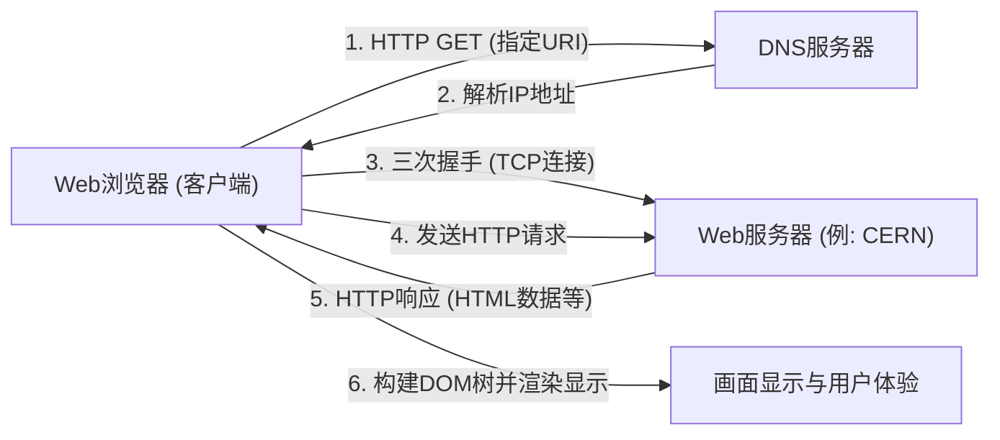

1990年底，世界上第一台Web服务器（info.cern.ch）和浏览器在NeXT计算机上开始运行。初期的Web基于文本，但凭借直观的链接式信息探索体验，迅速在研究人员中普及开来。

### 进入公有领域的人类历史性决定
然而，WWW真正改变世界并作为现代社会基础设施扎根的最大原因，不仅仅是因为其卓越的技术架构。决定历史的关键事件发生在1993年4月30日。

CERN接受了蒂姆·伯纳斯-李的强烈要求，做出了一个惊人的决定，将WWW的基础技术（服务器软件、客户端、代码库）全部作为“公有领域（放弃知识产权）”免费开放。在那份声明放弃所有专利权且不要求使用费的文档上，有着CERN主任的签名。

如果在那个时候，CERN将WWW的技术申请专利，并试图通过软件许可来变现，会怎样呢？毫无疑问，今天的信息爆炸就不会发生。WWW将只能作为一个局限于部分资金雄厚的企业或大学的封闭系统，并且必然会在后来与Gopher等竞争协议的标准争夺中导致互联网四分五裂。

通过进入公有领域，技术和法律壁垒完全消失，全世界的黑客和企业纷纷进入WWW的生态系统。美国国家超级计算应用中心（NCSA）的马克·安德森（Marc Andreessen）等人开发并免费发布了能内嵌显示图像的革命性图形浏览器“NCSA Mosaic”，这引发了后来的Netscape Navigator，进而触发了IT泡沫。个人可以自由建立Web服务器，向世界发布信息，“信息民主化”得以实现。

## 1.6 结语：思想凌驾于实现之上

我们在第一章所看到的互联网历史，绝非单纯的通信速度提升史。基于“集中控制是脆弱的”物理现实而发明的包交换；“复杂性应由边缘承担”的端到端原则；以及“信息应对全人类免费开放”的WWW公有化。

让互联网呈现出今天这番面貌的，不是优秀的硬件或代码，而是这些强大且一致的“设计哲学（Philosophy）”。通过逻辑封装克服物理层限制，并通过开放标准（RFC: Request for Comments）包容多样性。正是因为有了这种尊重去中心化和自由的架构，互联网才实现了前所未有的扩展。

然而，在人类能理解的“名称”与网络处理的“数字（IP地址）”之间，仍然存在着深深的鸿沟。在下一章中，我们将深入解析一个在这个广阔的自治去中心化网络地址空间中带来秩序、并在幕后支撑了WWW爆发性普及的巨大分布式数据库系统，即“IP地址空间与DNS（域名系统）的深渊”的技术机制。

# 第二章：物理层与数据链路层 〜数字数据的物理实体与相邻节点间通信〜

在互联网这个巨大网络的根基处，存在着一个不可思议的物理现象链条：将逻辑上的数字数据“0”和“1”转化为电信号、光闪烁或电磁波纹等物理现象，跨越空间或介质传递给对方。当我们随意用智能手机打开一个网站时，在其背后，光子在海底攀爬的玻璃纤维中飞驰，看不见的电波伴随着复杂的计算在空间中穿梭。

本章将聚焦于OSI参考模型中的第1层（物理层）和第2层（数据链路层），从专业视角极度深入地探讨支撑我们生活的网络中“最物理、最接地气”的部分，以及控制它们的精密逻辑机制。

---

## 2.1 物理层（Physical Layer）：信息的物理实体化与宇宙法则

物理层的最大使命，是将计算机处理的离散位序列（0和1），转换（调制）为适应传输介质（铜线、光纤、真空或空气等空间）物理特性的模拟物理信号，并送入传输路径。在这里，电气工程、量子力学和光学的法则决定了通信的极限。

### 香农-哈特利定理与信息极限
谈论物理层不可避免地要提到克劳德·香农在1948年发表的信息论。“香农-哈特利定理”在数学上证明了，在存在噪声的通信信道中，可以无差错发送的最大数据传输速率（信道容量）。

$$ C = B \log_2\left(1 + \frac{S}{N}\right) $$

这里，$C$是信道容量（bps），$B$是带宽（Hz），$S/N$是信噪比（SNR）。这个优美的方程式表明，无论技术如何进步，在给定的带宽和噪声环境下可以传输的信息量都存在物理上限（香农极限）。现代光纤和Wi-Fi工程师们，正在持续进行着如何尽可能逼近这一极限来提升通信速度的无休止的战斗。

### 光纤物理学：“锁住”光并传递
现代互联网的支柱，毫无疑问是光纤（Optical Fiber）。在通过铜线进行的电通信中，由于趋肤效应和电磁干扰（EMI），长距离高速通信非常困难，而光纤克服了这些问题。

光纤由中心部分的“纤芯”和围绕它的“包层”两层极高纯度的石英玻璃组成。通过使纤芯的折射率略高于（百分之几以下）包层，基于斯涅尔定律，以小于特定临界角的角度入射的光，将在纤芯和包层的边界不断发生全反射（Total Internal Reflection）。由此，光不会泄露到外部，而是沿着光纤内部前进。

#### 与色散和衰减的斗争：带来诺贝尔奖的玻璃
过去的玻璃含有大量杂质，几米后光就会衰减。1966年，高锟博士（2009年诺贝尔物理学奖得主）查明了光纤衰减的原因并非玻璃本身的性质，而是杂质（尤其是羟基和过渡金属），并预言提高纯度就能实现长距离通信。20世纪70年代，康宁公司开发的超低损耗石英玻璃，在1550nm波段（C波段）实现了0.2dB/km的惊人低损耗。这意味着光即使前进15公里，其强度也只会损失一半。

然而，当光长距离移动时，会发生“色散（Chromatic Dispersion）”和“模式色散（Modal Dispersion）”，导致脉冲波形发生畸变。色散是由于光的波长（颜色）不同，在玻璃中传播的速度不同而产生的。模式色散是因为光穿过纤芯的路径（模式）有多种，从而导致到达时间产生偏差的现象。
为了克服这一问题，开发出了将纤芯直径缩小到接近光波长的几微米，只允许单一路径通过的“单模光纤（SMF）”，它成为了洲际通信等长距离传输的主流。

#### EDFA与WDM：光通信的文艺复兴
20世纪90年代，光通信领域发生了两场革命。第一场是掺铒光纤放大器（EDFA：Erbium-Doped Fiber Amplifier）。在那之前，需要使用速度慢且成本高的再生中继器，将衰减的光信号先转换为电信号，放大后再转换回光信号。EDFA通过在光纤纤芯中掺杂稀土元素铒，并从外部照射泵浦光，使信号光通过时引起受激辐射，从而实现了保持光的状态直接进行放大。

第二场是波分复用（WDM：Wavelength Division Multiplexing）。该技术利用了即使将不同波长（颜色）的光同时发射到同一空间中，它们也不会混合而是独立前进的叠加原理，在一条光纤中同时捆绑传输多个波长信号的技术。凭借密集波分复用（DWDM）技术，现在可以仅通过单根光纤，在数毫米间隔的波段中承载100多个波长的信号，实现数十Tbps至数Pbps的惊人带宽。

### 海底电缆：地球的神经网
连接各大洲的数据通信中，99%以上不是通过人造卫星，而是通过海底电缆传输的。云端的数据也好，海外网站的图片也罢，全部都是穿过物理海底的。

#### 失败与挑战的历史
海底电缆的历史比互联网要古老得多。第一个巨大的挑战是1858年的跨大西洋电报电缆。尽管由古塔胶（一种天然橡胶）绝缘的铜线铺设成功，但由于无视开尔文勋爵（威廉·汤姆森）的警告使用了高压操作，仅仅几周后就发生绝缘击穿而陷入死寂。此后，经过漫长时间对理论和材料的改进，1988年首条横跨太平洋的光纤海底电缆“TAT-8”开始运行，拉开了光通信时代的序幕。

#### 电缆结构与铺设机制
铺设在数千米深海的现代海底电缆被设计成能够承受极端环境。为了保护中心那几根极其纤细的光纤束，使用了高张力钢丝、用于抗水压的铜管或铝管、聚乙烯绝缘体等进行多重保护。在深海部分，为了在抵御鲨鱼啃咬和巨大水压的同时实现轻量化，直径只有几厘米粗细；但在浅海部分，为了防止渔船底拖网、船锚和海底地震的破坏，会加上厚厚的装甲（铠装），直径可达10厘米以上。

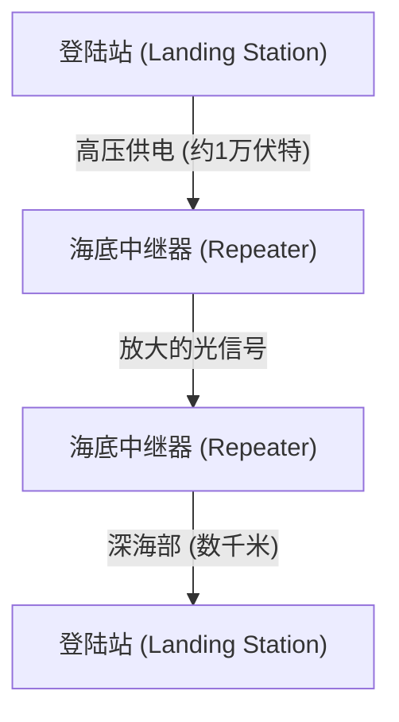

即使使用超低损耗光纤，光信号在几十公里后也会衰减，因此电缆中途会等距插入“海底中继器（Repeater）”。为了在深海驱动这些中继器（内置了前述的EDFA），两端的登陆站通过电缆内的铜管，以数千伏甚至最高超过1万伏的直流高压不断供电。
铺设时需要使用专用的“电缆铺设船”，在浅海则通过水下机器人（ROV）在海底挖沟并将电缆埋设。如果电缆断裂，修理船会急赴现场，用抓钩从深海钩住电缆一端拉上甲板，由熟练的技术人员以几微米的精度将光纤熔接起来。这就是这种极其原始且接地气的工作。

### 无线电通信物理学（Wi-Fi的基础）
随着移动设备和物联网的普及，在空间飞越的电磁波（无线电波）通信也成为了物理层的主要战场。Wi-Fi（IEEE 802.11标准群）主要使用2.4GHz频段、5GHz频段以及近年来开放的6GHz频段的ISM频段（工业、科学、医疗频段，无需许可证即可使用）。

#### 通过QAM（正交振幅调制）实现极限信息压缩
在将数字数据加载到模拟波上的“调制”过程中，Wi-Fi采用了极为先进的技术，即QAM（正交振幅调制：Quadrature Amplitude Modulation）。
无线电波具有“振幅（波的高度）”和“相位（波的定时/角度）”两个物理量。QAM通过合成相位差90度的两个载波（I信号和Q信号），并改变各自的振幅，将比特序列分配到星座图上的特定“点”上。

例如，如果是16-QAM，那么一次波形变化（符号）就能表示16个点（4比特）。在最新的Wi-Fi 7（802.11be）中，采用了甚至可以说疯狂的高密度调制：4096-QAM。这意味着一次调制就能表示4096个点（12比特）。在挤满4096个点的星座图中，接收端必须在微小的噪音中准确判别发送的到底是哪个“点”。为了实现这一点，使用了高级纠错码和强大的信号处理处理器。

#### OFDM与MIMO：对抗多径效应与利用空间
电波不仅直行，还会遇到墙壁和家具而发生反射、衍射和散射。因此，从发射机发出的电波会通过不同路径（多径效应）以稍微错开的时间到达接收机，引起干扰（衰落）并破坏波形。
利用甚至克服这一现象的技术就是OFDM和MIMO。

**OFDM（正交频分复用）**：不是使用宽带高速的单一信号，而是将频段细分为大量极窄频率（子载波），并以较慢速度并行传输数据的技术。由于子载波之间被配置为“正交（数学上互不干扰）”，因此频率利用效率极高，并且能很好地抵抗多径带来的延迟偏差。

**MIMO（多输入多输出）**：使用多根天线，在同一频率同时发送不同数据的“空间复用”技术。它利用电波经过多径反射后在空间不同位置发生不同混合的特性，将接收端多根天线收到的复杂信号像解方程一样分离开来，使通信容量翻倍（翻倍数等于天线数）。此外，微调各天线电波相位，将波束集中向特定方向发射的**波束赋形**（Beamforming）技术，也是现代Wi-Fi不可或缺的。

---

## 2.2 数据链路层（Data Link Layer）：直接相连设备间的对话与秩序

如果说物理层单纯只是“信号搬运工”，那么数据链路层则是将那些原始的比特流打包成有意义的“帧（Frame）”块，并确保其可靠送达同一网络（链路）内正确目标的规则与交通管制层。

### 以太网（Ethernet）的历史：源自ALOHA的灵感
如今，有线LAN的全球事实标准是以太网（IEEE 802.3）。
它的起源可以追溯到夏威夷大学创建的无线通信网络“ALOHAnet”。ALOHAnet采用了极其无序且充满野心的协议：“如果有数据要发送就直接发。如果因为碰撞损坏了，就等待一段随机时间后再重发。”

1973年，施乐帕洛阿尔托研究中心（PARC）的鲍勃·梅特卡夫（Bob Metcalfe）将ALOHAnet的理念应用到同轴电缆通信上，发明了以太网。早期的以太网呈“总线型”拓扑结构，许多计算机通过被称为吸血鬼抽头的针状物刺入一根粗大的同轴电缆（黄线）中进行共享。

#### CSMA/CD：有序的无政府状态
由于所有设备共享介质（电缆），当多台设备同时发送电信号时，波形就会重叠导致数据被破坏，这就是“碰撞（Collision）”。为了避免和解决这一问题，诞生了自主分散型算法“CSMA/CD（载波侦听多路访问/冲突检测）”。

1. **Carrier Sense（载波侦听）**: 在发送前测量电缆上的电压，倾听是否有人在通信。
2. **Multiple Access（多路访问）**: 如果没有人在通信，不需要等待中央集权的许可，任何人都可以自由发送。
3. **Collision Detection（冲突检测）**: 在发送过程中持续监测电缆电压，如果检测到与自身发送信号不同的异常电压上升，就判断发生了“冲突”。立即发送干扰（Jam）信号通知所有人发生了冲突，并中止发送。
4. **Backoff（退避）**: 冲突发生后，各个节点等待一段随机时间（通过指数退避算法计算得出）后尝试重新发送。

这种“以发生违反规则（冲突）为前提，发生后就随机等待”的简单且无需中央管理者的机制，击败了IBM令牌环和ATM等复杂昂贵的协议，成为以太网取得霸权的最大原因。

### MAC地址：硬件的绝对身份证
在数据链路层中指定目的地使用的是MAC地址（Media Access Control address）。如果IP地址是“临时住址”，那么MAC地址就是“与生俱来的身份证号”。

MAC地址长48位（6字节），像“00:1A:2B:3C:4D:5E”这样由冒号分隔的2位十六进制数表示。
- **前24位 (OUI: Organizationally Unique Identifier)**: 由IEEE管理并分配，唯一标识网络设备供应商（如Apple、Cisco、Intel等）的企业代码。
- **后24位 (UAA: Universally Administered Address)**: 供应商为自家产品按顺序分配的序列号。

原则上，全世界所有网络设备的网络接口卡（NIC）都在ROM中烧录有世界上独一无二的MAC地址。

### 帧结构：通信的打包技术
在数据链路层，会将从网络层传下来的数据（如IP包等）前后加上头部和尾部，封装成一个称为“帧（Frame）”的单位。以太网（Ethernet II）帧的结构可以说是优美到了艺术的境界。

1. **Preamble (前导码)**: 7字节连续的“10101010”。这是为了接收端NIC进行时钟同步（对齐定时）的热身运动。
2. **SFD (Start Frame Delimiter)**: 1字节的“10101011”。当前导码的最后变成“11”时，就在告诉接收端“接下来才是正式数据”。
3. **Destination MAC (目标MAC地址) / Source MAC (源MAC地址)**: 各6字节。指明从谁发给谁。如果目标是“FF:FF:FF:FF:FF:FF”，就会变成发送给所有人的广播帧。
4. **EtherType (类型)**: 2字节。指示有效载荷中的数据是什么（IPv4为0x0800，IPv6为0x86DD，ARP为0x0806）。
5. **Payload (数据/有效载荷)**: 从上层接收到的实际数据。大小从46字节到最大1500字节（MTU：最大传输单元）。
6. **FCS (Frame Check Sequence)**: 4字节的尾部。使用称为CRC-32（循环冗余校验）的多项式从整个帧（从目标MAC到有效载荷）计算出的哈希值。

接收端的NIC在一边接收帧的同时，一边在硬件层面高速计算CRC。如果帧尾部的FCS与自己计算的结果哪怕只有1个比特的区别，就会被判定为在通信途中的噪音或冲突导致数据损坏，该帧将被**毫不留情且不加通知地丢弃**。数据链路层确实保证了“检测到错误就丢弃”，但它不具备要求“坏了请重传”的功能。重传控制这一重任被委派给了更高层的TCP协议等，这种角色分担支撑了互联网的可扩展性。

### 交换机的诞生与向全双工通信的演进
尽管基于CSMA/CD的共享总线型以太网机制非常棒，但随着连接到网络上的设备（主机）增加，冲突频繁发生，实际吞吐量骤降，这是一个致命的弱点。
从根本上解决这个问题的是20世纪90年代普及的“二层交换机（Switching Hub）”。

相比于中继集线器（Hub）这种将接收到的电信号无条件向所有端口广播的物理层设备，交换机拥有能够理解数据链路层的聪明大脑。
交换机内部拥有使用内存（CAM表）构建的“MAC地址表”。它会学习连接在各个端口的设备的源MAC地址，自动构建起端口与MAC地址的对应表。
当帧进入时，交换机将目标MAC地址与表进行比对，**仅仅**将帧转发（Forwarding）到目标设备连接的端口。

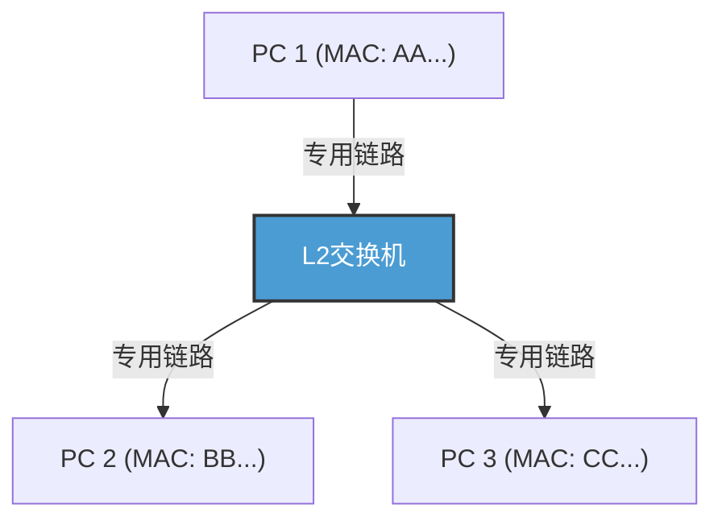

随着交换机的引入，各节点与交换机之间的布线在逻辑上和物理上都变得独立（星型拓扑）。由此，通信路径被分离，原理上不再发生冲突（Collision）。结果，同时使用发送线和接收线进行“全双工通信（Full-Duplex）”成为了可能。
在现代以太网中，CSMA/CD算法已不再使用，它纯粹地进化为了点对点的全双工通信。此外，通过IEEE 802.1Q的VLAN（虚拟局域网）技术，能够不受物理布线限制灵活地划分与整合逻辑网络，持续作为支撑企业和巨大数据中心基础设施的绝对底层技术称霸。

### Wi-Fi的数据链路层：不可见电波空间的交通管制
正如有线以太网进化为无冲突的全双工通信一样，无线的Wi-Fi正面临着与过去共享总线型以太网相同的难题：“所有人共享同一个物理空间（空气）这一单一介质”。

在无线通信中，由于自身发送时的电波太强，在物理上不可能同时接收他人微弱的电波从而“检测（CD）”出冲突。此外，还存在无线特有的风险——“隐藏终端问题（Hidden Node Problem）”：比如，位于接入点两侧的终端A和C，彼此的电波虽然无法到达对方，但如果同时发送，电波就会在接入点处发生冲突。

因此，在Wi-Fi的数据链路层协议（MAC层）中，采用了“CSMA/CA（载波侦听多路访问/冲突避免，Carrier Sense Multiple Access with Collision Avoidance）”。
在CSMA/CA中，在发送前会监听空间电波状况一定时间（DIFS），然后再等待一个随机的退避时间后才开始发送。最关键的区别在于有线网络所没有的**ACK（Acknowledge：确认应答）**机制。在Wi-Fi中，接收到数据的一方会立即（在极短的等待时间SIFS后）返回表示正常接收的ACK帧。发送端只有接收到这个ACK，才认为通信成功。如果未返回ACK，就判定数据因冲突或干扰而损坏，将退避时间加倍并尝试重传。

为了进一步解决隐藏终端问题，还存在称为“RTS/CTS握手”的机制。在发送大数据之前，发送端会发送称为RTS（Request to Send：请求发送）的短控制帧，接收端（如接入点）返回CTS（Clear to Send：清除发送，允许发送）。这个CTS中包含了“接下来要通信○○微秒，周围的终端请保持静默”的预约时间（NAV：Network Allocation Vector）信息，收到该信息的周围终端会自觉停止通信。就这样，Wi-Fi的数据链路层在看不见的电波空间中进行了极佳的交通管制。

---

## 结语

在玻璃中化作光子飞驰，承受深海的水压，一边改变相位和振幅一边在空间中穿梭的物理现象世界。然后，在这些充满噪音和不确定性的物理现象之上，铺设了前导码的同步、MAC地址的个体识别、CRC的严密错误检测，以及通过交换和CSMA/CA实现的精炼流量控制，从而首次实现了“将有意义的数据块（帧）无差错地送达相邻设备”。这就是第1层和第2层所创造的奇迹。

然而，仅靠这些无法成为连接全世界的互联网。因为基于MAC地址的通信，始终只能在连接到同一个交换机或接入点、或者说在被路由器阻断之前的“同一个网络（广播域）”这个狭小村庄内起作用。

在下一章“第三章：网络层与IP”中，我们将探究如何将这些无数的本地村庄连接起来，像接力传递一样把数据包送达到地球另一端未知网络的宏大路径探索机制，即IP（网际协议）和路由的真谛。
# 第3章：网络层与路由机制 —— 跨越汪洋的包航海图

我们日常使用的互联网的根基，在于OSI参考模型中的第3层，即“网络层”。超越了通过物理线缆或电波进行的直接通信（数据链路层），能够与数千公里外的服务器进行全球规模通信的背后，存在着无数密布的路由器，以及它们自主交换信息的宏大的路由（Routing）机制。

本章中，从IP（Internet Protocol）的结构，到IPv4的局限性与IPv6的架构，再到连接全球自治系统（AS）的BGP（Border Gateway Protocol）的深渊，我们将从技术、历史和物理的视角，极尽详尽地阐述数据包到达目的地所需的“航海术”。

## 3.1 网络层的范式：端到端原则

互联网设计理念中最大的突破，在于“端到端（End-to-End）原则”，即“网络中间节点（路由器）仅专注于简单的数据包转发，而复杂的处理（错误纠正和顺序保证）由终端（端点主机）进行”。

在传统的电话网（电路交换方式）中，从通信开始到结束都会占用一条物理线路，并在整个网络中管理状态（State）。相比之下，互联网（分组交换方式）的网络层是“无连接（Connectionless）”的，并且不保持状态。每一个数据包都被视为一封独立的“信件”，路由器收到它后，查看目的地并将其发送到最佳的下一个中继点（下一跳，Next Hop）（转发，Forwarding），仅重复这一简单作业。这种“哑网络（Dumb Network）”与“智能终端（Smart Terminal）”的组合，正是互联网能够爆炸式扩展并包容各种应用程序的最大原因。

## 3.2 互联网地址：IP地址的演进与枯竭历史

网络上的所有设备都被赋予了一个唯一的标识符，即IP地址。当前互联网正处于过渡期，两代IP协议并存。

### IPv4：32位空间与对抗枯竭

1981年在RFC 791中定义的IPv4具有32位（约43亿个）空间。在设计之初，43亿这个数字让人觉得大得离谱，但随着互联网的爆炸性普及，在20世纪90年代初就早早响起了枯竭危机的警钟。

为了克服这一危机而诞生的是**CIDR（无类别域间路由，Classless Inter-Domain Routing）**和**NAT（网络地址转换，Network Address Translation）**。
早期的IP地址分配采用粗略的“有类别（Classful）”方式，分为A类（/8）、B类（/16）、C类（/24），导致了严重的地址浪费。CIDR将其替换为可变长子网掩码（VLSM），实现了按需分配地址的“无类别（Classless）”路由。
此外，通过NAT的出现，将私有IPv4地址空间与单个全局IPv4地址绑定，使得单个地址可以被数千台设备共享。然而，NAT破坏了端到端原则，并在P2P通信或实时通信中要求复杂的NAT穿透技术（如STUN/TURN/ICE等）。

### IPv6：128位无限空间与下一代头部结构

作为解决地址枯竭的根本方案，1998年在RFC 2460中制定了**IPv6**。IPv6拥有128位的地址空间，提供了$2^{128}$（约340涧）个地址，这甚至给地球上的每一粒沙子分配一个地址都有剩余的广阔空间。

IPv6的创新不仅在于地址的长度，还在于对头部结构进行了戏剧性的简化。IPv4头部中的变长选项和头部校验和被废除，基本头部固定为40字节。这使得硬件（ASIC或TCAM）中的数据包处理（路由）速度大大提高。此外，分片（数据包分割）不再由中间路由器进行，而是改为仅由源主机进行的规范，从而大幅减轻了路由器的负荷。

## 3.3 路由的两面性：控制平面与数据平面

路由器内部大致分为两个“平面（Plane）”。

1. **控制平面（Control Plane）**
   路由器之间使用路由协议（如OSPF、BGP等）相互通信，学习网络拓扑（连接形态）并计算最佳路径的大脑部分。计算结果存储在被称为RIB（路由信息库，Routing Information Base）的数据库中。
2. **数据平面（Data Plane）**
   实际接收数据包，根据目标IP地址决定将其发送出去的接口并进行转发的肌肉部分。利用从RIB生成的专用于转发的FIB（转发信息库，Forwarding Information Base）表，并使用TCAM（三态内容寻址存储器，Ternary Content-Addressable Memory）等特殊内存，以纳秒级的硬件线速转发数据包。

## 3.4 网络的内部治理：IGP与自治系统（AS）

互联网不是一个单一的巨大网络，而是由ISP（互联网服务提供商）、企业、大学等各自管理的独立网络的集合体。这些独立的管理区域被称为**AS（自治系统，Autonomous System）**。目前，全球有超过10万个以上的AS。

在AS内部（如企业内或ISP的骨干网内）的路由中，使用的是**IGP（内部网关协议，Interior Gateway Protocol）**。具有代表性的IGP有以下两种：

- **OSPF（开放式最短路径优先，Open Shortest Path First） / IS-IS**
  这些是“链路状态（Link-State）型”路由协议。路由器将自身周围的连接状态（链路的带宽和状态）泛洪（Flooding）给整个网络，每个路由器都会构建出整个网络的完整地图（拓扑数据库）。在这张地图上，执行Dijkstra算法（最短路径算法），计算出到达目的地“开销（Cost）”最小的路径。这在物理和数学上与汽车导航系统考虑拥堵信息计算最短路线的方法是相同的。

## 3.5 BGP：编织互联网的“外交”协议

当AS内部由OSPF等进行治理的同时，连接AS与AS之间、形成全球互联网的是**EGP（外部网关协议，Exterior Gateway Protocol）**唯一的事实标准——**BGP（边界网关协议，Border Gateway Protocol）**。BGP是一种不仅考虑技术上的最短距离，还反映“商业关系”和“国家间政策”来决定路径的极其特殊的协议。

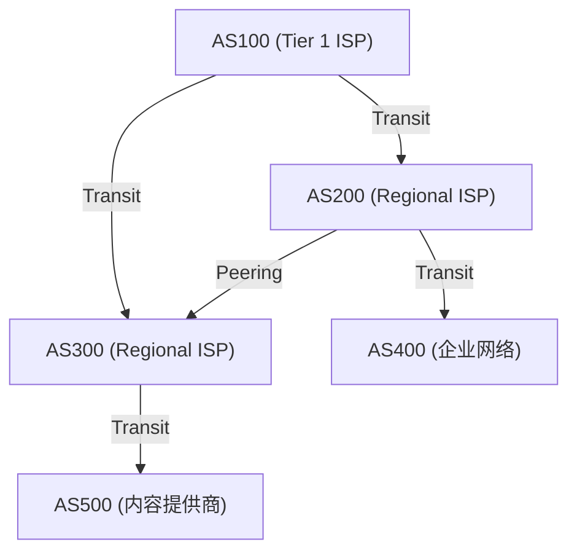

### 对等互联与传输：互联网经济学

通过BGP进行AS间的连接，大致分为两种商业模式：

1. **传输（Transit）**
   小型ISP或企业向大型ISP支付通信费用，从而获得到达互联网所有位置（完整路由，Full Route）的连通性的关系。这相当于“客户”与“提供商”的主从关系。
2. **对等互联（Peering）**
   ISP之间，或者ISP与内容提供商（如Google或Netflix等）通过IX（互联网交换中心，Internet Exchange）等直接相互连接网络的关系。通常是免费（Settlement-free）进行的，目的是抄近路传输流量并降低成本。

### 路径矢量与BGP的路径选择算法

BGP是“路径矢量（Path Vector）型”协议。在到达特定IP网络之前，它会将经过了哪些AS（AS_PATH）作为属性保存。例如，如果路由信息中有 `AS_PATH: [200, 100, 500]`，那么数据包就会按照该顺序通过这些AS。由此，可以确切地防止路由环路。

当BGP路由器收到到达同一目的地的多条路由时，会基于复杂的优先级（本地优先级 Local Preference、AS_PATH长度、MED、eBGP/iBGP的区别等）仅选择一条最佳路径。特别是**本地优先级（Local Preference）**属性非常强大，可以强制路由器执行“在技术上虽然绕远路，但由于通过对等互联线路不需要传输费用，因此优先选择那边”这样的商业策略。

### BGP劫持与路由的脆弱性

BGP最初是基于“性善论”设计的。因为它深信“他人宣告的路由信息是正确的”，所以如果有恶意或配置错误的AS发送了诸如“我拥有到达Google网络（8.8.8.8/32）的最佳路径”这种错误的BGP更新，就会发生全球流量都被吸入该AS的**BGP劫持（BGP Hijacking）**。
历史上，利用BGP脆弱性造成的大规模故障不胜枚举，例如巴基斯坦政府试图屏蔽YouTube却导致全球YouTube宕机的事件（2008年）。目前，正在推进引入RPKI（资源公钥基础设施，Resource Public Key Infrastructure）等使用密码技术的路由信息验证机制。

## 3.6 物理制约与路由器的抗争：延迟与缓冲区膨胀

网络层的路由，始终在与物理学的制约作斗争。
光在光纤中传播的速度约为真空中光速的67%（约20万公里/秒），从日本到美国西海岸的往返（RTT）大约需要100至120毫秒的不可避免的物理延迟（传播延迟）。

除此之外，还存在各路由器的处理延迟，以及**排队延迟（Queueing Delay）**。在网络拥塞时，路由器会将数据包暂时积聚在内存（缓冲区）中。由于近年来的路由器搭载了大容量内存，导致出现了不丢弃数据包而是持续吸收长时间拥塞的现象。这就是**缓冲区膨胀（Bufferbloat）**。大量数据包持续停滞在缓冲区中，导致上层TCP等协议的拥塞控制无法正常工作，最终引发极端延迟（数千毫秒）。为了解决这个问题，现代的路由器和OS中实现了AQM（主动队列管理，Active Queue Management）或FQ-CoDel等高级队列管理算法。

## 总结

第3层网络层并非只是单纯的数据搬运工。这里交织着从IPv4到IPv6的历史性转变、使用TCAM的纳秒级硬件处理、通过OSPF进行的数学上的最短路径搜索、以及通过BGP进行的孕育着经济与政治意图的自治分布式路由控制。
一个IP数据包从你的智能手机到达地球另一端的服务器，其间无数路由器瞬间查阅各自的地图（路由表），像接力棒一样不断传递数据包，这就是人类所构建的最庞大、最复杂系统的运作。

下一章，我们将讲解构建在这一网络层之上、负责保证数据包到达和拥塞控制的“传输层（TCP/UDP）”机制。

# 第4章：传输层的确定性与速度 —— 支撑信息传递的终极困境

## 1. 导论：端到端原则与传输层的使命

我们在前面章节中看到的网络层（IP）的主要任务，是跨越广阔的互联网海洋，将数据包物理上且逻辑上送达到“目标计算机（主机的网络接口）”。然而，数据包仅仅到达目标主机，通信并没有完成。现代计算机系统在OS上同时多任务并行执行着众多应用程序进程（Web浏览器、邮件客户端、视频流应用、后台同步进程、API服务等）。

从IP层无序不断上传的大量数据包中，识别出哪些数据包属于哪个应用程序，并将它们重新构建为有意义的数据流，或者在存在缺失时进行补充。在端点负责这种最终数据管理全权的就是“传输层（Transport Layer）”。

在互联网设计理念的根基中，存在着一个非常美丽且强大的架构决策，即“端到端原则（End-to-End Principle）”。这是由Jerome Saltzer等人于1981年提出的概念，该原则认为“网络的中间节点（路由器和交换机）应尽可能专注于简单的包转发（哑网络），而错误恢复、顺序控制、加密等复杂处理应交由通信末端的主机（智能端点）负责”。如果让网络中的中间设备具备复杂的状态管理或纠错功能，互联网绝不可能获得如今这样全球规模的爆发式扩展性。

传输层始终面临着物理学制约与信息理论之间的一个根本困境。那就是“确定性（Reliability）”与“速度（Speed / Low Latency）”的权衡（Trade-off）。为了毫无遗漏地传递信息，需要确认和重传的开销，这不可避免地会引起受光速这一物理极限限制的延迟。另一方面，如果想要将延迟降至最低，就不得不牺牲一部分信息的完整性。根据如何解决这一植根于物理法则的困境，以及为应用程序提供怎样的抽象，TCP、UDP乃至现代的QUIC等不同协议被设计出来，并不断发展进化。

## 2. TCP（传输控制协议，Transmission Control Protocol）：保障确定性的坚固机制

TCP的基础是在互联网还被称为ARPANET的商业化之前的20世纪70年代，由Vinton Cerf和Robert Kahn奠定的。其设计哲学极其明确：“无论在多么恶劣的网络环境下，即使在频繁丢包的不稳定线路上，也要保证数据无缺失、按正确顺序、不重复地到达对方的应用程序”。它为应用程序开发者提供了一种强大的抽象，只要使用TCP，就完全不必担心背后的网络复杂性或数据包丢失，只需将其作为“连续的字节流”进行读写即可。

### 通过端口号进行多路复用（Multiplexing）
如果说IP地址表示“地球上的哪栋建筑”的地址，那么传输层的“端口号”就相当于表示“那栋建筑里的哪个房间（哪个进程）”的逻辑窗口。端口号用16位无符号整数表示，取值范围为0到65535。
借此，在单一IP地址和单一物理网络接口上，可以同时复用数千至数万个不同的通信。例如，HTTP是80端口，HTTPS是443端口，SSH是22端口，主要服务都被预先分配了作为“知名端口（Well-Known Ports）”的编号。

### 三次握手：建立信任与物理延迟
TCP在开始通信之前，必定要在发送方和接收方之间进行用于建立逻辑“连接（Connection）”的仪式。这就是“三次握手（3-Way Handshake）”。这不仅是简单的通信意愿确认，对于即将开始的庞大数据的交互来说，它还具有同步状态空间（Synchronization）的极其重要的意义。

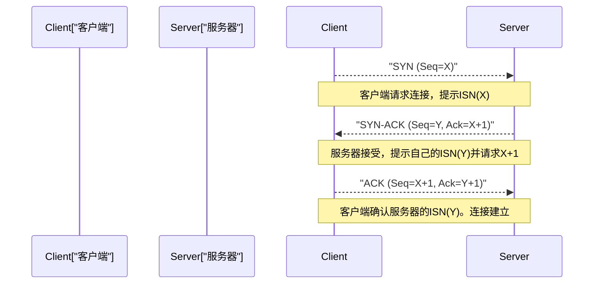

1. **SYN (Synchronize):** 客户端向服务器发送同步请求包（设置了SYN标志的TCP段）。此时，会提供随机生成的32位“初始序列号（ISN: Initial Sequence Number，这里设为X）”。ISN不从零或固定值开始是有原因的。这是为了防止将在过去建立且已断开的相同IP和端口之间的通信中“在网络上迷路延迟到达的旧数据包（幽灵数据包）”误认为新通信的数据包，同时具有防止攻击者猜测序列号以插入伪造数据的TCP序列预测攻击（IP欺骗）的密码学意义。
2. **SYN-ACK:** 服务器接受连接请求后，将客户端的ISN加1的值（X+1）作为“确认号（Acknowledgment Number）”返回，同时附带服务器自身随机初始序列号（Y）的SYN-ACK包。
3. **ACK (Acknowledgment):** 客户端作为正确接收服务器ISN的凭证，发送将Y+1作为确认号的ACK包。

这3次数据包的交互完成后，将在内存中确保双向的通信状态，数据传输准备就绪。然而，这一严格的过程受到通信基础设施物理限制的沉重压力。那就是“光的速度”。
真空中光速约为30万公里/秒，但由于互联网主要骨干网光纤核心（石英玻璃）的折射率，光信号传播速度降至其约三分之二（约20万公里/秒）。此外，还要加上途中路由器的路由处理或交换引起的排队延迟。结果，例如东京与纽约之间（直线距离约11000公里，实际电缆长度更长）往返一次的时间（1 RTT: Round Trip Time）在物理上无论如何都需要150至200毫秒。TCP的三次握手至少要消耗这个1 RTT，因此无论如何扩大带宽（Bandwidth），连接建立时的延迟（Latency）都受到光速这一宇宙绝对法则的制约。

### 滑动窗口与顺序控制、校验和
进入数据传输阶段后，TCP将从应用程序接收到的字节流分割成适当大小（MSS: Maximum Segment Size，通常为IP的MTU减去头部大小约1460字节左右）的段进行发送。每个段都分配有与数据字节数相对应的序列号，接收方据此即使在数据包顺序颠倒到达（乱序，Out-of-Order）时，也能将原始数据按正确顺序重新排列。

另外，TCP头部包含16位的“校验和（Checksum）”，使用反码求和运算严格验证数据是否因传输路径上的电气噪声或路由器的内存错误等发生比特翻转（损坏）。

如果数据包在途中丢失（丢包）或损坏被丢弃，接收方将持续返回期望序列号的ACK（重复ACK）或什么都不返回。发送方在一定时间（RTO: Retransmission Timeout）未收到ACK，或检测到重复ACK时，将“重传（Retransmit）”该数据包。

在这一机制中剧烈提升通信速度的概念是“滑动窗口（Sliding Window）”。“发送1个包，收到其ACK才发送下一个包（停等协议，Stop-and-Wait）”的方式，在上述高延迟环境（RTT较大的环境）下吞吐量会绝望般地降低。
在滑动窗口方式中，发送方和接收方考虑彼此的缓冲容量，动态协商“窗口大小（一次可发送的未确认数据的最大字节数）”。发送方无需等待接收方的ACK，就可以在这个窗口大小的范围内连续向网络发送数据包。每当收到ACK，这个可发送范围（窗口）就会向前滑动。通过这种方式，实现了在粗管道且高延迟网络（BDP: Bandwidth-Delay Product，带宽延迟积大的环境）中“持续用数据填满管道”的最大化利用带宽的机制。

### 拥塞控制（Congestion Control）：防止网络崩溃的数学和谐
TCP真正的杰作，可以说也是互联网历史上最重要的技术突破之一，就是“拥塞控制（Congestion Control）”。

1986年，早期的互联网（NSFNET）因通信量激增面临了被称为“拥塞崩溃（Congestion Collapse）”的致命系统故障。超出网络处理能力的数据流入导致路由器队列（缓冲内存）溢出，大量数据包被丢弃。检测到丢包的TCP端点认为数据未到达，便一齐“重传”数据包。结果更多的网络数据注入，路由器更加瘫痪，实际吞吐量急剧下降至以前的几千分之一，陷入了毁灭性的恶性循环。

为了防止这种网络死亡，1988年Van Jacobson等人将高级动态控制算法引入了TCP。其核心是基于“AIMD（Additive Increase Multiplicative Decrease：加法增加乘法减少）”原则的拥塞窗口（cwnd: Congestion Window）控制。

1. **慢启动 (Slow Start):** 通信开始后，完全不知道网络的空闲容量。因此，发送窗口大小从极小的值（历史上为1 MSS，现代约10 MSS）开始，每收到1个ACK窗口大小增加1 MSS。这导致“每1 RTT窗口大小翻倍”的指数级增加。与其“慢”之名相反，这是极具攻击性地在短时间内探索极限带宽的阶段。
2. **拥塞避免 (Congestion Avoidance):** 当窗口大小达到预设阈值（ssthresh: Slow Start Threshold）时，停止指数级增加，切换为线性增加（每1 RTT增加1 MSS）。这是更加谨慎地探索网络极限容量（管道粗细）的阶段。
3. **丢包检测与乘法减少:** TCP将丢包（发生超时，或连续3次收到接收方的重复ACK）不仅仅解释为简单的传输错误，而是“网络路径上发生拥堵（拥塞），数据包从路由器缓冲区溢出的信号”。就在这一瞬间，TCP立即发挥自我控制，将发送窗口大小一下子锐减一半（或慢启动初始值）。

这种“一点点分享带宽（加法增加），发生问题时一下子让步（乘法减少）”的数学和利他主义的分布式算法，使得互联网上数亿、数十亿计的独立TCP连接在没有中央流量管理者的前提下，保持着“带宽的公平分配”和“整个网络稳定运行”这一奇迹般的和谐（稳态）。

近年来，路由器缓冲内存的大容量化适得其反，在因拥塞导致数据包丢弃之前，数据包持续停滞在变长的队列中，延迟（Ping值）飙升至数百毫秒到几秒，出现了“缓冲区膨胀（Bufferbloat）”这一新的物理现象问题。为了应对这个问题，Google等人开发了不将丢包而是“RTT（延迟时间）增加”作为拥塞信号来检测，在缓冲区溢出前主动限制发送速度的BBR（Bottleneck Bandwidth and Round-trip propagation time）等最新的拥塞控制算法，正逐渐成为现代TCP的标准。

## 3. UDP（用户数据报协议，User Datagram Protocol）：为了速度的削减

如果TCP是通过复杂状态转换和高级算法来保证数据完全确定性的“过度保护的管理者”，那么同属传输层的UDP就是把协议作用削减到极致的“极简的搬运工”。Jon Postel于1980年设计的UDP，只有传输层最低限度的功能。

UDP的头部仅有8字节（TCP头部通常为20字节，包含选项最大可达60字节）。其中仅包含“源端口号”、“目标端口号”、“数据长度”以及用于检测数据损坏的简单的“校验和”。

无论是三次握手事先建立连接，还是通过序列号保证顺序，或是基于滑动窗口的流量控制，重传处理，以及为了保护网络的拥塞控制，在UDP中都没有实现。它只是将应用程序交给它的数据直接包装进IP数据报扔进网络层，采取“射后不理（Fire and Forget）”的方式发送而已。甚至不关心对方是否收到。

但是，这种可以说不负责任的结构上的简单性，正是UDP最大的武器，也是在特定用例中凌驾于TCP之上的原因。

### UDP的真谛：延迟至上主义与实时通信
在必须将物理延迟降至极限的实时通信中，TCP“为了保证确定性的重传控制”反而会引发致命问题。

例如，想象一下FPS（第一人称射击游戏）等在线游戏，语音通话（VoIP），或视频会议系统（Zoom，WebRTC等）。在这些应用程序中，以1秒几十到几百次的频率发送最新位置信息或音频样本数据包。
如果使用TCP，假设100毫秒前发送的音频数据包在途中的路由器中丢失。TCP会检测到丢失并重传数据包，接收方试图以正确的顺序进行播放。然而，在对话和游戏实时进行的环境中，“晚了几百毫秒到达的过去数据”已经毫无价值。
不仅如此，TCP在重传丢失数据包并恢复顺序之前，会停止处理（移交至应用程序）已到达的后续新数据包，并将其缓冲起来。这被称为“队头（HoL, Head-of-Line）阻塞”。语音断断续续，或者游戏画面卡住几秒后一下子快进的现象，很多都是由于TCP等待重传造成的HoL阻塞引起的。

在这种情况下，UDP可以干脆放弃丢失的过去数据包，让应用程序能够立即处理正在到达的最新数据包。在实时通信中，“就算有一些噪音或掉帧，也要以最短延迟持续描绘最新状态”比“所有数据都凑齐”对于人类的感官来说是一种自然得多的、舒适的用户体验。

此外，像DNS（域名系统）的名称解析或NTP（网络时间协议）的时间同步这样“1个小请求包”对应“1个响应包”即可完成的简单事务通信，完全没有握手开销的UDP也是最合适的。

## 4. QUIC：互联网通信的范式转换与下一代协议

从互联网的黎明期开始的几十年里，我们的网络架构一直被固定化的二元论所束缚：“想要可靠流传输就用TCP，想要速度和实时性就用UDP”。然而，随着现代Web的急剧进化（特别是移动通信的普及和在HTTP/2时代并行加载大量资源），TCP本身的设计越来越暴露出其作为枷锁的局限性。

其中最大的课题，就是在UDP章节中也提到的TCP特有的“队头 (HoL) 阻塞”，以及与建立连接相伴随的“过量延迟”。
TCP将所有通信作为“单一的串行字节流”进行管理。为了显示最新的网站，假设在HTTP/2上同时（多路复用）请求HTML、CSS、JavaScript、几十张图片等多个文件。但是，在底层的TCP层面只有一条流，如果仅仅“图片A”的包丢失了一个，TCP层在完成那个包的重传之前，甚至会在OS内核级别阻塞应当毫不相关的“脚本B”或“图片C”的包传递。
此外，现代Web必须使用加密（TLS/HTTPS），但传统的协议栈在完成“TCP三次握手（1 RTT）”之后，又要再次进行“TLS加密密钥交换握手（1至2 RTT）”，所以在实际开始安全的数据发送前，消耗了2到3 RTT这样巨大的物理延迟。

为了解决这些根本问题，为现代互联网基础设施带来范式转换，Google主导开发、并由IETF（互联网工程任务组）标准化的下一代传输协议就是“QUIC（快速UDP互联网连接，Quick UDP Internet Connections）”。而以QUIC作为底层协议重新定义的Web标准则是“HTTP/3”。

### 中间盒的僵化与逃脱至用户空间
QUIC最具革命性的方法，在于其大胆的架构设计：**“在现有的UDP数据包之上，在用户空间中重建了一个集成了加密和多路复用的全新传输层”**。

为什么不改进TCP，而是在UDP上创建呢？互联网上无数的路由器、防火墙、NAT等“中间盒（Middleboxes）”，经过多年的运作，已经僵化到对于除TCP和UDP以外的新协议（新协议号）不由分说当作“未知威胁”丢弃（这被称为互联网的Ossification：僵化现象）。另外，TCP的实现被硬编码在Windows和Linux等OS内核（核心）深处，要升级全世界的OS以普及新算法需要耗费极其漫长的岁月。
因此QUIC采取了这样一种策略，在中间盒看来只是“传统的UDP数据包”从而通过它，而在浏览器或应用程序（用户空间）的内部，独家地在更高层次上实现TCP的优秀部分（拥塞控制和重传控制）。

### QUIC的革命性机制与超越物理限制

1. **通过流独立性彻底消除HoL阻塞：**
   QUIC不是单一的数据包流，而是具有在协议级别管理多个逻辑“独立流”的功能。以刚才的例子来说，即使图片A的数据包在途中丢失，QUIC仅暂停图片A的流以等待重传，脚本B和图片C的流则丝毫不受影响并继续并行处理。因此，在频繁发生丢包的移动网络等环境中，网页的显示速度显著提高。
2. **0-RTT（零RTT）连接建立与加密的集成：**
   QUIC从一开始就将相当于TLS 1.3的加密深深地集成在了协议中。它没有犯像TCP那样将“传输层连接”和“加密层连接”分开的愚蠢错误。即使是第一次通信的服务器，也仅需1 RTT即可完成连接和加密密钥交换。更具革命性的是，对于过去通信过的服务器（持有缓存的会话票据的服务器），可以实现“0-RTT”，即**无需等待握手，就能与发送第一个数据包同时开始HTTP请求**。这是从协议设计角度，针对“光速延迟”这一物理限制做出的极其精彩的回答。
3. **连接迁移（不依赖IP地址）：**
   传统的TCP连接受到“源IP、源端口、目标IP、目标端口”四个要素（4元组）的强烈约束。因此，当用户带着智能手机走到室外，从Wi-Fi环境切换到4G/5G的蜂窝网络，IP地址发生变化的瞬间，TCP连接就会断开，需要从耗时的握手重新开始。
   相比之下，QUIC不是通过IP地址，而是通过开始通信时生成的唯一“连接ID（Connection ID）”来管理各个连接。因此，即使物理IP地址或网络接口动态发生变化，只要连接ID相同，视频流传输或大容量文件的下载就能实现毫不中断的无缝继续。在移动通信成为主角的现代，可以说这是一种极度强大且必然的特性。

## 5. 结语：统御混沌的协议演进与秩序构建

传输层在不断变动、路由频繁切换、丢包和乱序如家常便饭的互联网网络层（IP）的混沌（Chaos）之上，建立起了应用程序能够安心使用的“坚固的逻辑秩序”。

由Vinton Cerf和Van Jacobson等人设计并打磨的TCP坚固的数学模型和拥塞控制，至今仍保护着互联网的骨干网免遭崩溃，持续支撑着全球的数据传输。而UDP的简单性则回应了追求物理延迟极限的实时通信的需求。不仅如此，为了克服这两者的局限性，融合了加密和多路复用，为现代移动环境优化而诞生的QUIC协议，其架构更是精妙。

这些全都是人类不懈的技术探索结晶，其核心命题是“在相隔遥远的计算机之间，在有限带宽和光速壁垒等物理制约下，如何将信息准确且迅速地送达”。

当数据包按正确的顺序重新排列好，终于作为有意义的数据块交到应用程序手中时，单纯的电信号排列才终于开始具有作为“信息”的价值。下一章中，我们将深入这一建立在传输层提供的坚固基础之上，直接塑造我们日常接触的Web世界的“应用层（HTTP、DNS等）”机制的深渊。
# 第5章：应用层与Web的幕后 —— 从域名解析到加密通信的深渊

在前面的章节中，我们从物理层的行为（如在光纤中全反射前进的光子和在铜线中传播的电磁波）开始，深入探讨了通过IP进行的数据包路由，以及通过TCP/UDP在传输层实现的数据传输可靠性。在本章中，我们将终于涉足人类直接接触的领域，即“应用层”。

在OSI参考模型中的第7层（应用层）、第6层（表示层）和第5层（会话层），在现代的TCP/IP分层模型中通常被合并为单一的“应用层”来讨论。应用层位于抽象的最高层，是一个由各种协议交织而成的复杂生态系统。在这里，我们将从历史背景、网络工程学以及高级数学视角的极限出发，深度剖析从在浏览器地址栏输入URL到网页显示出来这一过程中在幕后活跃的机制，包括通过DNS进行的域名解析、通过HTTP进行的资源传输，以及现代互联网不可或缺的SSL/TLS加密机制。

## 5.1 DNS（Domain Name System）：分布式层次数据库的奇迹与谱系

IP地址（IPv4中的32位数字，IPv6中的128位数字）非常适合路由器和交换机等网络设备构建用于转发数据包的路由表，但完全不适合人类直观地记忆、赋予意义并进行处理。

在互联网的前身ARPANET的黎明期，主机名和网络地址的映射是通过极其原始的方法来管理的。斯坦福研究所（SRI）的网络信息中心（NIC）集中管理着一个名为 `HOSTS.TXT` 的单一文本文件，每个节点在夜间通过FTP下载该文件并更新其本地系统。然而，进入20世纪80年代后，随着连接到网络的主机数量开始呈指数级爆炸性增长，这种集中式模型暴露出了流量瓶颈、更新延迟以及名称冲突（命名空间枯竭）等致命的局限性。

为了打破这种可扩展性危机，保罗·莫卡佩特里斯（Paul Mockapetris）于1983年设计并提出了DNS（Domain Name System，域名系统），并被定义为RFC 882和RFC 883。DNS架构的本质是一个全球分布式的层次型键值（Key-Value）存储。为了消除单点故障并实现近乎无限的扩展性，该系统采用了一种划时代的分布式范式：将域名空间划分为树状结构，并委派（Delegation）各自的管理权限。

### 域名解析的无尽之旅：从存根解析器到权威服务器

当用户在浏览器的多功能框（Omnibox）中输入 `https://www.example.com` 的瞬间，OS内部的存根解析器（Stub Resolver）就会启动，并在后台拉开一场宏大的“域名解析之旅”的帷幕。这一过程也是如何规避网络延迟这一物理定律限制的连续缓存策略。

1. **多级缓存查询**: 首先，会检查延迟最低的本地浏览器缓存。接着查询OS的DNS缓存，然后是本地网络上路由器的DNS缓存。克服光速（在真空中约为每秒30万公里，在光纤中约为其三分之二）物理限制的最有效手段，就是从一开始就不产生网络通信。
2. **向递归解析器（全解析器）发送查询**: 如果本地不存在缓存，查询将被发送到由ISP或公共DNS提供商（如Google的 `8.8.8.8` 或Cloudflare的 `1.1.1.1` 等）运营的递归解析器（Recursive Resolver / Full Resolver）。该解析器将代替客户端承担域名解析的整个过程。
3. **向根服务器（Root Server）进行迭代查询**: 如果全解析器的缓存中也没有相应的记录，全解析器将向位于域名层次结构绝对顶点的“根服务器”进行查询。目前世界上存在从A到M的13个根服务器集群。根服务器并不直接知道 `www.example.com` 的IP地址，而是响应（Referral：委派响应）管理 `.com` 这个TLD（顶级域名）的名称服务器列表。此外，散布在全球的根服务器通过“任播（Anycast）”路由技术共享IP地址，并通过BGP（边界网关协议）的路径选择，将流量自主引导至物理上和网络拓扑上距离客户端最近的服务器。
4. **向TLD服务器进行迭代查询**: 接下来，全解析器向被引荐的 `.com` TLD服务器群中的一个发送查询。TLD服务器会返回被委派了 `example.com` 管理权限的权威（Authoritative）DNS服务器（名称服务器）的IP地址（NS记录）。
5. **向权威DNS服务器查询并获取记录**: 最后，全解析器直接访问 `example.com` 的权威DNS服务器。权威服务器的区域文件（Zone File）中记录着最终答案，即 `www` 的A记录（IPv4地址）或AAAA记录（IPv6地址），亦或是CNAME记录（别名），这些记录将通过全解析器返回给客户端的存根解析器。

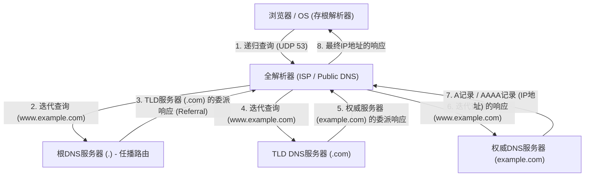

这种复杂的层次型往返通信通常在短短几毫秒到几十毫秒的转瞬之间完成。DNS作为传输层协议，主要使用UDP端口53。通过完全消除TCP的三次握手（SYN、SYN-ACK、ACK）往返开销，实现了极限的延迟降低。然而，当DNS响应有效载荷超过历史上的UDP限制512字节（通过EDNS0扩展，现在可以更大）时，或者在进行旨在防止DNS缓存投毒攻击的密码学数字签名扩展DNSSEC（DNS Security Extensions）的密钥验证时，亦或是进行区域传输（AXFR）时，规定必须回退到高度可靠的TCP端口53。

## 5.2 HTTP架构与协议的进化论

通过DNS获取目标服务器IP地址后，浏览器接下来会与目标服务器（端口80或443）建立TCP连接，并开始使用应用层的主要语言HTTP（超文本传输协议）进行对话。

HTTP由欧洲核子研究中心（CERN）的蒂姆·伯纳斯-李于1989年构想，最初是一个极其简单的协议，旨在让世界各地的物理学家能够通过网络高效地共享研究文档（超文本）并通过链接将它们连接起来。其基于文本的清晰结构——请求行（方法、URI、协议版本）、头部字段、空行（CRLF）和消息体——有力地推动了系统的调试与普及。

HTTP根本的设计思想和最大特征是“无状态（Stateless）”。服务器在内存中不保留客户端过去请求的任何状态或上下文。每个请求都作为完全独立的事务来完成。这种与REST（表述性状态转移）架构相通的无状态性，极大地简化了服务器的实现，使得为了处理庞大流量而在水平方向上增加服务器数量的横向扩展（负载均衡）变得容易。负载均衡器无论将请求分配给哪个后端服务器，都能保证相同的结果。然而，在电子商务网站的购物车功能或维持用户登录状态等不可避免需要进行状态（State）管理的现代交互式Web应用程序中，这种严格的无状态性成了一个巨大的限制。为了在协议之外克服这一问题，人们发明了通过HTTP头部让客户端保存状态的Cookie，以及基于会话令牌的伪状态管理机制。

### 与物理限制的斗争：从HTTP/1.1到HTTP/3的范式转变

随着Web的爆炸性普及以及单一页面中包含的资源（如图像、CSS、JavaScript文件等）的日益庞大，HTTP面临着网络物理定律（光速带来的延迟限制和数据包丢失）的挑战，并在协议层面实现了架构的剧烈演进。

- **HTTP/1.1 (1997年 - )**: 在最初的HTTP/1.0中，每请求一个资源都要重复建立和断开TCP连接（三次握手和四次挥手），从延迟的角度来看效率极低。HTTP/1.1标准化了持久连接（Persistent Connection / Keep-Alive），通过使单一TCP连接可被重用，极大地降低了连接成本。然而，HTTP/1.1的管道化（Pipelining）技术由于实现困难和中间代理的兼容性问题并未普及，并且存在名为“队头阻塞（Head-of-Line, HoL Blocking）”的致命结构缺陷。这是指在单一TCP连接上，当服务器正在处理一个巨大的资源或繁重的请求时，后续的请求会堵塞在队列中，导致整体延迟恶化的现象。为了规避这个问题，浏览器不得不依赖于向同一域名同时发起多个TCP连接（通常约为6个连接）这种暴力的黑客手段（如域名分片等）。
- **HTTP/2 (2015年 - )**: 基于Google开发的SPDY协议标准化的HTTP/2，从架构的根本上将协议从基于文本刷新为“基于二进制分帧”。最重要的创新是“流的多路复用（Multiplexing）”。在HTTP/2中，可以在单一的TCP连接内创建多个虚拟的“流”，将请求和响应的数据分割成微小的二进制帧，并能无序地交错（Interleave）发送。由此，应用层中的队头阻塞（HoL Blocking）被完全消除。此外，通过使用HPACK算法的头部压缩机制（静态哈夫曼编码与动态表的结合），大幅减少了每次请求中重复发送的冗余Cookie和User-Agent等数据的传输量，将网络带宽的利用效率提升到了极限。
- **HTTP/3 (2022年 - )**: 尽管HTTP/2出色地解决了应用层的队头阻塞问题，但在底层传输层（TCP）中，“丢包时的队头阻塞”这一物理壁垒依然存在。为了保证可靠性，TCP只要在途中丢失哪怕一个数据包，就会停止将该TCP连接上所有流的数据包交付给应用层，直到重传完成为止（TCP顺序保证机制带来的弊端）。为了打破这个问题，HTTP/3抛弃了数十年来作为互联网基石的TCP，进行了一次剧烈的范式转变：采用了基于UDP的新型传输协议“QUIC（Quick UDP Internet Connections）”。QUIC避开了因TCP在OS内核空间中实现而导致的进化迟缓，在可以在用户空间中实现的UDP上层，融入了独有的重传控制、拥塞控制以及针对每个流独立的流量控制。即使发生丢包，受影响的也仅是该特定的流，其他流能够不受阻塞地继续处理。此外，QUIC整合了连接建立的握手与加密（TLS 1.3）的握手，使其能够与过去有过通信记录的服务器以“0-RTT（零往返时间）”开始发送加密数据。面对物理光速的极限（与地球另一端的通信无论如何都会产生数百毫秒的延迟），这是通过在协议层彻底削减通信往返次数（RTT）以追求极致性能的结果结晶。

## 5.3 加密与信任机制：SSL/TLS的数学深渊与证明逻辑

互联网本质上是一个开放的数据包通信网络，数据通过无数的路由器和海底光缆，以接力传递的方式被转发到目的地。该路径上的任何节点（中间路由器、恶意的ISP，或者同一Wi-Fi网络上的窃听者）在物理上都有可能通过数据包抓取来拦截甚至篡改通信内容。利用高级数学的力量将这种网络的绝对脆弱性封印，并建立安全通信通道的，正是SSL（Secure Sockets Layer，安全套接层）及其后继者TLS（Transport Layer Security，传输层安全性）协议。

TLS在现代Web通信中保证的是以下“安全的三大支柱”：
1. **机密性（Confidentiality）**: 即便通信内容被第三方窃听也无法被解密。
2. **完整性（Integrity）**: 数据在通信路径上连1比特都未被篡改。这由MAC（消息认证码）或AEAD（关联数据的认证加密）来担保。
3. **认证（Authentication）**: 通信对象是合法域名的所有者（真实的服务器）。

实现这些目标的技术，是人类几个世纪以来不断构建，特别是在第二次世界大战后随着计算机科学和数论的发展而实现飞跃的密码学理论的结晶。

### 密钥交换与公钥密码学：离散对数问题与因数分解的壁垒

最简单且处理速度最快的加密方式是“对称密钥加密（Symmetric Cryptography）”（目前的标准是AES：高级加密标准）。这是一种发送者和接收者使用相同的“共享密钥”进行加密和解密的方法。由于数学处理较轻量（比特的XOR运算、替换和置换的组合），它非常适合对千兆级别的通信进行实时加密。然而，对称密钥加密存在一个根本性的悖论（密钥分发问题）：“在开始通信之前，如何安全地将那个秘密的共享密钥本身传递给对方”。在互联网这样与事先没有信任关系的对手进行通信的环境中，如果直接发送共享密钥，密钥在途中就会被窃听，加密也就失去了意义。

人类历史上密码学领域的最大突破，是1976年由惠特菲尔德·迪菲和马丁·赫尔曼发表的密钥交换算法，以及1977年由RSA（李维斯特、萨莫尔、阿德曼）等人发明的“公钥加密（Asymmetric Cryptography，非对称加密）”。

公钥加密的底层存在着数学上的“单向函数（One-way function）”或“陷门单向函数（Trapdoor one-way function）”概念。它利用了这样一种不对称性：“某一方向（加密）的计算在计算机上瞬间即可完成，而反方向（解密或推测密钥）的计算，即使将全世界的超级计算机连接起来持续计算到宇宙的寿命终结也无法完成”。

- **RSA加密**: 基于这样的性质：将两个非常大的质数（$p$和$q$）相乘得到一个巨大的合数（$N = p \times q$）很容易（可在多项式时间内计算），但如果只给出那个巨大的合数 $N$，要推导出原始的质因数 $p$ 和 $q$（大整数因数分解问题）则极其困难（目前只知道亚指数时间算法）。它利用欧拉函数和费马小定理等数论的深奥性质，构建了一个数学上的陷门，使得用公钥加密的数据，只有拥有配对私钥的人才能解密。
- **椭圆曲线密码学（ECC: Elliptic Curve Cryptography）**: 作为目前TLS主流的ECC，应用了定义在有限域上椭圆曲线（例如，满足 $y^2 = x^3 + ax + b$ 这类方程式的点集）上的“离散对数问题”的困难性。它对椭圆曲线上的点定义了“加法”和“标量乘法”等几何操作。将某个起点 $G$ 加上秘密的次数 $k$ 次从而求得点 $P = kG$ 是很容易的，但从公开的点 $G$ 和 $P$，反算加了多少次的秘密系数 $k$（离散对数），则比RSA的因数分解还要困难得多。因此，ECC能够以仅为RSA几分之一的极短密钥长度（例如，用ECC 256bit即可实现与RSA 2048bit同等的安全性）提供同等甚至更高的加密强度，从而大幅节省了CPU负载和网络带宽。

### TLS握手：构建信任的密码学仪式

在开始基于HTTPS的安全通信时，客户端和服务器会生成用于对称加密的安全“会话密钥”，并执行高级的协商协议来认证对方的身份。这就是TLS握手。以下是对作为最新标准且被删减了所有冗余至极限的“TLS 1.3”中1-RTT握手的剖析。

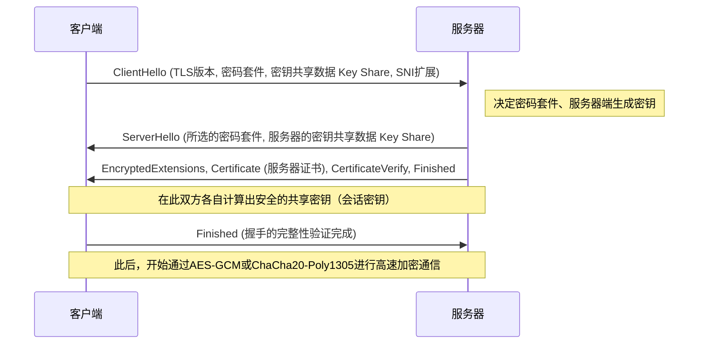

1. **ClientHello**: 客户端在开始连接时，向服务器发送其支持的TLS版本、加密算法列表（Cipher Suites），以及用于生成加密密钥的初始数学参数（Key Share）。此外，利用SNI（Server Name Indication，服务器名称指示）扩展，以明文形式发送所连接的主机名（例如：`www.example.com`）。对于在单一IP地址上运行多个HTTPS域名的服务器（虚拟主机）而言，这是选择并返回正确证书所不可或缺的信息。
2. **ServerHello**: 服务器从客户端的列表中选择最强大、最适合的加密算法（例如：`TLS_AES_256_GCM_SHA384`），并连同自身的Key Share数据一起响应。
3. **发送证书与签名（Authentication）**: 服务器发送自身的“数字证书（X.509）”。此外，服务器使用与该证书绑定的“私钥”，针对迄今为止所有握手消息的哈希值创建数字签名（CertificateVerify）并发送。由此，在数学上证明了服务器是该证书的合法所有者（私钥的持有者）。
4. **密钥交换（Ephemeral Elliptic Curve Diffie-Hellman: ECDHE）**: 客户端和服务器将互相发送接收的Key Share（公开的椭圆曲线上的点），与只存在于自己手中的秘密参数进行数学乘法运算。令人惊叹的是，凭借Diffie-Hellman密钥交换的数学性质（$ (g^a)^b = (g^b)^a = g^{ab} $），在不让任何秘密信息在网络上流通的情况下，客户端和服务器端宛如魔法般合成出了完全相同的强“主密钥（共享密钥）”。
5. **前向安全性（Perfect Forward Secrecy: PFS）**: TLS 1.3一个极其重要的特征在于，用于此密钥交换的参数（Key Share）在每次建立会话时都是一次性且新生成的（Ephemeral，临时的）。因此，万一服务器用于长期身份证明的私钥（RSA或ECDSA密钥）在数年后泄露给攻击者，要在数学上追溯并解密过去被记录、保存的加密通信数据包也是完全不可能的。过去通信的机密性在未来得到了担保。

### PKI与信任链（Chain of Trust）：数字世界的护照

在到目前为止的加密机制中，还遗留了一个致命的逻辑漏洞。那就是：“客户端如何确信服务器发来的证书和公钥，真的属于该目标域名（例如银行的网站）的真身？”这个问题。
如果控制网络路径的恶意中间人，伪装成服务器并将自己伪造的证书和公钥发送给客户端，实施“中间人攻击（Man-in-the-Middle Attack）”的话，密钥交换和加密本身在数学上会完美成功。然而，被加密通信的对象就不再是目标银行，而是攻击者了。

解决这一根本性认证难题的社会与技术框架，就是PKI（Public Key Infrastructure：公钥基础设施）以及作为信任锚点（Trust Anchor）的“证书颁发机构（CA：Certificate Authority）”的存在。

服务器的所有者会创建一个包含自己公钥的CSR（证书签名请求），并将其提交给如DigiCert、GlobalSign或Let's Encrypt等可信赖的第三方机构，即CA。CA在验证申请者确实拥有该域名的所有权（域名认证、企业实体认证等）后，使用CA自身强大的“私钥”，对服务器的公钥信息施加“数字签名”，并将其作为服务器证书发行。

另一方面，在Windows或macOS等操作系统，以及Chrome或Firefox等浏览器中，预先硬编码并内置了经过全球范围内严格审计的根CA的“根证书（公钥）”群，作为信任的基点（Trust Anchor）。

当客户端收到来自服务器的证书时，会使用操作系统内置的根CA公钥，对证书上附加的CA数字签名进行密码学验证。如果签名验证成功，就证明该证书所记载的内容（域名和公钥）得到了CA的保证，并且没有被篡改。

1. 客户端无条件地信任根CA（预先安装到信任存储中）。
2. 根CA信任中间CA，并为其签名。
3. 中间CA信任终端实体（Web服务器），并为其签名。

正是通过这种被称为“信任链（Chain of Trust）”的传递关系，我们才得以与物理上遥远的未知服务器之间，动态且瞬时地构建起坚固的信任关系，并建立起安全的加密通信通道。

## 结论：层级的融合与迈向下一境界

在第5章中，我们详细剖析了在应用层深渊中展开的域名解析、数据请求与响应协议，以及包裹这一切的加密数学面纱。
DNS作为互联网庞大的分布式地址簿发挥作用，HTTP确立了作为资源搬运工的架构，而TLS则用最前沿密码学理论的铠甲对其进行坚固守护。虽然它们在历史上被设计为独立的协议层级，但在现代Web中，正如HTTP/3的QUIC所展现的那样，传输层、应用层与加密层的边界正在紧密融合，不断进化为打破物理延迟极限、同时追求极致性能与安全的洗练形态。

在下一章中，我们将进一步潜入更深层次的技术深渊——“后端系统的内部结构与分布式计算”，探讨通过这道坚固的加密通信屏障到达服务器端的请求，究竟是如何生成动态内容，并与背后的数据库系统进行交互的。

# 第6章：支撑互联网的物理基础设施——光、热与海交织的巨大机构

互联网常常被描述为“云”这样一种没有实体的抽象概念。我们从智能手机或电脑发送的数据，仿佛通过看不见的电波或线缆被吸入了“天上某处”的存储器中，这让人产生一种错觉。然而，互联网的实际形态绝不像云彩那般轻盈。它是极其厚重、物质化，被热力学、光学以及地球物理学定律牢牢束缚的，毋庸置疑是人类历史上最庞大的物理基础设施。

在本章中，我们将对将这层“不可见的网络”具现化到物理世界的三大支柱——作为全球规模神经网络的“海底光缆”、承担数据存储与运算的热力学处理设施“超大规模数据中心”、以及打破光速壁垒压缩时空的“CDN（内容分发网络）”——从其物理机制、历史背景以及追求极致的专业技术视角进行彻底剖析。

---

## 1. 包裹地球的光之神经网络：海底光缆系统

目前，约99%的跨国国际互联网通信并不依赖于在太空中飞行的卫星，而是通过铺设在海底、直径仅几厘米的“海底光缆（Submarine Communications Cable）”进行的。当我们浏览海外网站时，其数据正以光速在数千米深海漆黑的黑暗中飞驰。

### 1.1 从电报到光纤的进化与对香农极限的挑战

海底光缆的历史远比互联网的诞生要古老得多，可以追溯到1850年在英吉利海峡之间铺设的电报电缆。1858年铺设了第一条横跨大西洋的电报电缆，但当时使用的是摩尔斯电码通信，维多利亚女王发给美国总统布坎南的信息耗费了十几个小时才传送完毕。此后，经历了使用同轴电缆的模拟电话线路时代，从20世纪80年代后半期开始引入了光纤电缆。1988年铺设的第一条横跨大西洋光通信电缆“TAT-8”的容量为280 Mbps（相当于约4万条电话线路），这在当时已经是革命性的带宽了。

现代的海底光缆单根就拥有数百Tbps（太比特每秒）这种超乎想象的通信容量。实现这种飞跃性进化的，是“波分复用（WDM: Wavelength Division Multiplexing）”和“掺铒光纤放大器（EDFA: Erbium-Doped Fiber Amplifier）”这两项诺贝尔奖级别的物理学与工程学突破。

WDM是一种将不同波长（颜色）的光在同一根光纤中复用并同时发送的技术。因此，每根光纤的传输容量会随着波长的数量呈乘数级增加。然而，无论作为光纤材料的石英玻璃纯度被提高到何种极限，光信号在前进数百公里的过程中，也会因瑞利散射和红外吸收而衰减。因此，就需要每隔几十公里到一百公里设置中继器（Repeater）。

过去的中继器需要执行将衰减的光信号先转换为电信号，放大后再转换回光信号这样复杂且受到诸多限制的过程（O-E-O转换）。但是，20世纪90年代实用化的EDFA，通过在光纤的纤芯中掺入稀土元素铒，并向其照射被称为泵浦光的强激光束，使得直接在“光的状态下”放大光信号成为可能。这使得能够批量放大不同波长的多个光信号，通过与WDM技术结合，通信容量实现了爆炸式增长。

目前，在通信工程领域，正逐渐逼近克劳德·香农提出的信道容量理论极限——“香农极限（Shannon Limit）”。为了超越这一极限，在单一光纤内设置多个纤芯的“多芯光纤（Multi-Core Fiber）”，以及复用光的空间模式的“空分复用（SDM: Space Division Multiplexing）”等下一代物理层技术已开始被研究与实现。

### 1.2 深海物理环境与缆线铺设工程学

海底光缆的铺设是现代最严酷的工程项目之一。长达数千公里的光缆，使用专用的“海缆铺设船（Cable layer）”逐渐沉入海底。

在铺设之前，会使用测深仪精密绘制海底地形图，并选定避开海底山脉、海沟、热液矿床以及存在滑坡危险海域的最佳路线。光缆的结构根据铺设的水深会有极大的不同。

在水深较浅的大陆架等海域（水深约1000至1500米以内），因渔船的底拖网、船舶的锚，甚至鲨鱼等海洋生物咬噬而导致物理切断的风险极高。因此，在保护光纤的聚碳酸酯树脂和铜管外侧，还会缠绕多层高强度钢线（钢丝）施加“铠装（Armor）”，直径变得粗大且重量沉重。此外，还会使用遥控无人潜水器（ROV: Remotely Operated Vehicle）或海底犁，将光缆埋入海底泥沙中数米深。

另一方面，在水深数千米的深海区域，由于不存在渔网或锚的威胁，在保持能够承受水压的坚固性的同时，为了防止铺设时因自重而断裂，采用了省去钢线铠装的“轻型光缆（Lightweight Cable）”。其直径约在17到20毫米左右，仅有花园水管那么粗。

海底光缆另一个重要的物理方面是“电力供应”。为了驱动每隔几十公里设置的中继器，会从陆地上的登陆站（Cable Landing Station）出发，通过光缆内的铜制软管（供电导体）供应高压直流电。在横跨大洋的光缆中，供电电压甚至可能超过1万伏特（10 kV），通常采用利用海水和大地作为回路回路的“单线大地回路方式”。

### 1.3 地缘政治与科技巨头的崛起

过去，由于海底光缆的铺设需要巨额投资，各国主要通信运营商集结组成财团（联合企业），按比例分摊成本和带宽是主流方式。然而近年来，这个生态系统正在发生剧烈的变化。

被称为“超大规模企业（Hyperscalers）”的Google、Meta（Facebook）、Microsoft、Amazon等科技巨头群，为了以超高速连接自家的庞大数据中心，开始单独或共同直接投资、铺设海底光缆。他们从单纯的互联网使用者，蜕变成了物理基础设施的最大拥有者。由此，光缆的路由规划正逐渐从传统的“主要城市间的连接”，向着“自家数据中心间的最短、最快连接”进行优化。

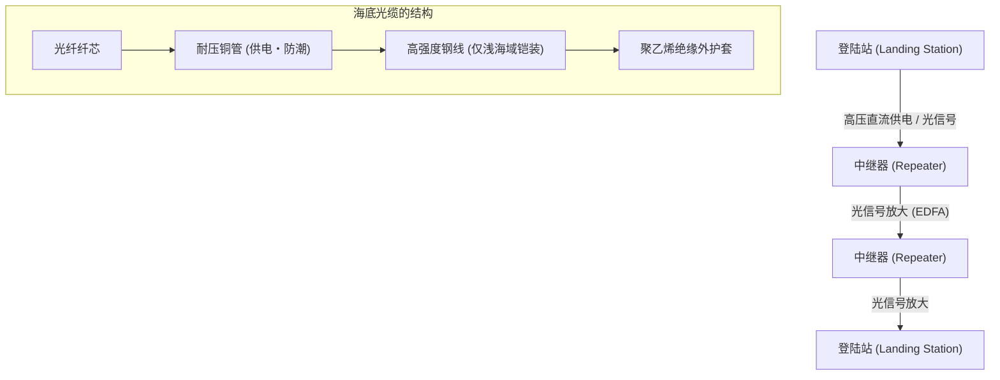

---
## 2. 数据的热力学处理设施：超大规模数据中心

通过海底光缆到达陆地的数据，最终会被传送到“数据中心”。数据中心是容纳数万到数十万台服务器的巨大建筑群，24小时365天不间断地进行计算和存储。

### 2.1 云计算的真相与“PUE”之战

从物理学的角度来看，数据中心的本质是一个“接收巨大电能作为输入，产生信息处理带来的熵减（计算结果），并伴随不可避免的‘热量’的巨大热机”。CPU和GPU等半导体在切换电流的开关时，会因电阻而产生热量。如果不将这些热量有效地排到外部，半导体瞬间就会发生热失控，并在物理上被烧毁。

因此，数据中心设计和运营的最大焦点在于“冷却”和“电力效率”。衡量这种效率最常用的指标是“PUE（Power Usage Effectiveness，电能利用效率）”。

**PUE = 数据中心总耗电量 / IT设备（如服务器等）耗电量**

PUE的理论最小值为1.0（即所有电力纯粹只用于计算）。过去的数据中心PUE超过2.0（也就是说，冷却设备如空调消耗的电力与服务器一样多）的情况并不罕见。然而，在现代超大规模数据中心中，通过极致的热力学优化，这个数值已被降至1.1到1.2左右。

### 2.2 冷却架构的演进

基于热力学原理，数据中心的冷却系统经历了以下演进：

1. **冷热通道隔离 (Hot/Cold Aisle Containment)**:
   在早期的数据中心，整个房间由空调机（CRAC: Computer Room Air Conditioning）冷却，但冷空气和服务器排出的热空气混合在一起，效率极低。现在，将服务器机架的进气面相对、排气面相对布置，并从物理上将通过冷气的通道（冷通道）和通过热气的通道（热通道）隔离开来的“通道封闭”已成为标准。

2. **自然冷却 (Free Cooling)**:
   驱动冷水机组（冷却水循环装置）的压缩机需要大量电力。因此，在室外空气足够寒冷的地区（如北欧或北海道等）建设数据中心，直接利用外部空气或通过热交换器间接进行冷却的“自然冷却”得到了普及。

3. **浸没式冷却 (Immersion Cooling) 与直接水冷 (Direct-to-Chip)**:
   近年来，用于AI训练和推理的高端GPU的发热密度正在突破传统风冷的物理极限（空气的热容量和导热率较低）。因此，开始引入将服务器的整个主板直接浸入非导电的氟化惰性液体或矿物油中的“浸没式冷却”，以及将水冷头直接贴合在CPU/GPU的散热顶盖上，利用热容量远大于空气的液体直接带走热量的“直接水冷（Direct-to-Chip）”。利用相变（液体沸腾产生的汽化热）的两相浸没式冷却，甚至可以处理极高的热流密度。

### 2.3 冗余性与物理安全

由于数据中心是社会基础设施的枢纽，因此需要极高的冗余性（Redundancy）。在商业电源切断的瞬间，使用飞轮、铅酸蓄电池或锂离子电池的不间断电源（UPS）会在毫秒级别接管供电。与此同时，设置在建筑物外部的巨大柴油发电机或燃气轮机发电机启动，利用储备的燃料能够让整个设施连续运转数天。

网络连接方面，也会引入多家不同通信运营商的线路，并在物理路径上（例如从建筑的东西南北不同方向引入）完全分离，以防范挖掘施工导致线缆切断等事故。

---

## 3. 压缩时空的技术：CDN（内容分发网络）

即使海底光缆连接了各个大陆，数据中心积累了大量信息，单靠这些也无法构成现代的网络体验。这里面临着阿尔伯特·爱因斯坦提出的宇宙绝对速度限制——“光速壁垒”。

### 3.1 光速壁垒与延迟的物理极限

真空中光速（$c$）约为30万 km/s。但是，由于作为光纤纤芯的石英玻璃折射率约为1.47，光在光纤中的速度会下降到约20万 km/s（约为真空中的三分之二）。

例如，从日本东京到美国东海岸弗吉尼亚州（全球最大的数据中心集聚地）的物理直线距离约为11,000 km，考虑海底光缆的路径则约为14,000 km。光信号单向传输所需的纯物理时间约为70毫秒。互联网通信需要数据包往返（RTT: Round Trip Time），因此不可避免地会受物理定律限制，产生至少140毫秒的延迟（Latency）。此外，还要加上沿途路由器和交换机的处理延迟。

在打开最新的网站时，浏览器会请求HTML、CSS、JavaScript、图片等数百个文件，并通过TCP的三次握手和TLS（SSL）加密协商进行多次通信往返。如果所有用户都必须直接访问地球背面的“源服务器（Origin Server）”，网页显示将出现数秒到十几秒的延迟，实时在线游戏或高清视频流媒体将变得完全不可能。

### 3.2 向边缘分散：CDN的架构

从工程上克服这一物理极限、压缩时空的系统就是“CDN（Content Delivery Network，内容分发网络）”。

CDN的基本思想非常简单。“如果去离用户很远的源服务器获取数据太慢，那么提前在物理上离用户最近的地方放置一份数据的副本（缓存）就可以了”。

CDN提供商在全球主要城市的数据中心或ISP（互联网服务提供商）的设施内，物理上部署了成千上万台被称为“边缘服务器（Edge Server）”的缓存服务器。当用户访问网站时，CDN网络会瞬间判断用户的地理和网络位置，并将通信路由到延迟最低（最近）的边缘服务器。

实现这种路由的核心技术是“Anycast（任播）”和高级的“基于DNS的路由”。在Anycast路由中，会为全球多个边缘服务器分配完全相同的IP地址。利用构成互联网骨干的BGP（边界网关协议）路由选择算法，路由器会自动将数据包发送到网络上“最短”的服务器。由此，东京的用户会被引导到东京的边缘服务器，伦敦的用户会被引导到伦敦的边缘服务器，而用户自身毫无察觉。

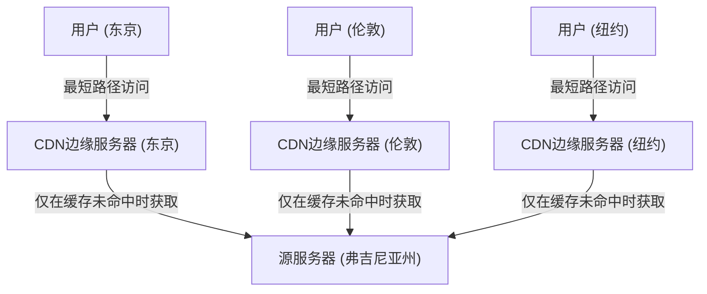

### 3.3 动态优化与边缘计算的到来

早期的CDN机制很简单，只是缓存并分发图片、视频和静态HTML文件。但是，现代的CDN本身已经演变成了一个庞大的分布式计算平台。

首先，是动态内容（例如每个用户不同的搜索结果或购物车内容等）的分发优化。这些内容无法缓存，但CDN会自主优化边缘服务器与源服务器之间的通信路径（如构建Tiered Cache或专用的高速路由网络），提供比标准互联网路径（BGP的尽力而为路径）丢包率更低、更稳定高速的通信线路。此外，通过在边缘服务器端终止（Terminate）TCP连接和TLS会话，大幅减少了与远端握手的往返次数。

其次，是“边缘计算（Edge Computing）”的崛起。过去，复杂的应用程序处理（如身份验证、A/B测试、图像动态缩放、自定义逻辑执行等）都在源服务器的CPU上进行。但现在，借助Cloudflare Workers或AWS Lambda@Edge等技术，开发者可以使用V8引擎等隔离的沙盒环境，直接在离用户最近的边缘服务器上以毫秒级运行代码（如JavaScript、Rust、WebAssembly等）。这就使得字面意义上的“互联网边界（边缘）”开始发挥巨大分布式计算机的作用。

---

## 4. 结语：与物理极限的无尽斗争

互联网基础设施的历史，就是一部与主宰宇宙的绝对物理定律——如光速、热力学第二定律、能量守恒定律等——斗争的历史。

海底光缆的工程师们挑战着深海巨大的水压和玻璃的光学极限；数据中心的设计者们为了冷却发热的硅晶圆而追求热力学的极致；CDN的架构师们则在不断构建高级的分布式处理系统以规避光速壁垒。

当我们点击智能手机，瞬间访问全球信息时，其背后存在着这些厚重、严酷且极其精密的物理基础设施。在第7章中，我们将深入探讨在这些坚固的物理基础设施之上，软件和协议是如何维持全球规模的自治分布式网络的，即“路由与BGP的世界”。

# 第7章：网络安全与隐私之战

互联网的历史，也是一部在信息自由共享的理想与保护系统和数据免受恶意攻击之间不断斗争的历史。最初，作为ARPANET诞生的互联网，是建立在少数受信任的研究人员之间进行通信的前提下设计的。因此，在协议的根本设计中“安全性”被推迟了，形成了基于人性本善的架构。然而，随着网络扩展到全球规模、实现商业化并确立了作为基础设施的地位，这种初期的设计思想成为了致命的弱点。

本章将探究技术的深渊，极其详尽地阐述动摇现代互联网的最大威胁之一——DDoS攻击的物理与网络机制，确保通信隐私的加密与VPN（虚拟专用网络）技术，以及因边界防御的局限性而诞生的下一代安全理念“零信任架构”。

## 1. 网络的物理极限与DDoS攻击的力学

在网络攻击中，最原始却又最难防御的攻击之一就是**DDoS（Distributed Denial of Service：分布式拒绝服务）攻击**。这是一种向目标服务器或网络设备发送超出其处理能力或线路带宽极限的大量流量，从而使合法用户无法获得服务的攻击。

### 流量的物理饱和：线路带宽的极限
互联网通过光纤、铜线、电波等物理介质传输数据。虽然通过光波分复用（WDM）等技术在这些传输线路上实现了太比特级的通信容量，但连接各个服务器的线路带宽（例如1Gbps或10Gbps）存在着严格的物理上限。DDoS攻击正是利用了这种“水管粗细”的极限。当攻击者操纵分布在全球的数十万台感染了恶意软件的设备（僵尸网络），同时向目标发送数据包时，路由器和交换机接口的缓冲内存就会溢出，进而发生丢包。这种现象类似于流体力学中的管道堵塞，在信息量（数据包数量）超过处理能力的瞬间，会导致整个系统功能瘫痪。

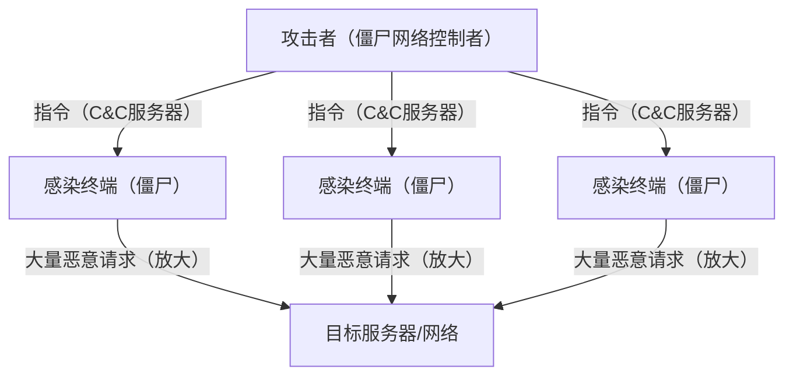

### 攻击TCP/IP的漏洞：SYN Flood攻击
除了塞满带宽之外，还存在耗尽服务器资源（CPU和内存）的攻击手段。其中最具代表性的就是**SYN Flood攻击**。在TCP协议中，建立通信时需要经历被称为“三次握手”的过程。
1. 客户端发送“SYN”数据包
2. 服务器返回“SYN-ACK”数据包，并分配用于连接的内存（TCB: Transmission Control Block）
3. 客户端发送“ACK”数据包，从而建立连接

攻击者会伪造源IP地址（欺骗），向服务器发送大量SYN数据包。服务器会返回SYN-ACK，但那些被伪造的IP地址的主人不会返回ACK（或者根本不存在）。结果，服务器不得不维持大量“半开（Half-open）”状态的连接，导致用于连接管理的内存空间被耗尽，不得不拒绝合法用户的新连接请求。这是一种利用了TCP“保证可靠通信”这一状态保持（Stateful）特性的高明攻击机制。

### 反射（放大）攻击：不对称性的滥用
利用UDP（用户数据报协议）的**反射攻击（放大攻击）**则更加巧妙。UDP是无连接协议，不验证发送源。攻击者将源IP地址伪装成目标的IP地址，向互联网上公开的DNS服务器或NTP服务器发送请求。此时，会使用特定的查询（如DNS ANY查询或NTP monlist等），使得对于一个很小的请求（几十字节），服务器会返回数百倍甚至数千倍大小（数千字节）的响应。
被放大的巨大响应数据包，会像雪崩一样同时涌向被伪造的发送源，即目标服务器。攻击者只需消耗极少的带宽，就能对目标产生太比特级的流量。这在网络上实现了物理学中的“杠杆原理”或声学工程中的共振放大等不对称性。

## 2. 通信路径的隐秘性：加密与VPN机制

在作为公共网络的互联网上流动的数据包，是通过沿途众多路由器和ISP设备传输的。未经加密的明文（Cleartext）通信，在传输路径上很容易被拦截（嗅探）或篡改。用来保护隐私和数据机密性的强大盾牌就是“加密技术”和“VPN（虚拟专用网络）”。

### 现代加密的数学基础：公钥与私钥的混合
保护通信主要使用两种加密方式。
- **对称加密方式（如AES等）**: 加密和解密使用相同的密钥。处理速度非常快，但存在如何安全地将密钥交给对方（密钥分发问题）的挑战。
- **公钥加密方式（如RSA和椭圆曲线密码等）**: 使用用于加密的“公钥”和用于解密的“私钥”对。基于质因数分解的困难性或离散对数问题等高级数学性质（不对称性）。计算成本较高。

在互联网上的安全通信（TLS/SSL和VPN）中，采用了结合这两种方式的混合模式。首先，在通信开始的握手阶段，使用公钥加密安全地交换“会话密钥（对称密钥）”，随后在传输大容量数据时，使用高速的会话密钥进行加密。由此，实现了安全的密钥分发与高速的加密通信两者兼顾。

### VPN与隧道协议的原理
**VPN（虚拟专用网络）**是利用加密技术，在公共互联网上建立虚拟“专用线路（隧道）”的技术。代表性的协议包括IPsec和OpenVPN，以及最近的WireGuard等。

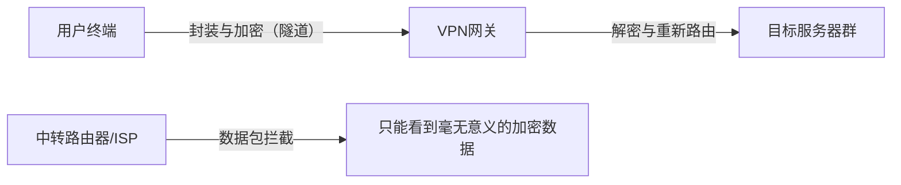

隧道技术的核心机制在于“封装（Encapsulation）”。将用户想要发送的原始IP数据包（有效载荷）整体进行加密后，将其包裹作为新IP数据包的数据部分（封装），并在外侧附加指向VPN服务器的新IP报头。
沿途的互联网路由器只查看外侧的IP报头，将数据包转发到VPN服务器。由于内部已被强力加密，即使数据包被拦截，想要解析通信内容甚至原本的目标IP地址都是极其困难的。到达VPN服务器的数据包会被解密，取出原始报头后发送到最终目的地。通过这种方式，在一个物理上任何人都能访问的基础设施之上，创造出了在逻辑和数学上受到保护的私密空间。

## 3. 边界防御的崩溃与零信任架构的崛起

多年来，企业和组织的网络安全一直依赖于被称为“边界防御（边界模型）”的理念。这是一种在互联网（外部）与公司内部网络（内部）的边界上部署防火墙或IPS（入侵防御系统），将“外部视为危险，内部视为安全”的城堡式防御战略。

### 云计算和远程办公带来的边界丧失
然而在现代，这种模型已经彻底破产。随着SaaS（软件即服务）的普及，重要数据被放在了公司外部的云端；而远程办公的常态化，使得员工开始从家里或咖啡馆的Wi-Fi进行访问。“需要保护的内部”和“危险的外部”之间的边界线消失了，传统的防火墙无法控制的流量呈爆炸式增长。此外，一旦恶意软件（如勒索软件等）或内部恶意人员侵入内部网络，边界防御将无能为力。“内部是可信的”这一前提成了最大的漏洞。

### 零信任：Trust Nothing, Verify Everything
为了应对这种范式转变，**“零信任架构（Zero Trust Architecture: ZTA）”**应运而生。零信任的基本理念是“无论网络位置（在公司内还是公司外），默认不信任任何通信（Never Trust, Always Verify）”。

在零信任模型中，安全的焦点从“网络的边界”转移到了“身份（用户和设备）”以及“资源（数据和应用程序）”。

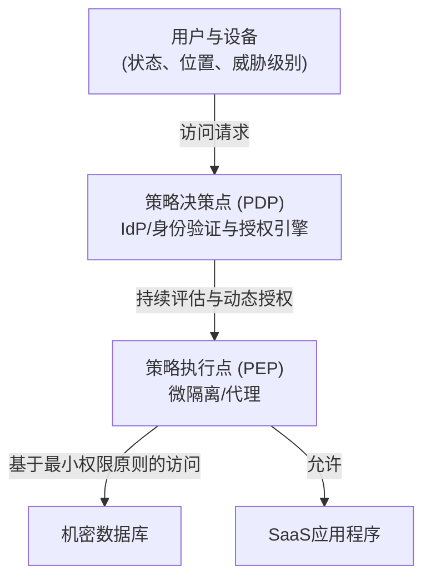

实现零信任的核心技术组件如下：

1. **身份与访问管理（IAM/IdP）**: 不仅仅依靠密码，还结合MFA（多因素认证）和生物识别技术，强力验证用户身份。
2. **设备态势（健康度）评估**: 实时评估发起访问请求终端的操作系统补丁状态、杀毒软件的运行状态、历史行为等。立即阻断来自不安全终端的访问。
3. **微隔离**: 将网络进行细微划分，为每个资源设置极小的边界。其结构可以防止即使万一被入侵，也能阻止损失的水平蔓延（横向移动）。
4. **持续认证与动态策略**: 并非登录成功一次就持续信任。在会话过程中也会持续监控行为（如源IP的变更、异常的数据下载量等），并在风险评分超过阈值的瞬间采取断开会话的动态控制。

零信任不仅仅是一款产品，而是一种“每次访问都进行验证，仅授予必要最小权限（Least Privilege）”的设计理念。在现代分布式IT基础设施中，这已成为保护数据的唯一现实解。

## 4. 未来的安全：量子密码与下一代网络防御

我们目前依赖的RSA和椭圆曲线密码，是基于“以当前计算机的计算能力，破解需要天文数字般的时间”这一前提的。然而，如果应用了量子力学原理的“量子计算机”投入实用，通过Shor算法等，这些数学问题可能会瞬间被破解。这被称为**“Q-Day（量子计算机破解密码之日）”**。

为了对抗这种情况，目前正在研究两种方法。
一种是标准化即使在量子计算机面前也难以在数学上破解的新加密算法**“抗量子计算密码（PQC: Post-Quantum Cryptography）”**（如格密码等）。
另一种是以物理学（量子力学）定律本身为安全基础的**“量子密钥分发（QKD: Quantum Key Distribution）”**。这是一种将信息搭载在光子的量子态（如偏振等）上进行密钥分发的技术。窃听者试图观测（复制）光子的瞬间，量子态就会发生变化（观测问题·不确定性原理），因此在物理上能够100%检测到窃听，这是一种终极的安全通信。

## 结语

互联网的第7章，是一场“便利性”与“安全性”之间无休止的跷跷板游戏。从DDoS攻击导致的物理层饱和，到加密技术带来的数学防御，再到零信任架构的范式转变，网络安全已经超越了单纯的IT技术范畴，演变成了一门物理学、数学和行为心理学交汇的极其高级的学科领域。
当我们不经意地打开浏览器操作云端数据时，其背后，看不见的攻击者与防御系统正在进行着24小时365天、毫秒级别的激烈电子战。

在接下来的最终章第8章中，我们将探究互联网的未来，即Web3.0、元宇宙以及星际互联网（Interplanetary Internet）等下一代网络范式。
# 第8章：未来的互联网 —— 去中心化、宇宙空间与量子力学交织的下一代网络

在过去的几十年里，互联网作为人类历史上最具影响力的信息基础设施，一直在不断地演进。从20世纪60年代ARPANET确立分组交换技术开始，到TCP/IP协议簇的标准化、WWW（万维网）的发明，再到移动宽带的普及，其发展的脚步从未停歇。然而，我们目前正在使用的互联网，正面临着架构上的根本性局限和物理上的制约。例如，伴随着数据中心巨大化而带来的中心化弊端、洲际通信中光纤的物理延迟，以及计算能力飞跃性提升（特别是量子计算机的崛起）所导致的现有加密技术的脆弱性等。

本章以“第8章：未来的互联网”为题，探索正在进行中的范式转移的最前沿。具体而言，我们将围绕三大支柱：旨在摆脱中心化的“Web3与去中心化架构”、将物理基础设施的制约扩展至宇宙空间的“低轨道卫星通信网（如Starlink）”，以及将物理学终极定律应用于通信的“量子互联网”，从专业的视角，极其详尽地阐述它们的历史背景、物理学原理以及技术机制。

---

## 8.1 Web3与去中心化架构的真正价值：构建无须信任（Trustless）的网络

目前的互联网（Web2.0）建立在大型平台企业对数据的中心化管理之上。客户端-服务器模型虽然高效，但也存在单点故障（SPOF: Single Point of Failure）、易遭审查以及侵犯用户数据隐私等结构性问题。对此，架构层面的解答便是“Web3”及去中心化网络技术。

### 8.1.1 面向内容的网络与IPFS
传统的Web（HTTP）是“面向位置（Location-Addressed）”的。也就是说，通过指定“在哪里（URL）”来访问信息。但是，在这种机制下，一旦服务器宕机或域名失效，内容本身就会消失，从而出现“死链（404 Not Found）”。

相比之下，以IPFS（星际文件系统）为代表的去中心化存储系统采用了“面向内容（Content-Addressed）”的架构。它使用通过将文件内容输入密码学哈希函数（如SHA-256）而生成的唯一“内容标识符（CID）”来访问数据。

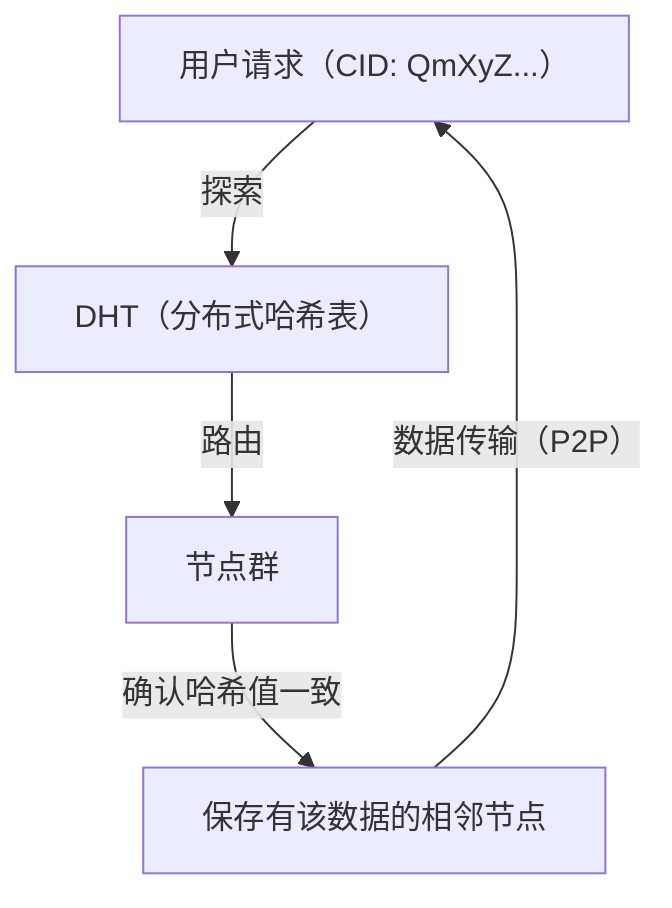

这一机制的核心在于Kademlia算法，它是DHT（Distributed Hash Table：分布式哈希表）的一种。Kademlia通过XOR运算（异或）来定义节点ID与数据ID之间的“距离”。由此，它能够高效地映射整个网络的拓扑结构，并以 $O(\log N)$ 的计算复杂度发现保存目标数据的节点。由于数据被分散并复制在世界各地的节点上，即使部分节点离线，对数据的访问仍能维持，并且对审查具有极强的抗性。

### 8.1.2 分布式共识与密码学证明
Web3的另一个基石是区块链技术。在去中心化网络中，它依靠无需中央管理者介入就能就“谁记录了正确状态”达成一致的“共识算法（Consensus Algorithm）”来运作。
最初在比特币中采用的PoW（工作量证明），利用了哈希函数的抗碰撞性，通过投入庞大的计算能量在物理上使篡改变得困难。然而，从能源消耗的角度来看，目前正逐渐向PoS（权益证明）过渡。

在以太坊2.0等采用的PoS中，质押（担保化）了加密资产的验证者，会使用一种被称为BLS（Boneh-Lynn-Shacham）签名的特殊基于双线性配对的密码学技术来聚合签名。由此，数万到数十万节点生成的数字签名被压缩到极小的数据尺寸，使得在作为去中心化网络的同时，兼顾了高安全性与一定的可扩展性。在未来的互联网中，这些技术有望作为OSI参考模型的新层（价值转移与共识层）被标准化实现在TCP/IP之上。

---

## 8.2 包裹地球的卫星通信网：Starlink及更远

铺设在地面的光纤网是现代互联网的骨干。然而，海底电缆的铺设成本、地形限制，以及最重要的“介质中的光速”这一物理限制始终存在。以SpaceX的Starlink为代表的低轨道（LEO: Low Earth Orbit）卫星星座，正试图在宇宙空间这一前沿领域解决这些问题。

### 8.2.1 轨道力学与低轨道（LEO）的优势
静止轨道（GEO: Geostationary Earth Orbit）卫星位于海拔约35,786公里处，由于与地球自转同步，因此具有可以固定天线方向的优点。但是，仅电波往返就要移动超过70,000公里的距离，由于物理学的制约，不可避免地会产生延迟（仅单程就约120毫秒，实际延迟在500毫秒以上）。

另一方面，Starlink的卫星被部署在海拔约550公里的低轨道上。根据基于开普勒第三定律的轨道力学，在这个高度上，为了平衡地球的引力与离心力，卫星必须以约7.6 km/s（时速约27,000公里）的惊人速度绕地球运行（约90分钟绕地球一圈）。
由于轨道如此之低，电波的物理传播时间被大幅缩短至GEO的约65分之一，理论上的通信延迟将与地面光纤相当甚至更低（20至40毫秒）。

### 8.2.2 相控阵天线（Phased Array）与电波的波前控制
由于卫星高速移动，地面上的用户终端（没有像抛物面天线那样物理驱动部件的平面天线）必须对飞过上空的卫星进行电气追踪。这里使用的便是“相控阵天线（Phased Array Antenna）”。
数以千计的微小天线阵元排列在平面上，每一个阵元辐射出的电波“相位（波的时间）”在微秒级别被有意识地错开。根据惠更斯原理，来自各个阵元的球面波相互干涉，在特定方向上波叠加增强（相长干涉），从而形成波束。由此，无需物理上移动天线，仅凭软件控制，即可将通信波束瞬间指向目标卫星。

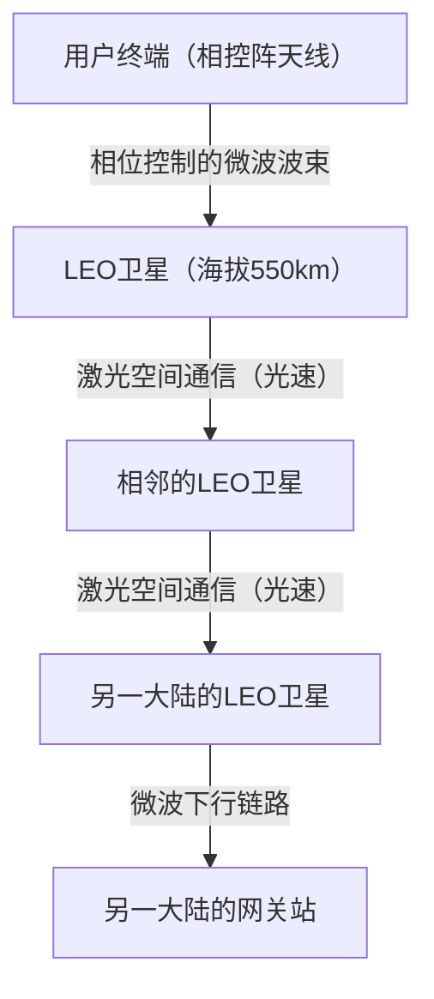

### 8.2.3 自由空间光通信（OISL）与“真空中光速”的绝对优势
Starlink网络真正的革命在于星间激光通信（OISL: Optical Intersatellite Links）。
现代的长距离通信依赖于光纤，但光纤纤芯（石英玻璃）的折射率约为1.47。在物理学中，介质中的光速表示为 $v = c / n$ （$c$ 为真空中光速，$n$ 为折射率）。也就是说，光在光纤内的速度下降到了约200,000 km/s。

相比之下，宇宙空间（真空）的折射率无限接近于1，因此卫星间的激光通信以真空中的光速 $c \approx 300,000$ km/s 进行。
例如，考虑从伦敦向纽约传输数据，比起经过大西洋的海底电缆，将数据先发射到宇宙，在真空的宇宙空间通过激光传输，然后再降回地面的路线，其理论上的绝对延迟（Latency）反而更小。这将给金融的高频交易（HFT）以及全球化实时系统带来决定性的范式转移。在未来，数以万计的卫星将环绕地球，一个取代BGP（边界网关协议）、运行着动态三维宇宙空间路由协议的网状网络（Mesh Network）终将建成。

---

## 8.3 量子互联网：量子纠缠带来的终极通信

如果说Web3重构了“信任”的架构，卫星通信网突破了“空间与速度”的制约，那么“量子互联网”便是信息“安全性与传输手段”中物理学的极致。量子互联网并非要取代现有的TCP/IP网络，而是对其进行补充，提供一条基于全新物理定律的信息传输通道的下一代基础设施。

### 8.3.1 量子力学基础：叠加态与量子纠缠
经典计算机与互联网将电压的高低等作为“0”或“1”的比特来处理。但是在量子互联网中，信息以量子比特（Qubit）的形式进行传输。通过利用光子的偏振状态（如垂直振动、水平振动等），它利用了“0”和“1”同时存在的“叠加原理（Superposition）”。

更加重要的是“量子纠缠（Quantum Entanglement）”。当两个粒子处于纠缠态时，无论它们在物理上相隔多远（即使是地球到火星的距离），在测量并确定其中一个粒子状态的瞬间，另一个粒子的状态也会毫无时差地立即确定。被爱因斯坦称为“幽灵般的超距作用”的这种非局域物理现象，正是量子互联网的骨干。

### 8.3.2 量子密钥分发（QKD）与物理学上的绝对安全
目前，保护互联网通信的RSA加密和椭圆曲线加密，依赖于“大整数的质因数分解需要极长计算时间”这一数学上的困难性。然而，如果能够运行Shor算法的大规模量子计算机得以实现，这些加密方法将在短时间内被破解。

因此，备受期待的是量子密钥分发（QKD: Quantum Key Distribution）。在代表性的BB84协议中，利用单光子来发送加密密钥。根据量子力学的基本原理“海森堡不确定性原理”，如果第三方（窃听者）试图对飞行中的光子进行测量（窃听），在那一瞬间量子状态就会发生改变（退相干）。同时，根据“量子不可克隆定理（No-Cloning Theorem）”，要在物理学上精确复制一个未知的量子状态是不可能的。
也就是说，如果在通信路径上发生窃听行为，接收者必定能在物理定律层面，通过错误率的异常上升检测到它。通过共享已被确保未遭窃听的安全随机数，并与一次性密码本（One-Time Pad）加密相结合，就能实现哪怕拥有任何计算能力的计算机（甚至宇宙规模的超级计算机）也绝对无法破解的终极安全。

### 8.3.3 量子隐形传态与量子中继器的壁垒
量子互联网的最终目标，是将利用量子纠缠把量子态本身转移到另一个地方的“量子隐形传态（Quantum Teleportation）”网络化。由此，连接分布式的量子计算机、使其作为单一巨大量子计算系统运作的“量子云（Quantum Cloud）”将成为可能。

然而，其技术壁垒依然极高。光子在光纤中传播时，会因为吸收或散射而丢失（衰减）。在经典通信中，会在途中放置“放大器”来增强信号，但在量子通信中，由于前面提到的“不可克隆定理”，光子无法被复制和放大。

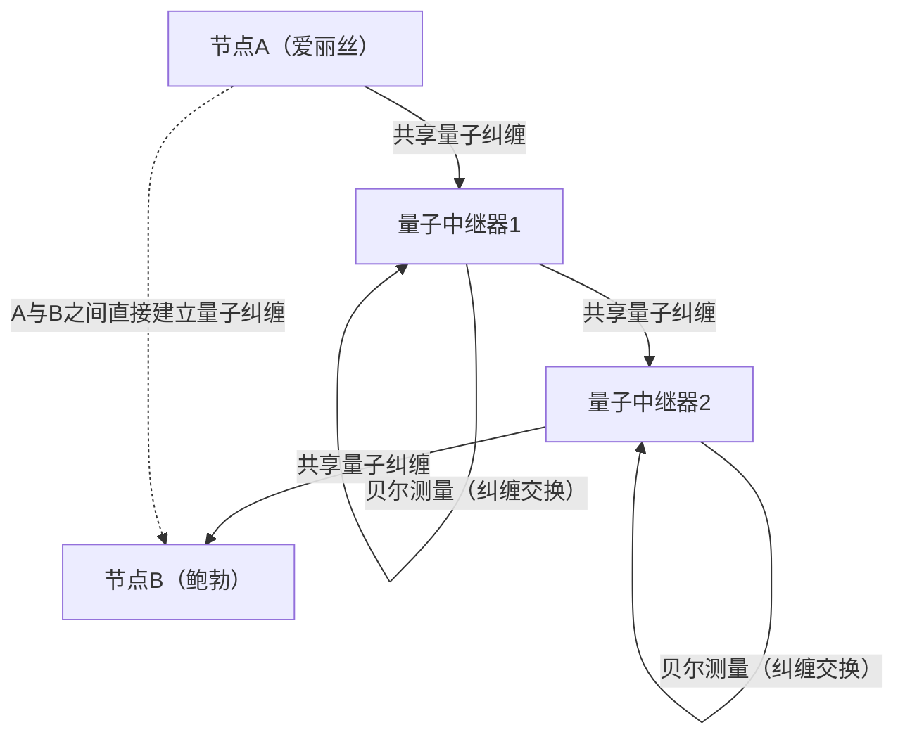

为了突破这一局限而正在被研究的是“量子中继器（Quantum Repeater）”。量子中继器仅在短区间内生成量子纠缠，通过连续进行名为“纠缠交换（Entanglement Swapping）”的高级量子操作，从而在长距离之间确立量子纠缠。为了实现这一点，必须要有能够在极低温环境下暂时保存量子态的“量子存储器”，目前，使用钻石的NV色心（氮-空位中心）和冷原子气体的物理学突破，正在世界各地的研究所中激烈竞争。

---

## 8.4 结语：人类与网络的未来

在20世纪60年代诞生的互联网，已成长为连接地球上一切信息的神经网。而现在，我们所面临的第8章“未来的互联网”，不仅仅停留在软件层面，而是向着更根本、物理学维度的扩展。

Web3的去中心化架构，正在构建一个不依赖对特定中央机构“信任”的、而是通过数学与密码学来担保社会交易的新信任基石（信任层）。
以Starlink为首的卫星通信网，飞出了地球的重力井，通过挑战真空中光速这一物理学上的绝对极限速度，勾勒出使距离壁垒无效化的三维骨干网。
而量子互联网，则将量子力学深渊般的神秘——量子纠缠升华为工程学，试图从根本上颠覆信息传输与安全的理念。

这些技术看似各自独立发展，但在长期来看终将融合。通过在穿梭于宇宙空间的激光中搭载单光子（量子），将构建出利用衰减极小的宇宙空间的全球量子密码通信网，并在其上运行Web3的去中心化协议。这种如同科幻小说般的网络基础设施，此刻正由人类之手一点点设计出来。

未来的互联网，将不再仅仅是“传输信息的管道”。它将进化为把人类的经济活动、社会共识，以及计算资源在宇宙规模下进行同步的终极“智能基础设施”。在我们每天漫不经心使用的互联网的背后，此时此刻，挑战物理学与计算机科学极限的宏大叙事，仍在不断被编织着。

