# 第1章 網際網路的黎明與哲學 —— 從 ARPANET 到 WWW 的技術系譜

網際網路——今日作為人類所有經濟活動、文化與通訊基礎的這個巨大自主分散式網路，絕非單一天才在一夜之間設計出來的。它以冷戰這個特殊的歷史與地緣政治背景為起點，經歷了通訊工程與計算機科學的典範轉移，是無數研究人員共同擁有「如何堅固且自由地、跨越任何物理限制來傳遞資訊」此一崇高哲學的結晶。

本章將從專業的視角極度深入地解說，網際網路這個奇蹟般的系統究竟是如何誕生的。這不僅僅是歷史的羅列，而是從實體層到應用層的技術機制，以及其設計思想（架構）。

## 1.1 網路典範的轉換：電路交換的極限與封包交換的誕生

在理解網際網路的歷史與技術本質時，一切的出發點就是發明「封包交換（Packet Switching）」這個概念。在1960年代初期，當時通訊基礎設施的核心，是以電話網為代表的「電路交換（Circuit Switching）」方式。

### 電路交換的物理機制與脆弱性
電路交換方式是指在進行通訊的兩點之間，透過物理的縱橫制交換機或電子交換機，或者是使用分頻多工（FDM）等技術在邏輯上結合，從通訊開始到結束皆確保並佔用「專用通訊路徑（電路）」的方式。這種方式只要確保了電路，就能保證頻寬與延遲，因此極度適合需要即時性的語音通訊（電話）。

然而，這個架構存在著致命的缺陷。那就是「單點故障（Single Point of Failure）」的存在，以及對物理破壞極度脆弱。在冷戰時期，美國國防部非常擔憂來自蘇聯的核攻擊（尤其是伴隨高空核爆的電磁脈衝：EMP攻擊）。如果中央集權的通訊據點（巨大的交換局）遭到物理破壞，或是部分通訊路徑被切斷，電路交換方式無法立即重建繞道路徑，國家的指揮控制系統（C2: Command and Control）將會完全癱瘓。

### 封包交換的突破
有三位先驅完全獨立、卻幾乎在同一時期，為了打破這個令人絕望的物理限制而建立了理論基礎。他們是蘭德公司的保羅·巴蘭（Paul Baran）、英國國家物理實驗室（NPL）的唐納德·戴維斯（Donald Davies），以及麻省理工學院（MIT）的倫納德·克萊因羅克（Leonard Kleinrock）。

他們以克勞德·夏農（Claude Shannon）的資訊理論為背景，提倡了一種革命性的方法：不將通訊視為連續的類比「波」或不間斷的資料「串流」，而是將資料分割成固定長度（或可變長度）的小型數位資料塊——也就是「封包（Packet）」，或者用巴蘭的話來說，是「標準化的訊息區塊」。

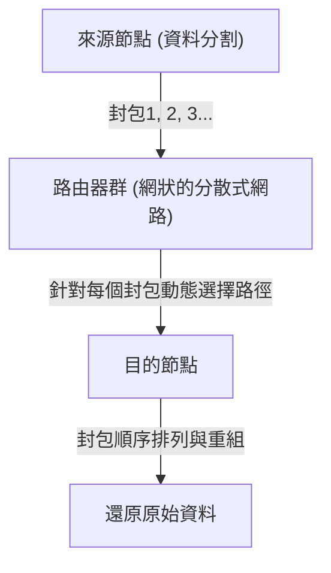

封包交換方式的技術革新性，主要可以歸納為以下兩點。

1. **實現統計多工（Statistical Multiplexing）:**
   不像電路交換那樣由特定通訊佔用物理電路，而是多個無關通訊的封包，以分時方式共享同一條物理電路。電腦間的資料通訊具有很高的「突發性（Burstiness：短時間內流入大量資料，隨後持續無聲的特性）」，因此透過封包交換來共享頻寬，將通訊資源的利用效率提升到了數學極限。
2. **儲存轉發（Store and Forward）與動態路徑選擇:**
   構成網路的各個中繼節點（路由器），會將接收到的封包暫時儲存在記憶體上的佇列（Queue）中，並將封包標頭上記載的目的地地址，與節點自身擁有的路由表（Routing Table）進行比對。然後，計算當時網路的壅塞狀態與物理電路的中斷狀況，為每個封包轉發至最佳的相鄰節點。

克萊因羅克利用排隊理論（Queuing Theory），建立在儲存轉發方式中關於封包延遲與緩衝區大小的數學模型。即使網路的一部分在核攻擊中蒸發，倖存的節點也會自主判斷狀況，封包會找出繞道路徑（網狀網路上的其他路徑）並抵達目的地。這種「自主分散型・自我修復型」的架構，正是網際網路韌性（Resilience）的根源。

## 1.2 ARPANET 的建構：利用 IMP 分離硬體與協定

將理論上存在的封包交換網路實作於物理世界的，是1969年在美國國防部高等研究計劃署（ARPA）資金贊助下開始的專案「ARPANET」。

當時的電腦環境與現代相比混沌得無法同日而語。IBM、DEC、SDS等各家公司獨自開發的大型主機（Mainframe），其字元編碼（ASCII對EBCDIC）、字組長度（16位元、32位元、36位元等）、作業系統完全不同，要讓它們直接通訊在技術上極度困難。

因此，ARPANET的設計者們（拉里·羅伯茨等人）在網路架構上做出了一個非常重要的設計決策。那就是導入被稱為「IMP（Interface Message Processor）」的專用小型中繼電腦。

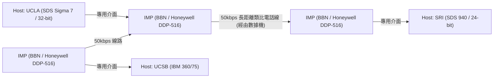

IMP 的開發由總部位於波士頓的顧問公司 BBN（Bolt Beranek and Newman）得標。他們改造了 Honeywell 公司堅固的迷你電腦「DDP-516」，並讓 IMP 負擔路由協定、封包分割與組裝、錯誤檢測（CRC: 循環冗餘校驗）等所有複雜的網路處理。

如此一來，各研究機構的巨大主機電腦就完全不需要在意複雜的封包路由或線路的物理特性，只需透過眼前的 IMP 與標準化介面（BBN 1822 協定）來傳遞資料即可。這是將系統的「關注點分離（Separation of Concerns）」應用於網路領域的首個偉大成功案例，而 IMP 成為了今日路由器（Router）的直接始祖。

1969年10月29日，從 UCLA 克萊因羅克的實驗室向 SRI（史丹佛研究院）發送了第一則訊息「LO」（原本打算打 "LOGIN"，但系統卻崩潰了）。這就是 ARPANET 誕生之歷史性瞬間。之後，實作了早期的路由演算法（基於貝爾曼-福特演算法的距離向量型路由），ARPANET 作為連結全美研究機構的基礎設施開始迅速成長。

## 1.3 TCP/IP 的設計思想：端到端原則與封裝的深淵

ARPANET 作為單一網路取得了巨大成功，但不久後便面臨新的障礙。在 ARPANET 內部使用的通訊協定 NCP（Network Control Program），是建立在 ARPANET 這個「同質且可靠度高的單一網路」上運作的前提所設計的。

然而進入1970年代後，開始出現了使用人造衛星的封包通訊網（SATNET）、夏威夷大學開發的無線封包通訊網（從 ALOHANET 衍生出的 PRNET）等，物理媒介、封包最大尺寸（MTU: Maximum Transmission Unit）、傳輸速度、錯誤率完全不同的各種網路。當人們試圖將這些網路互連，建構全球規模的「網路的網路（Internetwork）」時，NCP 的設計明顯會破綻百出。

解決這個異質網路連接之艱鉅挑戰的，是1974年文頓·瑟夫（Vinton Cerf）與羅伯特·卡恩（Bob Kahn）發表的劃時代論文 "A Protocol for Packet Network Intercommunication"。他們設計的協定，正是現代網際網路的基礎「TCP/IP（Transmission Control Protocol / Internet Protocol）」。

### 架構的靈魂：端到端原則 (End-to-End Argument)
在 TCP/IP 設計的底層，流淌著網路工程中最重要的哲學「端到端原則（End-to-End Principle / Argument）」。這個由 J. H. Saltzer、D. P. Reed、D. D. Clark 等人在1980年代明文化的原則主張如下：

「資料傳輸的可靠性確保、順序控制、加密等進階且專屬於應用程式的功能，應該在進行通訊的兩端末端主機（End-to-End）實作，而不應實作於網路的核心（中繼基礎設施或路由器）。」

如果在網路的核心側（IMP 或路由器）保有封包到達確認（ACK）或重傳控制等複雜的「狀態（State）」，會發生什麼事？中繼路由器故障的瞬間，那個狀態就會遺失，通訊也會中斷。此外，每當有新需求的應用程式出現，就必須改寫全世界中繼路由器的軟體。

TCP/IP 將這個原則極度忠實地具體化了。負責中繼的 IP（Internet Protocol）路由器專注於極其簡單的功能（無狀態的資料報轉發）：只負責「將收到的封包盡最大努力（Best-effort）轉發到目的地」。IP 完全不在意封包遺失或順序錯亂。它徹底扮演著單純的「笨網路（Dumb Network）」。

取而代之的是，確保通訊可靠性的重責大任，全都交給了在兩端主機電腦上運行的 TCP（Transmission Control Protocol）。TCP 透過查看 IP 送來的順序混亂的封包上所附的序號來重新組裝原始資料，若有缺漏則自主進行重傳要求，若網路壅塞則調整發送速度（視窗控制與慢啟動演算法）。

這種「保持核心極度簡單，讓邊緣（末端）擁有智慧」的設計思想，正是網際網路超越電話網，且後來能夠在無須修改基礎設施的情況下，直接吸收如 Web、串流影片、P2P通訊、智慧型手機等連設計者都未曾預料到的爆發性創新的最大理由。

### 封裝（Encapsulation）與階層模型
TCP/IP 為了實現這種邏輯上的角色分工，採用了「封裝（Encapsulation）」資料的手法。這是一種對要發送的資料，各階層如同俄羅斯套娃般，將自身的控制資訊（標頭）一層層套上去的機制。

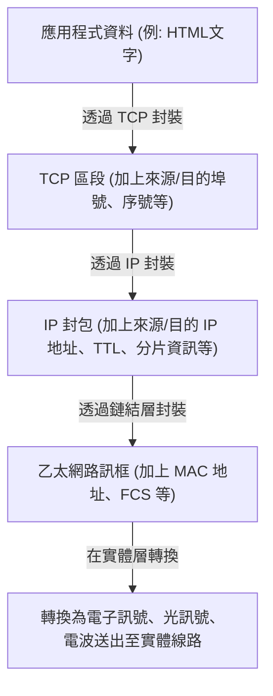

路由器只看 IP 封包的標頭（IP 地址）來決定轉發目的地，完全不干涉其內容（TCP 標頭或資料）。藉此，IP 成功地完全隱藏並吸收了下層實體層（光纖、銅線、Wi-Fi、5G）物理特性的差異，向更上層提供了「全球規模的單一虛擬網路」。

1983年1月1日，ARPANET 上的所有主機一齊從 NCP 切換為 TCP/IP 的「轉換日（Flag Day）」正式實施，真正意義上的「The Internet」於焉誕生。

## 1.4 NSFNET 的崛起與自主分散路由的演進

在轉移至 TCP/IP 之後，網際網路超越了軍事與國防的框架，蛻變為學術研究的巨大基礎設施。其中最具決定性的推動力，是1980年代後半由美國國家科學基金會（NSF）所建構的「NSFNET」。

NSFNET 作為連結全美五個超級電腦中心的骨幹網路而建構，在實體層經歷了從初期的 56kbps，到後來的 T1 線路（1.544Mbps），再到 T3 線路（45Mbps）的戲劇性升級。各大學與地區的網路（區域網路）開始以階層式的方式連接到這個 NSFNET 的骨幹上。

在網路規模爆發性擴大（Scaling）的過程中，浮現了新的技術挑戰。那就是「路由的極限」。讓所有中繼路由器共享多達數萬個節點的路由資訊，已經超越了記憶體容量與運算能力的物理極限。

為了解決這個問題，網際網路導入了「自治系統（AS: Autonomous System）」的概念。它重新定義了網際網路，不再是一個單一的巨大網路，而是擁有獨立管理策略的網路（AS）之集合體。

在 AS 內部（IGP: Interior Gateway Protocol），使用如 OSPF（Open Shortest Path First）這類鏈路狀態型路由協定，透過戴克斯特拉演算法（Dijkstra's algorithm）建構網路的完整拓樸地圖，並高速計算出最短路徑。

另一方面，在 AS 與 AS 之間（EGP: Exterior Gateway Protocol），不能僅僅使用最短路徑，還必須反映出「允許透過哪個網路進行通訊」的商業及組織策略。為了實現這一點而開發出的，正是至今仍支撐著網際網路根基的「BGP（Border Gateway Protocol）」。BGP 採用了路徑向量（Path Vector）型演算法，在完全防止路由迴路的同時，讓全世界的 ISP（網際網路服務供應商）之間能夠交換路由資訊。

透過 NSFNET 的建構與 BGP 的確立，即使沒有中央管理者，各個組織也能藉由不斷互連（Peering 與 Transit），在整體上讓單一個網路自主運作，現代商業網際網路的生態系統就此完成。1995年，NSFNET 結束了它的使命，骨幹網路的營運完全移交給了民間的 ISP 群體。

## 1.5 WWW 的誕生：透過超文本解放知識與公有領域化

在1980年代末期，從實體層、網路層到傳輸層的基礎設施已在全球範圍內整備完畢，累積在網際網路上的資訊量也急遽增加。然而，當時的網際網路上充斥著 FTP（檔案傳輸）、Telnet（遠端登入）、USENET（電子布告欄）等各自獨立的應用程式，資訊孤立（孤島化）在各伺服器目錄的深處。要尋找目標資料，必須具備目標伺服器的 IP 地址及複雜的 UNIX 指令知識，處於極度不民主的狀態。

從根本上顛覆這個狀況並引起資訊共享典範轉移的，是位於瑞士日內瓦的歐洲核子研究組織（CERN）的計算機科學家，提姆·柏內茲-李（Tim Berners-Lee）。1989年，他提出了一個稱為「全球資訊網（World Wide Web, WWW）」的創新系統。

他的構想核心，是將1960年代就已存在的「超文本（Hypertext：從文件內的單字建立連結到其他文件的概念）」與「網際網路（TCP/IP）」結合在一起。將原本侷限於本機電腦內的超文本連結，擴展到位於地球另一端伺服器上的文件。

為了建構這個巨大的資訊空間，柏內茲-李獨自設計並實作了三項極度洗鍊的技術規格。

1. **URI (Uniform Resource Identifier):**
   為了唯一指定存在於網路上的所有資源（文字、圖片、影片等）所在位置而設計的普遍定址體系。
2. **HTTP (Hypertext Transfer Protocol):**
   在客戶端（網頁瀏覽器）與伺服器之間，用於請求並傳輸由 URI 指定之資源的應用層協定。HTTP 最傑出的一點是，它採用了不保持通訊「狀態（State）」的「無狀態（Stateless）」設計。這使得伺服器能夠有效率地處理來自數百萬個客戶端的請求。
3. **HTML (Hypertext Markup Language):**
   用於描述文件的邏輯結構，並嵌入指向其他資源的超連結（錨點標籤 `<a>`）的標記式語言。

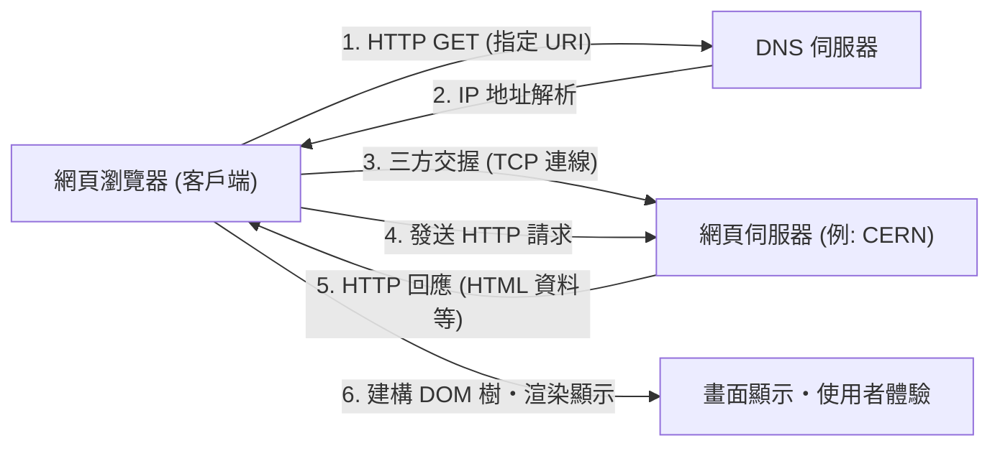

1990年底，世界上第一台網頁伺服器（info.cern.ch）與瀏覽器在 NeXT 電腦上開始運作。早期的 Web 以純文字為主，但其直觀透過連結探索資訊的體驗，在研究人員之間瞬間普及開來。

### 公有領域——人類歷史性的決斷
然而，WWW 之所以能真正改變世界，並確立為現代社會基礎設施的最大原因，不僅僅是因為其優越的技術架構。劃分歷史的決定性事件發生在1993年4月30日。

CERN 接受了提姆·柏內茲-李的強烈要求，做出了一項驚人的決定，將 WWW 的所有基礎技術（伺服器軟體、客戶端、程式碼函式庫）作為「公有領域（Public Domain，放棄智慧財產權）」無償開放。這份聲明文件上有著 CERN 總監的簽名，宣告不對其行使任何專利權，也不要求任何使用費。

如果當時 CERN 將 WWW 技術申請專利，並試圖透過軟體授權來獲利，結果會如何呢？毫無疑問，今日的資訊爆炸將不會發生。WWW 會淪為僅限於部分財力雄厚的企業或大學的封閉系統，而且在後來與 Gopher 等競爭協定的規格之爭中，網際網路肯定會被四分五裂。

因為這項公有領域化，徹底消除了技術與法律上的障礙，全世界的駭客與企業紛紛投入了 WWW 的生態系統。美國國家超級電腦應用中心（NCSA）的馬克·安德森（Marc Andreessen）等人，開發並無償公開了能夠在行內顯示圖片的革命性圖形化瀏覽器「NCSA Mosaic」，這也成為了後來 Netscape Navigator 乃至於 IT 泡沫的導火線。個人可以自由架設網頁伺服器，向世界發布資訊，從而實現了「資訊民主化」。

## 1.6 結語：思想凌駕於實作

我們在第1章所看到的網際網路歷史，絕非單純的通訊速度提升史。基於「中央集權控制很脆弱」的物理現實而發明了封包交換；基於「複雜性應由末端承擔」的端到端原則；以及基於「資訊應向全人類無償開放」的 WWW 公有化。

讓網際網路成為今日樣貌的，不是優越的硬體或程式碼，而是這些強大且連貫的「設計思想（Philosophy）」。透過邏輯上的封裝克服實體層的限制，藉由開放標準（RFC: Request for Comments）包容多樣性。正因為有這個尊崇分散與自由的架構，網際網路才能達成前所未有的擴展性。

然而，在人類能夠理解的「名稱」與網路處理的「數字（IP 地址）」之間，仍然存在著一道深深的鴻溝。在下一章，我們將解開為這個廣大自主分散網路的位址空間帶來秩序，並在幕後支撐 WWW 爆發性普及的巨大分散式資料庫系統——「IP 地址空間與 DNS（Domain Name System）的深淵」的技術機制。

# 第2章：物理層與資料連結層 〜數位資料的實體存在與相鄰節點間通訊〜

在網際網路這個巨大網路的底層，存在著一連串驚人的物理現象：將「0」與「1」的邏輯數位資料轉換為電子訊號、光線閃爍或電磁波漣漪等物理現象，跨越空間與介質傳送到對方手中。當我們漫不經心地用智慧型手機開啟網站時，在其背後，光子正穿梭於深海海底的玻璃纖維中，無形的電波也伴隨著複雜的計算在空間中飛舞。

本章將聚焦於 OSI 參考模型中的第 1 層（物理層）與第 2 層（資料連結層），從專業的視角極度深入探討支撐我們生活網路中「最實體、最原始」的部分，以及控制它們的嚴密邏輯機制。

---

## 2.1 物理層（Physical Layer）：資訊的實體化與宇宙法則

物理層最大的使命，是將電腦所處理的離散位元串（0 與 1），配合傳輸介質（銅線、光纖、真空或空氣等空間）的物理特性，轉換（調變）為類比的物理訊號，並將其送上傳輸路徑。在這裡，電機工程、量子力學與光學的法則決定了通訊的極限。

### 夏農-哈特利定理與資訊的極限

在討論物理層時，克勞德·夏農在 1948 年發表的資訊理論是無法避開的話題。「夏農-哈特利定理」以數學證明了在有雜訊的通訊通道中，能夠無錯誤地傳送的最大資料傳輸率（通道容量）。

$$ C = B \log_2\left(1 + \frac{S}{N}\right) $$

其中，$C$ 為通道容量（bps），$B$ 為頻寬（Hz），$S/N$ 為訊號雜訊比（SNR）。這個優美的方程式表明，無論技術多麼進步，在給定的頻寬與雜訊環境下能傳送的資訊量，都有著物理上的上限（夏農極限）。現代的光纖與 Wi-Fi 工程師們，正不斷進行著一場永無止境的戰鬥：如何將通訊速度提升至逼近這個極限。

### 光纖物理學：「封閉」並傳送光線

現代網際網路的骨幹，毫無疑問是光纖（Optical Fiber）。銅線通訊因為集膚效應與電磁干擾（EMI），難以進行長距離的高速通訊，而光纖克服了這些問題。

光纖由中心部的「核心（Core）」與包圍其外圍的「包層（Cladding）」這兩層極高純度的石英玻璃構成。透過將核心的折射率設定得比包層略高（幾個百分比以下），根據斯涅爾定律，以小於一定臨界角的角度入射的光線，會在核心與包層的邊界反覆進行全反射（Total Internal Reflection）。藉此，光線不會外洩，並在光纖內部前進。

#### 對抗色散與衰減：帶來諾貝爾獎的玻璃

過去的玻璃含有許多雜質，光線前進幾公尺就會衰減。1966 年，高錕博士（2009 年諾貝爾物理學獎得主）發現，光纖衰減的原因並非玻璃本身的性質，而是雜質（尤其是羥基與過渡金屬）所致，並預言只要提高純度就能進行長距離通訊。1970 年代康寧公司開發的極低損耗石英玻璃，在波長 1550nm 的頻段（C-band）實現了 0.2dB/km 的驚人低損耗。這意味著光線即使前進了 15 公里，其強度也只會損失一半。

然而，當光線進行長距離移動時，會產生「色度色散（Chromatic Dispersion）」與「模態色散（Modal Dispersion）」，導致脈衝波形崩潰。色度色散是因為光線波長（顏色）不同，在玻璃中的前進速度相異而產生的。模態色散則是因光線通過核心的路徑（模態）有多條，導致到達時間產生落差的現象。
為克服這個問題，核心直徑被縮小至接近光線波長的數微米，開發出了只允許單一光路通過的「單模光纖（SMF）」，成為洲際通訊等長距離傳輸的主流。

#### EDFA 與 WDM：光通訊的文藝復興

1990 年代，光通訊發生了兩場革命。第一場是摻鉺光纖放大器（EDFA：Erbium-Doped Fiber Amplifier）。在那之前，衰減的光訊號必須先轉換為電子訊號，放大後再轉回光訊號，需要使用緩慢且高成本的再生中繼器。EDFA 則是在光纖核心添加稀土元素「鉺」，並從外部照射泵浦光（Pump light），使訊號光通過時引發受激輻射，從而能夠直接將光以光的形式進行放大。

第二場是波長分波多工（WDM：Wavelength Division Multiplexing）。這是利用光重疊原理：即使將不同波長（顏色）的光同時釋放到相同空間，它們也不會混和而會獨立前進，從而實現將多種波長的訊號同時綑綁在 1 條光纖上傳送的技術。藉由高密度波長分波多工（DWDM）技術，現在 1 條光纖已可乘載以數奈米為間距的 100 種以上波長訊號，以單一光纖實現數十 Tbps 到數 Pbps 的驚人頻寬。

### 海底電纜：地球的神經網

連接各大洲的資料通訊，有 99% 以上並非藉由人造衛星，而是透過海底電纜傳送。無論是雲端資料或海外網站的圖片，全都是通過實體的深海海底傳送的。

#### 失敗與挑戰的歷史

海底電纜的歷史遠比網際網路還要古老。最初的巨大挑戰，是 1858 年的跨大西洋電報電纜。以天然橡膠之一的古塔波膠（Gutta-percha）作為絕緣體的銅線雖成功鋪設，但因無視開爾文男爵（威廉·湯姆森）的警告而採用高壓運作，最終遭到反噬，僅短短幾週便發生絕緣破壞而停擺。此後經過漫長時間對理論與材質的改良，於 1988 年啟用了首條跨太平洋的光學海底電纜「TAT-8」，揭開了光通訊時代的序幕。

#### 電纜構造與鋪設機制

鋪設在水深數千公尺深海的現代海底電纜，是為承受極端環境而設計的。為了保護中心僅僅數條的光纖束，電纜使用了高張力鋼絲、抗水壓的銅或鋁管、聚乙烯絕緣體等進行多重保護。在深海區域，為了在抵抗鯊魚啃咬及巨大水壓的同時減輕重量，電纜直徑只有幾公分；但在淺海區域，為了防禦漁船的底拖網、船錨以及海底地震，則會加上厚重的裝甲（Armoring），使直徑達到 10 公分以上。

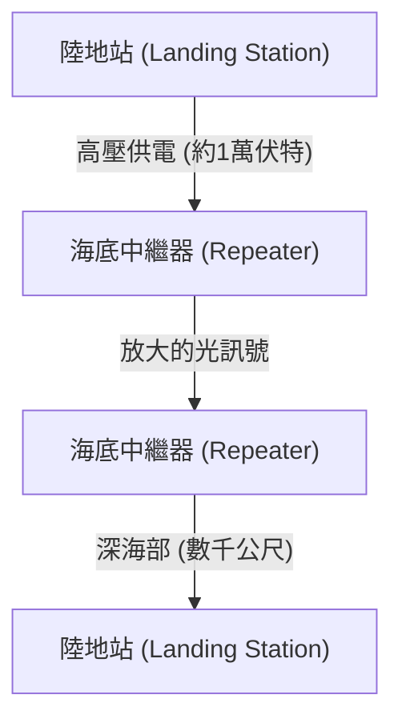

即便使用超低損耗的光纖，光訊號每隔數十公里仍會衰減，因此電纜中途會等距插入「海底中繼器（Repeater）」。為了讓這些中繼器（內建上述的 EDFA）在深海運作，其電力是由兩端的陸地站，透過電纜內的銅管，以數千伏特至高達一萬伏特以上的高壓直流電不間斷地供應。
鋪設時會使用專用的「電纜鋪設船」，在淺海會由水下機器人（ROV）在海底挖溝將電纜埋入。若電纜斷裂，修理船便會火速趕往現場，用抓鬥（類似錨的爪子）將深海的電纜端勾起並拉上船，由熟練的技術人員以數微米的精度對光纖進行熔接，這是一項極其傳統且原始的作業。

### 電波通訊的物理學（Wi-Fi的基礎）

隨著行動裝置與 IoT 的普及，利用空間中飛舞的電磁波（電波）進行通訊，也成為了物理層的主戰場。Wi-Fi（IEEE 802.11 標準系列）主要使用 2.4GHz、5GHz 頻段，以及近年開放的 6GHz 頻段的 ISM 頻段（工業、科學及醫療用頻段，免執照即可使用）。

#### 利用 QAM（正交振幅調變）達成極限資訊壓縮

在將數位資料乘載於類比波的「調變」技術中，Wi-Fi 使用了極其高階的技術，這就是 QAM（Quadrature Amplitude Modulation：正交振幅調變）。
電波這種波具有「振幅（波的高度）」與「相位（波的時機、角度）」這兩個物理量。QAM 是將相位差 90 度的兩種載波（I 訊號與 Q 訊號）合成，透過改變各自的振幅，將位元串分配在星狀圖（Constellation map）上的特定「點」。

例如，若是 16-QAM，則每次波的變化（符號）就能表現 16 個點（4 位元）。在最新的 Wi-Fi 7（802.11be）中，甚至採用了堪稱瘋狂的 4096-QAM 高密度調變，這代表 1 次調變就能表現 4096 個點（12 位元）。在擠滿 4096 個點的星狀圖中，接收端必須不受微小雜訊掩蓋，準確判別出傳送的到底是哪一個「點」。為實現這點，便使用了高階的錯誤更正碼及強大的訊號處理處理器。

#### OFDM 與 MIMO：對抗多路徑與空間的活用

電波不僅會直線前進，還會在牆壁或家具上反射、繞射及散射。因此，發射器發出的電波會通過不同路徑（多路徑），以稍微落差的時機抵達接收器，引發干擾（衰落現象，Fading）並破壞波形。
反過來利用這點，或是為了克服這個問題的技術，就是 OFDM 與 MIMO。

**OFDM（正交分頻多工）** 是一項不使用寬頻、高反彈的單一訊號，而是將頻寬細分為許多極窄的頻率（次載波），並以較慢的速度在各個次載波上平行傳送資料的技術。因為次載波彼此之間被配置為「正交（數學上互相不干擾）」，使得頻率的使用效率極高，也能夠抵抗多路徑造成的延遲落差。

**MIMO（多輸入多輸出）** 是一項使用多根天線，在相同頻率上同時傳送不同資料的「空間多工」技術。它利用多路徑反射使得波在空間不同位置有不同混合方式的特性，讓接收端的多根天線將接收到的複雜訊號如同解聯立方程式般進行分離，使通訊容量隨著天線數量倍增。此外，透過對各天線微調電波相位，將電波波束集中至特定方向的**波束成形（Beamforming）**，也是現代 Wi-Fi 不可或缺的技術。

---

## 2.2 資料連結層（Data Link Layer）：直接連接設備間的對話與秩序

如果物理層只是一個單純的「訊號搬運工」，那麼資料連結層就是負責將那些原始位元串打包成有意義的「影格（Frame）」區塊，並將其確實送到同一網路（連結）內正確目的地的規則與交通管制層。

### 乙太網路（Ethernet）的歷史：從 ALOHA 獲得的靈感

目前，有線區域網路的世界級實質標準是乙太網路（IEEE 802.3）。
其根源可以追溯至夏威夷大學建立的無線通訊網路「ALOHAnet」。ALOHAnet 採用了一種極度無秩序且充滿野心的協定：「如果有資料想傳，總之傳就對了。如果衝突損毀，就等待隨機時間後重傳」。

1973 年，任職於全錄帕羅奧多研究中心（PARC）的羅伯特·梅特卡夫，將 ALOHAnet 的概念應用於同軸電纜上的通訊，發明了乙太網路。早期的乙太網路是「匯流排（Bus）型」拓撲，多台電腦透過被稱為吸血鬼夾（Vampire tap）的探針，刺入一條粗同軸電纜（Yellow cable）並共享使用。

#### CSMA/CD：有秩序的無政府狀態

為了讓所有人共享媒介（電纜），若多個設備同時發送電子訊號，波形就會重疊導致資料損毀，也就是產生「衝突（Collision）」。為迴避及解決此問題的自主分散式演算法，就是「CSMA/CD（載波感測多重存取/碰撞偵測）」。

1. **Carrier Sense（載波感測）**：傳送前測量電纜上的電壓，聆聽是否有人正在通訊。
2. **Multiple Access（多重存取）**：如果沒人正在通訊，任何人皆無須等待中央許可，可逕行傳送。
3. **Collision Detection（碰撞偵測）**：傳送過程中也會監控電纜電壓，若偵測到與自身傳送訊號不同的異常電壓上升，便判定為「碰撞」。隨即發出干擾訊號（Jam signal）通知所有其他人發生碰撞，並中止傳送。
4. **Backoff（退避）**：碰撞後，各節點會等待一段隨機時間（由指數退避演算法計算出的時間）後，再嘗試重新傳送。

這種「以違規（碰撞）會發生為前提，發生後就隨機等待」的簡單且不需中央管理者的機制，正是它能擊敗 IBM 的權杖環（Token Ring）與 ATM 等複雜又昂貴的協定，使乙太網路奪得霸權的最大理由。

### MAC 位址：硬體絕對的身份證明

資料連結層在指定目的地時，會使用 MAC 位址（Media Access Control address）。如果 IP 位址是「暫時的住址」，那麼 MAC 位址就是「與生俱來的身分證字號」。

MAC 位址長度為 48 位元（6 位元組），通常以「00:1A:2B:3C:4D:5E」這類將 2 位數十六進制數用冒號隔開的方式表示。
- **前半 24 位元 (OUI: Organizationally Unique Identifier)**：由 IEEE 管理並分配，用於唯一識別網路設備供應商（如 Apple、Cisco、Intel 等）的企業代碼。
- **後半 24 位元 (UAA: Universally Administered Address)**：供應商分配給自家產品的一連串序號。

原則上，世界上所有網路設備的網路介面卡（NIC），都擁有一個燒錄在 ROM 中、世上獨一無二的 MAC 位址。

### 影格構造：通訊的打包技術

在資料連結層中，會在從網路層傳下來的資料（如 IP 封包等）前後附加標頭（Header）與標尾（Trailer），並以名為「影格（Frame）」的單位進行封裝。乙太網路（Ethernet II）影格的結構極其精鍊，堪稱藝術。

1. **前導碼 (Preamble)**：連續 7 位元組的「10101010」。是為了讓接收端 NIC 進行時脈同步（對齊時機）的準備運動。
2. **SFD (Start Frame Delimiter，起始訊框定界符)**：1 位元組的「10101011」。當前導碼最後變成「11」時，即告訴接收端「這裡開始是正式資料」。
3. **目的 MAC 位址 (Destination MAC) / 來源 MAC 位址 (Source MAC)**：各 6 位元組。表明這是從誰發給誰的通訊。當目的地位址是「FF:FF:FF:FF:FF:FF」時，就是能傳達給所有人的廣播影格。
4. **類型 (EtherType)**：2 位元組。指出負載中的資料是什麼（IPv4 為 0x0800、IPv6 為 0x86DD、ARP 為 0x0806）。
5. **負載 (Data/Payload)**：從上層接管的實際資料。大小從 46 位元組到最大 1500 位元組（MTU：Maximum Transmission Unit，最大傳輸單位）。
6. **FCS (Frame Check Sequence，訊框檢查碼)**：4 位元組的標尾。從整個影格（從目的 MAC 到負載）利用 CRC-32（循環冗餘校驗）多項式計算出來的雜湊值。

接收端的 NIC 會在接收影格的同時，於硬體層級高速計算 CRC。若最後附帶的 FCS 與自身計算結果有哪怕 1 位元的不符，就會視為資料在通訊途中因雜訊或碰撞而受損，並**不作任何通知地毫不留情地將該影格丟棄**。資料連結層確實會做到「偵測錯誤並丟棄」，但並不具備要求「因為資料損壞請重新傳送」的功能。這種將重傳控制的重責大任委託給更上層 TCP 等協定的角色分工，支撐起了網際網路的擴充性。

### 交換器（Switching Hub）的誕生與向全雙工通訊的進化

使用 CSMA/CD 的共享匯流排型乙太網路是個極佳的機制，但卻有個致命弱點：隨著連接網路的設備（主機）增加，碰撞頻繁發生，導致實際輸送量劇減。
從根本上解決這個問題的，是 1990 年代普及的「L2 交換器（Layer 2 Switch，交換式集線器）」。

不同於集線器（Repeater Hub）是將接收到的電子訊號無條件散布到所有連接埠的物理層設備，交換器擁有理解資料連結層的聰明頭腦。
交換器內部擁有使用記憶體（CAM Table）建構的「MAC 位址表」。它會學習連接在各連接埠上設備的來源 MAC 位址，自動建立連接埠與 MAC 位址的對照表。
接著，當影格進入時，交換器會將目的 MAC 位址與對照表比對，「只」將影格發送到連接該設備的連接埠上（轉發，Forwarding）。

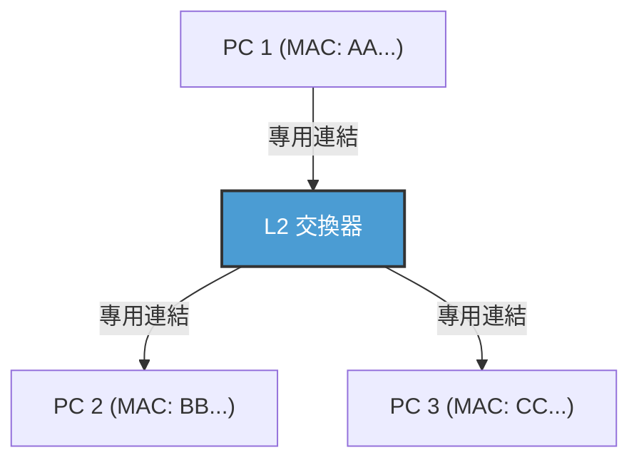

因為交換器的導入，各節點與交換器之間的佈線在邏輯與物理上皆變得獨立（星狀拓撲）。由於通訊路徑被分離，原理上便不再發生碰撞（Collision）。結果就是，能夠實現同時使用傳送與接收線路的「全雙工通訊（Full-Duplex）」。
在現代乙太網路中，CSMA/CD 演算法已不再被使用，已進化為純粹點對點的全雙工通訊。此外，透過 IEEE 802.1Q 的 VLAN（Virtual LAN）技術，使得邏輯網路能不受物理佈線束縛地彈性分割與整合，持續作為支撐企業或巨大資料中心基礎設施的絕對基底技術君臨天下。

### Wi-Fi 的資料連結層：看不見的電波空間交通管制

相較於有線乙太網路進化成無碰撞的全雙工通訊，無線 Wi-Fi 則面臨著和過去共享匯流排型乙太網路相同的艱難課題：「所有人共享相同空間（空氣）這個單一媒介」。

在無線通訊中，由於發送時自己的電波太強，導致物理上不可能同時接收他人的微弱電波來「偵測（CD）」碰撞。此外，無線通訊還有獨特的風險「隱藏終端問題（Hidden Node Problem）」——例如，位於存取點兩側的終端 A 與 C 彼此電波無法互通，但若同時發送，電波就會在存取點上發生碰撞。

因此，在 Wi-Fi 的資料連結層協定（MAC 層）中，採用了「CSMA/CA（載波感測多重存取/碰撞避免：Collision Avoidance）」。
在 CSMA/CA 中，發送前會先監聽空間電波狀況一段時間（DIFS），接著再等待隨機的退避時間後才開始發送。最重要的差異，在於有線網路所沒有的 **ACK（Acknowledge：確認回應）** 機制。在 Wi-Fi 中，接收資料的一方會立刻（在名為 SIFS 的極短等待時間後）送回代表正常接收的 ACK 影格。發送端只有在收到這個 ACK 後，才會判斷通訊成功。若沒有收到 ACK，就會判斷資料因碰撞或干擾而損毀，並將退避時間加倍後嘗試重傳。

此外，為解決隱藏終端問題，還存在著「RTS/CTS 交握」機制。在傳送大量資料前，發送端會先送出名為 RTS（Request to Send：發送請求）的短控制影格，接收端（存取點等）則回傳 CTS（Clear to Send：清除發送）。這個 CTS 包含了預約時間（NAV：Network Allocation Vector）資訊，意思是「接下來的 ○○ 微秒內要通訊，請周圍的終端保持安靜」，收到此資訊的周圍終端便會克制通訊。像這樣，Wi-Fi 的資料連結層在看不見的電波空間中，進行著極為出色的交通管制。

---

## 結語

以光子之姿穿梭於玻璃中、承受深海水壓，並在改變相位與振幅的同時飛舞於空間中的物理現象世界。接著，在這充滿雜訊且充滿不確定性的物理現象之上，鋪設了前導碼同步、MAC 位址個體識別、CRC 嚴密錯誤偵測，以及透過交換技術與 CSMA/CA 進行的精練流量控制；如此一來，才終於實現了「將有意義的資料區塊（影格）無錯誤地送達相鄰設備」。這便是第 1 層與第 2 層所成就的奇蹟。

然而，光靠這樣仍無法形成連結全世界的網際網路。因為基於 MAC 位址的通訊，終究只能在連接於相同交換器或存取點，或是到被路由器阻擋為止的「同一個網路（廣播網域）」這種狹小村莊內通用。

在下一章「第3章：網路層與 IP」中，我們將探討如何將這無數的區域村莊串聯起來，把封包像接力傳水桶般送達地球另一端未知網路的宏大路徑尋找機制，也就是 IP（Internet Protocol）與路由（Routing）的精髓。

# 第3章：網路層與路由機制 —— 跨越汪洋的封包航海圖

我們日常使用的網際網路的骨幹，正是 OSI 參考模型中的第 3 層，也就是「網路層」。能夠超越實體纜線或電波的直接通訊（資料連結層），與數千公里外的伺服器進行全球規模的通訊，其背後有著交織如網的無數路由器，以及它們自主交換資訊的宏大路徑控制（路由）機制。

本章將從 IP（Internet Protocol）的結構開始，探討 IPv4 的極限與 IPv6 的架構，以及連結全球自治系統（AS）的 BGP（Border Gateway Protocol）的深淵。我們將從技術、歷史與物理的角度，極度詳細地探討封包到達目的地所需的「航海術」。

## 3.1 網路層的典範：端對端原則 (End-to-End Principle)

網際網路設計理念中最大的突破，在於「網路中間節點（路由器）僅專注於單純的封包轉發，複雜的處理（錯誤更正與順序保證）則在終端（端點主機）進行」的**端對端 (End-to-End) 原則**。

傳統的電話網（電路交換方式）在通訊開始到結束期間會佔用實體線路，並由整個網路管理狀態（State）。相對於此，網際網路（封包交換方式）的網路層是「無連接 (Connectionless)」的，且不具備狀態。每個封包被視為獨立的「信件」，路由器重複著接收信件、查看目的地並送往最佳下一個中繼點（Next Hop）的單純作業（轉發，Forwarding）。這種「笨拙網路 (Dumb Network)」與「智慧終端 (Smart Terminal)」的組合，正是網際網路得以爆炸性擴展並容納多樣化應用程式的最大原因。

## 3.2 網際網路的地址：IP 位址的演進與枯竭歷史

網路上的所有設備都會被賦予一個獨一無二的識別碼，即 IP 位址。目前網際網路正處於過渡期，混合了兩代 IP 協定。

### IPv4：32 位元空間與對抗枯竭

1981 年在 RFC 791 中定義的 IPv4，擁有 32 位元（約 43 億個）的空間。在設計之初，43 億這個數字感覺無比龐大，但隨著網際網路的爆炸性普及，在 1990 年代就已經開始出現枯竭的危機。

為了克服這個危機而誕生的，是 **CIDR (Classless Inter-Domain Routing)** 和 **NAT (Network Address Translation)**。
早期的 IP 位址分配，是採用 Class A (/8)、Class B (/16)、Class C (/24) 這種粗略的「有級別 (Classful)」方式進行，導致了嚴重的位址浪費。CIDR 將其替換為可變長度子網路遮罩 (VLSM)，實現了依需求分配位址的「無級別 (Classless)」路由。
此外，隨著 NAT 的出現，透過將私有 IPv4 位址空間與單一全球 IPv4 位址綁定，使得數千台設備能共用一個位址。然而，NAT 破壞了端對端原則，導致在 P2P 通訊和即時通訊中，需要複雜的 NAT 穿透技術（如 STUN/TURN/ICE）。

### IPv6：128 位元的無限空間與次世代標頭結構

作為位址枯竭的根本解決方案，1998 年在 RFC 2460 中制定了 **IPv6**。IPv6 擁有 128 位元的位址空間，提供了 $2^{128}$（約 340 澗）個，即使將位址分配給地球上所有的沙粒也綽綽有餘的廣闊空間。

IPv6 的革新性不僅在於位址的長度，還對標頭結構進行了大幅的簡化。廢除了 IPv4 標頭中的可變長度選項和標頭檢查碼，基本標頭固定為 40 位元組。這使得硬體（ASIC 和 TCAM）處理封包（路由）的速度加快。此外，分片（封包分割）不再由中間路由器進行，而是改為僅由發送端主機進行，大幅減輕了路由器的負擔。

## 3.3 路由的雙面性：控制層面與資料層面

路由器的內部，大致可以分為兩個「層面 (Plane)」。

1. **控制層面 (Control Plane)**
   這是路由器的「大腦」，路由器之間使用路由協定（如 OSPF 或 BGP）互相通訊，學習網路拓撲（連接型態），並計算最佳路徑。計算結果會儲存在稱為 RIB (Routing Information Base) 的資料庫中。
2. **資料層面 (Data Plane)**
   這是路由器的「肌肉」，實際接收封包，根據目的地 IP 位址決定下一個發送封包的介面，並進行轉發。使用從 RIB 生成、專注於轉發的 FIB (Forwarding Information Base) 表，以及 TCAM (Ternary Content-Addressable Memory) 等特殊記憶體，以奈秒級的硬體線速轉發封包。

## 3.4 網路的內部統治：IGP 與自治系統 (AS)

網際網路並非單一的巨大網路，而是由 ISP（網際網路服務供應商）、企業、大學等各自管理的獨立網路集合體。這個獨立的管理區域稱為 **AS (Autonomous System：自治系統)**。目前全球有超過十萬個以上的 AS 存在。

AS 內部（企業內或 ISP 骨幹內）的路由，使用的是 **IGP (Interior Gateway Protocol)**。代表性的 IGP 有以下兩種：

- **OSPF (Open Shortest Path First) / IS-IS**
  這些是「鏈路狀態 (Link State)」型的路由協定。路由器將自身周圍的連接狀態（鏈路的頻寬與狀態）向整個網路進行泛洪 (Flooding)，每台路由器藉此建構整個網路的完整地圖（拓撲資料庫）。在該地圖上，執行 Dijkstra 演算法（最短路徑演算法），計算出到達目的地「成本」最小的路徑。這與汽車導航考慮塞車資訊來計算最短路線，在物理和數學上的方法是相同的。

## 3.5 BGP：編織網際網路的「外交」協定

在 AS 內部由 OSPF 等協定統治的同時，將各個 AS 連結起來，形成全球網際網路的，是 **EGP (Exterior Gateway Protocol)** 唯一的事實標準：**BGP (Border Gateway Protocol)**。BGP 是一個極為特殊的協定，它不僅考量技術上的最短距離，還會反映「商業關係」和「國家政策」來決定路徑。

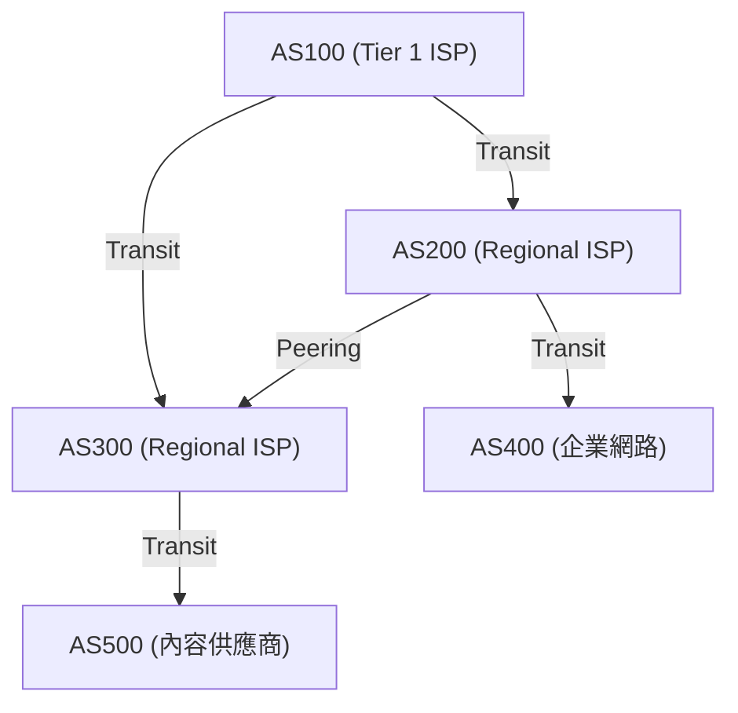

### 對等互連 (Peering) 與轉接 (Transit)：網際網路經濟學

透過 BGP 進行的 AS 間連接，主要可以分為兩種商業模式。

1. **轉接 (Transit)**
   小規模的 ISP 或企業向巨大的 ISP 支付通訊費用，以獲得前往網際網路所有地方的可達性（完整路由）。這相當於「顧客」與「供應商」的主從關係。
2. **對等互連 (Peering)**
   ISP 之間，或是 ISP 與內容供應商（如 Google 或 Netflix），透過 IX（網際網路交換中心）等介面，將彼此的網路直接連接。通常是無償的 (Settlement-Free)，目的是捷徑化流量與降低成本。

### 路徑向量與 BGP 的路由選擇演算法

BGP 是「路徑向量 (Path Vector)」型協定。在到達特定 IP 網路之前，會將經過了哪些 AS (AS_PATH) 作為屬性保存。例如，若路由資訊中寫著 `AS_PATH: [200, 100, 500]`，封包就會按照這個順序通過 AS。這能確實地防止路由迴圈。

當 BGP 路由器收到前往同一目的地的多條路徑時，會根據複雜的優先順序（Local Preference、AS_PATH 長度、MED、eBGP/iBGP 差異等）選擇唯一的一條最佳路徑。其中 **Local Preference (本地偏好)** 屬性特別強大，它可以強制路由器遵守商業政策，例如：「即使技術上繞遠路，但走 Peering 線路不需花費 Transit 費用，所以優先選擇這條路」。

### BGP 劫持與路由脆弱性

BGP 原本是基於「性善說」設計的。因為它相信「別人宣告的路由資訊是正確的」，如果惡意或設定錯誤的 AS 發送了「我擁有前往 Google 網路 (8.8.8.8/32) 的最佳路徑」的錯誤 BGP 更新，全世界的流量就會被吸入該 AS，這就引發了 **BGP 劫持 (BGP Hijacking)**。
歷史上，因為巴基斯坦政府封鎖 YouTube 的餘波導致全球 YouTube 癱瘓的事件（2008 年）等，利用 BGP 脆弱性引發的大規模故障不勝枚舉。目前正在推動導入 RPKI (Resource Public Key Infrastructure) 等運用密碼技術的路由資訊驗證機制。

## 3.6 物理限制與路由器的戰鬥：延遲與緩衝區膨脹 (Bufferbloat)

網路層的路由，始終是一場與物理學限制的戰鬥。
光在光纖中行進的速度約為真空中光速的 67%（約每秒 20 萬公里），因此從日本到美國西岸來回 (RTT) 約 100 到 120 毫秒的物理延遲（傳播延遲）是無可避免的。

除此之外，還存在各路由器上的處理延遲，以及**排隊延遲 (Queueing Delay)**。在網路擁塞時，路由器會將封包暫時累積在記憶體（緩衝區）中。由於近年來的路由器配備了大容量記憶體，出現了不丟棄封包而持續吸收長期擁塞的現象。這就是**緩衝區膨脹 (Bufferbloat)**。由於大量封包持續滯留在緩衝區，導致 TCP 等上層的擁塞控制無法正常運作，結果引發了極端的延遲（數千毫秒）。為了解決這個問題，現代的路由器和作業系統中實作了 AQM (Active Queue Management) 和 FQ-CoDel 等先進的佇列管理演算法。

## 總結

第 3 層・網路層不單純只是資料的搬運工。這裡交織著從 IPv4 到 IPv6 的歷史轉變、使用 TCAM 的奈秒級硬體處理、利用 OSPF 進行的數學最短路徑探索，以及透過 BGP 進行、帶有經濟與政治意圖的自治分散式路由控制。
一個 IP 封包從你的智慧型手機到達地球另一端的伺服器，期間有無數的路由器瞬間參考各自的地圖（路由表），像接力賽傳遞接力棒一樣不斷傳遞封包，這是人類所建構的最龐大、最複雜的系統運作。

下一章將解說建立在這個網路層之上，負責確保封包送達與擁塞控制的「傳輸層 (TCP/UDP)」機制。

# 第4章：傳輸層的確定性與速度 —— 支撐資訊傳遞的終極兩難

## 1. 導論：端到端原則與傳輸層的使命

在前面的章節中所看到的網路層（IP）的主要任務，是跨越廣闊的網際網路海洋，將封包物理且邏輯地「傳送到目的電腦（主機的網路介面）」。然而，封包僅僅到達目的主機，通訊並未完成。現代電腦系統在作業系統上同時進行多工處理，平行執行著眾多的應用程式處理程序（網頁瀏覽器、電子郵件客戶端、影片串流應用程式、背景同步處理程序、API服務等）。

從網路層雜亂無章地不斷傳來的封包堆中，辨識出哪個封包屬於哪個應用程式，將其重新建構成有意義的資料串流，或者在有遺失時進行修補。在端點擔任這項最終資料管理全權責任的，就是「傳輸層（Transport Layer）」。

網際網路設計思想的根基中，存在著一個非常優美且強大的架構決策，稱為「端到端原則（End-to-End Principle）」。這是由 Jerome Saltzer 等人於 1981 年提出的概念，該原則認為「網路的中間節點（路由器和交換機）應盡可能專注於單純的封包轉發（笨網路），而將錯誤還原、順序控制、加密等複雜處理交由位於通訊末端的主機（智慧端點）來承擔」。如果讓網路的中間設備具備複雜的狀態管理或錯誤更正功能，網際網路絕對無法獲得如今世界規模的爆發性擴展性。

傳輸層始終在物理學限制與資訊理論的夾縫中面臨著一個根本的兩難。那就是「確定性（Reliability）」與「速度（Speed / Low Latency）」的取捨。為了不遺漏任何一項資訊地傳遞，需要確認和重傳的額外負擔，這會引發伴隨光速物理極限的延遲。另一方面，如果想要將延遲降到最低，就不得不犧牲部分資訊的完整性。根據如何解決這個植根於物理法則的兩難，以及為應用程式提供何種抽象化，TCP、UDP 以及現代的 QUIC 等不同的協定被設計出來，並經歷了不斷的演進。

## 2. TCP（Transmission Control Protocol）：確保確定性的堅固機制

TCP 在網際網路還被稱為 ARPANET 的商業化之前的 1970 年代，由 Vinton Cerf 與 Robert Kahn 奠定了基礎。其設計哲學非常明確。「無論在多麼惡劣的網路環境下，即使是封包遺失頻繁的不穩定線路，也要保證資料毫無遺漏、順序正確且不重複地送達對方的應用程式」。只要使用 TCP，應用程式開發者就完全不需要在意背後網路的複雜性或封包遺失，只需將資料視為「連續的位元組串流」進行讀寫即可，提供了強大的抽象化。

### 透過連接埠號進行多工處理（Multiplexing）
如果說 IP 位址是代表「地球上哪棟建築物」的地址，那麼傳輸層的「連接埠號（Port Number）」就相當於指示「寄給那棟建築物的哪個房間（哪個處理程序）」的邏輯窗口。連接埠號以 16 位元的無號整數表示，數值範圍從 0 到 65535。
藉由這樣的方式，在單一 IP 位址與單一實體網路介面上，可以同時對數千到數萬個不同的通訊進行多工處理（Multiplexing）。例如，HTTP 是 80 號，HTTPS 是 443 號，SSH 是 22 號等，主要的服務已預先被分配了被稱為「公認連接埠（Well-Known Ports）」的號碼。

### 三向交握：信任的建立與物理延遲
TCP 在開始通訊之前，必定會在傳送端和接收端之間進行建立邏輯「連線（Connection）」的儀式。這就是「三向交握（3-Way Handshake）」。這不僅僅是確認通訊意願，對於即將開始的龐大資料交換來說，還具有狀態空間同步（Synchronization）的極其重要意義。

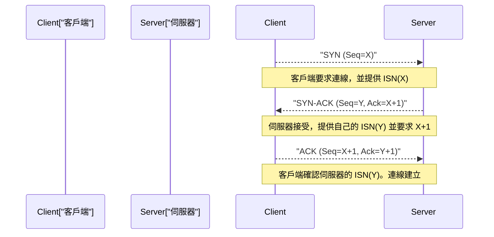

1. **SYN (Synchronize):** 客戶端向伺服器發送同步請求封包（設定了 SYN 旗標的 TCP 區段）。此時，會提供一個隨機生成的 32 位元「初始序號（ISN: Initial Sequence Number，這裡假設為 X）」。ISN 不從零或固定值開始是有原因的。這是為了防止在過去建立且已斷開的同一 IP 與連接埠之間的通訊中，「在網路上迷路而延遲到達的舊封包（幽靈封包）」被誤認為是新通訊的封包，同時也帶有密碼學上的意義，用於防止攻擊者猜測序號以插入偽造資料的 TCP 序號預測攻擊（IP 欺騙）。
2. **SYN-ACK:** 伺服器接受連線請求後，會將客戶端的 ISN 加上 1 的值（X+1）作為「確認回應號碼（Acknowledgment Number）」返回，同時回傳附加上伺服器自身隨機初始序號（Y）的 SYN-ACK 封包。
3. **ACK (Acknowledgment):** 客戶端作為正確接收到伺服器 ISN 的證明，會發送一個將 Y+1 作為確認回應號碼的 ACK 封包。

當這三次封包的交換完成時，雙向的通訊狀態就在記憶體中被保留，並準備好進行資料傳輸。然而，這個嚴格的程序承載著通訊基礎設施物理極限的重擔。那就是「光速」。
真空中的光速約為每秒 30 萬公里，但由於網際網路主要骨幹光纖核心（石英玻璃）的折射率，光訊號的傳播速度會降至其約三分之二（約每秒 20 萬公里）。此外，還要加上途中路由器進行路由處理與交換機帶來的佇列延遲。結果，例如在東京與紐約之間（直線距離約 11,000 公里，實際電纜長度更長）來回一次的時間（1 RTT: Round Trip Time）在物理上無可避免地需要 150 到 200 毫秒。TCP 的三向交握至少會消耗這 1 RTT，因此無論將頻寬擴展得再大，建立連線時的延遲（Latency）都會受制於光速這個宇宙絕對法則。

### 滑動視窗與順序控制、檢查碼
進入資料傳輸階段後，TCP 會將從應用程式接收到的位元組串流，分割成適當大小（MSS: Maximum Segment Size，通常是 IP 的 MTU 減去標頭大小約 1460 位元組）的區段進行發送。每個區段都會根據資料位元組數分配一個序號，接收端會以此為基礎，即使封包順序錯亂地到達（Out of Order），也能將原始資料重新排列成正確的順序。

此外，TCP 標頭中包含 16 位元的「檢查碼（Checksum）」，會使用一補數和運算來嚴格驗證資料在傳輸路徑上是否因電子雜訊或路由器的記憶體錯誤等原因發生了位元反轉（損壞）。

如果途中封包遺失（封包遺失）或因損壞而被丟棄，接收端會不斷回傳期望序號的 ACK（重複 ACK），或者什麼也不回傳。當發送端在一定時間（RTO: Retransmission Timeout）內沒有收到 ACK，或偵測到重複 ACK 時，就會「重傳（Retransmit）」該封包。

在這個機制中，大幅提升通訊速度的是「滑動視窗（Sliding Window）」的概念。「發送一個封包後，直到收到其 ACK 才發送下一個封包（Stop-and-Wait）」的方式，在前面提到的高延遲環境（RTT 較大的環境）中，會導致吞吐量陷入令人絕望的低落。
在滑動視窗方式中，傳送端與接收端會考慮彼此的緩衝區容量，動態地協議「視窗大小（一次可發送的未確認資料的最大位元組數）」。傳送端無需等待接收端傳來的 ACK，就能在這個視窗大小的範圍內，不斷地連續將封包送出到網路上。然後每當收到 ACK 時，這個可發送的範圍（視窗）就會向前滑動。這實現了在粗線路且高延遲網路（BDP: Bandwidth-Delay Product，頻寬延遲積較大的環境）中「讓管線持續充滿資料」的頻寬最大化利用機制。

### 壅塞控制（Congestion Control）：防止網路崩潰的數學調和
TCP 的真正傑作，可以說是網際網路歷史上最重要的技術突破之一，那就是「壅塞控制（Congestion Control）」。

1986 年，早期的網際網路（NSFNET）由於通訊量的增加，面臨了被稱為「壅塞崩潰（Congestion Collapse）」的致命系統故障。超過網路處理能力的資料湧入，導致路由器的佇列（緩衝記憶體）溢出，大量封包被丟棄。偵測到封包遺失的 TCP 端點認為資料未送達，便一齊進行封包的「重傳」。這導致更多的資料被注入網路，路由器更加超載，實質吞吐量急遽下降至過去的數千分之一，陷入了毀滅性的惡性循環。

為了防止這種網路死亡，Van Jacobson 等人於 1988 年在 TCP 中引入了先進的動態控制演算法。其核心是基於「AIMD（Additive Increase Multiplicative Decrease：加法增加，乘法減少）」原則的壅塞視窗（cwnd: Congestion Window）控制。

1. **慢啟動 (Slow Start):** 通訊剛開始時，網路的可用容量完全未知。因此，將發送視窗大小從極小的值（歷史上是 1 MSS，現代約為 10 MSS）開始，每收到一個 ACK 就將視窗大小增加 1 MSS。這結果帶來了「每 1 RTT 視窗大小就變為 2 倍」的指數成長。儘管名為「慢」，但這是一個極具攻擊性且能在短時間內探索極限頻寬的階段。
2. **壅塞避免 (Congestion Avoidance):** 當視窗大小達到預設的閾值（ssthresh: Slow Start Threshold）時，就會停止指數成長，切換為線性增加（每 1 RTT 增加 1 MSS）。這是一個更謹慎地探索網路極限容量（管線粗細）的階段。
3. **封包遺失的偵測與乘法減少:** TCP 將封包遺失（發生逾時，或連續收到 3 次來自接收端的重複 ACK）不單純視為傳輸錯誤，而是解讀為「網路路徑上發生了塞車（壅塞），封包從路由器緩衝區溢出掉落的跡象」。在這個瞬間，TCP 會立即啟動自我控制，將發送視窗大小一口氣大幅減少至一半（或慢啟動的初始值）。

藉由這種「一點一滴地分享頻寬（加法增加），一旦發生問題就一口氣讓出（乘法減少）」的數學且利他主義的分散式演算法，網際網路上數億、數十億個獨立的 TCP 連線，即使在沒有集中式流量管理者的情況下，依然保持著「公平分配頻寬」與「整個網路穩定運作」的奇蹟般調和（體內平衡）。

近年來，路由器緩衝記憶體的大容量化反而產生了反效果，在因壅塞導致封包丟棄發生之前，封包會持續滯留在不斷變長的佇列中，導致延遲（Ping 值）飆升至數百毫秒甚至數秒，這種被稱為「緩衝區膨脹（Bufferbloat）」的新物理現象成為了問題。為了解決這個問題，Google 等公司開發了 BBR（Bottleneck Bandwidth and Round-trip propagation time）等最新的壅塞控制演算法，不以封包遺失而是以「RTT（延遲時間）的增加」作為壅塞跡象，在緩衝區溢出前主動限制發送速度，這正逐漸成為現代 TCP 的標準。

## 3. UDP（User Datagram Protocol）：為了速度而削減

如果說 TCP 是一個透過複雜的狀態轉換與高階演算法來保證資料完全確定性的「過度保護管理者」，那麼同屬於傳輸層的 UDP 就是一個將協定作用削減到極限的「極簡搬運工」。由 Jon Postel 於 1980 年設計的 UDP，只具備傳輸層最基本的功能。

UDP 的標頭僅有短短的 8 個位元組（TCP 標頭通常為 20 位元組，包含選項時最大可達 60 位元組）。其中包含的只有「來源連接埠號」、「目的連接埠號」、「資料長度」，以及用來偵測資料損壞的簡單「檢查碼」。

無論是透過三向交握事前建立連線、透過序號保證順序、透過滑動視窗進行流量控制、重傳處理，還是為了保護網路的壅塞控制，UDP 全都沒有實作。它只負責將應用程式交給它的資料直接包進 IP 資料報中扔進網路層，以「射後不理（Fire and Forget）」的方式發送出去。它甚至不在乎對方是否收到。

然而，這種可以說是毫不負責任的結構單純性，正是 UDP 最大的武器，也是在特定使用情境下能超越 TCP 的原因。

### UDP 的真正價值：延遲至上主義與即時通訊
在必須將物理延遲降至極限的即時通訊中，TCP 那種「為了保證確定性的重傳控制」反而會引起致命的問題。

例如，請想像 FPS（第一人稱射擊）等線上遊戲、語音通話（VoIP），或視訊會議系統（如 Zoom 或 WebRTC）。在這些應用程式中，會以每秒數十次到數百次的頻率發送最新位置資訊或語音樣本的封包。
如果使用 TCP，且 100 毫秒前發送的語音封包在途中的路由器遺失了。TCP 會偵測到該遺失並重傳封包，試圖在接收端以正確的順序播放。然而，在對話或遊戲即時進行的環境中，「延遲數百毫秒送達的過去資料」已經毫無價值。
不僅如此，在遺失的封包被重傳並補齊順序之前，TCP 會停止處理（移交給應用程式）已經到達的後續新封包，並將其緩衝起來。這被稱為「隊頭阻塞（Head-of-Line, HoL Blocking）」。語音斷斷續續，或是遊戲畫面凍結數秒後一口氣快轉的現象，大多是由於這種 TCP 等待重傳所造成的隊頭阻塞引起的。

在這種情況下，UDP 能夠乾脆地放棄遺失的過去封包，讓應用程式立即處理當下到達的最新封包。在即時通訊中，與「備齊所有資料」相比，「即使有一些雜訊或掉幀，也能始終以最短的延遲持續描繪最新狀態」，對人類的感覺器官來說，會帶來自然且舒適得多的使用者體驗。

此外，像 DNS（網域名稱系統）的名稱解析，或 NTP（網路時間協定）的時間同步這樣，一個簡單的交易通訊（對於「一個小請求封包」，以「一個回應封包」完結），完全沒有交握額外負擔的 UDP 也是最適合的。

## 4. QUIC：網際網路通訊的典範轉移與次世代協定

從網際網路黎明期以來的數十年間，我們的網路架構一直被「想要確實的串流傳輸就用 TCP，想要速度和即時性就用 UDP」這種固化的二元論所束縛。然而，在現代 Web 的急遽演進中（特別是行動通訊的普及，以及平行載入大量資源的 HTTP/2 時代），TCP 根本設計本身成為枷鎖的極限開始暴露出來。

其中最大的問題，就是前面在 UDP 段落也提到過的 TCP 特有的「隊頭阻塞（HoL Blocking）」，以及伴隨建立連線而來的「過度延遲」。
TCP 將所有的通訊作為「單一的序列位元組串流」來管理。假設為了顯示最新的網站，在 HTTP/2 上同時（多工處理）請求了 HTML、CSS、JavaScript 以及數十張圖片等複數檔案。但因為在底層的 TCP 層級是一條串流，假設只有「圖片 A」的一個封包遺失了，TCP 層在該封包重傳完成之前，甚至會將本應毫無關聯的「腳本 B」或「圖片 C」封包的移交也在作業系統核心層級給阻擋下來。
此外，現代 Web 必須具備加密（TLS/HTTPS），但在傳統的通訊協定堆疊中，是在完成「TCP 的三向交握（1 RTT）」之後，才重新進行「TLS 加密金鑰交換的交握（1〜2 RTT）」，因此在實際開始安全的資料傳送前，會消耗高達 2〜3 RTT 的龐大物理延遲。

為了解決這些根本問題，並為現代網際網路基礎設施帶來典範轉移，由 Google 主導開發，並經由 IETF（網際網路工程任務組）標準化的次世代傳輸協定就是「QUIC（Quick UDP Internet Connections）」。而將這個 QUIC 作為基礎協定重新定義的 Web 規格，就是「HTTP/3」。

### 中間盒子的僵化與向使用者空間的逃脫
QUIC 最具突破性的方法，在於**「在現有的 UDP 封包之上，於使用者空間重新建構了一個整合了加密與多工處理的全新傳輸層」**這樣大膽的架構設計。

為什麼不是改良 TCP，而是建構在 UDP 之上呢？網際網路上無數的路由器、防火牆、NAT（網路位址轉換）等「中間盒子」，因為長年的運作，已經變得僵化，會不分青紅皂白地將 TCP 和 UDP 以外的新協定（新協定編號）視為「未知的威脅」而丟棄（這被稱為網際網路的骨化現象：Ossification）。另外，TCP 的實作深深地寫死在 Windows 或 Linux 等作業系統的核心（Kernel）中，要更新全世界的作業系統以普及新的演算法，需要花費無比漫長的歲月。
因此 QUIC 採取了一項策略，對中間盒子來說它只是作為「傳統的 UDP 封包」通過，但在瀏覽器或應用程式（使用者空間）內部，卻獨自實作了將 TCP 的優點（壅塞控制與重傳控制）進行更高度演進的狀態。

### QUIC 的創新機制與對物理限制的超越

1. **藉由串流獨立性完全消除 HoL 阻塞：**
   QUIC 並非將封包視為單一串流，而是具備在協定層級管理多個邏輯上「獨立的串流」的功能。以前面的例子來說，即使圖片 A 的封包在途中遺失，QUIC 僅會暫停圖片 A 的串流等待重傳，腳本 B 或圖片 C 的串流則完全不受影響地繼續平行處理。這使得在封包遺失頻繁的行動網路等環境中，網頁的顯示速度獲得顯著提升。
2. **0-RTT（零 RTT）的連線建立與加密的整合：**
   QUIC 從一開始就將相當於 TLS 1.3 的加密技術深度整合到協定中。它不會犯下像 TCP 那樣將「傳輸連線」和「加密連線」分開的愚蠢錯誤。即使是初次通訊的伺服器，也只需 1 RTT 就能完成連線與加密金鑰的交換。更具突破性的是，如果是曾經通訊過的伺服器（擁有快取連線票證的伺服器），就能實現「0-RTT」，也就是**無需等待交握，即可在發送第一個資料封包的同時開始 HTTP 請求**。這對於「光速造成的延遲」這項物理限制來說，是來自協定設計上極為漂亮的回應。
3. **連線轉移（不依賴 IP 位址）：**
   傳統的 TCP 連線被緊緊綁死在「來源 IP、來源連接埠、目的 IP、目的連接埠」這 4 個要素（4-tuple）上。因此，當使用者帶著智慧型手機，從 Wi-Fi 環境走到戶外切換到 4G/5G 行動網路，IP 位址改變的瞬間，TCP 連線就會斷開，必須從耗時的交握重新開始。
   另一方面，QUIC 不使用 IP 位址，而是使用通訊開始時產生的專屬「連線 ID（Connection ID）」來管理每個連線。因此，即使實體的 IP 位址或網路介面動態改變，只要連線 ID 相同，就能在完全不斷線的情況下無縫地繼續影片串流或下載大型檔案。在行動通訊成為主流的現代，這可以說是一項極為強大且必然的特性。

## 5. 結語：統御混沌的協定演進與秩序建構

在網際網路網路層（IP）這個總是變動、路徑切換、封包遺失與順序顛倒如家常便飯的混沌（Chaos）之上，傳輸層建立起了讓應用程式能夠安心使用的「堅固邏輯秩序」。

由 Vinton Cerf 和 Van Jacobson 等人設計並磨練出來的 TCP 堅固的數學模型與壅塞控制，至今仍保護著網際網路的骨幹免於崩潰，持續支撐著全世界的資料傳輸。而 UDP 的簡單性，則回應了追求物理延遲極限的即時通訊需求。此外，為克服兩者的限制而誕生，融合了加密與多工處理，針對現代行動環境進行最佳化的 QUIC 協定，擁有洗鍊的架構。

這些全部都是人類為了解決「在相隔遙遠的電腦之間，在有限的頻寬與光速之壁等物理限制下，如何正確且快速地傳遞資訊」這個問題，不斷進行技術探索的結晶。

當封包被重新排列成正確的順序，終於作為有意義的資料塊移交給應用程式時，單純的電子訊號羅列，才終於開始具備作為「資訊」的價值。在下一章中，我們將深入探討建構在這個傳輸層所提供的堅固基礎之上，並直接形塑我們日常接觸的 Web 世界的「應用層（HTTP、DNS 等）」的機制深淵。

# 第5章：應用層與Web的幕後 —— 從名稱解析到加密通訊的深淵

在前面的章節中，我們從光子在光纖內全反射前進、電磁波在銅線內傳播等實體層的行為開始，深入探討了基於IP的封包路由，以及TCP/UDP在傳輸層資料傳輸的可靠性。本章中，我們終於要踏入人類直接接觸的領域，也就是「應用層」。

OSI參考模型中的第7層（應用層）、第6層（展示層）、第5層（會議層），在現代的TCP/IP階層模型中通常被整合為單一的「應用層」來探討。應用層位於抽象化的最頂端，是由多種協定交織而成的複雜生態系統。在這裡，我們將極致解剖從在瀏覽器網址列輸入URL到網頁顯示的背後活躍著的機制：DNS的名稱解析、HTTP的資源傳輸，以及現代網際網路不可缺少的SSL/TLS加密機制，並從歷史脈絡、網路工程學及高等數學的視角進行深入剖析。

## 5.1 DNS（Domain Name System）：分散式階層資料庫的奇蹟與系譜

IP位址（IPv4的32位元數值、IPv6的128位元數值）雖然最適合用來建構路由器和交換器等網路設備轉發封包的路由表，但完全不適合人類直覺地記憶、賦予意義並處理。

在網際網路的起源ARPANET的黎明期，主機名稱與網路位址的對應是透過極為原始的手法來管理的。史丹佛研究所（SRI）的網路資訊中心（NIC）集中管理著一個單一的純文字檔案 `HOSTS.TXT`，各個節點會在夜間透過FTP下載此檔案，以更新自身的本機系統。然而，進入1980年代後，連接到網路的主機數量開始呈現指數級的爆炸性成長，這種集中式模型便暴露出流量瓶頸、更新延遲，以及名稱衝突（命名空間枯竭）等致命的極限。

為了解決這個可擴展性（Scalability）的危機，1983年由保羅·莫卡佩特里斯（Paul Mockapetris）設計並提倡的，正是被定義為RFC 882及RFC 883的DNS（Domain Name System）。DNS架構的本質，是一個全球規模的分散式階層Key-Value Store。為了排除單點故障並具備近乎無限的擴展性，這個系統採用了將網域空間分割成樹狀結構，並將各個管理權限進行委派（Delegation）的劃時代分散式典範。

### 名稱解析的無盡旅程：從存根解析器到權威伺服器

當使用者在瀏覽器的多功能網址列中輸入 `https://www.example.com` 的瞬間，作業系統內部的存根解析器（Stub Resolver）就會啟動，並在背景揭開一場壯闊的「名稱解析之旅」的序幕。這個過程，也是一連串為了迴避網路延遲此一物理法則限制而採用的快取策略。

1. **多層快取的查詢**: 首先，會確認延遲最低的本機瀏覽器快取。接著查詢OS的DNS快取，再進一步查詢區域網路上路由器的DNS快取。要克服光速（在真空中大約每秒30萬公里，在光纖內大約為其三分之二）的物理限制，最有效的手段就是根本不產生網路通訊。
2. **對遞迴解析器（完整解析器）發出查詢**: 如果本機不存在快取，查詢就會被發送到ISP或公共DNS供應商（如Google的 `8.8.8.8` 或 Cloudflare的 `1.1.1.1` 等）所維運的遞迴解析器（Recursive Resolver / Full Resolver）。這個解析器會代替用戶端承擔名稱解析的整個過程。
3. **對根伺服器（Root Server）的迭代查詢**: 如果完整解析器的快取中也沒有對應的紀錄，完整解析器就會向網域階層絕對頂點的「根伺服器」進行查詢。目前世界上有從A到M共13個叢集的根伺服器。根伺服器並不會直接知道 `www.example.com` 的IP位址，而是會回應（Referral：委派回應）管理 `.com` 這個TLD（Top Level Domain，頂級網域）的名稱伺服器清單。另外，散布在世界各地的根伺服器透過「任播（Anycast）」路由技術共用IP位址，藉由BGP（Border Gateway Protocol）的路由選擇，流量會自動地被引導到距離用戶端物理上及網路拓樸上最近的伺服器。
4. **對TLD伺服器的迭代查詢**: 接著，完整解析器會向被推薦的 `.com` TLD伺服器群之一發出查詢。TLD伺服器會回傳被委派管理 `example.com` 權限的權威（Authoritative）DNS伺服器（名稱伺服器）的IP位址（NS紀錄）。
5. **對權威DNS伺服器的查詢與紀錄的取得**: 最後，完整解析器會直接存取 `example.com` 的權威DNS伺服器。在權威伺服器的區域檔中，寫有作為最終解答的 `www` 的A紀錄（IPv4位址）或AAAA紀錄（IPv6位址），或者是CNAME紀錄（別名），這些紀錄會經由完整解析器回傳給用戶端的存根解析器。

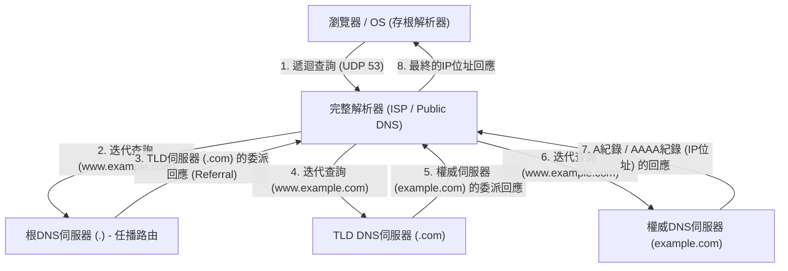

這種複雜的階層型往返通訊，通常會在短短幾毫秒到幾十毫秒的剎那間完成。DNS作為傳輸層協定，主要使用UDP的連接埠53。藉由完全排除TCP的三向交握（SYN, SYN-ACK, ACK）的往返負擔，實現了極致的延遲降低。然而，當DNS的回應負載超過歷史上的UDP限制512位元組（目前透過EDNS0擴充已經可以更大），或是要進行防止DNS快取毒化攻擊的密碼學數位簽章擴充DNSSEC（DNS Security Extensions）的金鑰驗證，又或者是進行區域轉送（AXFR）時，則規定會退回（Fallback）使用具備高可靠性的TCP連接埠53。

## 5.2 HTTP架構與協定的演化論

透過DNS獲得目標伺服器IP位址的瀏覽器，接下來會與目標伺服器（連接埠80或443）之間建立TCP連線，並開始透過應用層的主要語言HTTP（HyperText Transfer Protocol）進行對話。

1989年，由歐洲核子研究組織（CERN）的提姆·柏內茲-李（Tim Berners-Lee）所發明的HTTP，原本是為了解決世界各地的物理學家們能夠有效率地透過網路分享研究文件（超文本），並用連結將它們串接起來，而設計的極為簡潔的協定。請求行（方法、URI、協定版本）、標頭欄位、空行（CRLF），以及訊息主體（Message Body），這種基於純文字且明快的結構，強烈地推動了系統的除錯與普及。

HTTP根本的設計思想，也是其最大的特徵，就是「無狀態（Stateless）」。伺服器完全不會在記憶體中保留用戶端過去的請求狀態或情境。每一個請求都作為一個完全獨立的交易（Transaction）來完成。這種也通往REST（Representational State Transfer）架構的無狀態性，大幅簡化了伺服器的實作，使得為了處理龐大流量而水平增加伺服器數量的橫向擴展（Scale-out / 負載平衡）變得容易。負載平衡器無論將請求分配給哪一台後端伺服器，都能保證相同的結果。然而，在像是電商網站的購物車功能或是維持使用者的登入狀態等，無法避免狀態（State）管理的現代互動式Web應用程式中，這種嚴格的無狀態性反而成了一大限制。為了解決這個協定之外的難題，因而發明了透過HTTP標頭讓用戶端儲存狀態的Cookie，以及使用工作階段權杖（Session Token）的擬似狀態管理機制。

### 與物理限制的搏鬥：從HTTP/1.1到HTTP/3的典範轉移

隨著Web的爆炸性普及，以及單一頁面所包含的資源（圖片、CSS、JavaScript檔案等）越來越龐大，HTTP面臨了網路的物理法則（因光速造成的延遲限制與封包遺失），並在協定層級進行了戲劇性的架構演化。

- **HTTP/1.1 (1997年 - )**: 在最初的HTTP/1.0中，每請求一個資源，就會重複進行TCP連線的建立與斷開（三向交握與四向交握），從延遲的角度來看，是極度缺乏效率的。在HTTP/1.1中，持續連線（Persistent Connection / Keep-Alive）被標準化，透過讓單一TCP連線可以被重複使用，大幅削減了連線成本。然而，HTTP/1.1的管線化（Pipelining）技術因為實作困難以及中間代理伺服器的相容性問題並未普及，反而抱著「隊頭阻塞（Head-of-Line (HoL) Blocking）」這種致命的結構性缺陷。這是一種在單一TCP連線上，當伺服器正在處理一個巨大的資源或負載沉重的請求時，後續的請求會被堵在佇列中，導致整體延遲惡化的現象。為了迴避這個問題，瀏覽器只好仰賴對同一網域同時建立多個TCP連線（通常是6個連線左右）這種暴力破解（如網域分片 Domain Sharding）的方式。
- **HTTP/2 (2015年 - )**: 基於Google開發的SPDY協定而被標準化的HTTP/2，從架構根本上將協定由純文字基礎翻新為「二進位分幀基礎（Binary Framing）」。最重要的創新是「串流的多工處理（Multiplexing）」。在HTTP/2中，可以在單一TCP連線內建立多個虛擬的「串流（Stream）」，將請求與回應的資料分割成細小的二進位幀，並能夠不分順序地交錯（Interleave）發送。藉此，應用層的HoL阻塞被徹底解決了。此外，使用HPACK演算法的標頭壓縮機制（靜態霍夫曼編碼與動態表的組合），大幅削減了在各個請求中重複發送的冗餘Cookie或User-Agent等資料傳輸量，將網路頻寬的利用效率提升到極致。
- **HTTP/3 (2022年 - )**: 雖然HTTP/2漂亮地解決了應用層的HoL阻塞，但做為基礎的傳輸層（TCP）中「封包遺失時的HoL阻塞」這個物理障壁依然存在。TCP為了擔保可靠性，只要中途有一個封包遺失，在重傳完成之前，就會停止將該TCP連線上所有串流的資料封包交給應用層（TCP順序保證機制造成的弊端）。為了打破這個問題，HTTP/3捨棄了數十年來作為網際網路基石的TCP，採用了基於UDP的新傳輸協定「QUIC（Quick UDP Internet Connections）」，完成了戲劇性的典範轉移。QUIC迴避了TCP因為實作在OS核心空間（Kernel Space）所導致的演化延遲，在可以在使用者空間實作的UDP上層，內建了獨自的重傳控制、壅塞控制，以及每個串流獨立的流量控制。即使封包遺失，受影響的也只有該特定的串流，其他串流能夠不受阻塞地繼續處理。此外，QUIC將建立連線的交握與加密（TLS 1.3）的交握整合在一起，使得與過去有通訊實績的伺服器可以達成「0-RTT（Zero Round Trip Time）」，直接開始傳輸加密資料。對於物理上光速的極限（與地球另一端的通訊不可避免地會產生幾百毫秒的延遲），透過在協定層徹底削減通訊往返次數（RTT），這是追求極致效能的結晶。

## 5.3 加密與信任的機制：SSL/TLS的數學深淵與證明的邏輯

網際網路本質上是一個開放的封包通訊網路，資料會經由無數的路由器和海底光纖電纜，以接力的方式轉發到目的地。在這個路徑上的任何節點（中間路由器、惡意的ISP，或是同一個Wi-Fi網路上的竊聽者），在物理上都有可能透過封包擷取（Packet Capture）來攔截通訊內容，甚至進行竄改。能夠用高等數學的力量封印這個網路絕對的脆弱性，並建立安全通訊管道的，就是SSL（Secure Sockets Layer）以及其後繼者TLS（Transport Layer Security）協定。

TLS在現代Web通訊中保證了以下的「安全三大支柱」：
1. **機密性（Confidentiality）**: 即使通訊內容被第三方竊聽，也無法解密。
2. **完整性（Integrity）**: 在通訊路徑上，資料連一個位元都沒有被竄改。由MAC（Message Authentication Code）或AEAD（Authenticated Encryption with Associated Data）來擔保。
3. **身分驗證（Authentication）**: 通訊對象是正當的網域擁有者（真正的伺服器）。

實現這些目標的技術，是人類數世紀以來建立，特別是在第二次世界大戰後，隨著計算機科學與數論的發展而飛躍的密碼學理論的結晶。

### 金鑰交換與公開金鑰密碼：離散對數問題與質因數分解的高牆

最簡單且處理速度最快的加密方式是「對稱金鑰加密（Symmetric Cryptography）」（目前的標準是AES：Advanced Encryption Standard）。這是發送者與接收者使用同一個「共用金鑰」來進行加密與解密的手法。因為數學處理很輕量（位元的XOR運算或是替換、轉置的組合），所以非常適合用來即時加密Gigabit等級的通訊。然而，對稱金鑰加密抱持著一個根本的矛盾（金鑰配送問題）：「在開始通訊之前，到底該怎麼安全地把那個祕密的共用金鑰本身交給對方」。在像網際網路這樣事前沒有信任關係的對象間進行通訊時，如果直接發送共用金鑰，金鑰在半路上就會被竊聽，加密也就失去了意義。

成為人類史上密碼學最大突破的，是1976年由惠特菲爾德·迪菲與馬丁·赫爾曼發表的金鑰交換演算法，以及1977年由RSA（羅納德·李維斯特、阿迪·薩莫爾、倫納德·阿德曼）等人發明的「公開金鑰密碼（Asymmetric Cryptography / 非對稱式密碼學）」。

公開金鑰密碼的根基中，存在著數學上的「單向函數（One-way function）」或是「具陷門的單向函數（Trapdoor one-way function）」概念。這是利用了「往某個方向（加密）的計算可以在電腦上瞬間完成，但反方向（解密或推測金鑰）的計算，即使將全世界的超級電腦連起來計算整個宇宙壽命的時間也算不完」的非對稱性。

- **RSA加密**: 基於一種性質：將兩個極大的質數（$p$與$q$）相乘製造出一個巨大的合成數（$N = p \times q$）很容易（可在多項式時間內計算完成），但若只給定那個巨大的合成數 $N$，要推導出原本的質因數 $p$ 與 $q$ （質因數分解問題）卻極為困難（目前只知道次指數時間演算法）。利用尤拉函數和費馬小定理等數論深淵的性質，建構出了一個數學陷門，使得用公開金鑰加密的資料，只有擁有成對秘密金鑰的人才能夠解密。
- **橢圓曲線密碼（ECC: Elliptic Curve Cryptography）**: 作為目前TLS主流的ECC，應用了定義在有限體上的橢圓曲線（例如，滿足方程式 $y^2 = x^3 + ax + b$ 的點的集合）中「離散對數問題（Discrete Logarithm Problem）」的困難性。對橢圓曲線上的點定義「加法」或「純量乘法」這種幾何學操作。將某個起點 $G$ 相加祕密的次數 $k$ 次求得點 $P = kG$ 是容易的，但要從公開的點 $G$ 與 $P$，逆向推算出到底加了幾次這個祕密的係數 $k$ （離散對數），比RSA的質因數分解還要更加困難。因此，ECC能以RSA幾分之一的極短金鑰長度（例如用ECC 256bit就能實現與RSA 2048bit同等的安全性）達到同等以上的加密強度，大幅節省了CPU負載與網路頻寬。

### TLS交握：建構信任的密碼學儀式

在透過HTTPS開始安全的通訊時，用戶端與伺服器會生成用來進行對稱金鑰加密的安全「工作階段金鑰（Session Key）」，並且執行用來驗證對方身分的高階協商協定。這就是TLS交握（TLS Handshake）。以下是最新規格，極致削減無謂浪費的「TLS 1.3」中1-RTT交握的解剖學。

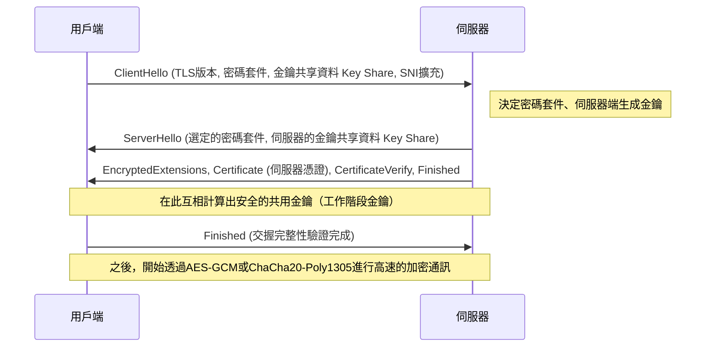

1. **ClientHello**: 用戶端在開始連線時，會發送自己支援的TLS版本、加密演算法清單（Cipher Suites），以及用來生成加密金鑰的初始數學參數（Key Share）給伺服器。此外，還會使用SNI（Server Name Indication）擴充，以明文傳送連線目標的主機名稱（例：`www.example.com`）。這對於單一IP位址運作多個HTTPS網域的伺服器（虛擬主機）來說，是選擇並回傳正確憑證所不可或缺的資訊。
2. **ServerHello**: 伺服器會從用戶端的清單中選擇最強且最適合的加密演算法（例：`TLS_AES_256_GCM_SHA384`），並與自己的Key Share資料一同回應。
3. **發送憑證與簽章（Authentication）**: 伺服器會發送自身的「數位憑證（X.509）」。接著，伺服器會使用與該憑證綁定的「秘密金鑰」，針對到目前為止整個交握訊息的雜湊值建立一個數位簽章（CertificateVerify）並發送。藉此在數學上證明伺服器是該憑證的合法擁有者（祕密金鑰的持有者）。
4. **金鑰交換（Ephemeral Elliptic Curve Diffie-Hellman: ECDHE）**: 用戶端與伺服器會將收發的彼此的Key Share（公開的橢圓曲線上的點），與只存在各自手邊的祕密參數進行數學相乘。令人驚嘆的是，藉由Diffie-Hellman金鑰交換的數學性質（$ (g^a)^b = (g^b)^a = g^{ab} $），不需要在網路上傳送任何祕密資訊，用戶端和伺服器端就能像魔法般地合成出完全一樣且強固的「主密鑰（Master Secret / 共用金鑰）」。
5. **完全正向機密（Perfect Forward Secrecy: PFS）**: TLS 1.3一個極為重要的特徵是，用於這個金鑰交換的參數（Key Share），會在每次建立工作階段時以拋棄式的方式重新生成（Ephemeral）。因此，萬一伺服器用來長期證明身分的祕密金鑰（RSA或ECDSA金鑰）在數年後外洩給了攻擊者，要在數學上回頭去解密過去被記錄、保存的加密通訊封包，是完全不可能的。過去通訊的機密性，在未來也將持續得到擔保。

### PKI與信任鏈（Chain of Trust）：數位世界的護照

在到目前為止的加密機制中，還留下了一個致命的邏輯漏洞：「用戶端到底要怎麼確信，伺服器送來的憑證和公開金鑰，真的是目標網域（例如銀行的網站）真正的東西？」
如果支配網路路徑的惡意中間人，假冒伺服器並將自己的偽造憑證和公開金鑰傳送給用戶端，進行「中間人攻擊（Man-in-the-Middle Attack）」，金鑰交換和加密本身在數學上依然會完美成功。然而，被加密的通訊對象卻不再是目標銀行，而是變成了攻擊者。

解決這個根本性身分驗證課題的社會與技術框架，就是PKI（Public Key Infrastructure：公開金鑰基礎建設），以及作為信任錨（Trust Anchor）的「憑證授權單位（CA：Certificate Authority）」的存在。

伺服器的擁有者會建立一個包含自身公開金鑰的CSR（憑證簽署請求），並提交給DigiCert、GlobalSign，或是Let's Encrypt等值得信賴的第三方機構CA。CA會在確實驗證申請者擁有該網域的所有權（網域驗證、企業實體驗證等）後，使用CA自身強大的「秘密金鑰」，對伺服器的公開金鑰資訊施加「數位簽章」，並作為伺服器憑證發行。

另一方面，像是Windows或macOS等作業系統，以及Chrome或Firefox等瀏覽器中，早就把在世界上受過嚴格稽核的根CA（Root CA）的「根憑證（公開金鑰）」群，作為信任基點（Trust Anchor）寫死（Hard-code）並內建在系統中了。

當用戶端從伺服器收到憑證時，會使用OS內建的根CA公開金鑰，對憑證上附帶的CA數位簽章進行密碼學驗證。如果簽章驗證成功，就證明了該憑證記載的內容（網域名稱和公開金鑰）受到CA保證，而且沒有被竄改過。

1. 用戶端無條件信任根CA（預先安裝在信任存放區中）。
2. 根CA信任中繼CA（Intermediate CA），並為其簽名。
3. 中繼CA信任終端實體（End Entity，即Web伺服器），並為其簽名。

透過這個「信任鏈（Chain of Trust）」的推移關係，我們得以在與物理上相距遙遠且未知的伺服器之間，動態且瞬間地建立強固的信任關係，並確立安全的加密通訊管道。

## 結論：層級的融合與邁向新的境界

在第5章中，我們詳細解剖了在應用層的深淵裡所展開的名稱解析、資料請求與回應的協定，以及包覆這一切的加密數學面紗。
DNS作為網際網路廣大的分散式通訊錄發揮作用，HTTP確立了作為資源搬運者的架構，而TLS則用最尖端的密碼學理論鎧甲堅固地守護著它。這些在歷史上是被設計成獨立的協定層，但在現代的Web中，正如HTTP/3的QUIC所見，傳輸層、應用層，以及加密層的邊界緊密地融合在一起，打破了物理上的延遲極限，並持續向同時追求極致效能與安全性的洗鍊型態演進。

在下一章中，我們將進一步潛入技術的深淵，探討穿越這層強固的加密通訊後到達伺服器端的請求，到底是如何生成動態內容，並與背後的資料庫系統進行對話的——「後端系統的內部結構與分散式運算」。

# 第6章：支撐網際網路的物理基礎設施——光、熱與海洋交織的巨大機構

網際網路經常被描述為「雲端（Cloud）」，一個沒有實體的抽象概念。我們從智慧型手機或電腦發送的資料，彷彿透過看不見的電波或電纜，被吸入「天空某處」的儲存空間。然而，網際網路的真實面貌並不像雲朵般輕盈。它是極其厚重、物質化，且受到熱力學、光學與地球物理學法則強烈制約的，人類歷史上最大的物理基礎設施。

本章將從物理機制、歷史背景以及追求極限的專業技術視角，徹底剖析將這個「無形網路」具現化於物理世界的三大巨大支柱——作為全球神經網的「海底電纜」、負責資料儲存與運算的熱力學處理設施「超大型資料中心（Hyperscale Data Center）」，以及打破光速障礙、壓縮時空的「CDN（內容傳遞網路）」。

---

## 1. 包覆地球的光之神經網：海底電纜系統

目前，跨越國界的國際網際網路通訊，約有 99% 並非透過在太空中飛行的微型人造衛星，而是經由鋪設於海底、直徑僅數公分的「海底通訊電纜（Submarine Communications Cable）」。當我們瀏覽海外網站時，那些資料正以光速穿越數千公尺深海的漆黑深淵。

### 1.1 從電報到光纖的演進與挑戰夏農極限

海底電纜的歷史遠比網際網路的誕生還要久遠，可以追溯到 1850 年在英吉利海峽鋪設的電報電纜。1858 年，第一條跨大西洋電報電纜鋪設完成，但當時是透過摩斯密碼進行通訊，維多利亞女王發送給美國布坎南總統的訊息花費了十幾個小時才傳達。其後，經歷了使用同軸電纜的類比電話線路時代，從 1980 年代後半開始引入光纖電纜。1988 年鋪設的第一條跨大西洋光通訊電纜「TAT-8」，容量為 280 Mbps（約等於 4 萬條電話線路的容量），這在當時是革命性的頻寬。

現代的海底電纜，單一根電纜就擁有數百 Tbps（每秒兆位元）這種難以想像的通訊容量。實現這種飛躍性進化的，是「波長分波多工（WDM: Wavelength Division Multiplexing）」與「摻鉺光纖放大器（EDFA: Erbium-Doped Fiber Amplifier）」這兩項諾貝爾獎等級的物理學與工程學突破。

WDM 是一種在同一根光纖中，將不同波長（顏色）的光進行多工處理並同時發送的技術。這使得單根光纖的傳輸容量以波長數量呈倍數增長。然而，作為光纖材料的石英玻璃，無論純度被提升到多麼極限，光訊號在行進數百公里後，仍會因瑞利散射（Rayleigh scattering）與紅外線吸收而衰減。因此，每隔數十到一百公里就需要設置中繼器（Repeater）。

過去的中繼器，需要將衰減的光訊號先轉換為電子訊號，放大後再轉換回光訊號（O-E-O 轉換），過程複雜且限制重重。然而，1990 年代實用化的 EDFA，透過在光纖核心摻入稀土元素鉺（Erbium），並照射稱為泵浦光（Pump light）的強大雷射光，使得光訊號能以「光的形式」被直接放大。這樣一來，就能將不同波長的多個光訊號一次性放大，結合 WDM 技術後，通訊容量發生了爆炸性的增長。

現在，在通訊工程領域，已經逐漸逼近克勞德·夏農（Claude Shannon）提出的通訊通道容量理論極限——「夏農極限（Shannon Limit）」。為了突破此極限，在單一光纖內配置多個核心的「多核心光纖（Multicore Fiber）」，以及將光的空間模式進行多工處理的「空間分波多工（SDM: Space Division Multiplexing）」等次世代物理層技術，已開始被研究與實作。

### 1.2 深海的物理環境與電纜鋪設工程

海底電纜的鋪設是現代最嚴酷的工程之一。長達數千公里的電纜，需使用專門的「電纜鋪設船（Cable layer）」將其沉入海底。

在鋪設之前，會先使用聲納測深儀器精密繪製海底地形圖，並避開海底山脈、海溝、熱液礦床與有山崩風險的海域，選定最佳路線。電纜的結構會因鋪設水深的不同而有劇烈的差異。

在水深較淺的大陸棚等海域（水深約 1000 至 1500 公尺以內），受到漁船拖網、船錨，或是鯊魚等海洋生物啃咬的物理切斷風險極高。因此，在保護光纖的聚碳酸酯樹脂與銅管外側，還會纏繞多層高張力鋼線（Steel wire）作為「外裝（Armor）」，使得直徑變粗且重量增加。此外，還會使用遙控無人潛水器（ROV: Remotely Operated Vehicle）或海底犁（Plow），將電纜埋入海底泥沙中數公尺深。

另一方面，在水深數千公尺的深海區域，由於不存在漁網或船錨的威脅，在保持足以承受水壓的堅固性之餘，為了防止鋪設時因自身重量而斷裂，會採用省略鋼線外裝的「輕型電纜（Lightweight Cable）」。其直徑約為 17 至 20 毫米，僅有花園水管般粗細。

海底電纜另一個重要的物理面向是「電力供應」。為了驅動每隔數十公里設置的中繼器，陸地上的電纜登陸站（Cable Landing Station）會透過電纜內的銅製管（供電導體），提供高壓直流電。在橫跨大洋的電纜中，供電電壓有時會超過 1 萬伏特（10 kV），通常採用將海水與大地作為迴路使用的「單線大地迴路方式」。

### 1.3 地緣政治與科技巨頭的崛起

過去，海底電纜的鋪設需要龐大的投資，因此主流方式是由各國主要通訊營運商結集形成聯盟（Consortium），共同分攤成本與頻寬。然而近年來，這個生態系發生了劇烈的轉變。

Google、Meta (Facebook)、Microsoft、Amazon 等被稱為「超大規模業者（Hyperscaler）」的科技巨頭，為了以超高速連接自家的資料中心，開始單獨或聯合直接投資並鋪設海底電纜。他們從單純的網際網路使用者，蛻變為物理基礎設施的最大擁有者。這使得電纜的路由規劃，逐漸從傳統的「主要城市間連接」，最佳化為「自家資料中心間的最短、最快連接」。

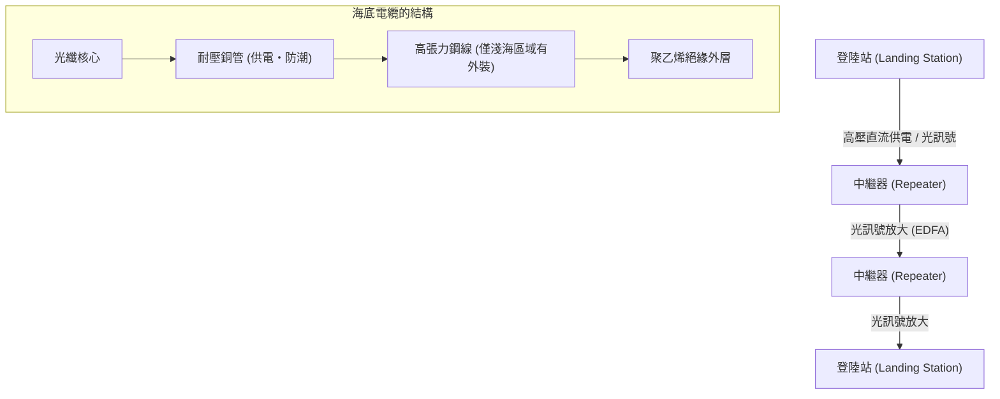

---

## 2. 資料的熱力學處理設施：超大型資料中心

透過海底電纜抵達陸地的資料，最終會被運送到「資料中心（Data Center）」。資料中心是容納數萬至數十萬台規模的伺服器群，24 小時 365 天不休止地進行運算與記憶的巨大建築物。

### 2.1 雲端的實體與「PUE」之戰

從物理學的視角來看，資料中心的本質是「一個接收龐大電能作為輸入，產出資訊處理這種熵的減少（運算結果），並伴隨不可避免的『熱能』的巨大熱機」。CPU 與 GPU 等半導體在切換電流的開與關時，會因電阻而產生熱。如果不能有效將這些熱排出外部，半導體將會瞬間發生熱失控，導致物理上的燒毀。

因此，資料中心設計與營運的最大焦點在於「冷卻」與「電力效率」。顯示此效率最常見的指標就是「PUE（Power Usage Effectiveness）」。

**PUE = 資料中心總耗電量 / IT 設備（伺服器等）耗電量**

PUE 的理論最小值為 1.0（所有電力純粹只用於運算的狀態）。過去的資料中心，PUE 超過 2.0（亦即消耗與伺服器用電等量的電力於冷氣等冷卻設備）是司空見慣的事。然而，現代的超大型資料中心，透過極致的熱力學最佳化，已將此數值降至 1.1 到 1.2 的範圍。

### 2.2 冷卻架構的演進

基於熱力學原則，資料中心的冷卻系統經歷了以下演進：

1. **熱通道與冷通道的分離（Hot Aisle / Cold Aisle Containment）**:
   早期的資料中心使用機房空調（CRAC: Computer Room Air Conditioning）來冷卻整個房間，但冷空氣與伺服器排出的熱空氣混合在一起，效率極低。現在，將伺服器機架的進氣面彼此相對、排氣面彼此相對，並物理隔離讓冷空氣通過的通道（冷通道）與熱空氣通過的通道（熱通道）的「通道封閉（Aisle Containment）」，已成為標準配置。

2. **自然冷卻（Free Cooling）**:
   轉動冰水主機（Chiller）的壓縮機需要龐大的電力。因此，在室外空氣足夠寒冷的地區（如北歐或北海道等）建設資料中心，直接利用外部空氣，或透過熱交換器間接用於冷卻的「自然冷卻（Free Cooling）」已變得普及。

3. **浸沒式冷卻（Immersion Cooling）與直接水冷（Direct-to-Chip）**:
   近年來，用於 AI 訓練與推論的高階 GPU 產生的熱密度，已逐漸超越傳統氣冷的物理極限（空氣的低熱容量與低熱傳導率）。因此，開始導入將伺服器主機板整體直接浸入非導電性的氟系惰性液體或礦物油中的「浸沒式冷卻」，以及將水冷頭直接緊貼 CPU/GPU 的均熱片，利用熱容量遠大於空氣的液體直接帶走熱量的「直接晶片水冷（Direct-to-Chip）」。利用相變（液體沸騰產生的汽化熱）的雙相浸沒式冷卻，可以處理極高的熱通量。

### 2.3 備援性與物理安全

由於資料中心是社會基礎設施的中樞，因此被要求具備極致的備援性（Redundancy）。在市電中斷的瞬間，使用飛輪、鉛酸電池或鋰離子電池的不斷電系統（UPS）會在毫秒等級內接手供電。同時，設置於建築物外部的巨大柴油發電機或燃氣渦輪發電機將會啟動，利用儲備的燃料，具備讓整個設施持續運作數天的能力。

在網路連線方面，也會引入多家不同通訊營運商的線路，並將物理路徑（如從建築物東南西北等不同方向引入）完全分離，以防範因挖掘工程導致電纜被切斷等意外。

---

## 3. 壓縮時空的技術：CDN（內容傳遞網路）

即使海底電纜連接了各大洲，資料中心儲存了資訊，僅靠這些也無法成就現代的網路體驗。這裡擋在面前的，是阿爾伯特·愛因斯坦所提出的宇宙絕對速限——「光速障礙」。

### 3.1 光速障礙與延遲的物理極限

真空中的光速（$c$）約為 30 萬 km/s。然而，作為光纖核心的石英玻璃，其折射率約為 1.47，因此光在光纖中的速度會降至約 20 萬 km/s（約為真空中的三分之二）。

例如，從日本東京到美國東岸維吉尼亞州（世界最大的資料中心聚集地）的物理直線距離約為 11,000 公里，考量海底電纜的路徑後約為 14,000 公里。光訊號單程傳輸所需的純物理時間約為 70 毫秒。由於網際網路通訊需要封包的來回（RTT: Round Trip Time），根據物理法則，絕對會產生至少 140 毫秒的延遲（Latency）。此外，還需加上途中路由器與交換器的處理延遲。

當開啟最新的網站時，瀏覽器會要求載入 HTML、CSS、JavaScript、圖片等數百個檔案，並在 TCP 的三次交握（3-way handshake）與 TLS (SSL) 的加密協商中多次來回通訊。如果所有使用者都必須直接存取地球另一端的「源站伺服器（Origin Server）」，在網頁顯示出來前將會產生數秒到十幾秒的延遲，這使得即時線上遊戲或高畫質影片串流變得完全不可能。

### 3.2 分散至邊緣：CDN 的架構

透過工程學克服這個物理極限，壓縮時空的系統便是「CDN（Content Delivery Network）」。

CDN 的基本思想非常簡單：「如果去遠離使用者的源站伺服器取資料太慢，那麼事先將資料的副本（快取）放置在物理上最靠近使用者的位置即可」。

CDN 營運商在世界各地主要城市的資料中心或 ISP（網際網路服務提供者）的設施內，物理性地部署了成千上萬稱為「邊緣伺服器（Edge Server）」的快取伺服器。當使用者存取網站時，CDN 網路會瞬間判斷使用者的地理與網路位置，將通訊路由至延遲最低（最近）的邊緣伺服器。

讓這種路由成為可能的核心技術是「任播（Anycast）」與進階的「基於 DNS 的路由」。在 Anycast 路由中，世界各地多個邊緣伺服器會被分配完全相同的 IP 位址。利用構成網際網路骨幹的 BGP（Border Gateway Protocol）的路徑選擇演算法，路由器會自動將封包送到網路層面「最短」的伺服器。這使得東京的使用者會被引導至東京的邊緣伺服器，倫敦的使用者會被引導至倫敦的邊緣伺服器，而使用者對此毫無所覺。

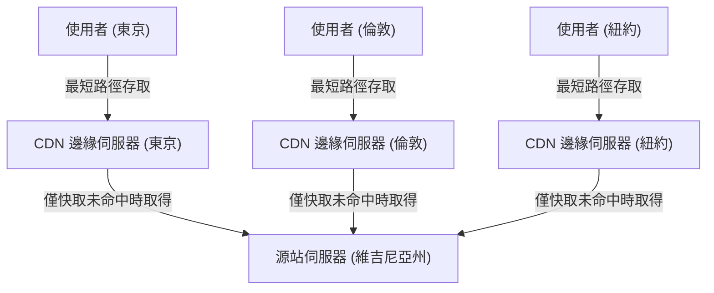

### 3.3 動態最佳化與邊緣運算的來臨

早期的 CDN 只是用來快取並傳遞圖片、影片或靜態 HTML 檔案的簡單機制。然而現代的 CDN，其本身已進化成巨大的分散式運算平台。

第一，是動態內容（因使用者而異的搜尋結果或購物車內容等）的傳遞最佳化。這些內容無法被快取，但 CDN 透過獨自最佳化邊緣伺服器與源站伺服器間的通訊路徑（如 Tiered Cache 或建構專屬的高速路由網），提供比標準網際網路路徑（BGP 的盡力而為路徑）封包遺失更少、更穩定且高速的通訊管道。此外，透過在邊緣伺服器端終止（Terminate）TCP 連線或 TLS 會話，能大幅減少與遠端進行交握的來回次數。

第二，是「邊緣運算（Edge Computing）」的崛起。過去，複雜的應用程式處理（身分驗證、A/B 測試、圖片動態縮放、執行自訂邏輯等）都是在源站伺服器的 CPU 上進行。但現在，透過以 Cloudflare Workers 或 AWS Lambda@Edge 為代表的技術，開發者能夠使用 V8 引擎等隔離的沙盒環境，在最靠近使用者的邊緣伺服器上，以毫秒為單位直接執行程式碼（如 JavaScript、Rust, WebAssembly 等）。這使得名副其實的「網際網路邊界（邊緣）」開始作為一台巨大的分散式電腦發揮作用。

---

## 4. 結語：與物理極限無盡的搏鬥

網際網路基礎設施的歷史，就是一部與光速、熱力學第二定律、能量守恆定律等支配宇宙的絕對物理法則搏鬥的歷史。

海底電纜的工程師們挑戰深海的巨大水壓與玻璃的光學極限；資料中心的設計者們追求冷卻發熱矽晶圓的熱力學極限；而 CDN 的架構師們則持續建構高度分散的處理系統，以迴避光速的障礙。

當我們輕觸智慧型手機，就能瞬間存取世界各地的資訊，其背後正是存在著這些厚重、嚴酷且極度精密的物理基礎設施。在第 7 章中，我們將深入探討在這個堅固的物理基礎設施之上，軟體與通訊協定是如何維持全球規模的自治分散網路——「路由與 BGP 的世界」。

# 第7章：網路安全與隱私的戰鬥

網際網路的歷史，既是自由分享資訊的理想，也是為了保護系統和資料免受惡意攻擊而持續戰鬥的歷史。最初，作為ARPANET誕生的網際網路，是建立在有限的、可信賴的研究人員之間通訊的假設上。因此，在通訊協定的根本設計中，「安全性」被置於次要位置，成為基於人性本善的架構。然而，隨著網路擴展至全球規模、商業化並確立其作為基礎設施的地位，這種初期的設計理念便成為了致命的弱點。

本章將深入探討威脅現代網際網路的最大威脅之一——DDoS攻擊的實體與網路機制，用以確保通訊隱私的加密與VPN（虛擬私人網路）技術，以及從邊界防禦的侷限性中誕生的次世代安全概念「零信任架構」，並極盡詳細地窺探這些技術的深淵。

## 1. 網路的實體極限與DDoS攻擊的力學

在網路攻擊中，最原始卻也最難以防禦的攻擊之一，就是**DDoS（Distributed Denial of Service：分散式阻斷服務）攻擊**。這是一種向目標伺服器或網路設備發送超過其處理能力或頻寬極限的大量流量，使得合法使用者無法獲得服務的攻擊。

### 流量的實體飽和：頻寬的極限
網際網路透過光纖、銅線或電波等實體介質傳輸資料。這些傳輸路徑雖然透過光波長分波多工（WDM）等技術實現了兆位元（Terabit）級的通訊容量，但個別伺服器所連接的線路頻寬（例如1Gbps或10Gbps）卻存在著嚴格的實體上限。DDoS攻擊正是針對這種「水管粗細」的極限。攻擊者操控著分散在世界各地、感染了惡意軟體的數十萬台設備（殭屍網路），同時向目標發送封包，導致路由器或交換機介面的緩衝記憶體溢出，進而發生封包遺失（Packet Drop）。這種現象類似於流體力學中的管線堵塞，在資訊量（封包數）超過處理能力的瞬間，就會引發整個系統的癱瘓。

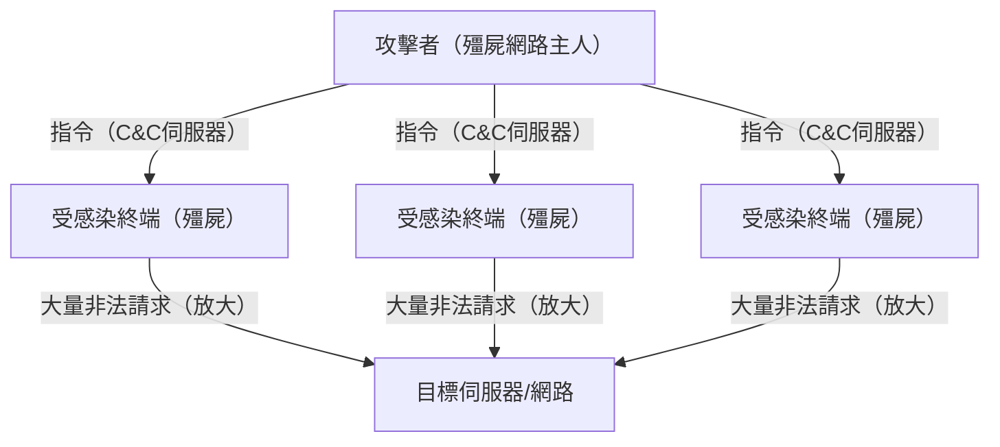

### 針對TCP/IP漏洞：SYN Flood攻擊
除了填滿頻寬，也存在耗盡伺服器資源（CPU或記憶體）的攻擊手法。其中最具代表性的就是**SYN Flood攻擊**。在TCP協定中，建立連線時會進行稱為「三向交握（3-way handshake）」的步驟。
1. 用戶端發送「SYN」封包
2. 伺服器回覆「SYN-ACK」封包，並保留用於連線的記憶體（TCB: Transmission Control Block）
3. 用戶端發送「ACK」封包以建立連線

攻擊者會將偽造來源IP位址（Spoofing）的大量SYN封包發送給伺服器。伺服器會回覆SYN-ACK，但被偽造的IP位址主人不會回覆ACK（或者根本不存在）。結果，伺服器會抱持著大量「半開（Half-open）」狀態的連線，導致管理連線的記憶體空間耗盡，不得不拒絕來自合法使用者的全新連線請求。這是一種反過來利用TCP「保證可靠通訊」的狀態保持（Stateful）特性的巧妙攻擊機制。

### 反射（放大）攻擊：非對稱性的濫用
利用UDP（User Datagram Protocol）的**反射攻擊（放大攻擊）**則更加巧妙。UDP是無連線型協定，不會確認發送來源。攻擊者將目標的IP位址偽裝成發送來源，並向網際網路上的公開DNS伺服器或NTP伺服器發送請求。此時，會使用特定的查詢，針對微小的請求（數十位元組），回傳數百倍至數千倍大小（數千位元組）的回應（例如DNS ANY查詢或NTP monlist等）。
被放大的巨大回應封包，會一口氣湧向被偽造的發送來源，也就是目標伺服器。攻擊者只需消耗極少的頻寬，就能對目標產生兆位元級的流量。這等於是在網路上實現了物理學上的「槓桿原理」，或是聲學工程中的共鳴放大等非對稱性。

## 2. 通訊路徑的隱密性：加密與VPN的機制

在作為公用網路的網際網路上流通的封包，會經過無數的路由器和ISP設備。未經加密的明文（Cleartext）通訊，在路徑上很容易被竊聽（Sniffing）或竄改。為了保護隱私和資料機密性，強大的盾牌就是「加密技術」與「VPN（Virtual Private Network）」。

### 現代密碼學的數學基礎：公開金鑰與對稱金鑰的混合
保護通訊主要使用兩種加密方式。
- **對稱金鑰加密方式（如AES等）**: 資料的加密與解密使用相同的金鑰。處理速度非常快，但存在如何安全地將金鑰交給對方（金鑰配送問題）的難題。
- **公開金鑰加密方式（如RSA或橢圓曲線密碼學等）**: 使用用於加密的「公開金鑰」與用於解密的「私鑰」配對。基於質因數分解的困難度或離散對數問題等高深的數學特性（非對稱性）。運算成本較高。

網際網路上的安全通訊（TLS/SSL或VPN）採用了結合這兩者的混合方式。首先，在通訊開始的交握階段，使用公開金鑰加密來安全地交換「會話金鑰（對稱金鑰）」，在之後的大容量資料通訊中，則使用高速的會話金鑰進行加密。藉此，實現了安全金鑰配送與高速加密通訊的兩全其美。

### VPN與隧道傳輸的原理
**VPN（虛擬私人網路）**是一種利用加密技術，在公用網際網路上建立虛擬「專線（隧道）」的技術。代表性的協定包含IPsec、OpenVPN，以及近期的WireGuard等。

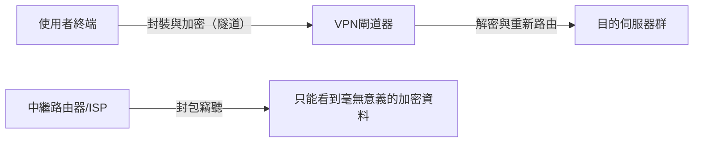

隧道傳輸的核心機制在於「封裝（Encapsulation）」。將使用者準備發送的原始IP封包（有效載荷）整體加密後，將其包裝成新的IP封包的資料部分（封裝），並在外層附加發往VPN伺服器的新IP標頭。
路徑上的網際網路路由器只看外層的IP標頭，並將封包轉發至VPN伺服器。由於內容受到強大加密，即使封包被竊聽，不僅通訊內容，連原本的目的地IP位址都難以解析。抵達VPN伺服器的封包會被解密，取出原本的標頭並發送至最終目的地。透過這種方式，在實體上任何人都能存取的基礎設施上，創造出在邏輯與數學上受到保護的私人空間。

## 3. 邊界防禦的瓦解與零信任架構的崛起

長年以來，企業或組織的網路安全依賴於被稱為「邊界防禦（Perimeter Model）」的概念。這是一種在網際網路（外部）與公司內部網路（內部）的邊界設置防火牆或IPS（入侵防禦系統），並認為「外部危險，內部安全」的城堡型防衛策略。

### 雲端與遠距工作帶來的邊界消亡
然而，在現代這個模型已經完全破綻。隨著SaaS（Software as a Service）的普及，重要資料被放置在公司外部的雲端上，加上遠距工作的常態化，員工開始從家裡或咖啡廳的Wi-Fi進行存取。「需要保護的內部」與「危險的外部」之間的邊界線消融，傳統防火牆無法控制的流量呈現爆炸性增長。此外，一旦惡意軟體（如勒索軟體等）或惡意的內部人員潛入內部網路，邊界防禦將無能為力。「內部是可信的」這個前提，成為了最大的弱點。

### 零信任：Trust Nothing, Verify Everything
為因應這種典範轉移而提倡的，正是**「零信任架構（Zero Trust Architecture: ZTA）」**。零信任的基本理念是「無論網路位置（公司內或公司外）為何，預設上不信任任何通訊（Never Trust, Always Verify）」。

在零信任模型中，安全的焦點從「網路的邊界」轉移至「身分（使用者與設備）」以及「資源（資料與應用程式）」。

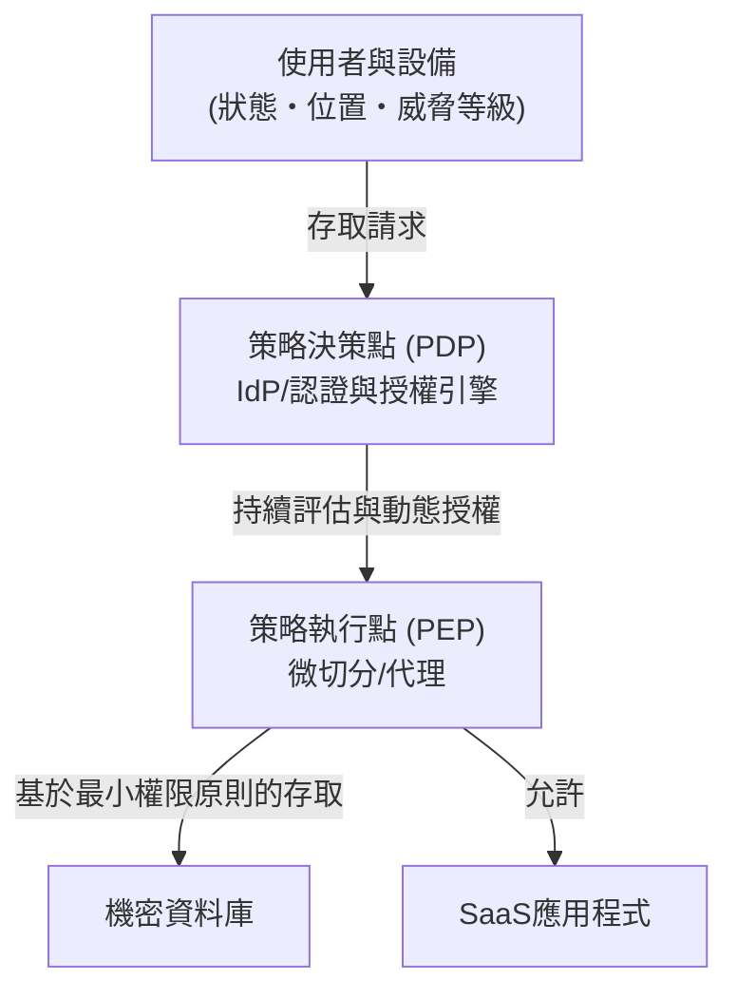

實現零信任的核心技術元件如下：

1. **身分與存取管理（IAM/IdP）**: 不僅是密碼，更結合MFA（多因素驗證）或生物辨識，強勢確認使用者身分。
2. **設備狀態（健康度）評估**: 即時評估要求存取的終端的OS修補狀態、防毒軟體運作狀態、過去的行為等。來自不安全終端的存取將會立即被阻斷。
3. **微切分（Microsegmentation）**: 將網路細緻地劃分，為每個資源設置極小的邊界。即使萬一被入侵，也能防止災害水平擴散（橫向移動）的結構。
4. **持續驗證與動態策略**: 並非一旦登入成功就持續信任。在工作階段中也會持續監控行為（來源IP變更、異常資料下載量等），在風險分數超過閾值的瞬間，執行切斷工作階段的動態控制。

零信任不僅是產品，而是「每次都驗證所有存取，並且只給予必要最小權限（Least Privilege）」的設計理念，這已成為在現代分散式IT基礎設施中保護資料唯一且現實的解答。

## 4. 未來的安全：量子密碼學與次世代網路防衛

我們目前依賴的RSA或橢圓曲線密碼學，是建立在「以現在電腦的運算能力，解密需要天文數字般的時間」的前提上。然而，一旦應用量子力學原理的「量子電腦」實用化，透過Shor演算法等，這些數學問題有瞬間被解開的危險。這被稱為**「Q-Day（量子電腦解密日）」**。

為了對抗這個威脅，目前有兩種途徑正在研究中。
一種是標準化在數學上連量子電腦也難以解密的全新加密演算法**「後量子密碼學（PQC: Post-Quantum Cryptography）」**（如晶格密碼等）。
另一種是將物理學（量子力學）法則本身作為安全依據的**「量子密碼通訊（QKD: Quantum Key Distribution）」**。這是一種將資訊搭載於光子的量子狀態（如偏振等）並配送金鑰的技術。由於竊聽者試圖觀測（複製）光子的瞬間，量子狀態就會改變（觀測問題、不確定性原理），因此能在物理上100%偵測到竊聽，是終極的安全通訊。

## 結語

網際網路的第7章，是一場「便利性」與「安全性」之間永無止境的蹺蹺板遊戲。從DDoS攻擊導致的實體層飽和，到加密技術的數學防禦，再到零信任這種架構的典範轉移，網路安全已經超越了單純的IT技術範疇，進化成物理學、數學、行為心理學交會的極度高深學科領域。
在我們不經意打開瀏覽器、操作雲端資料的背後，隱形的攻擊者與防禦系統之間，正以毫秒為單位、24小時全年無休地展開著壯烈的電子戰。

在下一章，也就是最終章的第8章，我們將探索網際網路的未來，亦即Web3.0、元宇宙，以及星際網路（Interplanetary Internet）等次世代的網路典範。

