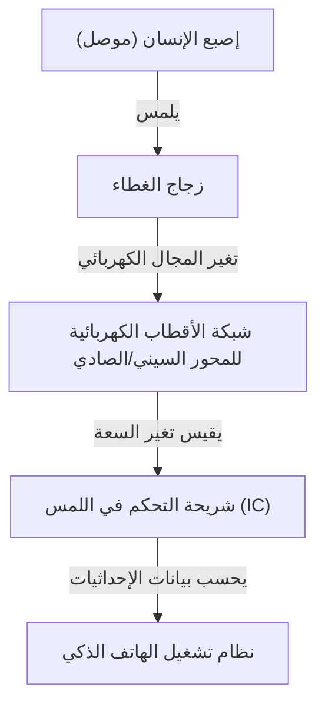

## مقدمة

في الحياة الحديثة، لا يمر يوم دون أن نلمس هاتفًا ذكيًا أو جهازًا لوحيًا. نحن ننقر، ونسحب، ونقرص الشاشات للحصول على المعلومات. ولكن لماذا يمكن للوح زجاجي شفاف يبدو عاديًا أن يكتشف حركات أصابعنا بدقة وبشكل فوري؟

في هذه المقالة، سنكشف عن الهندسة المذهلة الكامنة وراء كيفية عمل الشاشات التي تعمل باللمس، مع التركيز بشكل خاص على "اللمس السعوي الإسقاطي"، وهي التكنولوجيا السائدة في الهواتف الذكية الحديثة.

## تطور الشاشات التي تعمل باللمس والتقنيات الرئيسية

تكنولوجيا الشاشات التي تعمل باللمس بحد ذاتها ليست جديدة على الإطلاق. تاريخها طويل جدًا، حيث كانت المفاهيم موجودة منذ الستينيات. تم تطوير عدة طرق حتى الآن، ولكن يمكن تقسيمها بشكل عام إلى فئتين رئيسيتين: "المقاومة" و"السعوية".

### اللمس المقاوم (الضغط)

هذه هي الطريقة المستخدمة في أنظمة الملاحة القديمة للسيارات وأجهزة الألعاب مثل نينتندو دي إس.
الآلية بسيطة للغاية: يتم وضع غشائيين موصلين (أو زجاج وغشاء) بوجود فجوة صغيرة بينهما. عندما يضغط المستخدم على الشاشة، ينحني الغشاء العلوي ويتلامس مع الطبقة السفلية. يقرأ النظام التغير في الجهد الكهربائي الناتج عن هذا التلامس لتحديد الموضع.

**الإيجابيات:**
- نظرًا لأنها تتفاعل مع الضغط المادي، يمكن تشغيلها حتى عند ارتداء القفازات أو باستخدام قلم إلكتروني.
- تكلفة التصنيع منخفضة.

**السلبيات:**
- يؤدي تكديس الأغشية إلى تقليل شفافية الشاشة، مما يجعلها تبدو أغمق.
- نظرًا لأنها تتطلب ضغطًا ماديًا، فهي غير مناسبة للمسات الخفيفة أو اللمس المتعدد.

### اللمس السعوي

تستخدم جميع الهواتف الذكية الحديثة تقريبًا طريقة اللمس السعوي هذه. يتمتع جسم الإنسان بخاصية تخزين الكهرباء (السعة الكهربائية)، وتكتشف الشاشة موضع الإصبع من خلال استغلال هذا التغير الكهربائي الدقيق.

## كيف يعمل اللمس السعوي الإسقاطي (PCAP)

من بين الطرق السعوية، الطريقة المستخدمة في الهواتف الذكية هي تقنية متقدمة تسمى "اللمس السعوي الإسقاطي (PCAP)".

يكمن جوهر هذه التكنولوجيا في "شبكة أقطاب كهربائية شفافة" ممتدة عبر الجزء الخلفي من الشاشة. بشكل عام، يتم استخدام مادة شفافة وموصلة للكهرباء تسمى ITO (أكسيد قصدير الإنديوم).

### هيكل شبكة الأقطاب الكهربائية

أسفل الشاشة، يتم ترتيب أقطاب كهربائية رأسية (المحور الصادي Y) وأفقية (المحور السيني X) في طبقات. يتم تطبيق جهد كهربائي دقيق باستمرار بين هذه الأقطاب، مما يشكل خط أساس "للسعة" (كمية الكهرباء المخزنة) عند التقاطعات.

### ماذا يحدث عندما يلمس الإصبع الشاشة؟

1. **اضطراب المجال الكهربائي:** يحتوي جسم الإنسان على الكثير من الماء وهو موصل للكهرباء. عندما يقترب إصبع (أو يلمس) سطح الزجاج، يبدأ الإصبع نفسه في العمل كجزء من مكثف.
2. **حركة الشحنة:** يتم سحب كمية طفيفة من الشحنة نحو الإصبع من الأقطاب الكهربائية بالقرب من التقاطع الذي يقترب منه.
3. **انخفاض السعة:** هذا يقلل (يغير) محليًا السعة المخزنة بين أقطاب المحورين السيني والصادي.
4. **تحديد الإحداثيات:** تقوم شريحة التحكم بمسح أي تقاطع لخطوط X و Y تعرض لهذا التغيير، وتحسب إحداثيات دقيقة (X, Y).

## اللمس المتعدد: كيف يتم التمييز بين أصابع متعددة؟

عندما ظهر أول هاتف آيفون في عام 2007، أذهل العالم بقدرته على اللمس المتعدد "التكبير والتصغير بإصبعين". أصبح هذا ممكنًا من خلال طريقة قياس تسمى "السعة المتبادلة".

في طريقة السعة السطحية القديمة، يتم تطبيق الجهد من الزوايا الأربع للشاشة بأكملها، ويتم تحديد الموضع من خلال نسبة التيار عندما يلمس الإصبع. ومع ذلك، إذا تم لمس نقطتين أو أكثر في نفس الوقت باستخدام هذه الطريقة، يحدث "شبح" (تقاطع غير موجود) بينهما، مما يجعل من المستحيل تحديد المواقع بدقة.

من ناحية أخرى، في طريقة السعة المتبادلة، يتم إرسال إشارات نبضية بالتسلسل من خطوط المحور السيني إلى خطوط المحور الصادي، ويتم قياس سعة جميع التقاطعات (العقد) **بشكل فردي**. على سبيل المثال، حتى لو كان هناك الآلاف من التقاطعات على شاشة عالية الدقة بالكامل، تستمر شريحة التحكم في مسح الشبكة بأكملها بسرعة تصل إلى عشرات أو مئات المرات في الثانية. ونتيجة لذلك، حتى لو لمست 10 أصابع الشاشة في نفس الوقت، ناهيك عن إصبعين، يمكن تحديد الموضع الدقيق لكل منها بشكل مستقل وبدقة.

## معالجة الإشارات والمعركة ضد الضوضاء

لا يمكن تحقيق إحساس تشغيل سلس ببساطة عن طريق اكتشاف شبكة الأقطاب الكهربائية للإصبع ماديًا. تتعرض شاشات اللمس باستمرار لأنواع مختلفة من "الضوضاء" (التشويش).

- **ضوضاء الشاشة:** يتم تشغيل شاشات LCD أو OLED نفسها بسرعات عالية، مما يولد ضوضاء كهربائية قوية.
- **الضوضاء البيئية:** الضوضاء الصادرة عن أجهزة الشحن أو الموجات الكهرومغناطيسية المحيطة.
- **اللمسات غير المقصودة:** راحة اليد التي تلمس الشاشة، أو قطرات الماء التي تتساقط عليها.

لحل هذه المشكلات، تم تجهيز "شريحة تحكم في اللمس (IC)" متقدمة. تستخدم شريحة التحكم مرشحات الأجهزة وخوارزميات (برامج) متطورة لاستخراج الإشارات الصادرة من لمسات الأصابع الحقيقية فقط. أصبحت التقنيات التي تستخدم خوارزميات التعلم الآلي لمنع الأعطال الناجمة عن قطرات الماء أو التمييز بين القلم الإلكتروني والإصبع شائعة أيضًا.

## تكنولوجيا In-Cell: نحو تصميمات أكثر نحافة

في السنوات الأخيرة، اندمجت تكنولوجيا العرض وتكنولوجيا الشاشات التي تعمل باللمس بشكل أكبر، مما جعل التقنيات المعروفة باسم "In-Cell" و"On-Cell" هي السائدة.

في الماضي، كانت يتم ربط طبقة استشعار لمس مستقلة (زجاج أو غشاء) فوق طبقة العرض. ومع ذلك، في تقنية In-Cell، يتم دمج أقطاب استشعار اللمس مباشرة في وحدات البكسل الخاصة بشاشة LCD أو OLED.

وقد أدى هذا إلى الفوائد التالية:
- **أنحف وأخف وزناً:** مع وجود عدد أقل من الطبقات الإضافية، يصبح الجهاز بأكمله أنحف.
- **رؤية محسنة:** يتم تقليل عدد الطبقات العاكسة للضوء، مما يجعل الشاشة تبدو أكثر وضوحًا.
- **إحساس تشغيل مباشر:** نظرًا لأن المسافة المادية بين الإصبع وعناصر العرض أقرب، يبدو الأمر كما لو كنت تلمس وحدات البكسل مباشرة.

## الخاتمة

أسفل شاشات الهواتف الذكية التي نلمسها بشكل غير رسمي يكمن عالم مذهل من الإلكترونيات، حيث تنتشر شبكة من الأقطاب الكهربائية الشفافة، وتفحص باستمرار التغيرات في السعة مئات المرات في الثانية.

من تطور الطرق المقاومة إلى الطرق السعوية، وتحقيق اللمس المتعدد، والنحافة المطلقة التي حققتها تكنولوجيا In-Cell. إن تاريخ الشاشات التي تعمل باللمس هو في الحقيقة تطور لواجهة الإنسان والآلة (HMI).

في المرة القادمة التي تقوم فيها بالتمرير على هاتفك الذكي، توقف لحظة للتفكير في الحركة الدقيقة للإلكترونات التي تتجمع عند أطراف أصابعك، وفي شريحة التحكم التي تعمل بجد وراء الكواليس لتصفية الضوضاء وحساب الإحداثيات.
