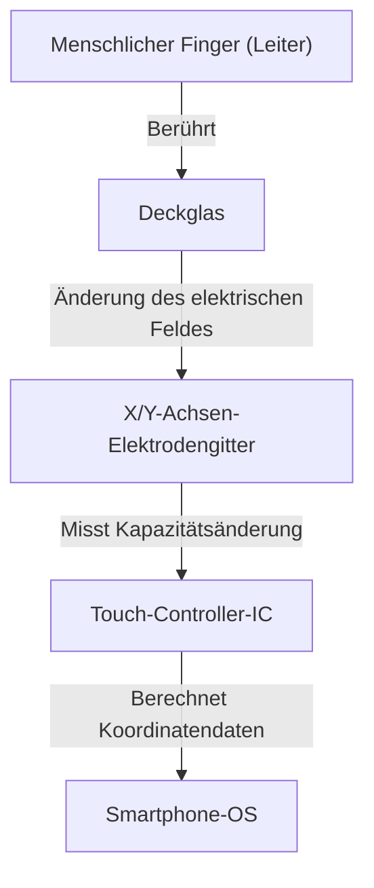

## Einführung

In unserem heutigen Leben vergeht kein Tag, an dem wir nicht ein Smartphone oder Tablet berühren. Wir tippen, wischen und ziehen auf Bildschirmen, um Informationen zu erhalten. Aber warum kann eine scheinbar gewöhnliche Scheibe aus transparentem Glas unsere Fingerbewegungen so genau und sofort erkennen?

In diesem Artikel entschlüsseln wir die erstaunliche Technik hinter der Funktionsweise von Touchscreens und konzentrieren uns dabei insbesondere auf „Projected Capacitive Touch“, die Mainstream-Technologie in modernen Smartphones.

## Die Entwicklung von Touchscreens und die wichtigsten Technologien

Die Touchscreen-Technologie selbst ist keineswegs neu. Ihre Geschichte ist recht lang und es gab bereits in den 1960er Jahren erste Konzepte. Bisher wurden verschiedene Methoden entwickelt, aber sie lassen sich grob in zwei Hauptkategorien einteilen: „Resistiv“ und „Kapazitiv“.

### Resistive Touchscreens

Dies ist die Methode, die in älteren Autonavigationssystemen und Spielkonsolen wie dem Nintendo DS verwendet wird.
Der Mechanismus ist sehr einfach: Zwei leitfähige Filme (oder Glas und Film) werden mit einem winzigen Spalt dazwischen platziert. Wenn der Benutzer auf den Bildschirm drückt, biegt sich der obere Film und kommt mit der unteren Schicht in Kontakt. Das System liest die durch diesen Kontakt verursachte Spannungsänderung, um die Position zu bestimmen.

**Vorteile:**
- Da es auf physischen Druck reagiert, kann es auch mit Handschuhen oder einem Stylus-Stift bedient werden.
- Niedrige Herstellungskosten.

**Nachteile:**
- Durch das Stapeln von Filmen verringert sich die Transparenz des Bildschirms, wodurch er dunkler aussieht.
- Da es physisches Drücken erfordert, ist es für leichte Berührungen oder Multi-Touch ungeeignet.

### Kapazitive Touchscreens

Fast alle modernen Smartphones verwenden diese kapazitive Touch-Methode. Der menschliche Körper hat die Eigenschaft, Elektrizität (Kapazität) zu speichern, und der Bildschirm erkennt die Position des Fingers, indem er diese winzige elektrische Veränderung nutzt.

## Wie Projected Capacitive Touch (PCAP) funktioniert

Unter den kapazitiven Methoden wird in Smartphones eine fortschrittliche Technologie namens „Projected Capacitive Touch (PCAP)“ verwendet.

Das Herzstück dieser Technologie ist ein „transparentes Elektrodengitter“, das über die Rückseite des Bildschirms gespannt ist. Im Allgemeinen wird ein transparentes und leitfähiges Material namens ITO (Indiumzinnoxid) verwendet.

### Die Struktur des Elektrodengitters

Unterhalb des Bildschirms sind vertikale (Y-Achse) und horizontale (X-Achse) Elektroden in Schichten angeordnet. An diesen Elektroden liegt ständig eine winzige Spannung an, wodurch an den Schnittpunkten eine Grundlinie für die „Kapazität“ (die Menge an gespeicherter Elektrizität) gebildet wird.

### Was passiert, wenn ein Finger den Bildschirm berührt?

1. **Störung des elektrischen Feldes:** Der menschliche Körper enthält viel Wasser und ist ein elektrischer Leiter. Wenn sich ein Finger der Glasoberfläche nähert (oder sie berührt), beginnt der Finger selbst als Teil eines Kondensators zu fungieren.
2. **Bewegung der Ladung:** Eine geringe Ladungsmenge wird von den Elektroden in der Nähe des angenäherten Schnittpunkts zum Finger gezogen.
3. **Abnahme der Kapazität:** Dadurch verringert (ändert) sich lokal die zwischen den X- und Y-Achsen-Elektroden gespeicherte Kapazität.
4. **Koordinaten lokalisieren:** Der Controller scannt, an welchem Schnittpunkt der X- und Y-Linien diese Änderung aufgetreten ist, und berechnet genaue Koordinaten (X, Y).

## Multi-Touch: Wie werden mehrere Finger unterschieden?

Als das erste iPhone 2007 auf den Markt kam, verblüffte es die Welt mit seiner Multi-Touch-Fähigkeit „Pinch-in/Pinch-out“ (Zweifinger-Zoom). Möglich wurde dies durch eine Messmethode namens „Mutual Capacitance“ (gegenseitige Kapazität).

Bei der älteren Methode der Oberflächenkapazität wurde Spannung an den vier Ecken des gesamten Bildschirms angelegt, und die Position wurde durch das Verhältnis des Stroms bei einer Fingerberührung bestimmt. Wenn bei dieser Methode jedoch zwei oder mehr Punkte gleichzeitig berührt werden, entsteht zwischen ihnen ein „Geist“ (ein nicht existierender Schnittpunkt), sodass die genauen Positionen nicht bestimmt werden können.

Bei der Methode der gegenseitigen Kapazität hingegen werden nacheinander Impulssignale von den X-Achsen-Linien zu den Y-Achsen-Linien gesendet und die Kapazität aller Schnittpunkte (Knoten) wird **einzeln** gemessen. Selbst wenn es auf einem Full-HD-Bildschirm Tausende von Schnittpunkten gibt, tastet der Controller das gesamte Gitter weiterhin mit einer Geschwindigkeit von mehreren zehn- bis hundertmal pro Sekunde ab. Auf diese Weise kann nicht nur die genaue Position von zwei, sondern sogar von zehn gleichzeitig berührenden Fingern unabhängig und genau bestimmt werden.

## Signalverarbeitung und der Kampf gegen das Rauschen

Ein reibungsloses Bediengefühl lässt sich nicht allein dadurch erreichen, dass das Elektrodengitter einen Finger physisch erkennt. Touchpanels sind ständig verschiedenen Arten von „Rauschen“ ausgesetzt.

- **Display-Rauschen:** Das LCD oder OLED selbst wird mit hohen Geschwindigkeiten angesteuert und erzeugt starkes elektrisches Rauschen.
- **Umgebungsrauschen:** Rauschen von Ladegeräten oder elektromagnetischen Wellen aus der Umgebung.
- **Unbeabsichtigte Berührungen:** Die Handfläche, die den Bildschirm berührt, oder Wassertropfen, die darauf fallen.

Um diese Probleme zu lösen, ist ein fortschrittlicher „Touch-Controller-IC“ integriert. Der Controller verwendet Hardwarefilter und hochentwickelte Algorithmen (Software), um nur die Signale von echten Fingerberührungen zu extrahieren. Technologien, die maschinelle Lernalgorithmen verwenden, um Fehlfunktionen durch Wassertropfen zu verhindern oder um zwischen einem Stylus und einem Finger zu unterscheiden, sind ebenfalls üblich geworden.

## In-Cell-Technologie: Auf dem Weg zu noch dünneren Designs

In den letzten Jahren sind Displaytechnologie und Touchpanel-Technologie weiter verschmolzen, wodurch Technologien, die als „In-Cell“ und „On-Cell“ bekannt sind, zum Mainstream wurden.

In der Vergangenheit wurde eine unabhängige Touch-Sensor-Schicht (Glas oder Film) auf die Display-Schicht geklebt. Bei der In-Cell-Technologie sind die Touch-Sensor-Elektroden jedoch direkt in die Pixel des LCDs oder OLEDs integriert.

Dies hat folgende Vorteile gebracht:
- **Dünner und leichter:** Mit weniger zusätzlichen Schichten wird das gesamte Gerät dünner.
- **Verbesserte Sichtbarkeit:** Die Anzahl der lichtreflektierenden Schichten ist reduziert, wodurch der Bildschirm klarer erscheint.
- **Direktes Bediengefühl:** Da der physische Abstand zwischen dem Finger und den Anzeigeelementen geringer ist, fühlt es sich an, als ob Sie die Pixel direkt berühren.

## Fazit

Unter den Smartphone-Bildschirmen, die wir beiläufig berühren, verbirgt sich eine erstaunliche Welt der Elektronik, in der sich ein Gitter aus transparenten Elektroden ausbreitet, das Hunderte Male pro Sekunde ständig auf Änderungen der Kapazität scannt.

Von der Entwicklung resistiver zu kapazitiver Methoden, der Realisierung von Multi-Touch und der ultimativen Dünnheit, die durch die In-Cell-Technologie erreicht wurde. Die Geschichte der Touchscreens ist die eigentliche Entwicklung des Human-Machine Interface (HMI).

Wenn Sie das nächste Mal auf Ihrem Smartphone scrollen, denken Sie einen Moment an die winzige Bewegung von Elektronen, die sich an Ihren Fingerspitzen sammeln, und an den Controller-IC, der im Hintergrund hart daran arbeitet, Rauschen herauszufiltern und Koordinaten zu berechnen.
