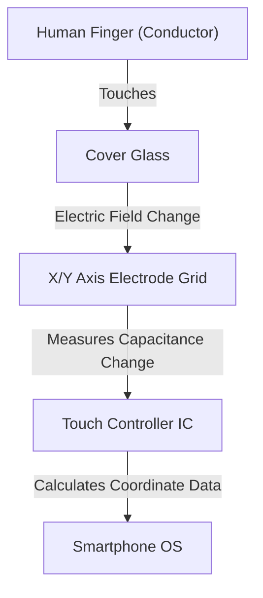

## Introduction

In modern life, not a day goes by without us touching a smartphone or tablet. We tap, swipe, and pinch out on screens to get information. But why can a seemingly ordinary sheet of transparent glass detect our finger movements so accurately and instantly?

In this article, we unravel the amazing engineering behind how touch screens work, focusing especially on "Projected Capacitive Touch," which is the mainstream technology in modern smartphones.

## Evolution of Touch Screens and Major Technologies

Touch screen technology itself is by no means new. Its history is quite long, with concepts existing as early as the 1960s. Several methods have been developed so far, but they can broadly be divided into two main categories: "Resistive" and "Capacitive."

### Resistive Touch

This is the method used in older car navigation systems and game consoles like the Nintendo DS.
The mechanism is very simple: two conductive films (or glass and film) are placed with a tiny gap between them. When the user presses the screen, the top film flexes and makes contact with the bottom layer. The system reads the change in voltage caused by this contact to determine the position.

**Pros:**
- Because it reacts to physical pressure, it can be operated even when wearing gloves or with a stylus pen.
- Low manufacturing cost.

**Cons:**
- Stacking films reduces the transparency of the screen, making it look darker.
- Since it requires physical pushing, it is unsuitable for light touches or multi-touch.

### Capacitive Touch

Almost all modern smartphones use this capacitive touch method. The human body has the property of storing electricity (capacitance), and the screen detects the position of the finger by utilizing this minute electrical change.

## How Projected Capacitive Touch (PCAP) Works

Among capacitive methods, the one used in smartphones is an advanced technology called "Projected Capacitive Touch (PCAP)."

At the core of this technology is a "transparent electrode grid" stretched across the back of the screen. Generally, a transparent and conductive material called ITO (Indium Tin Oxide) is used.

### Electrode Grid Structure

Beneath the screen, vertical (Y-axis) and horizontal (X-axis) electrodes are arranged in layers. A minute voltage is constantly applied between these electrodes, forming a baseline of "capacitance" (the amount of stored electricity) at the intersections.

### What Happens When a Finger Touches?

1. **Disturbance of the Electric Field:** The human body contains a lot of water and is a conductor of electricity. When a finger approaches (or touches) the surface of the glass, the finger itself begins to function as part of a capacitor.
2. **Movement of Charge:** A slight amount of charge is drawn toward the finger from the electrodes near the intersection it approaches.
3. **Decrease in Capacitance:** This locally decreases (changes) the capacitance stored between the X and Y axis electrodes.
4. **Pinpointing Coordinates:** The controller scans which intersection of the X and Y lines experienced this change, and calculates precise coordinates (X, Y).

## Multi-Touch: How Does It Distinguish Multiple Fingers?

When the first iPhone appeared in 2007, it amazed the world with its "pinch-in/pinch-out (two-finger zoom)" multi-touch capability. This was made possible by a measurement method called "Mutual Capacitance."

In the older surface capacitive method, voltage was applied from the four corners of the entire screen, and the position was determined by the ratio of current when a finger touched. However, if two or more points are touched simultaneously with this method, a "ghost" (an intersection that doesn't exist) occurs between them, making it impossible to determine the exact positions.

On the other hand, in the mutual capacitance method, pulse signals are sent sequentially from the X-axis lines to the Y-axis lines, and the capacitance of all intersections (nodes) is measured **individually**. For example, even if there are thousands of intersections on a Full HD screen, the controller continues to scan the entire grid at a speed of tens to hundreds of times per second. As a result, even if 10 fingers touch at the same time, let alone 2, the exact position of each can be independently and accurately identified.

## Signal Processing and the Battle Against Noise

A smooth operational feel cannot be achieved simply by the electrode grid physically detecting a finger. Touch panels are constantly exposed to various types of "noise."

- **Display Noise:** The LCD or OLED itself is driven at high speeds, generating strong electrical noise.
- **Environmental Noise:** Noise from chargers or surrounding electromagnetic waves.
- **Unintended Touches:** The palm of the hand touching the screen, or water droplets falling on it.

To resolve these issues, an advanced "Touch Controller IC" is equipped. The controller uses hardware filters and sophisticated algorithms (software) to extract only the signals from genuine finger touches. Technologies using machine learning algorithms to prevent malfunctions caused by water droplets or to distinguish between a stylus and a finger have also become common.

## In-Cell Technology: Towards Even Thinner Designs

In recent years, display technology and touch panel technology have further merged, making technologies known as "In-Cell" and "On-Cell" the mainstream.

In the past, an independent touch sensor layer (glass or film) was bonded on top of the display layer. However, in In-Cell technology, the touch sensor electrodes are built directly into the pixels of the LCD or OLED.

This has brought about the following benefits:
- **Thinner and Lighter:** With fewer extra layers, the entire device becomes thinner.
- **Improved Visibility:** The number of light-reflecting layers is reduced, making the screen appear clearer.
- **Direct Operational Feel:** Because the physical distance between the finger and the display elements is closer, it feels as if you are directly touching the pixels.

## Conclusion

Beneath the smartphone screens we casually touch lies an astonishing world of electronics, where a grid of transparent electrodes is spread out, constantly scanning for changes in capacitance hundreds of times a second.

From the evolution of resistive to capacitive methods, the realization of multi-touch, and the ultimate thinness achieved by In-Cell technology. The history of touch screens is the very evolution of the Human-Machine Interface (HMI).

Next time you scroll on your smartphone, take a moment to think about the minute movement of electrons gathering at your fingertips, and the controller IC working hard behind the scenes to filter out noise and calculate coordinates.
