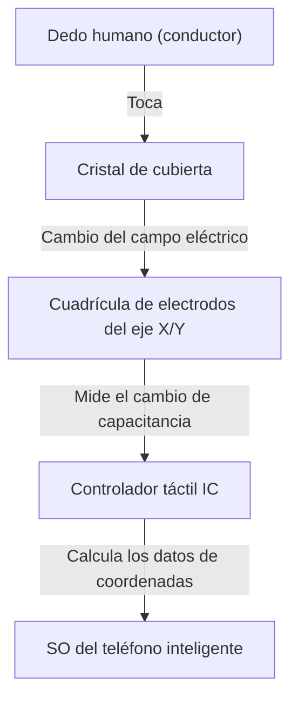

## Introducción

En la vida moderna, no pasa un día sin que toquemos un teléfono inteligente o una tableta. Tocamos, deslizamos y pellizcamos las pantallas para obtener información. Pero, ¿por qué una lámina de cristal transparente aparentemente común puede detectar los movimientos de nuestros dedos de manera tan precisa y al instante?

En este artículo, desentrañamos la asombrosa ingeniería detrás del funcionamiento de las pantallas táctiles, centrándonos especialmente en la "pantalla táctil capacitiva proyectada", que es la tecnología dominante en los teléfonos inteligentes modernos.

## Evolución de las pantallas táctiles y tecnologías principales

La tecnología de las pantallas táctiles no es nueva en absoluto. Su historia es bastante larga, con conceptos que existían ya en la década de 1960. Hasta ahora se han desarrollado varios métodos, pero en general se pueden dividir en dos categorías principales: "Resistivas" y "Capacitivas".

### Pantallas táctiles resistivas

Este es el método utilizado en sistemas de navegación para automóviles más antiguos y consolas de juegos como la Nintendo DS.
El mecanismo es muy simple: dos películas conductoras (o cristal y película) se colocan con un espacio diminuto entre ellas. Cuando el usuario presiona la pantalla, la película superior se flexiona y hace contacto con la capa inferior. El sistema lee el cambio de voltaje causado por este contacto para determinar la posición.

**Ventajas:**
- Debido a que reacciona a la presión física, puede operarse incluso con guantes o con un lápiz óptico.
- Bajo costo de fabricación.

**Desventajas:**
- Apilar las películas reduce la transparencia de la pantalla, haciéndola lucir más oscura.
- Dado que requiere un empuje físico, es inadecuada para toques ligeros o multitáctil.

### Pantallas táctiles capacitivas

Casi todos los teléfonos inteligentes modernos utilizan este método táctil capacitivo. El cuerpo humano tiene la propiedad de almacenar electricidad (capacitancia), y la pantalla detecta la posición del dedo utilizando este mínimo cambio eléctrico.

## Cómo funciona la tecnología capacitiva proyectada (PCAP)

Entre los métodos capacitivos, el que se utiliza en los teléfonos inteligentes es una tecnología avanzada llamada "Pantalla táctil capacitiva proyectada (PCAP)".

En el núcleo de esta tecnología hay una "cuadrícula de electrodos transparentes" que se extiende por la parte posterior de la pantalla. Generalmente, se utiliza un material transparente y conductor llamado ITO (Óxido de Indio y Estaño).

### Estructura de la cuadrícula de electrodos

Debajo de la pantalla, se colocan electrodos verticales (eje Y) y horizontales (eje X) dispuestos en capas. Se aplica constantemente un voltaje diminuto entre estos electrodos, formando una línea base de "capacitancia" (la cantidad de electricidad almacenada) en las intersecciones.

### ¿Qué sucede cuando un dedo la toca?

1. **Alteración del campo eléctrico:** El cuerpo humano contiene mucha agua y es un conductor de electricidad. Cuando un dedo se acerca (o toca) la superficie del cristal, el propio dedo comienza a funcionar como parte de un condensador.
2. **Movimiento de carga:** Una ligera cantidad de carga es atraída hacia el dedo desde los electrodos cerca de la intersección a la que se acerca.
3. **Disminución de la capacitancia:** Esto disminuye (cambia) localmente la capacitancia almacenada entre los electrodos del eje X y del eje Y.
4. **Localización de las coordenadas:** El controlador escanea en qué intersección de las líneas X e Y se produjo este cambio, y calcula las coordenadas exactas (X, Y).

## Multitáctil: ¿Cómo distingue múltiples dedos?

Cuando apareció el primer iPhone en 2007, sorprendió al mundo con su capacidad multitáctil de "pellizcar para acercar/alejar". Esto fue posible gracias a un método de medición llamado "Capacitancia mutua".

En el método anterior de capacitancia de superficie, se aplicaba voltaje desde las cuatro esquinas de toda la pantalla, y la posición se determinaba por la proporción de corriente cuando un dedo la tocaba. Sin embargo, si se tocan dos o más puntos simultáneamente con este método, se produce un "fantasma" (una intersección que no existe) entre ellos, haciendo imposible determinar las posiciones exactas.

Por otro lado, en el método de capacitancia mutua, se envían señales de pulso de manera secuencial desde las líneas del eje X hacia las líneas del eje Y, y la capacitancia de todas las intersecciones (nodos) se mide **individualmente**. Por ejemplo, incluso si hay miles de intersecciones en una pantalla Full HD, el controlador continúa escaneando toda la cuadrícula a una velocidad de decenas a cientos de veces por segundo. Como resultado, incluso si 10 dedos tocan al mismo tiempo, y no digamos 2, la posición exacta de cada uno puede identificarse de forma independiente y precisa.

## Procesamiento de señales y la batalla contra el ruido

Una sensación de funcionamiento suave no se puede lograr simplemente haciendo que la cuadrícula de electrodos detecte físicamente un dedo. Los paneles táctiles están constantemente expuestos a varios tipos de "ruido".

- **Ruido de la pantalla:** La pantalla LCD u OLED se acciona a altas velocidades, generando un fuerte ruido eléctrico.
- **Ruido ambiental:** Ruido de cargadores o de ondas electromagnéticas circundantes.
- **Toques involuntarios:** La palma de la mano tocando la pantalla, o gotas de agua que caen sobre ella.

Para resolver estos problemas, está equipado un avanzado "Controlador táctil IC". El controlador utiliza filtros de hardware y sofisticados algoritmos (software) para extraer únicamente las señales genuinas de los toques de los dedos. También se han vuelto comunes las tecnologías que utilizan algoritmos de aprendizaje automático para prevenir el mal funcionamiento causado por gotas de agua o para distinguir entre un lápiz óptico y un dedo.

## Tecnología In-Cell: Hacia diseños aún más delgados

En los últimos años, la tecnología de visualización y la tecnología de paneles táctiles se han fusionado aún más, haciendo que las tecnologías conocidas como "In-Cell" (en la celda) y "On-Cell" (sobre la celda) se conviertan en la corriente principal.

En el pasado, se adhería una capa independiente del sensor táctil (cristal o película) sobre la capa de la pantalla. Sin embargo, en la tecnología In-Cell, los electrodos del sensor táctil están integrados directamente en los píxeles de la pantalla LCD u OLED.

Esto ha traído los siguientes beneficios:
- **Más delgado y ligero:** Con menos capas adicionales, el dispositivo completo se vuelve más delgado.
- **Visibilidad mejorada:** Se reduce la cantidad de capas que reflejan la luz, haciendo que la pantalla parezca más clara.
- **Sensación de funcionamiento directo:** Debido a que la distancia física entre el dedo y los elementos de visualización es menor, se siente como si estuvieras tocando directamente los píxeles.

## Conclusión

Debajo de las pantallas de los teléfonos inteligentes que tocamos de forma habitual se esconde un asombroso mundo de electrónica, donde se extiende una cuadrícula de electrodos transparentes que escanea constantemente los cambios de capacitancia cientos de veces por segundo.

Desde la evolución de los métodos resistivos a los capacitivos, la realización del multitáctil y la delgadez máxima lograda por la tecnología In-Cell. La historia de las pantallas táctiles es la propia evolución de la interfaz humano-máquina (HMI).

La próxima vez que te desplaces por tu teléfono inteligente, tómate un momento para pensar en el minucioso movimiento de los electrones que se acumulan en la punta de tus dedos y en el IC del controlador trabajando duro entre bastidores para filtrar el ruido y calcular las coordenadas.
