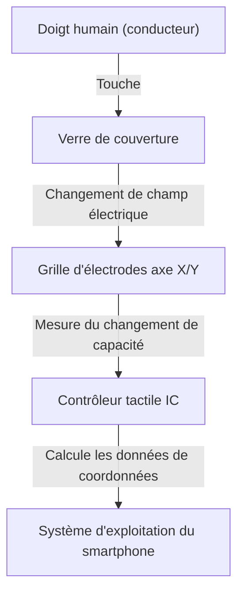

## Introduction

Dans la vie moderne, il ne se passe pas un jour sans que nous touchions un smartphone ou une tablette. Nous tapotons, balayons et pinçons l'écran pour obtenir des informations. Mais comment une simple plaque de verre transparent peut-elle détecter les mouvements de nos doigts avec autant de précision et d'instantanéité ?

Cet article dévoile l'ingénierie étonnante qui se cache derrière les écrans tactiles, en se concentrant particulièrement sur la technologie capacitive projetée, qui est le courant dominant des smartphones modernes.

## L'évolution des écrans tactiles et les principales méthodes

La technologie des écrans tactiles n'est pas nouvelle. Son histoire est ancienne, le concept existant déjà dans les années 1960. Bien que plusieurs méthodes aient été développées au fil du temps, elles peuvent être globalement divisées en deux catégories principales : l'écran tactile résistif et l'écran tactile capacitif.

### Écran tactile résistif (sensible à la pression)

Cette méthode était utilisée dans les anciens systèmes de navigation automobile et les consoles de jeux comme la Nintendo DS.
Le mécanisme est très simple : deux films conducteurs (ou un verre et un film) sont placés avec un espace microscopique entre eux. Lorsque l'utilisateur appuie sur l'écran, le film supérieur se plie et entre en contact avec la couche inférieure. Ce contact modifie la tension, qui est lue pour déterminer la position.

**Avantages :**
- Répond à la pression physique, il peut donc être utilisé avec des gants ou un stylet.
- Faible coût de fabrication.

**Inconvénients :**
- La superposition de films réduit la transparence de l'écran, le rendant plus sombre.
- Nécessitant une pression physique, il ne convient pas aux touches légères ou au multi-touch.

### Écran tactile capacitif

C'est l'écran tactile capacitif qui est utilisé dans presque tous les smartphones modernes. Le corps humain a la propriété de stocker de l'électricité (capacité), et de minuscules changements électriques sont utilisés pour détecter la position du doigt.

## Comment fonctionne la technologie capacitive projetée (PCAP)

Parmi les méthodes capacitives, la technologie utilisée dans les smartphones est une technologie avancée appelée "capacité projetée" (Projected Capacitive Touch : PCAP).

Le cœur de cette technologie est une "grille d'électrodes transparentes" disposée à l'arrière de l'écran. En général, on utilise de l'ITO (oxyde d'indium-étain), un matériau transparent et conducteur.

### Structure de la grille d'électrodes

Sous l'écran, des électrodes verticales (axe Y) et horizontales (axe X) sont disposées en couches. Une minuscule tension est constamment appliquée entre ces électrodes, formant une valeur de référence (ligne de base) d'une certaine "capacité (quantité d'électricité stockée)" aux points d'intersection.

### Que se passe-t-il lorsqu'un doigt touche l'écran ?

1. **Perturbation du champ électrique :** Le corps humain contient beaucoup d'eau et conduit l'électricité. Lorsqu'un doigt s'approche (ou touche) la surface du verre, le doigt lui-même commence à agir comme faisant partie d'un condensateur (un composant qui stocke l'électricité).
2. **Mouvement de charge :** Une petite quantité de charge est attirée vers le doigt depuis les électrodes situées près de l'intersection où le doigt s'est approché.
3. **Diminution de la capacité :** En conséquence, la capacité stockée entre les électrodes des axes X et Y diminue (change) localement.
4. **Détermination des coordonnées :** Le contrôleur scanne les intersections des lignes X et Y où ce changement s'est produit et détermine les coordonnées précises (X, Y).

## Multi-touch : Comment distinguer plusieurs doigts ?

Lors du lancement du premier iPhone en 2007, la fonctionnalité qui a surpris le monde était le multi-touch tel que le "pincer pour zoomer" (zoomer et dézoomer avec deux doigts). Ce qui a rendu cela possible est une méthode de mesure appelée "capacité mutuelle" (Mutual Capacitance).

Dans l'ancienne méthode de capacité de surface, une tension était appliquée depuis les quatre coins de l'écran, et la position était déterminée par le rapport de courant lorsqu'un doigt touchait. Cependant, si deux points ou plus étaient touchés simultanément, un "fantôme (intersection inexistante)" apparaissait entre eux, rendant impossible la détermination de la position exacte.

En revanche, avec la capacité mutuelle, des signaux d'impulsion sont envoyés séquentiellement des lignes de l'axe X aux lignes de l'axe Y, et la capacité de toutes les intersections (nœuds) est mesurée **individuellement**. Par exemple, même s'il y a des milliers d'intersections sur un écran Full HD, le contrôleur scanne en continu l'ensemble de la grille à une vitesse de dizaines à centaines de fois par seconde. De ce fait, même si 2 ou 10 doigts touchent l'écran simultanément, chaque position peut être appréhendée indépendamment et avec précision.

## Traitement du signal et lutte contre le bruit

Le simple fait que la grille d'électrodes détecte physiquement un doigt ne permet pas d'obtenir une expérience de fonctionnement fluide. Les écrans tactiles sont constamment exposés à divers "bruits".

- **Bruit de l'écran :** Le LCD (cristaux liquides) ou l'OLED lui-même fonctionne à grande vitesse, générant un fort bruit électrique.
- **Bruit environnemental :** Le bruit des chargeurs ou des ondes électromagnétiques environnantes.
- **Touchers non intentionnels :** La paume de la main touchant l'écran, ou des gouttes d'eau tombant dessus.

Pour résoudre ces problèmes, un "contrôleur tactile IC" avancé est intégré. Le contrôleur utilise des filtres matériels et des algorithmes avancés (logiciel) pour extraire uniquement les signaux des touches de doigts pures. L'utilisation d'algorithmes d'apprentissage automatique pour empêcher les dysfonctionnements causés par les gouttes d'eau et pour distinguer un stylet d'un doigt est également devenue courante.

## Technologie In-Cell : Vers des écrans encore plus fins

Ces dernières années, la technologie d'affichage et la technologie des écrans tactiles ont fusionné davantage, et des technologies appelées "In-Cell" et "On-Cell" sont devenues courantes.

Auparavant, une couche de capteur tactile indépendante (verre ou film) était fixée sur la couche d'affichage. Cependant, dans la technologie In-Cell, les électrodes du capteur tactile sont directement intégrées à l'intérieur des pixels de l'écran LCD ou OLED.

Cela a apporté les avantages suivants :
- **Plus fin et plus léger :** Moins de couches supplémentaires signifie que l'appareil dans son ensemble devient plus fin.
- **Visibilité améliorée :** Les couches réfléchissant la lumière sont réduites, ce qui rend l'écran plus clair.
- **Sensation de fonctionnement direct :** La distance physique entre le doigt et l'élément d'affichage se rapproche, donnant la sensation de toucher directement les pixels.

## Conclusion

Sous l'écran du smartphone que nous touchons avec tant de désinvolture se trouve un monde étonnant d'ingénierie électronique, avec une grille d'électrodes transparentes scannant les changements de capacité des centaines de fois par seconde.

De la résistance à la capacité, la réalisation du multi-touch, et la minceur extrême grâce à la technologie In-Cell. L'histoire des écrans tactiles est l'évolution même de l'interface homme-machine (IHM).

La prochaine fois que vous ferez défiler l'écran de votre smartphone, prenez un moment pour penser aux minuscules mouvements d'électrons qui se rassemblent au bout de vos doigts et à la puce du contrôleur tactile en arrière-plan qui travaille dur pour éliminer le bruit et calculer les coordonnées.
