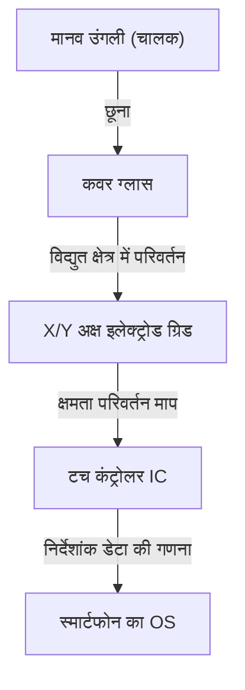

## परिचय

आधुनिक जीवन में, ऐसा कोई दिन नहीं जाता जब हम स्मार्टफोन या टैबलेट को नहीं छूते। हम जानकारी प्राप्त करने के लिए स्क्रीन को टैप, स्वाइप और पिंच करते हैं। लेकिन एक साधारण पारदर्शी कांच की प्लेट हमारी उंगलियों की हरकतों को इतनी सटीकता और तुरंत कैसे पहचान सकती है?

इस लेख में, हम टच स्क्रीन के पीछे की अद्भुत इंजीनियरिंग का खुलासा करते हैं, विशेष रूप से "प्रोजेक्टेड कैपेसिटिव टच" तकनीक पर ध्यान केंद्रित करते हुए, जो आधुनिक स्मार्टफोन में मुख्यधारा है।

## टच स्क्रीन का विकास और मुख्य तरीके

टच स्क्रीन तकनीक स्वयं नई नहीं है। इसका इतिहास पुराना है, और यह अवधारणा 1960 के दशक में ही मौजूद थी। समय के साथ कई तरीके विकसित किए गए हैं, लेकिन मोटे तौर पर उन्हें दो में बांटा जा सकता है: "रेसिस्टिव टच (दबाव संवेदनशील)" और "कैपेसिटिव टच"।

### रेसिस्टिव टच (दबाव संवेदनशील)

इस विधि का उपयोग पुरानी कार नेविगेशन सिस्टम और निनटेंडो डीएस जैसे गेमिंग कंसोल में किया जाता था।
तंत्र बहुत सरल है: दो प्रवाहकीय फिल्में (या कांच और फिल्म) उनके बीच एक सूक्ष्म अंतराल के साथ रखी जाती हैं। जब उपयोगकर्ता स्क्रीन दबाता है, तो ऊपरी फिल्म झुक जाती है और निचली परत से संपर्क करती है। यह संपर्क वोल्टेज को बदलता है, जिसे स्थिति निर्धारित करने के लिए पढ़ा जाता है।

**लाभ:**
- भौतिक दबाव पर प्रतिक्रिया करता है, इसलिए इसे दस्ताने या स्टाइलस के साथ इस्तेमाल किया जा सकता है।
- विनिर्माण लागत कम है।

**नुकसान:**
- फिल्मों की परतों के कारण स्क्रीन की पारदर्शिता कम हो जाती है, जिससे यह गहरा दिखता है।
- चूंकि इसमें भौतिक रूप से दबाने की आवश्यकता होती है, इसलिए यह हल्के स्पर्श या मल्टी-टच के लिए अनुपयुक्त है।

### कैपेसिटिव टच

कैपेसिटिव टच का उपयोग लगभग सभी आधुनिक स्मार्टफोन्स में किया जाता है। मानव शरीर में बिजली (क्षमता) संग्रहीत करने का गुण होता है, और उंगली की स्थिति का पता लगाने के लिए मिनट के विद्युत परिवर्तनों का उपयोग किया जाता है।

## प्रोजेक्टेड कैपेसिटिव टच (PCAP) कैसे काम करता है

कैपेसिटिव विधियों में, स्मार्टफोन में उपयोग की जाने वाली तकनीक एक उन्नत तकनीक है जिसे "प्रोजेक्टेड कैपेसिटिव टच (PCAP)" कहा जाता है।

इस तकनीक का मूल स्क्रीन के पीछे "पारदर्शी इलेक्ट्रोड की ग्रिड" है। आम तौर पर, ITO (इंडियम टिन ऑक्साइड), जो एक पारदर्शी और प्रवाहकीय सामग्री है, का उपयोग किया जाता है।

### इलेक्ट्रोड ग्रिड संरचना

स्क्रीन के नीचे, ऊर्ध्वाधर (Y-अक्ष) और क्षैतिज (X-अक्ष) इलेक्ट्रोड परतों में व्यवस्थित होते हैं। इन इलेक्ट्रोडों के बीच लगातार एक सूक्ष्म वोल्टेज लगाया जाता है, जो चौराहों पर एक निश्चित "क्षमता (संचित बिजली की मात्रा)" का आधारभूत मान बनाता है।

### जब कोई उंगली छूती है तो क्या होता है?

1. **विद्युत क्षेत्र में गड़बड़ी:** मानव शरीर में बहुत अधिक पानी होता है और यह बिजली का संचालन करता है। जब एक उंगली कांच की सतह के पास आती है (या उसे छूती है), तो उंगली स्वयं एक संधारित्र (बिजली संग्रहीत करने वाला घटक) के हिस्से के रूप में कार्य करना शुरू कर देती है।
2. **चार्ज मूवमेंट:** जिस चौराहे के पास उंगली आती है, वहां इलेक्ट्रोड से थोड़ी मात्रा में चार्ज उंगली की ओर खींचा जाता है।
3. **क्षमता में कमी:** इसके परिणामस्वरूप, X और Y अक्षों के इलेक्ट्रोड के बीच संग्रहीत क्षमता स्थानीय रूप से कम (परिवर्तित) हो जाती है।
4. **निर्देशांक का निर्धारण:** कंट्रोलर उन X और Y रेखा चौराहों को स्कैन करता है जहां यह परिवर्तन हुआ था और सटीक निर्देशांक (X, Y) निर्धारित करता है।

## मल्टी-टच: कई उंगलियों के बीच अंतर कैसे करें?

जब 2007 में पहला iPhone जारी किया गया था, तो दुनिया को आश्चर्यचकित करने वाली विशेषता "पिंच-इन/पिंच-आउट (दो उंगलियों के साथ ज़ूमिंग)" मल्टी-टच थी। जिसने इसे संभव बनाया वह "म्यूचुअल कैपेसिटेंस" नामक एक माप पद्धति है।

पुरानी सतह कैपेसिटिव विधि में, स्क्रीन के चारों कोनों से वोल्टेज लागू किया गया था, और उंगली छूने पर वर्तमान के अनुपात से स्थिति निर्धारित की गई थी। हालाँकि, यदि दो या अधिक बिंदुओं को एक साथ छुआ जाता है, तो उनके बीच एक "भूत (अस्तित्वहीन चौराहा)" दिखाई देगा, जिससे सटीक स्थिति निर्धारित करना असंभव हो जाएगा।

इसके विपरीत, म्यूचुअल कैपेसिटेंस विधि में, पल्स सिग्नल क्रमिक रूप से X-अक्ष लाइनों से Y-अक्ष लाइनों में भेजे जाते हैं, और सभी चौराहों (नोड्स) की क्षमता को **व्यक्तिगत रूप से** मापा जाता है। उदाहरण के लिए, भले ही फुल HD स्क्रीन पर हजारों चौराहे हों, कंट्रोलर प्रति सेकंड दसियों से सैकड़ों बार की गति से लगातार पूरे ग्रिड को स्कैन करता है। नतीजतन, भले ही 2 या 10 उंगलियां एक साथ स्पर्श करें, प्रत्येक स्थिति को स्वतंत्र रूप से और सटीक रूप से पकड़ा जा सकता है।

## सिग्नल प्रोसेसिंग और शोर के खिलाफ लड़ाई

केवल भौतिक रूप से उंगली का पता लगाने वाले इलेक्ट्रोड का ग्रिड एक सुचारू संचालन अनुभव प्रदान नहीं करता है। टच स्क्रीन लगातार विभिन्न "शोर" के संपर्क में रहते हैं।

- **डिस्प्ले शोर:** LCD या OLED स्वयं उच्च गति पर काम करता है, जिससे तेज विद्युत शोर पैदा होता है।
- **पर्यावरणीय शोर:** चार्जर या आसपास की विद्युत चुम्बकीय तरंगों से शोर।
- **अनपेक्षित स्पर्श:** हथेली का स्क्रीन को छूना, या पानी की बूंदों का उस पर गिरना।

इन समस्याओं को हल करने के लिए, एक उन्नत "टच कंट्रोलर IC" शामिल किया गया है। कंट्रोलर शुद्ध उंगली के स्पर्श से संकेतों को निकालने के लिए हार्डवेयर फिल्टर और उन्नत एल्गोरिदम (सॉफ़्टवेयर) का उपयोग करता है। पानी की बूंदों के कारण होने वाली खराबी को रोकने और उंगली से स्टाइलस को अलग करने के लिए मशीन लर्निंग एल्गोरिदम का उपयोग भी आम हो गया है।

## इन-सेल तकनीक: और भी पतली स्क्रीन की ओर

हाल के वर्षों में, डिस्प्ले तकनीक और टच पैनल तकनीक का और विलय हो गया है, और "इन-सेल" और "ऑन-सेल" नामक तकनीकें मुख्यधारा बन गई हैं।

अतीत में, डिस्प्ले परत के ऊपर एक स्वतंत्र टच सेंसर परत (कांच या फिल्म) जुड़ी होती थी। हालाँकि, इन-सेल तकनीक में, टच सेंसर के इलेक्ट्रोड सीधे LCD या OLED पिक्सेल के अंदर बनाए जाते हैं।

इससे निम्नलिखित लाभ हुए हैं:
- **पतला और हल्का:** अतिरिक्त परतों के कम होने से समग्र उपकरण पतला हो जाता है।
- **बेहतर दृश्यता:** प्रकाश-परावर्तक परतें कम हो जाती हैं, जिससे स्क्रीन स्पष्ट दिखाई देती है।
- **प्रत्यक्ष संचालन अनुभव:** उंगली और डिस्प्ले तत्व के बीच भौतिक दूरी कम हो जाती है, जिससे ऐसा महसूस होता है जैसे सीधे पिक्सेल को छू रहे हों।

## निष्कर्ष

स्मार्टफोन स्क्रीन के नीचे, जिसे हम इतनी लापरवाही से छूते हैं, एक अद्भुत इलेक्ट्रॉनिक इंजीनियरिंग दुनिया है, जिसमें पारदर्शी इलेक्ट्रोड की एक ग्रिड प्रति सेकंड सैकड़ों बार क्षमता परिवर्तन को स्कैन करती है।

रेसिस्टिव से कैपेसिटिव तक, मल्टी-टच की प्राप्ति, और इन-सेल तकनीक के साथ अत्यधिक पतलापन। टच स्क्रीन का इतिहास मानव-मशीन इंटरफ़ेस (HMI) का विकास है।

अगली बार जब आप अपने स्मार्टफोन पर स्क्रॉल करें, तो अपनी उंगलियों पर जमा होने वाले इलेक्ट्रॉनों के छोटे-छोटे आंदोलनों और पृष्ठभूमि में शोर को दूर करने और निर्देशांक की गणना करने के लिए कड़ी मेहनत कर रहे टच कंट्रोलर IC के बारे में सोचने के लिए थोड़ा समय निकालें।
