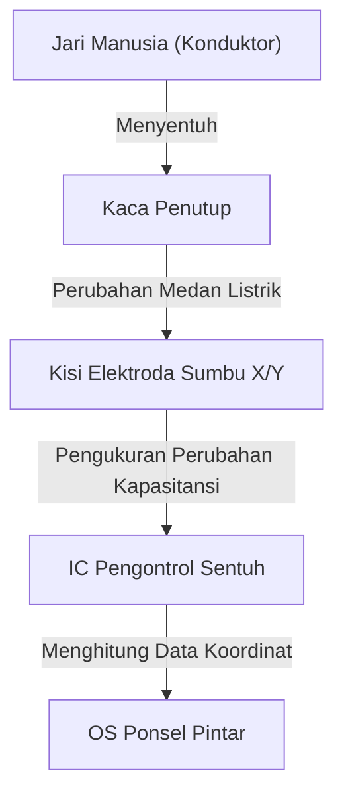

## Pengantar

Dalam kehidupan modern, tidak ada hari yang berlalu tanpa kita menyentuh ponsel pintar atau tablet. Kita mengetuk, menggesek, dan mencubit layar untuk mendapatkan informasi. Namun, bagaimana pelat kaca transparan biasa dapat mendeteksi pergerakan jari kita dengan begitu akurat dan instan?

Artikel ini mengungkap rekayasa luar biasa di balik layar sentuh, yang secara khusus berfokus pada teknologi "projected capacitive touch (sentuhan kapasitif terproyeksi)" yang merupakan arus utama ponsel pintar modern.

## Evolusi Layar Sentuh dan Metode Utamanya

Teknologi layar sentuh itu sendiri bukanlah hal baru. Sejarahnya sudah lama, dan konsepnya sudah ada sejak tahun 1960-an. Beberapa metode telah dikembangkan dari waktu ke waktu, tetapi secara garis besar dapat dibagi menjadi dua: "layar sentuh resistif (sensitif terhadap tekanan)" dan "layar sentuh kapasitif".

### Layar Sentuh Resistif (Sensitif Tekanan)

Metode ini digunakan dalam sistem navigasi mobil lama dan konsol game seperti Nintendo DS.
Mekanismenya sangat sederhana: dua film konduktif (atau kaca dan film) ditempatkan dengan celah mikroskopis di antara keduanya. Saat pengguna menekan layar, film bagian atas menekuk dan bersentuhan dengan lapisan bawah. Kontak ini mengubah tegangan, yang kemudian dibaca untuk menentukan posisi.

**Kelebihan:**
- Merespons tekanan fisik, sehingga dapat digunakan dengan sarung tangan atau stylus.
- Biaya produksi rendah.

**Kekurangan:**
- Lapisan film mengurangi transparansi layar, sehingga terlihat lebih gelap.
- Karena membutuhkan penekanan fisik, tidak cocok untuk sentuhan ringan atau multi-sentuh.

### Layar Sentuh Kapasitif

Layar sentuh kapasitif adalah yang digunakan di hampir semua ponsel pintar modern. Tubuh manusia memiliki sifat menyimpan listrik (kapasitansi), dan perubahan listrik yang sangat kecil digunakan untuk mendeteksi posisi jari.

## Cara Kerja Teknologi Projected Capacitive (PCAP)

Di antara metode kapasitif, teknologi yang digunakan pada ponsel pintar adalah teknologi canggih yang disebut "Projected Capacitive Touch (PCAP)".

Inti dari teknologi ini adalah "kisi elektroda transparan" yang disusun di bagian belakang layar. Umumnya, ITO (Indium Tin Oxide), yang merupakan bahan transparan dan konduktif, digunakan.

### Struktur Kisi Elektroda

Di bawah layar, elektroda vertikal (sumbu Y) dan horizontal (sumbu X) disusun berlapis-lapis. Tegangan yang sangat kecil terus-menerus diterapkan di antara elektroda-elektroda ini, membentuk nilai dasar "kapasitansi (jumlah listrik yang disimpan)" tertentu pada titik persimpangan.

### Apa yang Terjadi Saat Jari Menyentuh?

1. **Gangguan Medan Listrik:** Tubuh manusia mengandung banyak air dan menghantarkan listrik. Ketika jari mendekati (atau menyentuh) permukaan kaca, jari itu sendiri mulai bertindak sebagai bagian dari kapasitor (komponen yang menyimpan listrik).
2. **Pergerakan Muatan:** Sejumlah kecil muatan ditarik ke arah jari dari elektroda di dekat persimpangan tempat jari mendekat.
3. **Penurunan Kapasitansi:** Akibatnya, kapasitansi yang disimpan di antara elektroda sumbu X dan Y menurun (berubah) secara lokal.
4. **Penentuan Koordinat:** Pengontrol memindai persimpangan garis X dan Y tempat perubahan ini terjadi dan menentukan koordinat (X, Y) yang akurat.

## Multi-Sentuh: Bagaimana Membedakan Beberapa Jari?

Saat iPhone pertama dirilis pada tahun 2007, fitur yang mengejutkan dunia adalah "pinch-in/pinch-out (memperbesar dan memperkecil dengan dua jari)" atau multi-sentuh. Apa yang memungkinkannya adalah metode pengukuran yang disebut "Kapasitansi Reksa (Mutual Capacitance)".

Dalam metode kapasitif permukaan yang lama, tegangan diterapkan dari keempat sudut layar, dan posisinya ditentukan oleh rasio arus saat jari menyentuh. Namun, jika dua titik atau lebih disentuh secara bersamaan, "hantu (persimpangan yang tidak ada)" akan muncul di antara titik-titik tersebut, sehingga posisi pastinya tidak mungkin ditentukan.

Sebaliknya, dengan metode kapasitansi reksa, sinyal pulsa dikirim secara berurutan dari garis sumbu X ke garis sumbu Y, dan kapasitansi dari semua persimpangan (node) diukur **secara individual**. Misalnya, meskipun ada ribuan persimpangan pada layar Full HD, pengontrol terus memindai seluruh kisi dengan kecepatan puluhan hingga ratusan kali per detik. Akibatnya, bahkan jika 2 atau 10 jari bersentuhan pada saat yang sama, setiap posisi dapat ditangkap secara independen dan akurat.

## Pemrosesan Sinyal dan Pertempuran Melawan Kebisingan

Hanya dengan kisi elektroda yang secara fisik mendeteksi jari tidak memberikan pengalaman pengoperasian yang mulus. Panel sentuh terus-menerus terpapar berbagai "kebisingan (noise)".

- **Kebisingan Layar:** LCD atau OLED itu sendiri beroperasi pada kecepatan tinggi, menghasilkan kebisingan listrik yang kuat.
- **Kebisingan Lingkungan:** Kebisingan dari pengisi daya atau gelombang elektromagnetik di sekitarnya.
- **Sentuhan Tidak Disengaja:** Telapak tangan menyentuh layar, atau tetesan air jatuh ke atasnya.

Untuk mengatasi masalah ini, disertakan "IC Pengontrol Sentuh" yang canggih. Pengontrol menggunakan filter perangkat keras dan algoritma canggih (perangkat lunak) untuk mengekstrak hanya sinyal dari sentuhan jari murni. Penggunaan algoritma pembelajaran mesin untuk mencegah malfungsi yang disebabkan oleh tetesan air dan untuk membedakan stylus dari jari juga telah menjadi hal yang umum.

## Teknologi In-Cell: Menuju Layar yang Lebih Tipis

Dalam beberapa tahun terakhir, teknologi tampilan dan teknologi panel sentuh semakin menyatu, dan teknologi yang disebut "In-Cell" dan "On-Cell" telah menjadi arus utama.

Dulu, lapisan sensor sentuh independen (kaca atau film) dipasang di atas lapisan tampilan. Namun, pada teknologi In-Cell, elektroda sensor sentuh dipasang langsung di dalam piksel LCD atau OLED.

Hal ini memberikan manfaat sebagai berikut:
- **Lebih Tipis dan Ringan:** Mengurangi lapisan ekstra berarti perangkat secara keseluruhan menjadi lebih tipis.
- **Peningkatan Visibilitas:** Lapisan pemantul cahaya berkurang, membuat layar terlihat lebih jelas.
- **Nuansa Pengoperasian Langsung:** Jarak fisik antara jari dan elemen tampilan menjadi lebih dekat, sehingga memberikan kesan seperti menyentuh piksel secara langsung.

## Kesimpulan

Di bawah layar ponsel pintar yang kita sentuh dengan santai, terdapat dunia rekayasa elektronik yang menakjubkan, dengan kisi elektroda transparan yang memindai perubahan kapasitansi ratusan kali per detik.

Dari resistif hingga kapasitif, realisasi multi-sentuh, dan ketipisan ekstrem berkat teknologi In-Cell. Sejarah layar sentuh merupakan evolusi dari antarmuka manusia-mesin (Human-Machine Interface / HMI).

Lain kali Anda menggulir layar ponsel pintar Anda, luangkan waktu sejenak untuk memikirkan gerakan elektron kecil yang berkumpul di ujung jari Anda, dan IC pengontrol sentuh di latar belakang yang bekerja keras untuk menghilangkan kebisingan dan menghitung koordinat.
