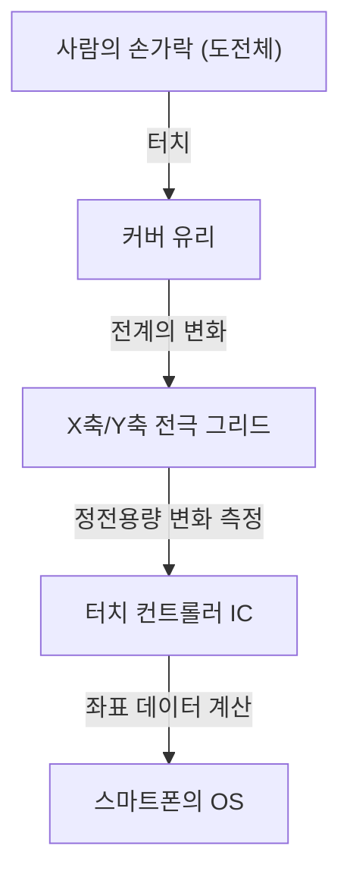

## 소개

현대 생활에서 우리는 스마트폰이나 태블릿을 만지지 않고는 하루도 보낼 수 없습니다. 우리는 화면을 탭하고, 스와이프하고, 핀치하여 정보를 얻습니다. 하지만 어떻게 평범한 투명한 유리판이 우리의 손가락 움직임을 이토록 정확하고 즉각적으로 감지할 수 있을까요?

이 글에서는 현대 스마트폰의 주류인 '투영 정전용량식 터치' 기술을 중심으로 터치스크린 이면에 숨겨진 놀라운 엔지니어링에 대해 알아봅니다.

## 터치스크린의 진화와 주요 방식

터치스크린 기술 자체는 새로운 것이 아닙니다. 그 역사는 오래되었으며 이미 1960년대에 그 개념이 존재했습니다. 시간이 지나면서 몇 가지 방식이 개발되었지만, 크게 '저항막 방식(감압식)'과 '정전용량 방식' 두 가지로 나눌 수 있습니다.

### 저항막 방식 (감압식)

이 방식은 구형 차량 내비게이션 시스템이나 닌텐도 DS와 같은 게임기에서 사용되었습니다.
구조는 매우 간단하여 두 개의 전도성 필름(또는 유리와 필름) 사이에 미세한 틈을 두고 배치됩니다. 사용자가 화면을 누르면 위의 필름이 구부러져 아래층과 닿게 됩니다. 이 접촉으로 인해 전압이 변하고, 이를 읽어 위치를 파악합니다.

**장점:**
- 물리적인 압력에 반응하므로 장갑이나 스타일러스 펜을 사용해도 조작할 수 있습니다.
- 제조 비용이 저렴합니다.

**단점:**
- 필름이 겹쳐져 화면의 투명도가 떨어져 어둡게 보입니다.
- 물리적으로 누를 필요가 있어 가벼운 터치나 멀티터치에는 적합하지 않습니다.

### 정전용량 방식

현대 스마트폰의 거의 모든 모델에 사용되는 것이 바로 이 정전용량 방식(Capacitive Touch)입니다. 인체는 전기를 저장하는 성질(정전용량)을 가지고 있으며, 이 미세한 전기적 변화를 이용하여 손가락의 위치를 감지합니다.

## 투영 정전용량 방식(PCAP)의 원리

정전용량 방식 중에서도 스마트폰에 사용되는 기술은 '투영 정전용량 방식(Projected Capacitive Touch: PCAP)'이라는 첨단 기술입니다.

이 기술의 핵심은 화면 뒷면에 배치된 '투명한 전극의 그리드(격자)'입니다. 일반적으로 투명하고 전기가 통하는 소재인 ITO(산화인듐주석)가 사용됩니다.

### 전극의 그리드 구조

화면 아래에는 세로 방향(Y축) 전극과 가로 방향(X축) 전극이 층상으로 배치되어 있습니다. 이 전극들 사이에는 항상 미세한 전압이 가해지고 있어, 교차하는 부분에 일정한 '정전용량(전기가 저장되는 양)'의 기준값(베이스라인)이 형성되어 있습니다.

### 손가락이 닿으면 어떤 일이 일어날까?

1. **전계의 교란:** 인체는 수분을 많이 함유하고 있어 전기를 전도합니다. 손가락이 유리 표면에 가까워지면(또는 닿으면) 손가락 자체가 축전기(전기를 저장하는 부품)의 일부로 작용하기 시작합니다.
2. **전하의 이동:** 손가락이 가까워진 교차점 근처의 전극에서 미량의 전하가 손가락 쪽으로 끌어당겨집니다.
3. **정전용량의 감소:** 이로 인해 X축과 Y축 전극 사이에 저장되어 있던 정전용량이 국소적으로 감소(변화)합니다.
4. **좌표 특정:** 컨트롤러는 이러한 변화가 발생한 X선과 Y선의 교차점을 스캔하여 정확한 좌표(X, Y)를 찾아냅니다.

## 멀티터치: 여러 손가락을 어떻게 구별할까?

2007년 첫 번째 아이폰이 출시되었을 때 세상을 놀라게 한 기능은 '핀치 인/핀치 아웃(두 손가락으로 확대/축소)'이라는 멀티터치 기능이었습니다. 이를 가능하게 한 것이 '상호 정전용량(Mutual Capacitance)'이라는 측정 방식입니다.

기존의 표면형 정전용량 방식에서는 화면 전체의 네 모서리에서 전압을 가하고, 손가락이 닿았을 때의 전류 비율로 위치를 구했습니다. 그러나 이 방식으로는 두 군데 이상을 동시에 만지면 그 사이에 '고스트(존재하지 않는 교차점)'가 발생하여 정확한 위치를 파악할 수 없습니다.

반면 상호 정전용량 방식에서는 X축 라인에서 Y축 라인으로 차례차례 펄스 신호를 보내고, 모든 교차점(노드)의 정전용량을 **개별적으로** 측정합니다. 예를 들어 풀 HD 화면에 수천 개의 교차점이 있더라도, 컨트롤러는 1초에 수십 번에서 수백 번의 속도로 그리드 전체를 계속 스캔합니다. 이로 인해 2개는 물론 10개의 손가락이 동시에 닿아도 각각의 위치를 독립적이고 정확하게 파악할 수 있습니다.

## 신호 처리와 노이즈와의 싸움

전극의 그리드가 물리적으로 손가락을 감지하는 것만으로는 부드러운 조작감을 얻을 수 없습니다. 터치 패널은 항상 다양한 '노이즈'에 노출되어 있습니다.

- **디스플레이 노이즈:** LCD 또는 OLED 자체가 고속으로 구동되며 강력한 전기적 노이즈를 발생시킵니다.
- **환경 노이즈:** 충전기에서 발생하는 노이즈나 주변의 전자파.
- **의도치 않은 터치:** 화면에 손바닥이 닿거나 물방울이 떨어지는 현상.

이러한 문제를 해결하기 위해 고성능의 '터치 컨트롤러 IC'가 탑재되어 있습니다. 컨트롤러는 하드웨어 필터와 고도의 알고리즘(소프트웨어)을 구사하여 순수한 손가락 터치에 의한 신호만을 추출합니다. 물방울로 인한 오작동을 방지하거나 스타일러스 펜과 손가락을 구별하기 위해 머신러닝 알고리즘을 사용하는 기술도 보편화되고 있습니다.

## 인셀 기술: 더 얇은 디스플레이를 향하여

최근 몇 년 동안 디스플레이 기술과 터치 패널 기술이 더욱 융합되어 '인셀(In-Cell)' 및 '온셀(On-Cell)'이라고 불리는 기술이 주류를 이루고 있습니다.

과거에는 디스플레이 층 위에 독립적인 터치 센서 층(유리나 필름)을 겹쳐 붙였습니다. 그러나 인셀 기술에서는 액정이나 유기 EL의 픽셀 내부에 터치 센서 전극을 직접 내장합니다.

이로 인해 다음과 같은 장점이 생겼습니다:
- **얇고 가벼워짐:** 여분의 층이 줄어들어 기기 전체가 얇아집니다.
- **시인성 향상:** 빛의 반사층이 줄어들어 화면이 더 선명하게 보입니다.
- **다이렉트한 조작감:** 손가락과 표시 소자 사이의 물리적 거리가 가까워져 마치 픽셀을 직접 만지는 듯한 느낌을 줍니다.

## 결론

우리가 무심코 만지는 스마트폰 화면 아래에는 투명한 전극의 그리드가 펼쳐져 있으며, 1초에 수백 번 정전용량의 변화를 계속 스캔하는 경이로운 전자공학의 세계가 펼쳐져 있습니다.

저항막 방식에서 정전용량 방식으로의 진화, 멀티터치의 실현, 그리고 인셀 기술을 통한 극한의 얇기 구현까지. 터치스크린의 역사는 곧 인간-기계 인터페이스(HMI)의 진화 그 자체입니다.

다음에 스마트폰에서 스크롤할 때는 손끝에 모이는 미세한 전자의 움직임과 보이지 않는 곳에서 열심히 노이즈를 제거하며 좌표를 계산하고 있는 터치 컨트롤러 IC의 존재에 대해 잠시 생각해 보세요.
