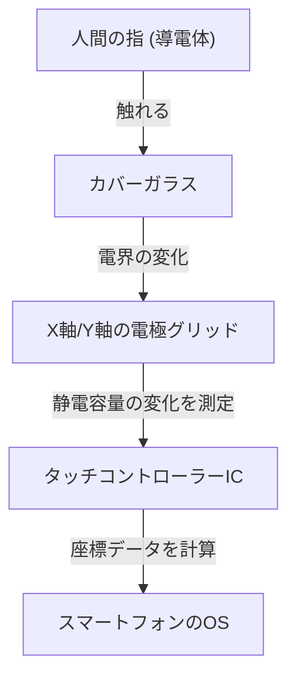

## はじめに

現代の生活において、スマートフォンやタブレットに触れない日はありません。私たちは画面をタップし、スワイプし、ピンチアウトして情報を手に入れます。しかし、ただの透明なガラス板が、なぜこれほどまでに正確かつ瞬時に私たちの指の動きを検出できるのでしょうか。

本記事では、タッチスクリーンの仕組み、特に現代のスマートフォンの主流である「投影型静電容量方式」を中心に、その背後にある驚くべきエンジニアリングを解き明かします。

## タッチスクリーンの進化と主要な方式

タッチスクリーン技術そのものは決して新しいものではありません。その歴史は古く、1960年代にはすでに概念が存在していました。これまでにいくつかの方式が開発されましたが、大きく分けると「抵抗膜方式（感圧式）」と「静電容量方式」の2つが代表的です。

### 抵抗膜方式（感圧式）

一昔前のカーナビゲーションシステムや、ニンテンドーDSなどのゲーム機で使われていたのがこの方式です。
仕組みは非常にシンプルで、2枚の導電性フィルム（またはガラスとフィルム）が微小な隙間を空けて配置されています。ユーザーが画面を押すことで、上のフィルムがたわみ、下の層と接触します。この接触による電圧の変化を読み取り、位置を特定します。

**メリット:**
- 物理的な圧力で反応するため、手袋をしていてもスタイラスペンでも操作可能。
- 製造コストが低い。

**デメリット:**
- フィルムを重ねるため画面の透明度が下がり、暗く見える。
- 物理的に押し込む必要があるため、軽いタッチやマルチタッチには不向き。

### 静電容量方式

現代のスマートフォンのほぼすべてに採用されているのが、この静電容量方式（Capacitive Touch）です。人間の体は電気を蓄える性質（静電容量）を持っており、この微細な電気的変化を利用して指の位置を検出します。

## 投影型静電容量方式（PCAP）の仕組み

静電容量方式の中でも、スマートフォンで使われているのは「投影型静電容量方式（Projected Capacitive Touch: PCAP）」と呼ばれる高度な技術です。

この技術の核となるのは、画面の裏側に張り巡らされた「透明な電極のグリッド（格子）」です。一般的に、ITO（酸化インジウムスズ）という透明で電気を通す素材が使われます。

### 電極のグリッド構造

画面の下には、縦方向（Y軸）の電極と横方向（X軸）の電極が層状に配置されています。これらの電極間には常に微小な電圧がかけられており、交差する部分に一定の「静電容量（電気が貯まる量）」の基準値（ベースライン）が形成されています。

### 指が触れると何が起きるのか？

1. **電界の乱れ:**人間の体は水分を多く含み、電気を導く性質があります。指がガラスの表面に近づく（または触れる）と、指そのものがコンデンサ（電気を蓄える部品）の一部として機能し始めます。
2. **電荷の移動:** 指が近づいた交差点付近の電極から、わずかな電荷が指の側に引き寄せられます。
3. **静電容量の減少:** これにより、X軸とY軸の電極間に蓄えられていた静電容量が局所的に減少（変化）します。
4. **座標の特定:** コントローラーは、どのX線とY線の交差点でこの変化が起きたかをスキャンし、精密な座標（X, Y）を割り出します。

## マルチタッチ：複数の指をどう見分けるか？

2007年に初代iPhoneが登場した際、世界を驚かせたのは「ピンチイン・ピンチアウト（2本指での拡大縮小）」というマルチタッチ機能でした。これを可能にしたのが、「相互静電容量（Mutual Capacitance）」という測定方式です。

従来の表面型静電容量方式では、画面全体の四隅から電圧をかけ、指が触れたときの電流の比率で位置を求めていました。しかし、これでは2点以上を同時に触った場合、間に「ゴースト（存在しない交差点）」が発生し、正確な位置を特定できません。

一方、相互静電容量方式では、X軸のラインからY軸のラインへ次々とパルス信号を送り、すべての交差点（ノード）の静電容量を**個別に**測定します。たとえば、フルHDの画面に何千もの交差点があったとしても、コントローラーは1秒間に数十回から数百回のスピードでグリッド全体をスキャンし続けます。これにより、2本どころか、10本の指が同時に触れても、それぞれの位置を独立して正確に把握できるのです。

## 信号処理とノイズとの戦い

電極のグリッドが物理的に指を検出しただけでは、滑らかな操作感は得られません。タッチパネルは常にさまざまな「ノイズ」にさらされています。

- **ディスプレイノイズ:** 液晶（LCD）や有機EL（OLED）自体が高速で駆動しており、強力な電気的ノイズを発生させます。
- **環境ノイズ:** 充電器からのノイズや、周囲の電磁波。
- **意図しないタッチ:** 画面に手のひらが触れてしまったり、水滴が落ちたりすること。

これらを解決するために、高度な「タッチコントローラーIC」が搭載されています。コントローラーはハードウェアフィルターと高度なアルゴリズム（ソフトウェア）を駆使し、純粋な指のタッチによる信号だけを抽出します。機械学習アルゴリズムを用いて、水滴による誤動作を防いだり、スタイラスペンと指を区別したりする技術も一般的になっています。

## インセル技術：さらなる薄型化へ

近年では、ディスプレイ技術とタッチパネル技術がさらに融合し、「インセル（In-Cell）」や「オンセル（On-Cell）」と呼ばれる技術が主流になっています。

かつては、ディスプレイの層の上に、独立したタッチセンサーの層（ガラスやフィルム）を貼り合わせていました。しかしインセル技術では、液晶や有機ELのピクセル内部にタッチセンサーの電極を直接組み込んでいます。

これにより、以下のようなメリットが生まれました。
- **薄型・軽量化:** 余分な層が減るため、デバイス全体が薄くなります。
- **視認性の向上:** 光の反射層が減り、画面がより鮮明に見えるようになります。
- **ダイレクトな操作感:** 指と表示素子の距離が物理的に近くなるため、まるで直接ピクセルに触れているかのような感覚が得られます。

## まとめ

私たちが何気なく触れているスマートフォンの画面の下には、透明な電極のグリッドが張り巡らされ、1秒間に何百回も静電容量の変化をスキャンし続けるという、驚異的な電子工学の世界が広がっています。

抵抗膜方式から静電容量方式への進化、マルチタッチの実現、そしてインセル技術による極限までの薄型化。タッチスクリーンの歴史は、ヒューマン・マシン・インターフェース（HMI）の進化そのものです。

次にスマートフォンでスクロールするときは、指先に集まる微小な電子の動きや、裏側で懸命にノイズを除去し座標を計算しているコントローラーICの存在に、少しだけ思いを馳せてみてください。
