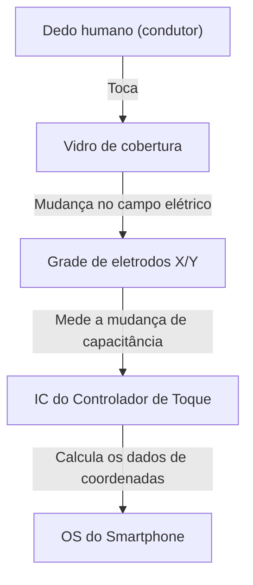

## Introdução

Na vida moderna, não há um dia em que não toquemos em um smartphone ou tablet. Tocamos, deslizamos e pinçamos a tela para obter informações. No entanto, por que uma simples placa de vidro transparente consegue detectar os movimentos dos nossos dedos de forma tão precisa e instantânea?

Neste artigo, desvendaremos a incrível engenharia por trás do funcionamento das telas sensíveis ao toque, focando especialmente na "tecnologia capacitiva projetada", que é o padrão nos smartphones atuais.

## A Evolução das Telas Sensíveis ao Toque e Seus Principais Tipos

A tecnologia de tela sensível ao toque em si não é nova. Sua história é antiga, com conceitos já existindo na década de 1960. Diversos métodos foram desenvolvidos desde então, mas os dois mais representativos são as telas "resistivas" e "capacitivas".

### Telas Resistivas (Sensíveis à Pressão)

Este é o método usado em sistemas de navegação automotiva antigos e em consoles de videogame como o Nintendo DS.
O mecanismo é muito simples: duas películas condutoras (ou vidro e película) são posicionadas com um minúsculo espaço entre elas. Quando o usuário pressiona a tela, a película superior se curva e entra em contato com a camada inferior. A mudança de voltagem causada por esse contato é lida para determinar a posição.

**Vantagens:**
- Como reage à pressão física, pode ser operada com luvas ou com uma caneta stylus.
- Baixo custo de fabricação.

**Desvantagens:**
- A sobreposição de películas reduz a transparência da tela, fazendo-a parecer mais escura.
- Por exigir pressão física, não é adequada para toques leves ou multitoque.

### Telas Capacitivas

Quase todos os smartphones modernos usam esse método capacitivo. O corpo humano tem a capacidade de armazenar eletricidade (capacitância), e essa minúscula mudança elétrica é usada para detectar a posição do dedo.

## Como Funciona a Tecnologia Capacitiva Projetada (PCAP)

Entre os métodos capacitivos, os smartphones usam uma tecnologia avançada chamada "Tecnologia Capacitiva Projetada" (Projected Capacitive Touch: PCAP).

O núcleo dessa tecnologia é uma "grade de eletrodos transparentes" espalhada por trás da tela. Geralmente, é usado um material transparente e condutor de eletricidade chamado ITO (Óxido de Índio-Estanho).

### Estrutura da Grade de Eletrodos

Abaixo da tela, os eletrodos verticais (eixo Y) e horizontais (eixo X) estão dispostos em camadas. Uma tensão minúscula é constantemente aplicada entre esses eletrodos, formando uma linha de base de "capacitância" constante nos pontos de interseção.

### O que acontece quando o dedo toca?

1. **Perturbação do campo elétrico:** O corpo humano contém muita água e conduz eletricidade. Quando o dedo se aproxima (ou toca) a superfície do vidro, o próprio dedo começa a funcionar como parte de um capacitor (componente que armazena eletricidade).
2. **Movimento de carga elétrica:** Uma pequena quantidade de carga elétrica é atraída para o dedo a partir dos eletrodos próximos à interseção onde o dedo se aproximou.
3. **Redução da capacitância:** Isso causa uma redução (mudança) local na capacitância armazenada entre os eletrodos dos eixos X e Y.
4. **Identificação das coordenadas:** O controlador rastreia em qual interseção das linhas X e Y ocorreu essa mudança e calcula as coordenadas precisas (X, Y).

## Multitoque: Como distinguir vários dedos?

Quando o primeiro iPhone foi lançado em 2007, o que surpreendeu o mundo foi a função multitoque de "pinch-in / pinch-out" (ampliar e reduzir com dois dedos). O que tornou isso possível foi o método de medição chamado "Capacitância Mútua" (Mutual Capacitance).

Na tecnologia capacitiva de superfície convencional, a tensão era aplicada a partir dos quatro cantos de toda a tela, e a posição era calculada pela proporção da corrente quando o dedo tocava. No entanto, se dois ou mais pontos fossem tocados simultaneamente, ocorriam "fantasmas" (interseções inexistentes) entre eles, impossibilitando a determinação precisa da posição.

Por outro lado, na capacitância mútua, os sinais de pulso são enviados sequencialmente das linhas do eixo X para as linhas do eixo Y, e a capacitância de todas as interseções (nós) é medida **individualmente**. Por exemplo, mesmo que haja milhares de interseções em uma tela Full HD, o controlador continua escaneando toda a grade a uma velocidade de dezenas a centenas de vezes por segundo. Devido a isso, mesmo que não apenas dois, mas dez dedos toquem simultaneamente, a posição de cada um pode ser identificada de forma independente e precisa.

## Processamento de Sinais e a Batalha contra o Ruído

O fato de a grade de eletrodos detectar fisicamente um dedo não garante uma experiência operacional suave. O painel de toque está constantemente exposto a vários "ruídos".

- **Ruído da tela:** O próprio LCD ou OLED opera em altas velocidades, gerando forte ruído elétrico.
- **Ruído ambiental:** Ruído de carregadores e ondas eletromagnéticas circundantes.
- **Toques não intencionais:** A palma da mão tocando a tela ou gotas de água caindo sobre ela.

Para resolver isso, está equipado com um "IC do Controlador de Toque" avançado. O controlador utiliza filtros de hardware e algoritmos avançados (software) para extrair apenas o sinal de um toque puro do dedo. O uso de algoritmos de aprendizado de máquina para evitar o mau funcionamento causado por gotas de água ou para distinguir uma caneta stylus de um dedo também se tornou comum.

## Tecnologia In-Cell: Rumo a um Design Ainda Mais Fino

Nos últimos anos, as tecnologias de tela e painel de toque se fundiram ainda mais, e tecnologias conhecidas como "In-Cell" e "On-Cell" tornaram-se o padrão.

No passado, uma camada separada de sensor de toque (vidro ou película) era colada sobre a camada do display. No entanto, com a tecnologia In-Cell, os eletrodos do sensor de toque são integrados diretamente dentro dos pixels do LCD ou OLED.

Isso gerou os seguintes benefícios:
- **Mais fino e leve:** Com menos camadas extras, todo o dispositivo se torna mais fino.
- **Melhor visibilidade:** Menos camadas refletivas de luz significam que a tela parece mais nítida.
- **Sensação de operação direta:** Como a distância física entre o dedo e o elemento de exibição é reduzida, parece que você está tocando diretamente nos pixels.

## Conclusão

Abaixo da tela do smartphone que tocamos casualmente, existe um mundo incrível de engenharia eletrônica, onde uma grade de eletrodos transparentes é espalhada e escaneia mudanças na capacitância centenas de vezes por segundo.

Da evolução das telas resistivas para as capacitivas, à realização do multitoque e à extrema redução de espessura com a tecnologia In-Cell. A história das telas sensíveis ao toque é a própria evolução da Interface Homem-Máquina (HMI).

Da próxima vez que você rolar a tela do seu smartphone, dedique um momento para pensar no movimento dos minúsculos elétrons na ponta do seu dedo e no IC do controlador trabalhando duro nos bastidores para remover ruídos e calcular coordenadas.
