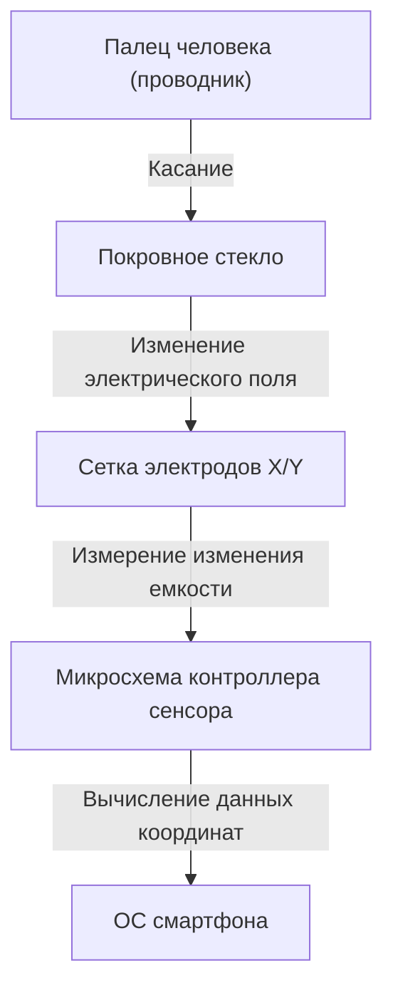

## Введение

В современной жизни не проходит и дня, чтобы мы не прикасались к смартфону или планшету. Мы нажимаем, свайпаем и растягиваем экран для получения информации. Однако почему простая прозрачная стеклянная панель может так точно и мгновенно определять движения наших пальцев?

В этой статье мы раскроем удивительную инженерию, лежащую в основе работы сенсорных экранов, уделив особое внимание «проекционно-емкостной технологии», которая является стандартом в современных смартфонах.

## Эволюция сенсорных экранов и их основные типы

Сама технология сенсорных экранов не является новой. Ее история уходит корнями в прошлое, а концепции существовали еще в 1960-х годах. С тех пор было разработано несколько методов, но двумя наиболее представительными являются «резистивные» (чувствительные к давлению) и «емкостные» экраны.

### Резистивные экраны (чувствительные к давлению)

Этот метод использовался в старых автомобильных навигационных системах и игровых консолях, таких как Nintendo DS.
Механизм очень прост: две проводящие пленки (или стекло и пленка) расположены с крошечным зазором между ними. Когда пользователь нажимает на экран, верхняя пленка изгибается и вступает в контакт с нижним слоем. Изменение напряжения, вызванное этим контактом, считывается для определения положения.

**Преимущества:**
- Поскольку он реагирует на физическое давление, им можно управлять в перчатках или с помощью стилуса.
- Низкая стоимость производства.

**Недостатки:**
- Наложение пленок снижает прозрачность экрана, из-за чего он выглядит более темным.
- Поскольку требуется физическое нажатие, он не подходит для легких прикосновений или мультитач.

### Емкостные экраны

Почти все современные смартфоны используют этот емкостный метод. Человеческое тело обладает способностью накапливать электричество (емкость), и это крошечное электрическое изменение используется для определения положения пальца.

## Как работает проекционно-емкостная технология (PCAP)

Среди емкостных методов в смартфонах используется передовая технология, называемая «Проекционно-емкостная технология» (Projected Capacitive Touch: PCAP).

Основой этой технологии является «сетка прозрачных электродов», распределенная под экраном. Обычно используется прозрачный и электропроводящий материал под названием ITO (оксид индия-олова).

### Структура сетки электродов

Под экраном вертикальные (ось Y) и горизонтальные (ось X) электроды расположены слоями. Между этими электродами постоянно подается крошечное напряжение, образуя базовую линию постоянной «емкости» в точках пересечения.

### Что происходит при касании пальцем?

1. **Возмущение электрического поля:** Человеческое тело содержит много воды и проводит электричество. Когда палец приближается (или касается) поверхности стекла, сам палец начинает функционировать как часть конденсатора (компонента, накапливающего электричество).
2. **Перемещение электрического заряда:** Небольшое количество электрического заряда притягивается к пальцу от электродов вблизи пересечения, к которому приблизился палец.
3. **Уменьшение емкости:** Это вызывает локальное уменьшение (изменение) емкости, накопленной между электродами осей X и Y.
4. **Определение координат:** Контроллер отслеживает, на каком пересечении линий X и Y произошло это изменение, и вычисляет точные координаты (X, Y).

## Мультитач: как различить несколько пальцев?

Когда в 2007 году был выпущен первый iPhone, мир удивила функция мультитач "pinch-in / pinch-out" (сведение и разведение двух пальцев). Это стало возможным благодаря методу измерения, называемому «Взаимная емкость» (Mutual Capacitance).

В традиционной поверхностно-емкостной технологии напряжение подавалось с четырех углов всего экрана, а положение вычислялось по соотношению тока при касании пальцем. Однако, если коснуться двух или более точек одновременно, между ними возникали «фантомы» (несуществующие пересечения), что делало невозможным точное определение положения.

С другой стороны, при взаимной емкости импульсные сигналы последовательно посылаются от линий оси X к линиям оси Y, и емкость всех пересечений (узлов) измеряется **индивидуально**. Например, даже если на экране Full HD имеются тысячи пересечений, контроллер продолжает сканировать всю сетку со скоростью от десятков до сотен раз в секунду. Благодаря этому, даже если одновременно касаются не два, а десять пальцев, положение каждого из них можно определить независимо и точно.

## Обработка сигналов и борьба с шумом

Тот факт, что сетка электродов физически обнаруживает палец, не гарантирует плавности работы. Сенсорная панель постоянно подвергается воздействию различных «шумов».

- **Шум дисплея:** Сами ЖК- (LCD) или OLED-дисплеи работают на высоких скоростях, создавая сильный электрический шум.
- **Шум окружающей среды:** Шум от зарядных устройств и окружающие электромагнитные волны.
- **Непреднамеренные касания:** Касание экрана ладонью или падение капель воды.

Для решения этой проблемы используется усовершенствованная «Микросхема контроллера сенсора». Контроллер использует аппаратные фильтры и передовые алгоритмы (программное обеспечение) для извлечения только сигнала от чистого касания пальцем. Использование алгоритмов машинного обучения для предотвращения сбоев, вызванных каплями воды, или для того, чтобы отличить стилус от пальца, также стало обычным явлением.

## Технология In-Cell: на пути к еще более тонкому дизайну

В последние годы технологии дисплеев и сенсорных панелей слились еще больше, и стандартом стали технологии, известные как "In-Cell" и "On-Cell".

В прошлом на слой дисплея наклеивался отдельный слой сенсорного датчика (стекло или пленка). Однако с технологией In-Cell электроды сенсорного датчика интегрируются непосредственно внутрь пикселей LCD или OLED.

Это привело к следующим преимуществам:
- **Тонкость и легкость:** Благодаря меньшему количеству дополнительных слоев все устройство становится тоньше.
- **Улучшенная видимость:** Меньшее количество светоотражающих слоев означает, что экран выглядит более четким.
- **Ощущение прямого управления:** Поскольку физическое расстояние между пальцем и элементом отображения уменьшается, возникает ощущение, что вы касаетесь непосредственно пикселей.

## Заключение

Под экраном смартфона, к которому мы небрежно прикасаемся, скрывается удивительный мир электронной инженерии, где распределена сетка прозрачных электродов, сканирующая изменения емкости сотни раз в секунду.

От эволюции резистивных экранов к емкостным, реализации мультитач и до экстремального уменьшения толщины с помощью технологии In-Cell. История сенсорных экранов — это сама эволюция человеко-машинного интерфейса (HMI).

В следующий раз, когда вы будете прокручивать экран своего смартфона, найдите минутку, чтобы подумать о движении крошечных электронов на кончике вашего пальца и о микросхеме контроллера, которая усердно работает за кулисами, удаляя шум и вычисляя координаты.
