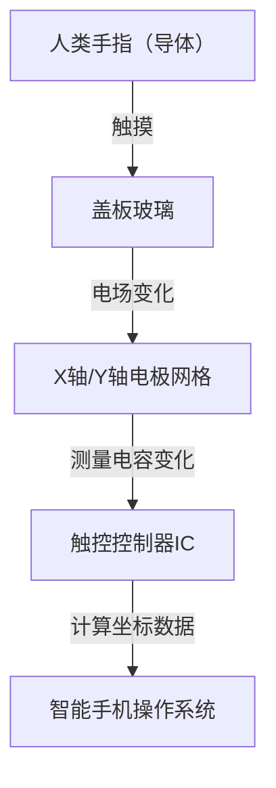

## 引言

在现代生活中，我们每天都会接触到智能手机或平板电脑。我们通过点击、滑动和双指缩放屏幕来获取信息。然而，为什么一块看似普通的透明玻璃板，却能如此精准且瞬间地检测到我们手指的运动呢？

在本文中，我们将揭开触摸屏工作原理背后令人惊叹的工程学奥秘，特别关注目前智能手机主流的“投影式电容”技术。

## 触摸屏的演变及主要技术类型

触摸屏技术本身并不新鲜。它的历史可以追溯到很久以前，早在20世纪60年代就已经有了相关概念。此后开发了几种不同的技术，但最具代表性的是“电阻式（压力感应）”和“电容式”这两大类。

### 电阻式（压力感应）

早期的汽车导航系统和任天堂DS等游戏机使用的就是这种技术。
其机制非常简单：两层导电薄膜（或玻璃与薄膜）之间留有微小的间隙。当用户按压屏幕时，上层薄膜会弯曲并与下层接触。系统通过读取这种接触引起的电压变化来确定位置。

**优点:**
- 因为是通过物理压力产生反应，所以戴着手套或使用手写笔也能操作。
- 制造成本低。

**缺点:**
- 叠加薄膜会降低屏幕的透明度，使其看起来较暗。
- 由于需要物理按压，不适合轻触或多点触控。

### 电容式

现代智能手机几乎全部采用了这种电容式（Capacitive Touch）技术。人体具有储存电荷的能力（电容），而触摸屏正是利用这种微小的电学变化来检测手指的位置。

## 投影式电容技术（PCAP）的工作原理

在电容式技术中，智能手机使用的是一种被称为“投影式电容”（Projected Capacitive Touch: PCAP）的高级技术。

这项技术的核心是布满在屏幕背后的“透明电极网格”。通常使用的是一种称为ITO（氧化铟锡）的透明导电材料。

### 电极网格结构

在屏幕下方，纵向（Y轴）电极和横向（X轴）电极分层排列。这些电极之间始终施加着微小的电压，并在交叉点处形成一个固定的“电容（储电量）”基准值。

### 当手指触摸时会发生什么？

1. **电场扰动：** 人体含有大量水分并能导电。当手指靠近（或触摸）玻璃表面时，手指本身就开始作为电容器（储存电荷的元件）的一部分发挥作用。
2. **电荷移动：** 少量的电荷会从手指靠近的交叉点附近的电极被吸引到手指一侧。
3. **电容减小：** 这导致X轴和Y轴电极之间储存的电容局部减小（变化）。
4. **确定坐标：** 控制器扫描是哪一条X线和Y线的交叉点发生了这种变化，并计算出精确的坐标（X, Y）。

## 多点触控：如何区分多个手指？

2007年第一代iPhone问世时，其“双指缩放（Pinch-in/Pinch-out）”的多点触控功能震惊了世界。使这成为可能的测量方式被称为“互电容（Mutual Capacitance）”。

在传统的表面电容式技术中，电压从整个屏幕的四个角落施加，并通过手指触摸时产生的电流比例来计算位置。然而，如果是同时触摸两个或多个点，它们之间就会产生“幽灵（不存在的交叉点）”，从而无法精确定位。

相比之下，互电容方式是依次从X轴的线路向Y轴的线路发送脉冲信号，并**单独**测量所有交叉点（节点）的电容。例如，即使全高清屏幕上有数千个交叉点，控制器也会以每秒几十次到数百次的速度持续扫描整个网格。因此，别说是两根手指，哪怕是十根手指同时触摸，也能独立且精准地掌握每个手指的位置。

## 信号处理与对抗噪声

仅仅依靠电极网格在物理上检测到手指，并不能保证流畅的操作体验。触摸面板不断面临各种“噪声”的干扰。

- **显示器噪声：** 液晶（LCD）或OLED本身在高速驱动时，会产生强烈的电磁噪声。
- **环境噪声：** 来自充电器的噪声以及周围的电磁波。
- **意外触摸：** 手掌误触屏幕，或是有水滴落在屏幕上。

为了解决这些问题，设备中搭载了高级的“触控控制器IC”。控制器利用硬件滤波器和高级算法（软件），仅提取纯粹由手指触摸产生的信号。使用机器学习算法来防止由水滴引起的误操作，或区分手写笔与手指的技术，现在也已经非常普遍。

## In-Cell技术：迈向更轻薄的设计

近年来，显示技术和触摸面板技术进一步融合，被称为“In-Cell（内嵌式）”和“On-Cell”的技术成为了主流。

过去，独立的触摸传感器层（玻璃或薄膜）是贴合在显示层之上的。但在In-Cell技术中，触摸传感器的电极被直接集成到了液晶或OLED的像素内部。

这带来了以下优势：
- **更轻薄：** 减少了额外的叠层，使整个设备变得更薄。
- **提升可视性：** 减少了光反射层，让屏幕看起来更加清晰。
- **更直接的操作感：** 由于手指与显示元件之间的物理距离拉近，让人感觉仿佛是在直接触摸像素一样。

## 总结

在我们漫不经心触摸的智能手机屏幕下方，展开着一个令人惊叹的电子工程世界：布满透明电极的网格，正以每秒数百次的速度持续扫描电容的变化。

从电阻式到电容式技术的演变，多点触控的实现，以及通过In-Cell技术达到的极致轻薄。触摸屏的发展史，正是人机界面（HMI）进化的缩影。

下次当你在智能手机上滑动屏幕时，不妨花一点时间想象一下：指尖上微小电子的运动，以及在后台努力消除噪声并计算坐标的控制器IC的存在。
