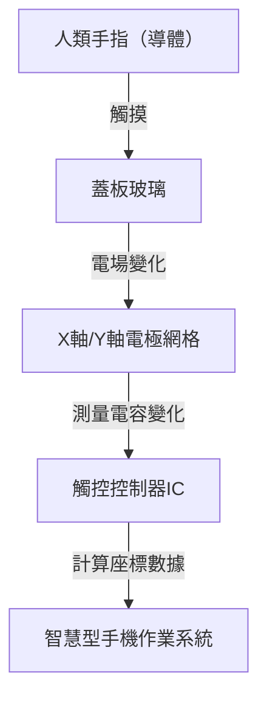

## 引言

在現代生活中，我們每天都會接觸到智慧型手機或平板電腦。我們透過點擊、滑動和雙指縮放螢幕來獲取資訊。然而，為什麼一塊看似普通的透明玻璃板，卻能如此精準且瞬間地偵測到我們手指的運動呢？

在本文中，我們將揭開觸控螢幕工作原理背後令人驚嘆的工程學奧秘，特別關注目前智慧型手機主流的「投影式電容」技術。

## 觸控螢幕的演變及主要技術類型

觸控螢幕技術本身並不新鮮。它的歷史可以追溯到很久以前，早在1960年代就已經有了相關概念。此後開發了幾種不同的技術，但最具代表性的是「電阻式（壓力感應）」和「電容式」這兩大類。

### 電阻式（壓力感應）

早期的汽車導航系統和任天堂DS等遊戲機使用的就是這種技術。
其機制非常簡單：兩層導電薄膜（或玻璃與薄膜）之間留有微小的間隙。當使用者按壓螢幕時，上層薄膜會彎曲並與下層接觸。系統透過讀取這種接觸引起的電壓變化來確定位置。

**優點:**
- 因為是透過物理壓力產生反應，所以戴著手套或使用觸控筆也能操作。
- 製造產本低。

**缺點:**
- 疊加薄膜會降低螢幕的透明度，使其看起來較暗。
- 由於需要物理按壓，不適合輕觸或多點觸控。

### 電容式

現代智慧型手機幾乎全部採用了這種電容式（Capacitive Touch）技術。人體具有儲存電荷的能力（電容），而觸控螢幕正是利用這種微小的電學變化來偵測手指的位置。

## 投影式電容技術（PCAP）的工作原理

在電容式技術中，智慧型手機使用的是一種被稱為「投影式電容」（Projected Capacitive Touch: PCAP）的高階技術。

這項技術的核心是佈滿在螢幕背後的「透明電極網格」。通常使用的是一種稱為ITO（氧化銦錫）的透明導電材料。

### 電極網格結構

在螢幕下方，縱向（Y軸）電極和橫向（X軸）電極分層排列。這些電極之間始終施加著微小的電壓，並在交叉點處形成一個固定的「電容（儲電量）」基準值。

### 當手指觸摸時會發生什麼事？

1. **電場擾動：** 人體含有大量水分並能導電。當手指靠近（或觸摸）玻璃表面時，手指本身就開始作為電容器（儲存電荷的元件）的一部分發揮作用。
2. **電荷移動：** 少量的電荷會從手指靠近的交叉點附近的電極被吸引到手指一側。
3. **電容減小：** 這導致X軸和Y軸電極之間儲存的電容局部減小（變化）。
4. **確定座標：** 控制器掃描是哪一條X線和Y線的交叉點發生了這種變化，並計算出精確的座標（X, Y）。

## 多點觸控：如何區分多個手指？

2007年第一代iPhone問世時，其「雙指縮放（Pinch-in/Pinch-out）」的多點觸控功能震驚了世界。使這成為可能的測量方式被稱為「互電容（Mutual Capacitance）」。

在傳統的表面電容式技術中，電壓從整個螢幕的四個角落施加，並透過手指觸摸時產生的電流比例來計算位置。然而，如果是同時觸摸兩個或多個點，它們之間就會產生「幽靈（不存在的交叉點）」，從而無法精準定位。

相比之下，互電容方式是依序從X軸的線路向Y軸的線路發送脈衝信號，並**單獨**測量所有交叉點（節點）的電容。例如，即使Full HD螢幕上有數千個交叉點，控制器也會以每秒幾十次到數百次的速度持續掃描整個網格。因此，別說是兩根手指，哪怕是十根手指同時觸摸，也能獨立且精準地掌握每個手指的位置。

## 訊號處理與對抗雜訊

僅僅依靠電極網格在物理上偵測到手指，並不能保證流暢的操作體驗。觸控面板不斷面臨各種「雜訊」的干擾。

- **顯示器雜訊：** 液晶（LCD）或OLED本身在高速驅動時，會產生強烈的電磁雜訊。
- **環境雜訊：** 來自充電器的雜訊以及周圍的電磁波。
- **意外觸摸：** 手掌誤觸螢幕，或是有水滴落在螢幕上。

為了解決這些問題，裝置中搭載了高階的「觸控控制器IC」。控制器利用硬體濾波器和高階演算法（軟體），僅提取純粹由手指觸摸產生的訊號。使用機器學習演算法來防止由水滴引起的誤動作，或區分觸控筆與手指的技術，現在也已經非常普遍。

## In-Cell技術：邁向更輕薄的設計

近年來，顯示技術和觸控面板技術進一步融合，被稱為「In-Cell（內嵌式）」和「On-Cell」的技術成為了主流。

過去，獨立的觸控感測器層（玻璃或薄膜）是貼合在顯示層之上的。但在In-Cell技術中，觸控感測器的電極被直接整合到了液晶或OLED的像素內部。

這帶來了以下優勢：
- **更輕薄：** 減少了額外的疊層，使整個裝置變得更薄。
- **提升可視性：** 減少了光反射層，讓螢幕看起來更加清晰。
- **更直接的操作感：** 由於手指與顯示元件之間的物理距離拉近，讓人感覺彷彿是在直接觸摸像素一樣。

## 總結

在我們漫不經心觸摸的智慧型手機螢幕下方，展開著一個令人驚嘆的電子工程世界：佈滿透明電極的網格，正以每秒數百次的速度持續掃描電容的變化。

從電阻式到電容式技術的演變，多點觸控的實現，以及透過In-Cell技術達到的極致輕薄。觸控螢幕的發展史，正是人機介面（HMI）進化的縮影。

下次當你在智慧型手機上滑動螢幕時，不妨花一點時間想像一下：指尖上微小電子的運動，以及在後台努力消除雜訊並計算座標的控制器IC的存在。
