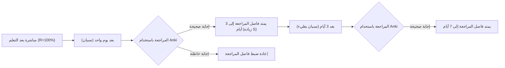
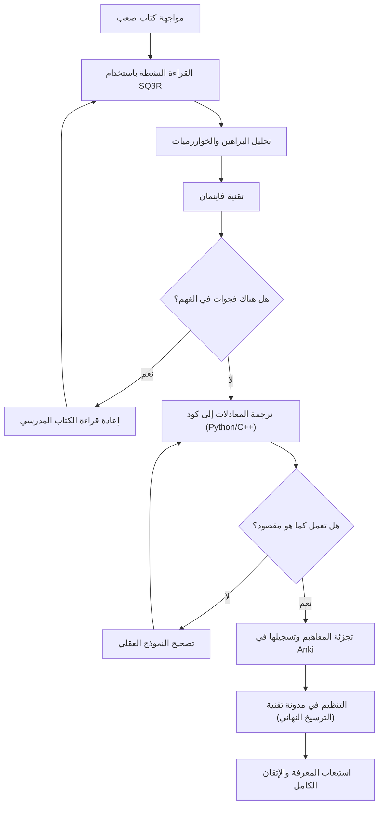

كجزء من مساعينا لتحسين مهاراتنا كمهندسين أو باحثين، سنواجه حتماً عقبة "الكتب التقنية الصعبة". خاصة الكتب المتعلقة بالرياضيات، الخوارزميات، وعلوم الحاسوب النظرية، حيث تختلف طبيعتها تماماً عن كتب البرمجة التمهيدية المعتادة. ليس قليلاً عدد الأشخاص الذين عانوا من الإحباط بسبب سلسلة المعادلات الرياضية، المفاهيم المجردة، والمسافات الواسعة بين السطور التي تُرفض عادةً بعبارة "بديهية".

ولكن، هذه المعارف الصعبة بالذات هي التي تشكل "الأساس" الجوهري الذي لا يصبح قديماً بمرور الزمن. في هذه المقالة، وبناءً على العلوم المعرفية ونظريات التعلم، سنشرح بالتفصيل طريقة شاملة (SQ3R، تقنية فاينمان، التكرار المتباعد، البرمجة، كتابة المدونات) لقراءة وفهم الكتب التقنية في الرياضيات والخوارزميات بفعالية، وترسيخها في الدماغ، واستيعابها كجزء من خبراتك.

---

## 1. لماذا لا يمكننا "قراءة" الكتب التقنية في الرياضيات والخوارزميات؟

أولاً، دعونا نحلل لماذا تعتبر قراءة مثل هذه الكتب أمراً صعباً. الأسباب الرئيسية هي الثلاثة التالية:

1. **كثافة المعلومات عالية جداً (Information Density)**
   في الكتب التجارية أو التقنية العادية، يمكنك فهم الفكرة العامة حتى من خلال القراءة السريعة. ولكن في كتب الرياضيات، "التعريف"، "التمهيدية"، و"النظرية" لها معنى في كل كلمة وكل حرف، وتفويت رمز واحد فقط قد يؤدي إلى انهيار المنطق بالكامل.
2. **المسافات الواسعة بين السطور (Missing Intermediate Steps)**
   بسبب قيود المساحة على الورق، أو بناءً على افتراض أن "القارئ يجب أن يكون قادراً على القيام بهذا القدر من التحويلات الرياضية بنفسه"، غالباً ما يحذف المؤلفون الخطوات الحسابية المتوسطة في البراهين. إذا لم تقم بعملية ملء هذه "الفراغات بين السطور" بنفسك (قراءة ما بين السطور)، فلن يتقدم فهمك على الإطلاق.
3. **مستوى التجريد عالٍ (High Level of Abstraction)**
   نظراً لأنه يتم الحديث عن مساحة بـ $n$ بُعد أو عن أي رسم بياني $G=(V, E)$ دون أمثلة ملموسة، فإنه يتطلب عبئاً معرفياً هائلاً لبناء نموذج عقلي مرئي وملموس في الدماغ.

للتغلب على هذه الصعوبات، من الضروري تغيير أسلوب القراءة بشكل جذري من "القراءة السلبية (مجرد تتبع الحروف)" إلى "القراءة النشطة (إعادة بناء المعرفة مع وضع عبء على الدماغ)".

---

## 2. طرق القراءة النشطة: SQ3R وتقنية فاينمان

### 2.1 طريقة SQ3R لكتب الرياضيات

SQ3R هي طريقة قراءة اقترحها عالم النفس التربوي الأمريكي فرانسيس ب. روبنسون. سنقوم بتطبيقها خصيصاً على كتب الرياضيات والخوارزميات.

- **الاستعراض (Survey)**: أولاً، تصفح الفصل بأكمله للتعرف على "الأسس الموجودة" و"ما الذي نحاول إثباته في النهاية". انظر إلى الغابة قبل أن تنظر إلى الشجرة.
- **التساؤل (Question)**: بمجرد قراءة النظرية، اسأل نفسك: "لماذا هذا الشرط ضروري؟" و"ماذا سيحدث إذا لم يكن هذا القيد موجوداً؟".
- **القراءة (Read)**: اقرأ البرهان فعلياً. القلم والدفتر ضروريان هنا. أعد بناء التحويلات الرياضية المحذوفة بيدك.
- **التسميع (Recite)**: أغلق الكتاب، وحاول أن تشرح بكلماتك الخاصة النظرية أو آلية الخوارزمية التي قرأتها للتو.
- **المراجعة (Review)**: استخدم التكرار المتباعد (Spaced Repetition) الموضح لاحقاً لترسيخ ما تعلمته في الذاكرة طويلة المدى.

### 2.2 تقنية فاينمان

تعتمد طريقة التعلم هذه، التي سميت على اسم الفيزيائي ريتشارد فاينمان، على مبدأ أنك "إذا لم تفهم شيئاً، فلا يمكنك شرحه ببساطة".

1. اكتب المفهوم الذي تريد تعلمه في أعلى الورقة.
2. اكتب هذا المفهوم بكلمات بسيطة كما لو كنت تعلمه "لطالب في المدرسة الإعدادية (أو بطة مطاطية)".
3. الأجزاء التي تتعثر فيها أو تلجأ فيها إلى المصطلحات التقنية هي "الفجوات في الفهم".
4. عد إلى الكتاب المدرسي وراجع تلك الأجزاء.

من الخطير جداً أن تشعر بأنك تفهم فقط من خلال سلسلة من المعادلات. لا يمكننا أن نطلق عليه الفهم الحقيقي إلا عندما تتمكن من شرح "الحدس الفيزيائي" أو "سلوك الخوارزمية" الذي تعنيه المعادلات باللغة الطبيعية.

---

## 3. محاربة منحنى النسيان: أنظمة التكرار المتباعد (SRS) و Anki

تتلاشى الذاكرة البشرية بشكل أسي مع مرور الوقت. تُعرف هذه الظاهرة باسم **منحنى النسيان لإبنجهاوس**، ويمكن نمذجة معدل الاحتفاظ بالذاكرة $R$ كحل للمعادلة التفاضلية التالية:

$$ R = e^{-\frac{t}{S}} $$

حيث $t$ هو الوقت المنقضي، و $S$ هو قوة الذاكرة (Strength of memory). مع كل مراجعة، تزداد قيمة $S$ ويتباطأ معدل النسيان.

النظام البرمجي الذي يحسن هذه الخاصية هو نظام التكرار المتباعد (Spaced Repetition System: SRS) مثل **Anki**.



### 3.1 كيفية إنشاء بطاقات Anki للرياضيات والخوارزميات

في حفظ الكتب التقنية، "حفظ البراهين الطويلة عن ظهر قلب" لا معنى له. قسّم المعرفة إلى أصغر وحدات (Atomic) وقم بتحويلها إلى بطاقات.

- **بطاقة سيئة**: "اكتب برهان خوارزمية ديكسترا بالكامل"
- **بطاقة جيدة**: "في خوارزمية ديكسترا، ما هو الشرط لاعتبار المسافة الأقصر لعقدة معينة مؤكدة؟" ← "عند اختيار العقدة ذات المسافة المؤقتة الأصغر من بين مجموعة العقد غير المؤكدة."
- **بطاقة جيدة**: "أجب بصيغة مبرهنة فيرما الصغرى الرياضية" ← "بالنسبة لعدد أولي $p$ وعدد صحيح $a$ أوليان نسبياً، $a^{p-1} \equiv 1 \pmod p$"

عند تذكر المعادلات، من الفعال تسجيلها في Anki بصيغة LaTeX واستخدام أسئلة ملء الفراغات (Cloze Deletion).

---

## 4. اختبار الفهم الأقوى: "برمجة" المعادلات

أقوى طريقة للتحقق مما إذا كنت قد فهمت الرياضيات أو الخوارزميات حقاً هي **"ترجمة المعادلات والبراهين إلى برامج تعمل فعلياً (مثل Python أو C++)"**.

في عالم الرياضيات، ينتهي الأمر عندما يتم إثبات "وجوده"، ولكن من أجل برمجته، يجب الخوض في تفاصيل "كيفية حساب القيم المحددة"، مما يرفع دقة الفهم إلى أقصى حد.

هنا سنرى عملية تحويل المعادلات إلى كود من خلال مثالين محددين.

### 4.1 المثال الأول: رياضيات تشفير RSA وتطبيقه بلغة Python

يعد تشفير RSA، وهو ممثل لتشفير المفتاح العام، تطبيقاً جميلاً لنظرية الأعداد الأولية (التطابق، نظرية أويلر، خوارزمية إقليدس الممتدة).

#### الخلفية الرياضية
يتم التعبير عن عمليات توليد المفاتيح والتشفير وفك التشفير في RSA بالمعادلات التالية.

1. **توليد المفاتيح**:
   اختر عددين أوليين كبيرين $p, q$، وضع $n = pq$.
   احسب دالة مؤشر أويلر $\phi(n) = (p-1)(q-1)$.
   اختر مفتاحاً عاماً $e$ يكون أولياً نسبياً مع $\phi(n)$.
   أوجد مفتاحاً سرياً $d$ يحقق $e \cdot d \equiv 1 \pmod{\phi(n)}$.

2. **التشفير**:
   بالنسبة للنص الواضح $m$، يتم حساب النص المشفر $c$ كما يلي:
   $$ c \equiv m^e \pmod n $$

3. **فك التشفير**:
   يتم استعادة النص الواضح $m$ من النص المشفر $c$ كما يلي:
   $$ m \equiv c^d \pmod n $$

الخلفية وراء عمل فك التشفير هذا بشكل صحيح هي نظرية أويلر $a^{\phi(n)} \equiv 1 \pmod n$. تستمر البراهين لعدة صفحات في كتب الرياضيات، لكن دعونا نبرمجها بلغة Python.

#### التطبيق بلغة Python

```python
import random
from math import gcd

# خوارزمية إقليدس الممتدة
# ترجع (x, y, gcd) التي تحقق ax + by = gcd(a, b)
def extended_gcd(a, b):
    if a == 0:
        return (b, 0, 1)
    else:
        g, y, x = extended_gcd(b % a, a)
        return (g, x - (b // a) * y, y)

# المعكوس الضربي المعياري: نوجد x بحيث ax ≡ 1 (mod m)
def mod_inverse(a, m):
    g, x, y = extended_gcd(a, m)
    if g != 1:
        raise Exception('المعكوس الضربي المعياري غير موجود')
    else:
        return x % m

# عرض RSA
def rsa_demo():
    # 1. توليد الأعداد الأولية (في الواقع تُستخدم أعداد أولية ضخمة جداً)
    p, q = 61, 53
    n = p * q
    phi = (p - 1) * (q - 1)

    # 2. اختيار المفتاح العام e
    e = 17
    assert gcd(e, phi) == 1

    # 3. حساب المفتاح السري d
    d = mod_inverse(e, phi)

    print(f"المفتاح العام: (e={e}, n={n})")
    print(f"المفتاح السري: (d={d}, n={n})")

    # التشفير
    m = 65  # النص الواضح
    c = pow(m, e, n)  # c = m^e mod n
    print(f"النص الواضح: {m} -> بعد التشفير: {c}")

    # فك التشفير
    decrypted_m = pow(c, d, n)  # m = c^d mod n
    print(f"بعد فك التشفير: {decrypted_m}")

rsa_demo()
```

لإيجاد $d$ الذي يحقق المعادلة $e \cdot d \equiv 1 \pmod{\phi(n)}$، من الضروري برمجة خوارزمية تسمى خوارزمية إقليدس الممتدة. بهذه الطريقة، **عند محاولة برمجة معادلة رياضية، ستواجه تحديات في التنفيذ مثل "كيف أقوم بحساب هذا المتغير بالتحديد؟"، ومن خلال حل هذه المشكلة، يتعمق فهمك الرياضي بشكل كبير.**

### 4.2 المثال الثاني: خوارزمية ديكسترا والتخفيف (Relaxation)

ننظر في خوارزمية ديكسترا لحل مشكلة أقصر مسار من مصدر واحد (SSSP) في نظرية المخططات.

الجوهر الرياضي والخوارزمي هو عملية تسمى "التخفيف" (Relaxation).
عندما يكون هناك حافة بوزن $w(u, v)$ من العقدة $u$ إلى العقدة $v$، يتم تحديث المسافة الأقصر المؤقتة $d[v]$ إلى العقدة $v$ باستخدام المعادلة التالية:

$$ d[v] \leftarrow \min(d[v], d[u] + w(u, v)) $$

سنقوم بتنفيذ هذه العملية الرياضية كخوارزمية فعالة باستخدام `std::priority_queue` في C++.

```cpp
#include <iostream>
#include <vector>
#include <queue>

using namespace std;

const int INF = 1e9;

// بنية لتمثيل الحافة
struct Edge {
    int to;
    int weight;
};

void dijkstra(int start, const vector<vector<Edge>>& graph) {
    int n = graph.size();
    vector<int> dist(n, INF);
    // زوج من {المسافة، العقدة}. لتتمكن من استخراج المسافة الأقل أولاً
    priority_queue<pair<int, int>, vector<pair<int, int>>, greater<pair<int, int>>> pq;

    dist[start] = 0;
    pq.push({0, start});

    while (!pq.empty()) {
        auto [current_dist, u] = pq.top();
        pq.pop();

        // إذا تم العثور بالفعل على مسار أقصر، يتم التخطي
        if (current_dist > dist[u]) continue;

        // تنفيذ التخفيف (Relaxation)
        for (const auto& edge : graph[u]) {
            int v = edge.to;
            int weight = edge.weight;

            // تحديث إذا كان d[v] > d[u] + w(u, v)
            if (dist[v] > dist[u] + weight) {
                dist[v] = dist[u] + weight;
                pq.push({dist[v], v});
            }
        }
    }

    for (int i = 0; i < n; ++i) {
        cout << "المسافة الأقصر إلى العقدة " << i << ": " << dist[i] << "\n";
    }
}
```

يمكننا أن نرى أن التعريف الرياضي $d[v] \leftarrow \min(\dots)$ يتماشى تماماً مع الشرط `if (dist[v] > dist[u] + weight)` وعملية التحديث في الكود.

---

## 5. العملية المعرفية والصورة الكاملة للتعلم

سنلخص كيف تعمل الأساليب الموضحة حتى الآن معاً لتشكيل المعرفة في أدمغتنا، باستخدام مخطط Mermaid.



## 6. الترسيخ النهائي: المخرجات المنهجية كمدونة تقنية

المرحلة الأخيرة من التعلم هي **"كتابة مدونة تقنية موجهة لعدد غير محدد من الأشخاص"**.

إذا كان Anki أداة للحفاظ على "نقاط" المعرفة، فإن كتابة المدونات هي عملية ربط هذه النقاط معاً لتكوين "خطوط" و"أسطح".

عند كتابة مدونة، تحدث العمليات التالية:
1. **تحديد القراء**: تفترض أن القارئ هو "نفسك في الماضي الذي لم يكن قادراً على الفهم"، وتقوم بشرح أين تعثرت وكيف تمكنت من تجاوز ذلك باللغة.
2. **إنشاء الرسوم البيانية**: استخدام Mermaid أو أدوات الرسم البياني لتصوير هياكل البيانات المجردة وتحولات الحالة. هذا يعمق فهمك البصري أيضاً.
3. **ضمان الدقة**: نظراً لأنه سيتم نشره للعالم بأسره، فإنك تسأل نفسك: "هل هذا التحويل الرياضي صحيح حقاً؟" "هل سيسبب هذا التعبير سوء فهم؟"، وتقوم بالتحقق من المعلومات. تكشف هذه العملية بلا رحمة عن الأجزاء التي تفتقر إلى الفهم العميق (Micro-misunderstandings) وتجبرك على إصلاحها.

### 6.1 الأدوات التي يجب استخدامها في كتابة المدونات
- **Markdown / LaTeX**: ضروريان لكتابة المعادلات بشكل جميل.
- **Mermaid.js**: يتيح كتابة مخططات انتقال الحالة والمخططات الانسيابية برمجياً، ويوفر قابلية صيانة ممتازة.
- **GitHub / Gist**: مشاركة مقتطفات من كود الخوارزميات المنفذة حتى يتمكن القراء من تشغيلها والتحقق منها بأنفسهم.

## 7. الخلاصة: المشهد بعد التغلب على الصعوبات

إن قراءة كتب الرياضيات والكتب المتخصصة في الخوارزميات ليست بأي حال من الأحوال طريقاً سهلاً. ومع ذلك، من خلال استيعاب الهيكل باستخدام SQ3R، والتعبير عنه باللغة باستخدام تقنية فاينمان، وترجمته إلى كود للتحقق من عمله، ومنع النسيان باستخدام Anki، وأخيراً نشره للعالم من خلال مدونة تقنية؛ ستصبح هذه المعرفة الصعبة بكل تأكيد "قوة" لك.

تتقادم المعرفة السطحية حول كيفية استخدام واجهات برمجة التطبيقات (API) أو أطر العمل في غضون سنوات قليلة، لكن التفكير الرياضي وأساسيات الخوارزميات هي أصول تدوم مدى الحياة. في المرة القادمة التي تفتح فيها كتاباً تقنياً صعباً، نأمل أن تستخدم الأساليب الموضحة في هذه المقالة وتغوص في أعماق المعرفة.
