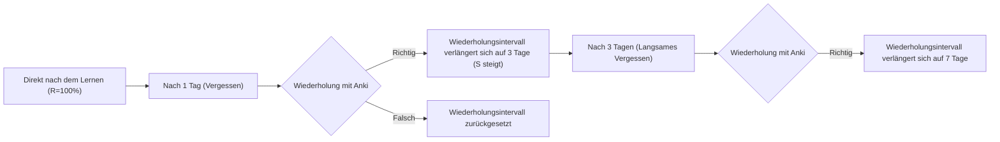
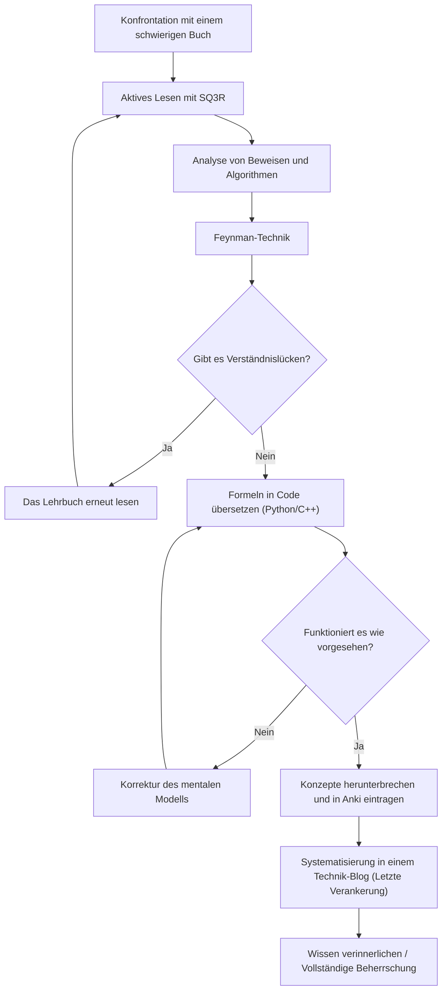

Auf dem Weg zur Weiterentwicklung unserer Fähigkeiten als Ingenieure und Forscher stoßen wir zwangsläufig auf die Hürde „anspruchsvoller Fachbücher“. Insbesondere Bücher über Mathematik, Algorithmen und theoretische Informatik unterscheiden sich grundlegend von allgemeinen Programmier-Einführungen. Nicht wenige haben bereits Frustration erlebt angesichts von aneinandergereihten Formeln, abstrakten Konzepten und den weiten Abständen zwischen den Zeilen, die allzu oft als „offensichtlich“ abgetan werden.

Aber genau dieses schwer verständliche Wissen bildet die essenzielle „Grundkompetenz“, die kaum veraltet. In diesem Artikel erklären wir detailliert eine umfassende Methode (SQ3R, Feynman-Technik, Spaced Repetition, Programmieren, Blogschreiben) basierend auf Kognitionswissenschaft und Lerntheorie, um Mathematik- und Algorithmen-Fachbücher effizient zu entschlüsseln, sie im Gehirn zu verankern und sie schließlich zu seinem eigenen Fleisch und Blut zu machen.

---

## 1. Warum sind Fachbücher über Mathematik und Algorithmen so „unlesbar“?

Lassen Sie uns zunächst analysieren, warum das Lesen solcher Bücher so schwierig ist. Die drei Hauptgründe sind:

1. **Extrem hohe Informationsdichte (Information Density)**
   Bei allgemeinen Geschäftsbüchern oder Fachbüchern können Sie die Hauptidee auch durch Überfliegen erfassen. In Mathematikbüchern jedoch hat jedes Wort in einer „Definition“, einem „Lemma“ oder einem „Theorem“ eine Bedeutung, und das Übersehen eines einzigen Symbols bringt die gesamte Logik zum Einsturz.
2. **Weite Abstände zwischen den Zeilen (Missing Intermediate Steps)**
   Aus Platzgründen oder unter der Annahme, dass „der Leser in der Lage sein sollte, diese Art von Gleichungsumformung selbst durchzuführen“, lassen Autoren häufig Zwischenschritte in Beweisen aus. Ohne die Arbeit, diese „Lücken“ selbstständig zu füllen (das Lesen zwischen den Zeilen), wird man überhaupt keine Fortschritte im Verständnis machen.
3. **Hoher Abstraktionsgrad (High Level of Abstraction)**
   Da ohne konkrete Beispiele über $n$-dimensionale Räume oder beliebige Graphen $G=(V, E)$ gesprochen wird, erfordert der Aufbau eines visuellen und konkreten mentalen Modells im Gehirn eine enorme kognitive Belastung.

Um diese Schwierigkeiten zu überwinden, ist es notwendig, den Lesestil grundlegend von „passivem Lesen“ (nur den Wörtern folgen) zu „aktivem Lesen“ (das Wissen unter kognitiver Belastung des Gehirns rekonstruieren) zu ändern.

---

## 2. Aktive Lesemethoden: SQ3R und die Feynman-Technik

### 2.1 Die SQ3R-Methode für Mathematikbücher

SQ3R ist eine Lesemethode, die vom amerikanischen Bildungspsychologen Francis P. Robinson vorgeschlagen wurde. Wir wenden diese speziell auf Bücher über Mathematik und Algorithmen an.

- **Survey (Überblick)**: Blättern Sie zunächst durch das gesamte Kapitel, um zu verstehen, „welche Theoreme es gibt“ und „was letztendlich bewiesen werden soll“. Betrachten Sie den Wald, bevor Sie die Bäume ansehen.
- **Question (Hinterfragen)**: Wenn Sie die Aussage eines Theorems lesen, fragen Sie sich selbst: „Warum ist diese Bedingung notwendig?“ und „Was würde passieren, wenn diese Einschränkung nicht bestünde?“.
- **Read (Lesen)**: Lesen Sie den eigentlichen Beweis. Hier sind Stift und Notizbuch unerlässlich. Reproduzieren Sie die ausgelassenen Gleichungsumformungen mit der eigenen Hand.
- **Recite (Wiedergeben/Verbalisieren)**: Schließen Sie das Buch und versuchen Sie, das soeben gelesene Theorem oder die Funktionsweise des Algorithmus in Ihren eigenen Worten zu erklären.
- **Review (Überprüfen)**: Verwenden Sie die später beschriebene verteilte Wiederholung (Spaced Repetition), um das Gelernte im Langzeitgedächtnis zu verankern.

### 2.2 Die Feynman-Technik

Diese Lernmethode, benannt nach dem Physiker Richard Feynman, basiert auf dem Prinzip: „Was man nicht verstanden hat, kann man nicht einfach erklären.“

1. Schreiben Sie das Konzept, das Sie lernen möchten, oben auf ein Blatt Papier.
2. Schreiben Sie das Konzept in einfachen Worten auf, als ob Sie es einem „Achtklässler (oder einer Quietscheente)“ beibringen würden.
3. Die Stellen, an denen Sie stecken bleiben oder auf Fachjargon zurückgreifen müssen, sind Ihre „Wissenslücken“.
4. Kehren Sie zum Lehrbuch zurück und wiederholen Sie diese Abschnitte.

Es ist sehr gefährlich, das Gefühl zu haben, etwas verstanden zu haben, nur weil man eine Reihe von Formeln betrachtet. Erst wenn Sie die „physische Intuition“ oder das „Verhalten des Algorithmus“, das die Formel impliziert, in natürlicher Sprache erklären können, können Sie es als wahres Verständnis bezeichnen.

---

## 3. Der Vergessenskurve trotzen: Spaced Repetition Systeme (SRS) und Anki

Das menschliche Gedächtnis verfällt im Laufe der Zeit exponentiell. Dieses Phänomen ist als **Ebbinghaus'sche Vergessenskurve** bekannt, und die Behaltensrate $R$ des Gedächtnisses kann oft als Lösung der folgenden Differentialgleichung modelliert werden:

$$ R = e^{-\frac{t}{S}} $$

Hierbei ist $t$ die verstrichene Zeit und $S$ die Gedächtnisstärke (Strength of memory). Mit jeder Wiederholung wird $S$ größer, und die Geschwindigkeit des Vergessens verlangsamt sich.

Diese Eigenschaft wurde in Software durch verteilte Wiederholungssysteme (Spaced Repetition Systems: SRS) wie **Anki** optimiert.



### 3.1 Wie man Anki-Karten für Mathematik und Algorithmen erstellt

Beim Auswendiglernen von Fachbüchern ist es sinnlos, „lange Beweise auswendig zu lernen“. Unterteilen Sie das Wissen in kleinste Einheiten (atomar) und erstellen Sie daraus Karten.

- **Schlechte Karte**: „Schreibe den gesamten Beweis für den Dijkstra-Algorithmus auf.“
- **Gute Karte**: „Unter welcher Bedingung kann die kürzeste Distanz zu einem bestimmten Knoten im Dijkstra-Algorithmus als endgültig betrachtet werden?“ → „Wenn der Knoten mit der geringsten vorläufigen Distanz aus der Menge der noch nicht festgelegten Knoten ausgewählt wird.“
- **Gute Karte**: „Wie lautet die Formel für den kleinen Satz von Fermat?“ → „Für eine Primzahl $p$ und eine dazu teilerfremde ganze Zahl $a$ gilt: $a^{p-1} \equiv 1 \pmod p$.“

Beim Auswendiglernen von Formeln ist es effektiv, sie im LaTeX-Format in Anki einzugeben und Lückentexte (Cloze Deletion) zu verwenden.

---

## 4. Der ultimative Verständnis-Test: Formeln „programmieren“

Die effektivste Methode, um zu überprüfen, ob Sie Mathematik oder Algorithmen wirklich verstanden haben, besteht darin, **„Formeln und Beweise in tatsächlich funktionierende Programme (wie Python oder C++) zu übersetzen“**.

In der Welt der Mathematik reicht es aus zu beweisen, dass etwas „existiert“, aber um es zu programmieren, müssen Sie sich damit auseinandersetzen, „wie konkrete Werte berechnet werden“, was die Tiefe Ihres Verständnisses extrem erhöht.

Lassen Sie uns anhand von zwei konkreten Beispielen den Prozess der Umsetzung von Formeln in Code betrachten.

### 4.1 Beispiel 1: Die Mathematik der RSA-Verschlüsselung und ihre Python-Implementierung

Die RSA-Verschlüsselung, ein repräsentatives Public-Key-Kryptosystem, ist eine wunderschöne Anwendung der elementaren Zahlentheorie (Kongruenzen, Satz von Euler, erweiterter euklidischer Algorithmus).

#### Mathematischer Hintergrund

Die Prozesse der Schlüsselerzeugung, Verschlüsselung und Entschlüsselung in der RSA-Verschlüsselung werden durch die folgenden Formeln ausgedrückt:

1. **Schlüsselerzeugung**:
   Wählen Sie zwei große Primzahlen $p, q$ und berechnen Sie $n = pq$.
   Berechnen Sie die Eulersche Phi-Funktion $\phi(n) = (p-1)(q-1)$.
   Wählen Sie einen öffentlichen Schlüssel $e$, der teilerfremd zu $\phi(n)$ ist.
   Bestimmen Sie den privaten Schlüssel $d$, sodass $e \cdot d \equiv 1 \pmod{\phi(n)}$ gilt.

2. **Verschlüsselung**:
   Für den Klartext $m$ berechnen Sie den Geheimtext $c$ wie folgt:
   $$ c \equiv m^e \pmod n $$

3. **Entschlüsselung**:
   Stellen Sie den Klartext $m$ aus dem Geheimtext $c$ wie folgt wieder her:
   $$ m \equiv c^d \pmod n $$

Der Hintergrund, warum diese Entschlüsselung korrekt funktioniert, ist der Satz von Euler $a^{\phi(n)} \equiv 1 \pmod n$. In Mathematikbüchern folgen oft mehrere Seiten mit Beweisen, aber lassen Sie uns dies in Python implementieren.

#### Implementierung in Python

```python
import random
from math import gcd

# Erweiterter euklidischer Algorithmus
# Gibt (x, y, gcd) zurück, sodass ax + by = gcd(a, b)
def extended_gcd(a, b):
    if a == 0:
        return (b, 0, 1)
    else:
        g, y, x = extended_gcd(b % a, a)
        return (g, x - (b // a) * y, y)

# Modulares Inverses: Bestimmt x, sodass ax ≡ 1 (mod m)
def mod_inverse(a, m):
    g, x, y = extended_gcd(a, m)
    if g != 1:
        raise Exception('Modulares Inverses existiert nicht')
    else:
        return x % m

# RSA Demo
def rsa_demo():
    # 1. Primzahlengenerierung (In der Praxis verwendet man sehr große Primzahlen)
    p, q = 61, 53
    n = p * q
    phi = (p - 1) * (q - 1)

    # 2. Auswahl des öffentlichen Schlüssels e
    e = 17
    assert gcd(e, phi) == 1

    # 3. Berechnung des privaten Schlüssels d
    d = mod_inverse(e, phi)

    print(f"Öffentlicher Schlüssel: (e={e}, n={n})")
    print(f"Privater Schlüssel: (d={d}, n={n})")

    # Verschlüsselung
    m = 65  # Klartext
    c = pow(m, e, n)  # c = m^e mod n
    print(f"Klartext: {m} -> Verschlüsselt: {c}")

    # Entschlüsselung
    decrypted_m = pow(c, d, n)  # m = c^d mod n
    print(f"Entschlüsselt: {decrypted_m}")

rsa_demo()
```

Um $d$ zu finden, das die Formel $e \cdot d \equiv 1 \pmod{\phi(n)}$ erfüllt, muss ein Algorithmus namens erweiterter euklidischer Algorithmus implementiert werden. Auf diese Weise stehen Sie beim **Versuch, Formeln in Code umzusetzen, vor der implementierungsspezifischen Herausforderung: „Wie berechnet man diese Variable genau?“. Der Prozess zur Lösung dieser Herausforderung vertieft das mathematische Verständnis enorm**.

### 4.2 Beispiel 2: Dijkstra-Algorithmus und Relaxation (Entspannung)

Betrachten wir den Dijkstra-Algorithmus, der das Problem des kürzesten Pfades von einem Startknoten (Single-Source Shortest Path, SSSP) in der Graphentheorie löst.

Der mathematische und algorithmische Kern ist eine Operation namens „Relaxation“.
Wenn es eine Kante mit dem Gewicht $w(u, v)$ vom Knoten $u$ zum Knoten $v$ gibt, wird die vorläufige kürzeste Distanz $d[v]$ zum Knoten $v$ durch folgende Formel aktualisiert:

$$ d[v] \leftarrow \min(d[v], d[u] + w(u, v)) $$

Wir implementieren diese mathematische Operation als einen effizienten Algorithmus unter Verwendung von `std::priority_queue` in C++.

```cpp
#include <iostream>
#include <vector>
#include <queue>

using namespace std;

const int INF = 1e9;

// Struktur zur Repräsentation einer Kante
struct Edge {
    int to;
    int weight;
};

void dijkstra(int start, const vector<vector<Edge>>& graph) {
    int n = graph.size();
    vector<int> dist(n, INF);
    // Paar von {Distanz, Knoten}. Sortiert, sodass die geringste Distanz zuerst entnommen wird
    priority_queue<pair<int, int>, vector<pair<int, int>>, greater<pair<int, int>>> pq;

    dist[start] = 0;
    pq.push({0, start});

    while (!pq.empty()) {
        auto [current_dist, u] = pq.top();
        pq.pop();

        // Überspringen, wenn bereits ein kürzerer Pfad gefunden wurde
        if (current_dist > dist[u]) continue;

        // Ausführung der Relaxation
        for (const auto& edge : graph[u]) {
            int v = edge.to;
            int weight = edge.weight;

            // Aktualisieren, wenn d[v] > d[u] + w(u, v)
            if (dist[v] > dist[u] + weight) {
                dist[v] = dist[u] + weight;
                pq.push({dist[v], v});
            }
        }
    }

    for (int i = 0; i < n; ++i) {
        cout << "Kürzeste Distanz zum Knoten " << i << ": " << dist[i] << "\n";
    }
}
```

Sie können sehen, wie die mathematische Definition $d[v] \leftarrow \min(\dots)$ perfekt auf die bedingte Verzweigung `if (dist[v] > dist[u] + weight)` und den Aktualisierungsprozess im Code abgebildet wird.

---

## 5. Das kognitive Modell und das Gesamtbild des Lernens

Wir werden ein Mermaid-Diagramm verwenden, um zu veranschaulichen, wie die bisher erklärten Methoden zusammenwirken, um Wissen in unserem Gehirn zu formen.



## 6. Die ultimative Verankerung: Systematischer Output in Form eines Technik-Blogs

Die letzte Phase des Lernens ist **„das Schreiben eines Technik-Blogs für ein breites Publikum“**.

Wenn Anki ein Werkzeug ist, um Wissens-„Punkte“ zu erhalten, dann ist das Blogschreiben der Prozess, diese Punkte zu „Linien“ und „Flächen“ zu verbinden.

Beim Schreiben eines Blogs treten folgende Prozesse auf:
1. **Zielgruppe definieren**: Stellen Sie sich „Ihr früheres Ich, das es nicht verstanden hat“ als Leser vor und verbalisieren Sie, wo Sie gestolpert sind und wie Sie den Durchbruch geschafft haben.
2. **Erstellen von Diagrammen**: Verwenden Sie Mermaid oder Zeichenwerkzeuge, um abstrakte Datenstrukturen und Zustandsübergänge zu visualisieren. Dies vertieft auch Ihr eigenes visuelles Verständnis.
3. **Gewährleistung der Genauigkeit**: Da es weltweit veröffentlicht wird, werden Sie sich selbst fragen: „Ist diese mathematische Herleitung wirklich richtig?“ und „Könnte dieser Ausdruck missverstanden werden?“, was Sie dazu zwingt, Fakten zu überprüfen. Dieser Prozess deckt gnadenlos Bereiche mit oberflächlichem Verständnis (Mikro-Missverständnisse) auf und zwingt Sie, diese zu beheben.

### 6.1 Werkzeuge, die beim Blogschreiben verwendet werden sollten
- **Markdown / LaTeX**: Unerlässlich, um mathematische Formeln schön darzustellen.
- **Mermaid.js**: Ermöglicht das codebasierte Schreiben von Zustandsübergangsdiagrammen und Flussdiagrammen und bietet eine hervorragende Wartbarkeit.
- **GitHub / Gist**: Um Code-Snippets von implementierten Algorithmen zu teilen, sodass Leser diese tatsächlich ausführen und überprüfen können.

## 7. Fazit: Der Ausblick nach dem Überwinden der Schwierigkeiten

Das Lesen von Fachbüchern über Mathematik und Algorithmen ist keineswegs ein einfacher Weg. Aber indem Sie den Zyklus durchlaufen, die Struktur mit SQ3R zu erfassen, mit der Feynman-Technik zu verbalisieren, in Code umzusetzen und das Verhalten zu überprüfen, das Vergessen mit Anki zu verhindern und es schließlich in einem Technik-Blog in die Welt zu tragen, wird dieses schwer verständliche Wissen definitiv zu Ihrer „Stärke“.

Oberflächliches Wissen über die Nutzung von APIs oder Frameworks veraltet in wenigen Jahren, aber mathematische Denkfähigkeiten und die Grundlagen von Algorithmen sind lebenslange Vermögenswerte. Wenn Sie das nächste Mal ein anspruchsvolles Fachbuch aufschlagen, nutzen Sie unbedingt die in diesem Artikel beschriebenen Methoden und tauchen Sie ein in die Tiefen des Wissens.
