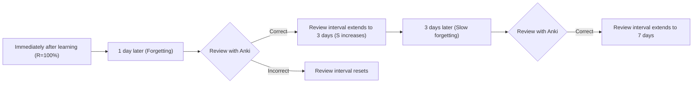
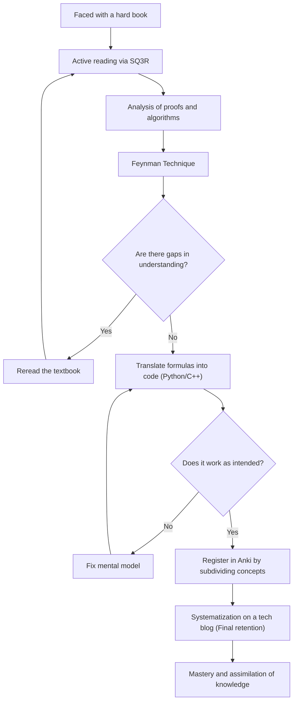

In the process of improving our skills as engineers and researchers, we inevitably hit the wall of "hard technical books". Books on mathematics, algorithms, and theoretical computer science, in particular, have completely different characteristics from general programming introductory books. Many people have likely experienced frustration due to rows of formulas, abstract concepts, and wide gaps between lines that are dismissed as "trivial".

However, it is exactly this difficult knowledge that forms the essential "fundamental strength" that does not easily become obsolete. In this article, based on cognitive science and learning theory, I will explain in detail a comprehensive method (SQ3R, Feynman Technique, Spaced Repetition, Coding, and Blogging) to efficiently read and understand technical books on mathematics and algorithms, fix them in your brain, and ultimately make them your own flesh and blood.

---

## 1. Why Can't We Read Math and Algorithm Technical Books?

First, let's analyze why it is difficult to read such books. The main factors are the following three:

1. **Extremely High Information Density**
   With general business or technical books, you can grasp the main point even by skimming. However, in math books, every single word in a "definition", "lemma", and "theorem" has a meaning, and overlooking a single symbol will collapse the entire logic.
2. **Missing Intermediate Steps (Wide Gaps Between Lines)**
   Due to space constraints, or assuming that "the reader should be able to do this level of formula transformation on their own", authors frequently omit intermediate calculations in proofs. If you do not fill in these "gaps" on your own (reading between the lines), your understanding will not progress at all.
3. **High Level of Abstraction**
   Because they discuss $n$-dimensional spaces or arbitrary graphs $G=(V, E)$ without concrete examples, it takes a massive cognitive load to build visual and concrete mental models in your brain.

To overcome these difficulties, you need to fundamentally change your reading style from "passive reading (just following the letters)" to "active reading (reconstructing knowledge while putting a load on your brain)".

---

## 2. Active Reading Methods: SQ3R and the Feynman Technique

### 2.1 The SQ3R Method for Math Books

SQ3R is a reading method advocated by American educational psychologist Francis P. Robinson. We will apply this specifically to math and algorithm books.

- **Survey**: First, flip through the whole chapter to grasp "what theorems are there" and "what is ultimately being proved". See the forest before the trees.
- **Question**: When you read the claim of a theorem, ask yourself, "Why is this condition necessary?" and "What would happen if this constraint were not there?"
- **Read**: Actually read the proof. A pen and notebook are essential here. Reproduce the omitted formula transformations by hand.
- **Recite**: Close the book and try to explain the theorem or the mechanism of the algorithm you just read in your own words.
- **Review**: Use spaced repetition, which will be described later, to fix the learned content into your long-term memory.

### 2.2 The Feynman Technique

This learning method, named after physicist Richard Feynman, is based on the principle that "you cannot simply explain what you do not understand."

1. Write the concept you want to learn at the top of a piece of paper.
2. Write out the concept in plain words, as if you were teaching an "eighth grader (or a rubber duck)".
3. The parts where you get stuck or resort to jargon represent "gaps in your understanding".
4. Go back to the textbook and review those parts.

It is very dangerous to think you understand something just from a string of formulas. It can only be called true understanding when you can explain the "physical intuition" or "behavior of the algorithm" meant by the formula in natural language.

---

## 3. Resisting the Forgetting Curve: Spaced Repetition Systems (SRS) and Anki

Human memory decays exponentially over time. This phenomenon is known as the **Ebbinghaus Forgetting Curve**, and the memory retention rate $R$ is sometimes modeled as the solution to the following differential equation:

$$ R = e^{-\frac{t}{S}} $$

Here, $t$ is the elapsed time, and $S$ is the strength of memory. As you repeat reviews, $S$ increases, and the speed of forgetting slows down.

**Anki** and other Spaced Repetition Systems (SRS) have optimized this property using software.



### 3.1 How to Create Anki Cards for Math and Algorithms

In memorizing technical books, "memorizing long proofs completely" is meaningless. Break down the knowledge into atomic units (Atomic) and turn them into cards.

- **Bad Card**: "Write the entire proof of Dijkstra's algorithm."
- **Good Card**: "In Dijkstra's algorithm, what is the condition for a vertex's shortest distance to be considered confirmed?" -> "When the vertex with the minimum provisional distance is selected from the set of unconfirmed vertices."
- **Good Card**: "State the formula for Fermat's Little Theorem." -> "For a prime $p$ and an integer $a$ coprime to $p$, $a^{p-1} \equiv 1 \pmod p$."

When memorizing formulas, it is also effective to register them in Anki in LaTeX format and utilize Cloze Deletion questions.

---

## 4. The Ultimate Comprehension Test: "Coding" Formulas

The most powerful way to verify whether you have truly understood math or an algorithm is to **"translate the formulas and proofs into a working program (such as Python or C++)"**.

In the world of mathematics, it's over once it's proved to "exist", but to code it, you must delve into "how to calculate specific values", pushing the resolution of your understanding to the limit.

Let's look at the process of dropping formulas into code through two concrete examples here.

### 4.1 Example 1: The Mathematics and Python Implementation of RSA Encryption

RSA encryption, the representative of public-key cryptography, is a beautiful application of elementary number theory (congruences, Euler's theorem, and the extended Euclidean algorithm).

#### Mathematical Background
The key generation and encryption/decryption processes of RSA encryption are represented by the following formulas.

1. **Key Generation**:
   Choose huge primes $p, q$ and let $n = pq$.
   Calculate Euler's totient function $\phi(n) = (p-1)(q-1)$.
   Choose a public key $e$ that is coprime to $\phi(n)$.
   Find a private key $d$ such that $e \cdot d \equiv 1 \pmod{\phi(n)}$.

2. **Encryption**:
   For plaintext $m$, calculate ciphertext $c$ as follows:
   $$ c \equiv m^e \pmod n $$

3. **Decryption**:
   Restore plaintext $m$ from ciphertext $c$ as follows:
   $$ m \equiv c^d \pmod n $$

The background behind why this decryption works correctly is Euler's theorem: $a^{\phi(n)} \equiv 1 \pmod n$. In math books, pages of proofs follow, but let's implement this in Python.

#### Implementation in Python

```python
import random
from math import gcd

# Extended Euclidean Algorithm
# Returns (x, y, gcd) such that ax + by = gcd(a, b)
def extended_gcd(a, b):
    if a == 0:
        return (b, 0, 1)
    else:
        g, y, x = extended_gcd(b % a, a)
        return (g, x - (b // a) * y, y)

# Modular Inverse: Finds x such that ax ≡ 1 (mod m)
def mod_inverse(a, m):
    g, x, y = extended_gcd(a, m)
    if g != 1:
        raise Exception('Modular inverse does not exist')
    else:
        return x % m

# RSA Demo
def rsa_demo():
    # 1. Prime generation (Usually, extremely large primes are used)
    p, q = 61, 53
    n = p * q
    phi = (p - 1) * (q - 1)

    # 2. Selection of public key e
    e = 17
    assert gcd(e, phi) == 1

    # 3. Calculation of private key d
    d = mod_inverse(e, phi)

    print(f"Public key: (e={e}, n={n})")
    print(f"Private key: (d={d}, n={n})")

    # Encryption
    m = 65  # Plaintext
    c = pow(m, e, n)  # c = m^e mod n
    print(f"Plaintext: {m} -> Encrypted: {c}")

    # Decryption
    decrypted_m = pow(c, d, n)  # m = c^d mod n
    print(f"Decrypted: {decrypted_m}")

rsa_demo()
```

To find $d$ satisfying the formula $e \cdot d \equiv 1 \pmod{\phi(n)}$, it is necessary to implement an algorithm called the extended Euclidean algorithm. In this way, **when you try to code a formula, you face implementation challenges like "how exactly is this variable calculated?", and in the process of solving them, your mathematical understanding deepens dramatically**.

### 4.2 Example 2: Dijkstra's Algorithm and Relaxation

Consider Dijkstra's algorithm for solving the Single-Source Shortest Path (SSSP) problem in graph theory.

The mathematical and algorithmic core is an operation called "Relaxation".
When there is an edge from vertex $u$ to vertex $v$ with weight $w(u, v)$, we update the provisional shortest distance $d[v]$ to vertex $v$ with the following formula:

$$ d[v] \leftarrow \min(d[v], d[u] + w(u, v)) $$

We implement this mathematical operation as an efficient algorithm using C++'s `std::priority_queue`.

```cpp
#include <iostream>
#include <vector>
#include <queue>

using namespace std;

const int INF = 1e9;

// Structure representing an edge
struct Edge {
    int to;
    int weight;
};

void dijkstra(int start, const vector<vector<Edge>>& graph) {
    int n = graph.size();
    vector<int> dist(n, INF);
    // Pair of {distance, vertex}. Allows extraction in ascending order of distance
    priority_queue<pair<int, int>, vector<pair<int, int>>, greater<pair<int, int>>> pq;

    dist[start] = 0;
    pq.push({0, start});

    while (!pq.empty()) {
        auto [current_dist, u] = pq.top();
        pq.pop();

        // Skip if a shorter path has already been found
        if (current_dist > dist[u]) continue;

        // Execute relaxation
        for (const auto& edge : graph[u]) {
            int v = edge.to;
            int weight = edge.weight;

            // Update if d[v] > d[u] + w(u, v)
            if (dist[v] > dist[u] + weight) {
                dist[v] = dist[u] + weight;
                pq.push({dist[v], v});
            }
        }
    }

    for (int i = 0; i < n; ++i) {
        cout << "Shortest distance to vertex " << i << ": " << dist[i] << "\n";
    }
}
```

You can see that the mathematical definition $d[v] \leftarrow \min(\dots)$ is beautifully mapped to the conditional branch and update process `if (dist[v] > dist[u] + weight)` in the code.

---

## 5. Cognitive Processes and the Big Picture of Learning

We will summarize using a Mermaid diagram how the methods explained so far collaborate to form knowledge in our brains.



## 6. Ultimate Retention: Systematic Output as a Tech Blog

The final phase of learning is **"writing a tech blog for an unspecified number of people"**.

If Anki is a tool to maintain the "dots" of knowledge, blogging is the work of connecting those dots to make "lines" and "surfaces".

When writing a blog, the following processes occur:
1. **Setting the Reader**: Imagine your "past self who couldn't understand" as the reader, and verbalize where you stumbled and how you thought to break through.
2. **Creating Illustrations**: Visualize abstract data structures and state transitions using Mermaid or drawing tools. This will deepen your own visual understanding as well.
3. **Ensuring Accuracy**: Since it will be published to the world, you will ask yourself, "Is this formula expansion really correct?" or "Will this expression cause misunderstanding?" and verify the facts. This process mercilessly exposes areas of shallow understanding (Micro-misunderstandings) and forcibly repairs them.

### 6.1 Tools to Use for Blogging
- **Markdown / LaTeX**: Essential for writing beautiful mathematical formulas.
- **Mermaid.js**: Excellent for maintainability, allowing you to write state transition diagrams and flowcharts in code.
- **GitHub / Gist**: Share code snippets of implemented algorithms so that readers can actually run and verify them.

## 7. Conclusion: The View Beyond the Hardships

Reading specialized books on mathematics and algorithms is by no means an easy path. However, by running through the cycle of grasping the structure with SQ3R, verbalizing it with the Feynman Technique, translating it into code to verify its behavior, preventing forgetting with Anki, and finally broadcasting it to the world on a tech blog, that hard-to-understand knowledge will surely become your "strength".

While superficial API usage and framework knowledge will become obsolete in a few years, mathematical thinking and algorithm fundamentals are lifelong assets. The next time you open a hard technical book, please use the methods in this article and dive into the abyss of knowledge.
